# 第九章：一个工作的 Eclipse MicroProfile 代码示例

在本章中，我们将讨论一个使用本书前面介绍的各种 MicroProfile 功能的示例应用程序。在本章中，我们将使用的 MicroProfile 运行时是 Quarkus 运行时，这是一个为 GraalVM 和 OpenJDK HotSpot 量身定制的 Kubernetes 原生 Java 堆栈，由最佳的 Java 库和标准组成。我们将要涵盖的关键主题包括以下内容：

+   应用程序和 MicroProfile 容器行为的使用配置

+   现实的健康检查

+   使用外部 JWT 安全提供程序保护应用程序

+   使用 Jaeger 实例集成并查看跟踪信息

+   使用 Swagger 检查微服务端点信息

+   查看个体...

# 技术要求

为本章，我们需要以下内容：

+   一个集成开发环境（IDE）

+   JDK 1.8+安装并配置了`JAVA_HOME`

+   Apache Maven 3.5.3+

+   一个运行中的 Docker 环境

本章的代码可以在[`github.com/PacktPublishing/Hands-On-Enterprise-Java-Microservices-with-Eclipse-MicroProfile/tree/master/Chapter08-mpcodesample`](https://github.com/PacktPublishing/Hands-On-Enterprise-Java-Microservices-with-Eclipse-MicroProfile/tree/master/Chapter08-mpcodesample)找到。

本章中的示例可以通过 GraalVM([`github.com/oracle/graal/releases/tag/vm-1.0.0-rc16`](https://github.com/oracle/graal/releases/tag/vm-1.0.0-rc16))与 Quarkus 的集成编译成原生二进制。这需要安装 1.0-RC16 版本的 Graal VM 和一个运行中的 C 开发环境，以及一个工作环境。关于生成原生镜像的详细要求，可以在[`quarkus.io/guides/building-native-image-guide`](https://quarkus.io/guides/building-native-image-guide)找到。

# 多服务 MicroProfile 应用程序的示例架构

本章我们将要介绍的示例应用程序由一个 HTML 前端、两个基于 MicroProfile 的微服务、两个我们使用 Docker 启动的外部服务以及一个我们无法控制的网络上的外部时间服务组成。我们示例应用程序的架构如下所示：

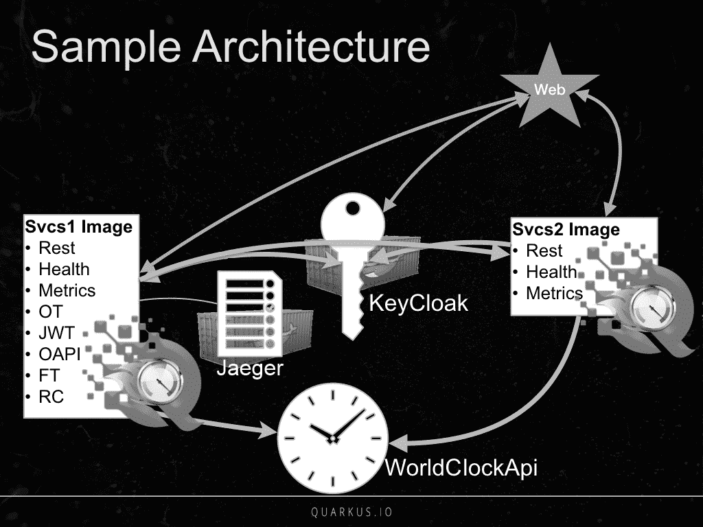

此图中的关键元素包括以下内容：

+   **Svcs1 Image**：这是一个使用 Quarkus 运行时的 REST 端点的集合，其中包括了 MP-HC、MP-Metrics、MP-OT、MP-JWT、MP-OAPI、MP-FT 和 MP-RC。

+   **Svcs2 Image**：这是一组使用...的 REST 端点集合

# 运行示例应用程序

示例应用程序设计为从四个不同的 shell 运行，让我们将它们组织成四个 shell 窗口，如图所示：

| Docker Shell | Web Shell |
| --- | --- |
| Svcs1 Shell | Svcs2 Shell |

在每一个 shell 中，运行以下相应命名的部分中概述的命令。

# Docker shell 命令

提供预配置的服务器/服务的一种常见方法是使用包含服务和所有依赖项的 Docker 镜像。在这个例子中，我们使用 Docker 来运行 KeyCloak 和 Jaeger 镜像。如果你不熟悉 Docker 或者没有安装`docker`命令，请参阅安装 Docker 的说明，针对你的平台[`docs.docker.com/v17.12/install/`](https://docs.docker.com/v17.12/install/)。

本项目依赖于 KeyCloak 生成 MP-JWT 令牌。要启动 KeyCloak Docker 容器，请在你的壳中运行以下命令：

```java
docker run -d --name keycloak -e KEYCLOAK_USER=admin -e KEYCLOAK_PASSWORD=admin -p 8180:8180 -v `pwd`/packt-mp-realm.json:/config/quarkus-packt.json -it jboss/keycloak:6.0.1 -b 0.0.0.0 ...
```

# 服务 1 壳命令

接下来，在你之前被要求打开的 Svcs1 终端窗口中，导航到项目的`svcs1`子目录，然后运行以下命令以在开发模式下执行`svcs1`镜像：

```java
mvn compile quarkus:dev
```

你将看到以下输出：

```java
Scotts-iMacPro:svcs1 starksm$ mvn compile quarkus:dev
[INFO] Scanning for projects...
...
20:56:27 INFO [io.quarkus]] (main) Quarkus 0.15.0 started in 2.492s. Listening on: http://[::]:8081
20:56:27 INFO [io.quarkus]] (main) Installed features: [cdi, jaeger, resteasy, resteasy-jsonb, security, smallrye-fault-tolerance, smallrye-health, smallrye-jwt, smallrye-metrics, smallrye-openapi, smallrye-opentracing, smallrye-rest-client, swagger-ui]
```

在输出中，我们看到这个实例正在监听`8081`端口的 HTTP 请求，并且我们看到了各种支持我们微服务特征使用的 Quarkus 特性。

# 服务 2 壳命令

接下来，在你之前被要求打开的 Svcs2 终端窗口中，切换到项目的`svcs2`子目录，然后运行以下命令以构建`svcs2`镜像：

```java
mvn clean package
```

构建完成后，要运行`svcs2` JAR，请输入以下命令：

```java
 java -jar target/sample-svcs2-runner.jar
```

你会得到以下输出：

```java
Scotts-iMacPro:svcs2 starksm$ java -jar target/sample-svcs2-runner.jar...20:58:55 INFO [io.quarkus]] (main) Quarkus 0.15.0 started in 0.936s. Listening on: http://[::]:808220:58:55 INFO [io.quarkus]] (main) Installed features: [cdi, jaeger, resteasy, resteasy-jsonb, security, smallrye-health, smallrye-jwt, smallrye-metrics, smallrye-opentracing, smallrye-rest-client]
```

在这里，我们...

# 网页壳命令

接着，在你之前被要求打开的 Web 壳终端窗口中，克隆这个项目到你的电脑，切换到`web`子目录，然后运行以下命令以在开发模式下执行 Web 应用程序：

```java
mvn clean package

```

构建完成后，要运行 Web 子项目 JAR，请输入以下命令：

```java
java -jar target/sample-web-runner.jar

```

一旦应用程序启动运行，将你的浏览器指向[`localhost:8080/index.html`](http://localhost:8080/index.html)的 Web 应用程序。在下一节中，我们将回顾 Web 应用程序的详细信息。

# 示例应用程序的详细信息

让我们详细讨论我们应用程序中的各种标签页。

# 配置标签页

应用程序的初始视图显示了配置标签页，如下面的屏幕截图所示：

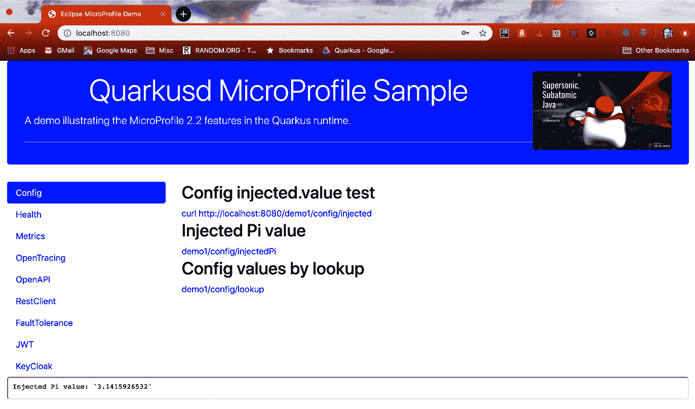

页面上的三个链接指的是`Chapter08-mpcodesample/svcs1`子项目中的`io.packt.sample.config.ConfigTestController`类中的参考端点。点击各个链接会显示 MP-Config 值。前一个屏幕截图中显示的值对应于第二个链接和`injected.piValue`配置值。以下是`Chapter08-mpcodesample/svcs1/src/main/resources/application.properties`中的相关设置：

```java
# MP Config values for ConfigTestController
injected.value=Injected value
injected.piValue=3.1415926532
lookup.value=A Lookup value
```

此处值得注意的是，通过在`ConfigTestController`中的`@ConfigProperty(name = "injected.piValue", defaultValue = "pi5=3.14159")`注解中覆盖了默认的五位数字值，设置为前一个屏幕截图中显示的完整 10 位π值。

# 健康标签页

点击应用的“健康”标签页会显示如下页面：

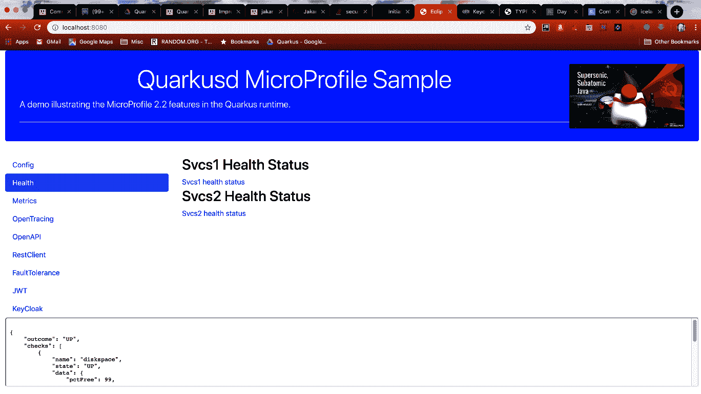

页面上的链接对应于`svcs1`和`svcs2`镜像的`health`检查端点。选择任何一个都会显示该镜像的`health`检查输出。`svcs1`镜像的`health`检查由`io.packt.sample.health.ServiceHealthCheck`和`io.packt.sample.health.CheckDiskspace`组成。此外，`ServiceHealthCheck`只是一个总是返回运行状态的模拟实现。`CheckDiskspace`健康检查程序查看使用 MP-Config `health.pathToMonitor`属性设置的路径，然后根据...设置程序状态为运行/停止。

# “指标”选项卡

“指标”选项卡显示以下包含三个链接的视图：

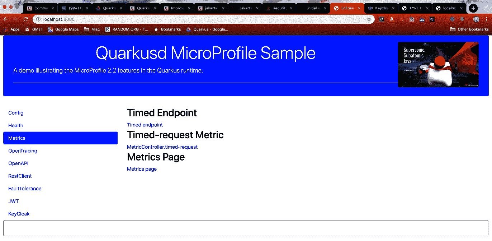

第一个链接访问`io.packt.sample.metric.MetricController`类中的以下端点：

```java
@Path("timed")
@Timed(name = "timed-request")
@GET
@Produces(MediaType.TEXT_PLAIN)
public String timedRequest() {
    long start = System.currentTimeMillis();
    // Demo, not production style
    int wait = new Random().nextInt(1000);
    try {
        Thread.sleep(wait);
    } catch (InterruptedException e) {
        // Demo
        e.printStackTrace();
    }
    long end = System.currentTimeMillis();
    long delay = end - start;

    doIncrement();
    long count = getCustomerCount();
    return String.format("MetricController#timedRequest, delay[0-1000]=%d, 
    count=%d", delay, count);
}
```

这使用`@Timed(name = "timed-request")`注解注解了`timed`路径端点。该方法使用 0-1000 毫秒之间的随机延迟生成响应时间分布。下一个链接是直接链接到`timedRequest()`方法的应用程序级指标。MP-Metrics 规范将路径定义为`metrics/application/io.packt.sample.metric.MetricController.timed-request`。在访问第一个链接生成一系列响应时间之后，通过访问第二个链接获取`timedRequest()`方法指标将显示如下：

```java
# TYPE application:io_packt_sample_metric_metric_controller_timed_request_rate_per_second gauge
application:io_packt_sample_metric_metric_controller_timed_request_rate_per_second 0.4434851530761856
# TYPE application:io_packt_sample_metric_metric_controller_timed_request_one_min_rate_per_second gauge
application:io_packt_sample_metric_metric_controller_timed_request_one_min_rate_per_second 0.552026648777594
...
# TYPE application:io_packt_sample_metric_metric_controller_timed_request_seconds summary
application:io_packt_sample_metric_metric_controller_timed_request_seconds_count 6.0
application:io_packt_sample_metric_metric_controller_timed_request_seconds{quantile="0.5"} 0.923901552
...
application:io_packt_sample_metric_metric_controller_timed_request_seconds{quantile="0.999"} 0.970502841
```

这是`@Timed`样式指标生成的信息范围。最后一个链接访问返回镜像中所有可用指标的`metrics`端点。

# “OpenTracing”选项卡

“OpenTracing”选项卡显示以下带有两个链接的视图：

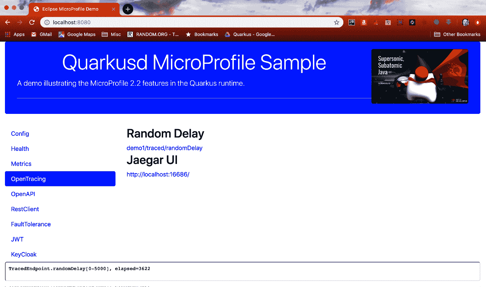

第一个链接访问以下`io.packt.sample.tracing.TracedEndpoint`方法：

```java
@GET@Path("/randomDelay")@Produces(MediaType.TEXT_PLAIN)@Traced(operationName = "TracedEndpoint#demoRandomDelay")public String randomDelay() {    long start = System.currentTimeMillis();    // 0-5 seconds random sleep    long sleep = Math.round(Math.random() * 5000);    try {        Thread.sleep(sleep);    } catch (InterruptedException e) {        e.printStackTrace();    }    long end = System.currentTimeMillis();    return String.format("TracedEndpoint.randomDelay[0-5000], elapsed=%d",     (end - start));}
```

方法...

# “OpenAPI”选项卡

“OpenAPI”选项卡视图包含两个链接，如下屏幕截图所示：

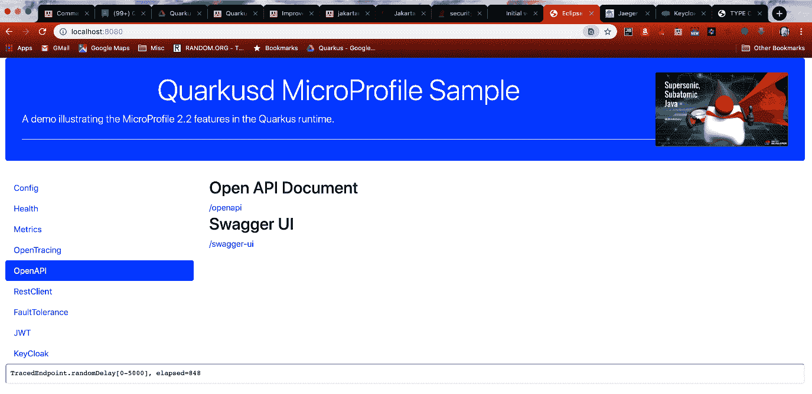

第一个链接生成一个 OpenAPI 文档，一个包含应用程序中所有端点描述的 YAML 文件。这可以输入到其他能够消费 OpenAPI 格式的程序或应用程序中。第二个链接是此类应用程序的一个示例，即 Swagger UI。打开该链接将打开一个类似于以下的新窗口：

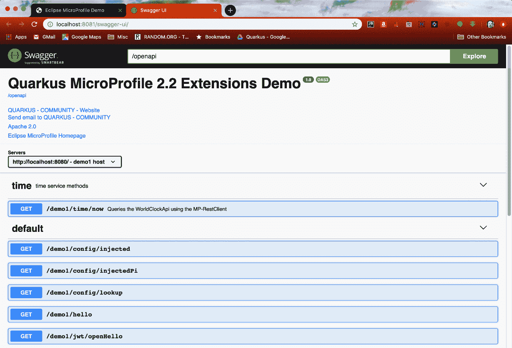

此示例应用视图包含三个部分。第一部分是在 JAX-RS 应用 bean 上通过 OpenAPI 注解指定的信息，如下代码片段所示：

```java
@ApplicationPath("/demo1")
@LoginConfig(authMethod = "MP-JWT", realmName = "quarkus-quickstart")
@OpenAPIDefinition(
    info = @Info(
        title = "Quarkus MicroProfile 2.2 Extensions Demo",
        version = "1.0",
        contact = @Contact(
            name = "QUARKUS - COMMUNITY",
            url = "https://quarkus.io/community/",
            email = "quarkus-dev+subscribe@googlegroups.com"),
        license = @License(
            name = "Apache 2.0",
            url = "http://www.apache.org/licenses/LICENSE-2.0.html")
    ),
    servers = {
        @Server(url = "http://localhost:8080/", description = "demo1 host"),
        @Server(url = "http://localhost:8081/", description = "demo2 host")
    },
    externalDocs = @ExternalDocumentation(url="http://microprofile.io", description = 
    "Eclipse MicroProfile Homepage")
)
public class DemoRestApplication extends Application {
...
```

将此信息与 Swagger UI 中显示的信息进行比较，可以看出所有`@OpenAPIDefinition`注解的信息都已经被整合到了 UI 顶部。Swagger UI 的下一个部分，带有`time`和`default`子标题的部分对应于从应用程序 REST 端点获取的操作信息。`default`部分对应于没有包含任何 OpenAPI 规范注解的端点。对于应用程序中发现的任何 JAX-RS 端点，都会有一个默认行为来创建一个 OpenAPI 端点定义。

`time`部分对应于以下`io.packt.sample.restclient.TimeService`端点代码片段，该片段包含了`@Tag`、`@ExternalDocumentation`和`@Operation` MP-OpenAPI 注解：

```java
@GET
@Path("/now")
@Produces(MediaType.APPLICATION_JSON)
@Tag(name = "time", description = "time service methods")
@ExternalDocumentation(description = "Basic World Clock API Home.",
    url = "http://worldclockapi.com/")
@Operation(summary = "Queries the WorldClockApi using the MP-RestClient",
    description = "Uses the WorldClockApi type proxy injected by the 
    MP-RestClient to access the worldclockapi.com service")
public Now utc() {
    return clockApi.utc();
}
```

如果您展开时间部分下的第一个操作，您将获得一个这样的视图：

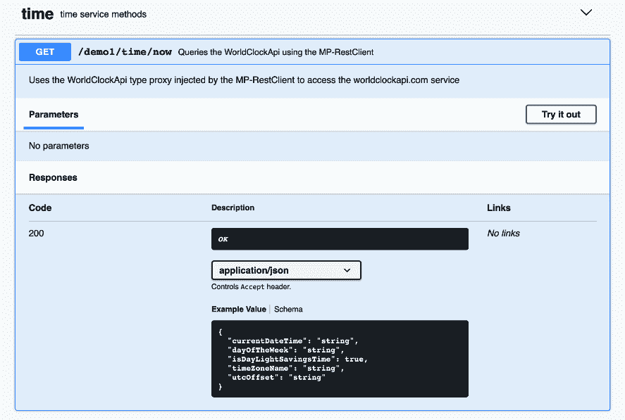

您可以看到`@Tag`已经定义了时间部分及其描述，而`@Operation`注解已经增强了操作摘要和描述部分。这显示了您可以如何使用 MP-OAPI 注解和像 Swagger UI 这样的 OpenAPI 感知应用程序为您的端点的消费者提供更多信息。

# 密钥保管库标签

接下来我们跳到密钥保管库标签，因为 RestClient 和 JWT 标签包括需要 JWT 才能访问端点的受保护调用。当你第一次访问密钥保管库标签时，它应该看起来像这样：

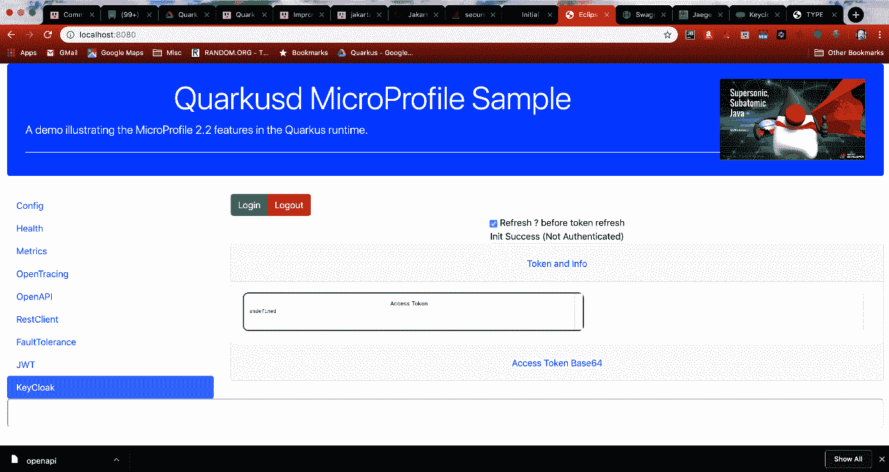

它不会显示任何令牌信息，状态行应在刷新复选框下方指示（未认证）。点击绿色的登录按钮，将出现以下登录屏幕：

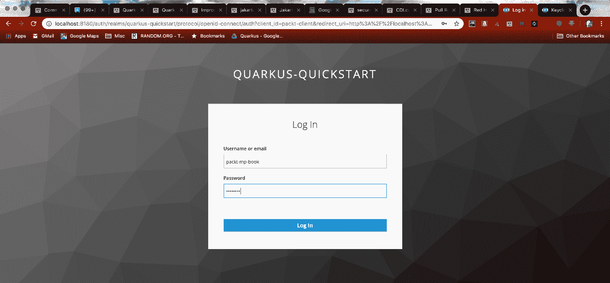

分别输入以下内容作为用户名和密码字段：

+   `packt-mp-book`

+   `password`

这...

# JWT 标签

在点击 JWT 标签后，您应该看到一个类似于以下内容的视图，其中有两个端点链接：

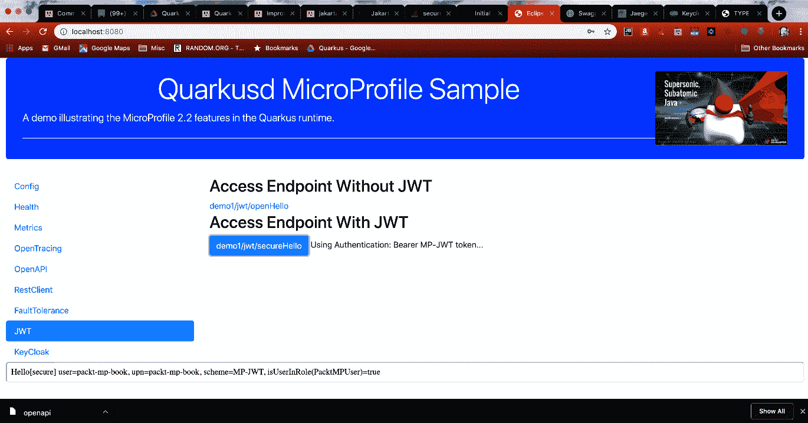

第一个链接向一个未受保护的端点发起请求，如果存在的话，它将打印 JWT 中的名称以及`upn`声明。

然而，由于 Web 前端没有为这个请求提供 JWT，输出部分将显示以下内容：

```java
Hello[open] user=anonymous, upn=no-upn
```

点击第二个链接可以访问该端点的受保护版本，其中包含此代码片段：

```java
public class JwtEndpoint {
    @Inject
    private JsonWebToken jwt;
    @Inject
    @Claim(standard = Claims.raw_token)
    private ClaimValue<String> jwtString;
    @Inject
    @Claim(standard = Claims.upn)
    private ClaimValue<String> upn;
    @Context
    private SecurityContext context;
...
    @GET
    @Path("/secureHello")
    @Produces(MediaType.TEXT_PLAIN)
    @RolesAllowed("user") // 1
    public String secureHello() {
        String user = jwt == null ? "anonymous" : jwt.getName(); // 2
        String scheme = context.getAuthenticationScheme(); // 3
        boolean isUserInRole = context.isUserInRole("PacktMPUser"); // 4
        return String.format("Hello[secure] user=%s, upn=%s, scheme=%s, 
        isUserInRole(PacktMPUser)=%s", user, upn.getValue(), 
        scheme, isUserInRole);
    }
```

让我们讨论重要的行：

1.  `@RolesAllowed("user")`注解表明该端点是受保护的，调用者需要`user`角色。我们之前看到的 JWT`groups`声明就是这个角色。

1.  用户通过`getName()`方法从 JWT 获取。如 MP-JWT 章节中所解释，这映射到 JWT 中的`upn`声明。

1.  当前的安全认证方案是从注入的`SecurityContext`中获取的。

1.  通过检查调用者是否具有`PacktMPUser`角色来进行程序安全检查。由于我们之前看到的 JWT 群组声明具有此角色，因此检查将返回真。

这些信息被组合成一个字符串，它是`secureHello`方法的返回值。点击 demo1/jwt/secureHello 链接按钮，在响应区域产生以下输出字符串：

```java
Hello[secure] user=packt-mp-book, upn=packt-mp-book, scheme=MP-JWT, isUserInRole(PacktMPUser)=true
```

通过使用`@RolesAllowed`注解和与 MP-JWT 功能的集成，我们可以看到我们如何既能保护微服务端点的安全，又能根据认证 JWT 中的内容引入应用程序行为。接下来，让我们回到 RestClient 标签页。

# RestClient 标签页

RestClient 标签页包含三个链接，如图所示：

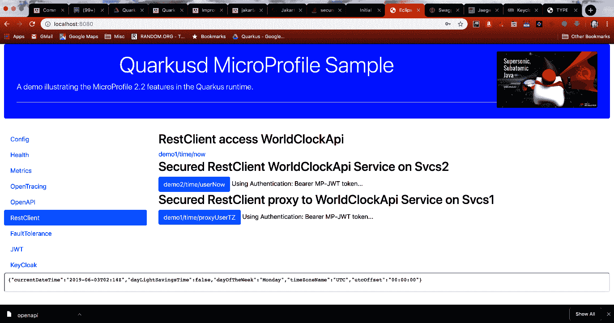

这些链接对应于使用外部世界时钟公共端点来返回有关当前时间的信息的端点。以下 MP-RC 接口已创建以封装外部端点：

```java
@RegisterRestClient(baseUri = WorldClockApi.BASE_URL)public interface WorldClockApi {    static final String BASE_URL = "http://worldclockapi.com/api/json";    @GET    @Path("/utc/now")    @Produces(MediaType.APPLICATION_JSON)    Now utc();    @GET    @Path("{tz}/now")    @Produces(MediaType.APPLICATION_JSON)    Now tz(@PathParam("tz") String tz);}
```

# 总结

本章带我们了解了由一个 web 应用程序、两个使用 MP 功能的微服务镜像组成的新 Quarkus 实现、一个外部 web 服务以及两个基于 Docker 的服务组成的示例服务网格。这展示了各种 MP 功能与外部服务在云环境中的交互，以及与本地网格环境外部的 web 服务的集成。这应该让您了解到使用 MicroProfile API 和实现编写微服务的步骤。

在下一章中，我们将查看正在开发中的 MicroProfile 规范，以了解正在探索的方向。虽然这些规范目前不在 MicroProfile 核心功能集之外，但它们是未来可能包含在内的候选项，并且查看它们将让我们了解 MicroProfile 可能的发展方向。

# 问题

1.  MP-Config 设置是否影响应用程序代码、MP 功能代码，还是两者都会影响？

1.  您能够更新`health.pathToMonitor`到一个有效的路径并看到一个更新的健康状态回复吗？

1.  健康标签页上的`Svcs2`健康状态链接（`http://localhost:8082/health`）显示的是什么输出？如果您停止 KeyCloak Docker 镜像并再次点击链接，输出会发生变化吗？

1.  如果您在没有至少先点击`Timed`端点链接（`http://localhost:8080/demo1/metric/timed`）的情况下选择 Metrics 标签页中的`MetricController.timed-request`链接（`http://localhost:8080/metrics/application/io.packt.sample.metric.MetricController.timed-request`），会发生什么？

1.  转到 RestClient 标签页并点击链接，确保您有一个有效的...

# 进一步阅读

审查代码、尝试修改，然后与更新后的代码互动，这是了解示例服务背后更多细节的好方法。Quarkus MicroProfile 实现支持实时重新加载功能，允许您在不重新构建的情况下进行更改。关于这一主题的更多信息，请参阅 Quarkus 网站上的 Maven 工具文档（[`quarkus.io/guides/maven-tooling.html`](https://quarkus.io/guides/maven-tooling.html)）。
