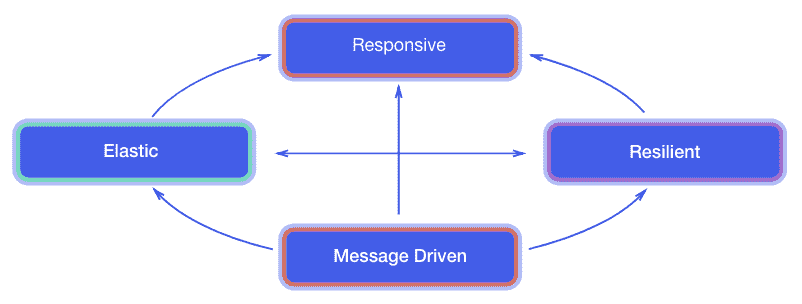
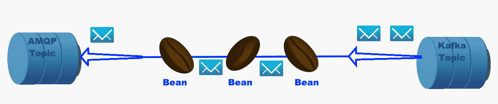

# 第十章：反应式编程与未来发展

事件驱动架构已经存在很长时间，异步方法调用、消息驱动 bean、事件控制逻辑等是开发者熟悉的构造。然而，随着云资源和按需可扩展性的普及和采用，组织对可以利用无服务器和函数即服务类型环境的反应式编程方法重新产生了兴趣。Eclipse MicroProfile 还包括目前不在 Eclipse MicroProfile 伞/平台发布中的反应式编程相关项目规范。

除了这些，Eclipse MicroProfile 沙盒中还有社区目前正在讨论、实施和评估的项目，以决定它们是否应升级为正式的 MicroProfile 项目。本章将帮助您了解与反应式编程相关的当前 MicroProfile 规范，并为您提供一些已经在进行中和即将到来的项目，这些项目位于伞下/平台发布之外以及 MicroProfile 沙盒中。本章将涵盖以下主题：

+   反应式消息传递的概述

+   解释 Eclipse MicroProfile 内的反应式消息传递架构

+   描述与反应式编程相关的 Eclipse MicroProfile 规范

+   使用 Eclipse MicroProfile 反应式消息规范的示例

+   概述不在 Eclipse MicroProfile 伞下或平台发布中的 MicroProfile 项目/规范

+   描述位于 Eclipse MicroProfile 沙盒中的项目

+   深入了解 Eclipse MicroProfile 与 Jakarta EE 当前的关系以及它们可能的未来分析

# Eclipse MicroProfile 中的响应式编程工作

在撰写本文时，属于 Eclipse MicroProfile 的反应式相关规范包括 Reactive Streams Operators、Reactive Messaging 和 Context Propagation。Eclipse MicroProfile 社区内的反应式工作仍在不断发展，未来可能会有新的规范出现，同时现有反应式相关规范也会有新的版本发布。

# 反应式消息传递概述

《反应式宣言](https://www.reactivemanifesto.org/)定义了反应式系统的特性，包括一个用于构建弹性、恢复性系统的异步消息核心。这通常通过以下图表进行说明：



想法是通过异步消息交互促进弹性、弹性，进而提高响应性。

**MicroProfile 反应式消息**（**MP-RM**）规范旨在通过事件驱动的微服务使基于微服务的应用程序具有反应式系统的特性。该规范关注多样性，适用于构建不同类型的架构和应用程序。

可以使用反应式消息实现与不同服务和资源的不对称交互。通常，异步数据库驱动可以与反应式消息一起使用，以非阻塞和非同步的方式读写数据存储。

在构建微服务时，**命令查询责任分离**（**CQRS**）和事件源模式为微服务之间的数据共享提供了答案([`martinfowler.com/bliki/CQRS.html`](https://martinfowler.com/bliki/CQRS.html))。反应式消息也可以作为 CQRS 和事件源机制的基础，因为这些模式拥抱消息传递作为核心通信模式。

# MicroProfile 反应式消息架构

使用反应式消息的应用程序由消费、生产和处理消息的 CDI Bean 组成。这些消息可以是应用程序内部的，也可以是通过外部消息代理发送和接收的，如下面的图表所示：



这个图表展示了一个 Kafka 主题向第一个 Bean 发布消息，该 Bean 进行一些处理后又将其发布给第二个 Bean，第二个 Bean 进行自己的处理/过滤，最后将消息作为 AMQP 主题发布。

正如我们在查看 MP-RM 示例时将看到的，应用 Bean 包含用 `@Incoming` 和/或 `@Outgoing ...` 注解的方法。

# 消息形状

MP-RM 规范定义了许多受支持的签名类型，Bean 可以使用它们来定义发布和订阅行为。这些签名依赖于以下列表中概述的几个关键类型：

+   `org.reactivestreams.Publisher`：一个 Reactive Streams `Publisher<T>` 是提供潜在无限数量序列元素的提供者，根据从其链接订阅者接收的需求发布它们。

+   `org.reactivestreams.Subscriber`：一个用于向 `Publisher` 信号需求的 Reactive Stream `Subscriber<T>` 接口。它提供了订阅信息事件、零个或多个数据事件以及错误和完成事件。

+   `org.reactivestreams.Processor`：这个 Reactive Stream `Processor<T,R>` 接口简单地扩展了 `Subscriber<T>` 和 `Publisher<R>` 两个接口。

+   `org.eclipse.microprofile.reactive.streams.operators.PublisherBuilder`：MP Reactive Streams 操作符 `PublisherBuilder` 接口允许你从各种源构建 Reactive Streams `Publisher` 并应用操作来转换/过滤最终发布的消息。

+   `org.eclipse.microprofile.reactive.streams.operators.ProcessorBuilder`：微 Profile 反应流操作符`ProcessorBuilder`接口允许你从各种来源构建反应流`Processor`并应用操作来转换/过滤最终发布的消息。

+   `org.eclipse.microprofile.reactive.streams.operators.SubscriberBuilder`：微 Profile 反应流操作符`SubscriberBuilder`接口允许你从各种来源构建反应流`Subscriber`并应用操作来转换/过滤最终发布的消息。

+   `java.util.concurrent.CompletionStage`：这个 JDK 并发`util`包接口定义了一个通常是异步的计算阶段，并计算一个动作或值。`CompletionStage`可以组合使用，以便执行阶段图以产生最终结果。

+   `org.eclipse.microprofile.reactive.messaging.Message<T>`：一个提供类型为`T`的载荷包装器并有一个`ack`方法来确认收到消息的 MP-RM 接口。

定义了这些类型后，我们可以查看 MP-RM 支持的各种方法，这些方法通过将消息推送到出站通道来产生数据。所有发布者方法类型都有`@Outgoing("channel-name")`注解，并支持如下签名：

+   `Publisher<Message<T>> 方法()`

+   `Publisher<T> 方法()`

+   `PublisherBuilder<Message<T>> 方法()`

+   `PublisherBuilder<T> 方法()`

+   `T 方法()`

+   `CompletionStage<T> 方法()`

消费者方法都有一个`@Incoming("channel-name")`注解，并支持如下签名：

+   `Subscriber<Message<T>> 方法()`

+   `Subscriber<T> 方法()`

+   `SubscriberBuilder<Message<T>>`

+   `SubscriberBuilder<T>`

+   `void 方法(Message<T> 载荷)`

+   `void 方法(T 载荷)`

+   `CompletionStage<?> 方法(Message<T> 载荷)`

+   `CompletionStage<?> 方法(T 载荷)`

既消耗数据又产生数据的方法被称为处理器，并将具有`@Incoming("channel-in")`和`@Outgoing("channel-out")`注解。支持的签名如下：

+   `Processor<Message<I>, Message<O>> 方法()`

+   `Processor<I, O> 方法();`

+   `ProcessorBuilder<Message<I>, Message<O>>方法()`

+   `ProcessorBuilder<I, O> 方法();`

+   `Publisher<Message<O>> 方法(Message<I> msg)`

+   `Publisher<O> 方法(I 载荷)`

+   `PublisherBuilder<Message<O>> 方法(Message<I> msg)`

+   `PublisherBuilder<O> 方法(I 载荷)`

+   `Message<O> 方法(Message<I> msg)`

+   `O 方法(I 载荷)`

+   `CompletionStage<Message<O>> 方法(Message<I> msg)`

+   `CompletionStage<O> 方法(I 载荷)`

+   `Publisher<Message<O>> 方法(Publisher<Message<I>> pub)`

+   `PublisherBuilder<Message<O>> 方法(PublisherBuilder<Message<I>> pub)`

+   `Publisher<O> 方法(Publisher<I> pub)`

+   `PublisherBuilder<O> 方法(PublisherBuilder<I> pub)`

现在，我们将查看一些使用这些签名构建消息处理链的示例。

# 微 Profile 反应流操作符

反应式流不仅仅是将发布者连接到订阅者。通常，一个流需要以某种方式进行操作，比如应用包括 `map`、`filter` 和 `flatMap` 的操作。反应式流和 JDK 都没有提供执行这些操作的 API。由于用户不需要自己实现反应式流，这意味着目前进行这些操作的唯一方式是依赖于第三方库提供操作符，如 Akka Streams、RxJava 或 Reactor。

MicroProfile 反应式流操作符 API 旨在填补这一空白，使得 MicroProfile 应用开发者能够无需引入第三方依赖即可操作反应式流。...

# MicroProfile 上下文传播

这个规范位于 MicroProfile 平台发布之外的范畴，目前仍处于提议或草稿状态。我们将在本章后面的 *MicroProfile 未来发展趋势* 部分更详细地讨论这个规范，但在这里我们先给出一个高层次的介绍。

MicroProfile 上下文传播规范引入了 API，用于在无线程关联的工作单元之间传播上下文。它使得能够将传统与当前线程相关联的上下文传播到各种工作单元，如 `CompletionStage`、`CompletableFuture`、`Function` 和 `Runnable`，无论最终是哪个特定的线程执行它们。

# MicroProfile 反应式消息示例

在本节中，我们将介绍一些使用 MP-RM 创建产生和消费消息的 CDI 豆子的示例。

假设你想让一个 CDI 豆子作为 `Message<String>` 的来源，这样每当调用其 `publishMessage(String)` 方法时，就会向某个 MP-RM 通道发布 MP-RM 消息。为此，我们需要定义一个连接器，它将 CDI 豆子与 MP-RM 层连接起来。下面代码示例展示了一个实现此功能的传入消息连接器：

```java
package io.pckt.reactive;import javax.enterprise.context.ApplicationScoped;import javax.inject.Inject;import org.eclipse.microprofile.config.Config;import org.eclipse.microprofile.reactive.messaging.Message;import org.eclipse.microprofile.reactive.messaging.spi. ...
```

# MicroProfile 未来发展趋势

如第二章 *治理和贡献* 中所述，带到 Eclipse MicroProfile 项目的新想法首先在 MicroProfile 沙箱中尝试，遵循实现优先的创新方法。沙箱练习为实施者和社区提供了讨论、分析和评估新想法如何融入 MicroProfile 项目的机会。如果在沙箱练习结束时，社区认为这个新想法值得添加到项目中，就会为它创建一个特定的 MicroProfile 子项目。子项目在至少发布一个版本之前，才能考虑加入到 MicroProfile 伞/平台发布中。在非常高层次上，这是新想法和未来发展趋势在 MicroProfile 项目下遵循的过程。

在下一节中，我们将讨论两种类型的项目，这些项目目前是 MicroProfile 的子项目，目前不在 MicroProfile 伞下/平台发布（将这些视为已经从 MicroProfile 沙箱毕业的项目），以及仍在 MicroProfile 沙箱中的项目。最后，我们将讨论 Eclipse MicroProfile 和 Jakarta EE 之间的当前关系，以及它们的路线图可能满足也可能不满足。

# 伞下项目

在本节中，我们将介绍在 Eclipse MicroProfile 伞下发布之外的项目，当然，在撰写本文时。这些如下：

+   响应式流操作符

+   响应式消息传递

+   长期运行动作

+   上下文传播

+   GraphQL

本章的前几节已经讨论了响应式流操作符和响应式消息传递项目，因此在本节中我们只覆盖长期运行动作、上下文传播和 GraphQL。

# 长期运行动作

在松耦合的服务环境中，**长期运行动作**（**LRA**）规范背后的动机是为许多微服务的调用组成的业务流程提供一致的结果，而无需锁定数据。思考 LRA 的一种方式是将其视为*微服务的事务*。需要 LRA 的情况包括以下几种：

+   在网上订购一本书将需要从库存中退役一本书，处理支付，最后是发货。所有这些任务都需要原子性地完成，换句话说，它们需要一起处理，也就是说，如果任何任务失败，那么所有任务都必须被撤销。

+   预订航班将需要从飞机可用的座位列表中移除一个座位，为旅客选择并分配一个特定的座位，处理支付，以及创建一个记录定位器。同样，所有这些任务必须在同一个长期运行动作中完成。

不仅上述示例需要原子性地完成，而且它们还需要生成一个结果，即使它们的中间步骤中有任何失败，数据也是一致的。

微概要 LRA 当前提出的解决方案受到了*OASIS Web 服务组合应用框架技术委员会*的启发（[`www.oasis-open.org/committees/tc_home.php?wg_abbrev=ws-caf`](https://www.oasis-open.org/committees/tc_home.php?wg_abbrev=ws-caf)），即*Web 服务**长期运行动作事务模型*（[`www.oasis-open.org/committees/document.php?document_id=12794`](https://www.oasis-open.org/committees/document.php?document_id=12794)），但已更新以更适用于微服务架构。

有关 MicroProfile LRA 规范的更多信息，请参考[`github.com/eclipse/microprofile-lra/blob/master/spec/src/main/asciidoc/microprofile-lra-spec.adoc`](https://github.com/eclipse/microprofile-lra/blob/master/spec/src/main/asciidoc/microprofile-lra-spec.adoc)。

MicroProfile 长期运行动作规范模型包括三个主要实体：补偿器、逻辑协调器和客户端。客户端可以通过两种不同的方式显式启动新的 LRA：

+   通过注解，或者

+   通过 API 调用

要么创建一个新的 LRA。如果一个服务可能需要稍后撤销某事，那么客户端需要为 LRA 注册一个补偿器。如果客户端选择关闭或取消 LRA，补偿器将撤销服务在 LRA 范围内执行的工作，或者对未完成的工作进行补偿。

以下是一些主要的 LRA 注解：

+   `@LRA`控制 LRA 的生命周期。

+   `@Compensate`表示如果 LRA 被取消，则应调用该方法。

+   `@Complete`表示如果 LRA 关闭，则应调用该方法。

+   `@Forget`表示该方法可能释放为这次 LRA 分配的任何资源。

+   `@Leave`表示这个类不再对这次 LRA 感兴趣。

+   `@Status`在调用注解方法时报告状态。

你可以将这些注解与 JAX-RS 和非 JAX-RS 方法一起使用。此外，该规范支持 JAX-RS 的异步和反应式特性，LRA 嵌套和超时功能。最后，值得一提的是，LRA 规范通过对接口参与实体提出某些要求，确保事务性和最终一致性。作为一个 MicroProfile 项目，MicroProfile LRA 规范，在撰写本文时，处于提议或草稿状态。

# 上下文传播

MicroProfile 上下文传播规范的目标是在线程无关的工作单元之间传播上下文。在一个反应式模型中，逻辑的执行被拆分为相互链式组装的反应式流水线的工作单元。每个工作单元在上下文中执行，这通常是不可预测的，并取决于正在使用的特定反应式引擎。一些单元可能在与线程等待完成上下文的情况下运行，或者在完成并触发依赖单元的前一个单元的上下文中运行，或者根本没有任何上下文。MicroProfile 上下文传播规范使得线程上下文传播可以轻松地以类型安全的方式完成，保持了样板代码...

# GraphQL

GraphQL 是一个开源的数据查询和操作语言，用于 API，以及用于用现有数据满足查询的运行时。它解释客户端的字符串并以可理解、可预测和预定义的方式返回数据。GraphQL 是 REST 的替代方案，但不一定是替代品。MicroProfile GraphQL 规范的目标是为用户提供一套 API，使用户能够快速在 Java 中开发可移植的 GraphQL 基础应用程序。作为一个 MicroProfile 项目，MicroProfile GraphQL 规范在撰写本文时，处于提议或草稿状态。

GraphQL 基于 Facebook 的规范。关于这一点，请参阅`https://graphql.github.io/graphql-spec`。有关 GraphQL 的更全面概述，请访问[`graphql.org/`](https://graphql.org/)。

GraphQL 和 REST 有许多相似之处，都在现代微服务应用中得到广泛使用。

# GraphQL 与 REST 的区别

以下是与 REST 相比 GraphQL 的主要区别性特征：

+   **基于架构**：架构作为服务器及其客户端之间的合同。

+   **单一 HTTP 端点**：通过查询语言实现单一端点和数据及操作的访问。

+   **灵活的数据检索**：允许客户端以细粒度的方式选择响应中的数据，从而避免过度或不足地获取数据。

+   **减少服务器请求**：该语言允许客户端将预期的数据聚合成单个请求。

+   **更简单的版本管理**：在创建新数据的同时，使旧数据过时。

+   **部分结果**：结果由数据和错误组成。客户端负责...

# GraphQL 和数据库

GraphQL 不是数据库技术。相反，它是用于 API 的数据查询和操作工具，不依赖于任何数据库或存储技术。但是，它可以用于任何后端之前，并能够通过单个 API 从多个后端数据源聚合数据。

# 沙盒中的项目

MicroProfile 项目沙盒是社区可以提出想法的地方，通过尝试实现功能和特性的实现，从社区成员那里获得反馈、讨论和评估，以决定是否将想法变成 MicroProfile 项目的新 API/规范。

MicroProfile 沙盒位于[`github.com/eclipse/microprofile-sandbox`](https://github.com/eclipse/microprofile-sandbox)。

从沙盒毕业成为正式 MicroProfile 项目的过去项目建议包括 GraphQL 和 Reactive Streams Operators。在撰写本文时，沙盒中只有一个建议项目，即 Boost。

# MicroProfile Boost

在撰写本文时，MicroProfile Boost 在 MicroProfile 沙盒中处于社区评估阶段。Boost 是一个 Maven 插件，可增强为您的 MicroProfile 应用程序构建的过程。

有关 Boost 的更多信息，请访问[`github.com/eclipse/microprofile-sandbox/tree/master/proposals/boost`](https://github.com/eclipse/microprofile-sandbox/tree/master/proposals/boost)。

Boost 为 MicroProfile API 定义了 Maven 依赖项，称为**启动器**，例如为 MicroProfile Config 定义的`mpConfig`，以及为 Java EE API。此外，它还为实现不同 MicroProfile API 的运行时定义了依赖项，例如`openliberty`。还有一个作为 BOM（物料清单）指定的 Boost 定义的 Maven 依赖项，它指示在构建有关 MicroProfile API 的 maven 时使用 MicroProfile 伞项目的哪个版本。BOM 内容由插件管理。作为 Boost 的用户，您将把这些依赖项包含在您的`pom.xml`文件中，以简化 MicroProfile 应用程序的构建过程。

# Eclipse MicroProfile 和 Jakarta EE

Eclipse Jakarta Enterprise Java 项目和 Eclipse MicroProfile 项目之间的关系是什么？简而言之：尚未可知。详细答案：让我们开始。

Eclipse MicroProfile 项目旨在解决在**Java Community Process**（**JCP**）下 Java EE 规范缺乏进展的问题。

有关 Java 社区过程的更多信息，请访问`https://jcp.org/en/home/index`。

自 MicroProfile 项目移至 Eclipse 基金会以来已经过去了两年多时间。大约一年后，Oracle 宣布计划将 Java EE 移至 Eclipse 基金会并将其重命名为 Jakarta EE。移至 Jakarta 的过程是一个漫长的过程，而且还在继续...

# 摘要

在本章中，我们了解了 MicroProfile 规范的未来发展，包括 Long Running Actions、Context Propagation 和 GraphQL 项目，它们都不在伞发布之外，以及仍在 MicroProfile 沙箱中的 Boost 项目。此外，您还了解了反应式消息传递的概念、MicroProfile 反应式消息传递架构，以及如何使用代码示例通过 Eclipse MicroProfile 反应式构件实现反应式微服务。您还获得了这些项目的背景知识、它们的 capabilities、注解（annotation）和在适用情况下的代码示例，以及它们当前的状态。最后，我们介绍了两个类似但不同的项目：Eclipse MicroProfile 和 Jakarta EE 之间的关系，并讨论了它们可能在未来如何发展。

在下一章中，我们将学习在多云环境和部署中关于 Eclipse MicroProfile 的知识。

# 问题

1.  如果我们有一个消息源，我该如何将其集成到我的 MicroProfile 应用程序中？

1.  MicroProfile Context Propagation 最佳支持现有 MicroProfile 规范中的哪一个？

1.  目前支持反应式编程的 MicroProfile 规范有哪些？

1.  目前哪些 MicroProfile 规范位于伞/平台 MicroProfile 发布之外？

1.  为什么要有 MicroProfile 沙盒呢？

1.  目前哪些项目位于 MicroProfile 沙盒中？

1.  当前 Eclipse MicroProfile 与 Jakarta EE 之间的关系是什么？

1.  未来 Eclipse MicroProfile 与 Jakarta EE 之间的关系将如何发展？

# 进一步阅读

+   对于 MicroProfile 响应式消息传递，[`reactivex.io/`](http://reactivex.io/)网站提供了动机、教程、语言绑定等内容。

+   学习 GraphQL 的一个好起点是[`graphql.org/`](https://graphql.org/)网站，该网站提供了更多关于其背后的动机，以及许多用于探索如何使用它的资源。
