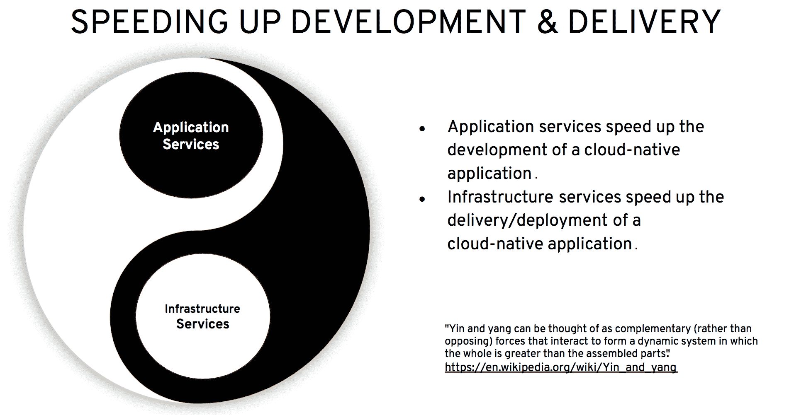
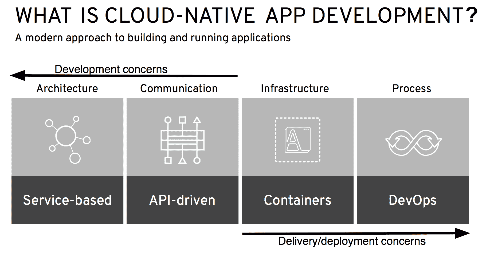

# 第十一章：在多云环境中使用 MicroProfile

微服务和微服务架构是云和多云环境的理想开发方法，包括混合云部署，您的应用程序包括本地逻辑以及运行在云中的逻辑。Eclipse MicroProfile 是一个优化 Java 适用于微服务架构的规范，因此提供了构造，使您可以使用 Java 和云实现微服务。这些主题将帮助您了解为什么 Eclipse MicroProfile 适用于开发混合和多云环境中的应用程序，以及在这些类型的部署中使用它时必须考虑的因素。

在本章中，我们将讨论以下内容...

# 使用 Eclipse MicroProfile 进行云原生应用开发

什么是云原生应用？通常，对于**云原生**的定义包括以下特征：

+   设计为松耦合服务，如微服务

+   松耦合的服务，通过语言无关的通信协议进行交互，这使得微服务可以采用不同的编程语言和框架实现

+   可以按需或通过资源利用率指标进行扩展轻量级容器

+   通过敏捷 DevOps 流程管理，每个云原生应用程序的微服务都经历一个独立的生命周期，该生命周期通过使用**持续集成/持续交付**（**CI/CD**）管道进行敏捷管理

然而，Eclipse MicroProfile 的目标是优化 Java 适用于微服务架构，那么它是否适合云原生应用开发呢？容器原生开发又如何？微服务、云原生开发和容器原生开发之间的关系是什么？它们之间有什么区别或比较？让我们来找出答案！

# 微服务与云原生与容器原生

首先，让我们绘制这三个术语在应用程序开发方面的区别。正如我们在第一章中讨论的，*Eclipse MicroProfile 简介*，企业 Java 微服务具有以下特征：

+   这是一个使用 Java 语言编写的微服务。

+   它可以使用任何 Java 框架。

+   它可以使用任何 Java API。

+   它必须是企业级的，这意味着它必须具有高可靠性、可用性、可扩展性、安全性、健壮性和性能。

+   它必须满足微服务的所有特征，这些特征列在[`martinfowler.com/microservices/`](https://martinfowler.com/microservices/)上。

根据其定义，微服务不规定底层的具体细节...

# 那 12 因子应用又如何呢？

就像微服务和微服务架构的定义一样，12 因子应用不会规定底层技术，例如编程语言、数据库、缓存等，或应使用它们实现的框架。12 因子应用是一种用于实施应用程序的方法。这十二个因素如下：

+   一个代码库在版本控制中跟踪，多个部署

+   明确声明和隔离依赖项

+   在环境中存储配置

+   将后端服务视为附加资源

+   严格区分构建和运行阶段

+   将应用程序作为无状态进程之一或多个执行

+   通过端口绑定导出服务

+   通过进程模型进行扩展

+   通过快速启动和优雅关机最大化健壮性

+   尽可能保持开发、暂存和生产环境相似

+   将日志视为事件流

+   将管理任务作为一次性流程运行

使用这种方法实施应用程序可以帮助我们做到以下几点：

+   最小化新开发者加入项目的时间和成本

+   提供在执行环境之间可移植性

+   轻松将应用程序部署到云平台

+   最小化开发和生产之间的差异

+   无需更改即可扩展

您可以在[`12factor.net`](https://12factor.net)上阅读到关于 12 个因素的全部内容。

12 因子应用是一种开发者可以在设计和实现微服务和应用程序时遵循的方法，与实现它们的编程语言或框架无关。开发者可以使用 12 因子应用框架实现微服务，这个框架是 Eclipse MicroProfile。12 因子应用和 Eclipse MicroProfile 并不是相互排斥的，而是相辅相成的。

但是，除了 12 因子应用之外，还有没有其他设计和实现应用程序的方法呢？无服务器和**功能即服务**（**FaaS**）技术又如何呢？Eclipse MicroProfile 在这些更新的云原生技术中如何定位？

# 那么无服务器和 FaaS 呢？

无服务器和 FaaS 作为云原生技术，在市场上一直保持着稳定的兴趣和增长，这一点从所有主要云服务提供商的产品中可以看出，即 AWS Lambda、Azure Functions、Oracle Functions 和 Google Cloud Functions。在组织越来越多地使用云进行开发和生产负载的时代，计算和内存成本是必须跟踪和监控的操作费用，FaaS 之所以吸引人，是因为它将计算和内存管理从用户手中抽象出来，使用户能够专注于开发业务逻辑，从而比以往任何时候都更加高效。

使用 FaaS，开发人员无需设置虚拟机和内存，...

# 云原生应用开发

云原生应用开发有两个互补的方面或组件：应用服务和基础设施服务。应用服务加快了云原生应用的业务逻辑开发，而基础设施服务则加快了其交付和部署。这两个方面是互补的，并构成了云原生应用开发的一部分。没有另一个，你无法拥有。它们本质上是云原生应用开发的阴阳两面，如下面的图表所示：



正如我们在这章节前面提到的，云原生应用开发是一种构建和运行应用程序的方法，它充分利用了云计算模型，该模型基于四个核心原则：

+   基于服务架构（微服务、微服务、SOA 服务等）

+   服务间通信的 API 驱动方法

+   基于容器的底层基础设施

+   DevOps 流程

下面的图表展示了云原生应用开发的四个核心原则：



如图所示，前一个图表中，架构和通信方面与云原生应用的开发关注点相关，而基础设施和流程方面则与它们的交付/部署相关。

正在采用云原生应用开发的组织可以从八个步骤中受益，这些步骤在电子书中有所描述，书名为 *The path to cloud-native applications: **8 steps to guide your journey*.

要获取电子书 *The path to cloud-native applications: **8 steps to guide your journey*, 请参考 [`www.redhat.com/en/resources/path-to-cloud-native-applications-ebook`](https://www.redhat.com/en/resources/path-to-cloud-native-applications-ebook).

让我们讨论一下 Eclipse MicroProfile 在这八个步骤中可以发挥什么作用：

1.  **发展和实践 DevOps 文化**：“*利用新技术、更快的方法以及更紧密的协作，通过采纳 DevOps 的原则和文化价值观，围绕这些价值观组织你的组织.*” 尽管这是一个与组织和工作流程相关的步骤，但作为微服务规范的 Eclipse MicroProfile 可以很好地适应这种文化和流程的改变，因为微服务由于其特性，紧密支持 DevOps 流程。

1.  **使用快速单体加速现有应用**：“*通过迁移到现代、基于容器的平台来加速现有应用——并将单体应用分解为微服务或小型服务，以获得额外的效率提升。*” 在将单体应用分解为微服务时，Eclipse MicroProfile 可以提供很大帮助。 当你在单体应用中识别出边界上下文时，可以考虑使用 Eclipse MicroProfile 来实现每个微服务，这些微服务实现每个边界上下文的逻辑。

1.  **使用应用服务加快开发速度**：“*通过可重用性加快软件开发。云原生应用服务是即用的开发者工具。然而，这些可重用组件必须优化并集成到云原生基础架构中，以最大化其效益。*”**内存数据网格**（**IMDG**）和消息代理是应用服务，它们有助于加快业务逻辑的开发。使用 Eclipse MicroProfile 开发的微服务，可以通过其方法体内部调用这些应用服务。Eclipse MicroProfile 在集成应用服务，如 IMDG 或消息代理时，不会施加任何限制。

1.  **为每项任务选择合适的工具**：“*使用基于容器的应用平台，支持正确的框架、语言和架构的混合——并可根据您的特定业务应用需求进行定制。*” 当选择合适的工具来完成任务时，开发者可以使用 Eclipse MicroProfile 这样的工具。例如，Red Hat Application Runtimes 是一组运行时和工具的集合，其中包括 Eclipse MicroProfile、Node.js、Spring Boot 和 Vertex。

1.  **为开发者提供自助、按需的基础设施**：“*使用容器和容器编排技术简化对底层基础设施的访问，赋予 IT 运营团队控制和可见性，并在各种基础设施环境中，如数据中心、私有云和公有云，提供健壮的应用生命周期管理。*” 使用 Eclipse MicroProfile 开发的微服务可以部署到一个或多个容器中。 通过轻松管理这些容器以及在其上运行的微服务架构，您可以加快开发周期，更快地向业务交付价值。

1.  **自动化 IT 以加速应用交付**：“*创建自动化沙盒，以学习自动化语言和流程，跨组织建立协作对话以定义服务需求，创建自助服务目录以赋予用户权力并加快交付，以及使用度量、监控和计费回策略和流程。*” Eclipse MicroProfile 提供了度量、容错和健康检查等功能，这些都可以作为 IT 自动化过程的输入。

1.  **实施持续交付和高级部署技术**："*使用自动化交付、CI/CD 管道、滚动蓝/绿和金丝雀部署以及 A/B 测试，加速你的云原生应用程序的交付。*" 微服务与 CI/CD 的结合可以促进高级部署技术。例如，你可以作为一个蓝/绿或金丝雀部署的一部分，将具有新功能的 MicroProfile 基础微服务引入生产中，一旦你证明了新的功能如预期般工作，就可以将所有流量切换到它。

1.  **进化成更模块化的架构**： "*选择一种适合你特定需求的模块化设计，使用微服务、单体优先方法或迷你服务——或它们的组合。*" 在这一步，你可以使用 Eclipse MicroProfile 来为新的应用程序开发微服务，或者在你将单体的特定有限上下文拆分为微服务时使用。

既然我们已经讨论了 Eclipse MicroProfile 如何促进云原生应用程序的开发，以及它如何在八个步骤中帮助引导你走向云原生应用程序，现在让我们转向在云之间运行基于 MicroProfile 的应用程序的主题。

# 在云之间开发和运行 MicroProfile 应用程序

MicroProfile 提供了哪些特性来支持在云之间开发？微服务和基于 HTTP REST API 的语言无关通信是支持的两个主要特性。此外，MicroProfile Config 支持将云环境变量集成到定义与云环境集成的集成中。MicroProfile Health Check 支持与云环境健康检查的集成。MicroProfile Metrics 和 MicroProfile OpenTracing 支持与 DevOps 监控任务的集成。最后，MicroProfile 容错支持独立微服务之间的回退和恢复行为。

Eclipse MicroProfile ...

# 裸机机器与虚拟机与容器

是否在裸机机器、虚拟机或容器上运行基于 MicroProfile 的微服务或应用程序取决于你的应用程序的具体要求。实际上，确定哪种底层云计算资源完全取决于你的应用程序需求，而不是用于其开发的框架，即 Eclipse MicroProfile。例如，如果你的应用程序或微服务需要实时或接近实时的响应时间，那么你很可能会偏好裸机或容器（运行在裸机上）部署。这个决定与你正在使用来编写业务逻辑的框架无关，无论是 Eclipse MicroProfile 还是其他框架。

由于 Eclipse MicroProfile 支持微服务和基于 HTTP REST 的语言无关通信，你的微服务之间的通信不受运行微服务的底层计算类型的影响；例如，你可以有一个运行在 VM 上的微服务通过 REST 与另一个运行在裸机上的微服务进行通信。但是，如果你的应用程序由在本地运行的微服务和在云上运行的另一个微服务组成，也称为混合云应用程序，你需要考虑什么？

# 在混合云部署中使用 MicroProfile 时的考虑

混合云应用程序包括本地逻辑以及云逻辑。换句话说，如果你的应用程序逻辑的一部分在本地运行，另一部分在云中运行，你实际上拥有一个混合云应用程序。当在这个类型的部署中使用 Eclipse MicroProfile 时，以下是你需要考虑的事情：

+   配置云环境与本地环境之间的通信路由需要使用云环境支持的所有 DNS 支持

+   配置 MicroProfile OpenTracing 以在云环境之间捕获跟踪

+   在云环境和本地环境之间分割 MicroProfile Metrics 信息进行监控...

# 在多云部署中使用 MicroProfile OpenTracing 时的挑战

在多云环境中进行分布式跟踪可能会很有挑战性。我们希望能够实现与单一云环境相同的目标，即可视化与请求相关联的单个端到端跟踪，以及它穿过每个云中的服务，但在处理不同的上下文传播格式和每个云存储跟踪数据的不同格式时可能会遇到复杂问题。

第一个挑战是要确保跟踪可以在不同的云环境中持续进行。这是一个问题，因为截至撰写本书时，还没有被广泛采用或标准化的跟踪上下文格式。通常，每个跟踪系统都使用不同的头文件和格式来传播跟踪上下文。例如，Zipkin 使用 B3 传播，Jaeger 使用 `ber-trace-id` 头文件，Amazon X-Ray 使用 `X-Amzn-Trace-Id`，Google 使用 `X-Cloud-Trace-Context`。因此，如果一个请求需要在不同的跟踪系统之间进行跟踪，每次它离开或进入不同的环境时，都需要转换跟踪上下文。这通常可以通过配置带有自定义注入器或提取器实现的跟踪器来完成。然而，这目前超出了 MicroProfile OpenTracing 项目的范围。将来，跟踪上下文格式可能会在 W3C 跟踪上下文项目下得到标准化([`www.w3.org/TR/trace-context/`](https://www.w3.org/TR/trace-context/)).

第二个挑战，即使在同质追踪环境中，也是可视化多云环境中的追踪数据。这可能很成问题，因为每个云中的追踪数据可能存储在不同的数据库或不同的格式中。这可以通过将数据复制到单一统一存储，或者使用适当的数据格式调整，在系统之间按需发送缺失的追踪数据来克服。

接下来，我们将讨论在像 Istio 这样的服务网格中使用 Eclipse MicroProfile 遇到的挑战。

# 在服务网格中使用 Eclipse MicroProfile 的考虑

像 Istio 或 LinkerD 这样的服务网格在 Kubernetes 之上的平台级别提供服务，涵盖发现、路由和故障容限等领域。其中一些服务也可以在 MicroProfile 中找到。当你将 MicroProfile 应用程序部署在这样的服务网格中时，你需要考虑是否想使用 MicroProfile 版本或网格中的版本。

受影响的 MicroProfile 特性最可能是故障容限，尤其是重试逻辑。

# 重试

在故障容限中的重试允许在第一个请求失败时重试对另一个服务的请求（更多信息请参见第三章，*MicroProfile Config 和 Fault Tolerance*）。现在，考虑你有以下代码：

```java
@Retry (maxRetries = 3)
void aMethod() {
    callBackend();
}
```

尽管这告诉 Istio 重试 5 次，但最终可能导致`aMethod`以错误结束，共进行 15 次重试（Istio 会在返回错误之前为您的代码中的 3 次重试各重试 5 次）。你可能考虑关闭代码中的重试，因为可以通过不需要重启 pod 的方式，随时在 Istio 中更改重试次数。

# 回退

另一方面，Istio 没有在所有重试失败时调用回退策略——不可能让 Istio 调用您工作负载的另一个版本。当你在前面的代码上添加`@Fallback`注解时，在原始调用失败的情况下可以执行另一个动作：

```java
@Fallback(fallbackMethod = "fallbackForA")@Retry (maxRetries = 3)string aMethod() {   callBackend();}void String fallbackForA() {    return "A cached string";}
```

在这种情况下，一旦 Istio 和 MicroProfile 的所有重试都耗尽，将会调用`fallbackForA`回退方法。如果你从前面示例中移除了`@Retry`注解，当 Istio 的重试耗尽时会调用回退方法...

# 服务网格中的故障注入

Istio 可以很容易地在结果中注入故障。这听起来开始时有些适得其反，但这是一个非常好的测试您是否正确处理了故障容限的方式。以下是为 Istio 定义故障注入的`VirtualService`：

```java
apiVersion: networking.istio.io/v1alpha3
kind: VirtualService
metadata:
  name: fault-injection-service
spec:
  hosts:
  - myTarget
  http:
  - route:
    - destination:
      host: myTarget
    fault:
      abort:
        httpStatus: 404
        percent: 20
     delay:
       percent: 50
       fixedDelay: 200ms
```

Istio 将监听对目标主机`myTarget`的调用，并对 20%的调用发送 404 响应，而不是真实的响应代码。此外，它还会将其他每个响应延迟 200 毫秒。

# 结论

MicroProfile 在容错领域定义了原语，这些原语也可以通过其他方式提供，例如在服务网格中。如果这是你的情况，你必须考虑激活哪一个。同时激活两个可能会导致意外行为。

# 总结

在本章中，你已经学习了 Eclipse MicroProfile 如何促进云原生应用程序开发，无论是混合云还是多云应用程序。我们还讨论了微服务、云原生开发和容器原生开发之间的关系，以及运行在容器上的微服务是云原生开发的理想选择。你也学习了 Eclipse MicroProfile 与 12 因子应用程序以及无服务器和函数即服务环境的关系。

我们覆盖了八个步骤，指导你进入云原生应用程序的旅程，以及 Eclipse MicroProfile 如何在每一步帮助。此外，我们还讨论了在使用 Eclipse MicroProfile 跨云应用程序时需要考虑的内容，何时在裸机机器上运行 Eclipse MicroProfile 与在虚拟机上运行 Eclipse MicroProfile 与在容器上运行 Eclipse MicroProfile，以及在运行 Eclipse MicroProfile 微服务时需要考虑的内容在混合云应用程序中，在运行 Eclipse MicroProfile OpenTracing 时需要意识到的多云部署挑战，以及最后在使用 Eclipse MicroProfile 时需要考虑的内容在服务网格中。

在这本书中，我们已经介绍了 MicroProfile 的起源，这是一个针对 Java 微服务的规范，以及它背后的历史。我们介绍了开源项目，它的使命、治理、好处、如何为其做出贡献以及其子项目的生命周期。然后我们深入探讨了构成伞式/平台发布的每个 MicroProfile API/子项目，以及不在伞式发布的子项目。

我们同样覆盖了市场上当前的 MicroProfile 实现，包括 Quarkus，并展示了如何使用 MicroProfile Starter 生成的 MicroProfile 项目来“quark”项目。我们讨论了会议应用程序，这是一个社区样本项目，展示了 MicroProfile 在不同供应商实现之间的互操作性。我们还在整个文档中提供了代码示例，以便参考和讨论，并且还提供了一个带有源代码的完整可工作项目，实现了所有 MicroProfile API，您可以自由访问、下载、编译并在您的开发努力中重用，以及开始使用 MicroProfile。后来，我们讨论了 MicroProfile 提供的响应式功能及其未来发展，例如管道中的子项目和对 MicroProfile 沙盒的子项目，以及它可能与 Jakarta EE 的未来关系。

最后，我们讨论了基于**MicroProfile**的应用程序和微服务如何适合在容器、云以及无服务器/FaaS 部署中实现解决方案。无论您是 Java 微服务的新手还是有经验的 Java 开发者，您都可以利用本书中获得的所有知识来开始开发基于这一新型的、创新的社区驱动规范的微服务，以创建可观察、可扩展、安全和高可用的混合和多云应用，从而您可以更快地为您的企业提供价值。

# 问题

1.  **Eclipse MicroProfile**如何促进云原生应用开发？

1.  云原生应用开发的两个互补关注点是什么？**Eclipse MicroProfile**如何融入这些关注点？

1.  云原生应用开发的四个关键原则是什么？**Eclipse MicroProfile**与这些原则有何关联？

1.  **Eclipse MicroProfile**如何为引导您通过云原生应用开发的八个步骤做出贡献？

1.  **Eclipse MicroProfile**与 12 因子应用有何关联？

1.  **Eclipse MicroProfile**如何促进无服务器和 FaaS 环境？

1.  在跨云实施和运行**Eclipse MicroProfile**时，您应该考虑哪些问题？

1.  使用**Eclipse MicroProfile**时会遇到哪些挑战...
