# 第一章：设置环境和工具 - 后端

在本章中，我们将为使用 Spring Boot 进行后端编程设置环境和工具。Spring Boot 是一个现代的基于 Java 的后端框架，使开发速度比传统的基于 Java 的框架更快。使用 Spring Boot，您可以创建一个具有嵌入式应用服务器的独立 Web 应用程序。

在本章中，我们将研究以下内容：

+   为 Spring Boot 开发构建环境

+   Eclipse IDE 和 Maven 的基础知识

+   创建和运行 Spring Boot 项目

+   解决运行 Spring Boot 应用程序的常见问题

# 技术要求

使用 Eclipse IDE 需要 Java SDK 版本 8 或更高版本。

在本书中，我们使用的是 Windows 操作系统，但所有工具也适用于 Linux 和 macOS。

# 设置环境和工具

有许多不同的 IDE 工具可用于开发 Spring Boot 应用程序。在本书中，我们使用 Eclipse，这是一个用于多种编程语言的开源 IDE。我们将通过使用 Spring Initializr 项目启动页面来创建我们的第一个 Spring Boot 项目。然后将项目导入 Eclipse 并执行。阅读控制台日志是开发 Spring Boot 应用程序时的关键技能。

# 安装 Eclipse

Eclipse 是由 Eclipse 基金会开发的开源编程 IDE。安装包可以从[`www.eclipse.org/downloads`](https://www.eclipse.org/downloads)下载。Eclipse 适用于 Windows、Linux 和 macOS。您应该下载最新版本的 Eclipse IDE for Java EE developers。

您可以下载 Eclipse 的 ZIP 包或执行安装向导的安装程序包。如果使用 ZIP 包，您只需将包解压到本地磁盘上，它将包含一个可执行的`Eclipse.exe`文件，您可以通过双击该文件来运行它。

# Eclipse 和 Maven 的基础知识

Eclipse 是用于多种编程语言的 IDE，如 Java、C++和 Python。Eclipse 包含不同的透视图以满足您的需求。透视图是 Eclipse 工作台中的一组视图和编辑器。以下屏幕截图显示了 Java 开发的常见透视图：

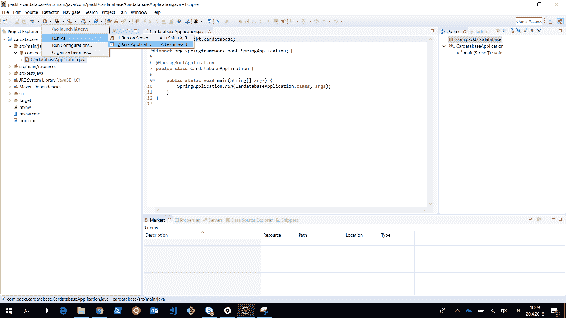

在左侧，我们有项目资源管理器，可以在其中查看项目结构和资源。项目资源管理器也用于双击打开文件。文件将在工作台中间的编辑器中打开。控制台视图位于工作台的下部。控制台视图非常重要，因为它显示应用程序的日志消息。

如果您愿意，可以为 Eclipse 获取**Spring Tool Suite**（**STS**），但在本书中我们不会使用它，因为纯净的 Eclipse 安装已经足够满足我们的需求。STS 是一组插件，使 Spring 应用程序开发更加简单（[`spring.io/tools`](https://spring.io/tools)）。

Apache Maven 是一个软件项目管理工具。Maven 的基础是**项目对象模型**（**pom**）。Maven 使软件开发过程更加简单，也统一了开发过程。您也可以在 Spring Boot 中使用另一个名为 Gradle 的项目管理工具，但在本书中，我们将专注于使用 Maven。

pom 是一个包含有关项目的基本信息的`pom.xml`文件。还有 Maven 应该下载的所有依赖项以能够构建项目。

可以在`pom.xml`文件的开头找到有关项目的基本信息，例如应用程序的版本、打包格式等。

`pom.xml`文件的最低版本应包含项目根目录、`modelVersion`、`groupId`、`artifactId`和`version`。

依赖项在依赖项部分中定义，如下所示：

```java
<?xml version="1.0" encoding="UTF-8"?>
<project  
  xsi:schemaLocation="http://maven.apache.org/POM/4.0.0 http://maven.apache.org/xsd/maven-4.0.0.xsd">
  <modelVersion>4.0.0</modelVersion>

  <groupId>com.packt</groupId>
  <artifactId>cardatabase</artifactId>
  <version>0.0.1-SNAPSHOT</version>
  <packaging>jar</packaging>

  <name>cardatabase</name>
  <description>Demo project for Spring Boot</description>

```

```java
  <parent>
    <groupId>org.springframework.boot</groupId>
    <artifactId>spring-boot-starter-parent</artifactId>
    <version>2.0.1.RELEASE</version>
    <relativePath/> <!-- lookup parent from repository -->
  </parent>

  <dependencies>
    <dependency>
      <groupId>org.springframework.boot</groupId>
      <artifactId>spring-boot-starter-web</artifactId>
    </dependency>

    <dependency>
      <groupId>org.springframework.boot</groupId>
      <artifactId>spring-boot-starter-test</artifactId>
      <scope>test</scope>
    </dependency>
  </dependencies>
</project>
```

Maven 通常是从命令行中使用的。Eclipse 包含嵌入的 Maven，并处理我们需要的所有 Maven 操作。因此，我们在这里不专注于 Maven 命令行的使用。最重要的是要了解`pom.xml`文件的结构以及如何向其中添加新的依赖项。

# 使用 Spring Initializr 创建项目

我们将使用 Spring Intializr 创建我们的后端项目，这是一个用于创建 Spring Boot 项目的基于 Web 的工具。Spring Intializr 可以在[`start.spring.io`](https://start.spring.io)找到：

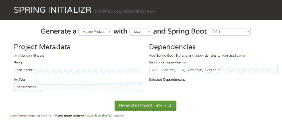

我们将使用 Java 和最新的 Spring Boot 版本生成一个 Maven 项目。在“Group”字段中，我们将定义我们的 group ID，这也将成为我们 Java 项目中的基本包。在“Artifact”字段中，我们将定义 artifact ID，这也将是我们在 Eclipse 中项目的名称。

在“Dependencies”部分，我们将选择我们项目中需要的启动器和依赖项。Spring Boot 提供了简化 Maven 配置的启动器包。Spring Boot 启动器实际上是一组您可以包含在项目中的依赖项。您可以在搜索字段中键入依赖项的关键字，也可以点击“切换到完整版本”链接查看所有可用的依赖项。我们将通过选择两个依赖项——Web 和 DevTools 来启动我们的项目。您可以在搜索字段中键入依赖项，也可以切换到完整版本并查看所有可用的启动器包和依赖项： 

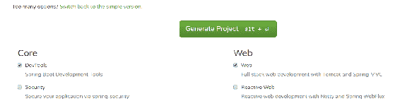

DevTools 依赖项为我们提供了 Spring Boot 开发工具，提供了自动重启功能。这样做可以加快开发速度，因为应用程序在保存更改后会自动重新启动。Web 启动器包是全栈开发的基础，并提供了嵌入式 Tomcat。

最后，您必须按“Generate Project”按钮，这将为我们生成项目启动器 ZIP 包。

# 如何运行项目

1.  在上一个主题中创建的项目 ZIP 包中提取并打开 Eclipse。

1.  我们将把项目导入到 Eclipse IDE 中。要开始导入过程，请选择“文件|导入”菜单，导入向导将打开。以下屏幕截图显示了向导的第一页：

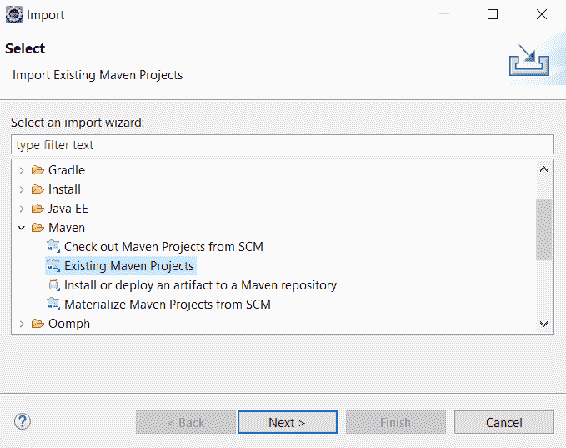

1.  在第一阶段，您应该从`Maven`文件夹下的列表中选择“Existing Maven Projects”，然后按“Next”按钮进入下一阶段。以下屏幕截图显示了导入向导的第二步：

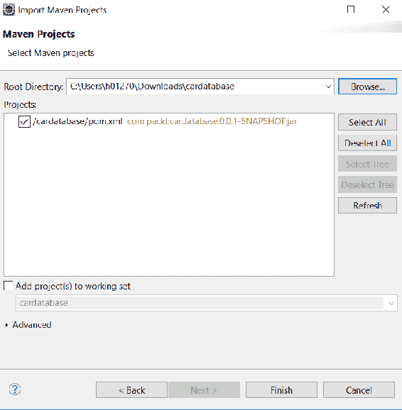

1.  在此阶段，通过按“Browse...”按钮选择提取的项目文件夹。然后，Eclipse 会找到项目文件夹根目录下的`pom.xml`文件，并在窗口的“Projects”部分中显示它。

1.  按“Finish”按钮完成导入。如果一切顺利，您应该在 Eclipse 项目资源管理器中看到`cardatabase`项目。项目准备就绪需要一段时间，因为所有依赖项将在导入后由 Maven 加载。您可以在 Eclipse 右下角看到依赖项下载的进度。以下屏幕截图显示了成功导入后的 Eclipse 项目资源管理器：

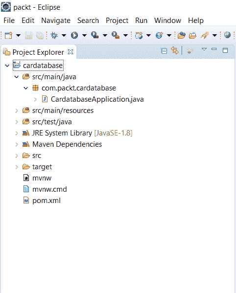

项目资源管理器还显示了我们项目的包结构，现在一开始只有一个名为`com.packt.cardatabase`的包。在该包下是我们的主应用程序类，名为`CardatabaseApplication.java`。

1.  现在，我们的应用程序中没有任何功能，但我们可以运行它并查看是否一切顺利启动。要运行项目，请双击打开主类，然后在 Eclipse 工具栏中按“Run”按钮，或者选择运行菜单并按“Run as | Java Application”：


您可以在 Eclipse 中看到控制台视图打开，其中包含有关项目执行的重要信息。这是所有日志文本和错误消息出现的视图，因此在出现问题时检查视图的内容非常重要。

现在，如果项目被正确执行，您应该在控制台的末尾看到文本`Started CardatabaseApplication in...`。以下屏幕截图显示了我们的 Spring Boot 项目启动后 Eclipse 控制台的内容：

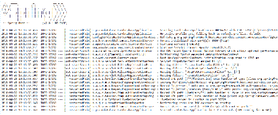

在我们项目的根目录中有`pom.xml`文件，这是我们项目的 Maven 配置文件。如果您查看文件中的依赖项，您会发现现在有我们在 Spring Initializr 页面上选择的依赖项。还有一个测试依赖项自动包含，无需任何选择。在接下来的章节中，我们将为我们的应用程序添加更多功能，然后我们将手动向`pom.xml`文件添加更多依赖项：

```java
  <dependencies>
    <dependency>
      <groupId>org.springframework.boot</groupId>
      <artifactId>spring-boot-starter-web</artifactId>
    </dependency>
    <dependency>
      <groupId>org.springframework.boot</groupId>
      <artifactId>spring-boot-devtools</artifactId>
      <scope>runtime</scope>
    </dependency>
    <dependency>
      <groupId>org.springframework.boot</groupId>
      <artifactId>spring-boot-starter-test</artifactId>
      <scope>test</scope>
    </dependency>
  </dependencies>

```

让我们仔细看一下 Spring Boot 主类。在类的开头，有`@SpringBootApplication`注释。实际上，它是多个注释的组合，例如以下内容：

| **注释** | **描述** |
| --- | --- |
| `@EnableAutoConfiguration` | 启用 Spring Boot 自动配置。Spring Boot 将根据依赖项自动配置您的项目。例如，如果您有`spring-boot-starter-web`依赖项，Spring Boot 会假定您正在开发 Web 应用程序，并相应地配置您的应用程序。 |
| `@ComponentScan` | 启用 Spring Boot 组件扫描，以查找应用程序中的所有组件。 |
| `@Configure` | 定义可用作 bean 定义来源的类。 |

以下代码显示了 Spring Boot 应用程序的`main`类：

```java
import org.springframework.boot.SpringApplication;
import org.springframework.boot.autoconfigure.SpringBootApplication;

@SpringBootApplication
public class CardatabaseApplication {

  public static void main(String[] args) {
    SpringApplication.run(CardatabaseApplication.class, args);
  }
}
```

应用程序的执行从`main`方法开始，就像标准的 Java 应用程序一样。

建议将`main`应用程序类放在其他类上方的根包中。应用程序无法正确工作的一个常见原因是 Spring Boot 无法找到一些关键类。

# Spring Boot 开发工具

Spring Boot 开发工具使应用程序开发过程更加轻松。如果将以下依赖项添加到 Maven 的`pom.xml`文件中，项目将包括开发人员工具：

```java
    <dependency>
      <groupId>org.springframework.boot</groupId>
      <artifactId>spring-boot-devtools</artifactId>
      <scope>runtime</scope>
    </dependency>
```

创建应用程序的完全打包生产版本时，开发工具将被禁用。

当您对项目类路径文件进行更改时，应用程序会自动重新启动。您可以通过向`main`类添加一行注释来测试。保存文件后，您可以在控制台中看到应用程序已重新启动：

```java
package com.packt.cardatabase;

import org.springframework.boot.SpringApplication;
import org.springframework.boot.autoconfigure.SpringBootApplication;

@SpringBootApplication
public class CardatabaseApplication {

  public static void main(String[] args) {
    // After adding this comment the application is restarted
    SpringApplication.run(CardatabaseApplication.class, args);
  }
}
```

# 日志和问题解决

Spring Boot starter 包提供了一个 logback，我们可以在没有任何配置的情况下用于日志记录。以下示例代码显示了如何使用日志记录：

```java
import org.slf4j.Logger;
import org.slf4j.LoggerFactory;
import org.springframework.boot.SpringApplication;
import org.springframework.boot.autoconfigure.SpringBootApplication;

@SpringBootApplication
public class CardatabaseApplication {
  private static final Logger logger = LoggerFactory.getLogger(CardatabaseApplication.class);
  public static void main(String[] args) {
    SpringApplication.run(CardatabaseApplication.class, args);
    logger.info("Hello Spring Boot");
  }
}
```

运行项目后，可以在控制台中看到日志消息：

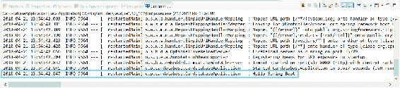

日志记录有七个不同的级别——`TRACE`，`DEBUG`，`INFO`，`WARN`，`ERROR`，`FATAL`和`OFF`。您可以在 Spring Boot 的`application.properties`文件中配置日志记录级别。该文件可以在项目内的`resources`文件夹中找到：

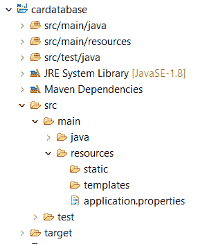

如果我们将日志级别设置为`INFO`，我们可以看到低于`INFO`级别（`INFO`，`WARN`，`ERROR`和`FATAL`）的日志消息。在下面的示例中，我们设置了根日志级别，但您也可以在包级别设置它：

```java
logging.level.root=INFO
```

现在，当您运行项目时，您将不再看到`TRACE`和`DEBUG`消息。这可能是应用程序生产版本的良好设置：

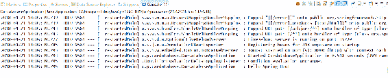

Spring Boot 默认使用 Apache Tomcat ([`tomcat.apache.org/`](http://tomcat.apache.org/))作为应用服务器。默认情况下，Tomcat 在端口`8080`上运行。您可以在`application.properties`文件中更改端口。以下设置将在端口`8081`上启动 Tomcat：

```java
server.port=8081
```

如果端口被占用，应用程序将无法启动，并且您将在控制台中看到以下消息：

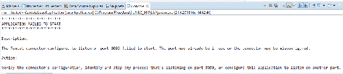

您必须停止监听端口`8080`的进程，或在 Spring Boot 应用程序中使用另一个端口。

# 安装 MariaDB

在下一章中，我们将使用 MariaDB，因此我们将在本地计算机上安装它。MariaDB 是一个广泛使用的开源关系数据库。MariaDB 适用于 Windows 和 Linux，您可以从[`downloads.mariadb.org/`](https://downloads.mariadb.org/)下载最新稳定版本。MariaDB 是在 GNU GPL 2 许可下开发的。

对于 Windows，有 MSI 安装程序，我们将在这里使用。下载安装程序并执行它。从安装向导中安装所有功能：

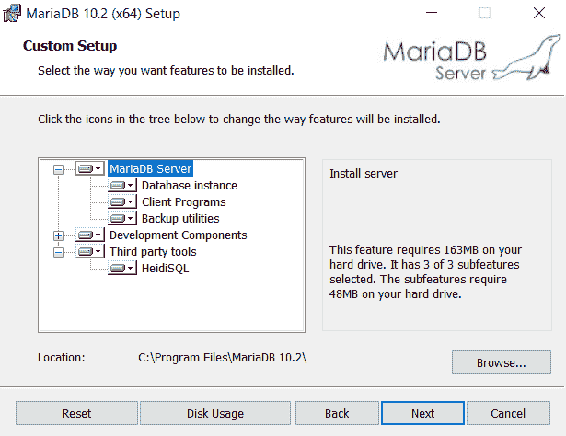

在下一步中，您应该为 root 用户提供密码。在下一章中，我们连接到数据库时需要此密码：

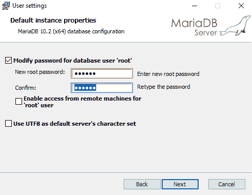

在下一阶段，我们可以使用默认设置：

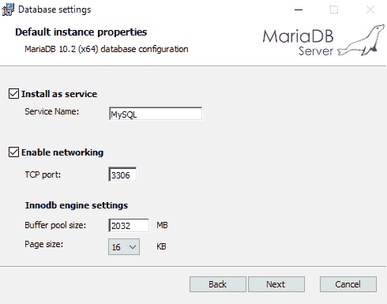

现在安装开始了，MariaDB 将安装到您的本地计算机上。安装向导将为我们安装**HeidiSQL**。这是一个图形化易于使用的数据库客户端。我们将使用它来添加新数据库并对我们的数据库进行查询。您还可以使用安装包中包含的命令提示符：

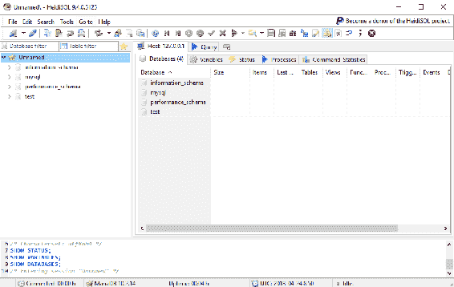

# 总结

在本章中，我们安装了使用 Spring Boot 进行后端开发所需的工具。对于 Java 开发，我们使用了 Eclipse IDE，这是一个广泛使用的编程 IDE。我们通过使用 Spring Initializr 页面创建了一个新的 Spring Boot 项目。创建项目后，它被导入到 Eclipse 中，并最终执行。我们还介绍了如何解决 Spring Boot 的常见问题以及如何查找重要的错误和日志消息。最后，我们安装了一个 MariaDB 数据库，我们将在下一章中使用。

# 问题

1.  Spring Boot 是什么？

1.  Eclipse IDE 是什么？

1.  Maven 是什么？

1.  我们如何创建一个 Spring Boot 项目？

1.  我们如何运行 Spring Boot 项目？

1.  我们如何在 Spring Boot 中使用日志记录？

1.  我们如何在 Eclipse 中查找错误和日志消息？

# 进一步阅读

Packt 还有其他很好的资源可供学习 Spring Boot：

+   [`www.packtpub.com/application-development/learning-spring-boot-20-second-edition`](https://www.packtpub.com/application-development/learning-spring-boot-20-second-edition)

+   [`www.packtpub.com/web-development/spring-boot-getting-started-integrated-course`](https://www.packtpub.com/web-development/spring-boot-getting-started-integrated-course)
