# 第二章：使用 JPA 创建和访问数据库

本章介绍了如何在 Spring Boot 中使用 JPA。我们将使用实体类创建数据库。在第一阶段，我们将使用 H2 内存数据库进行开发和演示。H2 是一个内存中的 SQL 数据库，非常适合快速开发或演示目的。在第二阶段，我们将从 H2 转移到使用 MariaDB。本章还描述了 CRUD 存储库的创建以及数据库表之间的一对多连接。

在本章中，我们将研究以下内容：

+   使用 JPA 的基础知识和好处

+   如何使用实体类定义数据库

+   如何使用 Spring Boot 后端创建数据库

# 技术要求

使用 Spring Boot 需要 Java SDK 版本 8 或更高版本（[`www.oracle.com/technetwork/java/javase/downloads/index.html`](http://www.oracle.com/technetwork/java/javase/downloads/index.html)）。

为了创建数据库应用程序，需要安装 MariaDB（[`downloads.mariadb.org/`](https://downloads.mariadb.org/)）。

# ORM、JPA 和 Hibernate 的基础知识和好处

**对象关系映射**（**ORM**）是一种技术，允许您使用面向对象的编程范式从数据库中提取和操作数据。ORM 对程序员来说非常好，因为它依赖于面向对象的概念，而不是数据库结构。它还可以加快开发速度，减少源代码量。ORM 大多数独立于数据库，开发人员不必担心特定于供应商的 SQL 语句。

**Java 持久 API**（**JPA**）为 Java 开发人员提供了对象关系映射。JPA 实体是一个 Java 类，表示数据库表的结构。实体类的字段表示数据库表的列。

Hibernate 是最流行的基于 Java 的 JPA 实现，它在 Spring Boot 中作为默认使用。Hibernate 是一个成熟的产品，在大型应用程序中被广泛使用。

# 创建实体类

实体类是一个简单的 Java 类，带有 JPA 的`@Entity`注解。实体类使用标准的 JavaBean 命名约定，并具有适当的 getter 和 setter 方法。类字段具有私有可见性。

当应用程序初始化时，JPA 会创建一个名为类名的数据库表。如果要为数据库表使用其他名称，可以使用`@Table`注解。

为了能够使用 JPA 和 H2 数据库，我们必须将以下依赖项添加到`pom.xml`文件中：

```java
    <dependency>
      <groupId>org.springframework.boot</groupId>
      <artifactId>spring-boot-starter-data-jpa</artifactId>
    </dependency>
    <dependency>
        <groupId>com.h2database</groupId>
        <artifactId>h2</artifactId>
        <scope>runtime</scope>
    </dependency>
```

以下是创建实体类的步骤：

1.  要在 Spring Boot 中创建实体类，我们首先将为实体创建自己的包。该包应该在根包下创建。

1.  在 Eclipse 项目资源管理器中激活根包，右键单击显示菜单。

1.  从菜单中选择 New | Package。以下截图显示了为实体类创建包：

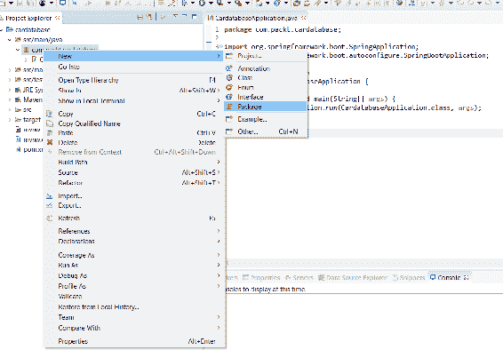

1.  我们将包命名为`com.packt.cardatabase.domain`：

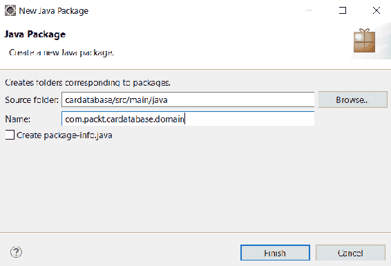

1.  接下来，我们创建实体类。激活一个新的实体包，右键单击，选择菜单中的 New | Class。因为我们要创建一个汽车数据库，实体类的名称是`Car`。在`Name`字段中输入`Car`，然后按下`Finish`按钮：

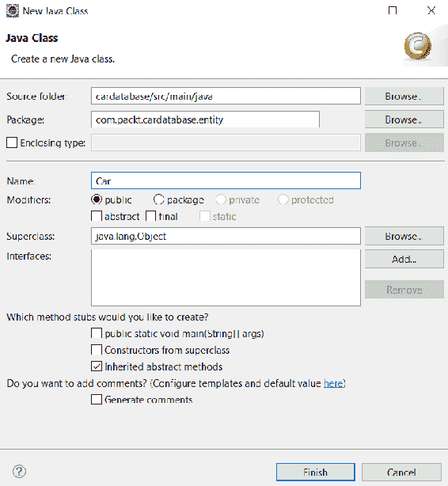

1.  在项目资源管理器中双击打开编辑器中的`Car`类文件。首先，我们必须使用`@Entity`注解对类进行注释。`Entity`注解从`javax.persistence`包中导入：

```java
      package com.packt.cardatabase.domain;

      import javax.persistence.Entity;

      @Entity
      public class Car {

      }
```

您可以使用 Eclipse IDE 中的*Ctrl* + *Shift* + *O*快捷键自动导入缺少的包。

1.  接下来，我们为我们的类添加一些字段。实体类字段映射到数据库表列。实体类还必须包含一个唯一的 ID，该 ID 用作数据库中的主键：

```java
      package com.packt.cardatabase.domain;

      import javax.persistence.Entity;
      import javax.persistence.GeneratedValue;
      import javax.persistence.GenerationType;
      import javax.persistence.Id;

      @Entity
      public class Car {
        @Id
        @GeneratedValue(strategy=GenerationType.AUTO)
        private long id;
        private String brand, model, color, registerNumber;
        private int year, price;
      }
```

使用`@Id`注释定义主键。`@GeneratedValue`注释定义 ID 由数据库自动生成。我们还可以定义我们的键生成策略。类型`AUTO`表示 JPA 提供程序为特定数据库选择最佳策略。您还可以通过使用`@Id`注释对多个属性进行注释来创建复合主键。

默认情况下，数据库列的命名按类字段命名。如果要使用其他命名约定，可以使用`@Column`注释。使用`@Column`注释，还可以定义列的长度以及列是否可为空。以下代码显示了使用`@Column`注释的示例。通过这个定义，在数据库中列的名称是`desc`，列的长度是`512`，并且它是不可为空的：

```java
@Column(name="desc", nullable=false, length=512)
private String description
```

1.  最后，我们为实体类添加 getter、setter 和带属性的构造函数。由于自动生成 ID，我们不需要在构造函数中添加 ID 字段。`Car`实体类构造函数的源代码如下：

Eclipse 提供了自动生成 getter、setter 和构造函数的功能。将光标放在类内并右键单击。从菜单中选择“Source | Generate Getters and Setters...”或“Source | Generate Constructor using fields...”

```java
package com.packt.cardatabase.domain;

import javax.persistence.Entity;
import javax.persistence.GeneratedValue;
import javax.persistence.GenerationType;
import javax.persistence.Id;

@Entity
public class Car {
  @Id
  @GeneratedValue(strategy=GenerationType.AUTO)
  private long id;
  private String brand, model, color, registerNumber;
  private int year, price;

  public Car() {}

  public Car(String brand, String model, String color, 
    String registerNumber, int year, int price) {
    super();
    this.brand = brand;
    this.model = model;
    this.color = color;
    this.registerNumber = registerNumber;
    this.year = year;
    this.price = price;
  }
```

以下是`Car`实体类的 getter 和 setter 的源代码：

```java
  public String getBrand() {
    return brand;
  }
  public void setBrand(String brand) {
    this.brand = brand;
  }
  public String getModel() {
    return model;
  }
  public void setModel(String model) {
    this.model = model;
  }
  public String getColor() {
    return color;
  }
  public void setColor(String color) {
    this.color = color;
  }
  public String getRegisterNumber() {
    return registerNumber;
  }
  public void setRegisterNumber(String registerNumber) {
    this.registerNumber = registerNumber;
  }
  public int getYear() {
    return year;
  }
  public void setYear(int year) {
    this.year = year;
  }
  public int getPrice() {
    return price;
  }
  public void setPrice(int price) {
    this.price = price;
  } 
}
```

当我们运行应用程序时，数据库中必须创建名为`car`的表。为了确保这一点，我们将在`application.properties`文件中添加一个新属性。这将使 SQL 语句的日志记录到控制台：

```java
spring.jpa.show-sql=true
```

当运行应用程序时，我们现在可以看到表创建语句：

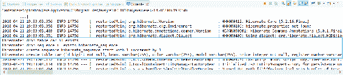

H2 提供了一个基于 Web 的控制台，可用于探索数据库并执行 SQL 语句。要启用控制台，我们必须将以下行添加到`application.properties`文件中。第一个设置启用 H2 控制台，第二个设置定义了我们可以使用的端点来访问控制台：

```java
spring.h2.console.enabled=true
spring.h2.console.path=/h2-console
```

您可以通过在 Web 浏览器中导航到`localhost:8080/h2-console`来访问 H2 控制台。在登录窗口中，使用`jdbc:h2:mem:testdb`作为 JDBC URL，并在密码字段中留空。按下“连接”按钮登录到控制台：

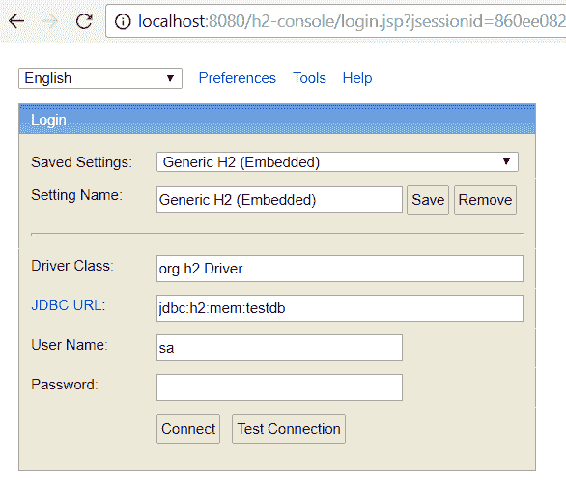

现在您可以在数据库中看到我们的`car`表。您可能会注意到注册号之间有一个下划线。这是由于属性（`registerNumber`）的驼峰命名法：

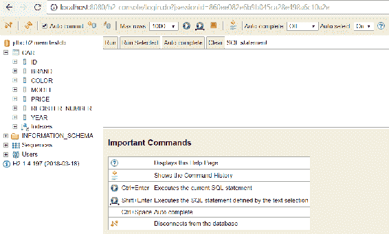

# 创建 CRUD 存储库

Spring Boot Data JPA 为 CRUD 操作提供了`CrudRepository`接口。它为我们的实体类提供了 CRUD 功能。

现在，我们将在`domain`包中创建我们的存储库，如下所示：

1.  在`domain`包中创建一个名为`CarRepository`的新类，并根据以下代码片段修改文件：

```java
      package com.packt.cardatabase.domain;

      import org.springframework.data.repository.CrudRepository;

      public interface CarRepository extends CrudRepository <Car, Long> {

      }
```

我们的`CarRepository`现在扩展了 Spring Boot JPA 的`CrudRepository`接口。`<Car, Long>`类型参数定义了这是`Car`实体类的存储库，ID 字段的类型是 long。

`CrudRepository`提供了多个 CRUD 方法，我们现在可以开始使用。以下表列出了最常用的方法：

| **方法** | **描述** |
| --- | --- |
| `long count()` | 返回实体的数量 |
| `Iterable<T> findAll()` | 返回给定类型的所有项目 |
| `Optional<T> findById(ID Id)` | 通过 id 返回一个项目 |
| `void delete(T entity)` | 删除实体 |
| `void deleteAll()` | 删除存储库的所有实体 |
| `<S extends T> save(S entity)` | 保存实体 |

如果方法只返回一个项目，则返回`Optional<T>`而不是`T`。`Optional`类在 Java 8 SE 中引入。`Optional`是一种单值容器类型，可以有值，也可以没有。通过使用`Optional`，我们可以防止空指针异常。

1.  现在我们准备向我们的 H2 数据库添加一些演示数据。为此，我们将使用 Spring Boot 的`CommandLineRunner`。`CommandLineRunner`接口允许我们在应用程序完全启动之前执行额外的代码。因此，这是向数据库添加演示数据的好时机。`CommandLineRunner`位于主类中：

```java
      import org.springframework.boot.CommandLineRunner;
      import org.springframework.boot.SpringApplication;
      import org.springframework.boot.autoconfigure.SpringBootApplication;
      import org.springframework.context.annotation.Bean;

      @SpringBootApplication
      public class CardatabaseApplication {

        public static void main(String[] args) {
          SpringApplication.run(CardatabaseApplication.class, args);
        }

        @Bean
        CommandLineRunner runner(){
          return args -> {
            // Place your code here
          };
        } 
      }
```

1.  接下来，我们必须将我们的 car repository 注入到主类中，以便能够将新的 car 对象保存到数据库中。使用`@Autowired`注解来启用依赖注入。依赖注入允许我们将依赖项传递给对象。在我们注入了存储库类之后，我们可以使用它提供的 CRUD 方法。以下示例代码显示了如何向数据库中插入一些汽车：

```java
      import org.springframework.beans.factory.annotation.Autowired;
      import org.springframework.boot.CommandLineRunner;
      import org.springframework.boot.SpringApplication;
      import org.springframework.boot.autoconfigure.SpringBootApplication;
      import org.springframework.context.annotation.Bean;

      import com.packt.cardatabase.domain.Car;
      import com.packt.cardatabase.domain.CarRepository;

      @SpringBootApplication
      public class CardatabaseApplication {
        @Autowired 
        private CarRepository repository;

        public static void main(String[] args) {
          SpringApplication.run(CardatabaseApplication.class, args);
        }

        @Bean
        CommandLineRunner runner(){
          return args -> {
            // Save demo data to database
            repository.save(new Car("Ford", "Mustang", "Red",
             "ADF-1121", 2017, 59000));
            repository.save(new Car("Nissan", "Leaf", "White",
             "SSJ-3002", 2014, 29000));
```

```java
            repository.save(new Car("Toyota", "Prius", "Silver",
             "KKO-0212", 2018, 39000));
          };
        } 
      }
```

`Insert`语句可以在应用程序执行后在 Eclipse 控制台中看到：

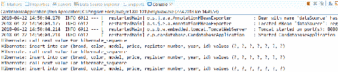

您还可以使用 H2 控制台从数据库中获取汽车，如下截图所示：

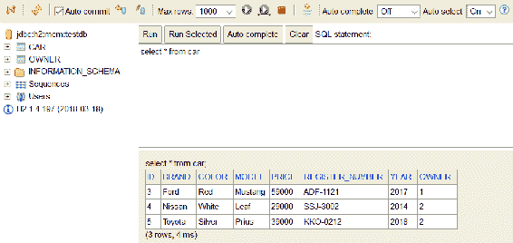

您可以在 Spring Data 存储库中定义自己的查询。查询必须以前缀开头，例如`findBy`。在前缀之后，您定义在查询中使用的实体类字段。以下是三个简单查询的示例代码：

```java
import java.util.List;

import org.springframework.data.repository.CrudRepository;

public interface CarRepository extends CrudRepository <Car, Long> {
  // Fetch cars by brand
  List<Car> findByBrand(String brand);

  // Fetch cars by color
  List<Car> findByColor(String color);

  // Fetch cars by year
  List<Car> findByYear(int year);

}
```

在`By`关键字之后可以有多个字段，使用`And`或`Or`关键字连接：

```java
package com.packt.cardatabase.domain;

import java.util.List;

import org.springframework.data.repository.CrudRepository;

public interface CarRepository extends CrudRepository <Car, Long> {
  // Fetch cars by brand and model
  List<Car> findByBrandAndModel(String brand, String model);

  // Fetch cars by brand or color
  List<Car> findByBrandOrColor(String brand, String color); 
}
```

可以使用查询方法中的`OrderBy`关键字对查询进行排序：

```java
package com.packt.cardatabase.domain;

import java.util.List;

import org.springframework.data.repository.CrudRepository;

public interface CarRepository extends CrudRepository <Car, Long> {
  // Fetch cars by brand and sort by year
  List<Car> findByBrandOrderByYearAsc(String brand);
}
```

您还可以通过`@Query`注解使用 SQL 语句创建查询。以下示例展示了在`CrudRepository`中使用 SQL 查询的用法：

```java
package com.packt.cardatabase.domain;

import java.util.List;

import org.springframework.data.repository.CrudRepository;

public interface CarRepository extends CrudRepository <Car, Long> {
  // Fetch cars by brand using SQL
  @Query("select c from Car c where c.brand = ?1")
  List<Car> findByBrand(String brand);
}
```

您还可以使用`@Query`注解进行更高级的表达式，例如`like`。以下示例展示了在`CrudRepository`中使用`like`查询的用法：

```java
package com.packt.cardatabase.domain;

import java.util.List;

import org.springframework.data.repository.CrudRepository;

public interface CarRepository extends CrudRepository <Car, Long> {
  // Fetch cars by brand using SQL
  @Query("select c from Car c where c.brand like %?1")
  List<Car> findByBrandEndsWith(String brand);
}
```

Spring Data JPA 还提供了`PagingAndSortingRepository`，它扩展了`CrudRepository`。它提供了使用分页和排序获取实体的方法。如果您处理大量数据，这是一个很好的选择。`PagingAndSortingRepository`可以类似于我们使用`CrudRepository`创建：

```java
package com.packt.cardatabase.domain;

import org.springframework.data.repository.PagingAndSortingRepository;

```

```java
public interface CarRepository extends PagingAndSortingRepository<Car, Long> {

}
```

在这种情况下，您现在拥有了存储库提供的两个新的附加方法：

| **方法** | **描述** |
| --- | --- |
| `Iterable<T> findAll(Sort sort)` | 返回按给定选项排序的所有实体 |
| `Page<T> findAll(Pageable pageable)` | 根据给定的分页选项返回所有实体 |

# 表之间的关系

接下来，我们创建一个名为`owner`的新表，它与`car`表具有一对多的关系。所有者可以拥有多辆汽车，但一辆汽车只能有一个所有者。以下的 UML 图显示了表之间的关系：

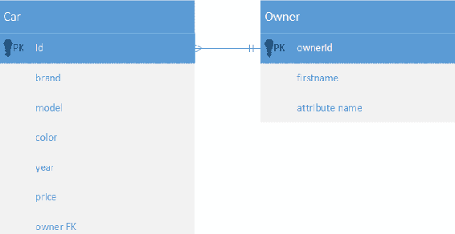

以下是创建新表的步骤：

1.  首先，在`domain`包中创建`Owner`实体和存储库。`Owner`实体和存储库的创建方式与`Car`类相似。以下是`Owner`实体类和`OwnerRepository`的源代码：

```java
      // Owner.java

      package com.packt.cardatabase.domain;

      import javax.persistence.Entity;
      import javax.persistence.GeneratedValue;
      import javax.persistence.GenerationType;
      import javax.persistence.Id;

      @Entity
      public class Owner {
        @Id
        @GeneratedValue(strategy=GenerationType.AUTO)
        private long ownerid;
        private String firstname, lastname;

        public Owner() {}

        public Owner(String firstname, String lastname) {
          super();
          this.firstname = firstname;
          this.lastname = lastname;
        }

        public long getOwnerid() {
          return ownerid;
        }
        public void setOwnerid(long ownerid) {
          this.ownerid = ownerid;
        }
        public String getFirstname() {
          return firstname;
        }
        public void setFirstname(String firstname) {
          this.firstname = firstname;
        }
        public String getLastname() {
          return lastname;
        }
        public void setLastname(String lastname) {
          this.lastname = lastname;
        } 
      }
```

```java
      // OwnerRepository.java

      package com.packt.cardatabase.domain;

      import org.springframework.data.repository.CrudRepository;

```

```java
      public interface OwnerRepository extends CrudRepository<Owner, Long> 
      {

      }
```

1.  在这个阶段，检查一切是否正确完成是很重要的。运行项目并检查数据库表是否都已创建，并且控制台中没有错误。下面的截图显示了在创建表时控制台的消息：

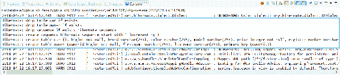

现在，我们的 domain 包含两个实体类和存储库：

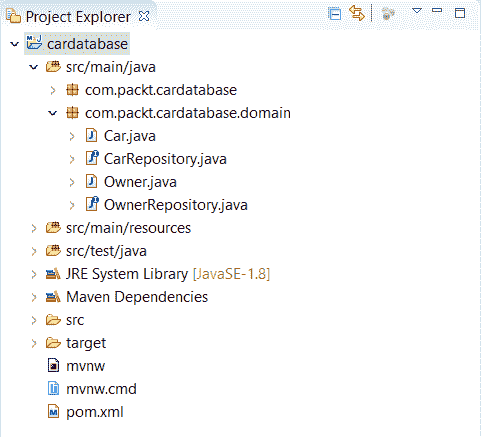

1.  一对多关系可以通过使用`@ManyToOne`和`@OneToMany`注解来添加。在包含外键的汽车实体类中，您将使用`@ManyToOne`注解定义与所有者的关系。还要为所有者字段添加 getter 和 setter。建议对所有关联使用`FetchType.LAZY`。对于`toMany`关系，这是默认值，但对于`toOne`关系，您应该定义它。`FetchType`定义了从数据库中获取数据的策略。该值可以是`EAGER`或`LAZY`。在我们的情况下，懒惰策略意味着当从数据库中获取所有者时，将在需要时获取与所有者关联的所有汽车。`Eager`意味着汽车将立即与所有者一起获取。以下源代码显示了如何在`Car`类中定义一对多关系：

```java
      // Car.java

      @ManyToOne(fetch = FetchType.LAZY)
      @JoinColumn(name = "owner")
      private Owner owner;

      //Getter and setter
      public Owner getOwner() {
        return owner;
      }

      public void setOwner(Owner owner) {
        this.owner = owner;
      }
```

在所有者实体站点上，使用`@OneToMany`注解定义了关系。字段的类型是`List<Car>`，因为所有者可能拥有多辆汽车。还为此添加 getter 和 setter：

```java
      // Owner.java  

      @OneToMany(cascade = CascadeType.ALL, mappedBy="owner")
      private List<Car> cars;

      //Getter and setter
      public List<Car> getCars() {
        return cars;
      }

      public void setCars(List<Car> cars) {
        this.cars = cars;
      }
```

`@OneToMany`注解有两个我们正在使用的属性。`cascade`属性定义了级联如何影响实体。属性设置`ALL`意味着如果所有者被删除，与该所有者关联的汽车也将被删除。`mappedBy="owner"`属性设置告诉我们`Car`类具有所有者字段，这是该关系的外键。

当您运行项目时，您可以从控制台看到关系现在已经创建：

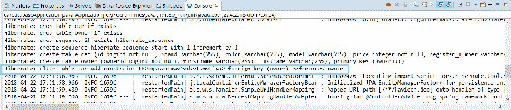

1.  现在，我们可以使用`CommandLineRunner`向数据库添加一些所有者。让我们还修改`Car`实体类的构造函数并在那里添加一个所有者：

```java
      // Car.java constructor 

      public Car(String brand, String model, String color,
      String registerNumber, int year, int price, Owner owner) {
        super();
        this.brand = brand;
        this.model = model;
        this.color = color;
        this.registerNumber = registerNumber;
        this.year = year;
        this.price = price;
        this.owner = owner;
      }
```

1.  我们首先创建两个所有者对象并将其保存到数据库中。为了保存所有者，我们还必须将`OwnerRepository`注入到主类中。然后我们通过`Car`构造函数将所有者连接到汽车。以下是应用程序主类`CardatabaseApplication`的源代码：

```java
      @SpringBootApplication
      public class CardatabaseApplication {
        // Inject repositories
        @Autowired 
        private CarRepository repository;

        @Autowired 
        private OwnerRepository orepository;

        public static void main(String[] args) {
          SpringApplication.run(CardatabaseApplication.class, args);
        }

        @Bean
        CommandLineRunner runner() {
          return args -> {
            // Add owner objects and save these to db
            Owner owner1 = new Owner("John" , "Johnson");
            Owner owner2 = new Owner("Mary" , "Robinson");
            orepository.save(owner1);
            orepository.save(owner2);

            // Add car object with link to owners and save these to db.
            Car car = new Car("Ford", "Mustang", "Red", 
                "ADF-1121", 2017, 59000, owner1);
            repository.save(car);
            car = new Car("Nissan", "Leaf", "White",
                "SSJ-3002", 2014, 29000, owner2);
            repository.save(car);
            car = new Car("Toyota", "Prius", "Silver",
                "KKO-0212", 2018, 39000, owner2);
            repository.save(car);
          };
        } 
      }
```

如果现在运行应用程序并从数据库中获取汽车，您会发现所有者现在与汽车关联起来了。

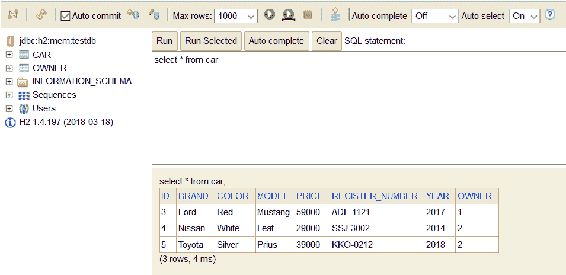

如果要创建多对多关系，也就是说，在实践中，一个所有者可以拥有多辆汽车，一辆汽车可以有多个所有者，您应该使用`@ManyToMany`注解。在我们的示例应用程序中，我们将使用一对多关系，但以下是如何将关系更改为多对多的示例。在多对多关系中，建议使用`Set`而不是`List`与 hibernate 一起使用：

1.  在`Car`实体类的多对多关系中，以以下方式定义 getter 和 setter：

```java
      @ManyToMany(mappedBy = "cars") 
      private Set<Owner> owners; 

      public Set<Owner> getOwners() {
        return owners;
      }

      public void setOwners(Set<Owner> owners) {
        this.owners = owners;
      }
```

在所有者实体中，定义如下：

```java
      @ManyToMany(cascade = CascadeType.MERGE)
      @JoinTable(name = "car_owner", joinColumns = { @JoinColumn(name =
       "ownerid") }, inverseJoinColumns = { @JoinColumn(name = "id") }) 
      private Set<Car> cars = new HashSet<Car>(0); 

      public Set<Car> getCars() {
        return cars;
      }

      public void setCars(Set<Car> cars) {
        this.cars = cars;
      }
```

1.  现在，如果运行应用程序，将创建一个新的连接表，该表位于`car`和`owner`表之间。使用`@JoinTable`注解定义连接表。通过该注解，我们可以设置连接表的名称和连接列。以下是在使用多对多关系时数据库结构的屏幕截图：


# 设置 MariaDB 数据库

现在，我们将数据库从 H2 切换到 MariaDB。数据库表仍然由 JPA 自动创建。但在运行应用程序之前，我们必须为其创建一个数据库。可以使用 HeidiSQL 创建数据库。打开 HeidiSQL，并按照以下步骤操作：

1.  右键单击数据库列表中的鼠标。

1.  然后，选择新建|数据库：

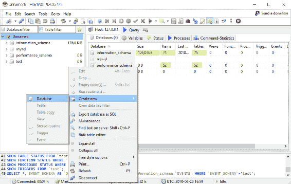

1.  让我们将数据库命名为`cardb`。按下 OK 后，您应该在数据库列表中看到新的`cardb`：

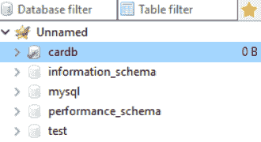

1.  在应用程序中，我们向`pom.xml`文件添加了 MariaDB 依赖项，并删除了不再需要的 H2 依赖项：

```java
      <dependency>
        <groupId>org.mariadb.jdbc</groupId>
        <artifactId>mariadb-java-client</artifactId>
      </dependency> 
```

1.  在`application.properties`文件中，您定义了数据库连接。首先，您将定义数据库的`url`、`username`、`password`和数据库驱动程序类。`spring.jpa.generate-ddl`设置定义了 JPA 是否应初始化数据库（`true`/`false`）。`spring.jpa.hibernate.ddl-auto`设置定义了数据库初始化的行为。可能的值有`none`、`validate`、`update`、`create`和`create-drop`。Create-drop 意味着在应用程序启动时创建数据库，并在应用程序停止时删除数据库。如果您不定义任何值，create-drop 也是默认值。Create 值仅在应用程序启动时创建数据库。Update 值创建数据库并在架构更改时更新架构。

```java
      spring.datasource.url=jdbc:mariadb://localhost:3306/cardb
      spring.datasource.username=root
      spring.datasource.password=YOUR_PASSWORD
      spring.datasource.driver-class-name=org.mariadb.jdbc.Driver

      spring.jpa.generate-ddl=true
      spring.jpa.hibernate.ddl-auto=create-drop
```

1.  现在，在运行应用程序后，您应该在 MariaDB 中看到表。以下截图显示了数据库创建后的 HeidiSQL UI。您的应用程序现在已准备好与 MariaDB 一起使用：

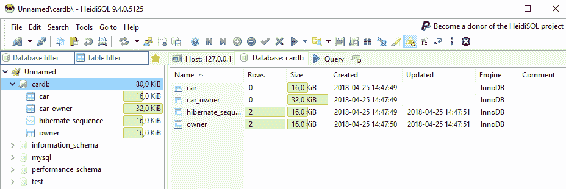

# 总结

在本章中，我们使用 JPA 来创建 Spring Boot 应用程序数据库。首先，我们创建了实体类，这些类映射到数据库表。然后，我们为我们的实体类创建了`CrudRepository`，它为实体提供了 CRUD 操作。之后，我们通过使用`CommandLineRunner`成功向我们的数据库添加了一些演示数据。我们还在两个实体之间创建了一对多的关系。在本章的开头，我们使用了 H2 内存数据库，而在结尾，我们将数据库切换到了 MariaDB。在下一章中，我们将为我们的后端创建 RESTful web 服务。

# 问题

1.  ORM、JPA 和 Hibernate 是什么？

1.  如何创建实体类？

1.  如何创建`CrudRepository`？

1.  `CrudRepository`如何为您的应用程序提供支持？

1.  如何在表之间创建一对多的关系？

1.  如何使用 Spring Boot 向数据库添加演示数据？

1.  如何访问 H2 控制台？

1.  如何将 Spring Boot 应用程序连接到 MariaDB？

# 进一步阅读

Packt 还有其他学习 Spring Boot 的资源：

+   [`www.packtpub.com/application-development/learning-spring-boot-20-second-edition`](https://www.packtpub.com/application-development/learning-spring-boot-20-second-edition)

+   [`www.packtpub.com/web-development/spring-boot-getting-started-integrated-course`](https://www.packtpub.com/web-development/spring-boot-getting-started-integrated-course)
