# 第三章：使用 Spring Boot 创建 RESTful Web 服务

在本章中，我们将首先使用控制器类创建一个 RESTful Web 服务。之后，我们将演示如何使用 Spring Data REST 创建一个自动覆盖所有 CRUD 功能的 RESTful Web 服务。我们将使用前一章中创建的数据库应用作为起点。

在本章中，我们将研究以下内容：

+   RESTful Web 服务是什么

+   如何使用 Spring Boot 创建 RESTful Web 服务

+   如何测试 RESTful web 服务

# 技术要求

之前创建的 Spring Boot 应用程序是必需的。

需要使用 Postman、cURL 或其他适当的工具来使用各种 HTTP 方法传输数据。

# 使用 Spring Boot 创建 RESTful Web 服务

Web 服务是使用 HTTP 协议在互联网上进行通信的应用程序。有许多不同类型的 Web 服务架构，但所有设计的主要思想都是相同的。在本书中，我们正在从目前非常流行的设计中创建一个 RESTful Web 服务。

# REST 的基础知识

**REST**（**表述状态转移**）是一种用于创建 Web 服务的架构风格。REST 不是标准，但它定义了一组由 Roy Fielding 定义的约束。这六个约束如下：

+   **无状态**：服务器不保存有关客户端状态的任何信息。

+   **客户端服务器**：客户端和服务器独立运行。服务器不会在没有客户端请求的情况下发送任何信息。

+   **可缓存**：许多客户端经常请求相同的资源，因此缓存响应以提高性能是有用的。

+   **统一接口**：来自不同客户端的请求看起来是相同的。客户端可以是浏览器、Java 应用程序和移动应用程序等。

+   **分层系统**：REST 允许我们使用分层系统架构。

+   **按需编码**：这是一个可选的约束。

统一接口是一个重要的约束，它定义了每个 REST 架构应该具有以下元素：

+   **资源的识别**：有资源及其唯一标识符，例如基于 Web 的 REST 服务中的 URI。REST 资源应该公开易于理解的目录结构 URI。因此，良好的资源命名策略非常重要。

+   **通过表示来操作资源**：当向资源发出请求时，服务器会以资源的表示形式做出响应。通常，表示的格式是 JSON 或 XML。

+   **自描述消息**：消息应该包含足够的信息，以便服务器知道如何处理它们。

+   **超媒体和应用状态引擎（HATEOAS）**：响应可以包含到服务的其他区域的链接。

在接下来的主题中，我们将开发一个遵循 REST 架构原则的 RESTful Web 服务。

# 创建 RESTful Web 服务

在 Spring Boot 中，所有的 HTTP 请求都由控制器类处理。为了能够创建一个 RESTful web 服务，首先我们必须创建一个控制器类。我们将为我们的控制器创建自己的 Java 包：

1.  在 Eclipse 项目资源管理器中激活根包并右键单击。从菜单中选择 New | Package。我们将为我们的新包命名为`com.packt.cardatabase.web`：

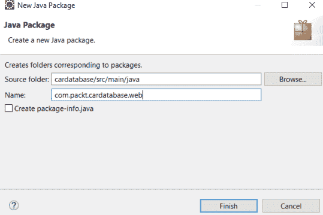

1.  接下来，我们将在一个新的 Web 包中创建一个新的控制器类。在 Eclipse 项目资源管理器中激活`com.packt.cardatabase.web`包并右键单击。从菜单中选择 New | Class。我们将为我们的类命名为`CarController`：

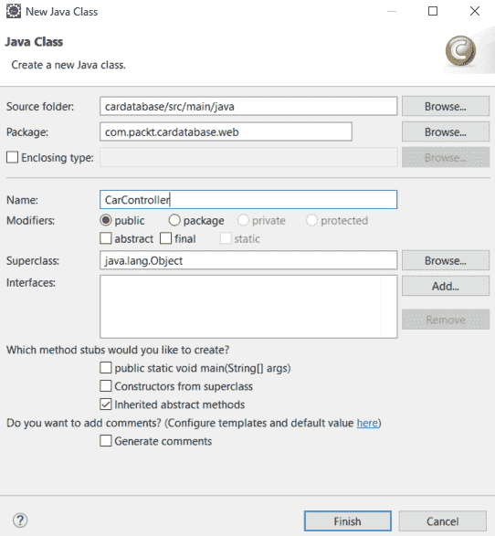

1.  现在，您的项目结构应该如下截图所示：

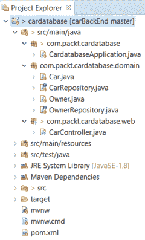

如果您意外地在错误的包中创建类，您可以在 Eclipse 项目资源管理器之间拖放文件。有时，当您进行一些更改时，Eclipse 项目资源管理器视图可能无法正确呈现。刷新项目资源管理器有所帮助（激活项目资源管理器并按*F5*）。

1.  在编辑窗口中打开您的控制器类，并在类定义之前添加`@RestController`注解。请参阅以下源代码。`@RestController`注解标识这个类将成为 RESTful Web 服务的控制器：

```java
      package com.packt.cardatabase.web;

      import org.springframework.web.bind.annotation.RestController;

      @RestController
      public class CarController { 
      }
```

1.  接下来，我们在我们的控制器类中添加一个新的方法。该方法使用`@RequestMapping`注解进行标注，定义了方法映射到的端点。接下来，您可以看到示例源代码。在这个例子中，当用户导航到`/cars`端点时，`getCars()`方法被执行：

```java
      package com.packt.cardatabase.web;

      import org.springframework.web.bind.annotation.RestController;

      @RestController
      public class CarController {
        @RequestMapping("/cars")
        public Iterable<Car> getCars() {

        } 
      }
```

`getCars()`方法返回所有汽车对象，然后由 Jackson 库转换为 JSON 对象。

默认情况下，`@RequestMapping`处理所有 HTTP 方法（`GET`，`PUT`，`POST`等）的请求。您可以使用以下`@RequestMapping("/cars", method=GET)`参数定义接受的方法。现在，这个方法只处理来自`/cars`端点的`GET`请求。

1.  为了能够从数据库中返回汽车，我们必须将我们的`CarRepository`注入到控制器中。然后，我们可以使用存储库提供的`findAll()`方法来获取所有汽车。以下源代码显示了控制器代码：

```java
      package com.packt.cardatabase.web;

      import org.springframework.beans.factory.annotation.Autowired;
      import org.springframework.web.bind.annotation.RequestMapping;
      import org.springframework.web.bind.annotation.RestController;

      import com.packt.cardatabase.domain.Car;
      import com.packt.cardatabase.domain.CarRepository;

      @RestController
      public class CarController {
        @Autowired
        private CarRepository repository;

        @RequestMapping("/cars")
        public Iterable<Car> getCars() {
          return repository.findAll();
        }
      }
```

1.  现在，我们准备运行我们的应用程序并导航到`localhost:8080/cars`。我们可以看到有些问题，应用程序似乎陷入了无限循环。这是由于我们的汽车和所有者表之间的一对多关系导致的。实际上会发生什么——首先，汽车被序列化，它包含一个所有者，然后被序列化，反过来，包含汽车，然后被序列化...依此类推。为了避免这种情况，我们必须在`Owner`类的`cars`字段上添加`@JsonIgnore`注解：

```java
      // Owner.java

      @OneToMany(cascade = CascadeType.ALL, mappedBy="owner")
      @JsonIgnore
      private List<Car> cars;
```

1.  现在，当您运行应用程序并导航到`localhost:8080/cars`时，一切都应该如预期般进行，并且您将以 JSON 格式从数据库中获取所有的汽车，如下截图所示：

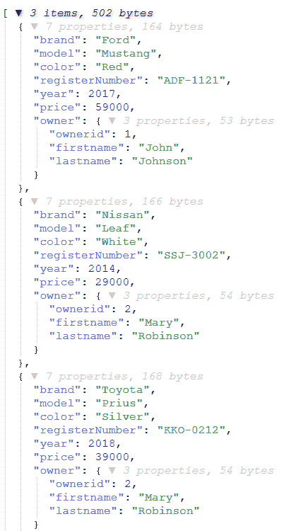

我们已经完成了我们的第一个 RESTful Web 服务，它返回所有的汽车。Spring Boot 提供了一个更强大的方式来创建 RESTful Web 服务，这将在下一个主题中进行探讨。

# 使用 Spring Data REST

Spring Data REST 是 Spring Data 项目的一部分。它提供了一种简单快捷的方式来使用 Spring 实现 RESTful Web 服务。要开始使用 Spring Data REST，您必须将以下依赖项添加到`pom.xml`文件中：

```java
<dependency>
  <groupId>org.springframework.boot</groupId>
  <artifactId>spring-boot-starter-data-rest</artifactId>
</dependency>
```

默认情况下，Spring Data REST 会查找应用程序中的所有公共存储库，并为您的实体自动创建 RESTful Web 服务。

您可以在`application.properties`文件中定义服务的端点：

```java
spring.data.rest.basePath=/api
```

现在，您可以从`localhost:8080/api`端点访问 RESTful Web 服务。通过调用服务的根端点，它返回可用的资源。Spring Data REST 以**HAL**（**超文本应用语言**）格式返回 JSON 数据。HAL 格式提供了一套约定，用于在 JSON 中表示超链接，使得前端开发人员更容易使用您的 RESTful Web 服务：

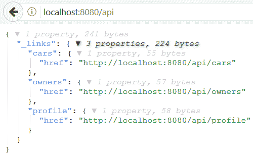

我们可以看到有指向汽车和所有者实体服务的链接。Spring Data Rest 服务的路径名是从实体名称派生的。然后将名称变为复数形式并取消大写。例如，实体 Car 服务的路径名将被命名为`cars`。配置文件链接由 Spring Data Rest 生成，其中包含特定于应用程序的元数据。

现在，我们开始更仔细地检查不同的服务。有多种工具可用于测试和使用 RESTful Web 服务。在本书中，我们使用 Postman，但您也可以使用您熟悉的工具，如 cURL。Postman 可以作为桌面应用程序或作为浏览器插件获取。cURL 也可通过使用 Windows Ubuntu Bash 在 Windows 10 上使用。

如果您使用`GET`方法向`http://localhost:8080/api/cars`端点发出请求，您将获得所有`cars`的列表，如下面的屏幕截图所示：

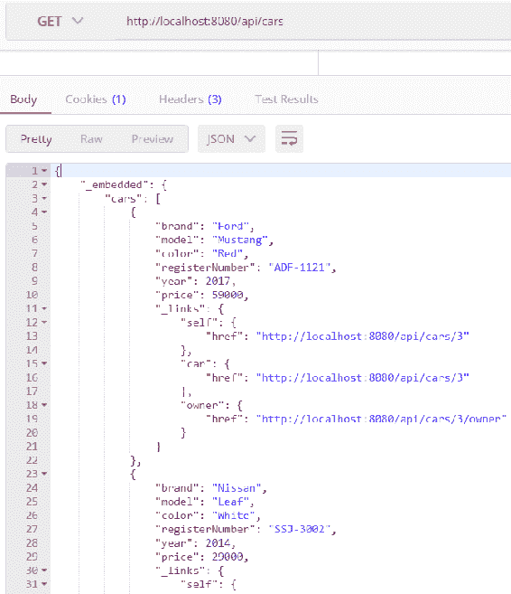

在 JSON 响应中，您可以看到有一个`cars`数组，每辆汽车都包含特定的汽车数据。所有汽车还具有`"_links"`属性，这是一组链接，通过这些链接，您可以访问汽车本身或获取汽车的所有者。要访问特定的汽车，路径将是`http://localhost:8080/api/cars/{id}`。

对`http://localhost:8080/api/cars/3/owner`的请求返回汽车的所有者。响应现在包含所有者数据，指向所有者的链接以及用户拥有的其他`cars`的链接：

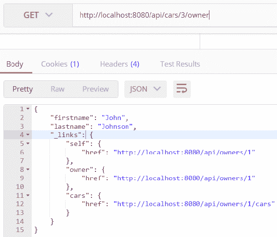

Spring Data Rest 服务提供所有 CRUD 操作。以下表格显示了您可以用于不同 CRUD 操作的 HTTP 方法：

| **HTTP 方法** | **CRUD** |
| --- | --- |
| `GET` | `读取` |
| `POST` | `创建` |
| `PUT`/`PATCH` | `更新` |
| `DELETE` | `删除` |

接下来，我们将看看如何通过使用我们的 RESTful web 服务从数据库中删除汽车。在删除操作中，您必须使用`DELETE`方法和将被删除的汽车的链接（`http://localhost:8080/api/cars/{id}`）。以下屏幕截图显示了如何使用 cURL 删除 ID 为`4`的汽车。删除请求后，您可以看到数据库中现在只剩下两辆汽车：

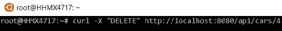

当我们想要向数据库中添加新的汽车时，我们必须使用`POST`方法，链接是`http://localhost:8080/api/cars`。标头必须包含带有值`Content-Type:application/json`的 Content-Type 字段，并且新的汽车对象将嵌入在请求体中：

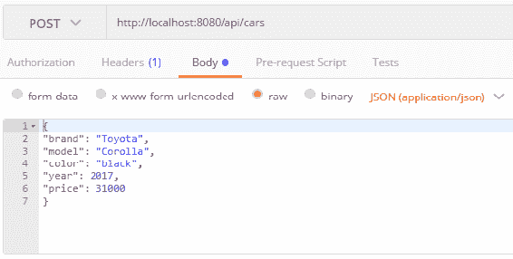

响应将发送一个新创建的汽车对象。现在，如果您再次对`http://localhost:8080/api/cars`路径发出`GET`请求，您可以看到新的汽车存在于数据库中：

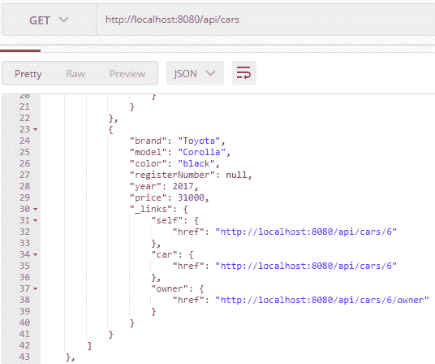

要更新实体，我们必须使用`PATCH`方法和我们要更新的汽车的链接（`http://localhost:8080/api/cars/{id}`）。标头必须包含带有值`Content-Type:application/json`的 Content-Type 字段，并且带有编辑数据的汽车对象将放在请求体中。如果您使用`PATCH`，您必须仅发送更新的字段。如果您使用`PUT`，您必须包含所有字段以请求。让我们编辑我们在上一个示例中创建的汽车。我们将颜色更改为白色，并填写我们留空的注册号码。

我们还将使用 owner 字段将所有者链接到汽车。owner 字段的内容是指向所有者的链接（`http://localhost:8080/api/owners/{id}`）。以下屏幕截图显示了`PATCH`请求内容：

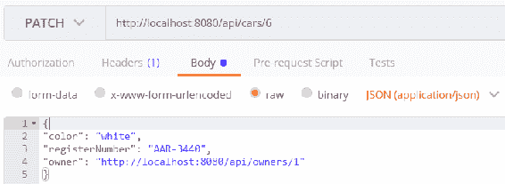

您可以看到，通过使用`GET`请求获取所有汽车后，汽车已更新：

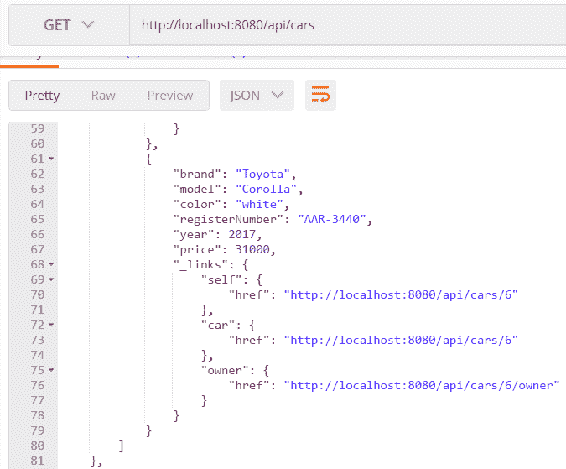

在上一章中，我们创建了对我们的存储库的查询。这些查询也可以包含在我们的服务中。要包含查询，您必须将`@RepositoryRestResource`注释添加到存储库类中。查询参数使用`@Param`注释进行注释。以下源代码显示了我们带有这些注释的`CarRepository`：

```java
package com.packt.cardatabase.domain;

import java.util.List;

import org.springframework.data.repository.CrudRepository;
import org.springframework.data.repository.query.Param;
import org.springframework.data.rest.core.annotation.RepositoryRestResource;

@RepositoryRestResource
public interface CarRepository extends CrudRepository <Car, Long> {
  // Fetch cars by brand
  List<Car> findByBrand(@Param("brand") String brand);

  // Fetch cars by color
  List<Car> findByColor(@Param("color") String color);
}
```

现在，当你向`http://localhost:8080/api/cars`路径发出`GET`请求时，你会看到一个名为`/search`的新端点。调用`http://localhost:8080/api/cars/search`路径会返回以下响应：

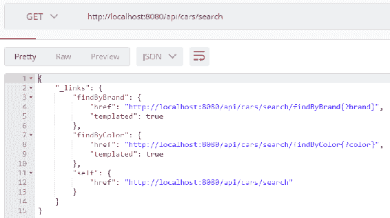

从响应中，你可以看到我们的服务现在都有这两个查询。以下 URL 演示了如何按品牌获取汽车：

```java
http://localhost:8080/api/cars/search/findByBrand?brand=Ford
```

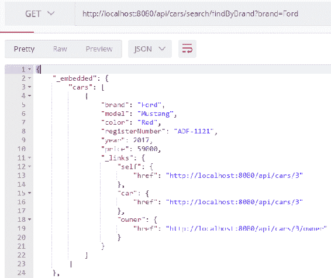

# 总结

在本章中，我们使用 Spring Boot 创建了一个 RESTful web 服务。首先，我们创建了一个控制器和一个以 JSON 格式返回所有汽车的方法。接下来，我们使用 Spring Data REST 获得了一个具有所有 CRUD 功能的完全功能的 web 服务。我们涵盖了使用 CRUD 功能所需的不同类型的请求。最后，我们还将我们的查询包含在服务中。在下一章中，我们将使用 Spring Security 保护我们的后端。

# 问题

1.  REST 是什么？

1.  你如何使用 Spring Boot 创建一个 RESTful web 服务？

1.  你如何使用我们的 RESTful web 服务获取项目？

1.  你如何使用我们的 RESTful web 服务删除项目？

1.  你如何使用我们的 RESTful web 服务添加项目？

1.  你如何使用我们的 RESTful web 服务更新项目？

1.  你如何使用我们的 RESTful web 服务进行查询？

# 进一步阅读

Pack 还有其他关于学习 Spring Boot RESTful Web 服务的资源：

+   [`www.packtpub.com/application-development/learning-spring-boot-20-second-edition`](https://www.packtpub.com/application-development/learning-spring-boot-20-second-edition)

+   [`www.packtpub.com/web-development/spring-boot-getting-started-integrated-course`](https://www.packtpub.com/web-development/spring-boot-getting-started-integrated-course)

+   [`www.packtpub.com/web-development/building-restful-web-service-spring`](https://www.packtpub.com/web-development/building-restful-web-service-spring)
