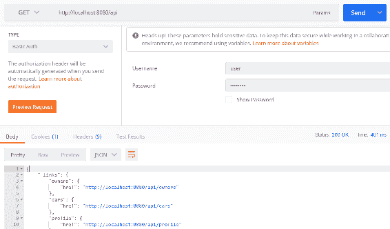
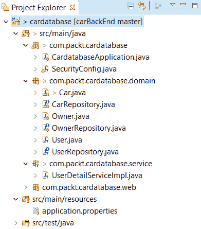
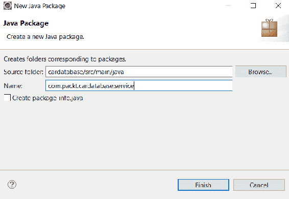
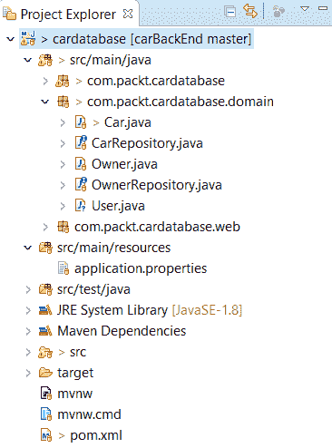
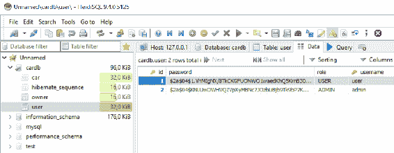
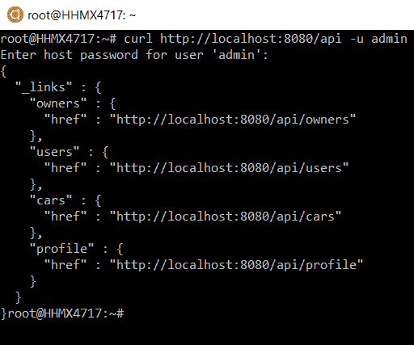
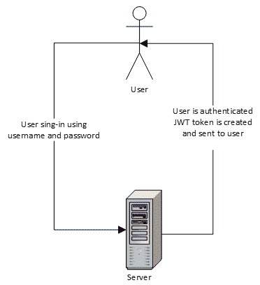
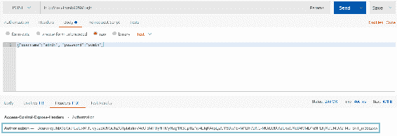
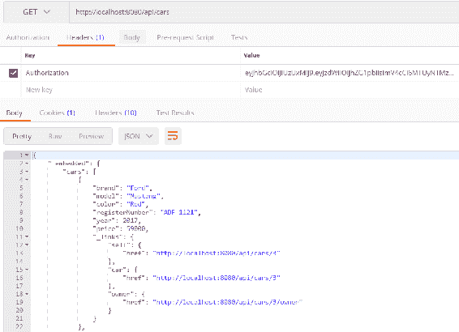
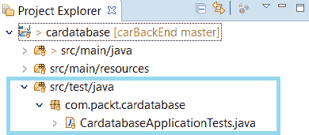

# 第四章：保护和测试您的后端

本章将解释如何保护和测试您的 Spring Boot 后端。我们将使用上一章中创建的数据库应用程序作为起点。

在本章中，我们将研究以下内容：

+   如何使用 Spring Boot 保护您的 Spring Boot 后端

+   如何使用 JWT 保护您的 Spring Boot 后端

+   如何测试您的后端

# 技术要求

需要在之前章节创建的 Spring Boot 应用程序。

# Spring Security

Spring Security ([`spring.io/projects/spring-security`](https://spring.io/projects/spring-security))为基于 Java 的 Web 应用程序提供安全服务。Spring Security 项目始于 2003 年，之前被称为 Spring 的 Acegi 安全系统。

默认情况下，Spring Security 启用以下功能：

+   具有内存单个用户的`AuthenticationManager` bean。用户名为`user`，密码打印到控制台输出。

+   忽略常见静态资源位置的路径，例如`/css`、`/images`等。

+   所有其他端点的 HTTP 基本安全。

+   发布到 Spring `ApplicationEventPublisher`的安全事件。

+   默认情况下启用常见的低级功能（HSTS、XSS、CSRF 等）。

您可以通过将以下依赖项添加到`pom.xml`文件中，将 Spring Security 包含在应用程序中：

```java
 <dependency>
   <groupId>org.springframework.boot</groupId>
   <artifactId>spring-boot-starter-security</artifactId>
 </dependency>
```

当您启动应用程序时，您可以从控制台看到 Spring Security 已创建一个内存用户，用户名为`user`。用户的密码可以在控制台输出中看到：


如果您对 API 端点进行`GET`请求，您将看到它现在是安全的，并且您将收到`401 Unauthorized`错误：


要能够成功进行`GET`请求，我们必须使用基本身份验证。以下截图显示了如何在 Postman 中进行操作。现在，通过身份验证，我们可以看到状态为 200 OK，并且响应已发送：



要配置 Spring Security 的行为，我们必须添加一个新的配置类，该类扩展了`WebSecurityConfigurerAdapter`。在应用程序的根包中创建一个名为`SecurityConfig`的新类。以下源代码显示了安全配置类的结构。`@Configration`和`@EnableWebSecurity`注解关闭了默认的 Web 安全配置，我们可以在这个类中定义自己的配置。在`configure(HttpSecurity http)`方法中，我们可以定义应用程序中哪些端点是安全的，哪些不是。实际上，我们还不需要这个方法，因为我们可以使用所有端点都受保护的默认设置：

```java
package com.packt.cardatabase;

import org.springframework.context.annotation.Configuration;
import org.springframework.security.config.annotation.web.builders.HttpSecurity;
import org.springframework.security.config.annotation.web.configuration.EnableWebSecurity;
import org.springframework.security.config.annotation.web.configuration.WebSecurityConfigurerAdapter;

@Configuration
@EnableWebSecurity
public class SecurityConfig extends WebSecurityConfigurerAdapter {

  @Override
  protected void configure(HttpSecurity http) throws Exception {

  }

}
```

我们还可以通过在`SecurityConfig`类中添加`userDetailsService()`方法来向我们的应用程序添加内存用户。以下是该方法的源代码，它将创建一个用户名为`user`，密码为`password`的内存用户：

```java
  @Bean
  @Override
  public UserDetailsService userDetailsService() {
      UserDetails user =
           User.withDefaultPasswordEncoder()
              .username("user")
              .password("password")
              .roles("USER")
              .build();

      return new InMemoryUserDetailsManager(user);
  } 
```

在开发阶段使用内存用户是很好的，但是真正的应用程序应该将用户保存在数据库中。要将用户保存到数据库中，您必须创建一个用户实体类和存储库。密码不应以明文格式保存到数据库中。Spring Security 提供了多种哈希算法，例如 BCrypt，您可以使用它们来哈希密码。以下步骤显示了如何实现这一点：

1.  在`domain`包中创建一个名为`User`的新类。激活`domain`包，右键单击鼠标。从菜单中选择 New | Class，并将新类命名为`User`。之后，您的项目结构应如下截图所示：



1.  使用`@Entity`注解对`User`类进行注释。添加类字段——ID、用户名、密码和角色。最后，添加构造函数、getter 和 setter。我们将所有字段设置为可为空，并使用`@Column`注解使用户名必须是唯一的。请参阅以下`User.java`字段和构造函数的源代码：

```java
package com.packt.cardatabase.domain;

import javax.persistence.Column;
import javax.persistence.Entity;
import javax.persistence.GeneratedValue;
import javax.persistence.GenerationType;
import javax.persistence.Id;

@Entity
public class User {
    @Id
    @GeneratedValue(strategy = GenerationType.IDENTITY)
    @Column(nullable = false, updatable = false)
    private Long id;

    @Column(nullable = false, unique = true)
    private String username;

    @Column(nullable = false)
    private String password;

    @Column(nullable = false)
    private String role;

    public User() {
    }

  public User(String username, String password, String role) {
    super();
    this.username = username;
    this.password = password;
    this.role = role;
  }
```

以下是`User.java`源代码的其余部分，包括 getter 和 setter：

```java
  public Long getId() {
    return id;
  }

  public void setId(Long id) {
    this.id = id;
  }

  public String getUsername() {
    return username;
  }

  public void setUsername(String username) {
    this.username = username;
  }

  public String getPassword() {
    return password;
  }

  public void setPassword(String password) {
    this.password = password;
  }

  public String getRole() {
    return role;
  }

  public void setRole(String role) {
    this.role = role;
  }
}
```

1.  在`domain`包中创建一个名为`UserRepository`的新类。激活`domain`包，右键单击鼠标。从菜单中选择新建|类，并将新类命名为`UserRepository`。

1.  仓库类的源代码与我们在上一章中所做的类似，但有一个查询方法`findByUsername`，我们在接下来的步骤中需要。请参阅以下`UserRepository`源代码：

```java
package com.packt.cardatabase.domain;

import org.springframework.data.repository.CrudRepository;
import org.springframework.stereotype.Repository;

@Repository
public interface UserRepository extends CrudRepository<User, Long> { 
    User findByUsername(String username);
}
```

1.  接下来，我们创建一个实现 Spring Security 提供的`UserDetailsService`接口的类。Spring Security 用于用户身份验证和授权。在根包中创建一个名为`service`的新包。激活根包，右键单击鼠标。从菜单中选择新建|包，并将新包命名为`service`：



1.  在我们刚刚创建的`service`包中创建一个名为`UserDetailServiceImpl`的新类。现在，您的项目结构应如下所示：



1.  我们必须将`UserRepository`类注入到`UserDetailServiceImpl`类中，因为在 Spring Security 处理身份验证时需要从数据库中获取用户。`loadByUsername`方法返回所需的`UserDetails`对象进行身份验证。以下是`UserDetailServiceImpl.java`的源代码：

```java
package com.packt.cardatabase.service;

import org.springframework.beans.factory.annotation.Autowired;
import org.springframework.security.core.authority.AuthorityUtils;
import org.springframework.security.core.userdetails.UserDetails;
import org.springframework.security.core.userdetails.UserDetailsService;
import org.springframework.security.core.userdetails.UsernameNotFoundException;
import org.springframework.stereotype.Service;

import com.packt.cardatabase.domain.User;
import com.packt.cardatabase.domain.UserRepository;

@Service
public class UserDetailServiceImpl implements UserDetailsService {
  @Autowired
  private UserRepository repository;

    @Override
    public UserDetails loadUserByUsername(String username) throws UsernameNotFoundException
    { 
      User currentUser = repository.findByUsername(username);
        UserDetails user = new org.springframework.security.core
            .userdetails.User(username, currentUser.getPassword()
            , true, true, true, true, 
            AuthorityUtils.createAuthorityList(currentUser.getRole()));
        return user;
    }

}
```

1.  在我们的安全配置类中，我们必须定义 Spring Security 应该使用数据库中的用户而不是内存中的用户。从`SecurityConfig`类中删除`userDetailsService()`方法以禁用内存中的用户。添加一个新的`configureGlobal`方法以启用来自数据库的用户。我们不应该将密码明文保存到数据库中。因此，我们将在`configureGlobal`方法中定义密码哈希算法。在本例中，我们使用 BCrypt 算法。这可以很容易地通过 Spring Security 的`BCryptPasswordEncoder`类实现。以下是`SecurityConfig.java`的源代码。现在，密码在保存到数据库之前必须使用 BCrypt 进行哈希处理：

```java
package com.packt.cardatabase;

import org.springframework.beans.factory.annotation.Autowired;
import org.springframework.context.annotation.Configuration;
import org.springframework.security.config.annotation.authentication.builders.AuthenticationManagerBuilder;
import org.springframework.security.config.annotation.web.builders.HttpSecurity;
import org.springframework.security.config.annotation.web.configuration.EnableWebSecurity;
import org.springframework.security.config.annotation.web.configuration.WebSecurityConfigurerAdapter;
import org.springframework.security.crypto.bcrypt.BCryptPasswordEncoder;

import com.packt.cardatabase.service.UserDetailServiceImpl;

@Configuration
@EnableWebSecurity
public class SecurityConfig extends WebSecurityConfigurerAdapter {
  @Autowired
  private UserDetailServiceImpl userDetailsService; 

  @Autowired
  public void configureGlobal(AuthenticationManagerBuilder auth) throws Exception {
    auth.userDetailsService(userDetailsService)
    .passwordEncoder(new BCryptPasswordEncoder());
  }
}
```

1.  最后，我们可以在我们的`CommandLineRunner`中将一对测试用户保存到数据库中。打开`CardatabaseApplication.java`文件，并在类的开头添加以下代码，将`UserRepository`注入到主类中：

```java
@Autowired 
private UserRepository urepository;
```

1.  使用哈希密码将用户保存到数据库。您可以使用在互联网上找到的任何 BCrypt 计算器：

```java
  @Bean
  CommandLineRunner runner() {
    return args -> {
      Owner owner1 = new Owner("John" , "Johnson");
      Owner owner2 = new Owner("Mary" , "Robinson");
      orepository.save(owner1);
      orepository.save(owner2);

      repository.save(new Car("Ford", "Mustang", "Red", "ADF-1121", 
        2017, 59000, owner1));
      repository.save(new Car("Nissan", "Leaf", "White", "SSJ-3002", 
        2014, 29000, owner2));
      repository.save(new Car("Toyota", "Prius", "Silver", "KKO-0212", 
        2018, 39000, owner2));

```

```java
 // username: user password: user
 urepository.save(new User("user",
      "$2a$04$1.YhMIgNX/8TkCKGFUONWO1waedKhQ5KrnB30fl0Q01QKqmzLf.Zi",
      "USER"));
 // username: admin password: admin
 urepository.save(new User("admin",
      "$2a$04$KNLUwOWHVQZVpXyMBNc7JOzbLiBjb9Tk9bP7KNcPI12ICuvzXQQKG", 
      "ADMIN"));
 };
  } 
```

运行应用程序后，您会看到数据库中现在有一个`user`表，并且保存了两条用户记录：



现在，如果您尝试在没有身份验证的情况下向`/api`端点发送`GET`请求，您将收到`401 Unauthorized`错误。您应该进行身份验证才能发送成功的请求。与前一个示例的不同之处在于，我们使用数据库中的用户进行身份验证。

您可以在以下截图中看到对`/api`端点的`GET`请求，使用`admin`用户：



# 使用 JWT 保护您的后端

在前一节中，我们介绍了如何在 RESTful Web 服务中使用基本身份验证。当我们要用 React 开发自己的前端时，这是不可用的。我们将在我们的应用程序中使用 JSON Web Tokens（JWT）身份验证。JWT 是在现代 Web 应用程序中实现身份验证的一种紧凑方式。JWT 非常小，因此可以在 URL、POST 参数或标头中发送。它还包含有关用户的所有必需信息。

JSON Web 令牌由三个由点分隔的不同部分组成。第一部分是标头，定义了令牌的类型和哈希算法。第二部分是有效载荷，通常在认证的情况下包含有关用户的信息。第三部分是签名，用于验证令牌在传输过程中未被更改。您可以看到以下 JWT 令牌的示例：

```java
eyJhbGciOiJIUzI1NiJ9.
eyJzdWIiOiJKb2UifD.
ipevRNuRP6HflG8cFKnmUPtypruRC4fc1DWtoLL62SY
```

以下图表显示了 JWT 身份验证过程的主要思想：



成功认证后，用户发送的请求应始终包含在认证中收到的 JWT 令牌。

我们将使用 Java JWT 库（[`github.com/jwtk/jjwt`](https://github.com/jwtk/jjwt)），这是 Java 和 Android 的 JSON Web 令牌库；因此，我们必须将以下依赖项添加到`pom.xml`文件中。JWT 库用于创建和解析 JWT 令牌：

```java
<dependency>
  <groupId>io.jsonwebtoken</groupId>
  <artifactId>jjwt</artifactId>
  <version>0.9.0</version>
</dependency>
```

以下步骤显示了如何在我们的后端启用 JWT 身份验证：

1.  在`service`包中创建一个名为`AuthenticationService`的新类。在类的开头，我们将定义一些常量；`EXPIRATIONTIME`定义了令牌的过期时间（以毫秒为单位）。`SIGNINGKEY`是用于数字签名 JWT 的特定于算法的签名密钥。您应该使用 Base64 编码的字符串。PREFIX 定义了令牌的前缀，通常使用 Bearer 模式。`addToken`方法创建令牌并将其添加到请求的`Authorization`标头中。签名密钥使用 SHA-512 算法进行编码。该方法还使用`Authorization`值向标头添加`Access-Control-Expose-Headers`。这是因为我们默认情况下无法通过 JavaScript 前端访问`Authorization`标头。`getAuthentication`方法使用`jjwt`库提供的`parser()`方法从响应的`Authorization`标头中获取令牌。整个`AuthenticationService`源代码可以在此处看到：

```java
package com.packt.cardatabase.service;

import io.jsonwebtoken.Jwts;
import io.jsonwebtoken.SignatureAlgorithm;
import org.springframework.security.authentication.UsernamePasswordAuthenticationToken;
import org.springframework.security.core.Authentication;

import javax.servlet.http.HttpServletRequest;
import javax.servlet.http.HttpServletResponse;
import java.util.Date;

import static java.util.Collections.emptyList;

public class AuthenticationService {
  static final long EXPIRATIONTIME = 864_000_00; // 1 day in milliseconds
  static final String SIGNINGKEY = "SecretKey";
  static final String PREFIX = "Bearer";

  // Add token to Authorization header
  static public void addToken(HttpServletResponse res, String username) {
    String JwtToken = Jwts.builder().setSubject(username)
        .setExpiration(new Date(System.currentTimeMillis() 
            + EXPIRATIONTIME))
        .signWith(SignatureAlgorithm.HS512, SIGNINGKEY)
        .compact();
    res.addHeader("Authorization", PREFIX + " " + JwtToken);
  res.addHeader("Access-Control-Expose-Headers", "Authorization");
  }

  // Get token from Authorization header
  static public Authentication getAuthentication(HttpServletRequest request) {
    String token = request.getHeader("Authorization");
    if (token != null) {
      String user = Jwts.parser()
          .setSigningKey(SIGNINGKEY)
          .parseClaimsJws(token.replace(PREFIX, ""))
          .getBody()
          .getSubject();

      if (user != null) 
        return new UsernamePasswordAuthenticationToken(user, null,
            emptyList());
    }
    return null;
  }
}
```

1.  接下来，我们将添加一个新的简单 POJO 类来保存认证凭据。在`domain`包中创建一个名为`AccountCredentials`的新类。该类有两个字段——`username`和`password`。以下是该类的源代码。该类没有`@Entity`注释，因为我们不必将凭据保存到数据库中：

```java
package com.packt.cardatabase.domain;

public class AccountCredentials {
  private String username;
  private String password;

  public String getUsername() {
    return username;
  }
  public void setUsername(String username) {
    this.username = username;
  }
  public String getPassword() {
    return password;
  }
  public void setPassword(String password) {
    this.password = password;
  } 
}
```

1.  我们将使用过滤器类进行登录和身份验证。在根包中创建一个名为`LoginFilter`的新类，处理对`/login`端点的`POST`请求。`LoginFilter`类扩展了 Spring Security 的`AbstractAuthenticationProcessingFilter`，需要设置`authenticationManager`属性。认证由`attemptAuthentication`方法执行。如果认证成功，则执行`succesfulAuthentication`方法。然后，此方法将调用我们的服务类中的`addToken`方法，并将令牌添加到`Authorization`标头中：

```java
package com.packt.cardatabase;

import java.io.IOException;
import java.util.Collections;

import javax.servlet.FilterChain;
import javax.servlet.ServletException;
import javax.servlet.http.HttpServletRequest;
import javax.servlet.http.HttpServletResponse;

import org.springframework.security.authentication.AuthenticationManager;
import org.springframework.security.authentication.UsernamePasswordAuthenticationToken;
import org.springframework.security.core.Authentication;
import org.springframework.security.core.AuthenticationException;
import org.springframework.security.web.authentication.AbstractAuthenticationProcessingFilter;
import org.springframework.security.web.util.matcher.AntPathRequestMatcher;

import com.fasterxml.jackson.databind.ObjectMapper;
import com.packt.cardatabase.domain.AccountCredentials;
import com.packt.cardatabase.service.AuthenticationService;

public class LoginFilter extends AbstractAuthenticationProcessingFilter {

  public LoginFilter(String url, AuthenticationManager authManager) {
    super(new AntPathRequestMatcher(url));
    setAuthenticationManager(authManager);
  }

  @Override
  public Authentication attemptAuthentication(
  HttpServletRequest req, HttpServletResponse res)
      throws AuthenticationException, IOException, ServletException {
  AccountCredentials creds = new ObjectMapper()
        .readValue(req.getInputStream(), AccountCredentials.class);
  return getAuthenticationManager().authenticate(
        new UsernamePasswordAuthenticationToken(
            creds.getUsername(),
            creds.getPassword(),
            Collections.emptyList()
        )
    );
  }

  @Override
  protected void successfulAuthentication(
      HttpServletRequest req,
      HttpServletResponse res, FilterChain chain,
      Authentication auth) throws IOException, ServletException {
    AuthenticationService.addToken(res, auth.getName());
  }
}
```

1.  在根包中创建一个名为`AuthenticationFilter`的新类。该类扩展了`GenericFilterBean`，这是任何类型过滤器的通用超类。此类将处理除`/login`之外的所有其他端点的身份验证。`AuthenticationFilter`使用我们的服务类中的`addAuthentication`方法从请求的`Authorization`标头中获取令牌：

```java
package com.packt.cardatabase;

import java.io.IOException;

import javax.servlet.FilterChain;
import javax.servlet.ServletException;
import javax.servlet.ServletRequest;
import javax.servlet.ServletResponse;
import javax.servlet.http.HttpServletRequest;

import org.springframework.security.core.Authentication;
import org.springframework.security.core.context.SecurityContextHolder;
import org.springframework.web.filter.GenericFilterBean;

import com.packt.cardatabase.service.AuthenticationService;

public class AuthenticationFilter extends GenericFilterBean {
  @Override
  public void doFilter(ServletRequest request, ServletResponse response, FilterChain filterChain) throws IOException, ServletException {
    Authentication authentication = AuthenticationService.getAuthentication((HttpServletRequest)request);

    SecurityContextHolder.getContext().
        setAuthentication(authentication);
    filterChain.doFilter(request, response);
  }
}
```

1.  最后，我们必须对我们的`SecurityConfig`类的`configure`方法进行更改。在那里，我们定义了对`/login`端点的`POST`方法请求允许无身份验证，并且对所有其他端点的请求需要身份验证。我们还通过使用`addFilterBefore`方法定义了要在`/login`和其他端点中使用的过滤器：

```java
  //SecurityConfig.java  
  @Override
    protected void configure(HttpSecurity http) throws Exception {
     http.cors().and().authorizeRequests()
      .antMatchers(HttpMethod.POST, "/login").permitAll()
          .anyRequest().authenticated()
          .and()
          // Filter for the api/login requests
          .addFilterBefore(new LoginFilter("/login",
           authenticationManager()),
                  UsernamePasswordAuthenticationFilter.class)
          // Filter for other requests to check JWT in header
          .addFilterBefore(new AuthenticationFilter(),
                  UsernamePasswordAuthenticationFilter.class);
    }
```

1.  我们还将在安全配置类中添加**CORS**（跨源资源共享）过滤器。这对于前端是必需的，因为它会从其他来源发送请求。CORS 过滤器拦截请求，如果识别为跨源，它会向请求添加适当的标头。为此，我们将使用 Spring Security 的`CorsConfigurationSource`接口。在此示例中，我们将允许所有 HTTP 方法和标头。如果需要更精细的定义，您可以在此处定义允许的来源、方法和标头列表。将以下源代码添加到您的`SecurityConfig`类中以启用 CORS 过滤器：

```java
  // SecurityConfig.java  
  @Bean
    CorsConfigurationSource corsConfigurationSource() {
        UrlBasedCorsConfigurationSource source = 
            new UrlBasedCorsConfigurationSource();
        CorsConfiguration config = new CorsConfiguration();
        config.setAllowedOrigins(Arrays.asList("*"));
        config.setAllowedMethods(Arrays.asList("*"));
        config.setAllowedHeaders(Arrays.asList("*"));
        config.setAllowCredentials(true);
        config.applyPermitDefaultValues();

        source.registerCorsConfiguration("/**", config);
        return source;
  } 

```

现在，在运行应用程序之后，我们可以使用`POST`方法调用`/login`端点，在成功登录的情况下，我们将在`Authorization`标头中收到 JWT 令牌：



成功登录后，我们可以通过在`Authorization`标头中发送从登录接收到的 JWT 令牌来调用其他 RESTful 服务端点。请参见以下屏幕截图中的示例：



现在，我们已经实现了后端所需的所有功能。接下来，我们将继续进行后端单元测试。

# Spring Boot 中的测试

当我们创建项目时，Spring Initializr 会自动将 Spring Boot 测试启动器包添加到`pom.xml`中。这是在 Spring Initializr 页面中没有任何选择的情况下自动添加的：

```java
    <dependency>
      <groupId>org.springframework.boot</groupId>
      <artifactId>spring-boot-starter-test</artifactId>
      <scope>test</scope>
    </dependency>
```

Spring Boot 测试启动器为测试提供了许多方便的库，如 JUnit、Mockito、AssertJ 等。如果您查看，您的项目结构已经为测试类创建了自己的包：



默认情况下，Spring Boot 在测试中使用内存数据库。我们现在使用 MariaDB，但也可以通过将以下依赖项添加到`pom.xml`文件中来使用 H2 进行测试。范围定义了 H2 数据库仅用于运行测试；否则，应用程序将使用 MariaDB 数据库：

```java
    <dependency>
        <groupId>com.h2database</groupId>
        <artifactId>h2</artifactId>
        <scope>test</scope>
    </dependency> 
```

如果您还想在测试中使用默认数据库，可以使用`@AutoConfigureTestDatabase`注解。

# 创建单元测试

对于单元测试，我们使用的是 JUnit，这是一个流行的基于 Java 的单元测试库。以下源代码显示了 Spring Boot 测试类的示例框架。`@SpringBootTest`注解指定该类是一个常规测试类，运行基于 Spring Boot 的测试。方法前的`@Test`注解定义了该方法可以作为测试用例运行。`@RunWith(SpringRunner.class)`注解提供了 Spring `ApplicationContext`并将 bean 注入到测试实例中：

```java
@RunWith(SpringRunner.class)
@SpringBootTest
public class MyTestsClass {

  @Test
  public void testMethod() {
    ...
  }

}
```

首先，我们将创建我们的第一个测试用例，该测试用例将在创建任何正式测试用例之前测试应用程序的主要功能。打开已为您的应用程序创建的`CardatabaseApplicationTest`测试类。有一个名为`contextLoads`的测试方法，我们将在其中添加测试。以下测试检查控制器的实例是否已成功创建和注入：

```java
package com.packt.cardatabase;

import static org.assertj.core.api.Assertions.assertThat;

import org.junit.Test;
import org.junit.runner.RunWith;
import org.springframework.beans.factory.annotation.Autowired;
import org.springframework.boot.test.context.SpringBootTest;
import org.springframework.test.context.junit4.SpringRunner;

import com.packt.cardatabase.web.CarController;

@RunWith(SpringRunner.class)
@SpringBootTest
public class CardatabaseApplicationTests {
  @Autowired
  private CarController controller;

  @Test
  public void contextLoads() {
    assertThat(controller).isNotNull();
  }

}
```

要在 Eclipse 中运行测试，请在项目资源管理器中激活测试类，然后右键单击鼠标。从菜单中选择 Run As | JUnit test。现在应该在 Eclipse 工作台的下部看到 JUnit 选项卡。测试结果显示在此选项卡中，测试用例已通过：


接下来，我们将为我们的汽车存储库创建单元测试，以测试 CRUD 操作。在根测试包中创建一个名为`CarRepositoryTest`的新类。如果测试仅关注 JPA 组件，则可以使用`@DataJpaTest`注解，而不是`@SpringBootTest`注解。使用此注解时，H2 数据库、Hibernate 和 Spring Data 会自动配置进行测试。SQL 日志记录也将被打开。测试默认是事务性的，并在测试用例结束时回滚。`TestEntityManager`用于处理持久化实体，并设计用于测试。您可以在以下看到 JPA 测试类骨架的源代码：

```java
package com.packt.cardatabase;

import static org.assertj.core.api.Assertions.assertThat;

import org.junit.Test;
import org.junit.runner.RunWith;
import org.springframework.beans.factory.annotation.Autowired;
import org.springframework.boot.test.autoconfigure.orm.jpa.DataJpaTest;
import org.springframework.boot.test.autoconfigure.orm.jpa.TestEntityManager;
import org.springframework.test.context.junit4.SpringRunner;

import com.packt.cardatabase.domain.Car;
import com.packt.cardatabase.domain.CarRepository;

@RunWith(SpringRunner.class)
@DataJpaTest
public class CarRepositoryTest {
  @Autowired
  private TestEntityManager entityManager;

  @Autowired
  private CarRepository repository;

   // Test cases..
}
```

我们将添加第一个测试用例来测试向数据库添加新汽车。使用`TestEntityManager`提供的`persistAndFlush`方法创建一个新的`car`对象并保存到数据库中。然后，我们检查如果成功保存，汽车 ID 不能为空。以下源代码显示了测试用例方法。将以下方法代码添加到您的`CarRepositoryTest`类中：

```java
  @Test
  public void saveCar() {
    Car car = new Car("Tesla", "Model X", "White", "ABC-1234",
        2017, 86000);
    entityManager.persistAndFlush(car);

    assertThat(car.getId()).isNotNull();
  }
```

第二个测试用例将测试从数据库中删除汽车。创建一个新的`car`对象并保存到数据库中。然后，从数据库中删除所有汽车，最后，`findAll()`查询方法应返回一个空列表。以下源代码显示了测试用例方法。将以下方法代码添加到您的`CarRepositoryTest`类中：

```java
  @Test
  public void deleteCars() {
    entityManager.persistAndFlush(new Car("Tesla", "Model X", "White",
        "ABC-1234", 2017, 86000));
    entityManager.persistAndFlush(new Car("Mini", "Cooper", "Yellow",
        "BWS-3007", 2015, 24500));

    repository.deleteAll();
    assertThat(repository.findAll()).isEmpty();
  } 
```

运行测试用例并在 Eclipse JUnit 选项卡上检查测试是否通过：


接下来，我们将展示如何测试 RESTful Web 服务 JWT 身份验证功能。对于测试控制器或任何公开的端点，我们可以使用`MockMvc`。通过使用`MockMvc`，服务器不会启动，但测试是在 Spring 处理 HTTP 请求的层中执行的，因此它模拟了真实情况。`MockMvc`提供了`perform`方法来发送请求。要测试身份验证，我们必须向请求体添加凭据。我们执行两个请求；第一个具有正确的凭据，我们检查状态是否正常。第二个请求包含不正确的凭据，我们检查是否收到 4XX 的 HTTP 错误：

```java
package com.packt.cardatabase;

import static org.springframework.test.web.servlet.request.MockMvcRequestBuilders.post;
import static org.springframework.test.web.servlet.result.MockMvcResultHandlers.print;
import static org.springframework.test.web.servlet.result.MockMvcResultMatchers.status;

import org.junit.Test;
import org.junit.runner.RunWith;
import org.springframework.beans.factory.annotation.Autowired;
import org.springframework.boot.test.autoconfigure.web.servlet.AutoConfigureMockMvc;
import org.springframework.boot.test.context.SpringBootTest;

import org.springframework.test.context.junit4.SpringRunner;
import org.springframework.test.web.servlet.MockMvc;

@RunWith(SpringRunner.class)
@SpringBootTest
@AutoConfigureMockMvc
public class CarRestTest {
  @Autowired
    private MockMvc mockMvc;

  @Test
  public void testAuthentication() throws Exception {
    // Testing authentication with correct credentials
        this.mockMvc.perform(post("/login")
          .content("{\"username\":\"admin\", \"password\":\"admin\"}")).
          andDo(print()).andExpect(status().isOk());

    // Testing authentication with wrong credentials
        this.mockMvc.perform(post("/login")
          .content("{\"username\":\"admin\", \"password\":\"wrongpwd\"}")).
          andDo(print()).andExpect(status().is4xxClientError());

  }

}
```

现在，当我们运行身份验证测试时，我们可以看到测试通过了：


现在，我们已经介绍了 Spring Boot 应用程序中测试的基础知识，您应该具备实现更多测试用例的所需知识。

# 摘要

在本章中，我们专注于保护和测试 Spring Boot 后端。首先使用 Spring Security 进行保护。前端将在接下来的章节中使用 React 进行开发；因此，我们实现了 JWT 身份验证，这是一种适合我们需求的轻量级身份验证方法。我们还介绍了测试 Spring Boot 应用程序的基础知识。我们使用 JUnit 进行单元测试，并为 JPA 和 RESTful Web 服务身份验证实现了测试用例。在下一章中，我们将为前端开发设置环境和工具。

# 问题

1.  什么是 Spring Security？

1.  如何使用 Spring Boot 保护后端？

1.  什么是 JWT？

1.  如何使用 JWT 保护后端？

1.  如何使用 Spring Boot 创建单元测试？

1.  如何运行和检查单元测试的结果？

# 进一步阅读

Packt 还有其他很好的资源，可以了解 Spring Security 和测试的知识：

+   [`www.packtpub.com/application-development/spring-security-third-edition`](https://www.packtpub.com/application-development/spring-security-third-edition)

+   [`www.packtpub.com/web-development/mastering-software-testing-junit-5`](https://www.packtpub.com/web-development/mastering-software-testing-junit-5)
