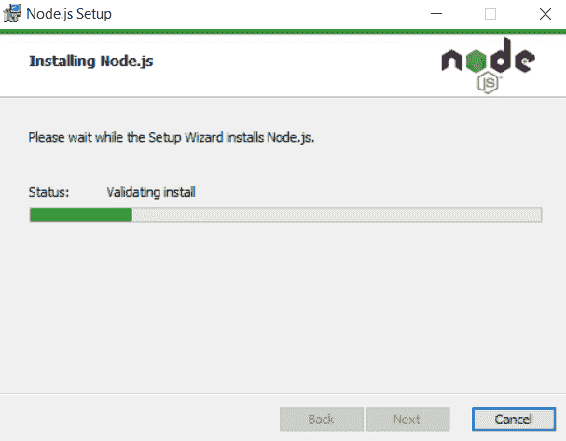
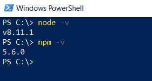
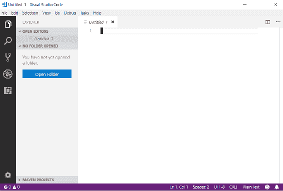
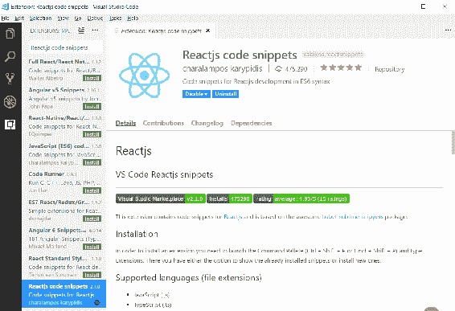
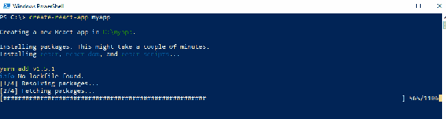
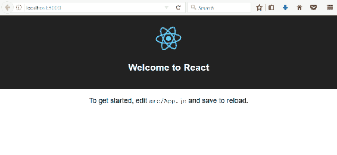
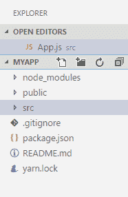
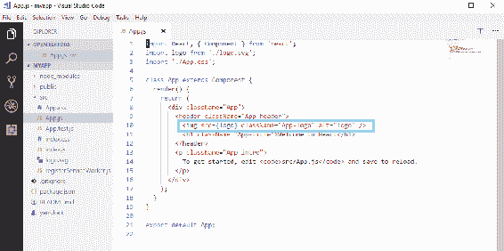
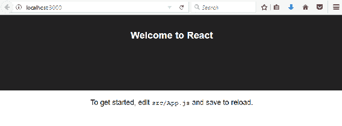
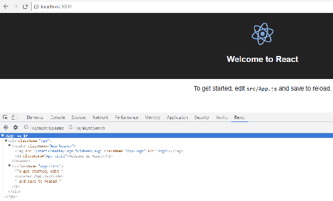

# 第五章：设置环境和工具 - 前端

本章描述了使用 React 所需的开发环境和工具。这一章是为了能够开始前端开发。我们将使用 Facebook 制作的 Create React App 入门套件创建一个简单的 React 应用。

在本章中，我们将研究以下内容：

+   安装 Node.js 和 VS Code

+   使用`create-react-app`创建一个 React.js 应用

+   运行 React.js 应用

+   安装 React 开发者工具

# 技术要求

在本书中，我们使用 Windows 操作系统，但所有工具也适用于 Linux 和 macOS。

# 安装 Node.js

Node.js 是一个基于 JavaScript 的开源服务器端环境。Node.js 适用于多个操作系统，如 Windows，macOS 和 Linux。Node.js 是开发 React 应用所需的。

Node.js 安装包可以在[`nodejs.org/en/download/`](https://nodejs.org/en/download/)找到。为您的操作系统下载最新的**长期支持**（**LTS**）版本。在本书中，我们使用 Windows 10 操作系统，您可以为其获取 Node.js MSI 安装程序，这样安装就非常简单。当您执行安装程序时，您将通过安装向导，并且可以使用默认设置进行操作：



安装完成后，我们可以检查一切是否正确。打开 PowerShell，或者您正在使用的终端，然后输入以下命令：

```java
node -v
```

```java
npm -v
```

这些命令应该显示已安装的版本，Node.js 和 npm：



npm 随 Node.js 安装而来，是 JavaScript 的包管理器。在接下来的章节中，当我们安装不同的节点模块到我们的 React 应用时，我们会经常使用它。还有另一个称为 Yarn 的包管理器，您也可以使用。

# 安装 VS Code

**Visual Studio Code**（**VS Code**）是一个用于多种编程语言的开源代码编辑器。VS Code 由 Microsoft 开发。还有许多不同的代码编辑器可用，如 Atom，Brackets 等，如果您熟悉其他编辑器，也可以使用其他编辑器。VS Code 适用于 Windows，macOS 和 Linux，您可以从[`code.visualstudio.com/`](https://code.visualstudio.com/)下载它。

Windows 的安装是通过 MSI 安装程序完成的，您可以使用默认设置进行安装。以下截图显示了 VS Code 的工作台。左侧是活动栏，您可以使用它在不同视图之间导航。活动栏旁边是侧边栏，其中包含不同的视图，如项目文件资源管理器。

编辑器占据了工作台的其余部分：



VS Code 还有一个集成终端，您可以使用它来创建和运行 React 应用。终端可以在 View | Integrated Terminal 菜单中找到。在后续章节中，当我们创建更多的 React 应用时，您也可以使用它。

有很多可用于不同语言和框架的扩展。如果您从活动栏打开扩展管理器，可以搜索不同的扩展。一个真正方便的 React 开发扩展是 Reactjs Code Snippets，我们建议安装。它有多个可用于 React.js 应用的代码片段，可以加快开发过程。我们稍后会向您展示如何使用该扩展。这只是许多有用的扩展之一，您应该探索更多可能使您的生活更轻松的扩展。例如，ESLint 扩展可以帮助您快速找到拼写错误和语法错误，并使源代码的格式化更容易：



# 创建和运行一个 React 应用

当我们安装了 Node.js 和代码编辑器后，我们就可以创建我们的第一个 React.js 应用程序了。我们使用 Facebook 的`create-react-app` ([`github.com/facebook/create-react-app`](https://github.com/facebook/create-react-app))。以下是制作第一个应用程序的步骤：

1.  打开 PowerShell 或命令行工具，然后输入以下命令。该命令安装了`create-react-app` starter，我们将用它来开发 React 应用程序。命令中的参数`-g`表示全局安装。

如果您使用的是 npm 版本 5.2 或更高版本，您也可以使用`npx`代替`npm`：

```java
npm install -g create-react-app
```

1.  安装完成后，我们通过输入以下命令来创建我们的第一个应用程序：

```java
create-react-app myapp
```



1.  应用程序创建后，将其移动到您的`app`文件夹中：

```java
cd myapp
```

1.  然后，您可以使用以下命令运行应用程序。该命令在端口`3000`中运行应用程序，并在浏览器中打开应用程序：

```java
npm start
```

1.  现在您的应用程序正在运行，您应该在浏览器中看到以下页面。`npm start`命令以开发模式启动应用程序：



您可以通过在 PowerShell 中按*Ctrl* + *C*来停止开发服务器。

要为生产构建应用程序的缩小版本，您可以使用`npm run build`命令，该命令将在`build`文件夹中构建您的应用程序。

# 修改 React 应用程序

通过选择文件 | 打开文件夹在 VS Code 中打开您的 React 应用程序文件夹。您应该在文件资源管理器中看到应用程序结构。在这个阶段中最重要的文件夹是`src`文件夹，其中包含 JavaScript 源代码：



在代码编辑器中的`src`文件夹中打开`App.js`文件。删除显示图像的行并保存文件。您暂时不需要了解有关此文件的更多信息。我们将在下一章中深入讨论这个主题：



现在，如果您查看浏览器，您应该立即看到图像已从页面中消失：



要调试 React 应用程序，我们还应该安装 React Developer Tools，它们适用于 Chrome 或 Firefox 浏览器。可以从 Chrome Web Store ([`chrome.google.com/webstore/category/extensions`](https://chrome.google.com/webstore/category/extensions))安装 Chrome 插件，从 Firefox 插件站 ([`addons.mozilla.org`](https://addons.mozilla.org))安装 Firefox 插件。安装了 React Developer Tools 后，当您导航到 React 应用程序时，您应该在浏览器的开发者工具中看到一个新的 React 标签。以下屏幕截图显示了 Chrome 浏览器中的开发者工具：



# 摘要

在本章中，我们安装了开始使用 React.js 进行前端开发所需的一切。首先，我们安装了 Node.js 和 VS Code 编辑器。然后，我们使用了`create-react-app` starter 套件来创建我们的第一个 React.js 应用程序。最后，我们运行了应用程序，并演示了如何修改它。这只是应用程序结构和修改的概述，我们将在接下来的章节中继续讨论。

# 问题

1.  什么是 Node.js 和 npm？

1.  如何安装 Node.js？

1.  什么是 VS Code？

1.  如何安装 VS Code？

1.  如何使用`create-react-app`创建 React.js 应用程序？

1.  如何运行 React.js 应用程序？

1.  如何对应用程序进行基本修改？

# 进一步阅读

Packt 还有其他很好的资源可以学习 React：

+   [`www.packtpub.com/web-development/getting-started-react`](https://www.packtpub.com/web-development/getting-started-react)

+   [`www.packtpub.com/web-development/react-16-tooling`](https://www.packtpub.com/web-development/react-16-tooling)
