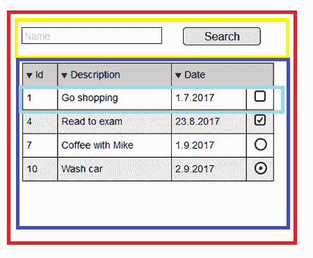
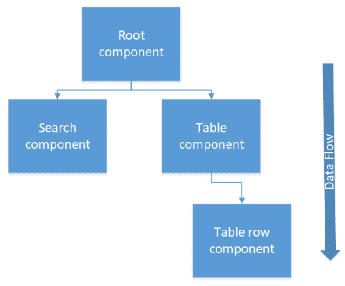
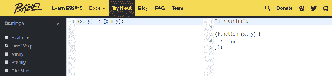
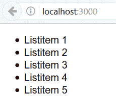
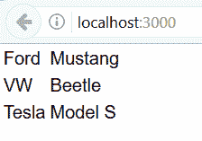
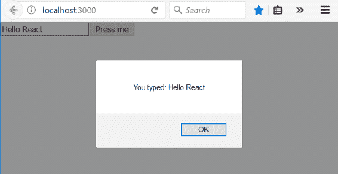
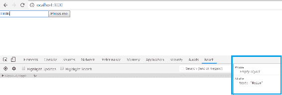
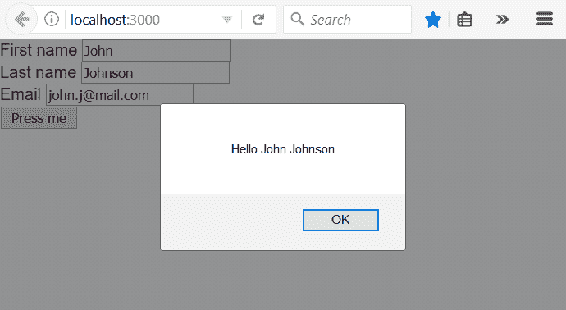

# 第六章：开始使用 React

本章描述了 React 编程的基础知识。我们将介绍创建 React 前端基本功能所需的技能。在 JavaScript 中，我们使用 ES6 语法，因为它提供了许多使编码更清晰的功能。

在本章中，我们将看到以下内容：

+   如何创建 React 组件

+   如何在组件中使用状态和属性

+   有用的 ES6 功能

+   JSX 是什么

+   如何在 React 中处理事件和表单

# 技术要求

在本书中，我们使用的是 Windows 操作系统，但所有工具也适用于 Linux 和 macOS。

# 基本的 React 组件

根据 Facebook 的说法，React 是一个用于用户界面的 JavaScript 库。自版本 15 以来，React 已经在 MIT 许可证下开发。React 是基于组件的，组件是独立和可重用的。组件是 React 的基本构建块。当您开始使用 React 开发用户界面时，最好从创建模拟界面开始。这样，可以轻松地确定需要创建哪种组件以及它们如何交互。

从模拟的下图中，我们可以看到用户界面如何分割成组件。在这种情况下，将有一个应用根组件，一个搜索栏组件，一个表格组件和一个表格行组件：



然后，这些组件可以按以下树形层次结构排列。理解 React 的重要一点是，数据流是从父组件到子组件的：



React 使用虚拟 DOM 来选择性地重新渲染用户界面，这使得它更具成本效益。虚拟 DOM 是 DOM 的轻量级副本，对虚拟 DOM 的操作比真实 DOM 快得多。虚拟 DOM 更新后，React 将其与在更新运行之前从虚拟 DOM 中获取的快照进行比较。比较后，React 知道哪些部分已更改，只有这些部分才会更新到真实 DOM 中。

React 组件可以通过使用 JavaScript 函数或 ES6 JavaScript 类来定义。我们将在下一节更深入地了解 ES6。以下是一个简单的组件源代码，用于呈现`Hello World`文本。第一个代码块使用了 JavaScript 函数：

```java
// Using JavaScript function
function Hello() {
  return <h1>Hello World</h1>;
}
```

这个例子使用类来创建一个组件：

```java
// Using ES6 class
class Hello extends React.Component {
  render() {
    return <h1>Hello World</h1>;
  }
}
```

使用类实现的组件包含所需的`render()`方法。这个方法显示和更新组件的呈现输出。用户定义的组件名称应以大写字母开头。

让我们对组件的`render`方法进行更改，并添加一个新的标题元素进去：

```java
class App extends Component {
  render() {
    return (
      <h1>Hello World!</h1>
      <h2>From my first React app</h2>
    );
  }
}
```

当您运行应用程序时，会出现“相邻的 JSX 元素必须包装在一个封闭标记中”的错误。要解决这个错误，我们必须将标题包装在一个元素中，比如`div`；自 React 版本 16.2 以来，我们还可以使用`Fragments`，它看起来像空的 JSX 标签：

```java
// Wrap headers in div
class App extends Component {
  render() {
    return (
      <div>
        <h1>Hello World!</h1>
        <h2>From my first React app</h2>
      </div>
    );
  }
}

// Or using fragments
class App extends Component {
  render() {
    return (
      <>
        <h1>Hello World!</h1>
        <h2>From my first React app</h2>
      </>
    );
  }
}

```

让我们更仔细地看一下我们在上一章中使用`create-react-app`创建的第一个 React 应用程序。根文件夹中`Index.js`文件的源代码如下：

```java
import React from 'react';
import ReactDOM from 'react-dom';
import './index.css';
import App from './App';
import registerServiceWorker from './registerServiceWorker';

ReactDOM.render(<App />, document.getElementById('root'));
registerServiceWorker();
```

在文件的开头，有一些`import`语句，用于加载组件或资源到我们的文件中。例如，第二行从`node_modules`文件夹中导入了`react-dom`包，第四行导入了`App`（根文件夹中的`App.js`文件）组件。`react-dom`包为我们提供了特定于 DOM 的方法。要将 React 组件呈现到 DOM 中，我们可以使用`react-dom`包中的`render`方法。第一个参数是将要呈现的组件，第二个参数是组件将要呈现的元素或容器。在这种情况下，`root`元素是`<div id="root"></div>`，可以在`public`文件夹中的`index.html`文件中找到。请参阅以下`index.html`文件：

```java
<!DOCTYPE html>
<html lang="en">
  <head>
    <meta charset="utf-8">
    <meta name="viewport" content="width=device-width, initial-scale=1,
     shrink-to-fit=no">
    <meta name="theme-color" content="#000000">

    <link rel="manifest" href="%PUBLIC_URL%/manifest.json">
    <link rel="shortcut icon" href="%PUBLIC_URL%/favicon.ico">

    <title>React App</title>
  </head>
  <body>
    <div id="root"></div>
  </body>
</html>
```

以下源代码显示了我们第一个 React 应用程序的`App.js`组件。您可以看到`import`也适用于图像和样式表等资产。在源代码的末尾，有一个`export`语句，导出组件，并且可以通过导入在其他组件中使用。每个文件只能有一个默认导出，但可以有多个命名导出：

```java
import React, { Component } from 'react';
import logo from './logo.svg';
import './App.css';

class App extends Component {
  render() {
    return (
      <div className="App">
        <header className="App-header">
          
          <h1 className="App-title">Welcome to React</h1>
        </header>
        <p className="App-intro">
          To get started, edit <code>src/App.js</code> and save to reload.
        </p>
      </div>
    );
  }
}

export default App;
```

以下示例显示了如何导入默认和命名导出：

```java
import React from 'react' // Import default value
import { Component } from 'react' // Import named value
```

导出如下：

```java
export default React // Default export
export {Component} // Named export
```

# ES6 基础

ES6（ECMAScript 2015）于 2015 年发布，引入了许多新功能。ECMAScript 是一种标准化的脚本语言，而 JavaScript 是其一种实现。在这里，我们将介绍 ES6 中发布的最重要的功能，这些功能将在接下来的部分中使用。

# 了解常量

常量或不可变变量可以通过使用`const`关键字来定义。使用`const`关键字时，变量内容不能被重新分配：

```java
const PI = 3.14159;
```

`const`的作用域是块作用域，与`let`相同。这意味着`const`变量只能在定义它的块内使用。在实践中，块是花括号`{ }`之间的区域。以下示例代码显示了作用域的工作原理。第二个`console.log`语句会报错，因为我们试图在作用域之外使用`total`变量：

```java
var count = 10;
if(count > 5) {
  const total = count * 2;
  console.log(total); // Prints 20 to console
}
console.log(total); // Error, outside the scope
```

值得知道的是，如果`const`是对象或数组，则内容可以更改。以下示例演示了这一点：

```java
const myObj = {foo : 3};
myObj.foo = 5; // This is ok
```

# 箭头函数

箭头函数使函数声明更加紧凑。在 JavaScript 中定义函数的传统方式是使用`function`关键字。以下函数获取一个参数，然后返回参数值：

```java
function hello(greeting) {
    return greeting;
}
```

通过使用 ES6 箭头函数，函数如下所示：

```java
const hello = greeting => { greeting }

// function call
hello('Hello World'); // returns Hello World
```

如果有多个参数，必须使用括号将参数括起来，并用逗号分隔参数。以下函数获取两个参数并返回参数的总和。如果函数体是一个表达式，则不需要使用`return`关键字。该表达式总是从函数中隐式返回的：

```java
const calcSum = (x, y) => { x + y }

// function call
calcSum(2, 3); // returns 5
```

如果函数没有任何参数，则语法如下：

```java
() => { ... }
```

# 模板文字

模板文字可用于连接字符串。连接字符串的传统方式是使用加号运算符：

```java
var person = {firstName: 'John', lastName: 'Johnson'};
var greeting = "Hello " + ${person.firstName} + " " + ${person.lastName};
```

使用模板文字，语法如下。您必须使用反引号（`` ``）而不是单引号或双引号：

```java
var person = {firstName: 'John', lastName: 'Johnson'};
var greeting = `Hello ${person.firstName} ${person.lastName}`;
```

# 类和继承

ES6 中的类定义类似于 Java 或 C#等面向对象语言。定义类的关键字是`class`。类可以有字段、构造函数和类方法。以下示例代码显示了 ES6 类：

```java
class Person {
    constructor(firstName, lastName) {
        this.firstName = firstName;
        this.lastName = lastName;
    }  
}
```

继承是使用`extends`关键字完成的。以下示例代码显示了一个继承`Person`类的`Employee`类。因此，它继承了父类的所有字段，并且可以具有特定于员工的自己的字段。在构造函数中，我们首先使用`super`关键字调用父类构造函数。这个调用是必需的，如果缺少它，您将会收到一个错误：

```java
class Employee extends Person {
    constructor(firstName, lastName, title, salary) {
        super(firstName, lastName);
        this.title= title;
        this.salary = salary;
    }  
}
```

尽管 ES6 已经相当古老，但现代 Web 浏览器仍然只支持部分。Babel 是一个 JavaScript 编译器，用于将 ES6 编译为与所有浏览器兼容的旧版本。您可以在 Babel 网站上测试编译器（[`babeljs.io`](https://babeljs.io)）。以下屏幕截图显示了箭头函数编译回旧的 JavaScript 语法：



# JSX 和样式

JSX 是 JavaScript 的语法扩展。在 React 中使用 JSX 不是强制的，但有一些好处可以使开发更容易。例如，JSX 可以防止注入攻击，因为在渲染之前 JSX 中的所有值都会被转义。最有用的功能是可以通过花括号包裹 JavaScript 表达式在 JSX 中嵌入 JavaScript 表达式，这在接下来的章节中会经常使用。在这个例子中，我们可以在使用 JSX 时访问组件的 props。组件的 props 将在下一节中介绍：

```java
class Hello extends React.Component {
  render() {
    return <h1>Hello World {this.props.user}</h1>;
  }
}
```

你也可以将 JavaScript 表达式作为 props 传递：

```java
<Hello count={2+2} />
```

JSX 通过 Babel 编译为`React.createElement()`调用。你可以在 React JSX 元素中使用内部或外部样式。以下是两个内联样式的例子。第一个直接在`div`元素内定义样式：

```java
<div style={{height: 20, width: 200}}>
  Hello
</div>
```

第二个例子首先创建样式对象，然后在`div`元素中使用。对象名称应该使用驼峰命名约定：

```java
const divStyle = {
  color: 'red',
  height: 30
};

const MyComponent = () => (
  <div style={divStyle}>Hello</div>
);
```

如前一节所示，你可以向 React 组件导入样式表。要引用外部 CSS 文件中的类，应该使用`className`属性：

```java
import './App.js';

...

<div className="App-header">
  This is my app
</div>
```

# Props 和 state

Props 和 state 是渲染组件的输入数据。props 和 state 都是 JavaScript 对象，当 props 或 state 发生变化时，组件会重新渲染。

props 是不可变的，所以组件不能改变它的 props。props 是从父组件接收的。组件可以通过`this.props`对象访问 props。例如，看下面的组件：

```java
class Hello extends React.Component {
  render() {
    return <h1>Hello World {this.props.user}</h1>;
  }
}
```

父组件可以通过以下方式向`Hello`组件发送 props：

```java
<Hello user="John" />
```

当`Hello`组件被渲染时，它会显示`Hello World John`文本。

状态可以在组件内部改变。状态的初始值在组件的构造函数中给出。可以通过`this.state`对象访问状态。状态的作用域是组件，因此不能在定义它的组件外部使用。如下例所示，props 作为参数传递给构造函数，状态在构造函数中初始化。然后可以使用花括号`{this.state.user}`在 JSX 中渲染状态的值：

```java
class Hello extends React.Component {
  constructor(props) {
    super(props);
    this.state = {user: 'John'}
  }

  render() {
    return <h1>Hello World {this.state.user}</h1>;
  }
}
```

状态可以包含不同类型的多个值，因为它是一个 JavaScript 对象，如下例所示：

```java
  constructor(props) {
    super(props);
    this.state = {firstName: 'John', lastName: 'Johnson', age: 30}
  }
```

使用`setState`方法改变状态的值：

```java
this.setState({firstName: 'Jim', age: 31});  // Change state value
```

不应该使用等号操作符来更新状态，因为这样 React 不会重新渲染组件。改变状态的唯一方法是使用`setState`方法，这会触发重新渲染：

```java
this.state.firstName = 'Jim'; // WRONG
```

`setState`方法是异步的，因此你不能确定状态何时会更新。`setState`方法有一个回调函数，在状态更新后执行。

状态的使用是可选的，它增加了组件的复杂性。只有 props 的组件称为**无状态**组件。当具有相同输入时，它们总是呈现相同的输出，这意味着它们非常容易测试。同时具有状态和 props 的组件称为**有状态**组件。以下是一个简单无状态组件的示例，它是使用类定义的。也可以使用函数定义它：

```java
export default class MyTitle extends Component {
  render() {
    return (
     <div>
      <h1>{this.props.text}</h1>
     </div>
    );
 };
};

// The MyTitle component can be then used in other component and text value is passed to props
<MyTitle text="Hello" />
// Or you can use other component's state
<MyTitle text={this.state.username} />
```

如果要更新依赖当前状态的状态值，应该向`setState()`方法传递更新函数而不是对象。一个常见的情况是计数器示例：

```java
// This solution might not work correctly
incerementCounter = () => {
 this.setState({count: this.state.count + 1});
}

// The correct way is the following
incrementCounter = () => {
  this.setState((prevState) => {
    return {count: prevState.count + 1}
  });
}
```

# 组件生命周期方法

React 组件有许多生命周期方法可以重写。这些方法在组件生命周期的某些阶段执行。生命周期方法的名称是合乎逻辑的，你几乎可以猜到它们何时会被执行。具有前缀的生命周期方法在发生任何事情之前执行，而具有前缀的方法在发生某事之后执行。挂载是组件生命周期的一个阶段，也是组件创建并插入 DOM 的时刻。我们已经介绍的两个生命周期方法在组件挂载时执行：`constructor()`和`render()`。

在挂载阶段中一个有用的方法是`componentDidMount()`，它在组件挂载后调用。这个方法适合调用一些 REST API 来获取数据，例如。以下示例代码演示了如何使用`componentDidMount()`方法。

在下面的示例代码中，我们首先将`this.state.user`的初始值设置为`John`。然后，当组件挂载时，我们将值更改为`Jim`：

```java
class Hello extends React.Component {
  constructor(props) {
    super(props);
    this.state = {user: 'John'}
  }

  componentDidMount() {
    this.setState({user: 'Jim'});
  }

  render() {
    return <h1>Hello World {this.state.user}</h1>;
  }
}
```

还有一个`componentWillMount()`生命周期方法，在组件挂载之前调用，但 Facebook 建议不要使用它，因为它可能用于内部开发目的。

当状态或属性已更新并且组件将被渲染之前，会调用`shouldComponentUpdate()`方法。该方法将新属性作为第一个参数，新状态作为第二个参数，并返回布尔值。如果返回的值为`true`，则组件将重新渲染；否则，它将不会重新渲染。这个方法允许你避免无用的渲染并提高性能：

```java
shouldComponentUpdate(nextProps, nextState) {
  // This function should return a boolean, whether the component should re-render.
  return true; 
}
```

在组件从 DOM 中移除之前，会调用`componentWillUnmount()`生命周期方法。这是一个清理资源、清除定时器或取消请求的好时机。

错误边界是捕获其子组件树中 JavaScript 错误的组件。它们还应记录这些错误并在用户界面中显示备用内容。为此，有一个名为`componentDidCatch()`的生命周期方法。它与 React 组件一起工作，就像标准 JavaScript`catch`块一样。

# 使用 React 处理列表

对于列表处理，我们引入了一个新的 JavaScript 方法`map()`，当你需要操作列表时很方便。`map()`方法创建一个新数组，其中包含调用原始数组中每个元素的函数的结果。在下面的示例中，每个数组元素都乘以 2：

```java
const arr = [1, 2, 3, 4];

const resArr = arr.map(x => x * 2); // resArr = [2, 4, 6, 8]
```

`map()`方法还有第二个参数`index`，在处理 React 中的列表时非常有用。React 中的列表项需要一个唯一的键，用于检测已更改、添加或删除的行。

以下示例显示了将整数数组转换为列表项数组并在`ul`元素中呈现这些列表项的组件：

```java
class App extends React.Component {
  render() { 
    const data = [1, 2, 3, 4, 5];
    const rows = data.map((number, index) =>
     <li key={index}>Listitem {number}</li>
    );

    return (
     <div>
      <ul>{rows}</ul>
     </div>
    );
  }
}
```

以下屏幕截图显示了组件在呈现时的外观：



如果数据是对象数组，最好以表格格式呈现数据。思路与列表相同，但现在我们只需将数组映射到表格行并在表格元素中呈现这些行，如下面的代码所示：

```java
class App extends Component {
  render() { 
    const data = [{brand: 'Ford', model: 'Mustang'}, 
    {brand:'VW', model: 'Beetle'}, {brand: 'Tesla', model: 'Model S'}];
    const tableRows = data.map((item, index) =>
     <tr key={index}><td>{item.brand}</td><td>{item.model}</td></tr>
    );

    return (
     <div>
      <table><tbody>{tableRows}</tbody></table>
     </div>
    );
  }
}
```

以下屏幕截图显示了组件在呈现时的外观：



# 使用 React 处理事件

React 中的事件处理与处理 DOM 元素事件类似。与 HTML 事件处理相比，不同之处在于 React 中事件命名使用驼峰命名法。以下示例代码向按钮添加了一个事件监听器，并在按下按钮时显示警报消息：

```java
class App extends React.Component {
  // This is called when the button is pressed
  buttonPressed = () => {
    alert('Button pressed');
  }

  render() { 
    return (
     <div>
      <button onClick={this.buttonPressed}>Press Me</button>
     </div>
    );
  }
}
```

在 React 中，你不能从事件处理程序中返回`false`来阻止默认行为。相反，你应该调用`preventDefault()`方法。在下面的示例中，我们使用一个表单，并希望阻止表单提交：

```java
class MyForm extends React.Component {
  // This is called when the form is submitted
  handleSubmit(event) {
    alert('Form submit');
    event.preventDefault();  // Prevents default behavior
  }

  render() {
    return (
      <form onSubmit={this.handleSubmit}>
        <input type="submit" value="Submit" />
      </form>
    );
  }
}
```

# 使用 React 处理表单

使用 React 处理表单有点不同。当提交 HTML 表单时，它将导航到下一个页面。一个常见情况是，我们希望在提交后调用一个 JavaScript 函数，该函数可以访问表单数据并避免导航到下一个页面。我们已经在前一节中介绍了如何使用`preventDefault()`来避免提交。

让我们首先创建一个最简单的表单，其中包含一个输入字段和提交按钮。为了能够获取输入字段的值，我们使用`onChange`事件处理程序。当输入字段的值更改时，新值将保存到状态中。`this.setState({text: event.target.value});`语句从输入字段获取值并将其保存到名为`text`的状态中。最后，当用户按下提交按钮时，我们将显示输入的值。以下是我们第一个表单的源代码：

```java
class App extends Component {
  constructor(props) {
    super(props);
    this.state = {text: ''};
  }

  // Save input box value to state when it has been changed
  inputChanged = (event) => {
    this.setState({text: event.target.value});
  }

  handleSubmit = (event) => {
    alert(`You typed: ${this.state.text}`);
    event.preventDefault();
  }

  render() {
    return (
      <form onSubmit={this.handleSubmit}>
        <input type="text" onChange={this.inputChanged} 
            value={this.state.text}/>
        <input type="submit" value="Press me"/>
      </form>
    );
  } 
}
```

以下是我们的表单组件在按下提交按钮后的屏幕截图：



现在是时候看一下 React Developer Tools 了，这是用于调试 React 应用程序的方便工具。如果我们打开 React Developer Tools 并在 React 表单应用程序中输入内容，我们可以看到状态值的变化。我们可以检查当前的 props 和 state 值。以下屏幕截图显示了当我们在输入字段中输入内容时状态的变化：



通常，表单中会有多个输入字段。处理多个输入字段的一种方法是添加与输入字段数量相同的更改处理程序。但这会创建大量样板代码，我们要避免这种情况。因此，我们向输入字段添加名称属性，并且可以在更改处理程序中利用它来识别触发更改处理程序的输入字段。输入字段的名称属性值必须与我们想要保存值的状态的名称相同。

现在处理程序看起来像下面这样。如果触发处理程序的输入字段是名字字段，则`event.target.name`是`firstName`，并且输入的值将保存到名为`firstName`的状态中。通过这种方式，我们可以使用一个更改处理程序处理所有输入字段：

```java
 inputChanged = (event) => {
    this.setState({[event.target.name]: event.target.value});
  }
```

以下是组件的完整源代码：

```java
class App extends Component {
  constructor(props) {
    super(props);
    this.state = {firstName: '', lastName: '', email: ''};
  }

  inputChanged = (event) => {
    this.setState({[event.target.name]: event.target.value});
  }

  handleSubmit = (event) => {
    alert(`Hello ${this.state.firstName} ${this.state.lastName}`);
    event.preventDefault();
  }

  render() {
    return (
      <form onSubmit={this.handleSubmit}>
        <label>First name </label>
        <input type="text" name="firstName" onChange={this.inputChanged} 
            value={this.state.firstName}/><br/>
        <label>Last name </label>
        <input type="text" name="lastName" onChange={this.inputChanged} 
            value={this.state.lastName}/><br/>
        <label>Email </label>
        <input type="email" name="email" onChange={this.inputChanged} 
            value={this.state.email}/><br/>
        <input type="submit" value="Press me"/>
      </form>
    );
  } 
}
```

以下是我们的表单组件在按下提交按钮后的屏幕截图：



# 总结

在本章中，我们开始了解 React，我们将使用它来构建我们的前端。在开始使用 React 进行开发之前，我们涵盖了 React 组件、JSX、props 和 state 等基础知识。在我们的前端开发中，我们使用 ES6，这使我们的代码更清晰。我们了解了我们需要进一步开发的功能。我们还学会了如何处理 React 中的表单和事件。

# 问题

1.  什么是 React 组件？

1.  状态和 props 是什么？

1.  数据在 React 应用程序中如何流动？

1.  无状态组件和有状态组件有什么区别？

1.  JSX 是什么？

1.  组件生命周期方法是什么？

1.  我们应该如何处理 React 中的事件？

1.  我们应该如何处理 React 中的表单？

# 进一步阅读

Packt 还有其他很好的资源可供学习 React：

+   [`www.packtpub.com/web-development/getting-started-react`](https://www.packtpub.com/web-development/getting-started-react)

+   [`www.packtpub.com/web-development/react-16-essentials-second-edition`](https://www.packtpub.com/web-development/react-16-essentials-second-edition)
