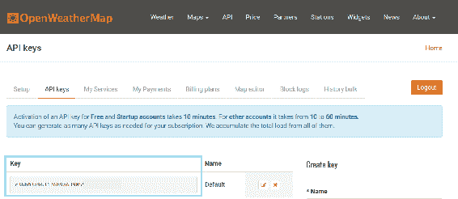
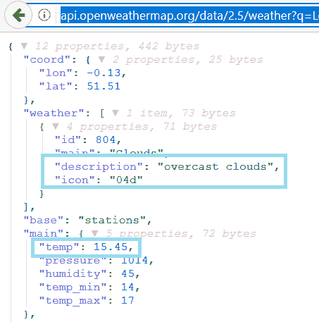
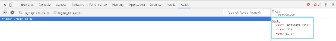
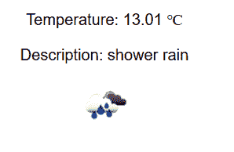
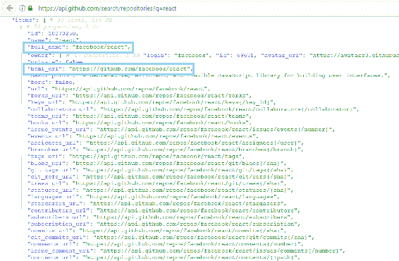
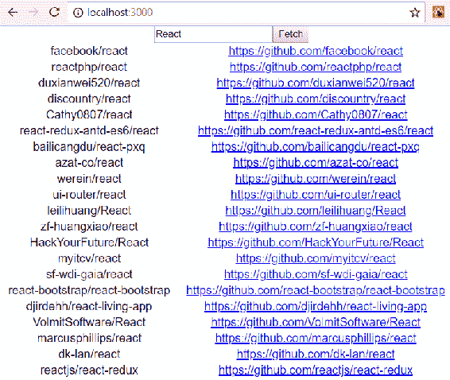

# 第七章：使用 React 消费 REST API

本章解释了 React 的网络。我们将学习承诺，使异步代码更清晰和可读。对于网络，我们将使用`fetch`库。例如，我们使用 GitHub REST API 来演示如何在 React 中消费 RESTful Web 服务。

在本章中，我们将看看以下内容：

+   使用承诺

+   如何使用 Fetch

+   如何向 REST API 发出请求

+   如何处理来自 REST API 的响应

+   如何创建一个消费 REST API 的 React 应用程序

# 技术要求

在本书中，我们使用的是 Windows 操作系统，但所有工具都适用于 Linux 和 macOS，因为 Node.js 和`create-react-app`必须安装。

# 使用承诺

处理异步操作的传统方法是使用回调函数来处理操作的成功或失败。根据调用的结果，将调用其中一个回调函数。以下示例展示了使用回调函数的思想：

```java
function doAsyncCall(success, failure) {
    // Do some api call
    if (SUCCEED)
        success(resp);
    else
        failure(err);
}

success(response) {
    // Do something with response
}

failure(error) {
    // Handle error
}

doAsyncCall(success, failure);
```

承诺是表示异步操作结果的对象。使用承诺在进行异步调用时简化了代码。承诺是非阻塞的。

承诺可以处于三种状态之一：

+   **待定**：初始状态

+   **完成**：操作成功

+   **拒绝**：操作失败

使用承诺，我们可以进行异步调用，如果我们使用的 API 支持承诺。在下一个示例中，异步调用完成后，当响应返回时，`then`中的函数将被执行，并将响应作为参数传递：

```java
doAsyncCall()
.then(response => // Do something with the response);
```

您可以将`then`链接在一起，这意味着您可以依次运行多个异步操作：

```java
doAsyncCall()
.then(response => // Get some result from the response)
.then(result => // Do something with the result);
```

您还可以通过使用`catch()`向承诺添加错误处理：

```java
doAsyncCall()
.then(response => // Get some result from the response)
.then(result => // Do something with result);
.catch(error => console.error(error))
```

有一种更现代的处理异步调用的方法，使用了 ECMAScript 2017 引入的`async`/`await`，它还没有像承诺那样得到浏览器的广泛支持。`async`/`await`实际上是基于承诺的。要使用`async`/`await`，您必须定义一个可以包含等待表达式的`async`函数。以下是使用`async`/`await`进行异步调用的示例。正如您所看到的，您可以以类似于同步代码的方式编写代码：

```java
doAsyncCall = async () => {
    const response = await fetch('http://someapi.com');
    const result = await response.json();
    // Do something with the result
}
```

对于错误处理，您可以使用`async`/`await`和`try…catch`，如下例所示：

```java
doAsyncCall = async () => {
  try {
    const response = await fetch('http://someapi.com');
    const result = await response.json();
    // Do something with the result
  }
  catch(err) {
    console.error(err);
  } 
}
```

# 使用 Fetch API

使用 Fetch API，您可以进行 Web 请求。Fetch API 的思想类似于传统的`XMLHttpRequest`，但 Fetch API 也支持承诺，使其更易于使用。

Fetch API 提供了一个`fetch()`方法，它有一个必需的参数，即您正在调用的资源的路径。对于 Web 请求，它将是服务的 URL。对于简单的`GET`方法调用，返回 JSON 响应，语法如下。`fetch()`方法返回一个包含响应的承诺。您可以使用`json()`方法从响应中解析 JSON 主体：

```java
fetch('http://someapi.com')
.then(response => response.json())
.then(result => console.log(result));
.catch(error => console.error(error))
```

使用另一种 HTTP 方法，比如`POST`，你可以在`fetch`方法的第二个参数中定义它。第二个参数是一个对象，你可以在其中定义多个请求设置。以下源代码使用`POST`方法发出请求：

```java
fetch('http://someapi.com', {method: 'POST'})
.then(response => response.json())
.then(result => console.log(result))
.catch(error => console.error(error));
```

您还可以在第二个参数中添加标头。以下`fetch`调用包含`'Content-Type' : 'application/json'`标头：

```java
fetch('http://someapi.com', 
 {
  method: 'POST', 
  headers:{'Content-Type': 'application/json'}
 }
.then(response => response.json())
.then(result => console.log(result))
.catch(error => console.error(error));
```

如果您必须在请求体中发送 JSON 编码的数据，语法如下：

```java
fetch('http://someapi.com', 
 {
  method: 'POST', 
  headers:{'Content-Type': 'application/json'},
  body: JSON.stringify(data)
 }
.then(response => response.json())
.then(result => console.log(result))
.catch(error => console.error(error));
```

您还可以使用其他库进行网络调用。一个非常流行的库是`axios`（[`github.com/axios/axios`](https://github.com/axios/axios)），你可以使用 npm 将其安装到你的 React 应用程序中。axios 有一些好处，比如自动转换 JSON 数据。以下代码显示了使用`axios`进行示例调用：

```java
axios.get('http://someapi.com')
.then(response => console.log(response))
.catch(error => console.log(error));
```

`axios`有自己的调用方法，用于不同的 HTTP 方法。例如，如果您想发出`DELETE`请求，`axios`提供了`axios.delete`方法。

# 实际示例

我们将介绍使用一些开放的 REST API 的两个示例。首先，我们将制作一个 React 应用程序，显示伦敦的当前天气。天气是从**OpenWeatherMap**([`openweathermap.org/`](https://openweathermap.org/))获取的。你需要注册到 OpenWeatherMap 获取 API 密钥。我们将使用免费账户，因为这对我们的需求已经足够。注册后，转到你的账户信息找到 API 密钥选项卡。在那里你会看到你需要用于 React 天气应用程序的 API 密钥：



让我们用`create-react-app`创建一个新的 React 应用程序。打开你正在使用的 PowerShell 或其他终端，并输入以下命令：

```java
create-react-app weatherapp
```

移动到`weatherApp`文件夹：

```java
cd weatherapp
```

用以下命令启动你的应用程序：

```java
npm start
```

用 VS Code 打开你的项目文件夹，并在编辑器视图中打开`App.js`文件。删除`<div className="App"></div>`分隔符内的所有代码。现在你的源代码应该如下所示：

```java
import React, { Component } from 'react';
import './App.css';

class App extends Component {
  render() {
    return (
      <div className="App">
      </div>
    );
  }
}

export default App;
```

如果你已经在 VS Code 中安装了*Reactjs code snippets*，你可以通过输入`con`来自动创建一个默认构造函数。对于典型的 React 方法，还有许多不同的快捷方式，比如`cdm`代表`componentDidMount()`。

首先，我们添加一个必要的构造函数和状态。我们将在我们的应用程序中显示温度、描述和天气图标，因此，我们定义了三个状态值。我们还将添加一个布尔状态来指示获取加载的状态。以下是构造函数的源代码：

```java
  constructor(props) {
    super(props);
    this.state = {temp: 0, desc: '', icon: '', loading: true}
  }
```

当你使用 REST API 时，你应该首先检查响应，以便能够从 JSON 数据中获取值。在下面的示例中，你可以看到返回伦敦当前天气的地址。将地址复制到浏览器中，你可以看到 JSON 响应数据：

```java
api.openweathermap.org/data/2.5/weather?q=London&units=Metric&APIkey=YOUR_KEY
```

从响应中，你可以看到可以使用`main.temp`来访问`temp`。`description`和`icon`在`weather`数组中，该数组只有一个元素，我们可以使用`weather[0].description`和`weather[0].icon`来访问它：



在`componentDidMount()`生命周期方法中使用`fetch`进行 REST API 调用。在成功响应后，我们将天气数据保存到状态中，并将`loading`状态更改为`false`。状态更改后，组件将重新渲染。我们将在下一步中实现`render()`方法。以下是`componentDidMount()`方法的源代码：

```java
  componentDidMount() {
    fetch('http://api.openweathermap.org/data/2.5/weather?
      q=London&units=Metric
      &APIkey=c36b03a963176b9a639859e6cf279299')
    .then(response => response.json()) 
    .then(responseData => {
      this.setState({ 
         temp: responseData.main.temp,
         desc: responseData.weather[0].description,
         icon: responseData.weather[0].icon, 
         loading: false 
       })
     })
     .catch(err => console.error(err)); 
  }
```

在添加了`componentDidMount()`方法后，当组件挂载时会进行请求。我们可以使用 React Developer Tool 检查一切是否正确。在浏览器中打开你的应用程序，并打开浏览器开发者工具的 React 选项卡。现在你可以看到状态已更新为响应中的值。你还可以从网络选项卡中检查请求状态是否为 200 OK：



最后，我们实现`render()`方法来显示天气数值。我们使用条件渲染，否则，我们会因为第一次渲染调用中没有图像代码而出现错误，图像上传也不会成功。为了显示天气图标，我们必须在图标代码之前添加`http://openweathermap.org/img/w/`，在图标代码之后添加`.png`。然后，我们可以将连接的图像 URL 设置为`img`元素的`src`属性。温度和描述显示在段落元素中。`°C` HTML 实体显示摄氏度符号：

```java
  render() {
    const imgSrc =    `http://openweathermap.org/img/w/${this.state.icon}.png`;

    if (this.state.loading) {
      return <p>Loading</p>;
    }
 else {
      return (
        <div className="App">
          <p>Temperature: {this.state.temp} °C</p>
          <p>Description: {this.state.desc}</p>
          
        </div>
      );
    }
  }
```

现在你的应用程序应该准备好了。当你在浏览器中打开它时，它应该看起来像下面的图片：



整个`App.js`文件的源代码如下所示：

```java
import React, { Component } from 'react';
import './App.css';

class App extends Component {
  constructor(props) {
    super(props);
    this.state = {temp: 0, desc: '', icon: ''}
  }

  componentDidMount() {
    fetch('http://api.openweathermap.org/data/2.5/weather?
      q=London&units=Metric&APIkey=YOUR_KEY')
    .then(response => response.json()) 
    .then(responseData => {
      this.setState({ 
         temp: responseData.main.temp,
        desc: responseData.weather[0].description,
        icon: responseData.weather[0].icon 
       }); 
    });
  }

  render() {
    const imgSrc = 'http://openweathermap.org/img/w/' + 
    this.state.icon + '.png';

```

```java
    return (
      <div className="App">
        <p>Temperature: {this.state.temp}</p>
        <p>Description: {this.state.desc}</p>
        
      </div>
    );
  }
}

export default App;
```

在第二个示例中，我们将使用 GitHub API 按关键字获取存储库。使用与上一个示例相同的步骤，创建一个名为`restgithub`的新 React 应用程序。启动应用程序并用 VS Code 打开项目文件夹。

从`App.js`文件中的`<div className="App"></div>`分隔符中删除额外的代码，然后您的`App.js`代码应如下示例代码所示：

```java
import React, { Component } from 'react';
import './App.css';

class App extends Component {
  render() {
    return (
      <div className="App">
      </div>
    );
  }
}

export default App;
```

GitHub REST API 的 URL 如下：

```java
https://api.github.com/search/repositories?q=KEYWORD
```

让我们通过在浏览器中输入 URL 并使用`react`关键字来检查 JSON 响应。从响应中，我们可以看到存储库作为名为`items`的 JSON 数组返回。从各个存储库中，我们将显示`full_name`和`html_url`的值。我们将在表中呈现数据，并使用`map`函数将值转换为表行，就像在上一章中所示的那样：



我们将使用用户输入的关键字进行 REST API 调用。因此，我们不能在`componentDidMount()`方法中进行 REST API 调用，因为在那个阶段，我们没有用户输入可用。实现这一点的一种方法是创建一个输入字段和按钮。用户在输入字段中输入关键字，当按下按钮时进行 REST API 调用。我们需要两个状态，一个用于用户输入，一个用于 JSON 响应中的数据。以下是`constructor`的源代码。数据状态的类型是数组，因为存储库作为 JSON 数组返回在响应中：

```java
  constructor(props) {
    super(props);
    this.state = { keyword: '', data: [] };
  }
```

接下来，我们将在`render()`方法中实现输入字段和按钮。我们还必须为输入字段添加一个更改监听器，以便能够将输入值保存到名为`keyword`的状态中。按钮有一个点击监听器，调用将使用给定关键字进行 REST API 调用的函数。

```java
  fetchData = () => {
    // REST API call comes here
  }

  handleChange = (e) => {
    this.setState({keyword: e.target.value});
  }

  render() {
    return (
      <div className="App">
        <input type="text" onChange={this.handleChange} />
        <button onClick={this.fetchData} value={this.state.keyword} >Fetch</button>
      </div>
    );
  }
```

在`fetchData`函数中，我们使用模板文字将`url`和`keyword`状态连接起来。然后我们将响应中的`items`数组保存到名为`data`的状态中。以下是`fetchData`函数的源代码：

```java
  fetchData = () => {
    const url = `https://api.github.com/search/repositories?
       q=${this.state.keyword}`;
    fetch(url)
    .then(response => response.json()) 
    .then(responseData => {
      this.setState({data : responseData.items }); 
    }); 
  } 
```

在`render`方法中，我们首先使用`map`函数将`data`状态转换为表行。`url`存储库将是链接元素的`href`：

```java
  render() {
    const tableRows = this.state.data.map((item, index) => 
      <tr key={index}><td>{item.full_name}</td>
      <td><a href={item.html_url}>{item.html_url}</a></td></tr>); 

    return (
      <div className="App">
        <input type="text" onChange={this.handleChange} />
        <button onClick={this.fetchData} value={this.state.keyword} >Fetch</button>
        <table><tbody>{tableRows}</tbody></table>
      </div>
    );
```

以下屏幕截图显示了在 REST API 调用中使用 React 关键字时的最终应用程序：



整个`App.js`文件的源代码如下所示：

```java
import React, { Component } from 'react';
import './App.css';

class App extends Component {
  constructor(props) {
    super(props);
    this.state = { keyword: '', data: [] };
  }

  fetchData = () => {
    const url = `https://api.github.com/search/repositories?
      q=${this.state.keyword}`;
    fetch(url)
    .then(response => response.json()) 
    .then(responseData => {
      this.setState({data : responseData.items }); 
    }); 
  }

  handleChange = (e) => {
    this.setState({keyword: e.target.value});
  }

  render() {
    const tableRows = this.state.data.map((item, index) => 
      <tr key={index}><td>{item.full_name}</td>
      <td><a href={item.html_url}>{item.html_url}</a></td></tr>); 

    return (
      <div className="App">
        <input type="text" onChange={this.handleChange} />
        <button onClick={this.fetchData} 
        value={this.state.keyword} >Fetch</button>
        <table><tbody>{tableRows}</tbody></table>
      </div>
    );
  }
}
```

# 摘要

在这一章中，我们专注于使用 React 进行网络编程。我们从使异步网络调用更容易实现的 promise 开始。这是一种更清洁的处理调用的方式，比传统的回调函数要好得多。在本书中，我们使用 Fetch API 进行网络编程，因此我们介绍了使用`fetch`的基础知识。我们实现了两个实用的 React 应用程序，调用了开放的 REST API，并在浏览器中呈现了响应数据。在下一章中，我们将介绍一些有用的 React 组件，这些组件将在我们的前端中使用。

# 问题

1.  什么是 promise？

1.  什么是`fetch`？

1.  您应该如何从 React 应用程序调用 REST API？

1.  您应该如何处理 REST API 调用的响应？

# 进一步阅读

Packt 还有其他很好的资源可供学习 React：

+   [`www.packtpub.com/web-development/getting-started-react`](https://www.packtpub.com/web-development/getting-started-react)

+   [`www.packtpub.com/web-development/react-16-essentials-second-edition`](https://www.packtpub.com/web-development/react-16-essentials-second-edition)
