# 第八章：React 的有用第三方组件

React 是基于组件的，我们可以找到许多有用的第三方组件，可以在我们的应用程序中使用。在本章中，我们将看一些组件，我们将在前端中使用。我们将看到如何找到合适的组件，以及如何在自己的应用程序中使用这些组件。

在本章中，我们将看以下内容：

+   如何找到第三方 React 组件

+   如何安装组件

+   如何使用 React 表格组件

+   如何使用模态窗口组件

+   如何使用 Material UI 组件库

+   如何在 React 中管理路由

# 技术要求

在本书中，我们使用的是 Windows 操作系统，但所有工具都适用于 Linux 和 macOS，因为 Node.js 和`create-react-app`必须安装。

# 使用第三方 React 组件

有许多不同目的的不错的 React 组件可用。我们的第一个任务是找到适合您需求的组件。搜索组件的一个好网站是 JS.coach ([`js.coach/`](https://js.coach/))。您只需输入关键字，搜索，并从框架列表中选择 React。在下面的屏幕截图中，您可以看到搜索 React 表组件的结果：

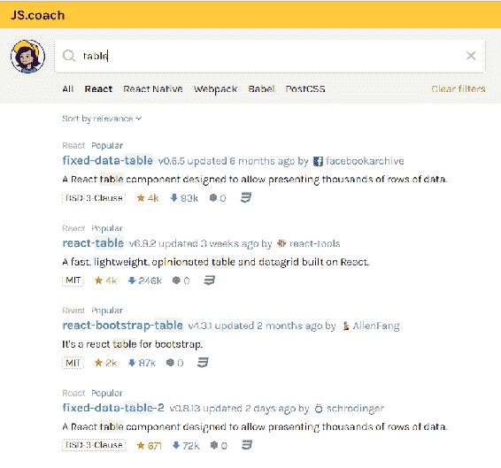

另一个获取 React 组件的好来源是 Awesome React Components ([`github.com/brillout/awesome-react-components`](https://github.com/brillout/awesome-react-components))。

组件通常有良好的文档，帮助您在自己的 React 应用程序中使用它们。让我们看看如何将第三方组件安装到我们的应用程序中并开始使用它。转到 JS.coach 网站，输入`list`以搜索输入字段，并按 React 进行过滤。从搜索结果中，您可以找到名为`react-tiny-virtual-list`的列表组件：

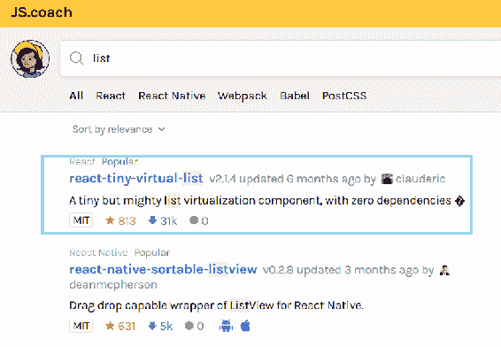

单击组件链接以查看有关组件的更详细信息。通常，您可以在那里找到安装说明，以及如何使用组件的一些简单示例。信息页面通常提供组件网站或 GitHub 存储库的地址，您可以在那里找到完整的文档：

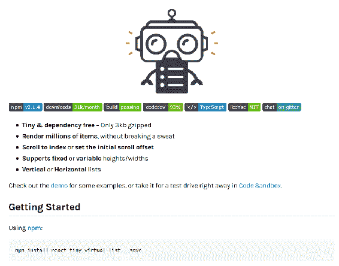

从组件的信息页面可以看出，使用`npm`安装组件。命令的语法如下：

```java
npm install component_name --save
```

或者，如果您使用 Yarn，则如下所示：

```java
yarn add component_name
```

`--save`参数将组件的依赖项保存到 React 应用程序根文件夹中的`package.json`文件中。如果您使用的是 npm 5 或更高版本，则默认情况下会执行此操作，无需`--save`参数。对于 Yarn，您不必指定，因为它默认保存组件依赖项。

现在我们将`react-tiny-virtual-list`组件安装到我们在上一章中创建的`myapp` React 应用程序中。您必须转到应用程序的根文件夹，并输入以下命令：

```java
npm install react-tiny-virtual-list --save
```

如果您打开应用程序根文件夹中的`package.json`文件，您会看到该组件现在已添加到依赖项中：

```java
{
  "name": "myapp",
  "version": "0.1.0",
  "private": true,
  "dependencies": {
    "react": "¹⁶.3.2",
    "react-dom": "¹⁶.3.2",
    "react-scripts": "1.1.4",
    "react-tiny-virtual-list": "².1.4"
  },
  "scripts": {
    "start": "react-scripts start",
    "build": "react-scripts build",
    "test": "react-scripts test --env=jsdom",
    "eject": "react-scripts eject"
  }
}
```

安装的组件保存在应用程序的`node_modules`文件夹中。如果打开该文件夹，您应该会找到`react-tiny-virtual-list`文件夹：

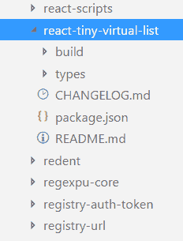

现在，如果您将 React 应用程序源代码推送到 GitHub，则不应包括`node_modules`，因为该文件夹非常大。`create-react-app`包含一个`.gitignore`文件，该文件将`node_modules`文件夹从存储库中排除。`.gitignore`文件的内容如下：

```java
# See https://help.github.com/ignore-files/ for more about ignoring files.

# dependencies
/node_modules

# testing
/coverage

# production
/build

# misc
.DS_Store
.env.local
.env.development.local
.env.test.local
.env.production.local

npm-debug.log*
yarn-debug.log*
yarn-error.log*
```

想法是，当您从 GitHub 克隆应用程序时，您键入`npm install`命令，该命令从`package.json`文件中读取依赖项，并将其下载到您的应用程序中。

开始使用已安装组件的最后一步是将其导入到您使用它的文件中：

```java
import VirtualList from 'react-tiny-virtual-list';
```

# React 表格

React Table ([`react-table.js.org`](https://react-table.js.org))是用于 React 应用程序的灵活表格组件。它具有许多有用的功能，如过滤、排序和透视。让我们使用在上一章中创建的 GitHub REST API 应用程序：

1.  安装`react-table`组件。打开 PowerShell 并移动到`restgithub`文件夹，这是应用程序的根文件夹。通过输入以下命令来安装组件：

```java
 npm install react-table --save
```

1.  使用 VS Code 打开`App.js`文件，并删除`render()`方法中的所有代码，除了包含按钮和输入字段的`return`语句。现在`App.js`文件应该如下所示：

```java
      import React, { Component } from 'react';
      import './App.css';

      class App extends Component {
        constructor(props) {
          super(props);
          this.state = { keyword: '', data: [] };
        }

        fetchData = () => {
          const url = `https://api.github.com/search/repositories?
           q=${this.state.keyword}`;
          fetch(url)
```

```java
          .then(response => response.json()) 
          .then(responseData => {
            this.setState({data : responseData.items }); 
          }); 
        }

        handleChange = (e) => {
          this.setState({keyword: e.target.value});
        }

        render() {
          return (
            <div className="App">
              <input type="text" onChange={this.handleChange} />
              <button onClick={this.fetchData} value=
               {this.state.keyword} >Fetch</button>
            </div>
          );
        }
      }

      export default App;
```

1.  在`App.js`文件的开头添加以下行来导入`react-table`组件和样式表：

```java
      import ReactTable from "react-table";
      import 'react-table/react-table.css';
```

1.  要填充 React Table 的数据，你必须将数据传递给组件的数据属性。数据可以是数组或对象，因此我们可以使用我们的状态，称为`data`。列使用列属性进行定义，该属性是必需的：

```java
      <ReactTable
        data={data}
        columns={columns}
      />
```

1.  我们将通过在`render()`方法中创建列对象数组来定义我们的列。在列对象中，你至少需要定义列的标题和数据访问器。数据访问器的值来自我们的 REST API 响应数据。你可以看到我们的响应数据包含一个名为`owner`的对象，我们可以使用`owner.field_name`语法显示这些值：

```java
      const columns = [{
         Header: 'Name',  // Header of the column  
         accessor: 'full_name' // Value accessor
        }, {
         Header: 'URL',
         accessor: 'html_url',
        }, {
         Header: 'Owner',
         accessor: 'owner.login',
      }]
```

1.  将 React Table 组件添加到我们的`render()`方法中，然后该方法的源代码如下：

```java
      render() {
        const columns = [{
          Header: 'Name', // Header of the column
          accessor: 'full_name' // Value accessor
        }, {
          Header: 'URL',
          accessor: 'html_url',
        }, {
          Header: 'Owner',
          accessor: 'owner.login',
        }]

        return (
          <div className="App">
            <input type="text" onChange={this.handleChange} />
            <button onClick={this.fetchData} 
             value={this.state.keyword} >Fetch</button>
            <ReactTable
              data={this.state.data}
              columns={columns}

            />
          </div>
        );
      }
```

1.  运行应用程序并导航到`localhost:3000`。表看起来非常不错。它默认提供了排序和分页功能：

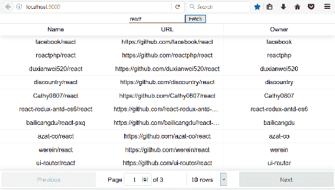

过滤默认情况下是禁用的，但你可以使用`ReactTable`组件中的`filterable`属性来启用它。你还可以设置表的页面大小：

```java
<ReactTable
   data={this.state.data}
   columns={columns}
   filterable={true}
   defaultPageSize = {10}
/>
```

现在你应该在你的表中看到过滤元素。你可以使用任何列进行过滤，但也可以在列级别设置过滤和排序：

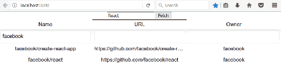

你可以从 React Table 网站上找到表格和列的不同属性。

单元格渲染器可用于自定义表格单元格的内容。以下示例显示了如何将按钮呈现为表格单元格。单元格渲染器中的函数将`value`作为参数传递，而在这种情况下，值将是列的访问器中定义的`full_name`。另一个选项是传递一个行，它将整个`row`对象传递给函数。然后你需要定义`btnClick`函数，当按钮被按下时将被调用，你可以对发送到函数的值进行操作：

```java
render() {
  const columns = [{
    Header: 'Name', // Header of the column
    accessor: 'full_name' // Value accessor
  }, {
    Header: 'URL',
    accessor: 'html_url',
  }, {
    Header: 'Owner',
    accessor: 'owner.login',
  }, {
    id: 'button',
    sortable: false,
    filterable: false,
    width: 100,
    accessor: 'full_name',
```

```java
    Cell: ({value}) => (<button className="btn btn-default btn-link" onClick=                            {() => {this.btnClick(value)}}>Press me</button>)
}]
```

以下是带有按钮的表格的屏幕截图：

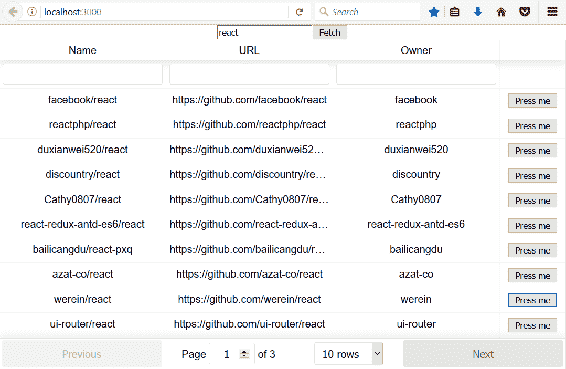

# 模态窗口组件

模态窗口在创建 CRUD 应用程序时非常有用。我们将创建一个简单的购物清单应用程序，用户可以使用模态窗口添加新项目。我们在示例中将使用的模态窗口组件是`react-skylight`（[`marcio.github.io/react-skylight/`](https://marcio.github.io/react-skylight/)）：

1.  创建一个名为`shoppinglist`的新 React 应用程序，并使用以下命令安装`react-skylight`：

```java
 npm install react-skylight --save
```

1.  使用 VS Code 打开`app`文件夹，并在代码编辑器中打开`App.js`文件。在`App.js`组件中，我们只需要一个状态来保存购物清单项目。一个购物清单项目包含两个字段——产品和数量。我们还需要一个方法来向列表中添加新项目。以下是构造函数和向列表中添加新项目的方法的源代码。在`addItem`方法中，我们使用了扩展符号（`...`），用于在现有数组的开头添加新项目：

```java
      constructor(props) {
        super(props);
        this.state={ items: [] };
      }

      addItem = (item) => {
        this.setState({items: [item, ...this.state.items]});
      }
```

1.  添加一个新组件来添加购物项。在应用程序的根文件夹中创建一个名为`AddItem.js`的新文件。该组件将使用 React Skylight 模态表单，因此让我们导入`react-skylight`。在`render()`方法中的 React Skylight 组件内，我们将添加两个输入字段（产品和数量）和一个调用`addItem`函数的按钮。为了能够调用`App.js`组件中的`addItem`函数，我们必须在渲染`AddItem`组件时将其作为 prop 传递。在 React Skylight 组件之外，我们将添加一个按钮，当按下时打开模态表单。该按钮是组件初始渲染时唯一可见的元素，并调用 React Skylight 的`show()`方法来打开模态表单。我们还必须处理输入字段的更改事件，以便访问已输入的值。当模态表单内的按钮被点击时，将调用`addItem`函数，并使用 React Skylight 的`hide()`方法关闭模态表单。该函数从输入字段值创建一个对象，并调用`App.js`组件的`addItem`函数，最终向状态数组中添加一个新项目并重新渲染用户界面：

```java
import React, { Component } from 'react';
import SkyLight from 'react-skylight';

class AddItem extends Component {
  constructor(props) {
    super(props);
  }

  // Create new shopping item and calls addItem function. 
  // Finally close the modal form
  addItem = () => {
    const item = {product: this.state.product,
     amount: this.state.amount};
    this.props.additem(item);
    this.addform.hide();
  }

  handleChange = (e) => {
    this.setState({[e.target.name]: e.target.value});
  }

  render() {
    return (
      <div>
        <section>
          <button onClick={() => this.addform.show()}>Add
           Item</button>
        </section>
        <SkyLight 
          hideOnOverlayClicked 
          ref={ref => this.addform = ref} 
          title="Add item">
          <input type="text" name="product"
           onChange={this.handleChange} 
           placeholder="product" /><br/>
          <input type="text" name="amount"
           onChange={this.handleChange} 
           placeholder="amount" /><br/>
          <button onClick={this.addItem}>Add</button>
        </SkyLight> 
      </div>
    );
  }
}

export default AddItem;
```

1.  在`App.js`文件中修改`render()`方法。将`AddItem`组件添加到`render()`方法中，并将`addItem`函数作为 prop 传递给`AddItem`组件。在方法的开头，我们使用`map`函数将项目转换为`listItems`(`<li></li>`)：

```java
// App.js
render() {
  const listItems = this.state.items.map((item, index) => 
    <li key={index}>{item.product} {item.amount}</li>)

  return (
    <div className="App">
      <h2>Shopping list</h2>
      <AddItem additem={this.addItem}/>
      <ul>{listItems}</ul>
    </div>
  );
}
```

现在打开应用程序时，您将看到一个空列表和一个添加新项目的按钮：

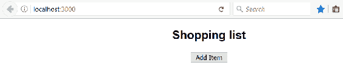

当您按下“Add Item”按钮时，模态表单将打开：

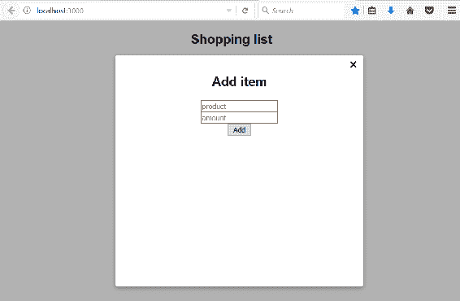

在输入框中输入一些值，然后按下“Add”按钮。模态表单将关闭，并且新项目将显示在列表中：

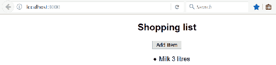

# Material UI 组件库

Material UI 是实现 Google 的 Material Design 的 React 组件库。它包含许多不同的组件，如按钮、列表、表格和卡片，您可以使用它们来获得一个漂亮和统一的用户界面。我们将继续使用购物清单应用程序，并开始使用 Material UI 来设计用户界面：

1.  使用 VS Code 打开购物清单应用程序。在根文件夹中键入以下命令来安装 Material UI 到 PowerShell 或您正在使用的任何合适的终端中：

```java
npm install @material-ui/core --save

OR with yarn

yarn add @material-ui/core
```

1.  我们准备开始使用 Material UI 组件。首先，我们将更改`AddItem.js`文件中的按钮，以使用 Material UI 的`Button`组件。我们必须导入`Button`组件，然后在`render()`方法中使用它。Material UI 文档中可以找到`Button`的不同 props：

```java
// Import RaisedButton
import RaisedButton from '@material-ui/core/Button';

// Use RaisedButton in render() method
render() {
  return (
    <div>
      <section>
        <Button onClick={() => this.addform.show()} 
         variant="raised" color="primary">
         Add Item</ Button>
      </section>
      <SkyLight 
        hideOnOverlayClicked 
        ref={ref => this.addform = ref} 
        title="Add item">
        <input type="text" name="product" 
         onChange={this.handleChange} 
         placeholder="product" /><br/>
        <input type="text" name="amount" 
         onChange={this.handleChange} 
         placeholder="amount" /><br/>
        <Button onClick={this.addItem} 
         variant="default"  >Add</ Button>
      </SkyLight> 
    </div>
  );
}
```

现在应用程序使用`RaisedButton`，效果如下：

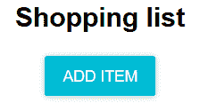

1.  将`AddItem.js`中的输入字段更改为使用 Material UI 的`TextField`组件。步骤与按钮相同。导入`TextField`组件，然后在`render()`方法中使用它：

```java
// Import TextField component
import TextField from '@material-ui/core/TextField';

// Use TextField in render() method
render() {
  return (
    <div>
      <section>
        <Button onClick={() => this.addform.show()} 
         variant="raised" color="primary">
         Add Item</ Button>
      </section>
      <SkyLight 
        hideOnOverlayClicked 
        ref={ref => this.addform = ref} 
        title="Add item">
        <TextField type="text" name="product" 
          onChange={this.handleChange} 
          placeholder="product" /><br/>
        <TextField type="text" name="amount" 
          onChange={this.handleChange} 
          placeholder="amount" /><br/>
        <Button onClick={this.addItem} 
         variant="default"  >Add</ Button>     
      </SkyLight> 
    </div>
  );
}
```

在更改后，您的表单应如下所示：

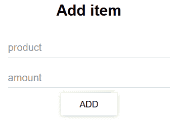

1.  在`App.js`文件中更改我们的列表，使用 Material UI 的`List`和`ListItem`组件。导入这些组件，并在创建`listItems`和渲染`List`的地方使用`ListItem`。我们将在`ListItemText`组件的次要文本中显示产品的数量：

```java
// Import List, ListItem and ListItemText components
import List from '@material-ui/core/List';
import ListItem from '@material-ui/core/ListItem';
import ListItemText from '@material-ui/core/ListItemText';

// Use List and ListItem in render() method
render() {
 // Use ListItem component here instead of li 
    const listItems = this.state.items.map((item, index) => 
     <ListItem key={index}>
     <ListItemText primary={item.product} secondary={item.amount} />
     </ListItem>)
  return (
    <div className="App">
      <h2>Shopping list</h2>
      <AddItem additem={this.addItem}/>
      <List>{listItems}</List>
    </div>
  );
}
```

现在用户界面如下所示。通过少量的工作，用户界面现在更加精致：

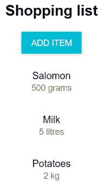

# 路由

React 中有多种可用的路由解决方案。最流行的解决方案是 React Router（[`github.com/ReactTraining/react-router`](https://github.com/ReactTraining/react-router)）。对于 Web 应用程序，React Router 提供了一个名为`react-router-dom`的包。

要开始使用 React Router，我们必须使用以下命令进行安装：

```java
npm install react-router-dom --save
```

在`react-router-dom`中有四个不同的组件需要实现路由。`BrowserRouter`是用于基于 Web 的应用程序的路由器。`Route`组件在给定位置匹配时呈现定义的组件。以下是`Route`组件的两个示例。第一个示例在用户导航到`/contact`端点时呈现`Contact`组件。您还可以使用`Route`组件进行内联呈现，如第二个示例所示：

```java
<Route path="/contact" component={Contact} />
// Route with inline rendering
<Route path="/links" render={() => <h1>Links</h1>} />
```

`Switch`组件包装多个`Route`组件。`Link`组件提供了应用程序的导航。以下示例显示了`Contact`链接，并在单击链接时导航到`/contact`端点：

```java
<Link to="/contact">Contact</Link>
```

以下示例显示了如何在实践中使用这些组件。让我们使用`create-react-app`创建一个名为`routerapp`的新 React 应用程序。使用 VS Code 打开应用程序文件夹，并打开`App.js`文件以编辑视图。从`react-router-dom`包中导入组件，并从渲染方法中删除额外的代码。修改后，您的`App.js`源代码应如下所示：

```java
import React, { Component } from 'react';
import './App.css';
import { BrowserRouter, Switch, Route, Link } from 'react-router-dom'

class App extends Component {
  render() {
    return (
      <div className="App">
      </div>
    );
  }
}

export default App;
```

让我们首先创建两个简单的组件，我们可以在路由中使用。在应用程序根文件夹中创建两个名为`Home.js`和`Contact.js`的新文件。只需向`render()`方法中添加标题，以显示组件的名称。请参阅以下组件的代码：

```java
//Contact.js
import React, { Component } from 'react';

class Contact extends Component {
  render() {
    return (
      <div>
        <h1>Contact.js</h1>
      </div>
    );
  }
}

export default Contact;

// Home.js
import React, { Component } from 'react';

class Home extends Component {
  render() {
    return (
      <div>
        <h1>Home.js</h1>
      </div>
    );
  }
}

export default Links;
```

打开`App.js`文件，让我们添加一个路由器，允许我们在组件之间导航：

```java
import React, { Component } from 'react';
import './App.css';
import { BrowserRouter, Switch, Route, Link } from 'react-router-dom'
import Contact from './Contact';
import Home from './Home';

class App extends Component {
  render() {
    return (
      <div className="App">
        <BrowserRouter>
          <div>
            <Link to="/">Home</Link>{' '}
            <Link to="/contact">Contact</Link>{' '} 
            <Link to="/links">Links</Link>{' '} 
            <Switch>
              <Route exact path="/" component={Home} />
              <Route path="/contact" component={Contact} />
              <Route path="/links" render={() => <h1>Links</h1>} />
              <Route render={() => <h1>Page not found</h1>} />
            </Switch>
          </div>
        </BrowserRouter>
      </div>
    );
  }
}

export default App;
```

现在，当您启动应用程序时，您将看到链接和`Home`组件，该组件显示在根端点（`localhost:3030/`）中，如第一个`Route`组件中所定义。第一个`Route`组件中的`exact`关键字表示路径必须完全匹配。如果删除该关键字，则路由始终转到`Home`组件：

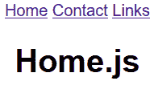

当您点击`Contact`链接时，将呈现`Contact`组件：

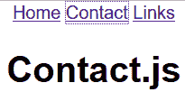

# 总结

在本章中，我们学习了如何使用第三方 React 组件。我们熟悉了几个我们将在前端中使用的组件。React Table 是带有内置功能（如排序、分页和过滤）的表组件。React Skylight 是我们将在前端中使用的模态表单组件，用于创建添加和编辑项目的表单。Material UI 是提供多个实现 Google Material Design 的用户界面组件的组件库。我们还学习了如何在 React 应用程序中使用 React Router 进行路由。在下一章中，我们将为前端开发构建一个环境。

# 问题

1.  您应该如何找到 React 的组件？

1.  您应该如何安装组件？

1.  您应该如何使用 React Table 组件？

1.  您应该如何使用 React 创建模态表单？

1.  您应该如何使用 Material UI 组件库？

1.  您应该如何在 React 应用程序中实现路由？

# 进一步阅读

Packt 有其他很好的资源可以学习 React：

+   [`www.packtpub.com/web-development/getting-started-react`](https://www.packtpub.com/web-development/getting-started-react)

+   [`www.packtpub.com/web-development/react-16-essentials-second-edition`](https://www.packtpub.com/web-development/react-16-essentials-second-edition)
