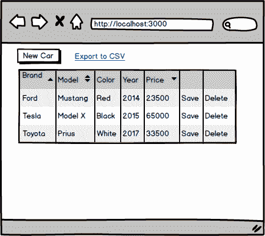
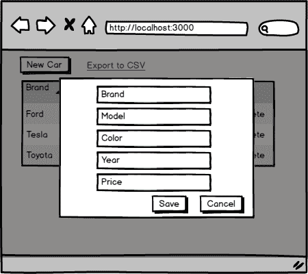
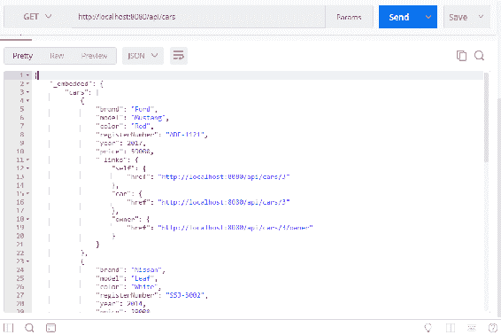
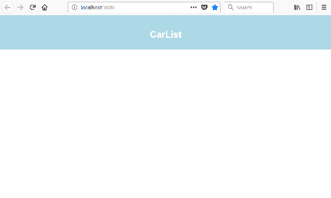

# 第九章：为我们的 Spring Boot RESTful Web Service 设置前端

本章解释了开始开发前端部分所需的步骤。我们首先会定义我们正在开发的功能。然后我们将对用户界面进行模拟。作为后端，我们将使用我们在第四章中的 Spring Boot 应用程序，*保护和测试您的后端*。我们将使用后端的未安全版本开始开发。最后，我们将创建我们将在前端开发中使用的 React 应用程序。

在本章中，我们将看到以下内容：

+   为什么以及如何进行模拟

+   为前端开发准备我们的 Spring Boot 后端

+   为前端创建 React 应用

# 技术要求

我们需要在第四章中创建的 Spring Boot 应用程序，*保护和测试您的后端*。

Node.js 和`create-react-app`应该已安装。

# 模拟用户界面

在本书的前几章中，我们创建了一个提供 REST API 的汽车数据库后端。现在是时候开始构建我们应用程序的前端了。我们将创建一个从数据库中列出汽车并提供分页、排序和过滤的前端。有一个按钮可以打开模态表单，将新车添加到数据库中。在汽车表的每一行中，都有一个按钮可以从数据库中删除汽车。表行也是可编辑的，可以通过单击行中的“保存”按钮将修改保存到数据库中。前端包含一个链接或按钮，可以将表中的数据导出到 CSV 文件中。

让我们从用户界面创建一个模拟。有很多不同的应用程序可以用来创建模拟，或者你甚至可以使用铅笔和纸。您还可以创建交互式模拟以演示一些功能。如果您已经完成了模拟，那么在开始编写任何实际代码之前，与客户讨论需求就会更容易。有了模拟，客户也更容易理解前端的想法并对其产生影响。与真实的前端源代码相比，对模拟的修改真的很容易和快速。

以下截图显示了我们汽车列表前端的模拟：



当用户按下“New Car”按钮时打开的模态表单如下所示：



# 准备 Spring Boot 后端

我们将使用后端的未安全版本开始前端开发。在第一阶段，我们实现所有 CRUD 功能并测试这些功能是否正常工作。在第二阶段，我们在后端启用安全性，并进行所需的修改，最后我们实现身份验证。

使用 Eclipse 打开 Spring Boot 应用程序，我们在第四章中创建的，*保护和测试您的后端*。打开定义 Spring Security 配置的`SecurityConfig.java`文件。暂时注释掉当前配置，并允许每个人访问所有端点。参见以下修改：

```java
  @Override
  protected void configure(HttpSecurity http) throws Exception {
   // Add this row to allow access to all endpoints
   http.cors().and().authorizeRequests().anyRequest().permitAll(); 

   /* Comment this out
   http.cors().and().authorizeRequests()
     .antMatchers(HttpMethod.POST, "/login").permitAll()
     .anyRequest().authenticated()
     .and()
     // Filter for the api/login requests
     .addFilterBefore(new LoginFilter("/login", authenticationManager()),
             UsernamePasswordAuthenticationFilter.class)
     // Filter for other requests to check JWT in header
     .addFilterBefore(new AuthenticationFilter(),
      UsernamePasswordAuthenticationFilter.class);
     */
    }
```

现在，如果您运行后端并使用 Postman 测试`http:/localhost:8080/api/cars`端点，您应该会在响应中获得所有汽车，如下截图所示：



# 为前端创建 React 项目

在开始编写前端代码之前，我们必须创建一个新的 React 应用程序：

1.  打开 PowerShell 或任何其他适合的终端。通过输入以下命令创建一个新的 React 应用程序：

```java
create-react-app carfront
```

1.  通过输入以下命令运行应用程序：

```java
npm start
```

或者，如果您正在使用 Yarn，请输入以下内容：

```java
yarn start
```

1.  使用 VS Code 打开`app`文件夹，删除任何额外的代码，并从`App.js`文件中更改标题文本。修改后，您的`App.js`文件源代码应如下所示：

```java
import React, { Component } from 'react';
import './App.css';

class App extends Component {
  render() {
    return (
      <div className="App">
        <header className="App-header">
          <h1 className="App-title">CarList</h1>
        </header> 
      </div>
    );
  }
}

export default App;
```

1.  让我们也减少标题的高度，并将颜色更改为`lightblue`。打开`App.css`文件，你可以在`App.js`文件的样式中找到。将标题高度从 150 减少到 50，并将颜色更改为`lightblue`：

```java
.App-header {
  background-color:lightblue;
  height: 50px;
  padding: 20px;
  color: white;
}
```

现在你的前端起点应该如下所示：



# 总结

在本章中，我们开始开发我们的前端，使用我们在第四章中创建的后端，*保护和测试您的后端*。我们定义了前端的功能，并创建了用户界面的模拟。我们从未经保护的后端开始了前端开发，因此，我们对 Spring Security 配置类进行了一些修改。我们还创建了我们在开发过程中将要使用的 React 应用程序。在下一章中，我们将开始为我们的前端添加 CRUD 功能。

# 问题

1.  为什么你应该做用户界面的模拟？

1.  你应该如何做用户界面的模拟？

1.  你应该如何从后端禁用 Spring Security？

# 进一步阅读

Packt 还有其他关于学习 React 的很棒的资源：

+   [`www.packtpub.com/web-development/getting-started-react`](https://www.packtpub.com/web-development/getting-started-react)

+   [`www.packtpub.com/web-development/react-16-essentials-second-edition`](https://www.packtpub.com/web-development/react-16-essentials-second-edition)
