# 第十章：添加 CRUD 功能

本章描述了如何在我们的前端实现 CRUD 功能。我们将使用第八章中学到的组件，*React 有用的第三方组件*。我们将从后端获取数据并在表中呈现数据。然后，我们将实现删除、编辑和添加功能。最后，我们将添加功能以将数据导出到 CSV 文件。

在本章中，我们将讨论以下内容：

+   如何从后端获取数据并在前端呈现数据

+   如何使用 REST API 删除、添加和更新数据

+   如何向用户显示提示消息

+   如何从 React 应用程序导出数据到 CSV 文件

# 技术要求

我们在第四章中创建的 Spring Boot 应用程序需要与上一章的修改（未经保护的后端）一起使用。

我们还需要在上一章中创建的 React 应用程序（*carfront*）。

# 创建列表页面

在第一阶段，我们将创建列表页面，显示带分页、过滤和排序功能的汽车。运行 Spring Boot 后端，可以通过向`http://localhost:8080/api/cars` URL 发送`GET`请求来获取汽车，如第三章中所示，*使用 Spring Boot 创建 RESTful Web 服务*。

让我们检查来自响应的 JSON 数据。汽车数组可以在 JSON 响应数据的`_embedded.cars`节点中找到：

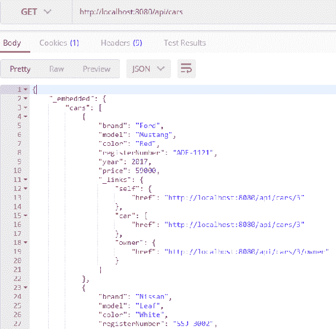

现在，一旦我们知道如何从后端获取汽车，我们就准备好实现列表页面来显示汽车。以下步骤描述了这一实践：

1.  打开 VS Code 中的*carfront* React 应用程序（在上一章中创建的 React 应用程序）。

1.  当应用程序有多个组件时，建议为它们创建一个文件夹。在`src`文件夹中创建一个名为`components`的新文件夹。使用 VS Code，可以通过右键单击侧边栏文件资源管理器中的文件夹，并从菜单中选择“新建文件夹”来创建文件夹：

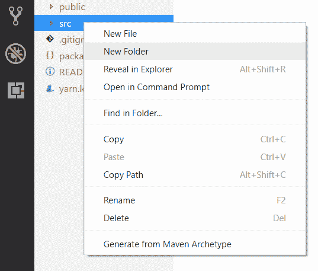

1.  在`components`文件夹中创建一个名为`Carlist.js`的新文件，现在您的项目结构应如下所示：

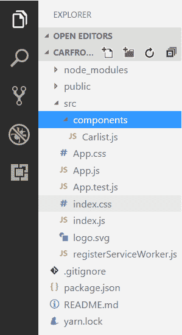

1.  在编辑器视图中打开`Carlist.js`文件，并编写组件的基本代码，如下所示：

```java
import React, { Component } from 'react';

class Carlist extends Component {

  render() {
    return (
      <div></div>
    );
  }
}

export default Carlist;
```

1.  我们需要一个从 REST API 获取的`cars`状态，因此，我们必须添加构造函数并定义一个数组类型的状态值：

```java
constructor(props) {
  super(props);
  this.state = { cars: []};
} 
```

1.  在`componentDidMount()`生命周期方法中执行`fetch`。来自 JSON 响应数据的汽车将保存到名为`cars`的状态中：

```java
  componentDidMount() {
    fetch('http://localhost:8080/api/cars')
    .then((response) => response.json()) 
    .then((responseData) => { 
      this.setState({ 
        cars: responseData._embedded.cars,
      }); 
    })
    .catch(err => console.error(err)); 
  }
```

1.  使用 map 函数将`car`对象转换为`render()`方法中的表行，并添加表元素：

```java
render() {
  const tableRows = this.state.cars.map((car, index) => 
    <tr key={index}>
      <td>{car.brand}</td>
      <td>{car.model}</td>
      <td>{car.color}</td>
      <td>{car.year}</td>
      <td>{car.price}</td>
    </tr>
  );

  return (
    <div className="App">
      <table>
        <tbody>{tableRows}</tbody>
      </table>
    </div>
  );
}
```

现在，如果使用`npm start`命令启动 React 应用程序，应该会看到以下列表页面：

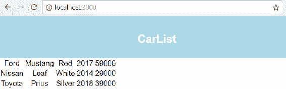

当我们创建更多的 CRUD 功能时，URL 服务器可能会重复多次，并且当后端部署到本地主机以外的服务器时，它将发生变化。因此，最好将其定义为常量。然后，当 URL 值更改时，我们只需在一个地方进行修改。让我们在我们应用程序的根文件夹中创建一个名为`constants.js`的新文件。在编辑器中打开文件，并将以下行添加到文件中：

```java
export const SERVER_URL = 'http://localhost:8080/'
```

然后，我们将其导入到我们的`Carlist.js`文件中，并在`fetch`方法中使用它：

```java
//Carlist.js
// Import server url (named import)
import {SERVER_URL} from '../constants.js'

// Use imported constant in the fetch method
fetch(SERVER_URL + 'api/cars')
```

最后，您的`Carlist.js`文件源代码应如下所示：

```java
import React, { Component } from 'react';
import {SERVER_URL} from '../constants.js'

class Carlist extends Component {
  constructor(props) {
    super(props);
    this.state = { cars: []};
  }

  componentDidMount() {
    fetch(SERVER_URL + 'api/cars')
    .then((response) => response.json()) 
    .then((responseData) => { 
      this.setState({ 
        cars: responseData._embedded.cars,
      }); 
    })
    .catch(err => console.error(err)); 
  }

  render() {
    const tableRows = this.state.cars.map((car, index) => 
      <tr key={index}><td>{car.brand}</td>
       <td>{car.model}</td><td>{car.color}</td>
       <td>{car.year}</td><td>{car.price}</td></tr>);

    return (
      <div className="App">
        <table><tbody>{tableRows}</tbody></table>
      </div>
    );
  }
}

export default Carlist;
```

现在我们将使用 React Table 来获得分页、过滤和排序功能。通过在终端中按*Ctrl* + *C*停止开发服务器，并输入以下命令来安装 React Table。安装完成后，重新启动应用程序：

```java
npm install react-table --save
```

将`react-table`和样式表导入到您的`Carlist.js`文件中：

```java
import ReactTable from "react-table";
import 'react-table/react-table.css';
```

然后从`render()`方法中删除`table`和`tableRows`。React Table 的`data`属性是`this.state.cars`，其中包含获取的汽车。我们还必须定义表的`columns`，其中`accessor`是`car`对象的字段，`header`是标题的文本。为了启用过滤，我们将表的`filterable`属性设置为`true`。请参阅以下`render()`方法的源代码：

```java
  render() {
    const columns = [{
      Header: 'Brand',
      accessor: 'brand'
    }, {
      Header: 'Model',
      accessor: 'model',
    }, {
      Header: 'Color',
      accessor: 'color',
    }, {
      Header: 'Year',
      accessor: 'year',
    }, {
      Header: 'Price €',
      accessor: 'price',
    },]

    return (
      <div className="App">
        <ReactTable data={this.state.cars} columns={columns} 
          filterable={true}/>
      </div>
    );
  }
```

使用 React Table 组件，我们用少量的编码获得了表的所有必要功能。现在列表页面看起来像下面这样：

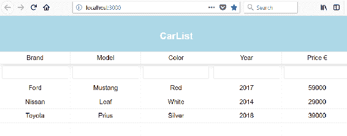

# 删除功能

可以通过向`http://localhost:8080/api/cars/[carid]`端点发送`DELETE`方法请求从数据库中删除项目。如果我们查看 JSON 响应数据，我们可以看到每辆汽车都包含一个指向自身的链接，并且可以从`_links.self.href`节点访问，如下截图所示：

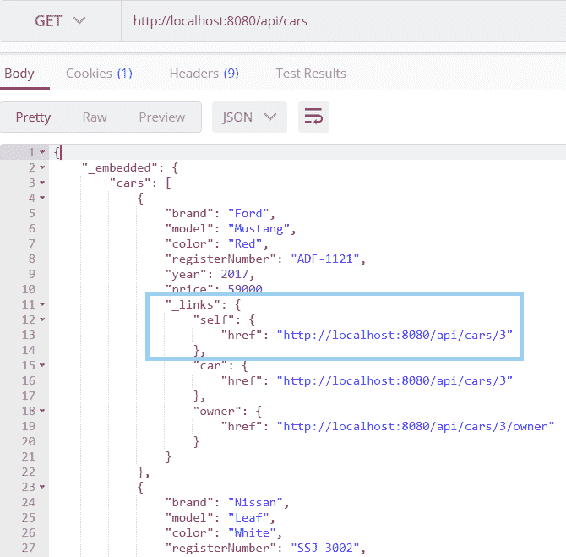

以下步骤显示了如何实现删除功能：

1.  我们将为表中的每一行创建一个按钮，按钮的访问器将是`_links.self.href`，我们可以使用它来调用我们即将创建的删除函数。但首先，使用`Cell`向表中添加一个新列来渲染按钮。请参阅以下源代码。我们不希望为按钮列启用排序和过滤，因此这些属性被设置为`false`。按钮在按下时调用`onDelClick`函数，并将汽车的链接作为参数发送：

```java
  const columns = [{
    Header: 'Brand',
    accessor: 'brand'
  }, {
    Header: 'Model',
    accessor: 'model',
  }, {
    Header: 'Color',
    accessor: 'color',
  }, {
    Header: 'Year',
    accessor: 'year',
  }, {
    Header: 'Price €',
    accessor: 'price',
  }, {
    id: 'delbutton',
    sortable: false,
    filterable: false,
    width: 100,
    accessor: '_links.self.href',
    Cell: ({value}) => (<button onClick={()=>{this.onDelClick(value)}}>Delete</button>)
  }]
```

1.  实现`onDelClick`函数。但首先，让我们从`componentDidMount()`方法中取出`fetchCars`函数。这是因为我们希望在汽车被删除后也调用`fetchCars`函数，以向用户显示更新后的汽车列表。创建一个名为`fetchCars()`的新函数，并将`componentDidMount()`方法中的代码复制到新函数中。然后从`componentDidMount()`函数中调用`fetchCars()`函数以最初获取汽车：

```java
componentDidMount() {
  this.fetchCars();
}

fetchCars = () => {
  fetch(SERVER_URL + 'api/cars')
  .then((response) => response.json()) 
  .then((responseData) => { 
    this.setState({ 
      cars: responseData._embedded.cars,
    }); 
  })
  .catch(err => console.error(err)); 
}
```

1.  实现`onDelClick`函数。我们向汽车链接发送`DELETE`请求，当删除成功删除时，我们通过调用`fetchCars()`函数刷新列表页面：

```java
// Delete car
onDelClick = (link) => {
  fetch(link, {method: 'DELETE'})
  .then(res => this.fetchCars())
  .catch(err => console.error(err)) 
}
```

当您启动应用程序时，前端应该如下截图所示，当按下删除按钮时，汽车将从列表中消失：

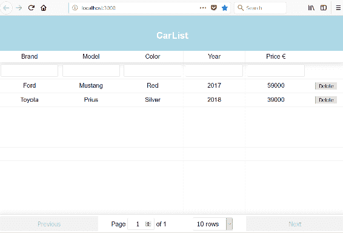

在成功删除或出现错误时，向用户显示一些反馈会很好。让我们实现一个提示消息来显示删除的状态。为此，我们将使用`react-toastify`组件（[`github.com/fkhadra/react-toastify`](https://github.com/fkhadra/react-toastify)）。通过在您使用的终端中键入以下命令来安装该组件：

```java
npm install react-toastify --save
```

安装完成后，启动您的应用程序并在编辑器中打开`Carlist.js`文件。我们必须导入`ToastContainer`、`toast`和样式表以开始使用`react-toastify`。将以下导入语句添加到您的`Carlist.js`文件中：

```java
import { ToastContainer, toast } from 'react-toastify';
import 'react-toastify/dist/ReactToastify.css';
```

`ToastContainer`是用于显示提示消息的容器组件，应该在`render()`方法中。在`ToastContainer`中，您可以使用`autoClose`属性以毫秒为单位定义提示消息的持续时间。在`render()`方法的返回语句中添加`ToastContainer`组件，就在`ReactTable`之后：

```java
return (
  <div className="App">
     <ReactTable data={this.state.cars} columns={columns} 
       filterable={true}/>
     <ToastContainer autoClose={1500} } /> 
   </div>
);
```

然后，我们将在`onDelClick()`函数中调用 toast 方法来显示提示消息。您可以定义消息的类型和位置。成功删除时显示成功消息，在出现错误时显示错误消息：

```java
// Delete car
onDelClick = (link) => {
  fetch(link, {method: 'DELETE'})
  .then(res => {
    toast.success("Car deleted", {
      position: toast.POSITION.BOTTOM_LEFT
    });
    this.fetchCars();
  })
  .catch(err => {
    toast.error("Error when deleting", {
      position: toast.POSITION.BOTTOM_LEFT
    });
    console.error(err)
  }) 
 }
```

现在，当汽车被删除时，您将看到提示消息，如下截图所示：

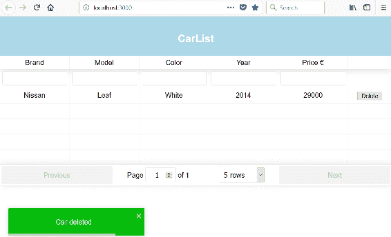

为了避免意外删除汽车，按下删除按钮后最好有一个确认对话框。我们将使用`react-confirm-alert`组件（[`github.com/GA-MO/react-confirm-alert`](https://github.com/GA-MO/react-confirm-alert)）来实现这一点。如果您的应用程序正在运行，请通过在终端中按下*Ctrl* + *C*来停止开发服务器，并输入以下命令来安装`react-confirm-alert`。安装后，重新启动应用程序：

```java
npm install react-confirm-alert --save
```

将`confirmAlert`和 CSS 文件导入`Carlist`组件：

```java
import { confirmAlert } from 'react-confirm-alert';
import 'react-confirm-alert/src/react-confirm-alert.css' 
```

创建一个名为`confirmDelete`的新函数，用于打开确认对话框。如果对话框的“是”按钮被按下，将调用`onDelClick`函数并删除汽车：

```java
confirmDelete = (link) => {
  confirmAlert({
    message: 'Are you sure to delete?',
    buttons: [
      {
        label: 'Yes',
        onClick: () => this.onDelClick(link)
      },
      {
        label: 'No',
      }
    ]
  })
}
```

然后，将删除按钮的`onClick`事件中的函数更改为`confirmDelete`：

```java
render() {
  const columns = [{
    Header: 'Brand',
    accessor: 'brand',
  }, {
    Header: 'Model',
    accessor: 'model',
  }, {
    Header: 'Color',
    accessor: 'color',
  }, {
    Header: 'Year',
    accessor: 'year',
  }, {
    Header: 'Price €',
    accessor: 'price',
  }, {
    id: 'delbutton',
    sortable: false,
    filterable: false,
    width: 100,
    accessor: '_links.self.href',
    Cell: ({value}) => (<button onClick=
      {()=>{this.confirmDelete(value)}}>Delete</button>)
  }]
```

如果您现在按下删除按钮，确认对话框将被打开，只有当您按下“是”按钮时，汽车才会被删除：

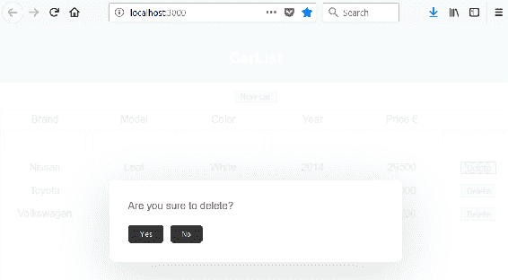

# 添加功能

下一步是为前端创建添加功能。我们将使用 React Skylight 模态组件来实现这一点。我们已经介绍了在第八章中使用 React Skylight 的用法，*React 的有用的第三方组件*。我们将在用户界面中添加“新车”按钮，当按下时打开模态表单。模态表单包含保存汽车所需的所有字段，以及用于保存和取消的按钮。

通过在终端中按下*Ctrl* + *C*来停止开发服务器，并输入以下命令来安装 React Skylight。安装后，重新启动应用程序：

```java
npm install react-skylight --save 
```

以下步骤显示了如何使用模态表单组件创建添加功能：

1.  在`components`文件夹中创建一个名为`AddCar.js`的新文件，并将组件类基本代码写入文件中，如下所示。添加`react-skylight`组件的导入：

```java
import React from 'react';
import SkyLight from 'react-skylight';

class AddCar extends React.Component {
  render() {
    return (
      <div>
      </div> 
    );
  }
}

export default AddCar;
```

1.  引入一个包含所有汽车字段的状态：

```java
constructor(props) {
   super(props);
   this.state = {brand: '', model: '', year: '', color: '', price: ''};
}
```

1.  在`render()`方法中添加一个表单。表单包含`ReactSkylight`模态表单组件，其中包含按钮和收集汽车数据所需的输入字段。打开模态窗口的按钮将显示在 carlist 页面上，必须在`ReactSkylight`之外。所有输入字段都应该有一个`name`属性，其值与将保存值的状态的名称相同。输入字段还具有`onChange`处理程序，通过调用`handleChange`函数将值保存到状态：

```java
handleChange = (event) => {
   this.setState(
     {[event.target.name]: event.target.value}
   );
}

render() {
    return (
      <div>
        <SkyLight hideOnOverlayClicked ref="addDialog">
          <h3>New car</h3>
          <form>
            <input type="text" placeholder="Brand" name="brand" 
              onChange={this.handleChange}/><br/> 
            <input type="text" placeholder="Model" name="model" 
              onChange={this.handleChange}/><br/>
            <input type="text" placeholder="Color" name="color" 
              onChange={this.handleChange}/><br/>
            <input type="text" placeholder="Year" name="year" 
              onChange={this.handleChange}/><br/>
            <input type="text" placeholder="Price" name="price" 
              onChange={this.handleChange}/><br/>
            <button onClick={this.handleSubmit}>Save</button>
            <button onClick={this.cancelSubmit}>Cancel</button>     
          </form> 
        </SkyLight>
        <div>
            <button style={{'margin': '10px'}} 
              onClick={() => this.refs.addDialog.show()}>New car</button>
        </div>
      </div> 
    );
```

1.  将`AddCar`组件插入`Carlist`组件中，以查看是否可以打开该表单。打开`Carlist.js`文件以查看编辑器视图，并导入`AddCar`组件：

```java
import AddCar from './AddCar.js';
```

1.  在`Carlist.js`文件中实现`addCar`函数，该函数将向后端`api/cars`端点发送`POST`请求。请求将包括新的`car`对象在主体内以及`'Content-Type': 'application/json'`头。需要头部是因为使用`JSON.stringify()`方法将`car`对象转换为 JSON 格式：

```java
// Add new car
addCar(car) {
  fetch(SERVER_URL + 'api/cars', 
    { method: 'POST', 
      headers: {
        'Content-Type': 'application/json',
      },
      body: JSON.stringify(car)
    })
  .then(res => this.fetchCars())
  .catch(err => console.error(err))
} 
```

1.  将`AddCar`组件添加到`render()`方法中，并将`addCar`和`fetchCars`函数作为 props 传递给`AddCar`组件，允许我们从`AddCar`组件中调用这些函数。现在`CarList.js`文件的返回语句应该如下所示：

```java
// Carlist.js 
return (
  <div className="App">
    <AddCar addCar={this.addCar} fetchCars={this.fetchCars}/>
    <ReactTable data={this.state.cars} columns={columns} 
      filterable={true} pageSize={10}/>
    <ToastContainer autoClose={1500}/> 
  </div>
);
```

如果您启动前端应用程序，它现在应该看起来像下面这样，如果您按下“新车”按钮，它应该打开模态表单：

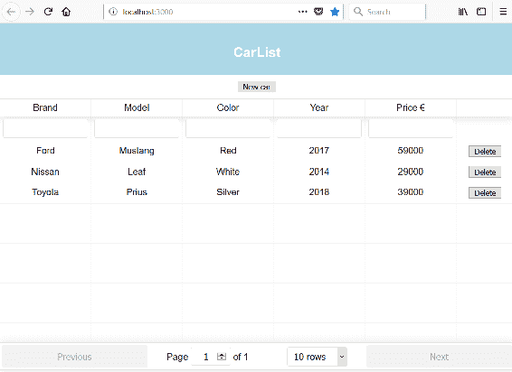

1.  在`AddCar.js`文件中实现`handleSubmit`和`cancelSubmit`函数。`handleSubmit`函数创建一个新的`car`对象并调用`addCar`函数，该函数可以通过 props 访问。`cancelSubmit`函数只是关闭模态表单。

```java
// Save car and close modal form
handleSubmit = (event) => {
   event.preventDefault();
   var newCar = {brand: this.state.brand, model: this.state.model, 
     color: this.state.color, year: this.state.year, 
     price: this.state.price};
   this.props.addCar(newCar); 
   this.refs.addDialog.hide(); 
}

// Cancel and close modal form
cancelSubmit = (event) => {
  event.preventDefault(); 
  this.refs.addDialog.hide(); 
}
```

现在，您可以通过按下“新车”按钮打开模态表单。然后，您可以填写表单数据，并按“保存”按钮。到目前为止，表单看起来不好看，但我们将在下一章中进行样式设置：

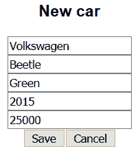

列表页面已刷新，并且新车可以在列表中看到：

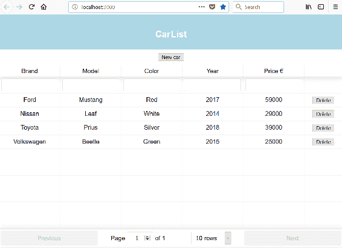

# 编辑功能

我们将通过将表格更改为可编辑并向每行添加保存按钮来实现编辑功能。保存按钮将调用向后端发送`PUT`请求以将更改保存到数据库的函数：

1.  添加单元格渲染器，将表格单元格更改为可编辑状态。打开`Carlist.js`文件并创建一个名为`renderEditable`的新函数。请参阅以下函数的源代码。单元格将是`div`元素，`contentEditable`属性使其可编辑。`suppressContentEditableWarning`抑制了当标记为可编辑的元素具有子元素时出现的警告。当用户离开表格单元格时，将执行`onBlur`中的函数，并在这里我们将更新状态：

```java
renderEditable = (cellInfo) => {
  return (
    <div
      style={{ backgroundColor: "#fafafa" }}
      contentEditable
      suppressContentEditableWarning
      onBlur={e => {
        const data = [...this.state.cars];
        data[cellInfo.index][cellInfo.column.id] = 
         e.target.innerHTML;
        this.setState({ cars: data });
      }}
      dangerouslySetInnerHTML={{
        __html: this.state.cars[cellInfo.index][cellInfo.column.id]
      }} 
    />
  );
} 
```

1.  定义要编辑的表格列。这是使用 React Table 中列的`Cell`属性完成的，该属性定义了如何呈现列的单元格：

```java
const columns = [{
  Header: 'Brand',
  accessor: 'brand',
  Cell: this.renderEditable
}, {
  Header: 'Model',
  accessor: 'model',
  Cell: this.renderEditable
}, {
  Header: 'Color',
  accessor: 'color',
  Cell: this.renderEditable
}, {
  Header: 'Year',
  accessor: 'year',
  Cell: this.renderEditable
}, {
  Header: 'Price €',
  accessor: 'price',
  Cell: this.renderEditable
}, {
  id: 'delbutton',
  sortable: false,
  filterable: false,
  width: 100,
  accessor: '_links.self.href',
  Cell: ({value}) => (<button onClick={()=>{this.onDelClick(value)}}>Delete</button>)
}]
```

现在，如果您在浏览器中打开应用程序，您会发现表格单元格是可编辑的：

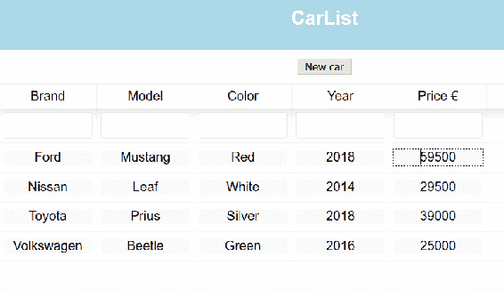

1.  要更新汽车数据，我们必须向`http://localhost:8080/api/cars/[carid]` URL 发送`PUT`请求。链接与删除功能相同。请求包含更新后的`car`对象在请求体内，并且我们在添加功能中使用的`'Content-Type': 'application/json'`标头。创建一个名为`updateCar`的新函数，函数的源代码显示在以下代码片段中。该函数接收两个参数，更新后的`car`对象和请求 URL。成功更新后，我们将向用户显示提示消息：

```java
// Update car
updateCar(car, link) {
  fetch(link, 
  { method: 'PUT', 
    headers: {
      'Content-Type': 'application/json',
    },
    body: JSON.stringify(car)
  })
  .then( res =>
    toast.success("Changes saved", {
      position: toast.POSITION.BOTTOM_LEFT
    }) 
  )
  .catch( err => 
    toast.error("Error when saving", {
      position: toast.POSITION.BOTTOM_LEFT
    }) 
  )
}
```

1.  将“保存”按钮添加到表格行。当用户按下按钮时，它调用`updateCar`函数并传递两个参数。第一个参数是`row`，它是行中所有值的`object（=car object）`。第二个参数是`value`，它设置为`_links.href.self`，这将是我们在请求中需要的汽车的 URL：

```java
const columns = [{
  Header: 'Brand',
  accessor: 'brand',
  Cell: this.renderEditable
}, {
  Header: 'Model',
  accessor: 'model',
  Cell: this.renderEditable
}, {
  Header: 'Color',
  accessor: 'color',
  Cell: this.renderEditable
}, {
  Header: 'Year',
  accessor: 'year',
  Cell: this.renderEditable
}, {
  Header: 'Price €',
  accessor: 'price',
  Cell: this.renderEditable
}, {
  id: 'savebutton',
  sortable: false,
  filterable: false,
  width: 100,
  accessor: '_links.self.href',
  Cell: ({value, row}) => 
    (<button onClick={()=>{this.updateCar(row, value)}}>
     Save</button>)
}, {
  id: 'delbutton',
  sortable: false,
  filterable: false,
  width: 100,
  accessor: '_links.self.href',
  Cell: ({value}) => (<button onClick=
    {()=>{this.onDelClick(value)}}>Delete</button>)
}]
```

现在，如果您编辑表格中的值并按下“保存”按钮，您应该会看到提示消息，并且更新的值将保存到数据库中：

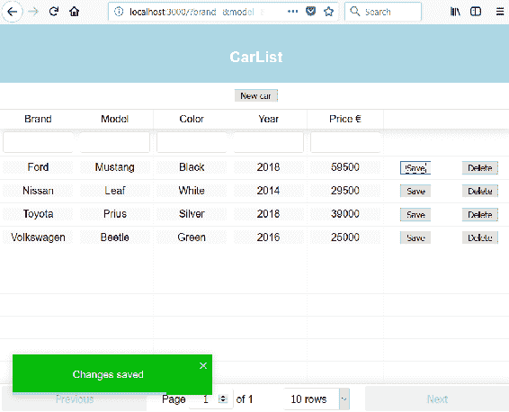

# 其他功能

我们还将实现一个功能，即将数据导出为 CSV。有一个名为`react-csv`的包（[`github.com/abdennour/react-csv`](https://github.com/abdennour/react-csv)），可用于将数据数组导出到 CSV 文件。

如果您的应用程序已启动，请通过在终端中按*Ctrl* + *C*停止开发服务器，并键入以下命令以安装`react-csv`。安装后，重新启动应用程序：

```java
npm install react-csv --save
```

`react-csv`包含两个组件—`CSVLink`和`CSVDownload`。我们将在我们的应用程序中使用第一个，因此将以下导入添加到`Carlist.js`文件中：

```java
import { CSVLink } from 'react-csv';
```

`CSVLink`组件接受`data`属性，其中包含要导出到 CSV 文件的数据数组。您还可以使用`separator`属性定义数据分隔符（默认分隔符为逗号）。在`render()`方法的`return`语句中添加`CSVLink`组件。`data`属性的值现在将是`this.state.cars`：

```java
// Carlist.js render() method
return (
  <div className="App">
    <CSVLink data={this.state.cars} separator=";">Export CSV</CSVLink>
    <AddCar addCar={this.addCar} fetchCars={this.fetchCars}/>
    <ReactTable data={this.state.cars} columns={columns} 
       filterable={true} pageSize={10}/>
    <ToastContainer autoClose={6500}/> 
  </div>
);
```

在浏览器中打开应用程序，您应该在我们的应用程序中看到导出 CSV 链接。样式不好看，但我们将在下一章中处理。如果您点击链接，您将在 CSV 文件中获得数据：

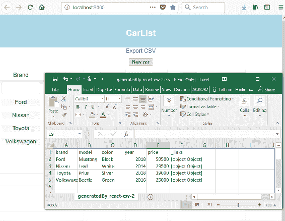

现在所有功能都已实现。

# 总结

在本章中，我们实现了应用程序的所有功能。我们从后端获取汽车数据，并在 React Table 中显示这些数据，该表提供分页、排序和过滤功能。然后我们实现了删除功能，并使用 toast 组件向用户提供反馈。添加功能是使用 React Skylight 模态表单组件实现的。在编辑功能中，我们利用了 React Table 的可编辑表格功能。最后，我们实现了将数据导出到 CSV 文件的功能。在下一章中，我们将开始使用 Material UI 组件库来完善我们的用户界面。在下一章中，我们将使用 React Material-UI 组件库来设计我们的前端界面。

# 问题

1.  如何使用 React 的 REST API 获取和展示数据？

1.  如何使用 React 的 REST API 删除数据？

1.  如何使用 React 的 REST API 添加数据？

1.  如何使用 React 的 REST API 更新数据？

1.  如何使用 React 显示 toast 消息？

1.  如何使用 React 将数据导出到 CSV 文件？

# 进一步阅读

Packt 还有其他很棒的资源可以学习 React：

+   [`www.packtpub.com/web-development/getting-started-react`](https://www.packtpub.com/web-development/getting-started-react)

+   [`www.packtpub.com/web-development/react-16-essentials-second-edition`](https://www.packtpub.com/web-development/react-16-essentials-second-edition)
