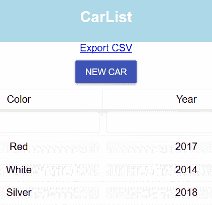
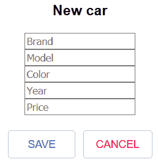
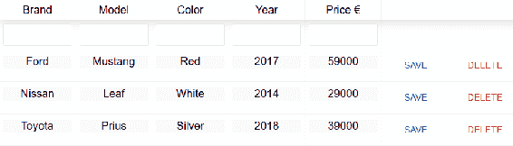
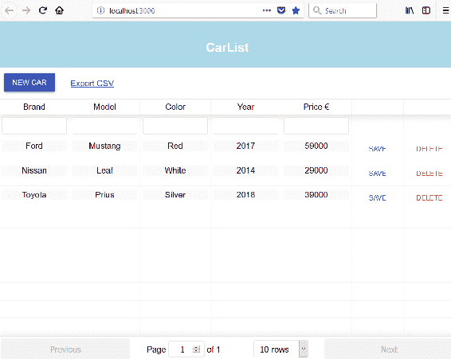
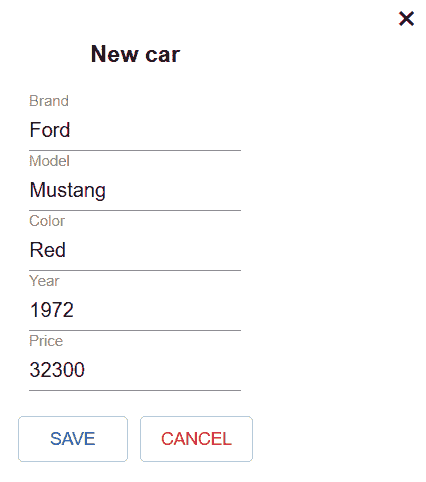
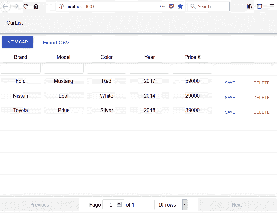
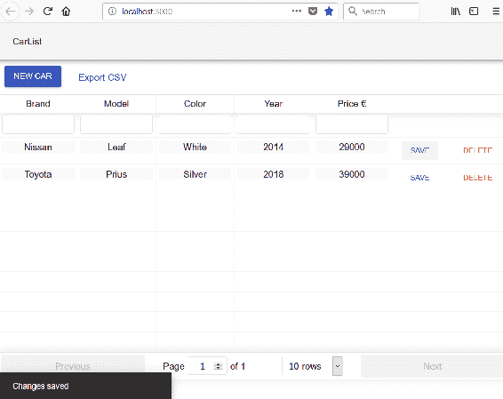

# 第十一章：使用 React Material-UI 对前端进行样式设置

本章将解释如何在我们的前端中使用 Material-UI 组件。我们将使用`Button`组件来显示样式化按钮。模态表单输入字段将被`TextField`组件替换，该组件具有许多很好的功能。Material-UI 提供了`Snackbar`组件，可以向最终用户显示提示消息。我们将用`Snackbar`替换`react-toastify`组件，以获得统一的外观。最后，我们将使用`AppBar`组件代替 React 应用程序标题。

在本章中，我们将查看以下内容：

+   什么是 Material-UI？

+   如何在我们的前端中使用 Material-UI 组件

+   如何在 React 应用程序中删除未使用的组件

# 技术要求

我们在第四章中创建的 Spring Boot 应用程序，*Securing and Testing Your Backend*，需要与上一章的修改（未经保护的后端）一起使用。

我们还需要在上一章中使用的 React 应用程序(*carfront*)。

# 使用 Button 组件

通过在您正在使用的终端中键入以下命令并在安装完成后启动您的应用程序来安装 Material-UI：

```java
npm install @material-ui/core --save
```

让我们首先将所有按钮更改为使用 Material-UI 的`Button`组件。将`Button`导入`AddCar.js`文件：

```java
// AddCar.js
import Button from '@material-ui/core/Button';
```

将按钮更改为使用`Button`组件。在列表页面中，我们使用主按钮，在模态表单中使用轮廓按钮：

```java
  render() {
    return (
      <div>
        <SkyLight hideOnOverlayClicked ref="addDialog">
          <h3>New car</h3>
          <form>
            <input type="text" placeholder="Brand" name="brand" 
            onChange={this.handleChange}/><br/> 
            <input type="text" placeholder="Model" name="model" 
            onChange={this.handleChange}/><br/>
            <input type="text" placeholder="Color" name="color" 
            onChange={this.handleChange}/><br/>
            <input type="text" placeholder="Year" name="year" 
            onChange={this.handleChange}/><br/>
            <input type="text" placeholder="Price" name="price" 
            onChange={this.handleChange}/><br/><br/>
            <Button variant="outlined" color="primary" 
            onClick={this.handleSubmit}>Save</Button> 
            <Button variant="outlined" color="secondary" 
            onClick={this.cancelSubmit}>Cancel</Button> 
          </form> 
        </SkyLight>
        <div>
            <Button variant="raised" color="primary" 
            style={{'margin': '10px'}} 
            onClick={() => this.refs.addDialog.show()}>
            New Car</Button>
        </div>
      </div> 
    );
```

现在，列表页面按钮应该如下所示：



模态表单按钮应该如下所示：



我们在汽车表中使用了平面变体按钮，并将按钮大小定义为小。请参见以下表列的源代码：

```java
// Carlist.js render() method
const columns = [{
  Header: 'Brand',
  accessor: 'brand',
  Cell: this.renderEditable
}, {
  Header: 'Model',
  accessor: 'model',
  Cell: this.renderEditable
}, {
  Header: 'Color',
  accessor: 'color',
  Cell: this.renderEditable
}, {
  Header: 'Year',
  accessor: 'year',
  Cell: this.renderEditable
}, {
  Header: 'Price €',
  accessor: 'price',
  Cell: this.renderEditable
}, {
  id: 'savebutton',
  sortable: false,
  filterable: false,
  width: 100,
  accessor: '_links.self.href',
  Cell: ({value, row}) => (<Button size="small" variant="flat" color="primary" 
    onClick={()=>{this.updateCar(row, value)}}>Save</Button>)
}, {
  id: 'delbutton',
  sortable: false,
  filterable: false,
  width: 100,
  accessor: '_links.self.href',
  Cell: ({value}) => (<Button size="small" variant="flat" color="secondary" 
    onClick={()=>{this.confirmDelete(value)}}>Delete</Button>)
}]
```

现在，表格应该如下所示：



# 使用 Grid 组件

Material-UI 提供了一个`Grid`组件，可用于为您的 React 应用程序获取网格布局。我们将使用`Grid`来获取新项目按钮和导出 CSV 链接在同一行上。

将以下导入添加到`Carlist.js`文件中以导入`Grid`组件：

```java
import Grid from '@material-ui/core/Grid';
```

接下来，我们将`AddCar`和`CSVLink`包装在`Grid`组件中。`Grid`组件有两种类型——容器和项目。这两个组件都包装在项目的`Grid`组件中。然后，两个项目的`Grid`组件都包装在容器的`Grid`组件中：

```java
// Carlist.js render() method
return (
  <div className="App">
    <Grid container>
      <Grid item>
        <AddCar addCar={this.addCar} fetchCars={this.fetchCars}/>
      </Grid>
      <Grid item style={{padding: 20}}>
         <CSVLink data={this.state.cars} separator=";">Export CSV</CSVLink>
      </Grid>
    </Grid>

    <ReactTable data={this.state.cars} columns={columns} 
      filterable={true} pageSize={10}/>
    <ToastContainer autoClose={1500}/> 
  </div>
);
```

现在，您的应用程序应该如下所示，按钮现在放在一行中：



# 使用 TextField 组件

在这一部分，我们将使用 Material-UI 的`TextField`组件来更改模态表单中的文本输入。将以下导入语句添加到`AddCar.js`文件中：

```java
import TextField from '@material-ui/core/TextField';
```

然后，在表单中将输入更改为`TextField`组件。我们使用`label`属性来设置`TextField`组件的标签：

```java
render() {
  return (
    <div>
      <SkyLight hideOnOverlayClicked ref="addDialog">
        <h3>New car</h3>
        <form>
          <TextField label="Brand" placeholder="Brand" 
            name="brand" onChange={this.handleChange}/><br/> 
          <TextField label="Model" placeholder="Model" 
            name="model" onChange={this.handleChange}/><br/>
          <TextField label="Color" placeholder="Color" 
            name="color" onChange={this.handleChange}/><br/>
          <TextField label="Year" placeholder="Year" 
            name="year" onChange={this.handleChange}/><br/>
          <TextField label="Price" placeholder="Price" 
            name="price" onChange={this.handleChange}/><br/><br/>
          <Button variant="outlined" color="primary" 
            onClick={this.handleSubmit}>Save</Button> 
          <Button variant="outlined" color="secondary" 
            onClick={this.cancelSubmit}>Cancel</Button> 
        </form> 
      </SkyLight>
      <div>
         <Button variant="raised" color="primary" 
            style={{'margin': '10px'}} 
            onClick={() => this.refs.addDialog.show()}>New Car</Button>
      </div>
    </div> 
  );
```

修改后，模态表单应该如下所示：



# 使用 AppBar 组件

在这一部分，我们将用`AppBar`组件替换 React 应用程序标题。导入`AppBar`和`Toolbar`组件：

```java
import AppBar from '@material-ui/core/AppBar';
import Toolbar from '@material-ui/core/Toolbar';
```

从`App.js`文件中删除`div`标题元素。将`AppBar`组件添加到`render()`方法中，并将`Toolbar`组件放在其中。`Toolbar`组件包含应用栏中显示的文本：

```java
// App.js
import React, { Component } from 'react';
import './App.css';
import Carlist from './components/Carlist';
import AppBar from '@material-ui/core/AppBar';
import Toolbar from '@material-ui/core/Toolbar';

class App extends Component {
  render() {
    return (
      <div className="App">
        <AppBar position="static" color="default">
          <Toolbar>CarList</ Toolbar>
        </ AppBar>
        <Carlist /> 
      </div>
    );
  }
}

export default App;
```

现在，您的前端应该如下所示：



# 使用 SnackBar 组件

我们已经通过使用`react-toastify`组件实现了提示消息。Material-UI 提供了一个名为`SnackBar`的组件，可以用于向最终用户显示消息。为了在我们的应用程序中获得统一的外观，让我们使用该组件来显示消息。

我们现在可以从`Carlist.js`文件中移除`react-toastify`的导入，也可以通过在你正在使用的终端中输入以下命令来移除组件：

```java
npm remove react-toastify
```

要开始使用`Snackbar`组件，请将以下导入添加到`Carlist.js`文件中：

```java
import Snackbar from '@material-ui/core/Snackbar';
```

我们需要为`Snackbar`添加两个新的状态值，一个用于消息，一个用于状态。将这两个状态值添加到构造函数中。状态值称为`open`，它定义了`Snackbar`是否可见：

```java
constructor(props) {
  super(props);
  this.state = { cars: [], open: false, message: ''};
}
```

然后，我们将`Snackbar`组件添加到`render()`方法中。`autoHideDuration`属性定义了在调用`onClose`之前等待的毫秒数。要显示`Snackbar`，我们只需要将`open`状态值设置为`true`并设置消息：

```java
// Carlist.js render() method's return statement
return (
  <div className="App">
    <Grid container>
      <Grid item>
        <AddCar addCar={this.addCar} fetchCars={this.fetchCars}/>
      </Grid>
      <Grid item style={{padding: 20}}>
        <CSVLink data={this.state.cars} separator=";">Export CSV</CSVLink>
      </Grid>
    </Grid>

    <ReactTable data={this.state.cars} columns={columns} 
      filterable={true} pageSize={10}/>
    <Snackbar 
      style = {{width: 300, color: 'green'}}
      open={this.state.open} onClose={this.handleClose} 
      autoHideDuration={1500} message={this.state.message} />
  </div>
);
```

接下来，我们必须实现`handleClose`函数，该函数在`onClose`事件中调用。该函数只是将`open`状态值设置为`false`：

```java
handleClose = (event, reason) => {
  this.setState({ open: false });
};
```

然后，我们用`setState()`方法替换了 toast 消息，该方法将`open`值设置为`true`，并将显示的文本设置为`message`状态：

```java
// Delete car
onDelClick = (link) => {
  fetch(link, {method: 'DELETE'})
  .then(res => {
    this.setState({open: true, message: 'Car deleted'});
    this.fetchCars();
  })
  .catch(err => {
    this.setState({open: true, message: 'Error when deleting'});
    console.error(err)
  }) 
}

// Update car
updateCar(car, link) {
  fetch(link, 
  { method: 'PUT', 
    headers: {
      'Content-Type': 'application/json',
    },
    body: JSON.stringify(car)
  })
  .then( res =>
    this.setState({open: true, message: 'Changes saved'})
  )
  .catch( err => 
    this.setState({open: true, message: 'Error when saving'})
  )
}

```

以下是使用`Snackbar`组件显示消息的屏幕截图：



# 总结

在本章中，我们使用 Material-UI 完成了我们的前端。Material-UI 是实现了 Google 的 Material Design 的 React 组件库。我们用 Material-UI 的`Button`组件替换了所有按钮。我们使用 Material-UI 的`TextField`组件为我们的模态表单赋予了新的外观。我们移除了 React 应用程序标题，改用了`AppBar`组件。现在，向最终用户显示的消息使用`Snackbar`组件。经过这些修改，我们的前端看起来更加专业和统一。在下一章中，我们将专注于前端测试。

# 问题

1.  什么是 Material-UI？

1.  你应该如何使用不同的 Material-UI 组件？

1.  你应该如何移除未使用的组件？

# 进一步阅读

Packt 还有其他很好的资源可以学习 React：

+   [`www.packtpub.com/web-development/getting-started-react`](https://www.packtpub.com/web-development/getting-started-react)

+   [`www.packtpub.com/web-development/react-16-essentials-second-edition`](https://www.packtpub.com/web-development/react-16-essentials-second-edition)
