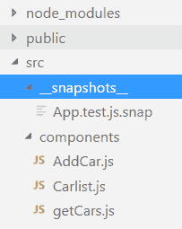
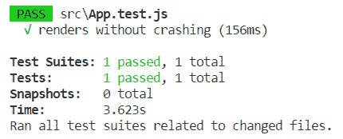
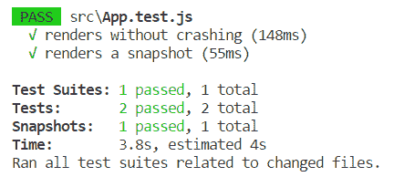
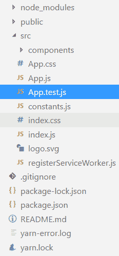
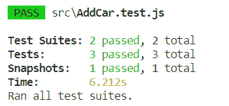

# 第十二章：测试您的前端

本章解释了测试 React 应用程序的基础知识。我们将概述使用 Jest，这是 Facebook 开发的 JavaScript 测试库。我们还将介绍 Enzyme，这是由 Airbnb 开发的用于 React 的测试实用程序。我们将看看如何创建新的测试套件和测试。我们还将介绍如何运行测试并发现测试的结果。

在本章中，我们将看以下内容：

+   Jest 的基础知识

+   如何创建新的测试套件和测试

+   Enzyme 测试实用程序的基础知识

+   如何安装 Enzyme

+   如何使用 Enzyme 创建测试

# 技术要求

我们需要在第四章中创建的 Spring Boot 应用程序，*Securing and Testing Your Backend*（GitHub：[`github.com/PacktPublishing/Hands-On-Full-Stack-Development-with-Spring-Boot-2.0-and-React/tree/master/Chapter%204`](https://github.com/PacktPublishing/Hands-On-Full-Stack-Development-with-Spring-Boot-2.0-and-React/tree/master/Chapter%204)）。

我们还需要在上一章中使用的 React 应用程序（GitHub：[`github.com/PacktPublishing/Hands-On-Full-Stack-Development-with-Spring-Boot-2.0-and-React/tree/master/Chapter%2011`](https://github.com/PacktPublishing/Hands-On-Full-Stack-Development-with-Spring-Boot-2.0-and-React/tree/master/Chapter%2011)）。

# 使用 Jest

Jest 是一个用于 JavaScript 的测试库，由 Facebook 开发（[`facebook.github.io/jest/en/`](https://facebook.github.io/jest/en/)）。Jest 广泛用于 React，并为测试提供了许多有用的功能。您可以创建快照测试，从中可以获取 React 树的快照并调查状态的变化。Jest 还具有模拟功能，您可以使用它来测试例如异步 REST API 调用。Jest 还提供了在测试用例中所需的断言函数。

我们将首先看看如何为基本的 JavaScript 函数创建一个简单的测试用例，该函数执行一些简单的计算。以下函数以两个数字作为参数，并返回数字的乘积：

```java
// multi.js
export const calcMulti = (x, y) => {
    x * y;
}
```

以下代码显示了前述函数的 Jest 测试。测试用例从运行测试用例的`test`方法开始。`test`方法有一个别名，称为`it`，我们稍后在 React 示例中将使用它。测试方法获取两个必需的参数-测试名称和包含测试的函数。当您想要测试值时，使用`expect`。`toBe`是所谓的匹配器，用于检查函数的结果是否等于匹配器中的值。Jest 中有许多不同的匹配器可用，您可以从其文档中找到这些：

```java
// multi.test.js
import {calcMulti} from './multi';

test('2 * 3 equals 6', () => {
  expect(calcMulti(2, 3)).toBe(6);
});
```

Jest 与`create-react-app`一起提供，因此我们无需进行任何安装或配置即可开始测试。建议为测试文件创建一个名为`_test_`的文件夹。测试文件应具有`.test.js`扩展名。如果您在 VS Code 文件资源管理器中查看 React 前端，您会发现在`src`文件夹中已经自动创建了一个测试文件，名为`App.test.js`。



测试文件的源代码如下：

```java
import React from 'react';
import ReactDOM from 'react-dom';
import App from './App';

it('renders without crashing', () => {
  const div = document.createElement('div');
  ReactDOM.render(<App />, div);
  ReactDOM.unmountComponentAtNode(div);
});
```

以下测试文件创建了一个`div`元素到 DOM 并将`App`组件挂载到它上。最后，组件从`div`中卸载。因此，它只是测试您的`App`组件是否可以渲染并且测试运行程序是否正常工作。`it`是 Jest 中`test`函数的别名，第一个参数是测试的名称，第二个参数是要执行和测试的函数。

您可以通过在终端中输入以下命令来运行测试：

```java
npm test
```

或者如果您使用 Yarn，请输入以下内容：

```java
yarn test
```

在执行完测试并且一切正常工作后，您将在终端中看到以下信息：



# 快照测试

快照测试是一个有用的工具，用于测试用户界面中是否存在不需要的更改。当执行快照测试时，Jest 会生成快照文件。下次执行测试时，将新的快照与先前的快照进行比较。如果文件内容之间存在更改，测试用例将失败，并在终端中显示错误消息。

要开始快照测试，请执行以下步骤：

1.  安装`react-test-render`包。`--save-dev`参数意味着此依赖项保存到`package.json`文件的`devDependencies`部分，仅用于开发目的。如果在安装阶段键入`npm install --production`命令，则不会安装`devDependencies`部分中的依赖项。因此，所有仅在开发阶段需要的依赖项都应使用`--save-dev`参数进行安装：

```java
npm install react-test-renderer --save-dev
```

1.  您的`package.json`文件应如下所示，并且已将新的`devDependecies`部分添加到文件中：

```java
{
  "name": "carfront",
  "version": "0.1.0",
  "private": true,
  "dependencies": {
    "@material-ui/core": "¹.0.0",
    "@material-ui/icons": "¹.0.0",
    "material-ui": "⁰.20.1",
    "react": "¹⁶.3.2",
    "react-confirm-alert": "².0.2",
    "react-csv": "¹.0.14",
    "react-dom": "¹⁶.3.2",
    "react-scripts": "1.1.4",
    "react-skylight": "⁰.5.1",
    "react-table": "⁶.8.2"
  },
  "scripts": {
    "start": "react-scripts start",
    "build": "react-scripts build",
    "test": "react-scripts test --env=jsdom",
    "eject": "react-scripts eject"
  },
  "devDependencies": {
    "react-test-renderer": "¹⁶.3.2"
  }
}
```

1.  将`renderer`导入到您的测试文件中：

```java
import renderer from 'react-test-renderer';
```

让我们在`App.test.js`文件中添加一个新的快照测试用例。该测试用例将创建我们的`AddCar`组件的快照测试：

1.  将`AddCar`组件导入到我们的测试文件中：

```java
import AddCar from './components/AddCar';
```

1.  在文件中已经存在的第一个测试用例之后添加以下测试代码。该测试用例从我们的`App`组件中获取快照，然后比较快照是否与先前的快照不同：

```java
it('renders a snapshot', () => {
  const tree = renderer.create(<AddCar/>).toJSON();
  expect(tree).toMatchSnapshot();
});
```

1.  通过在终端中输入以下命令再次运行测试用例：

```java
npm test
```

1.  现在您可以在终端中看到以下消息。测试套件告诉我们测试文件的数量，测试告诉我们测试用例的数量：



当首次执行测试时，将创建一个`_snapshots_`文件夹。该文件夹包含从测试用例生成的所有快照文件。现在，您可以看到已生成一个快照文件，如下面的截图所示：



快照文件现在包含了我们的`AddCar`组件的 React 树。您可以从这里的开头看到快照文件的一部分：

```java
// Jest Snapshot v1, https://goo.gl/fbAQLP

exports[`renders a snapshot 1`] = `
<div>
  <section
    className="skylight-wrapper "
  >
    <div
      className="skylight-overlay"
      onClick={[Function]}
      style={
        Object {
          "backgroundColor": "rgba(0,0,0,0.3)",
          "display": "none",
          "height": "100%",
          "left": "0px",
          "position": "fixed",
          "top": "0px",
          "transitionDuration": "200ms",
          "transitionProperty": "all",
          "transitionTimingFunction": "ease",
          "width": "100%",
          "zIndex": "99",
        }
      }
  />
...continue
```

# 使用 Enzyme

Enzyme 是用于测试 React 组件输出的 JavaScript 库，由 Airbnb 开发。Enzyme 具有一个非常好的用于 DOM 操作和遍历的 API。如果您使用过 jQuery，那么很容易理解 Enzyme API 的思想。

要开始使用 Enzyme，请执行以下步骤：

1.  通过在终端中输入以下命令进行安装。这将安装`enzyme`库和适配器库，适用于 React 版本 16\. 旧版 React 版本也有可用的适配器：

```java
npm install enzyme enzyme-adapter-react-16 --save-dev
```

1.  在`src`文件夹中创建一个名为`AddCar.test.js`的新测试文件（测试套件）。现在我们将为我们的`AddCar`组件创建一个 Enzyme 浅渲染测试。第一个测试用例渲染组件并检查是否有五个`TextInput`组件，因为应该有五个。`wrapper.find`找到渲染树中与`TextInput`匹配的每个节点。在 Enzyme 测试中，我们可以使用 Jest 进行断言，这里我们使用`toHaveLength`来检查找到的节点数是否等于五。浅渲染测试将组件作为一个单元进行测试，并不会渲染任何子组件。对于这种情况，浅渲染就足够了。否则，您也可以使用`mount`进行完整的 DOM 渲染：

```java
import React from 'react';
import AddCar from './components/AddCar';
import Enzyme, { shallow } from 'enzyme';
import Adapter from 'enzyme-adapter-react-16';

Enzyme.configure({ adapter: new Adapter() });

describe('<AddCar />', () => {
  it('renders five <TextInput /> components', () => {
    const wrapper = shallow(<AddCar />);
    expect(wrapper.find('TextField')).toHaveLength(5);
  });
});
```

1.  现在，如果您运行测试，您可以在终端中看到以下消息。您还可以看到测试套件的数量为两，因为有新的测试文件并且所有测试都通过了：



您还可以使用`simulate`方法使用 Enzyme 测试事件。以下示例显示了如何测试`AddCar`组件中`TextField`品牌的`onChange`事件。此示例还显示了如何访问组件的状态。我们首先使用`wrapper.find`查找第一个`TextField`，用于汽车品牌。然后，我们设置`TextField`的值，并使用`simulate`方法模拟更改事件。最后，我们检查品牌状态的值，该值现在应该包含`Ford`：

```java
describe('<AddCar />', () => {
  it('test onChange', () => {
    const wrapper = shallow(<AddCar />);
    const brandInput = wrapper.find('TextField').get(0);
    brandInput.instance().value = 'Ford';
    usernameInput.simulate('change');
    expect(wrapper.state('brand')).toEqual('Ford');
  });
});
```

# 摘要

在本章中，我们对如何测试 React 应用程序进行了基本概述。Jest 是 Facebook 开发的一个测试库，因为我们使用`create-react-app`创建了我们的应用程序，所以它已经可用于我们的前端。我们使用 Jest 创建了一些测试，并运行这些测试，以查看如何检查测试的结果。我们安装了 Enzyme，这是一个用于 React 的测试工具。使用 Enzyme，您可以轻松测试 React 组件的渲染和事件。在下一章中，我们将保护我们的应用程序，并在前端添加登录功能。

# 问题

1.  Jest 是什么？

1.  您应该如何使用 Jest 创建测试用例？

1.  您应该如何使用 Jest 创建快照测试？

1.  Enzyme 是什么？

1.  您应该如何安装 Enzyme？

1.  您应该如何使用 Enzyme 进行渲染测试？

1.  您应该如何使用 Enzyme 测试事件？

# 进一步阅读

Packt 还有其他关于学习 React 和测试的优质资源。

+   [`www.packtpub.com/web-development/react-16-tooling`](https://www.packtpub.com/web-development/react-16-tooling)

+   [`www.packtpub.com/web-development/jasmine-javascript-testing-second-edition`](https://www.packtpub.com/web-development/jasmine-javascript-testing-second-edition)
