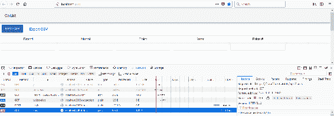
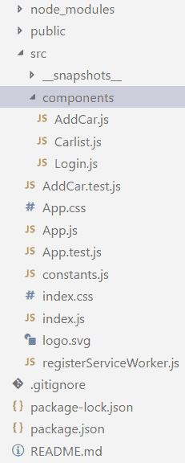
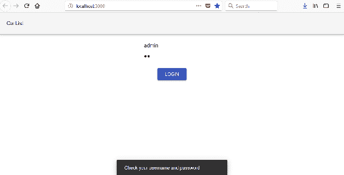
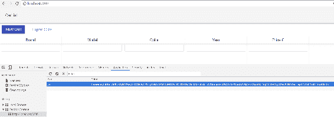
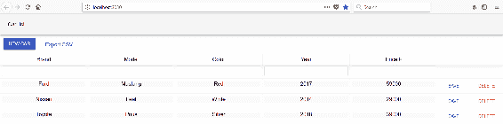
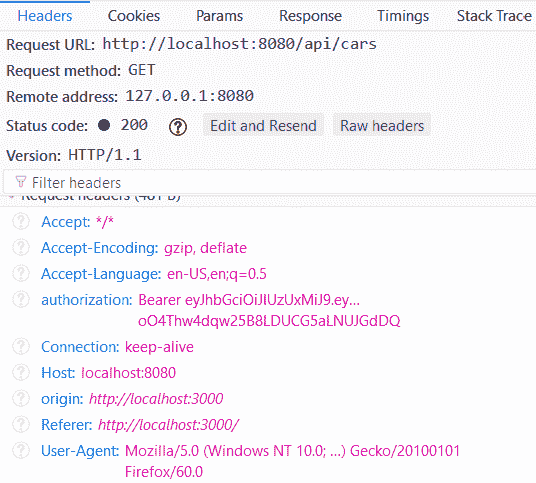

# 第十三章：保护您的应用程序

本章解释了在后端使用 JWT 身份验证时如何对前端实施身份验证。首先，我们为后端打开安全性以启用 JWT 身份验证。然后，我们为登录功能创建一个组件。最后，我们修改我们的 CRUD 功能，以在请求的`Authorization`标头中发送令牌到后端。

在本章中，我们将研究以下内容：

+   如何在前端创建登录功能

+   如何在身份验证后实现条件渲染

+   启用 JWT 身份验证时，CRUD 功能需要什么

+   如何在身份验证失败时显示消息

# 技术要求

我们在第四章中创建的 Spring Boot 应用程序，*保护和测试您的后端*（GitHub：[`github.com/PacktPublishing/Hands-On-Full-Stack-Development-with-Spring-Boot-2.0-and-React/tree/master/Chapter%204`](https://github.com/PacktPublishing/Hands-On-Full-Stack-Development-with-Spring-Boot-2.0-and-React/tree/master/Chapter%204)）。

我们在上一章中使用的 React 应用程序（GitHub：[`github.com/PacktPublishing/Hands-On-Full-Stack-Development-with-Spring-Boot-2.0-and-React/tree/master/Chapter%2011`](https://github.com/PacktPublishing/Hands-On-Full-Stack-Development-with-Spring-Boot-2.0-and-React/tree/master/Chapter%2011)）。

# 保护后端

我们已经在前端实现了对未受保护的后端的 CRUD 功能。现在，是时候再次为我们的后端打开安全性，并返回到我们在第四章中创建的版本，*保护和测试您的后端*：

1.  使用 Eclipse IDE 打开后端项目，并在编辑器视图中打开`SecurityConfig.java`文件。我们将安全性注释掉，并允许每个人访问所有端点。现在，我们可以删除该行，并从原始版本中删除注释。现在，您的`SecurityConfig.java`文件的`configure`方法应如下所示：

```java
@Override
  protected void configure(HttpSecurity http) throws Exception {
    http.csrf().disable().cors().and().authorizeRequests()
    .antMatchers(HttpMethod.POST, "/login").permitAll()
    .anyRequest().authenticated()
    .and()
    // Filter for the api/login requests
    .addFilterBefore(new LoginFilter("/login", authenticationManager()),
       UsernamePasswordAuthenticationFilter.class)
    // Filter for other requests to check JWT in header
    .addFilterBefore(new AuthenticationFilter(),
       UsernamePasswordAuthenticationFilter.class);
}
```

让我们测试一下当后端再次被保护时会发生什么。

1.  通过在 Eclipse 中按下“运行”按钮来运行后端，并从控制台视图中检查应用程序是否正确启动。通过在终端中键入`npm start`命令来运行前端，浏览器应该打开到地址`localhost:3000`。

1.  现在您应该看到列表页面和表格为空。如果您打开开发者工具，您会注意到请求以`403 Forbidden` HTTP 错误结束。这实际上是我们想要的，因为我们尚未对前端进行身份验证：



# 保护前端

使用 JWT 对后端进行了身份验证。在第四章中，*保护和测试您的后端*，我们创建了 JWT 身份验证，并且`/login`端点允许每个人在没有身份验证的情况下访问。在前端的登录页面中，我们必须首先调用`/login`端点以获取令牌。之后，令牌将包含在我们发送到后端的所有请求中，就像在第四章中演示的那样，*保护和测试您的后端*。

让我们首先创建一个登录组件，要求用户提供凭据以从后端获取令牌：

1.  在`components`文件夹中创建一个名为`Login.js`的新文件。现在，您的前端文件结构应如下所示：



1.  在 VS Code 编辑器中打开文件，并将以下基本代码添加到登录组件中。我们还导入`SERVER_URL`，因为它在登录请求中是必需的：

```java
import React, { Component } from 'react';
import {SERVER_URL} from '../constants.js';

class Login extends Component {
  render() {
    return (
      <div>        
      </div>
    );
  }
}

export default Login;
```

1.  我们需要三个用于身份验证的状态值。两个用于凭据（`username`和`password`），一个布尔值用于指示身份验证状态。身份验证状态的默认值为`false`。在`constructor`中创建`constructor`并在其中引入状态：

```java
constructor(props) {
  super(props);
  this.state = {username: '', password: '', 
    isAuthenticated: false};
}
```

1.  在用户界面中，我们将使用 Material-UI 组件库，就像我们在用户界面的其余部分中所做的那样。我们需要凭据的文本字段组件和一个调用登录函数的按钮。将组件的导入添加到`login.js`文件中：

```java
import TextField from '@material-ui/core/TextField';
import Button from '@material-ui/core/Button';
```

1.  将导入的组件添加到用户界面中，方法是将它们添加到`render()`方法中。我们需要两个`TextField`组件，一个用于用户名，一个用于密码。需要一个`RaisedButton`组件来调用我们稍后将实现的`login`函数：

```java
render() {
  return (
    <div>
      <TextField name="username" placeholder="Username" 
      onChange={this.handleChange} /><br/> 
      <TextField type="password" name="password" 
       placeholder="Password" 
      onChange={this.handleChange} /><br/><br/> 
      <Button variant="raised" color="primary" 
       onClick={this.login}>
        Login
     </Button>
    </div>
  );
}
```

1.  实现`TextField`组件的更改处理程序，以将键入的值保存到状态中：

```java
handleChange = (event) => {
  this.setState({[event.target.name] : event.target.value});
}
```

1.  如第四章所示，*保护和测试您的后端*，登录是通过调用`/login`端点使用`POST`方法并在请求体内发送用户对象来完成的。如果身份验证成功，我们将在响应的`Authorization`标头中获得一个令牌。然后，我们将令牌保存到会话存储中，并将`isAuthenticated`状态值设置为`true`。会话存储类似于本地存储，但在页面会话结束时会被清除。当`isAuthenticated`状态值改变时，用户界面将被重新渲染：

```java
login = () => {
  const user = {username: this.state.username, password: this.state.password};
  fetch(SERVER_URL + 'login', {
    method: 'POST',
    body: JSON.stringify(user)
  })
  .then(res => {
    const jwtToken = res.headers.get('Authorization');
    if (jwtToken !== null) {
      sessionStorage.setItem("jwt", jwtToken);
      this.setState({isAuthenticated: true});
    }
  })
  .catch(err => console.error(err)) 
}
```

1.  我们可以实现条件渲染，如果`isAuthenticated`状态为`false`，则渲染`Login`组件，如果`isAuthenticated`状态为`true`，则渲染`Carlist`组件。我们首先必须将`Carlist`组件导入`Login`组件中：

```java
import Carlist from './Carlist';
```

然后对`render()`方法进行以下更改：

```java
render() {
  if (this.state.isAuthenticated === true) {
    return (<Carlist />)
  }
  else {
    return (
      <div>
        <TextField type="text" name="username" 
         placeholder="Username" 
        onChange={this.handleChange} /><br/> 
        <TextField type="password" name="password" 
         placeholder="Password" 
        onChange={this.handleChange} /><br/><br/> 
        <Button variant="raised" color="primary" 
         onClick={this.login}>
          Login
        </Button>
      </div>
    );
  }
}
```

1.  要显示登录表单，我们必须在`App.js`文件中渲染`Login`组件而不是`Carlist`组件：

```java
// App.js
import React, { Component } from 'react';
import './App.css';
import Login from './components/Login';
import AppBar from '@material-ui/core/AppBar';
import Toolbar from '@material-ui/core/Toolbar';

class App extends Component {
  render() {
    return (
      <div className="App">
        <AppBar position="static" color="default">
          <Toolbar>CarList</ Toolbar>
        </ AppBar>
        <Login /> 
      </div>
    );
  }
```

```java
}

export default App;
```

现在，当您的前端和后端正在运行时，您的前端应该如下所示：



如果您使用`user/user`或`admin/admin`凭据登录，您应该看到汽车列表页面。如果打开开发者工具，您会看到令牌现在保存在会话存储中：



汽车列表仍然是空的，但这是正确的，因为我们还没有将令牌包含在请求中。这对于 JWT 身份验证是必需的，我们将在下一阶段实现：

1.  在 VS Code 编辑器视图中打开`Carlist.js`文件。要获取汽车，我们首先必须从会话存储中读取令牌，然后将带有令牌值的`Authorization`标头添加到请求中。您可以在此处查看获取函数的源代码：

```java
// Carlist.js 
// Fetch all cars
fetchCars = () => {
  // Read the token from the session storage
 // and include it to Authorization header
  const token = sessionStorage.getItem("jwt");
  fetch(SERVER_URL + 'api/cars', 
  {
    headers: {'Authorization': token}
  })
  .then((response) => response.json()) 
  .then((responseData) => { 
    this.setState({ 
      cars: responseData._embedded.cars,
    }); 
  })
  .catch(err => console.error(err)); 
}
```

1.  如果您登录到前端，您应该看到汽车列表中填充了来自数据库的汽车：



1.  从开发者工具中检查请求内容；您会看到它包含带有令牌值的`Authorization`标头：



所有其他 CRUD 功能需要相同的修改才能正常工作。修改后，删除函数的源代码如下所示：

```java
// Delete car
onDelClick = (link) => {
  const token = sessionStorage.getItem("jwt");
  fetch(link, 
    { 
      method: 'DELETE',
      headers: {'Authorization': token}
    }
  )
  .then(res => {
    this.setState({open: true, message: 'Car deleted'});
    this.fetchCars();
  })
  .catch(err => {
    this.setState({open: true, message: 'Error when deleting'});
    console.error(err)
  }) 
}
```

修改后，添加函数的源代码如下所示：

```java
// Add new car
addCar(car) {
  const token = sessionStorage.getItem("jwt");
  fetch(SERVER_URL + 'api/cars', 
  { method: 'POST', 
      headers: {
        'Content-Type': 'application/json',
        'Authorization': token
      },
      body: JSON.stringify(car)
  })
  .then(res => this.fetchCars())
  .catch(err => console.error(err))
} 
```

最后，更新函数的源代码如下所示：

```java
// Update car
updateCar(car, link) {
  const token = sessionStorage.getItem("jwt");
  fetch(link, 
  { method: 'PUT', 
    headers: {
      'Content-Type': 'application/json',
      'Authorization': token
    },
    body: JSON.stringify(car)
  })
  .then( res =>
    this.setState({open: true, message: 'Changes saved'})
  )
  .catch( err => 
    this.setState({open: true, message: 'Error when saving'})
  )
} 
```

现在，在您登录到应用程序后，所有 CRUD 功能都可以正常工作。

在最后阶段，我们将实现一个错误消息，如果身份验证失败，将向最终用户显示该消息。我们使用 Material-UI 的`SnackBar`组件来显示消息：

1.  将以下导入添加到`Login.js`文件中：

```java
import Snackbar from '@material-ui/core/Snackbar';
```

1.  打开 Snackbar 的状态，就像我们在第十章中所做的那样，*添加 CRUD 功能*：

```java
// Login.js  
constructor(props) {
  super(props);
  this.state = {username: '', password: '', 
  isAuthenticated: false, open: false};
}
```

我们还需要一个状态处理程序来关闭`Snackbar`的`open`状态，以在`Snackbar`的`autoHideDuration`属性中设置的时间后关闭`Snackbar`：

```java
handleClose = (event) => {
  this.setState({ open: false });
}
```

1.  将`Snackbar`添加到`render()`方法中：

```java
<Snackbar 
  open={this.state.open} onClose={this.handleClose} 
  autoHideDuration={1500} 
  message='Check your username and password' />
```

1.  如果身份验证失败，请将`open`状态值设置为`true`：

```java
login = () => {
  const user = {username: this.state.username, 
      password: this.state.password};
  fetch('http://localhost:8080/login', {
    method: 'POST',
    body: JSON.stringify(user)
  })
  .then(res => {
    const jwtToken = res.headers.get('Authorization');
    if (jwtToken !== null) {
      sessionStorage.setItem("jwt", jwtToken);
      this.setState({isAuthenticated: true});
    }
    else {
      this.setState({open: true});
    }
  })
  .catch(err => console.error(err)) 
}
```

如果您现在使用错误的凭据登录，您可以看到提示消息：

！[](img/33d4ed39-e0a1-483e-8b19-695b009cfe9f.png)

注销功能要实现起来简单得多。您基本上只需从会话存储中删除令牌，并将`isAuthenticated`状态值更改为`false`，如下面的源代码所示：

```java
logout = () => {
    sessionStorage.removeItem("jwt");
    this.setState({isAuthenticated: false});
}
```

然后通过条件渲染，您可以渲染`Login`组件而不是`Carlist`。

如果要使用 React Router 实现菜单，可以实现所谓的安全路由，只有在用户经过身份验证时才能访问。以下源代码显示了安全路由，如果用户经过身份验证，则显示路由组件，否则将重定向到登录页面：

```java
const SecuredRoute = ({ component: Component, ...rest, isAuthenticated }) => (
  <Route {...rest} render={props => (
    isAuthenticated ? (
      <Component {...props}/>
    ) : (
      <Redirect to={{
        pathname: '/login',
        state: { from: props.location }
      }}/>
    )
  )}/>
)
```

这是使用在前面示例中定义的`SecuredRoute`的`Switch`路由的示例。`Login`和`Contact`组件可以在没有身份验证的情况下访问，但`Shop`需要身份验证：

```java
 <Switch>
    <Route path="/login" component={Login} />
    <Route path="/contact" component={Contact} />
    <SecuredRoute isAuthenticated={this.state.isAuthenticated} 
      path="/shop" component={Shop} />
    <Route render={() => <h1>Page not found</h1>} />
  </Switch>
```

# 摘要

在本章中，我们学习了如何在使用 JWT 身份验证时为我们的前端实现登录功能。成功身份验证后，我们使用会话存储保存从后端收到的令牌。然后在发送到后端的所有请求中使用该令牌，因此，我们必须修改我们的 CRUD 功能以正确使用身份验证。在下一章中，我们将部署我们的应用程序到 Heroku，并演示如何创建 Docker 容器。

# 问题

1.  您应该如何创建登录表单？

1.  您应该如何使用 JWT 登录到后端？

1.  您应该如何将令牌存储到会话存储中？

1.  您应该如何在 CRUD 功能中将令牌发送到后端？

# 进一步阅读

Packt 还有其他很好的资源可供学习 React：

+   [`www.packtpub.com/web-development/react-16-tooling`](https://www.packtpub.com/web-development/react-16-tooling)

+   [`www.packtpub.com/web-development/react-16-essentials-second-edition`](https://www.packtpub.com/web-development/react-16-essentials-second-edition)
