# 第十四章：部署您的应用程序

本章将解释如何将后端和前端部署到服务器。有各种云服务器或 PaaS（平台即服务）提供商可用，如 Amazon（AWS）、DigitalOcean 和 Microsoft Azure。在本书中，我们使用 Heroku，它支持 Web 开发中使用的多种编程语言。我们还将向您展示如何在部署中使用 Docker 容器。

在这一章中，我们将看到以下内容：

+   部署 Spring Boot 应用程序的不同选项

+   如何将 Spring Boot 应用程序部署到 Heroku

+   如何将 React 应用程序部署到 Heroku

+   如何创建 Spring Boot 和 MariaDB Docker 容器

# 技术要求

我们在第四章中创建的 Spring Boot 应用程序，*Securing and Testing Your Backend*，是必需的（GitHub：[`github.com/PacktPublishing/Hands-On-Full-Stack-Development-with-Spring-Boot-2.0-and-React/tree/master/Chapter%204`](https://github.com/PacktPublishing/Hands-On-Full-Stack-Development-with-Spring-Boot-2.0-and-React/tree/master/Chapter%204)）。

我们在上一章中使用的 React 应用程序也是必需的（GitHub：[`github.com/PacktPublishing/Hands-On-Full-Stack-Development-with-Spring-Boot-2.0-and-React/tree/master/Chapter%2011`](https://github.com/PacktPublishing/Hands-On-Full-Stack-Development-with-Spring-Boot-2.0-and-React/tree/master/Chapter%2011)）。

Docker 安装是必要的。

# 部署后端

如果您要使用自己的服务器，部署 Spring Boot 应用程序的最简单方法是使用可执行的 JAR 文件。如果您使用 Maven，可以在命令行中键入`mvn clean install`命令来生成可执行的 JAR 文件。该命令会在`build`文件夹中创建 JAR 文件。在这种情况下，您不必安装单独的应用程序服务器，因为它嵌入在 JAR 文件中。然后，您只需使用`java`命令运行 JAR 文件，`java -jar your_appfile.jar`。嵌入式 Tomcat 版本可以在`pom.xml`文件中使用以下行进行定义：

```java
<properties>
  <tomcat.version>8.0.52</tomcat.version>
</properties>
```

如果您使用单独的应用程序服务器，您必须创建一个 WAR 包。这有点复杂，您必须对应用程序进行一些修改。以下是创建 WAR 文件的步骤：

1.  通过扩展`SpringBootServletIntializer`并重写`configure`方法修改应用程序主类：

```java
@SpringBootApplication
public class Application extends SpringBootServletInitializer {
    @Override
    protected SpringApplicationBuilder configure
        (SpringApplicationBuilder application) {
        return application.sources(Application.class);
    }

    public static void main(String[] args) throws Exception {
        SpringApplication.run(Application.class, args);
    }
}
```

1.  在`pom.xml`文件中将打包从 JAR 更改为 WAR：

```java
<packaging>war</packaging>
```

1.  将以下依赖项添加到`pom.xml`文件中。然后，Tomcat 应用程序将不再是嵌入式的：

```java
<dependency>
  <groupId>org.springframework.boot</groupId>
  <artifactId>spring-boot-starter-tomcat</artifactId>
  <scope>provided</scope>
</dependency>
```

现在，当您构建应用程序时，将生成 WAR 文件。它可以通过将文件复制到 Tomcat 的`/webapps`文件夹来部署到现有的 Tomcat。

现在，云服务器是向最终用户提供应用程序的主要方式。接下来，我们将把后端部署到 Heroku 云服务器（[`www.heroku.com/`](https://www.heroku.com/)）。Heroku 提供免费账户，您可以用来部署自己的应用程序。使用免费账户，应用程序在 30 分钟不活动后会休眠，并且重新启动应用程序需要一点时间。但是免费账户足够用于测试和爱好目的。

对于部署，您可以使用 Heroku 的基于 Web 的用户界面。以下步骤介绍了部署过程：

1.  在你创建了 Heroku 账户之后，登录 Heroku 网站。导航到显示应用程序列表的仪表板。有一个名为“New”的按钮，打开一个菜单。从菜单中选择“Create new app”：

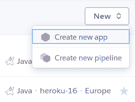

1.  为您的应用命名，选择一个区域，并按“Create app”按钮：

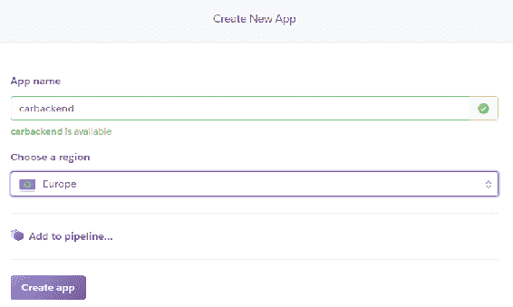

1.  选择部署方法。有几种选项；我们使用 GitHub 选项。在该方法中，您首先必须将应用程序推送到 GitHub，然后将 GitHub 存储库链接到 Heroku：

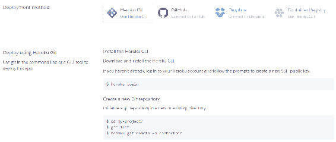

1.  搜索要部署到的存储库，然后按“连接”按钮：

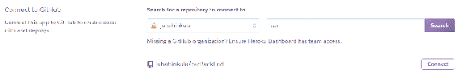

1.  选择自动部署和手动部署之间。自动选项在您将新版本推送到连接的 GitHub 存储库时自动部署您的应用程序。您还必须选择要部署的分支。我们现在将使用手动选项，在您按下“部署分支”按钮时部署应用程序：

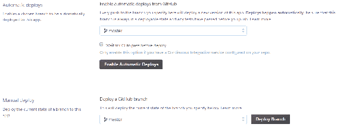

1.  部署开始，您可以看到构建日志。您应该看到一条消息，说您的应用程序已成功部署：

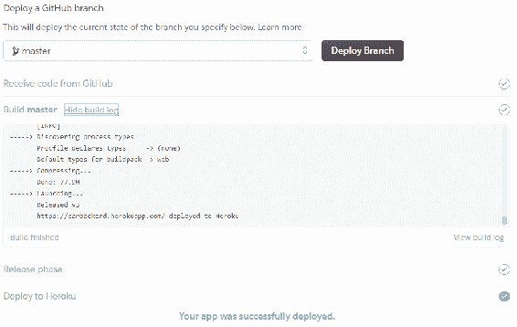

现在，您的应用程序已部署到 Heroku 云服务器。如果您使用 H2 内存数据库，这就足够了，您的应用程序应该可以工作。我们正在使用 MariaDB；因此，我们必须安装数据库。

在 Heroku 中，我们可以使用 JawsDB，它作为附加组件在 Heroku 中可用。JawsDB 是一个**Database as a Service** (**DBaaS**)提供商，提供 MariaDB 数据库，可以在 Heroku 中使用。以下步骤描述了如何开始使用数据库：

1.  在 Heroku 应用程序页面的资源选项卡中键入`JawsDB`到附加组件搜索字段中：

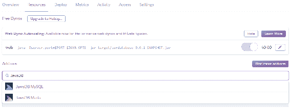

1.  从下拉列表中选择 JawsDB Maria。您可以在附加组件列表中看到 JawsDB。点击 JawsDB，您可以看到数据库的连接信息：

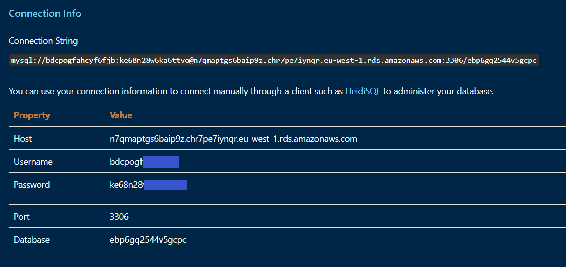

1.  在`application.properties`文件中更改数据库连接定义，使用 JawsDB 连接信息页面上的值。在这个例子中，我们使用明文密码，但建议使用例如**Java Simplified Encryption** (**JASYPT**)库来加密密码：

```java
spring.datasource.url=jdbc:mariadb://n7qmaptgs6baip9z.chr7pe7iynqr.eu-west-1.rds.amazonaws.com:3306/ebp6gq2544v5gcpc
spring.datasource.username=bdcpogfxxxxxxx
spring.datasource.password=ke68n28xxxxxxx
spring.datasource.driver-class-name=org.mariadb.jdbc.Driver
```

1.  使用免费帐户，我们可以最多同时有 10 个连接到我们的数据库；因此，我们还必须将以下行添加到`application.properties`文件中：

```java
spring.datasource.max-active=10
```

1.  将更改推送到 GitHub 并在 Heroku 中部署您的应用程序。现在，您的应用程序已准备就绪，我们可以用 Postman 进行测试。应用程序的 URL 是`https://carbackend.herokuapp.com/`，但您也可以使用您自己的域名。如果我们向`/login`端点发送`POST`请求并附带凭据，我们可以在响应头中获得令牌。所以，一切似乎都正常工作：

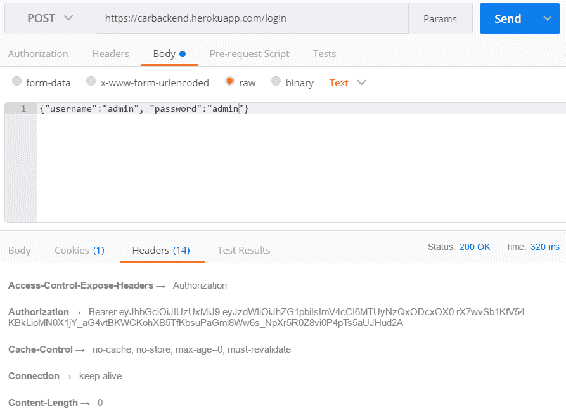

您还可以使用 HeidiSQL 连接到 JawsDB 数据库，我们可以看到我们的 car 数据库已经创建：

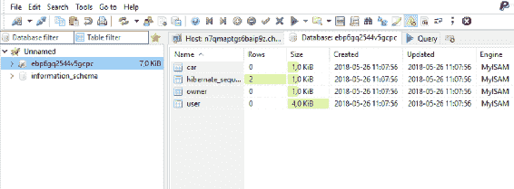

您可以通过从“更多”菜单中选择“查看日志”来查看应用程序日志：

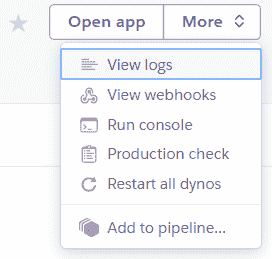

应用程序日志视图如下所示。

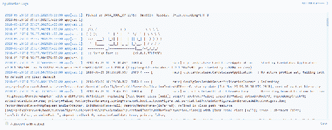

# 部署前端

在本节中，我们将把 React 前端部署到 Heroku。将 React 应用程序部署到 Heroku 的最简单方法是使用 Heroku Buildpack for create-react-app ([`github.com/mars/create-react-app-buildpack`](https://github.com/mars/create-react-app-buildpack))。为了部署，我们必须安装 Heroku CLI，这是 Heroku 的命令行工具。您可以从`https://devcenter.heroku.com/articles/heroku-cli`下载安装包。安装完成后，您可以从 PowerShell 或您正在使用的终端使用 Heroku CLI。以下步骤描述了部署过程：

1.  使用 VS Code 打开您的前端项目，并在编辑器中打开`constant.js`文件。将`SERVER_URL`常量更改为匹配我们后端的 URL，并保存更改：

```java
export const SERVER_URL = 'https://carbackend.herokuapp.com/'
```

1.  为您的项目创建一个本地 Git 存储库并提交文件，如果您还没有这样做。使用 Git 命令行工具导航到您的项目文件夹，并键入以下命令：

```java
git init
git add .
git commit -m "Heroku deployment"
```

1.  以下命令创建一个新的 Heroku 应用程序，并要求输入 Heroku 的凭据。将`[APPNAME]`替换为您自己的应用程序名称。命令执行后，您应该在 Heroku 仪表板中看到新的应用程序：

```java
heroku create [APPNAME] --buildpack https://github.com/mars/create-react-app-buildpack.git
```

1.  通过在 PowerShell 中输入以下命令将您的代码部署到 Heroku：

```java
git push heroku master
```

部署准备就绪后，您应该在 PowerShell 中看到“验证部署...完成”消息，如下面的屏幕截图所示：

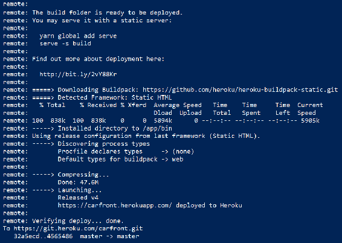

现在，您可以转到 Heroku 仪表板并查看前端的 URL；您还可以通过在 Heroku CLI 中输入`heroku open`命令来打开它。如果导航到前端，您应该看到登录表单：

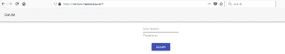

# 使用 Docker 容器

Docker 是一个容器平台，使软件开发、部署和交付更加简单。容器是轻量级和可执行的软件包，包括运行软件所需的一切。在本节中，我们正在从 Spring Boot 后端创建一个容器，如下所示：

1.  将 Docker 安装到您的工作站。您可以在[`www.docker.com/get-docker`](https://www.docker.com/get-docker)找到安装包。有多个平台的安装包，如果您使用 Windows 操作系统，可以使用默认设置通过安装向导进行安装。

1.  Spring Boot 应用程序只是一个可执行的 JAR 文件，可以使用 Java 执行。可以使用以下 Maven 命令创建 JAR 文件：

```java
mvn clean install
```

您还可以使用 Eclipse 通过打开“Run | Run configurations...”菜单来运行 Maven 目标。在“Base directory”字段中选择您的项目，使用“Workspace”按钮。在“Goals”字段中输入 clean install 并按“Run”按钮：

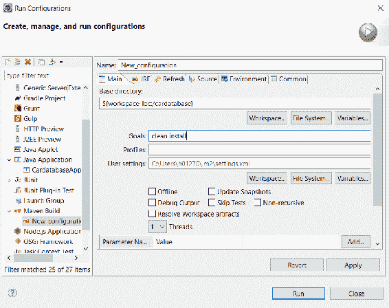

1.  构建完成后，您可以从`/target`文件夹中找到可执行的 JAR 文件：

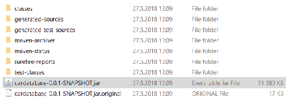

1.  您可以通过以下命令运行 JAR 文件来测试构建是否正确：

```java
 java -jar .\cardatabase-0.0.1-SNAPSHOT.jar
```

1.  您将看到应用程序的启动消息，最后，您的应用程序正在运行：

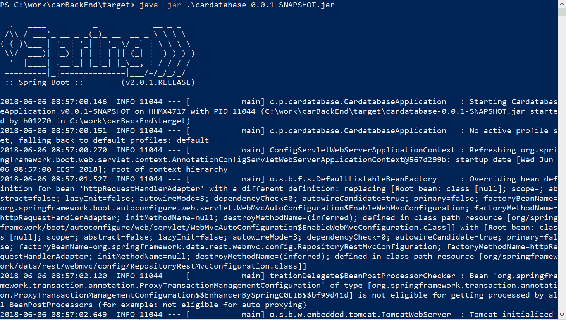

容器是通过使用 Dockerfile 定义的。

1.  在项目的根文件夹中创建一个名为`Dockerfile`的新 Dockerfile。以下行显示了 Dockerfile 的内容。我们使用 Alpine Linux。`EXPOSE`定义应在容器外发布的端口。`COPY`将 JAR 文件复制到容器的文件系统并将其重命名为`app.jar`。`ENTRYPOINT`定义 Docker 容器运行的命令行参数。

还有一个 Maven 插件可用于构建 Docker 镜像。它由 Spotify 开发，可以在[`github.com/spotify/docker-maven-plugin`](https://github.com/spotify/docker-maven-plugin)找到。

以下行显示了`Dockerfile`的内容。

```java
FROM openjdk:8-jdk-alpine
VOLUME /tmp
EXPOSE 8080
ARG JAR_FILE
COPY target/cardatabase-0.0.1-SNAPSHOT.jar app.jar
ENTRYPOINT ["java","-Djava.security.egd=file:/dev/./urandom","-jar","/app.jar"]
```

1.  使用以下命令创建容器。使用`-t`参数，我们可以为容器指定一个友好的名称：

```java
docker build -t carbackend .
```

在构建命令结束时，您应该看到“成功构建”消息：

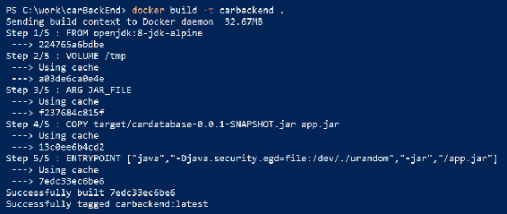

1.  使用`docker image ls`命令检查容器列表：

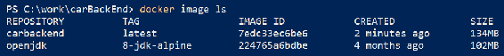

1.  使用以下命令运行容器：

```java
docker run -p 4000:8080 carbackend
```

Spring Boot 应用程序启动，但以错误结束，因为我们正在尝试访问本地主机数据库。现在本地主机指向容器本身，并且没有安装 MariaDB。

1.  我们将为 MariaDB 创建自己的容器。您可以使用以下命令从 Docker Hub 拉取最新的 MariaDB 容器：

```java
docker pull mariadb:lates
```

1.  运行 MariaDB 容器。以下命令设置 root 用户密码并创建一个新的名为`cardb`的数据库，这是我们 Spring Boot 应用程序所需的：

```java
docker run --name cardb -e MYSQL_ROOT_PASSWORD=pwd -e MYSQL_DATABASE=cardb mariadb
```

1.  我们必须对 Spring Boot 的`application.properties`文件进行一些更改。将`datasource`的 URL 更改为以下内容。在下一步中，我们将指定我们的应用可以使用`mariadb`名称访问数据库容器。更改后，您必须构建您的应用程序并重新创建 Spring Boot 容器：

```java
spring.datasource.url=jdbc:mariadb://mariadb:3306/cardb
```

1.  我们可以运行我们的 Spring Boot 容器，并使用以下命令将 MariaDB 容器链接到它。该命令现在定义了我们的 Spring Boot 容器可以使用`mariadb`名称访问 MariaDB 容器：

```java
docker run -p 8080:8080 --name carapp --link cardb:mariadb -d carbackend
```

1.  我们还可以通过输入`docker logs carapp`命令来访问我们的应用程序日志。我们可以看到我们的应用程序已成功启动，并且演示数据已插入到存在于 MariaDB 容器中的数据库中：

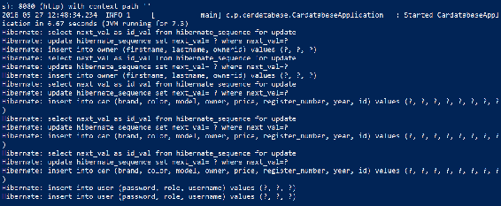

# 摘要

在本章中，我们学习了如何部署 Spring Boot 应用程序。我们了解了 Spring Boot 应用程序的不同部署选项，并将应用程序部署到了 Heroku。接下来，我们使用 Heroku Buildpack for create-react-app 将 React 前端部署到了 Heroku，这使得部署过程更快。最后，我们使用 Docker 从 Spring Boot 应用程序和 MariaDB 数据库创建了容器。在下一章中，我们将介绍一些您应该探索的更多技术和最佳实践。

# 问题

1.  你应该如何创建一个 Spring Boot 可执行的 JAR 文件？

1.  你应该如何将 Spring Boot 应用部署到 Heroku？

1.  你应该如何将 React 应用部署到 Heroku？

1.  什么是 Docker？

1.  你应该如何创建 Spring Boot 应用容器？

1.  你应该如何创建 MariaDB 容器？

# 进一步阅读

Packt 还有其他很好的资源，可以学习关于 React，Spring Boot 和 Docker 的知识：

+   [`www.packtpub.com/web-development/react-16-tooling`](https://www.packtpub.com/web-development/react-16-tooling)

+   [`www.packtpub.com/web-development/react-16-essentials-second-edition`](https://www.packtpub.com/web-development/react-16-essentials-second-edition)

+   [`www.packtpub.com/virtualization-and-cloud/deployment-docker`](https://www.packtpub.com/virtualization-and-cloud/deployment-docker)

+   [`www.packtpub.com/virtualization-and-cloud/docker-fundamentals-integrated-course`](https://www.packtpub.com/virtualization-and-cloud/docker-fundamentals-integrated-course)
