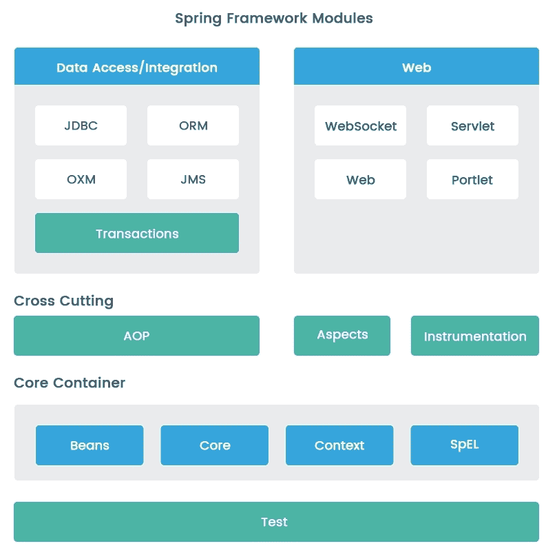
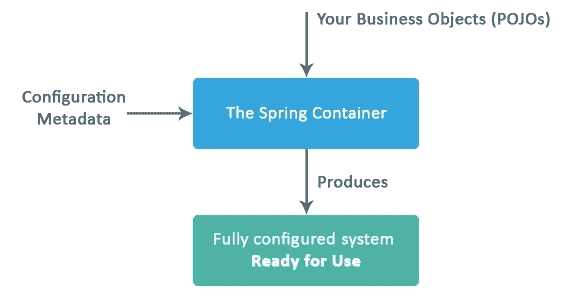
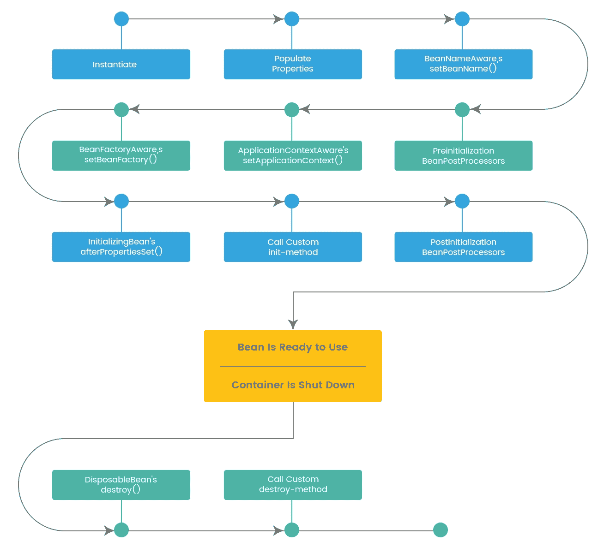

# 第一章：探索 Spring 概念

Spring Framework 提供了广泛的支持，用于管理大型企业 Java 应用程序，并解决企业应用程序开发的复杂性。Spring 为现代企业应用程序提供了完整的 API 和配置模型，因此程序员只需专注于应用程序的业务逻辑。

Spring Framework 作为一个轻量级框架，旨在提供一种简化 Java 企业应用程序开发的方式。

本章将帮助您更好地了解 Spring Framework 的核心特性。我们将从介绍 Spring Framework 开始。本章还将让您清楚地了解 Spring Framework 的每个主要模块。在快速了解 Spring Framework 中的重要模块之后，我们将深入了解 Spring 项目的世界。我们还将清楚地了解 Spring 的控制反转（IoC）容器。最后，我们将看一下 Spring 5.0 中引入的新功能和增强功能。

在本章中，我们将讨论以下主题：

+   介绍 Spring Framework

+   理解 Spring 模块

+   Spring 项目

+   Spring IoC 容器

+   Spring Framework 5.0 中的新功能

# 介绍 Spring Framework

Spring Framework 是最受欢迎的开源 Java 应用程序框架和 IoC 容器之一。Spring 最初由 Rod Johnson 和 Jurgen Holler 开发。Spring Framework 的第一个里程碑版本于 2004 年 3 月发布。尽管已经过去了十五年，Spring Framework 仍然是构建任何 Java 应用程序的首选框架。

Spring 框架为开发企业级 Java 应用程序提供了全面的基础设施支持。因此，开发人员不需要担心应用程序的基础设施；他们可以专注于应用程序的业务逻辑，而不是处理应用程序的配置。

Spring Framework 处理所有基础设施、配置和元配置文件，无论是基于 Java 还是基于 XML。因此，这个框架为您提供了更多的灵活性，可以使用普通的 Java 对象（POJO）编程模型而不是侵入式编程模型来构建应用程序。

Spring IoC 容器通过整合应用程序的各种组件来构建整个框架的核心。Spring 的 Model-View-Controller（MVC）组件可用于构建非常灵活的 Web 层。IoC 容器简化了使用 POJOs 开发业务层。

# EJB 的问题

在早期，程序员很难管理企业应用程序，因为企业 Java 技术如 Enterprise JavaBeans（EJB）对程序员提供企业解决方案的负担很重。

当 EJB 技术首次宣布时，它提供了一个分布式组件模型，允许开发人员只关注系统的业务方面，而忽略中间件的要求，如组件的连接、事务管理、持久性操作、安全性、资源池、线程、分发、远程等等；然而，开发、单元测试和部署 EJB 应用程序是一个非常繁琐的过程。在使用 EJB 时，面临以下一些复杂性：

+   强制实现不必要的接口和方法

+   使单元测试变得困难，特别是在 EJB 容器之外

+   管理部署描述符中的不便之处

+   繁琐的异常处理

当时，Spring 被引入作为 EJB 的一种替代技术，因为与其他现有的 Java 技术相比，Spring 提供了非常简单、更精简和更轻量级的编程模型。Spring 使得克服之前的复杂性成为可能，并且通过使用许多可用的设计模式，避免了使用其他更重的企业技术。Spring 框架专注于 POJO 编程模型而不是侵入式编程模型。这个模型为 Spring 框架提供了简单性。它还赋予了诸如**依赖注入**（**DI**）模式和**面向切面编程**（**AOP**）等概念，使用代理模式和装饰器模式。

# 使用 POJO 简化实现

POJO 编程模型最重要的优势是应用类的编码非常快速和简单。这是因为类不需要依赖于任何特定的 API，实现任何特殊的接口，或者扩展特定的框架类。直到真正需要它们之前，您不必创建任何特殊的回调方法。

# Spring 框架的好处

Spring 框架的重要好处如下：

+   无需重新发明轮子

+   易于单元测试

+   减少实现代码

+   控制反转和 API

+   事务管理的一致性

+   模块化架构

+   与时俱进

让我们详细讨论每一个。

# 无需重新发明轮子

无需重新发明轮子是开发人员可以从 Spring 框架中获得的最重要的好处之一。它促进了众所周知的技术、ORM 框架、日志框架、JEE、JDK 定时器、Quartz 等的实际使用。因此，开发人员不需要学习任何新的技术或框架。

它促进了良好的编程实践，例如使用接口而不是类进行编程。Spring 使开发人员能够使用 POJO 和**Plain Old Java Interface**（**POJI**）模型编程开发企业应用程序。

# 易于单元测试

如果您想测试使用 Spring 开发的应用程序，这是相当容易的。这背后的主要原因是这个框架中有环境相关的代码。早期版本的 EJB 非常难以进行单元测试。甚至在容器外运行 EJB（截至 2.1 版本）都很困难。测试它们的唯一方法是将它们部署到容器中。

Spring 框架引入了 DI 概念。我们将在第二章中详细讨论 DI，*Spring 最佳实践和 Bean 布线配置*。DI 使得单元测试成为可能。这是通过用它们的模拟替换依赖项来完成的。整个应用程序不需要部署进行单元测试。

单元测试有多个好处：

+   提高程序员的生产力

+   在较早的阶段检测缺陷，从而节省修复它们的成本

+   通过在**持续集成**（**CI**）构建中自动化单元测试来预防未来的缺陷

# 减少实现代码

所有应用程序类都是简单的 POJO 类；Spring 不是侵入式的。对于大多数用例，它不需要您扩展框架类或实现框架接口。Spring 应用程序不需要 Jakarta EE 应用服务器，但可以部署在其中。

在 Spring 框架之前，典型的 J2EE 应用程序包含了大量的管道代码。例如：

+   获取数据库连接的代码

+   处理异常的代码

+   事务管理代码

+   日志代码等等

让我们看一个使用`PreparedStatement`执行查询的简单示例：

```java
PreparedStatement st = null;
try {
    st = conn.prepareStatement(INSERT_ACCOUNT_QUERY);
    st.setString(1, bean.getAccountName());
    st.setInt(2, bean.getAccountNumber());
    st.execute();
}
catch (SQLException e) {
    logger.error("Failed : " + INSERT_ACCOUNT_QUERY, e);
} finally {
    if (st != null) {
        try {
            st.close();
        } catch (SQLException e) {
            logger.log(Level.SEVERE, INSERT_ACCOUNT_QUERY, e);
        }
    }
}
```

在上面的示例中，有四行业务逻辑和超过 10 行的管道代码。使用 Spring 框架可以在几行代码中应用相同的逻辑，如下所示：

```java
jdbcTemplate.update(INSERT_ACCOUNT_QUERY,
bean.getAccountName(), bean.getAccountNumber());
```

使用 Spring，可以将 Java 方法作为请求处理程序方法或远程方法，就像处理 servlet API 的 servlet 容器的`service()`方法一样，但无需处理 servlet API。它支持基于 XML 和基于注解的配置。

Spring 使您可以使用本地 Java 方法作为消息处理程序方法，而无需在应用程序中使用 Java 消息服务（JMS）API。Spring 充当应用程序对象的容器。您的对象不必担心找到并建立彼此之间的连接。Spring 还使您可以使用本地 Java 方法作为管理操作，而无需在应用程序中使用 Java 管理扩展（JMX）API。

# 控制反转和 API

Spring 还帮助开发人员摆脱编写单独的编译单元或单独的类加载器来处理异常的必要性。Spring 将技术相关的异常，特别是由 Java 数据库连接（JDBC）、Hibernate 或 Java 数据对象（JDO）抛出的异常转换为未经检查的一致异常。Spring 通过控制反转和 API 来实现这一神奇的功能。

此外，它使用 IoC 进行 DI，这意味着可以正常配置方面。如果要添加自己的行为，需要扩展框架的类或插入自己的类。这种架构的优势如下所示：

+   将任务的执行与其实现解耦

+   更容易在不同实现之间切换

+   程序的更大模块化

+   通过隔离组件或模拟组件，更容易测试程序

+   依赖关系并允许组件通过合同进行通信

# 事务管理的一致性

Spring 还提供了对事务管理的支持，保证一致性。它提供了一种简单灵活的方式，可以为小型应用配置本地事务，也可以为大型应用使用 Java 事务 API（JTA）配置全局事务。因此，我们不需要使用任何第三方事务 API 来执行数据库事务；Spring 将通过事务管理功能来处理它。

# 模块化架构

Spring 提供了一个模块化架构，帮助开发人员识别要使用和要忽略的包或类。因此，以这种方式，我们可以只保留真正需要的内容。这样即使有很多包或类，也可以轻松识别和利用可用的包或类。

Spring 是一个强大的框架，解决了 Jakarta EE 中的许多常见问题。它包括支持管理业务对象并将其服务暴露给表示层组件。

Spring 实例化 bean 并将对象的依赖项注入到应用程序中，它充当 bean 的生命周期管理器。

# 与时俱进

当 Spring Framework 的第一个版本构建时，其主要重点是使应用程序可测试。后续版本也面临新的挑战，但 Spring Framework 设法发展并保持领先，并与提供的架构灵活性和模块保持一致。以下是一些示例：

+   Spring Framework 在 Jakarta EE 之前引入了许多抽象，以使应用程序与特定实现解耦。

+   Spring Framework 还在 Spring 3.1 中提供了透明的缓存支持

+   Jakarta EE 在 2014 年引入了 JSR-107 用于 JCache，因此在 Spring 4.1 中提供了它

Spring 参与的另一个重大发展是提供不同的 Spring 项目。Spring Framework 只是 Spring 项目中的众多项目之一。以下示例说明了 Spring Framework 如何保持与 Spring 项目的最新状态：

+   随着架构向云和微服务发展，Spring 推出了面向云的新 Spring 项目。Spring Cloud 项目简化了微服务的开发和部署。

+   通过 Spring 框架引入了一种新的方法来构建 Java 批处理应用程序，即 Spring Batch 项目。

在下一节中，我们将深入探讨不同的 Spring 框架模块。

# 了解 Spring 模块

Spring 提供了一种模块化的架构，这是 Spring 框架受欢迎的最重要原因之一。其分层架构使得可以轻松无忧地集成其他框架。这些模块提供了开发企业应用程序所需的一切。Spring 框架分为 20 个不同的模块，这些模块建立在其核心容器之上。

以下图表说明了以分层架构组织的不同 Spring 模块：



Spring 框架模块

我们将从讨论核心容器开始，然后再讨论其他模块。

# 核心容器

Spring 核心容器提供了 Spring 框架的核心功能，即核心、Bean、上下文和表达式语言，其详细信息如下：

| **Artifact** | **Module Usage** |
| --- | --- |
| `spring-core` | 该模块为其他模块使用的所有实用程序提供便利，还提供了一种管理不同 bean 生命周期操作的方式。 |
| `spring-beans` | 该模块主要用于解耦代码依赖于实际业务逻辑，并使用 DI 和 IoC 功能消除了单例类的使用。 |
| `spring-context` | 该模块提供国际化和资源加载等功能，并支持 Java EE 功能，如 EJB、JMS 和远程调用。 |
| `spring-expression` | 该模块提供了在运行时访问 bean 属性的支持，并允许我们操纵它们。 |

# 横切关注点

横切关注点适用于应用程序的所有层，包括日志记录和安全性等。与横切关注点相关的重要 Spring 模块如下：

| **Artifact** | **Module Usage** |
| --- | --- |
| `spring-aop` | 该模块主要用于执行系统中各个部分共同的任务，如事务管理、日志记录和安全性。为了实现这一点，我们可以实现方法拦截器和切入点。 |
| `spring-aspects` | 该模块用于集成任何自定义对象类型。使用 AspectJ 是可能的，该模块的主要用途是集成容器无法控制的对象。 |
| `spring-instrument` | 该模块用于测量应用程序的性能，并使用跟踪信息进行错误诊断。 |
| `spring-test` | 该模块用于在 Spring 应用程序中集成测试支持。 |

# 数据访问/集成

数据访问/集成层在应用程序中与数据库和/或外部接口交互。它包括 JDBC、ORM、OXM、JMS 和事务模块。这些模块是`spring-jdbc`、`spring-orm`、`spring-oxm`、`spring-jms`和`spring-tx`。

# Web

Web 层包含 Web、Web-MVC、Web-Socket 和其他 Web-Portlet 模块。各自的模块名称为`spring-web`、`spring-webmvc`、`spring-websocket`、`spring-webmvc-portlet`。

在下一节中，我们将介绍不同类型的 Spring 项目。

# Spring 项目

Spring 框架为不同的基础设施需求提供了不同类型的项目，并帮助探索企业应用程序中的其他问题的解决方案：部署、云、大数据和安全性等。

一些重要的 Spring 项目列举如下：

+   Spring Boot

+   Spring 数据

+   Spring Batch

+   Spring Cloud

+   Spring 安全

+   Spring HATEOAS

让我们详细讨论它们。

# Spring Boot

Spring Boot 支持创建独立的、生产级的、基于 Spring 的应用程序，只需运行即可。

Spring Boot 还提供了一些开箱即用的功能，通过对应用程序开发的一种主观观点：

+   提供开发独立 Spring 应用程序的支持

+   直接嵌入 Tomcat、Jetty 或 Undertow，无需部署 WAR 文件

+   允许我们将配置外部化，以便在不同环境中使用相同的应用程序代码

+   通过提供主观的起始 POM 简化 Maven 配置

+   消除了代码生成和 XML 配置的需求

+   提供用于生产特性的支持，如度量、健康检查和应用程序监控

我们将在第十二章中深入研究 Spring Boot，*Spring Boot 微服务性能调优*。

# Spring Data

**Spring Data**项目的主要目标是为访问数据和其他特殊功能提供一个易于使用和一致的基于 Spring 的模型，以操作基于 SQL 和 NoSQL 的数据存储。它还试图提供一种简单的方式来使用数据访问技术、映射-减少框架、关系和非关系数据库以及基于云的数据服务。

一些重要特性如下：

+   提供与自定义存储库代码集成的支持

+   通过使用存储库和对象映射抽象，通过使用存储库方法名称派生动态查询

+   与 Spring MVC 控制器的高级集成支持

+   对透明审计功能的高级支持，如创建者、创建日期、最后更改者和最后更改日期

+   跨存储持久性的实验性集成支持

Spring Data 为以下数据源提供集成支持：

+   JPA

+   JDBC

+   LDAP

+   MongoDB

+   Gemfire

+   REST

+   Redis

+   Apache Cassandra

+   Apache Solr

# Spring Batch

Spring Batch 有助于处理大量记录，包括日志/跟踪、事务管理、作业处理统计、作业重启、跳过和资源管理，通过提供可重用的功能。它还提供了更高级的技术服务和功能，可以使用优化和分区技术实现极高容量和高性能的批处理作业。

Spring Batch 的重要特性如下：

+   以块的方式处理数据的能力

+   启动、停止和重新启动作业的能力，包括在作业失败的情况下从失败点重新启动

+   重试步骤或在失败时跳过步骤的能力

+   基于 Web 的管理界面

# Spring Cloud

可以说*世界正在向云端迁移*。

**Spring Cloud**为开发人员提供了构建分布式系统中常见模式的工具。Spring Cloud 使开发人员能够快速构建服务和应用程序，实现在任何分布式环境中工作的常见模式。

Spring Cloud 中实现的一些常见模式如下：

+   分布式配置

+   服务注册和发现

+   断路器

+   负载平衡

+   智能路由

+   分布式消息传递

+   全局锁

# Spring Security

身份验证和授权是企业应用程序的重要部分，包括 Web 应用程序和 Web 服务。**Spring** **Security**是一个功能强大且高度可定制的身份验证和访问控制框架。Spring Security 专注于为 Java 应用程序提供声明式的身份验证和授权。

Spring Security 的重要特性如下：

+   全面支持身份验证和授权

+   与 Servlet API 和 Spring MVC 的集成支持良好

+   模块支持与**安全断言标记语言**（**SAML**）和**轻量级目录访问协议**（**LDAP**）集成

+   提供对常见安全攻击的支持，如**跨站请求伪造**（**CSRF**）、会话固定、点击劫持等

我们将在第四章中讨论如何使用 Spring Security 保护 Web 应用程序，*Spring MVC 优化*。

# Spring HATEOAS

**超媒体作为应用状态引擎**（**HATEOAS**）的主要目的是解耦服务器（服务提供者）和客户端（服务消费者）。服务器向客户端提供有关可以在资源上执行的其他可能操作的信息。

Spring HATEOAS 提供了一个 HATEOAS 实现，特别适用于使用 Spring MVC 实现的**表述状态转移**（**REST**）服务。

Spring HATEOAS 具有以下重要特性：

+   简化的链接定义，指向服务方法，使得链接更加健壮

+   支持 JSON 和 JAXB（基于 XML）集成

+   支持超媒体格式，如**超文本应用语言**（**HAL**）

在下一节中，我们将了解 Spring 的 IoC 容器的机制。

# Spring 的 IoC 容器

Spring 的**IoC 容器**是 Spring 架构的核心模块。IoC 也被称为 DI。这是一种设计模式，它消除了代码对提供应用程序管理和测试的依赖性。在 DI 中，对象本身通过构造函数参数、工厂方法的参数或在创建或从工厂方法返回对象实例后设置的属性来描述它们与其他对象的依赖关系。

然后容器负责在创建 bean 时注入这些依赖关系。这个过程基本上是 bean 本身控制其依赖项的实例化或位置的逆过程（因此被称为 IoC），通过使用类的直接构造或机制。

Spring 框架的 IoC 容器有两个主要的基本包：`org.springframework.beans`和`org.springframework.context`。`BeanFactory`接口提供了一些高级配置机制，用于管理任何类型的对象。`ApplicationContext`包括了所有`BeanFactory`的功能，并且作为它的子接口。事实上，`ApplicationContext`也比`BeanFactory`更推荐，并提供了更多的支持基础设施，使得：更容易集成 Spring 的 AOP 特性和事务；消息资源处理方面的国际化和事件发布；以及应用层特定的上下文，比如用于 Web 应用程序的`WebApplicationContext`。

接口`org.springframework.context.ApplicationContext`被表示为 Spring IoC 容器，它完全控制 bean 的生命周期，并负责实例化、配置和组装 bean。

容器通过扫描 bean 配置元数据来获取实例化、配置和组装的所有指令。配置元数据可以用以下方法表示：

+   基于 XML 的配置

+   基于注解的配置

+   基于 Java 的配置

我们将在第二章中更详细地学习这些方法，*Spring 最佳实践和 Bean 配置*。

以下图表代表了**Spring 容器**向创建完全配置的应用程序的过程的简单表示：



Spring IoC 容器

以下示例显示了基于 XML 的配置元数据的基本结构：

```java
<?xml version="1.0" encoding="UTF-8"?>
<beans 

 xsi:schemaLocation="http://www.springframework.org/schema/beans
 http://www.springframework.org/schema/beans/spring-beans.xsd">

 <!-- All the bean configuration goes here -->
<bean id="..." class="...">

</bean>

<!-- more bean definitions go here -->

</beans>
```

`id`属性是一个字符串，用于标识单个`bean`定义。`class`属性定义了`bean`的类型，并使用了完全限定的`class`名称。`id`属性的值指的是协作对象。

# 什么是 Spring bean？

您可以将**Spring bean**视为由 Spring IoC 容器实例化、配置和管理的简单 Java 对象。它被称为 bean 而不是对象或组件，因为它是对框架起源的复杂和沉重的企业 JavaBeans 的替代。我们将在第二章中学习更多关于 Spring bean 实例化方法的内容，*Spring 最佳实践和 bean 装配配置*。

# 实例化 Spring 容器

用于创建 bean 实例，我们首先需要通过读取配置元数据来实例化 Spring IoC 容器。在初始化 IoC 容器之后，我们可以使用 bean 名称或 ID 获取 bean 实例。

Spring 提供了两种类型的 IoC 容器实现：

+   `BeanFactory`

+   `ApplicationContext`

# BeanFactory

`BeanFactory`容器充当最简单的容器，提供了对 DI 的基本支持，它由`org.springframework.beans.factory.BeanFactory`接口定义。`BeanFactory`负责在对象之间获取、配置和组装依赖关系。`BeanFactory`主要充当对象池，通过配置管理对象的创建和销毁。`BeanFactory`最受欢迎和有用的实现是`org.springframework.context.support.ClassPathXmlApplicationContext`。`ClassPathXmlApplicationContext`使用 XML 配置元数据来创建一个完全配置的应用程序。

以下示例定义了一个简单的`HelloWorld`应用程序，使用`ClassPathXmlApplicationContext`。`Beans.xml`的内容如下：

```java
<?xml version="1.0" encoding="UTF-8"?>
<beans 

  xsi:schemaLocation="http://www.springframework.org/schema/beans
  http://www.springframework.org/schema/beans/spring-beans.xsd">

  <bean id="bankAccount" 
    class="com.packt.springhighperformance.ch1.bankingapp.BankAccount">
    <property name="accountType" value="Savings Bank Account" />
  </bean>
</beans>
```

前面的 XML 代码表示了`bean` XML 配置的内容。它配置了一个单独的`bean`，其中有一个带有`name`消息的属性。该属性有一个默认的`value`设置。

现在，以下 Java 类表示在前面的 XML 中配置的`bean`。

让我们来看看`HelloWorld.java`：

```java
package com.packt.springhighperformance.ch1.bankingapp;

public class BankAccount {
  private String accountType;

  public void setAccountType(String accountType) {
    this.accountType = accountType;
  }

  public String getAccountType() {
    return this.accountType;
  }
}
```

最后，我们需要使用`ClassPathXmlApplicationContext`来创建`HelloWorld` bean，并调用创建的 Spring bean 中的方法。

`Main.java`如下所示：

```java
package com.packt.springhighperformance.ch1.bankingapp;

import org.apache.log4j.Logger;
import org.springframework.beans.factory.BeanFactory;
import org.springframework.context.
support.ClassPathXmlApplicationContext;

public class Main {

  private static final Logger LOGGER = Logger.getLogger(Main.class);

  @SuppressWarnings("resource")
  public static void main(String[] args) {
    BeanFactory beanFactory = new 
    ClassPathXmlApplicationContext("Beans.xml");
    BankAccount obj = (BankAccount) beanFactory.getBean("bankAccount");
    LOGGER.info(obj.getAccountType());
  }
}

```

# ApplicationContext

`ApplicationContext`容器提供了使用`BeanFactory`方法访问应用程序组件的支持。这包括`BeanFactory`的所有功能。此外，`ApplicationContext`还可以执行更多的企业功能，如事务、AOP、从属性文件解析文本消息以及将应用程序事件推送给感兴趣的监听器。它还具有将事件发布给已注册监听器的能力。

`ApplicationContext`的最常用的实现是`FileSystemXmlApplicationContext`、`ClassPathXmlApplicationContext`和`AnnotationConfigApplicationContext`。

Spring 还为我们提供了`ApplicationContext`接口的 Web-aware 实现，如下所示：

+   `XmlWebApplicationContext`

+   `AnnotationConfigWebApplicationContext`

我们可以使用这些实现中的任何一个来将 bean 加载到`BeanFactory`中；这取决于我们的应用程序配置文件的位置。例如，如果我们想要从文件系统中的特定位置加载我们的配置文件`Beans.xml`，我们可以使用`FileSystemXmlApplicationContext`类，该类在文件系统中的特定位置查找配置文件`Beans.xml`：

```java
ApplicationContext context = new
FileSystemXmlApplicationContext("E:/Spring/Beans.xml");
```

如果我们想要从应用程序的类路径加载我们的配置文件`Beans.xml`，我们可以使用 Spring 提供的`ClassPathXmlApplicationContext`类。这个类在类路径中的任何地方，包括 JAR 文件中，查找配置文件`Beans.xml`：

```java
ApplicationContext context = new
ClassPathXmlApplicationContext("Beans.xml");
```

如果您使用 Java 配置而不是 XML 配置，您可以使用`AnnotationConfigApplicationContext`：

```java
ApplicationContext context = new
AnnotationConfigApplicationContext(AppConfig.class);
```

加载配置文件并获取`ApplicationContext`之后，我们可以通过调用`ApplicationContext`的`getBean()`方法从 Spring 容器中获取 bean：

```java
BankAccountService bankAccountService =
context.getBean(BankAccountService.class);
```

在下面的部分，我们将学习 Spring bean 的生命周期，以及 Spring 容器如何对 Spring bean 做出反应以创建和管理它。

# Spring bean 生命周期

工厂方法设计模式被 Spring `ApplicationContext`用来按照给定的配置在容器中正确顺序创建 Spring bean。因此，Spring 容器负责管理 bean 的生命周期，从创建到销毁。在普通的 Java 应用程序中，使用 Java 的`new`关键字来实例化 bean，然后就可以使用了。一旦 bean 不再使用，就可以进行垃圾回收。但是在 Spring 容器中，bean 的生命周期更加复杂。

以下图表说明了典型 Spring bean 的生命周期：



Spring bean 生命周期

在下一节中，我们将看到 Spring Framework 5.0 的新功能。

# Spring Framework 5.0 的新功能

**Spring Framework 5.0**是 Spring Framework 在 4.0 版本之后近四年的第一个重大升级。在这段时间内，最重要的发展之一就是 Spring Boot 项目的发展。我们将在下一节讨论 Spring Boot 2.0 的新功能。Spring Framework 5.0 最大的特点之一是**响应式编程**。

Spring Framework 5.0 具有核心响应式编程功能和对响应式端点的支持。重要变化的列表包括以下内容：

+   基线升级

+   响应式编程支持

+   核心功能升级

+   Spring Web MVC 升级

+   Spring 的新功能性 Web 框架**WebFlux**

+   模块化支持

+   Kotlin 语言支持

+   改进的测试支持

+   弃用或废弃的功能

我们将在接下来的部分详细讨论这些变化。

# 基线升级

整个 Spring Framework 5.0 都有一个 JDK 8 和 Jakarta EE 7 的基线。基本上，这意味着要在 Spring Framework 5.0 上工作，Java 8 是最低要求。

Spring Framework 5.0 的一些重要的基线 Jakarta EE 7 规范如下：

+   Spring Framework 5.0 的代码基于 Java 8 的源代码级别。因此，使用推断泛型、lambda 等提高了代码的可读性。它还具有对 Java 8 特性的条件支持的代码稳定性。

+   Spring Framework 需要至少 Jakarta EE 7 API 级别才能运行任何 Spring Framework 5.0 应用程序。它需要 Servlet 3.1、Bean Validation 1.1、JPA 2.1 和 JMS 2.0。

+   开发和部署过程完全兼容 JDK 9，具体如下：

+   与类路径和模块路径兼容，具有稳定的自动模块名称

+   Spring Framework 的构建和测试套件也在 JDK 9 上通过，并且默认情况下可以在 JDK 8 上运行

# 响应式编程支持

响应式编程模型是 Spring 5.0 最令人兴奋的特性之一。Spring 5.0 框架基于响应式基础，完全是异步和非阻塞的。新的事件循环执行模型可以使用少量线程进行垂直扩展。

该框架获取了反应式流以提供在反应式组件管道中传递**背压**的系统。背压是一个确保消费者不会被来自不同生产者的数据压倒的概念。

虽然 Java 8 没有内置对响应式编程的支持，但有许多框架提供对响应式编程的支持：

+   **Reactive Streams**：语言中立的尝试定义响应式 API

+   **Reactor**：由 Spring Pivotal 团队提供的 Reactive Streams 的 Java 实现

+   **Spring WebFlux**：基于响应式编程开发 Web 应用程序；提供类似于 Spring MVC 的编程模型

# 核心功能升级

作为 Java 8 引入的新功能的一部分，Spring Framework 5.0 的核心已经进行了修订，提供了以下一些关键功能：

+   Java 8 反射增强包括在 Spring Framework 5.0 中高效地访问方法参数的功能。

+   在 Spring Core 接口中提供对 Java 8 默认方法的选择性声明支持。

+   支持@Nullable 和@NotNull 注释，以明确标记可为空参数和返回值。这消除了运行时的 NullPointerExceptions 的原因，并使我们能够在编译时处理空值。

对于日志记录方面，Spring Framework 5.0 提供了 Commons Logging Bridge 模块的开箱即用支持，命名为 spring-jcl，而不是标准的 Commons Logging。此外，这个新版本将能够检测 Log4j 2.x，Simple Logging Facade for Java（SLF4J），JUL（java.util.logging）等，无需任何额外的修改。

它还通过为 getFile 方法提供 isFile 指示符，支持 Resource 抽象。

# Spring Web MVC 升级

Spring 5.0 完全支持 Spring 提供的 Filter 实现中的 Servlet 3.1 签名。它还为 Spring MVC 控制器方法中的 Servlet 4.0 PushBuilder 参数提供支持。

Spring 5.0 还通过 MediaTypeFactory 委托提供了对常见媒体类型的统一支持，包括使用 Java Activation Framework。

新的 ParsingPathMatcher 将作为 AntPathMatcher 的替代，具有更高效的解析和扩展语法。

Spring 5.0 还将提供对 ResponseStatusException 的支持，作为@ResponseStatus 的编程替代。

# Spring 的新功能性 Web 框架-WebFlux

为了支持响应式 HTTP 和 WebSocket 客户端，Spring Framework 5.0 提供了 spring-webflux 模块。Spring Framework 5.0 还为在服务器上运行的响应式 Web 应用程序提供了对 REST、HTML 和 WebSocket 风格交互的支持。

在 spring-webflux 中，服务器端有两种主要的编程模型：

+   支持@Controller 注释，包括其他 Spring MVC 注释

+   提供对 Java 8 Lambda 的函数式风格路由和处理支持

Spring spring-webflux 还提供了对 WebClient 的支持，它是响应式和非阻塞的，作为 RestTemplate 的替代。

# 模块化支持

模块化框架在 Java 平台上很受欢迎。从 Java 9 开始，Java 平台变得模块化，有助于消除封装中的缺陷。

有一些问题导致了模块化支持，如下所述：

+   Java 平台大小：在过去的几十年里，Java 不需要添加模块化支持。但是市场上有许多新的轻量级平台，如物联网（IoT）和 Node.js。因此，迫切需要减小 JDK 版本的大小，因为初始版本的 JDK 大小不到 10MB，而最近的版本需要超过 200MB。

+   ClassLoader 困难：当 Java ClassLoader 搜索类时，它将选择周围的类定义，并立即加载第一个可用的类。因此，如果在不同的 JAR 中有相同的类可用，那么 ClassLoader 无法指定要加载类的 JAR。

为了使 Java 应用程序模块化，Open System Gateway initiative (OSGi)是将模块化引入 Java 平台的倡议之一。在 OSGi 中，每个模块被表示为一个 bundle。每个 bundle 都有自己的生命周期，具有不同的状态，如已安装、已启动和已停止。

Jigsaw 项目是 Java 社区流程（JCP）的主要动力，旨在将模块化引入 Java。其主要目的是为 JDK 定义和实现模块化结构，并为 Java 应用程序定义模块系统。

# Kotlin 语言支持

Spring Framework 5.0 引入了静态类型的 JVM 语言支持**Kotlin 语言** ([`kotlinlang.org/`](https://kotlinlang.org/))，它使得代码简短、可读且表达力强。Kotlin 基本上是一种运行在 JVM 之上的面向对象的语言，也支持函数式编程风格。

有了 Kotlin 支持，我们可以深入了解函数式 Spring 编程，特别是对于函数式 Web 端点和 bean 注册。

在 Spring Framework 5.0 中，我们可以编写干净可读的 Kotlin 代码用于 Web 功能 API，如下所示：

```java
{
    ("/bank" and accept(TEXT_HTML)).nest {
        GET("/", bankHandler::findAllView)
        GET("/{customer}", bankHandler::findOneView)
    }
    ("/api/account" and accept(APPLICATION_JSON)).nest {
        GET("/", accountApiHandler::findAll)
        GET("/{id}", accountApiHandler::findOne)
    }
}
```

在 Spring 5.0 版本中，Kotlin 的空安全支持也提供了使用`@NonNull`、`@Nullable`、`@NonNullApi`和`@NonNullFields`注解的指示，来自`org.springframework.lang`包。

还有一些新添加的 Kotlin 扩展，基本上是为现有的 Spring API 添加了函数扩展。例如，来自`org.springframework.beans.factory`包的扩展`fun <T : Any> BeanFactory.getBean(): T`为`org.springframework.beans.factory.BeanFactory`添加了支持，可以通过指定 bean 类型作为 Kotlin 的 reified 类型参数来搜索 bean，而无需类参数：

```java
@Autowired
lateinit var beanFactory : BeanFactory

@PostConstruct
fun init() {
 val bankRepository = beanFactory.getBean<BankRepository>()

}
```

还可以在`org.springframework.ui`中找到另一个扩展，它提供了操作符重载支持，以向`model`接口添加类似数组的 getter 和 setter：

```java
model["customerType"] = "Premium"
```

# 改进的测试支持

在测试方面，Spring Framework 5.0 同样支持 JUnit Jupiter ([`junit.org/junit5/docs/current/user-guide/`](https://junit.org/junit5/docs/current/user-guide/))。它有助于在 JUnit 5 中编写测试和扩展。它还提供了一个测试引擎来运行基于 Jupiter 构建的测试，关于 Spring 的方面，还提供了一个编程和扩展模型。

Spring Framework 5.0 还支持 Spring `TestContext` Framework 中的并行测试执行。对于 Spring WebFlux，`spring-test`还包括对`WebTestClient`的支持，以整合对响应式编程模型的测试支持。

没有必要为测试场景运行服务器。通过使用新的`WebTestClient`，类似于`MockMvc`，`WebTestClient`可以直接绑定到 WebFlux 服务器基础设施，使用模拟请求和响应。

# 已删除或弃用的功能

在 Spring 5.0 中，一些包已经在 API 级别被删除或弃用。`spring-aspects`模块的`mock.staticmock`包不再可用。`BeanFactoryLocator`也不再可用，以及`bean.factory.access`包。`NativeJdbcExtractor`也不再可用，以及`jdbc.support.nativejdbc`包。`web.view.tiles2`、`orm.hibernate3`和`orm.hibernate4`包也被 Tiles 3 和 Hibernate 5 所取代。

Spring 5 中不再支持许多其他捆绑包，如 JasperReports、Portlet、Velocity、JDO、Guava、XMLBeans。如果您正在使用上述任何捆绑包，建议保持在 Spring Framework 4.3.x 上。

# 总结

在本章中，我们对 Spring Framework 的核心特性有了清晰的了解。我们还涵盖了不同类型的 Spring 模块。之后，我们了解了 Spring Framework 中不同类型的项目。我们还理解了 Spring IoC 容器的机制。在本章的最后，我们看了 Spring 5.0 中引入的新特性和增强功能。

在下一章中，我们将详细了解 DI 的概念。我们还将涵盖使用 DI 的不同类型的配置，包括性能评估。最后，我们将了解 DI 的陷阱。
