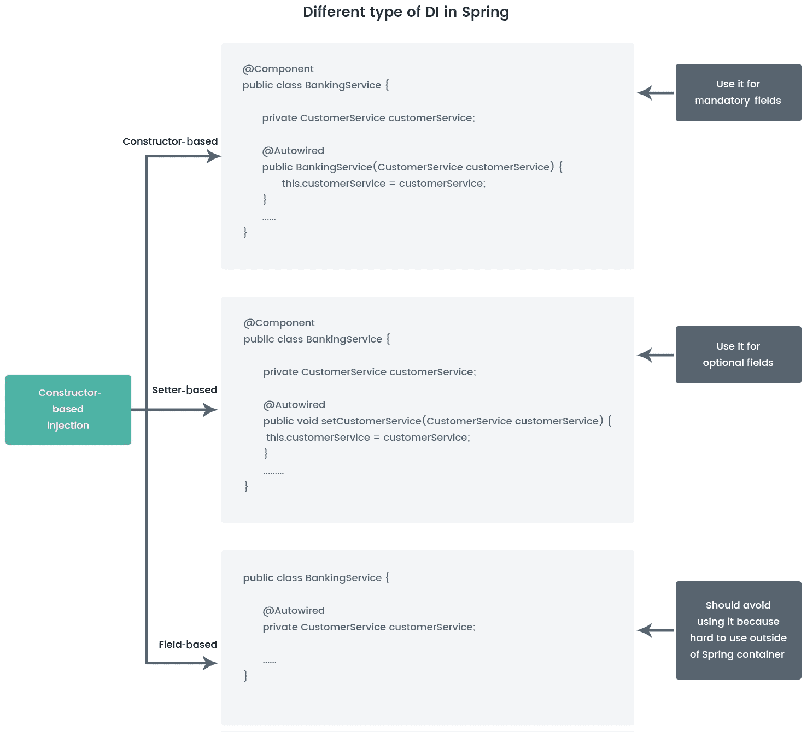
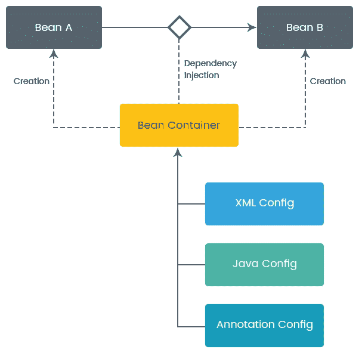
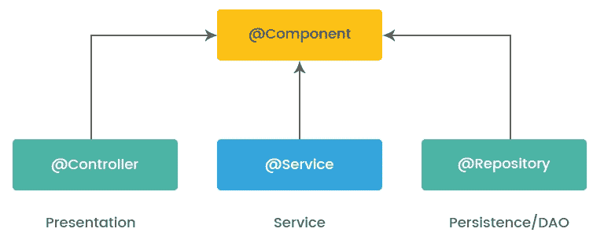
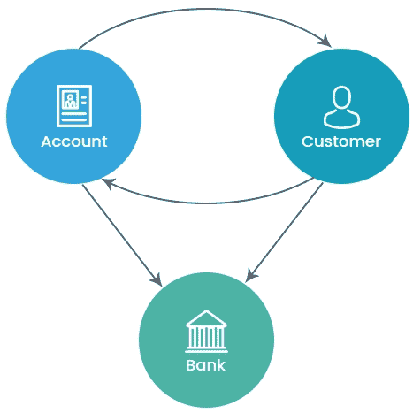

# 第二章：Spring 最佳实践和 Bean 配置

在上一章中，我们了解了 Spring 框架如何实现**控制反转**（**IoC**）原则。Spring IoC 是实现对象依赖关系的松耦合的机制。Spring IoC 容器是将依赖注入到对象中并使其准备好供我们使用的程序。Spring IoC 也被称为依赖注入。在 Spring 中，您的应用程序的对象由 Spring IoC 容器管理，也被称为**bean**。Bean 是由 Spring IoC 容器实例化、组装和管理的对象。因此，Spring 容器负责在您的应用程序中创建 bean，并通过依赖注入协调这些对象之间的关系。但是，开发人员有责任告诉 Spring 要创建哪些 bean 以及如何配置它们。在传达 bean 的装配配置时，Spring 非常灵活，提供不同的配置方式。

在本章中，我们首先开始探索不同的 bean 装配配置。这包括使用 Java、XML 和注解进行配置，以及学习 bean 装配配置的不同最佳实践。我们还将了解不同配置的性能评估，以及依赖注入的缺陷。

本章将涵盖以下主题：

+   依赖注入配置

+   不同配置的性能评估

+   依赖注入的缺陷

# 依赖注入配置

在任何应用程序中，对象与其他对象协作执行一些有用的任务。在任何应用程序中，一个对象与另一个对象之间的关系会创建依赖关系，这种对象之间的依赖关系会在应用程序中创建紧耦合的编程。Spring 为我们提供了一种机制，将紧耦合的编程转换为松耦合的编程。这种机制称为**依赖注入**（**DI**）。DI 是一种描述如何创建松耦合类的概念或设计模式，其中对象以一种方式设计，它们从其他代码片段接收对象的实例，而不是在内部构造它们。这意味着对象在运行时获得它们的依赖关系，而不是在编译时。因此，通过 DI，我们可以获得一个解耦的结构，为我们提供了简化的测试、更大的可重用性和更好的可维护性。

在接下来的章节中，我们将学习不同类型的 DI 配置，您可以根据业务需求在应用程序的任何配置中使用这些配置。

# 依赖注入模式的类型

在 Spring 中，进行以下类型的 DI：

+   基于构造函数的依赖注入

+   基于 setter 的依赖注入

+   基于字段的依赖注入

我们将在接下来的章节中了解更多相关内容。

# 基于构造函数的依赖注入

**基于构造函数的依赖注入**是一种设计模式，用于解决依赖对象的依赖关系。在基于构造函数的依赖注入中，使用构造函数来注入依赖对象。当容器调用带有一定数量参数的构造函数时，就完成了这个过程。

让我们看一个基于构造函数的 DI 的例子。在以下代码中，我们展示了如何在`BankingService`类中使用构造函数来注入`CustomerService`对象：

```java
@Component
public class BankingService {

  private CustomerService customerService;

  // Constructor based Dependency Injection
  @Autowired
  public BankingService(CustomerService customerService) {
    this.customerService = customerService;
  }

  public void showCustomerAccountBalance() {
    customerService.showCustomerAccountBalance();
  }

}
```

以下是另一个依赖类文件`CustomerServiceImpl.java`的内容：

```java
public class CustomerServiceImpl implements CustomerService {

  @Override
  public void showCustomerAccountBalance() {
    System.out.println("This is call customer services");
  }
}

```

`CustomerService.java`接口的内容如下：

```java
public interface CustomerService {  
  public void showCustomerAccountBalance(); 
}
```

# 构造函数 DI 的优势

以下是在 Spring 应用程序中使用基于构造函数的 DI 的优势：

+   适用于必需的依赖关系。在基于构造函数的依赖注入中，您可以确保对象在构造时已经准备好供使用。

+   代码结构非常紧凑且易于理解。

+   当您需要一个不可变对象时，通过基于构造函数的依赖，您可以确保获得对象的不可变性。

# 构造函数 DI 的缺点

构造函数注入的唯一缺点是可能会导致对象之间的**循环依赖**。循环依赖意味着两个对象彼此依赖。为了解决这个问题，我们应该使用设置器注入而不是构造函数注入。

让我们看一种在 Spring 中不同类型的 DI，即基于设置器的注入。

# 设置器 DI

在基于构造函数的 DI 中，我们看到一个依赖对象通过构造函数参数注入。在基于设置器的 DI 中，依赖对象是由依赖类中的设置器方法提供的。通过在容器中调用`no-args`构造函数后，在 bean 上调用设置器方法来实现设置器 DI。

在下面的代码中，我们展示了如何在`BankingService`类中使用一个设置器方法来注入`CustomerService`对象：

```java
@Component
public class BankingService {

  private CustomerService customerService;  

  // Setter-based Dependency Injection
  @Autowired
  public void setCustomerService(CustomerService customerService) {
  this.customerService = customerService;
  }

  public void showCustomerAccountBalance() {
    customerService.showCustomerAccountBalance();
  }

}
```

# 设置器 DI 的优势

以下是在您的 Spring 应用程序中设置器 DI 的优势：

+   它比构造函数注入更可读。

+   这对于非强制性的依赖是有用的。

+   它解决了应用程序中的循环依赖问题。

+   它帮助我们只在需要时注入依赖关系。

+   可以重新注入依赖关系。这在基于构造函数的注入中是不可能的。

# 设置器 DI 的缺点

尽管基于设置器的 DI 优先级高于基于构造函数的 DI，但前者的缺点如下：

+   在设置器 DI 中，不能保证依赖关系会被注入。

+   可以使用设置器 DI 来覆盖另一个依赖关系。这可能会在 Spring 应用程序中引起安全问题。

# 基于字段的 DI

在前面的章节中，我们看到了如何在我们的应用程序中使用基于构造函数和基于设置器的依赖关系。在下面的示例中，我们将看到基于字段的 DI。实际上，基于字段的 DI 易于使用，并且与其他两种注入方法相比，代码更清晰；然而，它也有一些严重的折衷，通常应该避免使用。

让我们看一下基于字段的 DI 的以下示例。在下面的代码中，我们将看到如何在`BankingService`类中使用字段来注入`CustomerService`对象：

```java
@Component
public class BankingService {

  //Field based Dependency Injection
  @Autowired
  private CustomerService customerService;

  public void showCustomerAccountBalance() {
    customerService.showCustomerAccountBalance();
  }

}
```

正如我们讨论过的，这种类型的 DI 有利于消除基于设置器或构造函数的依赖的混乱代码，但它也有许多缺点，比如依赖关系对外部是不可见的。在基于构造函数和基于设置器的依赖关系中，类明确地使用`public`接口或设置器方法来暴露这些依赖关系。在基于字段的 DI 中，类本质上是在对外部世界隐藏依赖关系。另一个困难是字段注入不能用于为 final/不可变字段分配依赖关系，因为这些字段必须在类实例化时实例化。

一般来说，Spring 不鼓励使用基于字段的依赖。

以下是我们迄今为止学到的不同类型的 DI 的图表：



# 构造函数与设置器注入

正如我们所看到的，Spring 支持三种 DI 方法；然而，Spring 不推荐使用基于字段的依赖。因此，基于构造函数和基于设置器的 DI 是在应用程序中注入 bean 的标准方式。构造函数或设置器方法的选择取决于您的应用程序要求。在这个表中，我们将看到构造函数和设置器注入的不同用例，以及一些最佳实践，这将帮助我们决定何时使用设置器注入而不是构造函数注入，反之亦然：

| **构造函数注入** | **设置器注入** |
| --- | --- |
| 依赖关系是强制性时的最佳选择。 | 依赖关系不是强制性时的合适选择。 |
| 构造函数注入使得 bean 类对象是不可变的。 | 设置器注入使得 bean 类对象是可变的。 |
| 构造函数注入无法覆盖 setter 注入的值。 | 当我们同时为同一属性使用构造函数和 setter 注入时，setter 注入会覆盖构造函数注入。 |
| 部分依赖在构造函数注入中是不可能的，因为我们必须在构造函数中传递所有参数，否则会出错。 | 部分依赖在 setter 注入中是可能的。假设我们有三个依赖，比如`int`，`string`和`long`，那么借助 setter 注入，我们可以只注入所需的依赖；其他依赖将被视为这些原始类型的默认值。 |
| 在对象之间创建循环依赖。 | 解决应用程序中的循环依赖问题。在循环依赖的情况下，最好使用 setter 而不是构造函数注入。 |

# 使用 Spring 配置 DI

在本节中，我们将学习不同类型的配置 DI 的过程。以下图表是配置过程在 Spring 中如何工作的高级视图：



根据前面的图表，Spring 容器负责在您的应用程序中创建 bean，并通过 DI 模式建立这些 bean 之间的关系；但是，正如我们之前讨论的，开发人员有责任通过元数据告诉 Spring 容器如何创建 bean 以及如何将它们连接在一起。

以下是配置应用程序元数据的三种技术：

+   基于 XML 的配置：显式配置

+   基于 Java 的配置：显式配置

+   基于注解的配置：隐式配置

在 Spring 框架中，有前述三种配置机制可用，但您必须使用其中一种配置过程来连接您的 bean。在下一节中，我们将详细了解每种配置技术的示例，并看到在每种情况或条件下哪种技术更适合；但是，您可以使用最适合您的任何技术或方法。

现在让我们详细了解基于 XML 的配置中的 DI 模式。

# 基于 XML 的配置

**基于 XML 的配置**自 Spring 开始以来一直是主要的配置技术。在本节中，我们将看到与 DI 模式中讨论的相同示例，并看到如何通过基于 XML 的配置在`BankingService`类中注入`CustomerService`对象。

对于基于 XML 的配置，我们需要创建一个带有`<beans>`元素的`applicationContext.xml`文件。Spring 容器必须能够管理应用程序中的一个或多个 bean。使用顶级`<beans>`元素内部的`<bean>`元素来描述 bean。

以下是`applicationContext.xml`文件的内容：

```java
<?xml version="1.0" encoding="UTF-8"?>
<beans 

  xsi:schemaLocation="http://www.springframework.org/schema/beans
  http://www.springframework.org/schema/beans/spring-beans.xsd">

    <!-- Bean Configuration definition describe here -->
    <bean class=""/>

</beans> 
```

前面的 XML 文件是基于 XML 的配置元数据的基本结构，我们需要在其中定义我们的 bean 配置。正如我们之前学到的，我们的 bean 配置模式可能是基于构造函数或基于 setter 的，具体取决于应用程序的要求。现在，我们将逐个看看如何使用这两种设计模式配置 bean。

以下是基于 XML 的构造函数 DI 的示例：

```java
<!-- CustomerServiceImpl Bean -->
<bean id="customerService"    class="com.packt.springhighperformance.ch2.bankingapp.service.Impl.CustomerServiceImpl" />

<!-- Inject customerService via constructor argument -->
<bean id="bankingService"
class="com.packt.springhighperformance.ch2.bankingapp.model.BankingService">
<constructor-arg ref="customerService" />
</bean>
```

在前面的例子中，我们使用构造函数 DI 模式在`BankingServices`类中注入了`CustomerService`对象。`</constructor-arg>`元素的`ref`属性用于传递`CustomerServiceImpl`对象的引用。

以下是基于 XML 的 setter 注入 DI 的示例：

```java
<!-- CustomerServiceImpl Bean -->
<bean id="customerService"    class="com.packt.springhighperformance.ch2.bankingapp.service.Impl.CustomerServiceImpl" />

<!-- Inject customerService via setter method -->
<bean id="bankingService" class="com.packt.springhighperformance.ch2.bankingapp.model.BankingService"> 
<property name="customerService" ref="customerService"></property></bean>
```

`</property>`元素的`ref`属性用于将`CustomerServiceImpl`对象的引用传递给 setter 方法。

以下是`MainApp.java`文件的内容：

```java
public class MainApp {

public static void main(String[] args) {
    @SuppressWarnings("resource")
    ApplicationContext context = new               
    ClassPathXmlApplicationContext("applicationContext.xml");
    BankingService bankingService = 
    context.getBean("bankingService",                            
    BankingService.class);
    bankingService.showCustomerAccountBalance(); 
  }
}
```

# 基于 Java 的配置

在上一节中，我们看到了如何使用基于 XML 的配置来配置 bean。在本节中，我们将看到基于 Java 的配置。与 XML 相同，基于 Java 的配置也是显式地注入依赖关系。以下示例定义了 Spring bean 及其依赖关系：

```java
@Configuration
public class AppConfig { 

  @Bean
  public CustomerService showCustomerAccountBalance() {
    return new CustomerService();
  }

  @Bean
  public BankingService getBankingService() {
    return new BankingService();
  }  
}
```

在基于 Java 的配置中，我们必须使用`@Configuration`对类进行注解，并且可以使用`@Bean`注解来声明 bean。前面的基于 Java 的配置示例等同于基于 XML 的配置，如下所示：

```java
<beans>
<bean id="customerService"   class="com.packt.springhighperformance.ch2.bankingapp.service.Impl.CustomerServiceImpl" /> 

<bean id="bankingService"
class="com.packt.springhighperformance.ch2.bankingapp.model.BankingService/">
</beans>
```

之前的`AppConfig`类使用了`@Configuration`注解，描述了它是应用程序的配置类，包含有关 bean 定义的详细信息。该方法使用`@Bean`注解进行注解，以描述它负责实例化、配置和初始化一个新的 bean，由 Spring IoC 容器进行管理。在 Spring 容器中，每个 bean 都有一个唯一的 ID。无论哪个方法使用了`@Bean`注解，那么默认情况下该方法名称将是 bean 的 ID；但是，您也可以使用`@Bean`注解的`name`属性来覆盖该默认行为，如下所示：

```java
@Bean(name="myBean")
  public CustomerService showCustomerAccountBalance() {
    return new CustomerService();
  }
```

Spring 应用程序上下文将加载`AppConfig`文件并为应用程序创建 bean。

以下是`MainApp.java`文件：

```java
public class MainApp {

  public static void main(String[] args) {
    AnnotationConfigApplicationContext context = new                                                 
    AnnotationConfigApplicationContext(AppConfig.class);
    BankingService bankingService = 
    context.getBean(BankingService.class);
    bankingService.showCustomerAccountBalance();
    context.close();     
  }
}
```

# 基于注解的配置

在上一节中，我们看到了两种 bean 配置技术，即基于 Java 和基于 XML 的。这两种技术都是显式地注入依赖关系。在基于 Java 的配置中，我们在`AppConfig` Java 文件中使用`@Bean`注解的方法，而在基于 XML 的配置中，我们在 XML 配置文件中使用`<bean>`元素标签。**基于注解的配置**是另一种创建 bean 的方式，我们可以通过在相关类、方法或字段声明上使用注解，将 bean 配置移到组件类本身。在这里，我们将看看如何通过注解配置 bean，以及 Spring Framework 中提供的不同注解。

Spring 中默认情况下关闭了基于注解的配置，因此首先，您必须通过在 Spring XML 文件中输入`<context:annotation-config/>`元素来打开它。添加后，您就可以在代码中使用注解了。

在`applicationContext.xml`中需要进行的更改（因为我们在之前的部分中使用了它）如下所示：

```java
<?xml version="1.0" encoding="UTF-8"?>
<beans 

xsi:schemaLocation="http://www.springframework.org/schema/beans
http://www.springframework.org/schema/beans/spring-beans.xsd
http://www.springframework.org/schema/context
http://www.springframework.org/schema/context/spring-context.xsd">

<!-- Enable Annotation based configuration -->
<context:annotation-config />
<context:component-scan base-package="com.packt.springhighperformance.ch2.bankingapp.model"/><context:component-scan base- package="com.packt.springhighperformance.ch2.bankingapp.service"/>

<!-- Bean Configuration definition describe here -->
<bean class=""/>

</beans>
```

基于 XML 的配置将覆盖注解，因为基于 XML 的配置将在注解之后进行注入。

之前的基于 XML 的配置显示，一旦配置了`<context:annotation-config/>`元素，就表示开始对代码进行注解。Spring 应该自动扫描在`<context:component-scan base-package=".." />`中定义的包，并根据模式识别 bean 并进行连线。让我们了解一些重要的注解以及它们的工作原理。

# @Autowired 注解

`@Autowired`注解隐式地注入对象依赖。我们可以在基于构造函数、setter 和字段的依赖模式上使用`@Autowired`注解。`@Autowired`注解表示应该为此 bean 执行自动装配。

让我们看一个在基于构造函数的依赖注入上使用`@Autowired`注解的例子：

```java
public class BankingService {  

  private CustomerService customerService;

  @Autowired
  public BankingService(CustomerService customerService) {
    this.customerService = customerService;
  }
  ......
}
```

在前面的例子中，我们有一个`BankingService`，它依赖于`CustomerService`。它的构造函数使用`@Autowired`进行注解，表示 Spring 使用带注解的构造函数实例化`BankingService` bean，并将`CustomerService` bean 作为`BankingService` bean 的依赖项。

自 Spring 4.3 以来，对于只有一个构造函数的类，`@Autowired`注解变得可选。在前面的例子中，如果您跳过了`@Autowired`注解，Spring 仍然会注入`CustomerService`类的实例。

让我们看一个在基于 setter 的依赖注入上使用`@Autowired`注解的例子：

```java
public class BankingService {

  private CustomerService customerService; 

  @Autowired
  public void setCustomerService(CustomerService customerService) {
```

```java
    this.customerService = customerService;
  }
  ......
}
```

在前面的例子中，我们看到 setter 方法`setCustomerService`被`@Autowired`注解标记。在这里，注解通过类型解析依赖关系。`@Autowire`注解可以用于任何传统的 setter 方法。

让我们看一个在基于字段的依赖上使用`@Autowired`注解的例子：

```java
public class BankingService {

  @Autowired
  private CustomerService customerService; 

}
```

根据前面的例子，我们可以看到`@Autowire`注解可以添加在公共和私有属性上。Spring 在属性上添加时使用反射 API 来注入依赖项，这就是私有属性也可以被注解的原因。

# @Autowired with required = false

默认情况下，`@Autowired`注解意味着依赖是必需的。这意味着在未解析依赖项时将抛出异常。您可以使用`@Autowired`的`(required=false)`选项覆盖默认行为。让我们看下面的代码：

```java
public class BankingService {

  private CustomerService customerService; 

  @Autowired (required=false)
  public void setCustomerService(CustomerService customerService) {
    this.customerService = customerService;
  }
  ......
}
```

在前面的代码中，如果我们将`required`值设置为`false`，那么在 bean 连线时，如果依赖项未解析，Spring 将保留 bean 未连接。根据 Spring 的最佳实践，我们应该避免将`required`设置为`false`，除非绝对需要。

# @Primary 注解

在 Spring 框架中，默认情况下，DI 是按类型完成的，这意味着当存在多个具有相同类型的依赖项时，将抛出`NoUniqueBeanDefinitionException`异常。这表明 Spring 容器无法选择要注入的 bean，因为有多个合格的候选项。在这种情况下，我们可以使用`@Primary`注解并控制选择过程。让我们看下面的代码：

```java
public interface CustomerService {  
  public void customerService(); 
}

@Component
public class AccountService implements CustomerService {
      ....
}
@Component
@Primary
public class BankingService implements CustomerService { 
     ....
}
```

在前面的例子中，有两个客户服务可用：`BankingService`和`AccountService`。由于`@Primary`注解，组件只能使用`BankingService`来连线`CustomerService`的依赖项。

# @Qualifier 注解

使用`@Primary`处理多个自动装配候选项在只能确定一个主要候选项的情况下更有效。`@Qualifier`注解在选择过程中给予更多控制。它允许您给出与特定 bean 类型相关联的引用。该引用可用于限定需要自动装配的依赖项。让我们看下面的代码：

```java
@Component
public class AccountService implements CustomerService {

}
@Component
@Qualifier("BankingService")
public class BankingService implements CustomerService { 

}

@Component
public class SomeService {

  private CustomerService customerService;

  @Autowired
  @Qualifier("bankingservice")
  public BankingService(CustomerService customerService) {
    this.customerService = customerService;
  }
  .....
}
```

在前面的例子中，有两个客户服务可用：`BankingService`和`AccountService`；但是，由于在`SomeService`类中使用了`@Qualifier("bankingservice")`，`BankingService`将被选中进行自动连线。

# 使用原型注解自动检测 bean

在前一节中，我们了解了`@Autowired`注解只处理连线。您仍然必须定义 bean 本身，以便容器知道它们并为您注入它们。Spring 框架为我们提供了一些特殊的注解。这些注解用于在应用程序上下文中自动创建 Spring bean。因此，无需使用基于 XML 或基于 Java 的配置显式配置 bean。

以下是 Spring 中的原型注解：

+   @Component

+   @Service

+   @Repository

+   @Controller

让我们看一下以下`CustomerService`实现类。它的实现被注解为`@Component`。请参考以下代码：

```java
@Component
public class CustomerServiceImpl implements CustomerService {

  @Override
  public void customerService() {
    System.out.println("This is call customer services");

  }

}
```

在前面的代码中，`CustomerServiceImpl`类被`@Component`注解标记。这意味着被标记为`@Component`注解的类被视为 bean，并且 Spring 的组件扫描机制扫描该类，创建该类的 bean，并将其拉入应用程序上下文。因此，无需显式配置该类作为 bean，因为 bean 是使用 XML 或 Java 自动创建的。Spring 自动创建`CustomerServiceImpl`类的 bean，因为它被`@Component`注解标记。

在 Spring 中，`@Service`、`@Repository`和`@Controller`是`@Component`注解的元注解。从技术上讲，所有注解都是相同的，并提供相同的结果，例如在 Spring 上下文中创建一个 bean；但是我们应该在应用程序的不同层次使用更具体的注解，因为它更好地指定了意图，并且将来可能会依赖于其他行为。

以下图表描述了具有适当层的原型注解：



根据前面的例子，`@Component`足以创建`CustomerService`的 bean。但是`CustomerService`是一个服务层类，因此根据 bean 配置最佳实践，我们应该使用`@Services`而不是通用的`@Component`注解。让我们看一下相同类的以下代码，该类使用了`@Service`注解：

```java
@Service
public class CustomerServiceImpl implements CustomerService {

  @Override
  public void customerService() {
    System.out.println("This is call customer services");
  }

}
```

让我们看一个`@Repository`注解的另一个例子：

```java
@Repository
public class JdbcCustomerRepository implements CustomerRepository {

}
```

在前面的例子中，该类被注解为`@Repository`，因为`CustomerRepository`接口在应用程序的**数据访问对象**（**DAO**）层中起作用。根据 bean 配置最佳实践，我们使用了`@Repository`注解而不是`@Component`注解。

在现实场景中，您可能会很少遇到需要使用`@Component`注解的情况。大多数情况下，您将使用`@Controller`、`@Service`和`@Repository`注解。当您的类不属于服务、控制器、DAO 三类时，应该使用`@Component`。

# @ComponentScan 注解

Spring 需要知道哪些包包含 Spring bean，否则，您将需要逐个注册每个 bean。这就是`@ComponentScan`的用途。在 Spring 中，默认情况下不启用组件扫描。我们需要使用`@ComponentScan`注解来启用它。此注解与`@Configuration`注解一起使用，以便 Spring 知道要扫描的包，并从中创建 bean。让我们看一个简单的`@ComponentScan`的例子：

```java
@Configuration
@ComponentScan(basePackages="com.packt.springhighperformance.ch2.bankingapp.model")
public class AppConfig {

}
```

在`@ComponentScan`注解中，如果未定义`basePackages`属性，则扫描将从声明此注解的类的包中进行。在前面的例子中，Spring 将扫描`com.packt.springhighperformance.ch2.bankingapp.model`的所有类，以及该包的子包。`basePackages`属性可以接受一个字符串数组，这意味着我们可以定义多个基本包来扫描应用程序中的组件类。让我们看一个如何在`basePackage`属性中声明多个包的例子：

```java
@Configuration
@ComponentScan(basePackages={"com.packt.springhighperformance.ch2.bankingapp.model","com.packt.springhighperformance.ch2.bankingapp.service"})
public class AppConfig {

}
```

# @Lazy 注解

默认情况下，所有自动装配的依赖项都会在启动时创建和初始化，这意味着 Spring IoC 容器会在应用程序启动时创建所有 bean；但是，我们可以使用`@Lazy`注解来控制这种预初始化的 bean。

`@Lazy`注解可以用于任何直接或间接使用`@Component`注解的类，或者用于使用`@Bean`注解的方法。当我们使用`@Lazy`注解时，这意味着只有在首次请求时才会创建和初始化 bean。

我们知道注解需要的代码较少，因为我们不需要显式编写代码来注入依赖项。它还有助于减少开发时间。尽管注解提供了许多优点，但它也有缺点。

注解的缺点如下：

+   比显式连线文档少

+   如果程序中有很多依赖项，那么使用 bean 的`autowire`属性来查找它是很困难的。

+   注解使调试过程变得困难

+   在存在歧义的情况下可能会产生意外结果

+   注解可以被显式配置（如 Java 或 XML）覆盖

# Spring bean 作用域

在前一节中，我们学习了各种 DI 模式，以及如何在 Spring 容器中创建 bean。我们还学习了各种 DI 配置，如 XML、Java 和注解。在本节中，我们将更详细地了解 Spring 容器中可用的 bean 生命周期和范围。Spring 容器允许我们在配置级别控制 bean。这是一种非常灵活的方式，可以在配置级别定义对象范围，而不是在 Java 类级别。在 Spring 中，通过定义`scope`属性来控制 bean 的行为，该属性定义了要创建和返回的对象类型。当您描述`<bean>`时，可以为该 bean 定义`scope`。bean `scope`描述了 bean 在使用的上下文中的生命周期和可见性。在本节中，我们将看到 Spring Framework 中不同类型的 bean `scope`。

以下是在基于 XML 的配置中定义 bean `scope`的示例：

```java
<?xml version="1.0" encoding="UTF-8"?>
<beans 

xsi:schemaLocation="http://www.springframework.org/schema/beans
http://www.springframework.org/schema/beans/spring-beans.xsd">

<!-- Here scope is not defined, it assume default value 'singleton'.
    It creates only one instance per spring IOC. -->
<bean id="customerService" class="com.packt.springhighperformance.ch2.bankingapp.service.Impl.CustomerServiceImpl" />

<!-- Here scope is prototype, it creates and returns bankingService object for  every call-->
<bean id="bankingService"   class="com.packt.springhighperformance.ch2.bankingapp.model.BankingService" scope="prototype">

<bean id="accountService" class="com.packt.springhighperformance.ch2.bankingapp.model.AccountService" scope="singleton">

</beans>
```

以下是使用`@Scope`注解定义 bean `scope`的示例：

```java
@Configuration
public class AppConfig { 

  @Bean
  @Scope("singleton")
  public CustomerService showCustomerAccountBalance() {
    return new CustomerServiceImpl();

  }
}
```

我们也可以以以下方式使用常量而不是字符串值：

```java
@Scope(value = ConfigurableBeanFactory.SCOPE_SINGLETON)
@Scope(value = ConfigurableBeanFactory.SCOPE_PROTOTYPE)
```

以下是 Spring Framework 中可用的 bean 范围：

+   `singleton` bean `scope`：正如我们在之前的 XML 配置的 bean 示例中看到的，如果在配置中未定义`scope`，那么 Spring 容器将`scope`视为`singleton`。Spring IoC 容器仅创建对象的一个单一实例，即使有多个对 bean 的引用。Spring 将所有`singleton` bean 实例存储在缓存中，对该命名 bean 的所有后续请求都返回缓存对象。需要理解的是，Spring bean `singleton` `scope`与我们在 Java 中使用的典型`singleton`设计模式有些不同。在 Spring `singleton` `scope`中，每个 Spring 容器创建一个 bean 对象，这意味着如果单个 JVM 中有多个 Spring 容器，则将创建该 bean 的多个实例。

+   `prototype` bean `scope`：当`scope`设置为`prototype`时，Spring IoC 容器在每次请求 bean 时都会创建对象的新 bean 实例。通常使用原型作用域的 bean 用于有状态的 bean。

通常，对于所有有状态的 bean 使用`prototype` `scope`，对于无状态的 bean 使用`singleton` `scope`。

+   `request` bean `scope`：`request` bean `scope`仅在 Web 应用程序上下文中可用。`request` `scope`为每个 HTTP 请求创建一个 bean 实例。一旦请求处理完成，bean 就会被丢弃。

+   `session` bean `scope`：`session` bean `scope`仅在 Web 应用程序上下文中可用。`session` `scope`为每个 HTTP 会话创建一个 bean 实例。

+   `application` bean `scope`：`application` bean `scope`仅在 Web 应用程序上下文中可用。`application` `scope`为每个 Web 应用程序创建一个 bean 实例。

# 使用不同配置进行性能评估

在本节中，我们将学习不同类型的 bean 配置如何影响应用程序性能，还将看到 bean 配置的最佳实践。

让我们看看`@ComponentScan`注解配置如何影响 Spring 应用程序的启动时间：

```java
@ComponentScan (( {{ "org", "com" }} ))
```

根据前面的配置，Spring 将扫描`com`和`org`的所有包，因此应用程序的启动时间将增加。因此，我们应该只扫描那些具有注释类的包，因为未注释的类将花费时间进行扫描。我们应该只使用一个`@ComponentScan`，并列出所有包，如下所示：

```java
@ComponentScan(basePackages={"com.packt.springhighperformance.ch2.bankingapp.model","com.packt.springhighperformance.ch2.bankingapp.service"})
```

前面的配置被认为是定义`@ComponentScan`注解的最佳实践。我们应该指定哪些包作为`basePackage`属性具有注释类。这将减少应用程序的启动时间。

# 延迟加载与预加载

**延迟加载**确保在请求时动态加载 bean，而**预加载**确保在使用之前加载 bean。Spring IoC 容器默认使用预加载。因此，在启动时加载所有类，即使它们没有被使用，也不是一个明智的决定，因为一些 Java 实例会消耗大量资源。我们应该根据应用程序的需求使用所需的方法。

如果我们需要尽可能快地加载我们的应用程序，那么选择延迟加载。如果我们需要尽可能快地运行我们的应用程序并更快地响应客户端请求，那么选择预加载。

# 单例与原型 bean

在 Spring 中，默认情况下，所有定义的 bean 都是`singleton`；但是，我们可以更改默认行为并使我们的 bean 成为`prototype`。当 bean 的`scope`设置为`prototype`时，Spring IoC 容器在每次请求 bean 时创建一个新的 bean 实例。原型 bean 在创建时会对性能造成影响，因此当一个`prototype` bean 使用资源（如网络和数据库连接）时，应完全避免；或者谨慎设计操作。

# Spring bean 配置最佳实践

在本节中，我们将看到 Spring 配置 bean 的一些最佳实践：

+   使用 ID 作为 bean 标识符：

```java
<?xml version="1.0" encoding="UTF-8"?>
<beans 

xsi:schemaLocation="http://www.springframework.org/schema/beans
http://www.springframework.org/schema/beans/spring-beans.xsd">

    <!-- Bean Configuration definition describe here -->
    <bean id="xxx" name="xxx" class=""/>

</beans>
```

在前面的例子中，我们使用`id`或`name`来标识 bean。我们应该使用`id`来选择 bean 而不是`name`。通常，它既不增加可读性也不提高性能，但这只是一个行业标准实践，我们需要遵循。

+   在构造函数参数匹配时，优先使用`type`而不是`index`。带有`index`属性的构造函数参数如下所示：

```java
<constructor-arg index="0" value="abc"/>
<constructor-arg index="1" value="100"/>
```

+   构造函数参数带有`type`属性，如下所示：

```java
<constructor-arg type="java.lang.String"
value="abc"/>
<constructor-arg type="int" value="100"/>
```

根据前面的例子，我们可以使用`index`或`type`作为构造函数参数。在构造函数参数中最好使用`type`属性而不是`index`，因为它更易读且更少出错。但有时，基于类型的参数可能会在构造函数有多个相同类型的参数时创建歧义问题。在这种情况下，我们需要使用`index`或基于名称的参数。

+   在开发阶段使用依赖检查：在 bean 定义中，我们应该使用`dependency-check`属性。它确保容器执行显式的依赖验证。当一个 bean 的所有或部分属性必须显式设置或通过自动装配时，它是有用的。

+   不要在 Spring 模式引用中指定版本号：在 Spring 配置文件中，我们指定不同 Spring 模块的模式引用。在模式引用中，我们提到 XML 命名空间及其版本号。在配置文件中指定版本号不是强制性的，因此您可以跳过它。事实上，您应该始终跳过它。将其视为一种最佳实践。Spring 会自动从项目依赖项（`jars`）中选择最高版本。典型的 Spring 配置文件如下所示：

```java
<?xml version="1.0" encoding="UTF-8"?>
<beans 

xsi:schemaLocation="http://www.springframework.org/schema/beans
http://www.springframework.org/schema/beans/spring-beans-3.0.xsd">

    <!-- Bean Configuration definition describe here -->
    <bean class=""/>

</beans>
```

根据最佳实践，可以这样编写：

```java
<?xml version="1.0" encoding="UTF-8"?>
<beans 

xsi:schemaLocation="http://www.springframework.org/schema/beans
http://www.springframework.org/schema/beans/spring-beans.xsd">

    <!-- Bean Configuration definition describe here -->
    <bean class=""/>

</beans>
```

为每个配置文件添加一个头部注释；最好添加一个描述配置文件中定义的 bean 的配置文件头部。`description`标签的代码如下：

```java
<beans>
<description>
This file defines customer service
related beans and it depends on
accountServices.xml, which provides
service bean templates...
</description>
...
</beans>
```

`description`标签的优点是一些工具可以从这个标签中获取描述，以帮助您在其他地方使用。

# DI 陷阱

众所周知，在 Spring 应用程序中有三种 DI 模式：构造函数、setter 和基于字段。每种类型都有不同的优缺点。只有基于字段的 DI 是一种错误的方法，甚至 Spring 也不推荐使用。

以下是基于字段的注入的示例：

```java
@Autowired
private ABean aBean;
```

根据 Spring bean 最佳实践，我们不应该在 Spring 应用程序中使用基于字段的依赖。主要原因是没有 Spring 上下文无法进行测试。由于我们无法从外部提供依赖，因此无法独立实例化对象。在我看来，这是基于字段的注入唯一的问题。

正如我们在前面的部分中学到的，基于构造函数的依赖更适合于必填字段，并且我们可以确保对象的不可变性；然而，基于构造函数的依赖的主要缺点是它在应用程序中创建循环依赖，并且根据 Spring 文档，*通常建议不要依赖 bean 之间的循环依赖*。因此，现在我们有类似的问题，*为什么不依赖循环依赖？*和*如果我们的应用程序中有循环依赖会发生什么？*。因此，对这些问题的答案是它可能会产生两个重大且不幸的潜在问题。让我们讨论一下。

# 第一个潜在问题

当您调用`ListableBeanFactory.getBeansOfType()`方法时，您无法确定将返回哪些 bean。让我们看一下`DefaultListableBeanFactory.java`类中`getBeansOfType()`方法的代码：

```java
@Override
@SuppressWarnings("unchecked")
public <T> Map<String, T> getBeansOfType(@Nullable Class<T> type, boolean includeNonSingletons, boolean allowEagerInit)
      throws BeansException {

      ......

      if (exBeanName != null && isCurrentlyInCreation(exBeanName)) {
        if (this.logger.isDebugEnabled()) {
          this.logger.debug("Ignoring match to currently created bean 
          '" + 
          exBeanName + "': " +
          ex.getMessage());
        }
        onSuppressedException(ex);
        // Ignore: indicates a circular reference when auto wiring 
        constructors.
        // We want to find matches other than the currently created 
        bean itself.
        continue;
      }

      ......

}
```

在上面的代码中，您可以看到`getBeansOfType()`方法在创建中默默地跳过 bean，并且只返回那些已经存在的。因此，当 bean 之间存在循环依赖时，在容器启动期间不建议使用`getBeansOfType()`方法。这是因为，根据上面的代码，如果您没有使用`DEBUG`或`TRACE`日志级别，那么您的日志中将没有任何信息表明 Spring 跳过了正在创建的特定 bean。

让我们看看前面的潜在问题以及以下示例。根据以下图表，我们有三个 bean，`Account`、`Customer`和`Bank`，它们之间存在循环依赖：



根据前面的图表，以下是`Account`、`Customer`和`Bank`类：

```java
@Component
public class Account {

  private static final Logger LOGGER = Logger.getLogger(Account.class);

  static {
    LOGGER.info("Account | Class loaded");
  }

  @Autowired
  public Account(ListableBeanFactory beanFactory) {
    LOGGER.info("Account | Constructor");
    LOGGER.info("Constructor (Customer?): {}" + 
    beanFactory.getBeansOfType(Customer.class).keySet());
    LOGGER.info("Constructor (Bank?): {}" + 
    beanFactory.getBeansOfType(Bank.class).keySet());
  }

}

@Component
public class Customer {

  private static final Logger LOGGER = Logger.getLogger(Customer.class);

  static {
    LOGGER.info("Customer | Class loaded");
  }

  @Autowired
  public Customer(ListableBeanFactory beanFactory) {
    LOGGER.info("Customer | Constructor");
    LOGGER.info("Account (Account?): {}" + 
    beanFactory.getBeansOfType(Account.class).keySet());
    LOGGER.info("Constructor (Bank?): {}" + 
    beanFactory.getBeansOfType(Bank.class).keySet());
  }

}

@Component
public class Bank {

  private static final Logger LOGGER = Logger.getLogger(Bank.class);

  static {
    LOGGER.info("Bank | Class loaded");
  }

  public Bank() {
    LOGGER.info("Bank | Constructor");
  }

}
```

以下是`Main`类：

```java
public class MainApp {

  public static void main(String[] args) {
    AnnotationConfigApplicationContext context = new 
    AnnotationConfigApplicationContext(AppConfig.class);
    Account account = context.getBean(Account.class);
    context.close();
  }
}
```

以下是日志，我们可以展示 Spring 如何内部加载 bean 并解析类：

```java
Account | Class loaded
Account | Constructor
Customer | Class loaded
Customer | Constructor
Account (Account?): {}[]
Bank | Class loaded
Bank | Constructor
Constructor (Bank?): {}[bank]
Constructor (Customer?): {}[customer]
Constructor (Bank?): {}[bank]
```

Spring Framework 首先加载`Account`并尝试实例化一个 bean；然而，在运行`getBeansOfType(Customer.class)`时，它发现了`Customer`，因此继续加载和实例化那个。在`Customer`内部，我们可以立即发现问题：当`Customer`要求`beanFactory.getBeansOfType(Account.class)`时，它得不到结果(`[]`)。Spring 会默默地忽略`Account`，因为它当前正在创建。您可以在这里看到，在加载`Bank`之后，一切都如预期那样。

现在我们可以理解，在有循环依赖时，我们无法预测`getBeansOfType()`方法的输出。然而，我们可以通过正确使用 DI 来避免它。在循环依赖中，`getBeansOfType()`根据因素给出不同的结果，我们对此没有任何控制。

# 第二个潜在问题（带 AOP）

我们将在下一章中详细学习 AOP。现在，我们不会详细介绍这个潜在问题。我只是想让你明白，如果你在一个 bean 上有`Aspect`，那么请确保 bean 之间没有循环依赖；否则，Spring 将创建该 bean 的两个实例，一个没有`Aspect`，另一个有适当的方面，而不通知您。

# 总结

在本章中，我们学习了 DI，这是 Spring Framework 的关键特性。DI 帮助我们使我们的代码松散耦合和可测试。我们学习了各种 DI 模式，包括基于构造函数、setter 和字段的模式。根据我们的需求，我们可以在我们的应用程序中使用任何 DI 模式，因为每种类型都有其自己的优缺点。

我们还学习了如何显式和隐式地配置 DI。我们可以使用基于 XML 和基于 Java 的配置显式地注入依赖关系。注解用于隐式地注入依赖关系。Spring 为我们提供了一种特殊类型的注解，称为**原型注解**。Spring 将自动注册用原型注解注释的类。这使得该类可以在其他类中进行 DI，并且对于构建我们的应用程序至关重要。

在下一章中，我们将看一下 Spring AOP 模块。AOP 是一个强大的编程模型，可以帮助我们实现可重用的代码。
