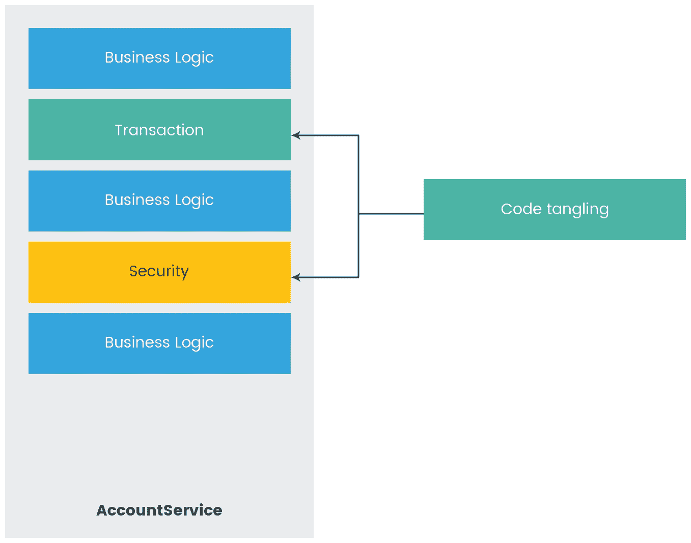
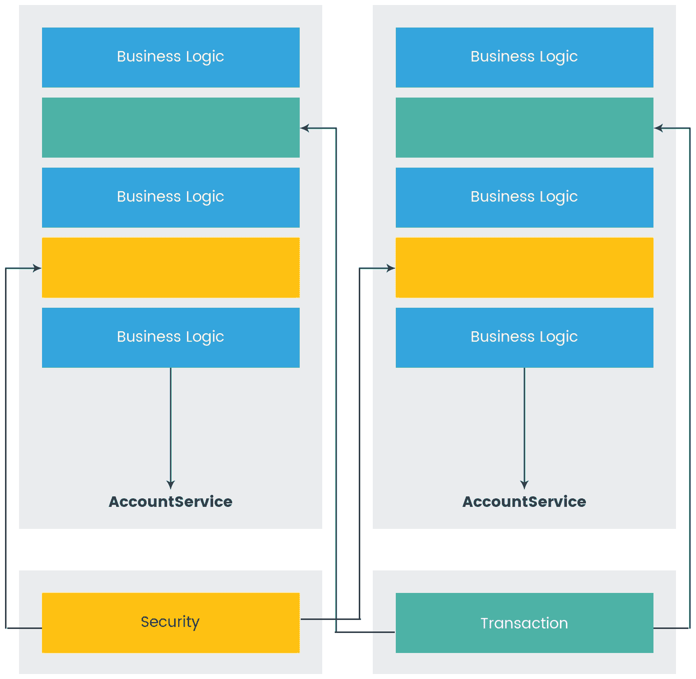
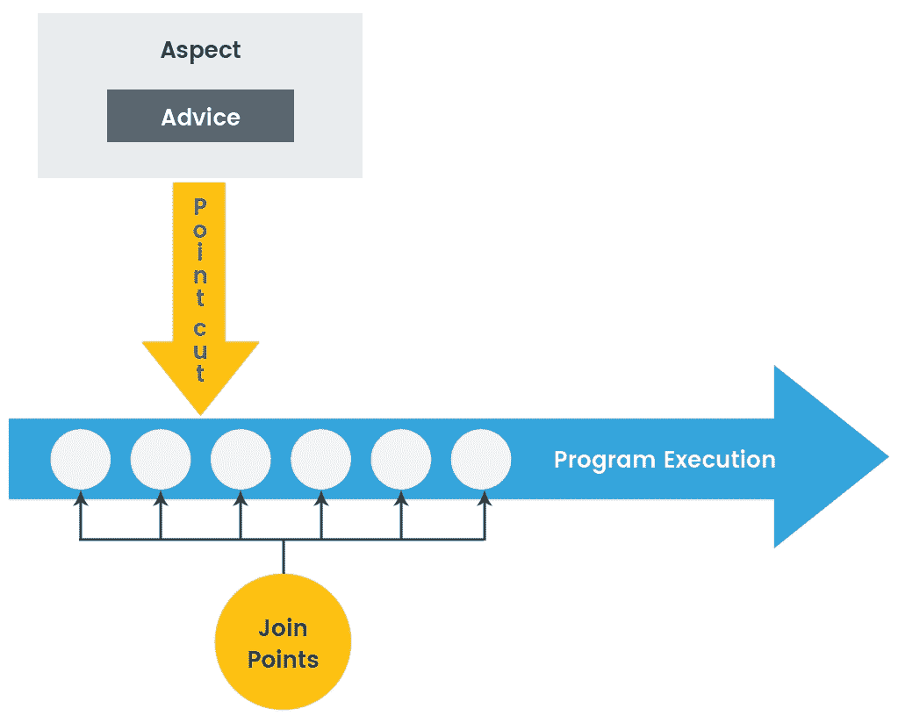
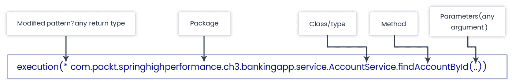
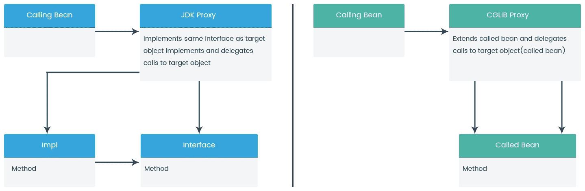

# 第三章：调整面向切面编程

在上一章中，我们深入研究了 Spring 的一个关键特性：依赖注入（IoC 容器）。DI 是一种企业设计模式，使对象与其所需的依赖关系解耦。我们了解了 Spring 的 bean 装配配置和实现最佳实践以实现最佳结果。

在继续了解 Spring 的核心特性的同时，在本章中，我们将讨论**面向切面编程**（**AOP**）。我们已经了解到 DI 促进了编程到接口和应用对象的解耦，而 AOP 有助于实现业务逻辑和横切关注点的解耦。**横切关注点**是应用程序部分或整个应用程序适用的关注点，例如安全、日志记录和缓存，在几乎每个模块中都需要。AOP 和 AspectJ 有助于实现这些横切关注点。在本章中，我们将讨论以下主题：

+   AOP 概念

+   AOP 代理

+   Spring AOP 方法进行性能分析

+   AOP 与 AspectJ 比较

+   AOP 最佳编程实践

# AOP 概念

在本节中，我们将看看如果只使用**面向对象编程**（**OOP**）范例，我们将面临哪些问题。然后我们将了解 AOP 如何解决这些问题。我们将深入了解 AOP 的概念和实现 AOP 概念的方法。

# OOP 的局限性

借助 OOP 的基本原理和设计模式，应用程序开发被划分为功能组。OOP 协议使许多事情变得简单和有用，例如引入接口，我们可以实现松耦合设计，封装，我们可以隐藏对象数据，继承-通过类扩展功能，我们可以重用工作。

随着系统的增长，OOP 的这些优势也增加了复杂性。随着复杂性的增加，维护成本和失败的机会也增加。为了解决这个问题，将功能模块化为更简单和更易管理的模块有助于减少复杂性。

为了模块化系统，我们开始遵循将应用程序划分为不同逻辑层的做法，例如表示层、服务层和数据层。然而，即使将功能划分为不同层，仍然有一些功能在所有层中都是必需的，例如安全、日志记录、缓存和性能监控。这些功能被称为**横切关注点**。

如果我们使用继承来实现这些横切关注点，将违反 SOLID 原则的单一责任，并增加对象层次结构。如果我们使用组合来实现它们，将会更加复杂。因此，使用 OOP 实现横切关注点会导致两个问题：

+   代码交织

+   代码分散

让我们更深入地讨论这些问题。

# 代码交织

**代码交织**意味着混合横切关注点和业务逻辑，从而导致紧耦合。让我们看下面的图表来理解代码交织：



代码交织

前面的图表说明了我们在服务实现中将事务和安全代码与业务逻辑混合在一起。通过这样的实现，代码的可重用性降低，维护性下降，并且违反了单一责任原则。

# 代码分散

代码分散意味着横切关注点在应用程序的所有模块中都是重复的。让我们看下面的例子来理解代码分散：

```java
public class TransferServiceImpl implements TransferService {
  public void transfer(Account source, Account dest, Double amount) {
    //permission check
    if (!hasPermission(user) {
      throw new AuthorizationException();
    }
  }
}

public class AccountServiceImpl implements AccountService {
  public void withdraw(Account userAccount, Double amount) {
    //Permission check
    if (!hasPermission(user) {
      throw new AuthorizationException();
    }
}
```

正如我们在前面的代码示例中看到的，权限检查（安全性）是我们的横切关注点，在所有服务中都是重复的。

这些代码交织和代码分散的问题通过 AOP 得到解决，但是如何呢？我们很快就会看到。

# AOP-问题解决者

我们已经在前面的部分中看到，使用 OOP 会导致代码交织和分散。使用 AOP，我们可以实现以下目标/好处：

+   模块化横切关注

+   模块解耦

+   消除模块依赖的横切关注

Spring AOP 允许我们将横切关注逻辑与业务逻辑分开，这样我们就可以专注于应用的主要逻辑。为了帮助我们进行这种分离，Spring 提供了`Aspects`，这是一个普通的类，我们可以在其中实现我们的横切关注逻辑。Spring 提供了将这些`Aspects`注入到我们应用的正确位置的方法，而不会将它们与业务逻辑混合在一起。我们将在接下来的部分中更多地了解`Aspects`，如何实现它以及如何应用它。

这个图表说明了 Spring AOP：



AOP 如何解决代码交织

# Spring AOP 术语和概念

AOP，就像每种技术一样，有自己的术语。它有自己的词汇。Spring 在其 Spring AOP 模块中使用 AOP 范式。但是，Spring AOP 有其自己的术语，这些术语是特定于 Spring 的。为了理解 Spring AOP 术语，让我们看一下以下图表：



Spring AOP 术语和概念

让我们了解前面图表中提到的 Spring AOP 的每个概念：

+   **连接点**：程序执行中定义的点。这个执行可以是方法调用、异常处理、类初始化或对象实例化。Spring AOP 仅支持方法调用。如果我们想要除了方法调用之外的连接点，我们可以同时使用 Spring 和 AspectJ。我们将在本章后面介绍 AspectJ。

+   **建议**：在连接点上需要做什么的定义。不同类型的建议包括`@Before`、`@After`、`@Around`、`@AfterThrowing`和`@AfterReturning`。我们将在*建议类型*部分看到它们的实际应用。

+   **切入点**：用于定义必须执行的建议的连接点集合。建议不一定适用于所有连接点，因此切入点可以对我们应用中要执行的建议进行精细控制。切入点使用表达式定义，Spring 使用 AspectJ 切入点表达式语言。我们很快就会看到如何做到这一点。

+   **切面**：建议和切入点的组合，定义了应用中的逻辑以及应该在哪里执行。切面是使用带有`@Aspect`注解的常规类来实现的。这个注解来自 Spring AspectJ 支持。

这太多理论了，不是吗？现在，让我们深入了解如何在实际编程中应用这些 Spring AOP 概念。您可能已经在项目中实现了这些 AOP 概念；但是，您知道为什么需要它吗？不知道，所以现在您知道为什么我们需要 Spring AOP 了。

自从 Spring 2.0 以来，AOP 的实现变得更简单，使用了 AspectJ 切入点语言，可以在基于模式的方法（XML）或注解中定义。我们将在本章的后续部分讨论 Spring 2.0 的 AspectJ 支持和注解。

# 定义切入点

正如我们之前学到的，切入点定义了建议应该应用的位置。Spring AOP 使用 AspectJ 的表达式语言来定义建议应该应用的位置。以下是 Spring AOP 支持的一组切入点设计器：

| **设计器** | **描述** |
| --- | --- |
| `execution` | 它限制匹配只在方法执行时的连接点中进行。 |
| `within` | 它限制匹配只在特定类型的连接点中进行。例如：`within(com.packt.springhighperformance.ch3.TransferService)`。 |
| `args` | 它限制匹配只在参数为给定类型的连接点中进行。例如：`args(account,..)`。 |
| `this` | 它将匹配限制在 bean 引用或 Spring 代理对象是给定类型的实例的连接点。例如：`this(com.packt.springhighperformance.ch3.TransferService)`。 |
| `target` | 它将匹配限制在目标对象是给定类型实例的连接点。例如：`target(com.packt.springhighperformance.ch3.TransferService)`。 |
| `@within` | 它将匹配限制在声明类型具有给定类型注解的连接点。例如：`@within(org.springframework.transaction.annotation.Transactional)`。 |
| `@target` | 它将匹配限制在目标对象具有给定类型注解的连接点。例如：`@target(org.springframework.transaction.annotation.Transactional)`。 |
| `@args` | 它将匹配限制在传递的实际参数类型具有给定类型注解的连接点。例如：`@args(com.packt.springhighperformance.ch3.Lockable)`。 |
| `@annotation` | 它将匹配限制在执行方法具有给定注解的连接点。例如：`@annotation(org.springframework.transaction.annotation.Transactional)`。 |

让我们看看如何使用`execution`指示符编写切入点表达式：

+   使用`execution(<method-pattern>)`：匹配模式的方法将被 advised。以下是方法模式：

```java
[Modifiers] ReturnType [ClassType]
MethodName ([Arguments]) [throws ExceptionType]
```

+   要通过连接其他切入点来创建复合切入点，我们可以使用`&&`、`||`和`!`运算符（分别表示 AND、OR 和 NOT）。

在前面的方法模式中，方括号`[ ]`中定义的内容是可选的。没有`[ ]`的值是必须定义的。

以下图表将说明使用`execution`指示符的切入点表达式，以便在执行`findAccountById()`方法时应用 advice：



执行连接点模式

# advice 的类型

在前面的部分，我们学习了 AOP 的不同术语以及如何定义切入点表达式。在本节中，我们将学习 Spring AOP 中不同类型的 advice：

+   `@Before`：这个 advice 在连接点之前执行，并且在`aspect`中使用`@Before`注解进行定义。声明如下代码所示：

```java
@Pointcut("execution(* com.packt.springhighperformance.ch03.bankingapp.service.TransferService.transfer(..))")
public void transfer() {}

@Before("transfer()")
public void beforeTransfer(JoinPoint joinPoint){
  LOGGGER.info("validate account balance before transferring amount");
}
```

如果`@Before`方法抛出异常，`transfer`目标方法将不会被调用。这是`@Before` advice 的有效用法。

+   `@After`：这个 advice 在连接点（方法）退出/返回时执行，无论是正常返回还是有异常。要声明这个 advice，使用`@After`注解。声明如下代码所示：

```java
@Pointcut("execution(* com.packt.springhighperformance.ch03.bankingapp.service.TransferService.transfer(..))")
public void transfer() {}

@After("transfer()")
public void afterTransfer(JoinPoint joinPoint){
  LOGGGER.info("Successfully transferred from source account to dest     
  account");
}
```

+   `@AfterReturning`：正如我们在`@After` advice 中所知，无论连接点正常退出还是有异常，advice 都会执行。现在，如果我们只想在匹配的方法正常返回后运行 advice，怎么办？那么我们需要`@AfterReturning`。有时我们需要根据方法返回的值执行一些操作。在这些情况下，我们可以使用`@AfterReturning`注解。声明如下代码所示：

```java
@Pointcut("execution(* com.packt.springhighperformance.ch03.bankingapp.service.TransferService.transfer(..))")
public void transfer() {}

@AfterReturning(pointcut="transfer() and args(source, dest, amount)", returning="isTransferSuccessful" )
public void afterTransferReturns(JoinPoint joinPoint, Account source, Account dest, Double amount, boolean isTransferSuccessful){
  if(isTransferSuccessful){
    LOGGGER.info("Amount transferred successfully ");
    //find remaining balance of source account
  }
}
```

+   `@AfterThrowing`：当表达式中的匹配方法抛出异常时，将调用这个 advice。当我们想要在抛出特定类型的异常时采取某些操作，或者我们想要跟踪方法执行以纠正错误时，这是很有用的。它使用`@AfterThrowing`注解声明，如下代码所示：

```java
@Pointcut("execution(* com.packt.springhighperformance.ch03.bankingapp.service.TransferService.transfer(..))")
public void transfer() {}

@AfterThrowing(pointcut = "transfer()", throwing = "minimumAmountException")
public void exceptionFromTransfer(JoinPoint joinPoint, MinimumAmountException minimumAmountException) {
  LOGGGER.info("Exception thrown from transfer method: " +         
  minimumAmountException.getMessage());
}
```

类似于`@AfterThrowing` `returning`属性，`@AfterThrowing` advice 中的`throwing`属性必须与 advice 方法中的参数名称匹配。`throwing`属性将匹配那些抛出指定类型异常的方法执行。

+   `@Around`**：**应用于匹配方法周围的最后一个建议。这意味着它是我们之前看到的 `@Before` 和 `@After` 建议的组合。但是，`@Around` 建议比 `@Before` 和 `@After` 更强大。它更强大，因为它可以决定是否继续到连接点方法或返回自己的值或抛出异常。`@Around` 建议可以与 `@Around` 注解一起使用。`@Around` 建议中建议方法的第一个参数应该是 `ProceedingJoinPoint`。以下是如何使用 `@Around` 建议的代码示例：

```java
@Pointcut("execution(* com.packt.springhighperformance.ch03.bankingapp.service.TransferService.transfer(..))")
public void transfer() {}

@Around("transfer()")
public boolean aroundTransfer(ProceedingJoinPoint proceedingJoinPoint){
  LOGGER.info("Inside Around advice, before calling transfer method ");
  boolean isTransferSuccessful = false;
  try {
    isTransferSuccessful = (Boolean)proceedingJoinPoint.proceed();
  } catch (Throwable e) {
    LOGGER.error(e.getMessage(), e);
  }
  LOGGER.info("Inside Around advice, after returning from transfer 
  method");
  return isTransferSuccessful;
}
```

我们可以在 `@Around` 建议的主体内部一次、多次或根本不调用 `proceed`。

# Aspect 实例化模型

默认情况下，声明的 `aspect` 是 `singleton`，因此每个类加载器（而不是每个 JVM）只会有一个 `aspect` 实例。我们的 `aspect` 实例只有在类加载器被垃圾回收时才会被销毁。

如果我们需要让我们的 `aspect` 具有私有属性来保存与类实例相关的数据，那么 `aspect` 需要是有状态的。为此，Spring 与其 AspectJ 支持提供了使用 `perthis` 和 `pertarget` 实例化模型的方法。AspectJ 是一个独立的库，除了 `perthis` 和 `pertarget` 之外，还有其他实例化模型，如 `percflow`、`percflowbelow` 和 `pertypewithin`，这些在 Spring 的 AspectJ 支持中不受支持。

要使用 `perthis` 创建一个有状态的 `aspect`，我们需要在我们的 `@Aspect` 声明中声明 `perthis` 如下：

```java
@Aspect("perthis(com.packt.springhighperformance.ch03.bankingapp.service.TransferService.transfer())")
public class TransferAspect {
//Add your per instance attributes holding private data
//Define your advice methods
}
```

一旦我们用 `perthis` 子句声明了我们的 `@Aspect`，将为每个执行 `transfer` 方法的唯一 `TransferService` 对象创建一个 `aspect` 实例（通过切入点表达式匹配的 `this` 绑定到的每个唯一对象）。当 `TransferService` 对象超出范围时，`aspect` 实例也会超出范围。

`pertarget` 与 `perthis` 的工作方式相同；但是，在 `pertarget` 中，它会在切入点表达式匹配的连接点上为每个唯一的目标对象创建一个 `aspect` 实例。

现在你可能想知道 Spring 是如何应用建议而不是从业务逻辑类到横切关注类（`Aspects`）进行调用的。答案是，Spring 使用代理模式来实现这一点。它通过创建代理对象将你的 `Aspects` 编织到目标对象中。让我们在下一节详细看一下 Spring AOP 代理。

# AOP 代理

正是代理模式使得 Spring AOP 能够将横切关注从核心应用程序的业务逻辑或功能中解耦出来。代理模式是一种结构设计模式，包含在《四人组》（**GoF**）的一本书中。在实践中，代理模式通过创建不同的对象包装原始对象，而不改变原始对象的行为，以允许拦截其方法调用，外部世界会感觉他们正在与原始对象交互，而不是代理。

# JDK 动态代理和 CGLIB 代理

Spring AOP 中的代理可以通过两种方式创建：

+   JDK 代理（动态代理）：JDK 代理通过实现目标对象的接口并委托方法调用来创建新的代理对象

+   CGLIB 代理：CGLIB 代理通过扩展目标对象并委托方法调用来创建新的代理对象

让我们看看这些代理机制以及它们在下表中的区别：

| **JDK 代理** | **CGLIB 代理** |
| --- | --- |
| 它内置在 JDK 中。 | 它是一个自定义开发的库。 |
| JDK 代理在接口上工作。 | CGLIB 代理在子类上工作。当接口不存在时使用。 |
| 它将代理所有接口。 | 当方法和类都是 final 时无法工作。 |

从 Spring 3.2 开始，CGLIB 库已经打包到 Spring Core 中，因此在我们的应用程序中不需要单独包含这个库。

从 Spring 4.0 开始，代理对象的构造函数将不会被调用两次，因为 CGLIB 代理实例将通过 Objenesis 创建。

默认情况下，如果目标对象的类实现了接口，则 Spring 将尝试使用 JDK 动态代理；如果目标对象的类没有实现任何接口，则 Spring 将使用 CGLIB 库创建代理。

如果目标对象的类实现了一个接口，并且作为一个具体类注入到另一个 bean 中，那么 Spring 将抛出异常：`NoSuchBeanDefinitionException`。解决这个问题的方法要么通过接口注入（这是最佳实践），要么用`Scope(proxyMode=ScopedProxyMode.TARGET_CLASS)`注解注入。然后 Spring 将使用 CGLIB 代理创建代理对象。这个配置禁用了 Spring 使用 JDK 代理。Spring 将始终扩展具体类，即使注入了一个接口。CGLIB 代理使用装饰器模式通过创建代理来将建议编织到目标对象中：



JDK 动态代理和 CGLIB 代理

创建代理将能够将所有调用委托给拦截器（建议）。但是，一旦方法调用到达目标对象，目标对象内部的任何方法调用都不会被拦截。因此，对象引用内的任何方法调用都不会导致任何建议执行。为了解决这个问题，要么重构代码，使直接自我调用不会发生，要么使用 AspectJ 编织。为了在 Spring 中解决这个问题，我们需要将`expose a proxy`属性设置为 true，并使用`AopContext.currentProxy()`进行自我调用。

Spring 建议尽可能使用 JDK 代理。因此，尽量在应用程序的几乎所有地方实现抽象层，这样当接口可用且我们没有明确设置为仅使用 CGLIB 代理时，将应用 JDK 代理。

# ProxyFactoryBean

Spring 提供了一种经典的方式来手动创建对象的代理，使用`ProxyFactoryBean`，它将创建一个 AOP 代理包装目标对象。`ProxyFactoryBean`提供了一种设置建议和建议者的方法，最终合并到 AOP 代理中。从 Spring 中所有 AOP 代理工厂继承的`org.springframework.aop.framework.ProxyConfig`超类的关键属性如下：

+   `proxyTargetClass`：如果为 true，则仅使用 CGLIB 创建代理。如果未设置，则如果目标类实现了接口，则使用 JDK 代理创建代理；否则，将使用 CGLIB 创建代理。

+   `optimize`：对于 CGLIB 代理，这指示代理应用一些激进的优化。目前，JDK 代理不支持这一点。这需要明智地使用。

+   `冻结`：如果代理设置为`冻结`，则不允许对配置进行更改。当我们不希望调用者在代理创建后修改代理时，这是很有用的。这用于优化。此属性的默认值为`false`。

+   `exposeProxy`：将此属性设置为 true 确定当前代理是否应该暴露给`ThreadLocal`。如果暴露给`ThreadLocal`，则目标可以使用`AopContext.currentProxy()`方法进行方法的自我调用。

# ProxyFactoryBean 的作用

我们将定义一个常规的 Spring bean 作为目标 bean，比如`TransferService`，然后，使用`ProxyFactoryBean`，我们将创建一个代理，该代理将被我们的应用程序访问。为了对`TransferService`的`transfer`方法进行建议，我们将使用`AspectJExpressionPointcut`设置切点表达式，并创建拦截器，然后将其设置到`DefaultPointcutAdvisor`中创建建议者。

目标对象或 bean 如下：

```java
public class TransferServiceImpl implements TransferService {
  private static final Logger LOGGER =     
  Logger.getLogger(TransferServiceImpl.class);

  @Override
  public boolean transfer(Account source, Account dest, Double amount) {
    // transfer amount from source account to dest account
    LOGGER.info("Transferring " + amount + " from " + 
    source.getAccountName() + " 
    to " +   dest.getAccountName());
    ((TransferService)
    (AopContext.currentProxy())).checkBalance(source);
    return true;
  }

  @Override
  public double checkBalance(Account a) {
    return 0;
  }
}
```

以下代码是方法拦截器或建议：

```java
public class TransferInterceptor implements MethodBeforeAdvice{

   private static final Logger LOGGER =  
   Logger.getLogger(TransferInterceptor.class);

 @Override
 public void before(Method arg0, Object[] arg1, Object arg2) throws   
 Throwable {
    LOGGER.info("transfer intercepted");
 }
}
```

Spring 配置如下：

```java
@Configuration
public class ProxyFactoryBeanConfig {

  @Bean
  public Advisor transferServiceAdvisor() {
      AspectJExpressionPointcut pointcut = new 
      AspectJExpressionPointcut();
      pointcut.setExpression("execution(* 
      com.packt.springhighperformance.ch03.bankingapp.service
      .TransferService.checkBalance(..))");
      return new DefaultPointcutAdvisor(pointcut, new 
      TransferInterceptor());
  }

  @Bean
  public ProxyFactoryBean transferService(){
    ProxyFactoryBean proxyFactoryBean = new ProxyFactoryBean();
    proxyFactoryBean.setTarget(new TransferServiceImpl());
    proxyFactoryBean.addAdvisor(transferServiceAdvisor());
    proxyFactoryBean.setExposeProxy(true);
    return proxyFactoryBean;
  }
}
```

在前面的代码示例中，我们没有单独定义`TransferService`作为 Spring bean。我们创建了`TransferService`的匿名 bean，然后使用`ProxyFactoryBean`创建了它的代理。这样做的好处是`TransferService`类型只有一个对象，没有人可以获得未经建议的对象。这也减少了如果我们想要使用 Spring IoC 将此 bean 连接到任何其他 bean 时的歧义。

使用`ProxyFactoryBean`，我们可以配置 AOP 代理，提供了编程方法的所有灵活性，而不需要我们的应用进行 AOP 配置。

最好使用声明性的代理配置方法，而不是编程方法，除非我们需要在运行时执行操作或者想要获得细粒度的控制。

# 性能 JDK 动态代理与 CGLIB 代理

我们了解了代理的用途。根据 GoF 书籍《设计模式：可复用面向对象软件的元素》，代理是另一个对象的占位符，用于控制对它的访问。由于代理位于调用对象和真实对象之间，它可以决定是否阻止对真实（或目标）对象的调用，或者在调用目标对象之前执行一些操作。

许多对象关系映射器使用代理模式来实现一种行为，该行为可以防止数据在实际需要之前被加载。有时这被称为**延迟加载**。Spring 也使用代理来开发一些功能，比如事务管理、安全性、缓存和 AOP 框架。

由于代理对象是在运行时由 JDK 代理或 CGLIB 库创建的额外对象，并位于调用对象和目标对象之间，它将增加对普通方法调用的一些开销。

让我们找出代理对普通方法调用增加了多少开销。

以下片段显示了 CGLIB 代理的 Spring 基于 Java 的配置类：

```java
@EnableAspectJAutoProxy
@Configuration
public class CGLIBProxyAppConfig {

  @Bean
  @Scope(proxyMode=ScopedProxyMode.TARGET_CLASS)
  public TransferService transferService(){
    return new TransferServiceImpl();
  }
}
```

JDK 代理的 Spring 基于 Java 的配置类如下：

```java
@Configuration
@EnableAspectJAutoProxy
public class JDKProxyAppConfig {

 @Bean
 @Scope(proxyMode=ScopedProxyMode.INTERFACES)
 public TransferService transferService(){
 return new TransferServiceImpl();
 }
}
```

JUnit 类如下：

```java
public class TestSpringProxyOverhead {
  private static final Logger LOGGER = 
  Logger.getLogger(TestSpringProxyOverhead.class);

  @Test
  public void checkProxyPerformance() {
    int countofObjects = 3000;
    TransferServiceImpl[] unproxiedClasses = new 
    TransferServiceImpl[countofObjects];
    for (int i = 0; i < countofObjects; i++) {
      unproxiedClasses[i] = new TransferServiceImpl();
    }

    TransferService[] cglibProxyClasses = new     
    TransferService[countofObjects];
    TransferService transferService = null;
    for (int i = 0; i < countofObjects; i++) {
      transferService = new 
      AnnotationConfigApplicationContext(CGLIBProxyAppConfig.class)
      .getBean(TransferService.class);
      cglibProxyClasses[i] = transferService;
    }

    TransferService[] jdkProxyClasses = new 
    TransferService[countofObjects];
    for (int i = 0; i < countofObjects; i++) {
      transferService = new 
      AnnotationConfigApplicationContext(JDKProxyAppConfig.class)
      .getBean(TransferService.class);
      jdkProxyClasses[i] = transferService;
    }

    long timeTookForUnproxiedObjects = 
    invokeTargetObjects(countofObjects, 
    unproxiedClasses);
    displayResults("Unproxied", timeTookForUnproxiedObjects);

    long timeTookForJdkProxiedObjects = 
    invokeTargetObjects(countofObjects, 
    jdkProxyClasses);
    displayResults("Proxy", timeTookForJdkProxiedObjects);

    long timeTookForCglibProxiedObjects = 
    invokeTargetObjects(countofObjects, 
    cglibProxyClasses);
    displayResults("cglib", timeTookForCglibProxiedObjects);

  }

  private void displayResults(String label, long timeTook) {
  LOGGER.info(label + ": " + timeTook + "(ns) " + (timeTook / 1000000) 
  + "(ms)");
  }

  private long invokeTargetObjects(int countofObjects, 
  TransferService[] classes) {
    long start = System.nanoTime();
    Account source = new Account(123456, "Account1");
    Account dest = new Account(987654, "Account2");
    for (int i = 0; i < countofObjects; i++) {
      classes[i].transfer(source, dest, 100);
    }
    long end = System.nanoTime();
    long execution = end - start;
    return execution;
  }
}
```

开销时间根据硬件工具（如 CPU 和内存）而异。以下是我们将获得的输出类型：

```java
2018-02-06 22:05:01 INFO TestSpringProxyOverhead:52 - Unproxied: 155897(ns) 0(ms)
2018-02-06 22:05:01 INFO TestSpringProxyOverhead:52 - Proxy: 23215161(ns) 23(ms)
2018-02-06 22:05:01 INFO TestSpringProxyOverhead:52 - cglib: 30276077(ns) 30(ms)
```

我们可以使用诸如 Google 的 Caliper（[`github.com/google/caliper`](https://github.com/google/caliper)）或**Java 微基准测试工具**（**JMH**）（[`openjdk.java.net/projects/code-tools/jmh/`](http://openjdk.java.net/projects/code-tools/jmh/)）等工具进行基准测试。使用不同的工具和场景进行了许多性能测试，得到了不同的结果。一些测试显示 CGLIB 比 JDK 代理更快，而另一些测试得到了其他结果。如果我们测试 AspectJ，这是本章稍后将讨论的内容，性能仍然优于 JDK 代理和 CGLIB 代理，因为它使用了字节码编织机制而不是代理对象。

这里的问题是我们是否真的需要担心我们看到的开销？答案既是肯定的，也是否定的。我们将讨论这两个答案。

我们不必真正担心开销，因为代理增加的时间微不足道，而 AOP 或代理模式提供的好处很大。我们已经在本章的前几节中看到了 AOP 的好处，比如事务管理、安全性、延迟加载或任何横切的东西，但通过代码简化、集中管理或代码维护。

此外，当我们的应用程序有**服务级别协议**（**SLA**）以毫秒交付，或者我们的应用程序有非常高的并发请求或负载时，我们还需要担心开销。在这种情况下，每花费一毫秒对我们的应用程序都很重要。但是，我们仍然需要在我们的应用程序中使用 AOP 来实现横切关注点。因此，我们需要在这里注意正确的 AOP 配置，避免不必要的扫描对象以获取建议，配置我们想要建议的确切连接点，并避免通过 AOP 实现细粒度要求。对于细粒度要求，用户可以使用 AspectJ（字节码编织方法）。

因此，经验法则是，使用 AOP 来实现横切关注点并利用其优势。但是，要谨慎实施，并使用正确的配置，不会通过对每个操作应用建议或代理来降低系统性能。

# 缓存

为了提高应用程序的性能，缓存重操作是不可避免的。Spring 3.1 添加了一个名为**caching**的优秀抽象层，帮助放弃所有自定义实现的`aspects`，装饰器和注入到与缓存相关的业务逻辑中的代码。

Spring 使用 AOP 概念将缓存应用于 Spring bean 的方法；我们在本章的*AOP 概念*部分学习了它。Spring 会创建 Spring bean 的代理，其中方法被注释为缓存。

为了利用 Spring 的缓存抽象层的好处，只需使用`@Cacheable`注释重的重方法。此外，我们需要通过在配置类上注释`@EnableCaching`来通知我们的应用程序方法已被缓存。以下是缓存方法的示例：

```java
@Cacheable("accounts")
public Account findAccountById(int accountId){
```

`@Cacheable`注释具有以下属性：

+   `value`：缓存的名称

+   `key`：每个缓存项的缓存键

+   `condition`：根据**Spring 表达式语言**（**SpEL**）表达式的评估来定义是否应用缓存

+   `unless`：这是另一个用 SpEL 编写的条件，如果为真，则阻止返回值被缓存

以下是 Spring 提供的与缓存相关的其他注释：

+   `@CachePut`：它将允许方法执行并更新缓存

+   `@CacheEvict`：它将从缓存中删除陈旧的数据

+   `@Caching`：它允许您在同一方法上组合多个注释`@Cacheable`，`@CachePut`和`@CacheEvict`

+   `@CacheConfig`：它允许我们在整个类上注释，而不是在每个方法上重复

我们可以在检索数据的方法上使用`@Cacheable`，并在执行插入以更新缓存的方法上使用`@CachePut`。代码示例如下：

```java
@Cacheable("accounts" key="#accountId")
public Account findAccountById(int accountId){

@CachePut("accounts" key="#account.accountId")
public Account createAccount(Account account){
```

对方法进行注释以缓存数据不会存储数据；为此，我们需要实现或提供`CacheManager`。Spring 默认情况下在`org.springframework.cache`包中提供了一些缓存管理器，其中之一是`SimpleCacheManager`。`CacheManager`代码示例如下：

```java
@Bean
public CacheManager cacheManager() {
  CacheManager cacheManager = new SimpleCacheManager();
  cacheManager.setCaches(Arrays.asList(new     
  ConcurrentMapCache("accounts"));
  return cacheManager;
}
```

Spring 还提供支持，以集成以下第三方缓存管理器：

+   EhCache

+   Guava

+   Caffeine

+   Redis

+   Hazelcast

+   您的自定义缓存

# AOP 方法分析

应用程序可以有许多业务方法。由于一些实现问题，一些方法需要时间，我们希望测量这些方法花费了多少时间，我们可能还想分析方法参数。Spring AOP 提供了一种执行方法分析的方法，而不触及业务方法。让我们看看如何做到这一点。

# PerformanceMonitorInterceptor

让我们看看如何对我们的方法执行进行分析或监视。这是通过 Spring AOP 提供的`PerformanceMonitorInterceptor`类的简单选项来完成的。

正如我们所了解的，Spring AOP 允许在应用程序中通过拦截一个或多个方法的执行来定义横切关注点，以添加额外功能，而不触及核心业务类。

Spring AOP 中的`PerformanceMonitorInterceptor`类是一个拦截器，可以绑定到任何自定义方法以在同一时间执行。该类使用`StopWatch`实例来记录方法执行的开始和结束时间。

让我们监视`TransferService`的`transfer`方法。以下是`TransferService`的代码：

```java
public class TransferServiceImpl implements TransferService {

  private static final Logger LOGGER = 
  LogManager.getLogger(TransferServiceImpl.class);

  @Override
  public boolean transfer(Account source, Account dest, int amount) {
    // transfer amount from source account to dest account
    LOGGER.info("Transferring " + amount + " from " + 
    source.getAccountName() + " 
    to " + dest.getAccountName());
    try {
      Thread.sleep(5000);
    } catch (InterruptedException e) {
      LOGGER.error(e);
    }
    return true;
  }
}
```

以下代码是`@Pointcut`，用于使用 Spring 拦截器监视建议方法：

```java
@Aspect 
public class TransferMonitoringAspect {

    @Pointcut("execution(*          
    com.packt.springhighperformance.ch03.bankingapp.service
    .TransferService.transfer(..))")
    public void transfer() { }
}
```

以下代码是 advisor 类：

```java
public class PerformanceMonitorAdvisor extends DefaultPointcutAdvisor {

 private static final long serialVersionUID = -3049371771366224728L;

 public PerformanceMonitorAdvisor(PerformanceMonitorInterceptor 
 performanceMonitorInterceptor) {
 AspectJExpressionPointcut pointcut = new AspectJExpressionPointcut();
 pointcut.setExpression(
 "com.packt.springhighperformance.ch03.bankingapp.aspect.TransferMonito  ringAspect.transfer()");
 this.setPointcut(pointcut);
 this.setAdvice(performanceMonitorInterceptor);
 }
}
```

以下代码是 Spring Java 配置类：

```java
@EnableAspectJAutoProxy
@Configuration
public class PerformanceInterceptorAppConfig {
  @Bean
  public TransferService transferService() {
    return new TransferServiceImpl();
  }

  @Bean
  public PerformanceMonitorInterceptor performanceMonitorInterceptor() {
    return new PerformanceMonitorInterceptor(true);
  }

  @Bean
  public TransferMonitoringAspect transferAspect() {
    return new TransferMonitoringAspect();
  }

  @Bean
  public PerformanceMonitorAdvisor performanceMonitorAdvisor() {
    return new 
    PerformanceMonitorAdvisor(performanceMonitorInterceptor());
  }
}
```

Pointcut 表达式标识我们想要拦截的方法。我们已经将`PerformanceMonitorInterceptor`定义为一个 bean，然后创建了`PerformanceMonitorAdvisor`来将切入点与拦截器关联起来。

在我们的`Appconfig`中，我们使用`@EnableAspectJAutoProxy`注解来为我们的 bean 启用 AspectJ 支持，以自动创建代理。

要使`PerformanceMonitorInterceptor`起作用，我们需要将目标对象`TransferServiceImpl`的日志级别设置为`TRACE`级别，因为这是它记录消息的级别。

对于每次执行`transfer`方法，我们将在控制台日志中看到`TRACE`消息：

```java
2018-02-07 22:14:53 TRACE TransferServiceImpl:222 - StopWatch 'com.packt.springhighperformance.ch03.bankingapp.service.TransferService.transfer': running time (millis) = 5000
```

# 自定义监视拦截器

`PerformanceMonitorInterceptor`是监视我们方法执行时间的一种非常基本和简单的方式。然而，大多数情况下，我们需要更加受控的方式来监视方法及其参数。为此，我们可以通过扩展`AbstractMonitoringInterceptor`或编写环绕建议或自定义注解来实现我们的自定义拦截器。在这里，我们将编写一个扩展`AbstractMonitoringInterceptor`的自定义拦截器。

让我们扩展`AbstractMonitoringInterceptor`类，并重写`invokeUnderTrace`方法来记录方法的`start`、`end`和持续时间。如果方法执行时间超过`5`毫秒，我们还可以记录警告。以下是自定义监视拦截器的代码示例：

```java
public class CustomPerformanceMonitorInterceptor extends AbstractMonitoringInterceptor {

    private static final long serialVersionUID = -4060921270422590121L;
    public CustomPerformanceMonitorInterceptor() {
    }

    public CustomPerformanceMonitorInterceptor(boolean 
    useDynamicLogger) {
            setUseDynamicLogger(useDynamicLogger);
    }

    @Override
    protected Object invokeUnderTrace(MethodInvocation invocation, Log 
    log) 
      throws Throwable {
        String name = createInvocationTraceName(invocation);
        long start = System.currentTimeMillis();
        log.info("Method " + name + " execution started at:" + new 
        Date());
        try {
            return invocation.proceed();
        }
        finally {
            long end = System.currentTimeMillis();
            long time = end - start;
            log.info("Method "+name+" execution lasted:"+time+" ms");
            log.info("Method "+name+" execution ended at:"+new Date());

            if (time > 5){
                log.warn("Method execution took longer than 5 ms!");
            } 
        }
    }
}
```

在基本的`PerformanceMonitorInterceptor`中看到的每一步都是相同的，只是用`CustomPerformanceMonitorInterceptor`替换`PerformanceMonitorInterceptor`。

生成以下输出：

```java
2018-02-07 22:23:44 INFO TransferServiceImpl:32 - Method com.packt.springhighperformance.ch03.bankingapp.service.TransferService.transfer execution lasted:5001 ms
2018-02-07 22:23:44 INFO TransferServiceImpl:33 - Method com.packt.springhighperformance.ch03.bankingapp.service.TransferService.transfer execution ended at:Wed Feb 07 22:23:44 EST 2018
2018-02-07 22:23:44 WARN TransferServiceImpl:36 - Method execution took longer than 5 ms!
```

# Spring AOP 与 AspectJ

到目前为止，我们已经看到了使用代理模式和运行时织入的 AOP。现在让我们看看编译时和加载时织入的 AOP。

# 什么是 AspectJ？

正如我们从本章的开头所知，AOP 是一种编程范式，通过将横切关注点的实现分离来帮助解耦我们的代码。AspectJ 是 AOP 的原始实现，它使用 Java 编程语言的扩展来实现关注点和横切关注点的编织。

为了在我们的项目中启用 AspectJ，我们需要 AspectJ 库，AspectJ 根据其用途提供了不同的库。可以在[`mvnrepository.com/artifact/org.aspectj`](https://mvnrepository.com/artifact/org.aspectj)找到所有的库。

在 AspectJ 中，`Aspects`将在扩展名为`.aj`的文件中创建。以下是`TransferAspect.aj`文件的示例：

```java
public aspect TransferAspect {
    pointcut callTransfer(Account acc1, Account acc2, int amount) : 
     call(public * TransferService.transfer(..));

    boolean around(Account acc1, Account acc2, int amount) : 
      callTransfer(acc1, acc2,amount) {
        if (acc1.balance < amount) {
            return false;
        }
        return proceed(acc1, acc2,amount);
    }
}
```

要启用编译时织入，当我们既有`aspect`代码又有我们想要织入`aspects`的代码时，使用 Maven 插件如下：

```java
<plugin>
    <groupId>org.codehaus.mojo</groupId>
    <artifactId>aspectj-maven-plugin</artifactId>
    <version>1.11</version>
    <configuration>
        <complianceLevel>1.8</complianceLevel>
        <source>1.8</source>
        <target>1.8</target>
        <showWeaveInfo>true</showWeaveInfo>
        <verbose>true</verbose>
        <Xlint>ignore</Xlint>
        <encoding>UTF-8 </encoding>
    </configuration>
    <executions>
        <execution>
            <goals>
                <!-- use this goal to weave all your main classes -->
                <goal>compile</goal>
                <!-- use this goal to weave all your test classes -->
                <goal>test-compile</goal>
            </goals>
        </execution>
    </executions>
</plugin>
```

要执行编译后织入，当我们想要织入现有的类文件和 JAR 文件时，使用 Mojo 的 AspectJ Maven 插件如下。我们引用的 artifact 或 JAR 文件必须在 Maven 项目的`<dependencies/>`中列出，并在 AspectJ Maven 插件的`<configuration>`中列出为`<weaveDependencies/>`。以下是如何定义织入依赖项的 Maven 示例：

```java
<configuration>
    <weaveDependencies>
        <weaveDependency> 
            <groupId>org.agroup</groupId>
            <artifactId>to-weave</artifactId>
        </weaveDependency>
        <weaveDependency>
            <groupId>org.anothergroup</groupId>
            <artifactId>gen</artifactId>
        </weaveDependency>
    </weaveDependencies>
</configuration>
```

要执行**加载时织入**（**LTW**），当我们想要推迟我们的织入直到类加载器加载类文件时，我们需要一个织入代理；使用 Maven 插件如下：

```java
<plugin>
    <groupId>org.apache.maven.plugins</groupId>
    <artifactId>maven-surefire-plugin</artifactId>
    <version>2.20.1</version>
    <configuration>
        <argLine>
            -javaagent:"${settings.localRepository}"/org/aspectj/
            aspectjweaver/${aspectj.version}/
            aspectjweaver-${aspectj.version}.jar
        </argLine>
        <useSystemClassLoader>true</useSystemClassLoader>
        <forkMode>always</forkMode>
    </configuration>
</plugin>
```

对于 LTW，它在`META-INF`文件夹下的类路径中查找`aop.xml`。文件包含如下的`aspect`和`weaver`标签：

```java
<aspectj>
    <aspects>
        <aspect name="com.packt.springhighperformance.ch3.bankingapp.
        aspectj.TransferAspect"/>
        <weaver options="-verbose -showWeaveInfo">
            <include         
            within="com.packt.springhighperformance.ch3.bankingapp
            .service.impl.TransferServiceImpl"/>
        </weaver>
    </aspects>
</aspectj>
```

这只是一个关于如何在项目中启用 AspectJ 的介绍。

# Spring AOP 和 AspectJ 之间的区别

让我们来看看 Spring AOP（运行时织入）和 AspectJ（编译时和 LTW）之间的区别。

# 能力和目标

Spring AOP 提供了一个简单的 AOP 实现，使用代理模式和装饰器模式来实现横切关注点。它不被认为是一个完整的 AOP 解决方案，Spring 可以应用于由 Spring 容器管理的 bean。

AspectJ 是最初的 AOP 技术，旨在提供完整的 AOP 解决方案。它比 Spring AOP 更健壮，但也更复杂。AspectJ 的好处是可以应用于所有领域对象。

# 织入

Spring AOP 和 AspectJ 都使用不同类型的织入，根据它们的织入机制，它们在性能和易用性方面的行为是不同的。

为了在应用程序执行期间执行我们的`aspects`的运行时织入，Spring 使用 JDK 动态代理或 CGLIB 代理创建目标对象的代理，这是我们之前讨论过的。

与 Spring AOP 的运行时织入相反，AspectJ 在编译时或类加载时执行织入。我们已经在前面的部分看到了不同类型的 AspectJ 织入。

# 连接点

由于 Spring AOP 创建目标类或对象的代理来应用横切关注点（`Aspects`），它需要对目标类或对象进行子类化。正如我们已经知道的，通过子类化，Spring AOP 无法在最终或静态的类或方法上应用横切关注点。

另一方面，AspectJ 通过字节码织入将横切关注点编织到实际代码中，因此它不需要对目标类或对象进行子类化。

# 简单性

在 Spring AOP 中，`Aspects`的运行时织入将由容器在启动时执行，因此它与我们的构建过程无缝集成。

另一方面，在 AspectJ 中，除非我们在后期编译或在 LTW 中执行此操作，否则我们必须使用额外的编译器（`ajc`）。因此，Spring 比 AspectJ 更简单、更易管理。

使用 Spring AOP，我们无法使用或应用 AOP 的全部功能，因为 Spring AOP 是基于代理的，只能应用于 Spring 管理的 bean。

AspectJ 基于字节码织入，这意味着它修改了我们的代码，因此它使我们能够在应用程序的任何 bean 上使用 AOP 的全部功能。

# 性能

从性能的角度来看，编译时织入比运行时织入更快。Spring AOP 是基于代理的框架，因此它在运行时为代理创建额外的对象，并且每个`aspect`有更多的方法调用，这对性能产生负面影响。

另一方面，AspectJ 在应用程序启动之前将`aspects`编织到主代码中，因此没有额外的运行时开销。互联网上有可用的基准测试表明，AspectJ 比 Spring AOP 快得多。

并不是说一个框架比另一个更好。选择将基于需求和许多不同因素，例如开销、简单性、可管理性/可维护性、复杂性和学习曲线。如果我们使用较少的`aspects`，并且除了 Spring bean 或方法执行之外没有应用`aspect`的需求，那么 Spring AOP 和 AspectJ 之间的性能差异是微不足道的。我们也可以同时使用 AspectJ 和 Spring AOP 来实现我们的需求。

# Spring 中的 AspectJ

Spring 提供了小型库，以将 AspectJ `aspects`集成到 Spring 项目中。这个库被命名为`spring-aspects.jar`。正如我们从之前的讨论中了解到的，Spring 只允许在 Spring bean 上进行依赖注入或 AOP 建议。使用这个小库的 Spring 的 AspectJ 支持，我们可以为 Spring 驱动的配置启用在容器外创建的任何对象。只需用`@Configurable`注释外部对象。用`@Configurable`注释非 Spring bean 将需要`spring-aspects.jar`中的`AnnotationBeanConfigurerAspect`。Spring 需要的`AnnotationBeanConfigurerAspect`配置可以通过用`@EnableSpringConfigured`注释我们的配置 Java 配置类来完成。

Spring 提供了一种更精细的方式来启用**加载时织入**（**LTW**），通过启用每个类加载器基础。这在将大型或多个应用程序部署到单个 JVM 环境时提供了更精细的控制。

要在 Spring 中使用 LTW，我们需要像在*AOP 概念*部分中实现的那样实现我们的`aspect`或建议，并且根据 AspectJ 概念，我们需要在`META-INF`文件夹中创建`aop.xml`，如下所示：

```java
<!DOCTYPE aspectj PUBLIC "-//AspectJ//DTD//EN" "http://www.eclipse.org/aspectj/dtd/aspectj.dtd">
<aspectj>
    <weaver>
        <!-- only weave classes in our application-specific packages --
        >
        <include within="com.packt.springhighperformance.ch3.bankingapp
        .service.impl.TransferServiceImpl"/>
        <include within="com.packt.springhighperformance.ch3.bankingapp
        .aspects.TransferServiceAspect"/>
    </weaver>
    <aspects>
        <!-- weave in just this aspect -->
        <aspect name="com.packt.springhighperformance.ch3.bankingapp
        .aspects.TransferServiceAspect"/>
    </aspects>
</aspectj>
```

我们需要做的最后一件事是用`@EnableLoadTimeWeaving`注释我们基于 Java 的 Spring 配置。我们需要在服务器启动脚本中添加`-javaagent:path/to/org.springframework.instrument-{version}.jar`。

# AOP 最佳编程实践

我们已经了解了为什么需要在我们的应用程序中使用 AOP。我们详细了解了它的概念以及如何使用它。让我们看看在我们的应用程序中使用 AOP 时应该遵循哪些最佳实践。

# 切入点表达式

我们在 AOP 方面学习了切入点。现在让我们看看在使用切入点时应该注意什么：

+   Spring 与 AspectJ 在编译期间处理切入点，并尝试匹配和优化匹配性能。然而，检查代码和匹配（静态或动态）将是一个昂贵的过程。因此，为了实现最佳性能，要三思而后行，尽量缩小我们想要实现的搜索或匹配标准。

+   我们在本章中早些时候学习的所有指示符分为三类：

+   方法签名模式：`execution`，`get`，`set`，`call`，`handler`

+   类型签名模式：`within`，`withincode`

+   上下文签名模式：`this`，`target`，`@annotation`

+   为了实现良好的性能，编写切入点应至少包括方法和类型签名模式。如果只使用方法或类型模式进行匹配，可能不会起作用；然而，始终建议将方法和类型签名结合在一起。类型签名非常快速，通过快速排除无法进一步处理的连接点，缩小了搜索空间。

+   在空方法上声明切入点，并通过其空方法名称引用这些切入点（命名切入点），这样在表达式发生任何更改时，我们只需要在一个地方进行更改。

+   建议声明小命名的切入点，并通过名称组合它们来构建复杂的切入点。按名称引用切入点将遵循默认的 Java 方法可见性规则。以下是定义小切入点并将它们连接的代码示例：

```java
@Pointcut("execution(public * *(..))")
private void anyPublicMethod() {}

@Pointcut("within(com.packt.springhighperformance.ch3.bankingapp.TransferService..*)")
private void transfer() {}

@Pointcut("anyPublicMethod() && transfer()")
private void transferOperation() {}

```

+   尽量在切入点不共享时为其创建匿名 bean，以避免应用程序直接访问。

+   尽量使用静态切入点，其中不需要匹配参数。这些更快，并且在首次调用方法时由 Spring 缓存。动态切入点成本高，因为它们在每次方法调用时进行评估，因为无法进行缓存，参数会有所不同。

# 建议顺序

现在我们知道如何编写建议以及如何创建`Aspect`。让我们看看建议顺序如何帮助我们在同一连接点上有多个建议时优先考虑我们的建议：

+   假设我们在不同的 aspects 中编写了两个 before 或 after advice，并且两者都希望在相同的连接点运行。在这种情况下，advice 的执行顺序将基于在类执行中哪个 aspect 先出现。为了避免这种情况并依次应用我们的 advice，Spring 提供了一种方法来指定执行顺序，即通过一个 aspect 实现`Ordered`接口或应用`@Order`注解。顺序的值越低，优先级越高。

+   在声明 advice 时，始终使用最不强大的 advice 形式；例如，如果一个简单的 before advice 可以实现我们的要求，我们就不应该使用 around advice。

# AOP 代理的最佳实践

我们了解了 AOP 代理以及 AOP 代理的工作原理。我们了解了 Spring AOP 中不同类型的代理。在实现 Spring 中的 AOP 代理时，应遵循以下最佳实践：

+   除非我们需要在运行时执行操作或者想要对代理进行细粒度控制，否则使用声明式代理配置而不是编程方法。

+   Spring 在可能的情况下建议使用 JDK 动态代理而不是 CGLIB 代理。如果我们从头开始构建我们的应用程序，并且没有要创建第三方 API 的代理的要求，实现抽象层以松散耦合实现，使用接口并让 Spring 使用 JDK 动态代理机制来创建代理。

+   在 CGLIB 代理的情况下，确保方法不是`final`，因为`final`方法无法被覆盖，因此也无法被 advised。

+   根据 Spring 的说法，`aspects`本身不可能成为其他`aspects`的 advice 目标。对于这种情况有解决方法；将`aspect`方法移动到一个新的 Spring bean 上，并用`@Component`进行注释，将这个新的 Spring bean 自动装配到`aspect`，然后调用被 advised 的方法。`MethodProfilingAspect`是在`com.packt.springhighperformance.ch3.bankingapp`下定义一个切入点的`aspect`：

```java
@Aspect
public class MethodProfilingAspect {

  @Around("execution(* 
  com.packt.springhighperformance.ch3.bankingapp.*.*(..))")
  public Object log(ProceedingJoinPoint joinPoint){
    System.out.println("Before 
    Around"+joinPoint.getTarget().getClass().getName());
    Object retVal = null;
    try {
       retVal = joinPoint.proceed();
    } catch (Throwable e) {
      e.printStackTrace();
    }
    System.out.println("After 
    Around"+joinPoint.getTarget().getClass().getName());
    return retVal;
  }
```

+   以下的`ValidatingAspect`是在`com.packt.springhighperformance.ch3.bankapp`包下定义的`aspect`，但是`MethodProfilingAspect`不建议调用`validate`方法：

```java
@Aspect
public class ValidatingAspect {

 @Autowired
 private ValidateService validateService;

 @Before("execution(*   
 com.packt.springhighperformance.ch3.bankingapp.TransferService.tran
 sfe  r(..))")
 public void validate(JoinPoint jp){
 validateService.validateAccountNumber();
 }
}
```

+   通过创建一个带有`@Component`注解的单独类并实现`validate`方法来解决这个问题。这个类将是一个 Spring 管理的 bean，并且会被 advised：

```java
@Component
public class ValidateDefault{

  @Autowired
  private ValidateService validateService;
  public void validate(JoinPoint jp){
        validateService.validateAccountNumber();
    }
}
```

+   以下的`ValidatingAspect`代码注入了`ValidateDefault` Spring bean 并调用了`validate`方法：

```java
@Aspect
public class ValidatingAspect {

 @Autowired
 private ValidateDefault validateDefault;

 @Before("execution(* com.packt.springhighperformance.ch3.bankingapp.TransferService.transfer(..))")
 public void validate(JoinPoint jp){

```

```java
 validateDefault.validate(jp);
 }
}
```

永远不要通过 AOP 实现细粒度的要求，也不要对 Spring 管理的 bean 类使用`@Configurable`，否则会导致双重初始化，一次是通过容器，一次是通过 aspect。

# 缓存

我们已经看到了如何通过缓存来提高应用程序的性能。在 Spring 中实现缓存时应遵循以下最佳实践：

+   Spring 缓存注解应该用在具体类上，而不是接口上。如果选择使用`proxy-target-class="true"`，缓存将不起作用，因为接口的 Java 注解无法继承。

+   尽量不要在同一个方法上同时使用`@Cacheable`和`@CachePut`。

+   不要缓存非常低级的方法，比如 CPU 密集型和内存计算。在这些情况下，Spring 的缓存可能过度。

# 总结

在本章中，我们看了 Spring AOP 模块。AOP 是一种强大的编程范式，它补充了面向对象编程。AOP 帮助我们将横切关注点与业务逻辑解耦，并在处理业务需求时只关注业务逻辑。解耦的横切关注点有助于实现可重用的代码。

我们学习了 AOP 的概念、术语以及如何实现建议。我们了解了代理和 Spring AOP 如何使用代理模式实现。我们学习了在使用 Spring AOP 时应遵循的最佳实践，以实现更好的质量和性能。

在下一章中，我们将学习关于 Spring MVC。Spring Web MVC 提供了一个基于 MVC 的 Web 框架。使用 Spring Web MVC 作为 Web 框架使我们能够开发松耦合的 Web 应用程序，并且可以编写测试用例而不使用请求和响应对象。我们将看到如何优化 Spring MVC 实现，以利用异步方法特性、多线程和身份验证缓存来实现更好的结果。
