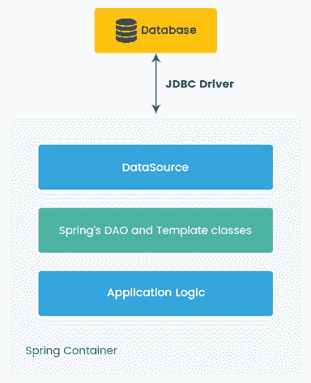
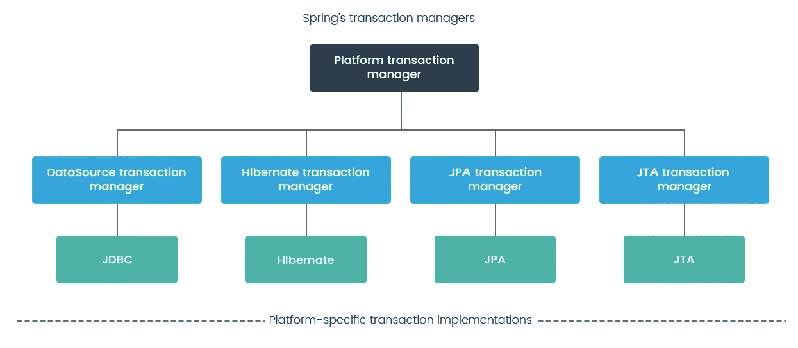
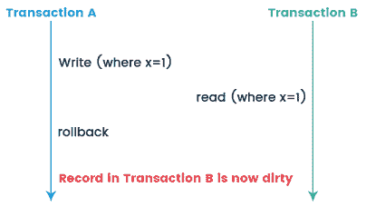
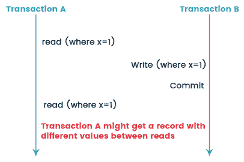
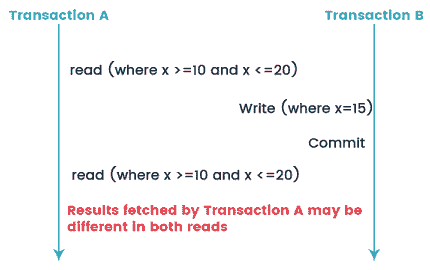

# 第五章：理解 Spring 数据库交互

在之前的章节中，我们学习了 Spring 核心特性，如**依赖注入**（DI）及其配置。我们还看到了如何利用 Spring **面向切面编程**（**AOP**）实现可重用的代码。我们学习了如何利用 Spring **模型-视图-控制器**（**MVC**）开发松耦合的 Web 应用程序，以及如何通过异步特性、多线程和认证缓存来优化 Spring MVC 实现以获得更好的结果。

在本章中，我们将学习 Spring 框架与数据库交互。数据库交互是应用程序性能中最大的瓶颈。Spring 框架支持所有主要的数据访问技术，如**Java 数据库连接**（**JDBC**）直接，任何**对象关系映射**（**ORM**）框架（如 Hibernate），**Java 持久化 API**（**JPA**）等。我们可以选择任何数据访问技术来持久化我们的应用程序数据。在这里，我们将探讨 Spring JDBC 的数据库交互。我们还将学习 Spring JDBC 的常见性能陷阱和最佳的数据库设计实践。然后我们将看一下 Spring 事务管理和最佳的连接池配置。

本章将涵盖以下主题：

+   Spring JDBC 配置

+   为了获得最佳性能的数据库设计

+   事务管理

+   使用`@Transactional`进行声明性 ACID

+   最佳的隔离级别

+   最佳的获取大小

+   最佳的连接池配置

+   Tomcat JDBC 连接池与 HikariCP

+   数据库设计最佳实践

# Spring JDBC 配置

如果不使用 JDBC，我们无法仅使用 Java 连接到数据库。JDBC 将以直接或间接的方式涉及到连接数据库。但是，如果 Java 程序员直接使用核心 JDBC，会面临一些问题。让我们看看这些问题是什么。

# 核心 JDBC 的问题

当我们使用核心 JDBC API 时，我们将面临以下问题：

```java
    String query = "SELECT COUNT(*) FROM ACCOUNT";

    try (Connection conn = dataSource.getConnection();
        Statement statement = conn.createStatement(); 
        ResultSet rsltSet = statement.executeQuery(query)) 
        {
        if(rsltSet.next()){ 
 int count = rsltSet.getInt(1); System.out.println("count : " + count);
        }
      } catch (SQLException e) {
        // TODO Auto-generated catch block
            e.printStackTrace();
      }      
  }
```

在前面的例子中，我已经突出显示了一些代码。只有粗体格式的代码是重要的；其余是冗余的代码。因此，我们必须每次都写这些冗余的代码来执行数据库操作。

让我们看看核心 JDBC 的其他问题：

+   JDBC API 异常是被检查的，这迫使开发人员处理错误，增加了应用程序的代码和复杂性

+   在 JDBC 中，我们必须关闭数据库连接；如果开发人员忘记关闭连接，那么我们的应用程序就会出现一些连接问题

# 使用 Spring JDBC 解决问题

为了克服核心 JDBC 的前述问题，Spring 框架提供了与 Spring JDBC 模块的出色数据库集成。Spring JDBC 提供了`JdbcTemplate`类，它帮助我们去除冗余代码，并且帮助开发人员只专注于 SQL 查询和参数。我们只需要配置`JdbcTemplate`与`dataSource`，并编写如下代码：

```java
jdbcTemplate = new JdbcTemplate(dataSource);
int count = jdbcTemplate.queryForObject("SELECT COUNT(*) FROM CUSTOMER", Integer.class);
```

正如我们在前面的例子中看到的，Spring 通过使用 JDBC 模板简化了处理数据库访问的过程。JDBC 模板在内部使用核心 JDBC 代码，并提供了一种新的高效的处理数据库的方式。与核心 JDBC 相比，Spring JDBC 模板具有以下优势：

+   JDBC 模板通过释放数据库连接自动清理资源

+   它将核心 JDBC 的`SQLException`转换为`RuntimeExceptions`，从而提供更好的错误检测机制

+   JDBC 模板提供了各种方法来直接编写 SQL 查询，因此节省了大量的工作和时间

以下图表显示了 Spring JDBC 模板的高级概述：



Spring JDBC 提供的用于访问数据库的各种方法如下：

+   `JdbcTemplate`

+   `NamedParameterJdbcTemplate`

+   `SimpleJdbcTemplate`

+   `SimpleJdbcInsert`

+   `SimpleJdbcCall`

# Spring JDBC 依赖项

Spring JDBC 依赖项在`pom.xml`文件中可用如下：

+   以下代码是 Spring JDBC 的依赖项：

```java
 <dependency>
   <groupId>org.springframework</groupId>
   <artifactId>spring-jdbc</artifactId>
   <version>${spring.framework.version}</version>
 </dependency>
```

+   以下代码是 PostgreSQL 依赖项：

```java
 <dependency>
   <groupId>org.postgresql</groupId>
   <artifactId>postgresql</artifactId>
   <version>42.2.1</version>
 </dependency>
```

在上面的代码中，我们分别指定了 Spring JDBC 和 PostgreSQL 的依赖项。其余的依赖项将由 Maven 自动解析。在这里，我正在使用 PostgreSQL 数据库进行测试，所以我添加了一个 PostgreSQL 依赖项。如果您使用其他 RDBMS，则应相应地更改依赖项。

# Spring JDBC 示例

在这个例子中，我们使用的是 PostgreSQL 数据库。表结构如下：

```java
CREATE TABLE account
(
  accountNumber numeric(10,0) NOT NULL, 
  accountName character varying(60) NOT NULL,
  CONSTRAINT accountNumber_key PRIMARY KEY (accountNumber)
)
WITH (
  OIDS=FALSE
);
```

我们将使用 DAO 模式进行 JDBC 操作，因此让我们创建一个 Java bean 来模拟我们的`Account`表：

```java
package com.packt.springhighperformance.ch5.bankingapp.model;

public class Account {
  private String accountName;
  private Integer accountNumber;

  public String getAccountName() {
    return accountName;
  }

  public void setAccountName(String accountName) {
    this.accountName = accountName;
  }

  public Integer getAccountNumber() {
    return accountNumber;
  }

  public void setAccountNumber(Integer accountNumber) {
    this.accountNumber = accountNumber;
  }
  @Override
  public String toString(){
    return "{accountNumber="+accountNumber+",accountName
    ="+accountName+"}";
  }
}
```

以下的`AccountDao`接口声明了我们要实现的操作：

```java
public interface AccountDao { 
    public void insertAccountWithJdbcTemplate(Account account);
    public Account getAccountdetails();    
}
```

Spring bean 配置类如下。对于 bean 配置，只需使用`@Bean`注解注释一个方法。当`JavaConfig`找到这样的方法时，它将执行该方法并将返回值注册为`BeanFactory`中的 bean。在这里，我们注册了`JdbcTemplate`、`dataSource`和`AccountDao` beans。

```java
@Configuration
public class AppConfig{
  @Bean
  public DataSource dataSource() {
    DriverManagerDataSource dataSource = new DriverManagerDataSource();
    // PostgreSQL database we are using...
    dataSource.setDriverClassName("org.postgresql.Driver");
    dataSource.setUrl("jdbc:postgresql://localhost:5432/TestDB");
    dataSource.setUsername("test");
    dataSource.setPassword("test");
    return dataSource;
  }

  @Bean
  public JdbcTemplate jdbcTemplate() {
    JdbcTemplate jdbcTemplate = new JdbcTemplate();
    jdbcTemplate.setDataSource(dataSource());
    return jdbcTemplate;
  }

  @Bean
  public AccountDao accountDao() {
    AccountDaoImpl accountDao = new AccountDaoImpl();
    accountDao.setJdbcTemplate(jdbcTemplate());
    return accountDao;
  }

}
```

在上一个配置文件中，我们创建了`DriverManagerDataSource`类的`DataSource`对象。这个类提供了一个我们可以使用的`DataSource`的基本实现。我们还将 PostgreSQL 数据库的 URL、用户名和密码作为属性传递给`dataSource` bean。此外，`dataSource` bean 设置为`AccountDaoImpl` bean，我们的 Spring JDBC 实现已经准备就绪。该实现是松散耦合的，如果我们想要切换到其他实现或移动到另一个数据库服务器，那么我们只需要在 bean 配置中进行更改。这是 Spring JDBC 框架提供的主要优势之一。

这是`AccountDAO`的实现，我们在这里使用 Spring 的`JdbcTemplate`类将数据插入表中：

```java
@Repository
public class AccountDaoImpl implements AccountDao {
  private static final Logger LOGGER = 
  Logger.getLogger(AccountDaoImpl.class);

  private JdbcTemplate jdbcTemplate;

  public void setJdbcTemplate(JdbcTemplate jdbcTemplate) {
    this.jdbcTemplate = jdbcTemplate;
  }

  @Override
  public void insertAccountWithJdbcTemplate(Account account) {
    String query = "INSERT INTO ACCOUNT (accountNumber,accountName) 
    VALUES (?,?)";

    Object[] inputs = new Object[] { account.getAccountNumber(), 
    account.getAccountName() };
    jdbcTemplate.update(query, inputs);
    LOGGER.info("Inserted into Account Table Successfully");
  }

  @Override
  public Account getAccountdetails() {
    String query = "SELECT accountNumber, accountName FROM ACCOUNT 
    ";
    Account account = jdbcTemplate.queryForObject(query, new 
    RowMapper<Account>(){
      public Account mapRow(ResultSet rs, int rowNum)
          throws SQLException {
            Account account = new Account();
            account.setAccountNumber(rs.getInt("accountNumber"));
            account.setAccountName(rs.getString("accountName")); 
            return account;
      }});
    LOGGER.info("Account Details : "+account);
    return account; 
  }
}
```

在上一个例子中，我们使用了`org.springframework.jdbc.core.JdbcTemplate`类来访问持久性资源。Spring 的`JdbcTemplate`是 Spring JDBC 核心包中的中心类，提供了许多方法来执行查询并自动解析`ResultSet`以获取对象或对象列表。

以下是上述实现的测试类：

```java
public class MainApp {

  public static void main(String[] args) throws SQLException {
    AnnotationConfigApplicationContext applicationContext = new                             
    AnnotationConfigApplicationContext(
    AppConfig.class);
    AccountDao accountDao = 
    applicationContext.getBean(AccountDao.class);
    Account account = new Account();
    account.setAccountNumber(101);
    account.setAccountName("abc");
    accountDao.insertAccountWithJdbcTemplate(account);
    accountDao.getAccountdetails();
    applicationContext.close();
  }
}
```

当我们运行上一个程序时，我们会得到以下输出：

```java
May 15, 2018 7:34:33 PM org.springframework.context.support.AbstractApplicationContext prepareRefresh
INFO: Refreshing org.springframework.context.annotation.AnnotationConfigApplicationContext@6d5380c2: startup date [Tue May 15 19:34:33 IST 2018]; root of context hierarchy
May 15, 2018 7:34:33 PM org.springframework.jdbc.datasource.DriverManagerDataSource setDriverClassName
INFO: Loaded JDBC driver: org.postgresql.Driver
2018-05-15 19:34:34 INFO AccountDaoImpl:36 - Inserted into Account Table Successfully
2018-05-15 19:34:34 INFO AccountDaoImpl:52 - Account Details : {accountNumber=101,accountName=abc}
May 15, 2018 7:34:34 PM org.springframework.context.support.AbstractApplicationContext doClose
INFO: Closing org.springframework.context.annotation.AnnotationConfigApplicationContext@6d5380c2: startup date [Tue May 15 19:34:33 IST 2018]; root of context hierarchy
```

# 为了实现最佳性能的数据库设计

现在，使用现代工具和流程设计数据库非常容易，但我们必须知道这是我们应用程序的一个非常关键的部分，它直接影响应用程序的性能。一旦应用程序实施了不准确的数据库设计，要修复它就太晚了。我们别无选择，只能购买昂贵的硬件来应对问题。因此，我们应该了解一些数据库表设计、数据库分区和良好索引的基本概念和最佳实践，这些可以提高我们应用程序的性能。让我们看看开发高性能数据库应用程序的基本规则和最佳实践。

# 表设计

表设计类型可以是规范化的或非规范化的，但每种类型都有其自身的好处。如果表设计是规范化的，意味着冗余数据被消除，数据以主键/外键关系逻辑存储，从而提高了数据完整性。如果表设计是非规范化的，意味着增加了数据冗余，并创建了表之间不一致的依赖关系。在非规范化类型中，查询的所有数据通常存储在表中的单行中；这就是为什么检索数据更快，提高了查询性能。在规范化类型中，我们必须在查询中使用连接来从数据库中获取数据，并且由于连接的存在，查询的性能受到影响。我们是否应该使用规范化或非规范化完全取决于我们应用的性质和业务需求。通常，为在线事务处理（OLTP）计划的数据库通常比为在线分析处理（OLAP）计划的数据库更规范化。从性能的角度来看，规范化通常用于需要更多的 INSERT/UPDATE/DELETE 操作的地方，而非规范化用于需要更多 READ 操作的地方。

# 表的垂直分区

在使用垂直分区时，我们将具有许多列的表分割为具有特定列的多个表。例如，我们不应该在很少查询的表中定义非常宽的文本或二进制大对象（BLOB）数据列，因为性能问题。这些数据必须放置在单独的表结构中，并且可以在查询的表中使用指针。

接下来是一个简单的示例，说明我们如何在 customer 表上使用垂直分区，并将二进制数据类型列 customer_Image 移入单独的表中：

```java
CREATE TABLE customer
(
  customer_ID numeric(10,0) NOT NULL, 
  accountName character varying(60) NOT NULL,
  accountNumber numeric(10,0) NOT NULL,
  customer_Image bytea
);
```

垂直分区数据如下：

```java
CREATE TABLE customer
(
  customer_Id numeric(10,0) NOT NULL, 
  accountName character varying(60) NOT NULL,
  accountNumber numeric(10,0) NOT NULL
);

CREATE TABLE customer_Image
(
  customer_Image_ID numeric(10,0) NOT NULL, 
  customer_Id numeric(10,0) NOT NULL, 
  customer_Image bytea
);
```

在 JPA/Hibernate 中，我们可以很容易地将前面的示例映射为表之间的延迟一对多关系。customer_Image 表的数据使用不频繁，因此我们可以将其设置为延迟加载。当客户端请求关系的特定列时，其数据将被检索。

# 使用索引

我们应该为大表上频繁使用的查询使用索引，因为索引功能是改善数据库模式读性能的最佳方式之一。索引条目以排序顺序存储，这有助于处理 GROUP BY 和 ORDER BY 子句。没有索引，数据库在查询执行时必须执行排序操作。通过索引，我们可以最小化查询执行时间并提高查询性能，但在创建表上的索引时，我们应该注意，也有一些缺点。

我们不应该在频繁更新的表上创建太多索引，因为在表上进行任何数据修改时，索引也会发生变化。我们应该在表上最多使用四到五个索引。如果表是只读的，那么我们可以添加更多索引而不必担心。

以下是为您的应用程序构建最有效索引的指南，对每个数据库都适用：

+   为了实现索引的最大效益，我们应该在适当的列上使用索引。索引应该用于那些在查询的 WHERE、ORDER BY 或 GROUP BY 子句中频繁使用的列。

+   始终选择整数数据类型列进行索引，因为它们比其他数据类型列提供更好的性能。保持索引小，因为短索引在 I/O 方面处理更快。

+   对于检索一系列行的查询，聚集索引通常更好。非聚集索引通常更适合点查询。

# 使用正确的数据类型

数据类型确定可以存储在数据库表列中的数据类型。当我们创建表时，应根据其存储需求为每个列定义适当的数据类型。例如，`SMALLINT`占用 2 个字节的空间，而`INT`占用 4 个字节的空间。当我们定义`INT`数据类型时，这意味着我们必须每次将所有 4 个字节存储到该列中。如果我们存储像 10 或 20 这样的数字，那么这是字节的浪费。这最终会使您的读取速度变慢，因为数据库必须读取磁盘的多个扇区。此外，选择正确的数据类型有助于我们将正确的数据存储到列中。例如，如果我们为列使用日期数据类型，则数据库不允许在不表示日期的列中插入任何字符串和数字数据。

# 定义列约束

列约束强制执行对表中可以插入/更新/删除的数据或数据类型的限制。约束的整个目的是在`UPDATE`/`DELETE`/`INSERT`到表中时维护数据完整性。但是，我们应该只在适当的地方定义约束；否则，我们将对性能产生负面影响。例如，定义`NOT NULL`约束在查询处理过程中不会产生明显的开销，但定义`CHECK`约束可能会对性能产生负面影响。

# 使用存储过程

通过使用存储过程在数据库服务器中处理数据来减少网络开销，以及通过在应用程序中缓存数据来减少访问次数，可以调整数据访问性能。

# 事务管理

数据库事务是任何应用程序的关键部分。数据库事务是一系列被视为单个工作单元的操作。这些操作应该完全完成或根本不产生任何效果。对操作序列的管理称为事务管理。事务管理是任何面向 RDBMS 的企业应用程序的重要部分，以确保数据完整性和一致性。事务的概念可以用四个关键属性来描述：原子性、一致性、隔离性和持久性（ACID）。

事务被描述为 ACID，代表以下内容：

+   原子性：事务应被视为单个操作单元，这意味着要么整个操作序列完成，要么根本不起作用

+   一致性：一旦事务完成并提交，那么您的数据和资源将处于符合业务规则的一致状态

+   隔离：如果同时处理同一数据集的许多事务，则每个事务应该与其他事务隔离开，以防止数据损坏

+   持久性：一旦事务完成，事务的结果将被写入持久存储，并且由于系统故障无法从数据库中删除

# 在 Spring 中选择事务管理器

Spring 提供了不同的事务管理器，基于不同的平台。这里，不同的平台意味着不同的持久性框架，如 JDBC、MyBatis、Hibernate 和 Java 事务 API（JTA）。因此，我们必须相应地选择 Spring 提供的事务管理器。

以下图表描述了 Spring 提供的特定于平台的事务管理：



Spring 支持两种类型的事务管理：

+   程序化：这意味着我们可以直接使用 Java 源代码编写我们的事务。这给了我们极大的灵活性，但很难维护。

+   声明性：这意味着我们可以通过使用 XML 以集中的方式或者通过使用注释以分布式的方式来管理事务。

# 使用@Transactional 声明性 ACID

强烈建议使用声明式事务，因为它们将事务管理从业务逻辑中分离出来，并且易于配置。让我们看一个基于注解的声明式事务管理的示例。

让我们使用在 Spring JDBC 部分中使用的相同示例。在我们的示例中，我们使用`JdbcTemplate`进行数据库交互。因此，我们需要在 Spring 配置文件中添加`DataSourceTransactionManager`。

以下是 Spring bean 配置类：

```java
@Configuration
@EnableTransactionManagement
public class AppConfig {
    @Bean
    public DataSource dataSource() {
        DriverManagerDataSource dataSource = new 
        DriverManagerDataSource(); 
        dataSource.setDriverClassName("org.postgresql.Driver");
        dataSource.setUrl("jdbc:postgresql:
        //localhost:5432/TestDB");
        dataSource.setUsername("test");
        dataSource.setPassword("test");
        return dataSource;
    }

    @Bean
    public JdbcTemplate jdbcTemplate() {
        JdbcTemplate jdbcTemplate = new JdbcTemplate();
        jdbcTemplate.setDataSource(dataSource());
        return jdbcTemplate;
    }

    @Bean
    public AccountDao accountDao(){
      AccountDaoImpl accountDao = new AccountDaoImpl();
      accountDao.setJdbcTemplate(jdbcTemplate());
      return accountDao;
    }

    @Bean
    public PlatformTransactionManager transactionManager() {
        DataSourceTransactionManager transactionManager = new                                             
        DataSourceTransactionManager();
        transactionManager.setDataSource(dataSource());
        return transactionManager;
    }

}
```

在之前的代码中，我们创建了一个`dataSource` bean。它用于创建`DataSource`对象。在这里，我们需要提供数据库配置属性，比如`DriverClassName`、`Url`、`Username`和`Password`。您可以根据您的本地设置更改这些值。

我们正在使用 JDBC 与数据库交互；这就是为什么我们创建了一个`transactionManager`类型为`org.springframework.jdbc.datasource.DataSourceTransactionManager`的 bean。

`@EnableTransactionManagement`注解用于在我们的 Spring 应用程序中启用事务支持。

以下是一个`AccountDao`实现类，用于在`Account`表中创建记录：

```java
@Repository
public class AccountDaoImpl implements AccountDao {
  private static final Logger LOGGER =             
  Logger.getLogger(AccountDaoImpl.class);  
  private JdbcTemplate jdbcTemplate; 

  public void setJdbcTemplate(JdbcTemplate jdbcTemplate) {
    this.jdbcTemplate = jdbcTemplate;
  }

  @Override
  @Transactional
  public void insertAccountWithJdbcTemplate(Account account) {
    String query = "INSERT INTO ACCOUNT (accountNumber,accountName) 
    VALUES (?,?)";    
    Object[] inputs = new Object[] { account.getAccountNumber(),                                 
    account.getAccountName() };
    jdbcTemplate.update(query, inputs);
    LOGGER.info("Inserted into Account Table Successfully");
    throw new RuntimeException("simulate Error condition");
  }
}
```

在前面的代码中，我们通过在`insertAccountWithJdbcTemplate()`方法上注释`@Transactional`提供了声明式事务管理。`@Transactional`注解可以用于方法，也可以用于类级别。在前面的代码中，我在插入`Account`后抛出了`RuntimeException`异常，以检查在生成异常后事务将如何回滚。

以下是用于检查我们的事务管理实现的`main`类：

```java
public class MainApp {

  private static final Logger LOGGER = Logger.getLogger(MainApp.class);

  public static void main(String[] args) throws SQLException {
    AnnotationConfigApplicationContext applicationContext = new 
    AnnotationConfigApplicationContext(
    AppConfig.class);

    AccountDao accountDao = 
    applicationContext.getBean(AccountDao.class); 
    Account account = new Account();
    account.setAccountNumber(202);
    account.setAccountName("xyz");
    accountDao.insertAccountWithJdbcTemplate(account); 
    applicationContext.close();
  }
}
```

现在，当我们运行上面的代码时，我们会得到以下输出：

```java
INFO: Loaded JDBC driver: org.postgresql.Driver
2018-04-09 23:24:09 INFO AccountDaoImpl:36 - Inserted into Account Table Successfully
Exception in thread "main" java.lang.RuntimeException: simulate Error condition at com.packt.springhighperformance.ch5.bankingapp.dao.Impl.AccountDaoImpl.insertAccountWithJdbcTemplate(AccountDaoImpl.java:37)
```

在前面的日志中，数据成功插入到`Account`表中。但是，如果您检查`Account`表，您将找不到一行数据，这意味着在`RuntimeException`之后事务完全回滚。Spring 框架仅在方法成功返回时才提交事务。如果出现异常，它将回滚整个事务。

# 最佳隔离级别

正如我们在前一节中学到的，事务的概念是用 ACID 描述的。事务隔离级别是一个概念，不仅适用于 Spring 框架，而且适用于与数据库交互的任何应用程序。隔离级别定义了一个事务对某个数据存储库所做的更改如何影响其他并发事务，以及更改的数据何时以及如何对其他事务可用。在 Spring 框架中，我们与`@Transaction`注解一起定义事务的隔离级别。

以下片段是一个示例，说明我们如何在事务方法中定义`隔离`级别：

```java
@Autowired
private AccountDao accountDao;

@Transactional(isolation=Isolation.READ_UNCOMMITTED)
public void someTransactionalMethod(User user) {

  // Interact with accountDao

} 
```

在上面的代码中，我们定义了一个具有`READ_UNCOMMITTED`隔离级别的事务方法。这意味着该方法中的事务是以该隔离级别执行的。

让我们在以下部分详细看一下每个`隔离`级别。

# 读取未提交

读取未提交是最低的隔离级别。这种隔离级别定义了事务可以读取其他事务仍未提交的数据，这意味着数据与表或查询的其他部分不一致。这种隔离级别确保了最快的性能，因为数据直接从表块中读取，不需要进一步处理、验证或其他验证；但可能会导致一些问题，比如脏读。

让我们看一下以下图表：



在上图中，**事务 A**写入数据；与此同时，**事务 B**在**事务 A**提交之前读取了相同的数据。后来，**事务 A**由于某些异常决定**回滚**。现在，**事务 B**中的数据是不一致的。在这里，**事务 B**运行在`READ_UNCOMMITTED`隔离级别，因此它能够在提交之前从**事务 A**中读取数据。

请注意，`READ_UNCOMMITTED`也可能会产生不可重复读和幻读等问题。当事务隔离级别选择为`READ_COMMITTED`时，就会出现不可重复读。

让我们详细看看`READ_COMMITTED`隔离级别。

# 读已提交

读已提交隔离级别定义了事务不能读取其他事务尚未提交的数据。这意味着脏读不再是一个问题，但可能会出现其他问题。

让我们看看以下的图表：



在这个例子中，**事务 A**读取了一些数据。然后，**事务 B**写入了相同的数据并提交。后来，**事务 A**再次读取相同的数据，可能会得到不同的值，因为**事务 B**已经对数据进行了更改并提交。这就是不可重复读。

请注意，`READ_COMMITTED`也可能会产生幻读等问题。幻读发生在选择`REPEATABLE_READ`作为事务隔离级别时。

让我们详细看看`REPEATABLE_READ`隔离级别。

# 可重复读

`REPEATABLE_READ`隔离级别定义了如果一个事务多次从数据库中读取一条记录，那么所有这些读取操作的结果必须相同。这种隔离有助于防止脏读和不可重复读等问题，但可能会产生另一个问题。

让我们看看以下的图表：



在这个例子中，**事务 A**读取了一段数据。与此同时，**事务 B**在相同的范围内插入了新数据，**事务 A**最初获取并提交了。后来，**事务 A**再次读取相同的范围，也会得到**事务 B**刚刚插入的记录。这就是幻读。在这里，**事务 A**多次从数据库中获取了一系列记录，并得到了不同的结果集。

# 可串行化

可串行化隔离级别是所有隔离级别中最高和最严格的。它可以防止脏读、不可重复读和幻读。事务在所有级别（读、范围和写锁定）上都会执行锁定，因此它们看起来就像是以串行方式执行的。在可串行化隔离中，我们将确保不会发生问题，但同时执行的事务会被串行执行，从而降低了应用程序的性能。

以下是隔离级别和读现象之间关系的总结：

| **级别** | **脏读** | **不可重复读** | **幻读** |
| --- | --- | --- | --- |
| `READ_UNCOMMITTED` | 是 | 是 | 是 |
| `READ_COMMITTED` | 否 | 是 | 是 |
| `REPEATABLE_READ` | 否 | 否 | 是 |
| `SERIALIZABLE` | 否 | 否 | 否 |

如果隔离级别没有被明确设置，那么事务将使用默认的隔离级别，根据相关数据库的设置。

# 最佳的获取大小

应用程序与数据库服务器之间的网络流量是应用程序性能的关键因素之一。如果我们能减少流量，将有助于提高应用程序的性能。获取大小是一次从数据库中检索的行数。它取决于 JDBC 驱动程序。大多数 JDBC 驱动程序的默认获取大小为 10。在正常的 JDBC 编程中，如果要检索 1000 行，那么您将需要在应用程序和数据库服务器之间进行 100 次网络往返以检索所有行。这将增加网络流量，也会影响性能。但是，如果我们将获取大小设置为 100，那么网络往返的次数将为 10。这将极大地提高您的应用程序性能。

许多框架，如 Spring 或 Hibernate，为您提供非常方便的 API 来执行此操作。如果我们不设置获取大小，那么它将采用默认值并提供较差的性能。

以下是使用标准 JDBC 调用设置`FetchSize`的方法：

```java
PreparedStatement stmt = null;
ResultSet rs = null;

try 
{
  stmt = conn. prepareStatement("SELECT a, b, c FROM TABLE");
  stmt.setFetchSize(200);

  rs = stmt.executeQuery();
  while (rs.next()) {
    ...
  }
}
```

在上述代码中，我们可以在每个`Statement`或`PreparedStatement`上设置获取大小，甚至在`ResultSet`上设置。默认情况下，`ResultSet`使用`Statement`的获取大小；`Statement`和`PreparedStatement`使用特定 JDBC 驱动程序的获取大小。

我们还可以在 Spring 的`JdbcTemplate`中设置`FetchSize`：

```java
JdbcTemplate jdbc = new JdbcTemplate(dataSource);
jdbc.setFetchSize(200);
```

设置获取大小时应考虑以下几点：

+   确保您的 JDBC 驱动程序支持配置获取大小。

+   获取大小不应该是硬编码的；保持可配置，因为它取决于 JVM 堆内存大小，在不同环境中会有所不同

+   如果获取的大小很大，应用程序可能会遇到内存不足的问题

# 最佳连接池配置

JDBC 在访问数据库时使用连接池。**连接池**类似于任何其他形式的对象池。连接池通常涉及很少或没有代码修改，但它可以在应用程序性能方面提供显着的好处。数据库连接在创建时执行各种任务，例如在数据库中初始化会话、执行用户身份验证和建立事务上下文。创建连接不是零成本的过程；因此，我们应该以最佳方式创建连接，并减少对性能的影响。连接池允许重用物理连接，并最小化创建和关闭会话的昂贵操作。此外，对于数据库管理系统来说，维护许多空闲连接是昂贵的，连接池可以优化空闲连接的使用或断开不再使用的连接。

为什么连接池有用？以下是一些原因：

+   频繁打开和关闭连接可能很昂贵；最好进行缓存和重用。

+   我们可以限制对数据库的连接数。这将阻止在连接可用之前访问连接。这在分布式环境中特别有帮助。

+   根据我们的需求，我们可以为常见操作使用多个连接池。我们可以为 OLAP 设计一个连接池，为 OLAP 设计另一个连接池，每个连接池都有不同的配置。

在本节中，我们将看到最佳的连接池配置是什么，以帮助提高性能。

以下是用于 PostgreSQL 的简单连接池配置：

```java
<Resource type="javax.sql.DataSource"
            name="jdbc/TestDB"
            factory="org.apache.tomcat.jdbc.pool.DataSourceFactory"
            driverClassName="org.postgresql.Driver"
            url="jdbc:postgresql://localhost:5432/TestDB"
            username="test"
            password="test"
/>
```

# 调整连接池的大小

我们需要使用以下属性来调整连接池的大小：

+   `initialSize`：`initialSize`属性定义了连接池启动时将建立的连接数。

+   `maxActive`：`maxActive`属性可用于限制与数据库建立的最大连接数。

+   `maxIdle`：`maxIdeal`属性用于始终保持池中空闲连接的最大数量。

+   `minIdle`：`minIdeal`属性用于始终保持池中空闲连接的最小数量。

+   `timeBetweenEvictionRunsMillis`：验证/清理线程每隔`timeBetweenEvictionRunsMillis`毫秒运行一次。这是一个后台线程，可以测试空闲的废弃连接，并在池处于活动状态时调整池的大小。该线程还负责检测连接泄漏。此值不应设置为低于 1 秒。

+   `minEvictableIdleTimeMillis`：对象在池中空闲的最短时间。

# 验证连接

设置此配置的优势是无效的连接永远不会被使用，并且有助于防止客户端错误。此配置的缺点是性能会有一些损失，因为要验证连接，需要向数据库发送一次往返的查询来检查会话是否仍然活动。验证是通过向服务器发送一个小查询来完成的，但此查询的成本可能较低。

用于验证连接的配置参数如下：

+   `testOnBorrow`：当定义`testOnBorrow`属性为 true 时，在使用连接对象之前会对其进行验证。如果验证失败，连接对象将被放回池中，然后选择另一个连接对象。在这里，我们需要确保`validationQuery`属性不为空；否则，配置不会产生任何效果。

+   `validationInterval`：`validationInterval`属性定义验证连接的频率。它不应超过 34 秒。如果设置一个较大的值，将提高应用程序的性能，但也会增加应用程序中存在陈旧连接的机会。

+   `validationQuery`：在将连接发送到服务请求之前，使用`SELECT 1` PostgreSQL 查询来验证连接池中的连接。

# 连接泄漏

以下配置设置可以帮助我们检测连接泄漏：

+   `removeAbandoned`：此标志应为 true。这意味着如果连接超过`removeAbandonedTimeout`，则会删除废弃的连接。

+   `removeAbandonedTimeout`：以秒为单位。如果连接运行时间超过`removeAbandonedTimeout`，则认为连接已被废弃。该值取决于应用程序中运行时间最长的查询。

因此，为了获得最佳的池大小，我们需要修改我们的配置以满足以下条件之一：

```java
<Resource type="javax.sql.DataSource"
            name="jdbc/TestDB"
            factory="org.apache.tomcat.jdbc.pool.DataSourceFactory"
            driverClassName="org.postgresql.Driver"
            url="jdbc:postgresql://localhost:5432/TestDB"
            username="test"
            password="test"
            initialSize="10"
            maxActive="100"
            maxIdle="50"
            minIdle="10"
            suspectTimeout="60"
            timeBetweenEvictionRunsMillis="30000"
            minEvictableIdleTimeMillis="60000"
            testOnBorrow="true"
            validationInterval="34000"
            validationQuery="SELECT 1"
            removeAbandoned="true"
            removeAbandonedTimeout="60"
            logAbandoned="true"
/>
```

# Tomcat JDBC 连接池与 HikariCP

有许多开源连接池库可用，如 C3P0、Apache Commons DBCP、BoneCP、Tomcat、Vibur 和 Hikari。但要使用哪一个取决于某些标准。以下标准将帮助决定使用哪个连接池。

# 可靠性

性能总是很好，但是库的可靠性总是比性能更重要。我们不应该选择一个性能更高但不可靠的库。在选择库时应考虑以下事项：

+   它被广泛使用吗？

+   代码是如何维护的？

+   库中尚未解决的 bug 数量。

+   开发者和用户的社区。

+   库的开发活跃程度如何？

# 性能

性能也被视为重要标准。库的性能取决于其配置方式以及测试环境。我们需要确保我们选择的库在我们自己的环境中，以我们自己的配置具有良好的性能。

# 功能

查看库提供的功能也很重要。我们应该检查所有参数，还要检查参数的默认值（如果我们没有提供）。此外，我们需要查看一些连接策略，如自动提交、隔离级别和语句缓存。

# 易用性

使用库时如何轻松配置连接池也很重要。此外，它应该有良好的文档和经常更新。

以下表列出了 Tomcat JDBC 连接池和 HikariCP 之间的区别：

| **Tomcat JDBC** | **HikariCP** |
| --- | --- |
| 默认情况下不在`getConnection()`上测试连接。 | 在`getConnection()`上测试连接。 |
| 不关闭被遗弃的打开语句。 | 跟踪并关闭被遗弃的连接。 |
| 默认情况下不重置连接池中连接的自动提交和事务级别；用户必须配置自定义拦截器来执行此操作。 | 重置自动提交、事务隔离和只读状态。 |
| 不使用池准备语句属性。 | 我们可以使用池准备语句属性。 |
| 默认情况下不在连接返回到池中执行`rollback()`。 | 默认情况下在连接返回到池中执行`rollback()`。 |

# 数据库交互最佳实践

本节列出了开发人员在开发任何应用程序时应该注意的一些基本规则。不遵循这些规则将导致性能不佳的应用程序。

# 使用 Statement 与 PreparedStatement 与 CallableStatement

选择`Statement`、`PreparedStatement`和`CallableStatement`接口之间的区别；这取决于你计划如何使用接口。`Statement`接口针对单次执行 SQL 语句进行了优化，而`PreparedStatement`对象针对将被多次执行的 SQL 语句进行了优化，`CallableStatement`通常用于执行存储过程：

+   `Statement`：`PreparedStatement`用于执行普通的 SQL 查询。当特定的 SQL 查询只需执行一次时，它是首选的。该接口的性能非常低。

+   `PreparedStatement`：`PreparedStatement`接口用于执行参数化或动态 SQL 查询。当特定查询需要多次执行时，它是首选的。该接口的性能优于`Statement`接口（用于多次执行相同查询时）。

+   `CallableStatement`：当要执行存储过程时，首选`CallableStatement`接口。该接口的性能很高。

# 使用批处理而不是 PreparedStatement

向数据库插入大量数据通常是通过准备一个`INSERT`语句并多次执行该语句来完成的。这会增加 JDBC 调用的次数并影响性能。为了减少 JDBC 调用的次数并提高性能，可以使用`PreparedStatement`对象的`addBatch`方法一次向数据库发送多个查询。

让我们看下面的例子：

```java
PreparedStatement ps = conn.prepareStatement(
"INSERT INTO ACCOUNT VALUES (?, ?)");
for (n = 0; n < 100; n++) {
    ps.setInt(accountNumber[n]);
    ps.setString(accountName[n]);
    ps.executeUpdate();
}
```

在前面的例子中，`PreparedStatement`用于多次执行`INSERT`语句。为了执行前面的`INSERT`操作，需要 101 次网络往返：一次是为了准备语句，其余 100 次是为了执行`INSERT` SQL 语句。因此，插入和更新大量数据实际上会增加网络流量，并因此影响性能。

让我们看看如何通过使用“批处理”来减少网络流量并提高性能：

```java
PreparedStatement ps = conn.prepareStatement(
"INSERT INTO ACCOUNT VALUES (?, ?)");
for (n = 0; n < 100; n++) {
    ps.setInt(accountNumber[n]);
    ps.setString(accountName[n]);
    ps.addBatch();
}
ps.executeBatch();
```

在前面的例子中，我使用了`addBatch()`方法。它将所有 100 个`INSERT` SQL 语句合并并仅使用两次网络往返来执行整个操作：一次是为了准备语句，另一次是为了执行合并的 SQL 语句批处理。

# 最小化数据库元数据方法的使用

尽管几乎没有 JDBC 应用程序可以在没有数据库元数据方法的情况下编写，但与其他 JDBC 方法相比，数据库元数据方法很慢。当我们使用元数据方法时，`SELECT`语句会使数据库进行两次往返：一次是为了元数据，另一次是为了数据。这是非常耗费性能的。我们可以通过最小化元数据方法的使用来提高性能。

应用程序应该缓存所有元数据，因为它们不会改变，所以不需要多次执行。

# 有效使用 get 方法

JDBC 提供了不同类型的方法来从结果集中检索数据，如`getInt`，`getString`和`getObject`；`getObject`方法是通用的，可以用于所有数据类型。但是，我们应该始终避免使用`getObject`，因为它的性能比其他方法差。当我们使用`getObject`获取数据时，JDBC 驱动程序必须执行额外的处理来确定正在获取的值的类型，并生成适当的映射。我们应该始终使用特定数据类型的方法；这比使用`getObject`等通用方法提供更好的性能。

我们还可以通过使用列号而不是列名来提高性能；例如，`getInt(1)`，`getString(2)`和`getLong(3)`。如果我们使用列名而不是列号（例如，`getString("accountName")`），那么数据库驱动程序首先将列名转换为大写（如果需要），然后将`accountName`与结果集中的所有列进行比较。这个处理时间直接影响性能。我们应该通过使用列号来减少处理时间。

# 避免连接池的时机

在某些类型的应用程序上使用连接池肯定会降低性能。如果您的应用程序具有以下任何特征，则不适合连接池：

+   如果一个应用程序每天重新启动多次，我们应该避免连接池，因为根据连接池的配置，每次启动应用程序时都可能会填充连接，这将导致前期性能损失。

+   如果您有单用户应用程序，比如只生成报告的应用程序（在这种类型的应用程序中，用户每天只使用应用程序三到四次，用于生成报告），则应避免连接池。与与连接池相关的数据库连接相比，每天建立数据库连接的内存利用率较低。在这种情况下，配置连接池会降低应用程序的整体性能。

+   如果一个应用程序只运行批处理作业，则使用连接池没有任何优势。通常，批处理作业是在一天、一个月或一年的结束时运行，在性能不那么重要的时候运行。

# 谨慎选择提交模式

当我们提交事务时，数据库服务器必须将事务所做的更改写入数据库。这涉及昂贵的磁盘输入/输出和驱动程序需要通过套接字发送请求。

在大多数标准 API 中，默认的提交模式是自动提交。在自动提交模式下，数据库对每个 SQL 语句（如`INSERT`，`UPDATE`，`DELETE`和`SELECT`语句）执行提交。数据库驱动程序在每个 SQL 语句操作后向数据库发送提交请求。这个请求需要一个网络往返。即使 SQL 语句的执行对数据库没有做出任何更改，也会发生与数据库的往返。例如，即使执行`SELECT`语句，驱动程序也会进行网络往返。自动提交模式通常会影响性能，因为需要大量的磁盘输入/输出来提交每个操作。

因此，我们将自动提交模式设置为关闭，以提高应用程序的性能，但保持事务活动也是不可取的。保持事务活动可能会通过长时间持有行锁并阻止其他用户访问行来降低吞吐量。以允许最大并发性的间隔提交事务。

将自动提交模式设置为关闭并进行手动提交对于某些应用程序也是不可取的。例如，考虑一个银行应用程序，允许用户将资金从一个账户转移到另一个账户。为了保护这项工作的数据完整性，需要在更新两个账户的新金额后提交交易。

# 摘要

在本章中，我们清楚地了解了 Spring JDBC 模块，并学习了 Spring JDBC 如何帮助我们消除在核心 JDBC 中使用的样板代码。我们还学习了如何设计我们的数据库以获得最佳性能。我们看到了 Spring 事务管理的各种好处。我们学习了各种配置技术，如隔离级别、获取大小和连接池，这些技术可以提高我们应用程序的性能。最后，我们看了数据库交互的最佳实践，这可以帮助我们提高应用程序的性能。

在下一章中，我们将看到使用 ORM 框架（如 Hibernate）进行数据库交互，并学习 Spring 中的 Hibernate 配置、常见的 Hibernate 陷阱和 Hibernate 性能调优。
