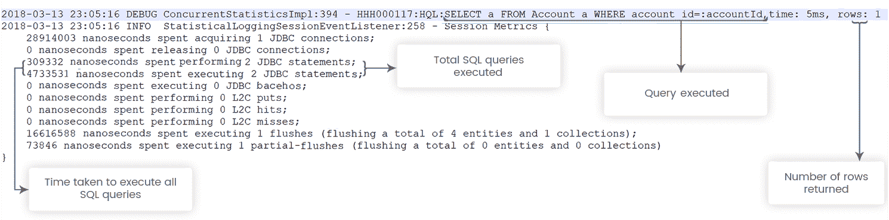
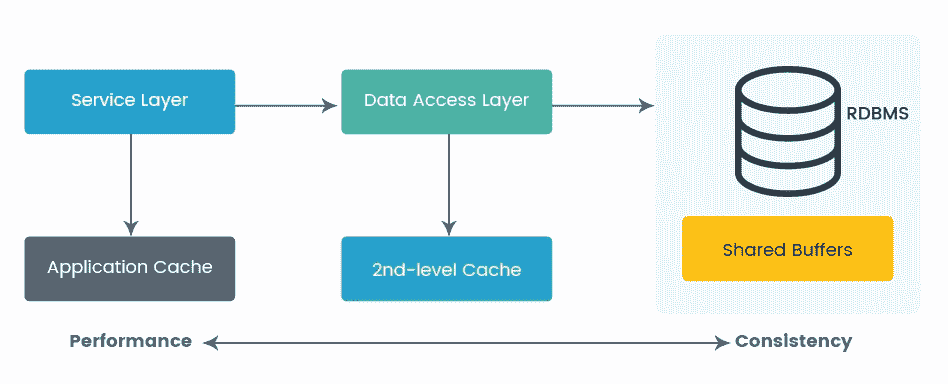

# 第六章：Hibernate 性能调优和缓存

在上一章中，我们学习了如何使用 JDBC 在我们的应用程序中访问数据库。我们学习了如何优化设计我们的数据库、事务管理和连接池，以获得应用程序的最佳性能。我们还学习了如何通过使用 JDBC 中的准备语句来防止 SQL 注入。我们看到了如何通过使用 JDBC 模板来消除传统的管理事务、异常和提交的样板代码。

在本章中，我们将向一些高级的访问数据库的方式迈进，使用**对象关系映射**（**ORM**）框架，比如 Hibernate。我们将学习如何通过使用 ORM 以最佳的方式改进数据库访问。通过 Spring Data，我们可以进一步消除实现**数据访问对象**（**DAO**）接口的样板代码。

本章我们将学习以下主题：

+   Spring Hibernate 和 Spring Data 简介

+   Spring Hibernate 配置

+   常见的 Hibernate 陷阱

+   Hibernate 性能调优

# Spring Hibernate 和 Spring Data 简介

正如我们在之前的章节中看到的，**Java 数据库连接**（**JDBC**）暴露了一个 API，隐藏了特定于数据库供应商的通信。然而，它存在以下限制：

+   即使对于琐碎的任务，JDBC 开发也非常冗长

+   JDBC 批处理需要特定的 API，不是透明的

+   JDBC 不提供内置支持显式锁定和乐观并发控制

+   需要显式处理事务，并且有很多重复的代码

+   连接查询需要额外的处理来将`ResultSet`转换为领域模型，或者**数据传输对象**（**DTO**）

几乎所有 JDBC 的限制都被 ORM 框架所覆盖。ORM 框架提供对象映射、延迟加载、急切加载、资源管理、级联、错误处理和其他数据访问层的服务。其中一个 ORM 框架是 Hibernate。**Spring Data**是由 Spring 框架实现的一层，用于提供样板代码并简化应用程序中使用的不同类型的持久性存储的访问。让我们在接下来的章节中看一下 Spring Hibernate 和 Spring Data 的概述。

# Spring Hibernate

Hibernate 起源于 EJB 的复杂性和性能问题。Hibernate 提供了一种抽象 SQL 的方式，并允许开发人员专注于持久化对象。作为 ORM 框架，Hibernate 帮助将对象映射到关系数据库中的表。Hibernate 在引入时有自己的标准，代码与其标准实现紧密耦合。因此，为了使持久性通用化并且与供应商无关，**Java 社区进程**（**JCP**）制定了一个名为**Java 持久化 API**（**JPA**）的标准化 API 规范。所有 ORM 框架都开始遵循这一标准，Hibernate 也是如此。

Spring 并没有实现自己的 ORM；但是，它支持任何 ORM 框架，比如 Hibernate、iBatis、JDO 等。通过 ORM 解决方案，我们可以轻松地将数据持久化并以**普通的 Java 对象**（**POJO**）的形式从关系数据库中访问。Spring 的 ORM 模块是 Spring JDBC DAO 模块的扩展。Spring 还提供了 ORM 模板，比如我们在第五章中看到的基于 JDBC 的模板，*理解 Spring 数据库交互*。

# Spring Data

正如我们所知，在过去几年中，非结构化和非关系型数据库（称为 NoSQL）变得流行。通过 Spring JPA，与关系数据库交流变得容易；那么，我们如何与非关系型数据库交流？Spring 开发了一个名为 Spring Data 的模块，以提供一种通用的方法来与各种数据存储进行交流。

由于每种持久性存储都有不同的连接和检索/更新数据的方式，Spring Data 提供了一种通用的方法来从每个不同的存储中访问数据。

Spring Data 的特点如下：

+   通过各种存储库轻松集成多个数据存储。Spring Data 为每个数据存储提供了通用接口，以存储库的形式。

+   根据存储库方法名称提供的约定解析和形成查询的能力。这减少了需要编写的代码量来获取数据。

+   基本的审计支持，例如由用户创建和更新。

+   与 Spring 核心模块完全集成。

+   与 Spring MVC 集成，通过 Spring Data REST 模块公开**REpresentational State Transfer** (**REST**)控制器。

以下是 Spring Data 存储库的一个小示例。我们不需要实现此方法来编写查询并按 ID 获取帐户；Spring Data 将在内部完成：

```java
public interface AccountRepository extends CrudRepository<Account, Long> {
   Account findByAccountId(Long accountId);
}
```

# Spring Hibernate 配置

我们知道 Hibernate 是一个持久性框架，它提供了对象和数据库表之间的关系映射，并且具有丰富的功能来提高性能和资源的最佳使用，如缓存、急切和延迟加载、事件监听器等。

Spring 框架提供了完整的支持，以集成许多持久性 ORM 框架，Hibernate 也是如此。在这里，我们将看到 Spring 与 JPA，使用 Hibernate 作为持久性提供程序。此外，我们将看到 Spring Data 与使用 Hibernate 的 JPA 存储库。

# 使用 Hibernate 的 Spring 与 JPA

正如我们所知，JPA 不是一个实现；它是持久性的规范。Hibernate 框架遵循所有规范，并且还具有其自己的附加功能。在应用程序中使用 JPA 规范使我们可以在需要时轻松切换持久性提供程序。

要单独使用 Hibernate 需要`SessionFactory`，要使用 Hibernate 与 JPA 需要`EntityManager`。我们将使用 JPA，以下是基于 Spring 的 Hibernate JPA 配置：

```java
@Configuration
@EnableTransactionManagement
@PropertySource({ "classpath:persistence-hibernate.properties" })
@ComponentScan({ "com.packt.springhighperformance.ch6.bankingapp" })
public class PersistenceJPAConfig {

  @Autowired
  private Environment env;

  @Bean
  public LocalContainerEntityManagerFactoryBean entityManagerFactory() {
    LocalContainerEntityManagerFactoryBean em = new 
    LocalContainerEntityManagerFactoryBean();
    em.setDataSource(dataSource());
    em.setPackagesToScan(new String[] { 
    "com.packt.springhighperformance
    .ch6.bankingapp.model" });

    JpaVendorAdapter vendorAdapter = new HibernateJpaVendorAdapter();
    em.setJpaVendorAdapter(vendorAdapter);
    em.setJpaProperties(additionalProperties());

    return em;
  }

  @Bean
  public BeanPostProcessor persistenceTranslation() {
    return new PersistenceExceptionTranslationPostProcessor();
  }

  @Bean
  public DataSource dataSource() {
    DriverManagerDataSource dataSource = new DriverManagerDataSource();
    dataSource.setDriverClassName(this.env.get
    Property("jdbc.driverClassName"));
    dataSource.setUrl(this.env.getProperty("jdbc.url"));
    dataSource.setUsername(this.env.getProperty("jdbc.user"));
    dataSource.setPassword(this.env.getProperty("jdbc.password"));
    return dataSource;
  }

  @Bean
  public PlatformTransactionManager 
  transactionManager(EntityManagerFactory emf) {
      JpaTransactionManager transactionManager = new         
      JpaTransactionManager();
      transactionManager.setEntityManagerFactory(emf);
      return transactionManager;
  }

  @Bean
  public PersistenceExceptionTranslationPostProcessor 
    exceptionTranslation() {
    return new PersistenceExceptionTranslationPostProcessor();
  }

  private Properties additionalProperties() {
    Properties properties = new Properties();
    properties.setProperty("hibernate.hbm2ddl.auto", 
    this.env.getProperty("hibernate.hbm2ddl.auto"));
    properties.setProperty("hibernate.dialect", 
    this.env.getProperty("hibernate.dialect"));
    properties.setProperty("hibernate.generate_statistics", 
    this.env.getProperty("hibernate.generate_statistics"));
    properties.setProperty("hibernate.show_sql", 
    this.env.getProperty("hibernate.show_sql"));
    properties.setProperty("hibernate.cache.use_second_level_cache", 
    this.env.getProperty("hibernate.cache.use_second_level_cache"));
    properties.setProperty("hibernate.cache.use_query_cache", 
    this.env.getProperty("hibernate.cache.use_query_cache"));
    properties.setProperty("hibernate.cache.region.factory_class", 
    this.env.getProperty("hibernate.cache.region.factory_class"));

    return properties;
  }
}
```

在前面的配置中，我们使用`LocalContainerEntityManagerFactoryBean`类配置了`EntityManager`。我们设置了`DataSource`来提供数据库的位置信息。由于我们使用的是 JPA，这是一个由不同供应商遵循的规范，我们通过设置`HibernateJpaVendorAdapter`和设置特定供应商的附加属性来指定我们在应用程序中使用的供应商。

既然我们已经在应用程序中配置了基于 JPA 的 ORM 框架，让我们看看在使用 ORM 时如何在应用程序中创建 DAO。

以下是`AbstractJpaDAO`类，具有所有 DAO 所需的基本公共方法：

```java
public abstract class AbstractJpaDAO<T extends Serializable> {

    private Class<T> clazz;

    @PersistenceContext
    private EntityManager entityManager;

    public final void setClazz(final Class<T> clazzToSet) {
        this.clazz = clazzToSet;
    }

    public T findOne(final Integer id) {
        return entityManager.find(clazz, id);
    }

    @SuppressWarnings("unchecked")
    public List<T> findAll() {
        return entityManager.createQuery("from " + 
        clazz.getName()).getResultList();
    }

    public void create(final T entity) {
        entityManager.persist(entity);
    }

    public T update(final T entity) {
        return entityManager.merge(entity);
    }

    public void delete(final T entity) {
        entityManager.remove(entity);
    }

    public void deleteById(final Long entityId) {
        final T entity = findOne(entityId);
        delete(entity);
    }
}
```

以下是`AccountDAO`类，管理与`Account`实体相关的方法：

```java
@Repository
public class AccountDAO extends AbstractJpaDAO<Account> implements IAccountDAO {

  public AccountDAO() {
    super();
    setClazz(Account.class);
  }
}
```

前面的 DAO 实现示例非常基本，这通常是我们在应用程序中做的。如果 DAO 抛出诸如`PersistenceException`之类的异常，而不是向用户显示异常，我们希望向最终用户显示正确的可读消息。为了在发生异常时提供可读的消息，Spring 提供了一个翻译器，我们需要在我们的配置类中定义如下：

```java
@Bean
  public BeanPostProcessor persistenceTranslation() {
    return new PersistenceExceptionTranslationPostProcessor();
  }
```

当我们用`@Repository`注解我们的 DAO 时，`BeanPostProcessor`命令会起作用。`PersistenceExceptionTranslationPostProcessor` bean 将作为对使用`@Repository`注解的 bean 的顾问。请记住，我们在第三章中学习了关于建议的内容，*调整面向方面的编程*。在受到建议时，它将重新抛出在代码中捕获的 Spring 特定的未检查数据访问异常。

因此，这是使用 Hibernate 的 Spring JPA 的基本配置。现在，让我们看看 Spring Data 配置。

# Spring Data 配置

正如我们在介绍中学到的，Spring Data 提供了连接不同数据存储的通用方法。Spring Data 通过 `Repository` 接口提供基本的抽象。Spring Data 提供的基本存储库如下：

+   `CrudRepository` 提供基本的 CRUD 操作

+   `PagingAndSortingRepository` 提供了对记录进行分页和排序的方法

+   `JpaRepository` 提供了与 JPA 相关的方法，如批量刷新和插入/更新/删除等

在 Spring Data 中，`Repository` 消除了 DAO 和模板的实现，如 `HibernateTemplate` 或 `JdbcTemplate`。Spring Data 是如此抽象，以至于我们甚至不需要为基本的 CRUD 操作编写任何方法实现；我们只需要基于 `Repository` 定义接口，并为方法定义适当的命名约定。Spring Data 将负责根据方法名创建查询，并将其执行到数据库中。

Spring Data 的 Java 配置与我们在使用 Hibernate 的 Spring JPA 中看到的相同，只是添加了定义存储库。以下是声明存储库到配置的片段：

```java
@Configuration
@EnableTransactionManagement
@PropertySource({ "classpath:persistence-hibernate.properties" })
@ComponentScan({ "com.packt.springhighperformance.ch6.bankingapp" })
 @EnableJpaRepositories(basePackages = "com.packt.springhighperformance.ch6.bankingapp.repository")
public class PersistenceJPAConfig {

}
```

在本章中，我们不会深入探讨 Hibernate 和 Spring Data 特定的开发。但是，我们将深入探讨在我们的应用程序中不适当使用 Hibernate 或 JPA 以及正确配置时所面临的问题，并提供解决问题的解决方案，以及实现高性能的最佳实践。让我们看看在我们的应用程序中使用 Hibernate 时常见的问题。

# 常见的 Hibernate 陷阱

JPA 和 Hibernate ORM 是大多数 Java 应用中使用的最流行的框架，用于与关系数据库交互。它们的流行度增加是因为它们使用面向对象域和底层关系数据库之间的映射来抽象数据库交互，并且非常容易实现简单的 CRUD 操作。

在这种抽象下，Hibernate 使用了许多优化，并将所有数据库交互隐藏在其 API 后面。通常情况下，我们甚至不知道 Hibernate 何时会执行 SQL 语句。由于这种抽象，很难找到低效和潜在性能问题。让我们看看我们应用中常见的 Hibernate 问题。

# Hibernate n + 1 问题

在使用 JPA 和 Hibernate 时，获取类型对应用程序的性能产生了很大影响。我们应该始终获取我们需要满足给定业务需求的数据。为此，我们将关联实体的 `FetchType` 设置为 `LAZY`。当我们将这些关联实体的获取类型设置为 `LAZY` 时，我们在我们的应用程序中实现了嵌套查询，因为我们不知道在 ORM 框架提供的抽象下这些关联是如何获取的。嵌套查询只是两个查询，其中一个是外部或主查询（从表中获取结果），另一个是针对主查询的每一行结果执行的（从其他表中获取相应或相关数据）。

以下示例显示了我们无意中实现了嵌套查询的情况：

```java
Account account = this.em.find(Account.class, accountNumber);
List<Transaction> lAccountTransactions = account.getTransaction();
for(Transaction transaction : lAccountTransactions){
  //.....
}
```

大多数情况下，开发人员倾向于编写像前面的示例一样的代码，并且不会意识到像 Hibernate 这样的 ORM 框架可能在内部获取数据。在这里，像 Hibernate 这样的 ORM 框架执行一个查询来获取 `account`，并执行第二个查询来获取该 `account` 的交易。两个查询是可以接受的，并且不会对性能产生太大影响。这两个查询是针对实体中的一个关联。

假设我们在`Account`实体中有五个关联：`Transactions`，`UserProfile`，`Payee`等等。当我们尝试从`Account`实体中获取每个关联时，框架会为每个关联执行一个查询，导致 1 + 5 = 6 个查询。六个查询不会有太大影响，对吧？这些查询是针对一个用户的，那么如果我们的应用程序的并发用户数量是 100 呢？那么我们将有 100 * (1 + 5) = 600 个查询。现在，这将对性能产生影响。在获取`Account`时的这 1 + 5 个查询被称为 Hibernate 中的**n + 1**问题。在本章的*Hibernate 性能调优*部分，我们将看到一些避免这个问题的方法。

# 在视图中打开会话的反模式

我们在前面的部分中看到，为了推迟获取直到需要关联实体时，我们将关联实体的获取类型设置为`LAZY`。当我们在呈现层尝试访问这些关联实体时（如果它们在我们的业务（服务）层中没有被初始化），Hibernate 会抛出一个异常，称为`LazyInitializationException`。当服务层方法完成执行时，Hibernate 提交事务并关闭会话。因此，在呈现视图时，活动会话不可用于获取关联实体。

为了避免`LazyInitializationException`，其中一个解决方案是在视图中保持一个开放的会话。这意味着我们在视图中保持 Hibernate 会话处于打开状态，以便呈现层可以获取所需的关联实体，然后关闭会话。

为了启用这个解决方案，我们需要向我们的应用程序添加一个 web 过滤器。如果我们只使用 Hibernate，我们需要添加`filter`，`OpenSessionInViewFilter`；如果我们使用 JPA，那么我们需要添加`filter` `OpenEntityManagerInViewFilter`。由于在本章中我们使用的是 JPA 与 Hibernate，以下是添加`filter`的片段：

```java
<filter>
    <filter-name>OpenEntityManagerInViewFilter</filter-name>
    <filter-class>org.springframework.orm.jpa.support.OpenEntityManagerInViewFilter</filter-class>
   ....
</filter>
...
<filter-mapping>
    <filter-name>OpenEntityManagerInViewFilter</filter-name>
    <url-pattern>/*</url-pattern>
</filter-mapping>
```

**开放会话在视图**（**OSIV**）模式提供的解决方案乍看起来可能不那么糟糕；然而，使用 OSIV 解决方案存在一些问题。让我们来看看 OSIV 解决方案的一些问题：

1.  服务层在其方法被调用时打开事务，并在方法执行完成时关闭它。之后，就没有显式的打开事务了。从视图层执行的每个额外查询都将在自动提交模式下执行。自动提交模式在安全和数据库方面可能是危险的。由于自动提交模式，数据库需要立即将所有事务日志刷新到磁盘，导致高 I/O 操作。

1.  这将违反 SOLID 原则中的单一责任，或者关注点分离，因为数据库语句由服务层和呈现层都执行。

1.  这将导致我们在前面*Hibernate n + 1 问题*部分看到的 n + 1 问题，尽管 Hibernate 提供了一些解决方案来应对这种情况：`@BatchSize`和`FetchMode.SUBSELECT`，但是，这些解决方案将适用于所有的业务需求，不管我们是否想要。

1.  数据库连接保持到呈现层完成渲染。这会增加整体数据库连接时间并影响事务吞吐量。

1.  如果在获取会话或在数据库中执行查询时发生异常，它将发生在呈现视图时，因此不可行地向用户呈现一个干净的错误页面。

# 未知的 Id.generator 异常

大多数情况下，我们希望为我们的表主键使用数据库序列。为了做到这一点，我们知道我们需要在我们的实体上的`@GeneratedValue`注解中添加`generator`属性。`@GeneratedValue`注解允许我们为我们的主键定义一个策略。

以下是我们在实体中添加的代码片段，用于为我们的主键设置数据库序列：

```java
@Id
@GeneratedValue(strategy = GenerationType.SEQUENCE, generator = "accountSequence")
private Integer id;
```

在这里，我们认为`accountSequence`是提供给`generator`的数据库序列名称；然而，当应用程序运行时，它会产生异常。为了解决这个异常，我们使用`@SequenceGenerator`注解我们的实体，并给出名称为`accountSequence`，以及 Hibernate 需要使用的数据库序列名称。以下是如何设置`@SequenceGenerator`注解的示例：

```java
@Id
@GeneratedValue(strategy = GenerationType.SEQUENCE, generator = "accountSequence")
@SequenceGenerator(name = "accountSequence", sequenceName = "account_seq", initialValue = 100000)
private Long accountId;
```

我们看到了在实现过程中遇到的常见问题。现在，让我们看看如何调优 Hibernate 以实现高性能。

# Hibernate 性能调优

在前面的部分中，我们看到了常见的 Hibernate 陷阱或问题。这些问题并不一定意味着 Hibernate 的错误；有时是由于框架的错误使用，有时是 ORM 框架本身的限制。在接下来的部分中，我们将看到如何提高 Hibernate 的性能。

# 避免 n + 1 问题的方法

我们已经在*Hibernate n + 1 问题*部分看到了 n + 1 问题。太多的查询会减慢我们应用的整体性能。因此，为了避免懒加载导致的额外查询，让我们看看有哪些可用的选项。

# 使用 JPQL 进行 Fetch join

通常，我们调用 DAO 的`findById`方法来获取外部或父实体，然后调用关联的 getter 方法。这样做会导致 n + 1 查询，因为框架会为每个关联执行额外的查询。相反，我们可以使用`EntityManager`的`createQuery`方法编写一个 JPQL 查询。在这个查询中，我们可以使用`JOIN FETCH`来连接我们想要与外部实体一起获取的关联实体。以下是如何获取`JOIN FETCH`实体的示例：

```java
Query query = getEntityManager().createQuery("SELECT a FROM Account AS a JOIN FETCH a.transactions WHERE a.accountId=:accountId", Account.class);
query.setParameter("accountId", accountId);
return (Account)query.getSingleResult();
```

以下是记录表明只执行了一个查询的日志：

```java
2018-03-14 22:19:29 DEBUG ConcurrentStatisticsImpl:394 - HHH000117: HQL: SELECT a FROM Account AS a JOIN FETCH a.transactions WHERE a.accountId=:accountId, time: 72ms, rows: 3
Transactions:::3
2018-03-14 22:19:29 INFO StatisticalLoggingSessionEventListener:258 - Session Metrics {
    26342110 nanoseconds spent acquiring 1 JDBC connections;
    0 nanoseconds spent releasing 0 JDBC connections;
    520204 nanoseconds spent preparing 1 JDBC statements;
    4487788 nanoseconds spent executing 1 JDBC statements;
    0 nanoseconds spent executing 0 JDBC batches;
    0 nanoseconds spent performing 0 L2C puts;
    0 nanoseconds spent performing 0 L2C hits;
    0 nanoseconds spent performing 0 L2C misses;
    13503978 nanoseconds spent executing 1 flushes (flushing a total of 
    4 entities and 1 collections);
    56615 nanoseconds spent executing 1 partial-flushes (flushing a 
    total of 0 entities and 0 collections)
}
```

`JOIN FETCH`告诉`entityManager`在同一个查询中加载所选实体以及关联的实体。

这种方法的优点是 Hibernate 在一个查询中获取所有内容。从性能的角度来看，这个选项很好，因为所有内容都在一个查询中获取，而不是多个查询。这减少了每个单独查询对数据库的往返。

这种方法的缺点是我们需要编写额外的代码来执行查询。如果实体有许多关联，并且我们需要为每个不同的用例获取不同的关联，那么情况就会变得更糟。因此，为了满足每个不同的用例，我们需要编写不同的查询，带有所需的关联。对于每个用例编写太多不同的查询会变得非常混乱，也很难维护。

如果需要不同的连接获取组合的查询数量较少，这个选项将是一个很好的方法。

# 在 Criteria API 中的连接获取

这种方法和 JPQL 中的`JOIN FETCH`一样；但是这次我们使用的是 Hibernate 的 Criteria API。以下是如何在 Criteria API 中使用`JOIN FETCH`的示例：

```java
CriteriaBuilder criteriaBuilder = 
    getEntityManager().getCriteriaBuilder();
    CriteriaQuery<?> query = 
    criteriaBuilder.createQuery(Account.class);
    Root root = query.from(Account.class);
    root.fetch("transactions", JoinType.INNER);
    query.select(root);
    query.where(criteriaBuilder.equal(root.get("accountId"), 
    accountId));

    return (Account)this.getEntityManager().createQuery(query)
   .getSingleResult();
```

这个选项和 JPQL 一样有优点和缺点。大多数情况下，当我们使用 Criteria API 编写查询时，它是特定于用例的。因此，在这些情况下，这个选项可能不是一个很大的问题，它是减少执行的查询数量的一个很好的方法。

# 命名实体图

然后命名实体图是 JPA 2.1 中引入的一个新特性。在这种方法中，我们可以定义需要从数据库查询的实体图。我们可以通过使用`@NamedEntityGraph`注解在我们的实体类上定义实体图。

以下是如何在实体类上使用`@NamedEntityGraph`定义图的示例：

```java
@Entity
@NamedEntityGraph(name="graph.transactions", attributeNodes= @NamedAttributeNode("transactions"))
public class Account implements Serializable {

  private static final long serialVersionUID = 1232821417960547743L;

  @Id
  @GeneratedValue(strategy = GenerationType.AUTO)
  @Column(name = "account_id", updatable = false, nullable = false)
  private Long accountId;
  private String name;

  @OneToMany(mappedBy = "account", fetch=FetchType.LAZY)
  private List<Transaction> transactions = new ArrayList<Transaction>
  ();
.....
}
```

实体图定义独立于查询，并定义从数据库中获取哪些属性。实体图可以用作加载或提取图。如果使用加载图，则未在实体图定义中指定的所有属性将继续遵循其默认的`FetchType.`如果使用提取图，则只有实体图定义指定的属性将被视为`FetchType.EAGER`，而所有其他属性将被视为`LAZY`。以下是如何将命名实体图用作`fetchgraph`的示例：

```java
EntityGraph<?> entityGraph = getEntityManager().createEntityGraph("graph.transactions");
Query query = getEntityManager().createQuery("SELECT a FROM Account AS a WHERE a.accountId=:accountId", Account.class);

query.setHint("javax.persistence.fetchgraph", entityGraph);
query.setParameter("accountId", accountId);
return (Account)query.getSingleResult();
```

我们不打算在本书中详细介绍命名实体图。这是解决 Hibernate 中 n + 1 问题的最佳方法之一。这是`JOIN FETCH`的改进版本。与`JOIN FETCH`相比的优势是它将被用于不同的用例。这种方法的唯一缺点是我们必须为我们想要在单个查询中获取的每种关联组合注释命名实体图。因此，如果我们有太多不同的组合要设置，这可能会变得非常混乱。

# 动态实体图

动态实体图类似于命名实体图，不同之处在于我们可以通过 Java API 动态定义它。以下是使用 Java API 定义实体图的示例：

```java
EntityGraph<?> entityGraph = getEntityManager().createEntityGraph(Account.class);
entityGraph.addSubgraph("transactions");
Map<String, Object> hints = new HashMap<String, Object>();
hints.put("javax.persistence.fetchgraph", entityGraph);

return this.getEntityManager().find(Account.class, accountId, hints);
```

因此，如果我们有大量特定于用例的实体图，这种方法将优于命名实体图，在这种方法中，为每个用例在我们的实体上添加注释会使代码难以阅读。我们可以将所有特定于用例的实体图保留在我们的业务逻辑中。使用这种方法的缺点是我们需要编写更多的代码，并且为了使代码可重用，我们需要为每个相关的业务逻辑编写更多的方法。

# 使用 Hibernate 统计信息查找性能问题

大多数情况下，我们在生产系统上面临缓慢的响应，而我们的本地或测试系统运行良好。这些情况大多是由于数据库查询缓慢引起的。在本地实例中，我们不知道我们在生产中有多少请求和数据量。那么，我们如何找出哪个查询导致问题，而不向我们的应用程序代码添加日志？答案是 Hibernate `generate_statistics`配置。

我们需要将 Hibernate 属性`generate_statistics`设置为 true，因为默认情况下此属性为 false。此属性会影响整体性能，因为它记录所有数据库活动。因此，只有在要分析缓慢查询时才启用此属性。此属性将生成总结的多行日志，显示在数据库交互上花费了多少总时间。

如果我们想要记录每个查询的执行，我们需要在日志配置中将`org.hibernate.stat`启用为`DEBUG`级别；同样，如果我们想要记录 SQL 查询（带时间），我们需要将`org.hibernate.SQL`启用为`DEBUG`级别。

以下是打印日志的示例：



Hibernate 生成统计日志

总体统计信息日志显示了使用的 JDBC 连接数、语句、缓存和执行的刷新次数。我们总是需要首先检查语句的数量，以查看是否存在 n + 1 问题。

# 使用特定于查询的获取

始终建议仅选择我们用例所需的列。如果使用`CriteriaQuery`，请使用投影选择所需的列。当表具有太多列时，获取整个实体会降低应用程序的性能，因此数据库需要浏览存储页面的每个块来检索它们，而且我们在用例中可能并不需要所有这些列。此外，如果我们使用实体而不是 DTO 类，持久性上下文必须管理实体，并在需要时获取关联/子实体。这会增加额外开销。而不是获取整个实体，只获取所需的列：

```java
SELECT a FROM Account a WHERE a.accountId= 123456;
```

按如下方式获取特定列：

```java
SELECT a.accountId, a.name FROM Account a WHERE a.accountId = 123456;
```

使用特定查询获取的更好方法是使用 DTO 投影。我们的实体由持久性上下文管理。因此，如果我们想要更新它，将`ResultSet`获取到实体会更容易。我们将新值设置给 setter 方法，Hibernate 将负责更新它的 SQL 语句。这种便利性是以性能为代价的，因为 Hibernate 需要对所有受管理的实体进行脏检查，以找出是否需要将任何更改保存到数据库。DTO 是 POJO 类，与我们的实体相同，但不受持久性管理。

我们可以通过使用构造函数表达式在 JPQL 中获取特定列，如下所示：

```java
entityManager.createQuery("SELECT new com.packt.springhighperformance.ch6.bankingapp.dto.AccountDto(a.id, a.name) FROM Account a").getResultList();
```

同样，我们可以通过使用`CriteriaQuery`和`JPAMetamodel`来做同样的事情，如下所示：

```java
CriteriaBuilder cb = em.getCriteriaBuilder();
CriteriaQuery q = cb.createQuery(AccountDTO.class);
Root root = q.from(Account.class);
q.select(cb.construct(AccountDTO.class, root.get(Account_.accountNumber), root.get(Account_.name)));

List authors = em.createQuery(q).getResultList();
```

# 缓存及其最佳实践

我们已经看到了 Spring 中缓存是如何工作的，在第三章中，*调整面向方面的编程*。在这里，我们将看到 Hibernate 中缓存是如何工作的，以及 Hibernate 中有哪些不同类型的缓存。在 Hibernate 中，有三种不同类型的缓存，如下所示：

+   一级缓存

+   二级缓存

+   查询缓存

让我们了解 Hibernate 中每种缓存机制是如何工作的。

# 一级缓存

在一级缓存中，Hibernate 在会话对象中缓存实体。Hibernate 一级缓存默认启用，我们无法禁用它。但是，Hibernate 提供了方法，通过这些方法我们可以从缓存中删除特定对象，或者完全清除会话对象中的缓存。

由于 Hibernate 在会话对象中进行一级缓存，任何缓存的对象对另一个会话是不可见的。当会话关闭时，缓存被清除。我们不打算详细介绍这种缓存机制，因为它默认可用，没有办法调整或禁用它。有一些方法可以了解这个级别的缓存，如下所示：

+   使用会话的`evict()`方法从 Hibernate 一级缓存中删除单个对象

+   使用会话的`clear()`方法完全清除缓存

+   使用会话的`contains()`方法检查对象是否存在于 Hibernate 缓存中

# 二级缓存

数据库抽象层（例如 ORM 框架）的一个好处是它们能够透明地缓存数据：



在数据库和应用程序级别进行缓存

对于许多大型企业应用程序来说，应用程序缓存并不是一个选项。通过应用程序缓存，我们可以减少从数据库缓存中获取所需数据的往返次数。应用程序级缓存存储整个对象，这些对象是根据哈希表键检索的。在这里，我们不打算讨论应用程序级缓存；我们将讨论二级缓存。

在 Hibernate 中，与一级缓存不同，二级缓存是`SessionFactory`范围的；因此，它由同一会话工厂内创建的所有会话共享。当启用二级缓存并查找实体时，以下内容适用：

1.  如果实例可用，它将首先在一级缓存中进行检查，然后返回。

1.  如果一级缓存中不存在实例，它将尝试在二级缓存中查找，如果找到，则组装并返回。

1.  如果在二级缓存中找不到实例，它将前往数据库并获取数据。然后将数据组装并返回。

Hibernate 本身不进行任何缓存。它提供了接口`org.hibernate.cache.spi.RegionFactory`，缓存提供程序对此接口进行实现。在这里，我们将讨论成熟且最广泛使用的缓存提供程序 Ehcache。为了启用二级缓存，我们需要将以下两行添加到我们的持久性属性中：

```java
hibernate.cache.use_second_level_cache=true
hibernate.cache.region.factory_class=org.hibernate.cache.ehcache.EhCacheRegionFactory
```

启用二级缓存后，我们需要定义要缓存的实体；我们需要使用`@org.hibernate.annotations.Cache`对这些实体进行注释，如下所示：

```java
@Entity
@Cacheable
@org.hibernate.annotations.Cache(usage = CacheConcurrencyStrategy.READ_WRITE)
public class Account implements Serializable {

}
```

Hibernate 使用单独的缓存区域来存储实体实例的状态。区域名称是完全限定的类名。Hibernate 提供了不同的并发策略，我们可以根据需求使用。以下是不同的并发策略：

+   `READ_ONLY`：仅用于从不修改的实体；在修改时会抛出异常。用于一些静态参考数据，不会更改。

+   `NONSTRICT_READ_WRITE`：在影响缓存数据的事务提交时更新缓存。在更新缓存时，有可能从缓存中获取陈旧的数据。此策略适用于可以容忍最终一致性的要求。此策略适用于很少更新的数据。

+   `READ_WRITE`：为了在更新缓存时避免获取陈旧数据，此策略使用软锁。当缓存的实体被更新时，缓存中的实体被锁定，并在事务提交后释放。所有并发事务将直接从数据库中检索相应的数据。

+   `TRANSACTIONAL`：事务策略主要用于 JTA 环境中的分布式缓存。

如果未定义过期和驱逐策略，缓存可能会无限增长，并最终消耗所有内存。我们需要设置这些策略，这取决于缓存提供程序。在这里，我们使用 Ehcache，并且以下是在`ehcache.xml`中定义过期和驱逐策略的方法：

```java
<ehcache>
    <cache 
    name="com.packt.springhighperformance.ch6.bankingapp.model.Account"     
    maxElementsInMemory="1000" timeToIdleSeconds="0"     
    timeToLiveSeconds="10"/>
</ehcache>
```

我们中的许多人认为缓存存储整个对象。但是，它并不存储整个对象，而是以分解状态存储它们：

+   主键不存储，因为它是缓存键

+   瞬态属性不存储

+   默认情况下不存储集合关联

+   除关联之外的所有属性值都以其原始形式存储

+   `@ToOne`关联的外键仅存储 ID

# 查询缓存

可以通过添加以下 Hibernate 属性来启用查询缓存：

```java
hibernate.cache.use_query_cache=true
```

启用查询缓存后，我们可以指定要缓存的查询，如下所示：

```java
Query query = entityManager.createQuery("SELECT a FROM Account a WHERE a.accountId=:accountId", Account.class);
query.setParameter("accountId", 7L);
query.setHint(QueryHints.HINT_CACHEABLE, true);
Account account = (Account)query.getSingleResult();
```

如果我们再次执行已被查询缓存缓存的相同查询，则在`DEBUG`模式下打印以下日志：

```java
2018-03-17 15:39:07 DEBUG StandardQueryCache:181 - Returning cached query results
2018-03-17 15:39:07 DEBUG SQL:92 - select account0_.account_id as account_1_0_0_, account0_.name as name2_0_0_ from Account account0_ where account0_.account_id=?
```

# 批量执行更新和删除

正如我们所知，ORM 框架（如 Hibernate）在更新或删除实体时会执行两个或更多查询。如果我们要更新或删除少量实体，这是可以接受的，但是想象一下我们要更新或删除 100 个实体的情况。Hibernate 将执行 100 个`SELECT`查询来获取实体，然后执行另外 100 个查询来更新或删除实体。

为了实现任何应用程序的更好性能，需要执行更少的数据库语句。如果我们使用 JPQL 或本地 SQL 执行相同的更新或删除操作，可以在单个语句中完成。Hibernate 作为 ORM 框架提供了许多好处，可以帮助我们专注于业务逻辑，而不是数据库操作。在 Hibernate 可能昂贵的情况下，例如批量更新和删除，我们应该使用本地数据库查询来避免开销并实现更好的性能。

以下是我们可以执行本机查询以将银行收件箱中所有用户的电子邮件更新为“已读”的方法：

```java
entityManager.createNativeQuery("UPDATE mails p SET read = 'Y' WHERE user_id=?").setParameter(0, 123456).executeUpdate();
```

我们可以通过记录`System.currentTimeMillis()`来测量使用 Hibernate 方法和本机查询更新大量数据的性能差异。本机查询的性能应该显著提高，比 Hibernate 方法快 10 倍。

本地查询肯定会提高批量操作的性能，但与此同时，它会带来一级缓存的问题，并且不会触发任何实体生命周期事件。众所周知，Hibernate 将我们在会话中使用的所有实体存储在一级缓存中。这对于写后优化很有好处，并且避免在同一会话中为相同的实体执行重复的选择语句。但是，对于本地查询，Hibernate 不知道哪些实体已更新或删除，并相应地更新一级缓存。如果我们在同一会话中在执行本地查询之前获取实体，则它将继续在缓存中使用实体的过时版本。以下是使用本地查询时一级缓存的问题示例：

```java
private void performBulkUpdateIssue(){
    Account account = this.entityManager.find(Account.class, 7L);

    entityManager.createNativeQuery("UPDATE account a SET name = 
    name 
    || '-updated'").executeUpdate();
    _logger.warn("Issue with Account Name: "+account.getName());

    account = this.entityManager.find(Account.class, 7L);
    _logger.warn("Issue with Account Name: "+account.getName());
  }
```

解决这个问题的方法是在本地查询执行之前手动更新一级缓存，通过在本地查询执行之前分离实体，然后在本地查询执行后重新附加它。为此，请执行以下操作：

```java
private void performBulkUpdateResolution(){
    //make sure you are passing right account id    
    Account account = this.entityManager.find(Account.class, 7L);

 //remove from persistence context
 entityManager.flush();
 entityManager.detach(account);
    entityManager.createNativeQuery("UPDATE account a SET name = 
    name 
    || '-changed'").executeUpdate();
    _logger.warn("Resolution Account Name: "+account.getName());

    account = this.entityManager.find(Account.class, 7L);
    _logger.warn("Resolution Account Name: "+account.getName());
  }
```

在执行本地查询之前，请调用`flush()`和`detach()`方法。`flush()`方法告诉 Hibernate 将一级缓存中的更改实体写入数据库。这是为了确保我们不会丢失任何更新。

# Hibernate 编程实践

到目前为止，我们看到了当 Hibernate 没有被最佳利用时出现的问题，以及如何使用 Hibernate 来实现更好的性能。以下是在使用 JPA 和 Hibernate 时遵循的最佳实践（在缓存和一般情况下）以实现更好的性能。

# 缓存

以下是关于 Hibernate 不同缓存级别的一些编程提示：

+   确保使用与 Hibernate 版本相同的`hibernate-ehcache`版本。

+   由于 Hibernate 将所有对象缓存到会话的一级缓存中，因此在运行批量查询或批量更新时，有必要定期清除缓存以避免内存问题。

+   在使用二级缓存缓存实体时，默认情况下不会缓存实体内的集合。为了缓存集合，需要在实体内用`@Cacheable`和`@org.hibernate.annotations.Cache(usage = CacheConcurrencyStrategy.READ_WRITE)`注释集合。每个集合都存储在二级缓存中的单独区域中，区域名称是实体类的完全限定名称加上集合属性的名称。为每个缓存的集合单独定义过期和驱逐策略。

+   当使用 JPQL 执行 DML 语句时，Hibernate 将更新/驱逐这些实体的缓存；然而，当使用本地查询时，整个二级缓存将被驱逐，除非在使用 Hibernate 与 JPA 时添加以下细节到本地查询执行中：

```java
Query nativeQuery = entityManager.createNativeQuery("update Account set name='xyz' where name='abc'");

nativeQuery.unwrap(org.hibernate.SQLQuery.class).addSynchronizedEntityClass(Account.class);

nativeQuery.executeUpdate();
```

+   在查询缓存的情况下，每个查询和参数值的组合将有一个缓存条目，因此对于预期有不同参数值组合的查询，不适合缓存。

+   在查询缓存的情况下，对于从数据库中频繁更改的实体类进行抓取的查询不适合缓存，因为当涉及查询的任何实体发生更改时，缓存将被作废。

+   所有查询缓存结果都存储在`org.hibernate.cache.internal.StandardQueryCache`区域。我们可以为这个区域指定过期和驱逐策略。此外，如果需要，我们可以使用查询提示`org.hibernate.cacheRegion`为特定查询设置不同的缓存区域。

+   Hibernate 在名为`org.hibernate.cache.spi.UpdateTimestampsCache`的区域中保留了所有查询缓存表的最后更新时间戳。Hibernate 使用这个来验证缓存的查询结果是否过时。最好关闭此缓存区域的自动驱逐和过期，因为只要缓存结果区域中有缓存的查询结果，这个缓存中的条目就不应该被驱逐/过期。

# 杂项

以下是实现应用程序更好性能的一般 Hibernate 最佳实践：

+   避免在生产系统上启用`generate_statistics`；而是通过在生产系统的暂存或副本上启用`generate_statistics`来分析问题。

+   Hibernate 始终更新所有数据库列，即使我们只更新一个或几个列。`UPDATE`语句中的所有列将比少数列花费更多时间。为了实现高性能并避免在`UPDATE`语句中使用所有列，只包括实际修改的列，并在实体上使用`@DynamicUpdate`注释。此注释告诉 Hibernate 为每个更新操作生成一个新的 SQL 语句，仅包含修改的列。

+   将默认的`FetchType`设置为`LAZY`以用于所有关联，并使用特定于查询的获取，使用`JOIN FETCH`，命名实体图或动态实体图，以避免 n + 1 问题并提高性能。

+   始终使用绑定参数以避免 SQL 注入并提高性能。与绑定参数一起使用时，如果多次执行相同的查询，Hibernate 和数据库会优化查询。

+   在大型列表中执行`UPDATE`或`DELETE`，而不是逐个执行它们。我们已经在*在大量中执行更新和删除*部分中讨论过这一点。

+   不要对只读操作使用实体；而是使用 JPA 和 Hibernate 提供的不同投影。我们已经看到的一个是 DTO 投影。对于只读需求，将实体更改为`SELECT`中的构造函数表达式非常容易，并且将实现高性能。

+   随着 Java 8.0 中 Stream API 的引入，许多人使用其功能来处理从数据库检索的大量数据。Stream 旨在处理大量数据。但是数据库可以做一些事情比 Stream API 更好。不要对以下要求使用 Stream API：

+   过滤数据：数据库可以更有效地过滤数据，而我们可以使用`WHERE`子句来实现

+   限制数据：当我们想要限制要检索的数据的数量时，数据库提供比 Stream API 更有效的结果

+   排序数据：数据库可以通过使用`ORDER BY`子句更有效地进行排序，而不是 Stream API

+   使用排序而不是排序，特别是对于大量关联数据的实体。排序是 Hibernate 特定的，不是 JPA 规范：

+   Hibernate 使用 Java 比较器在内存中进行排序。但是，可以使用关联实体上的`@OrderBy`注释从数据库中检索相同所需顺序的数据。

+   如果未指定列名，则将在主键上执行`@OrderBy`。

+   可以在`@OrderBy`中指定多个列，以逗号分隔。

+   数据库比在 Java 中实现排序更有效地处理`@OrderBy`。以下是一个代码片段，作为示例：

```java
@OneToMany(mappedBy = "account", fetch=FetchType.LAZY)
@OrderBy("created DESC")
private List<Transaction> transactions = new ArrayList<Transaction>();
```

+   Hibernate 定期对与当前`PersistenceContext`关联的所有实体执行脏检查，以检测所需的数据库更新。对于从不更新的实体，例如只读数据库视图或表，执行脏检查是一种开销。使用`@Immutable`对这些实体进行注释，Hibernate 将在所有脏检查中忽略它们，从而提高性能。

+   永远不要定义单向的一对多关系；总是定义双向关系。如果定义了单向的一对多关系，Hibernate 将需要一个额外的表来存储两个表的引用，就像在多对多关系中一样。在单向方法的情况下，会执行许多额外的 SQL 语句，这对性能不利。为了获得更好的性能，在实体的拥有方上注释`@JoinColumn`，并在实体的另一侧使用`mappedby`属性。这将减少 SQL 语句的数量，提高性能。需要明确处理从关系中添加和删除实体；因此，建议在父实体中编写辅助方法，如下所示：

```java
@Entity
public class Account {

    @Id
    @GeneratedValue
    private Integer id;

 @OneToMany(mappedBy = "account")
    private List<Transaction> transactions = new ArrayList<>();

    public void addTransaction(Transaction transaction) {
 transactions.add(transaction);
 transaction.setPost(this);
 }

 public void removeTransaction(Transaction transaction) {
 transactions.remove(transaction);
 transaction.setPost(null);
 }
}

@Entity
public class Transaction {

    @Id
    @GeneratedValue
    private Integer id;

    @ManyToOne(fetch = FetchType.LAZY)
 @JoinColumn(name = "account_id")
    private Account account;
}

```

# 摘要

我们从基本配置 ORM 框架 Hibernate 开始了本章，使用 JPA 和 Spring Data。我们关注了在生产中遇到的常见 ORM 问题。在本章中，我们学习了在使用 Hibernate 进行数据库操作和实现高性能时所面临的常见问题的最佳解决方案。我们学习了在基于 ORM 的框架上工作时要遵循的最佳实践，以在开发阶段就实现高性能，而不是在生产系统中面对问题时解决它们。

与优化和高性能一致，下一章提供了关于 Spring 消息优化的信息。正如您所知，消息框架企业应用程序连接多个客户端，并提供可靠性、异步通信和松散耦合。框架被构建为提供各种好处；然而，如果我们不以最佳方式使用它们，就会面临问题。同样，如果有效使用与队列配置和可伸缩性相关的某些参数，将最大化我们企业应用程序的 Spring 消息框架的吞吐量。
