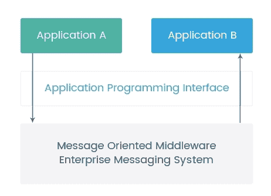
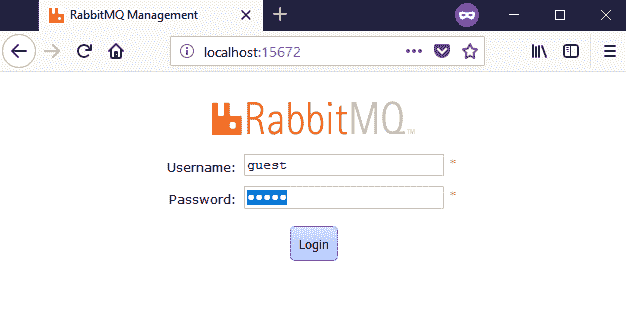
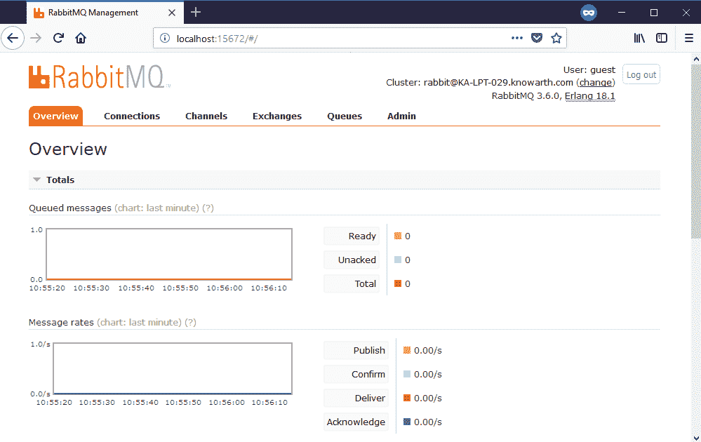

# 第七章：优化 Spring 消息

在上一章中，我们学习了使用**对象关系映射**（**ORM**）框架（如 Hibernate）访问数据库的不同高级方法。我们还学习了在使用 ORM 时如何以最佳方式改进数据库访问。我们研究了 Spring Data 来消除实现**数据访问对象**（**DAO**）接口的样板代码。在本章末尾，我们看到了 Hibernate 的最佳实践。

在本章中，我们将学习 Spring 对消息传递的支持。消息传递是一种非常强大的技术，有助于扩展应用程序，并鼓励我们解耦架构。

Spring 框架提供了广泛的支持，通过简化使用**Java 消息服务**（**JMS**）API 来将消息系统集成到我们的应用程序中，以异步接收消息。消息解决方案可用于从应用程序中的一个点发送消息到已知点，以及从应用程序中的一个点发送消息到许多其他未知点。这相当于面对面分享和通过扩音器向一群人分享东西。如果我们希望将消息发送到一组未知的客户端，那么我们可以使用队列将消息广播给正在监听的人。

以下是本章将涵盖的主题：

+   什么是消息传递？

+   AMQP 是什么？

+   我们为什么需要 AMQP？

+   RabbitMQ

+   Spring 消息配置

# 什么是消息传递？

消息传递是软件组件或应用程序之间交互的一种模式，其中客户端可以向任何其他客户端发送消息，并从任何其他客户端接收消息。

这种消息交换可以使用一个名为**broker**的组件来完成。broker 提供了所有必要的支持和服务来交换消息，同时具有与其他接口交互的能力。这些接口被称为**消息导向中间件**（**MOM**）。以下图表描述了基于 MOM 的消息系统：



使用 AMQP、STOMP 和 XMPP 协议减少开发分布式应用程序的复杂性的消息系统。让我们详细讨论它们：

+   **AMQP**：AMQP 是一种开放的、标准的异步消息系统应用层协议。在 AMQP 中，消息应以二进制格式传输。

+   **STOMP**：**STOMP**代表**简单文本导向消息协议**。STOMP 提供了一个兼容的介质，允许系统与几乎所有可用的消息代理进行通信。

+   **XMPP**：**XMPP**代表**可扩展消息和出席协议**。这是一种基于 XML 的开放标准通信协议，用于消息导向中间件。

# 什么是 AMQP？

**高级消息队列协议**（**AMQP**）是一种开放的标准应用层协议。传输的每个字节都是指定的，这使得它可以在许多其他语言和操作系统架构中使用。因此，这使得它成为一个跨平台兼容的协议。AMQP 受到多个消息代理的支持，如 RabbitMQ、ActiveMQ、Qpid 和 Solace。Spring 提供了基于 AMQP 的消息实现解决方案。Spring 提供了一个模板，用于通过消息代理发送和接收消息。

# JMS API 的问题

JMS API 用于在 Java 平台上发送和接收消息。Spring 通过在 JMS 层周围提供额外的层来支持简化使用 JMS API 的方法。这一层改进了发送和接收消息的过程，还处理连接对象的创建和释放。

开发人员广泛使用 JMS API 来创建基于 Java 的消息系统。使用 JMS API 的主要缺点是平台矛盾，这意味着我们可以使用 JMS API 来开发与基于 Java 的应用程序兼容的消息系统。JMS API 不支持其他编程语言。

# 我们为什么需要 AMQP？

AMQP 是解决 JMS API 问题的解决方案。使用 AMQP 的基本优势在于，它支持消息的交换，不受平台兼容性和消息代理的影响。我们可以使用任何编程语言开发消息系统，仍然可以使用基于 AMQP 的消息代理与每个系统进行通信。

# AMQP 和 JMS API 之间的区别

以下是 AMQP 和 JMS API 之间的一些重要区别：

+   平台兼容性

+   消息模型

+   消息数据类型

+   消息结构

+   消息路由

+   工作流策略

这些在以下部分中有更详细的解释。

# 平台兼容性

JMS 应用程序可以与任何操作系统一起工作，但它们仅支持 Java 平台。如果我们想要开发一个可以与多个系统通信的消息系统，那么所有这些系统都应该使用 Java 编程语言开发。

在使用 AMQP 时，我们可以开发一个可以与不同技术的任何系统进行通信的消息系统。因此，不需要目标系统使用相同的技术进行开发。

# 消息模型

JMS API 提供两种消息模型，即点对点和发布-订阅，用于不同平台系统之间的异步消息传递。

AMQP 支持以下交换类型：直接、主题、扇出和页眉。

# 消息数据类型

JMS API 支持五种标准消息类型：

+   `StreamMessage`

+   `MapMessage`

+   `TextMessage`

+   `ObjectMessage`

+   `BytesMessage`

AMQP 仅支持一种类型的消息——二进制消息；消息必须以二进制格式传输。

# 消息结构

JMS API 消息具有基本结构，包括头部、属性和正文三个部分。它定义了一个标准形式，应该在所有 JMS 提供程序中可移植。

AMQP 消息包括四个部分：头部、属性、正文和页脚。

# 消息路由

对于消息路由，AMQP 也可以用于复杂的路由方案，这是通过路由键和基于目标匹配标准实现的。

JMS API 基于更复杂的路由方案，这些方案基于分层主题和客户端消息选择过滤器。

# 工作流策略

在 AMQP 中，生产者首先需要将消息发送到交换，然后才会转移到队列，而在 JMS 中，不需要交换，因为消息可以直接发送到队列或主题。

# 交换、队列和绑定是什么？

AMQP 处理发布者和消费者。**发布者**发送消息，**消费者**接收消息。消息代理负责这个机制，以确保来自发布者的消息传递到正确的消费者。消息代理使用的两个关键元素是交换和队列。以下图表说明了发布者如何连接到消费者：


让我们了解一下交换、队列和绑定的术语。

# 交换

交换负责接收消息并将其路由到零个或多个队列。每个代理的交换都有一个唯一的名称，以及虚拟主机中的其他一些属性。所使用的消息路由算法取决于交换类型和绑定。正如我们之前提到的，有四种不同类型的交换：直接、主题、扇出和页眉。

# 队列

队列是消息消费者接收消息的组件。队列有一个唯一的名称，以便系统可以引用它们。队列名称可以由应用程序定义，也可以在请求时由代理生成。我们不能使用以`amq.`开头的队列名称，因为它被代理保留用于内部使用。

# 绑定

绑定用于连接队列和交换机。有一些称为**路由键**头的标准头部，经纪人使用它们将消息与队列匹配。每个队列都有一个特定的绑定键，如果该键与路由键头的值匹配，队列将接收消息。

# 介绍 RabbitMQ

RabbitMQ 基于 AMQP，是最广泛使用的轻量级、可靠、可扩展、便携和强大的消息代理之一，使用 Erlang 编写。RabbitMQ 之所以受欢迎的重要原因是它易于设置，并且适合云规模。RabbitMQ 是开源的，并受大多数操作系统和平台支持。使用 RabbitMQ 的应用程序可以通过一个平台中立的、线级协议——AMQP 与其他系统通信。现在，让我们来了解如何配置 RabbitMQ。

# 设置 RabbitMQ 服务器

在开发消息系统之前，我们需要设置一个消息代理，用于处理发送和接收消息。RabbitMQ 是 AMQP 服务器，可以在[`www.rabbitmq.com/download.html`](http://www.rabbitmq.com/download.html)免费下载。

安装 RabbitMQ 服务器后，根据安装路径，您将不得不使用`RABBITMQ_HOME`设置以下系统变量：

```java
RABBITMQ_HOME=D:\Apps\RabbitMQ Server\rabbitmq_server-3.6.0
```

设置好一切后，您可以通过`http://localhost:15672/`访问 RabbitMQ 控制台。

您将看到默认的登录屏幕，您需要输入`guest`作为默认用户名和`guest`作为密码：



登录后，您将看到 RabbitMQ 服务器主页，您可以在那里管理队列、交换和绑定：



现在，我们将通过一个示例来了解 Spring 应用程序中的消息配置。

# Spring 消息配置

在开始示例之前，我们需要了解配置消息应用程序的基本设置要求。我们将创建一个 RabbitMQ 消息应用程序，并了解配置的不同部分。在 Spring 应用程序中设置消息涉及以下步骤：

1.  配置 RabbitMQ 的 Maven 依赖项

1.  配置 RabbitMQ

1.  创建一个组件来发送和接收消息

# 为 RabbitMQ 配置 Maven 依赖项

让我们从向`pom.xml`添加 RabbitMQ 的依赖开始。以下代码显示了要配置的依赖项：

```java
<dependency>
    <groupId>org.springframework.amqp</groupId>
    <artifactId>spring-rabbit</artifactId>
    <version>${rabbitmq.version}</version>
</dependency>
```

我们已经为 RabbitMQ 添加了依赖项。现在，让我们创建一个类来配置队列、交换和它们之间的绑定。

# 配置 RabbitMQ

现在，我们将通过配置部分来清楚地了解`ConnectionFactory`、`RabbitTemplate`、`Queue`、`Exchange`、`Binding`、消息监听容器和消息转换器的配置。

# 配置 ConnectionFactory

对于`ConnectionFactory`接口，有一个具体的实现`CachingConnectionFactory`，默认情况下创建一个可以由整个应用程序共享的单个连接代理。用于创建`CachingConnectionFactory`的代码如下：

```java
@Bean
public ConnectionFactory connectionFactory() {
        CachingConnectionFactory connectionFactory = new 
        CachingConnectionFactory("localhost");
        connectionFactory.setUsername("guest");
        connectionFactory.setPassword("guest");
        return connectionFactory;
}
```

我们还可以使用`CachingConnectionFactory`配置缓存连接，以及仅通道。我们需要将`cacheMode`属性设置为`CacheMode.CONNECTION`，使用`setCacheMode()`。我们还可以通过使用`setConnectionLimit()`限制允许的连接总数。当设置了此属性并且超过了限制时，`channelCheckoutTimeLimit`用于等待连接变为空闲。

# 配置队列

现在，我们将使用`Queue`类配置一个队列。以下代码创建了一个具有特定名称的队列：

```java
@Bean
public Queue queue() {
    return new Queue(RABBIT_MESSAGE_QUEUE, true);
}
```

上述的`queue()`方法使用`RABBIT_MESSAGE_QUEUE`常量声明了一个具有特定名称的 AMQP 队列。我们还可以使用`durable`标志设置持久性。我们需要将它作为布尔类型与第二个构造函数参数一起传递。

# 配置交换

现在，我们需要创建一个 AMQP 交换，消息生产者将向其发送消息。`Exchange`接口表示一个 AMQP 交换。`Exchange`接口类型有四种实现：`DirectExchange`、`TopicExchange`、`FanoutExchange`和`HeadersExchange`。根据我们的需求，我们可以使用任何交换类型。我们将使用以下代码使用`DirectExchange`：

```java
@Bean
public DirectExchange exchange() {
    return new DirectExchange(RABBIT_MESSAGE_EXCHANGE);
}
```

`exchange()`方法使用在`RABBIT_MESSAGE_EXCHANGE`下定义的特定名称创建`DirectExchange`。我们还可以使用持久性标志设置持久性。我们需要将它作为布尔类型与第二个构造函数参数一起传递。

# 配置绑定

现在，我们需要使用`BindingBuilder`类创建一个绑定，将`queue`连接到`Exchange`。以下代码用于创建绑定：

```java
@Bean
Binding exchangeBinding(DirectExchange directExchange, Queue queue) {
    return BindingBuilder.bind(queue).
        to(directExchange)
        .with(ROUTING_KEY);
}
```

`exchangeBinding()`方法使用`ROUTING_KEY`路由键值创建`queue`和`Exchange`的绑定。

# 配置 RabbitAdmin

`RabbitAdmin`用于声明在启动时需要准备好的交换、队列和绑定。`RabbitAdmin`自动声明队列、交换和绑定。这种自动声明的主要好处是，如果由于某种原因连接断开，它们将在重新建立连接时自动应用。以下代码配置了`RabbitAdmin`：

```java
@Bean
public RabbitAdmin rabbitAdmin() {
    RabbitAdmin admin = new RabbitAdmin(connectionFactory());
    admin.declareQueue(queue());
    admin.declareExchange(exchange());
    admin.declareBinding(exchangeBinding(exchange(), queue()));
    return admin;
}
```

`rabbitAdmin()`将声明`Queue`、`Exchange`和`Binding`。`RabbitAdmin`构造函数使用`connectionFactory()` bean 创建一个实例，它不能为`null`。

`RabbitAdmin`仅在`CachingConnectionFactory`缓存模式为`CHANNEL`（默认情况下）时执行自动声明。这种限制的原因是因为可能会将独占和自动删除队列绑定到连接。

# 配置消息转换器

在监听器接收到消息的确切时间，会发生两个变化步骤。在初始步骤中，传入的 AMQP 消息会使用`MessageConverter`转换为 Spring 消息`Message`。在第二步中，当执行目标方法时，如果需要，消息的有效负载会转换为参数类型。默认情况下，在初始步骤中，使用`MessageConverter`作为 Spring AMQP 的`SimpleMessageConverter`，它处理转换为 String 和`java.io.Serializable`。

在第二步中，默认情况下使用`GenericMessageConverter`进行转换。我们在以下代码中使用了`Jackson2JsonMessageConverter`：

```java
@Bean
public MessageConverter messageConverter() {
    return new Jackson2JsonMessageConverter();
}
```

在下一节中，我们将使用这个消息转换器作为属性来更改默认的消息转换器，同时配置`RabbitTemplate`。

# 创建一个 RabbitTemplate

Spring AMQP 的`RabbitTemplate`提供了基本的 AMQP 操作。以下代码使用`connectionFactory`创建了`RabbitTemplate`的实例：

```java
@Bean
public RabbitTemplate rabbitTemplate() {
    RabbitTemplate template = new RabbitTemplate(connectionFactory());
    template.setRoutingKey(ROUTING_KEY);
    template.setExchange(RABBIT_MESSAGE_EXCHANGE);
    template.setMessageConverter(messageConverter());
    return template;
}
```

`RabbitTemplate`充当生产者发送消息和消费者接收消息的辅助类。

# 配置监听器容器

要异步接收消息，最简单的方法是使用注释的监听器端点。我们将使用`@RabbitListener`注释作为消息`listener`端点。要创建这个`listener`端点，我们必须使用`SimpleRabbitListenerContainerFactory`类配置消息`listener`容器，这是`RabbitListenerContainerFactory`接口的实现。以下代码用于配置`SimpleRabbitListenerContainerFactory`：

```java
@Bean
public SimpleRabbitListenerContainerFactory listenerContainer() {
    SimpleRabbitListenerContainerFactory factory = new 
    SimpleRabbitListenerContainerFactory();
    factory.setConnectionFactory(connectionFactory());
    factory.setMaxConcurrentConsumers(5);
    return factory;
}
```

`listenerContainer()`方法将实例化`SimpleRabbitListenerContainerFactory`。您可以使用`setMaxConcurrentConsumers()`方法的`maxConcurrentConsumers`属性设置最大消费者数量。

以下是包含所有先前讨论的配置方法的类：

```java
@Configuration
@ComponentScan("com.packt.springhighperformance.ch7.bankingapp")
@EnableRabbit
public class RabbitMqConfiguration {

  public static final String RABBIT_MESSAGE_QUEUE = 
  "rabbit.queue.name";
  private static final String RABBIT_MESSAGE_EXCHANGE =     
  "rabbit.exchange.name";
  private static final String ROUTING_KEY = "messages.key";

  @Bean
  public ConnectionFactory connectionFactory() {
    CachingConnectionFactory connectionFactory = new 
    CachingConnectionFactory("127.0.0.1");
    connectionFactory.setUsername("guest");
    connectionFactory.setPassword("guest");
    return connectionFactory;
  }

  @Bean
  public Queue queue() {
    return new Queue(RABBIT_MESSAGE_QUEUE, true);
  }

  @Bean
  public DirectExchange exchange() {
    return new DirectExchange(RABBIT_MESSAGE_EXCHANGE);
  }

  @Bean
  Binding exchangeBinding(DirectExchange directExchange, Queue queue) {
    return 
    BindingBuilder.bind(queue).to(directExchange).with(ROUTING_KEY);
  }

  @Bean
  public RabbitAdmin rabbitAdmin() {
    RabbitAdmin admin = new RabbitAdmin(connectionFactory());
    admin.declareQueue(queue());
    admin.declareExchange(exchange());
    admin.declareBinding(exchangeBinding(exchange(), queue()));
    return admin;
  }

  @Bean
  public MessageConverter messageConverter() {
    return new Jackson2JsonMessageConverter();
  }

  @Bean
  public RabbitTemplate rabbitTemplate() {
    RabbitTemplate template = new RabbitTemplate(connectionFactory());
    template.setRoutingKey(ROUTING_KEY);
    template.setExchange(RABBIT_MESSAGE_EXCHANGE);
    template.setMessageConverter(messageConverter());
    return template;
  }

  @Bean
  public SimpleRabbitListenerContainerFactory listenerContainer() {
    SimpleRabbitListenerContainerFactory factory = new 
    SimpleRabbitListenerContainerFactory();
    factory.setConnectionFactory(connectionFactory());
    factory.setMaxConcurrentConsumers(5);
    return factory;
  }

}
```

# 创建消息接收器

现在，我们将创建一个带有`@RabbitListener`注释方法的`Consumer`监听器类，该方法将从 RabbitMQ 接收消息：

```java
@Service
public class Consumer {

  private static final Logger LOGGER = 
  Logger.getLogger(Consumer.class);

  @RabbitListener(containerFactory = "listenerContainer",
  queues = RabbitMqConfiguration.RABBIT_MESSAGE_QUEUE)
  public void onMessage(Message message) {
      LOGGER.info("Received Message: " + 
      new String(message.getBody()));
    }
}
```

这是消息`listenerContainer`类。每当生产者向`queue`发送消息时，这个类将接收到它，只有带有`@RabbitListener(containerFactory = "listenerContainer", queues = RabbitMqConfiguration.RABBIT_MESSAGE_QUEUE)`注解的方法才会接收到消息。在这个注解中，我们提到了`containerFactory`属性，它指向了在`listenerContainer` bean 中定义的消息监听器工厂。

# 创建消息生产者

为了运行这个应用程序，我们将使用`RabbitTemplate.convertAndSend()`方法来发送消息。这个方法还将自定义的 Java 对象转换为 AMQP 消息，并发送到直接交换。以下`BankAccount`类被创建为一个自定义类来填充消息属性：

```java
public class BankAccount {

    private int accountId;
    private String accountType;

    public BankAccount(int accountId, String accountType) {
        this.accountId = accountId;
        this.accountType = accountType;
    }

    public int getAccountId() {
        return accountId;
    }

    public String getAccountType() {
        return accountType;
    }

    @Override
    public String toString() {
        return "BankAccount{" +
                "Account Id=" + accountId +
                ", Account Type='" + accountType + '\'' +
                '}';
    }
}
```

在下一个类中，我们将使用一些适当的值初始化前面的类，并使用`RabbitTemplate.convertAndSend()`将其发送到交换：

```java
public class Producer {

  private static final Logger LOGGER = 
  Logger.getLogger(Producer.class);

  @SuppressWarnings("resource")
  public static void main(String[] args) {
        ApplicationContext ctx = new 
        AnnotationConfigApplication
        Context(RabbitMqConfiguration.class);
        RabbitTemplate rabbitTemplate = 
        ctx.getBean(RabbitTemplate.class);
        LOGGER.info("Sending bank account information....");
        rabbitTemplate.convertAndSend(new BankAccount(100, "Savings 
        Account"));
        rabbitTemplate.convertAndSend(new BankAccount(101, "Current 
        Account"));

    }

}
```

当我们运行上述代码时，生产者将使用`convertAndSend()`方法发送两个`BankAccount`对象，并显示以下输出：

```java
2018-05-13 19:46:58 INFO Producer:17 - Sending bank account information....
2018-05-13 19:46:58 INFO Consumer:17 - Received Message: {"accountId":100,"accountType":"Savings Account"}
2018-05-13 19:46:58 INFO Consumer:17 - Received Message: {"accountId":101,"accountType":"Current Account"}
```

# 最大化 RabbitMQ 的吞吐量

以下是与最大消息传递吞吐量相关的最佳性能配置选项：

+   保持队列短

+   避免使用懒惰队列

+   避免持久化消息

+   创建多个队列和消费者

+   将队列分成不同的核心

+   禁用确认

+   禁用不必要的插件

# RabbitMQ 的性能和可伸缩性

有许多重要的要点，我们应该考虑实现与 RabbitMQ 的最佳性能：

+   有效载荷消息大小

+   交换管理

+   正确配置预取

+   RabbitMQ HiPE

+   节点的集群

+   禁用 RabbitMQ 统计信息

+   更新 RabbitMQ 库

# 总结

在本章中，我们学习了消息传递的概念。我们还了解了使用消息系统的优势。我们学习了 AMQP。我们通过理解 JMS API 问题了解了 AMQP 的需求。我们还看到了 AMQP 和 JMS API 之间的区别。我们学习了与 AMQP 相关的交换、队列和绑定。我们还学习了 RabbitMQ 的设置方面以及与 Spring 应用程序相关的不同配置。

在下一章中，我们将学习 Java 线程的核心概念，然后我们将转向`java.util.concurrent`包提供的高级线程支持。我们还将学习`java.util.concurrent`的各种类和接口。我们将学习如何使用 Java 线程池来提高性能。我们将学习 Spring 框架提供的有用功能，如任务执行、调度和异步运行。最后，我们将研究 Spring 事务管理与线程以及线程的各种最佳编程实践。
