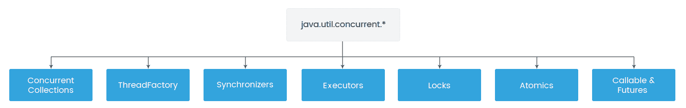

# 第八章：多线程和并发编程

在上一章中，我们学习了如何优化 Spring 消息传递。我们还学习了各种配置技巧，帮助我们提高应用程序的性能。我们还研究了监视和配置 JMS 和 RabbitMQ 以实现最佳性能。

在本章中，我们将介绍 Java 线程的核心概念，然后将转向`java.util.concurrent`包提供的高级线程支持。对于这个包，我们将看到各种类和接口，帮助我们编写多线程和并发编程。我们还将学习如何使用 Java 线程池来提高性能。我们将介绍 Spring 框架提供的有用功能，如任务执行、调度和异步运行。最后，我们将探讨 Spring 事务管理与线程以及线程的各种最佳编程实践。

本章将涵盖以下主题：

+   Java 经典线程

+   `java.util.concurrent`包

+   使用线程池进行异步处理

+   Spring 任务执行和调度

+   Spring 异步

+   Spring 和线程-事务

+   Java 线程最佳编程实践

# Java 经典线程

Java 应用程序通过线程执行，线程是程序内部的独立执行路径。任何 Java 程序至少有一个线程，称为主线程，由 Java 虚拟机（JVM）创建。Java 是一个多线程应用程序，允许在任何特定时间执行多个线程，并且这些线程可以并发地运行，无论是异步还是同步。当多个线程执行时，每个线程的路径可以与其他线程的路径不同。

JVM 为每个线程提供自己的堆栈，以防止线程相互干扰。单独的堆栈帮助线程跟踪它们要执行的下一个指令，这可以与其他线程不同。堆栈还为线程提供了方法参数、局部变量和返回值的副本。

线程存在于一个进程中，并与进程的其他线程共享资源，如内存和打开的文件。在不同线程之间共享资源的能力使它们更容易受到性能要求的影响。在 Java 中，每个线程都是由`java.lang.Thread`类和`java.lang.Runnable`接口创建和控制的。

# 创建线程

线程是 Java 语言中的对象。可以使用以下机制创建线程：

+   创建一个实现`Runnable`接口的类

+   创建一个扩展`Thread`类的类

有两种创建`Runnable`对象的方法。第一种方法是创建一个实现`Runnable`接口的类，如下所示：

```java
public class ThreadExample {
  public static void main(String[] args) {
    Thread t = new Thread(new MyThread());
    t.start();
  }
}
class MyThread implements Runnable {
  private static final Logger LOGGER =     
  Logger.getLogger(MyThread.class);
  public void run() {
    //perform some task
    LOGGER.info("Hello from thread...");
  }
}
```

在 Java 8 之前，我们只能使用这种方式创建`Runnable`对象。但自 Java 8 以来，我们可以使用 Lambda 表达式创建`Runnable`对象。

创建`Runnable`对象后，我们需要将其传递给接受`Runnable`对象作为参数的`Thread`构造函数：

```java
Runnable runnable = () -> LOGGER.info("Hello from thread...");
Thread t = new Thread(runnable);
```

有些构造函数不接受`Runnable`对象作为参数，比如`Thread()`。在这种情况下，我们需要采取另一种方法来创建线程：

```java
public class ThreadExample1 {
  public static void main(String[] args) {
    MyThread t = new MyThread1();
    t.start();
  }

}
class MyThread1 extends Thread {
  private static final Logger LOGGER = 
  Logger.getLogger(MyThread1.class);
  public void run() {
    LOGGER.info("Hello from thread...");
  }
}
```

# 线程生命周期和状态

在处理线程和多线程环境时，了解线程生命周期和状态非常重要。在前面的例子中，我们看到了如何使用`Thread`类和`Runnable`接口创建 Java 线程对象。但是要启动线程，我们必须首先创建线程对象，并调用其`start()`方法来执行`run()`方法作为线程。

以下是 Java 线程生命周期的不同状态：

+   **New**：使用`new`运算符创建线程时，线程处于新状态。在这个阶段，线程还没有启动。

+   **可运行**：当我们调用线程对象的`start()`方法时，线程处于可运行状态。在这个阶段，线程调度程序仍然没有选择它来运行。

+   **运行**：当线程调度程序选择了线程时，线程状态从可运行变为运行。

+   **阻塞/等待**：当线程当前不具备运行资格时，线程状态为阻塞/等待。

+   **终止/死亡**：当线程执行其运行方法时，线程状态被终止/死亡。在这个阶段，它被认为是不活动的。

# 更高级的线程任务

我们已经看到了线程的生命周期和其状态，但线程也支持一些高级任务，比如睡眠、加入和中断。让我们讨论一下：

+   **睡眠**：`sleep()`线程方法可以用来暂停当前线程的执行，指定的时间量。

+   **加入**：`join()`线程方法可以用来暂停当前线程的执行，直到它加入的线程完成其任务。

+   **中断**：`interrupt()`线程方法可以用来打破线程的睡眠或等待状态。如果线程处于睡眠或等待状态，它会抛出`InterruptedException`，否则，它不会中断线程，但会将中断标志设置为 true。

# 同步线程

在多线程应用程序中，可能会出现多个线程尝试访问共享资源并产生错误和意外结果的情况。我们需要确保资源只能被一个线程使用，这可以通过同步来实现。`synchronized`关键字用于实现同步；当我们在 Java 中定义任何同步块时，只有一个线程可以访问该块，其他线程被阻塞，直到在该块内的线程退出该块。

`synchronized`关键字可以与以下不同类型的块一起使用：

+   实例方法

+   静态方法

+   实例方法内的代码块

+   静态方法内的代码块

在 Java 中，同步块会降低性能。我们必须在需要时使用`synchronized`关键字，否则，我们应该只在需要的关键部分使用同步块。

# 多线程问题

多线程是一种非常强大的机制，可以帮助我们更好地利用系统资源，但在读写多个线程共享的数据时，我们需要特别小心。多线程编程有两个基本问题——可见性问题和访问问题。可见性问题发生在一个线程的效果可以被另一个线程看到时。访问问题可能发生在多个线程同时访问相同的共享资源时。

由于可见性和访问问题，程序不再做出反应，导致死锁或生成不正确的数据。

# java.util.concurrent 包

在前一节中，我们专注于 Java 对线程的低级支持。在本节中，我们将继续查看`java.util.concurrent`包提供的 Java 高级线程支持。这个包有各种类和接口，提供非常有用的功能，帮助我们实现多线程和并发编程。在本节中，我们将主要关注这个包的一些最有用的实用工具。

以下图表显示了`java.util.concurrent` API 的高级概述：



让我们详细讨论接口。

# 执行者

`Executor`提供了一个抽象层，用于管理所有内部线程管理任务，并管理线程的整个并发执行流程。`Executor`是一个执行提供的任务的对象。

Java 并发 API 提供了以下三个基本接口用于执行者：

+   `Executor`：这是一个简单的接口，用于启动一个新任务。它不严格要求执行是异步的。

+   `ExecutorService`：这是`Executor`接口的子接口。它允许我们异步地将任务传递给线程执行。它提供了管理先前提交的任务终止的方法，如`shutdown()`、`shutdownNow()`和`awaitTermination(long timeout, TimeUnit unit)`。它还提供了返回`Future`对象以跟踪一个或多个异步任务进度的方法。

+   `ScheduledExecutorService`：这是`ExecutorService`的子接口。它提供了各种关键方法，如`schedule()`、`scheduleAtFixedRate()`和`scheduleWithFixedDelay()`。所有调度方法都可以接受相对延迟和周期作为参数，这有助于我们安排任务在给定延迟或周期后执行。

以下是一个简单示例，演示了如何创建`Executor`以执行`Runnable`任务：

```java
public class ExecutorExample {
    private static final Logger LOGGER = 
    Logger.getLogger(ExecutorExample.class);

    public static void main(String[] args) {
        ExecutorService pool = Executors.newSingleThreadExecutor();

            Runnable task = new Runnable() {
            public void run() {
                LOGGER.info(Thread.currentThread().getName());
            }
        }; 

        pool.execute(task); 
        pool.shutdown();
    }
}
```

在前面的示例中，通过匿名类创建了一个`Runnable`对象，并通过单线程`Executor`接口执行任务。当我们编译和运行上述类时，将得到以下输出：

```java
pool-1-thread-1
```

# ThreadFactory

`ThreadFactory`接口用于按需创建新线程，还帮助我们消除创建线程的大量样板代码。

以下示例显示了如何使用`ThreadFactory`接口创建新线程：

```java
public class ThreadFactoryExample implements ThreadFactory {
  private static final Logger LOGGER =   
  Logger.getLogger(ThreadFactoryExample.class);

  public static void main(String[] args) {
    ThreadFactoryExample factory = new ThreadFactoryExample();

    Runnable task = new Runnable() {
      public void run() {
        LOGGER.info(Thread.currentThread().getName());
      }
    };
    for (int i = 0; i < 5; i++) {
      Thread t = factory.newThread(task);
      t.start();
    }
  }

  @Override
  public Thread newThread(Runnable r) {
    Thread t = new Thread(r);
    return t;
  }
}
```

当我们编译和运行上述类时，将得到以下输出：

```java
Thread-0
Thread-1
```

# 同步器

Java 提供了`synchronized`关键字来编写同步代码，但仅通过`synchronized`关键字正确编写同步代码是困难的。`java.util.concurrent`包提供了各种实用程序类，如`CountDownLatch`、`CyclicBarrier`、`Exchanger`、`Semaphore`和`Phaser`，它们被称为同步器。同步器是提供线程同步的并发实用程序，而无需使用`wait()`和`notify()`方法。让我们看看以下类：

+   `CountDownLatch`：这允许一个线程在一个或多个线程完成之前等待。

+   `CyclicBarrier`：这与`CountdownLatch`非常相似，但它允许多个线程在开始处理之前等待彼此。

+   `信号量`：这维护了一组许可证，用于限制可以访问共享资源的线程数量。线程在访问共享资源之前需要从`信号量`获取许可证。它提供了两个主要方法`acquire()`和`release()`，分别用于获取和释放许可证。

+   `Exchanger`：这提供了一个同步点，线程可以在其中交换对象。

+   `Phaser`：这提供了类似于`CyclicBarrier`和`CountDownLatch`的线程同步机制，但支持更灵活的使用。它允许一组线程在障碍上等待，然后在最后一个线程到达后继续，并且还支持多个执行阶段。

# 并发集合类

并发集合类提供了比其他集合类（如`HashMap`或`Hashtable`）更好的可伸缩性和性能。以下是`java.util.concurrent`包中提供的有用并发类：

+   `ConcurrentHashMap`：这类似于`HashMap`和`Hashtable`，但它被设计为在并发编程中工作，而无需显式同步。`Hashtable`和`ConcurrentHashMap`都是线程安全的集合，但`ConcurrentHashMap`比`Hashtable`更先进。它不会锁定整个集合进行同步，因此在有大量更新和较少并发读取时非常有用。

+   `BlockingQueue`：生产者-消费者模式是异步编程中最常见的设计模式，`BlockingQueue`数据结构在这些异步场景中非常有用。

+   `DelayQueue`：这是一个无限大小的阻塞队列，其中的元素只有在其延迟到期时才能被取出。如果多个元素延迟到期，那么延迟到期时间最长的元素将首先被取出。

# 锁

`Lock`接口提供了比`synchronized`块更高级的锁定机制。`synchronized`块和`Lock`之间的主要区别是`synchronized`块完全包含在一个方法中，而`Lock`接口有单独的`lock()`和`unlock()`方法，可以在不同的方法中调用。

# 可调用和未来

`Callable`接口类似于`Runnable`对象，但它可以返回任何类型的对象，这有助于我们从`Callable`任务中获取结果或状态。

`Callable`任务返回`Future`对象，用于获取异步操作的结果。它的用途包括提供一对方法来检查异步执行是否已完成，并检索计算的结果。

# 原子变量

原子变量是在`java.util.concurrent.atomic`包中引入的非阻塞算法。使用原子变量的主要好处是我们不需要担心同步。在多线程环境中，原子变量是避免数据不一致的必要性。它支持对单个变量进行无锁、线程安全的操作。

# 使用线程池进行异步处理

线程池是多线程编程中的核心概念，用于提供一组空闲线程，可用于执行任务。线程池可以重用先前创建的线程来执行当前任务，以便在请求到达时线程已经可用，这可以减少线程创建的时间并提高应用程序的性能。通常，线程池可以用于 Web 服务器来处理客户端请求，还可以维护到数据库的开放连接。

我们可以配置池中并发线程的最大数量，这对于防止过载很有用。如果所有线程都在执行任务，那么新任务将被放置在队列中，等待线程可用。

Java 并发 API 支持以下类型的线程池：

+   固定线程池：具有固定数量线程的线程池。只有在有线程可用时任务才会执行，否则会在队列中等待。使用`Executors.newFixedThreadPool()`方法来创建固定线程池。

+   缓存线程池：我们可以根据需要创建新线程，但也可以重用先前创建的线程。如果线程空闲了 60 秒，它将被终止并从池中移除。使用`Executors.newCachedThreadPool()`方法来创建缓存线程池。

+   单线程池：一个线程的线程池。它逐个执行任务。使用`Executors.newSingleThreadExecutor()`方法来创建单线程池。

+   分支/合并池：用于更快地执行重型任务的线程池，通过递归地将任务分割成较小的片段。要创建分支/合并池，我们需要创建`ForkJoinPool`类的实例。

以下是固定线程池的一个简单示例：

```java
public class ThreadPoolExample {
  private static final Logger LOGGER = 
  Logger.getLogger(ThreadPoolExample.class);
  public static void main(String[] args) {
    ExecutorService executor = Executors.newFixedThreadPool(3);

    for (int i = 1; i <= 6; i++) {
      Runnable task = new Task(" " + i);
      executor.execute(task);
    }
    executor.shutdown();
    while (!executor.isTerminated()) {
    }
    LOGGER.info("All threads finished");
  }
}
```

以下演示了任务的实现方式：

```java
public class Task implements Runnable {
  private static final Logger LOGGER = Logger.getLogger(Task.class);
  private String taskNumber;

  public Task(String taskNumber) {
    this.taskNumber = taskNumber;
  }

  @Override
  public void run() {
    LOGGER.info(Thread.currentThread().getName() + ", Execute Task = " 
    + taskNumber);
    taskProcess();
    LOGGER.info(Thread.currentThread().getName() + ", End");
  }

  private void taskProcess() {
    try {
      Thread.sleep(2000);
    } catch (InterruptedException e) {
      e.printStackTrace();
    }
  }
}
```

在前面的示例中，我们创建了一个最多有三个并发线程的池，并向`executor`对象提交了`6`个任务。当我们编译和运行前面的类时，我们知道只有三个线程执行任务。

以下是输出：

```java
pool-1-thread-1, Execute Task = 1
pool-1-thread-2, Execute Task = 2
pool-1-thread-3, Execute Task = 3
pool-1-thread-1, End
pool-1-thread-1, Execute Task = 4
pool-1-thread-3, End
pool-1-thread-2, End
pool-1-thread-2, Execute Task = 5
pool-1-thread-3, Execute Task = 6
pool-1-thread-1, End
pool-1-thread-2, End
pool-1-thread-3, End
All threads finished
```

# Spring 任务执行和调度

在任何 Web 应用程序中使用线程处理长时间运行的任务并不容易。有时，我们需要异步运行任务或在特定延迟后运行任务，这可以通过 Spring 的任务执行和调度来实现。Spring 框架引入了用于异步执行和任务调度的抽象，使用`TaskExecutor`和`TaskScheduler`接口。

# TaskExecutor

Spring 提供了`TaskExecutor`接口作为处理`Executor`的抽象。`TaskExecutor`的实现类如下：

+   `SimpleAsyncTaskExecutor`：这启动一个新线程并异步执行。它不重用线程。

+   `SyncTaskExecutor`：这在调用线程中同步执行每个任务。它不重用线程。

+   `ConcurrentTaskExecutor`：这公开了用于配置`java.util.concurrent.Executor`的 bean 属性。

+   `SimpleThreadPoolTaskExecutor`：这是`Quartz`的`SimpleThreadPool`的子类，它监听 Spring 的生命周期回调。

+   `ThreadPoolTaskExecutor`：这公开了用于配置`java.util.concurrent.ThreadPoolExecutor`的 bean 属性，并将其包装在`TaskExecutor`中。

+   `TimerTaskExecutor`：这实现了一个`TimerTask`类作为其后备实现。它在单独的线程中同步执行方法。

+   `WorkManagerTaskExecutor`：这使用`CommonJ`的`WorkManager`接口作为其后备实现。

让我们看一个在 Spring 应用程序中使用`SimpleAsyncTaskExecutor`执行任务的简单示例。它为每个任务提交创建一个新线程并异步运行。

这是配置文件：

```java
@Configuration
public class AppConfig {
  @Bean
  AsyncTask myBean() {
    return new AsyncTask();
  }
  @Bean
  AsyncTaskExecutor taskExecutor() {
    SimpleAsyncTaskExecutor t = new SimpleAsyncTaskExecutor();
    return t;
  }
}
```

这是一个 bean 类，我们已经将`5`个任务分配给了`TaskExecutor`：

```java
public class AsyncTask {
  @Autowired
  private AsyncTaskExecutor executor;
  public void runTasks() throws Exception {
    for (int i = 1; i <= 5; i++) {
      Runnable task = new Task(" " + i);
      executor.execute(task);
    }
  }
}
```

以下是从`main`方法执行任务的代码：

```java
public class TaskExecutorExample {
  public static void main(String[] args) throws Exception {
    ApplicationContext context = new 
    AnnotationConfigApplicationContext(AppConfig.class);
    AsyncTask bean = context.getBean(AsyncTask.class);
    bean.runTasks();
  }
}
```

当我们编译并运行上述类时，将得到以下输出。在这里，我们可以看到创建了五个线程，并且它们异步执行任务：

```java
SimpleAsyncTaskExecutor-1, Execute Task = 1
SimpleAsyncTaskExecutor-4, Execute Task = 4
SimpleAsyncTaskExecutor-3, Execute Task = 3
SimpleAsyncTaskExecutor-2, Execute Task = 2
SimpleAsyncTaskExecutor-5, Execute Task = 5
SimpleAsyncTaskExecutor-2, End
SimpleAsyncTaskExecutor-1, End
SimpleAsyncTaskExecutor-4, End
SimpleAsyncTaskExecutor-3, End
SimpleAsyncTaskExecutor-5, End
```

# TaskScheduler

有时，我们需要按固定间隔执行任务，这可以通过 Spring 调度程序框架实现。在本节中，我们将看到如何使用一些注解在 Spring 中安排任务。

让我们看一个在 Spring 应用程序中安排任务的简单示例：

```java
@Configuration
@EnableScheduling
public class SpringSchedulingExample {
    private static final Logger LOGGER =                                                     
    Logger.getLogger(SpringSchedulingExample.class);
    @Scheduled(fixedDelay = 2000)
    public void scheduledTask() {
        LOGGER.info("Execute task " + new Date());
    }

    public static void main(String[] args) {
        AnnotationConfigApplicationContext context = new 
        AnnotationConfigApplicationContext(
        SpringSchedulingExample.class);
        String scheduledAnnotationProcessor =         
        "org.springframework.context.annotation.
        internalScheduledAnnotationProcessor";
        LOGGER.info("ContainsBean : " + scheduledAnnotationProcessor + 
        ": " + context.containsBean(scheduledAnnotationProcessor));
        try {
            Thread.sleep(12000);
        } catch (InterruptedException e) {
            e.printStackTrace();
        } finally {
            context.close();
        }
    }
} 
```

在 Spring 中，我们可以通过`@EnableScheduling`注解启用任务调度。一旦启用任务调度，Spring 将自动注册一个内部 bean 后处理器，该处理器将在 Spring 管理的 bean 上找到`@Scheduled`注解的方法。

在上一个示例中，我们使用`@Scheduled`注解将`scheduledTask()`方法与`fixedDelay`属性一起注释，以便每`2`秒调用一次。我们还可以使用其他属性，如`fixedRate`和`cron`：

```java
@Scheduled(fixedRate = 2000)
@Scheduled(cron = "*/2 * * * * SAT,SUN,MON")
```

当我们编译并运行上一个类时，将得到以下输出：

```java
Execute task Thu May 10 20:18:04 IST 2018
ContainsBean : org.springframework.context.annotation.internalScheduledAnnotationProcessor: true
Execute task Thu May 10 20:18:06 IST 2018
Execute task Thu May 10 20:18:08 IST 2018
Execute task Thu May 10 20:18:10 IST 2018
Execute task Thu May 10 20:18:12 IST 2018
Execute task Thu May 10 20:18:14 IST 2018
```

# Spring Async

在本节中，我们将看到 Spring 中的异步执行支持。在某些情况下，我们需要异步执行一些任务，因为该任务的结果不需要用户，所以我们可以在单独的线程中处理该任务。异步编程的主要好处是我们可以提高应用程序的性能和响应能力。

Spring 通过`@EnableAsync`和`@Async`提供了异步方法执行的注解支持。让我们详细讨论它们。

# @EnableAsync 注解

我们可以通过简单地将`@EnableAsync`添加到配置类来启用异步处理，如下所示：

```java
@Configuration
@EnableAsync
public class AppConfig {
  @Bean
  public AsyncTask asyncTask() {
    return new AsyncTask();
  }
}
```

在上面的代码中，我们没有将`TaskExecutor`作为 bean 提供，因此 Spring 将隐式地使用默认的`SimpleAsyncTaskExecutor`。

# @Async 注解

一旦启用了异步处理，那么用`@Async`注解标记的方法将异步执行。

以下是`@Async`注解的简单示例：

```java
public class AsyncTask {
  private static final Logger LOGGER = 
  Logger.getLogger(AsyncTask.class);
  @Async
  public void doAsyncTask() {
    try {
      LOGGER.info("Running Async task thread : " + 
      Thread.currentThread().getName());
    } catch (Exception e) {
    }
  }
}
```

我们还可以将`@Async`注解添加到具有返回类型的方法中，如下所示：

```java
@Async
  public Future<String> doAsyncTaskWithReturnType() {
    try 
    {
      return new AsyncResult<String>("Running Async task thread : " + 
      Thread.currentThread().getName());
    } 
    catch (Exception e) { 
    }
    return null;
  }
```

在上面的代码中，我们使用了实现`Future`的`AsyncResult`类。这可以用于获取异步方法执行的结果。

以下是从`main`方法调用异步方法的代码：

```java
public class asyncExample {
  private static final Logger LOGGER = 
  Logger.getLogger(asyncExample.class);
  public static void main(String[] args) throws InterruptedException {
    AnnotationConfigApplicationContext ctx = new 
    AnnotationConfigApplicationContext();
    ctx.register(AppConfig.class);
    ctx.refresh();
    AsyncTask task = ctx.getBean(AsyncTask.class);
    LOGGER.info("calling async method from thread : " + 
    Thread.currentThread().getName());
    task.doAsyncTask();
    LOGGER.info("Continue doing something else. ");
    Thread.sleep(1000);
  }
}
```

当我们编译并运行上述类时，将得到以下输出：

```java
calling async method from thread : main
Continue doing something else. 
Running Async Task thread : SimpleAsyncTaskExecutor-1
```

# @Async 与 CompletableFuture

在上一节中，我们看到了如何使用`java.util.Future`来获取异步方法执行的结果。它提供了一个`isDone()`方法来检查计算是否完成，以及一个`get()`方法在计算完成时检索计算结果。但是使用`Future` API 存在一定的限制：

+   假设我们编写了代码，通过远程 API 从电子商务系统中获取最新的产品价格。这个任务很耗时，所以我们需要异步运行它，并使用`Future`来获取该任务的结果。现在，当远程 API 服务宕机时，问题就会出现。这时，我们需要手动完成`Future`，使用产品的最后缓存价格，这是`Future`无法实现的。

+   `Future`只提供一个`get()`方法，当结果可用时通知我们。我们无法将回调函数附加到`Future`，并在`Future`结果可用时自动调用它。

+   有时我们有需求，比如需要将长时间运行任务的结果发送给另一个长时间运行的任务。我们无法使用`Future`创建这样的异步工作流。

+   我们无法并行运行多个`Future`。

+   `Future` API 没有任何异常处理。

由于这些限制，Java 8 引入了比`java.util.Future`更好的抽象，称为`CompletableFuture`。我们可以使用以下无参构造函数简单地创建`CompletableFuture`：

```java
CompletableFuture<String> completableFuture = new CompletableFuture<String>();
```

以下是`CompletableFuture`提供的方法列表，帮助我们解决`Future`的限制：

+   `complete()`方法用于手动完成任务。

+   `runAsync()`方法用于异步运行不返回任何内容的后台任务。它接受一个`Runnable`对象并返回`CompletableFuture<Void>`。

+   `supplyAsync()`方法用于异步运行后台任务并返回一个值。它接受`Supplier<T>`并返回`CompletableFuture<T>`，其中`T`是供应商提供的值的类型。

+   `thenApply()`、`thenAccept()`和`thenRun()`方法用于将回调附加到`CompletableFuture`。

+   `thenCompose()`方法用于将两个依赖的`CompletableFuture`组合在一起。

+   `thenCombine()`方法用于将两个独立的`CompletableFuture`组合在一起。

+   `allOf()`和`anyOf()`方法用于将多个`CompletableFuture`组合在一起。

+   `exceptionally()`方法用于从`Future`获取生成的错误。我们可以记录错误并设置默认值。

+   `handle()`方法用于处理异常。

# Spring 和线程-事务

Spring 框架为数据库事务管理提供了广泛的 API。Spring 负责所有基本的事务管理控制，并为不同的事务 API 提供了一致的编程模型，如 JDBC、Hibernate、Java Transaction API（JTA）、Java Persistence API（JPA）和 Java Data Objects（JDO）。Spring 提供了两种类型的事务：一种是声明式的，另一种是编程式的事务管理。声明式的层次很高，而编程式的更高级但更灵活。

Spring 事务管理在单个线程中运行得很好。但它无法管理跨多个线程的事务。如果我们尝试在多个线程中使用事务，我们的程序会给出运行时错误或意外结果。

要理解为什么 Spring 事务在多个线程中失败，首先，我们需要了解 Spring 如何处理事务。Spring 将所有事务信息存储在`org.springframework.transaction.support.TransactionSynchronizationManager`类内的`ThreadLocal`变量中：

```java
public abstract class TransactionSynchronizationManager {
  private static final Log logger =         
  LogFactory.getLog(TransactionSynchronizationManager.class);
  private static final ThreadLocal<Map<Object, Object>> resources = new  
  NamedThreadLocal("Transactional resources");
  private static final ThreadLocal<Set<TransactionSynchronization>> 
  synchronizations = new NamedThreadLocal("Transaction 
  synchronizations");
  private static final ThreadLocal<String> currentTransactionName = new 
  NamedThreadLocal("Current transaction name");
  private static final ThreadLocal<Boolean> currentTransactionReadOnly 
  = new NamedThreadLocal("Current transaction read-only status");
  private static final ThreadLocal<Integer> 
  currentTransactionIsolationLevel = new NamedThreadLocal("Current 
  transaction isolation level");
  private static final ThreadLocal<Boolean> actualTransactionActive = 
  new NamedThreadLocal("Actual transaction active");
}
```

线程的局部变量仅保存特定事务的信息，仅限于单个线程，不能被另一个线程访问。因此，正在进行的事务信息不会传递给新创建的线程。结果将是一个错误，指示事务丢失。

现在我们能够理解 Spring 事务在多个线程中的问题。Spring 无法将事务状态保持到旧线程，以便从新创建的线程中访问。为了解决多线程的事务问题，我们需要手动将线程的局部变量值传递给新创建的线程。

# Java 线程最佳编程实践

使用多线程和并发编程的目的是提高性能，但我们需要始终记住速度是在正确性之后。Java 编程语言从语言到 API 级别提供了大量的同步和并发支持，但这取决于个人在编写无错误的 Java 并发代码方面的专业知识。以下是 Java 并发和多线程的最佳实践，这有助于我们在 Java 中编写更好的并发代码：

+   **使用不可变类**：在多线程编程中，我们应该始终优先使用不可变类，因为不可变类确保在操作中值不会在没有使用同步块的情况下更改。例如，在不可变类中，如`java.lang.String`，对`String`的任何修改，如添加内容或转换为大写，总是创建另一个字符串对象，保持原始对象不变。

+   **使用局部变量**：始终尝试使用局部变量而不是实例或类级变量，因为局部变量永远不会在线程之间共享。

+   **使用线程池**：线程池可以重用先前创建的线程，并消除线程创建的时间，从而提高应用程序的性能。

+   **使用同步工具**：在这里，我们可以使用同步工具而不是`wait`和`notify`方法。`java.util.concurrent`包提供了更好的同步工具，如`CycicBariier`、`CountDownLatch`、`Sempahore`和`BlockingQueue`。使用`CountDownLatch`等待五个线程完成任务比使用`wait`和`notify`方法实现相同的工具更容易。使用`BlockingQueue`更容易实现生产者-消费者设计，而不是使用`wait`和`notify`方法。

+   **使用并发集合而不是同步集合**：并发集合是使用`Lock`接口提供的新锁定机制实现的，并且设计成这样，我们可以利用底层硬件和 JVM 提供的本机并发构造。并发集合比它们的同步对应物具有更好的可伸缩性和性能。如果有许多并发更新和较少读取，`ConcurrentHashMap`比同步的`HashMap`或`Hashtable`类提供更好的性能。

+   **最小化锁定范围**：我们应该尽量减少锁定范围，因为锁定块不会同时执行，并且会影响应用程序的性能。如果我们的需求无法满足，首先尝试使用原子和易失性变量来实现我们的同步需求，然后需要使用`Lock`接口提供的功能。我们还可以减少锁定范围，使用同步块而不是同步方法。

+   **使用 Java Executor 框架**：它在 Java 线程框架上提供了一个抽象层，并在多线程环境中创建和执行线程方面提供了更好的控制。

# 摘要

在这一章中，我们探讨了 Java 线程，并学习了如何利用`java.util.concurrent`包实现多线程和并发编程。我们还学习了如何在应用程序中使用线程池来提高性能。我们看到了 Spring 提供的任务执行和调度功能，还学习了 Spring 的`@Async`支持，可以提高应用程序的性能和响应能力。我们回顾了 Spring 事务管理在处理多线程时可能出现的问题，并了解了多线程和并发编程的最佳编程实践。

在下一章中，我们将学习如何对应用程序进行性能分析，以找出性能问题。这对于识别性能问题非常有用。我们还将学习日志记录，这是识别应用程序问题的重要工具。
