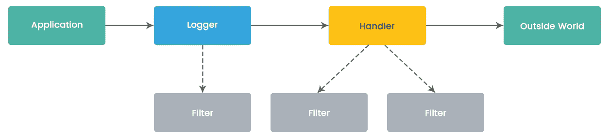
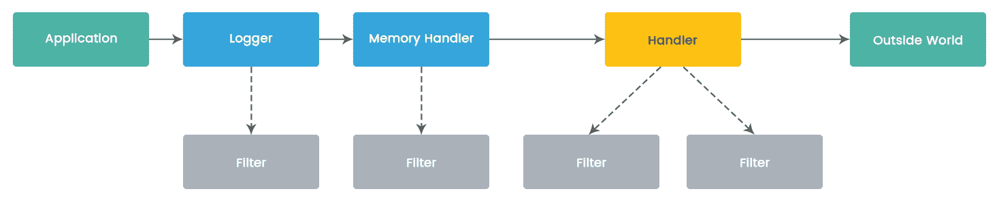
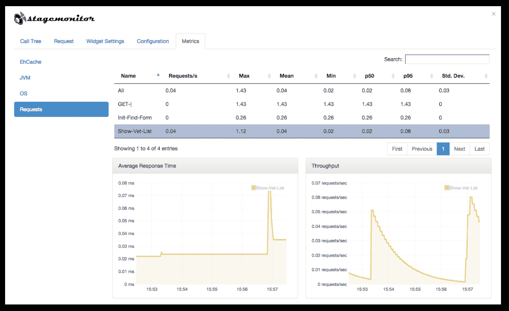
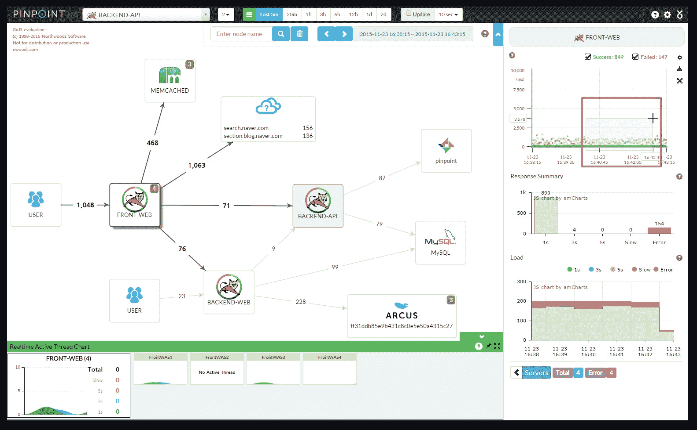
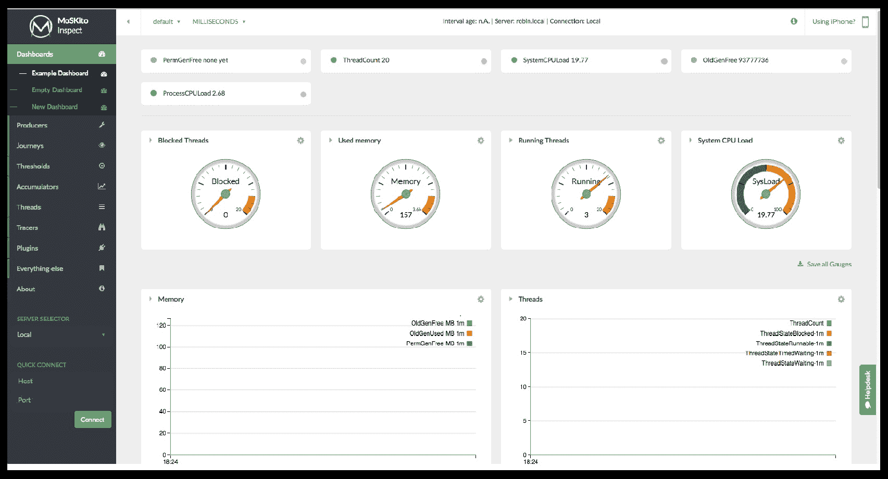
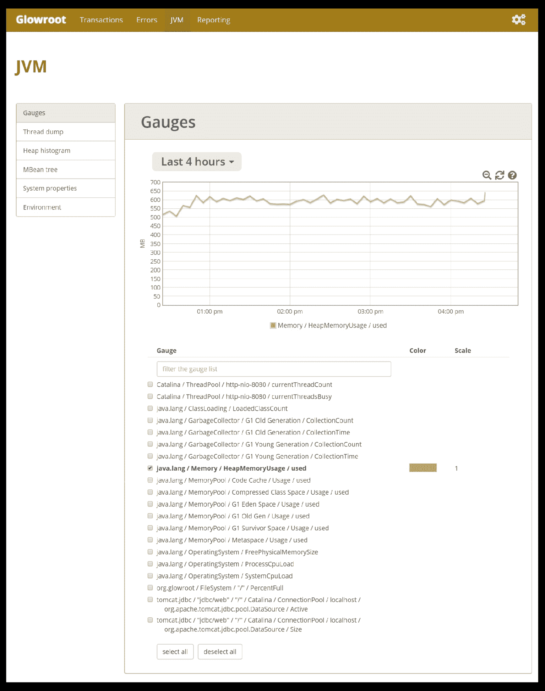
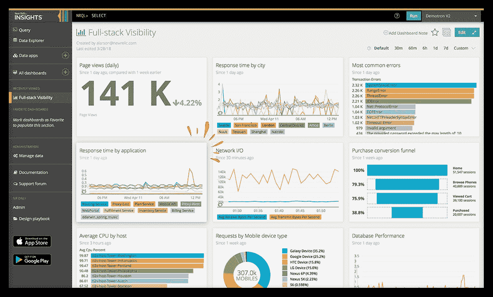
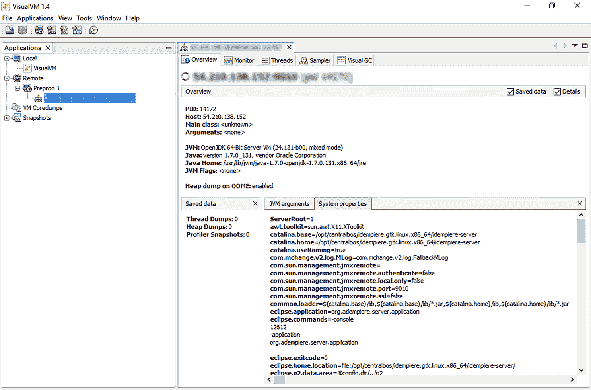
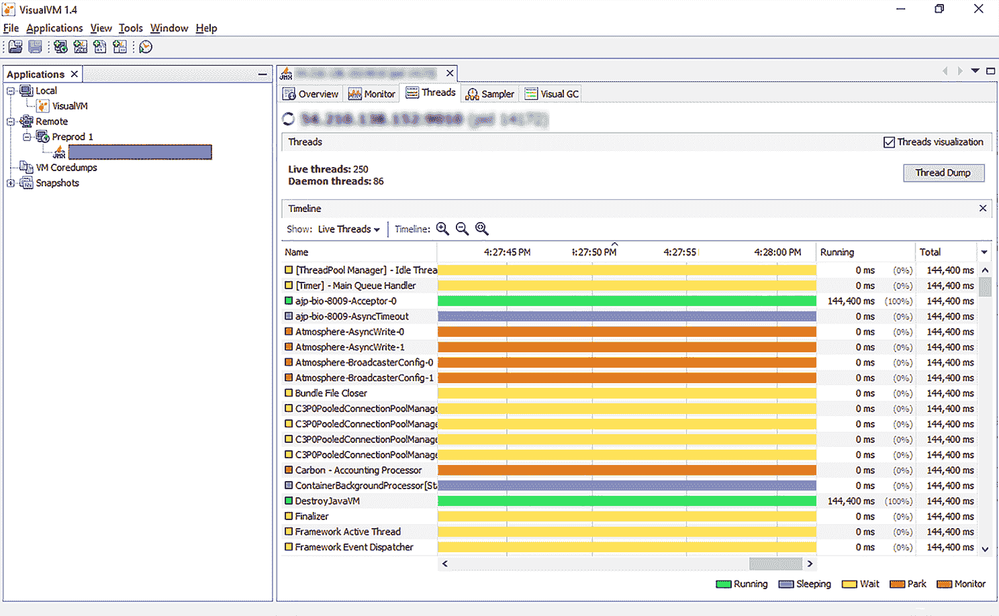
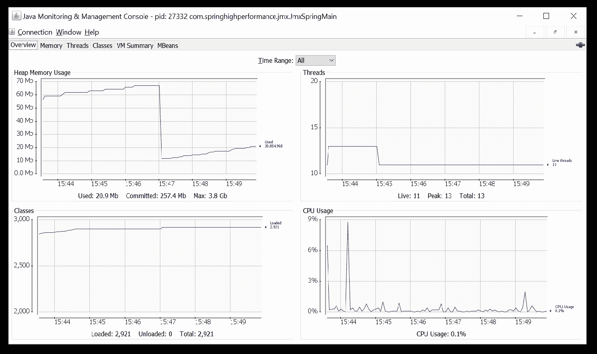

# 第九章：性能分析和日志记录

在上一章中，我们深入研究了多线程和并发编程的细节。我们查看了`java.util.concurrent`包的 API。本章涵盖了用于异步编程的线程池、Spring 任务执行、调度和 Spring Async API。在本章的后半部分，我们将 Spring Async 与`CompletableFuture`进行了比较。

在类似的情况下，本章将重点关注分析和日志记录。本章首先定义了分析和日志记录，以及它们如何有助于评估应用程序性能。在本章的后半部分，重点将放在学习可以用来研究应用程序性能的软件工具上。

本章将涵盖以下主题：

+   性能分析

+   应用程序日志记录和监控

+   性能分析工具

# 性能分析

本节将重点关注性能和应用程序性能分析。分析是应用程序开发和部署生命周期中的重要步骤。它帮助我们执行以下两件事：

1.  定义预期性能结果的基准

1.  衡量并比较当前性能结果与基准

第二步定义了进一步的行动，以将性能提升到基准水平。

# 应用程序性能

性能在软件应用程序方面对不同的人有不同的含义。它必须有一些上下文才能更好地理解。应用程序性能根据两组性能指标进行衡量。应用程序用户实际观察或体验到的性能仍然是衡量应用程序性能的最重要指标之一。这包括在高峰和正常负载期间的平均响应时间。与平均响应时间相关的测量包括应用程序响应用户操作（例如页面刷新、导航或按钮点击）所需的时间。它们还包括执行某些操作（例如排序、搜索或加载数据）所需的时间。

本节旨在为技术团队提供一些配置和内部方面的视角，这些配置和内部方面可以进行设置或更改，以优化效果，从而提高应用程序的性能。通常情况下，技术团队在没有遇到性能问题时很少关注应用程序使用的内存或 CPU 利用率。应用程序事务包括应用程序每秒接收的请求、每秒数据库事务和每秒提供的页面。系统的负载通常是以应用程序处理的交易量来衡量的。

还有另一组测量，涉及测量应用程序在执行操作时所利用的计算资源。这是一个很好的方法，可以确定应用程序是否有足够的资源来承受给定的负载。它还有助于确定应用程序是否利用的资源超出了预期。如果是这样，可以得出结论应用程序在性能方面没有进行优化。云托管应用程序如今很受欢迎。在这个时代，用户在云端部署的应用程序、非云基础设施上以及本地环境上应该有相同的体验是很重要的。

只要应用程序按预期运行，应用程序性能监控和改进可能并不是必要的。然而，在应用程序开发生命周期的一部分，会出现新的需求，添加新功能，并且应用程序变得日益复杂。这开始影响应用程序的性能，因为主要关注点放在了新功能开发上。当性能达不到标准时，因为没有人真正致力于应用程序性能的提升。

# 应用程序日志记录和监控

本节重点关注应用程序运行时记录重要信息。它有助于从各个方面调试应用程序，我们将详细了解。本节涵盖的另一个重要方面是应用程序监控。在某些情况下，应用程序监控被认为与应用程序性能分析没有区别；这些在应用程序性能测量中肯定是不同的方面。

# 应用程序日志

在我们深入了解 Java 应用程序日志的细节之前，了解日志和记录是强制性的。**日志**是显示信息以帮助我们了解应用程序状态的语句。日志语句以应用程序特定的格式写入日志文件。日志语句可能包括诸如特定语句执行的日期和时间、各种变量的值以及对象的状态等信息。将日志语句写入日志文件的过程称为**记录**。

每个应用程序都会出于各种目的生成日志。应用程序生成日志以跟踪应用程序事件，包括与访问相关的事件、登录和注销事件、应用程序发生错误时的事件以及系统配置修改。操作系统也会生成日志文件。日志文件可以被处理以分离所需的信息。**记录**是软件应用程序中最基本的部分之一。良好编写的日志和良好设计的记录机制对开发人员和管理员来说是巨大的实用工具。对于从事应用程序支持活动的团队来说，这是非常有用的。良好设计的记录可以为开发和支持团队节省大量时间。随着前端程序的执行，系统以一种隐形的方式构建日志文件。

以下是通常在应用程序中生成的常见日志文件：

+   **错误/异常日志**：应用程序流程中的任何意外情况都被称为**错误**。错误可能出现的原因各不相同。错误根据严重性和对应用程序的影响进行分类。如果用户无法在应用程序中继续操作，这样的错误被归类为**阻塞**。如果网页没有适当的标签，它被归类为低严重性问题。错误日志是应用程序执行时发生的关键错误的记录。几乎不存在没有错误的应用程序。在 Java 中，不需要记录所有异常。Java 支持受控异常，可以加以处理并作为警告或错误消息抛出给用户。这可能是验证错误或用户输入错误，可以使用受控异常抛出。

+   **访问日志**：在抽象层面上，任何发送到 Web 应用程序的请求都可以被视为对 Web 应用程序服务器上资源的请求。资源可以是 Web 页面、服务器上的 PDF 文件、图像文件或数据库中数据的报告。从安全性的角度来看，每个资源都必须受到访问权限的保护。访问权限定义了谁可以从 Web 应用程序访问资源。访问日志是关于谁尝试访问哪个资源的书面信息。它们还可能包括有关访问资源的位置的信息。访问日志为进入 Web 应用程序的每个请求写入访问信息。访问日志还可以用于查找有关访问者数量、首次访问应用程序的访问者数量、特定位置的访问者数量、特定页面的请求数量以及应用程序使用模式的信息。

+   **事务日志**：事务与数据库相关。为了保持原子性和数据库完整性而执行的一系列数据库命令或语句被称为**事务**。事务用于保证在崩溃或故障时的保护。**事务日志**是记录或写入所有这些事务的文件。在特定时间，如果发现数据库不一致，那么事务日志在调试问题时会有所帮助。事务日志还可以用于记录执行的任何回滚操作。通常，事务日志还记录数据库语句的执行时间以及传递的参数。这些信息对于分析数据库性能问题非常有帮助。

+   **审计日志**：**审计**是检查应用程序的使用情况的过程。它检查正在使用的应用程序资源，访问或使用应用程序资源的用户以及用户的身份验证和授权信息。**审计日志**记录应用程序通过的每个事件，以及前面提到的详细信息。

# 日志记录最佳实践

在描述了应该记录的内容和常见的日志信息之后，本节详细介绍了日志记录的最佳实践：

+   为每个日志语句分配适当的日志级别非常重要。

+   在集群环境中也应考虑日志记录。我们可以使用相同类型的日志文件，文件名后缀为集群节点名称。这将防止在分析日志时覆盖或错误地考虑日志条目。

+   构建日志文件会影响应用程序的性能。如果应用程序开始记录每个细小的信息，应用程序的性能将变慢。我们必须确保日志文件的大小和写入日志条目的频率较低。

+   除了验证和输入错误之外，所有异常都必须记录。异常消息必须以清晰地突出问题的方式记录。最佳实践是让框架记录所有异常。

+   日志必须用户友好且易于解析。日志可以以两种方式使用。一种方式是用户阅读日志以建立理解。另一种方式是实用程序根据日志格式解析应用程序日志，以过滤掉不重要的信息。

+   每个日志条目必须与其他日志条目不同，尽管它们代表相同的信息。每个日志条目都可以有一个唯一的标识符，通常基于时间戳，可以用来区分它与其他日志。

+   不应在日志文件中记录敏感信息。密码、凭据和身份验证密钥是一些例子。

在大多数情况下，最佳实践作为一般指导方针，并可以根据项目以定制化的方式进行遵循。

# 日志记录工具

在本章的前几节中，我们了解了日志记录的重要性。我们还学习了日志记录的最佳实践。现在是时候将日志记录工具添加到我们的技能集中了。本节重点介绍日志记录工具。日志记录工具很有帮助，因为它们提供了各种功能。在过去，日志文件由以纯文本格式编写的日志语句组成。纯文本日志文件在特定情况下仍然有用，比如分析基础设施数据，但它们已经不再足以记录应用程序的信息。Java 内置支持`java.util.logging` API 的标准日志记录。Log4j 是 Java 社区中另一个知名且广泛使用的日志记录工具。

在我们深入了解日志工具的细节之前，了解日志机制的关键要素是很重要的。以下是关键的日志记录组件：

+   **日志级别：** Java 日志级别用于控制日志输出。它们提供了在启用或禁用各种日志级别方面的灵活性。这使得可以选择在日志文件中显示哪些日志。通过这种方式，可能在生产环境中运行的应用程序与在暂存环境中运行的相同应用程序具有不同的日志级别。启用一个级别的日志将使所有更高级别的日志在日志文件中打印。以下是 Java 日志记录 API 的日志级别和有效日志级别：

| **请求级别** | **有效日志级别** |
| --- | --- |
| `SEVERE` | `WARNING` | `INFO` | `CONFIG` | `FINE` | `FINER` | `FINEST` |
| `SEVERE` | 是 | 是 | 是 | 是 | 是 | 是 | 是 |
| `WARNING` | 否 | 是 | 是 | 是 | 是 | 是 | 是 |
| `INFO` | 否 | 否 | 是 | 是 | 是 | 是 | 是 |
| `CONFIG` | 否 | 否 | 否 | 是 | 是 | 是 | 是 |
| `FINE` | 否 | 否 | 否 | 否 | 是 | 是 | 是 |
| `FINER` | 否 | 否 | 否 | 否 | 否 | 是 | 是 |
| FINEST | 否 | 否 | 否 | 否 | 否 | 否 | 是 |

+   **Logger：** `Logger`对象的工作是记录应用程序消息。应用程序可以创建匿名记录器，这些记录器与`Logger`命名空间中的记录器存储方式不同。应用程序必须确保保留对`Logger`对象的引用，因为`Logger`可能随时被垃圾回收。`Logger`对象与父`Logger`对象相关联，父对象是`Logger`命名空间中最近的祖先。在记录过程中，日志消息被发送到`Handler`对象。`Handler`对象将日志消息转发到文件、日志或控制台。每个`Logger`对象都有与之关联的日志级别。它指示`Logger`将为其打印日志的最低级别。

+   **处理程序：** `Handler`对象的责任是从`Logger`对象获取日志消息，并将这些日志消息发送到适当的目的地进行打印。例如，将日志消息写入控制台、将日志消息写入文件或将日志消息写入网络日志记录服务。可以启用或禁用`Handler`，从本质上讲，这会停止在输出介质上打印这些日志。

+   **格式化程序：** 日志`Formatter`在将日志消息写入输出介质之前对其进行格式化。Java 支持两种类型的`Formatter`对象：`SimpleFormatter`和`XMLFormatter`。`XMLFormatter`对象需要在格式化记录周围包含头和尾。还可以创建自定义的`Formatter`对象。

+   **LogManager：** `LogManager`是一个单例对象，用于维护日志记录器和日志服务的共享状态。除此之外，`LogManager`对象还管理日志记录属性和`Logger`命名空间。`LogManager`对象在类初始化时被实例化。对象不能随后更改。`LogManager`默认从`lib/logging.properties`文件中读取初始配置，该文件可以进行修改。

以下图表显示了具有一个`Handler`的日志记录过程：



以下图表显示了具有多个处理程序的日志记录过程：



# Java 标准日志记录

本节介绍了 Java 的内置日志记录机制。Java 日志记录 API 由`java.util.logging`包组成。核心包包括支持将纯文本或 XML 日志条目写入输出流、文件、内存、控制台或套接字。日志 API 还能够与操作系统上已存在的日志记录服务进行交互。

以下代码示例用于使用标准日志记录 API 打印日志消息：

```java
package com.packt.springhighperformance.ch9.logging;

import java.io.FileInputStream;
import java.io.IOException;
import java.sql.Timestamp;
import java.util.logging.Level;
import java.util.logging.LogManager;
import java.util.logging.Logger;

public class SampleLoggingOne {
  private static Logger logger = 
  Logger.getLogger("com.packt.springhighperformance.ch4.logging");

  public static void main(String argv[]) throws SecurityException, 
  IOException {
    FileInputStream fis = new FileInputStream("D:\\projects\\spring-    
    high-performance\\SampleProject\\src\\main\\resources
    \\logging.properties");
    LogManager.getLogManager().readConfiguration(fis);
    Timestamp tOne = new Timestamp(System.currentTimeMillis());
    for(int i=0; i < 100000; i++) {
        logger.fine("doing stuff");
    }
    Timestamp tTwo = new Timestamp(System.currentTimeMillis());
    System.out.println("Time: " + (tTwo.getTime() - tOne.getTime()));
    try {
      Bird.fly();
    } catch (Exception ex) {
      logger.log(Level.WARNING, "trouble flying", ex);
    }
    logger.fine("done");
  }
}
```

以下是前面示例中引用的`logging.properties`文件的示例：

```java
# Logging
handlers = java.util.logging.ConsoleHandler
.level = ALL

# Console Logging
java.util.logging.ConsoleHandler.level = ALL
```

执行前面示例后的输出如下：

```java
Feb 19, 2018 12:35:58 AM com.packt.springhighperformance.ch9.logging.SampleLoggingOne main
FINE: doing stuff
Feb 19, 2018 12:35:58 AM com.packt.springhighperformance.ch9.logging.SampleLoggingOne main
FINE: done
```

使用 Java 标准日志记录的好处是，您不需要安装项目中的单独的 JAR 依赖项。尽管日志记录与我们在服务器上遇到的故障排除问题有关，但我们还必须确保日志记录不会以负面方式影响应用程序性能。必须注意以下几点，以确保日志记录不会影响应用程序性能：

+   `Logger.log`方法用于通过`Handler`在输出介质上打印日志记录。我们可以使用`Logger.isLoggable`来确保`Logger`已启用日志级别。如果我们将自定义对象作为参数传递给`Logger.log`方法，则将从库类的深处调用自定义对象的`toString`方法。因此，如果我们想要执行繁重的操作以准备对象进行日志记录，我们应该在检查`Logger.isLoggable`的块内部，或者在对象的`toString`方法内部执行。

+   我们不得调用任何对象的`toString`方法以获取日志消息内容。我们也不得将`toString`方法调用作为参数传递给`Logger.log`。`Logger`对象和日志记录框架负责调用自定义对象的`toString`方法。

+   必须避免格式字符串连接和日志参数的混合。应用程序用户可能会以错误的意图破坏日志并访问用户未被允许访问的数据，使用恶意连接的字符串是可能的。

Java 标准日志记录的一个主要缺点是性能比较低。标准日志记录所需的时间比其他基于 Java 的日志记录框架（如 Apache Log4j 2、commons logging 或**Simple Logging Facade for Java**（**SLF4J**））更长。

# Apache Log4j 2

Apache Log4j 是 Java 社区中最广泛使用的日志记录框架之一。它是用 Java 编写的，并在 Apache 软件许可下分发。Apache Log4j 2 是早期版本的修订版。最显著的功能包括线程安全性、性能优化、命名记录器层次结构和国际化支持。

为了设置 Log4j 2，必须在 Maven `pom.xml`文件中添加以下 Maven 依赖项：

```java
<dependency>
  <groupId>org.apache.logging.log4j</groupId>
  <artifactId>log4j-core</artifactId>
  <version>2.7</version>
</dependency>

<dependency>
  <groupId>org.apache.logging.log4j</groupId>
  <artifactId>log4j-core</artifactId>
  <version>2.7</version>
  <type>test-jar</type>
  <scope>test</scope>
</dependency>
```

为了获得测试命名配置文件所需的上下文规则，我们必须在 Maven `pom.xml`文件中包含`test` JAR，以及主要的`log4j-core`包。

Log4j 2 有三个主要的日志记录组件：

+   `Loggers`**：**`Loggers`负责捕获日志信息。

+   `Appenders`**：**这些与 Java 标准日志记录中的`Handler`对象类似。`Appenders`负责将日志信息或消息广播到配置的输出介质。

+   `Layouts`**：**`Layouts`负责将日志消息格式化为配置的样式。

以下是`log4j2.xml`文件的示例：

```java
<?xml version="1.0" encoding="UTF-8"?>
<Configuration status="WARN">
  <Appenders>
    <Console name="ConsoleAppender" target="SYSTEM_OUT">
      <PatternLayout pattern="%d [%t] %-5level %logger{36} - 
      %msg%n%throwable" />
    </Console>
  </Appenders>
  <Loggers>
    <Root level="ERROR">
      <AppenderRef ref="ConsoleAppender" />
    </Root>
  </Loggers>
</Configuration>
```

以下是 Log4j 2 Java 代码示例：

```java
package com.packt.springhighperformance.ch9.logging;

import org.apache.log4j.Logger;

public class SampleLog4j2Example {
  private static Logger logger = 
  Logger.getLogger(SampleLog4j2Example.class);

  public static void main(String argv[]) {
    logger.info("example info log");
    try {
      Bird.fly();
    } catch (Exception ex) {
      logger.error("example error log", ex);
    }
    logger.warn("example warning log");
  }
}
```

执行上述示例时，将产生以下输出：

```java
2018-02-22 01:18:09 INFO SampleLog4j2Example:9 - example info log
2018-02-22 01:18:09 WARN SampleLog4j2Example:15 - example warning log
```

Apache Log4j 2 具有超出常见日志级别的额外日志级别。这些是`ALL`和`OFF`级别。当我们想要启用`ALL`日志级别时，使用`ALL`日志级别。如果配置了`ALL`日志级别，则不考虑级别。`OFF`日志级别是`ALL`日志级别的相反。它禁用所有日志记录。

# 应用程序监控

如前所述，应用程序性能被认为是任何软件应用程序生命周期中最重要的里程碑之一。还需要应用程序能够持续良好地运行。这是我们确保应用程序用户将获得最佳体验的一种方式。这也意味着应用程序正常运行。应用程序性能监控工具跟踪应用程序中进出的每个请求和响应，处理来自请求的信息，并在图形用户界面中响应和显示。这意味着监控工具为管理员提供了快速发现、隔离和解决影响性能的问题所需的数据。

监控工具通常收集有关 CPU 利用率、内存需求、带宽和吞吐量的数据。可以为不同的监控系统设置多个监控系统。任何应用程序性能监控的重要方面之一是将这些监控系统的数据合并到统计分析引擎中，并在仪表板上显示。仪表板使数据日志易于阅读和分析。应用程序监控工具帮助管理员监控应用程序服务器，以便遵守**服务级别协议**（**SLA**）。设置业务规则以在出现问题时向管理员发送警报。这确保了业务关键功能和应用程序被视为更高优先级。在快速变化的环境中，快速部署在生产系统中变得非常重要。快速部署意味着引入影响系统架构的错误或减慢系统运行的机会更多。

基于这些基本概念，有许多实现和工具可用。应用程序监控工具市场庞大而拥挤，包括行业领先和知名工具，如 AppDynamics、New Relic 和 Dynatrace。除了这些知名工具，还存在开源应用程序监控工具。开源工具包括 Stagemonitor、Pinpoint、MoSKito、Glowroot、Kamon 等。我们将在以下部分详细介绍这些工具。

# Stagemonitor

Stagemonitor 具有支持集群应用程序堆栈的监控代理。该工具的目的是监控在多台服务器上运行的应用程序，这是一个常见的生产场景。Stagemonitor 经过优化，可与时间序列数据库集成。它经过优化，用于时间序列数据管理，包括按时间索引的数字数组。这些数据库包括 elasticsearch、graphite 和 InfluxDB。Stagemonitor 也可以在私有网络中设置。它使用开放跟踪 API 来关联分布式系统中的请求。它具有定义指标阈值的功能。Stagemonitor 还支持创建新插件和集成第三方插件。

Stagemonitor 包含一个基于 Java 的代理。代理位于 Java 应用程序中。代理连接到中央数据库，并发送指标、请求跟踪和统计信息。Stagemonitor 需要一个实例来监控所有应用程序、实例和主机。

在浏览器中，在监控端，我们可以看到集群的历史或当前数据。我们还可以创建自定义警报。还可以为每个指标定义阈值。Stagemonitor 有一个仪表板。该仪表板用于可视化和分析不同的感兴趣的指标和请求。Stagemonitor 支持创建自定义仪表板、编写自定义插件和使用第三方插件。它还支持浏览器小部件，而无需后端，并自动注入到受监视的网页中。

以下是 Stagemonitor 仪表板的屏幕截图供参考：



Stagemonitor 仪表板视图（来源：http://www.stagemonitor.org/）

# Pinpoint

Pinpoint 与 Stagemonitor 不同之处在于，它是针对大规模应用程序开发的。它是在 Dapper（由 Google 开发的分布式系统跟踪基础设施）之后开发的，旨在为开发人员提供有关复杂分布式系统行为的更多信息。

Pinpoint 有助于分析整个系统结构以及系统不同组件之间的相互关系。Pinpoint 通过跟踪分布式应用程序中的事务来实现这一点。它旨在解释每个事务的执行方式，跟踪组件之间的流动以及潜在的瓶颈和问题区域。

Pinpoint 类似于 Stagemonitor，具有用于可视化的仪表板。该仪表板有助于可视化组件之间的相互关系。该仪表板还允许用户在特定时间点监视应用程序中的活动线程。Pinpoint 具有跟踪请求计数和响应模式的功能。这有助于识别潜在问题。它支持查看关键信息，包括 CPU 利用率、内存利用率、垃圾收集和 JVM 参数。

Pinpoint 由四个组件组成，分别是 Collector、Web、Sample TestApp 和 HBase。我们可以通过分别为每个组件执行脚本来运行一个实例。

以下是参考的 Pinpoint 仪表板：



Pinpoint 仪表板参考视图（来源：http://www.testingtoolsguide.net/tools/pinpoint-apm/）

# MoSKito

MoSKito 是三个工具的组合：

+   **MoSKito-Essential**：这个独立项目是 MoSKito 的核心。它使监视应用程序成为可能。

+   **MoSKito-Central**：这是一个集中式存储服务器。它存储所有与性能相关的信息。

+   **MoSKito-Control**：这个工具适用于多节点 Web 应用程序。它提供了对多节点 Web 应用程序的监视支持。

要设置 MoSKito，我们需要在应用程序的`WEB-INF/lib`目录中安装一个 JAR 文件，这是一个常用的存放 API 库的文件夹。也可以通过在`web.xml`文件中添加一个新的部分来设置。

该工具能够收集所有应用程序性能指标，包括内存、线程、存储、缓存、注册、付款、转换、SQL、服务、负载分布等等。它不需要用户在应用程序中进行任何代码更改。它支持所有主要的应用服务器，包括 Tomcat、Jetty、JBoss 和 Weblogic。它将数据存储在本地。

MoSKito 还具有通知功能，当达到阈值时会广播警报。它还记录用户的操作，这可能对监视目的有所帮助。MoSKito 提供了一个用于在移动设备上监视应用程序的移动应用程序。它还具有基于 Web 的仪表板。

MoSKito 的一个显著特点是它在 Java 社区中非常稳定和知名。它得到了社区和团队的支持，包括付费支持。

以下是 MoSKito 仪表板的参考：



MoSKito 仪表板视图（来源：https://confluence.opensource.anotheria.net/display/MSK/Javaagent+light+and+multiple+java+processes）

# Glowroot

Glowroot 是一种快速、干净、简单的应用程序性能监控工具。它具有一个功能，允许跟踪慢请求和错误。使用 Glowroot，还可以记录每个用户操作所花费的时间。Glowroot 支持 SQL 捕获和聚合。Glowroot 提供的历史数据滚动和保留配置是其提供的附加功能之一。

Glowroot 支持在图表中可视化响应时间的分解和响应时间百分位数。它具有响应灵敏的用户界面，允许用户使用移动设备以及桌面系统监视应用程序，无需进行任何额外的安装。

Glowroot 以 ZIP 文件捆绑提供。要开始使用 Glowroot，我们必须下载并解压 ZIP 文件捆绑。Glowroot 需要更改应用程序的 JVM 参数。我们必须在应用程序的 JVM 参数中添加`-javaagent:<path to glowroot.jar>`。

Glowroot 一旦设置并运行，就提供了带有过滤的持续性能分析。我们还可以设置响应时间百分位数和 MBean 属性的警报。Glowroot 还支持跨多个线程的异步请求。在应用服务器方面，Glowroot 支持 Tomcat、Jetty、JBoss、Wildfly 和 Glassfish。

以下是 Glowroot JVM 仪表板供参考：



Glowroot JVM 仪表板视图（来源：https://demo.glowroot.org）

# New Relic

New Relic 是 Java 社区中另一个广泛使用的应用程序性能监控工具。New Relic 为应用程序和网络性能统计提供了分组视图。这有助于快速诊断域级问题。它还提供了针对特定请求的深入功能，以查看响应时间、数据传输大小和吞吐量的性能指标。

New Relic 支持使用 Java、Scala、Ruby、Python、PHP、.NET 和 Node.js 开发的应用程序。New Relic 提供了四种不同的后端监控方法：

+   **应用程序性能管理**：在应用程序性能管理中，New Relic 提供高级指标，并能够深入到代码级别，以查看应用程序的性能。在仪表板上，New Relic 显示响应时间图表。New Relic 使用 Apdex 指数评分方法将指标转化为性能指标。New Relic 要求用户手动设置阈值。

+   **服务器监控**：New Relic 关注应用程序服务器运行的硬件。测量包括 CPU 使用率、内存利用率、磁盘 I/O 和网络 I/O。New Relic 提供了堆内存和垃圾回收属性的简要详情。

+   **数据库监控**：在 New Relic 中，数据库仪表板是应用程序性能管理仪表板的一部分。可以通过插件查看数据库监控指标。

+   **洞察和分析**：New Relic 具有内置的、可选择的数据库，用于存储统计数据并实现对数据库的查询。

以下是 New Relic 仪表板供参考：



New Relic 仪表板视图（来源：https://newrelic.com/）

# 性能分析工具

性能分析工具，或者分析器，是应用程序开发人员用来调查和识别代码特征和问题的软件工具。性能分析工具还有助于识别性能问题。性能分析工具回答问题，比如 JVM 参数设置是什么，堆内存的状态如何，基于代的内存利用情况如何，哪些线程是活跃的等等。一些分析器还跟踪代码中的方法，以了解 SQL 语句调用的频率，或者 Web 服务调用的频率。

与应用程序性能监控工具类似，市场上有许多性能分析工具。VisualVM、JConsole 和 HeapAnalyzer 是其中的几个。我们将在接下来的部分详细讨论每个性能分析工具。

# VisualVM

VisualVM 是一个 Java 性能分析和性能分析工具。它具有可视化界面，用于分析在本地和远程环境中在 JVM 上运行的 Java 应用程序的详细信息。它集成并利用了 JDK 提供的命令行工具，如`jstack`，`jconsole`，`jmap`，`jstat`和`jinfo`。这些工具是标准 JDK 分发的一部分。VisualVM 在解决运行时问题方面非常重要，具有堆转储和线程分析等功能。它有助于识别应用程序性能以及其与基准的比较情况。它还有助于确保最佳的内存使用。它进一步有助于监视垃圾收集器，分析 CPU 使用情况，分析堆数据和跟踪内存泄漏。以下是 VisualVM 使用的每个命令行工具的目的：

+   `jstack`**：**这个工具用于捕获 Java 应用程序的线程转储

+   `jmap`**：**这个工具打印给定进程的共享对象内存映射和堆内存详细信息

+   `jstat`**：**这个工具显示运行应用程序的 JVM 的性能统计信息

+   `jinfo`**：**这个工具打印 Java 配置信息

VisualVM 是标准 JDK 捆绑包的一部分。它首次与 JDK 平台捆绑在 JDK 版本 6，更新 7 中。它也可以单独安装。让我们详细看看每个部分：



VisualVM 的应用程序窗口视图

如前面的屏幕截图所示，在窗口的左侧有一个应用程序窗口。应用程序窗口具有节点和子节点。可以展开节点和子节点以查看配置的应用程序和保存的文件。通过右键单击节点并从弹出菜单中选择项目，可以查看其他信息或执行操作。弹出菜单选项因所选节点而异。

在应用程序窗口内，我们可以看到一个本地节点的菜单。本地节点显示有关在与 VisualVM 相同的计算机上运行的 Java 进程的进程名称和进程标识符的信息。启动 VisualVM 后，当展开本地根节点时，本地节点会自动填充。VisualVM 始终加载为本地节点之一。服务终止时，节点会自动消失。如果我们对应用程序进行线程转储和堆转储，这些将显示为子节点。

可以使用 VisualVM 连接到在远程计算机上运行的 JVM。所有这些运行的进程或应用程序都显示在远程节点下。与远程节点建立连接后，可以展开远程节点以查看在远程计算机上运行的所有 Java 应用程序。

如果应用程序在 Linux 或 Solaris 操作系统上运行，则 VM Coredumps 节点仅可见。在 VisualVM 中打开核心转储文件时，VM Coredumps 节点显示打开的核心转储文件。这是一个包含有关机器运行时状态的二进制文件。

应用程序窗口中的最后一个部分标有快照。快照部分显示在应用程序运行时拍摄的所有保存的快照。

VisualVM 中的本地或远程应用程序的数据以选项卡的形式呈现。在查看应用程序数据时，默认情况下打开概述选项卡。概述选项卡显示的信息包括进程 ID，系统位置，应用程序的主类，Java 安装路径，传递的 JVM 参数，JVM 标志和系统属性。

列表中的下一个选项卡是监视选项卡。监视选项卡可用于查看有关堆内存，永久代堆内存以及类和线程数量的实时信息。这里的类表示加载到虚拟机中的类。应用程序监视过程的开销较低。

监视选项卡上的堆图显示了总堆大小和当前使用的堆大小。在 PermGen 图中显示了永久代区域随时间的变化。类图显示了加载和共享类的总数。线程部分显示了活动线程和守护线程的数量信息。VisualVM 可以用于获取线程转储，显示特定时间的线程的确切信息。

在监视选项卡中，我们可以强制执行垃圾回收。该操作将立即运行垃圾回收。还可以从监视选项卡中捕获堆转储：



VisualVM 在线程选项卡中显示实时线程活动。默认情况下，线程选项卡显示当前线程活动的时间轴。通过单击特定线程，可以在详细信息选项卡中查看有关该特定线程的详细信息。

时间轴部分显示了带有实时线程状态的时间轴。我们可以通过选择下拉菜单中的适当值来过滤显示的线程类型。在上述屏幕截图中，显示了活动线程的时间轴。我们还可以通过从下拉菜单中选择来查看所有线程或已完成线程。

在应用程序运行时，我们可以选择获取应用程序的线程转储。打印线程转储时，会显示包括 Java 应用程序的线程状态的线程堆栈。

分析器选项卡使得可以启动和停止应用程序的分析会话。结果显示在分析器选项卡中。可以进行 CPU 分析或内存分析。启动分析会话后，VisualVM 连接到应用程序开始收集分析数据。一旦结果可用，它们将自动显示在分析器选项卡中。

# JConsole

JConsole 是另一个 Java 分析工具。它符合**Java 管理扩展**（**JMX**）规范。JConsole 广泛使用 JVM 中的仪器来收集和显示运行在 Java 平台上的应用程序的性能和资源消耗的信息。JConsole 在 Java SE 6 中更新为 GNOME 和 Windows 外观。

与 VisualVM 类似，JConsole 与 Java 开发工具包捆绑在一起。JConsole 的可执行文件可以在`JDK_HOME/bin`目录中找到。可以使用以下命令从命令提示符或控制台窗口启动 JConsole：

```java
jconsole
```

执行上述命令后，JConsole 会向用户显示系统上运行的所有 Java 应用程序的选择。我们可以选择连接到任何正在运行的应用程序。

如果我们知道要连接到的 Java 应用程序的进程 ID，也可以提供进程 ID。以下是启动 JConsole 并连接到特定 Java 应用程序的命令：

```java
jconsole <process-id>
```

可以使用以下命令连接到在远程计算机上运行的 Java 应用程序：

```java
jconsole hostname:portnumber
```

JConsole 在以下选项卡中显示信息：

+   概述：此选项卡显示有关 JVM 和要监视的值的信息。它以图形监视格式呈现信息。信息包括有关 CPU 使用情况、内存使用情况、线程计数以及 JVM 中加载的类数量的概述细节。

+   内存：此选项卡显示有关内存消耗和使用情况的信息。内存选项卡包含一个执行 GC 按钮，可以单击以立即启动垃圾回收。对于 HotSpot Java VM，内存池包括伊甸园空间、幸存者空间、老年代、永久代和代码缓存。可以显示各种图表来描述内存池的消耗情况。

+   线程：此选项卡显示有关线程使用情况的信息。线程包括活动线程、活动线程和所有线程。图表的表示显示了线程的峰值数量和两条不同线上的活动线程数量。MXBean 提供了线程选项卡未涵盖的其他信息。使用 MXBean，可以检测到死锁线程。

+   类：此选项卡显示了 Java 虚拟机中加载的类的信息。类信息包括迄今为止加载的类的总数，包括后来卸载的类以及当前加载的类的数量。

+   VM：此选项卡显示有关 Java 虚拟机的统计信息。摘要包括正常运行时间，表示 JVM 启动以来的时间量；进程 CPU 时间，表示 JVM 自启动以来消耗的 CPU 时间量；以及总编译时间，表示用于编译过程的时间。

+   MBeans：此选项卡显示有关 MBeans 的信息。MBeans 包括当前正在运行的 MBeans。我们可以通过选择 MBean 来获取`MBeanInfo`描述符信息。

以下截图显示了 JConsole 仪表板的外观：



# 总结

本章充满了有关应用程序性能测量技术的信息。本章对于致力于应用程序性能增强任务的开发团队非常有用。同时，技术团队在设置其应用程序日志记录机制时也可以参考本章。

本章从性能分析和日志记录的简介细节开始。继续前进，我们了解了特定应用程序性能监控和应用程序日志记录。我们了解了日志记录的关键要素是什么。我们还研究了日志记录工具，如标准 Java 日志记录和 Log4j。在本章的后半部分，我们了解了 VisualVM 作为性能分析工具。VisualVM 是最广泛使用的基于 Java 的性能分析工具之一，作为标准 Java 分发包提供。就是这样了。

下一章将重点关注优化应用程序性能。在进行性能优化时，可以利用本章提供的知识和信息。本章为下一章提供了基础。下一章涵盖了识别性能问题症状、性能调优生命周期和 Spring 中的 JMX 支持的详细信息。非常令人兴奋，不是吗？
