# 第十章：应用性能优化

在上一章中，我们重点介绍了如何对应用程序进行分析以找出应用程序的性能问题。我们还涵盖了日志记录，这是识别应用程序问题的有用工具。这是一个重要的部分，并且在我们处理 Spring 应用程序时将成为我们日常工作的一部分。

现在让我们看看本章内容。这是本书中的一个关键章节；它为您提供了改善应用性能的方法。在本章中，我们将讨论应用性能优化的基本方法，这对于任何应用程序都是关键的，包括基于 Spring 的应用程序。我们将讨论 Spring 对 Java 管理扩展（JMX）的支持，数据库交互的改进以及 Spring 应用程序的性能调优。通过本章结束时，您将能够识别 Spring 应用程序中的性能瓶颈并解决它们。

让我们以结构化的方式来看应用性能优化的重要方面。我们将涵盖以下主题：

+   性能问题症状

+   性能调优生命周期

+   性能调优模式和反模式

+   迭代性能调优过程

+   Spring 对 JMX 的支持

# 性能问题症状

让我们从性能问题症状开始。这是一个明显的起点，就像咨询医生一样，首先讨论症状，然后做出诊断。应用性能是用户在速度、交付内容的准确性和最高负载下的平均响应时间方面所经历的行为。负载是指应用程序每单位时间处理的交易数量。响应时间是应用程序在这样的负载下响应用户操作所需的时间。

每当性能需要改进时，首先想到的是影响我们应用程序性能的问题。要找出性能问题，我们需要寻找一些症状，这些症状可以引导我们找到问题。

在 Spring 应用中可能观察到的一些常见症状如下：

+   超时

+   工作线程不足

+   线程等待类加载器

+   即使在正常负载下，加载类所花费的大量时间

+   类加载器尝试加载不存在的类

在接下来的章节中，我们将通过一个示例情境来理解这些症状。这些细节将帮助我们在发生时识别症状。

# 超时

超时以两种不同的方式发生。一种是请求超时，由 HTTP 响应状态码 408 表示。另一种超时是网关超时，由 HTTP 响应状态码 504 表示。

请求超时表示服务器未能在指定时间内从客户端接收完整的请求。在这种情况下，服务器选择与客户端关闭连接。请求超时是服务器直接的错误消息。

网关超时表示网关或代理服务器在处理请求时超时。在大多数情况下，这是因为代理或网关未能及时从上游的实际服务器接收到响应。

# 工作线程不足

以银行为例；银行拥有一个带有监控系统的 Web 应用程序。监控系统关注 JVM 的强度。测量参数包括内存、CPU、I/O、堆内存和其他各种属性。监控系统提供了独特的仪表板，显示并突出显示了上述属性的测量结果。还有一个附带的仪表板，显示了银行应用程序中执行的活动组。该仪表板还确定了 JVM 在访问专门的应用程序资源（如线程）时开始运行低的活动组。该应用程序在多个 JVM 环境中运行。以下是一个示例仪表板的屏幕截图，仅供参考：

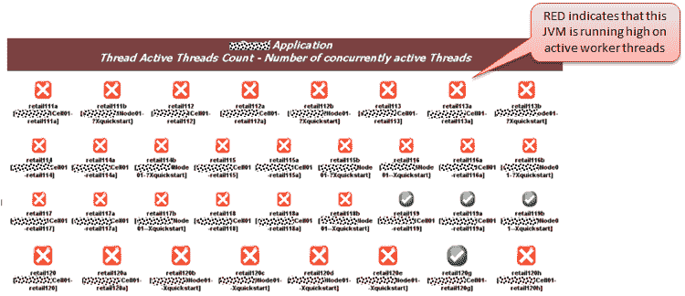

监控系统配置了阈值。例如，JVM 一次使用的最大线程数不应超过 250 个。当 JVM 一次使用的线程少于 150 个时，仪表板中相应的 JVM 指示灯为绿色。当 JVM 开始使用超过 150 个线程时，监控系统会将该 JVM 指示为红色。这是一个症状，表明可能会发生故障或性能受到异常影响。

以下是一个基于时间线的屏幕截图，显示了 JVM 的工作线程达到最大值：

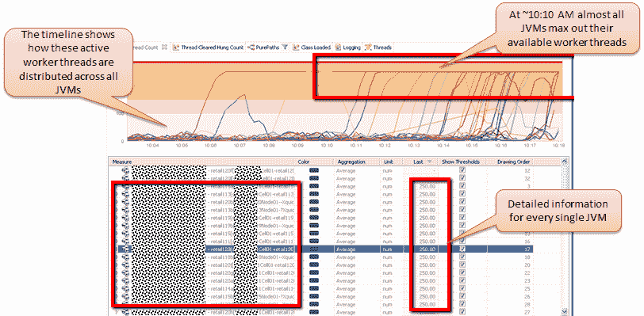

# 线程在类加载器上等待

继续使用前一节中描述的相同示例，首先出现的问题是，这些线程有什么问题？深入研究线程并分解状态后发现，这些线程（大约 250 个中的 242 个）正在寻找服务器的`CompoundClassLoader`。这些线程正在堆叠额外的对象，这就是它们正在寻找类加载器的原因。由于大量线程试图访问这个共享资源——类加载器，大多数线程都陷入了暂停状态。

监控显示了等待`CompoundClassLoader`的线程数量：

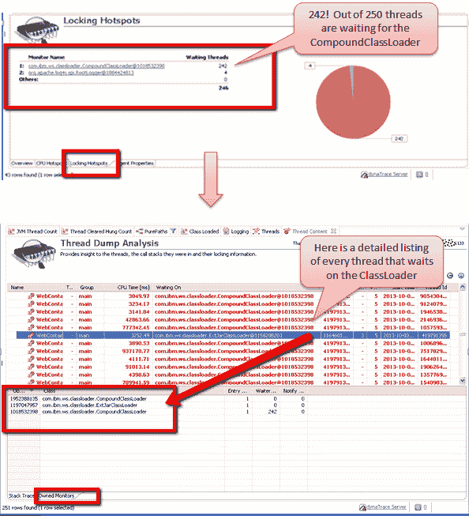

# 在类加载活动上花费的时间

在监控系统中进行的分析还表明，线程大部分时间都花在类加载活动上。以下是突出显示这一点的监控系统截图：

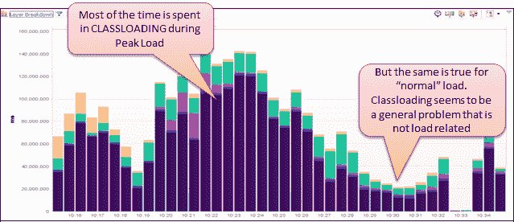

从监控系统的先前屏幕截图来看，很明显，无论当前负载如何，与请求处理生命周期中的其他活动相比，类加载活动都需要相当长的时间。这是性能问题的指标或症状，因为它会增加整体响应时间。在银行的情况下，可以通过评估平均响应时间来确认。

# 类加载器尝试加载不存在的类

一个问题出现了：类堆叠是否非常重要？深入挖掘并查看处理的请求，表明每个请求都试图堆叠一个不存在的类。应用服务器正在提示大量的`ClassNotFoundException`类。问题的主要驱动因素是该类无法被有效地堆叠，但应用服务器继续尝试为每个请求堆叠它。这对于快速和中等请求和功能来说不应该是一个问题。对于每个传入请求或功能的这种细节水平可能会占用稀缺资源——类加载器，并因此影响请求的响应时间。

监控系统的能力、适应性和容量是捕捉每个请求和响应以及有关堆叠类数据的关键。以下屏幕截图显示了应用框架中的一个这样的场景：

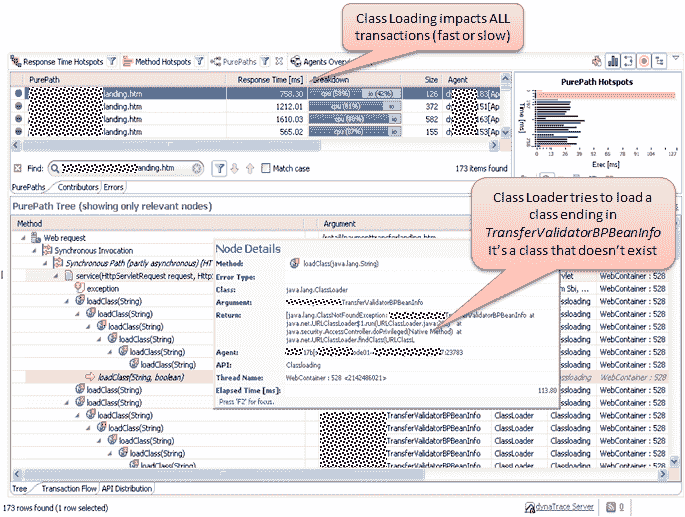

现在应该清楚了潜在性能问题的症状。这特别适用于任何基于 JVM 的 Web 应用程序，而不仅仅是基于 Spring 的 Web 应用程序。以下截图显示了基本上可以帮助我们识别性能问题影响的指针。

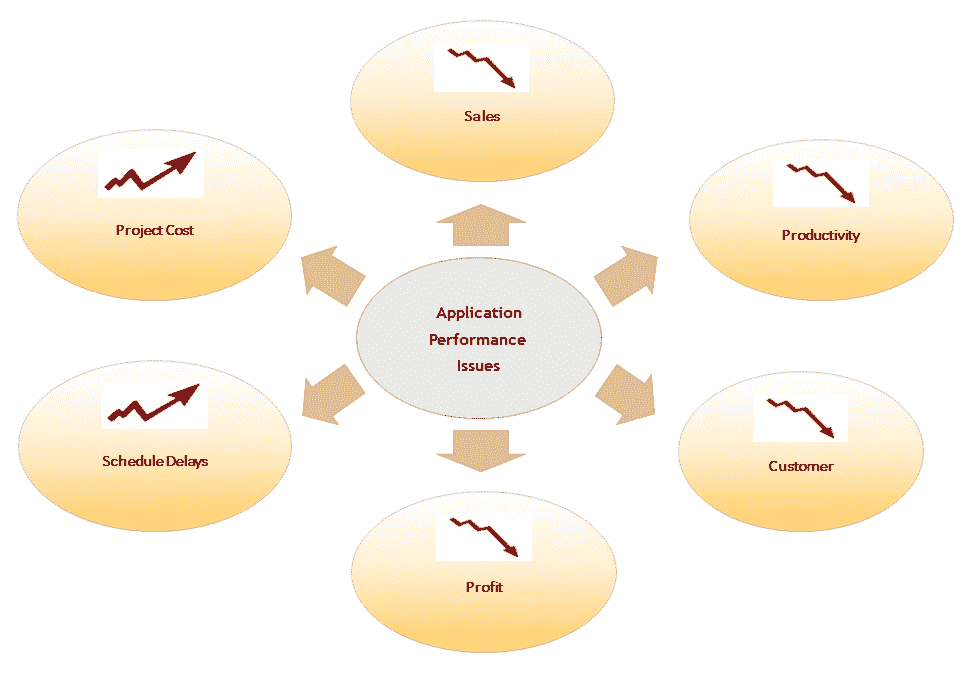

性能不佳的应用对企业非常重要，因为它们因应用性能而导致销售额下降。应用也可能因性能问题而导致生产率或业务损失。

让我们通过一个基本示例来了解性能问题对业务的影响：

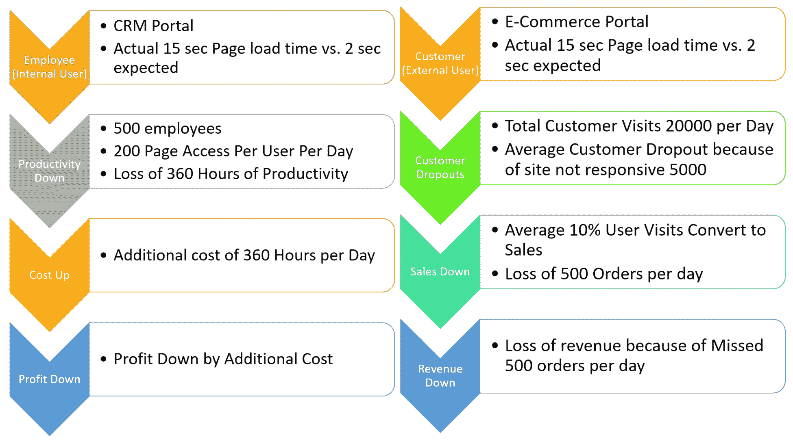

从上图可以理解，糟糕的应用行为会影响业务，可能导致项目成本高、转化率下降、重复访问减少、客户保留率低、销售额下降、生产率下降、客户流失、项目成本增加，以及利润和投资回报的延迟或下降。性能对企业非常重要。

我们需要做什么来避免或解决性能问题？不要等待性能问题发生。提前进行架构、设计和代码审查，并计划进行负载测试、调优和基准测试。如今，在竞争激烈的市场中，组织的关键是确保其系统以最佳性能运行。任何故障或停机都直接影响业务和收入；应用程序的性能是一个不容忽视的因素。由于技术的广泛应用，数据量日益增长。因此，负载平均值正在飙升。在某些情况下，无法保证数据不会超出限制或用户数量不会超出范围。

在任何时候，我们都可能遇到意想不到的扩展需求。对于任何组织来说，其应用程序提供可伸缩性、性能、可用性和安全性非常重要。在多个服务器上分布数据库以满足不同应用程序查询的应用程序可伸缩性，无论是水平扩展还是垂直扩展，都是相当可行的。向集群添加计算能力以处理负载非常容易。集群服务器可以立即处理故障并管理故障转移部分，以保持系统几乎一直可用。如果一个服务器宕机，它将重定向用户的请求到另一个节点并执行所请求的操作。如今，在竞争激烈的市场中，组织的关键是确保其系统正常运行。任何故障或停机都直接影响业务和收入；高可用性是一个不容忽视的因素。

以下图表显示了我们可能遇到的一些常见性能问题：

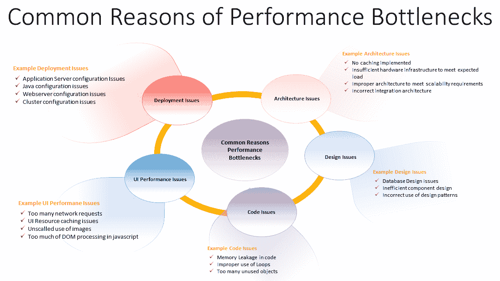

现在，让我们来看看性能调优生命周期的各个阶段。

# 性能调优生命周期

速度是每个企业的核心。在这个超连接的现代世界中，大多数人着迷的是速度；无论是最快的汽车、最快的计算机处理器，甚至是最快的网站。网站性能已经成为每个企业的最高优先级。用户的期望比以往任何时候都更高。如果您的网站不能立即响应，很有可能用户会转向竞争对手。

沃尔玛的一项研究发现，每提高 1 秒的页面性能，转化率就会增加 2%。

Akamai 的一项研究发现：

+   47%的人期望网页在两秒内加载完成

+   如果一个网页加载时间超过三秒，40%的人会放弃访问

+   52%的在线购物者表示快速页面加载对他们对网站的忠诚度很重要

2007 年，亚马逊报告称，亚马逊（[`www.amazon.com/`](https://www.amazon.com/)）的加载时间每增加 100 毫秒，销售额就会减少 1%。

借助以下图，我们可以轻松理解性能调优生命周期的不同阶段：

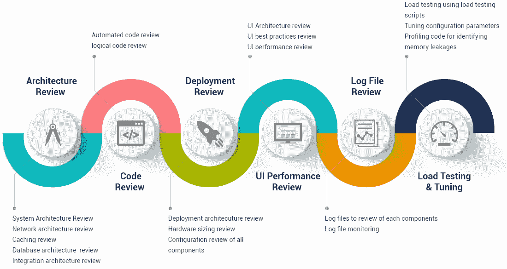

在大多数情况下，通过在适当的时候审查以下工件，可以避免性能问题：

+   架构

+   设计

+   代码

+   聘请专家顾问在适当的时候进行应用程序审查

+   在开发阶段完成之前的任何时间进行审查

+   强烈建议提前识别性能优化问题，这可以在架构阶段完成之前开始

+   在向用户提供应用程序之前，最好预防性能问题

+   进行各种审查和测试，以避免生产中的性能问题

+   性能调优生命周期也可以在投入生产后或在生产环境中面临性能问题时进行

为了调整 Spring 应用程序的性能，以下部分描述的策略可能非常有用。

# 连接池

**连接池**是一种帮助应用程序执行的策略，其中打开和管理数据库的*N*个连接在池中。应用程序只需请求连接，使用它，然后将其放回池中。当应用程序请求连接时，准备好的连接保持可用以供池中使用。池管理连接的生命周期，以至于开发人员实际上不必等待连接并筛选过时的连接。

Hibernate 利用其魔力来识别要使用的连接池提供程序 - 基于您配置的属性。

以下是 c3p0 连接池的属性配置：

```java
<property name="hibernate.c3p0.min_size">5</property>
<property name="hibernate.c3p0.max_size">20</property>
<property name="hibernate.c3p0.timeout">300</property>
<property name="hibernate.c3p0.max_statements">50</property>
<property name="hibernate.c3p0.idle_test_period">3000</property>
```

以下是 Apache Commons DBCP 的连接池属性配置示例：

```java
<property name="hibernate.dbcp.initialSize">8</property>
<property name="hibernate.dbcp.maxActive">20</property>
<property name="hibernate.dbcp.maxIdle">20</property>
<property name="hibernate.dbcp.minIdle">0</property>
```

在使用任何连接池机制时，我们必须手动将 JAR 依赖项放置在服务器类路径中，或者使用 Maven 等依赖管理工具。

还可以使用`hibernate.connection.provider_class`属性明确指定连接提供程序，尽管这不是强制性的。

如果我们不使用 Hibernate 配置连接池，默认会使用。当启动应用程序时，可以在日志或控制台输出中看到：

```java
org.hibernate.engine.jdbc.connections.internal.DriverManagerConnectionProviderImpl configure
```

Hibernate 的默认连接池对于开发环境是一个不错的选择，但是在生产环境中，建议根据要求和用例配置连接池。

如果您使用应用程序服务器，可能希望使用内置池（通常使用**Java 命名和目录接口**（**JNDI**）获取连接）。

要使用服务器的内置池与使用 JNDI 配置的 Hibernate 会话，我们需要在 Hibernate 配置文件中设置以下属性：

```java
hibernate.connection.datasource=java:/comp/env/jdbc/AB_DB
```

假设`AB_DB`是 Tomcat JDBC 连接池`DataSource`的 JNDI 名称。

如果您不能或不希望使用应用程序服务器内置的连接池，Hibernate 支持其他几种连接池，例如：

+   c3p0

+   Proxool

在 Apache DBCP 之后，第二受欢迎的连接池实现是 c3p0，它可以轻松集成 Hibernate，并且据说性能良好。

# Hibernate

连接池机制确保应用程序在需要时不会耗尽数据库连接。Hibernate 是 Java 应用程序的最佳 ORM 框架之一。在使用时，必须进行性能优化。

# 事务

Hibernate 只在需要时进行脏检查，以考虑执行成本。当特定实体具有与大量列对应的表时，成本会增加。为了尽量减少脏检查成本，最好我们通过指定一个交易来帮助 Spring 进行读取，这将进一步提高执行效率，消除了任何脏检查的需求。

以下是`@Transactional`注解的一个示例用法，该注解表示该方法在 Hibernate 事务中运行：

```java
@Transactional(readOnly=true)
public void someBusinessMethod() {
    ....
}
```

# 定期清除 Hibernate 会话

在数据库中包含/调整信息时，Hibernate 会维护会话。在会话中，它存储了将要保存的实例的形式。如果在会话关闭之前修改了这些实例或记录，这就被称为**脏检查**。然而，我们可以让 Hibernate 不要在其会话中保存元素的时间比实际需要的时间长。因此，一旦需求完成，我们就不必再在会话中保存实例。在这种情况下，我们可以安全地刷新和清除`EntityManager`，以调整数据库中元素的状态并将实例从会话中移除。这将使应用程序远离内存需求，并且肯定会对执行产生积极影响。

以下是一段代码，可以用来`flush()`和`clear()` Hibernate 会话：

```java
entityManager.flush();
entityManager.clear();
```

# 懒加载

如果您正在使用 Hibernate，您应该注意适当使用`IN`语句。它只在需要时才懒惰加载记录。当这些自定义记录被不高效地加载到内存中时，每个记录将被单独加载并单独使用。因此，如果内存中加载了太多实例，那么将依次执行许多查询，这可能导致严重的执行问题。

# 基于构造函数的 HQLs

在正常情况下，当应用程序使用 Hibernate 时，我们不会尝试检索整个内容及其所有属性，尽管我们不需要它们用于特定用例。一个实体可能有 30 个属性，而我们可能只需要其中几个在我们的功能中设置或显示给用户。在这种情况下，将使用查询从数据库中检索大量记录。考虑到未使用的字段与应用程序粘合在一起，这将最终导致巨大的执行或性能问题。

为了解决这个问题，HQL/JPA 为我们提供了一个 select new 构造函数调用，通常用于制定查询，这也使开发人员能够选择聚合值。

# 实体和查询缓存

如果每次为特定实体调用相同的查询，并且表数据对于特定可用性不会发生变化，我们可以使用 Hibernate 存储查询和实体。

如果应用了查询缓存，那么对于执行，后续的 SQL 语句将不会发送到数据库。如果查询缓存或一级缓存找不到基于标识符的元素，那么将使用存储的元素标识符来访问 Hibernate 的二级缓存，其中存储了相应的实际元素。这对响应时间有很大影响。当我们这样做时，我们也关心缓存何时刷新自身。我们可以通过一些简单的设置轻松实现这一点。

# 本地查询

尽管本地查询有缺点，但在执行方面它们是最快的。当 HQL 更改无法改善应用程序的执行时，本地查询可以显著提高执行效率，大约提高 40%。

# 主键生成

在将 Hibernate 注释指示到实体类或编写`.hbm`文件时，我们应该避免使用自动键生成方法，这会导致大量的序列调用。

以下是定义密钥生成策略的示例代码：

```java
@Id
@GeneratedValue(strategy = GenerationType.SEQUENCE, generator = "your_key_generator")
private Long id;
```

通过这个简单的改变，在插入密集型应用程序中可以注意到 10-20%的改进，基本上不需要代码更改。

# 数据库

一旦完成了 Hibernate 性能优化生命周期，下一步将是在数据库级别执行优化生命周期。以下部分定义了数据库组件的性能改进技术。

# 索引

如果查询涉及的表具有大量列，则列表成为一个重要因素。此外，当复杂的数据库查询被应用程序终止时，它也会产生影响。获取所需索引建议的最佳方法是检查查询执行计划。在分析用于索引的 SQL 查询时，我们必须分别预期每一个真实的查询。

在使用索引时，必须注意以下几点：

+   索引可能会减慢插入和更新，因此在经常更新的列上谨慎应用它们

+   索引旨在加速使用查询中的`WHERE`和`ORDER BY`子句的搜索操作

# 视图

数据库视图是我们在高度围绕较长的执行时间问题时探索或考虑的另一种过程。直到 SQL Server 2000，视图仅用于便利，而不是速度。SQL Server 的后续版本包括一个称为索引视图的特殊功能，据说可以大大提高性能，但必须使用一套规则创建索引视图。

# Spring Security

Spring Security 对于任何应用程序都是最重要的方面之一，特别是那些在互联网上运行的应用程序。虽然 Spring Security 为应用程序提供了安全外观并防止应用程序被非法访问，但如果管理不当，它会增加很多额外负担。我们将在接下来的部分重点介绍 Spring Security 的最佳实践。

# 认证缓存

Spring Security 执行是偶尔出现的担忧之一，当需求处理时间被认为过高，因此不可接受。有时你会发现真正的需求处理大约需要 120 毫秒，而 Spring Security 验证/验证又需要另外 500-600 毫秒。

# LDAP 自定义权限

这可能不是你需要考虑的方法，但它确实为你提供了另一种增强 Spring Security 实现执行的选择。

在这种方法中，我们使用自己的自定义方式设置用户权限，而不是从 LDAP 进行确认。这样做有几个很好的理由，应用程序的执行是其中之一。

# 本地 LDAP

Spring Security 为我们提供了最标准和可靠的 LDAP 验证实现。通过中心 Spring LDAP，方法变得有点糟糕，但显示出了优化改进的迹象。最后一种方法（使用中心 Spring LDAP）被看到与 Spring Security 相比，极大地提高了应用程序的执行。这不是首选的方法，但我们可以考虑它作为发展的选择之一。

# 多线程

现在每个应用程序都是多线程的，这意味着它能够同时执行多个操作。

对于每一个可能的优化，对应用程序的单次点击可能看起来令人满意。然而，在应用程序遭受多个同时点击的负载测试时，应用程序的执行开始受到阻碍。在这种高度并发的情况下，您可能需要调整 Tomcat 服务器上的线程默认设置。如果存在高度并发性，HTTP 请求将被挂起，直到线程处理它。在更极端的情况下，等待队列会升高，请求会超时。

默认服务器线程使用可以通过在业务逻辑内部使用代理结构来进一步补充，以便在单个线程执行流中进一步进行并发非同步调用。

# 性能调优模式和反模式

性能调优是改变系统执行情况。通常在计算机系统中，这样做的动机被称为性能问题，可以是真实的或假设的。大多数系统会对增加的负载做出一定程度的执行降低。系统接受更高负载的能力称为可扩展性，调整系统以处理更高负载等同于性能调优。

性能调优包括以下步骤：

1.  问题应该根据预期的数字计数进行评估和检查以满足要求。

1.  修改前测量系统的执行情况。

1.  识别系统中关键的部分以改善执行情况。这被称为**瓶颈**。

1.  修改系统的部分以消除瓶颈。

1.  修改后测量框架的执行情况。

1.  如果调整改善了执行情况，请接受它。如果改变恶化了执行情况，请将其恢复到原样。

# 反模式

与模式一样，软件开发中也存在反模式。模式有助于确保应用程序在性能、可扩展性和优化处理方面的改进。另一方面，代码中存在反模式表明应用程序执行存在挑战。反模式以与模式类似的程度影响应用程序，但是以负面方式。性能反模式大多会降低应用程序的性能。我们讨论反模式，是因为除了遵循模式和最佳实践外，我们还必须确保不遵循或使用反模式。

# 架构反模式

架构中存在许多类型的性能反模式。多层反模式描述了一种试图通过尽可能多的独立的逻辑应用层来实现高抽象的架构。作为开发人员，这样的架构很快就会因为大部分时间花在映射和转换数据上而变得可识别，并且从界面到数据库的简单传递变得复杂。

这种架构通常出现是因为应用程序应该尽可能灵活，以便可以轻松快速地交换 GUI，并且对其他系统和组件的依赖性可以保持较低。层的解耦导致在映射和数据交换过程中出现性能损失，特别是如果层也是物理上分离的，并且数据交换通过远程技术进行，例如**简单对象访问协议**（**SOAP**）或**远程方法调用**（**RMI**），**Internet 对象请求代理协议**（**IIOP**）。

许多映射和转换操作也可能导致更高的垃圾收集活动，这被称为循环对象问题。作为解决这种反模式的方法，应该仔细审查架构驱动程序，澄清需要什么灵活性和解耦。新的框架方法，如 JBoss Seam，已经解决了这个问题，并尽量避免映射数据。

另一个架构反模式是所谓的**会话缓存**。这样做，应用程序的 Web 会话被误用为大型数据缓存，严重限制了应用程序的可扩展性。调整工作中经常测量到会话大小远远大于 1MB，在大多数情况下，没有团队成员知道会话的确切内容。大型会话会导致 Java 堆非常繁忙，只能容纳少量并行用户。特别是在使用会话复制进行集群应用时，根据所使用的技术，由于序列化和数据传输而导致的性能损失非常严重。一些项目帮助获取新的硬件和更多内存，但从长远来看，这是一个非常昂贵和风险的解决方案。

会话缓存的产生是因为应用程序的架构没有清楚地定义哪些数据是会话相关的，哪些是持久的，即随时可恢复的。在开发过程中，所有数据都很快地存储在会话中，因为这是一个非常方便的解决方案——通常这些数据不再从会话中删除。要解决这个问题，首先应该使用生产堆转储对会话进行内存分析，并清理不是会话相关的数据。如果获取数据的过程对性能至关重要，例如数据库访问，缓存可以对性能产生积极影响。在最佳情况下，缓存对开发人员来说应该是透明的，嵌入在框架中。例如，Hibernate 提供了一级和二级缓存来优化对数据的访问，但要小心；这些框架的配置和调优应该由专家来完成，否则你很快就会遇到新的性能反模式。

# 实施反模式

有许多 Java 性能反模式和调优技巧可用，但这些技术反模式的问题在于它们严重依赖于 Java 版本和制造商，特别是用例。一个非常常见的反模式是被低估的前端。对于 Web 应用程序，前端通常是性能的软肋。HTML 和 JavaScript 开发经常让真正的应用程序开发人员感到困扰，因此通常对性能进行了低优化。即使在越来越多地使用 DSL 的情况下，连接通常仍然是一个瓶颈，特别是如果是通过**通用移动通信系统**（**UMTS**）或**通用分组无线业务**（**GPRS**）的移动连接。Web 应用程序变得越来越复杂，受到 Web 2.0 炒作的推动，并且越来越接近桌面应用程序。

这种便利导致了延长的等待时间和通过许多服务器往返和大页面增加了更高的服务器和网络负载。有一整套解决方案来优化基于 Web 的界面。使用 GZip 压缩 HTML 页面可以显著减少传输的数据量，并且自 HTTP 1.1 以来所有浏览器都支持。例如，Apache 等 Web 服务器有模块（`mod_gzip`）可以在不改变应用程序的情况下执行压缩。然而，通过一致使用 CSS 并将 CSS 和 JavaScript 源代码交换到自己的文件中，可以快速减小 HTML 页面的大小，以便浏览器更好地缓存。此外，如果正确使用，AJAX 可以显著提高性能，因为可以节省完全重新加载网页的过程；例如，只重新传输列表的内容。

但即使在分析中，通过将页面内容调整到用户的要求，页面的性能也可以得到显着改善。例如，如果页面上只显示 80% 的时间需要的字段，平均传输速率可以显著降低；被删除的字段被卸载到单独的页面上。例如，在许多 Web 应用程序中，有超过 30 个输入字段的表单。在用户填写这些表单的 90% 的情况下，他们只为两个字段填写值，但我们在列表页面或报告中显示了所有这些 30 个字段，包括选择框的所有列表。另一个常见的反模式是**幻影日志**，几乎所有项目中都可以找到。幻影日志生成实际上不必在活动日志级别中创建的日志消息。以下代码是问题的一个例子：

```java
logger.debug ("one log message" + param_1 + "text" + param_2);
```

尽管消息不会在`INFO`级别中记录，但字符串被组装。根据调试和跟踪消息的数量和复杂性，这可能导致巨大的性能损失，特别是如果对象具有重写和昂贵的`toString()`方法。解决方案很简单：

```java
if (logger.isDebugEnabled ()) {
  logger.debug ("One log message" + param_1 + "Text" + param_2);
}
```

在这种情况下，首先查询日志级别，只有在`DEBUG`日志级别处于活动状态时才生成日志消息。为了避免在开发过程中出现性能瓶颈，特别应正确理解所使用的框架。大多数商业和开源解决方案都有足够的性能文档，并且应定期咨询专家以实施解决方案。即使在分析中发现了框架中的瓶颈，也并不意味着问题出现在框架内。在大多数情况下，问题是误用或配置。

# 迭代性能调优过程

迭代性能调优过程是一组指南，将帮助大幅提高应用程序的性能。这些指南可以在迭代中应用，直到达到期望的输出。这些指南也可以应用于各种 Web 应用程序，无论使用何种技术构建应用程序。

任何应用程序的第一个和最重要的部分是静态内容的渲染。静态内容的传递是最常见的性能瓶颈之一。静态内容包括图像、标志、浏览器可执行脚本、级联样式表和主题。由于这些内容始终保持不变，因此无需动态提供这些内容。相反，应该配置 Web 服务器（如 Apache）在向响应提供静态资源时具有长时间的浏览器缓存时间。静态内容传递的改进可以显著提高应用程序的整体性能。Web 服务器还必须配置为压缩静态资源。可以使用 Web 加速器来缓存 Web 资源。对于内容驱动的公共门户，强烈建议通过 Web 加速器缓存整个页面。Varnish 是一种开源的 Web 加速器工具。

服务器资源监控必须作为迭代性能分析的一部分。原因是随着应用程序的增长，它开始在特定时间占用更多资源。对服务器资源的更高需求，如 CPU、内存和磁盘 I/O，可能导致超出操作系统限制并容易发生故障。监控系统必须设置以观察资源利用情况。资源监控通常包括：

+   Web 服务器

+   应用服务器

+   进程-最大与实际

+   线程-最大与实际

+   内存使用

+   CPU 利用率

+   堆内存作为单独的测量

+   磁盘 I/O 操作

+   数据库连接-最大与繁忙

+   JVM 垃圾回收

+   数据库慢查询

+   缓存

+   缓存命中-从缓存中找到结果的次数

+   缓存未命中-未从缓存中找到结果的次数

为了监视资源，可以使用以下工具：

+   `jconsole`和`jvisualvm`与标准的**Java 开发工具包**（**JDK**）捆绑在一起。使用这些工具，我们可以监视 JVM、垃圾收集执行、缓存统计、线程、CPU 使用率、内存使用率和数据库连接池统计。

+   `mpstat`和`vmstat`在基于 Linux 的操作系统上可用。这两者都是命令行工具，用于收集和报告与处理器相关的统计信息。

+   `ifstat`和`iostat`对于监视系统的输入/输出操作很有用。

可能会有一个问题，为什么我们要在遵循最佳实践的同时进行这个迭代的性能调优过程。迭代性能调优过程的目标如下：

+   在各个级别识别系统性能瓶颈

+   根据期望改善门户的性能

+   找到解决方案和方法

+   将解决方案工作流程放在适当的位置

+   了解系统性能的痛点

+   为应用程序定义性能策略

+   根据技术选择性能测量工具

+   了解应用程序的关键用户场景

+   记录关键场景

+   准备足够的数据，在单次执行中对所有风味产生可观的分布式负载

+   定制和组合负载测试脚本，以准备可用于任何单个风味或同时用于所有风味的性能测试套件

+   使用不同场景和负载组合执行性能脚本，以识别响应时间的瓶颈

迭代性能调优过程在应用程序开发生命周期的所有阶段都得到遵循。以下表格演示了正在审查的项目以及输入和输出期望：

| **审查项目** | **输入** | **输出** |
| --- | --- | --- |

| 架构

+   高可用性

+   可扩展性

+   缓存

+   集成

+   网络

+   搜索引擎

+   数据库

| 系统架构图 | 最佳实践建议 |
| --- | --- |
| 用户界面 |

+   前端代码

+   现有技术选择标准

|

+   代码审查

+   更改建议

|

| 硬件配置 |
| --- |

+   Web 服务器细节

+   应用服务器细节

+   数据库细节

+   服务器类型（虚拟或物理）

+   CPU 数量

+   硬盘空间

+   内存配置

| 建议在硬件配置中进行的更改 |
| --- |
| 软件配置 |

+   框架配置

+   依赖模块/集成配置，如果有的话

| 配置更改建议 |
| --- |
| 应用服务器配置 |

+   应用服务器配置文件

| 配置更改建议 |
| --- |
| Web 服务器配置 |

+   Web 服务器配置文件

+   缓存控制设置

+   静态资源处理设置

| 配置更改建议 |
| --- |
| 部署架构 |

+   部署图

+   软件安装细节

+   配置细节

| 部署架构更改建议 |
| --- |
| 代码和数据库 |

+   代码审查

+   数据库设计审查

+   代码重复

+   代码模块化

+   任何第三方库/ API

+   实施的编码标准

+   循环和条件

+   数据规范化

+   索引

+   长时间运行的查询

+   表之间的关系

|

+   代码审查结果

+   改进建议

|

# Spring 对 JMX 的支持

JMX 是 Java 平台中的标准组件。它首次发布于 J2SE 5.0。基本上，JMX 是为应用程序和网络管理定义的一组规范。它使开发人员能够为应用程序中使用的 Java 对象分配管理属性。通过分配管理属性，它使 Java 对象能够与正在使用的网络管理软件一起工作。它为开发人员提供了一种标准的方式来管理应用程序、设备和服务。

JMX 具有三层架构。这三层在这里定义：

+   **探针或仪表层**：此层包含托管的 bean。要管理的应用程序资源已启用 JMX。

+   **代理或 MBeanServer 层**：这一层构成了 JMX 的核心。它作为托管 bean 和应用程序之间的中介。

+   **远程管理层**：此层使远程应用程序能够使用连接器或适配器连接到和访问`MBeanServer`。连接器提供对`mBeanServer`的完全访问权限，而适配器则适应 API。

以下图表显示了 JMX 的架构：

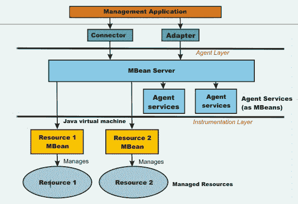

来源：https://www.ibm.com/support/knowledgecenter/en/SSAW57_8.5.5/com.ibm.websphere.nd.multiplatform.doc/ae/cxml_javamanagementx.html

# 托管 bean

托管 bean 是一种 Java bean。它专门用于 JMX 技术，并且是使用**依赖注入**（**DI**）技术创建的。在 JMX 中，资源被表示为**托管 bean**（**MBean**）。这些托管 bean 被注册到核心托管 bean 服务器中。因此，托管 bean 可以被视为 Java 服务、组件或设备的包装器。由于所有托管组件都注册到 MBeans 服务器，因此它用于管理所有托管 bean。托管 bean 服务器允许服务器组件连接并找到托管 bean。典型的 JMX 代理由托管 bean 服务器和与托管 bean 交互所需的服务组成。

JMX 规范描述了标准连接器。这些连接器也被称为**JMX 连接器**。JMX 连接器允许我们从远程管理应用程序访问 JMX 代理。连接器可以使用不同的协议与相同的管理接口一起工作。

以下是为什么应该使用 JMX 的原因：

+   它提供了一种在不同设备上管理应用程序的方法

+   它提供了一种标准的管理 Java 应用程序和网络的方法

+   它可以用来管理 JVM

+   它提供了一个可扩展和动态的管理接口

通过对 JMX 的基本理解，让我们继续检查它在 Spring 中的支持。Spring 对 JMX 的支持使我们能够很容易地将 Spring 应用程序转换为 JMX 架构。

Spring 的 JMX 支持提供的功能如下：

+   自动将 Spring bean 注册为托管 bean

+   用于控制 Spring beans 的管理接口的灵活结构

+   远程连接器上托管 bean 的声明性方法

+   本地和远程托管 bean 资源的代理

这些功能可以在不与 Spring 或 JMX 的类或接口耦合的情况下工作。Spring JMX 支持有一个名为`MBeanExporter`的类。这个类负责收集 Spring beans 并将它们注册到托管的 beans 服务器中。

以下是 Spring bean 的示例：

```java
package com.springhighperformance.jmx;

public class Calculator {
  private String name;
  private int lastCalculation;

  public String getName() {
    return name;
  }

  public void setName(String name) {
    this.name = name;
  }

  public int getLastCalculation() {
    return lastCalculation;
  }

  public void calculate(int x, int y) {
    lastCalculation = x + y;
  }
}
```

为了将此 bean 及其属性公开为托管属性和操作，应在配置文件中进行以下配置：

```java
<beans>
  <bean id="exporter"     
    class="org.springframework.jmx.export.MBeanExporter
    " lazy-init="false">
    <property name="beans">
      <map>
        <entry key="bean:name=calculatorBean1" value-
        ref="calculatorBean"/>
      </map>
    </property>
  </bean>

  <bean id="calculatorBean" 
    class="com.springhighperformance.jmx.Calculator">
    <property name="name" value="Test"/>
    <property name="lastCalculation" value="10"/>
  </bean>
</beans>
```

从前面的配置中，要查找的一个重要的 bean 定义是导出器 bean。导出器 bean 的 beans map 属性指示要将哪些 Spring beans 暴露为 JMX beans 到 JMX 托管的 beans 服务器。

通过上述配置，假设托管 bean 服务器必须在 Spring 应用程序可访问的环境中运行。如果托管 bean 服务器或`MBeanServer`正在运行，Spring 将尝试找到它并注册所有 bean。当应用程序在 Tomcat 或 IBM WebSphere 中运行时，这种默认行为是有用的，因为它有捆绑的`MBeanServer`。

在其他情况下，我们必须创建一个`MBeanServer`实例，如下所示：

```java
<beans>
  <bean id="mbeanServer" class="org.springframework.jmx.support.
    MBeanServerFactoryBean"/>

  <bean id="exporter" 
   class="org.springframework.jmx.export.MBeanExporter">
    <property name="beans">
      <map>
        <entry key="bean:name=calculatorBean1" value-
         ref="calculatorBean"/>
      </map>
    </property>
    <property name="server" ref="mbeanServer"/>
  </bean>

  <bean id="calculatorBean" 
   class="com.springhighperformance.jmx.Calculator">
    <property name="name" value="Test"/>
    <property name="lastCalculation" value="10"/>
  </bean>
</beans>
```

我们必须在`MBeanExporter` bean 上指定 server 属性，以将其与已创建的`MBeanServer`关联起来。

随着 JDK 5.0 中注解的引入，Spring 使得可以使用注解将 Spring beans 注册为 JMX beans。

以下是使用`@ManagedResource`注解定义的`Calculator` bean 的示例：

```java
package com.springhighperformance.jmx;

import org.springframework.jmx.export.annotation.ManagedAttribute;
import org.springframework.jmx.export.annotation.ManagedOperation;
import org.springframework.jmx.export.annotation.ManagedOperationParameter;
import org.springframework.jmx.export.annotation.ManagedOperationParameters;
import org.springframework.jmx.export.annotation.ManagedResource;

  @ManagedResource(objectName = "Examples:type=JMX,name=Calculator",
    description = "A calculator to demonstrate JMX in the 
    SpringFramework")
  public class Calculator {
  private String name;
  private int lastCalculation;

  @ManagedAttribute(description = "Calculator name")
  public String getName() {
    return name;
  }

  @ManagedAttribute(description = "Calculator name")
  public void setName(String name) {
    this.name = name;
  }

  @ManagedAttribute(description = "The last calculation")
  public int getLastCalculation() {
    return lastCalculation;
  }

  @ManagedOperation(description = "Calculate two numbers")
  @ManagedOperationParameters({
      @ManagedOperationParameter(name = "x",
          description = "The first number"),
      @ManagedOperationParameter(name = "y",
          description = "The second number") })
  public void calculate(int x, int y) {
    lastCalculation = x + y;
  }
}
```

`@ManagedAttribute`和`@ManagedOperation`注解用于将 bean 的属性和方法暴露给管理 bean 服务器。

以下是实例化受管 bean 的客户端代码，可以通过诸如 JConsole 或 VisualVM 之类的工具进行监视：

```java
package com.springhighperformance.jmx;
import java.util.Random;

import org.springframework.context.ApplicationContext;
import org.springframework.context.annotation.AnnotationConfigApplicationContext;
import org.springframework.context.annotation.Bean;
import org.springframework.context.annotation.Configuration;
import org.springframework.context.annotation.EnableMBeanExport;

@Configuration
@EnableMBeanExport
public class JmxSpringMain {
  private static final Random rand = new Random();

    @Bean
    public Resource jmxResource() {
        return new Resource();
    }

    @Bean
    public Calculator calculator() {
        return new Calculator();
    }

    public static void main(String[] args) throws InterruptedException {
        ApplicationContext context = new 
        AnnotationConfigApplicationContext(JmxSpringMain.class);
        do {
          Calculator cal = context.getBean(Calculator.class);
          cal.calculate(rand.nextInt(), rand.nextInt());
          Thread.sleep(Long.MAX_VALUE);
        } while(true);
    }
}
```

一旦暴露为受管 bean，这些资源可以通过诸如 JConsole 或 VisualVM 之类的工具监视各种参数，例如对象数量、对象占用的内存以及对象占用的堆内存空间。

以下是 Java VisualVM 的屏幕截图，突出显示了`Calculator`作为受管 bean 的暴露：

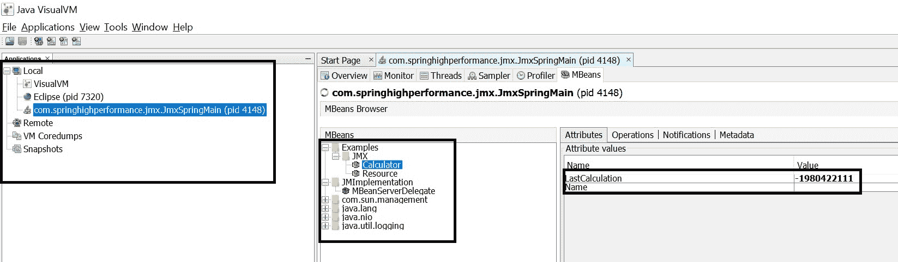

# 摘要

这是本书中最重要的章节之一。它专注于性能测量和增强策略。本章类似于现实生活中的健康检查场景。如果一个人不舒服，第一步是识别症状以便诊断和治疗疾病。同样，本章从识别性能下降的症状开始，然后进入性能调优生命周期。描述了性能调优模式和反模式，类似于应遵循的最佳实践。接着是迭代性能调优过程和 Spring 框架中的 JMX 支持。我们看到了 Spring bean 被转换为 JMX 受管 bean 的示例。

下一章重点介绍 JVM 的微调。这不是针对 Spring 应用程序特定的调整，而是适用于在 JVM 上运行的任何应用程序。本章将深入探讨 JVM 的内部细节，这些细节对开发人员来说并不是很熟悉。让我们准备好深入 JVM。
