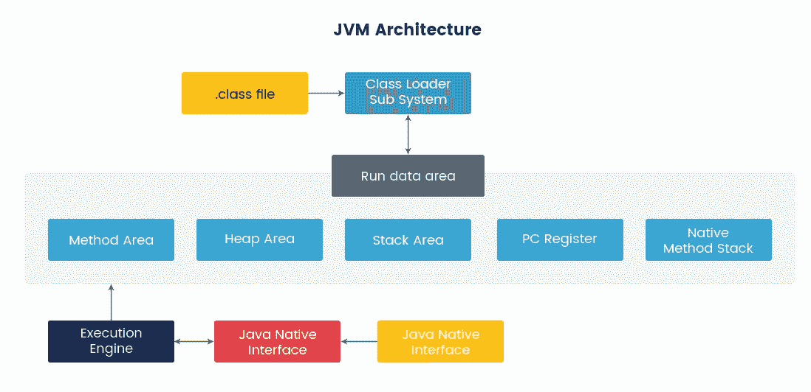
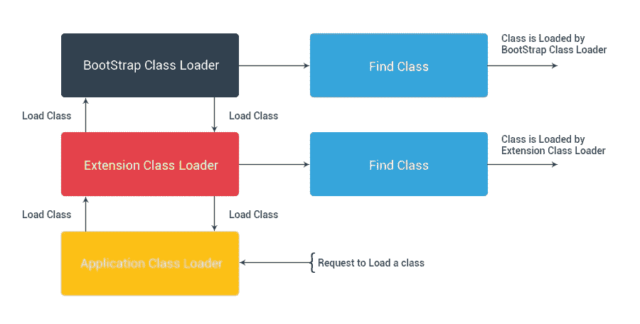
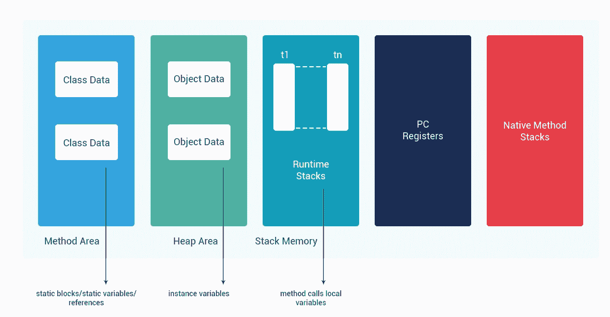
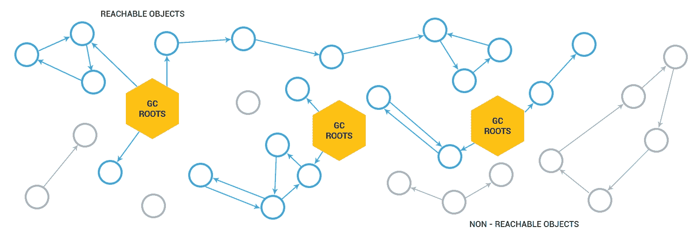
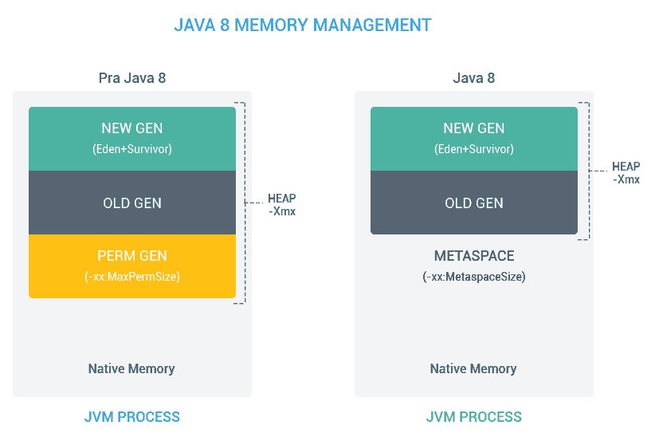
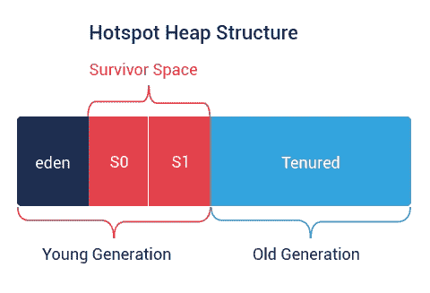
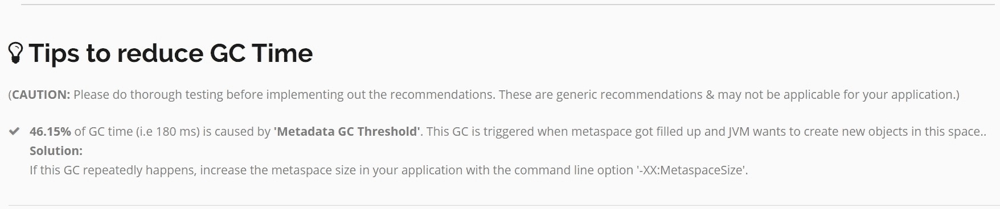
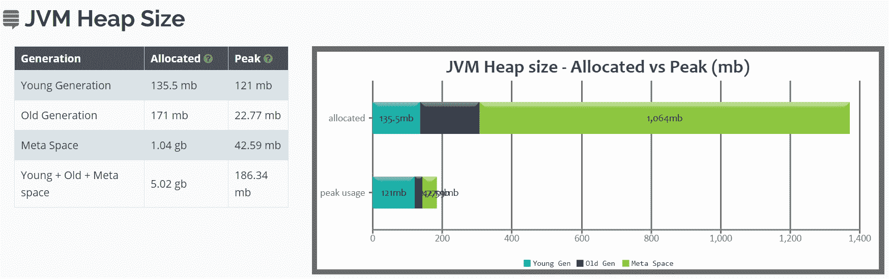
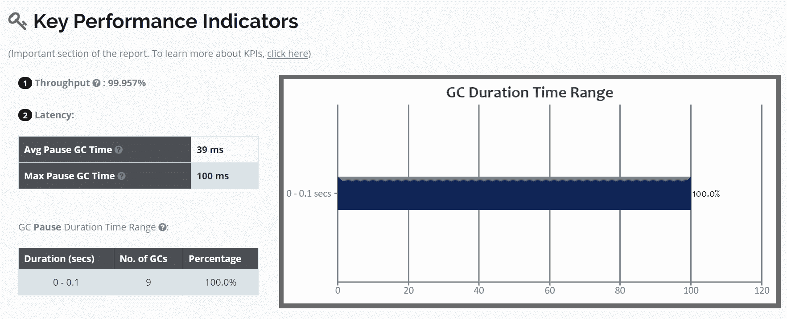
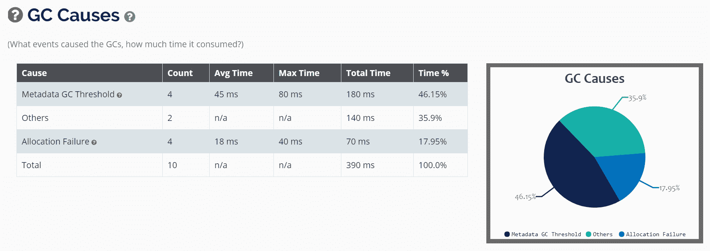

# 第十一章：JVM 内部

上一章让我们了解了如何通过理解性能问题的症状来调整应用程序的性能。我们走过了性能调整生命周期，学习了在应用程序性能的哪些阶段可以进行调整以及如何进行调整。我们还学会了如何将 JMX 连接到 Spring 应用程序，观察应用程序的瓶颈并进行调整。

在本章中，我们将深入了解**Java 虚拟机**（**JVM**）的内部和调整 JVM 以实现高性能。JVM 执行两项主要工作——执行代码和管理内存。JVM 从操作系统分配内存，管理堆压缩，并对未引用的对象执行**垃圾回收**（**GC**）。GC 很重要，因为适当的 GC 可以改善应用程序的内存管理和性能。

本章我们将学习以下主题：

+   理解 JVM 内部

+   理解内存泄漏

+   常见陷阱

+   GC

+   GC 方法和策略

+   分析 GC 日志的工具

# 理解 JVM 内部

作为 Java 开发人员，我们知道 Java 字节码在**Java 运行环境**（**JRE**）中运行，而 JRE 最重要的部分是 JVM，它分析并执行 Java 字节码。当我们创建一个 Java 程序并编译它时，结果是一个扩展名为`.class`的文件。它包含 Java 字节码。JVM 将 Java 字节码转换为在我们运行应用程序的硬件平台上执行的机器指令。当 JVM 运行程序时，它需要内存来存储来自加载的类文件、实例化对象、方法参数、返回值、局部变量和计算的中间结果的字节码和其他信息。JVM 将它需要的内存组织成几个运行时数据区域。

JVM 由三部分组成：

+   类加载器子系统

+   内存区域

+   执行引擎

以下图表说明了高级 JVM 架构：



JVM 架构

让我们简要了解一下图表中我们看到的 JVM 的三个不同部分。

# 类加载器子系统

类加载器子系统的责任不仅仅是定位和导入类的二进制数据。它还验证导入的类是否正确，为类变量分配和初始化内存，并协助解析符号引用。这些活动按严格顺序执行：

1.  **加载**：类加载器读取`.class`文件并查找和导入类型的二进制数据。

1.  **链接**：它执行验证、准备和（可选）解析：

+   **验证**：确保导入类型的正确性

+   **准备**：为类变量分配内存并将内存初始化为默认值

+   **解析**：将类型的符号引用转换为直接引用

1.  **初始化**：为代码中定义的所有静态变量分配值并执行静态块（如果有）。执行顺序是从类的顶部到底部，从类层次结构的父类到子类。

一般来说，有三个类加载器：

+   **引导类加载器**：这加载位于`JAVA_HOME/jre/lib`目录中的核心可信 Java API 类。这些 Java API 是用本地语言（如 C 或 C++）实现的。

+   **扩展类加载器**：这继承自引导类加载器。它从`JAVA_HOME/jre/lib/ext`目录或`java.ext.dirs`系统属性指定的任何其他目录加载类。它是由`sun.misc.Launcher$ExtClassLoader`类以 Java 实现的。

+   **系统类加载器**：这继承自扩展类加载器。它从我们应用程序的类路径加载类。它使用`java.class.path`环境变量。

为了加载类，JVM 遵循委托层次原则。系统类加载器将请求委托给扩展类加载器，扩展类加载器将请求委托给引导类加载器。如果在引导路径中找到类，则加载该类，否则将请求转移到扩展类加载器，然后再转移到系统类加载器。最后，如果系统类加载器无法加载类，则会生成`java.lang.ClassNotFoundException`异常。

以下图表说明了委托层次原则：



委托层次原则

# 内存区域

Java 运行时内存分为五个不同的区域，如下图所示：



内存区域

让我们简要描述每个组件：

+   **方法区**：这包含所有类级别的信息，如类名、父类、方法、实例和静态变量。每个 JVM 只有一个方法区，它是一个共享资源。

+   **堆区**：这包含所有对象的信息。每个 JVM 有一个**堆区**。它也是一个共享资源。由于**方法区**和**堆区**是多个线程之间的共享内存，所以存储的数据不是线程安全的。

+   **栈内存**：JVM 为每个正在执行的线程创建一个运行时栈，并将其存储在栈区。这个栈的每个块被称为一个**激活记录**，用于存储方法调用。该方法的所有局部变量都存储在相应的帧中。栈区是线程安全的，因为它不是共享资源。运行时栈将在线程终止时由 JVM 销毁。因此，在方法调用的无限循环中，我们可能会看到`StackOverFlowError`，这是由于栈中没有足够的内存来存储方法调用。

+   **PC 寄存器**：这些保存正在执行的当前指令的地址。一旦指令执行完毕，**PC 寄存器**将被更新为下一条指令。每个线程有一个单独的**PC 寄存器**。

+   **本地方法栈**：为每个线程创建一个单独的本地栈。它存储本地方法信息。本地信息就是本地方法调用。

# 执行引擎

执行引擎在运行时数据区域执行字节码。它逐行执行字节码，并使用运行时数据区域中可用的信息。执行引擎可以分为三部分：

+   **解释器**：这逐行读取、解释和执行字节码。它快速解释和执行字节码；然而，在执行解释结果时可能非常缓慢。

+   **即时（JIT）**：为了克服解释器在执行解释结果时的缓慢，即时编译器在解释器第一次解释代码后将字节码转换为本机代码。使用本机代码执行速度快；它逐条执行指令。

+   垃圾收集器：这会销毁任何没有被引用的东西。这非常重要，因此任何不需要的东西都将被销毁，以便为新的执行腾出空间。

# 理解内存泄漏

Java 的最大好处是 JVM，它提供了开箱即用的内存管理。我们可以创建对象，Java 的垃圾收集器会帮我们释放内存。然而，在 Java 应用程序中会发生内存泄漏。在接下来的部分中，我们将看到一些内存泄漏的常见原因，并介绍一些检测/避免它们的解决方案。

# Java 中的内存泄漏

当垃圾收集器无法收集应用程序不再使用/引用的对象时，就会发生内存泄漏。如果对象没有被垃圾收集，应用程序将使用更多内存，一旦整个堆区满了，对象就无法分配，导致`OutOfMemoryError`。

堆内存有两种对象——被引用的对象和未被引用的对象。垃圾回收器会移除所有未被引用的对象。然而，垃圾回收器无法移除被引用的对象，即使它们没有被应用程序使用。

# 内存泄漏的常见原因

以下是内存泄漏的最常见原因：

+   打开流：在处理流和读取器时，我们经常忘记关闭流，最终导致内存泄漏。未关闭流导致两种类型的泄漏——低级资源泄漏和内存泄漏。低级资源泄漏包括操作系统级资源，如文件描述符和打开连接。由于 JVM 消耗内存来跟踪这些资源，这导致内存泄漏。为了避免泄漏，使用`finally`块关闭流，或者使用 Java 8 的自动关闭功能。

+   打开的连接：我们经常忘记关闭已打开的 HTTP、数据库或 FTP 连接，这会导致内存泄漏。与关闭流类似，要关闭连接。

+   静态变量引用实例对象：任何引用重对象的静态变量都可能导致内存泄漏，因为即使变量没有被使用，它也不会被垃圾回收。为了防止这种情况发生，尽量不要使用重的静态变量，而是使用局部变量。

+   集合中对象缺少方法：向`HashSet`中添加没有实现`equals`和`hashcode`方法的对象会增加`HashSet`中重复对象的数量，一旦添加就无法移除这些对象。为了避免这种情况，在添加到`HashSet`中的对象中实现`equals`和`hashcode`方法。

诊断内存泄漏是一个需要大量实际经验、调试技能和对应用程序的详细了解的漫长过程。以下是诊断内存泄漏的方法：

+   启用 GC 日志并调整 GC 参数

+   性能分析

+   代码审查

在接下来的部分中，我们将看到 GC 的常见陷阱、GC 方法和分析 GC 日志的工具。

# 常见陷阱

性能调优至关重要，只需一个小的 JVM 标志，事情就可能变得复杂。JVM 会出现 GC 暂停，频率和持续时间各不相同。在暂停期间，一切都会停止，各种意外行为开始出现。在暂停和不稳定行为的情况下，JVM 被卡住，性能受到影响。我们可以看到响应时间变慢、CPU 和内存利用率高，或者系统大部分时间表现正常，但偶尔出现异常行为，比如执行极慢的事务和断开连接。

大部分时间我们测量平均事务时间，忽略导致不稳定行为的异常值。大部分时间系统表现正常，但在某些时刻，系统响应性下降。这种低性能的原因大部分是由于对 GC 开销的低意识和只关注平均响应时间。

在定义性能要求时，我们需要回答一个重要问题：与 GC 暂停频率和持续时间相关的应用程序的可接受标准是什么？要求因应用程序而异，因此根据我们的应用程序和用户体验，我们需要首先定义这些标准。

我们通常存在一些常见的误解。

# 垃圾回收器的数量

大多数时候，人们并不知道不只有一个，而是四个垃圾收集器。这四个垃圾收集器是——**串行**，**并行**，**并发**和**垃圾优先**（**G1**）。我们将在下一节中看到它们。还有一些第三方垃圾收集器，比如**Shenandoah**。JVM HotSpot 的默认垃圾收集器在 Java 8 之前是并行的，而从 Java 9 开始，默认收集器是**垃圾优先垃圾收集器**（**G1 GC**）。并行垃圾收集器并不总是最好的；然而，这取决于我们的应用程序需求。例如，**并发标记清除**（**CMS**）和 G1 收集器导致 GC 暂停的频率较低。但是当它们导致暂停时，暂停持续时间很可能比并行收集器导致的暂停时间长。另一方面，对于相同的堆大小，并行收集器通常能实现更高的吞吐量。

# 错误的垃圾收集器

GC 问题的一个常见原因是选择了错误的垃圾收集器。每个收集器都有其自己的重要性和好处。我们需要找出我们应用程序的行为和优先级，然后根据这些来选择正确的垃圾收集器。HotSpot 的默认垃圾收集器是并行/吞吐量，大多数情况下并不是一个好选择。CMS 和 G1 收集器是并发的，导致暂停的频率较低，但当暂停发生时，其持续时间比并行收集器长。因此，选择收集器是我们经常犯的一个常见错误。

# 并行/并发关键字

GC 可能会导致**全局停顿**（**STW**）的情况，或者对象可以在不停止应用程序的情况下并发收集。GC 算法可以在单线程或多线程中执行。因此，并发 GC 并不意味着它是并行执行的，而串行 GC 并不意味着它由于串行执行而导致更多的暂停。并发和并行是不同的，其中并发表示 GC 周期，而并行表示 GC 算法。

# G1 是一个问题解决者

随着 Java 7 引入新的垃圾收集器，许多人认为它是解决以前所有垃圾收集器问题的问题解决者。G1 GC 解决的一个重要问题是碎片问题，这是 CMS 收集器常见的问题。然而，在许多情况下，其他收集器可能会胜过 G1 GC。因此，一切取决于我们应用程序的行为和需求。

# 平均事务时间

大多数情况下，在测试性能时，我们倾向于测量平均事务时间，但仅这样做会忽略异常值。当 GC 导致长时间暂停时，应用程序的响应时间会急剧增加，影响用户访问应用程序。这可能会被忽视，因为我们只关注平均事务时间。当 GC 暂停频率增加时，响应时间成为一个严重的问题，我们可能会忽略只测量平均响应时间而忽略的问题。

# 减少新对象分配率可以改善 GC 行为

与其专注于减少新对象分配率，我们应该专注于对象的生命周期。有三种不同类型的对象生命周期：长期对象，我们对它们无能为力；中期对象，这些会导致最大的问题；和短期对象，通常会被快速释放和分配，因此它们会在下一个 GC 周期中被收集。因此，与其专注于长期和短期对象，专注于中期对象的分配率可能会带来积极的结果。问题不仅仅在于对象分配率，而是在于所涉及的对象类型。

# GC 日志会导致开销

GC 日志并不会导致开销，尤其是在默认日志设置中。这些数据非常有价值，Java 7 引入了控制日志文件大小的钩子。如果我们不收集带有时间戳的 GC 日志，那么我们就错过了分析和解决暂停问题的关键数据来源。GC 日志是系统中 GC 状态的最丰富的数据来源。我们可以获得关于应用程序中所有 GC 事件的数据；比如，它是并发完成的还是导致了 STW 暂停：花了多长时间，消耗了多少 CPU，释放了多少内存。通过这些数据，我们将能够了解暂停的频率和持续时间，它们的开销，并采取行动来减少它们。

通过添加以下参数启用 GC：

```java
-XX:+PrintGCDetails -XX:+PrintGCDateStamps -Xloggc:`date +%F_%H-%M-%S`-gc.log -XX:+UseGCLogFileRotation -XX:NumberOfGCLogFiles=10 -XX:GCLogFileSize=10M
```

# GC

Java 最大的成就之一就是 GC。GC 进程自动管理内存和堆分配，跟踪死对象，删除它们，并将内存重新分配给新对象。理论上，由于垃圾收集器自动管理内存，开发人员可以创建新对象而不必考虑内存的分配和释放，以消除内存泄漏和其他与内存相关的问题。

# GC 的工作原理

通常我们认为 GC 收集并删除未引用的对象。相反，Java 中的 GC 跟踪活动对象，并将所有未引用的对象标记为垃圾。

内存的堆区是动态分配对象的地方。在运行应用程序之前，我们应该为 JVM 分配堆内存。提前为 JVM 分配堆会产生一些后果：

+   提高对象创建速率，因为 JVM 不需要与操作系统通信为每个新对象获取内存。一旦 JVM 为对象分配了内存，JVM 就会将指针移向下一个可用内存。

+   当没有对象引用时，垃圾收集器收集对象并重用其内存以分配新对象。由于垃圾收集器不删除对象，因此不会将内存返回给操作系统。

直到对象被引用，JVM 认为它们是活动对象。当一个对象不再被引用并且不可被应用程序代码访问时，垃圾收集器将其删除并回收其内存。我们会想到一个问题，对象树中的第一个引用是谁？让我们看看对象树及其根。

# GC 根

对象的每个树都有一个或多个对象作为根。如果垃圾收集器可以到达根，那么该树是可达的。任何未被 GC 根引用或引用的对象都被视为死对象，垃圾收集器将其删除。

以下是 Java 中不同类型的 GC 根：

+   **局部变量：**Java 方法的变量或参数。

+   **活动线程：**正在运行的线程是一个活动对象。

+   **静态变量：**引用静态变量的类。当垃圾收集器收集类时，它会删除对静态变量的引用。

+   **JNI 引用：**在 JNI 调用期间创建的对象引用。它们保持活动状态，因为 JVM 不知道本地代码对它的引用。

请看下面的图表：



GC 根

# GC 方法和策略

正如我们在前面的部分中学到的，不只有一个，而是四种不同的垃圾收集器。每种都有其自己的优点和缺点。这些收集器共同的一点是它们将托管堆分成不同的段，假设对象的寿命很短，应该很快被移除。让我们看看 GC 的四种不同算法。

# 串行收集器

串行收集器是最简单的 GC 实现，主要设计用于单线程环境和小堆。这种 GC 实现在工作时会冻结所有应用程序线程。因此，在多线程应用程序中使用它并不是一个好主意，比如服务器环境。

要启用串行垃圾收集器，请将`-XX:+UseSerialGC`设置为 VM 参数

# 并行/吞吐量收集器

并行收集器是 JVM 的默认收集器，也被称为吞吐量收集器。顾名思义，这个收集器与串行收集器不同，它使用多线程来管理堆内存。并行垃圾收集器在执行部分或完整的 GC 时仍会冻结所有应用程序线程。如果我们想使用并行垃圾收集器，我们应该指定调优参数，如线程、暂停时间、吞吐量和占用空间。

以下是指定调优参数的参数：

+   线程：`-XX:ParallelGCThreads=<N>`

+   暂停时间：`-XX:MaxGCPauseMillis=<N>`

+   吞吐量：`-XX:GCTimeRatio=<N>`

+   占用空间（最大堆大小）：`-Xmx<N>`

要在我们的应用程序中启用并行垃圾收集器，请设置`-XX:+UseParallelGC`选项。

# CMS 垃圾收集器

CMS 实现使用多个垃圾收集器线程来扫描（标记）可以被移除的未使用对象（清除）。这种垃圾收集器适用于需要短暂 GC 暂停的应用程序，并且在应用程序运行时可以与垃圾收集器共享处理器资源。

CMS 算法只在两种情况下进入 STW 模式：当 Old Generations 中的对象仍然被线程入口点或静态变量引用时，以及当应用程序在 CMS 运行时改变了堆的状态，使算法返回并重新迭代对象树以验证它已标记正确的对象。

使用这个收集器，晋升失败是最大的担忧。晋升失败发生在 Young 和 Old Generations 的对象收集之间发生竞争条件时。如果收集器需要将对象从 Young Generation 晋升到 Old Generation，而没有足够的空间，它必须首先 STW 来创建空间。为了确保在 CMS 收集器的情况下不会发生这种情况，增加 Old Generation 的大小或为收集器分配更多的后台线程来与分配速率竞争。

为了提供高吞吐量，CMS 使用更多的 CPU 来扫描和收集对象。这对于长时间运行的服务器应用程序是有利的，这些应用程序不希望应用程序冻结。因此，如果我们可以分配更多的 CPU 来避免应用程序暂停，我们可以选择 CMS 收集器作为应用程序中的 GC。要启用 CMS 收集器，请设置`-XX:+UseConcMarkSweepGC`选项。

# G1 收集器

这是在 JDK 7 更新 4 中引入的新收集器。G1 收集器设计用于愿意分配超过 4GB 堆内存的应用程序。G1 将堆分成多个区域，跨越从 1MB 到 32MB 的范围，取决于我们配置的堆，并使用多个后台线程来扫描堆区域。将堆分成多个区域的好处是，G1 将首先扫描有大量垃圾的区域，以满足给定的暂停时间。

G1 减少了后台线程完成未使用对象扫描之前低堆可用性的机会。这减少了 STW 的机会。G1 在进行堆压缩时是动态的，而 CMS 是在 STW 期间进行的。

为了在我们的应用程序中启用 G1 垃圾收集器，我们需要在 JVM 参数中设置`-XX:+UseG1GC`选项。

Java 8 更新 20 引入了一个新的 JVM 参数，`-XX:+UseStringDeduplication`，用于 G1 收集器。通过这个参数，G1 识别重复的字符串，并创建指向相同的`char[]`数组的指针，以避免多个相同字符串的副本。

从 Java 8 开始，PermGen 的一部分堆被移除。这部分堆是为类元数据、静态变量和 interned 字符串分配的。这种参数调优导致了许多`OutOfMemory`异常，在 Java 8 之后，JVM 会处理这些异常。

# 堆内存

堆内存主要分为两代：年轻代和老年代。在 Java 7 之前，堆内存中有一个**PERM GENERATION**，而从 Java 8 开始，**PERM GENERATION**被**METASPACE**取代。**METASPACE**不是堆内存的一部分，而是**本地内存**的一部分。使用`-XX:MaxMetaspaceSize`选项设置**METASPACE**的大小。在投入生产时，考虑此设置至关重要，因为如果**METASPACE**占用过多内存，会影响应用程序的性能：



Java 8 内存管理

**年轻代**是对象创建和分配的地方；它是为年轻对象而设的。**年轻代**进一步分为**幸存者空间**。以下是**Hotspot 堆结构**：



**伊甸园**区域默认比**幸存者空间**大。所有对象首先都是在**伊甸园**区域中创建的。当**伊甸园**满时，将触发小型 GC，它将快速扫描对象的引用，并标记未引用的对象为死亡并进行收集。**幸存者空间**中的任何一个区域始终为空。在小型 GC 期间在**伊甸园**中幸存的对象将被移至空的**幸存者空间**。我们可能会想为什么有两个**幸存者空间**而不是一个。原因是为了避免内存碎片化。当**年轻代**运行并从**幸存者空间**中删除死对象时，会在内存中留下空洞并需要压缩。为了避免压缩，JVM 将幸存对象从一个**幸存者空间**移至另一个。这种从**伊甸园**和一个**幸存者空间**到另一个的活对象的乒乓运动会持续，直到出现以下条件：

+   对象达到最大 tenuring 阈值。这意味着对象不再年轻。

+   **幸存者空间**已满，无法容纳任何新对象。

当出现上述条件时，对象将被移至**老年代**。

# JVM 标志

以下是应用程序中常用的用于调整 JVM 以获得更好性能的 JVM 参数/标志。调整值取决于我们应用程序的行为以及生成速率。因此，没有明确定义的指南来使用特定值的 JVM 标志以实现更好的性能。

# -Xms 和-Xmx

`-Xms`和`-Xmx`被称为最小和最大堆大小。将`-Xms`设置为等于`-Xmx`可以防止堆扩展时的 GC 暂停，并提高性能。

# -XX:NewSize 和-XX:MaxNewSize

我们可以使用`-XX:MaxNewSize`设置年轻代的大小。如果我们将年轻代的大小设置得很大，那么老年代的大小将会较小。出于稳定性的原因，年轻代的大小不应该大于老年代。因此，`-Xmx/2`是我们可以为`-XX:MaxNewSize`设置的最大大小。

为了获得更好的性能，通过设置`-XX:NewSize`标志来设置年轻代的初始大小。这样可以节省一些成本，因为年轻代随着时间的推移会增长到该大小。

# -XX:NewRatio

我们可以使用`-XX:NewRatio`选项将年轻代的大小设置为老年代的比例。使用此选项的好处可能是，当 JVM 在执行过程中调整总堆大小时，年轻代可以增长和收缩。`-XX:NewRatio`表示老年代的比例大于年轻代。`-XX:NewRatio=2`表示老年代的大小是年轻代的两倍，这进一步意味着年轻代是总堆的 1/3。

如果我们指定了 Young Generation 的比例和固定大小，那么固定大小将优先。关于指定 Young Generation 大小的方法没有一定的规则。这里的经验法则是，如果我们知道应用程序生成的对象的大小，那么指定固定大小，否则指定比例。

# -XX:SurvivorRatio

`-XX:SurvivorRatio`值是 Eden 相对于 Survivor Spaces 的比例。将有两个 Survivor Spaces，每个都相等。如果`-XX:SurvivorRatio=8`，那么 Eden 占 3/4，每个 Survivor Spaces 占老年代总大小的 1/4。

如果我们设置了 Survivor Spaces 很小的比例，那么 Eden 将为新对象腾出更多空间。在 Minor GC 期间，未引用的对象将被收集，Eden 将为空出来给新对象，但是如果对象仍然有引用，垃圾收集器会将它们移动到 Survivor Space。如果 Survivor Space 很小，无法容纳新对象，那么对象将被移动到老年代。老年代中的对象只能在 Full GC 期间被收集，这会导致应用程序长时间暂停。如果 Survivor Space 足够大，那么更多的对象可以存活在 Survivor Space 中，但会死得很快。如果 Survivor Spaces 很大，Eden 将会很小，而小的 Eden 会导致频繁的 Young GC。

# -XX:InitialTenuringThreshold、-XX:MaxTenuringThreshold 和-XX:TargetSurvivorRatio

Tenuring 阈值决定了对象何时可以从 Young Generation 晋升/移动到 Old Generation。我们可以使用`-XX:InitialTenuringThreshold`和`-XX:MaxTenuringThreshold` JVM 标志来设置 tenuring 阈值的初始值和最大值。我们还可以使用`-XX:TargetSurvivorRatio`来指定 Young Generation GC 结束时 Survivor Space 的目标利用率（以百分比表示）。

# -XX:CMSInitiatingOccupancyFraction

当使用 CMS 收集器（-XX:+UseConcMarkSweepGC）时，使用`-XX:CMSInitiatingOccupancyFraction=85`选项。如果设置了该标志，并且老年代占用了 85%，CMS 收集器将开始收集未引用的对象。并不是必须老年代占用了 85% CMS 才开始收集。如果我们希望 CMS 只在 85%时开始收集，那么需要设置`-XX:+UseCMSInitiatingOccupancyOnly`。`-XX:CMSInitiatingOccupancyFraction`标志的默认值为 65%。

# -XX:+PrintGCDetails、-XX:+PrintGCDateStamps 和-XX:+PrintTenuringDistribution

设置标志以生成 GC 日志。为了微调 JVM 参数以实现更好的性能，了解 GC 日志和应用程序的行为非常重要。`-XX:+PrintTenuringDistribution`报告对象的统计信息（它们的年龄）以及它们晋升时的期望阈值。这对于了解我们的应用程序如何持有对象非常重要。

# 分析 GC 日志的工具

Java GC 日志是我们在性能问题发生时可以开始调试应用程序的地方之一。GC 日志提供重要信息，例如：

+   GC 上次运行的时间

+   GC 循环运行的次数

+   GC 运行的间隔

+   GC 运行后释放的内存量

+   GC 运行的时间

+   垃圾收集器运行时 JVM 暂停的时间

+   分配给每个代的内存量

以下是样本 GC 日志：

```java
2018-05-09T14:02:17.676+0530: 0.315: Total time for which application threads were stopped: 0.0001783 seconds, Stopping threads took: 0.0000239 seconds
2018-05-09T14:02:17.964+0530: 0.603: Application time: 0.2881052 seconds
.....
2018-05-09T14:02:18.940+0530: 1.579: Total time for which application threads were stopped: 0.0003113 seconds, Stopping threads took: 0.0000517 seconds
2018-05-09T14:02:19.028+0530: 1.667: Application time: 0.0877361 seconds
2018-05-09T14:02:19.028+0530: 1.667: [GC (Allocation Failure) [PSYoungGen: 65536K->10723K(76288K)] 65536K->13509K(251392K), 0.0176650 secs] [Times: user=0.05 sys=0.00, real=0.02 secs] 
2018-05-09T14:02:19.045+0530: 1.685: Total time for which application threads were stopped: 0.0179326 seconds, Stopping threads took: 0.0000525 seconds
2018-05-09T14:02:20.045+0530: 2.684: Application time: 0.9992739 seconds
.....
2018-05-09T14:03:54.109+0530: 96.748: Total time for which application threads were stopped: 0.0000498 seconds, Stopping threads took: 0.0000171 seconds
Heap
 PSYoungGen total 76288K, used 39291K [0x000000076b200000, 0x0000000774700000, 0x00000007c0000000)
  eden space 65536K, 43% used [0x000000076b200000,0x000000076cde5e30,0x000000076f200000)
  from space 10752K, 99% used [0x000000076f200000,0x000000076fc78e28,0x000000076fc80000)
  to space 10752K, 0% used [0x0000000773c80000,0x0000000773c80000,0x0000000774700000)
 ParOldGen total 175104K, used 2785K [0x00000006c1600000, 0x00000006cc100000, 0x000000076b200000)
  object space 175104K, 1% used [0x00000006c1600000,0x00000006c18b86c8,0x00000006cc100000)
 Metaspace used 18365K, capacity 19154K, committed 19456K, reserved 1067008K
  class space used 2516K, capacity 2690K, committed 2816K, reserved 1048576K
2018-05-09T14:03:54.123+0530: 96.761: Application time: 0.0131957 seconds
```

这些日志很难快速解释。如果有一个工具可以将这些日志呈现在可视化界面中，那么就可以轻松快速地理解 GC 的情况。我们将在下一节中看一下这样的工具来解释 GC 日志。

# GCeasy

GCeasy 是最受欢迎的垃圾收集日志分析工具之一。GCeasy 被开发出来自动从 GC 日志中识别问题。它足够智能，可以提供解决问题的替代方法。

以下是 GCeasy 提供的重要基本功能：

+   使用机器学习算法分析日志

+   快速检测内存泄漏、过早对象晋升、长时间的 JVM 暂停以及许多其他性能问题

+   功能强大且信息丰富的可视化分析工具

+   提供用于主动日志分析的 REST API

+   免费的基于云的日志分析工具

+   提供有关 JVM 堆大小的建议

+   能够分析所有格式的 GC 日志

GCeasy.io ([`www.gceasy.io/`](http://www.gceasy.io/))是在线垃圾收集日志分析工具。它需要将日志文件上传到 GCeasy 公共云。

使用在线工具收集详细的日志分析的步骤如下：

1.  通过在服务器的 JVM 参数中添加`XX:+PrintGCDetails -XX:+PrintGCDateStamps -Xloggc:<GC-log-file-path>`来在应用程序中启用 GC 日志。

1.  一旦在指定位置生成了 GC 日志文件，通过导航到[`gceasy.io/`](http://gceasy.io/)将文件上传到 GCeasy 云。如果有多个日志文件需要分析，也可以上传压缩的 ZIP 文件。

1.  处理日志文件后，将生成详细的分析报告。

报告组织得当且详细到足以突出每一个可能导致性能下降的问题。以下部分解释了 GCeasy 生成的报告中的重要部分。

# JVM 调优提示

报告中的顶部部分根据垃圾收集日志分析提供建议。这些建议是通过机器学习算法动态生成的，经过对日志文件的彻底分析。建议中的细节还包括问题的可能原因。以下是 GCeasy 在 GC 日志分析后提供的一个示例建议：



# JVM 堆大小

报告中的这一部分提供了每个内存代的堆分配和峰值内存使用情况的信息。可能分配的堆大小可能与 JVM 参数中定义的大小不匹配。这是因为 GCeasy 工具从日志中获取了分配的内存信息。可能我们分配了 2GB 的堆内存，但在运行时，JVM 只分配了 1GB 的堆内存。在这种情况下，报告将显示分配的内存为 1GB。报告以表格和图形格式显示堆分配。以下是报告中堆大小部分的示例：



# 关键绩效指标

**关键绩效指标**（**KPIs**）有助于做出改善应用程序性能的深刻决策。吞吐量、延迟和占用空间是一些重要的 KPIs。报告中的 KPIs 包括吞吐量和延迟。占用空间基本上描述了 CPU 占用的时间。它可以从性能监控工具（如 JVisualVM）中获取。

吞吐量选项表示在指定时间段内应用程序完成的有效工作量。延迟选项表示 GC 运行所花费的平均时间。

以下是报告中 KPIs 的示例：



# GC 统计

GC 统计部分提供了一段时间内垃圾收集器的行为信息。这段时间是分析日志的时间段。GC 统计是基于实时分析提供的。统计数据包括垃圾收集器运行后回收的字节数、累积 GC 时间（以秒为单位）和平均 GC 时间（以秒为单位）。该部分还以表格格式提供了有关总 GC 统计、小型 GC 统计和完整 GC 统计以及 GC 暂停统计的信息。

# GC 原因

GC Causes 部分提供了有关垃圾收集器运行原因的信息。该信息以表格和图形格式提供。除了原因，它还提供了垃圾收集器执行所需的时间信息。以下是报告中的一个示例：



基于上述细节，GCeasy 是一个帮助开发人员以可视化方式解释 GC 日志的重要工具。

# 摘要

在本章中，我们学习了 JVM 及其参数。我们了解了内存泄漏以及与 GC 相关的常见误解。我们了解了不同的 GC 方法及其重要性。我们了解了重要的 JVM 标志，这些标志被调整以实现更好的性能。

在下一章中，我们将学习关于 Spring Boot 微服务及其性能调优。微服务是一种应用架构，它由松散耦合的服务实现业务功能。Spring Boot 使我们能够构建生产就绪的应用程序。
