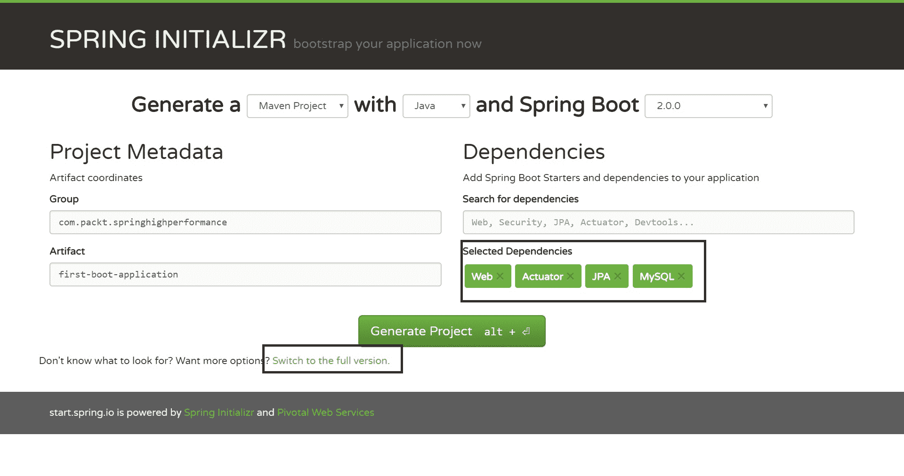
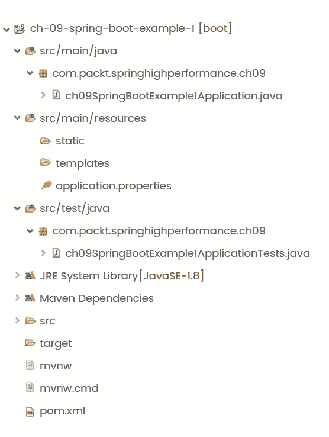
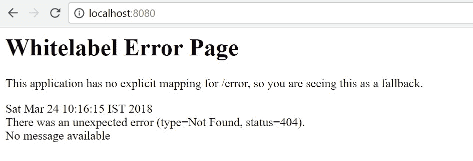
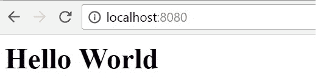
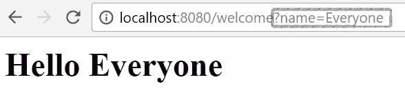
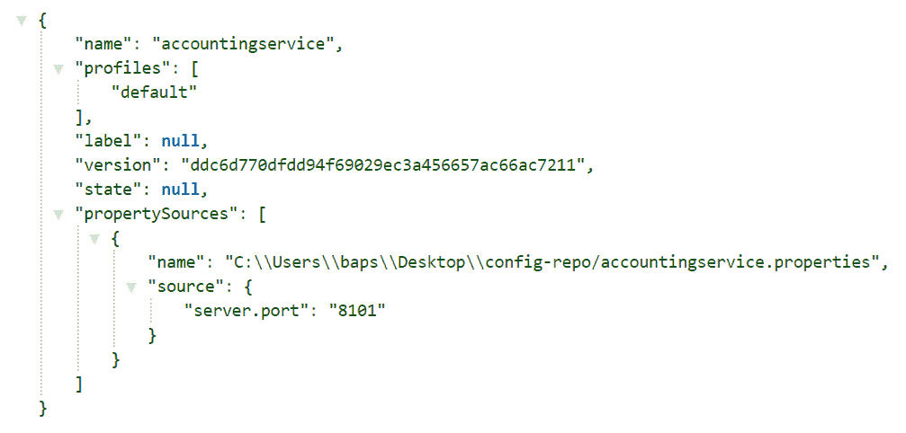
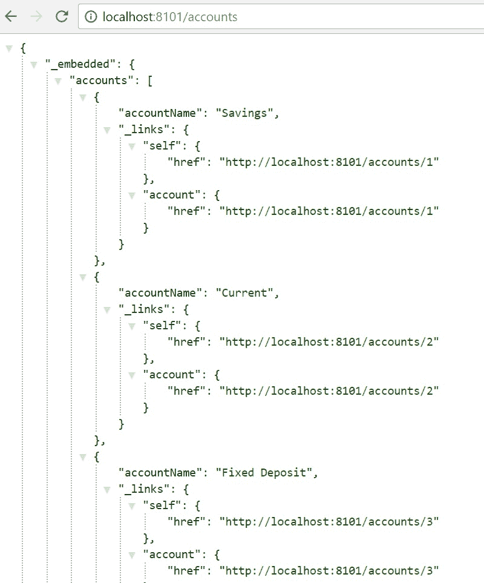
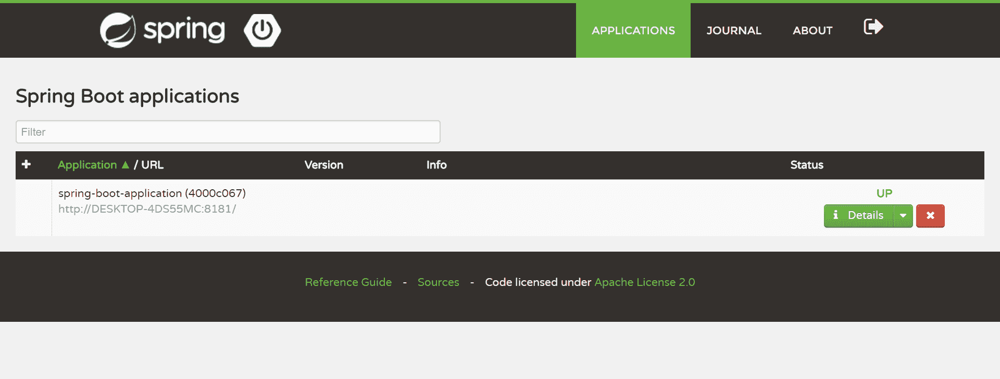
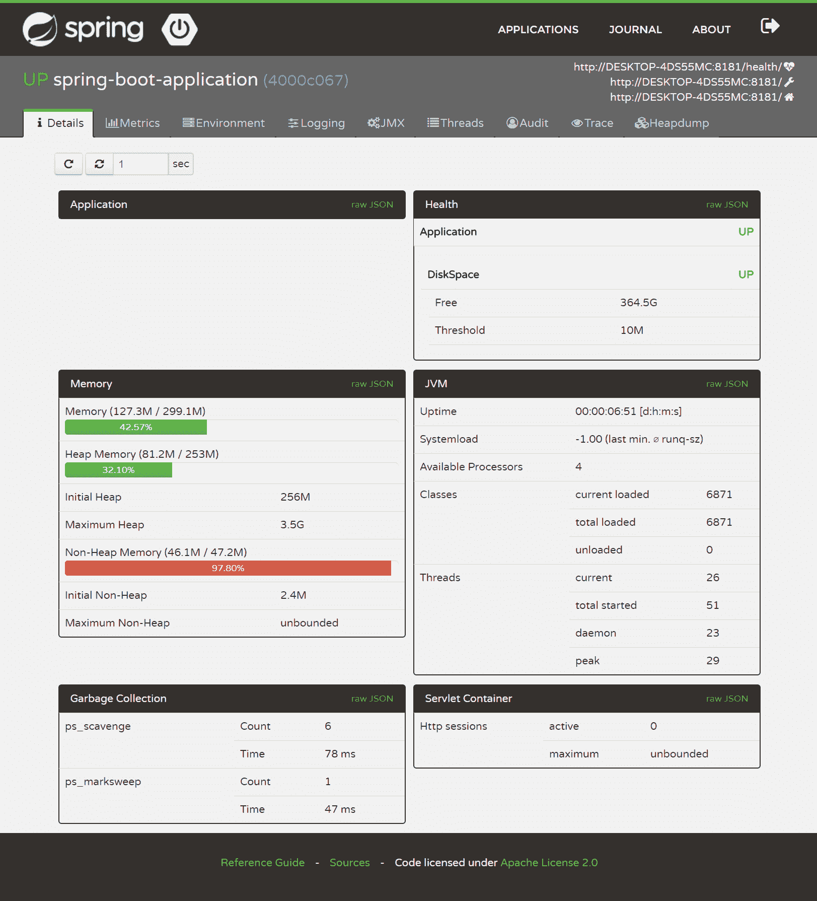
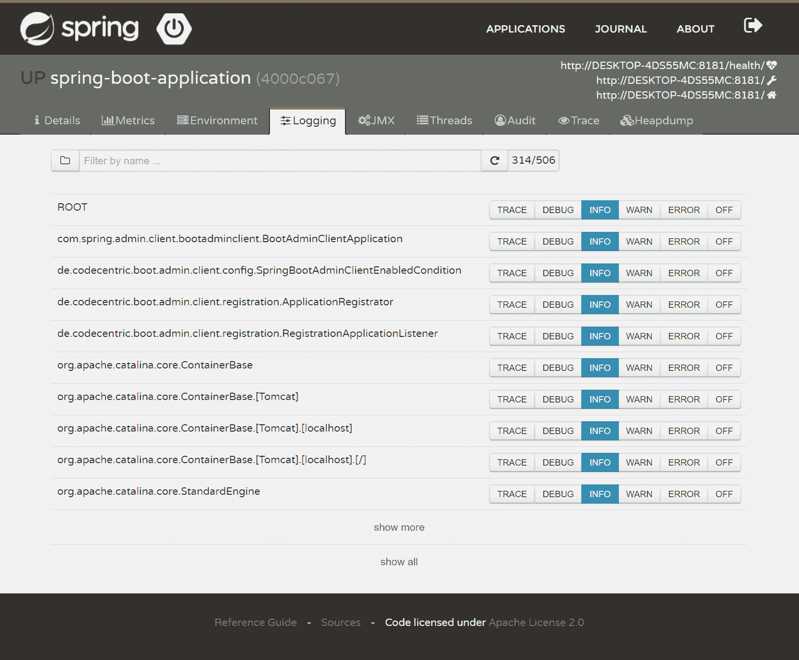

# 第十二章：Spring Boot 微服务性能调优

在上一章中，我们了解了**Java 虚拟机**（**JVM**）。从 JVM 的内部和 Java 的类加载机制开始，我们了解了 Java 中的内存管理是如何进行的。本章的最后一节关注了垃圾回收和 JVM 调优。本章充满了对应用程序性能优化非常重要的细节。

在本章中，我们将着手解决性能问题。方法是开发微服务。微服务目前在软件开发行业中非常流行。微服务和相关关键词引起了很多关注。这种方法基本上是在应用架构层面调整应用程序的性能。它描述了我们如何通过以不同的方式设置架构来改善应用程序的性能。本章将涵盖以下主题：

+   Spring Boot 配置

+   Spring Boot 执行器的指标

+   健康检查

+   使用 Spring Boot 的微服务

+   使用 Spring Cloud 的微服务

+   Spring 微服务配置示例

+   使用 Spring Boot admin 监控微服务

+   Spring Boot 性能调优

# Spring Boot 配置

在本节中，我们将专注于让 Spring Boot 为我们工作。在跳转到 Spring Boot 配置之前，我们将了解 Spring Boot 是什么，为什么我们应该使用它，以及 Spring Boot 带来了什么。我们将迅速转向如何做这一部分。

# 什么是 Spring Boot？

软件开发过程需要更快、更准确、更健壮。要求软件团队快速开发原型，展示应用程序的功能给潜在客户。对生产级应用程序也是如此。以下是软件架构师关注的一些领域，以提高开发团队的效率：

+   使用正确的一套工具，包括框架、IDE 和构建工具

+   减少代码混乱

+   减少编写重复代码的时间

+   大部分时间用于实现业务功能

让我们思考一下。为什么我们要讨论这个？原因是这是 Spring Boot 的基础。这些想法是任何帮助团队提高生产力的框架或工具的基石。Spring Boot 也是出于同样的原因而存在——提高生产力！

使用 Spring Boot，轻松创建由 Spring 框架驱动的生产级应用程序。它还可以轻松创建具有最小挑战的生产就绪服务。Spring Boot 通过对 Spring 框架持有一种看法，帮助新用户和现有用户快速进行生产任务。Spring Boot 是一个工具，可以帮助创建一个独立的 Java 应用程序，可以使用`java -jar`命令运行，或者一个可以部署到 Web 服务器的 Web 应用程序。Spring Boot 设置捆绑了命令行工具来运行 Spring 程序。

Spring Boot 的主要目标是：

+   以极快的速度开始使用 Spring 项目

+   广泛的可访问性

+   主要支持开箱即用的配置

+   根据需要灵活地偏离 Spring 默认设置

+   不生成任何代码

+   不需要 XML 配置

除了前面列出的主要特性，Spring Boot 还提供了以下非功能特性的支持：

+   支持广为人知和使用的框架的版本和配置

+   应用安全支持

+   监控应用程序健康检查参数的支持

+   性能指标监控支持

+   外部化配置支持

尽管 Spring Boot 为主要和非功能特性提供了默认值，但它足够灵活，允许开发人员使用他们选择的框架、服务器和工具。

# Spring Initializr

Spring Boot 应用程序可以以多种方式启动。其中一种方式是使用基于 Eclipse 的 Spring 工具套件 IDE ([`spring.io/tools/sts`](https://spring.io/tools/sts))。另一种方式是使用[`start.spring.io`](https://start.spring.io)，也称为 Spring Initializr。首先，Spring Initializr 不是 Spring Boot 或等效物。Spring Initializr 是一个具有简单 Web UI 支持的工具，用于配置 Spring Boot 应用程序。它可以被认为是一个用于快速启动生成 Spring 项目的工具。它提供了可以扩展的 API，以便生成项目的定制化。

Spring Initializr 工具提供了一个配置结构，用于定义依赖项列表、支持的 Java 和 Spring Boot 版本以及支持的依赖项版本。

基本上，Spring Initializr 根据提供的配置创建一个初始的 Spring 项目，并允许开发人员下载 ZIP 文件中的项目。以下是要遵循的步骤：

1.  导航到[`start.spring.io/`](https://start.spring.io/)。

1.  从 Maven 或 Gradle 中选择依赖项管理工具。

1.  从 Java、Kotlin 和 Groovy 中选择基于 JVM 的编程语言。

1.  选择要使用的 Spring Boot 版本。

1.  通过输入组名`com.packt.springhighperformance`来提供组件名称。

1.  输入 Artifact，这是 Maven 项目的 Artifact ID。这将成为要部署或执行的项目 WAR 或 JAR 文件的名称。

1.  从 Jar 和 War 中选择一种打包类型。

1.  单击“切换到完整版本”链接。这将打开一个可供选择的起始项目列表。起始项目将在下一节中详细解释。

1.  一旦我们选择了起始器或依赖项，点击“生成项目”按钮。这将下载包含初始项目配置的 ZIP 文件。

以下是带有一些配置的 Spring Initializr 屏幕：



完成后，将生成类似于以下截图所示的文件夹结构：



Spring Initializr 还支持命令行界面来创建 Spring 项目配置。可以使用以下命令来生成项目配置：

```java
> curl https://start.spring.io/starter.zip -d dependencies=web,jpa -d bootVersion=2.0.0 -o ch-09-spring-boot-example-1.zip
```

正如前面提到的，Spring Initializr 支持与 IDE 的集成。它与 Eclipse/STS、IntelliJ ultimate 版和带有 NB SpringBoot 插件的 NetBeans 集成良好。

# 使用 Maven 的起始器

在前面的部分中，我们看了 Spring Initializr 工具。现在是时候快速查看 Spring Boot 支持的起始器或依赖项了。

随着项目复杂性的增加，依赖项管理变得具有挑战性。建议不要为复杂项目手动管理依赖项。Spring Boot 起始器解决了类似的问题。Spring Boot 起始器是一组依赖描述符，可以在使用 starter POMs 的 Spring 应用程序中包含。它消除了寻找示例代码和复制/粘贴大量 Spring 和相关库的依赖描述符的需要。例如，如果我们想要使用 Spring 和 JPA 开发应用程序，我们可以在项目中包含`spring-boot-data-jpa-starter`依赖项。`spring-boot-data-jpa-starter`是其中的一个起始器。这些起始器遵循统一的命名模式，例如`spring-boot-starter-*`，其中`*`表示应用程序的类型。

以下是一些 Spring Boot 应用程序起始器的列表：

| **名称** | **描述** |
| --- | --- |
| `spring-boot-starter` | 核心起始器提供自动配置和日志记录支持。 |
| `spring-boot-starter-activemq` | 使用 Apache ActiveMQ 的 JMS 消息起始器。 |
| `spring-boot-starter-amqp` | Spring AMQP 和 Rabbit MQ 起始器。 |
| `spring-boot-starter-aop` | Spring AOP 和 AspectJ 起始器。 |
| `spring-boot-starter-artemis` | 使用 Apache Artemis 的 JMS 消息起始器。 |
| `spring-boot-starter-batch` | Spring Batch 起始器。 |
| `spring-boot-starter-cache` | Spring Framework 的缓存支持。 |
| `spring-boot-starter-cloud-connectors` | 提供支持，使用 Spring Cloud Connectors 在云平台（如 Cloud Foundry 和 Heroku）中简化与云服务的连接。 |
| `spring-boot-starter-data-elasticsearch` | 具有对 elasticsearch 和分析引擎以及 Spring Data Elasticsearch 的支持的启动器。 |
| `spring-boot-starter-data-jpa` | 使用 Hibernate 的 Spring Data JPA。 |
| `spring-boot-starter-data-ldap` | Spring Data LDAP。 |
| `spring-boot-starter-data-mongodb` | MongoDB 文档导向数据库和 Spring Data MongoDB。 |
| `spring-boot-starter-data-redis` | 使用 Spring Data Redis 和 Lettuce 客户端的 Redis 键值数据存储。 |
| `spring-boot-starter-data-rest` | 提供支持，使用 Spring Data REST 在 REST 上公开 Spring Data 存储库的启动器。 |
| `spring-boot-starter-data-solr` | 使用 Spring Data Solr 的 Apache Solr 搜索平台。 |
| `spring-boot-starter-freemarker` | 支持使用 FreeMarker 视图构建 MVC Web 应用程序的启动器。 |
| `spring-boot-starter-groovy-templates` | 支持使用 Groovy 模板视图构建 MVC Web 应用程序的启动器。 |
| `spring-boot-starter-integration` | Spring Integration。 |
| `spring-boot-starter-jdbc` | 使用 Tomcat JDBC 连接池的 JDBC。 |
| `spring-boot-starter-jersey` | 支持使用 JAX-RS 和 Jersey 构建 RESTful Web 应用程序。这是`spring-boot-starter-web starter`的替代品。 |
| `spring-boot-starter-json` | 支持 JSON 操作的启动器。 |
| `spring-boot-starter-mail` | 支持使用 Java Mail 和 Spring Framework 的邮件发送支持的启动器。 |
| `spring-boot-starter-quartz` | 用于使用 Spring Boot Quartz 的启动器。 |
| `spring-boot-starter-security` | Spring Security 启动器。 |
| `spring-boot-starter-test` | 支持使用包括 JUnit、Hamcrest 和 Mockito 在内的库的 Spring Boot 应用程序。 |
| `spring-boot-starter-thymeleaf` | 支持使用 Thymeleaf 视图构建 MVC Web 应用程序。 |
| `spring-boot-starter-validation` | 使用 Hibernate Validator 支持 Java Bean 验证的启动器。 |
| `spring-boot-starter-web` | 支持使用 Spring MVC 构建 Web 应用程序，包括 RESTful 应用程序。它使用 Tomcat 作为默认的嵌入式容器。 |
| `spring-boot-starter-web-services` | 支持使用 Spring Web Services。 |
| `spring-boot-starter-websocket` | 支持使用 Spring Framework 的 WebSocket 支持构建 WebSocket 应用程序。 |

`spring-boot-starter-actuator` 是 Spring Boot Actuator 工具的生产启动器，提供了生产就绪功能的支持，如应用程序监控、健康检查、日志记录和 bean。

以下列表包括 Spring Boot 的一些技术启动器：

| **名称** | **描述** |
| --- | --- |
| `spring-boot-starter-jetty `                        | 作为嵌入式 Servlet 容器的 Jetty 支持。这是`spring-boot-starter-tomcat`的替代品。 |
| `spring-boot-starter-log4j2`                          | 支持 Log4j 2 进行日志记录。这是`spring-boot-starter-logging`的替代品。 |
| `spring-boot-starter-logging` | 这是使用 logback 的默认日志启动器。 |
| `spring-boot-starter-tomcat` | 这是用于`spring-boot-starter-web`的默认 Servlet 容器启动器。它使用 Tomcat 作为嵌入式服务器。 |
| `spring-boot-starter-undertow` | 这是`spring-boot-starter-tomcat starter`的替代品。它使用 Undertow 作为嵌入式服务器。 |
| `spring-boot-starter-cache` | Spring Framework 的缓存支持。 |

# 创建您的第一个 Spring Boot 应用程序

在本节中，我们将查看开发 Spring Boot 应用程序的先决条件。我们将开发一个小型的 Spring Boot 应用程序，以了解 Spring Boot 应用程序所需的配置和每个配置的重要性。

以下是使用 Spring Boot 的先决条件列表：

+   Java 8 或 9

+   Spring 5.0.4 或更高版本

Spring Boot 支持：

+   Maven 3.2+和 Gradle 4 用于依赖管理和显式构建

+   Tomcat 8.5，Jetty 9.4 和 Undertow 1.4

Spring Boot 应用程序可以部署到任何 servlet 3.0+兼容的 servlet 容器。

开发 Spring Boot 应用程序的第一步是安装 Spring Boot。设置非常简单。它可以像其他标准 Java 库一样设置。要安装 Spring Boot，我们需要在类路径中包含适当的`spring-boot-*.jar`库文件。Spring Boot 不需要任何专门的工具，可以使用任何 IDE 或文本编辑器。

虽然我们可以将所需的 Spring Boot JAR 文件复制到应用程序类路径中，但建议使用构建工具，如 Maven 或 Gradle，进行依赖管理。

Spring Boot 依赖项使用的 Maven `groupId`是`org.springframework.boot`。对于 Spring Boot 应用程序，Maven POM 文件继承了`spring-boot-starter-parent`项目。Spring Boot 定义了启动器项目，并在 Spring Boot 应用程序的依赖项中定义为依赖项。

让我们开始创建我们的第一个 Spring Boot 应用程序，按照以下步骤进行：

1.  使用 Spring Initializr 创建一个 kickstarter 应用程序。

1.  选择 Maven 作为构建和依赖管理工具。

1.  选择适当的 Spring Boot 版本。

1.  选择打包类型为 War。

1.  为了简单起见，我们将不在应用程序中包含 JPA 启动器。我们只会包含一个 web 模块，以演示一个请求-响应流程。

1.  下载并导入项目到 STS 或 Eclipse。

1.  在 STS 中，您可以将应用程序作为 Spring Boot 应用程序运行，而在 Eclipse 中，您可以选择将应用程序作为 Java 应用程序运行。

现在让我们浏览一下代码片段。以下是示例 Maven POM 文件：

```java
<?xml version="1.0" encoding="UTF-8"?>
<project  

    xsi:schemaLocation="http://maven.apache.org/POM/4.0.0         
    http://maven.apache.org/xsd/maven-4.0.0.xsd">
  <modelVersion>4.0.0</modelVersion>

  <groupId>com.packt.springhighperformance.ch09</groupId>
  <artifactId>ch-09-boot-example</artifactId>
  <version>0.0.1-SNAPSHOT</version>
  <packaging>jar</packaging>

  <name>boot-example</name>
  <description>Demo project for Spring boot</description>

  <parent>
    <groupId>org.springframework.boot</groupId>
    <artifactId>spring-boot-starter-parent</artifactId>
    <version>2.0.0.RELEASE</version>
    <relativePath/> <!-- lookup parent from repository -->
  </parent>

  <properties>
    <project.build.sourceEncoding>UTF-8</project.build.sourceEncoding>
    <project.reporting.outputEncoding>UTF-
    8</project.reporting.outputEncoding>
    <java.version>1.8</java.version>
    <spring-cloud.version>Finchley.M9</spring-cloud.version>
  </properties>

  <dependencies>
    <dependency>
      <groupId>org.springframework.boot</groupId>
      <artifactId>spring-boot-starter-web</artifactId>
    </dependency>
    <dependency>
      <groupId>org.springframework.boot</groupId>
      <artifactId>spring-boot-starter-test</artifactId>
      <scope>test</scope>
    </dependency>
  </dependencies>

  <build>
    <plugins>
      <plugin>
        <groupId>org.springframework.boot</groupId>
        <artifactId>spring-boot-maven-plugin</artifactId>
      </plugin>
    </plugins>
  </build>
</project>
```

在前面的配置文件中，一个值得注意的配置是父依赖项。如前所述，所有 Spring Boot 应用程序在`pom.xml`文件中使用`spring-boot-starter-parent`作为父依赖项。

父 POM 帮助管理子项目和模块的以下内容：

+   Java 版本

+   包含依赖项的版本管理

+   插件的默认配置

Spring Boot 父启动器将 Spring Boot 依赖项定义为父 POM。因此，它从 Spring Boot 依赖项继承了依赖项管理功能。它将默认的 Java 版本定义为 1.6，但在项目级别上，我们可以将其更改为`1.8`，如前面的代码示例所示。

除了默认的 POM 文件外，Spring Boot 还创建了一个作为应用程序启动器的 Java 类。以下是示例 Java 代码：

```java
package com.packt.springhighperformance.ch09;

import org.springframework.boot.SpringApplication;
import org.springframework.boot.autoconfigure.SpringBootApplication;

@SpringBootApplication
public class BootExampleApplication {

  public static void main(String[] args) {
    SpringApplication.run(BootExampleApplication.class, args);
  }
}
```

`SpringApplication`是一个负责引导 Spring Boot 应用程序的类。

Spring Boot 应用程序开发人员习惯于使用`@Configuration`、`@EnableAutoConfiguration`和`@ComponentScan`注解来注释主应用程序类。以下是每个注解的简要描述：

+   `@Configuration`：这是一个 Spring 注解，不特定于 Spring Boot 应用程序。它表示该类是 bean 定义的来源。

+   `@EnableAutoConfiguration`：这是一个 Spring Boot 特定的注解。该注解使应用程序能够从类路径定义中添加 bean。

+   `@ComponentScan`：此注解告诉 Spring 应用程序在提供的搜索路径中搜索组件、配置和服务。

以下是`@SpringBootApplication`注解的定义：

```java
@Target(ElementType.TYPE)
@Retention(RetentionPolicy.RUNTIME)
@Documented
@Inherited
@Configuration
@EnableAutoConfiguration
@ComponentScan
public @interface SpringBootApplication {
......
```

从前面的代码可以看出，`@SpringBootApplication`作为一个方便的注解来定义 Spring Boot 应用程序，而不是声明三个注解。

以下代码块显示了当 Spring Boot 应用程序启动时的日志输出：

```java

  . ____ _ __ _ _
 /\\ / ___'_ __ _ _(_)_ __ __ _ \ \ \ \
( ( )\___ | '_ | '_| | '_ \/ _` | \ \ \ \
 \\/ ___)| |_)| | | | | || (_| | ) ) ) )
  ' |____| .__|_| |_|_| |_\__, | / / / /
 =========|_|==============|___/=/_/_/_/
 :: Spring Boot :: (v2.0.0.RELEASE)

2018-05-23 16:29:21.382 INFO 32268 --- [ main] c.p.s.ch09.BootExampleApplication : Starting BootExampleApplication on DESKTOP-4DS55MC with PID 32268 (E:\projects\spring-high-performance\ch-09\boot-example\target\classes started by baps in E:\projects\spring-high-performance\ch-09\boot-example)
2018-05-23 16:29:21.386 INFO 32268 --- [ main] c.p.s.ch09.BootExampleApplication : No active profile set, falling back to default profiles: default
2018-05-23 16:29:21.441 INFO 32268 --- [ main] ConfigServletWebServerApplicationContext : Refreshing org.springframework.boot.web.servlet.context.AnnotationConfigServletWebServerApplicationContext@58ce9668: startup date [Wed May 23 16:29:21 IST 2018]; root of context hierarchy
2018-05-23 16:29:23.854 INFO 32268 --- [ main] o.s.b.w.embedded.tomcat.TomcatWebServer : Tomcat initialized with port(s): 8080 (http)
2018-05-23 16:29:23.881 INFO 32268 --- [ main] o.apache.catalina.core.StandardService : Starting service [Tomcat]
2018-05-23 16:29:23.881 INFO 32268 --- [ main] org.apache.catalina.core.StandardEngine : Starting Servlet Engine: Apache Tomcat/8.5.28
2018-05-23 16:29:23.888 INFO 32268 --- [ost-startStop-1] o.a.catalina.core.AprLifecycleListener : The APR based Apache Tomcat Native library which allows optimal performance in production environments was not found on the java.library.path: ...
2018-05-23 16:29:24.015 INFO 32268 --- [ost-startStop-1] o.a.c.c.C.[Tomcat].[localhost].[/] : Initializing Spring embedded WebApplicationContext
2018-05-23 16:29:24.016 INFO 32268 --- [ost-startStop-1] o.s.web.context.ContextLoader : Root WebApplicationContext: initialization completed in 2581 ms
2018-05-23 16:29:25.011 INFO 32268 --- [ost-startStop-1] o.s.b.w.servlet.ServletRegistrationBean : Servlet dispatcherServlet mapped to [/]
2018-05-23 16:29:25.015 INFO 32268 --- [ost-startStop-1] o.s.b.w.servlet.FilterRegistrationBean : Mapping filter: 'characterEncodingFilter' to: [/*]
2018-05-23 16:29:25.016 INFO 32268 --- [ost-startStop-1] o.s.b.w.servlet.FilterRegistrationBean : Mapping filter: 'hiddenHttpMethodFilter' to: [/*]
2018-05-23 16:29:25.016 INFO 32268 --- [ost-startStop-1] o.s.b.w.servlet.FilterRegistrationBean : Mapping filter: 'httpPutFormContentFilter' to: [/*]
2018-05-23 16:29:25.016 INFO 32268 --- [ost-startStop-1] o.s.b.w.servlet.FilterRegistrationBean : Mapping filter: 'requestContextFilter' to: [/*]
2018-05-23 16:29:25.016 INFO 32268 --- [ost-startStop-1] o.s.b.w.servlet.FilterRegistrationBean : Mapping filter: 'httpTraceFilter' to: [/*]
2018-05-23 16:29:25.016 INFO 32268 --- [ost-startStop-1] o.s.b.w.servlet.FilterRegistrationBean : Mapping filter: 'webMvcMetricsFilter' to: [/*]
2018-05-23 16:29:26.283 INFO 32268 --- [ main] s.w.s.m.m.a.RequestMappingHandlerMapping : Mapped "{[/welcome]}" onto public java.lang.String com.packt.springhighperformance.ch09.controllers.MainController.helloMessage(java.lang.String)
2018-05-23 16:29:26.284 INFO 32268 --- [ main] s.w.s.m.m.a.RequestMappingHandlerMapping : Mapped "{[/]}" onto public java.lang.String com.packt.springhighperformance.ch09.controllers.MainController.helloWorld()
2018-05-23 16:29:26.291 INFO 32268 --- [ main] s.w.s.m.m.a.RequestMappingHandlerMapping : Mapped "{[/error]}" onto public org.springframework.http.ResponseEntity<java.util.Map<java.lang.String, java.lang.Object>> org.springframework.boot.autoconfigure.web.servlet.error.BasicErrorController.error(javax.servlet.http.HttpServletRequest)
2018-05-23 16:29:26.292 INFO 32268 --- [ main] s.w.s.m.m.a.RequestMappingHandlerMapping : Mapped "{[/error],produces=[text/html]}" onto public org.springframework.web.servlet.ModelAndView org.springframework.boot.autoconfigure.web.servlet.error.BasicErrorController.errorHtml(javax.servlet.http.HttpServletRequest,javax.servlet.http.HttpServletResponse)
2018-05-23 16:29:26.358 INFO 32268 --- [ main] o.s.w.s.handler.SimpleUrlHandlerMapping : Mapped URL path [/webjars/**] onto handler of type [class org.springframework.web.servlet.resource.ResourceHttpRequestHandler]
2018-05-23 16:29:26.359 INFO 32268 --- [ main] o.s.w.s.handler.SimpleUrlHandlerMapping : Mapped URL path [/**] onto handler of type [class org.springframework.web.servlet.resource.ResourceHttpRequestHandler]
2018-05-23 16:29:26.410 INFO 32268 --- [ main] o.s.w.s.handler.SimpleUrlHandlerMapping : Mapped URL path [/**/favicon.ico] onto handler of type [class org.springframework.web.servlet.resource.ResourceHttpRequestHandler]
2018-05-23 16:29:27.033 INFO 32268 --- [ main] o.s.j.e.a.AnnotationMBeanExporter : Registering beans for JMX exposure on startup
2018-05-23 16:29:27.082 INFO 32268 --- [ main] o.s.b.w.embedded.tomcat.TomcatWebServer : Tomcat started on port(s): 8080 (http) with context path ''
2018-05-23 16:29:27.085 INFO 32268 --- [ main] c.p.s.ch09.BootExampleApplication : Started BootExampleApplication in 6.068 seconds (JVM running for 7.496)
```

到目前为止，我们已经准备好了 Spring Boot 应用程序，但我们没有任何要呈现的 URL。因此，当您访问`http://localhost:8080`时，将显示类似于以下屏幕截图的页面：



让我们定义 Spring 控制器和默认路由，并向其添加文本内容。以下是控制器类的代码片段：

```java
package com.packt.springhighperformance.ch09.controllers;

import org.springframework.stereotype.Controller;
import org.springframework.web.bind.annotation.RequestMapping;
import org.springframework.web.bind.annotation.RequestParam;
import org.springframework.web.bind.annotation.ResponseBody;

@Controller
public class MainController {

  @RequestMapping(value="/")
  @ResponseBody
  public String helloWorld() {
    return "<h1>Hello World<h1>";
  }

  @RequestMapping(value="/welcome")
  @ResponseBody
  public String showMessage(@RequestParam(name="name") String name) {
    return "<h1>Hello " + name + "<h1>";
  }

}
```

在上面的示例代码中，我们使用`@RequestMapping`注解定义了两个路由。以下是上述代码块中使用的注解列表及简要描述：

+   `@Controller`注解表示该类是一个控制器类，可能包含请求映射。

+   `@RequestMapping`注解定义了用户可以在浏览器中导航到的应用程序 URL。

+   `@ResponseBody`注解表示方法返回值应该作为 HTML 内容呈现在页面上。value 参数可以采用要导航的 URL 路径。

当我们在浏览器中输入`http://localhost:8080`时，以下屏幕截图显示了显示或呈现的页面：



我们还定义了带有值`/welcome`的参数化请求映射。当我们在浏览器中导航到 URL 时，请求参数的值将反映在页面上的消息中。以下屏幕截图显示了内容的呈现方式：



当应用程序使用这些请求映射引导时，我们可以找到以下日志条目：

```java
2018-03-24 10:26:26.154 INFO 11148 --- [ main] s.w.s.m.m.a.RequestMappingHandlerAdapter : Looking for @ControllerAdvice: org.springframework.boot.web.servlet.context.AnnotationConfigServletWebServerApplicationContext@3c153a1: startup date [Sat Mar 24 10:26:24 IST 2018]; root of context hierarchy
2018-03-24 10:26:26.214 INFO 11148 --- [ main] s.w.s.m.m.a.RequestMappingHandlerMapping : Mapped "{[/]}" onto public java.lang.String com.packt.springhighperformance.ch09.controllers.MainController.helloWorld()
2018-03-24 10:26:26.218 INFO 11148 --- [ main] s.w.s.m.m.a.RequestMappingHandlerMapping : Mapped "{[/welcome]}" onto public java.lang.String com.packt.springhighperformance.ch09.controllers.MainController.helloMessage(java.lang.String)
```

到目前为止，我们的第一个 Spring Boot 应用程序已经有了示例请求映射。本节作为 Spring Boot 应用程序开发的逐步指南。在下一节中，我们将看到更多 Spring Boot 功能。

# 使用 Spring Boot 执行器的指标

在我们继续之前，了解 Spring Boot 执行器的重要性是很重要的。我们将在接下来的章节中介绍 Spring Boot 执行器。我们还将查看 Spring Boot 执行器提供的开箱即用的功能。我们还将通过示例来了解配置和其他必要的细节。

# 什么是 Spring 执行器？

实质上，Spring Boot 执行器可以被认为是 Spring Boot 的一个子项目。它可以在我们使用 Spring Boot 开发的应用程序中提供生产级功能。在利用其提供的功能之前，需要配置 Spring Boot 执行器。Spring Boot 执行器自 2014 年 4 月首次发布以来一直可用。Spring Boot 执行器实现了不同的 HTTP 端点，因此开发团队可以执行以下任务：

+   应用程序监控

+   分析应用指标

+   与应用程序交互

+   版本信息

+   记录器详情

+   Bean 详情

# 启用 Spring Boot 执行器

除了帮助引导应用程序开发外，Spring Boot 还可以在应用程序中使用许多功能。这些附加功能包括但不限于监视和管理应用程序。应用程序的管理和监视可以通过 HTTP 端点或使用 JMX 来完成。审计、健康检查和指标也可以通过 Spring Boot 应用程序中的配置来应用。这些都是由`spring-boot-actuator`模块提供的生产就绪功能。

以下是来自 Spring Boot 参考文档的执行器定义（[`docs.spring.io/spring-boot/docs/current/reference/htmlsingle/#production-ready`](https://docs.spring.io/spring-boot/docs/current/reference/htmlsingle/#production-ready)）：

执行器是一个制造业术语，指的是用于移动或控制某物的机械装置。执行器可以从微小的变化中产生大量运动。

为了利用 Spring Boot Actuator 的功能，第一步是启用它。它不是默认启用的，我们必须添加依赖项才能启用它。在 Spring Boot 应用程序中启用 Spring Boot Actuator 非常容易。如果我们在应用程序中使用 Maven 进行依赖管理，我们需要在 `pom.xml` 文件中添加 `spring-boot-starter-actuator` 依赖项。以下是 Maven 依赖项的片段，用于 Spring Boot Actuator：

```java
<dependency>
  <groupId>org.springframework.boot</groupId>
  <artifactId>spring-boot-starter-actuator</artifactId>
</dependency>
```

如前所述，Spring Boot Actuator 通过暴露或启用端点来实现应用程序监控。该模块具有许多开箱即用的端点。它还允许开发人员创建自定义端点。我们可以启用或禁用每个单独的端点。这确保了端点在应用程序中创建，并且应用程序上下文中存在相应的 bean。

端点可以通过在 JMX 或 HTTP 上暴露来远程访问。通常，应用程序会通过 HTTP 暴露端点。端点的 URL 是通过将端点 ID 与 `/actuator` 前缀进行映射而派生的。

以下是一些与技术无关的端点列表：

| **ID** | **描述** | **默认启用** |
| --- | --- | --- |
| `auditevents` | 此端点公开了音频事件的信息。 | 是 |
| `beans` | 此端点显示应用程序中可用的所有 Spring `beans` 的完整列表。 | 是 |
| `conditions` | 此端点显示在配置和自动配置类上评估的 `conditions`。 | 是 |
| `configprops` | 此端点显示标有 `@ConfigurationProperties` 的属性列表。 | 是 |
| `env` | 此端点显示来自 Spring 的 `ConfigurableEnvironment` 的属性。 | 是 |
| `flyway` | 此端点显示可能已应用的任何 `flyway` 数据库迁移。 | 是 |
| `health` | 此端点显示应用程序的 `health` 信息。 | 是 |
| `httptrace` | 此端点显示 HTTP 跟踪信息。默认情况下，它显示最后 100 个 HTTP 请求-响应交换。 | 是 |
| `info` | 此端点公开应用程序信息。 | 是 |
| `loggers` | 此端点显示应用程序 `logger` 配置。 | 是 |
| `liquibase` | 此端点显示可能已应用的任何 `liquibase` 数据库迁移。 | 是 |
| `metrics` | 此端点显示应用程序的 `metrics` 信息。 | 是 |
| `mappings` | 此端点显示所有 `@RequestMapping` 路径的列表。 | 是 |
| `scheduledtasks` | 此端点显示应用程序的定时任务。 | 是 |
| `sessions` | 此端点允许从 Spring Session 支持的会话存储中检索和删除用户 `sessions`。在使用 Spring Session 对响应式 Web 应用程序的支持时不可用。 | 是 |
| `shutdown` | 此端点允许应用程序优雅地关闭。 | 否 |
| `threaddump` | 此端点执行 `threaddump`。 | 是 |

以下是一些在应用程序是 Web 应用程序时暴露的附加端点：

| **ID** | **描述** | **默认启用** |
| --- | --- | --- |
| `heapdump` | 此端点返回一个压缩的 `hprof` 堆转储文件。 | 是 |
| `jolokia` | 此端点通过 HTTP 公开 JMX bean。 | 是 |
| `logfile` | 如果在属性中设置了 `logging.file` 或 `logging.path`，此端点将显示 `logfile` 的内容。它使用 HTTP 范围标头来部分检索日志文件的内容。 | 是 |
| `prometheus` | 此端点显示以 Prometheus 服务器可以抓取的格式的指标。 | 是 |

# 启用端点

使用 Spring Boot Actuator，默认情况下所有端点都是启用的，除了 `shutdown` 端点。为了启用或禁用特定端点，应在 `application.properties` 文件中添加相关属性。以下是启用端点的格式：

```java
management.endpoint.<id>.enabled=true
```

例如，可以添加以下属性以启用`shutdown`端点：

```java
management.endpoint.shutdown.enabled=true
```

当我们启动一个默认启用 Actuator 端点的应用程序时，可以看到以下日志条目：

```java
2018-03-24 17:51:36.687 INFO 8516 --- [ main] s.b.a.e.w.s.WebMvcEndpointHandlerMapping : Mapped "{[/actuator/health],methods=[GET],produces=[application/vnd.spring-boot.actuator.v2+json || application/json]}" onto public java.lang.Object org.springframework.boot.actuate.endpoint.web.servlet.AbstractWebMvcEndpointHandlerMapping$OperationHandler.handle(javax.servlet.http.HttpServletRequest,java.util.Map<java.lang.String, java.lang.String>)
2018-03-24 17:51:36.696 INFO 8516 --- [ main] s.b.a.e.w.s.WebMvcEndpointHandlerMapping : Mapped "{[/actuator/info],methods=[GET],produces=[application/vnd.spring-boot.actuator.v2+json || application/json]}" onto public java.lang.Object org.springframework.boot.actuate.endpoint.web.servlet.AbstractWebMvcEndpointHandlerMapping$OperationHandler.handle(javax.servlet.http.HttpServletRequest,java.util.Map<java.lang.String, java.lang.String>)
2018-03-24 17:51:36.697 INFO 8516 --- [ main] s.b.a.e.w.s.WebMvcEndpointHandlerMapping : Mapped "{[/actuator],methods=[GET],produces=[application/vnd.spring-boot.actuator.v2+json || application/json]}" onto protected java.util.Map<java.lang.String, java.util.Map<java.lang.String, org.springframework.boot.actuate.endpoint.web.Link>> org.springframework.boot.actuate.endpoint.web.servlet.WebMvcEndpointHandlerMapping.links(javax.servlet.http.HttpServletRequest,javax.servlet.http.HttpServletResponse)
```

仔细查看日志条目，我们发现以下端点或 URL 被暴露：

+   `/actuator`

+   `/actuator/health`

+   `/actuator/info`

应用程序为什么有三个端点暴露出来，而之前列出的端点如此之多？为了回答这个问题，Spring Boot Actuator 只在 HTTP 上暴露了三个端点。之前列出的其余端点是通过 JMX 连接暴露的。以下是端点列表以及它们是否在 HTTP 或 JMX 上暴露的信息：

| **ID** | **在 JMX 上暴露** | **在 HTTP 上暴露** |
| --- | --- | --- |
| `auditevents` | 是 | 否 |
| `beans` | 是 | 否 |
| `conditions` | 是 | 否 |
| `configprops` | 是 | 否 |
| `env` | 是 | 否 |
| `flyway` | 是 | 否 |
| `health` | 是 | 是 |
| `heapdump` | N/A | 否 |
| `httptrace` | 是 | 否 |
| `info` | 是 | 是 |
| `jolokia` | N/A | 否 |
| `logfile` | N/A | 否 |
| `loggers` | 是 | 否 |
| `liquibase` | 是 | 否 |
| `metrics` | 是 | 否 |
| `mappings` | 是 | 否 |
| `prometheus` | N/A | 否 |
| `scheduledtasks` | 是 | 否 |
| `sessions` | 是 | 否 |
| `shutdown` | 是 | 否 |
| `threaddump` | 是 | 否 |

Spring Boot 为什么不默认在 HTTP 上暴露所有端点？原因是端点可能暴露敏感信息。因此，在暴露它们时应该仔细考虑。

以下属性可用于更改或覆盖端点的默认暴露行为：

+   `management.endpoints.jmx.exposure.exclude`: 以逗号分隔的端点 ID 从默认的 JMX 连接暴露中排除。默认情况下，没有一个默认端点被排除。

+   `management.endpoints.jmx.exposure.include`: 以逗号分隔的端点 ID 与默认的 JMX 连接暴露一起包括。该属性可用于暴露那些未包含在默认端点列表中的端点。该属性的默认值是`*`，表示所有端点都被暴露。

+   `management.endpoints.web.exposure.exclude`: 以逗号分隔的端点 ID 从 HTTP 暴露中排除。虽然没有默认值，但只有`info`和`health`端点被暴露。其余端点对于 HTTP 隐式排除。

+   `management.endpoints.web.exposure.include`: 以逗号分隔的端点 ID 包括在默认的 HTTP 暴露中。该属性可用于暴露那些未包含在默认端点列表中的端点。该属性的默认值是`info`，`health`。

# 健康检查

确保应用程序高性能的一个极其关键的方面是监控应用程序的健康状况。生产级应用程序始终受到专门监控和警报软件的监视。为每个参数配置了阈值，无论是平均响应时间、磁盘利用率还是 CPU 利用率。一旦参数值超过指定的阈值，监控软件通过电子邮件或通知发出警报。开发和运维团队采取必要的措施，确保应用程序恢复到正常状态。

对于 Spring Boot 应用程序，我们可以通过导航到`/actuator/health` URL 来收集健康信息。`health`端点默认启用。对于部署在生产环境中的应用程序，使用`health`端点收集的健康信息可以发送到监控软件进行警报目的。

`health`端点呈现的信息取决于`management.endpoint.health.show-details`属性。以下是该属性支持的值列表：

+   `always`：表示所有信息都应显示给所有用户。

+   `never`：表示永远不显示详细信息。

+   `when-authorized`：表示只有授权角色的用户才能查看详细信息。授权角色可以使用`management.endpoint.health.roles`属性进行配置。

`show-details`属性的默认值为`never`。此外，当用户具有一个或多个端点的授权角色时，用户可以被视为已授权。默认情况下，没有角色被配置为已授权。因此，所有经过身份验证的用户都被视为已授权用户。

`HealthIndicator`是一个重要的接口，它提供了关于应用程序健康状况的指示，例如磁盘空间、数据源或 JMS。`health`端点从应用程序上下文中定义的所有`HealthIndicator`实现 bean 收集健康信息。Spring Boot 带有一组自动配置的健康指标。该框架足够灵活，可以支持自定义健康指标的实现。应用程序的最终健康状态由`HealthAggregator`派生。健康聚合器根据已定义的状态顺序对所有健康指标的状态进行排序。

以下是 Spring Boot 自动配置的`HealthIndicators`列表：

+   `CassandraHealthIndicator`：检查 Cassandra 数据库是否正常运行

+   `DiskSpaceHealthIndicator`：检查是否有足够的磁盘空间可用

+   `DataSourceHealthIndicator`：检查是否可以与数据源建立连接

+   `ElasticSearchHealthIndicator`：检查 elasticsearch 集群是否正常

+   `InfluxDbHealthIndicator`：检查 Influx 服务器是否正常运行

+   `JmsHealthIndicator`：检查 JMS 代理是否正常运行

+   `MailHealthIndicator`：检查邮件服务器是否正常运行

+   `MongoHealthIndicator`：检查 Mongo 数据库是否正常运行

+   `Neo4jHealthIndicator`：检查 Neo4j 服务器是否正常运行

+   `RabbitHealthIndicator`：检查 Rabbit 服务器是否正常运行

+   `RedisHealthIndicator`：检查 Redis 服务器是否正常运行

+   `SolrHealthIndicator`：检查 Solr 服务器是否正常运行

这些健康指标是基于适当的 Spring Boot starter 配置进行自动配置的。

当我们导航到`http://localhost:8080/actuator/health` URL 时，以下是示例磁盘空间健康检查的输出：

```java
{
  "status": "UP",
  "details": {
    "diskSpace": {
      "status": "UP",
      "details": {
        "total": 407250137088,
        "free": 392089661440,
        "threshold": 10485760
      }
    }
  }
}
```

我们可以添加额外的自定义健康指标来包含我们想要查看的信息。自定义健康指标将显示在`health`端点的结果中。创建和注册自定义健康指标非常容易。

以下是自定义健康指标的示例：

```java
package com.packt.springhighperformance.ch09.healthindicators;

import org.springframework.boot.actuate.health.AbstractHealthIndicator;
import org.springframework.boot.actuate.health.Health;
import org.springframework.stereotype.Component;

@Component
public class ExampleHealthCheck extends AbstractHealthIndicator {
    @Override
      protected void doHealthCheck(Health.Builder builder) 
      throws Exception   
   {
        // TODO implement some check
        boolean running = true;
        if (running) {
          builder.up();
        } else {
          builder.down();
        }
    }
}
```

我们必须创建一个 Java 类，该类继承自`AbstractHealthIndicator`。在自定义健康指标类中，我们必须实现`doHealthCheck()`方法。该方法期望传递一个`Health.Builder`对象。如果我们发现健康参数正常，则应调用`builder.up()`方法，否则应调用`builder.down()`方法。

当访问`/actuator/health` URL 时，以下是页面上呈现的输出：

```java
{
  "status": "UP",
  "details": {
    "exampleHealthCheck": {
 "status": "UP"
 },
    "diskSpace": {
      "status": "UP",
      "details": {
        "total": 407250137088,
        "free": 392071581696,
        "threshold": 10485760
      }
    },
    "db": {
      "status": "UP",
      "details": {
        "database": "MySQL",
        "hello": 1
      }
    }
  }
}
```

不需要注册自定义健康指标。`@Component`注解会被扫描，并且该 bean 会被注册到`ApplicationContext`中。

到目前为止，我们已经详细学习了 Spring Boot 并举例说明。接下来的部分将专注于使用 Spring Boot 与微服务。

# 使用 Spring Boot 的微服务

我们现在已经从前面的部分中获得了大量关于 Spring Boot 的信息。有了我们到目前为止所拥有的信息，我们现在有能力使用 Spring Boot 构建微服务。在着手实现我们的第一个 Spring Boot 微服务之前，假设您已经了解了关于微服务的基本信息，包括单体应用程序的问题、微服务的定义以及微服务带来的特性。

# 使用 Spring Boot 的第一个微服务

以下是我们将要开发的微服务的详细信息：

+   我们将实现一个作为微服务的会计服务。

+   这个微服务将是基于 REST 的。这是一种用于开发 Web 服务的架构模式。它专注于使用唯一的 URL 标识应用程序中的每个资源。

+   我们将确定我们需要的 Spring Boot 启动器项目，并相应地生成 Maven 的`pom.xml`文件。

+   我们将实现一个带有一些基本属性的`Account`类。

+   我们将使用 find-by-name 示例方法实现`AccountRepository`。

+   我们将实现控制器类，其中有一个自动装配的存储库。控制器公开了端点。

+   我们还将实现一种将测试数据输入到数据库的方法。

让我们开始吧！

我们将通过使用 Spring Initializr 生成 Spring Boot 应用程序来开始实现。我们必须决定要使用的 Spring Boot 启动项目。我们想要开发一个基于 JPA 的 Web 应用程序。为了在数据库中存储`Account`数据，我们可以使用 MySQL 或 H2。通常，H2 是一个更方便的选择，因为我们不需要设置任何东西。在本章的示例中，我们将使用 MySQL。

以下是要选择的启动项目：

+   Web

+   JPA

+   MySQL 或 H2

+   REST 存储库

我们还可以添加 Spring Boot Actuator 进行应用程序监控，但这对于示例来说并不是必需的。

以下是 Spring Initializr 生成的`pom.xml`文件：

```java
<?xml version="1.0" encoding="UTF-8"?>
<project  
  xsi:schemaLocation="http://maven.apache.org/POM/4.0.0 
  http://maven.apache.org/xsd/maven-4.0.0.xsd">
  <modelVersion>4.0.0</modelVersion>

  <groupId>com.packt.springhighperformance.ch09</groupId>
  <artifactId>ch-09-accounting-service</artifactId>
  <version>0.0.1-SNAPSHOT</version>
  <packaging>jar</packaging>

  <name>accounting-service</name>
  <description>Example accounting service</description>

  <parent>
    <groupId>org.springframework.boot</groupId>
    <artifactId>spring-boot-starter-parent</artifactId>
    <version>2.0.0.RELEASE</version>
    <relativePath /> <!-- lookup parent from repository -->
  </parent>

  <properties>
    <project.build.sourceEncoding>UTF-8</project.build.sourceEncoding>
    <project.reporting.outputEncoding>UTF-    
    8</project.reporting.outputEncoding>
    <java.version>1.8</java.version>
  </properties>

  <dependencies>
    <dependency>
      <groupId>org.springframework.boot</groupId>
      <artifactId>spring-boot-starter-actuator</artifactId>
    </dependency>
    <dependency>
      <groupId>org.springframework.boot</groupId>
      <artifactId>spring-boot-starter-data-jpa</artifactId>
    </dependency>
    <dependency>
      <groupId>org.springframework.boot</groupId>
      <artifactId>spring-boot-starter-data-rest</artifactId>
    </dependency>
    <dependency>
      <groupId>org.springframework.boot</groupId>
      <artifactId>spring-boot-starter-hateoas</artifactId>
    </dependency>
    <dependency>
      <groupId>org.springframework.boot</groupId>
      <artifactId>spring-boot-starter-web</artifactId>
    </dependency>
    <dependency>
      <groupId>org.springframework.data</groupId>
      <artifactId>spring-data-rest-hal-browser</artifactId>
    </dependency>
    <dependency>
      <groupId>mysql</groupId>
      <artifactId>mysql-connector-java</artifactId>
      <scope>runtime</scope>
    </dependency>
    <dependency>
      <groupId>org.springframework.boot</groupId>
      <artifactId>spring-boot-starter-test</artifactId>
      <scope>test</scope>
    </dependency>
  </dependencies>

  <build>
    <plugins>
      <plugin>
        <groupId>org.springframework.boot</groupId>
        <artifactId>spring-boot-maven-plugin</artifactId>
      </plugin>
    </plugins>
  </build>
</project>
```

Spring Initializr 生成的另一段代码是 Spring Boot 应用程序：

```java
package com.packt.springhighperformance.ch09.accountingservice;

import org.springframework.boot.SpringApplication;
import org.springframework.boot.autoconfigure.SpringBootApplication;

@SpringBootApplication
public class AccountingServiceApplication {

  public static void main(String[] args) {
    SpringApplication.run(AccountingServiceApplication.class, args);
  }
}
```

到目前为止，我们应该已经将我们的项目导入到我们首选的 IDE 中。

人们，准备好进行实际开发了。我们将从创建`Account` JPA 实体类开始。我们将使用`@Entity`和`@Table`注解来注释`Account`类。`@Table`注解允许我们提供所需的表名。我们还有一个列，即`accountName`。它存储并表示`Account`的名称。基本上，`Account`实体代表了现实世界中的账户类型。我们添加的另一个重要属性是`id`。`id`代表一个唯一的、自动生成的数字标识符。我们可以使用这个标识符唯一地标识每个账户。`@GeneratedValue`注解允许我们提供在数据库中生成`id`值的方式。将其保持为`AUTO`定义了它取决于数据库自动生成`id`值。`@Column`注解允许我们将`accountName`属性与`ACCT_NAME`数据库字段匹配。

以下是`Account`实体的代码：

```java
package com.packt.springhighperformance.ch09.accountingservice.models;

import javax.persistence.Column;
import javax.persistence.Entity;
import javax.persistence.GeneratedValue;
import javax.persistence.GenerationType;
import javax.persistence.Id;
import javax.persistence.Table;

@Entity
@Table(name = "accounts")
public class Account {

  @Id
  @GeneratedValue(strategy = GenerationType.AUTO)
  @Column(name = "ACCT_ID")
  private Long id;

  @Column(name = "ACCT_NAME")
      private String accountName;

  public Account() {
  }

  public Account(String accountName) {
    this.accountName = accountName;
  }

  public Long getId() {
    return id;
  }

  public void setId(Long id) {
    this.id = id;
  }

  public String getAccountName() {
    return accountName;
  }

  public void setAccountName(String accountName) {
    this.accountName = accountName;
  }

  @Override
  public String toString() {
    return "Account{"
        + "id=" + id + 
        ", accountName='" + accountName + '\'' +
        '}';
  }

}
```

Spring Data 提供了一个方便的接口来执行常见的数据库操作。这个接口叫做`CrudRepository`。它支持特定类型的基本`Create`、`Read`、`Update`和`Delete`操作。这个接口是由`JpaRepository`接口继承的，它是`CrudRepository`接口的 JPA 特定定义。`JpaRepository`还从`PagingAndSortingRepository`接口继承了排序和分页功能。

有了这个背景，我们接下来的任务是构建一个与`accounts`数据库表交互的接口。以下是`AccountsRepository`类的代码：

```java
package com.packt.springhighperformance.ch09.
accountingservice.repositories;

import java.util.Collection;

import org.springframework.data.jpa.repository.JpaRepository;
import org.springframework.data.repository.query.Param;
import org.springframework.data.rest.core.annotation.RepositoryRestResource;

import com.packt.springhighperformance.ch09.accountingservice.models.Account;

@RepositoryRestResource
public interface AccountsRepository extends JpaRepository<Account, Long> {

  Collection<Account> findByAccountName(@Param("an") String an);
}
```

在`AccountsRepository`接口中，我们定义了一个方法，用于根据`accountName`从数据库中查找`Account`条目。`CrudRepository`接口非常强大。它将为`findByAccountName`方法生成实现。它可以为所有遵循约定的查询方法生成实现，例如`findBy{model-attribute-name}`。它还返回`Account`类型的对象。

另外，你可能已经注意到，`@RepositoryRestResource`的使用是由 Spring Data REST 模块提供的。它简要地将存储库方法暴露为 REST 端点，无需进一步配置或开发。

现在，我们已经有了实体和存储库。接下来是 Web 应用程序的控制器部分。我们需要创建一个控制器类。以下是`AccountsController`类的代码：

```java
package com.packt.springhighperformance.ch09
.accountingservice.controllers;

import java.util.Collections;
import java.util.Map;

import org.springframework.web.bind.annotation.GetMapping;
import org.springframework.web.bind.annotation.PathVariable;
import org.springframework.web.bind.annotation.RestController;

@RestController
public class AccountsController {
  @GetMapping(value = "/account/{name}")
  Map<String, Object> getAccount(@PathVariable String name) {
    return Collections.singletonMap("Account : ", name);
  }
}
```

`AccountsController`代码中的三个值得注意的注解是：

+   @RestController：这个注解是`@Controller`和`@ResponseBody`注解的组合。如果我们使用`@RestController`注解，就不需要定义这两个其他的注解。`@RestController`注解表示该类应该被视为一个控制器，每个端点方法都会作为响应体返回内容。

+   `@GetMapping`：这个注解用于定义 REST `GET`端点映射。

+   `@PathVariable`：这个注解用于获取 URL 路径中提供的值。

还有两件事情。一是数据库和其他重要属性，另一个是在`accounts`表中填充初始数据的方式。

以下是管理应用程序配置部分的`application.properties`文件：

```java
spring.jpa.hibernate.ddl-auto=create-drop
spring.datasource.url=jdbc:mysql://localhost:3306/db_example?useSSL=false
spring.datasource.username=root
spring.datasource.password=root
```

从属性列表中，`spring.jpa.hibernate.ddl-auto`属性确定了基于提供的数据库配置的数据库的初始生成。它确定了 Spring Boot 应用程序是否应该在应用程序启动时创建数据库模式。`none`、`validate`、`update`、`create`和`create-drop`是该属性的可用选项。

在启动应用程序时，我们可能还会收到以下错误：

```java
Establishing SSL connection without server's identity verification is not recommended.
```

我们可以在数据库连接 URL 中使用`useSSL=true`来解决这个警告，就像你在前面的代码示例中看到的那样。

# 向数据库加载示例数据

此时，有必要在数据库的`accounts`表中有一些初始数据。这将帮助我们测试我们开发的账户微服务。Spring 模块提供了多种方法来实现这一点。

# JPA 的初始数据加载方式

Spring Data JPA 提供了一种在应用程序启动时执行数据库操作命令的方式。由于数据库模式将根据 JPA 实体配置和`ddl-auto`属性值在数据库中生成，我们必须注意只在`accounts`表中插入账户记录。以下是实现这一点的步骤：

1.  在`application.properties`文件中添加以下属性：

```java
spring.datasource.initialization-mode=always
```

1.  在项目的`src/main/resources`文件夹中创建一个`data.sql`文件，其中包含`INSERT`查询：

```java
INSERT INTO accounts (ACCT_NAME) VALUES
  ('Savings'),
  ('Current'),
  ('Fixed Deposit'),
  ('Recurring Deposit'),
  ('Loan');
```

就是这样！当我们启动应用程序时，Spring 会自动将数据插入到数据库的`accounts`表中。

# ApplicationRunner 的初始数据加载方式

我们也可以使用`ApplicationRunner`接口来实现这一点。这个接口负责在应用启动时执行`run`方法中定义的代码。

以下是`ApplicationRunner`接口实现的代码：

```java
package com.packt.springhighperformance.ch09.accountingservice;

import java.util.stream.Stream;

import org.springframework.beans.factory.annotation.Autowired;
import org.springframework.boot.ApplicationArguments;
import org.springframework.boot.ApplicationRunner;
import org.springframework.stereotype.Component;

import com.packt.springhighperformance.ch09.accountingservice.models.Account;
import com.packt.springhighperformance.ch09.accountingservice.repositories.AccountsRepository;

@Component
public class AccountsDataRunner implements ApplicationRunner {

  @Autowired
  private AccountsRepository acctRepository;

  @Override
  public void run(ApplicationArguments args) throws Exception {
    Stream.of("Savings", "Current", "Recurring", "Fixed Deposit")
    .forEach(name -> acctRepository.save(new Account(name)));
    acctRepository.findAll().forEach(System.out::println);
  }

}
```

我们已经自动装配了存储库，这样我们就可以访问`AccountsRepository`方法，将`accounts`记录插入到数据库中。

# 微服务客户端

现在我们已经有了微服务，我们必须看看如何消费它。计划是使用 Spring Initializr 创建另一个 Web 应用程序，并使用适当的工具来消费会计微服务。

以下是客户端应用程序的 POM 文件：

```java
<?xml version="1.0" encoding="UTF-8"?>
<project  
  xsi:schemaLocation="http://maven.apache.org/POM/4.0.0 
  http://maven.apache.org/xsd/maven-4.0.0.xsd">
  <modelVersion>4.0.0</modelVersion>

  <groupId>com.packt.springhighperformance.ch09</groupId>
  <artifactId>ch-09-accounting-service-client</artifactId>
  <version>0.0.1-SNAPSHOT</version>
  <packaging>jar</packaging>

  <name>accounting-service-client</name>
  <description>Example accounting service client</description>

  <parent>
    <groupId>org.springframework.boot</groupId>
    <artifactId>spring-boot-starter-parent</artifactId>
    <version>2.0.0.RELEASE</version>
    <relativePath /> <!-- lookup parent from repository -->
  </parent>

  <properties>
    <project.build.sourceEncoding>UTF-8</project.build.sourceEncoding>
    <project.reporting.outputEncoding>UTF-
    8</project.reporting.outputEncoding>
    <java.version>1.8</java.version>
    <spring-cloud.version>Finchley.M9</spring-cloud.version>
  </properties>

  <dependencies>
    <dependency>
      <groupId>org.springframework.boot</groupId>
      <artifactId>spring-boot-starter-actuator</artifactId>
    </dependency>
    <dependency>
      <groupId>org.springframework.boot</groupId>
      <artifactId>spring-boot-starter-web</artifactId>
    </dependency>
    <dependency>
 <groupId>org.springframework.cloud</groupId>
 <artifactId>spring-cloud-starter-openfeign</artifactId>
 </dependency>

    <dependency>
      <groupId>org.springframework.boot</groupId>
      <artifactId>spring-boot-starter-test</artifactId>
      <scope>test</scope>
    </dependency>
  </dependencies>

  <dependencyManagement>
 <dependencies>
 <dependency>
 <groupId>org.springframework.cloud</groupId>
 <artifactId>spring-cloud-dependencies</artifactId>
 <version>${spring-cloud.version}</version>
 <type>pom</type>
 <scope>import</scope>
 </dependency>
 </dependencies>
 </dependencyManagement>

  <build>
    <plugins>
      <plugin>
        <groupId>org.springframework.boot</groupId>
        <artifactId>spring-boot-maven-plugin</artifactId>
      </plugin>
    </plugins>
  </build>

  <repositories>
    <repository>
      <id>spring-milestones</id>
      <name>Spring Milestones</name>
      <url>https://repo.spring.io/milestone</url>
      <snapshots>
        <enabled>false</enabled>
      </snapshots>
    </repository>
  </repositories>

</project>
```

在上述的`pom.xml`文件中，我们使用 Maven 的 dependency-management 元素导入了 Spring Cloud 依赖项。我们还添加了`openfeign` starter 项目。Feign 是一个用于消费 Web 服务并提供 REST 客户端模板设施的客户端工具。

以下是我们 Spring Boot 客户端应用程序中`main`类的代码：

```java
package com.packt.springhighperformance.ch09.accountingclient;

import java.util.Map;

import org.springframework.beans.factory.annotation.Value;
import org.springframework.boot.SpringApplication;
import org.springframework.boot.autoconfigure.SpringBootApplication;
import org.springframework.boot.json.BasicJsonParser;
import org.springframework.boot.json.JsonParser;
import org.springframework.http.ResponseEntity;
import org.springframework.web.bind.annotation.GetMapping;
import org.springframework.web.bind.annotation.RequestParam;
import org.springframework.web.bind.annotation.RestController;
import org.springframework.web.client.RestTemplate;

@SpringBootApplication
public class AccountingServiceClientApplication {

  public static void main(String[] args) {
    SpringApplication.run(AccountingServiceClientApplication.class, 
    args);
  }
}

@RestController
class MainController {

  @Value("${accounting.service.url}")
  private String accountingServiceUrl;

  @GetMapping("/account")
  public String getAccountName(@RequestParam("id") Long id) {
    ResponseEntity<String> responseEntity = new 
    RestTemplate().getForEntity(accountingServiceUrl + "/" + id,
    String.class);
    JsonParser parser = new BasicJsonParser();
    Map<String, Object> responseMap = 
    parser.parseMap(responseEntity.getBody());
    return (String) responseMap.get("accountName");
  }
}
```

我们在同一个 Java 文件中定义了 REST 控制器。

以下是定义微服务 URL 并定义运行客户端应用程序的`server.port`的`application.properties`文件：

```java
accounting.service.url=http://localhost:8080/accounts/
server.port=8181
```

# 使用 Spring Cloud 的微服务

Spring Cloud 提供了一种声明式的方法来构建云原生 Web 应用程序。云原生是一种应用程序开发范式，鼓励采用价值驱动的开发最佳实践。Spring Cloud 是建立在 Spring Boot 之上的。Spring Cloud 为分布式系统中的所有组件提供了易于访问所有功能的方式。

Spring Cloud 提供：

+   由 Git 管理的集中式配置数据的版本控制

+   与 Netflix Eureka 和 Ribbon 配对，以便应用程序服务动态发现彼此

+   将负载均衡决策从专用代理负载均衡器推送到客户端服务

外部化配置是 Spring Cloud 的主要优势之一。在下一节中，我们将开发一个示例来展示 Spring Boot 应用程序的外部化配置。

# Spring 微服务配置示例

为了使外部化配置生效，我们需要设置一个集中式配置服务器。配置服务器将存储并提供注册的 Spring Boot 应用程序的配置数据。在本节中，我们将开发一个配置服务器，之前开发的会计服务将作为配置客户端。

以下是 Spring Boot 配置服务器的 POM 文件：

```java
<?xml version="1.0" encoding="UTF-8"?>
<project      

    xsi:schemaLocation="http://maven.apache.org/POM/4.0.0     
    http://maven.apache.org/xsd/maven-4.0.0.xsd">
  <modelVersion>4.0.0</modelVersion>

  <groupId>com.spring.server.config</groupId>
  <artifactId>spring-config-server</artifactId>
  <version>0.0.1-SNAPSHOT</version>
  <packaging>jar</packaging>

  <name>config-server</name>
  <description>Example spring boot config server</description>

  <parent>
    <groupId>org.springframework.boot</groupId>
    <artifactId>spring-boot-starter-parent</artifactId>
    <version>2.0.0.RELEASE</version>
    <relativePath /> <!-- lookup parent from repository -->
  </parent>

  <properties>
    <project.build.sourceEncoding>UTF-8</project.build.sourceEncoding>
    <project.reporting.outputEncoding>UTF-
    8</project.reporting.outputEncoding>
    <java.version>1.8</java.version>
    <spring-cloud.version>Finchley.M9</spring-cloud.version>
  </properties>

  <dependencies>
    <dependency>
 <groupId>org.springframework.cloud</groupId>
 <artifactId>spring-cloud-config-server</artifactId>
 </dependency>

    <dependency>
      <groupId>org.springframework.boot</groupId>
      <artifactId>spring-boot-starter-test</artifactId>
      <scope>test</scope>
    </dependency>
  </dependencies>

  <dependencyManagement>
 <dependencies>
 <dependency>
 <groupId>org.springframework.cloud</groupId>
 <artifactId>spring-cloud-dependencies</artifactId>
 <version>${spring-cloud.version}</version>
 <type>pom</type>
 <scope>import</scope>
 </dependency>
 </dependencies>
 </dependencyManagement>

  <build>
    <plugins>
      <plugin>
        <groupId>org.springframework.boot</groupId>
        <artifactId>spring-boot-maven-plugin</artifactId>
      </plugin>
    </plugins>
  </build>

  <repositories>
    <repository>
      <id>spring-milestones</id>
      <name>Spring Milestones</name>
      <url>https://repo.spring.io/milestone</url>
      <snapshots>
        <enabled>false</enabled>
      </snapshots>
    </repository>
  </repositories>
</project>
```

应该注意前面的依赖项中的两个配置：

+   `spring-cloud-dependencies`**：**它提供了 Spring Cloud 项目所需的一组依赖项

+   `spring-cloud-config-server`**：**这是 Spring Boot 的 Spring Cloud starter 项目

以下是`application.properties`文件：

```java
spring.application.name=configserver
spring.cloud.config.server.git.uri:${user.home}\\Desktop\\config-repo
server.port=9000
spring.profiles.active=development,production
```

`spring.cloud.config.server.git.uri`属性指向存储配置的基于 Git 的目录。版本控制由 Git 本身维护。

`spring.profiles.active`表示应用程序要使用的配置文件。对于开发团队来说，拥有多个环境是一个常见的用例。为了为每个环境设置单独的配置，我们可以使用这个属性。

`@EnableConfigServer`注解由 Spring Cloud starter 项目提供。它标记类为配置服务器。以下是 Spring Boot 应用程序`main`类的代码：

```java
package com.spring.server.config;

import org.springframework.boot.SpringApplication;
import org.springframework.boot.autoconfigure.SpringBootApplication;
import org.springframework.cloud.config.server.EnableConfigServer;

@SpringBootApplication
@EnableConfigServer
public class ConfigServerApplication {

  public static void main(String[] args) {
    SpringApplication.run(ConfigServerApplication.class, args);
  }
}
```

完成后，配置服务器准备就绪。在 Git 存储库中，我们已经创建了一个名为`accountingservice.properties`的文件，内容如下：

```java
server.port=8101
```

应用程序启动后，我们可以导航到`http://localhost:9000/accountingservice/default`。由于配置服务器中没有`accountingservice`应用程序的特定配置文件，它会选择默认配置。页面的内容如下所示：



正如我们所看到的，`server.port`属性值在页面上呈现。

下一步是构建一个客户端，利用配置服务器中定义的集中式配置。我们必须创建一个带有 web 依赖的 Spring Boot starter 应用程序。

以下是配置服务器客户端的 POM 文件：

```java
<?xml version="1.0" encoding="UTF-8"?>
<project  

    xsi:schemaLocation="http://maven.apache.org/POM/4.0.0     
    http://maven.apache.org/xsd/maven-4.0.0.xsd">
  <modelVersion>4.0.0</modelVersion>

  <groupId>com.packt.springhighperformance.ch09</groupId>
  <artifactId>ch-09-accounting-service</artifactId>
  <version>0.0.1-SNAPSHOT</version>
  <packaging>jar</packaging>

  <name>accounting-service</name>
  <description>Example accounting service</description>

  <parent>
    <groupId>org.springframework.boot</groupId>
    <artifactId>spring-boot-starter-parent</artifactId>
    <version>2.0.0.RELEASE</version>
    <relativePath /> <!-- lookup parent from repository -->
  </parent>

  <properties>
    <project.build.sourceEncoding>UTF-8</project.build.sourceEncoding>
    <project.reporting.outputEncoding>UTF-
    8</project.reporting.outputEncoding>
    <java.version>1.8</java.version>
  </properties>

  <dependencies>
    <dependency>
      <groupId>org.springframework.boot</groupId>
      <artifactId>spring-boot-starter-actuator</artifactId>
    </dependency>
    <dependency>
      <groupId>org.springframework.boot</groupId>
      <artifactId>spring-boot-starter-web</artifactId>
    </dependency>
    <dependency>
      <groupId>org.springframework.boot</groupId>
      <artifactId>spring-boot-starter-test</artifactId>
      <scope>test</scope>
    </dependency>
    <dependency>
 <groupId>org.springframework.cloud</groupId>
 <artifactId>spring-cloud-starter-config</artifactId>
 <version>2.0.0.M9</version>
 </dependency>
  </dependencies>

  <build>
    <plugins>
      <plugin>
        <groupId>org.springframework.boot</groupId>
        <artifactId>spring-boot-maven-plugin</artifactId>
      </plugin>
    </plugins>
  </build>
</project>
```

正如我们在前面的 Maven 文件中所看到的，我们需要将`spring-cloud-config-starter`项目添加为依赖项。该项目为应用程序注册为配置服务器客户端提供了必要的配置。

以下是`application.properties`文件：

```java
management.endpoints.web.exposure.include=*
server.port=8888
```

为了将应用程序注册为配置服务器的客户端，我们必须启用管理 Web 端点。服务器将在端口`8888`上运行，根据`application.properties`文件中的配置。

Spring Cloud 在另一个上下文中运行，称为**bootstrap**上下文。引导上下文是主`ApplicationContext`的父级。引导上下文的责任是将外部配置属性从外部源加载到本地外部配置中。建议为引导上下文单独创建一个属性文件。

以下是`bootstrap.properties`文件中的属性：

```java
spring.application.name=accountingservice
spring.cloud.config.uri=http://localhost:9000
```

我们已经定义了与配置属性文件在配置服务器的 Git 目录中存储的名称匹配的应用程序名称。`bootstrap.properties`文件还定义了 Spring Cloud 配置服务器的 URL。

这就是客户端注册到 Spring Cloud 配置服务器的全部内容。在服务器启动时可以看到以下日志条目：

```java
2018-04-01 16:11:11.196 INFO 13556 --- [ main] c.c.c.ConfigServicePropertySourceLocator : Fetching config from server at: http://localhost:9000
....

2018-04-01 16:11:13.303  INFO 13556 --- [           main] o.s.b.w.embedded.tomcat.TomcatWebServer  : Tomcat initialized with port(s): 8101 (http)
....

2018-04-01 16:11:17.825  INFO 13556 --- [           main] o.s.b.w.embedded.tomcat.TomcatWebServer  : Tomcat started on port(s): 8101 (http) with context path ''
```

正如您所看到的，尽管我们已经为客户端应用程序定义了服务器端口为`8888`，但它从配置服务器获取`server.port`属性，并在端口`8101`上启动 Tomcat。当我们渲染`/accounts` URL 时，页面看起来像这样：



本节逐步介绍了创建简单配置服务器和使用配置服务器的客户端的方法。在接下来的部分中，我们将看到一种监视 Spring 微服务的方法。

# 使用 Spring Boot admin 监视微服务

Spring Boot admin 是一个便于监视和管理 Spring Boot 应用程序的应用程序。Spring Boot admin 应用程序的最新版本尚不兼容 Spring 2.0.0。在本节展示的示例中，我们使用了 Spring Boot 1.5.11 快照。Spring Boot admin 版本为 1.5.4。

Spring Boot 客户端应用程序通过 HTTP 向 Spring Boot 管理应用程序注册自己。管理应用程序还可以使用 Spring Cloud Eureka 发现服务发现客户端应用程序。Spring Boot 管理用户界面是在 AngularJS 上构建的，覆盖了执行器端点。

这应该足够作为介绍部分，示例将提供更多见解。让我们首先构建 Spring Boot 管理服务器。

`spring-boot-admin-server`是构建管理服务器应用程序的依赖项。Spring Boot 管理应用程序可以注册多个 Spring Boot 应用程序，因此，Spring Boot 管理应用程序必须是安全的。这就是我们添加 Spring Security starter 项目依赖项的原因。我们将为此应用程序添加基本身份验证，但这并不是限制。我们可以添加高级安全机制，如 OAuth，以保护应用程序。以下是 Spring Boot 管理服务器的 POM 文件：

```java
<?xml version="1.0" encoding="UTF-8"?>
<project  

    xsi:schemaLocation="http://maven.apache.org/POM/4.0.0 
    http://maven.apache.org/xsd/maven-4.0.0.xsd">
  <modelVersion>4.0.0</modelVersion>

  <groupId>com.spring.admin</groupId>
  <artifactId>admin-server</artifactId>
  <version>0.0.1-SNAPSHOT</version>
  <packaging>jar</packaging>

  <name>admin-server</name>
  <description>Demo project for Spring Boot</description>

  <parent>
    <groupId>org.springframework.boot</groupId>
    <artifactId>spring-boot-starter-parent</artifactId>
    <version>1.5.11.BUILD-SNAPSHOT</version>
    <relativePath /> <!-- lookup parent from repository -->
  </parent>

  <properties>
    <project.build.sourceEncoding>UTF-8</project.build.sourceEncoding>
    <project.reporting.outputEncoding>UTF-8</project.reporting.outputEncoding>
    <java.version>1.8</java.version>
  </properties>

  <dependencies>
    <dependency>
      <groupId>org.springframework.boot</groupId>
      <artifactId>spring-boot-starter-web</artifactId>
    </dependency>
    <dependency>
 <groupId>de.codecentric</groupId>
 <artifactId>spring-boot-admin-server</artifactId>
 <version>1.5.4</version>
 </dependency>
 <dependency>
 <groupId>de.codecentric</groupId>
 <artifactId>spring-boot-admin-server-ui</artifactId>
 <version>1.5.4</version>
 </dependency>
 <dependency>
 <groupId>org.springframework.boot</groupId>
 <artifactId>spring-boot-starter-security</artifactId>
 </dependency>
 <dependency>
 <groupId>de.codecentric</groupId>
 <artifactId>spring-boot-admin-server-ui-login</artifactId>
 <version>1.5.4</version>
 </dependency>

    <dependency>
      <groupId>org.springframework.boot</groupId>
      <artifactId>spring-boot-starter-test</artifactId>
      <scope>test</scope>
    </dependency>
  </dependencies>

  <build>
    <plugins>
      <plugin>
        <groupId>org.springframework.boot</groupId>
        <artifactId>spring-boot-maven-plugin</artifactId>
      </plugin>
    </plugins>
  </build>

  <repositories>
    <repository>
      <id>spring-snapshots</id>
      <name>Spring Snapshots</name>
      <url>https://repo.spring.io/snapshot</url>
      <snapshots>
        <enabled>true</enabled>
      </snapshots>
    </repository>
    <repository>
      <id>spring-milestones</id>
      <name>Spring Milestones</name>
      <url>https://repo.spring.io/milestone</url>
      <snapshots>
        <enabled>false</enabled>
      </snapshots>
    </repository>
  </repositories>

  <pluginRepositories>
    <pluginRepository>
      <id>spring-snapshots</id>
      <name>Spring Snapshots</name>
      <url>https://repo.spring.io/snapshot</url>
      <snapshots>
        <enabled>true</enabled>
      </snapshots>
    </pluginRepository>
    <pluginRepository>
      <id>spring-milestones</id>
      <name>Spring Milestones</name>
      <url>https://repo.spring.io/milestone</url>
      <snapshots>
        <enabled>false</enabled>
      </snapshots>
    </pluginRepository>
  </pluginRepositories>
</project>
```

`application.properties`文件是我们定义访问管理应用程序的安全凭据的地方。以下是`application.properties`文件的内容：

```java
security.user.name=admin
security.user.password=admin
```

`@EnableAdminServer`由 Spring Boot admin 服务器依赖项提供。它表示应用程序作为 Spring Boot admin 应用程序运行。以下是 Spring Boot 应用程序`main`类的代码：

```java
package com.spring.admin.adminserver;

import org.springframework.boot.SpringApplication;
import org.springframework.boot.autoconfigure.SpringBootApplication;

import de.codecentric.boot.admin.config.EnableAdminServer;

@SpringBootApplication
@EnableAdminServer
public class AdminServerApplication {

  public static void main(String[] args) {
    SpringApplication.run(AdminServerApplication.class, args);
  }
}
```

下一步是构建一个样本应用程序，该应用程序将注册到 Spring Boot 管理应用程序。以下是 POM 文件：

```java
<?xml version="1.0" encoding="UTF-8"?>
<project  

    xsi:schemaLocation="http://maven.apache.org/POM/4.0.0 
    http://maven.apache.org/xsd/maven-4.0.0.xsd">
  <modelVersion>4.0.0</modelVersion>

  <parent>
 <groupId>org.springframework.boot</groupId>
 <artifactId>spring-boot-starter-parent</artifactId>
 <version>1.5.11.BUILD-SNAPSHOT</version>
 <relativePath /> <!-- lookup parent from repository -->
 </parent>

  <properties>
    <spring-boot-admin.version>1.5.7</spring-boot-admin.version>
  </properties>

  <dependencies>
    <dependency>
 <groupId>de.codecentric</groupId>
 <artifactId>spring-boot-admin-starter-client</artifactId>
 </dependency>
    <dependency>
 <groupId>org.springframework.boot</groupId>
 <artifactId>spring-boot-starter-actuator</artifactId>
 </dependency>
    <dependency>
 <groupId>org.springframework.boot</groupId>
 <artifactId>spring-boot-starter-security</artifactId>
 </dependency>
</project>
```

我们必须定义以下属性：

+   `spring.boot.admin.url`：该 URL 指向 Spring Boot 管理应用程序。

+   `spring.boot.admin.username`：管理客户端需要使用安全凭据访问管理应用程序。此属性指定了管理应用程序的用户名。

+   `spring.boot.admin.password`：此属性指定了管理应用程序的密码。

+   `management.security.enabled`：此属性表示客户端应用程序是否启用了安全性。

+   `security.user.name`：此属性定义了访问客户端应用程序的用户名。

+   `security.user.password`：此属性指定了访问客户端应用程序的密码。

以下是`application.properties`文件：

```java
spring.boot.admin.url=http://localhost:8080
server.port=8181
spring.boot.admin.username=admin
spring.boot.admin.password=admin
management.endpoints.web.exposure.include=*
security.user.name=user
security.user.password=password
management.security.enabled=false
```

以下是简单 Spring Boot 应用程序类的代码：

```java
package com.spring.admin.client.bootadminclient;

import org.springframework.boot.SpringApplication;
import org.springframework.boot.autoconfigure.SpringBootApplication;

@SpringBootApplication
public class BootAdminClientApplication {

  public static void main(String[] args) {
    SpringApplication.run(BootAdminClientApplication.class, args);
  }
}
```

还可以对 Spring Security 提供的默认 Web 安全配置进行自定义。以下是一个示例，演示了允许所有请求进行授权的情况：

```java
package com.spring.admin.client.bootadminclient;

import org.springframework.context.annotation.Configuration;
import org.springframework.security.config.annotation.web.builders.HttpSecurity;
import org.springframework.security.config.annotation.web.configuration.WebSecurityConfigurerAdapter;

@Configuration
public class SecurityPermitAllConfig extends WebSecurityConfigurerAdapter {
  @Override
  protected void configure(HttpSecurity http) throws Exception {
    http.authorizeRequests().anyRequest().permitAll().
    and().csrf().disable();
  }
}
```

此时，我们准备启动 Spring Boot 管理和客户端应用程序。当我们导航到 Spring Boot 管理应用程序的 URL 时，将显示以下屏幕，其中列出了所有注册的应用程序：



单击应用程序名称右侧的“详细信息”按钮将显示类似于此处所示的界面。详细信息选项卡显示应用程序的健康状况、内存和 JVM 统计信息以及垃圾收集器详细信息：



应用程序详细信息的日志选项卡显示了所有配置的记录器列表。可以更改日志级别。以下是日志的界面：



这就是 Spring Boot 管理应用程序的全部内容。它提供了用于监视 Spring Boot 应用程序的生产级界面和详细信息。下一节将提供 Spring Boot 应用程序的性能调优。

# Spring Boot 性能调优

Spring Boot 是一个很好的工具，可以快速启动和开发基于 Spring Framework 的应用程序。毫无疑问，Spring Boot 应用程序的原始版本提供了高性能。但随着应用程序的增长，其性能开始成为瓶颈。这对所有 Web 应用程序来说都是正常情况。当添加不同的功能并且每天增加的请求时，就会观察到性能下降。在本节中，我们将学习 Spring Boot 应用程序的性能优化技术。

# Undertow 作为嵌入式服务器

Spring Boot 提供了可以在 JAR 文件中运行 Web 应用程序的嵌入式服务器。可用于使用的一些嵌入式服务器包括 Tomcat、Undertow、Webflux 和 Jetty。建议使用 Undertow 作为嵌入式服务器。与 Tomcat 和 Jetty 相比，Undertow 提供了更高的吞吐量并且消耗的内存更少。以下比较可能会提供一些见解：

+   吞吐量比较：

| 服务器 样本 错误% 吞吐量 |
| --- |
| Tomcat 3000 0 293.86 |
| Jetty 3000 0 291.52 |
| Undertow 3000 0 295.68 |

+   堆内存比较：

| 服务器 堆大小 已使用 最大 |
| --- |
| Tomcat 665.5 MB 118.50 MB 2 GB |
| Jetty 599.5 MB 297 MB 2 GB |
| Undertow 602 MB 109 MB 2 GB |

+   线程比较：

| 服务器 活动 已启动 |
| --- |
| Tomcat 17 22 |
| Jetty 19 22 |
| Undertow 17 20 |

从前面的比较中，Undertow 看起来是 Spring Boot 应用程序中嵌入式服务器的明显选择。

# 使用@SpringBootApplication 注解的开销

`@SpringBootApplication`注解是为那些习惯于使用`@ComponentScan`、`@EnableAutoConfiguration`和`@Configuration`注解 Spring 类的开发人员提供的。因此，`@SpringBootApplication`注解相当于使用三个带有默认配置的注解。隐式的`@ComponentScan`注解扫描在基本包（Spring Boot 应用程序主类的包）和所有子包中定义的 Java 类。当应用程序在规模上显著增长时，这会减慢应用程序的启动速度。

为了克服这一点，我们可以用单独的注解替换`@SpringBootApplication`注解，其中我们提供要与`@ComponentScan`一起扫描的包路径。我们还可以考虑使用`@Import`注解来仅导入所需的组件、bean 或配置。

# 摘要

本章以对 Spring Boot、Spring Cloud、微服务以及它们的综合详细信息开始。我们涵盖了 Spring Initializr 的细节，Spring Boot starter 项目，并学习了如何创建我们的第一个 Spring Boot 应用程序。然后，我们了解了 Spring Boot 执行器和执行器提供的生产级功能。应用程序健康检查和端点的细节对于生产就绪的应用程序非常重要。

在本章的后面，我们迁移到了微服务的世界。我们学习了 Spring Boot 如何利用功能来构建微服务。我们使用 Spring Boot 和 Spring Cloud 开发了一个支持外部化配置的微服务。我们还研究了 Spring Boot 管理器集成，用于监控 Spring Boot 应用程序。最后但同样重要的是，我们学习了一些提高 Spring Boot 应用程序性能的技术。相当庞大的内容，不是吗？

到目前为止，您对 Spring 和基本上任何基于 Java 的 Web 应用程序的性能评估和性能调优有很好的理解。这就是本书的范围。在向前迈进一步时，您可以学习 JVM 类加载机制、Spring Batch 框架、微服务设计模式、微服务部署和基础设施即服务（IaaS）。我们希望您会发现这些内容有帮助。
