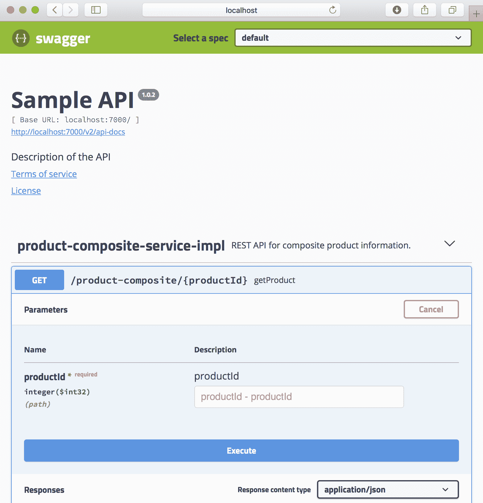

# 第二章：介绍 Spring Boot

在本章中，我们将介绍如何使用 Spring Boot 构建一套协同工作的微服务，重点是如何开发具有业务价值的功能。我们在上一章中指出的挑战只会考虑一部分，但它们将在后面的章节中得到全面解决。

我们将使用 Spring WebFlux、基于 Swagger/OpenAPI 的 REST API 文档和 SpringFox 以及数据持久性，开发包含业务逻辑的微服务，同时使用 Spring Data 将数据存储在 SQL 和 NoSQL 数据库中。

自从 Spring Boot v2.0 于 2018 年 3 日发布以来，开发响应式微服务变得容易多了（参考第一章，*微服务介绍*，*响应式微服务*部分以获取更多信息）。因此，我们也将介绍如何在本章创建响应式微服务，包括非阻塞同步 REST API 和基于消息的异步服务。我们将使用 Spring WebFlux 开发非阻塞同步 REST API 和 Spring Cloud Stream 开发基于消息的异步服务。

最后，我们将使用 Docker 将我们的微服务作为容器运行。这将允许我们用一个命令启动和停止我们的微服务景观，包括数据库服务器和消息代理。

这是很多技术和框架，所以我们简要地看看它们都是关于什么！

在本章中，我们将介绍以下主题：

+   学习 Spring Boot

+   从 Spring WebFlux 开始

+   探索 SpringFox

+   了解 Spring Data

+   了解 Spring Cloud Stream

+   学习关于 Docker 的内容

关于每个产品的更多详细信息将在接下来的章节中提供。

# 技术要求

本章不包含可以下载的源代码，也不需要安装任何工具。

# 学习 Spring Boot

Spring Boot 以及 Spring Boot 基于的 Spring Framework，是用于在 Java 中开发微服务的好框架。

当 Spring Framework 在 2004 年发布 v1.0 时，它是为了修复过于复杂的 J2EE 标准（Java 2 Platforms, Enterprise Edition 的缩写）而发布的，其臭名昭著的部署描述符非常繁重。Spring Framework 提供了一种基于依赖注入（DI）概念的更轻量级开发模型。与 J2EE 中的部署描述符相比，Spring Framework 还使用了更轻量的 XML 配置文件。

至于 J2EE 标准，更糟糕的是，重量级的部署描述符实际上分为两种类型：

+   标准部署描述符，以标准方式描述配置

+   特定于供应商的部署描述符，将配置映射到供应商特定应用服务器中的供应商特定功能

2006 年，J2EE 被重新命名为**Java EE**，即**Java Platform, Enterprise Edition**，最近，Oracle 将 Jave EE 提交给了 Eclipse 基金会。2018 年 2 月，Java EE 被重新命名为 Jakarta EE。

多年来，尽管 Spring Framework 越来越受欢迎，其功能也显著增长。慢慢地，使用不再那么轻量级的 XML 配置文件来设置 Spring 应用程序的负担变得成为一个问题。

2014 年，Spring Boot 1.0 版本发布，解决了这些问题！

# 约定优于配置和胖 JAR 文件

Spring Boot 通过强烈地规定了如何设置 Spring Framework 的核心模块以及第三方产品，如用于日志记录或连接数据库的库，从而快速开发生产就绪的 Spring 应用程序。Spring Boot 通过默认应用一系列约定并最小化配置需求来实现这一点。每当需要时，每个约定都可以通过编写一些配置来个别覆盖。这种设计模式被称为**约定优于配置**，并最小化了初始配置的需求。

当需要配置时，我认为最好使用 Java 和注解来编写配置。虽然它们比 Spring Boot 出现之前的要小得多，但仍然可以使用那些基于 XML 的古老配置文件。

除了使用*c**onvention over configuration*之外，Spring Boot 还倾向于一个基于独立 JAR 文件的运行时模型，也称为胖 JAR 文件。在 Spring Boot 之前，运行 Spring 应用程序最常见的方式是将它部署为 Apache Tomcat 等 Java EE 网络服务器上的 WAR 文件。Spring Boot 仍然支持 WAR 文件部署。

一个胖 JAR 文件不仅包含应用程序自身的类和资源文件，还包括应用程序所依赖的所有`.jar`文件。这意味着胖 JAR 文件是运行应用程序所需的唯一 JAR 文件；也就是说，我们只需要将一个 JAR 文件传输到我们想要运行应用程序的环境中，而不是将应用程序的 JAR 文件及其依赖的所有 JAR 文件一起传输。

启动胖 JAR 不需要安装单独的 Java EE 网络服务器，如 Apache Tomcat。相反，可以使用简单的命令如`java -jar app.jar`来启动，这使它成为在 Docker 容器中运行的理想选择！如果 Spring Boot 应用程序使用 HTTP，例如，暴露一个 REST API，它将包含一个内嵌的网络服务器。

# 设置 Spring Boot 应用程序的代码示例

为了更好地理解这意味着什么，让我们看看一些源代码示例。

在这里我们只看一些代码片段来指出主要特性。要看到一个完全可工作的示例，您必须等到下一章！

# 神奇的@SpringBootApplication 注解

基于约定的自动配置机制可以通过注解应用程序类来启动，即包含静态`main`方法的类，用`@SpringBootApplication`注解。以下代码显示了这一点：

```java
@SpringBootApplication
public class MyApplication {

  public static void main(String[] args) {
    SpringApplication.run(MyApplication.class, args);
  }
}
```

以下功能将由此注解提供：

+   它支持组件扫描，即在应用程序类的包及其所有子包中查找 Spring 组件和配置类。

+   应用程序类本身成为一个配置类。

+   它支持自动配置，其中 Spring Boot 在类路径中查找可以自动配置的 JAR 文件。例如，如果你在类路径中有 Tomcat，Spring Boot 将自动将 Tomcat 配置为内嵌 web 服务器。

# 组件扫描

假设我们在应用程序类的包（或其子包之一）中有一个 Spring 组件：

```java
@Component
public class MyComponentImpl implements MyComponent { ...
```

应用程序中的另一个组件可以自动导入组件，也称为**自动焊接**，使用`@Autowired`注解：

```java
public class AnotherComponent {

  private final MyComponent myComponent;

  @Autowired
  public AnotherComponent(MyComponent myComponent) {
    this.myComponent = myComponent;
  }
```

我更喜欢使用构造函数注入（而不是字段和设置器注入）来保持组件状态不可变。不可变的州对于希望在多线程运行时环境中运行组件很重要。

如果我们想要使用声明在应用程序包之外的包中的组件，例如，被多个 Spring Boot 应用程序共享的实用组件，我们可以在应用程序类中的`@SpringBootApplication`注解补充一个`@ComponentScan`注解：

```java
package se.magnus.myapp;

@SpringBootApplication
@ComponentScan({"se.magnus.myapp","se.magnus.utils"})
public class MyApplication {
```

现在我们可以在应用程序代码中自动导入`se.magnus.util`包的组件，例如，如下所示的一个实用组件：

```java
package se.magnus.utils;

@Component
public class MyUtility { ...
```

这个实用组件可以这样在应用程序组件中自动导入：

```java
package se.magnus.myapp.services;

public class AnotherComponent {

 private final MyUtility myUtility;

 @Autowired
 public AnotherComponent(MyUtility myUtility) {
   this.myUtility = myUtility;
 }
```

# 基于 Java 的配置

如果我们想要覆盖 Spring Boot 的默认配置，或者如果我们想要添加自己的配置，我们只需用`@Configuration`注解一个类，它将被我们之前描述的组件扫描机制找到。

例如，如果我们想要在由 Spring WebFlux（如下所述）处理的 HTTP 请求处理中设置一个过滤器，该过滤器在请求处理的开头和结尾分别写入日志消息，我们可以如下配置一个日志过滤器：

```java
@Configuration
public class SubscriberApplication {

  @Bean
  public Filter logFilter() {
    CommonsRequestLoggingFilter filter = new 
        CommonsRequestLoggingFilter();
    filter.setIncludeQueryString(true);
    filter.setIncludePayload(true);
    filter.setMaxPayloadLength(5120);
    return filter;
  }
```

我们还可以将配置直接放在应用程序类中，因为`@SpringBootApplication`注解隐含了`@Configuration`注解。

现在我们已经了解了 Spring Boot，接下来让我们谈谈 Spring WebFlux。

# 从 Spring WebFlux 开始

Spring Boot 2.0 基于 Spring Framework 5.0，它提供了内置的支持来开发反应式应用程序。Spring Framework 使用**Project Reactor**作为其反应式支持的基线实现，并且还带来了一个新的 web 框架 Spring WebFlux，它支持开发反应式的，即非阻塞的 HTTP 客户端和服务。

Spring WebFlux 支持两种不同的编程模型：

+   基于注解的命令式风格，与已经存在的 Web 框架 Spring Web MVC 类似，但支持响应式服务

+   基于路由和处理器的新的函数式模型

在这本书中，我们将使用基于注解的命令式风格来展示将 REST 服务从 Spring Web MVC 迁移到 Spring WebFlux 是多么容易，然后开始重构服务，使它们变得完全响应式。

Spring WebFlux 还提供了一个完全响应式的 HTTP 客户端，`WebClient`，作为现有`RestTemplate`客户端的补充。

Spring WebFlux 支持在 Servlet 容器上运行（它需要 Servlet v3.1 或更高版本），但也支持响应式非 Servlet 内嵌 Web 服务器，如 Netty([`netty.io/`](https://netty.io/))。

# 使用 Spring WebFlux 设置 REST 服务的代码示例

在我们能够基于 Spring WebFlux 创建 REST 服务之前，需要将 Spring WebFlux（及其所需的依赖项）添加到 Spring Boot 的类路径中，以便在启动时检测并配置。Spring Boot 提供大量方便的*启动依赖项*，每个依赖项都带来一个特定的特性，以及每个特性通常所需的依赖项。所以，让我们使用 Spring WebFlux 的启动依赖项，然后看看简单的 REST 服务长什么样！

# 启动依赖项

在这本书中，我们将使用 Gradle 作为我们的构建工具，因此 Spring WebFlux 的启动依赖项将被添加到`build.gradle`文件中。它看起来像这样：

```java
implementation('org.springframework.boot:spring-boot-starter-webflux')
```

你可能想知道为什么我们没有指定一个版本号。

我们将在第三章中讨论这一点，*创建一组协作的微服务*！

当微服务启动时，Spring Boot 将检测到类路径中的 Spring WebFlux 并对其进行配置，以及其他用于启动内嵌 Web 服务器的所用东西。默认使用 Netty，我们可以从日志输出中看到：

```java
2018-09-30 15:23:43.592 INFO 17429 --- [ main] o.s.b.web.embedded.netty.NettyWebServer : Netty started on port(s): 8080
```

如果我们想要将 Netty 更改为 Tomcat 作为我们的内嵌 Web 服务器，可以通过从启动依赖项中排除 Netty 并添加 Tomcat 的启动依赖项来覆盖默认配置：

```java
implementation('org.springframework.boot:spring-boot-starter-webflux') 
{
 exclude group: 'org.springframework.boot', module: 'spring-boot-
 starter-reactor-netty'
}
implementation('org.springframework.boot:spring-boot-starter-tomcat')
```

重启微服务后，我们可以看到 Spring Boot 选择了 Tomcat：

```java
2018-09-30 18:23:44.182 INFO 17648 --- [ main] o.s.b.w.embedded.tomcat.TomcatWebServer : Tomcat initialized with port(s): 8080 (http)
```

# 属性文件

从前面的示例中，可以看到 Web 服务器使用端口`8080`启动。如果你想要更改端口，可以使用属性文件覆盖默认值。Spring Boot 应用程序属性文件可以是`.properties`文件或 YAML 文件。默认情况下，它们分别命名为`application.properties`和`application.yml`。

在这本书中，我们将使用 YAML 文件，以便内嵌 Web 服务器所使用的 HTTP 端口可以更改为`7001`。通过这样做，我们可以避免与其他在同一服务器上运行的微服务发生端口冲突。为此，需要在`application.yml`文件中添加以下行：

```java
server.port: 7001
```

# 示例 RestController

现在，有了 Spring WebFlux 和我们所选择的嵌入式 Web 服务器，我们可以像使用 Spring MVC 一样编写 REST 服务，即使用 `RestController`：

```java
@RestController
public class MyRestService {

  @GetMapping(value = "/my-resource", produces = "application/json")
  List<Resource> listResources() {
    ...
  }
```

`@GetMapping` 注解应用于 `listResources()` 方法，它将 Java 方法映射到 `host:8080/myResource` URL 上的 HTTP `GET` API。`List<Resource>` 类型的返回值将被转换为 JSON。

既然我们谈论了 Spring WebFlux，现在让我们来看看 SpringFox 是关于什么的。

# 探索 SpringFox

开发 API 的一个非常重要的方面，例如 RESTful 服务，是如何文档化它们，以便它们易于使用。当涉及到 RESTful 服务时，Swagger 是文档化 RESTful 服务最广泛使用的方法之一。许多领先的 API 网关都有内置支持，用于通过 Swagger 暴露 RESTful 服务的文档。

在 2015 年，SmartBear Software 将 Swagger 规范捐赠给了 Linux Foundation 旗下的 OpenAPI Initiative，并创建了 OpenAPI 规范。Swagger 这个名称仍被用于 SmartBear Software 提供的工具中。

SpringFox 是一个开源项目，与 Spring Framework 分开，它可以在运行时创建基于 Swagger 的 API 文档。它通过在应用程序启动时检查来做到这一点，例如，检查 `WebFlux` 和基于 Swagger 的注解。

在接下来的章节中，我们将查看完整的源代码示例，但现在以下这个示例 API 文档的屏幕快照就足够了：



注意那个大大的执行按钮，它可以用来实际尝试 API，而不仅仅是阅读其文档！

SpringFox 帮助我们理解了微服务如何深入到 Spring Framework 中。现在，让我们转向 Spring Data。

# 理解 Spring Data

Spring Data 提供了一个用于在不同类型的数据库引擎中持久化数据的常见编程模型，范围从传统的关系数据库（SQL 数据库）到各种类型的 NoSQL 数据库引擎，例如文档数据库（例如，MongoDB）、键值数据库（例如，Redis）和图数据库（例如，Neo4J）。

Spring Data 项目分为几个子项目，在这本书中，我们将使用已映射到 MySQL 数据库的 Spring Data MongoDB 和 JPA 子项目。

**JPA** 是 **Java Persistence API** 的缩写，是关于如何处理关系数据的一个 Java 规范。请访问 [`jcp.org/aboutJava/communityprocess/mrel/jsr338/index.html`](https://jcp.org/aboutJava/communityprocess/mrel/jsr338/index.html) 查看最新的规范，截至撰写本文时是 JPA 2.2。

Spring Data 编程模型的两个核心概念是实体和仓库。实体和仓库概括了从各种类型的数据库存储和访问数据的方式。它们提供了一个通用的抽象，但仍然支持向实体和仓库添加数据库特定的行为。这两个核心概念将在本章中一起简要解释，并附有一些示例代码。请注意，更多的细节将在接下来的章节中提供！

尽管 Spring Data 为不同类型的数据库提供了一个共同的编程模型，但这并不意味着您将能够编写可移植的源代码，例如，在不更改源代码的情况下，将数据库技术从 SQL 数据库更改为 NoSQL 数据库！

# 实体

实体描述了 Spring Data 将存储的数据。实体类通常用通用的 Spring Data 注解和特定于每种数据库技术的注解进行注释。

例如，一个将存储在关系型数据库中的实体可以注释如下 JPA 注解：

```java
import javax.persistence.Entity;
import javax.persistence.Id;
import javax.persistence.IdClass;
import javax.persistence.Table;

@Entity
@IdClass(ReviewEntityPK.class)
@Table(name = "review")
public class ReviewEntity {
 @Id private int productId;
 @Id private int reviewId;
 private String author;
 private String subject;
 private String content;
```

如果一个实体要存储在 MongoDB 数据库中，可以使用 Spring Data MongoDB 子项目的注解以及通用的 Spring Data 注解。例如，考虑以下代码：

```java
import org.springframework.data.annotation.Id;
import org.springframework.data.annotation.Version;
import org.springframework.data.mongodb.core.mapping.Document;

@Document
public class RecommendationEntity {

    @Id
    private String id;

    @Version
    private int version;

    private int productId;
    private int recommendationId;
    private String author;
    private int rate;
    private String content;
```

`@Id`和`@Version`注解是通用的注解，而`@Document`注解是特定于 Spring Data MongoDB 子项目的。

这一点可以通过研究导入声明来揭示；也就是说，包含`mongodb`的导入声明来自 Spring Data MongoDB 子项目。

# 仓库

仓库用于存储和访问不同类型的数据库中的数据。在其最基本的形式中，一个仓库可以声明为一个 Java 接口，Spring Data 将使用有偏见的约定实时生成其实现。这些约定可以被覆盖和/或补充额外的配置，如果需要，还一些 Java 代码。Spring Data 还提供了一些基础 Java 接口，例如`CrudRepository`，以使仓库的定义更加简单。基础接口`CrudRepository`为我们提供了创建、读取、更新和删除操作的标准方法。

为了指定一个用于处理 JPA 实体`ReviewEntity`的仓库，我们只需要声明以下内容：

```java
import org.springframework.data.repository.CrudRepository;

public interface ReviewRepository extends CrudRepository<ReviewEntity, ReviewEntityPK> {
    Collection<ReviewEntity> findByProductId(int productId);
}
```

在这个例子中，我们使用一个类`ReviewEntityPK`来描述一个组合主键。它如下所示：

```java
public class ReviewEntityPK implements Serializable {
    public int productId;
    public int reviewId;
}
```

我们还添加了一个额外的方法`findByProductId`，它允许我们根据`productId`——主键的一部分——来查找`Review`实体。该方法的命名遵循 Spring Data 定义的命名约定，允许 Spring Data 实时生成这个方法的实现。

如果我们想要使用仓库，我们可以简单地注入它，然后开始使用它，例如：

```java
private final ReviewRepository repository;

@Autowired
public ReviewService(ReviewRepository repository) {
 this.repository = repository;
}

public void someMethod() {
  repository.save(entity);
  repository.delete(entity);
  repository.findByProductId(productId);
```

还添加到了`CrudRepository`接口中，Spring Data 还提供了一个反应式基础接口，`ReactiveCrudRepository`，它使反应式仓库成为可能。该接口中的方法不返回对象或对象集合；相反，它们返回`Mono`和`Flux`对象。如我们在后面的章节中将看到的，`Mono`和`Flux`对象是**反应式流**，能够返回`0`..`1`或`0`..`m`个实体，实体随着流变得可用。基于反应式的接口只能由支持反应式数据库驱动器的 Spring Data 子项目使用；也就是说，它们基于非阻塞 I/O。Spring Data MongoDB 子项目支持反应式仓库，而 Spring Data JPA 则不支持。

为处理前面描述的 MongoDB 实体`RecommendationEntity`指定反应式仓库可能会像以下内容一样：

```java
import org.springframework.data.repository.reactive.ReactiveCrudRepository;
import reactor.core.publisher.Flux;

public interface RecommendationRepository extends ReactiveCrudRepository<RecommendationEntity, String> {
    Flux<RecommendationEntity> findByProductId(int productId);
}
```

本节关于 Spring Data 的内容就到这里。现在让我们来看看 Spring Cloud Stream 是关于什么的。

# 理解 Spring Cloud Stream

我们本章不会专注于 Spring Cloud；我们将在第九章，*使用 Netflix Eureka 和 Ribbon 添加服务发现*到第十四章，*理解分布式跟踪*中这样做。然而，我们将引入 Spring Cloud 的一个模块：Spring Cloud Stream。Spring Cloud Stream 为消息提供了一种流式抽象，基于发布-订阅集成模式。Spring Cloud Stream 目前内置了对 Apache Kafka 和 RabbitMQ 的支持。存在许多独立的项目，为其他流行的消息系统提供集成。有关更多信息，请参见[`github.com/spring-cloud?q=binder`](https://github.com/spring-cloud?q=binder)。

Spring Cloud Stream 中的核心概念如下：

+   **消息**：用于描述发送到和从消息系统接收的数据的数据结构。

+   **发布者**：向消息系统发送消息。

+   **订阅者**：从消息系统中接收消息。

+   **通道**：用于与消息系统进行通信。发布者使用输出通道，订阅者使用输入通道。

+   **绑定器**：提供与特定消息系统的实际集成，类似于 JDBC 驱动程序对特定类型的数据库所做的那样。

实际要使用的消息系统在运行时确定，取决于在类路径中找到的内容。Spring Cloud Stream 带有关于如何处理消息的**有见解的约定**。这些约定可以通过指定消息功能的配置来覆盖，如消费者组、分区、持久化、耐用性和错误处理，如重试和死信队列处理。

# 发送和接收消息的 Spring Cloud Stream 代码示例

为了更好地理解这一切是如何组合在一起的，让我们来看看一些源代码示例。

让我们假设我们有一个简单的消息类，如下所示（构造函数、getter 和 setter 已省略，以提高可读性）：

```java
public class MyMessage {
  private String attribute1 = null;
  private String attribute2 = null;
```

Spring Cloud Stream 带有默认的输入和输出通道，`Sink`和`Source`，所以我们可以开始使用，而不需要创建自己的。要发布一条消息，我们可以使用以下源代码：

```java
import org.springframework.cloud.stream.messaging.Source;

@EnableBinding(Source.class)
public class MyPublisher {

 @Autowired private Source mysource;

 public String processMessage(MyMessage message) {
   mysource.output().send(MessageBuilder.withPayload(message).build());
```

为了接收消息，我们可以使用以下代码：

```java
import org.springframework.cloud.stream.messaging.Sink;

@EnableBinding(Sink.class)
public class MySubscriber {

 @StreamListener(target = Sink.INPUT)
 public void receive(MyMessage message) {
 LOG.info("Received: {}",message);
```

为了绑定到 RabbitMQ，我们将在构建文件中使用专门的启动依赖项`build.gradle`：

```java
implementation('org.springframework.cloud:spring-cloud-starter-stream-rabbit')
```

为了让订阅者从发布者那里接收消息，我们需要配置输入和输出通道以使用相同的目的地。如果我们使用 YAML 来描述我们的配置，它可能如下所示对于发布者：

```java
spring.cloud.stream:
  default.contentType: application/json
  bindings.output.destination: mydestination
```

订阅者的配置如下：

```java
spring.cloud.stream:
  default.contentType: application/json
  bindings.input.destination: mydestination
```

我们使用`default.contentType`来指定我们更喜欢消息以 JSON 格式序列化。

现在我们已经了解了各种 Spring API，让我们在下一节了解一个相对较新的概念，Docker。

# 学习关于 Docker

我假设 Docker 和容器概念不需要深入介绍。Docker 在 2013 年非常流行的容器作为虚拟机的轻量级替代品。实际上，容器是在使用 Linux **namespaces**在 Linux 主机上处理，以提供容器之间全局系统资源，如用户、进程、文件系统、网络。Linux 控制组（也称为**cgroups**）用于限制容器允许消耗的 CPU 和内存量。与在每一个虚拟机中运行操作系统的完整副本的虚拟机相比，容器的开销只是虚拟机开销的一小部分。这导致了更快的启动时间和在 CPU 和内存使用上显著降低的开销。然而，容器提供的隔离并不被认为是像虚拟机提供的隔离那样安全的。随着 Windows Server 2016 的发布，微软支持在 Windows 服务器上使用 Docker。

容器在开发和测试中都非常有用。能够通过一条命令启动一个完整的微服务合作系统景观（例如，数据库服务器、消息代理等）进行测试，这真是令人惊叹。

例如，我们可以编写脚本以自动化我们微服务景观的端到端测试。一个测试脚本可以启动微服务景观，使用暴露的服务运行测试，并拆除景观。这种类型的自动化测试脚本非常实用，既可以在开发者在将代码推送到源代码仓库之前在本地的开发机上运行，也可以作为交付管道中的一个步骤执行。构建服务器可以在持续集成和部署过程中，在开发者将代码推送到源代码仓库时运行这些类型的测试。

对于生产使用，我们需要一个容器编排器，如 Kubernetes。我们将在本书的后面回到容器编排器和 Kubernetes。

在本书中我们将要研究的绝大多数微服务，只需要如下的 Dockerfile 就可以将微服务作为 Docker 容器运行：

```java
FROM openjdk:12.0.2

MAINTAINER Magnus Larsson <magnus.larsson.ml@gmail.com>

EXPOSE 8080
ADD ./build/libs/*.jar app.jar
ENTRYPOINT ["java","-jar","/app.jar"]
```

如果我们想要用一个命令来启动和停止许多容器，Docker Compose 是完美的工具。Docker Compose 使用一个 YAML 文件来描述要管理的容器。对于我们的微服务，它可能看起来像如下这样：

```java
product:
 build: microservices/product-service

recommendation:
 build: microservices/recommendation-service

review:
  build: microservices/review-service

composite:
  build: microservices/product-composite-service
  ports:
    - "8080:8080"
```

让我稍微解释一下前面的源代码：

+   `build`指令用于指定每个微服务使用哪个 Dockerfile。Docker Compose 会使用它来构建一个 Docker 镜像，然后基于这个 Docker 镜像启动一个 Docker 容器。

+   复合服务中的`ports`指令用于在运行 Docker 的服务器上暴露端口`8080`。在开发者的机器上，这意味着可以通过使用`localhost:8080`简单地访问复合服务的端口！

YAML 文件中的所有容器都可以用如下简单命令进行管理：

+   `docker-compose up -d`：启动所有容器。`-d`意味着容器在后台运行，不会锁定执行命令的终端。

+   `docker-compose down`：停止并删除所有容器。

+   `docker-compose logs -f --tail=0`：输出所有容器的日志消息。`-f`意味着该命令不会完成，而是等待新的日志消息。`--tail=0`意味着我们不想看到任何之前的日志消息，只想要新的。

这是对 Docker 的简要介绍。在本书的最后几章，我们将更详细地介绍 Docker。

# 总结

在本章中，我们介绍了 Spring Boot 以及可以用来构建协作微服务的互补的开源工具。

Spring Boot 用于简化基于 Spring 的生产级应用程序的开发。它强烈地规定了如何设置 Spring Framework 的核心模块和第三方产品。

Spring WebFlux 是 Spring 家族中的一个新模块，用于开发反应式的，也就是非阻塞的 REST 服务。它既可以在 Netty 这样的轻量级 web 服务器上运行，也可以在任何 Servlet 3.1+兼容的 web 服务器上运行。它还支持来自较老的 Spring MVC 模块的编程模型；无需完全重写代码，就可以轻松地将为 Spring MVC 编写的 REST 服务迁移到 Spring WebFlux。

SpringFox 可以用来创建基于 Swagger 和 OpenAPI 的关于 REST 服务的文档。它通过检查 REST 服务的注解（既 Spring 的注解和一些 Swagger 特定的注解，如果使用的话）在运行时动态创建文档。

Spring Data 提供了一种优雅的抽象，用于使用实体和仓库访问和管理持久数据。编程模型相似，但不同类型的数据库（例如，关系型、文档型、键值型和图数据库）之间并不兼容。

Spring Cloud Stream 为消息传递提供了基于发布和订阅集成模式的流抽象。Spring Cloud Stream 默认支持 Apache Kafka 和 RabbitMQ，但可以通过自定义绑定器扩展支持其他消息代理。

Docker 使得容器这一轻量级的虚拟机替代方案变得易于使用。基于 Linux 命名空间和控制组，容器提供了与传统虚拟机相似的隔离性，但在 CPU 和内存使用方面有显著的较低开销。Docker 是一个非常适合开发和测试的工具，但在大多数情况下，在生产环境中使用需要一个容器编排器，如 Kubernetes。

# 问题

1.  `@SpringBootApplication` 注解的目的是什么？

1.  老版本的用于开发 REST 服务的 Spring 组件 Spring Web MVC 和新版本的 Spring WebFlux 之间的主要区别是什么？

1.  **SpringFox** 是如何帮助开发者文档化 REST API 的？

1.  在 Spring Data 中，仓库的功能是什么，仓库的最简单可能实现是什么？

1.  在 Spring Cloud Stream 中，绑定的目的是什么？

1.  **Docker Compose** 的目的是什么？
