# 第三章：创建一套协作的微服务

在本章中，我们将构建我们的第一个微服务。我们将学习如何创建具有最小功能的协作微服务。在接下来的章节中，我们将向这些微服务添加越来越多的功能。到本章末尾，我们将通过一个复合微服务暴露一个 RESTful API。复合微服务将使用它们的 RESTful API 调用其他三个微服务，以创建一个聚合响应。

本章将涵盖以下主题：

+   介绍微服务架构

+   生成微服务骨架

+   添加 RESTful API

+   添加一个复合微服务

+   添加错误处理

+   手动测试 API

+   向微服务添加隔离的自动化测试

+   向微服务架构添加半自动化测试

# 技术要求

本书中描述的所有命令都是在 MacBook Pro 上使用 macOS Mojave 运行的，但它们应该很容易修改，以便在如 Linux 或 Windows 等其他平台上运行。

# 工具安装

为了能够执行本章中使用的命令，你需要在你计算机上安装以下工具：

+   [Git:](https://git-scm.com/downloads) 可以从 [`git-scm.com/downloads`](https://git-scm.com/downloads) 下载并安装。

+   **Java：**可以从 [`www.oracle.com/technetwork/java/javase/downloads/index.html`](https://www.oracle.com/technetwork/java/javase/downloads/index.html) 下载并安装。

+   `curl`：这个用于测试基于 HTTP 的 API 的命令行工具可以从 [`curl.haxx.se/download.html`](https://curl.haxx.se/download.html) 下载并安装。

+   `jq`：这个命令行 JSON 处理器可以从 [`stedolan.github.io/jq/download/`](https://stedolan.github.io/jq/download/) 下载并安装。

+   **Spring Boot CLI**：这个 Spring Boot 应用程序的命令行工具可以从 [`docs.spring.io/spring-boot/docs/current/reference/html/getting-started-installing-spring-boot.html#getting-started-installing-the-cli`](https://docs.spring.io/spring-boot/docs/current/reference/html/getting-started-installing-spring-boot.html#getting-started-installing-the-cli) 下载并安装。

# 安装 Homebrew

要在 macOS 上安装这些工具，我建议你使用 Homebrew，[`brew.sh/`](https://brew.sh/)。如果你没有安装，可以使用以下命令安装：

```java
/usr/bin/ruby -e "$(curl -fsSL https://raw.githubusercontent.com/Homebrew/install/master/install)"
```

安装 Xcode 的命令行工具会安装 Homebrew，如果你还没有安装，可能需要一些时间。

使用以下命令验证 Homebrew 的安装：

```java
brew --version
```

期望得到如下响应：

```java
Homebrew 1.7.7
```

# 使用 Homebrew 安装 Java、curl、jq 和 Spring Boot CLI

在 macOS 上，`curl` 已经预装，`git` 是 Homebrew 安装的一部分。剩下的工具可以使用以下命令在 macOS 上使用 Homebrew 安装：

```java
brew tap pivotal/tap && \
brew cask install java && \
brew install jq && \
brew install springboot
```

这些工具的安装可以通过以下命令来验证：

```java
git --version
java -version
curl --version
jq --version
spring --version 
```

这些命令将返回如下内容（删除了一些不相关的输出）：

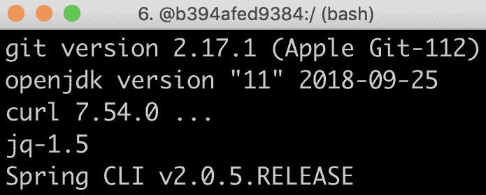

# 使用 IDE

我建议你使用支持 Spring Boot 应用程序开发的 IDE，如 Spring Tool Suite 或 IntelliJ IDEA Ultimate Edition 来编写 Java 代码。查看*手动测试 API*部分，了解如何使用 Spring Boot 控制台。然而，你不需要 IDE 就能按照本书中的说明操作。

# 访问源代码

本章的源代码可以在本书的 GitHub 仓库中找到：[`github.com/PacktPublishing/Hands-On-Microservices-with-Spring-Boot-and-Spring-Cloud/tree/master/Chapter03`](https://github.com/PacktPublishing/Hands-On-Microservices-with-Spring-Boot-and-Spring-Cloud/tree/master/Chapter03)。

为了能够运行本书中描述的命令，将源代码下载到文件夹中，并设置一个环境变量`$BOOK_HOME`，该变量指向该文件夹。一些示例命令如下：

```java
export BOOK_HOME=~/Documents/Hands-On-Microservices-with-Spring-Boot-and-Spring-Cloud
git clone https://github.com/PacktPublishing/Hands-On-Microservices-with-Spring-Boot-and-Spring-Cloud $BOOK_HOME
cd $BOOK_HOME/Chapter03
```

Java 源代码是为 Java 8 编写的，并在 Java 12 上进行了测试运行。为了避免与 Spring Boot 2.0（和 Spring 5.0）的一些问题，本章使用了 Spring Boot 2.1.0 RC1（和 Spring 5.1.1），这是在撰写本书时可用的最新 Spring Boot 版本。

本章中的代码示例都来自`$BOOK_HOME/Chapter03`的源代码，但在许多情况下，为了删除源代码中不相关部分，例如注释、导入和日志声明，对这些代码进行了编辑。

有了这些，我们安装了所需的工具，并下载了本章的源代码。在下一节中，我们将学习本书中我们将要创建的协作微服务系统架构。

# 介绍微服务架构

在第一章中，*微服务简介*，我们简要介绍了将在本书中使用的基于微服务的系统架构：

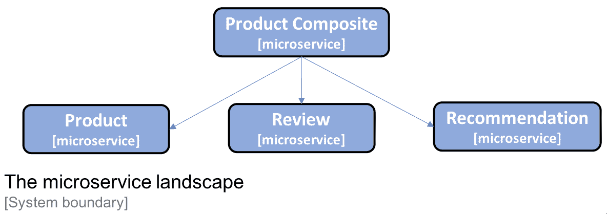

它由三个核心微服务组成，分别是**产品**、**评论**和**推荐**服务，这三个服务都处理一种资源类型，还有一个名为**产品组合**的复合微服务，它聚合了这三个核心服务的信息。

# 暂时替换发现服务

由于在这个阶段，我们没有任何服务发现机制，我们将为每个微服务使用硬编码端口号。我们将使用以下端口：

+   产品组合服务：`7000`

+   产品服务：`7001`

+   审查服务：`7002`

+   推荐服务：`7003`

我们稍后开始使用 Docker 和 Kubernetes 时，将不再使用这些硬编码端口！

在本节中，我们已经介绍了将要创建的微服务以及它们将处理的信息。在下一节中，我们将使用 Spring Initializr 创建微服务的骨架代码。

# 微服务处理的信息

为了使本书中的源代码示例容易理解，它们包含的业务逻辑量最小。它们处理的业务对象的信息模型同样因为此原因保持最小。在本节中，我们将了解每个微服务处理的信息，以及微服务处理的基础设施相关信息。

# 产品服务

`product`服务管理产品信息，并使用以下属性描述每个产品：

+   产品 ID

+   名称

+   重量

# 服务回顾

`review`服务管理产品评论，并存储关于每个评论以下信息：

+   产品 ID

+   回顾 ID

+   作者

+   主题

+   内容

# 推荐服务

`recommendation`服务管理产品推荐，并存储关于每个推荐以下信息：

+   产品 ID

+   推荐 ID

+   作者

+   评分

+   内容

# 产品复合服务

`product`复合服务汇总三个核心服务的信息，如下所示呈现关于产品的信息：

+   产品信息，如`product`服务中所描述

+   指定产品的产品评论列表，如`review`服务中所描述

+   指定产品的产品推荐列表，如`recommendation`服务中所描述

# 与基础设施相关的信息

一旦我们开始将我们的微服务作为由基础架构管理（首先是 Docker，后来是 Kubernetes）的容器运行，跟踪实际响应我们请求的容器将会很有趣。为了简化这种跟踪，我们还向所有我们的响应中添加了一个`serviceAddress`属性，格式为`hostname/ip-address:port`。

# 生成骨架微服务

是时候看看我们如何为我们的微服务创建项目了。这个主题的最终结果可以在`$BOOK_HOME/Chapter03/1-spring-init`文件夹中找到。为了简化项目的设置，我们将使用 Spring Initializr 为每个微服务生成一个骨架项目。骨架项目包含构建项目所需的文件，以及为微服务空白的`main`类和测试类。之后，我们将了解如何使用我们将要使用的构建工具 Gradle 中的多项目构建，用一个命令构建所有的微服务。

# 使用 Spring Initializr 生成骨架代码

为了开始开发我们的微服务，我们将使用一个名为**Spring Initializr**的工具来为我们生成骨架代码。它可以通过使用[`start.spring.io/`](https://start.spring.io/) URL 从网络浏览器调用，或者通过命令行工具`spring init`调用。为了更容易地复现微服务的创建，我们将使用命令行工具。

针对每个微服务，我们将创建一个 Spring Boot 项目，执行以下操作：

+   使用 Gradle 作为构建工具

+   为 Java 8 生成代码

+   将项目打包为胖 JAR 文件

+   引入了`Actuator`和`WebFlux` Spring 模块的依赖项

+   基于 Spring Boot v2.1.0 RC1（依赖于 Spring Framework v5.1.1）

Spring Boot Actuator 为管理和监控启用了许多有价值的端点。我们稍后可以看到它们的具体应用。在这里，我们将使用 Spring WebFlux 创建我们的 RESTful API。

为了为我们的微服务创建骨架代码，我们需要针对`product-service`运行以下命令：

```java
spring init \
--boot-version=2.1.0.RC1 \
--build=gradle \
--java-version=1.8 \
--packaging=jar \
--name=product-service \
--package-name=se.magnus.microservices.core.product \
--groupId=se.magnus.microservices.core.product \
--dependencies=actuator,webflux \
--version=1.0.0-SNAPSHOT \
product-service
```

如果你想了解更多关于`spring init` CLI 的信息，可以运行`spring help init`命令。要查看您可以添加的依赖项，请运行`spring init --list`命令。

如果你想自己创建这四个项目，而不是使用本书 GitHub 仓库中的源代码，可以尝试使用`$BOOK_HOME/Chapter03/1-spring-init/create-projects.bash`，如下所示：

```java
mkdir some-temp-folder cd some-temp-folder
$BOOK_HOME/Chapter03/1-spring-init/create-projects.bash
```

在使用`create-projects.bash`创建我们的四个项目后，我们将拥有以下文件结构：

```java
microservices/
├── product-composite-service
├── product-service
├── recommendation-service
└── review-service
```

对于每个项目，我们可以列出创建的文件。让我们为`product-service`项目这样做：

```java
find microservices/product-service -type f
```

我们将收到以下输出：

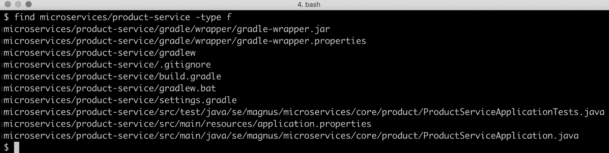

Spring Initializr 为 Gradle 创建了许多文件，包括一个`.gitignore`文件和三个 Spring Boot 文件：

+   `ProductServiceApplication.java`，我们的主应用类

+   `application.properties`，一个空属性文件

+   `ProductServiceApplicationTests.java`，一个已配置为使用 JUnit 在我们的 Spring Boot 应用程序上运行测试的测试类

`main`应用类`ProductServiceApplication.java`看起来与上一章预期的一致：

```java
package se.magnus.microservices.core.product;

@SpringBootApplication
public class ProductServiceApplication {
   public static void main(String[] args) {
      SpringApplication.run(ProductServiceApplication.class, args);
   }
}
```

测试类如下所示：

```java
package se.magnus.microservices.core.product;

@RunWith(SpringRunner.class)
@SpringBootTest
public class ProductServiceApplicationTests {
   @Test
   public void contextLoads() {
   }
}
```

`@RunWith(SpringRunner.class)`和`@SpringBootTest`注解将以前述方式初始化我们的应用：当运行应用时，`@SpringBootApplication`会设置 Spring 应用上下文；也就是说，在执行测试之前，使用组件扫描和自动配置设置上下文，如上一章所述。

让我们也看看最重要的 Gradle 文件，即`build.gradle`。这个文件的内容描述了如何构建项目，例如编译、测试和打包源代码。Gradle 文件从设置`buildscript`元素并列出要应用的插件来开始，为其余的构建文件设置条件：

```java
buildscript {
  ext {
    springBootVersion = '2.1.0.RC1'
  }
  repositories {
    mavenCentral()
    maven { url "https://repo.spring.io/snapshot" }
    maven { url "https://repo.spring.io/milestone" }
  }
  dependencies {
    classpath("org.springframework.boot:spring-boot-gradle-
    plugin:${springBootVersion}")
  }
}

apply plugin: 'java'
apply plugin: 'eclipse'
apply plugin: 'org.springframework.boot'
apply plugin: 'io.spring.dependency-management'
```

让我们更详细地解释前面的源代码：

+   Spring Boot 版本设置为我们运行`spring init`命令时指定的版本，即`2.1.0.RC1`。

+   声明了许多 Gradle 插件。最重要的插件是`org.springframework.boot`和`io.spring.dependency-management`插件，这两个插件一起确保 Gradle 会构建一个胖 JAR 文件，并且我们不需要在 Spring Boot 启动器依赖项上指定任何显式的版本号。相反，它们由`springBootVersion`属性隐含。

+   插件是从中央 Maven 仓库以及 Spring 的快照和里程碑仓库中获取的，因为我们指定的是 Spring Boot 的发行候选版本，即 v2.1.0 RC1，而不是一个已经发布并可在中央 Maven 仓库中找到的版本。

在构建文件的其余部分，我们基本上为我们的项目声明了一个组名和版本，Java 版本及其依赖项：

```java
group = 'se.magnus.microservices.core.product'
version = '1.0.0-SNAPSHOT'
sourceCompatibility = 1.8

repositories {
  mavenCentral()
  maven { url "https://repo.spring.io/snapshot" }
  maven { url "https://repo.spring.io/milestone" }
}

dependencies {
  implementation('org.springframework.boot:spring-boot-starter-
  actuator')
  implementation('org.springframework.boot:spring-boot-starter-
  webflux')
  testImplementation('org.springframework.boot:spring-boot-starter-
  test')
  testImplementation('io.projectreactor:reactor-test')
}
```

让我们更详细地解释上述源代码如下：

+   依赖项，像之前的插件一样，从中央 Maven 仓库和 Spring 的快照和里程碑仓库中获取。

+   依赖项是按照`Actuator`和`WebFlux`模块中指定的设置的，还有一些有用的测试依赖项。

我们可以使用以下命令单独构建每个微服务：

```java
cd microservices/product-composite-service; ./gradlew build; cd -; \
cd microservices/product-service;           ./gradlew build; cd -; \
cd microservices/recommendation-service;    ./gradlew build; cd -; \ cd microservices/review-service;            ./gradlew build; cd -; 
```

注意我们如何使用由 Spring Initializr 创建的`gradlew`可执行文件；也就是说，我们不需要安装 Gradle！

第一次运行`gradlew`命令时，它会自动下载 Gradle。使用的 Gradle 版本由`gradle/wrapper/gradle-wrapper.properties`文件中的`distributionUrl`属性确定。

# 在 Gradle 中设置多项目构建

为了使用一个命令构建所有微服务稍微简单一些，我们可以在 Gradle 中设置一个多项目构建。步骤如下：

1.  首先，我们创建一个`settings.gradle`文件，描述 Gradle 应该构建哪些项目：

```java
cat <<EOF > settings.gradle
include ':microservices:product-service'
include ':microservices:review-service'
include ':microservices:recommendation-service'
include ':microservices:product-composite-service'
EOF
```

1.  接下来，我们将复制从一个项目中生成的 Gradle 可执行文件，以便我们可以在多项目构建中重复使用它们：

```java
cp -r microservices/product-service/gradle .
cp microservices/product-service/gradlew .
cp microservices/product-service/gradlew.bat .
cp microservices/product-service/.gitignore .
```

1.  我们不再需要每个项目中生成的 Gradle 可执行文件，所以我们可以使用以下命令删除它们：

```java
find microservices -depth -name "gradle" -exec rm -rfv "{}" \; find microservices -depth -name "gradlew*" -exec rm -fv "{}" \; 
```

结果应该与您在`$BOOK_HOME/Chapter03/1-spring-init`文件夹中找到的代码类似。

1.  现在，我们可以用一个命令构建所有微服务：

```java
./gradlew build
```

如果您还没有运行前面的命令，您可以简单地直接去书源代码那里并从中构建：

```java
cd $BOOK_HOME/Chapter03/1-spring-init

./gradlew build
```

1.  这应该会导致以下输出：

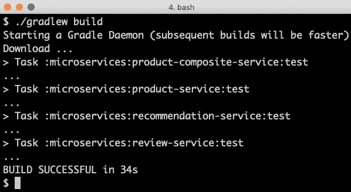

使用 Spring Initializr 创建的微服务骨架项目和成功使用 Gradle 构建后，我们在下一节准备向微服务中添加一些代码。

从 DevOps 的角度来看，多项目设置可能不是首选。相反，为每个微服务项目设置一个单独的构建管道可能更受欢迎。然而，为了本书的目的，我们将使用多项目设置，以便更容易用一个命令构建和部署整个系统架构。

# 添加 RESTful API

现在我们已经为我们的微服务设置了项目，接下来让我们向我们的三个核心微服务中添加一些 RESTful API 吧！

本章剩余主题的最终结果可以在 `$BOOK_HOME/Chapter03/2-basic-rest-services` 文件夹中找到。

首先，我们将添加两个项目（`api` 和 `util`），它们将包含由微服务项目共享的代码，然后我们将实现 RESTful API。

# 添加 API 和 util 项目

要添加 API，我们需要执行以下操作：

1.  首先，我们将建立一个单独的 Gradle 项目，用于放置我们的 API 定义。我们将使用 Java 接口来描述我们的 RESTful API，并使用模型类来描述 API 在其请求和响应中使用的数据。在我看来，使用 Java 接口而不是直接在 Java 类中描述 RESTful API 是一种很好的将 API 定义与其实现分离的方法。在本书的后续内容中，我们将进一步扩展这一模式，当我们向 Java 接口中添加更多 API 信息以在 Swagger/OpenAPI 定义中公开时。更多信息请参阅 第五章，*使用 OpenAPI/Swagger 添加 API 描述*。

描述 RESTful API 的 Java 接口直到 Spring Framework v5.1.0 才得到完全支持。具体请参阅 [`jira.spring.io/browse/SPR-11055`](https://jira.spring.io/browse/SPR-11055)。

是否应该将一组微服务的 API 定义存储在公共 API 模块中，这一点是有争议的。在我看来，这对于属于同一交付组织的微服务来说是一个不错的选择，也就是说，这些微服务的发布由同一个组织管理（与 *Domain-Driven Design* 中的 *Bounded Context* 相比，我们的微服务位于同一个 bounded context 中）。

1.  然后，我们将创建一个 `util` 项目，用于存放一些由我们的微服务共享的帮助类，例如，以统一的方式处理错误。

再次从 DevOps 的角度来看，最好为所有项目建立它们自己的构建管道，并在微服务项目中使用版本控制的 `api` 和 `util` 项目依赖；也就是说，每个微服务可以选择使用 `api` 和 `util` 项目的哪些版本。但为了在本书的上下文中保持构建和部署步骤简单，我们将使 `api` 和 `util` 项目成为多项目构建的一部分。

# api 项目

`api` 项目将被打包为库；也就是说，它将没有自己的 `main` 应用程序类。不幸的是，Spring Initializr 不支持创建库项目。相反，库项目需要从头开始手动创建。API 项目的源代码可在 `$BOOK_HOME/Chapter03/2-basic-rest-services/api` 找到。

库项目的结构与应用程序项目相同，不同之处在于我们不再有`main`应用程序类，以及在`build.gradle`文件中的一些小差异。Gradle `org.springframework.boot`和`io.spring.dependency-management`插件被替换为一个`dependencyManagement`部分：

```java
plugins {
   id "io.spring.dependency-management" version "1.0.5.RELEASE"
}

dependencyManagement {
  imports { mavenBom("org.springframework.boot:spring-boot-
  dependencies:${springBootVersion}") }
}
```

这允许我们在替换构建步骤中构建胖 JAR 的方法为创建正常 JAR 文件的同时保留 Spring Boot 依赖管理；也就是说，它们只包含库项目自己的类和属性文件。

`api`项目中我们三个核心微服务的 Java 文件如下：

```java
$BOOK_HOME/Chapter03/2-basic-rest-services/api/src/main/java/se/magnus/api/core
├── product
│   ├── Product.java
│   └── ProductService.java
├── recommendation
│   ├── Recommendation.java
│   └── RecommendationService.java
└── review
    ├── Review.java
    └── ReviewService.java
```

三个核心微服务的 Java 类结构非常相似，所以我们只查看`product`服务的源代码。

首先，我们将查看`ProductService.java`Java 接口，如下代码所示：

```java
package se.magnus.api.core.product;

public interface ProductService {
    @GetMapping(
        value    = "/product/{productId}",
        produces = "application/json")
     Product getProduct(@PathVariable int productId);
}
```

让我们更详细地解释一下前面的源代码：

+   `product`服务只暴露了一个 API 方法，`getProduct()`（我们将在本书后面扩展 API）。

+   为了将方法映射到 HTTP `GET`请求，我们使用`@GetMapping` Spring 注解，其中我们指定方法将被映射到的 URL 路径（`/product/{productId}`）以及响应的格式，这次是 JSON。

+   路径中的`{productId}`部分映射到一个名为`productId`的`path`变量。

+   `productId`方法参数用`@PathVariable`注解标记，这将把通过 HTTP 请求传递的值映射到参数。例如，对`/product/123`的 HTTP`GET`请求将导致`getProduct()`方法以`productId`参数设置为`123`被调用。

该方法返回一个`Product`对象，这是一个基于 plain POJO 的模型类，其成员变量对应于`Product`的属性。`Product.java`如下所示（省略了构造函数和 getter 方法）：

```java
public class Product {
 private final int productId;
 private final String name;
 private final int weight;
 private final String serviceAddress;
}
```

这种 POJO 类也被称为数据传输对象（Data Transfer Object，DTO），因为它用于在 API 实现和 API 调用者之间传输数据。当我们在第六章中讨论添加持久化时，我们会看到另一种可以用来描述数据在数据库中存储方式的 POJO，也称为实体对象。

# 工具项目

`util`项目将以与`api`项目相同的方式打包为库。`util`项目的源代码可以在`$BOOK_HOME/Chapter03/2-basic-rest-services/util`中找到。该项目包含以下 Java 文件：

+   `InvalidInputException`和`NotFoundException`异常类

+   `GlobalControllerExceptionHandler`、`HttpErrorInfo`和`ServiceUtil`工具类

除了`ServiceUtil.java`中的代码，这些类是可重用的实用工具类，我们可以使用它们将 Java 异常映射到适当的 HTTP 状态码，如*添加错误处理*部分所述。`ServiceUtil.java`的主要目的是找出微服务使用的主机名、IP 地址和端口。该类暴露了一个方法`getServiceAddress()`，微服务可以使用它来找到它们的主机名、IP 地址和端口。

# 实现我们的 API

现在我们可以开始在核心微服务中实现我们的 API 了！

三个核心微服务的实现看起来非常相似，所以我们只查看`product`服务的源代码。你可以在`$BOOK_HOME/Chapter03/2-basic-rest-services/microservices`中找到其他文件。让我们看看我们是如何进行这项工作的：

1.  我们需要在我们的`build.gradle`文件中添加`api`和`util`项目作为依赖，即`$BOOK_HOME/Chapter03/2-basic-rest-services/microservices/product-service/build.gradle`:

```java
dependencies {
   implementation project(':api')
   implementation project(':util')
```

1.  为了使 Spring Boot 的自动配置功能能够检测到`api`和`util`项目中的 Spring beans，我们还需要在主应用类中添加一个`@ComponentScan`注解，包括`api`和`util`项目的包：

```java
@SpringBootApplication
@ComponentScan("se.magnus")
public class ProductServiceApplication {
```

1.  接下来，我们创建我们的服务实现文件`ProductServiceImpl.java`，以便实现`api`项目中的 Java 接口`ProductService`，并使用`@RestController`注解类，以便 Spring 根据`Interface`类中指定的映射调用这个类的方法：

```java
package se.magnus.microservices.core.product.services;

@RestController
public class ProductServiceImpl implements ProductService {
}
```

1.  为了能够使用来自`util`项目的`ServiceUtil`类，我们将通过构造函数注入它，如下所示：

```java
private final ServiceUtil serviceUtil;

@Autowired
public ProductServiceImpl(ServiceUtil serviceUtil) {
    this.serviceUtil = serviceUtil;
}
```

1.  现在，我们可以通过覆盖`api`项目中的接口的`getProduct()`方法来实现 API：

```java
@Override
public Product getProduct(int productId) {
 return new Product(productId, "name-" + productId, 123, 
 serviceUtil.getServiceAddress());
}
```

由于我们目前不使用数据库，我们只需根据`productId`的输入返回一个硬编码的响应，加上由`ServiceUtil`类提供的服务地址。

对于最终结果，包括日志和错误处理，请参阅`$BOOK_HOME/Chapter03/2-basic-rest-services/microservices/product-service/src/main/java/se/magnus/microservices/core/product/services/ProductServiceImpl.java`。

1.  最后，我们还需要设置一些运行时属性——使用哪个端口以及所需的日志级别。这添加到了`$BOOK_HOME/Chapter03/2-basic-rest-services/microservices/product-service/src/main/resources/application.yml`属性文件中：

```java
server.port: 7001

logging:
  level:
    root: INFO
    se.magnus.microservices: DEBUG
```

1.  我们可以尝试单独测试`product`服务。使用以下命令构建并启动微服务：

```java
cd $BOOK_HOME/Chapter03/2-basic-rest-services
./gradlew build
java -jar microservices/product-service/build/libs/*.jar &
```

1.  等待终端打印以下内容：

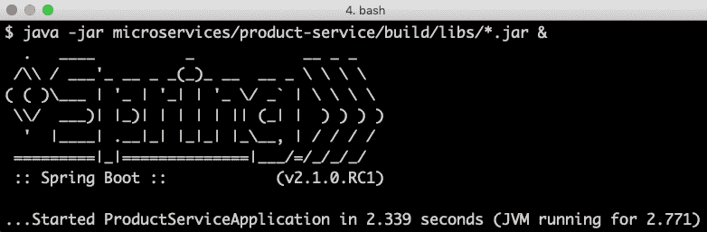

1.  对`product`服务进行测试调用：

```java
curl http://localhost:7001/product/123
```

1.  它应该响应以下类似的内容：

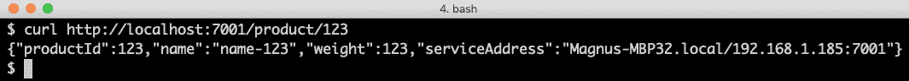

1.  最后，停止`product`服务：

```java
kill $(jobs -p)
```

我们已经构建、运行并测试了我们的第一个单一微服务。在下一节中，我们将实现一个复合微服务，该服务将使用我们迄今为止创建的三个核心微服务。

# 添加复合微服务

现在，是时候通过添加将调用三个核心服务的复合服务来整合一切了！

复合服务的实现分为两部分：一个处理对核心服务发出的 HTTP 请求的集成组件和复合服务实现本身。这种责任划分的主要原因是它简化了自动化单元和集成测试；也就是说，我们可以通过用模拟替换集成组件来孤立地测试服务实现。

正如我们在这本书后面所看到的，这种责任划分也使得引入断路器变得更容易！

在深入源代码之前，我们需要先了解复合微服务将使用的 API 类，以及学习运行时属性如何用于持有核心微服务的地址信息。

两个组件的完整实现，包括集成组件和复合服务的实现，可以在`$BOOK_HOME/Chapter03/2-basic-rest-services/microservices/product-composite-service/src/main/java/se/magnus/microservices/composite/product/services`文件夹中找到。

# api 类

在本节中，我们将查看描述复合组件 API 的类。它们可以在`$BOOK_HOME/Chapter03/2-basic-rest-services/api`中找到。以下是要查看的 API 类：

```java
$BOOK_HOME/Chapter03/2-basic-rest-services/api
└── src/main/java/se/magnus/api/composite
    └── product
        ├── ProductAggregate.java
        ├── ProductCompositeService.java
        ├── RecommendationSummary.java
        ├── ReviewSummary.java
        └── ServiceAddresses.java
```

`ProductCompositeService.java`这个 Java 接口类遵循与核心服务相同的模式，如下所示：

```java
package se.magnus.api.composite.product;

public interface ProductCompositeService {
    @GetMapping(
        value    = "/product-composite/{productId}",
        produces = "application/json")
    ProductAggregate getProduct(@PathVariable int productId);
}
```

模型类`ProductAggregate.java`比核心模型稍微复杂一些，因为它包含推荐和评论的列表字段：

```java
package se.magnus.api.composite.product;

public class ProductAggregate {
    private final int productId;
    private final String name;
    private final int weight;
    private final List<RecommendationSummary> recommendations;
    private final List<ReviewSummary> reviews;
    private final ServiceAddresses serviceAddresses;
```

# 属性

为了避免在复合微服务的源代码中硬编码核心服务的地址信息，后者使用一个属性文件，其中存储了如何找到核心服务的信息。这个属性文件可以在`$BOOK_HOME/Chapter03/2-basic-rest-services/microservices/product-composite-service/src/main/resources/application.yml`中找到，如下所示：

```java
server.port: 7000

app:
  product-service:
    host: localhost
    port: 7001
  recommendation-service:
    host: localhost
    port: 7002
  review-service:
    host: localhost
    port: 7003
```

这种配置将在本书后面被服务发现机制所取代。

# 集成组件

让我们看看集成组件`ProductCompositeIntegration.java`。它使用`@Component`注解作为一个 Spring Bean 声明，并实现了三个核心服务的 API 接口：

```java
package se.magnus.microservices.composite.product.services;

@Component
public class ProductCompositeIntegration implements ProductService, RecommendationService, ReviewService {
```

整合组件使用 Spring Framework 中的一个助手类`RestTemplate.java`来对核心微服务执行实际的 HTTP 请求。在我们能够将其注入整合组件之前，我们需要对其进行配置。我们是在`main`应用程序类`ProductCompositeServiceApplication.java`中如下完成的：

```java
@Bean
RestTemplate restTemplate() {
   return new RestTemplate();
}
```

`RestTemplate`高度可配置，但我们现在将其保留为其默认值。

我们现在可以在整合组件的构造函数中注入`RestTemplate`，以及用于错误处理的 JSON 映射器和我们 在属性文件中设置的配置值。让我们看看这是如何完成的：

1.  用于设置三个核心服务 URL 的配置值如下所示注入到构造函数中：

```java
private final RestTemplate restTemplate;
private final ObjectMapper mapper;

private final String productServiceUrl;
private final String recommendationServiceUrl;
private final String reviewServiceUrl;

@Autowired
public ProductCompositeIntegration(
  RestTemplate restTemplate,
  ObjectMapper mapper,

  @Value("${app.product-service.host}") String productServiceHost,
  @Value("${app.product-service.port}") int productServicePort,

  @Value("${app.recommendation-service.host}") String 
  recommendationServiceHost,
  @Value("${app.recommendation-service.port}") int 
  recommendationServicePort,

  @Value("${app.review-service.host}") String reviewServiceHost,
  @Value("${app.review-service.port}") int reviewServicePort
)
```

构造函数的正文根据注入的值构建 URL，如下所示：

```java
{
  this.restTemplate = restTemplate;
  this.mapper = mapper;

  productServiceUrl = "http://" + productServiceHost + ":" + 
  productServicePort + "/product/";
  recommendationServiceUrl = "http://" + recommendationServiceHost
  + ":" + recommendationServicePort + "/recommendation?
  productId="; reviewServiceUrl = "http://" + reviewServiceHost + 
  ":" + reviewServicePort + "/review?productId=";
}
```

1.  最后，整合组件通过使用`RestTemplate`来实际发起调用，实现了三个核心服务的 API 方法：

```java
public Product getProduct(int productId) {
 String url = productServiceUrl + productId;
 Product product = restTemplate.getForObject(url, Product.class);
 return product;
}

public List<Recommendation> getRecommendations(int productId) {
    String url = recommendationServiceUrl + productId;
    List<Recommendation> recommendations = 
    restTemplate.exchange(url, GET, null, new 
    ParameterizedTypeReference<List<Recommendation>>() 
    {}).getBody();
    return recommendations;
}

public List<Review> getReviews(int productId) {
    String url = reviewServiceUrl + productId;
    List<Review> reviews = restTemplate.exchange(url, GET, null,
    new ParameterizedTypeReference<List<Review>>() {}).getBody();
    return reviews;
}
```

让我们更详细地解释前面的源代码：

+   对于`getProduct()`实现，`RestTemplate`中的`getForObject()`方法可以使用。预期的响应是一个`Product`对象， 它可以通过在`getForObject()`调用中指定`Product.class`类来表示，`RestTemplate`会将 JSON 响应映射到这个类。

+   对于`getRecommendations()`和`getReviews()`的调用，必须使用一个更高级的方法，`exchange()`。这是因为`RestTemplate`执行了从 JSON 响应到模型类的自动映射。

+   `getRecommendations()`和`getReviews()`方法期望在响应中有一个泛型列表，即`List<Recommendation>`和`List<Review>`。由于泛型在运行时 不持有任何类型信息，我们不能指定方法期望在响应中有泛型列表。相反，我们可以使用 Spring Framework 中的一个助手类，`ParameterizedTypeReference`，这个类设计用来在运行时持有类型信息，解决 这个问题。这意味着`RestTemplate`可以弄清楚要将 JSON 响应映射到哪个类。为了使用这个助手类，我们必须使用更为复杂的 `exchange()`方法而不是`RestTemplate`上的更简单的`getForObject()`方法。

# 组合 API 实现

最后，我们将查看组合微服务实现的最后一部分：`ProductCompositeServiceImpl.java`实现类。让我们一步步地来看：

1.  与核心服务一样，组合服务实现了其 API 接口，`ProductCompositeService`，并用`@RestController`注解标记为 REST 服务：

```java
package se.magnus.microservices.composite.product.services;

@RestController
public class ProductCompositeServiceImpl implements ProductCompositeService {
```

1.  实现类需要`ServiceUtil`bean 及其自己的整合组件，所以它们是在其构造函数中注入的：

```java
private final ServiceUtil serviceUtil;
private  ProductCompositeIntegration integration;

@Autowired
public ProductCompositeServiceImpl(ServiceUtil serviceUtil, ProductCompositeIntegration integration) {
    this.serviceUtil = serviceUtil;
    this.integration = integration;
}
```

1.  最后，API 方法如下实现：

```java
@Override
public ProductAggregate getProduct(int productId) {
    Product product = integration.getProduct(productId);
    List<Recommendation> recommendations = 
    integration.getRecommendations(productId);
    List<Review> reviews = integration.getReviews(productId);
    return createProductAggregate(product, recommendations,
    reviews, serviceUtil.getServiceAddress());
}
```

集成组件用于调用三个核心服务，并且使用一个助手方法`createProductAggregate()`，根据对集成组件的调用的响应创建`ProductAggregate`类型的响应对象。

助手方法`createProductAggregate()`的实现相当长，并不是很重要，因此在本章中省略；然而，它可以在本书的源代码中找到。

集成组件和复合服务的完整实现可以在`$BOOK_HOME/Chapter03/2-basic-rest-services/microservices/product-composite-service/src/main/java/se/magnus/microservices/composite/product/services`文件夹中找到。

从功能角度来看，复合微服务的实现已经完成。在下一节中，我们将了解如何添加源代码以处理错误。

# 添加错误处理

在微服务架构中，大量的微服务通过同步 API 进行通信，例如使用 HTTP 和 JSON，以结构化和深思熟虑的方式处理错误至关重要。将协议特定的错误处理，如 HTTP 状态码，与业务逻辑分离也很重要。

在实现微服务时，可以认为应当添加一个单独的层来处理业务逻辑。这应该确保业务逻辑与协议特定的代码相分离，从而使得测试和重用更加容易。为了避免本书中提供的示例不必要的复杂性，我们省略了业务逻辑的单独层，即微服务直接在`@RestController`组件中实现其业务逻辑。

我在`util`项目中创建了一套 Java 异常，这些异常既被 API 实现使用，也被 API 客户端使用，最初有`InvalidInputException`和`NotFoundException`。有关详细信息，请参见`$BOOK_HOME/Chapter03/2-basic-rest-services/util/src/main/java/se/magnus/util/exceptions`。

# 全局 REST 控制器异常处理

为了将协议特定的错误处理从 REST 控制器中分离，即 API 实现，我在`util`项目中创建了一个工具类`GlobalControllerExceptionHandler.java`，它被注解为`@RestControllerAdvice`。

对于 API 实现抛出的每个 Java 异常，工具类都有一个异常处理方法，它将 Java 异常映射到一个适当的 HTTP 响应，即具有适当的 HTTP 状态和 HTTP 响应体。

例如，如果一个 API 实现类抛出`InvalidInputException`，工具类将其映射为状态码设置为`422`（`UNPROCESSABLE_ENTITY`）的 HTTP 响应。以下代码展示了这一点：

```java
@ResponseStatus(UNPROCESSABLE_ENTITY)
@ExceptionHandler(InvalidInputException.class)
public @ResponseBody HttpErrorInfo handleInvalidInputException(ServerHttpRequest request, Exception ex) {
    return createHttpErrorInfo(UNPROCESSABLE_ENTITY, request, ex);
}
```

同样，`NotFoundException`被映射到`404`（`NOT_FOUND`）HTTP 状态码。

无论何时 REST 控制器抛出这些异常中的任何一个，Spring 都会使用实用类来创建一个 HTTP 响应。

请注意，当 Spring 检测到无效请求（例如，请求中包含非数字的产品 ID）时，它会返回 HTTP 状态码`400`（`BAD_REQUEST`）。在 API 声明中，`productId`指定为整数。

要查看实用类的完整源代码，请参阅`$BOOK_HOME/Chapter03/2-basic-rest-services/util/src/main/java/se/magnus/util/http/GlobalControllerExceptionHandler.java`。

# API 实现中的错误处理

API 实现使用`util`项目中的异常来表示错误。它们将被报告回 REST 客户端，作为表明出了什么问题的 HTTP 状态码。例如，`Product`微服务实现类`ProductServiceImpl.java`使用`InvalidInputException`异常来返回一个指示无效输入的错误，以及使用`NotFoundException`异常告诉我们所请求的产品不存在。代码如下：

```java
if (productId < 1) throw new InvalidInputException("Invalid productId: 
    " + productId);
if (productId == 13) throw new NotFoundException("No product found for 
    productId: " + productId);
```

由于我们目前没有使用数据库，我们必须模拟何时抛出`NotFoundException`。

# API 客户端中的错误处理

API 客户端，即`Composite`微服务的集成组件，执行的是相反的操作；也就是说，它将`422`（`UNPROCESSABLE_ENTITY`）HTTP 状态码映射到`InvalidInputException`，并将`404`（`NOT_FOUND`）HTTP 状态码映射到`NotFoundException`。有关此错误处理逻辑的实现，请参阅`ProductCompositeIntegration.java`中的`getProduct()`方法。源代码如下：

```java
catch (HttpClientErrorException ex) {

    switch (ex.getStatusCode()) {

    case NOT_FOUND:
        throw new NotFoundException(getErrorMessage(ex));

    case UNPROCESSABLE_ENTITY :
        throw new InvalidInputException(getErrorMessage(ex));

    default:
        LOG.warn("Got a unexpected HTTP error: {}, will rethrow it", 
        ex.getStatusCode());
        LOG.warn("Error body: {}", ex.getResponseBodyAsString());
        throw ex;
    }
}
```

集成组件中`getRecommendations()`和`getReviews()`的错误处理要宽松一些——归类为尽力而为，意思是如果成功获取了产品信息但未能获取推荐信息或评论，仍然认为是可以的。但是，会在日志中写入警告。

要了解更多信息，请参阅`$BOOK_HOME/Chapter03/2-basic-rest-services/microservices/product-composite-service/src/main/java/se/magnus/microservices/composite/product/services/ProductCompositeIntegration.java`。

完成了代码和组合微服务的实现。在下一节中，我们将测试微服务和它们暴露的 API。

# 测试 API 手动

这是我们微服务的实现结束。让我们通过执行以下步骤来尝试它们：

1.  构建并作为后台进程启动它们。

1.  使用`curl`调用组合 API。

1.  停止它们。

首先，以后台进程的形式构建和启动每个微服务，如下所示：

```java
cd $BOOK_HOME/Chapter03/2-basic-rest-services/

./gradlew build
```

构建完成后，我们可以使用以下代码将我们的微服务作为后台进程启动到终端进程中：

```java
java -jar microservices/product-composite-service/build/libs/*.jar &
java -jar microservices/product-service/build/libs/*.jar &
java -jar microservices/recommendation-service/build/libs/*.jar &
java -jar microservices/review-service/build/libs/*.jar &
```

会有很多日志消息被写入终端，但在几秒钟后，事情会平静下来，我们会在日志中找到以下消息：

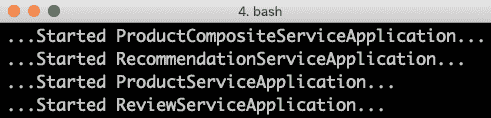

这意味着它们都准备好接收请求。用以下代码尝试一下：

```java
curl http://localhost:7000/product-composite/1
```

经过一些日志输出，我们将得到一个类似于以下的 JSON 响应：

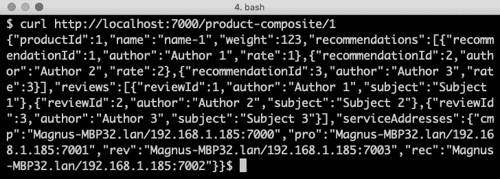

为了获得美观的 JSON 响应，您可以使用`jq`工具：

```java
curl http://localhost:7000/product-composite/1 -s | jq .
```

这会导致以下输出（为了提高可读性，一些细节被`...`替换）：

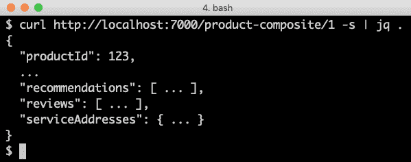

如果您愿意，还可以尝试以下命令来验证错误处理是否如预期工作：

```java

# Verify that a 404 (Not Found) error is returned for a non-existing productId (13)
curl http://localhost:7000/product-composite/13 -i 
# Verify that no recommendations are returned for productId 113
curl http://localhost:7000/product-composite/113 -s | jq . 
# Verify that no reviews are returned for productId 213
curl http://localhost:7000/product-composite/213 -s | jq . 
# Verify that a 422 (Unprocessable Entity) error is returned for a productId that is out of range (-1)
curl http://localhost:7000/product-composite/-1 -i 
# Verify that a 400 (Bad Request) error is returned for a productId that is not a number, i.e. invalid format
curl http://localhost:7000/product-composite/invalidProductId -i 
```

最后，您可以使用以下命令关闭微服务：

```java
kill $(jobs -p)
```

如果您使用的是 Spring Tool Suite 或 IntelliJ IDEA Ultimate Edition 作为您的 IDE，您可以使用它们的 Spring Boot 仪表板一键启动和停止您的微服务。

下面的截图显示了 Spring Tool Suite 的使用：

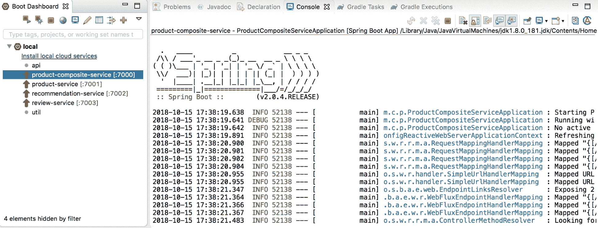

下面的截图显示了 IntelliJ IDEA Ultimate Edition 的使用：

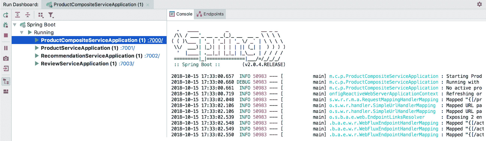

在本节中，我们学习了如何手动启动、测试和停止合作微服务的系统景观。这类测试耗时较长，因此显然需要自动化。在接下来的两节中，我们将迈出学习如何自动化测试的第一步，测试单个微服务以及整个合作微服务的系统景观。在整个本书中，我们将改进我们如何测试微服务。

# 防止本地主机名查找缓慢

从 macOS Sierra 开始，在 macOS 上的 Java 程序中查找本地主机使用的 hostname 可能会花费很长时间，即 5 秒钟，使得测试变得非常缓慢。在使用 macOS Mojave 时，这个问题似乎得到了修复，但如果您使用的是较老版本的 macOS，这个问题很容易解决。

首先，您需要通过从 GitHub 下载一个小型工具并运行它来验证问题是否影响您：

```java
git clone https://github.com/thoeni/inetTester.git
java -jar inetTester/bin/inetTester.jar
```

假设程序响应了类似以下内容：

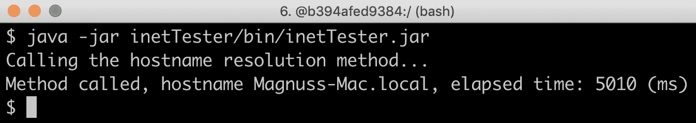

如果您有 5 秒的响应时间，那么您遇到问题了！

解决方案是编辑`/etc/hosts`文件，在`localhost`之后添加您的本地主机名，在前面的示例中是`Magnuss-Mac.local`，例如：

```java
127.0.0.1 localhost Magnuss-Mac.local
::1       localhost Magnuss-Mac.local
```

重新运行测试。它应该以几毫秒的响应时间响应，例如：

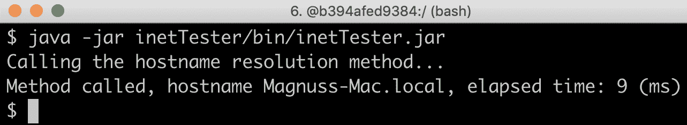

现在让我们看看如何为微服务添加隔离的自动化测试。

# 为微服务添加隔离的自动化测试

在我们完成实现之前，还需要编写一些自动化测试。

目前我们没有太多业务逻辑需要测试，所以不需要编写任何单元测试。相反，我们将重点测试我们微服务暴露的 API；也就是说，我们将以集成测试的方式启动它们，带有内嵌的 web 服务器，然后使用测试客户端执行 HTTP 请求并验证响应。随着 Spring WebFlux 的推出，出现了一个新的测试客户端`WebTestClient`，它提供了一个流畅的 API 来发送请求，然后在它的结果上应用断言。

以下是一个示例，我们通过执行以下操作来测试组合产品 API：

+   发送一个现有的产品的`productId`，并断言我们得到一个 200 的 HTTP 响应码和一个包含所需`productId`以及一个推荐和一个评论的 JSON 响应。

+   发送一个缺失的`productId`，并断言我们得到一个 404 的 HTTP 响应码和一个包含相关错误信息的 JSON 响应。

这两个测试的实现如下面的代码所示：

```java
@Autowired
private WebTestClient client;

@Test
public void getProductById() {
  client.get()
    .uri("/product-composite/" + PRODUCT_ID_OK)
    .accept(APPLICATION_JSON_UTF8)
    .exchange()
    .expectStatus().isOk()
    .expectHeader().contentType(APPLICATION_JSON_UTF8)
    .expectBody()
    .jsonPath("$.productId").isEqualTo(PRODUCT_ID_OK)
    .jsonPath("$.recommendations.length()").isEqualTo(1)
    .jsonPath("$.reviews.length()").isEqualTo(1);
}
```

让我们更详细地解释一下前面的源代码：

+   该测试使用流畅的`WebTestClient` API 来设置要调用的 URL `"/product-composite/" + PRODUCT_ID_OK`，并指定接受的响应格式，即 JSON。

+   在使用`exchange()`方法执行请求后，测试验证响应状态是 OK（200）并且实际的响应格式确实是 JSON（如所请求的）。

+   最终，该测试检查响应体，并验证它包含了关于`productId`以及推荐次数和评论数预期的信息。

第二个测试如下所示：

```java

@Test
public void getProductNotFound() {
  client.get()
    .uri("/product-composite/" + PRODUCT_ID_NOT_FOUND)
    .accept(APPLICATION_JSON_UTF8)
    .exchange()
    .expectStatus().isNotFound()
    .expectHeader().contentType(APPLICATION_JSON_UTF8)
    .expectBody()
    .jsonPath("$.path").isEqualTo("/product-composite/" + 
     PRODUCT_ID_NOT_FOUND)
    .jsonPath("$.message").isEqualTo("NOT FOUND: " + 
     PRODUCT_ID_NOT_FOUND);
}
```

让我们更详细地解释一下前面的源代码：

+   这个负测试在结构上与前面的测试非常相似；主要区别是它验证了返回了一个错误状态码，未找到（404），并且响应体包含了预期的错误消息。

为了单独测试组合产品 API，我们需要模拟其依赖项，即由集成组件`ProductCompositeIntegration`执行的对其他三个微服务的请求。我们使用 Mockito 来实现，如下所示：

```java
private static final int PRODUCT_ID_OK = 1;
private static final int PRODUCT_ID_NOT_FOUND = 2;
private static final int PRODUCT_ID_INVALID = 3;

@MockBean
private ProductCompositeIntegration compositeIntegration;

@Before
public void setUp() {

  when(compositeIntegration.getProduct(PRODUCT_ID_OK)).
    thenReturn(new Product(PRODUCT_ID_OK, "name", 1, "mock-address"));
  when(compositeIntegration.getRecommendations(PRODUCT_ID_OK)).
    thenReturn(singletonList(new Recommendation(PRODUCT_ID_OK, 1, 
    "author", 1, "content", "mock address")));
     when(compositeIntegration.getReviews(PRODUCT_ID_OK)).
    thenReturn(singletonList(new Review(PRODUCT_ID_OK, 1, "author", 
    "subject", "content", "mock address")));

  when(compositeIntegration.getProduct(PRODUCT_ID_NOT_FOUND)).
    thenThrow(new NotFoundException("NOT FOUND: " + 
    PRODUCT_ID_NOT_FOUND));

  when(compositeIntegration.getProduct(PRODUCT_ID_INVALID)).
    thenThrow(new InvalidInputException("INVALID: " + 
    PRODUCT_ID_INVALID));
}
```

让我们更详细地解释一下前面的源代码：

+   首先，我们在测试类中声明了三个常量，分别用于`PRODUCT_ID_OK`、`PRODUCT_ID_NOT_FOUND`和`PRODUCT_ID_INVALID`。

+   如果对集成组件调用`getProduct()`、`getRecommendations()`和`getReviews()`方法，并且`productId`设置为`PRODUCT_ID_OK`，则模拟将返回一个正常响应。

+   如果`getProduct()`方法以`PRODUCT_ID_NOT_FOUND`设置`productId`，则模拟将抛出`NotFoundException`。

+   如果以`PRODUCT_ID_INVALID`设置`productId`调用`getProduct()`方法，则模拟将抛出`InvalidInputException`。

可以在`$BOOK_HOME/Chapter03/2-basic-rest-services/microservices/product-composite-service/src/test/java/se/magnus/microservices/composite/product/ProductCompositeServiceApplicationTests.java`找到对复合产品 API 的自动化集成测试的完整源代码。

三个核心微服务暴露的 API 上的自动化集成测试类似，但更简单，因为它们不需要模拟任何内容！测试的源代码可以在每个微服务的`test`文件夹中找到。

当执行构建时，Gradle 会自动运行测试：

```java
./gradlew build
```

然而，你可以指定只想运行测试（而不执行构建的其余部分）：

```java
./gradlew test
```

这是介绍如何为微服务编写隔离测试的介绍。在下一节中，我们将学习如何编写自动测试整个微服务景观的测试。在本章中，这些测试将是半自动化的。在后续章节中，测试将完全自动化，这是一个显著的改进。

# 添加对微服务景观的半自动化测试

当然，能够自动测试每个微服务是很有用的，但不够！

我们需要一种自动测试所有微服务的方法，以确保它们提供我们所期望的内容！

为此，我编写了一个简单的 bash 脚本，可以使用 `curl` 对 RESTful API 进行调用并验证其返回代码及其 JSON 响应的一部分，使用 `jq`。脚本包含两个辅助函数，`assertCurl()` 和 `assertEqual()`，以使测试代码更加紧凑，易于阅读。

例如，发送一个正常请求，期望状态码为 200，以及断言我们返回的 JSON 响应返回请求的`productId`，还附带三个推荐和三个评论，如下所示：

```java
# Verify that a normal request works, expect three recommendations and three reviews
assertCurl 200 "curl http://$HOST:${PORT}/product-composite/1 -s"
assertEqual 1 $(echo $RESPONSE | jq .productId)
assertEqual 3 $(echo $RESPONSE | jq ".recommendations | length")
assertEqual 3 $(echo $RESPONSE | jq ".reviews | length")

```

验证我们返回`404 (Not Found)`作为 HTTP 响应代码（当我们尝试查找不存在的产品）如下所示：

```java
# Verify that a 404 (Not Found) error is returned for a non-existing productId (13)
assertCurl 404 "curl http://$HOST:${PORT}/product-composite/13 -s" 
```

测试脚本实现了在*手动测试 API*部分描述的手动测试，可以在`$BOOK_HOME/Chapter03/2-basic-rest-services/test-em-all.bash`找到。

# 尝试测试脚本

为了尝试测试脚本，执行以下步骤：

1.  首先，像以前一样启动微服务：

```java
cd $BOOK_HOME/Chapter03/2-basic-rest-services
java -jar microservices/product-composite-service/build/libs/*.jar
& java -jar microservices/product-service/build/libs/*.jar &
java -jar microservices/recommendation-service/build/libs/*.jar &
java -jar microservices/review-service/build/libs/*.jar &
```

1.  一旦它们都启动完毕，运行测试脚本：

```java
./test-em-all.bash
```

1.  期望输出如下所示：

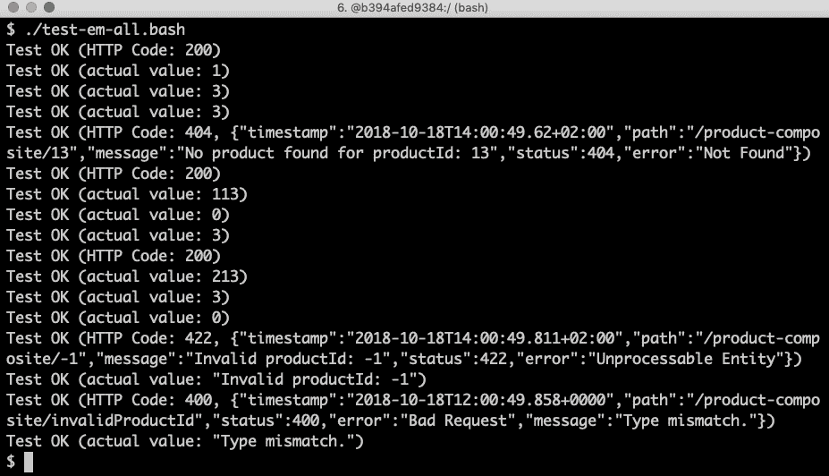

1.  用以下命令关闭微服务：

```java
kill $(jobs -p)
```

在本节中，我们迈出了自动化测试合作微服务系统景观的第一步，所有这些都将在本章后续部分进行改进。

# 总结

现在我们已经使用 Spring Boot 构建了我们的几个微服务。在介绍了我们将在此书中使用的微服务景观之后，我们学习了如何使用 Spring Initializr 创建每个微服务的骨架项目。

接下来，我们学习了如何使用 Spring WebFlux 为三个核心服务添加 API，并实现了一个组合服务，该服务使用三个核心服务的 API 来创建它们中信息的聚合视图。组合服务使用 Spring Framework 中的`RestTemplate`类来对核心服务公开的 API 执行 HTTP 请求。在为服务添加错误处理逻辑后，我们在微服务架构上进行了一些手动测试。

我们通过学习如何在隔离环境中为微服务添加测试以及它们作为一个系统架构一起工作时的测试来结束这一章。为了为组合服务提供受控的隔离，我们使用 Mockito 模拟其对核心服务的依赖。整个系统架构的测试是通过一个 bash 脚本完成的，该脚本使用`curl`对组合服务的 API 执行调用。

有了这些技能，我们准备好了下一步，进入下一章的 Docker 和容器世界！在接下来的内容中，我们将学习如何使用 Docker 完全自动化测试一个合作微服务的系统架构。

# 问题

1.  使用**spring init** Spring Initializr CLI 工具创建新的 Spring Boot 项目时，列出可用依赖项的命令是什么？

1.  你如何设置**Gradle**，用一个命令就能构建多个相关联的项目？

1.  `@PathVariable`和`@RequestParam`注解是用来做什么的？

1.  在 API 实现类中，你如何将协议特定的错误处理与业务逻辑分开？

1.  **Mockito**是用来做什么的？
