# 第四章：使用 Docker 部署我们的微服务。

在本章中，我们将开始使用 Docker 并将我们的微服务放入容器中！

到本章末尾，我们将运行完全自动化的微服务架构测试，以 Docker 容器的形式启动我们的所有微服务，除了 Docker 引擎之外不需要其他基础架构。我们还将运行一系列测试，以验证微服务按预期一起工作，并在最后关闭所有微服务，不留下我们执行的测试的任何痕迹。

能够以这种方式测试多个协作的微服务非常有用。作为开发者，我们可以在本地开发机上验证其工作效果。我们还可以在构建服务器上运行完全相同的测试，以自动验证源代码的更改不会在系统层面破坏测试。此外，我们不需要为运行这些类型的测试分配专用的基础架构。在接下来的章节中，我们将了解如何将数据库和队列管理器添加到我们的测试架构中，所有这些都将作为 Docker 容器运行。

然而，这并不取代自动化单元和集成测试的需要，这些测试孤立地测试单个微服务。它们的重要性与日俱增。

对于生产使用，如本书前面提到的，我们需要一个容器编排器，如 Kubernetes。我们将在本书后面回到容器编排器和 Kubernetes。

本章将涵盖以下主题：

+   容器简介。

+   Docker 和 Java。Java 在历史上对容器并不友好，但随着 Java 10 的发布，这一切都改变了。让我们看看 Docker 和 Java 在这个话题上是如何结合在一起的！

+   使用 Docker 和一个微服务。

+   使用 Docker Compose 管理微服务架构。

+   自动测试它们全部。

# 技术要求

本书中描述的所有命令都是在 MacBook Pro 上使用 macOS Mojave 运行的，但如果你想在其他平台（如 Linux 或 Windows）上运行它们，应该很容易进行修改。

除了前章的技术要求之外，我们还需要安装 Docker。Docker 社区版可以从 [`store.docker.com/search?type=edition&offering=community`](https://store.docker.com/search?type=edition&offering=community)[下载](https://store.docker.com/search?type=edition&offering=community)。

为了能够运行本书中的示例，建议您配置 Docker，使其可以使用除一个以外的所有 CPU（将所有 CPU 分配给 Docker 可能会在测试运行时使计算机失去响应）以及至少 6 GB 的内存。这可以在 Docker 的“偏好设置”的“高级”选项卡中配置，如下面的屏幕截图所示：

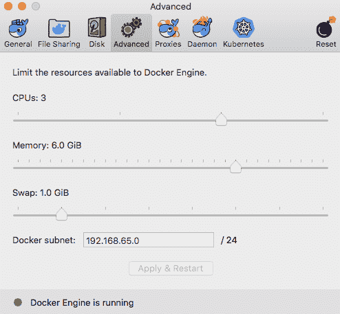

本章的源代码可以在本书的 GitHub 仓库中找到：[`github.com/PacktPublishing/Hands-On-Microservices-with-Spring-Boot-and-Spring-Cloud/tree/master/Chapter04`](https://github.com/PacktPublishing/Hands-On-Microservices-with-Spring-Boot-and-Spring-Cloud/tree/master/Chapter04)。

为了能够运行本书中描述的命令，将源代码下载到一个文件夹中，并设置一个环境变量`$BOOK_HOME`，该变量指向该文件夹。一些示例命令如下：

```java
export BOOK_HOME=~/Documents/Hands-On-Microservices-with-Spring-Boot-and-Spring-Cloud
git clone https://github.com/PacktPublishing/Hands-On-Microservices-with-Spring-Boot-and-Spring-Cloud $BOOK_HOME
cd $BOOK_HOME/Chapter04
```

本章所用的 Java 源代码是为 Java 8 编写的，并在 Java 12 上进行了测试运行。在本章写作时，Spring Boot 的最新版本是 2.1.0（以及 Spring 5.1.2）。

本章中的代码示例都来自`$BOOK_HOME/Chapter04`的源代码，但在许多情况下，已经编辑了源代码中不相关部分，例如注释、导入和日志声明。

如果你想查看本章应用于源代码中的更改，即了解为 Docker 添加支持所做的工作，你可以将第三章创建一组协作的微服务的源代码进行比较，*创建一组协作的微服务*。你可以使用你喜欢的`diff`工具，比较两个文件夹`$BOOK_HOME/Chapter03/2-basic-rest-services`和`$BOOK_HOME/Chapter04`。

# 容器入门

正如我们在第二章 Spring Boot 入门中提到的，Docker 在 2013 年使容器作为轻量级虚拟机替代品的概念变得非常流行。容器实际上是在使用 Linux 命名空间的 Linux 主机上处理的，以提供隔离容器之间全局系统资源的隔离，例如用户、进程、文件系统和网络。**Linux 控制组**（也称为**cgroups**）用于限制容器可以消耗的 CPU 和内存量。与在每台虚拟机中使用虚拟化器运行操作系统完整副本相比，容器的开销只是虚拟机开销的一小部分。这导致了更快的启动时间以及 CPU 和内存使用上的显著降低。然而，容器提供的隔离被认为不如虚拟机提供的隔离安全。随着 Windows Server 2016 和 Windows 10 Pro（1607 周年更新）的发布，微软也开始支持在 Windows 上使用 Docker。请看下面的图表：

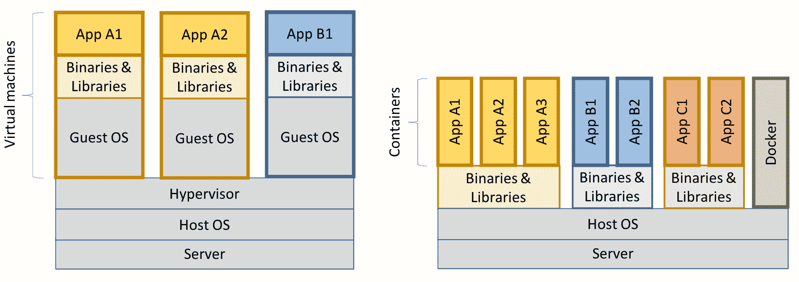

前一个图表说明了虚拟机和容器的资源使用差异，可视化同一类型的服务器可以运行远比虚拟机更多的容器。

# 运行我们的第一个 Docker 命令

-   让我们尝试通过使用 Docker 的`run`命令在 Docker 中启动一个 Ubuntu 服务器：

```java
docker run -it --rm ubuntu
```

-   使用前面的命令，我们要求 Docker 创建一个运行 Ubuntu 的容器，基于官方 Docker 镜像中可用的最新版本的 Ubuntu。`-it`选项用于使我们能够使用终端与容器交互，`--rm`选项告诉 Docker，一旦我们退出终端会话，就删除容器；否则，容器将保留在 Docker 引擎中，状态为`Exited`。

-   第一次使用我们没有自己构建的 Docker 镜像时，Docker 将从 Docker 注册表中下载它，默认是 Docker Hub ([`hub.docker.com`](https://hub.docker.com))。这需要一些时间，但对于该 Docker 镜像的后续使用，容器将在几秒钟内启动！

-   一旦 Docker 镜像下载完毕并启动容器，Ubuntu 服务器应该会以如下提示响应：

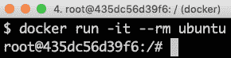

-   我们可以尝试通过询问它运行的是哪个版本的 Ubuntu 来测试容器：

```java
cat /etc/os-release | grep 'VERSION='
```

-   它应该会像下面这样响应：

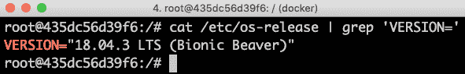

-   我们可以使用`exit`命令离开容器，并验证使用`docker ps -a`命令 Ubuntu 容器是否不再退出。我们需要使用`-a`选项来查看停止的容器；否则，只显示运行中的容器。

-   如果你更喜欢 CentOS 而不是 Ubuntu，可以尝试使用`docker run --rm -it centos`命令。一旦 CoreOS 服务器在其容器中启动运行，你可以，例如，使用`cat /etc/redhat-release`命令询问它运行的是哪个版本的 CoreOS。它应该会像下面这样响应：

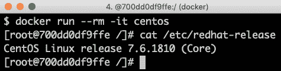

-   使用`exit`命令离开容器以删除它。

-   如果你发现 Docker 引擎中有许多不想要的容器，并且你想获得一个干净的起点，即摆脱它们全部，你可以运行以下命令：

```java
docker rm -f $(docker ps -aq)
```

-   `docker rm -f`命令停止并删除指定容器 ID 的容器。`docker ps -aq`命令列出 Docker 引擎中所有运行和停止容器的容器 ID。`-q`选项减少`docker ps`命令的输出，使其只列出容器 ID。

-   在了解 Docker 是什么之后，接下来我们可以理解在 Docker 中运行 Java 时可能遇到的问题。

# -   在 Docker 中运行 Java 的挑战

-   当谈到 Java 时，过去几年里，有很多尝试让 Java 在 Docker 中良好地运行。目前，Java 的官方 Docker 镜像基于 OpenJDK: [`hub.docker.com/_/openjdk/`](https://hub.docker.com/_/openjdk/)。我们将使用带有 Docker 标签`openjdk:12.0.2`的 Java SE 12，即 Java SE v12.0.2。

历史上，Java 在尊重 Docker 容器中 Linux cgroups 指定的配额方面做得并不好；它只是简单地忽略了这些设置。因此，Java 并不是在 JVM 内部根据容器中可用的内存来分配内存，而是好像它能够访问 Docker 主机的所有内存，这显然是不好的！同样，Java 分配与 Docker 主机的总 CPU 核心数相关的资源，如线程池，而不是为运行的 JVM 分配的 CPU 核心数。在 Java SE 9 中，提供了一些初始支持，这也被反向移植到了 Java SE 8 的后续版本中。然而，在 Java 10 中，对 CPU 和内存约束提供了大幅改进的支持。

让我们试一试！

首先，我们将尝试在本地下执行 Java 命令，不使用 Docker，因为这将告诉我们 JVM 看到多少内存和 CPU 核心数。接下来，我们将使用 Java SE 12 在 Docker 中尝试这些命令，以验证它是否尊重我们在其中运行的 Docker 容器上设置的约束。最后，我们还将尝试一个 Java SE 9 容器，并看看它如何不尊重约束以及可能造成什么问题。

# 没有 Docker 的 Java

在我们将自己投入到 Docker 之前，让我们不使用 Docker 尝试 Java 命令，以熟悉 Java 命令！

让我们先找出 Java 在 Docker 外部运行时看到的有多少可用处理器，即 CPU 核心数。我们可以通过将 `Runtime.getRuntime().availableprocessors()` Java 语句发送到 Java CLI 工具 `jshell` 来完成这个操作：

```java
echo 'Runtime.getRuntime().availableProcessors()' | jshell -q
```

`jshell` 需要 Java SE 9 或更高版本！

在我的机器上，我得到以下响应：

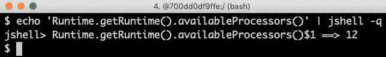

好吧，`12` 个核心是符合预期的，因为我的笔记本电脑的处理器是六核心的英特尔 Core i9 CPU，具有超线程技术（操作系统为每个物理核心看到两个虚拟核心）。

关于可用的内存量，让我们询问 JVM 它认为可以为其堆分配的最大大小。我们可以通过使用 `-XX:+PrintFlagsFinal` Java 选项向 JVM 请求额外的运行时信息，然后使用 `grep` 命令过滤出 `MaxHeapSize` 参数来实现这一点：

```java
java -XX:+PrintFlagsFinal -version | grep MaxHeapSize 
```

在我的机器上，我得到以下响应：

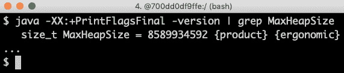

`8589934592` 字节碰巧正好是 8 GB，即 *8 * 1,024³*。由于我们没有为 JVM 使用 `-Xmx` 参数指定任何最大堆大小，JVM 将最大值设置为可用内存的四分之一。由于我的笔记本电脑有 32 GB 的内存，*32/4=8*，这也是符合预期的！

让我们通过验证能够将最大堆内存大小通过 `-Xmx` 参数降低到例如 200 MB 来总结一下：

```java
java -Xmx200m -XX:+PrintFlagsFinal -version | grep MaxHeapSize
```

JVM 将响应为 *209,715,200* 字节，即 *200 * 1,024³* 字节 = 200 MB，符合预期！

既然我们已经了解了在没有 Docker 的情况下 Java 命令是如何工作的，那么让我们试着用 Docker 来执行这个命令！

# Docker 中的 Java

让我们看看 Java SE 12 如何响应我们在其运行的容器中设置的限制！

由于我使用的是 Docker for macOS，实际上我是在我的 MacBook Pro 上的虚拟机上运行 Docker 引擎作为 Docker 宿主。我已经为 macOS 配置了 Docker，使其允许 Docker 宿主使用我 macOS 中的所有 12 个核心，但只使用最多 16GB 内存。总的来说，Docker 宿主有 12 个核心和 16GB 内存。

# CPU

首先，我们不施加任何限制，也就是说，我们用同样的测试方法，但是不使用 Docker：

```java
echo 'Runtime.getRuntime().availableProcessors()' | docker run --rm -i openjdk:12.0.2 jshell -q
```

这个命令会将`Runtime.getRuntime().availableProcessors()`字符串发送到 Docker 容器，该容器将使用`jshell`处理这个字符串。

它将响应同样的结果，即在我的情况下为`$1 ==> 12`。让我们继续限制 Docker 容器只能使用三个 CPU 核心，使用`--cpus 3` Docker 选项，并询问 JVM 它看到了多少可用的处理器：

```java
echo 'Runtime.getRuntime().availableProcessors()' | docker run --rm -i --cpus 3 openjdk:12.0.2 jshell -q
```

JVM 现在响应为`$1 ==> 3`，即 Java SE 12 尊重容器中的设置，因此，它能够正确配置与 CPU 相关的资源，比如线程池！

让我们试着指定可用的 CPU 的相对份额，而不是 CPU 的确切数量。1024 个份额默认对应一个核心，所以如果我们想要将容器限制为两个核心，我们将`--cpu-shares` Docker 选项设置为 2048，像这样：

```java
echo 'Runtime.getRuntime().availableProcessors()' | docker run --rm -i --cpu-shares 2048 openjdk:12.0.2 jshell -q
```

JVM 将响应`$1 ==> 2`，即 Java SE 12 也尊重相对`share`选项！

尽管`--cpus`选项是一个硬性限制，但`--cpu-shares`选项只有在 Docker 宿主承受高负载时才会生效。这意味着，如果 CPU 资源可用，容器可以消耗比`share`选项显示的更多的 CPU。

接下来，让我们尝试限制内存量。

# 内存

如果没有内存限制，Docker 将把内存的四分之一分配给容器：

```java
docker run -it --rm openjdk:12.0.2 java -XX:+PrintFlagsFinal -version | grep MaxHeapSize
```

它将响应 4,202,692,608 字节，等于 4GB，即*8 * 1024³*。由于我的 Docker 宿主有 16GB 内存，这是正确的，即*16/4 = 4*。

然而，如果我们限制 Docker 容器只能使用最多 1GB 内存，使用`-m=1024M` Docker 选项，我们会看到较低的内存分配：

```java
docker run -it --rm -m=1024M openjdk:12.0.2 java -XX:+PrintFlagsFinal -version | grep MaxHeapSize
```

JVM 将响应 268,435,456 字节，即 256MB，也就是*2 * 1024²*字节。256MB 是 1GB 的四分之一，所以这也在意料之中。

我们可以像往常一样，自己设置最大堆大小。例如，如果我们想要允许堆内存使用 1GB 中的 800MB，我们可以使用`-Xmx800m` Java 选项指定：

```java
docker run -it --rm -m=1024M openjdk:12.0.2 java -Xmx800m -XX:+PrintFlagsFinal -version | grep MaxHeapSize
```

JVM 将响应 838,860,800 字节= *800 * 1024²*字节= 800MB，如预期一样。

最后，让我们通过一些内存溢出测试来确保这真的有效。

让我们使用`jshell`在分配了 1GB 内存的 JVM 中尝试，也就是说，它的最大堆大小为 256MB。

首先，尝试分配一个 100 MB 的字节数组：

```java
echo 'new byte[100_000_000]' | docker run -i --rm -m=1024M openjdk:12.0.2 jshell -q
```

命令将会回应`$1 ==>`，意味着它工作得很好！

通常，`jshell`将打印出命令的结果值，但是 100 MB 的字节数组全部设置为零输出太多，所以我们什么也没有。

现在，让我们尝试分配一个大于最大堆大小的字节数组，例如 500 MB：

```java
echo 'new byte[500_000_000]' | docker run -i --rm -m=1024M openjdk:12.0.2 jshell -q
```

JVM 看到它不能执行该操作，因为它尊重容器的最大内存设置，并立即回应`Exception java.lang.OutOfMemoryError: Java heap space`。太好了！

如果我们使用一个不尊重容器设置的最大内存的 JVM 会怎样？

让我们用 Java SE 9 来找出答案！

# Docker 和 Java SE 9（或更早版本）的问题

首先，尝试使用`openjdk:9-jdk`镜像将 Java SE 9 JVM 限制在三个 CPU 核心。

Java 9 无法遵守三个 CPU 的限制：

```java
echo 'Runtime.getRuntime().availableProcessors()' | docker run --rm -i --cpus 3 openjdk:9-jdk jshell -q
```

在我的机器上，它回应为`$1 ==> 12`，也就是说，它忽略了三个 CPU 核心的限制。

如果我们尝试`--cpu-shares`选项，我们也会得到同样的结果，即`$1 ==> 12`：

```java
echo 'Runtime.getRuntime().availableProcessors()' | docker run --rm -i --cpu-shares 2048 openjdk:9-jdk jshell -q
```

现在，尝试将内存限制为 1 GB：

```java
docker run -it --rm -m=1024M openjdk:9-jdk java -XX:+PrintFlagsFinal -version | grep MaxHeapSize
```

如预期那样，Java SE 9 不尊重我们在 Docker 中设置的内存约束；也就是说，它报告最大堆大小为 4,202,692,608 字节= *4 GB – 4 * 1024³*字节。在这里，Java 9 在给定 Docker 主机的内存时计算了可用的内存，而不是在实际的容器中！

那么，如果我们重复对 Java SE 12 进行的内存分配测试呢？

让我们尝试第一个测试，即分配一个 100 MB 数组：

```java
echo 'new byte[100_000_000]' | docker run -i --rm -m=1024M openjdk:9-jdk jshell -q
```

命令回应为`$1 ==> byte[100000000] { 0, 0, 0, ...`，所以这工作得很好！

现在，让我们进行一个真正有趣的测试：如果我们为 Docker 分配给容器的内存中分配一个 500 MB 的字节数组，会发生什么？

```java
echo 'new byte[500_000_000]' | docker run -i --rm -m=1024M openjdk:9-jdk jshell -q
```

从 Java 的角度来看，这应该可以工作。由于 Java 认为总内存为 16 GB，它已将最大堆大小设置为 4 GB，因此它开始为字节数组分配 500 MB。但是过了一会儿，JVM 的总大小超过 1 GB，Docker 将无情地杀死容器，导致诸如`State engine terminated`的混淆异常。我们基本上不知道出了什么问题，尽管我们可以猜测我们耗尽了内存。

所以，总结一下，如果你计划在 Docker 和 Java 上做任何严肃的工作，确保你使用 Java SE 10 或更高版本！

公平地说，应该提到 Java SE 9 包含对 cgroups 的一些初步支持。如果你指定了 Java 选项`-XX:+UnlockExperimentalVMOptions`和`-XX:+UseCGroupMemoryLimitForHeap`，它将尊重 cgroup 约束的一部分，但不是全部，并且应该注意的是这仅是实验性的。由于这一点，应该避免在生产环境中使用。简单地在 Docker 中使用 Java SE 10 或更高版本！

# 使用单个微服务的 Docker

既然我们理解了 Java 的工作原理，我们就可以开始使用 Docker 与我们其中一个微服务一起工作了。在我们能够将微服务作为 Docker 容器运行之前，我们需要将其打包到 Docker 镜像中。要构建 Docker 镜像，我们需要一个 Dockerfile，所以我们从那个开始。接下来，我们需要为我们的微服务创建一个 Docker 特定的配置。由于在容器中运行的微服务与其他微服务隔离，例如，它有自己的 IP 地址、主机名和端口，因此它需要与在同一主机上与其他微服务一起运行时的配置不同。例如，由于其他微服务不再在同一主机上运行，所以不会发生端口冲突。当在 Docker 中运行时，我们可以为所有微服务使用默认端口 `8080`，而无需担心端口冲突的风险。另一方面，如果我们需要与其他微服务通信，我们不能再像在同一主机上运行它们时那样使用 localhost。微服务的源代码不会受到将微服务以容器形式运行的影响，只有它们的配置会受到影响。

为了处理在没有 Docker 的情况下本地运行和作为 Docker 容器运行微服务时所需的不同配置，我们将使用 Spring 配置文件。自从第三章 *创建一组协作的微服务* 以来，我们就一直在使用默认的 Spring 配置文件来本地运行而不使用 Docker，因此我们将创建一个名为 `docker` 的 Spring 配置文件，用于在 Docker 中作为容器运行我们的微服务。

# 源代码中的更改

我们将使用 `product` 微服务，该微服务可以在源代码中的 `$BOOK_HOME/Chapter04/microservices/product-service/` 找到。在下一节中，我们将也将这个应用到其他微服务上。

首先，我们在属性文件 `$BOOK_HOME/Chapter04/microservices/product-service/src/main/resources/application.yml` 的末尾添加 Docker 的 Spring 配置文件：

```java
---
spring.profiles: docker

server.port: 8080
```

Spring 配置文件可以用来指定特定环境的配置，这里的情况是指当微服务在 Docker 容器中运行时才使用该配置。其他例子是那些特定于 `dev`、`test` 和生产环境的配置。配置文件中的值会覆盖默认值，即默认配置文件中的值。使用 `.yaml` 文件，可以在同一个文件中放置多个 Spring 配置文件，它们之间用 `---` 分隔。

我们唯一要更改的参数是正在使用的端口；也就是说，当微服务在容器中运行时，我们将使用默认端口 `8080`。

接下来，我们将创建一个 `Dockerfile`，用于构建 Docker 镜像，`$BOOK_HOME/Chapter04/microservices/product-service/Dockerfile`。它看起来像这样：

```java
FROM openjdk:12.0.2

EXPOSE 8080

ADD ./build/libs/*.jar app.jar

ENTRYPOINT ["java","-jar","/app.jar"]
```

需要注意的一些事情如下：

+   我们将基于 OpenJDK 的官方 Docker 镜像，并使用 Java SE v12.0.2。

+   我们将向其他 Docker 容器暴露端口 `8080`。

+   我们从 Gradle 构建库`build/libs`中添加我们的`fat-jar`文件到 Docker 镜像中：

+   我们将指定 Docker 在容器启动时使用的命令，即`java -jar /app.jar`。

在考虑源代码中的这些更改之后

# 构建 Docker 镜像

要构建 Docker 镜像，我们需要为`product-service`构建部署工件，即脂肪文件：

```java
cd $BOOK_HOME/Chapter04
./gradlew :microservices:product-service:build
```

由于我们只想构建`product-service`及其依赖项`api`和`util`，所以我们不使用正常的`build`命令（它会构建所有微服务），而是使用一个告诉 Gradle 只构建`product-service`的变体：`:microservices:product-service:build`。

我们可以在 Gradle 构建库`build/libs`中找到`fat-jar`文件。例如，`ls -l microservices/product-service/build/libs`命令将会报告如下内容：

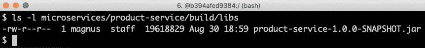

正如你所看到的，JAR 文件的大小接近 20 MB——难怪它们被称为`fat-jar`文件！

如果你好奇它的实际内容，可以使用`unzip -l microservices/product-service/build/libs/product-service-1.0.0-SNAPSHOT.jar`命令查看。

接下来，我们将构建 Docker 镜像并将其命名为`product-service`，如下所示：

```java
cd microservices/product-service
docker build -t product-service .
```

Docker 将使用当前目录中的 Dockerfile 来构建 Docker 镜像。该镜像将被命名为`product-service`并存储在 Docker 引擎内部。

验证我们是否获取了 Docker 镜像，使用以下命令：

```java
docker images | grep product-service
```

预期的输出如下：

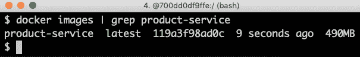

既然我们已经构建了镜像，那么让我们看看如何启动服务。

# 启动服务

使用以下命令以容器形式启动`product`微服务：

```java
docker run --rm -p8080:8080 -e "SPRING_PROFILES_ACTIVE=docker" product-service
```

这是我们从前面的代码可以推断出的事情：

1.  `docker run`：Docker 运行命令将启动容器并在终端中显示日志输出。只要容器运行，终端就会被锁定。

1.  我们已经看到了`--rm`选项；它将告诉 Docker 我们在使用*Ctrl + C*从终端停止执行时清理容器。

1.  `-p8080:8080`选项将容器中的端口`8080`映射到 Docker 主机的端口`8080`，这使得它可以从外部调用。在 macOS 上的 Docker 中，Docker 在本地 Linux 虚拟机中运行，端口也将被映射到 macOS 上，在本地主机上可用。我们只能在 Docker 主机上有一个特定端口的容器映射！

1.  使用`-e`选项，我们可以为容器指定环境变量，这个例子中是`SPRING_PROFILES_ACTIVE=docker`。`SPRING_PROFILES_ACTIVE`环境变量用于告诉 Spring 使用哪个配置文件。在我们的例子中，我们希望 Spring 使用`docker`配置文件。

1.  最后，我们有了`product-service`，这是 Docker 将用来启动容器的 Docker 镜像的名称。

预期的输出如下：

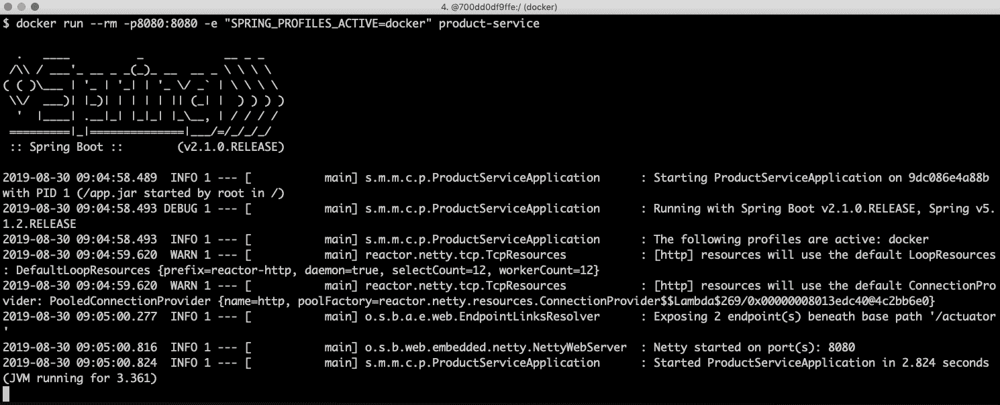

这是我们从上述输出中推断出的：

+   Spring 使用的配置文件是`docker`。在输出中查找`以下配置文件处于活动状态: docker`来验证这一点。

+   容器分配的端口是`8080`。在输出中查找`Netty started on port(s): 8080`来验证这一点。

+   当日志消息`Started ProductServiceApplication`被写入时，微服务就准备好接受请求了！

在另一个终端窗口尝试以下代码：

```java
curl localhost:8080/product/3
```

注意我们可以使用 localhost 上的端口`8080`，如前所述！

以下是预期输出：

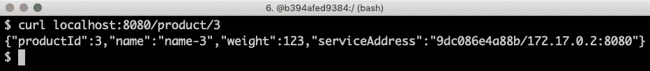

这与我们从上一章获得的输出类似，但有一个主要区别；我们有`"service Address":"aebb42b32fef/172.17.0.2:8080"`的内容，端口是`8080`，如预期那样，IP 地址`172.17.0.2`是一个从 Docker 内部网络分配给容器的 IP 地址——但是主机名`aebb42b32fef`是从哪里来的？

询问 Docker 所有正在运行的容器：

```java
docker ps
```

我们会看到类似以下内容：

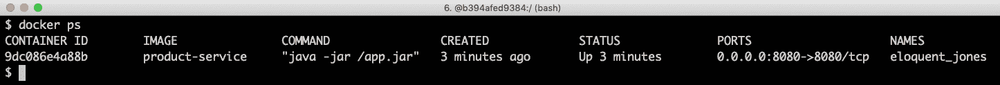

从上述输出中我们可以看到，主机名相当于容器的 ID，如果你想要了解哪个容器实际响应了你的请求，这一点是很有帮助的！

用*Ctrl + C*命令停止终端中的容器。完成这一步后，我们可以继续运行分离的容器。

# 分离运行容器

好的，这很好，但如果我们不想挂起我们从哪里开始容器的终端窗口怎么办？

是时候开始作为分离容器运行了，也就是说，运行容器而不锁定终端！

我们可以通过添加`-d`选项并同时使用`--name`选项为其命名来实现。由于我们将在使用完毕时明确停止和删除容器，所以不再需要`--rm`选项：

```java
docker run -d -p8080:8080 -e "SPRING_PROFILES_ACTIVE=docker" --name my-prd-srv product-service
```

如果我们再次运行`docker ps`命令，我们将看到我们新创建的容器，名为`my-prd-srv`：

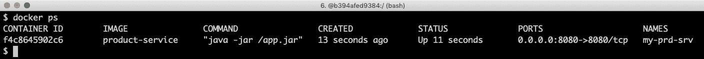

但是，我们如何获取容器的日志输出呢？

介绍 Docker 的`logs`命令：

```java
docker logs my-prd-srv -f
```

`-f`选项告诉命令跟随日志输出，即，当所有当前日志输出被写入终端时，不要结束命令，但也要等待更多输出。如果你预期有很多不想看到的旧日志消息，你还可以添加`--tail 0`选项，这样你只看到新的日志消息。或者，你可以使用`--since`选项，并使用绝对时间戳或相对时间，例如`--since 5m`，来看最多五分钟内的日志消息。

用一个新的`curl`请求尝试这个。你应该看到一个新的日志消息已经被写入终端的日志输出！

通过停止和删除容器来结束：

```java
docker rm -f my-prd-srv
```

`-f`选项强制 Docker 删除容器，即使它正在运行。Docker 会在删除之前自动停止容器。

现在我们已经知道如何使用 Docker 与微服务，我们可以进一步了解如何使用 Docker Compose 管理微服务架构，并查看其变化。

# 使用 Docker Compose 管理微服务架构

我们已经看到如何运行单个微服务作为 Docker 容器，但是管理整个系统架构的微服务呢？

如我们之前提到的，这就是`docker-compose`的目的。通过使用单一命令，我们可以构建、启动、记录和停止作为 Docker 容器运行的一组协作微服务！

# 源代码的变化

为了能够使用 Docker Compose，我们需要创建一个配置文件`docker-compose.yml`，描述 Docker Compose 将为我们管理的微服务。我们还需要为剩余的微服务设置 Dockerfile，并为每个微服务添加一个特定的 Spring 配置文件。

所有四个微服务都有自己的 Dockerfile，但它们都与前一个相同。您可以在以下位置找到它们：

+   `$BOOK_HOME/Chapter04/microservices/product-service/Dockerfile`

+   `$BOOK_HOME/Chapter04/microservices/recommendation-service/Dockerfile`

+   `$BOOK_HOME/Chapter04/microservices/review-service/Dockerfile`

+   `$BOOK_HOME/Chapter04/microservices/product-composite-service/Dockerfile`

当涉及到 Spring 配置文件时，三个核心服务`product`、`recommendation`和`review-service`具有相同的`docker`配置文件，它只指定当作为容器运行时应使用默认端口`8080`。

对于`product-composite-service`，事情变得有些复杂，因为它需要知道如何找到核心服务。当我们所有服务都运行在 localhost 上时，它被配置为使用 localhost 和每个核心服务的个别端口号`7001`-`7003`。当在 Docker 中运行时，每个服务将有自己的主机名，但可以在相同的端口号`8080`上访问。在此处，`product-composite-service`的`docker`配置文件如下所示：

```java
---
spring.profiles: docker

server.port: 8080

app:
  product-service:
    host: product
    port: 8080
  recommendation-service:
    host: recommendation
    port: 8080
  review-service:
    host: review
    port: 8080
```

详细信息请参阅`$BOOK_HOME/Chapter04/microservices/product-composite-service/src/main/resources/application.yml`。

主机名、产品、推荐和评论从何而来？

这些在`docker-compose.yml`文件中指定，该文件位于`$BOOK_HOME/Chapter04`文件夹中。它看起来像这样：

```java
version: '2.1'

services:
  product:
    build: microservices/product-service
    mem_limit: 350m
    environment:
      - SPRING_PROFILES_ACTIVE=docker

  recommendation:
    build: microservices/recommendation-service
    mem_limit: 350m
    environment:
      - SPRING_PROFILES_ACTIVE=docker

  review:
    build: microservices/review-service
    mem_limit: 350m
    environment:
      - SPRING_PROFILES_ACTIVE=docker

  product-composite:
    build: microservices/product-composite-service
    mem_limit: 350m
    ports:
      - "8080:8080"
    environment:
      - SPRING_PROFILES_ACTIVE=docker
```

对于每个微服务，我们指定如下内容：

+   微服务名称。这也将是内部 Docker 网络中容器的的主机名。

+   构建指令指定了查找用于构建 Docker 镜像的 Dockerfile 的位置。

+   内存限制为 350 MB。这确保了本章及接下来的章节中所有的容器都能 fits in the 6 GB of memory that we allocated to the Docker engine in the *Technical requirements* section。

+   为容器设置的环境变量。在我们的案例中，我们使用这些来指定要使用的 Spring 配置文件。

对于`product-composite`服务，我们还将指定端口映射，即，我们将将其端口暴露给 Docker 外部。其他微服务将无法从外部访问。接下来，我们将了解如何启动微服务架构。

# 启动微服务架构

有了所有必要的代码更改，我们可以构建 Docker 镜像，启动微服务架构，并运行一些测试来验证它是否按预期工作。为此，我们需要做以下工作：

1.  首先，我们使用 Gradle 构建我们的部署工件，然后使用 Docker Compose 构建 Docker 镜像：

```java
cd $BOOK_HOME/Chapter04
./gradlew build
docker-compose build
```

1.  然后，我们需要验证我们是否可以看到我们的 Docker 镜像，如下所示：

```java
docker images | grep chapter04
```

1.  我们应该看到以下输出：

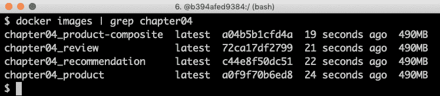

1.  使用以下命令启动微服务架构：

```java
docker-compose up -d
```

`-d`选项的意义与 Docker 之前描述的意义相同。

我们可以使用以下命令监控每个容器日志中写入的输出，以跟踪启动过程：

```java
docker-compose logs -f
```

`docker compose logs`命令支持与`docker logs`相同的`-f`和`--tail`选项，如前所述。

Docker Compose `logs`命令也支持将日志输出限制为一组容器。只需在`logs`命令之后添加您想要查看日志输出的容器的名称。例如，要只查看`product`和`review`服务的日志输出，请使用`docker-compose logs -f product review`。

当四个微服务都报告它们已经启动时，我们就可以尝试使用微服务架构了。寻找以下内容：

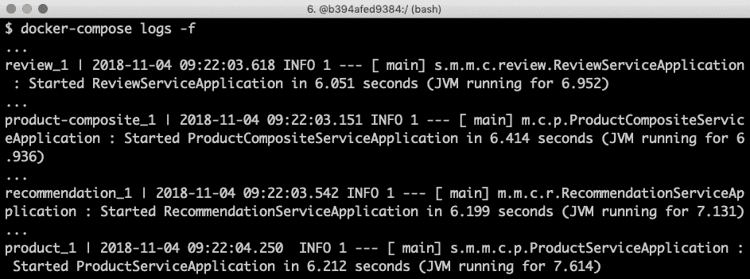

请注意，每个日志消息都以前缀的方式加上了产生输出的容器的名称！

现在，我们准备运行一些测试来验证这是否如预期工作。当我们从前一章直接在 localhost 上运行复合服务时，调用 Docker 中的复合服务所需做的唯一更改是端口号。现在我们使用端口`8080`：

```java
curl localhost:8080/product-composite/123 -s | jq .
```

我们将得到相同的响应：

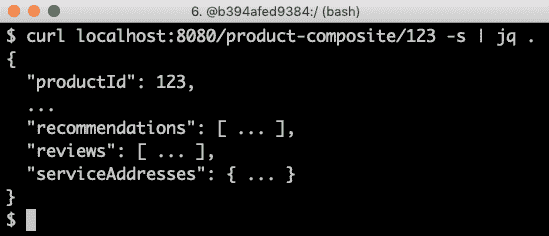

然而，有一个很大的区别——`serviceAddresses`中报告的主机名和端口：

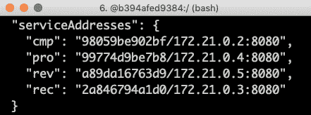

在这里，我们可以看到分配给每个 Docker 容器的主机名和 IP 地址。

我们完成了；现在只剩下一步：

```java
docker-compose down 
```

前面命令将关闭微服务架构。

# 一起自动测试它们

当手动管理一组微服务时，Docker Compose 非常有帮助！在本节中，我们将更进一步地将 Docker Compose 集成到我们的测试脚本`test-em-all.bash`中。测试脚本将自动启动微服务景观，运行所有必要的测试以验证微服务景观按预期工作，并最终拆除它，不留下任何痕迹。

测试脚本可以在`$BOOK_HOME/Chapter04/test-em-all.bash`找到。

在测试脚本运行测试套件之前，它会检查测试脚本的调用中是否存在`start`参数。如果找到，它将使用以下代码重新启动容器：

```java
if [[ $@ == *"start"* ]]
then
    echo "Restarting the test environment..."
    echo "$ docker-compose down"
    docker-compose down
    echo "$ docker-compose up -d"
    docker-compose up -d
fi

```

之后，测试脚本将等待`product-composite`服务响应 OK：

```java
waitForService http://$HOST:${PORT}/product-composite/1
```

`waitForService`bash 函数可以如此实现：

```java
function testUrl() {
    url=$@
    if curl $url -ks -f -o /dev/null
    then
          echo "Ok"
          return 0
    else
          echo -n "not yet"
          return 1
    fi;
}

function waitForService() {
    url=$@
    echo -n "Wait for: $url... "
    n=0
    until testUrl $url
    do
        n=$((n + 1))
        if [[ $n == 100 ]]
        then
            echo " Give up"
            exit 1
        else
            sleep 6
            echo -n ", retry #$n "
        fi
    done
}
```

接下来，像之前一样执行所有测试。之后，如果发现测试脚本的调用中存在`stop`参数，它将拆除景观：

```java
if [[ $@ == *"stop"* ]]
then
    echo "We are done, stopping the test environment..."
    echo "$ docker-compose down"
    docker-compose down
fi
```

请注意，如果某些测试失败，测试脚本将不会拆除景观；它只会停止，留下景观用于错误分析！

测试脚本还将将默认端口从`7000`更改为`8080`，我们在没有 Docker 的情况下运行微服务时使用`7000`，而`8080`被我们的 Docker 容器使用。

让我们试试吧！要启动景观，运行测试并在之后拆除它，像这样：

```java
./test-em-all.bash start stop
```

以下是从一次测试运行中获取的一些示例输出（包括被删除的特定测试的输出）：

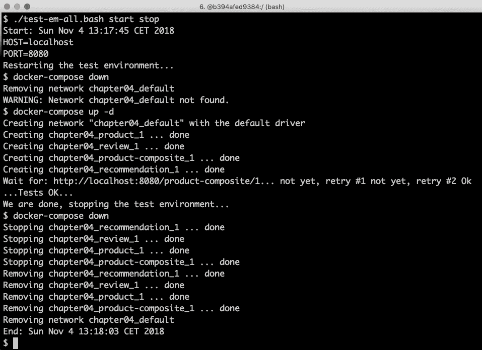

测试这些之后，我们可以继续了解如何解决失败的测试问题。

# 测试运行故障排除

如果运行`./test-em-all.bash start stop`的测试失败，按照这些步骤可以帮助您识别问题并修复问题后继续测试：

1.  首先，使用以下命令检查运行中的微服务的状态：

```java
docker-compose ps
```

1.  如果所有微服务都运行正常且健康，您将收到以下输出：

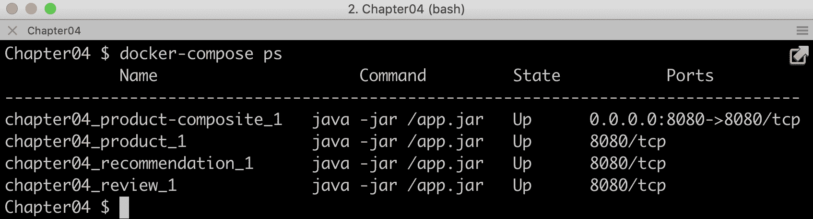

1.  如果有任何微服务的状态不是`Up`，使用`docker-compose logs`命令检查其日志输出是否有任何错误。例如，如果您想检查`product`服务的日志输出，可以使用以下代码：

```java
docker-compose logs product
```

1.  如果错误日志输出显示 Docker 磁盘空间不足，可以使用以下命令回收部分空间：

```java
docker system prune -f --volumes
```

1.  如有需要，您可以使用`docker-compose up -d --scale`命令重新启动失败的微服务。例如，如果您想重新启动`product`服务，可以使用以下代码：

```java
docker-compose up -d --scale product=0
docker-compose up -d --scale product=1
```

1.  如果一个微服务丢失，例如，由于崩溃，您可以使用`docker-compose up -d --scale`命令启动它。例如，您会使用以下代码为`product`服务：

```java
docker-compose up -d --scale product=1
```

1.  一旦所有微服务都运行并保持健康状态，再次运行测试脚本，但这次不启动微服务：

```java
./test-em-all.bash
```

测试应该运行得很好！

最后，关于一个组合命令的提示，该命令从源代码构建运行时工件和 Docker 镜像，然后在每个 Docker 容器中运行所有测试：

`./gradlew clean build && docker-compose build && ./test-em-all.bash start stop`

如果你想在将新代码推送到你的 Git 仓库之前或作为你构建服务器中构建管道的部分来检查一切是否正常，这太完美了！

# 总结

在本章中，我们看到了 Docker 如何被用来简化对一组协同工作的微服务的测试。

我们了解到，从 Java SE v10 开始，它尊重我们对容器施加的约束，关于容器可以使用多少 CPU 和内存。

我们也看到了，要让一个基于 Java 的微服务作为 Docker 容器运行，需要多么小的改动。多亏了 Spring 配置文件，我们可以在不进行任何代码更改的情况下在 Docker 中运行微服务。

最后，我们看到了 Docker Compose 如何帮助我们用单一命令管理一组协同工作的微服务，无论是手动还是更好的自动方式，当与像`test-em-all.bash`这样的测试脚本集成时。

在下一章中，我们将学习如何使用 OpenAPI/Swagger 描述来添加 API 文档。

# 问题

1.  虚拟机和 Docker 容器之间有哪些主要区别？

1.  命名空间和 Docker 中的 cgroups 有什么作用？

1.  一个 Java 应用程序如果不尊重容器中的最大内存设置并且分配了比允许更多的内存，会发生什么？

1.  我们如何让一个基于 Spring 的应用程序在不修改其源代码的情况下作为 Docker 容器运行？

1.  为什么下面的 Docker Compose 代码段不会工作？

```java
  review:
    build: microservices/review-service
    ports:
      - "8080:8080"
    environment:
      - SPRING_PROFILES_ACTIVE=docker

  product-composite:
    build: microservices/product-composite-service
    ports:
      - "8080:8080"
    environment:
      - SPRING_PROFILES_ACTIVE=docker
```
