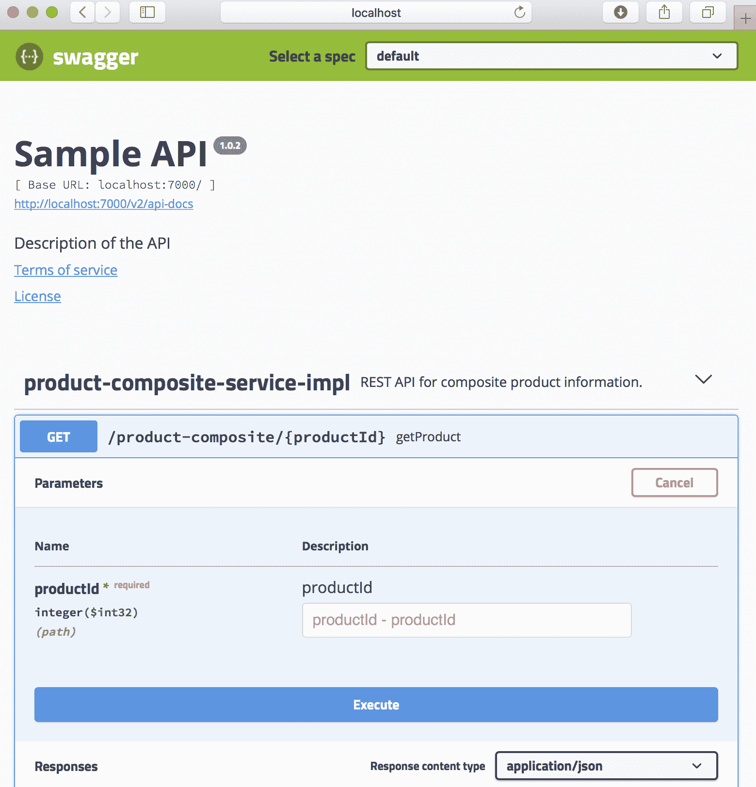
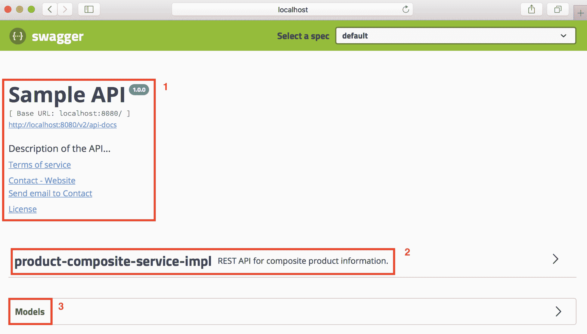
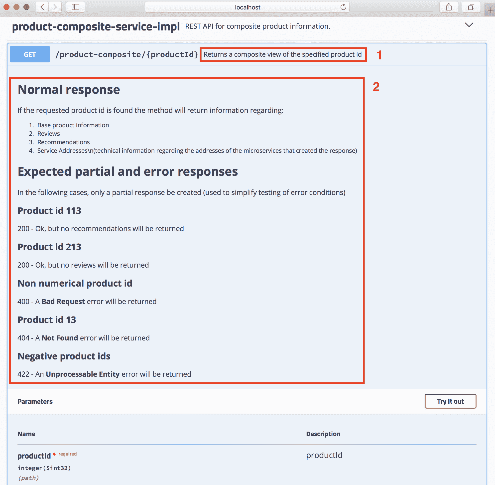
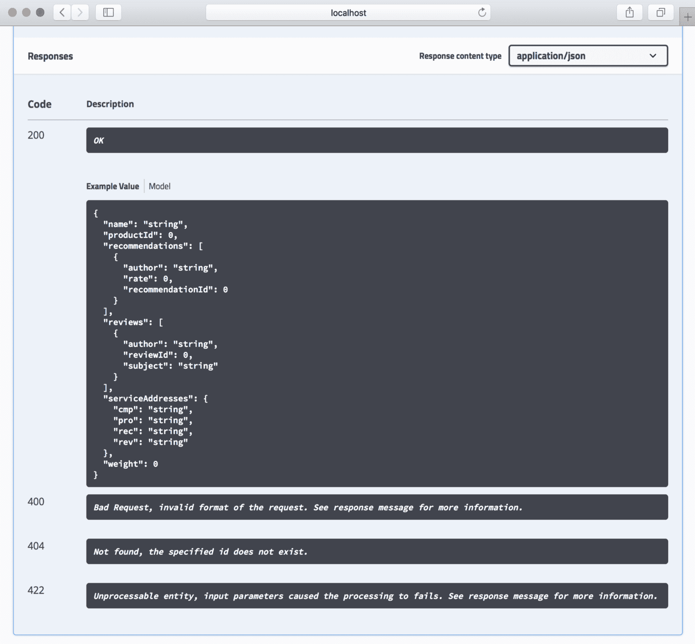
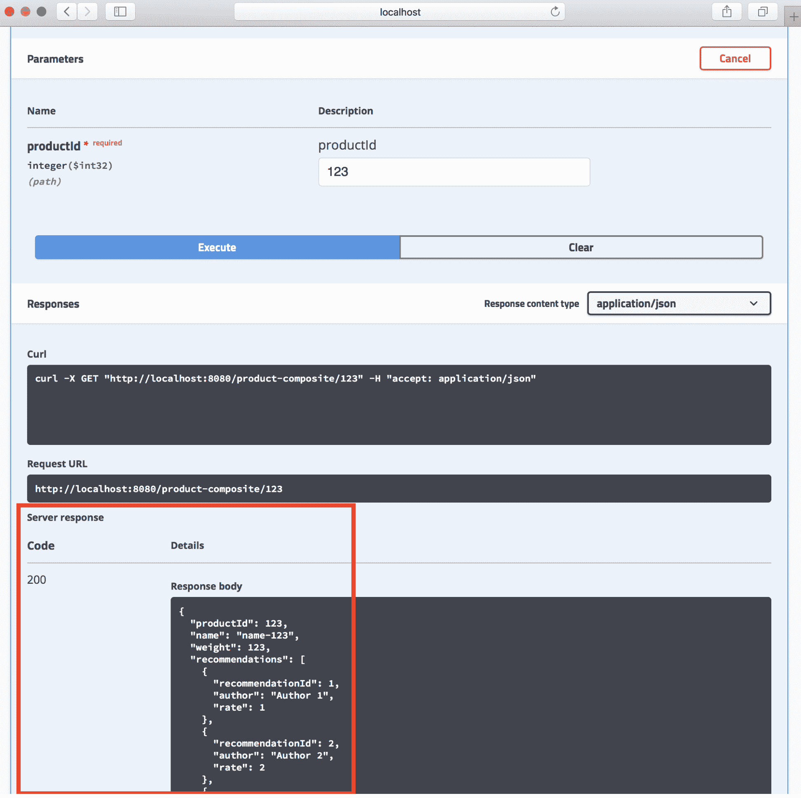
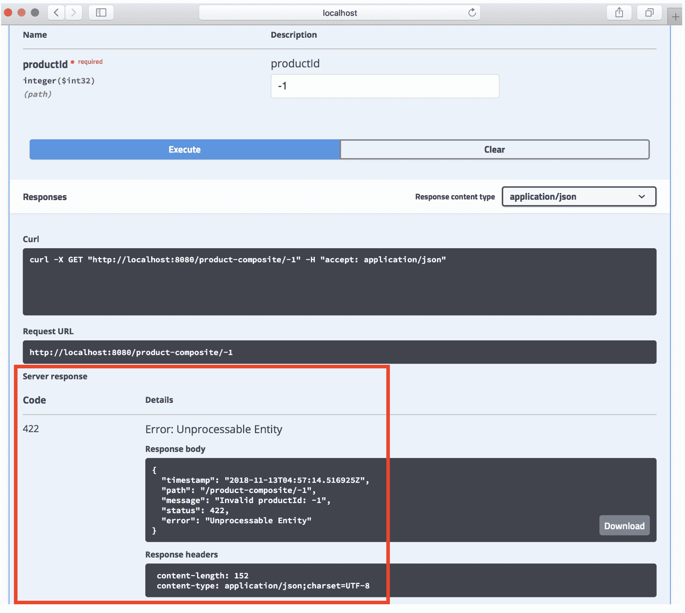

# 第五章：使用 OpenAPI/Swagger 添加 API 描述

一个 API（如 RESTful 服务）的价值在很大程度上取决于它是多么容易消费！良好且易于访问的文档是 API 是否有用的一个重要因素。在本章中，我们将学习如何使用 OpenAPI/Swagger 来文档化我们可以从微服务架构中外部访问的 API。

正如我们在第二章，《Spring Boot 简介》中提到的，Swagger 是文档 RESTful 服务时最常用的规范之一，许多领先的 API 网关都有对 Swagger 的本地支持。我们将学习如何使用 SpringFox 生成此类文档，以及使用 SpringFox 文档永恒 API 所需的源代码更改。我们将尝试使用内嵌的 Swagger 查看器来查看文档和测试 API。

到本章结束时，我们将拥有一个基于 Swagger 的外部 API 文档，该 API 是由`product-composite-service`微服务暴露的。我们将能够使用内嵌的 Swagger 查看器来可视化和测试 API。

本章将涵盖以下主题：

+   使用 SpringFox 简介

+   源代码的更改

+   构建和启动微服务

+   尝试 Swagger 文档

# 技术要求

本书中描述的所有命令都是在使用 macOS Mojave 的 MacBook Pro 上运行的，但如果您想在其他平台（如 Linux 或 Windows）上运行它们，应该很容易进行修改。

在你通过本章的学习之前，不需要安装任何新工具。

本章的源代码可以在本书的 GitHub 仓库中找到：[`github.com/PacktPublishing/Hands-On-Microservices-with-Spring-Boot-and-Spring-Cloud/tree/master/Chapter05`](https://github.com/PacktPublishing/Hands-On-Microservices-with-Spring-Boot-and-Spring-Cloud/tree/master/Chapter05)。

为了能够运行本书中描述的命令，请将源代码下载到文件夹中，并设置一个环境变量`$BOOK_HOME`，使其指向该文件夹。一些示例命令如下：

```java
export BOOK_HOME=~/Documents/Hands-On-Microservices-with-Spring-Boot-and-Spring-Cloud
git clone https://github.com/PacktPublishing/Hands-On-Microservices-with-Spring-Boot-and-Spring-Cloud $BOOK_HOME
cd $BOOK_HOME/Chapter05
```

本章中提到的 Java 源代码是为 Java 8 编写的，并在 Java 12 上进行了测试。本章使用了 Spring Boot 2.1.0（以及 Spring 5.1.2），这是在撰写本章时可用的最新 Spring Boot 版本。

本章中的代码示例都来自`$BOOK_HOME/Chapter05`的源代码，但在许多情况下，已经编辑了这些示例，以删除源代码中的无关部分，例如注释、导入和日志语句。

如果你想要查看本章应用于源代码的变化，即查看使用 SpringFox 创建基于 Swagger 的 API 文档所采取的措施，你可以与第四章，*使用 Docker 部署我们的微服务*的源代码进行比较。你可以使用你喜欢的`diff`工具，比较两个文件夹，即`$BOOK_HOME/Chapter04`和`$BOOK_HOME/Chapter05`。

# 使用 SpringFox 的介绍

SpringFox 使得可以将与实现 API 的源代码一起保持 API 文档。对我来说，这是一个重要的特性。如果 API 文档与 Java 源代码在不同的生命周期中维护，它们将随着时间的推移而相互偏离。根据我的经验，在很多情况下，这种情况比预期的要早。像往常一样，将组件的接口与实现分离是很重要的。在记录 RESTful API 方面，我们应该将 API 文档添加到描述 API 的 Java 接口中，而不是添加到实现 API 的 Java 类中。为了简化 API 文档的更新，我们可以将文档的部分内容放在属性文件中，而不是直接放在 Java 代码中。

2015 年，SmartBear Software 将 Swagger 规范捐赠给 Linux Foundation 的 OpenAPI Initiative，并创建了 OpenAPI 规范。为了创建 API 文档，我们将使用**SpringFox**，它可以在运行时创建基于 Swagger 的 API 文档。

它基于我们提供的配置以及通过检查由 Spring WebFlux 和 Swagger 提供的注释来实现：



计划支持 OpenAPI 的 SpringFox 版本为 v3。在撰写本章时，SpringFox V3 仍在开发中，因此我们将使用 SpringFox V3 的快照版本，并根据 Swagger V2 创建 API 文档。一旦 SpringFox V3 发布，本书的源代码将会更新。

为了启用 SpringFox 以便我们可以创建 API 文档，我们将为 SpringFox 设置一个基本配置，并向定义 RESTful 服务的 Java 接口添加注解。

如果文档的某些部分被放置在属性文件中以简化 API 文档的更新，那么这些属性文件必须与源代码在相同的生命周期和版本控制下处理，否则它们可能会开始与实现偏离，也就是说，变得过时。

# 源代码的变化

为了添加`product-composite-service`微服务暴露的外部 API 的基于 Swagger 的文档，我们需要改变两个模块的源代码：

+   `product-composite-services`：在这里，我们将在 Java 应用程序类`ProductCompositeServiceApplication`中设置 SpringFox 配置，并描述 API 的一般信息。

+   `api`：在这里，我们将向 Java 接口`ProductCompositeService`添加 Swagger 注解，描述每个 RESTful 服务。在这个阶段，我们只有一个 RESTful 服务，即`/product-composite/{productId}`，用于请求关于特定产品的复合信息。

实际用于描述 API 操作的文本将被放置在默认的属性文件`application.yml`中。

在我们可以使用 SpringFox 之前，我们需要将其作为依赖项添加到 Gradle 构建文件中。所以，让我们从这一点开始！

# 向 Gradle 构建文件添加依赖项

如我们之前提到的，我们将使用 SpringFox V3 的快照版本。SpringFox 产品分为多个模块。我们需要指定依赖关系的模块如下：

+   `springfox-swagger2`，这样我们就可以创建基于 Swagger 2 的文档

+   `springfox-spring-webflux`，这样我们就可以支持基于 Spring WebFlux 的 RESTful 操作

+   `springfox-swagger-ui`，这样我们可以在微服务中嵌入 Swagger 查看器

我们可以将这些添加到`product-composite-service`模块的 Gradle 构建文件`build.gradle`中，如下所示：

```java
implementation('io.springfox:springfox-swagger2:3.0.0-SNAPSHOT')
implementation('io.springfox:springfox-swagger-ui:3.0.0-SNAPSHOT')
implementation('io.springfox:springfox-spring-webflux:3.0.0-SNAPSHOT')
```

`api`项目只需要`springfox-swagger2`模块的一个依赖项，因此只需要在其`build.gradle`文件中添加以下依赖项：

```java
implementation('io.springfox:springfox-swagger2:3.0.0-SNAPSHOT')
```

SpringFox 项目在 Maven 仓库发布快照构建（[`oss.jfrog.org/artifactory/oss-snapshot-local/`](http://oss.jfrog.org/artifactory/oss-snapshot-local/)），所以我们还需要添加这个：

```java
repositories {
   mavenCentral()
   maven { url 'http://oss.jfrog.org/artifactory/oss-snapshot-local/' }
}
```

为了能够构建核心模块，即`product-service`、`recommendation-service`和`review-service`，我们需要将 Maven 仓库添加到它们的 Gradle 构建文件`build.gradle`中。

# 向产品组合服务应用程序添加配置和一般 API 文档

为了在`product-composite-service`微服务中启用 SpringFox，我们必须添加一个配置。为了保持源代码紧凑，我们将直接将其添加到`ProductCompositeServiceApplication`应用程序类中。

如果你喜欢，你可以将 SpringFox 的配置放在一个单独的 Spring 配置类中。

首先，我们需要添加`@EnableSwagger2WebFlux`注解，以便让 SpringFox 为我们的使用 Spring WebFlux 实现的 RESTful 服务生成 Swagger V2 文档。然后，我们需要定义一个返回 SpringFox `Docket`bean 的 Spring Bean，用于配置 SpringFox。

我们将要添加到`$BOOK_HOME/Chapter05/microservices/product-composite-service/src/main/java/se/magnus/microservices/composite/product/ProductCompositeServiceApplication.java`的源代码如下所示：

```java
@EnableSwagger2WebFlux
public class ProductCompositeServiceApplication {

   @Bean
   public Docket apiDocumentation() {
      return new Docket(SWAGGER_2)
         .select()
         .apis(basePackage("se.magnus.microservices.composite.product"))
         .paths(PathSelectors.any())
         .build()
            .globalResponseMessage(GET, emptyList())
            .apiInfo(new ApiInfo(
                   apiTitle,
                   apiDescription,
                   apiVersion,
                   apiTermsOfServiceUrl,
                   new Contact(apiContactName, apiContactUrl, 
                    apiContactEmail),
                   apiLicense,
                   apiLicenseUrl,
                   emptyList()
                                  ));
    }
```

从前面的代码，我们可以理解如下：

+   `@EnableSwagger2WebFlux`注解是启动 SpringFox 的起点。

+   `Docket`bean 被初始化以创建 Swagger V2 文档。

+   使用 `apis()` 和 `paths()` 方法，我们可以指定 SpringFox 应在哪里查找 API 文档。

+   使用 `globalResponseMessage()` 方法，我们要求 SpringFox 不要向 API 文档中添加任何默认 HTTP 响应代码，如 `401` 和 `403`，这些我们目前不使用。

+   用于配置 `Docket` bean 的一般 API 信息的 `api*` 变量是从属性文件中使用 Spring `@Value` 注解初始化的。这些如下：

```java
    @Value("${api.common.version}")           String apiVersion;
    @Value("${api.common.title}")             String apiTitle;
    @Value("${api.common.description}")       String apiDescription;
    @Value("${api.common.termsOfServiceUrl}") String 
                                              apiTermsOfServiceUrl;
    @Value("${api.common.license}")           String apiLicense;
    @Value("${api.common.licenseUrl}")        String apiLicenseUrl;
    @Value("${api.common.contact.name}")      String apiContactName;
    @Value("${api.common.contact.url}")       String apiContactUrl;
    @Value("${api.common.contact.email}")     String apiContactEmail;
```

添加配置和 API 文档后，我们可以继续了解如何向 ProductCompositeService 添加 API 特定的文档。

# 向 ProductCompositeService 添加 API 特定的文档

为了文档化实际的 API `ProductCompositeService` 及其 RESTful 操作，我们将向 Java 接口声明中添加 `@Api` 注解，以便我们可以提供 API 的通用描述。对于 API 中的每个 RESTful 操作，我们将添加一个 `@ApiOperation` 注解，并在相应的 Java 方法上添加 `@ApiResponse` 注解，以描述操作及其预期的错误响应。

SpringFox 将检查 `@GetMapping` Spring 注解，以了解操作接受什么输入参数，如果产生成功响应，响应将是什么样子。

在以下示例中，我们从 `@ApiOperation` 注解中提取了实际文本到一个属性文件中。注解包含属性占位符，SpringFox 将使用它们在运行时从属性文件中查找实际文本。

资源级别的 API 文档如下所示：

```java
@Api(description = "REST API for composite product information.")
public interface ProductCompositeService {
```

单个 API 操作如下所示：

```java
    @ApiOperation(
        value = "${api.product-composite.get-composite-
         product.description}",
        notes = "${api.product-composite.get-composite-product.notes}")
    @ApiResponses(value = {
        @ApiResponse(code = 400, message = "Bad Request, invalid format 
        of the request. See response message for more information."),
        @ApiResponse(code = 404, message = "Not found, the specified id 
         does not exist."),
        @ApiResponse(code = 422, message = "Unprocessable entity, input 
         parameters caused the processing to fails. See response 
         message for more information.")
    })
    @GetMapping(
        value    = "/product-composite/{productId}",
        produces = "application/json")
    ProductAggregate getProduct(@PathVariable int productId);
```

对于 `@ApiOperation` Swagger 注解中指定的值，我们可以直接使用属性占位符，而不用 Spring `@Value` 注解。对于预期 `ApiResponses` 的描述，即预期的错误代码，SpringFox 目前不支持使用属性占位符，因此在这种情况下，每个错误代码的实际文本直接放在 Java 源代码中。

详细信息，请参阅 `$BOOK_HOME/Chapter05/api/src/main/java/se/magnus/api/composite/product/ProductCompositeService.java`。

# 将 API 的文本描述添加到属性文件

最后，我们需要将 API 的文本描述添加到属性文件 `application.yml` 中。在此处，我们有如下 `@Value` 注解：

```java
@Value("${api.common.version}") String apiVersion;
```

对于每个 `@Value` 注解，我们需要在 YAML 文件中指定一个相应的属性；例如：

```java
api:
  common:
    version: 1.0.0
```

同样，我们有 Swagger 注解，其外观如下：

```java
@ApiOperation(value = "${api.product-composite.get-composite-product.description}")
```

这些期待 YAML 文件中有相应的属性；例如：

```java
api:
  product-composite:
    get-composite-product:
      description: Returns a composite view of the specified product id
```

如果您想了解更多关于如何构建 YAML 文件的信息，请查看规范：[`yaml.org/spec/1.2/spec.html`](https://yaml.org/spec/1.2/spec.html)。

首先，API 的通用描述，它是在 SpringFox `Docket` bean 中配置的，如下所示：

```java
api:
  common:
    version: 1.0.0
    title: Sample API
    description: Description of the API...
    termsOfServiceUrl: MINE TERMS OF SERVICE URL
    license: License
    licenseUrl: MY LICENSE URL
    contact:
      name: Contact
      url: My
      email: me@mail.com
```

接下来，给出了实际 API 操作的详细描述：

```java
product-composite:
  get-composite-product:
    description: Returns a composite view of the specified product id
    notes: |
      # Normal response
      If the requested product id is found the method will return 
      information regarding:
      1\. Base product information
      1\. Reviews
      1\. Recommendations
      1\. Service Addresses\n(technical information regarding the 
      addresses of the microservices that created the response)

      # Expected partial and error responses
      In the following cases, only a partial response be created (used 
      to simplify testing of error conditions)

      ## Product id 113
      200 - Ok, but no recommendations will be returned

      ## Product id 213
      200 - Ok, but no reviews will be returned

      ## Non numerical product id
      400 - A <b>Bad Request</b> error will be returned

      ## Product id 13
      404 - A <b>Not Found</b> error will be returned

      ## Negative product ids
      422 - An <b>Unprocessable Entity</b> error will be returned
```

请注意，SpringFox 支持使用 markdown 语法提供 API 操作的多行描述。

有关详细信息，请参阅`$BOOK_HOME/Chapter05/microservices/product-composite-service/src/main/resources/application.yml`。

# 构建和启动微服务架构

在我们尝试 Swagger 文档之前，我们需要构建和启动微服务架构！

这可以通过以下命令完成：

```java
cd $BOOK_HOME/Chapter05
./gradlew build && docker-compose build && docker-compose up -d
```

你可能会遇到一个关于端口`8080`已经被分配的错误信息。这将会是这样的：

```java
ERROR: for product-composite Cannot start service product-composite: driver failed programming external connectivity on endpoint chapter05_product-composite_1 (0138d46f2a3055ed1b90b3b3daca92330919a1e7fec20351728633222db5e737): Bind for 0.0.0.0:8080 failed: port is already allocated
```

如果是这种情况，你可能忘记从上一章关闭微服务架构。要找出正在运行的容器的名称，请运行以下命令：

```java
 docker ps --format {{.Names}}
```

当上一章的微服务架构仍在运行时，示例响应如下：

```java
chapter05_review_1
chapter05_product_1
chapter05_recommendation_1
chapter04_review_1
chapter04_product-composite_1
chapter04_product_1
chapter04_recommendation_1
```

如果在命令的输出中找到了其他章节的容器，例如，来自第四章，*使用 Docker 部署我们的微服务*，如前一个示例所示，你需要跳到那一章并关闭那个章节的容器：

```java
cd ../Chapter04
docker-compose down
```

现在，你可以启动本章缺失的容器了：

```java
cd ../Chapter05
docker-compose up -d
```

请注意，由于其他容器已经成功启动，该命令只启动了缺失的容器`product-composite`：

```java
Starting chapter05_product-composite_1 ... done
```

为了等待微服务架构启动并验证它是否正常工作，你可以运行以下命令：

```java
./test-em-all.bash 
```

这个微服务的成功启动有助于我们更好地理解其架构，也有助于理解我们将在下一节学习的 Swagger 文档。

# 尝试 Swagger 文档

为了浏览 Swagger 文档，我们将使用内嵌的 Swagger 查看器。如果我们打开`http://localhost:8080/swagger-ui.html` URL 在网页浏览器中，我们将看到一个类似于以下屏幕截图的网页：



这里，我们可以找到以下内容：

+   我们在 SpringFox `Docket` bean 中指定的通用信息，以及实际 Swagger 文档的链接，`http://localhost:8080/v2/api-docs`

+   API 资源的列表；在我们这个案例中，是`product-composite-service` API

+   页面底部有一个部分，我们可以查看 API 中使用的模型

它的工作原理如下：

1.  点击`product-composite-service` API 资源来展开它。你会得到一个资源上可用的操作列表。

1.  你只能看到一个操作，`/product-composite/{productId}`。点击它来展开它。你会看到我们在`ProductCompositeService` Java 接口中指定的操作的文档：



这里，我们可以看到以下内容：

+   操作的一行描述。

+   一个包含操作详细信息的章节，包括它支持的输入参数。请注意`@ApiOperation`注解中的`notes`字段是如何漂亮地渲染出来的 markdown 语法！

如果你滚动网页向下，你还会找到有关预期响应的文档，包括正常的 200 响应和我们定义的各种 4xx 错误响应，如下面的截图所示：



如果我们滚动回参数描述，我们会找到“尝试一下！”按钮。如果我们点击该按钮，我们可以输入实际的参数值，并通过点击“执行”按钮向 API 发送请求。例如，如果我们输入 `productId 123`，我们将得到以下响应：



我们将得到一个预期的 200（OK）作为响应代码，以及一个我们已熟悉的 JSON 结构作为响应体！

如果我们输入一个错误的输入，比如 `-1`，我们将得到一个正确的错误代码作为响应代码，以及一个相应的基于 JSON 的错误描述作为响应体：



如果你想尝试调用 API 而不用 Swagger UI，你可以从响应部分复制相应的 `curl` 命令，并在终端窗口中运行它！以下是一个例子：

```java
curl -X GET "http://localhost:8080/product-composite/123" -H "accept: application/json"
```

很棒，不是吗？

# 摘要

API 的良好文档化对其接受度至关重要，而 Swagger 是最常用于文档化 RESTful 服务的规范之一。SpringFox 是一个开源项目，它使得通过检查 Spring WebFlux 和 Swagger 注解，在运行时动态创建基于 Swagger 的 API 文档变得可能。API 的文本描述可以从 Java 源代码中的注解中提取，并放置在属性文件中以便于编辑。SpringFox 可以配置为将内嵌的 Swagger 查看器带入微服务，这使得阅读微服务公开的 API 以及从查看器中尝试它们变得非常容易。

现在，那么通过向我们的微服务中添加持久性（即保存数据库中数据的能力）来为我们的微服务带来一些生机呢？为此，我们需要添加一些更多 API，这样我们才能创建和删除微服务处理的信息。翻到下一章了解更多信息！

# 问题

1.  SpringFox 是如何帮助我们为 RESTful 服务创建 API 文档的？

1.  SpringFox 支持哪些 API 文档化规范？

1.  SpringFox 中的 `Docket` bean 的目的是什么？

1.  说出一些 SpringFox 在运行时读取的注解，以创建 API 文档！

1.  `: |` 在 YAML 文件中是什么意思？

1.  如何在不使用嵌入式 Swagger 查看器的情况下重复对 API 的调用？
