# 第六章：添加持久化

在本章中，我们将学习如何将微服务正在使用数据进行持久化。正如在第二章《Spring Boot 简介》中提到的，我们将使用 Spring Data 项目将数据持久化到 MongoDB 和 MySQL 数据库中。`project`和`recommendation`微服务将使用 Spring Data 进行 MongoDB 操作，而`review`微服务将使用 Spring Data 的**JPA**（Java Persistence API 的缩写）访问 MySQL 数据库。我们将向 RESTful API 添加操作，以能够创建和删除数据库中的数据。现有的用于读取数据的 API 将更新以访问数据库。我们将以 Docker 容器的形式运行数据库，由 Docker Compose 管理，也就是我们运行微服务的方式。

本章将涵盖以下主题：

+   向核心微服务添加持久化层

+   编写专注于持久化的自动化测试

+   在服务层中使用持久化层

+   扩展组合服务 API

+   向 Docker Compose 环境中添加数据库

+   手动测试新 API 和持久化层

+   更新微服务环境中的自动化测试

# 技术要求

本书中描述的所有命令都是在 MacBook Pro 上使用 macOS Mojave 运行的，但应该很容易修改以在另一个平台，如 Linux 或 Windows 上运行。

在本章中不需要安装任何新工具。

为了能够手动访问数据库，我们将使用用于运行数据库的 Docker 镜像中提供的 CLI 工具。不过，我们将在 Docker Compose 中暴露每个数据库所使用的标准端口——MySQL 的`3306`和 MongoDB 的`27017`。这将允许你使用你最喜欢的数据库工具以与它们在本机运行相同的方式访问数据库。

本章的源代码可以在 GitHub 上找到：[`github.com/PacktPublishing/Hands-On-Microservices-with-Spring-Boot-and-Spring-Cloud/tree/master/Chapter06`](https://github.com/PacktPublishing/Hands-On-Microservices-with-Spring-Boot-and-Spring-Cloud/tree/master/Chapter06)。

为了能够按照书中描述运行命令，请将源代码下载到一个文件夹中，并设置一个环境变量`$BOOK_HOME`，使其指向该文件夹。以下是一些示例命令：

```java
export BOOK_HOME=~/Documents/Hands-On-Microservices-with-Spring-Boot-and-Spring-Cloud
git clone https://github.com/PacktPublishing/Hands-On-Microservices-with-Spring-Boot-and-Spring-Cloud $BOOK_HOME
cd $BOOK_HOME/Chapter06
```

本章所用的 Java 源代码是为 Java 8 编写的，并在 Java 12 上进行了测试。本章使用的是 Spring Boot 2.1.0（以及 Spring 5.1.2）——这是在撰写本章时 Spring Boot 可用的最新版本。

源代码包含以下 Gradle 项目：

+   `api`

+   `util`

+   `microservices/product-service`

+   `microservices/review-service`

+   `microservices/recommendation-service`

+   `microservices/product-composite-service`

本章中的所有代码示例都来自`$BOOK_HOME/Chapter06`的源代码，但在许多情况下，为了删除源代码中不相关部分，例如注释和导入以及日志语句，都进行了编辑。

如果你想要查看在第六章，*添加持久化*中应用到源代码的变化，可以看到添加了持久化到微服务中使用 Spring Data 所需要的一切，你可以与第五章，*使用 OpenAPI/Swagger 添加 API 描述*的源代码进行比较。你可以使用你喜欢的 diff 工具，比较两个文件夹，`$BOOK_HOME/Chapter05`和`$BOOK_HOME/Chapter06`。

# 但首先，让我们看看我们的目标在哪里

到本章结束时，我们的微服务内部将会有如下的层次结构：

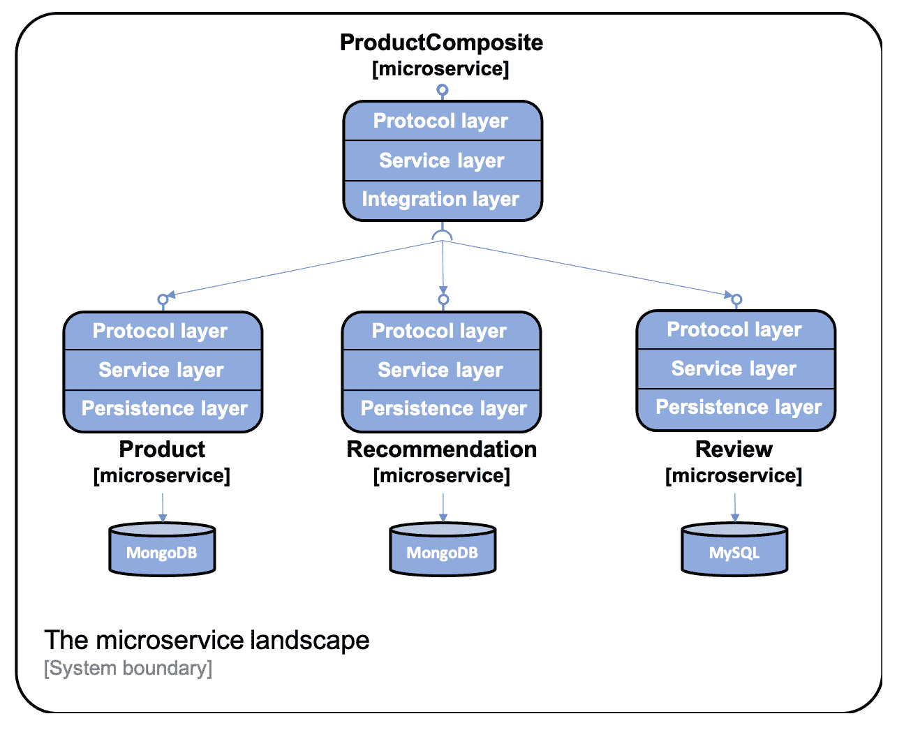

**协议层**非常薄，仅包含`RestController`注解和公共`GlobalControllerExceptionHandler`。每个微服务的主要功能都存在于服务层中。`product-composite`服务包含一个集成层，用于与三个核心微服务进行通信。核心微服务都将有一个用于与它们数据库通信的**持久化层**。

我们可以使用如下命令查看存储在 MongoDB 中的数据：

```java
docker-compose exec mongodb mongo product-db --quiet --eval "db.products.find()"
```

命令的结果应该像以下这样：

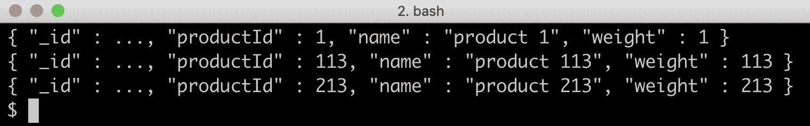

关于存储在 MySQL 中的数据，我们可以使用如下命令查看：

```java
docker-compose exec mysql mysql -uuser -p review-db -e "select * from reviews"
```

命令的结果应该如下所示：

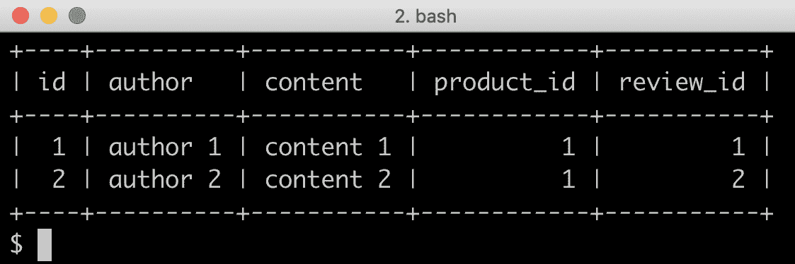

**注意：** `mongo`和`mysql`命令的输出已经被缩短以提高可读性。

让我们看看如何进行操作。

# 为核心微服务添加持久化层

让我们先为核心微服务添加一个持久化层。除了使用 Spring Data，我们还将使用一个 Java bean 映射工具 MapStruct，它使得在 Spring Data 实体对象和 API 模型类之间转换变得容易。有关详细信息，请参阅[`mapstruct.org/`](http://mapstruct.org/)。

首先，我们需要添加对 MapStruct、Spring Data 以及我们打算使用的数据库的 JDBC 驱动的依赖。之后，我们可以定义我们的 Spring Data 实体类和仓库。Spring Data 实体类和仓库将被放置在它们自己的 Java 包中，`persistence`。例如，对于产品微服务，它们将被放置在 Java 包`se.magnus.microservices.core.product.persistence`中。

# 添加依赖

我们将使用 MapStruct V1.3.0-Beta 2，所以我们首先在每一个核心微服务的构建文件中定义一个变量，以保存版本信息，`build.gradle`：

```java
ext {
 mapstructVersion = "1.3.0.Beta2"
}
```

接下来，我们声明对 MapStruct 的依赖：

```java
implementation("org.mapstruct:mapstruct:${mapstructVersion}")
```

由于 MapStruct 在编译时通过处理 MapStruct 注解来生成 bean 映射的实现，我们需要添加一个`annotationProcessor`和一个`testAnnotationProcessor`依赖：

```java
iannotationProcessor "org.mapstruct:mapstruct-processor:${mapstructVersion}"
testAnnotationProcessor "org.mapstruct:mapstruct-processor:${mapstructVersion}"
```

为了使在流行的 IDE 如 IntelliJ IDEA 中的编译时生成工作，我们还需要添加以下依赖：

```java
compileOnly "org.mapstruct:mapstruct-processor:${mapstructVersion}"
```

如果你使用的是 IntelliJ IDEA，你还需要确保启用了注解处理支持。打开首选项，导航到构建、执行、部署 | 编译器 | 注解处理器。验证名为“启用注解处理”的复选框是否被选中！

对于`project`和`recommendation`微服务，我们在 Spring Data for MongoDB 中声明了以下依赖：

```java
implementation('org.springframework.boot:spring-boot-starter-data-mongodb')
testImplementation('de.flapdoodle.embed:de.flapdoodle.embed.mongo')
```

对`de.flapdoodle.embed.mongo`的测试依赖使我们能够在运行 JUnit 基础测试时运行 MongoDB 嵌入式。

`review`微服务将使用 Spring Data for JPA，并搭配 MySQL 作为其数据库在运行时使用，在测试时会使用嵌入式数据库 H2。因此，在它的构建文件`build.gradle`中声明了以下依赖：

```java
implementation('org.springframework.boot:spring-boot-starter-data-jpa')
implementation('mysql:mysql-connector-java')
testImplementation('com.h2database:h2')
```

# 使用实体类存储数据

实体类在包含字段方面与相应的 API 模型类相似——查看`api`项目中的 Java 包`se.magnus.api.core`。我们将在与 API 模型类字段相比在实体类中添加两个字段`id`和`version`。

`id`字段用于持有每个存储实体的数据库身份——在使用关系数据库时是主键。我们将负责生成身份字段唯一值的职责委托给 Spring Data。根据所使用的数据库，Spring Data 可以将这个职责委托给数据库引擎。无论哪种情况，应用程序代码都不需要考虑如何设置数据库`id`的唯一值。`id`字段在 API 中不暴露，这是从安全角度出发的最佳实践。模型类中的字段，用于标识实体，将在相应的实体类中分配一个唯一索引，以确保从业务角度保持数据库的一致性。

`version`字段用于实现乐观锁，即允许 Spring Data 验证数据库中实体的更新是否覆盖了并发更新。如果存储在数据库中的版本字段值高于更新请求中的版本字段值，这表明更新是基于过时数据进行的——即自从从数据库中读取数据以来，要更新的信息已被其他人更新。Spring Data 将防止基于过时数据执行更新。在编写持久性测试的部分，我们将看到测试验证 Spring Data 中的乐观锁机制防止对过时数据执行更新。由于我们只实现创建、读取和删除操作的 API，因此我们不会在 API 中暴露版本字段。

产品实体类最有趣的部分看起来像这样：

```java
@Document(collection="products")
public class ProductEntity {

 @Id
 private String id;

 @Version
 private Integer version;

 @Indexed(unique = true)
 private int productId;

 private String name;
 private int weight;
```

以下是从前面代码得出的观察结果：

+   `@Document(collection="products")`注解用于标记用作 MongoDB 实体的类，即映射到名为`products`的 MongoDB 集合。

+   `@Id` 和 `@Version` 注解用于标记由 Spring Data 使用的 `id` 和 `version` 字段，如前所述。

+   `@Indexed(unique = true)` 注解用于为业务键 `productId` 创建一个唯一的索引。

`Recommendation` 实体类最有趣的部分看起来是这样的：

```java
@Document(collection="recommendations")
@CompoundIndex(name = "prod-rec-id", unique = true, def = "{'productId': 1, 'recommendationId' : 1}")
public class RecommendationEntity {

    @Id
    private String id;

    @Version
    private Integer version;

    private int productId;
    private int recommendationId;
    private String author;
    private int rating;
    private String content;
```

在前面产品实体的解释基础上，我们可以看到如何使用 `@CompoundIndex` 注解为基于字段 `productId` 和 `recommendationId` 的复合业务键创建唯一的复合索引。

最后，`Review` 实体类最有趣的部分看起来是这样的：

```java
@Entity
@Table(name = "reviews", indexes = { @Index(name = "reviews_unique_idx", unique = true, columnList = "productId,reviewId") })
public class ReviewEntity {

    @Id @GeneratedValue
    private int id;

    @Version
    private int version;

    private int productId;
    private int reviewId;
    private String author;
    private String subject;
    private String content;
```

以下是对前面代码的观察：

+   `@Entity` 和 `@Table` 注解用于标记一个类作为一个用于 JPA 的实体类——映射到 SQL 数据库中的一个名为 `products` 的表。

+   `@Table` 注解也用于指定基于字段 `productId` 和 `reviewId` 的复合业务键应创建一个唯一的复合索引。

+   `@Id` 和 `@Version` 注解用于标记 `id` 和 `version` 字段，如前所述，由 Spring Data 使用。为了指导 Spring Data for JPA 自动为 `id` 字段生成唯一的 `id` 值，我们使用了 `@GeneratedValue` 注解。

实体类的完整源代码可以在以下链接中找到：

+   `se.magnus.microservices.core.product.persistence.ProductEntity` 在 `product` 项目中

+   `se.magnus.microservices.core.recommendation.persistence.RecommendationEntity` 在 `recommendation` 项目中

+   `se.magnus.microservices.core.review.persistence.ReviewEntity` 在 `review` 项目中

# 在 Spring Data 中定义仓库

Spring Data 带有一组用于定义仓库的基础类。我们将使用基础类 `CrudRepository` 和 `PagingAndSortingRepository`。`CrudRepository` 基础类提供了执行基本的数据库创建、读取、更新和删除操作的标准方法。`PagingAndSortingRepository` 基础类在 `CrudRepository` 基础类中增加了分页和排序的支持。

我们将使用 `CrudRepository` 类作为 `Recommendation` 和 `Review` 仓库的基础类，以及 `PagingAndSortingRepository` 类作为 `Product` 仓库的基础类。

我们还将向我们的仓库中添加几个额外的查询方法，用于使用业务键 `productId` 查找实体。

Spring Data 支持基于方法签名的命名约定定义额外的查询方法。例如，`findByProductId(int productId)` 方法签名可以用来指导 Spring Data 自动创建一个查询，当调用查询方法时，返回底层集合或表中`productId`字段设置为`productId`参数中指定值的实体。有关如何声明额外查询的详细信息，请参阅[`docs.spring.io/spring-data/data-commons/docs/current/reference/html/#repositories.query-methods.query-creation`](https://docs.spring.io/spring-data/data-commons/docs/current/reference/html/#repositories.query-methods.query-creation)。

`Product` 仓库类看起来是这样的：

```java
public interface ProductRepository extends PagingAndSortingRepository<ProductEntity, String> {
    Optional<ProductEntity> findByProductId(int productId);
}
```

因为`findByProductId`方法可能返回零个或一个产品实体，所以通过将其包裹在`Optional`对象中来标记返回值为可选的。

`Recommendation` 仓库类看起来是这样的：

```java
public interface RecommendationRepository extends CrudRepository<RecommendationEntity, String> {
    List<RecommendationEntity> findByProductId(int productId);
}
```

在这个案例中，`findByProductId`方法将返回零到多个推荐实体，所以返回值被定义为一个列表。

最后，`Review` 仓库类的样子是这样的：

```java
public interface ReviewRepository extends CrudRepository<ReviewEntity, Integer> {
    @Transactional(readOnly = true)
    List<ReviewEntity> findByProductId(int productId);
}
```

由于 SQL 数据库是事务性的，我们必须为查询方法`findByProductId()`指定默认的事务类型——在我们的案例中是只读的。

就这样——这就是为我们的核心微服务建立持久化层所需的所有步骤。

要在以下位置查看仓库类的完整源代码：

+   `se.magnus.microservices.core.product.persistence.ProductRepository` 在 `product` 项目中

+   `se.magnus.microservices.core.recommendation.persistence.RecommendationRepository` 在 `recommendation` 项目中

+   `se.magnus.microservices.core.review.persistence.ReviewRepository` 在 `review` 项目中

让我们通过编写一些持久化测试来验证它们是否如预期般工作。

# 编写关注持久化的自动化测试

在编写持久化测试时，我们希望当测试开始时启动一个嵌入式数据库，当测试完成时将其销毁。然而，我们不希望测试等待其他资源启动，例如，Netty 之类的 Web 服务器（在运行时是必需的）。

Spring Boot 带有两个针对此特定要求定制的类级注解：

+   `@DataMongoTest`：当测试开始时启动一个嵌入式 MongoDB 数据库。

+   `@DataJpaTest`：当测试开始时启动一个嵌入式 SQL 数据库：

    +   自从我们在构建文件中向评论微服务的 H2 数据库添加了测试依赖后，它将被用作嵌入式 SQL 数据库。

    +   默认情况下，Spring Boot 配置测试以回滚 SQL 数据库的更新，以最小化对其他测试的负面副作用风险。在我们的情况下，这种行为将导致一些测试失败。因此，通过类级注解禁用了自动回滚：`@Transactional(propagation = NOT_SUPPORTED)`。

三个核心微服务的持久化测试彼此相似，因此我们只需查看`Product`微服务的持久化测试。

测试类声明了一个方法`setupDb()`，用`@Before`注解标记，在每种测试方法之前执行。设置方法从数据库中删除以前测试的任何实体，并插入一个测试方法可以作为其测试基础的实体：

```java
@RunWith(SpringRunner.class)
@DataMongoTest
public class PersistenceTests {

    @Autowired
    private ProductRepository repository;
    private ProductEntity savedEntity;

    @Before
    public void setupDb() {
        repository.deleteAll();
        ProductEntity entity = new ProductEntity(1, "n", 1);
        savedEntity = repository.save(entity);
        assertEqualsProduct(entity, savedEntity);
    }
```

接下来是各种测试方法。首先是`create`测试：

```java
@Test
public void create() {
    ProductEntity newEntity = new ProductEntity(2, "n", 2);
    savedEntity = repository.save(newEntity);

    ProductEntity foundEntity = 
    repository.findById(newEntity.getId()).get();
    assertEqualsProduct(newEntity, foundEntity);

    assertEquals(2, repository.count());
}
```

此测试创建了一个新实体，并验证它可以通过`findByProductId()`方法找到，并以断言数据库中存储了两个实体结束，一个是通过`setup`方法创建的，另一个是测试本身创建的。

`update`测试看起来像这样：

```java
@Test
public void update() {
    savedEntity.setName("n2");
    repository.save(savedEntity);

    ProductEntity foundEntity = 
    repository.findById(savedEntity.getId()).get();
    assertEquals(1, (long)foundEntity.getVersion());
    assertEquals("n2", foundEntity.getName());
}
```

此测试更新了由设置方法创建的实体，再次使用标准的`findById()`方法从数据库中读取它，并断言它的一些字段包含期望的值。注意，当实体被创建时，其`version`字段由 Spring Data 设置为`0`。

`delete`测试看起来像这样：

```java
@Test
public void delete() {
    repository.delete(savedEntity);
    assertFalse(repository.existsById(savedEntity.getId()));
}
```

此测试删除由`setup`方法创建的实体，并验证它不再存在于数据库中。

`read`测试看起来像这样：

```java
@Test
public void getByProductId() {
    Optional<ProductEntity> entity = 
    repository.findByProductId(savedEntity.getProductId());
    assertTrue(entity.isPresent());
    assertEqualsProduct(savedEntity, entity.get());
}
```

此测试使用了`findByProductId()`方法来获取由`setup`方法创建的实体，验证它是否被找到，然后使用本地助手方法`assertEqualsProduct()`来验证`findByProductId()`返回的实体是否与`setup`方法存储的实体相同。

接下来，它跟随两个测试方法，验证替代流程——错误条件的处理。首先是验证重复正确处理的测试：

```java
@Test(expected = DuplicateKeyException.class)
public void duplicateError() {
    ProductEntity entity = new 
    ProductEntity(savedEntity.getProductId(), "n", 1);
    repository.save(entity);
}
```

测试尝试存储一个与`setup`方法保存的实体具有相同业务键的实体。如果保存操作成功，或者保存失败并抛出预期之外的异常，`DuplicateKeyException`，则测试将失败。

在我看来，另一个负向测试是测试类中最有趣的测试。这是一个测试，用于验证在更新陈旧数据时的正确错误处理——它验证乐观锁定机制是否工作。它看起来像这样：

```java
@Test
public void optimisticLockError() {

    // Store the saved entity in two separate entity objects
    ProductEntity entity1 = 
    repository.findById(savedEntity.getId()).get();
    ProductEntity entity2 = 
    repository.findById(savedEntity.getId()).get();

    // Update the entity using the first entity object
    entity1.setName("n1");
    repository.save(entity1);

    //  Update the entity using the second entity object.
    // This should fail since the second entity now holds a old version 
    // number, that is, a Optimistic Lock Error
    try {
        entity2.setName("n2");
        repository.save(entity2);

        fail("Expected an OptimisticLockingFailureException");
    } catch (OptimisticLockingFailureException e) {}

    // Get the updated entity from the database and verify its new 
    // state
    ProductEntity updatedEntity = 
    repository.findById(savedEntity.getId()).get();
    assertEquals(1, (int)updatedEntity.getVersion());
    assertEquals("n1", updatedEntity.getName());
}
```

从前面的代码中观察到以下情况：

1.  首先，测试两次读取同一个实体，并将其存储在两个不同的变量`entity1`和`entity2`中。

1.  接下来，它使用其中一个变量`entity1`来更新实体。在数据库中更新实体将导致 Spring Data 自动增加实体的版本字段。另一个变量`entity2`现在包含陈旧数据，体现在其版本字段持有的值低于数据库中对应值。

1.  当测试尝试使用包含陈旧数据的变量`entity2`更新实体时，预计会通过抛出`OptimisticLockingFailureException`异常来失败。

1.  测试通过断言数据库中的实体反映了第一次更新，即包含名称`"n1"`，并且版本字段具有值`1`，即只在数据库中更新了实体的一次。

最后，`product`服务包含一个测试，演示了 Spring Data 中内置的排序和分页支持的用法：

```java
@Test
public void paging() {
    repository.deleteAll();
    List<ProductEntity> newProducts = rangeClosed(1001, 1010)
        .mapToObj(i -> new ProductEntity(i, "name " + i, i))
        .collect(Collectors.toList());
    repository.saveAll(newProducts);

    Pageable nextPage = PageRequest.of(0, 4, ASC, "productId");
    nextPage = testNextPage(nextPage, "[1001, 1002, 1003, 1004]", 
    true);
    nextPage = testNextPage(nextPage, "[1005, 1006, 1007, 1008]", 
    true);
    nextPage = testNextPage(nextPage, "[1009, 1010]", false);
}
```

从前面的代码中观察到以下内容：

1.  测试从删除任何现有数据开始，然后插入具有`productId`字段从`1001`到`1010`的 10 个实体。

1.  接下来，它创建了`PageRequest`，请求每页 4 个实体的分页计数，并根据`ProductId`升序排序。

1.  最后，它使用一个助手方法`testNextPage`来读取预期的三页内容，验证每页中预期的产品 ID，并验证 Spring Data 正确报告是否存在更多页面。

助手方法`testNextPage`看起来像这样：

```java
private Pageable testNextPage(Pageable nextPage, String expectedProductIds, boolean expectsNextPage) {
    Page<ProductEntity> productPage = repository.findAll(nextPage);
    assertEquals(expectedProductIds, productPage.getContent()
    .stream().map(p -> p.getProductId()).collect(Collectors.
    toList()).toString());
    assertEquals(expectsNextPage, productPage.hasNext());
    return productPage.nextPageable();
}
```

助手方法使用分页请求对象`nextPage`从仓库方法的`findAll()`获取下一页。根据结果，它从返回的实体中提取产品 ID，将其转换为字符串，并与期望的产品 ID 列表进行比较。最后，它返回一个布尔值，指示是否可以检索更多页面。

三篇持久化测试类的完整源代码，请参见以下内容：

+   `se.magnus.microservices.core.product.PersistenceTests`在`product`项目中

+   `se.magnus.microservices.core.recommendation.PersistenceTests`在`recommendation`项目中

+   `se.magnus.microservices.core.review.PersistenceTests`在`review`项目中

`product`微服务中的持久化测试可以通过使用 Gradle 执行以下命令来执行：

```java
cd $BOOK_HOME/Chapter06
./gradlew microservices:product-service:test --tests PersistenceTests
```

运行测试后，它应该响应以下内容：

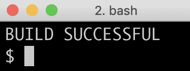

在持久化层就位后，我们可以将核心微服务中的服务层更新为使用持久化层。

# 在服务层使用持久化层

在本节中，我们将学习如何在服务层使用持久化层来存储和从数据库中检索数据。我们将按照以下步骤进行：

1.  日志记录数据库连接 URL。

1.  添加新的 API。

1.  使用持久化层。

1.  声明一个 Java bean mapper。

1.  更新服务测试。

# 日志记录数据库连接 URL

当扩展微服务的数量时，每个微服务连接到自己的数据库，我发现自己有时不确定每个微服务实际上使用的是哪个数据库。因此，我通常在微服务启动后直接添加一个日志语句，记录用于连接数据库的连接 URL。

例如，`Product`服务的启动代码看起来像这样：

```java
public class ProductServiceApplication {
  private static final Logger LOG = 
  LoggerFactory.getLogger(ProductServiceApplication.class);

  public static void main(String[] args) {
    ConfigurableApplicationContext ctx = 
    SpringApplication.run(ProductServiceApplication.class, args);
    String mongodDbHost = 
    ctx.getEnvironment().getProperty("spring.data.mongodb.host");
    String mongodDbPort = 
    ctx.getEnvironment().getProperty("spring.data.mongodb.port");
    LOG.info("Connected to MongoDb: " + mongodDbHost + ":" + 
    mongodDbPort);
  }
}
```

在日志中，应期望以下类型的输出：

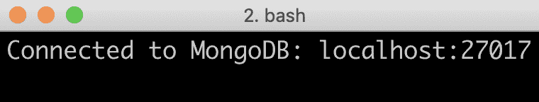

要查看完整的源代码，请参阅`product`项目中的`se.magnus.microservices.core.product.ProductServiceApplication`类。

# 添加新 API

在我们能够使用持久化层在数据库中创建和删除信息之前，我们需要在我们的核心服务 API 中创建相应的 API 操作。

创建和删除产品实体的 API 操作看起来像这样：

```java
@PostMapping(
    value    = "/product",
    consumes = "application/json",
    produces = "application/json")
Product createProduct(@RequestBody Product body);

@DeleteMapping(value = "/product/{productId}")
void deleteProduct(@PathVariable int productId);
```

删除操作的实现将是幂等的，也就是说，如果多次调用，它将返回相同的结果。这在故障场景中是一个宝贵的特性。例如，如果客户端在调用删除操作时遇到网络超时，它可以简单地再次调用删除操作，而不用担心不同的响应，例如，第一次响应为 OK (200) 和连续调用响应为 Not Found (404)，或者任何意外的副作用。这暗示了即使实体在数据库中不再存在，操作也应该返回 OK (200)的状态码。

`recommendation` 和 `review` 实体的 API 操作看起来很相似；然而，注意，当涉及到`recommendation` 和 `review` 实体的删除操作时，它将删除指定`productId`的所有`recommendations`和`reviews`。

要查看完整的源代码，请查看`api`项目中的以下类：

+   `se.magnus.api.core.product.ProductService`

+   `se.magnus.api.core.recommendation.RecommendationService`

+   `se.magnus.api.core.review.ReviewService`

# 使用持久化层

在服务层中使用持久化层的源代码对于所有核心微服务都是结构相同的。因此，我们只查看`Product`微服务的源代码。

首先，我们需要从持久化层注入仓库类和一个 Java bean 映射器类到构造函数中：

```java
private final ServiceUtil serviceUtil;
private final ProductRepository repository;
private final ProductMapper mapper;

@Autowired
public ProductServiceImpl(ProductRepository repository, ProductMapper mapper, ServiceUtil serviceUtil) {
    this.repository = repository;
    this.mapper = mapper;
    this.serviceUtil = serviceUtil;
}
```

在下一节中，我们将看到 Java 映射器类是如何定义的。

接下来，按照以下方式实现`createProduct`方法：

```java
public Product createProduct(Product body) {
    try {
        ProductEntity entity = mapper.apiToEntity(body);
        ProductEntity newEntity = repository.save(entity);
        return mapper.entityToApi(newEntity);
    } catch (DuplicateKeyException dke) {
        throw new InvalidInputException("Duplicate key, Product Id: " + 
        body.getProductId());
    }
}
```

`create`方法使用了仓库中的`save`方法来存储一个新的实体。应注意映射器类是如何使用两个映射器方法`apiToEntity()`和`entityToApi()`，在 API 模型类和实体类之间转换 Java bean 的。我们为`create`方法处理的唯一错误是`DuplicateKeyException`异常，我们将它转换为`InvalidInputException`异常。

`getProduct`方法看起来像这样：

```java
public Product getProduct(int productId) {
    if (productId < 1) throw new InvalidInputException("Invalid 
    productId: " + productId);
    ProductEntity entity = repository.findByProductId(productId)
        .orElseThrow(() -> new NotFoundException("No product found for 
         productId: " + productId));
    Product response = mapper.entityToApi(entity);
    response.setServiceAddress(serviceUtil.getServiceAddress());
    return response;
}
```

在进行了基本输入验证（即确保`productId`不是负数）之后，仓库中的`findByProductId()`方法用于查找产品实体。由于仓库方法返回一个`Optional`产品，我们可以使用`Optional`类中的`orElseThrow()`方法方便地抛出如果没有找到产品实体就抛出`NotFoundException`异常。在返回产品信息之前，使用`serviceUtil`对象填充微服务当前使用的地址。

最后，让我们看看`deleteProduct`方法：

```java
public void deleteProduct(int productId) {
    repository.findByProductId(productId).ifPresent(e -> 
    repository.delete(e));
}
```

`delete` 方法还使用了仓库中的`findByProductId()`方法，并使用了`Optional`类中的`ifPresent()`方法，方便地仅在实体存在时删除实体。注意，该实现是幂等的，即，如果找不到实体，它不会报告任何故障。

三个服务实现类的源代码可以在以下位置找到：

+   `se.magnus.microservices.core.product.services.ProductServiceImpl` 在 `product` 项目中

+   `se.magnus.microservices.core.recommendation.services.RecommendationServiceImpl` 在 `recommendation` 项目中

+   `se.magnus.microservices.core.review.services.ReviewServiceImpl` 在 `review` 项目中

# 声明一个 Java bean 映射器

那么，魔法的 Java bean 映射器又如何呢？

正如前面提到的，我们使用 MapStruct 来声明我们的映射器类。MapStruct 在三个核心微服务中的使用是相似的，所以我们只查看`Product`微服务中的映射器对象源代码。

`product` 服务的映射器类看起来像这样：

```java
@Mapper(componentModel = "spring")
public interface ProductMapper {

    @Mappings({
        @Mapping(target = "serviceAddress", ignore = true)
    })
    Product entityToApi(ProductEntity entity);

    @Mappings({
        @Mapping(target = "id", ignore = true),
        @Mapping(target = "version", ignore = true)
    })
    ProductEntity apiToEntity(Product api);
}
```

从前面的代码中观察到以下内容：

+   `entityToApi()`方法将实体对象映射到 API 模型对象。由于实体类没有`serviceAddress`字段，`entityToApi()`方法被注解忽略`serviceAddress`。

+   `apiToEntity()`方法将 API 模型对象映射到实体对象。同样，`apiToEntity()`方法被注解忽略在 API 模型类中缺失的`id`和`version`字段。

MapStruct 不仅支持按名称映射字段，还可以指定它映射具有不同名称的字段。在`Recommendation`服务的映射器类中，使用以下注解将`rating`实体字段映射到 API 模型字段`rate`：

```java
    @Mapping(target = "rate", source="entity.rating"),
    Recommendation entityToApi(RecommendationEntity entity);

    @Mapping(target = "rating", source="api.rate"),
    RecommendationEntity apiToEntity(Recommendation api);
```

成功构建 Gradle 后，生成的映射实现可以在`build/classes` 文件夹中找到，例如，`Product`服务：`$BOOK_HOME/Chapter06/microservices/product-service/build/classes/java/main/se/magnus/microservices/core/product/services/ProductMapperImpl.java`。

三个映射器类的源代码可以在以下位置找到：

+   `se.magnus.microservices.core.product.services.ProductMapper` 在 `product` 项目中

+   `se.magnus.microservices.core.recommendation.services.RecommendationMapper` 在 `recommendation` 项目中

+   `se.magnus.microservices.core.review.services.ReviewMapper` 在 `review` 项目中

# 更新服务测试

自上一章以来，核心微服务暴露的 API 的测试已经更新，增加了对创建和删除 API 操作的测试。

新增的测试在三个核心微服务中都是相似的，所以我们只查看`Product`微服务中的服务测试源代码。

为了确保每个测试都有一个已知的状态，声明了一个设置方法，`setupDb()`，并用 `@Before` 注解，这样它会在每个测试运行之前运行。设置方法移除了之前创建的任何实体：

```java
@Autowired
private ProductRepository repository;

@Before
public void setupDb() {
   repository.deleteAll();
}
```

创建 API 的测试方法验证了一个产品实体在创建后可以被检索到，并且使用相同的 `productId` 创建另一个产品实体会导致预期的错误，`UNPROCESSABLE_ENTITY`，在 API 请求的响应中：

```java
@Test
public void duplicateError() {
   int productId = 1;
   postAndVerifyProduct(productId, OK);
   assertTrue(repository.findByProductId(productId).isPresent());

   postAndVerifyProduct(productId, UNPROCESSABLE_ENTITY)
      .jsonPath("$.path").isEqualTo("/product")
      .jsonPath("$.message").isEqualTo("Duplicate key, Product Id: " + 
       productId);
}
```

删除 API 的测试方法验证了一个产品实体可以被删除，并且第二个删除请求是幂等的——它还返回了状态码 OK，即使实体在数据库中已不再存在：

```java
@Test
public void deleteProduct() {
   int productId = 1;
   postAndVerifyProduct(productId, OK);
   assertTrue(repository.findByProductId(productId).isPresent());

   deleteAndVerifyProduct(productId, OK);
   assertFalse(repository.findByProductId(productId).isPresent());

   deleteAndVerifyProduct(productId, OK);
}
```

为了简化向 API 发送创建、读取和删除请求并验证响应状态，已经创建了三个辅助方法：

+   `postAndVerifyProduct()`

+   `getAndVerifyProduct()`

+   `deleteAndVerifyProduct()`

`postAndVerifyProduct()` 方法看起来是这样的：

```java
private WebTestClient.BodyContentSpec postAndVerifyProduct(int productId, HttpStatus expectedStatus) {
   Product product = new Product(productId, "Name " + productId, 
   productId, "SA");
   return client.post()
      .uri("/product")
      .body(just(product), Product.class)
      .accept(APPLICATION_JSON_UTF8)
      .exchange()
      .expectStatus().isEqualTo(expectedStatus)
      .expectHeader().contentType(APPLICATION_JSON_UTF8)
      .expectBody();
}
```

除了执行实际的 HTTP 请求并验证其响应码外，辅助方法还将响应的正文返回给调用者进行进一步调查，如果需要的话。另外两个用于读取和删除请求的辅助方法类似，可以在本节开头指出的源代码中找到。

三个服务测试类的源代码可以在以下位置找到：

+   `se.magnus.microservices.core.product.ProductServiceApplicationTests` 在 `product` 项目中

+   `se.magnus.microservices.core.recommendation.RecommendationServiceApplicationTests` 在 `recommendation` 项目中

+   `se.magnus.microservices.core.review.ReviewServiceApplicationTests` 在 `review` 项目中

现在，让我们来看看如何扩展复合服务 API。

# 扩展复合服务 API

在本节中，我们将了解如何扩展复合 API 以创建和删除复合实体。我们将按照以下步骤进行：

1.  在复合服务 API 中添加新操作

1.  在集成层中添加方法

1.  实现新的复合 API 操作

1.  更新复合服务测试

# 在复合服务 API 中添加新操作

创建和删除实体的复合版本以及处理聚合实体的方法与核心服务 API 中的创建和删除操作相似。主要区别在于，它们添加了用于基于 Swagger 的文档的注解。有关 Swagger 注解的使用说明，请参阅 第五章，*使用 OpenAPI/Swagger 添加 API 描述* 节，*在 ProductCompositeService 中添加 API 特定文档*。创建复合产品实体的 API 操作声明如下：

```java
@ApiOperation(
    value = "${api.product-composite.create-composite-
    product.description}",
    notes = "${api.product-composite.create-composite-product.notes}")
@ApiResponses(value = {
    @ApiResponse(code = 400, message = "Bad Request, invalid format of 
    the request. See response message for more information."),
    @ApiResponse(code = 422, message = "Unprocessable entity, input 
    parameters caused the processing to fail. See response message for 
    more information.")
})
@PostMapping(
    value    = "/product-composite",
    consumes = "application/json")
void createCompositeProduct(@RequestBody ProductAggregate body);
```

删除复合产品实体的 API 操作声明如下：

```java
@ApiOperation(
    value = "${api.product-composite.delete-composite-
    product.description}",
    notes = "${api.product-composite.delete-composite-product.notes}")
@ApiResponses(value = {
    @ApiResponse(code = 400, message = "Bad Request, invalid format of 
    the request. See response message for more information."),
    @ApiResponse(code = 422, message = "Unprocessable entity, input 
    parameters caused the processing to fail. See response message for 
    more information.")
})
@DeleteMapping(value = "/product-composite/{productId}")
void deleteCompositeProduct(@PathVariable int productId);
```

完整的源代码，请参阅`api`项目中的 Java 接口`se.magnus.api.composite.product.ProductCompositeService`。

我们还需要像以前一样，将 API 文档的描述性文本添加到属性文件`application.yml`中：

```java
create-composite-product:
  description: Creates a composite product
  notes: |
    # Normal response
    The composite product information posted to the API will be 
    splitted up and stored as separate product-info, recommendation and 
    review entities.

    # Expected error responses
    1\. If a product with the same productId as specified in the posted 
    information already exists, an <b>422 - Unprocessable Entity</b> 
    error with a "duplicate key" error message will be returned

delete-composite-product:
  description: Deletes a product composite
  notes: |
    # Normal response
    Entities for product information, recommendations and reviews 
    related to the specificed productId will be deleted.
    The implementation of the delete method is idempotent, that is, it 
    can be called several times with the same response.
    This means that a delete request of a non existing product will 
    return <b>200 Ok</b>.
```

具体细节，请查看`product-composite`项目中的`src/main/resources/application.yml`配置文件。

更新后的 Swagger 文档将如下所示：

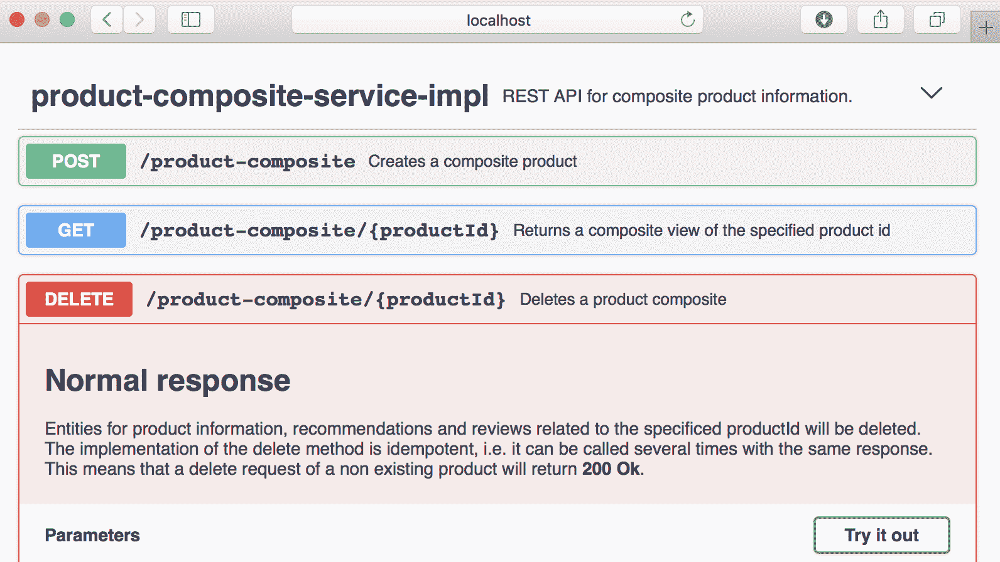

在本章后面，我们将使用 Swagger UI 来尝试新的组合 API 操作。

# 在集成层中添加方法

在我们能够实现组合服务中的新创建和删除 API 之前，我们需要扩展集成层，使其能够调用核心微服务 API 中的底层创建和删除操作。

调用三个核心微服务中的创建和删除操作的集成层方法简单且彼此相似，所以我们只查看调用`Product`微服务的方法的源代码。

`createProduct()`方法看起来像这样：

```java
@Override
public Product createProduct(Product body) {
    try {
        return restTemplate.postForObject(productServiceUrl, body, 
        Product.class);
    } catch (HttpClientErrorException ex) {
        throw handleHttpClientException(ex);
    }
}
```

它简单地将发送 HTTP 请求的责任委托给`RestTemplate`对象，并将错误处理委托给助手方法`handleHttpClientException`。

`deleteProduct()`方法看起来像这样：

```java
@Override
public void deleteProduct(int productId) {
    try {
        restTemplate.delete(productServiceUrl + "/" + productId);
    } catch (HttpClientErrorException ex) {
        throw handleHttpClientException(ex);
    }
}
```

它的实现方式与创建方法相同，但执行的是 HTTP 删除请求。

集成层完整的源代码可以在`product-composite`项目中的`se.magnus.microservices.composite.product.services.ProductCompositeIntegration`类中找到。

# 实现新的组合 API 操作

现在，我们可以实现组合的创建和删除方法！

组合的创建方法会将聚合产品对象拆分为`product`、`recommendation`和`review`的独立对象，并在集成层中调用相应的创建方法：

```java
@Override
public void createCompositeProduct(ProductAggregate body) {
    try {
        Product product = new Product(body.getProductId(), 
        body.getName(), body.getWeight(), null);
        integration.createProduct(product);

        if (body.getRecommendations() != null) {
            body.getRecommendations().forEach(r -> {
                Recommendation recommendation = new 
                Recommendation(body.getProductId(), 
                r.getRecommendationId(), r.getAuthor(), r.getRate(), 
                r.getContent(), null);
                integration.createRecommendation(recommendation);
            });
        }

        if (body.getReviews() != null) {
            body.getReviews().forEach(r -> {
                Review review = new Review(body.getProductId(), 
                r.getReviewId(), r.getAuthor(), r.getSubject(), 
                r.getContent(), null);
                integration.createReview(review);
            });
        }
    } catch (RuntimeException re) {
        LOG.warn("createCompositeProduct failed", re);
        throw re;
    }
}
```

组合的删除方法 simply calls the three delete methods in the integration layer to delete the corresponding entities in the underlying databases:

```java
@Override
public void deleteCompositeProduct(int productId) {
    integration.deleteProduct(productId);
    integration.deleteRecommendations(productId);
    integration.deleteReviews(productId);
}
```

完整的源代码，请参阅`product-composite`项目中的`se.magnus.microservices.composite.product.services.ProductCompositeServiceImpl`类。

对于快乐路径场景，这个实现会很好，但如果我们考虑各种错误场景，这个实现将会带来麻烦！

例如，如果底层的核心微服务之一暂时不可用，可能是由于内部、网络或数据库问题，那该怎么办？

这可能导致部分创建或删除的组合产品。对于删除操作，如果请求者简单地调用组合的删除方法直到成功，这可以得到修复。然而，如果底层问题持续一段时间，请求者可能会放弃，导致组合产品的不一致状态——在大多数情况下这是不可接受的！

在下一章第七章中，*开发反应式微服务*，我们将了解如何使用同步 API（如 RESTful API）来解决这些问题！

现在，让我们带着这个脆弱的设计继续前进。

# 更新组合服务测试：

正如在第三章中提到的*创建一组协作微服务*（参考*隔离微服务的自动化测试*部分），测试组合服务限于使用简单的模拟组件而不是实际的核心服务。这限制了我们测试更复杂场景的能力，例如，在尝试在底层数据库中创建重复项时的错误处理。组合的创建和删除 API 操作的测试相对简单：

```java
@Test
public void createCompositeProduct1() {
   ProductAggregate compositeProduct = new ProductAggregate(1, "name", 
   1, null, null, null);
   postAndVerifyProduct(compositeProduct, OK);
}

@Test
public void createCompositeProduct2() {
    ProductAggregate compositeProduct = new ProductAggregate(1, "name", 
        1, singletonList(new RecommendationSummary(1, "a", 1, "c")),
        singletonList(new ReviewSummary(1, "a", "s", "c")), null);
    postAndVerifyProduct(compositeProduct, OK);
}

@Test
public void deleteCompositeProduct() {
    ProductAggregate compositeProduct = new ProductAggregate(1, "name", 
        1,singletonList(new RecommendationSummary(1, "a", 1, "c")),
        singletonList(new ReviewSummary(1, "a", "s", "c")), null);
    postAndVerifyProduct(compositeProduct, OK);
    deleteAndVerifyProduct(compositeProduct.getProductId(), OK);
    deleteAndVerifyProduct(compositeProduct.getProductId(), OK);
}
```

完整的源代码，请参阅`product-composite`项目中的测试类，`se.magnus.microservices.composite.product.ProductCompositeServiceApplicationTests`。

接下来，我们将了解如何将数据库添加到 Docker Compose 的景观中。

# 向 Docker Compose 景观添加数据库：

现在，我们已经将所有源代码放到位。在我们能够启动微服务景观并尝试新的 API 以及新的持久层之前，我们必须启动一些数据库。

我们将把 MongoDB 和 MySQL 带入由 Docker Compose 控制的系统景观，并向我们的微服务添加配置，以便它们在运行时能够找到它们的数据库，无论是否作为 Docker 容器运行。

# Docker Compose 配置：

MongoDB 和 MySQL 在 Docker Compose 配置文件`docker-compose.yml`中声明如下：

```java
mongodb:
  image: mongo:3.6.9
  mem_limit: 350m
  ports:
    - "27017:27017"
  command: mongod --smallfiles

mysql:
  image: mysql:5.7
  mem_limit: 350m
  ports:
    - "3306:3306"
  environment:
    - MYSQL_ROOT_PASSWORD=rootpwd
    - MYSQL_DATABASE=review-db
    - MYSQL_USER=user
    - MYSQL_PASSWORD=pwd
  healthcheck:
    test: ["CMD", "mysqladmin" ,"ping", "-uuser", "-ppwd", "-h", "localhost"]
    interval: 10s
    timeout: 5s
    retries: 10
```

以下是从前面代码中观察到的：

1.  我们将使用官方的 MongoDB V3.6.9 和 MySQL 5.7 Docker 镜像，并将它们的默认端口`27017`和`3306`转发到 Docker 主机，在 Mac 上使用 Docker 时也可在`localhost`上访问。

1.  对于 MySQL，我们还声明了一些环境变量，定义如下：

    +   root 密码：

    +   将在图像启动时创建的数据库的名称：

    +   为在图像启动时为数据库设置的用户设置用户名和密码：

1.  对于 MySQL，我们还声明了一个健康检查，Docker 将运行该检查以确定 MySQL 数据库的状态。

为了避免微服务在数据库启动之前尝试连接到它们的数据库的问题，`product`和`recommendation`服务被声明为依赖于`mongodb`数据库，如下所示：

```java
product/recommendation:
 depends_on:
 - mongodb
```

这意味着 Docker Compose 将在启动`mongodb`容器后启动`product`和`recommendation`容器。

出于同样的原因，`review`服务被声明为依赖于`mysql`数据库：

```java
review:
  depends_on:
    mysql:
      condition: service_healthy
```

在这种情况下，`review`服务依赖于不仅启动了`mysql`容器，而且`mysql`容器的健康检查报告也正常。之所以采取这一额外步骤，是因为`mysql`容器的初始化包括设置数据库并创建数据库超级用户。这需要几秒钟，为了在完成此操作之前阻止`review`服务启动，我们指示 Docker Compose 在`mysql`容器通过其健康检查报告正常之前，不要启动`review`容器。

# 数据库连接配置

有了数据库之后，我们现在需要为核心微服务设置配置，以便它们知道如何连接到其数据库。这在每个核心微服务的配置文件`src/main/resources/application.yml`中进行设置，位于`product`，`recommendation`和`review`项目中。

`product`和`recommendation`服务的配置类似，所以我们只查看`product`服务的配置。以下配置部分值得关注：

```java
spring.data.mongodb:
  host: localhost
  port: 27017
  database: product-db

logging:
 level:
 org.springframework.data.mongodb.core.MongoTemplate: DEBUG

---
spring.profiles: docker

spring.data.mongodb.host: mongodb
```

以下是从前面代码中观察到的：

1.  在没有 Docker 的情况下运行，使用默认的 Spring 配置文件，期望数据库可以在`localhost:27017`上访问。

1.  将`MongoTemplate`的日志级别设置为`DEBUG`将允许我们查看在日志中执行了哪些 MongoDB 语句。

1.  在使用 Spring 配置文件运行 Docker 内部时，`Docker`，数据库期望可以在`mongodb:27017`上访问。

影响`review`服务如何连接其 SQL 数据库的配置如下所示：

```java
spring.jpa.hibernate.ddl-auto: update

spring.datasource:
  url: jdbc:mysql://localhost/review-db
  username: user
  password: pwd

spring.datasource.hikari.initializationFailTimeout: 60000

logging:
 level:
 org.hibernate.SQL: DEBUG
 org.hibernate.type.descriptor.sql.BasicBinder: TRACE

---
spring.profiles: docker

spring.datasource:
 url: jdbc:mysql://mysql/review-db
```

以下是从前面代码中观察到的：

1.  默认情况下，Spring Data JPA 将使用 Hibernate 作为 JPA 实体管理器。

1.  `spring.jpa.hibernate.ddl-auto`属性用于告诉 Spring Data JPA 在启动期间创建新的或更新现有的 SQL 表。

    **注意：**强烈建议在生产环境中将`spring.jpa.hibernate.ddl-auto`属性设置为`none`——这防止 Spring Data JPA 操作 SQL 表的结构。

1.  在没有 Docker 的情况下运行，使用默认的 Spring 配置文件，期望数据库可以在`localhost`上使用默认端口`3306`访问。

1.  默认情况下，Spring Data JPA 使用 HikariCP 作为 JDBC 连接池。为了在硬件资源有限的计算机上最小化启动问题，将`initializationFailTimeout`参数设置为 60 秒。这意味着 Spring Boot 应用程序在启动期间会等待最多 60 秒以建立数据库连接。

1.  Hibernate 的日志级别设置会导致 Hibernate 打印使用的 SQL 语句和实际值。请注意，在生产环境中，出于隐私原因，应避免将实际值写入日志。

1.  当使用 Spring 配置文件`Docker`在 Docker 内运行时，数据库预期可以通过`mysql`主机名使用默认端口`3306`可达。

# MongoDB 和 MySQL CLI 工具

为了能够运行数据库 CLI 工具，可以使用 Docker Compose `exec`命令。

本节描述的命令将在下一节的手动测试中使用。现在不要尝试运行它们；因为我们现在还没有运行数据库，所以它们会失败！

要启动 MongoDB CLI 工具`mongo`，在`mongodb`容器内运行以下命令：

```java
docker-compose exec mongodb mongo --quiet
>
```

输入`exit`以离开`mongo` CLI。

要启动 MySQL CLI 工具`mysql`，在`mysql`容器内并使用启动时创建的用户登录到`review-db`，请运行以下命令：

```java
docker-compose exec mysql mysql -uuser -p review-db
mysql>
```

`mysql` CLI 工具将提示您输入密码；您可以在`docker-compose.yml`文件中找到它。查找环境变量的值`MYSQL_PASSWORD`。

输入`exit`以离开`mysql` CLI。

我们将在下一节看到这些工具的使用。

如果您更喜欢图形数据库工具，您也可以本地运行它们，因为 MongoDB 和 MySQL 容器都将在本地主机上暴露它们的标准端口。

# 对新 API 和持久化层进行手动测试。

现在，终于可以启动一切并使用 Swagger UI 进行手动测试了。

使用以下命令构建并启动系统架构：

```java
cd $BOOK_HOME/Chapter06
./gradlew build && docker-compose build && docker-compose up
```

在网络浏览器中打开 Swagger UI，`http://localhost:8080/swagger-ui.html`，并在网页上执行以下步骤：

1.  点击产品组合服务实现（product-composite-service-impl）和 POST 方法以展开它们。

1.  点击尝试一下（Try it out）按钮并下移到正文字段。

1.  将`productId`字段的默认值`0`替换为`123456`。

1.  滚动到底部的执行按钮并点击它。

1.  验证返回的响应码是`200`。

点击执行按钮后的示例屏幕截图如下：

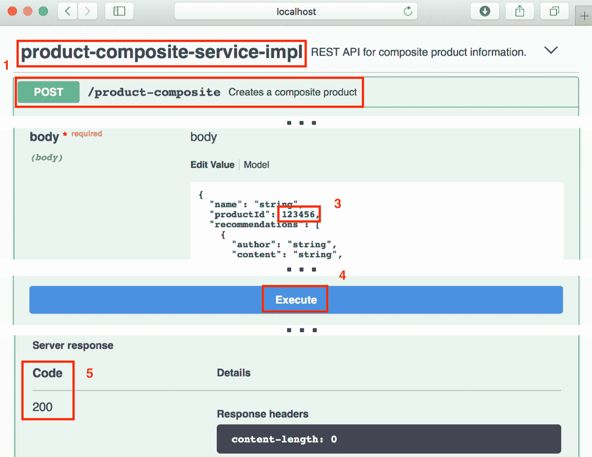

从`docker-compose up`命令的日志输出中，我们应该能够看到如下输出（为了提高可读性而简化）：

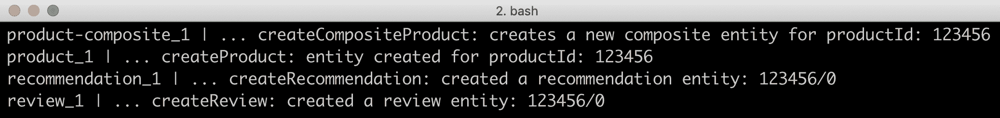

我们还可以使用数据库 CLI 工具来查看不同数据库中的实际内容。

在`product`服务中查找内容，即 MongoDB 中的`products`集合，使用以下命令：

```java
docker-compose exec mongodb mongo product-db --quiet --eval "db.products.find()"
```

期望得到如下响应：

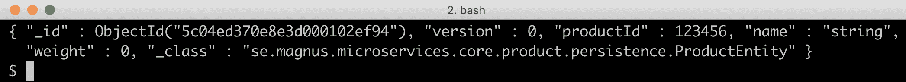

在`recommendation`服务中查找内容，即 MongoDB 中的`recommendations`集合，使用以下命令：

```java
docker-compose exec mongodb mongo recommendation-db --quiet --eval "db.recommendations.find()"
```

期望得到如下响应：

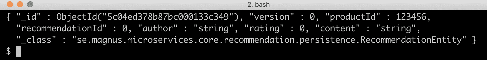10

在`review`服务中查找内容，即 MySQL 中的`reviews`表，使用以下命令：

```java
docker-compose exec mysql mysql -uuser -p review-db -e "select * from reviews"
```

`mysql` CLI 工具将提示您输入密码；您可以在`docker-compose.yml`文件中找到它。查找环境变量的值`MYSQL_PASSWORD`。预期得到如下响应：

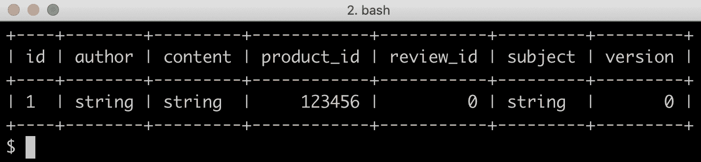

通过按下*Ctrl + C*中断`docker-compose up`命令，然后执行`docker-compose down`命令，可以关闭系统环境。之后，我们将看看如何在微服务环境中更新自动化测试。

# 更新微服务环境的自动化测试

微服务环境的自动化测试`test-em-all.bash`需要更新，以确保在运行测试之前，每个微服务数据库都处于已知状态。

脚本增加了一个设置函数`setupTestdata()`，该函数使用组合实体的创建和删除 API 将测试使用的产品重新创建到已知状态。

`setupTestdata`函数如下所示：

```java
function setupTestdata() {

    body=\
    '{"productId":1,"name":"product 1","weight":1, "recommendations":[
        {"recommendationId":1,"author":"author 
         1","rate":1,"content":"content 1"},
        {"recommendationId":2,"author":"author 
         2","rate":2,"content":"content 2"},
        {"recommendationId":3,"author":"author 
         3","rate":3,"content":"content 3"}
    ], "reviews":[
        {"reviewId":1,"author":"author 1","subject":"subject 
         1","content":"content 1"},
        {"reviewId":2,"author":"author 2","subject":"subject 
         2","content":"content 2"},
        {"reviewId":3,"author":"author 3","subject":"subject 
         3","content":"content 3"}
    ]}'
    recreateComposite 1 "$body"

    body=\
    '{"productId":113,"name":"product 113","weight":113, "reviews":[
    {"reviewId":1,"author":"author 1","subject":"subject 
     1","content":"content 1"},
    {"reviewId":2,"author":"author 2","subject":"subject 
     2","content":"content 2"},
    {"reviewId":3,"author":"author 3","subject":"subject 
     3","content":"content 3"}
]}'
    recreateComposite 113 "$body"

    body=\
    '{"productId":213,"name":"product 213","weight":213, 
    "recommendations":[
       {"recommendationId":1,"author":"author 
         1","rate":1,"content":"content 1"},
       {"recommendationId":2,"author":"author 
        2","rate":2,"content":"content 2"},
       {"recommendationId":3,"author":"author 
        3","rate":3,"content":"content 3"}
]}'
    recreateComposite 213 "$body"

}
```

它使用一个辅助函数`recreateComposite()`来对创建和删除 API 执行实际的请求：

```java
function recreateComposite() {
    local productId=$1
    local composite=$2

    assertCurl 200 "curl -X DELETE http://$HOST:$PORT/product-
    composite/${productId} -s"
    curl -X POST http://$HOST:$PORT/product-composite -H "Content-Type: 
    application/json" --data "$composite"
}
```

`setupTestdata`函数在`waitForService`函数之后直接调用：

```java
waitForService curl -X DELETE http://$HOST:$PORT/product-composite/13

setupTestdata
```

`waitForService`函数的主要目的是验证所有微服务是否都已启动并运行。在前一章节中，使用了组合产品服务的 get API。在本章节中，我们使用的是 delete API。使用 get API 时，如果找不到实体，只会调用产品核心微服务；推荐和`review`服务不会被调用以验证它们是否启动并运行。调用 delete API 也将确保`productId 13`的*未找到*测试成功。在本书的后面部分，我们将了解如何为检查微服务环境的运行状态定义特定的 API。

以下命令可执行更新后的测试脚本：

```java
cd $BOOK_HOME/Chapter06
./test-em-all.bash start stop
```

执行应该以编写如下日志消息结束：


这结束了微服务环境的自动化测试的更新。

# 总结

在本章节中，我们看到了如何使用 Spring Data 为核心微服务添加一个持久层。我们使用了 Spring Data 的核心概念，存储库和实体，在 MongoDB 和 MySQL 中以一种类似的编程模型存储数据，即使不是完全可移植的。我们还看到了 Spring Boot 的注解`@DataMongoTest`和`@DataJpaTest`如何用于方便地设置针对持久层的测试；在这种情况下，在测试运行之前自动启动嵌入式数据库，但不会启动微服务在运行时需要的其他基础架构，例如 Netty 这样的 web 服务器。这导致持久层测试易于设置，并且启动开销最小。

我们也看到了持久层如何被服务层使用，以及我们如何为创建和删除实体（包括核心和组合实体）添加 API。

最后，我们学习了使用 Docker Compose 在运行时启动 MongoDB 和 MySQL 等数据库是多么方便，以及如何使用新的创建和删除 API 在运行微服务基础系统景观的自动化测试之前设置测试数据。

然而，在本章中识别出了一个主要问题。使用同步 API 更新（创建或删除）复合实体——一个其部分存储在多个微服务中的实体——如果不成功更新所有涉及的微服务，可能会导致不一致。这通常是不可接受的。这引导我们进入下一章，我们将探讨为什么以及如何构建响应式微服务，即可扩展和健壮的微服务。

# 问题

1.  Spring Data 是一种基于实体和仓库的常见编程模型，可以用于不同类型的数据库引擎。从本章的源代码示例中，MySQL 和 MongoDB 的持久化代码最重要的区别是什么？

1.  实现乐观锁需要 Spring Data 提供什么？

1.  MapStruct 是用来做什么的？

1.  什么是幂等操作，为什么这很有用？

1.  我们如何在不使用 API 的情况下访问存储在 MySQL 和 MongoDB 数据库中的数据？
