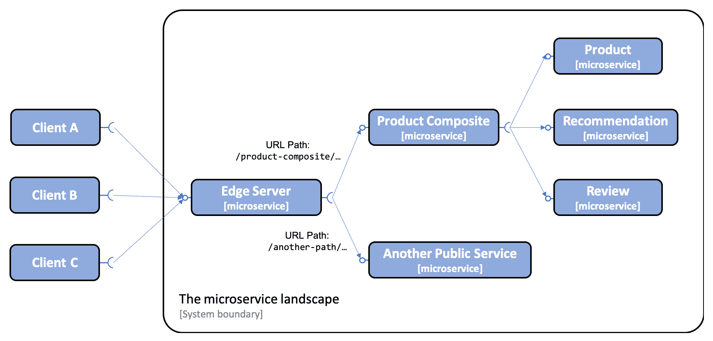

# 第八章：Spring Cloud 简介

迄今为止，我们已经了解了如何使用 Spring Boot 构建具有良好文档化 API 的微服务，以及 Spring WebFlux 和 SpringFox；使用 Spring Data for MongoDB 和 JPA 在 MongoDB 和 SQL 数据库中持久化数据；构建响应式微服务，无论是作为使用 Project Reactor 的非阻塞 API，还是作为使用 Spring Cloud Stream 与 RabbitMQ 或 Kafka 的事件驱动异步服务，以及 Docker；以及管理和测试由微服务、数据库和消息系统组成的系统架构。

现在，是时候看看我们如何使用**Spring Cloud**使我们的服务变得可生产、可扩展、健壮、可配置、安全且具有恢复能力。

在本章中，我们将向您介绍如何使用 Spring Cloud 实现以下设计模式，这些模式来自第一章的*微服务介绍*部分的*微服务设计模式*：

+   服务发现

+   边缘服务器

+   集中式配置

+   断路器

+   分布式跟踪

# 技术要求

本章不包含任何源代码，因此无需安装任何工具。

# Spring Cloud 的发展

在 2015 年 3 月的最初 1.0 版本中，Spring Cloud 主要是围绕 Netflix OSS 工具的包装器，如下所示：

+   Netflix Eureka，一个发现服务器

+   Netflix Ribbon，一个客户端负载均衡器

+   Netflix Zuul，一个边缘服务器

+   Netflix Hystrix，一个断路器

Spring Cloud 的初始版本还包含了一个配置服务器和与 Spring Security 的集成，后者提供了 OAuth 2.0 受保护的 API。2016 年 5 月，Brixton 版本（V1.1）的 Spring Cloud 正式发布。随着 Brixton 版本的发布，Spring Cloud 获得了对基于 Spring Cloud Sleuth 和 Zipkin 的分布式跟踪的支持，这些起源于 Twitter。这些最初的 Spring Cloud 组件可以用来实现前面提到的设计模式。有关详细信息，请参阅[`spring.io/blog/2015/03/04/spring-cloud-1-0-0-available-now`](https://spring.io/blog/2015/03/04/spring-cloud-1-0-0-available-now)和[`spring.io/blog/2016/05/11/spring-cloud-brixton-release-is-available`](https://spring.io/blog/2016/05/11/spring-cloud-brixton-release-is-available)。

自成立以来，Spring Cloud 在几年内已经显著增长，并增加了对以下内容的支持， among others:

+   基于 HashiCorp Consul 和 Apache Zookeeper 的服务发现和集中配置

+   使用 Spring Cloud Stream 的事件驱动微服务

+   诸如 Microsoft Azure、Amazon Web Services 和 Google Cloud Platform 这样的云提供商

请参阅[`spring.io/projects/spring-cloud`](https://spring.io/projects/spring-cloud)以获取完整的工具列表。

自 2019 年 1 月 Spring Cloud Greenwich（V2.1）发布以来，前面提到的 Netflix 工具中的一些已经在 Spring Cloud 中进入了维护模式。Spring Cloud 项目推荐以下替代品：

| **当前组件** | **被替换为** |
| --- | --- |
| Netflix Hystrix  | Resilience4j |
| Netflix Hystrix Dashboard/Netflix Turbine | Micrometer 和监控系统 |
| Netflix Ribbon | Spring Cloud 负载均衡器 |
| Netflix Zuul | Spring Cloud Gateway |

有关更多详细信息，例如维护模式意味着什么，请参阅[`spring.io/blog/2019/01/23/spring-cloud-greenwich-release-is-now-available`](https://spring.io/blog/2019/01/23/spring-cloud-greenwich-release-is-now-available)。

在这本书中，我们将使用替换选项来实现前面提到的设计模式。以下表格将每个设计模式映射到将要用来实现它们的软件组件：

| **设计模式** | **软件组件** |
| --- | --- |
| 服务发现 | Netflix Eureka 和 Spring Cloud 负载均衡器 |
| 边缘服务器 | Spring Cloud Gateway 和 Spring Security OAuth |
| 集中式配置 | Spring Cloud Configuration Server |
| 熔断器 | Resilience4j |
| 分布式追踪 | Spring Cloud Sleuth 和 Zipkin |

现在，让我们来回顾一下设计模式，并介绍将要用来实现它们的软件组件！

# 使用 Spring Cloud Gateway 作为边缘服务器

另一个非常重要的支持功能是边缘服务器。正如我们在第一章、*微服务简介*、*边缘服务器*部分已经描述过的，它可以用来保护微服务架构，即隐藏私有服务以防止外部使用，并在外部客户端使用公共服务时保护它们。

最初，Spring Cloud 使用 Netflix Zuul v1 作为其边缘服务器。自从 Spring Cloud Greenwich 版本以来，建议使用**Spring Cloud Gateway**代替。Spring Cloud Gateway 带有对关键功能的支持，例如基于 URL 路径的路由和通过使用 OAuth 2.0 和**OpenID Connect**（**OIDC**）保护端点。

Netflix Zuul v1 和 Spring Cloud Gateway 之间的一个重要区别是，Spring Cloud Gateway 基于非阻塞 API，使用 Spring 5、Project Reactor 和 Spring Boot 2，而 Netflix Zuul v1 基于阻塞 API。这意味着 Spring Cloud Gateway 应该能够处理比 Netflix Zuul v1 更多的并发请求，这对于所有外部流量都要经过的边缘服务器来说很重要。

以下图表显示了所有来自外部客户端的请求都通过 Spring Cloud Gateway 作为边缘服务器。基于 URL 路径，它将请求路由到预期的微服务：

在前面的图中，我们可以看到边缘服务器将发送具有以`/product-composite/`开始的 URL 路径的外部请求到**产品组合**微服务。核心服务**产品**、**推荐**和**评论**不能从外部客户端访问。

在第十章 *使用 Spring Cloud Gateway 将微服务隐藏在边缘服务器后面* 中，我们将查看如何为我们的微服务设置 Spring Cloud Gateway。

在第十一章 *保护 API 访问安全* 中，我们将了解如何使用 Spring Cloud Gateway 与 Spring Security OAuth2 一起保护边缘服务器的访问，通过 OAuth 2.0 和 OIDC 来实现。我们还将了解 Spring Cloud Gateway 如何在调用者身份信息（例如，调用者的用户名或电子邮件地址）下传播到我们的微服务中。

随着 Spring Cloud Gateway 的引入，让我们介绍一下如何使用 Spring Cloud Config 进行集中配置。
