# 第九章：使用 Netflix Eureka 和 Ribbon 添加服务发现

在本章中，我们将学习如何使用 Netflix Eureka 作为基于 Spring Boot 的微服务的发现服务器。为了使我们的微服务能够与 Netflix Eureka 通信，我们将使用 Netflix Eureka 客户端的 Spring Cloud 模块。在深入细节之前，我们将详细介绍为什么需要发现服务器以及为什么 DNS 服务器是不够的。

本章将涵盖以下主题：

+   服务发现简介

    +   DNS 基于的服务发现的问题

    +   服务发现面临的挑战

    +   使用 Netflix Eureka 在 Spring Cloud 中的服务发现

+   设置 Netflix Eureka 服务器

+   将微服务连接到 Netflix Eureka 服务器

+   为开发过程设置配置

+   尝试服务发现服务

# 介绍服务发现

在第一章*微服务简介*中描述了服务发现的概念；请参阅*服务发现*部分以获取更多信息。在第八章*Spring Cloud 简介*中介绍了 Netflix Eureka 作为发现服务；请参阅*Netflix Eureka 作为发现服务*部分以获取更多信息。在深入了解实现细节之前，我们将讨论以下主题：

+   DNS 基于的服务发现的问题

+   服务发现面临的挑战

+   使用 Netflix Eureka 在 Spring Cloud 中的服务发现

# DNS 基于的服务发现的问题

那么问题是什么？

为什么我们不能简单地启动微服务的新实例，并依赖轮询 DNS 呢？本质上，由于微服务实例具有相同的 DNS 名称，DNS 服务器将解析为可用实例的 IP 地址列表。因此，客户端可以以轮询方式调用服务实例。

让我们试试看会发生什么，好吗？请按照以下步骤操作：

1.  假设你已经按照第七章*开发反应式微服务*的说明操作，使用以下命令启动系统架构并向其中插入一些测试数据：

```java
cd $BOOK_HOME/chapter07
./test-em-all.bash start
```

1.  将`review`微服务扩展到两个实例：

```java
docker-compose up -d --scale review=2
```

1.  询问复合产品服务为`review`微服务找到的 IP 地址：

```java
docker-compose exec product-composite getent hosts review
```

1.  期待如下回答：

```java
172.19.0.9 review
172.19.0.8 review
```

太好了，复合产品服务看到了两个 IP 地址——在我的情况下，`172.19.0.8`和`172.19.0.9`——分别为`review`微服务的每个实例！

1.  如果你想验证这些确实是正确的 IP 地址，可以使用以下命令：

```java
docker-compose exec --index=1 review cat /etc/hosts
docker-compose exec --index=2 review cat /etc/hosts
```

每个命令的输出最后一行应包含一个 IP 地址，如前所示。

1.  现在，让我们尝试对复合产品服务进行几次调用，看看它是否使用了`review`微服务的两个实例：

```java
curl localhost:8080/product-composite/2 -s | jq -r .serviceAddresses.rev
```

不幸的是，我们只能从其中一个微服务实例获得响应，如这个例子所示：

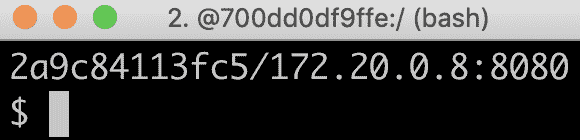

那真是令人失望！

好吧，这里发生了什么事？

一个 DNS 客户端通常缓存已解析的 IP 地址，并在收到已为 DNS 名称解析的 IP 地址列表时，保留它尝试的第一个有效 IP 地址。DNS 服务器或 DNS 协议都不适合处理时而出现时而消失的微服务实例。因此，基于 DNS 的服务发现从实际角度来看并不很有吸引力。

# 使用 Spring Cloud Config 进行集中配置

为了管理微服务系统架构的配置，Spring Cloud 包含 Spring Cloud Config，它根据第一章中描述的要求，提供集中管理配置文件的功能，该章节为*微服务介绍*中的*集中配置*部分。

Spring Cloud Config 支持将配置文件存储在多种不同的后端中，例如以下后端：

+   一个 Git 仓库，例如，在 GitHub 或 Bitbucket 上

+   本地文件系统

+   HashiCorp Vault

+   一个 JDBC 数据库

Spring Cloud Config 允许我们以分层结构处理配置；例如，我们可以将配置的通用部分放在一个公共文件中，将微服务特定的设置放在单独的配置文件中。

Spring Cloud Config 还支持检测配置变化并将通知推送给受影响的微服务。它使用**Spring Cloud Bus**来传输通知。Spring Cloud Bus 是我们已经熟悉的 Spring Cloud Stream 的抽象；也就是说，它支持使用 RabbitMQ 或 Kafka 作为消息系统来传输通知。

以下图表说明了 Spring Cloud Config、其客户端、Git 仓库和 Spring Cloud Bus 之间的协作：

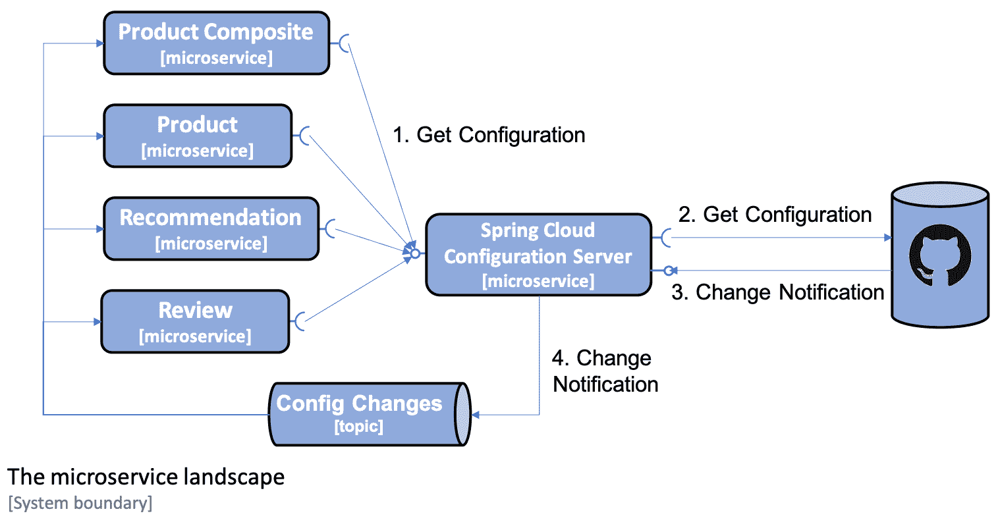

该图显示了以下内容：

1.  当微服务启动时，它们会向配置服务器请求其配置。

1.  配置服务器从这个例子中的 Git 仓库获取配置。

1.  可选地，Git 仓库可以配置为在 Git 提交推送到 Git 仓库时向配置服务器发送通知。

1.  配置服务器将使用 Spring Cloud Bus 发布变更事件。受到变更影响的微服务将做出反应，并从配置服务器获取其更新的配置。

最后，Spring Cloud Config 还支持对配置中的敏感信息进行加密，例如凭据。

我们将在第十二章中学习 Spring Cloud Config，*集中配置*。

随着 Spring Cloud Config 的引入，让我们了解一下如何使用 Resilience4j 提高韧性。

# 使用 Resilience4j 提高韧性

正如我们在第一章**微服务介绍**中已经提到的，*在电路断路器*部分，事情偶尔会出错。在一个相当大规模的微服务合作系统中，我们必须假设任何时候都在出现问题。失败必须被视为一种正常状态，系统景观必须设计成能够处理它！

最初，Spring Cloud 随 Netflix Hystrix 一起提供，这是一个经过验证的电路断路器。但是自从 Spring Cloud Greenwich 版本发布以来，建议将 Netflix Hystrix 替换为 Resilience4j。原因是 Netflix 最近将 Hystrix 置于维护模式。有关详细信息，请参阅[`github.com/Netflix/Hystrix#hystrix-status`](https://github.com/Netflix/Hystrix#hystrix-status)。

**Resilience4j**是一个基于开源的容错库。您可以在[`github.com/resilience4j/resilience4j`](http://resilience4j.github.io/resilience4j/)了解更多信息。它内置了以下容错机制：

+   **电路断路器**用于防止远程服务停止响应时的故障连锁反应。

+   **速率限制器**用于在指定时间段内限制对服务的请求数量。

+   **舱壁**用于限制对服务的并发请求数量。

+   **重试**用于处理可能时不时发生的随机错误。

+   **超时**用于避免等待慢速或无响应服务的响应时间过长。

在第十三章**使用 Resilience4j 提高韧性**中，我们将重点关注 Resilience4j 中的电路断路器。它遵循以下状态图所示的经典电路断路器设计：

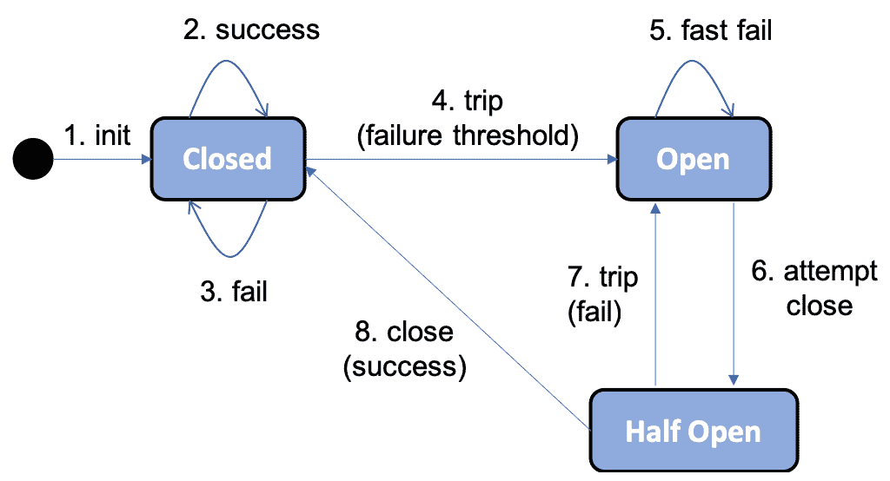

让我们更详细地查看状态图：

1.  一个**电路断路器**开始时是**关闭**的，也就是说，允许请求被处理。

1.  只要请求成功处理，它就保持在**关闭**状态。

1.  如果开始出现故障，一个计数器开始递增。

1.  如果达到配置的失败阈值，电路断路器将**跳闸**，也就是说，进入**打开**状态，不允许进一步处理请求。

1.  相反，请求将**快速失败**，也就是说，立即返回异常。

1.  在可配置的时间后，电路断路器将进入**半开**状态，并允许一个请求通过，如一个探针，以查看故障是否已解决。

1.  如果探针请求失败，电路断路器回到**打开**状态。

1.  如果探针请求成功，电路断路器回到初始**关闭**状态，也就是说，允许处理新请求。

# Resilience4j 中电路断路器的示例用法

假设我们有一个通过 Resilience4j 实现的带有熔断器的 REST 服务，称为`myService`。

如果服务开始产生内部错误，例如，因为它无法访问它依赖的服务，我们可能会从服务中得到如`500 Internal Server Error`的响应。在经过一系列可配置的尝试后，电路将会打开，我们将得到一个快速失败，返回一个如`CircuitBreaker 'myService' is open`的错误消息。当错误解决后（在可配置的等待时间后）我们进行新的尝试，熔断器将允许作为探测器的新的尝试。如果调用成功，熔断器将再次关闭；也就是说，它正在正常运行。

当与 Spring Boot 一起使用 Resilience4j 时，我们能够通过 Spring Boot Actuator 的`health`端点监控微服务中的熔断器状态。例如，我们可以使用`curl`查看熔断器的状态，即`myService`：

```java
curl $HOST:$PORT/actuator/health -s | jq .details.myServiceCircuitBreaker
```

如果它正常运行，即电路`关闭`，它会响应一些如下类似的内容：

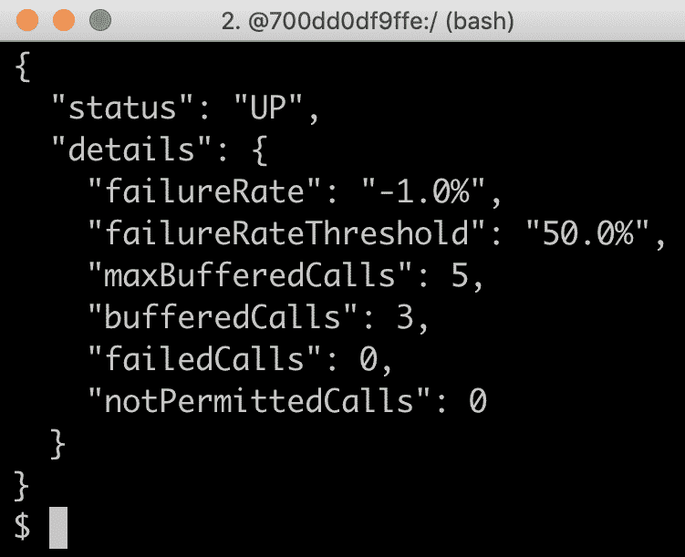

如果出了问题且电路**打开**，它会响应一些如下类似的内容：

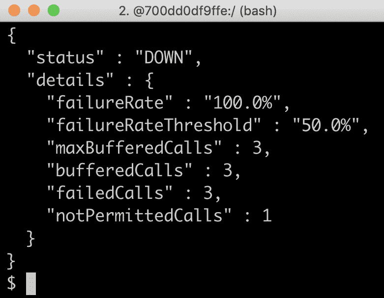

有了 Resilience4j 以及特别介绍的它的熔断器，我们看到了一个例子，说明熔断器可以如何用于处理 REST 客户端的错误。让我们了解一下如何使用 Spring Cloud Sleuth 和 Zipkin 进行分布式追踪。

# 使用 Spring Cloud Sleuth 和 Zipkin 进行分布式追踪。

要理解分布式系统（如合作微服务的系统景观）中发生了什么，能够追踪和可视化处理系统景观的外部调用时请求和消息在微服务之间的流动至关重要。

参阅第一章，*微服务简介*，*分布式追踪*部分，了解有关这个主题的更多信息。

Spring Cloud 自带**Spring Cloud Sleuth**，它可以标记属于同一处理流程的请求和消息/事件，使用共同的相关 ID。

Spring Cloud Sleuth 还可以用相关 ID 装饰日志消息，以便更容易追踪来自相同处理流程的不同微服务日志消息.**Zipkin**是一个分布式追踪系统（[`zipkin.io`](http://zipkin.io/)），Spring Cloud Sleuth 可以将追踪数据发送到该系统进行存储和可视化。

Spring Cloud Sleuth 和 Zipkin 处理分布式追踪信息的基础架构基于 Google Dapper([`ai.google/research/pubs/pub36356`](https://ai.google/research/pubs/pub36356)). 在 Dapper 中，来自完整工作流的追踪信息称为**追踪树**，树的部分，如工作基本单元，称为**跨度**。 跨度可以进一步由子跨度组成，形成追踪树。 一个关联 ID 称为`TraceId`，跨度由其唯一的`SpanId`以及它所属的追踪树的`TraceId`来标识。

Spring Cloud Sleuth 可以通过 HTTP 同步或使用 RabbitMQ 或 Kafka 异步发送请求到 Zipkin。 为了避免从我们的微服务中创建对 Zipkin 服务器的运行时依赖，我们更倾向于异步使用 RabbitMQ 或 Kafka 将追踪信息发送到 Zipkin。 这如下面的图表所示：

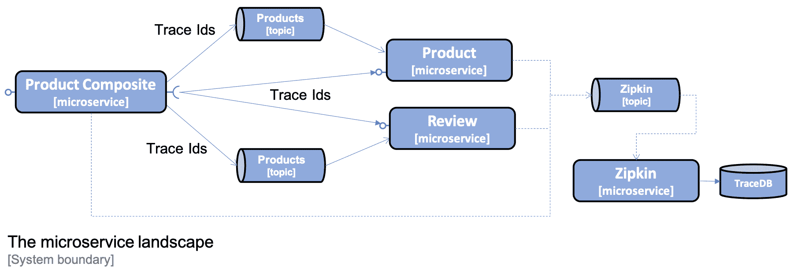

在第十四章中，*理解分布式追踪*，我们将了解如何使用 Spring Cloud Sleuth 和 Zipkin 来追踪我们微服务架构中进行的处理。以下是来自 Zipkin UI 的屏幕截图，它可视化了创建聚合产品处理结果所生成的追踪树：

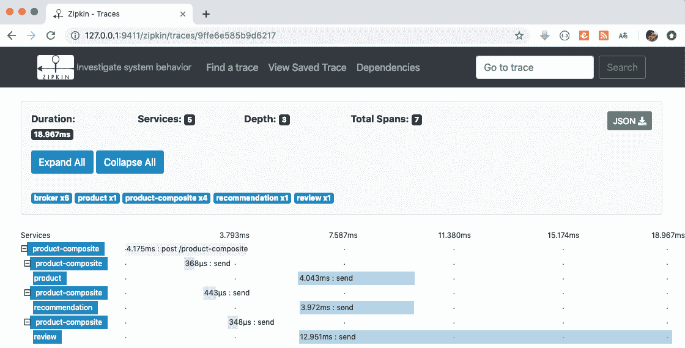

一个 HTTP `POST`请求发送到产品组合服务，并通过发布创建事件到产品、推荐和评论的主题来响应。 这些事件被三个核心微服务并行消费，并且创建事件中的数据存储在每个微服务的数据库中。

随着 Spring Cloud Sleuth 和 Zipkin 分布式追踪的引入，我们看到了一个例子，该例子追踪了一个外部同步 HTTP 请求的处理，包括涉及微服务之间异步传递事件的分布式追踪。

# 总结

在本章中，我们看到了 Spring Cloud 如何从较为 Netflix OSS 中心演变成今天的范围更广。 我们还介绍了如何使用 Spring Cloud Greenwich 的最新版本来实现我们*微服务介绍*章节中描述的设计模式，在*微服务设计模式*部分。 这些设计模式是使一组合作的微服务准备好生产环境的必要条件。

翻到下一章，了解我们如何使用 Netflix Eureka 和 Spring Cloud 负载均衡器实现服务发现！

# 问题

1.  Netflix Eureka 的目的是什么？

1.  Spring Cloud Gateway 的主要特性是什么？

1.  Spring Cloud Config 支持哪些后端？

1.  Resilience4j 提供了哪些功能？

1.  分布式跟踪中 trace tree 和 span 的概念是什么，定义它们的论文叫什么？

# 技术要求

本书中描述的所有命令都是在 MacBook Pro 上使用 macOS Mojave 运行的，但是修改起来应该很容易，使其可以在其他平台上运行，例如 Linux 或 Windows。

在本章中不需要安装任何新工具。

本章的源代码可以在 GitHub 上找到：[`github.com/PacktPublishing/Hands-On-Microservices-with-Spring-Boot-and-Spring-Cloud/tree/master/Chapter09`](https://github.com/PacktPublishing/Hands-On-Microservices-with-Spring-Boot-and-Spring-Cloud/tree/master/Chapter09)。

为了能够运行本书中描述的命令，将源代码下载到文件夹中，并设置一个环境变量`$BOOK_HOME`，使其指向该文件夹。一些示例命令如下：

```java
export BOOK_HOME=~/Documents/Hands-On-Microservices-with-Spring-Boot-and-Spring-Cloud
git clone https://github.com/PacktPublishing/Hands-On-Microservices-with-Spring-Boot-and-Spring-Cloud $BOOK_HOME
cd $BOOK_HOME/Chapter09
```

本章的 Java 源代码是为 Java 8 编写的，并在 Java 12 上进行了测试。本章使用 Spring Cloud 2.1.0（也称为**Greenwich**版本），Spring Boot 2.1.3 和 Spring 5.1.5，即在本章撰写时可用的 Spring 组件的最新版本。

源代码包含了以下 Gradle 项目：

+   `api`

+   `util`

+   `microservices/product-service`

+   `microservices/review-service`

+   `microservices/recommendation-service`

+   `microservices/product-composite-service`

+   `spring-cloud/eureka-server`

本章中的代码示例都来自`$BOOK_HOME/Chapter09`目录中的源代码，但在多个地方进行了编辑，以删除源代码中不相关的内容，例如注释和导入日志语句。

如果你想查看在第九章中应用于源代码的更改，*使用 Netflix Eureka 和 Ribbon 添加服务发现*，以了解向微服务架构添加 Netflix Eureka 作为发现服务所需的内容，你可以将其与第七章的源代码进行比较，*开发反应式微服务*。你可以使用你喜欢的`diff`工具，分别比较两个文件夹，`$BOOK_HOME/Chapter07`和`$BOOK_HOME/Chapter09`。

# 服务发现的问题

因此，我们需要比普通的 DNS 更强大的东西来跟踪可用的微服务实例！

当我们跟踪许多小的移动部件，即微服务实例时，我们必须考虑以下几点：

+   新的实例可以在任何时间点启动。

+   现有的实例在任何时间点都可能停止响应并最终崩溃。

+   一些失败的实例可能过一会儿就没事了，应该重新开始接收流量，而其他的则不应该，应该从服务注册表中删除。

+   一些微服务实例可能需要一些时间来启动；也就是说，仅仅因为它们能够接收 HTTP 请求，并不意味着应该将流量路由到它们那里。

+   无意中的网络分区和其他网络相关错误可能会随时发生。

构建一个健壮和有弹性的发现服务器绝非易事。让我们看看我们如何可以使用 Netflix Eureka 来应对这些挑战！

# 使用 Spring Cloud 中的 Netflix Eureka 进行服务发现

Netflix Eureka 实现了客户端服务发现，这意味着客户端运行与发现服务（Netflix Eureka）通信的软件，以获取有关可用微服务实例的信息。以下图表说明了这一点：

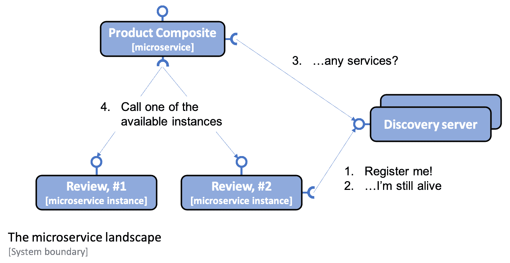

流程如下：

1.  每当一个微服务实例启动时—例如，**Review**服务—它会将自己注册到其中一个 Eureka 服务器上。

1.  每个微服务实例定期向 Eureka 服务器发送心跳消息，告诉它该微服务实例是正常的，并准备好接收请求。

1.  客户端—例如，**Product Composite**服务—使用一个客户端库，该库定期向 Eureka 服务询问有关可用服务的信息。

1.  当客户端需要向另一个微服务发送请求时，它已经在客户端库中有一个可用实例的列表，可以选择其中的一个，而不需要询问发现服务器。通常，可用实例是按照轮询方式选择的；也就是说，它们是依次调用，然后再重新调用第一个。

在第十七章中，*作为替代的 Kubernetes 特性实现*，我们将探讨一种替代方法，使用 Kubernetes 中的服务器端*服务*概念来提供发现服务。

Spring Cloud 包含如何与发现服务（如 Netflix Eureka）通信的抽象，并提供了一个名为`DiscoveryClient`的接口。这可以用来与发现服务进行交互，获取有关可用服务和实例的信息。`DiscoveryClient`接口的实现也能够在启动时自动将 Spring Boot 应用程序注册到发现服务器上。

Spring Boot 可以在启动过程中自动找到`DiscoveryClient`接口的实现，因此我们只需要引入对应实现的依赖项即可连接到发现服务器。在 Netflix Eureka 的情况下，我们微服务所使用的依赖是`spring-cloud-starter-netflix-eureka-client`。

Spring Cloud 还有支持使用 Apache Zookeeper 或 HashiCorp Consul 作为发现服务器的`DiscoveryClient`实现。

Spring Cloud 还提供了一个抽象——`LoadBalancerClient`接口——对于希望通过负载均衡器向发现服务中的注册实例发起请求的客户端。标准反应式 HTTP 客户端`WebClient`可以配置为使用`LoadBalancerClient`实现。通过在返回`WebClient.Builder`对象的`@Bean`声明上添加`@LoadBalanced`注解，`LoadBalancerClient`实现将被注入到`Builder`实例中作为`ExchangeFilterFunction`。由于在类路径上有`spring-cloud-starter-netflix-eureka-client`依赖项，`RibbonLoadBalancerClient`将自动注入，即基于 Netflix Ribbon 的负载均衡器。所以，即使 Netflix Ribbon 已进入维护模式，如在第八章*Spring Cloud 介绍*中描述，它仍然在幕后使用。在本章后面的*将微服务连接到 Netflix Eureka 服务器*部分，我们将查看一些源代码示例，了解如何使用它。

总之，Spring Cloud 让使用 Netflix Eureka 作为发现服务变得非常简单。通过介绍服务发现及其挑战以及 Netflix Eureka 如何与 Spring Cloud 一起使用，我们准备好学习如何设置一个 Netflix Eureka 服务器。

# 尝试使用发现服务

所有细节就绪后，我们就可以尝试服务了：

1.  首先，使用以下命令构建 Docker 镜像：

```java
cd $BOOK_HOME/Chapter09
./gradlew build && docker-compose build
```

1.  接下来，使用以下命令启动系统架构并执行常规测试：

```java
./test-em-all.bash start
```

预期输出与我们在前面的章节中看到的内容类似：

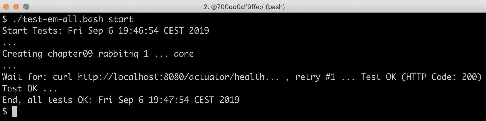

系统架构运行起来后，我们可以开始测试如何扩展其中一个微服务实例的数量。

# 设置 Netflix Eureka 服务器

在本节中，我们将学习如何为服务发现设置一个 Netflix Eureka 服务器。使用 Spring Cloud 设置 Netflix Eureka 服务器真的很容易——只需按照以下步骤操作：

1.  使用 Spring Initializr 创建一个 Spring Boot 项目，具体操作见第三章*创建一组协作的微服务*中的*使用 Spring Initializr 生成骨架代码*部分。

1.  添加`spring-cloud-starter-netflix-eureka-server`依赖项。

1.  在应用程序类上添加`@EnableEurekaServer`注解。

1.  添加一个 Dockerfile，与用于我们的微服务的 Dockerfile 类似，不同之处在于我们导出 Eureka 默认端口`8761`，而不是我们微服务默认端口`8080`。

1.  把我们三个 Docker Compose 文件中添加 Eureka 服务器，即`docker-compose.yml`、`docker-compose-partitions.yml`和`docker-compose-kafka.yml`：

```java
eureka:
  build: spring-cloud/eureka-server
  mem_limit: 350m
  ports:
    - "8761:8761"
```

1.  最后，请转到本章的*设置开发过程中使用的配置*部分，我们将介绍 Eureka 服务器和我们的微服务的配置。

这就完成了！

您可以在`$BOOK_HOME/Chapter09/spring-cloud/eureka-server`文件夹中找到 Eureka 服务器的源代码。

了解如何为服务发现设置一个 Netflix Eureka 服务器后，我们准备学习如何将微服务连接到 Netflix Eureka 服务器。

# 将微服务连接到 Netflix Eureka 服务器

在本节中，我们将学习如何将微服务实例连接到 Netflix Eureka 服务器。我们将了解微服务实例在启动时如何向 Eureka 服务器注册自己，以及客户端如何使用 Eureka 服务器找到它想要调用的微服务实例。

为了能够在 Eureka 服务器中注册一个微服务实例，我们需要执行以下操作：

1.  在构建文件`build.gradle`中添加`spring-cloud-starter-netflix-eureka-client`依赖项：

```java
implementation('org.springframework.cloud:spring-cloud-starter-netflix-eureka-client')
```

1.  当在单个微服务上运行测试时，我们不希望依赖于 Eureka 服务器的运行。因此，我们将禁用所有 Spring Boot 测试中使用 Netflix Eureka，即使用`@SpringBootTest`注解的 JUnit 测试。这可以通过在注解中添加`eureka.client.enabled`属性并将其设置为`false`来实现，如下所示：

```java
@SpringBootTest(webEnvironment=RANDOM_PORT, properties = {"eureka.client.enabled=false"})
```

1.  最后，请转到*设置开发过程中使用的配置*部分，我们将介绍 Eureka 服务器和我们的微服务的配置。

然而，在配置中有一个非常重要的属性：`spring.application.name`。它用于给每个微服务一个虚拟主机名，即 Eureka 服务用来识别每个微服务的名称。Eureka 客户端将在用于向微服务发起 HTTP 调用的 URL 中使用这个虚拟主机名，正如我们接下来所看到的。

为了能够在`product-composite`微服务中通过 Eureka 服务器查找可用的微服务实例，我们还需要执行以下操作：

1.  在应用程序类中，即`se.magnus.microservices.composite.product.ProductCompositeServiceApplication`，添加一个负载均衡意识`WebClient`构建器，如前所述：

```java
@Bean
@LoadBalanced
public WebClient.Builder loadBalancedWebClientBuilder() {
  final WebClient.Builder builder = WebClient.builder();
  return builder;
}
```

1.  更新在集成类`se.magnus.microservices.composite.product.services.ProductCompositeIntegration`中`WebClient`对象的创建方式。如前所述，`@LoadBalanced`注解会导致 Spring 向`WebClient.Builder`bean 中注入一个负载均衡器感知过滤器。不幸的是，在集成类的构造函数运行之后才执行这个操作。这意味着我们必须将`webClient`的构造从构造函数中移开，就像在第七章，*开发响应式微服务*中做的那样，移到一个单独的 getter 方法，该方法延迟创建`webClient`，即在第一次使用时创建。以下代码显示了这一点：

```java
private WebClient getWebClient() {
    if (webClient == null) {
        webClient = webClientBuilder.build();
    }
    return webClient;
}
```

1.  每当使用`WebClient`创建一个出站 HTTP 请求时，它是通过`getWebClient()`getter 方法访问的（而不是直接使用`webClient`字段）。以下示例说明了这一点：

```java
@Override
public Mono<Product> getProduct(int productId) {
    String url = productServiceUrl + "/product/" + productId;
    return getWebClient().get().uri(url).retrieve()
        .bodyToMono(Product.class).log()
        .onErrorMap(WebClientResponseException.class, ex -> handleException(ex));
}
```

1.  现在我们可以摆脱在`application.yml`中硬编码的可用微服务配置。例如，考虑以下代码：

```java
app:
  product-service:
    host: localhost
    port: 7001
  recommendation-service:
    host: localhost
    port: 7002
  review-service:
    host: localhost
    port: 7003
```

处理硬编码配置的集成类中相应的代码被替换为声明核心微服务 API 的基本 URL。以下代码显示了这一点：

```java
private final String productServiceUrl = "http://product";
private final String recommendationServiceUrl = "http://recommendation";
private final String reviewServiceUrl = "http://review";
```

前述 URL 中的主机名不是实际的 DNS 名称。相反，它们是微服务在向 Eureka 服务器注册时使用的虚拟主机名，即`spring.application.name`属性的值。

知道如何将微服务实例连接到 Netflix Eureka 服务器后，我们可以继续学习如何配置 Eureka 服务器以及需要连接到 Eureka 服务器的微服务实例。

# 为开发过程设置配置

现在，是设置 Netflix Eureka 作为发现服务最棘手的部分的时候了，也就是说，为 Eureka 服务器及其客户端（即我们的微服务实例）设置一个工作配置。

Netflix Eureka 是一个高度可配置的发现服务器，可以设置为多种不同的使用场景，并提供健壮、弹性、容错性强的运行时特性。这种灵活性和健壮性的一个缺点是，它有令人望而生畏的大量配置选项。幸运的是，Netflix Eureka 为大多数可配置参数提供了良好的默认值——至少在使用它们的生产环境来说是这样。

当在开发过程中使用 Netflix Eureka 时，默认值会导致长时间启动。例如，客户端首次成功调用注册在 Eureka 服务器中的微服务实例可能需要很长时间。

使用默认配置值时，可能会经历长达两分钟的等待时间。这种等待时间是在 Eureka 服务及其微服务启动所需的时间之上加上的。这段等待时间的原因是涉及到的进程需要彼此同步注册信息。

微服务实例需要向 Eureka 服务器注册，客户端需要从 Eureka 服务器获取信息。这种通信主要基于心跳，默认每 30 秒发生一次。还有几个缓存也涉及其中，这减缓了更新的传播。

我们将使用一种减少等待时间的配置，这在开发时很有用。对于生产环境，应该以默认值作为起点！

我们只使用一个 Netflix Eureka 服务器实例，这在开发环境中是可以的。在生产环境中，为了确保 Netflix Eureka 服务器的高可用性，你应该始终使用两个或更多的实例。

让我们开始了解我们需要知道哪些类型的配置参数。

# Eureka 配置参数

对于 Eureka 的配置参数分为三组：

+   有用于 Eureka 服务器的参数，前缀为`eureka.server`。

+   有用于 Eureka 客户端的参数，前缀为`eureka.client`。这是用于与 Eureka 服务器通信的客户端。

+   有用于 Eureka 实例的参数，前缀为`eureka.instance`。这是用于希望在 Eureka 服务器上注册自己的微服务实例。

一些可用的参数在 Spring Cloud 文档中有描述：*服务发现：Eureka 服务器*：[`cloud.spring.io/spring-cloud-static/Greenwich.RELEASE/single/spring-cloud.html#spring-cloud-eureka-server`](https://cloud.spring.io/spring-cloud-static/Greenwich.RELEASE/single/spring-cloud.html#spring-cloud-eureka-server) *服务发现：Eureka 客户端*：[`cloud.spring.io/spring-cloud-static/Greenwich.RELEASE/single/spring-cloud.html#_service_discovery_eureka_clients`](https://cloud.spring.io/spring-cloud-static/Greenwich.RELEASE/single/spring-cloud.html#_service_discovery_eureka_clients)

要获取可用参数的详细列表，我建议阅读源代码：

+   对于 Eureka 服务器参数，你可以查看`org.springframework.cloud.netflix.eureka.server.EurekaServerConfigBean`类以获取默认值和`com.netflix.eureka.EurekaServerConfig`接口的相关文档。

+   对于 Eureka 客户端参数，你可以查看`org.springframework.cloud.netflix.eureka.EurekaClientConfigBean`类以获取默认值和文档。

+   对于 Eureka 实例参数，你可以查看`org.springframework.cloud.netflix.eureka.EurekaInstanceConfigBean`类以获取默认值和文档。

让我们开始了解 Eureka 服务器的配置参数。

# 配置 Eureka 服务器

为了在开发环境中配置 Eureka 服务器，可以使用以下配置：

```java
server:
  port: 8761

eureka:
  instance:
    hostname: localhost
  client:
    registerWithEureka: false
    fetchRegistry: false
    serviceUrl:
      defaultZone: http://${eureka.instance.hostname}:${server.port}/eureka/

  server:
    waitTimeInMsWhenSyncEmpty: 0
    response-cache-update-interval-ms: 5000
```

Eureka 服务器的配置第一部分，对于一个`instance`（实例）和`client`（客户端）是一个独立 Eureka 服务器的标准配置。详细信息，请参阅我们之前引用的 Spring Cloud 文档。用于 Eureka`server`（服务器）的最后两个参数`waitTimeInMsWhenSyncEmpty`和`response-cache-update-interval-ms`用于最小化启动时间。

配置了 Eureka 服务器之后，我们准备看看如何配置 Eureka 服务器的客户端，即微服务实例。

# 配置 Eureka 服务器的客户端

为了能够连接到 Eureka 服务器，微服务具有以下配置：

```java
eureka:
  client:
    serviceUrl:
 defaultZone: http://localhost:8761/eureka/
 initialInstanceInfoReplicationIntervalSeconds: 5
 registryFetchIntervalSeconds: 5
 instance:
 leaseRenewalIntervalInSeconds: 5
 leaseExpirationDurationInSeconds: 5

---
spring.profiles: docker

eureka.client.serviceUrl.defaultZone: http://eureka:8761/eureka/
```

`eureka.client.serviceUrl.defaultZone`参数用于查找 Eureka 服务器，而其他参数用于最小化启动时间和停止微服务实例的时间。

使用 Eureka 服务器查找其他微服务的`product-composite`微服务也有两个 Netflix Ribbon 特定参数：

```java
ribbon.ServerListRefreshInterval: 5000
ribbon.NFLoadBalancerPingInterval: 5
```

这两个参数也用于最小化启动时间。

现在，我们已经有了在 Netflix Eureka 服务器和我们的微服务中实际尝试发现服务所需的一切。

# 扩展

现在，我们可以通过启动两个额外的`review`微服务实例来尝试发现服务：

```java
docker-compose up -d --scale review=3
```

使用前面的命令，我们要求 Docker Compose 运行`review`服务的三个实例。由于一个实例已经在运行，将启动两个新实例。

一旦新实例启动并运行，浏览到`http://localhost:8761/`，预期如下所示：

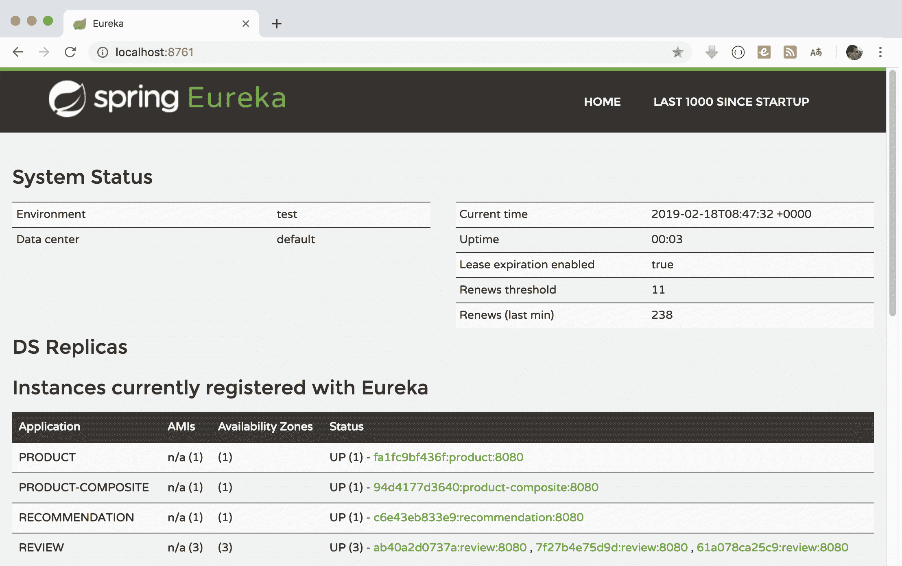

在运行此 localhost 之后，验证您是否可以在 Netflix Eureka web UI 中看到三个`review`实例，如前截图所示。

知道新实例何时启动并运行的一种方法是运行`docker-compose logs -f review`命令，并查找如下所示的输出：

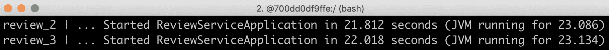

我们还可以使用 Eureka 服务暴露的 REST API。为了获取实例 ID 列表，我们可以发出如下`curl`命令：

```java
curl -H "accept:application/json" localhost:8761/eureka/apps -s | jq -r .applications.application[].instance[].instanceId
```

期待类似于以下内容的响应：

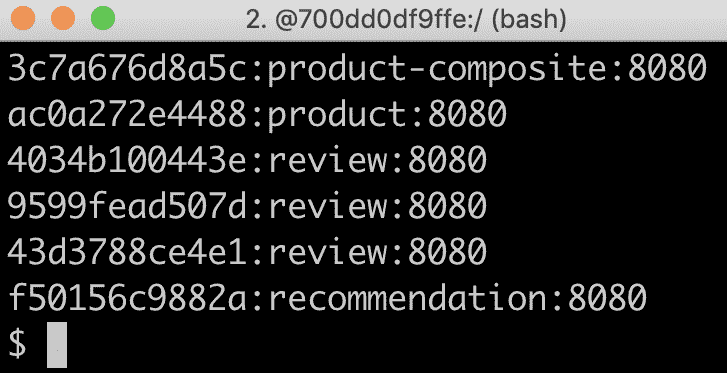

现在我们已经让所有实例运行起来，尝试通过发送一些请求并关注`review`服务在响应中的地址，如下所示：

```java
curl localhost:8080/product-composite/2 -s | jq -r .serviceAddresses.rev
```

期待类似于以下的响应：

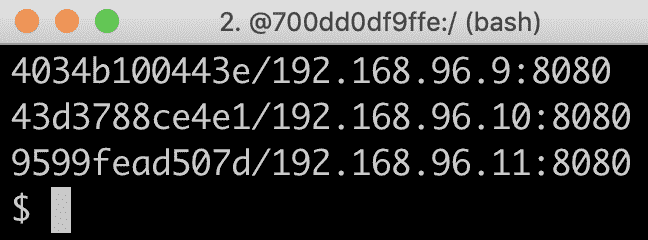

注意`review`服务的地址在每次响应中都会改变；也就是说，负载均衡器使用轮询依次调用可用的`review`实例，一个接一个！

我们还可以使用以下命令查看`review`实例的日志：

```java
docker-compose logs -f review
```

之后，你将看到类似于以下内容的输出：

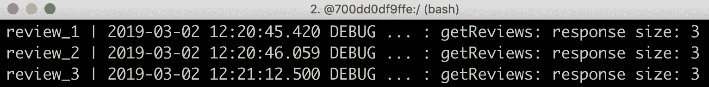

在前面的输出中，我们可以看到三个`review`微服务实例`review_1`、`review_2`和`review_3`如何依次响应请求。

在尝试扩展现有的微服务实例之后，我们将尝试缩减这些实例。

# 缩放向下

让我们也看看如果我们失去了一个`review`微服务的实例会发生什么。我们可以通过运行以下命令来模拟这个实例意外停止：

```java
docker-compose up -d --scale review=2
```

在`review`实例关闭后，有一个短暂的时间段，API 调用可能会失败。这是由于信息传播到客户端（即`product-composite`服务）所需的时间，也就是失去实例的时间。在这段时间内，客户端负载均衡器可能会选择不再存在的实例。为了防止这种情况发生，可以使用诸如超时和重试等弹性机制。在第十三章，*使用 Resilience4j 改进弹性*，我们将看到如何应用这些机制。现在，让我们在我们的`curl`命令上指定一个超时，使用`-m 2`开关来指定我们不会等待超过两秒钟的响应：

```java
curl localhost:8080/product-composite/2 -m 2
```

如果发生超时，即客户端负载均衡器尝试调用一个不再存在的实例，`curl`应返回以下响应：

```java
curl: (28) Operation timed out after 2003 milliseconds with 0 bytes received
```

除了预期两个剩余实例的正常响应；也就是说，`serviceAddresses.rev`字段应包含两个实例的地址，如下所示：

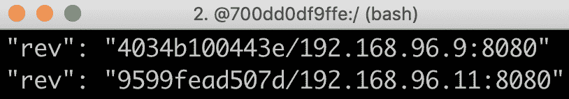

在前面的示例输出中，我们可以看到报告了两个不同的容器名称和 IP 地址。这意味着请求已经被不同的微服务实例处理。

在尝试微服务实例的缩放向下之后，我们可以尝试更具破坏性的事情：停止 Eureka 服务器，看看当发现服务暂时不可用时会发生什么。

# 带 Eureka 服务器的破坏性测试

让我们给我们的 Eureka 服务器带来一些混乱，看看系统景观如何处理它！

首先，如果我们使 Eureka 服务器崩溃会怎样？

只要客户端在 Eureka 服务器停止之前从服务器读取了有关可用微服务实例的信息，客户端就会没问题，因为它们会在本地缓存这些信息。但是，新的实例不会提供给客户端，并且如果任何正在运行的实例被终止，它们也不会收到通知。因此，调用不再运行的实例将导致失败。

让我们试试看！

# 停止 Eureka 服务器

要模拟 Eureka 服务器的崩溃，请按照以下步骤操作：

1.  首先，停止 Eureka 服务器，同时保持两个`review`实例运行：

```java
docker-compose up -d --scale review=2 --scale eureka=0
```

1.  尝试对 API 进行几次调用并提取`review`服务的服务地址：

```java
curl localhost:8080/product-composite/2 -s | jq -r .serviceAddresses.rev
```

1.  响应将—就像我们停止 Eureka 服务器之前一样—包含两个`review`实例的地址，如下所示：

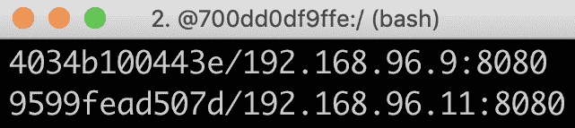

这表明客户端甚至可以在 Eureka 服务器不再运行时对现有实例进行调用！

# 停止一个`review`实例

为了进一步调查停止运行的 Eureka 服务器的影响，让我们模拟剩下的一个`review`微服务实例也崩溃。使用以下命令终止两个`review`实例中的一个：

```java
docker-compose up -d --scale review=1 --scale eureka=0
```

客户端，即`product-composite`服务，由于没有运行 Eureka 服务器，不会通知其中一个`review`实例已经消失。因此，它仍然认为有两个实例正在运行。每两次对客户端的调用会导致它调用一个不再存在的`review`实例，导致客户端的响应不包含任何来自`review`服务的信息。`review`服务的服务地址将变为空。

尝试使用前面的`curl`命令验证`review`服务的服务地址将会在第二次变为空。这可以通过使用之前描述的时间 outs 和 retries 等弹性机制来防止。

# 启动产品服务的额外实例

作为对停止运行的 Eureka 服务器效果的最终测试，如果我们启动`product`微服务的新实例，会发生什么情况呢？执行以下步骤：

1.  尝试启动`product`服务的新的实例：

```java
docker-compose up -d --scale review=1 --scale eureka=0 --scale product=2
```

1.  对 API 进行几次调用并使用以下命令提取`product`服务的地址：

```java
curl localhost:8080/product-composite/2 -s | jq -r .serviceAddresses.pro
```

1.  由于没有运行 Eureka 服务器，客户端不会通知新的`product`实例，所以所有的调用都会发送到第一个实例，如下例所示：

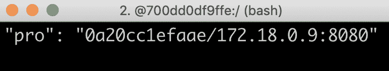

现在我们已经看到了在没有运行 Netflix Eureka 服务器时的一些最重要的方面。让我们通过再次启动 Netflix Eureka 服务器来结束本节的干扰性测试，看看系统景观如何处理自我修复，即弹性。

# 重新启动 Eureka 服务器

在本节中，我们将通过重新启动 Eureka 服务器来结束干扰性测试。我们还应验证系统景观是否自我修复，即验证新的`product`微服务实例是否被 Netflix Eureka 服务器注册，并且客户端是否被 Eureka 服务器更新。执行以下步骤：

1.  使用以下命令启动 Eureka 服务器：

```java
docker-compose up -d --scale review=1 --scale eureka=1 --scale product=2
```

进行一些新的 API 调用，并验证以下情况是否发生：

+   所有调用都发送到剩余的`review`实例，即客户端检测到第二个`review`实例已经消失。

+   对 `product` 服务的调用在两个 `product` 实例之间进行负载均衡，也就是说，客户端检测到有这两个 `product` 实例可用。

1.  多次调用以下调用以提取 `product` 和 `review` 服务的地址：

```java
curl localhost:8080/product-composite/2 -s | jq -r .serviceAddresses
```

1.  确认 API 调用响应包含涉及 `product` 和 `review` 实例的地址，如下所示：

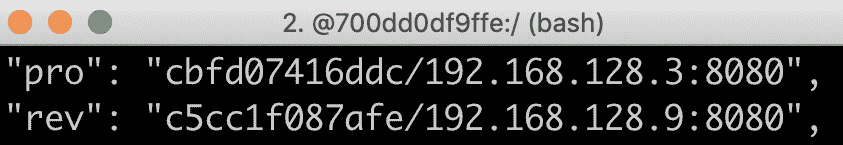

这是第二个响应：

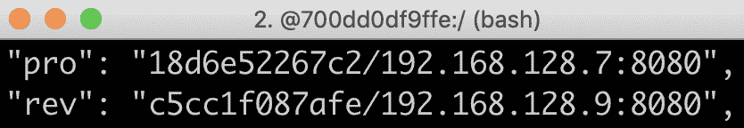

`192.168.128.3` 和 `192.168.128.7` IP 地址属于两个 `product` 实例。`192.168.128.9` 是 `review` 实例的 IP 地址。

总结来说，Eureka 服务器提供了一个非常健壮和灵活的发现服务实现。如果需要更高的可用性，可以启动并配置多个 Eureka 服务器以相互通信。在 Spring Cloud 文档中可以找到有关如何设置多个 Eureka 服务器的详细信息：[`cloud.spring.io/spring-cloud-static/Greenwich.RELEASE/single/spring-cloud.html#spring-cloud-eureka-server-peer-awareness`](https://cloud.spring.io/spring-cloud-static/Greenwich.RELEASE/single/spring-cloud.html#spring-cloud-eureka-server-peer-awareness)。

1.  最后，使用以下命令关闭系统景观：

```java
docker-compose down
```

这完成了对发现服务器 Netflix Eureka 的测试，我们既学习了如何扩展和缩小微服务实例，也学习了 Netflix Eureka 服务器崩溃后重新上线会发生什么。

# 总结

在本章中，我们学习了如何使用 Netflix Eureka 进行服务发现。首先，我们探讨了简单基于 DNS 的服务发现解决方案的不足之处，以及健壮和灵活的服务发现解决方案必须能够处理的问题。

Netflix Eureka 是一个功能强大的服务发现解决方案，提供了健壮、灵活和容错性运行时特性。然而，正确配置可能会具有一定挑战性，尤其是为了提供平滑的开发体验。使用 Spring Cloud，设置 Netflix Eureka 服务器和适配基于 Spring Boot 的微服务变得容易，这样它们可以在启动时注册到 Eureka，并且在作为其他微服务客户端时，可以跟踪可用的微服务实例。

有了发现服务之后，是时候看看我们如何使用 Spring Cloud Gateway 作为边缘服务器来处理外部流量了。翻到下一章，找出答案吧！

# 问题

1.  要将使用 Spring Initializr 创建的 Spring Boot 应用程序转换为完全功能的 Netflix Eureka 服务器需要什么？

1.  要让基于 Spring Boot 的微服务自动作为启动项注册到 Netflix Eureka 需要什么？

1.  要让一个基于 Spring Boot 的微服务调用注册在 Netflix Eureka 服务器上的另一个微服务需要什么？

1.  假设你有一个正在运行的网飞 Eureka 服务器，以及一个微服务*A*的实例和两个微服务*B*的实例。所有微服务实例都会向网飞 Eureka 服务器注册。微服务*A*根据从 Eureka 服务器获取的信息对微服务*B*发起 HTTP 请求。那么，如果依次发生以下情况：

    +   网飞 Eureka 服务器崩溃了

    +   微服务*B*的一个实例崩溃了

    +   微服务*A*的一个新实例启动了

    +   微服务*B*的一个新实例启动了

    +   网飞 Eureka 服务器再次启动了
