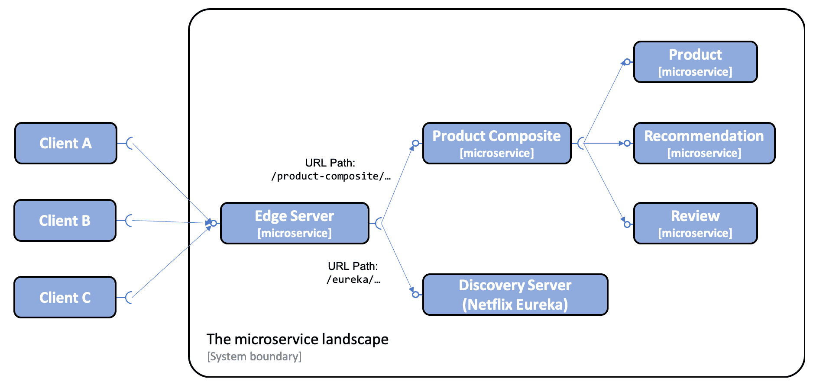
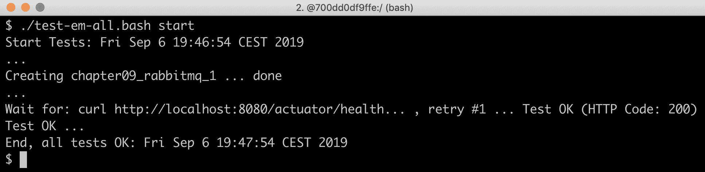
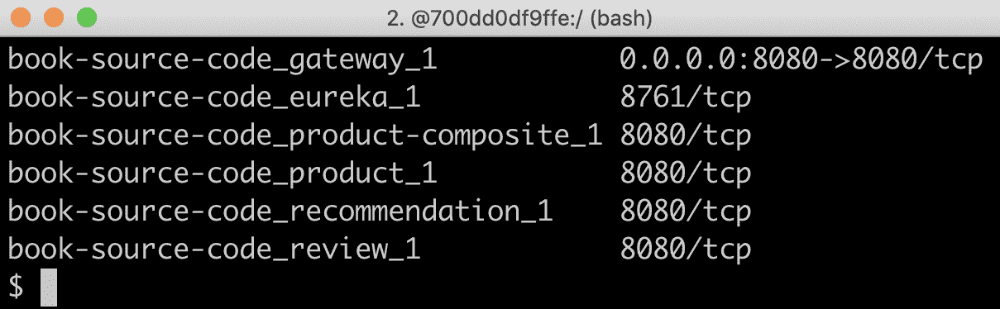
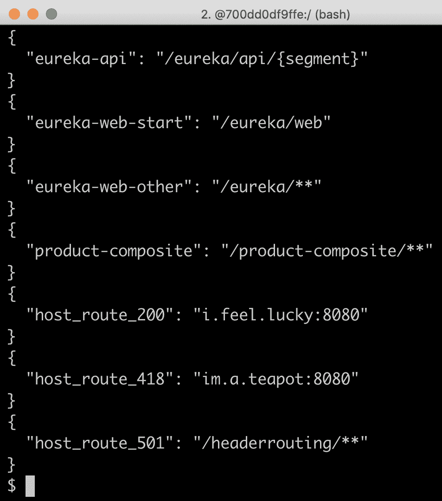
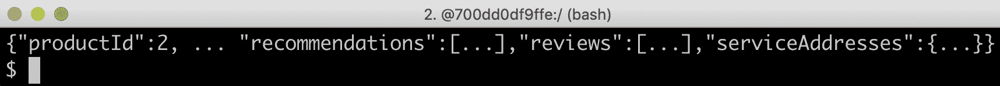
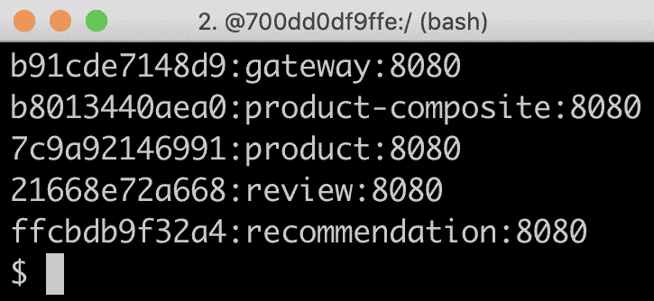
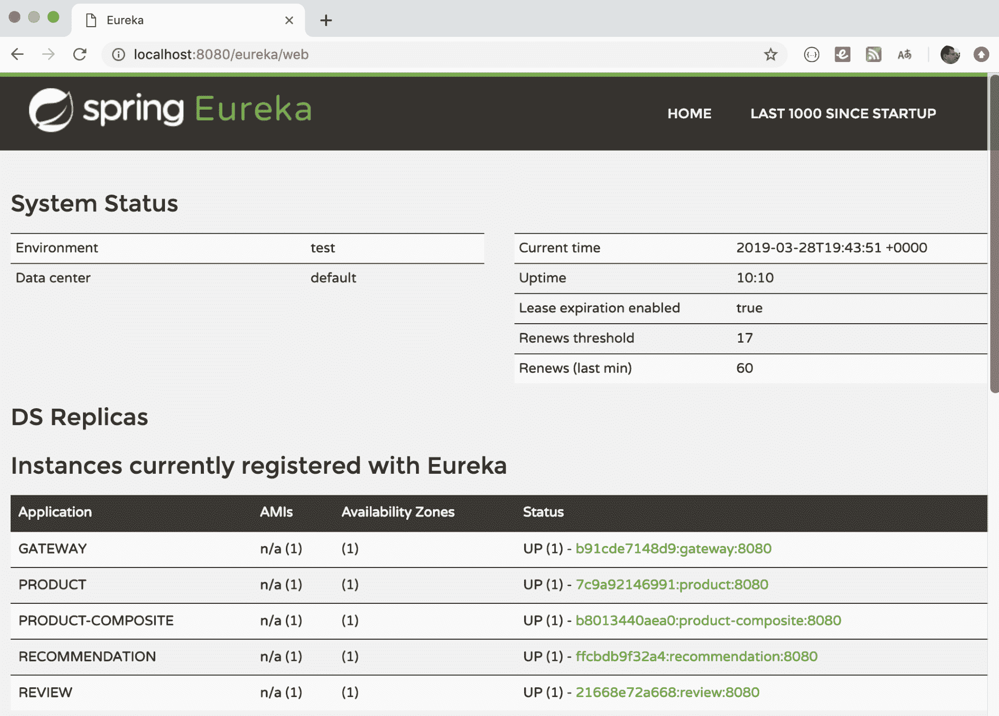

# 第十章：使用 Spring Cloud Gateway 将微服务隐藏在边缘服务器后面

在本章中，我们将学习如何使用 Spring Cloud Gateway 作为边缘服务器，即控制从我们的基于微服务的系统架构中暴露哪些 API。我们将了解具有公共 API 的微服务将通过边缘服务器从外部访问，而只有私有 API 的微服务只能从微服务架构的内部访问。在我们的系统架构中，这意味着产品组合服务和企业级 Eureka 服务将通过边缘服务器暴露。三个核心服务—`product`、`recommendation`和`review`—将对外隐藏。

本章将涵盖以下主题：

+   将边缘服务器添加到我们的系统架构中

+   设置一个 Spring Cloud Gateway，包括配置路由规则

+   尝试边缘服务器

# 技术要求

本书中描述的所有命令都是在 MacBook Pro 上使用 macOS Mojave 运行的，但应该很容易修改以在其他平台如 Linux 或 Windows 上运行。

在本章中不需要安装任何新工具。

本章的源代码可以在 GitHub 上找到：[`github.com/PacktPublishing/Hands-On-Microservices-with-Spring-Boot-and-Spring-Cloud/tree/master/Chapter10`](https://github.com/PacktPublishing/Hands-On-Microservices-with-Spring-Boot-and-Spring-Cloud/tree/master/Chapter10)。

为了能够按照本书描述运行命令，将源代码下载到一个文件夹中，并设置一个环境变量`$BOOK_HOME`，该变量指向该文件夹。以下是一些示例命令：

```java
export BOOK_HOME=~/Documents/Hands-On-Microservices-with-Spring-Boot-and-Spring-Cloud
git clone https://github.com/PacktPublishing/Hands-On-Microservices-with-Spring-Boot-and-Spring-Cloud $BOOK_HOME
cd $BOOK_HOME/Chapter10
```

Java 源代码是为 Java 8 编写的，并在 Java 12 上进行了测试。本章使用 Spring Cloud 2.1.0, SR1（也称为**Greenwich**版本），Spring Boot 2.1.3 和 Spring 5.1.5，这些是编写本章时可用的 Spring 组件的最新版本。

源代码包含以下 Gradle 项目：

+   `api`

+   `util`

+   `microservices/product-service`

+   `microservices/review-service`

+   `microservices/recommendation-service`

+   `microservices/product-composite-service`

+   `spring-cloud/eureka-server`

+   `spring-cloud/gateway`

本章中的所有代码示例都来自`$BOOK_HOME/Chapter10`的源代码，但在许多情况下，为了删除源代码中不相关部分，例如注释、导入和日志声明，都对代码进行了编辑。

如果你想查看第十章中应用于源代码的更改，*使用 Spring Cloud Gateway 将微服务隐藏在边缘服务器后面*，也就是说，看看添加 Spring Cloud Gateway 作为边缘服务器到微服务架构中需要做些什么，你可以将其与第九章的源代码*使用 Netflix Eureka 和 Ribbon 添加服务发现*进行比较。你可以使用你喜欢的`diff`工具，比较两个文件夹`$BOOK_HOME/Chapter09`和`$BOOK_HOME/Chapter10`。

# 向我们的系统架构中添加边缘服务器

在本节中，我们将了解如何将边缘服务器添加到系统架构中以及它如何影响外部客户端访问微服务公开 API 的方式。所有传入请求现在都将通过边缘服务器路由，如下面的 diagram 所示：



从前面 diagram 可以看出，外部客户端将其所有请求发送到边缘服务器。边缘服务器可以根据 URL 路径来路由传入的请求。例如，以`/product-composite/`开头的 URL 的请求会被路由到**产品组合**微服务，以`/eureka/`开头的 URL 的请求会基于 Netflix Eureka 被路由到**发现服务器**。

在前面的第九章中，*使用 Netflix Eureka 和 Ribbon 添加服务发现*，我们向外部暴露了`product-composite`服务和发现服务，Netflix Eureka。当我们在本章中引入边缘服务器时，这将不再适用。这是通过删除两个服务在 Docker Compose 文件中的以下端口声明来实现的：

```java
  product-composite:
    build: microservices/product-composite-service
    ports:
      - "8080:8080"

  eureka:
    build: spring-cloud/eureka-server
    ports:
      - "8761:8761"
```

在系统中添加了边缘服务器后，我们将在下一节学习如何基于 Spring Cloud Gateway 设置边缘服务器。

# 设置 Spring Cloud Gateway

在本节中，我们将学习如何基于 Spring Cloud Gateway 设置边缘服务器。

设置 Spring Cloud Gateway 作为边缘服务器是直接的，可以通过以下步骤完成：

1.  使用在第三章中描述的 Spring Initializr 创建 Spring Boot 项目，*创建一组协作的微服务—*参考*使用 Spring Initializr 生成骨架代码*部分。

1.  添加`spring-cloud-starter-gateway`依赖。

1.  为了能够通过 Netflix Eureka 定位微服务实例，也请添加`spring-cloud-starter-netflix-eureka-client`依赖。

1.  在通用构建文件`settings.gradle`中添加边缘服务器：

```java
include ':spring-cloud:gateway'
```

1.  在 Dockerfile 中添加与我们的微服务相同内容。

1.  在我们的三个 Docker Compose 文件中添加边缘服务器：

```java
gateway:
  environment:
    - SPRING_PROFILES_ACTIVE=docker
  build: spring-cloud/gateway
  mem_limit: 350m
  ports:
    - "8080:8080"
```

边缘服务器的`8080`端口暴露在 Docker 引擎外部。350 MB 的内存限制是为了确保本章及接下来的章节中的所有容器都能容纳在我们为 Docker 引擎分配的 6 GB 内存中。

1.  添加路由规则配置等；参考本章后续的*配置 Spring Cloud Gateway*部分。

1.  由于边缘服务器将处理所有传入流量，我们将把复合健康检查从产品复合服务移动到边缘服务器。这在*添加复合健康检查*部分有所描述。

你可以找到 Spring Cloud Gateway 的源代码在`$BOOK_HOME/Chapter10/spring-cloud/gateway`。

# 添加复合健康检查

有了边缘服务器后，外部的健康检查请求也必须通过边缘服务器。因此，检查所有微服务状态的复合健康检查从`product-composite`服务移动到了边缘服务器。参考第七章*开发反应式微服务*，参考*添加健康 API*部分实现复合健康检查的细节。

以下内容已添加到边缘服务器：

1.  新增了`se.magnus.springcloud.gateway.HealthCheckConfiguration`类，该类声明了一个健康指标：

```java
@Bean
ReactiveHealthIndicator healthcheckMicroservices() {

    ReactiveHealthIndicatorRegistry registry = 
        new DefaultReactiveHealthIndicatorRegistry
            (new LinkedHashMap<>());

    registry.register("product",() -> 
        getHealth("http://product"));
    registry.register("recommendation", () ->
        getHealth("http://recommendation"));
    registry.register("review", () ->
        getHealth("http://review"));
    registry.register("product-composite", () ->
        getHealth("http://product-composite"));

    return new CompositeReactiveHealthIndicator
        (healthAggregator, registry);
}

private Mono<Health> getHealth(String url) {
    url += "/actuator/health";
    LOG.debug("Will call the Health API on URL: {}", url);
    return getWebClient().get().uri(url)
        .retrieve().bodyToMono(String.class)
        .map(s -> new Health.Builder().up().build())
        .onErrorResume(ex -> 
            Mono.just(new Health.Builder().down(ex).build()))
        .log();
}
```

我们在复合健康检查中添加了`product-composite`服务。

1.  主应用类`se.magnus.springcloud.gateway.GatewayApplication`声明了一个`WebClient.builder`bean，供健康指标的实现使用：

```java
@Bean
@LoadBalanced
public WebClient.Builder loadBalancedWebClientBuilder() {
   final WebClient.Builder builder = WebClient.builder();
   return builder;
}
```

从前面的源代码中，我们可以看到`WebClient.builder`被注解为`@LoadBalanced`，这使得它能够意识到注册在发现服务器 Netflix Eureka 中的微服务实例。参考第九章*使用 Netflix Eureka 进行服务发现*部分的*使用 Spring Cloud 与 Netflix Eureka 和 Ribbon 添加服务发现*。

在边缘服务器中设置了复合健康检查后，我们就可以看看可以为 Spring Cloud Gateway 设置的配置了。

# 配置 Spring Cloud Gateway

当谈到配置 Spring Cloud Gateway 时，最重要的是设置路由规则。我们还需要在配置中设置其他几件事：

1.  由于 Spring Cloud Gateway 将使用 Netflix Eureka 查找它将路由流量的微服务，所以它必须像描述的那样配置为 Eureka 客户端第九章*使用 Netflix Eureka 和 Ribbon 添加服务发现*，参考*配置 Eureka 服务器客户端*部分。

1.  如第七章所述，为开发用途配置 Spring Boot Actuator *开发反应式微服务*：参考*添加健康 API*部分。

```java
management.endpoint.health.show-details: "ALWAYS"
management.endpoints.web.exposure.include: "*"

```

1.  配置日志级别，以便我们可以看到 Spring Cloud Gateway 内部处理中有趣部分的发出的日志消息，例如，它是如何决定将传入请求路由到哪里的：

```java
logging:
  level:
    root: INFO
    org.springframework.cloud.gateway.route.RouteDefinitionRouteLocator: INFO
    org.springframework.cloud.gateway: TRACE
```

要查看完整的源代码，请参阅配置文件：`src/main/resources/application.yml`。

# 路由规则

设置路由规则可以采用两种方法；编程方式，使用 Java DSL，或者通过配置。使用 Java DSL 编程方式设置路由规则在规则存储在外部存储中时很有用，例如数据库，或者在运行时给定，例如，通过 RESTful API 或发送给网关的消息。在大多数情况下，我发现声明路由在配置文件中很方便，该配置文件位于`src/main/resources/application.yml`。

一个**路由**由以下内容定义：

1.  **谓词**，根据传入 HTTP 请求中的信息选择路由。

1.  **过滤器**，可以修改请求和/或响应。

1.  **目标 URI**，描述请求发送到哪里。

1.  一个**ID**，即路由的名称。

要查看可用的谓词和过滤器的完整列表，请参阅参考文档：[`cloud.spring.io/spring-cloud-gateway/single/spring-cloud-gateway.html`](https://cloud.spring.io/spring-cloud-gateway/single/spring-cloud-gateway.html)。

# 将请求路由到 product-composite API

如果我们想将 URL 路径以`/product-composite/`开头的传入请求路由到我们的`product-composite`服务，我们可以指定一个像这样的路由规则：

```java
spring.cloud.gateway.routes:
- id: product-composite
  uri: lb://product-composite
  predicates:
  - Path=/product-composite/**
```

以下是一些从前面代码中需要注意的要点：

+   `id: product-composite`：路由的名称是`product-composite`。

+   `uri: lb://product-composite`：如果路由通过其谓词被选中，请求将被路由到在发现服务中名为`product-composite`的服务，即 Netflix Eureka。`lb://`用于指示 Spring Cloud Gateway 使用客户端负载均衡器在发现服务中查找目的地。

+   `predicates:- Path=/product-composite/**` 用于指定此路由应该匹配哪些请求。`**`匹配路径中的零个或多个元素。

# 将请求路由到 Eureka 服务器的 API 和网页

Eureka 为它的客户端提供了 API 和网页。为了在 Eureka 中提供 API 和网页之间的清晰分离，我们将按以下方式设置路由：

+   发送到边缘服务器，路径以`/eureka/api/`开头的请求应被视为对 Eureka API 的调用。

+   发送到边缘服务器，路径以`/eureka/web/`开头的请求应被视为对 Eureka 网页的调用。

API 请求将被路由到`http://${app.eureka-server}:8761/eureka`。Eureka API 的路由规则如下所示：

```java
- id: eureka-api
  uri: http://${app.eureka-server}:8761
  predicates:
  - Path=/eureka/api/{segment}
  filters:
  - SetPath=/eureka/{segment}
```

`{segment}`部分在`Path`值中匹配路径中的零个或多个元素，并将用于替换`SetPath`值中的`{segment}`部分。

网页请求将被路由到`http://${app.eureka-server}:8761`。网页将加载几个网页资源，如`.js`、`.css`和`.png`文件。这些请求将被路由到`http://${app.eureka-server}:8761/eureka`。Eureka 网页的路由规则看起来像这样：

```java
- id: eureka-web-start
  uri: http://${app.eureka-server}:8761
  predicates:
  - Path=/eureka/web
  filters:
  - SetPath=/

- id: eureka-web-other
  uri: http://${app.eureka-server}:8761
  predicates:
  - Path=/eureka/**
```

从前面的配置中，我们可以得出以下结论：`${app.eureka-server}`属性取决于激活的 Spring 配置文件，由 Spring 的属性机制解析：

1.  当在同一主机上运行服务而不使用 Docker 时，例如，用于调试目的，属性将被翻译为使用`default`配置文件的`localhost`。

1.  当以 Docker 容器的形式运行服务时，Netflix Eureka 服务器将在具有 DNS 名称`eureka`的容器中运行。因此，属性将被翻译为`eureka`，使用`docker`配置文件。

在定义此翻译的`application.yml`文件的相关部分看起来像这样：

```java
app.eureka-server: localhost
---
spring.profiles: docker
app.eureka-server: eureka
```

# 使用谓词和过滤器路由请求

为了了解更多关于 Spring Cloud Gateway 中的路由功能，我们将尝试基于主机的路由；也就是说，Spring Cloud Gateway 使用传入请求的主机名来确定如何路由请求。我们将使用一个我喜欢的用于测试 HTTP 代码的网站：[`httpstat.us/`](http://httpstat.us/)。

对`http://httpstat.us/${CODE}`的调用简单地返回具有`${CODE}` HTTP 代码和包含 HTTP 代码及相关描述性文本的响应体。例如，请看以下的`curl`命令：

```java
curl http://httpstat.us/200 -i
```

这将返回 HTTP 代码 200，以及包含文本`200 OK`的响应体。

假设我们想要将调用`http://${hostname}:8080/headerrouting`的路由如下：

+   对`i.feel.lucky`主机的调用应返回 200 OK。

+   对`im.a.teapot`主机的调用应返回`418 I'm a teapot`。

+   对所有其他主机名的调用应返回`501 Not Implemented`。

在 Spring Cloud Gateway 中实现这些路由规则时，我们可以使用`Host`路由谓词来选择具有特定主机名的请求，并使用`SetPath`过滤器来设置请求路径中的期望 HTTP 代码。这可以按以下方式完成：

1.  为了使对`http://i.feel.lucky:8080/headerrouting`的调用返回 200 OK，我们可以设置以下路由：

```java
- id: host_route_200
  uri: http://httpstat.us
  predicates:
  - Host=i.feel.lucky:8080
  - Path=/headerrouting/**
  filters:
  - SetPath=/200
```

1.  为了使对`http://im.a.teapot:8080/headerrouting`的调用返回`418 I'm a teapot`，我们可以设置以下路由：

```java
- id: host_route_418
  uri: http://httpstat.us
  predicates:
  - Host=im.a.teapot:8080
  - Path=/headerrouting/**
  filters:
  - SetPath=/418
```

1.  最后，为了使所有其他主机名的调用返回`501 Not Implemented`，我们可以设置以下路由：

```java
- id: host_route_501
  uri: http://httpstat.us
  predicates:
  - Path=/headerrouting/**
  filters:
  - SetPath=/501
```

好的，那有很多配置，现在让我们试试吧！

# 尝试边缘服务器

为了尝试边缘服务器，我们执行以下步骤：

1.  首先，使用以下命令构建 Docker 镜像：

```java
cd $BOOK_HOME/Chapter10
./gradlew build && docker-compose build
```

1.  接下来，在 Docker 中启动系统架构，并使用以下命令运行常规测试：

```java
./test-em-all.bash start
```

期待输出与我们在前面的章节中看到类似的输出：



在包括边缘服务器的系统景观中，让我们探讨以下主题：

+   检查边缘服务器在 Docker 引擎中运行的系统景观外部暴露了什么。

+   尝试一些最常用的路由规则：

    +   使用基于 URL 的路由通过边缘服务器调用我们的 API。

    +   使用基于 URL 的路由调用通过边缘服务器的 Netflix Eureka，包括使用其 API 和基于网页的 UI。

    +   使用基于头部的路由查看我们如何根据请求中的主机名路由请求。

# 检查 Docker 引擎外部暴露了什么

为了了解边缘服务器向系统景观外部暴露了什么，请执行以下步骤：

1.  使用 `docker-compose ps` 命令来看看我们的服务暴露了哪些端口：

```java
docker-compose ps gateway eureka product-composite product recommendation review
```

1.  正如我们在下面的输出中所看到的，只有边缘服务器（名为 `gateway`）在其外部暴露了端口（`8080`）：



1.  如果我们想查看边缘服务器设置的路由，我们可以使用 `/actuator/gateway/routes` API。此 API 的响应相当详细。为了限制响应只包含我们感兴趣的信息，我们可以应用一个 `jq` 过滤器。在下面的示例中，我选择了路由的 `id` 和路由中的第一个谓词：

```java
curl localhost:8080/actuator/gateway/routes -s | jq '.[] | {"\(.route_id)": "\(.route_definition.predicates[0].args._genkey_0)"}'
```

1.  此命令将回应以下内容：



这让我们对边缘服务器中配置的实际路由有了一个很好的概览。现在，让我们尝试一下这些路由！

# 尝试路由规则

在本节中，我们将尝试边缘服务器及其向系统景观外部暴露的路由。让我们先调用产品组合 API，然后调用 Eureka API 并访问其网页，最后测试基于主机名的路由。

# 通过边缘服务器调用产品组合 API

让我们执行以下步骤通过边缘服务器调用产品组合 API：

1.  为了能够看到边缘服务器中发生的情况，我们可以跟踪其日志输出：

```java
docker-compose logs -f --tail=0 gateway
```

1.  现在，通过边缘服务器调用产品组合 API：

```java
curl http://localhost:8080/product-composite/2
```

1.  期望从组合产品 API 获得正常类型的响应：



1.  我们应该能在日志输出中找到以下有趣的信息：

```java
Pattern "/product-composite/**" matches against value "/product-composite/2"
Route matched: product-composite
LoadBalancerClientFilter url chosen: http://b8013440aea0:8080/product-composite/2
```

从日志输出中，我们可以看到基于我们在配置中指定的谓词的模式匹配，我们还可以看到边缘服务器从发现服务器中可用的实例中选择了哪个微服务实例——在本例中，`http://b8013440aea0:8080/product-composite/2`。

# 通过边缘服务器调用 Eureka

要通过边缘服务器调用 Eureka，请执行以下步骤：

1.  首先，通过边缘服务器调用 Eureka API 以查看目前在发现服务器中注册的实例：

```java
curl -H "accept:application/json" localhost:8080/eureka/api/apps -s | \ jq -r .applications.application[].instance[].instanceId
```

1.  期望得到如下类似的响应：



注意，边缘服务器（名为`gateway`）也包含在响应中。

1.  接下来，使用 URL`http://localhost:8080/eureka/web`在 Web 浏览器中打开 Eureka 网页：



从前面的屏幕截图中，我们可以看到 Eureka 网页报告的可用实例与上一步的 API 响应相同。

# 基于主机头的路由

让我们通过测试基于请求中使用的主机名的路由设置来结束！

通常，请求中的主机名会在 HTTP 客户端的`Host`头自动设置。当在本地测试边缘服务器时，主机名将是`localhost`——这对于测试基于主机名的路由来说并不很有用。但是我们可以通过在 API 调用中指定另一个主机名来欺骗，从而在`Host`头中实现。让我们看看如何做到这一点：

1.  要调用`i.feel.lucky`主机名，请使用此代码：

```java
curl http://localhost:8080/headerrouting -H "Host: i.feel.lucky:8080"
```

1.  预期响应为 200 OK。对于主机名`im.a.teapot`，使用以下命令：

```java
curl http://localhost:8080/headerrouting -H "Host: im.a.teapot:8080"
```

预期响应为`418 I'm a teapot`。

1.  最后，如果不指定任何`Host`头，请将`localhost`作为`Host`头：

```java
curl http://localhost:8080/headerrouting
```

预期响应为`501 Not Implemented`。

1.  我们也可以在请求中使用`i.feel.lucky`和`im.a.teapot`作为真实的主机名，如果我们添加它们到本地的`/etc/hosts`文件，并指定它们应该被翻译成与`localhost`相同的 IP 地址，即`127.0.0.1`。运行以下命令以在`/etc/hosts`文件中添加所需信息的行：

```java
sudo bash -c "echo '127.0.0.1 i.feel.lucky im.a.teapot' >> /etc/hosts"
```

1.  现在，我们可以根据主机名进行相同的路由，但不必指定`Host`头。尝试通过运行以下命令来实现：

```java
curl http://i.feel.lucky:8080/headerrouting
curl http://im.a.teapot:8080/headerrouting
```

预期与先前相同的响应，即 200 OK 和`418 I'm a teapot`。

1.  通过以下命令关闭系统景观的系统：

```java
docker-compose down
```

1.  此外，还应清理为`i.feel.lucky`和`im.a.teapot`主机名添加的 DNS 名称翻译的`/etc/hosts`文件。编辑`/etc/hosts`文件，删除我们添加的行：`127.0.0.1 i.feel.lucky im.a.teapot`。

这些测试系统景观中边缘服务器的路由功能结束了本章。

# 总结

在本章中，我们看到了 Spring Cloud Gateway 如何可以作为边缘服务器使用，以控制哪些服务被允许从系统景观的外部调用。基于断言、过滤器和目标 URI，我们可以非常灵活地定义路由规则。如果我们愿意，我们可以配置 Spring Cloud Gateway 以使用诸如 Netflix Eureka 之类的发现服务来查找目标微服务实例。

还有一个重要的问题尚未回答，那就是我们如何防止未经授权访问边缘服务器暴露的 API，以及我们如何防止第三方拦截流量。

在下一章中，我们将了解如何使用诸如 HTTPS、OAuth 和 OpenID Connect 等标准安全机制来保护边缘服务器的访问。

# 问题

1.  构成 Spring Cloud Gateway 中路由规则的元素是什么？

1.  它们有什么用途？

1.  我们如何指导 Spring Cloud Gateway 通过像 Netflix Eureka 这样的服务发现机制来定位微服务实例？

1.  在 Docker 环境中，我们如何确保对外部 HTTP 请求只能到达 Docker 引擎的边缘服务器？

1.  我们如何更改路由规则，使得边缘服务器接受对 `http://$HOST:$PORT/api/product` URL 的 `product-composite` 服务的调用，而不是目前使用的 `http://$HOST:$PORT/product-composite`？
