# 第十五章：介绍 Kubernetes

在本章中，我们将开始学习 Kubernetes，这是在撰写本书时最受欢迎和广泛使用的容器编排器。由于一般容器编排器以及 Kubernetes 本身的内容太多，无法在一章中覆盖，我将重点介绍在我过去几年使用 Kubernetes 时发现最重要的内容。

本章将涵盖以下主题：

+   介绍 Kubernetes 概念

+   介绍 Kubernetes API 对象

+   介绍 Kubernetes 运行时组件

+   创建本地 Kubernetes 集群

+   尝试一个示例部署并熟悉`kubectl` Kubernetes 命令行工具：

+   管理一个 Kubernetes 集群

# 技术要求

为了在本地与 Kubernetes 合作，我们将使用在 VirtualBox 上运行的 Minikube。我们还将大量使用名为`kubectl`的 Kubernetes CLI 工具。`kubectl`随 Docker for macOS 提供，但不幸的是，版本太旧（至少在撰写本章时）。因此，我们需要安装一个新版本。总共我们需要以下内容：

+   Minikube 1.2 或更高版本

+   `kubectl` 1.15 或更高版本

+   VirtualBox 6.0 或更高版本

这些工具可以使用 Homebrew 以下命令安装：

```java
brew install kubectl
brew cask install minikube
brew cask install virtualbox
```

在安装`kubectl`后，运行以下命令确保使用新版本的`kubectl`：

```java
brew link --overwrite kubernetes-cli
```

安装 VirtualBox 时，它会要求你依赖 VirtualBox 附带的系统扩展：

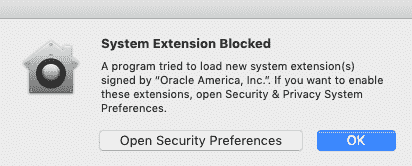

点击对话框中的“确定”按钮，然后点击下一个对话窗口中的“允许”按钮：

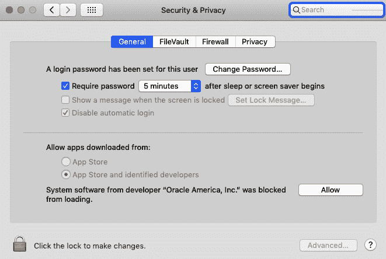

通过以下命令验证安装工具的版本：

```java
kubectl version --client --short
minikube version
vboxmanage --version
```

期望得到如下响应：

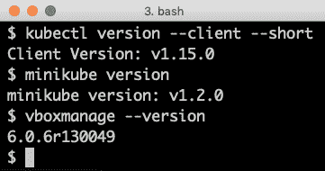

本章的源代码可以在本书的 GitHub 仓库中找到：[`github.com/PacktPublishing/Hands-On-Microservices-with-Spring-Boot-and-Spring-Cloud/tree/master/Chapter15`](https://github.com/PacktPublishing/Hands-On-Microservices-with-Spring-Boot-and-Spring-Cloud/tree/master/Chapter15)。

为了能够运行本书中描述的命令，你需要将源代码下载到一个文件夹中，并设置一个环境变量`$BOOK_HOME`，该变量指向该文件夹。一些示例命令如下：

```java
export BOOK_HOME=~/Documents/Hands-On-Microservices-with-Spring-Boot-and-Spring-Cloud
git clone https://github.com/PacktPublishing/Hands-On-Microservices-with-Spring-Boot-and-Spring-Cloud $BOOK_HOME
cd $BOOK_HOME/Chapter15
```

本章中的所有源代码示例都来自`$BOOK_HOME/Chapter15`的源代码，并使用 Kubernetes 1.15 进行了测试。

# 介绍 Kubernetes 概念

在较高层面上，作为容器编排器，Kubernetes 使得运行容器的服务器集群（物理或虚拟）呈现为一个运行容器的巨大逻辑服务器。作为操作员，我们通过使用 Kubernetes API 创建对象来向 Kubernetes 集群声明期望状态。Kubernetes 持续将期望状态与当前状态进行比较。如果检测到差异，它会采取行动确保当前状态与期望状态一致。

Kubernetes 集群的主要目的之一是部署和运行容器，同时也支持使用绿色/蓝色和金丝雀部署等技术实现零停机滚动升级。Kubernetes 可以安排容器，即包含一个或多个并列容器的**豆荚**，到集群中可用的节点。为了能够监控运行中容器的健康状况，Kubernetes 假定容器实现了**存活探针**。如果存活探针报告了一个不健康的容器，Kubernetes 将重新启动该容器。容器可以在集群中手动或自动扩展，使用水平自动扩展器。为了优化集群中可用硬件资源的使用，例如内存和 CPU，容器可以配置**配额**，指明容器需要多少资源。另一方面，可以在**命名空间**级别指定关于一组容器允许消耗多少资源的上限。随着本章的进行，将介绍命名空间。如果多个团队共享一个 Kubernetes 集群，这尤为重要。

Kubernetes 的另一个主要目的是提供运行豆荚及其容器的服务发现。Kubernetes `Service` 对象可以定义为服务发现，并且还会负载均衡传入请求到可用的豆荚。`Service` 对象可以暴露在 Kubernetes 集群的外部。然而，正如我们将看到的，在许多情况下，Ingress 对象更适合处理一组服务的外部传入流量。为了帮助 Kubernetes 查明一个容器是否准备好接受传入请求，容器可以实现一个**就绪探针**。

内部而言，Kubernetes 集群提供了一个大的扁平化 IP 网络，每个豆荚获得自己的 IP 地址，并且可以独立于它们运行的节点到达所有其他豆荚。为了支持多个网络供应商，Kubernetes 允许使用符合**容器网络接口**（**CNI**）规范的网络插件([`github.com/containernetworking/cni`](https://github.com/containernetworking/cni))。豆荚默认情况下是不隔离的，也就是说，它们接受所有传入请求。支持使用网络策略定义的网络插件可以用来锁定对豆荚的访问，例如，只允许来自同一命名空间中豆荚的流量。

为了使多个团队能够安全地在同一个 Kubernetes 集群上工作，可以应用**基于角色的访问控制**（**RBAC**，[`kubernetes.io/docs/reference/access-authn-authz/rbac`](https://kubernetes.io/docs/reference/access-authn-authz/rbac)/）。例如，管理员可以被授权访问集群级别的资源，而团队成员的访问可以被限制在他们团队拥有的命名空间中创建的资源。

总的来说，这些概念为运行容器提供了一个可扩展、安全、高可用性和弹性的平台。

让我们更深入地了解一下 Kubernetes 中可用的 API 对象，然后看看组成 Kubernetes 集群的运行时组件是什么。

# 介绍 Kubernetes API 对象

Kubernetes 定义了一个 API，用于管理不同类型的*对象*或*资源*，在 API 中也被称为*种类*。根据我的经验，一些最常用的类型或*种类*如下：

+   **节点：** 节点代表集群中的一个服务器，可以是**虚拟的**或**物理的**。

+   **Pod：** Pod 是 Kubernetes 中可部署的最小组件，由一个或多个共置的容器组成。通常，一个 Pod 包含一个容器，但有一些用例通过在 Pod 中运行第二个容器来扩展主容器的功能。在第十八章，*使用服务网格提高可观测性和管理*，将在 Pod 中运行第二个容器，运行一个边车使主容器加入服务网格。

+   **部署**：部署用于部署和升级 Pod。部署对象将创建和监控 Pod 的责任交给了副本集。第一次创建部署时，部署对象所做的工作并不多，只是创建了副本集对象。在执行部署的滚动升级时，部署对象的角色更加复杂。

+   **副本集**：副本集用于确保始终运行指定数量的 Pod。如果一个 Pod 被删除，副本集会用一个新的 Pod 来替换它。

+   **服务（Service）**：服务是一个稳定的网络端点，您可以使用它来连接一个或多个 Pod。服务在 Kubernetes 集群的内部网络中被分配一个 IP 地址和 DNS 名称。服务的 IP 地址在其生命周期内保持不变。发送到服务的请求将通过轮询负载均衡转发到可用的 Pod 之一。默认情况下，服务只通过集群 IP 地址在集群内部暴露。还可以将服务暴露在集群外部，要么在每个节点上专用端口上，要么——更好的方法——通过一个意识到 Kubernetes 的外部负载均衡器，也就是说，它可以自动为服务分配一个公共 IP 地址和/或 DNS 名称。通常，提供 Kubernetes 作为服务的云提供商支持这种负载均衡器。

+   **入口（Ingress）**：入口可以管理 Kubernetes 集群中服务的对外访问，通常使用 HTTP。例如，它可以根据 URL 路径或 HTTP 头（如主机名）将流量路由到底层服务。与其在外部暴露多个服务，使用节点端口或负载均衡器，通常在服务前设置一个入口更为方便。为了处理 Ingress 对象定义的实际通信，必须在集群中运行一个 Ingress 控制器。我们将在后面看到一个 Ingress 控制器的示例。

+   **命名空间（Namespace）**：命名空间用于将资源分组并在某些层面上隔离在 Kubernetes 集群中。资源在其命名空间内的名称必须是唯一的，但命名空间之间不需要唯一。

+   **配置映射（ConfigMap）**：ConfigMap 用于存储容器使用的配置。ConfigMaps 可以映射到运行中的容器作为环境变量或文件。

+   **密钥（Secret）**：此功能用于存储容器使用的敏感数据，例如凭据。密钥可以像 ConfigMaps 一样供容器使用。任何具有对 API 服务器完全访问权限的人都可以访问创建的密钥的值，因此它们并不像名称暗示的那样安全。

+   **守护进程集（DaemonSet）**：这确保在集群的一组节点中每个节点上运行一个 Pod。在第十九章，*使用 EFK 堆栈进行集中日志记录*，我们将看到一个日志收集器 Fluentd 的示例，它将在每个工作节点上运行。

有关 Kubernetes API 在 v1.15 中涵盖的资源对象列表，请参阅[`kubernetes.io/docs/reference/generated/kubernetes-api/v1.15/`](https://kubernetes.io/docs/reference/generated/kubernetes-api/v1.15/)。

以下图表总结了处理传入请求的 Kubernetes 资源：

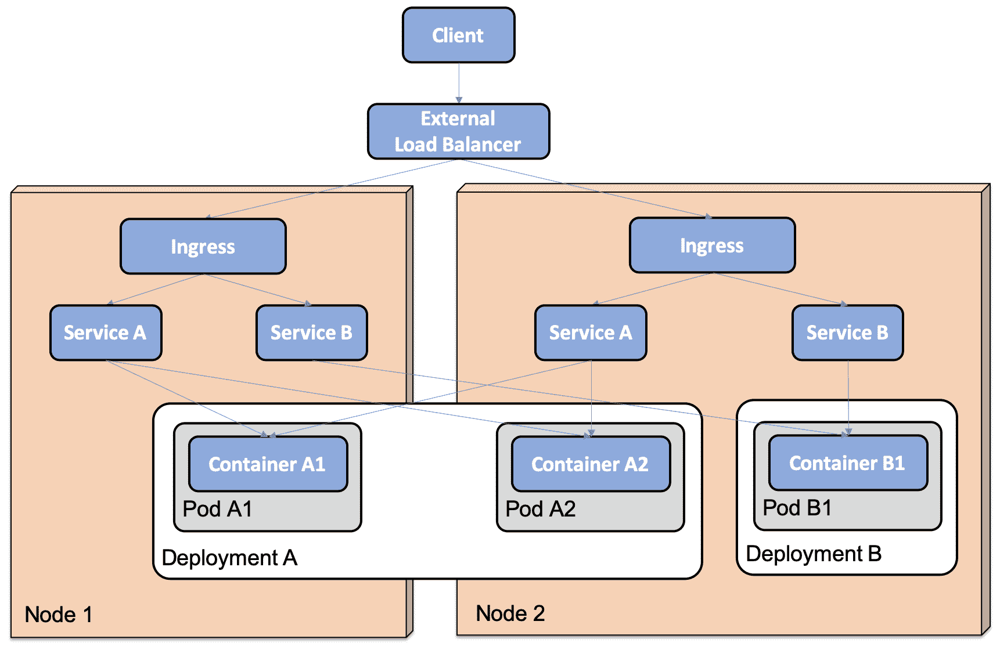

在前面的图表中，我们可以看到以下内容：

+   两个部署，**Deployment A** 和 **Deployment B**，已经部署在具有两个节点的集群上，分别是**Node 1**和**Node 2**。

+   **Deployment A** 包含两个 Pod，**Pod A1** 和 **Pod A2**。

+   **Deployment B** 包含一个 **Pod** **B1**。

+   **Pod A1** 被调度到**节点 1**。

+   **Pod A2** 和 **Pod B1** 被调度到**节点 2**。

+   每个部署都有一个对应的服务，**服务 A** 和 **服务 B**，它们在所有节点上都可用。

+   定义了一个 Ingress 以将传入请求路由到两个服务。

+   客户端通常通过外部负载均衡器向集群发送请求。

这些对象本身并不是运行中的组件；相反，它们是不同类型期望状态的定义。为了将期望状态反映到集群的当前状态，Kubernetes 包含一个由多个运行时组件组成的架构，如下一节所述。

# 介绍 Kubernetes 运行时组件

一个 Kubernetes 集群包含两种类型的节点：主节点和工作节点。主节点负责管理集群，而工作节点的的主要用途是运行实际的工作负载，例如我们在集群中部署的容器。Kubernetes 由多个运行时组件构成。最重要的组件如下：

+   在主节点上运行的组件构成了控制平面：

    +   `api-server`，控制平面的入口点。它暴露一个 RESTful API，例如，Kubernetes CLI 工具 `kubectl` 使用该 API。

    +   `etcd`，一个高可用性和分布式键/值存储，用作所有集群数据的数据库。

    +   一个控制器管理器，其中包含多个控制器，这些控制器不断地评估对象在 `etcd` 数据库中定义的期望状态与当前状态。

    +   每当期望状态或当前状态发生变化时，负责该类型状态的控制器会采取行动将当前状态移动到期望状态。例如，负责管理 Pod 的复制控制器如果通过 API 服务器添加新的 Pod 或者运行中的 Pod 停止运行，会做出反应并确保新的 Pod 被启动。控制器的一个其他例子是节点控制器。如果一个节点变得不可用，它负责确保在失败节点上运行的 Pod 被重新调度到集群中的其他节点。

    +   一个**调度器**，负责将新创建的 Pod 分配给具有可用能力的节点，例如，在内存和 CPU 方面。可以使用亲和规则来控制 Pod 如何分配到节点。例如，执行大量磁盘 I/O 的 Pod 可以将分配给拥有快速 SSD 磁盘的一组工作节点。可以定义反亲和规则来分离 Pod，例如，避免将来自同一部署的 Pod 调度到同一工作节点。

+   在所有节点上运行构成数据平面的组件如下：

    +   `kubelet`，这是一个在节点操作系统中直接作为进程执行而不是作为容器的节点代理。它负责在分配给 `kubelet` 运行的节点上运行的 pod 中的容器运行和启动。它充当 `api-server` 和其节点上的容器运行时之间的通道。

    +   `kube-proxy`，这是一个网络代理，它使 Kubernetes 中的服务概念成为可能，并能够将请求转发到适当的 pod，通常如果有多个 pod 可用，就会以轮询方式转发。`kube-proxy` 作为 DaemonSet 部署。

    +   **容器运行时**，运行在节点上的容器的软件。通常这是 Docker，但任何实现 Kubernetes **容器运行时接口**（**CRI**）的都可以使用，例如 `cri-o` ([`cri-o.io`](https://cri-o.io))、`containerd` ([`containerd.io/`](https://containerd.io/)) 或 `rktlet` ([`github.com/kubernetes-incubator/rktlet`](https://github.com/kubernetes-incubator/rktlet))。

    +   **Kubernetes DNS**，这是一个在集群内部网络中使用的 DNS 服务器。服务和 pod 会被分配一个 DNS 名称，而 pod 会被配置使用这个 DNS 服务器来解析内部 DNS 名称。DNS 服务器作为部署对象和服务对象部署。

以下图表总结了 Kubernetes 运行时组件：

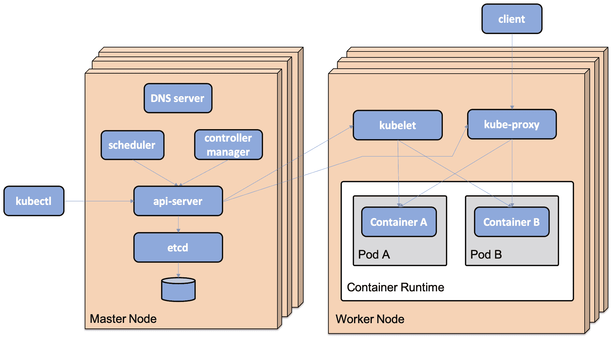

既然我们已经了解了 Kubernetes 运行时组件以及它们支持什么和运行在什么上，那么接下来让我们使用 Minikube 创建一个 Kubernetes 集群。

# 使用 Minikube 创建 Kubernetes 集群

现在，我们准备创建一个 Kubernetes 集群！我们将使用 Minikube 创建一个在 VirtualBox 上运行的本地单节点集群。

在创建 Kubernetes 集群之前，我们需要了解一下 Minikube 配置文件、被称为 `kubectl` 的 Kubernetes CLI 工具以及其使用的上下文。

# 使用 Minikube 配置文件工作

为了在本地运行多个 Kubernetes 集群，Minikube 带有一个配置文件的概念。例如，如果你想与多个版本的 Kubernetes 一起工作，可以使用 Minikube 创建多个 Kubernetes 集群。每个集群将被分配一个单独的 Minikube 配置文件。Minikube 的大部分命令都接受一个 `--profile` 标志（或 `-p` 的简写），可以用来指定哪个 Kubernetes 集群应应用该命令。如果你计划与一个特定的配置文件工作一段时间，还有一个更方便的替代方案，你通过以下命令指定当前配置文件：

```java
minikube profile my-profile
```

上述命令会将 `my-profile` 配置文件设置为当前配置文件。

要获取当前配置文件，请运行以下命令：

```java
minikube config get profile
```

如果没有指定配置文件，既没有使用 `minikube profile` 命令也没有使用 `--profile` 选项，那么将使用名为 `minikube` 的默认配置文件。

有关现有配置文件的信息可以在 `~/.minikube/profiles` 文件夹中找到。

# 使用 Kubernetes CLI，kubectl

`kubectl` 是 Kubernetes 的命令行工具。一旦建立了一个集群，这通常是管理集群所需的所有工具！

为了管理本章前面描述的 API 对象，`kubectl apply`命令是您需要了解的唯一命令。它是一个声明性命令，也就是说，作为操作员，我们要求 Kubernetes 应用我们给出的对象定义到命令中。然后由 Kubernetes 决定实际需要执行哪些操作。

许多阅读本书的读者可能熟悉的另一个声明性命令是一个`SQL SELECT`语句，它从几个数据库表中连接信息。我们只在 SQL 查询中声明期望的结果，而数据库查询优化器则负责决定按什么顺序访问表以及使用哪些索引以最有效的方式检索数据。

在某些情况下，显式告诉 Kubernetes 做什么的命令式语句更受欢迎。一个例子是`kubectl delete`命令，我们明确告诉 Kubernetes 删除一些 API 对象。也可以使用显式的`kubectl create namespace`命令方便地创建一个命名空间对象。

重复使用命令式语句会导致它们失败，例如，使用`kubectl delete`删除两次相同的 API 对象，或者使用`kubectl create`创建两次相同的命名空间。声明性命令，即使用`kubectl apply`，在重复使用时不会失败——它只会声明没有变化并退出，不采取任何行动。

以下是一些用于获取关于 Kubernetes 集群信息的一些常用命令：

+   `kubectl get`显示指定 API 对象的信息。

+   `kubectl describe`为指定的 API 对象提供更多详细信息。

+   `kubectl logs`显示容器的日志输出。

我们将在本章及接下来的章节中看到许多这些以及其他`kubectl`命令的示例！

如果您对如何使用`kubectl`工具感到困惑，`kubectl help`和`kubectl <command> --help`命令始终可用，并提供有关如何使用`kubectl`工具非常有用的信息。

# 使用 kubectl 上下文工作

为了能够与多个 Kubernetes 集群一起工作，使用本地 Minikube 或者在本地服务器或云上设置的 Kubernetes 集群，`kubectl` 带来了上下文（contexts）的概念。上下文是以下内容的组合：

+   Kubernetes 集群

+   用户认证信息

+   默认命名空间

默认情况下，上下文保存在`~/.kube/config`文件中，但可以通过`KUBECONFIG`环境变量来更改该文件。在这本书中，我们将使用默认位置，因此我们将使用`unset KUBECONFIG`命令来取消设置`KUBECONFIG`。

当在 Minikube 中创建 Kubernetes 集群时，会创建一个与 Minikube 配置文件同名上下文，并将其设置为当前上下文。因此，在 Minikube 中创建集群后发布的`kubectl`命令将会发送到该集群。

要列出可用的上下文，请运行以下命令：

```java
kubectl config get-contexts
```

以下是一个示例响应：

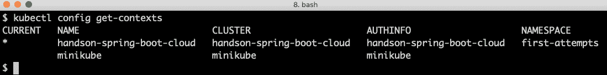

第一列中的通配符`*`标记当前上下文。

只有在集群创建完成后，你才会在前面的响应中看到`handson-spring-boot-cloud`上下文，下面我们将进行描述。

如果你想要将当前上下文切换到另一个上下文，即与其他 Kubernetes 集群一起工作，请运行以下命令：

```java
kubectl config use-context my-cluster
```

在前面的示例中，当前上下文将更改为`my-cluster`。

要更新上下文，例如，切换`kubectl`使用的默认命名空间，请使用`kubectl config set-context`命令。

例如，要将当前上下文的默认命名空间更改为`my-namespace`，请使用以下命令：

```java
kubectl config set-context $(kubectl config current-context) --namespace my-namespace
```

在前面的命令中，`kubectl config current-context`用于获取当前上下文的名字。

# 创建 Kubernetes 集群

要使用 Minikube 创建 Kubernetes 集群，我们需要运行几个命令：

+   取消设置`KUBECONFIG`环境变量，以确保`kubectl`上下文创建在默认配置文件`~/.kube/config`中。

+   指定要用于集群的 Minikube 配置文件。我们将使用`handson-spring-boot-cloud`作为配置文件名。

+   使用`minikube start`命令创建集群，我们还可以指定要分配给集群的硬件资源量。为了能够完成本书剩余章节中的示例，请至少为集群分配 10 GB 内存，即 10,240 MB。

+   集群创建完成后，我们将使用 Minikube 的插件管理器来启用 Minikube 自带的 Ingress 控制器和指标服务器。Ingress 控制器和指标将在接下来的两章中使用。

在使用 Minikube 创建 Kubernetes 集群之前，关闭 macOS 上的 Docker 可能是个好主意，以避免内存不足。

运行以下命令来创建 Kubernetes 集群：

```java
unset KUBECONFIG 
minikube profile handson-spring-boot-cloud

minikube start \
 --memory=10240 \
 --cpus=4 \
 --disk-size=30g \
 --kubernetes-version=v1.15.0 \
 --vm-driver=virtualbox

minikube addons enable Ingress
minikube addons enable metrics-server
```

在前面的命令完成后，你应该能够与集群通信。尝试运行`kubectl get nodes`命令。它应该响应与以下内容相似的东西：

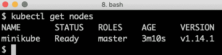

创建后，集群将在后台初始化自己，在`kube-system`命名空间中启动多个系统 pods。我们可以通过以下命令监控其进度：

```java
kubectl get pods --namespace=kube-system
```

一旦启动完成，之前的命令应该报告所有 pods 的状态为`运行中`，并且 READY 计数应该是`1/1`，这意味着每个 pods 中的单个容器都在运行中。

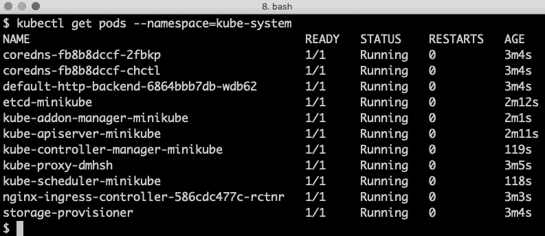

我们现在准备采取一些行动！

# 尝试一个示例部署

那么我们应该如何进行以下操作呢？

+   在我们的 Kubernetes 集群中部署一个基于 NGINX 的简单 web 服务器。

+   对部署应用一些更改：

    +   删除一个 pods 并验证 ReplicaSet 创建一个新的。

    +   将 web 服务器扩展到三个 pods，以验证 ReplicaSet 填充差距。

+   使用具有节点端口的服务的路由将外部流量指向它。

首先，创建一个名为`first-attempts`的命名空间，并更新`kubectl`上下文，使其默认使用此命名空间：

```java
kubectl create namespace first-attempts
kubectl config set-context $(kubectl config current-context) --namespace=first-attempts
```

我们现在可以使用`kubernetes/first-attempts/nginx-deployment.yaml`文件在命名空间中创建一个 NGINX 部署。这个文件如下所示：

```java
apiVersion: apps/v1
kind: Deployment
metadata:
  name: nginx-deploy
spec:
  replicas: 1
  selector:
    matchLabels:
    app: nginx-app
  template:
    metadata:
      labels:
        app: nginx-app
    spec:
      containers:
      - name: nginx-container
        image: nginx:latest
        ports:
        - containerPort: 80
```

让我们更详细地解释前面的源代码：

+   `kind`和`apiVersion`属性用于指定我们正在声明一个部署对象。

+   `metadata`部分用于描述部署对象，例如，当我们给它一个名字`nginx-deploy`时。

+   接下来是一个`spec`部分，它定义了部署对象的期望状态：

    +   `replicas: 1`指定我们希望运行一个 pods。

    +   `selector`部分指定部署如何查找其管理的 pods。在这种情况下，部署将查找具有`app`标签设置为`nginx-app`的 pods。

    +   `template`部分用于指定如何创建 pods：

        +   `metadata`部分指定了`label`，`app: nginx-app`，用于标识 pods，从而匹配选择器。

        +   `spec`部分指定单个容器在 pods 中的创建细节，即`name`和`image`以及它使用哪些`ports`。

使用以下命令创建部署：

```java
cd $BOOK_HOME/Chapter15
kubectl apply -f kubernetes/first-attempts/nginx-deployment.yaml
```

让我们看看使用`kubectl get all`命令我们能得到什么：

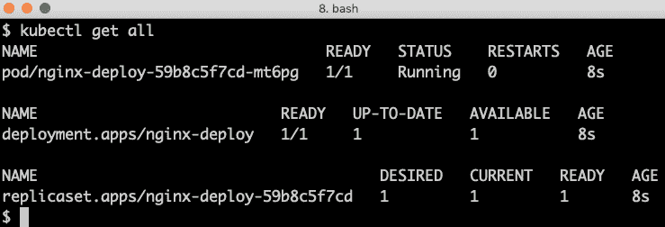

如预期那样，我们得到了一个部署、ReplicaSet 和 pods 对象。在短暂的时间后，这主要取决于下载 NGINX Docker 镜像所需的时间，pods 将启动并运行，期望的状态将等于当前状态！

通过以下命令删除 pods 来改变当前状态：

```java
kubectl delete pod --selector app=nginx-app
```

由于 pods 有一个随机名称（在前面的示例中为`nginx-deploy-59b8c5f7cd-mt6pg`），pods 是基于设置为`nginx-app`的`app`标签来选择的。

运行随后的`kubectl get all`命令将揭示 ReplicaSet 在几秒钟内检测到期望状态和当前状态之间的差异并处理，即几乎立即启动一个新的 pods。

通过在`kubernetes/first-attempts/nginx-deployment.yaml`部署文件中将期望的 pods 数量设置为三个副本来改变期望状态。只需重复之前的`kubectl apply`命令，就可以将更改应用到期望的状态。

快速运行几次`kubectl get all`命令，以监控 Kubernetes 如何采取行动确保当前状态满足新的期望状态。几秒钟后，将会有两个新的 NGINX pod 启动并运行。期望的状态再次等于具有三个运行中的 NGINX pod 的当前状态。期待看到的响应类似于以下内容：

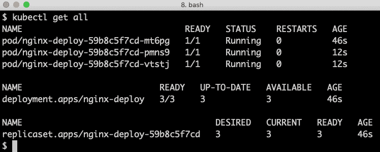

为了使外部通信能够与 Web 服务器通信，请使用`kubernetes/first-attempts/nginx-service.yaml`文件创建服务：

```java
apiVersion: v1
kind: Service
metadata:
  name: nginx-service
spec:
  type: NodePort
  selector:
    app: nginx-app
  ports:
    - targetPort: 80
      port: 80
      nodePort: 30080
```

让我们更详细地解释前面的源代码：

+   `kind`和`apiVersion`属性用于指定我们正在声明一个`Service`对象。

+   `metadata`部分用于描述`Service`对象，例如，给它一个名字：`nginx-service`。

+   接下来是`spec`部分，它定义了`Service`对象的期望状态：

    +   使用`type`字段，我们指定我们希望是`NodePort`，即在每个集群节点上的专用端口上可访问的外部服务。这意味着外部调用者可以使用这个端口访问集群中的任何节点的 pods，而不依赖于 pods 实际运行在哪些节点上。

    +   选择器由服务用来查找可用的 pods，在我们的案例中，是标记有`app: nginx-app`的 pods。

    +   最后，`ports`如下声明：

        +   `port: 80`指定服务将在哪个端口上内部可访问，即在集群内部。

        +   `nodePort: 30080`指定服务将在哪个端口上使用集群中的任何节点对外部可访问。默认情况下，节点端口必须在`30000`到`32767`的范围内。

        +   `targetPort: 80`指定请求将在哪个端口上转发到 pods 中。

此端口范围用于最小化与其他正在使用的端口冲突的风险。在生产系统中，通常会在 Kubernetes 集群前放置一个负载均衡器，保护外部用户既不知道这些端口，也不知道 Kubernetes 集群中节点的 IP 地址。参见第十八章、*使用服务网格提高可观测性和管理*节的*设置 Istio 所需的端口转发*，了解有关`LoadBalanced` Kubernetes 服务的使用。

使用以下命令创建服务：

```java
kubectl apply -f kubernetes/first-attempts/nginx-service.yaml
```

要查看我们得到了什么，运行`kubectl get svc`命令。期待如下的响应：

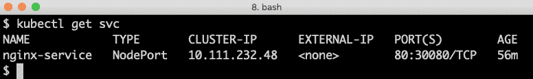

`kubectl`支持许多 API 对象的简称，作为其全名的替代。例如，在前面的命令中使用了`svc`而不是完整名称`service`。

为了尝试这个，我们需要知道我们集群中单个节点的 IP 地址。我们可以通过运行 `minikube ip` 命令来获取。在我的情况下，它是 `192.168.99.116`。使用这个 IP 地址和节点端口 `30080`，我们可以将网页浏览器定向到部署的 Web 服务器。在我的情况下，地址是 `http://192.168.99.116:30080`。预期如下的响应：

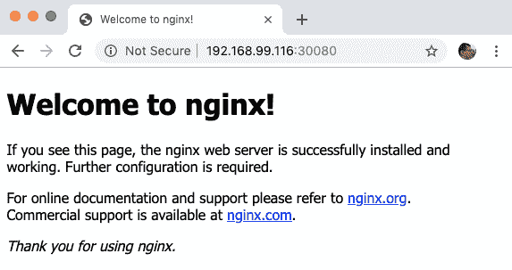

太好了！但是内部集群 IP 地址和端口又如何呢？

验证的一种方法是，在集群内部启动一个小型 pod，我们可以用它从内部运行 `curl`，也就是说，我们能够使用集群内部的 IP 地址和端口。我们不需要使用 IP 地址，相反，我们可以使用为服务在内部 DNS 服务器上创建的 DNS 名称。DNS 名称的短名称与服务的名称相同，即 `nginx-service`。

运行以下命令：

```java
kubectl run -i --rm --restart=Never curl-client --image=tutum/curl:alpine --command -- curl -s 'http://nginx-service:80'
```

前一个命令看起来有点复杂，但它只会做以下事情：

1.  基于 `tutum/curl:alpine` Docker 镜像创建一个小型容器，该镜像包含 `curl` 命令。

1.  在容器内运行 `curl -s 'http://nginx-service:80'` 命令，并使用 `-i` 选项将输出重定向到终端。

1.  使用 `--rm` 选项删除 pod。

预期前面命令的输出将包含以下信息（我们这里只展示了响应的一部分）：

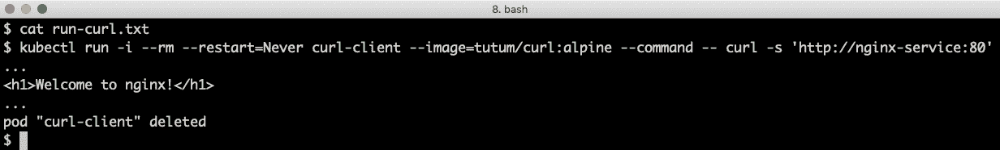

这意味着 Web 服务器也可以在集群内部访问！

这基本上是我们需要了解的，以便能够部署我们的系统架构。

通过删除包含 `nginx` 部署的命名空间来结束：

```java
kubectl delete namespace first-attempts
```

在我们结束关于 Kubernetes 的入门章节之前，我们需要学习如何管理我们的 Kubernetes 集群。

# 管理 Kubernetes 集群

运行中的 Kubernetes 集群会消耗大量资源，主要是内存。因此，当我们完成在 Minikube 中与 Kubernetes 集群的工作时，我们必须能够挂起它，以释放分配给它的资源。我们还需要知道如何恢复集群，当我们想继续工作时。最终，我们也必须能够永久删除集群，当我们不想再在磁盘上保留它时。

Minikube 带有一个 `stop` 命令，可以用来挂起一个 Kubernetes 集群。我们用来最初创建 Kubernetes 集群的 `start` 命令也可以用来从挂起状态恢复集群。要永久删除一个集群，我们可以使用 Minikube 的 `delete` 命令。

# 挂起和恢复 Kubernetes 集群

运行以下命令来挂起（即 `stop`）Kubernetes 集群：

```java
minikube stop
```

运行以下命令来恢复（即 `start`）Kubernetes 集群：

```java
minikube start
```

当恢复一个已经存在的集群时，`start` 命令会忽略你在创建集群时使用的开关。

在恢复 Kubernetes 集群后，`kubectl` 上下文将更新为使用此集群，当前使用的命名空间设置为 `default`。如果你正在使用另一个命名空间，例如我们将在下一章使用的 `hands-on` 命名空间，即 第十六章，*将我们的微服务部署到 Kubernetes*，你可以使用以下命令更新 `kubectl` 上下文：

```java
kubectl config set-context $(kubectl config current-context) --namespace=hands-on

```

随后的 `kubectl` 命令将在适用的情况下应用于 `hands-on` 命名空间。

# 销毁 Kubernetes 集群

运行以下命令以终止 Kubernetes 集群：

```java
minikube delete --profile handson-spring-boot-cloud 
```

你实际上可以不指定配置文件运行 `delete` 命令，但我发现指明配置文件更安全。否则，你可能会意外地删除错误的 Kubernetes 集群！

neither the Minikube profile definition under `~/.minikube/profiles/` nor the `kubectl` context in `~/.kube/config` is deleted by this command. If they are no longer required, they can be deleted with the following commands:

```java
rm -r ~/.minikube/profiles/handson-spring-boot-cloud
kubectl config delete-context handson-spring-boot-cloud
```

`kubectl config delete-context` 命令会警告你关于删除活动上下文的内容，但是没关系。

我们已经成功学会了如何管理在 Minikube 中运行的 Kubernetes 集群。我们现在知道如何挂起和恢复集群，当不再需要时，我们知道如何永久删除它。

# 总结

在本章中，我们已经介绍了 Kubernetes 作为容器编排器。Kubernetes 使得运行容器的集群服务器看起来像一个大的逻辑服务器。作为操作员，我们向集群声明一个期望状态，Kubernetes 持续将期望状态与当前状态进行比较。如果它检测到差异，它将采取行动确保当前状态与期望状态相同。

期望的状态通过使用 Kubernetes API 服务器创建资源来声明。Kubernetes 控制器管理器和其控制器对由 API 服务器创建的各种资源做出反应，并采取行动确保当前状态满足新的期望状态。调度器为新生成的容器分配节点，即包含一个或多个容器的 pod。在每个节点上，都有一个代理，`kubelet` 运行并确保调度到其节点的 pod 正在运行。`kube-proxy` 充当网络代理，通过将发送到服务的请求转发到集群中可用的 pod，实现服务抽象。外部请求可以由指定节点上可用的节点端口的服务处理，或者通过专用的 Ingress 资源处理。

我们还通过使用 Minikube 和 VirtualBox 创建了一个本地单节点集群来尝试 Kubernetes。使用名为 `kubectl` 的 Kubernetes CLI 工具，我们部署了一个基于 NGINX 的简单 Web 服务器。我们通过删除 Web 服务器来尝试弹性能力，并观察它自动重建以及通过请求在 Web 服务器上运行三个 Pod 来扩展它。最后，我们创建了一个具有节点端口的服务的服务，并验证了我们可以从集群内外访问它。

最后，我们学会了如何管理在 VirtualBox 上运行的 Minikube 中的 Kubernetes 集群，包括如何休眠、恢复和终止 Kubernetes 集群。

我们现在准备将前面章节中的系统架构部署到 Kubernetes 中。翻到下一章，了解如何进行部署！

# 问题

1.  如果你两次运行相同的 `kubectl create` 命令会发生什么？

1.  如果你两次运行相同的 `kubectl apply` 命令会发生什么？

1.  关于问题 *1* 和 *2*，为什么它们第二次运行时行为不同？

1.  ReplicaSet 的目的是什么，还有哪些资源会创建 ReplicaSet？

1.  在 Kubernetes 集群中 `etcd` 的作用是什么？

1.  容器如何找出同一 Pod 中运行的另一容器的 IP 地址？

1.  如果你创建了两个名称相同但在不同命名空间中的部署会发生什么？

1.  如果你在两个不同的命名空间中创建了两个名称相同的服务，你会使得这两个服务的创建失败。
