# 第十六章：将我们的微服务部署到 Kubernetes

在本章中，我们将把本书中的微服务部署到 Kubernetes。我们还将学习 Kubernetes 的一些核心特性，例如使用**Kustomize**为不同的运行时环境配置部署，以及使用 Kubernetes 部署对象进行滚动升级。在那之前，我们需要回顾一下我们如何使用服务发现。由于 Kubernetes 内置了对服务发现的支持，因此似乎没有必要部署我们自己的服务发现，毕竟我们到目前为止一直在使用 Netflix Eureka。

本章将涵盖以下主题：

+   用 Kubernetes `Service`对象和`kube-proxy`替换 Netflix Eureka 进行服务发现

+   使用 Kustomize 准备在不同环境中部署的微服务

+   使用测试脚本的某个版本来测试部署，`test-em-all.bash`

+   执行滚动升级

+   学习如何回滚一个失败的升级

# 技术要求

本书中描述的所有命令都是在一个 MacBook Pro 上使用 macOS Mojave 运行的，但如果你想在其他平台（如 Linux 或 Windows）上运行它们，应该很容易进行修改。

本章所需的一个新工具是`siege`命令行工具，用于基于 HTTP 的负载测试和基准测试。在我们执行滚动升级时，我们将使用`siege`给 Kubernetes 集群施加一些负载。该工具可以通过 Homebrew 使用以下命令安装：

```java
brew install siege
```

本章的源代码可以在本书的 GitHub 仓库中找到：[`github.com/PacktPublishing/Hands-On-Microservices-with-Spring-Boot-and-Spring-Cloud/tree/master/Chapter16`](https://github.com/PacktPublishing/Hands-On-Microservices-with-Spring-Boot-and-Spring-Cloud/tree/master/Chapter16)。

为了能够运行本书中描述的命令，你需要将源代码下载到一个文件夹中，并设置一个环境变量，`$BOOK_HOME`，该变量指向该文件夹。一些示例命令如下：

```java
export BOOK_HOME=~/Documents/Hands-On-Microservices-with-Spring-Boot-and-Spring-Cloud
git clone https://github.com/PacktPublishing/Hands-On-Microservices-with-Spring-Boot-and-Spring-Cloud $BOOK_HOME
cd $BOOK_HOME/Chapter16
```

本章中的所有源代码示例都来自`$BOOK_HOME/Chapter16`的源代码，并且已经使用 Kubernetes 1.15 进行了测试。

如果你想要查看在本章中应用到源代码的变化，也就是说，查看部署到 Kubernetes 上的微服务所需的变化，你可以与第十五章的*Kubernetes 入门*源代码进行对比。你可以使用你喜欢的`diff`工具，比较两个文件夹，`$BOOK_HOME/Chapter15`和`$BOOK_HOME/Chapter16`。

# 用 Kubernetes 服务替换 Netflix Eureka

如前章所示，第十五章，*Kubernetes 简介*，Kubernetes 带有一个基于 Kubernetes `Service`对象和`kube-proxy`运行时组件的内置发现服务。这使得不需要部署一个单独的发现服务，如我们前几章中使用的 Netflix Eureka。使用 Kubernetes 发现服务的一个优点是，它不需要像我们与 Netflix Eureka 一起使用的 Netflix Ribbon 这样的客户端库。这使得 Kubernetes 发现服务易于使用，且与微服务基于哪种语言或框架无关。使用 Kubernetes 发现服务的缺点是，它只能在 Kubernetes 环境中运行。然而，由于发现服务基于`kube-proxy`，后者接受对服务对象 DNS 名称或 IP 地址的请求，因此应该相当简单地用类似的服务替换它，例如另一个容器编排器的捆绑服务。

总结来说，我们将从我们的微服务架构中移除基于 Netflix Eureka 的发现服务器，如图所示：

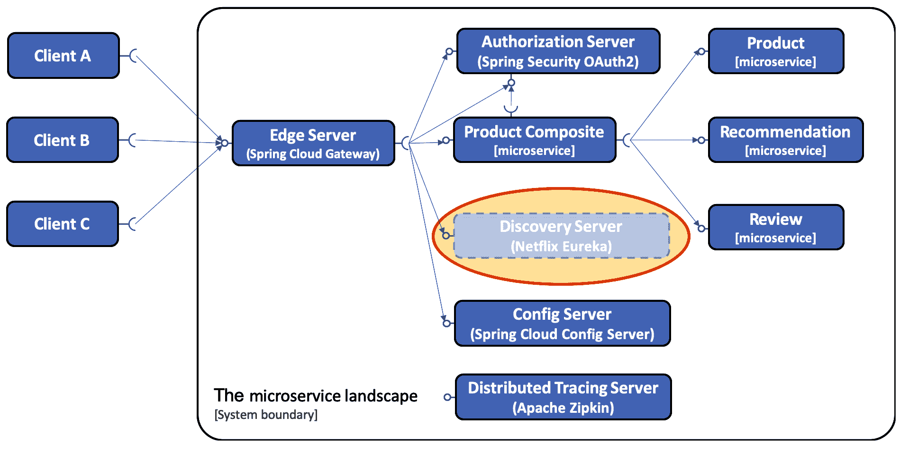

为了将基于 Netflix Eureka 的发现服务器替换为 Kubernetes 内置的发现服务，已对源代码应用了以下更改：

+   我们已经从配置仓库`config-repo`中移除了 Netflix Eureka 和 Ribbon 特定的配置（客户端和服务器）。

+   网关服务中的路由规则已从`config-repo/gateway.yml`文件中移除。

+   我们已经移除了 Eureka 服务器项目，即移除了`spring-cloud/eureka-server`文件夹。

+   我们已经从 Docker Compose 文件和`settings.gradle`Gradle 文件中移除了 Eureka 服务器。

+   我们已经在所有 Eureka 客户端的构建文件中移除了对`spring-cloud-starter-netflix-eureka-client`的依赖，即`build.gradle`文件。

+   我们已经从所有 Eureka 客户端集成测试中移除了不再需要的`eureka.client.enabled=false`属性设置。

+   网关服务不再使用基于客户端负载均衡器的 Spring Cloud 路由，使用`lb`协议。例如，`lb://product-composite`路由目的地已替换为`http://product-composite`在`config-repo/gateway.yml`文件中。

+   微服务和授权服务器使用的 HTTP 端口已从端口`8080`（在授权服务器的情况下为端口`9999`）更改为默认的 HTTP 端口`80`。这在受影响的每个服务的`config-repo`中进行了配置，如下所示：

```java
spring.profiles: docker
server.port: 80
```

我们使用的所有 HTTP 地址都不会因将 Netflix Eureka 替换为 Kubernetes 服务而受到影响。例如，复合服务使用的地址不受影响：

```java
private final String productServiceUrl = "http://product";
private final String recommendationServiceUrl = "http://recommendation";
private final String reviewServiceUrl = "http://review";
```

这是通过改变微服务和授权服务器所使用的 HTTP 端口为默认的 HTTP 端口`80`，如前所述来实现的。

使用 Docker Compose 仍然可行，尽管 Netflix Eureka 已经被移除。这可以用来在不将微服务部署到 Kubernetes 的情况下运行其功能测试，例如，与 macOS 上的 Docker 一起运行`test-em-all.bash`，就像前几章中一样。然而，移除 Netflix Eureka 意味着当我们仅使用 Docker 和 Docker Compose 时，我们不再有一个发现服务。因此，只有在部署到 Kubernetes 时，微服务才能进行扩展。

现在我们已经熟悉了 Kubernetes 服务，接下来让我们看看 Kustomize，这是一个用于自定义 Kubernetes 对象的工具有。

# 介绍 Kustomize

**Kustomize**是一个用于创建 Kubernetes 定义文件（即 YAML 文件）的环境特定自定义的工具，例如，用于开发、测试、暂存和生产环境。常见的定义文件存储在一个`base`文件夹中，而环境特定的添加内容则保存在特定的`overlay`文件夹中。环境特定的信息可以是以下任意一种：

+   要使用哪个版本的 Docker 镜像

+   要运行的副本数量

+   关于 CPU 和内存的资源配额

每个文件夹中都包含一个`kustomization.yml`文件，它描述了其内容给 Kustomize。当部署到特定环境时，Kustomize 将从`base`文件夹和环境特定的`overlay`文件夹中获取内容，并将组合后的结果发送给`kubectl`。来自`overlay`文件夹中的文件属性将覆盖`base`文件夹中相应的属性，如果有的话。

在本章中，我们将为两个示例环境设置自定义：开发和生产。

`$BOOK_HOME/Chapter16`下的文件夹结构如下所示：

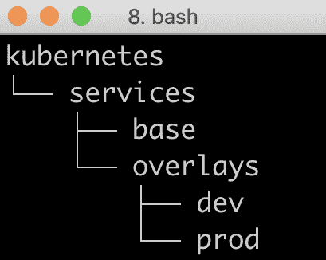

自 Kubernetes 1.14 起，`kubectl`自带了对 Kustomize 的内置支持，使用`-k`标志。正如我们将继续看到的，使用 Kustomize 将服务部署到开发环境，将由`kubectl apply -k kubernetes/services/overlays/dev`命令完成。

# 在基础文件夹中设置常见定义

在`base`文件夹中，我们将为每个微服务都有一个定义文件，但对于资源管理器（MongoDB、MySQL 和 RabbitMQ）则没有。资源管理器只在开发环境中部署到 Kubernetes，并预期在生产环境中运行在 Kubernetes 之外——例如，作为现有本地数据库和消息队列管理服务的一部分，或者作为云上的托管服务。

`base` 文件夹中的定义文件包含每个微服务的部署对象和服务对象。让我们来看一下 `kubernetes/services/base/product.yml` 中的典型部署对象。它旨在满足开发环境的需求。它从以下代码开始：

```java
apiVersion: apps/v1
kind: Deployment
metadata:
  name: product
spec:
  replicas: 1
  selector:
    matchLabels:
      app: product
  template:
    metadata:
      labels:
        app: product
    spec:
      containers:
      - name: pro
```

这部分看起来与前一章中使用的 NGINX 部署完全一样，因此我们不需要再次讨论。第十五章 *Kubernetes 简介*中的*尝试样本部署*部分，所以我们不需要再次讨论。

下一部分看起来有点不同：

```java
        image: hands-on/product-service
        imagePullPolicy: Never
        env:
        - name: SPRING_PROFILES_ACTIVE
          value: "docker"
        envFrom:
        - secretRef:
            name: config-client-credentials
        ports:
        - containerPort: 80
        resources:
          limits:
            memory: 350Mi
```

让我们更详细地解释前面的源代码：

+   指定的 Docker 镜像 `hands-on/product-service` 将在我们构建微服务时创建。有关更多信息，请参阅*构建 Docker 镜像*部分。

+   `imagePullPolicy: Never` 声明告诉 Kubernetes 不要尝试从 Docker 注册表下载 Docker 镜像。有关更多信息，请参阅*构建 Docker 镜像*部分。

+   `SPRING_PROFILES_ACTIVE` 环境变量被定义为告诉 Spring 应用程序在配置存储库中使用 `docker` Spring 配置文件。

+   使用秘密 `config-client-credentials` 为容器提供访问配置服务器的凭据。

+   使用的 HTTP 端口是默认的 HTTP 端口 `80`。

+   定义了资源限制，以将可用内存最大化到 350 MB，这与前面章节中使用 Docker Compose 的方式相同。

部署对象的最后一部分包含存活和就绪探针：

```java
        livenessProbe:
          httpGet:
            scheme: HTTP
            path: /actuator/info
            port: 80
          initialDelaySeconds: 10
          periodSeconds: 10
          timeoutSeconds: 2
          failureThreshold: 20
          successThreshold: 1
        readinessProbe:
          httpGet:
            scheme: HTTP
            path: /actuator/health
            port: 80
          initialDelaySeconds: 10
          periodSeconds: 10
          timeoutSeconds: 2
          failureThreshold: 3
          successThreshold: 1
```

让我们更详细地解释前面的源代码：

+   **存活探针**是基于发送到 Spring Boot Actuator `info` 端点的 HTTP 请求。这意味着，如果微服务实例处于如此糟糕的状态，以至于无法对发送到轻量级 `info` 端点的请求返回 200（OK）状态码，那么是时候让 Kubernetes 重新启动微服务实例了。

+   **就绪探针**是基于发送到 Spring Boot Actuator `health` 端点的 HTTP 请求。Kubernetes 只会在微服务实例的 `health` 端点返回 HTTP 状态码 200（OK）时发送请求到微服务实例。如果没有返回 200（OK）状态码，通常意味着微服务实例在访问其所依赖的一些资源时存在问题，因此在微服务实例没有在 `health` 端点返回 200（OK）时，不向其发送任何请求是有意义的。

+   存活和就绪探针可以通过以下属性进行配置：

    +   `initialDelaySeconds` 指定 Kubernetes 在容器启动后等待探针的时间。

    +   `periodSeconds` 指定 Kubernetes 发送探针请求之间的时间。

    +   `timeoutSeconds` 指定 Kubernetes 等待响应的时间，如果在规定时间内没有响应，则认为探针失败。

    +   `failureThreshold`指定 Kubernetes 在放弃之前尝试失败的次数。对于存活探针，这意味着重启容器。对于就绪探针，这意味着 Kubernetes 将不再向容器发送任何请求。

    +   `successThreshold`指定探针在失败后需要成功尝试的次数才能被认为是成功的。这仅适用于就绪探针，因为如果为存活探针指定，它们必须设置为`1`。

为探针寻找最佳设置可能具有挑战性，也就是说，找到当探针的可用性发生变化时 Kubernetes 能够快速反应以及不过度加载探针请求之间的适当平衡。特别是如果为存活探针配置的值过低，可能导致 Kubernetes 重启刚刚需要一些时间启动的容器，即不需要重启的容器。如果为存活探针设置的值过低，启动大量容器可能会导致很多不必要的重启。在探针上设置配置值过高（除了`successThreshold`值）会使 Kubernetes 反应变慢，这在开发环境中可能会很烦人。适当的值还取决于可用硬件，这会影响容器的启动时间。对于本书的范围，存活探针的`failureThreshold`设置为一个高值`20`，以避免在硬件资源有限的计算机上进行不必要的重启。

`kubernetes/services/base/product.yml`文件中的服务对象如下所示：

```java
apiVersion: v1
kind: Service
metadata:
  name: product
spec:
  selector:
    app: product
  ports:
  - port: 80
    targetPort: 80
```

服务对象与我们在上一章第十五章、*Kubernetes 简介*中的*尝试样本部署*部分使用的 NGINX 服务对象类似。不同之处在于服务类型是`ClusterIP`（这是默认类型，因此没有指定）。服务对象将接收端口`80`上的内部请求，并将它们转发到所选容器的目标端口`80`。这个规则的唯一例外是通过宿主机的端口`NodePort`暴露的外部网关微服务，即`31443`：

```java
apiVersion: v1
kind: Service
metadata:
 name: gateway
spec:
 type: NodePort
 selector:
 app: gateway
 ports:
 - port: 443
 nodePort: 31443
 targetPort: 8443
```

最后，我们在`base`文件夹中有一个将所有内容结合在一起的 Kustomize 文件：

```java
resources:
- auth-server.yml
- config-server.yml
- gateway.yml
- product-composite.yml
- product.yml
- recommendation.yml
- review.yml
- zipkin-server.yml
```

它简单地列出了 Kustomize 将在`base`文件夹中使用的 YAML 定义文件。

现在，我们将看看我们如何可以使用这些基本定义与`overlay`文件夹中的定义一起使用，并了解它们是如何使用`kubectl apply`命令的`-k`选项应用的。

# 将应用程序部署到 Kubernetes 以供开发和测试使用

在本节中，我们将部署用于开发和测试活动的微服务环境，例如系统集成测试。这种环境主要用于功能测试，因此配置为使用最少的系统资源。

由于`base`文件夹中的部署对象是为开发环境配置的，因此它们在开发的上层叠加中不需要进一步的细化。我们只需要像使用 Docker Compose 一样为 RabbitMQ、MySQL 和 MongoDB 的三个资源管理器添加部署和服务对象。我们将在这三个资源管理器中部署与微服务相同的 Kubernetes 命名空间。下面的图表展示了这一点：

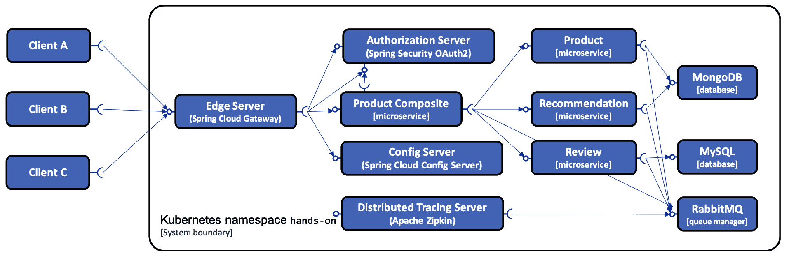

资源管理器的定义文件可以在`kubernetes/services/overlays/dev`文件夹中找到。

`kustomization.yml`文件看起来像这样：

```java
bases:
- ../../base
resources:
- mongodb-dev.yml
- rabbitmq-dev.yml
- mysql-dev.yml
```

它定义了`base`文件夹作为基础，并添加了我们之前提到的三个资源。

# 构建 Docker 镜像

通常，我们需要将镜像推送到 Docker 注册表，并配置 Kubernetes 从注册表中拉取镜像。在我们的案例中，我们有一个本地的单节点集群，我们可以通过将 Docker 客户端指向 Minikube 中的 Docker 引擎，然后运行`docker-compose build`命令，来简化这个过程。这将使 Docker 镜像立即可供 Kubernetes 使用。对于开发，我们将使用`latest`作为微服务的 Docker 镜像版本。

您可能想知道我们如何更新使用`latest` Docker 镜像的 pods。

从 Kubernetes 1.15 开始，这非常简单。只需更改代码并重新构建 Docker 镜像，例如使用这里描述的`build`命令。然后，使用`kubectl rollout restart`命令更新一个 pods。

例如，如果`product`服务已更新，运行`kubectl rollout restart deploy product`命令。

您可以从源代码构建 Docker 镜像，如下所示：

```java
cd $BOOK_HOME/Chapter16
eval $(minikube docker-env)
./gradlew build && docker-compose build
```

`eval $(minikube docker-env)`命令使本地 Docker 客户端与 Minikube 中的 Docker 引擎通信，例如，在构建 Docker 镜像时。

`docker-compose.yml`文件已更新以指定构建的 Docker 镜像的名称。例如，对于`product`服务，我们有如下内容：

```java
  product:
    build: microservices/product-service
    image: hands-on/product-service
```

`latest`是 Docker 镜像名称的默认标签，因此不需要指定。

构建 Docker 镜像后，我们可以开始创建 Kubernetes 资源对象！

# 部署到 Kubernetes

在我们将微服务部署到 Kubernetes 之前，我们需要创建一个命名空间，所需的 config maps 和 secrets。部署完成后，我们将等待部署运行起来，并验证我们在部署的 pods 和每个 pod 中使用的 Docker 镜像是否符合预期。

创建一个命名空间，`hands-on`，并将其设置为`kubectl`的默认命名空间：

```java
kubectl create namespace hands-on
kubectl config set-context $(kubectl config current-context) --namespace=hands-on
```

所有应用程序配置都保存在由配置服务器管理的配置仓库中。唯一需要存储在配置仓库外的配置信息是连接到配置服务器的凭据和一个加密密钥。加密密钥由配置服务器使用，以保持配置仓库中的敏感信息在磁盘上加密。

我们将把配置仓库存储在一个带有所有敏感信息加密的 config map 中；具体请参阅第十二章，*集中配置*。连接配置服务器和加密密钥的凭据将存储在两个秘密中，一个用于配置服务器，一个用于其客户端。

为了验证这一点，请执行以下步骤：

1.  基于`config-repo`文件夹中的文件，使用以下命令创建 config map：

```java
kubectl create configmap config-repo --from-file=config-repo/ --save-config
```

1.  使用以下命令创建配置服务器秘密：

```java
kubectl create secret generic config-server-secrets \
  --from-literal=ENCRYPT_KEY=my-very-secure-encrypt-key \
  --from-literal=SPRING_SECURITY_USER_NAME=dev-usr \
  --from-literal=SPRING_SECURITY_USER_PASSWORD=dev-pwd \
  --save-config
```

1.  使用以下命令为配置服务器的客户端创建秘密：

```java
kubectl create secret generic config-client-credentials \
--from-literal=CONFIG_SERVER_USR=dev-usr \
--from-literal=CONFIG_SERVER_PWD=dev-pwd --save-config
```

由于我们刚刚输入了包含敏感信息的明文命令，例如密码和加密密钥，清除`history`命令是一个好主意。要清除内存和磁盘上的`history`命令，请运行`history -c; history -w`命令。

有关`history`命令的详细信息，请参阅[`unix.stackexchange.com/a/416831`](https://unix.stackexchange.com/a/416831)的讨论。

1.  为了避免由于 Kubernetes 下载 Docker 镜像而导致部署缓慢（可能会导致我们之前描述的存活探针重启我们的 pods），请运行以下`docker pull`命令以下载镜像：

```java
docker pull mysql:5.7
docker pull mongo:3.6.9
docker pull rabbitmq:3.7.8-management
docker pull openzipkin/zipkin:2.12.9
```

1.  基于`dev`覆盖层，使用`-k`开关激活 Kustomize，如前所述部署开发环境的微服务：

```java
kubectl apply -k kubernetes/services/overlays/dev
```

1.  通过运行以下命令等待部署及其 pods 启动并运行：

```java
kubectl wait --timeout=600s --for=condition=ready pod --all
```

期望每个命令的响应为`deployment.extensions/... condition met`。`...`将被实际部署的名称替换。

1.  要查看用于开发的 Docker 镜像，请运行以下命令：

```java
kubectl get pods -o json | jq .items[].spec.containers[].image
```

响应应类似于以下内容：

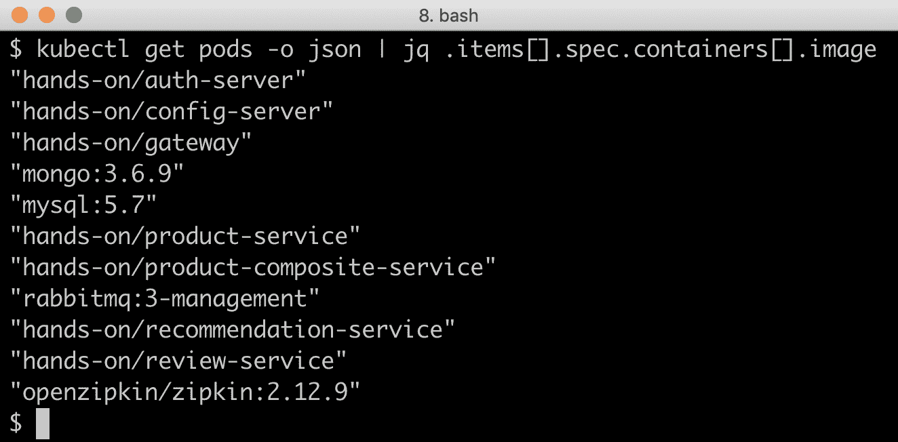

我们现在准备好测试我们的部署！

但在我们能做到这一点之前，我们需要经历测试脚本中必须与 Kubernetes 一起使用的更改。

# 用于与 Kubernetes 一起使用的测试脚本的更改

为了测试部署，我们将像往常一样运行测试脚本，即`test-em-all.bash`。为了与 Kubernetes 配合工作，电路断路器测试做了一些微小修改。详情请查看`testCircuitBreaker()`函数。电路断路器测试调用`product-composite`服务上的`actuator`端点，以检查其健康状态并获得电路断路器事件访问权限。`actuator`端点并未对外暴露，因此当使用 Docker Compose 和 Kubernetes 时，测试脚本需要使用不同的技术来访问内部端点：

+   当使用 Docker Compose 时，测试脚本将使用简单的`docker run`命令启动一个 Docker 容器，该命令从 Docker Compose 创建的网络内部调用`actuator`端点。

+   当使用 Kubernetes 时，测试脚本将启动一个 Kubernetes pod，它可以在 Kubernetes 内部运行相应的命令。

让我们看看在使用 Docker Compose 和 Kubernetes 时是如何做到的。

# 使用 Docker Compose 访问内部 actuator 端点

为 Docker Compose 定义的基本命令如下：

```java
EXEC="docker run --rm -it --network=my-network alpine"
```

请注意，在每次执行测试命令后，使用`--rm`选项将容器杀死。

# 使用 Kubernetes 访问内部 actuator 端点

由于在 Kubernetes 中启动 pod 比启动容器慢，测试脚本将启动一个名为`alpine-client`的单个 pod，该 pod 将在`testCircuitBreaker()`函数的开始处启动，并且测试将使用`kubectl exec`命令在这个 pod 中运行测试命令。这将比为每个测试命令创建和删除一个 pod 要快得多。

启动单个 pod 是在`testCircuitBreaker()`函数的开始处处理的：

```java
echo "Restarting alpine-client..."
local ns=$NAMESPACE
if kubectl -n $ns get pod alpine-client > /dev/null ; then
    kubectl -n $ns delete pod alpine-client --grace-period=1
fi
kubectl -n $ns run --restart=Never alpine-client --image=alpine --command -- sleep 600
echo "Waiting for alpine-client to be ready..."
kubectl -n $ns wait --for=condition=Ready pod/alpine-client

EXEC="kubectl -n $ns exec alpine-client --"
```

在电路断路器测试的最后，使用以下命令删除 pod：

```java
kubectl -n $ns delete pod alpine-client --grace-period=1
```

# 选择 Docker Compose 和 Kubernetes

为了使测试脚本能够与 Docker Compose 和 Kubernetes 一起工作，它假定如果`HOST`环境变量设置为`localhost`，则将使用 Docker Compose；否则，它假定将使用 Kubernetes。如下代码所示：

```java
if [ "$HOST" = "localhost" ]
then
    EXEC="docker run --rm -it --network=my-network alpine"
else
    echo "Restarting alpine-client..."
    ...
    EXEC="kubectl -n $ns exec alpine-client --"
fi
```

测试脚本中`HOST`环境变量的默认值是`localhost`。

一旦设置了`EXEC`变量，根据测试是在 Docker Compose 还是 Kubernetes 上运行，它将在`testCircuitBreaker()`测试函数中使用。测试首先通过以下语句验证电路断路器是关闭的：

```java
assertEqual "CLOSED" "$($EXEC wget product-composite:${MGM_PORT}/actuator/health -qO - | jq -r .details.productCircuitBreaker.details.state)"
```

测试脚本中的最后一步更改是因为我们的服务现在可以在集群内的`80`端口访问；也就是说，它们不再在`8080`端口。

如果我们使用过的各种端口看起来令人困惑，请回顾*在基础文件夹中设置常用定义*部分中服务定义。

# 测试部署

在启动测试脚本时，我们必须给它运行 Kubernetes 的主机的地址，即我们的 Minikube 实例，以及我们的网关服务监听外部请求的外部端口。可以使用 `minikube ip` 命令来查找 Minikube 实例的 IP 地址，正如在 *在基础文件夹中设置公共定义* 部分提到的，我们已经将网关服务的外部 `NodePort 31443` 分配给了网关服务。

使用以下命令开始测试：

```java
HOST=$(minikube ip) PORT=31443 ./test-em-all.bash
```

从脚本的输出中，我们将看到 Minikube 实例的 IP 地址的使用，以及如何创建和销毁 `alpine-client` 容器：

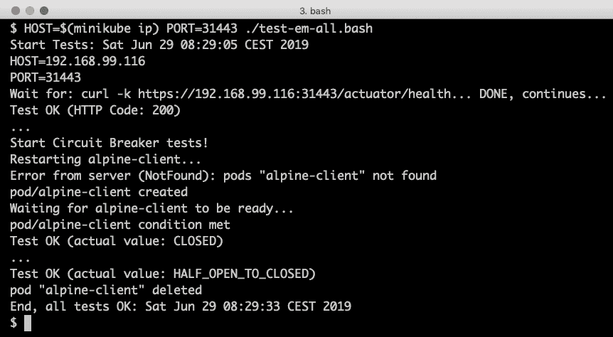

在我们继续查看如何为阶段和生产使用设置相应的环境之前，让我们清理一下我们在开发环境中安装的内容，以节省 Kubernetes 集群中的资源。我们可以通过简单地删除命名空间来实现这一点。删除命名空间将递归删除命名空间中存在的所有资源。

使用以下命令删除命名空间：

```java
kubectl delete namespace hands-on
```

移除了开发环境之后，我们可以继续设置一个针对阶段和生产的环境。

# 将微服务部署到 Kubernetes 用于阶段和生产

在这一节中，我们将把微服务部署到一个用于阶段和生产环境的系统中。阶段环境用于进行**质量保证**（**QA**）和**用户验收测试**（**UAT**），这是将新版本投入生产之前的最后一步。为了验证新版本不仅满足功能性需求，还包括性能、健壮性、可伸缩性和弹性等非功能性需求，阶段环境应尽可能与生产环境相似。

当将服务部署到用于阶段或生产的环境时，与开发或测试相比需要进行许多更改：

+   **资源管理器应运行在 Kubernetes 集群之外**：从技术上讲，将数据库和队列管理器作为有状态容器在 Kubernetes 上运行以供生产使用是可行的，可以使用 `StatefulSets` 和 `PersistentVolumes`。在撰写本章时，我建议不要这样做，主要是因为对有状态容器的支持相对较新，在 Kubernetes 中尚未得到验证。相反，我建议使用本地或云上的现有数据库和队列管理服务，让 Kubernetes 做它最擅长的事情，即运行无状态容器。对于本书的范围，为了模拟生产环境，我们将使用现有的 Docker Compose 文件，将 MySQL、MongoDB 和 RabbitMQ 作为普通的 Docker 容器在 Kubernetes 之外运行。

+   **锁定**：

    +   出于安全原因，诸如 `actuator` 端点和日志级别等事物需要在生产环境中受到限制。

    +   外部暴露的端点也应从安全角度进行审查。例如，配置服务器的访问在生产环境中很可能需要受到限制，但为了方便起见，我们将在本书中将其暴露出来。

    +   Docker 镜像标签必须指定，才能跟踪已部署微服务的哪些版本。

+   **扩大可用资源规模**：为了满足高可用性和更高负载的需求，每个部署至少需要运行两个 pods。我们可能还需要增加每个 pods 允许使用的内存和 CPU。为了避免 Minikube 实例中内存耗尽，我们将在每个部署中保留一个 pods，但在生产环境中增加允许的最大内存。

+   **建立一个生产就绪的 Kubernetes 集群**：这超出了本书的范围，但如果可行，我建议使用领先云服务提供商提供的托管 Kubernetes 服务。在本书的范围内，我们将部署到我们的本地 Minikube 实例。

这并不是在设置生产环境时需要考虑的详尽列表，但这是一个不错的开始。

我们的模拟生产环境将如下所示：

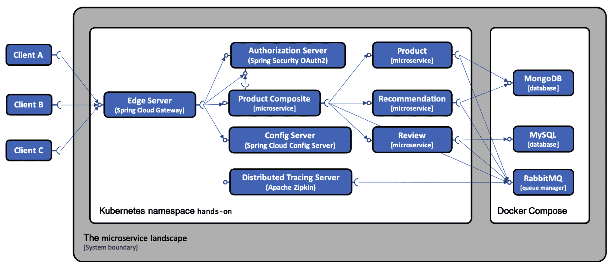

# 源代码中的更改：

以下更改已应用于源代码，以准备在用于生产的环境中部署：

+   在`config-repo`配置仓库中添加了一个名为`prod`的 Spring 配置文件：

```java
spring.profiles: prod
```

+   在`prod`配置文件中，已添加以下内容：

+   运行为普通 Docker 容器的资源管理器 URL：

```java
spring.rabbitmq.host: 172.17.0.1
spring.data.mongodb.host: 172.17.0.1
spring.datasource.url: jdbc:mysql://172.17.0.1:3306/review-db
```

我们使用`172.17.0.1`IP 地址来访问 Minikube 实例中的 Docker 引擎。这是在创建 Minikube 时，至少对于版本 1.2 的 Minikube，Docker 引擎的默认 IP 地址。

正在开展的工作是建立一个标准的 DNS 名称，供容器在需要访问它们正在运行的 Docker 主机时使用，但在撰写本章时，这项工作尚未完成。

+   日志级别已设置为警告或更高，即错误或致命。例如：

```java
logging.level.root: WARN
```

+   通过 HTTP 暴露的`actuator`端点仅有`info`和`health`端点，这些端点被 Kubernetes 中的存活和就绪探针使用，以及被测试脚本`test-em-all.bash`使用的`circuitbreakerevents`端点：

```java
management.endpoints.web.exposure.include: health,info,circuitbreakerevents
```

+   在生产`overlay`文件夹`kubernetes/services/overlays/prod`中，为每个微服务添加了一个部署对象，并具有以下内容，以便与基本定义合并：

+   对于所有微服务，`v1`被指定为 Docker `image`标签，并且`prod`配置文件被添加到活动 Spring 配置文件中。例如，对于`product`服务，我们有以下内容：

```java
image: hands-on/product-service:v1
env:
- name: SPRING_PROFILES_ACTIVE
  value: "docker,prod"
```

+   对于不将其配置保存在配置仓库中的 Zipkin 和配置服务器，在它们的部署定义中添加了相应的环境变量：

```java
env:
- name: LOGGING_LEVEL_ROOT
  value: WARN
- name: MANAGEMENT_ENDPOINTS_WEB_EXPOSURE_INCLUDE
  value: "health,info"
- name: RABBIT_ADDRESSES
  value: 172.17.0.1
```

+   最后，`kustomization.yml` 文件定义了将 `prod overlay` 文件夹中的文件合并的 `patchesStrategicMerge` 补丁机制，并在 `base` 文件夹中指定相应的定义：

```java
bases:
- ../../base
patchesStrategicMerge:
- auth-server-prod.yml
- ...
```

在实际的生产环境中，我们还应该将 `imagePullPolicy: Never` 设置更改为 `IfNotPresent`，即从 Docker 仓库下载 Docker 镜像。但是，由于我们将把生产设置部署到 Minikube 实例，我们在那里手动构建和打标签 Docker 镜像，所以不会更新此设置。

# 部署到 Kubernetes

为了模拟生产级别的资源管理器，MySQL、MongoDB 和 RabbitMQ 将使用 Docker Compose 在 Kubernetes 外运行。我们像前几章一样启动它们：

```java
eval $(minikube docker-env)
docker-compose up -d mongodb mysql rabbitmq
```

我们还需要使用以下命令将现有的 Docker 镜像标记为 `v1`：

```java
docker tag hands-on/auth-server hands-on/auth-server:v1
docker tag hands-on/config-server hands-on/config-server:v1
docker tag hands-on/gateway hands-on/gateway:v1 
docker tag hands-on/product-composite-service hands-on/product-composite-service:v1 
docker tag hands-on/product-service hands-on/product-service:v1
docker tag hands-on/recommendation-service hands-on/recommendation-service:v1
docker tag hands-on/review-service hands-on/review-service:v1
```

从这里开始，命令与部署到开发环境非常相似。

我们将使用另一个 Kustomize 覆盖层，并为配置服务器使用不同的凭据，但是，除此之外，它将保持不变（这当然是一件好事！）。我们将使用相同的配置仓库，但配置 Pod 以使用 `prod` Spring 配置文件，如前所述。按照以下步骤进行操作：

1.  创建一个名为 `hands-on` 的命名空间，并将其设置为 `kubectl` 的默认命名空间：

```java
kubectl create namespace hands-on
kubectl config set-context $(kubectl config current-context) --namespace=hands-on
```

1.  使用以下命令基于 `config-repo` 文件夹中的文件为配置仓库创建配置映射：

```java
kubectl create configmap config-repo --from-file=config-repo/ --save-config
```

1.  使用以下命令为配置服务器创建密钥：

```java
kubectl create secret generic config-server-secrets \
  --from-literal=ENCRYPT_KEY=my-very-secure-encrypt-key \
  --from-literal=SPRING_SECURITY_USER_NAME=prod-usr \
  --from-literal=SPRING_SECURITY_USER_PASSWORD=prod-pwd \
  --save-config
```

1.  使用以下命令为配置服务器的客户端创建密钥：

```java
kubectl create secret generic config-client-credentials \
--from-literal=CONFIG_SERVER_USR=prod-usr \
--from-literal=CONFIG_SERVER_PWD=prod-pwd --save-config
```

1.  将明文加密密钥和密码从命令历史中删除：

```java
history -c; history -w
```

1.  基于 `prod` 覆盖层，使用 `-k` 选项激活 Kustomize，如前所述，部署开发环境中的微服务：

```java
kubectl apply -k kubernetes/services/overlays/prod
```

1.  等待部署运行起来：

```java
kubectl wait --timeout=600s --for=condition=ready pod --all
```

1.  为了查看当前用于生产的 Docker 镜像，运行以下命令：

```java
kubectl get pods -o json | jq .items[].spec.containers[].image
```

响应应该类似于以下内容：

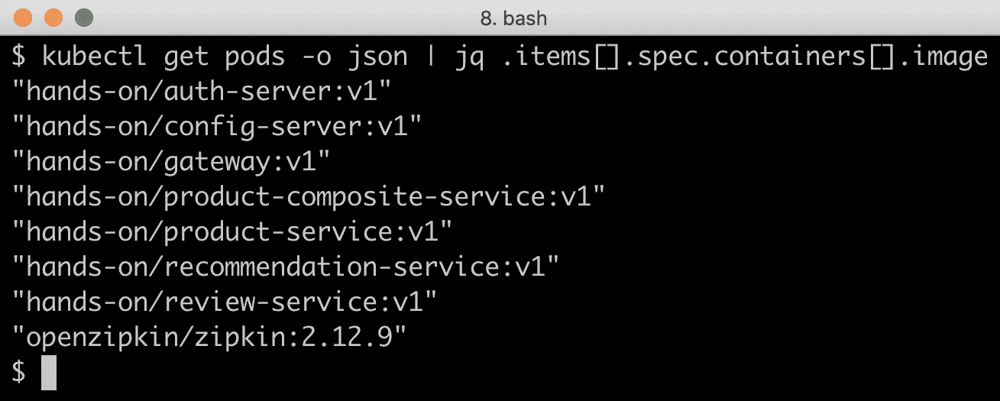

注意 Docker 镜像的 `v1` 版本！

还要注意，MySQL、MongoDB 和 RabbitMQ 的资源管理器 Pod 已经消失了；这些可以通过 `docker-compose ps` 命令找到。

运行测试脚本 `thest-em-all.bash` 以验证模拟的生产环境：

```java
HOST=$(minikube ip) PORT=31443 ./test-em-all.bash
```

期望得到与针对开发环境运行测试脚本时相同的输出。

# 执行滚动升级

历史上，更新往往导致被更新组件的短暂停机。在具有越来越多的独立更新彼此的其他组件的系统架构中，由于频繁更新微服务而导致的重复停机是不可接受的。能够在不停机的情况下部署更新变得至关重要。

在本节中，我们将了解如何执行滚动升级，即在不需要任何停机的情况下将微服务更新为其 Docker 镜像的新版本。执行滚动升级意味着 Kubernetes 首先在新 pods 中启动微服务的新版本，当它报告为健康时，Kubernetes 将终止旧的 pods。这确保了在升级期间始终有一个 pods 在运行，准备处理传入的请求。滚动升级能够工作的前提是升级是向后兼容的，这包括与其他服务和数据库结构通信时使用的 API 和消息格式。如果微服务的新版本需要对外部 API、消息格式或数据库结构进行更改，而旧版本无法处理，则无法应用滚动升级。默认情况下，部署对象被配置为执行任何更新作为滚动升级。

为了尝试这个，我们将为`product`服务创建一个 v2 版本的 Docker 镜像，然后启动一个测试客户端`siege`，在滚动升级期间每秒提交一个请求。假设测试客户端在升级期间发送的所有请求都会报告 200（OK）。

# 准备滚动升级

为了准备滚动升级，首先验证我们已经部署了`v1`版本的产品 pods：

```java
kubectl get pod -l app=product -o jsonpath='{.items[*].spec.containers[*].image} '
```

预期的输出应该显示 Docker 镜像的`v1`版本正在使用：

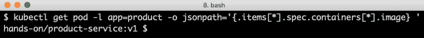

使用以下命令在 Docker 镜像上为`product`服务创建一个`v2`标签：

```java
docker tag hands-on/product-service:v1 hands-on/product-service:v2
```

为了从 Kubernetes 的角度尝试滚动升级，我们不需要在`product`服务中更改任何代码。部署一个不同于现有版本的 Docker 镜像将启动滚动升级。

为了能够观察到升级期间是否发生停机，我们将使用`siege`启动低负载负载测试。以下命令启动了一个模拟一个用户（`-c1`）平均每秒提交一个请求的负载测试（`-d1`）：

```java
siege https://$(minikube ip):31443/actuator/health -c1 -d1
```

由于测试调用网关的健康端点，它验证了所有服务都是健康的。

你应该收到如下所示的输出：

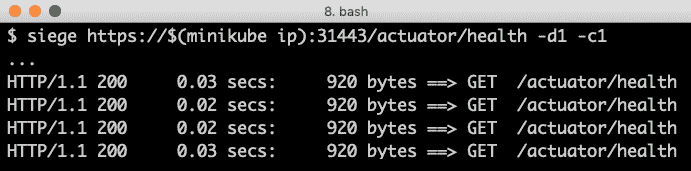

响应中的有趣部分是 HTTP 状态码，我们期望它始终为`200`。

也要监控产品 pods 状态的变化，可以使用以下命令：

```java
kubectl get pod -l app=product -w
```

# 从 v1 升级到 v2 的产品服务

-   要升级`product`服务，请编辑`kubernetes/services/overlays/prod/product-prod.yml`文件，将`image: hands-on/product-service:v1`更改为`image: hands-on/product-service:v2`。

-   使用以下命令应用更新：

```java
kubectl apply -k kubernetes/services/overlays/prod
```

-   期望命令的响应报告大多数对象保持不变，除了产品部署应报告为更新到`deployment.apps/product configured`。

-   Kubernetes 提供了一些简写命令。例如，`kubectl set image deployment/product pro=hands-on/product-service:v2`可以用来执行与更新定义文件并运行`kubectl apply`命令相同的更新。使用`kubectl apply`命令的一个主要好处是我们可以通过将更改推送到 Git 等版本控制系统的源代码来跟踪更改。如果我们想能够以代码方式处理我们的基础设施，这非常重要。在测试 Kubernetes 集群时，只使用它来测试简写命令，因为这将非常有用。

-   在*准备滚动升级*部分中启动的`kubectl get pod -l app=product -w`命令的输出中，我们将看到一些动作发生。请看以下截图：

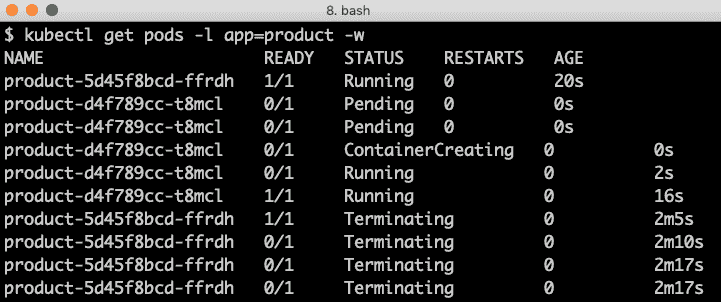

-   在这里，我们可以看到现有的 Pod（`ffrdh`）最初报告它正在运行，并在启动新的 Pod（`t8mcl`）后也报告为健康。经过一段时间（在我的案例中是`16s`），它也被报告为正在运行。在一段时间内，两个 Pod 都会运行并处理请求。经过一段时间，第一个 Pod 被终止（在我的案例中是 2 分钟）。

-   当查看`siege`输出时，有时可以在`503`服务不可用错误方面找到一些错误：

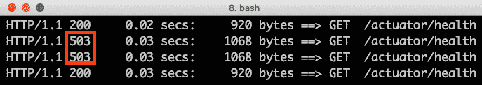

-   这通常发生在旧 Pod 被终止时。在旧 Pod 被 readiness 探针报告为不健康之前，它可以在终止过程中接收到几个请求，即它不再能够处理任何请求时。

-   在第十八章《使用服务网格提高可观测性和管理能力》中，我们将了解如何设置路由规则，以更平滑地将流量从旧容器移动到新容器，而不会导致 503 错误。我们还将了解如何应用重试机制，以防止临时故障影响到最终用户。

-   通过验证 Pod 是否正在使用 Docker 镜像的新`v2`版本来完成更新：

```java
kubectl get pod -l app=product -o jsonpath='{.items[*].spec.containers[*].image} '
```

-   期望的输出显示 Docker 镜像的`v2`版本正在使用：

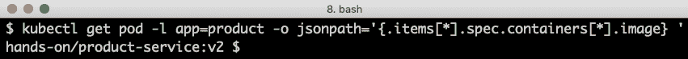

-   在执行此升级后，我们可以继续学习当事情失败时会发生什么。在下一节中，我们将了解如何回滚一个失败的部署。

# -   回滚失败的部署

有时，事情并不会按照计划进行，例如，部署和 pods 的升级可能会因各种原因失败。为了演示如何回滚失败的升级，让我们尝试在不创建`v3`标签的 Docker 镜像的情况下升级到`v3`！

让我们尝试使用以下简写命令来执行更新：

```java
kubectl set image deployment/product pro=hands-on/product-service:v3
```

预期`kubectl get pod -l app=product -w`命令会报告以下变化（在“准备滚动升级”部分启动）：

<q>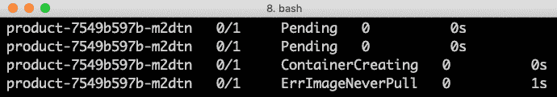</q>

我们可以清楚地看到，新部署的 pods（在我的案例中以`m2dtn`结尾）因为找不到 Docker 镜像而无法启动，这是预期的。如果我们查看`siege`测试工具的输出，没有错误报告，只有 200（OK）！在这里，部署挂起，因为它找不到请求的 Docker 镜像，但终端用户没有受到任何影响，因为新 pods 甚至没有启动。

让我们查看 Kubernetes 关于产品部署的历史记录。运行以下命令：

```java
kubectl rollout history deployment product
```

你将收到如下类似输出：

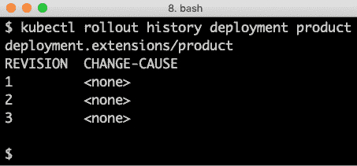

我们可以猜测修订 2 是最新成功部署的，也就是 Docker 镜像的`v2`。让我们用以下命令来验证：

```java
kubectl rollout history deployment product --revision=2
```

在响应中，我们可以看到`revision #2`带有 Docker 镜像`v2`：

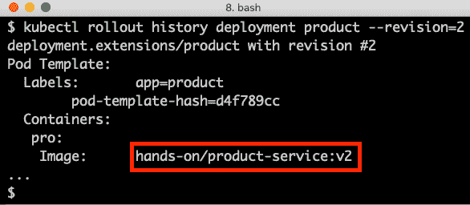

以下命令可以将部署回滚到`revision=2`：

```java
kubectl rollout undo deployment product --to-revision=2
```

预期会有一个确认回滚的响应，如下所示：

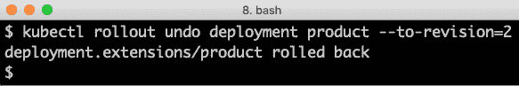

在“准备滚动升级”部分启动的`kubectl get pod -l app=product -w`命令会报告新（不可用）pods 已被`rollback`命令移除：

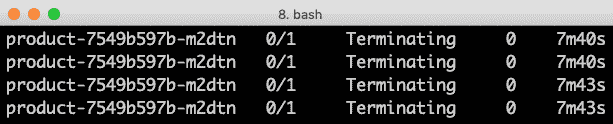

我们可以通过验证当前镜像版本仍为`v2`来结束本章：

```java
kubectl get pod -l app=product -o jsonpath='{.items[*].spec.containers[*].image} '
```

# 清理

为了删除我们使用的资源，请运行以下命令：

1.  停止`kubectl get pod -l app=product -w`命令（用于监控）和`siege`负载测试程序。

1.  删除命名空间：

```java
kubectl delete namespace hands-on
```

1.  关闭运行在 Kubernetes 之外的资源管理器：

```java
eval $(minikube docker-env)
docker-compose down
```

`kubectl delete namespace`命令将递归删除命名空间中存在的所有 Kubernetes 资源，`docker-compose down`命令将停止 MySQL、MongoDB 和 RabbitMQ。删除生产环境后，我们结束了这一章。

# 摘要

在本章中，我们学习了如何在 Kubernetes 上部署本书中的微服务。我们还介绍了 Kubernetes 的一些核心功能，例如使用 Kustomize 为不同的运行时环境配置部署，使用 Kubernetes 部署对象进行滚动升级，以及如果需要如何回滚失败的更新。为了帮助 Kubernetes 了解何时需要重新启动微服务以及它们是否准备好接收请求，我们实现了生存和就绪探针。

最后，为了能够部署我们的微服务，我们必须用 Kubernetes 内置的发现服务替换 Netflix Eureka。更改发现服务时，没有进行任何代码更改——我们所需要做的就是应用构建依赖项和一些配置的变化。

在下一章中，我们将了解如何进一步利用 Kubernetes 来减少我们需要在 Kubernetes 中部署的支持服务的数量。翻到下一章，了解我们如何消除配置服务器的需求，以及我们的边缘服务器如何被 Kubernetes 入口控制器所替代。

# 问题

1.  为什么我们在将微服务部署到 Kubernetes 时删除了 Eureka 服务器？

1.  我们用什么替换了 Eureka 服务器，这次变更如何影响了微服务的源代码？

1.  Kustomize 中 base 和 overlay 文件夹是如何使用的？

1.  我们如何将配置映射（config map）或机密（secret）中的更改应用到正在运行的 Pod？

1.  如果我们正在使用 Docker 镜像的最新标签，那么如何使用新的 Docker 镜像构建来运行正在运行的 Pod？

1.  我们可以使用哪些命令来回滚一个失败的部署？

1.  存活探针（liveness probes）和就绪探针（readiness probes）的目的是什么？

1.  以下服务定义中使用了哪些不同的端口？

```java
apiVersion: v1
kind: Service
spec:
  type: NodePort
  ports:
    - port: 80
      nodePort: 30080
      targetPort: 8080
```
