# 第一章：Spring 5 和 Spring Security 5 概述

本书希望读者熟悉 Spring 框架（任何版本）和 Spring Security（任何版本）。这是一个引子章节，介绍了一些最重要的概念；我们将在后续章节中扩展这些概念。

本章将向你介绍新的应用需求，然后介绍反应式编程概念。它涉及应用安全以及 Spring Security 如何解决应用程序中的安全问题。

我们将继续使用 Spring Security，然后通过解释本章中示例的结构来结束本章。这非常重要，因为我希望读者在引入新概念时感到舒适。

在本章中，我们将涵盖以下主题：

+   新一代应用需求

+   反应式编程

+   反应式应用

+   Spring 框架

+   Java 中的反应式景观

+   Spring 框架和反应式应用程序

+   应用安全

+   Spring Security

+   Spring Security 的核心功能

+   Spring Security 5 的新功能

+   Spring Security 的工作原理

+   核心 Spring Security 模块

# 示例的结构

重要的是，你要理解我们在这本书中将如何使用示例。由于本书试图详细介绍 Spring Security 5 及其反应性方面，我们不会在整本书中只有一个用例。相反，我们将不断创建小型项目，以帮助你理解所涵盖的每个核心概念。以下是本书中代码库的一些重要方面：

+   大多数概念将使用独立的 Spring Boot 项目进行介绍。

+   有时，我们将使用著名的 Spring Initializr ([`start.spring.io/`](https://start.spring.io/))来启动我们的示例 Spring Boot 应用程序。在其他情况下，我们将从我们已经拥有的基础项目开始，并通过代码引入更多概念。

+   通常，我们将使用 Java 配置。有时，我们可能会使用基于 XML 的配置。

+   我们将尽可能简化示例，以便不会偏离引入的核心概念。

+   尽管本书侧重于反应式应用程序，但我们不会在每次引入时都进行覆盖。有时，我们只会进行普通的命令式编程，因为了解反应式编程并在需要时使用它更为重要。并不是说我们必须在所有可能的地方都使用反应式代码，只需在适当的地方使用即可。

+   我们将为所有项目使用 VS Code，并充分利用 VS Code 中的扩展。我们还将使用 Spring Initializr 扩展，而不是使用在线 Spring Initializr。

+   在本书中，我们将大部分时间使用 Maven。可能会有一种情况，我们会尝试使用 Gradle。

+   有时，我们可能会使用 IntelliJ IDE，你会看到一些屏幕截图显示这一点。

+   我们将使用最新的 Spring Boot 发布版本，即**2.0.0. RELEASE**。这是撰写本书时 Spring Boot 的最新发布版本。

# 新一代应用需求

以下是一些核心的新应用需求：

+   **高度可扩展**：社交平台在过去十年里呈指数级增长，人们比以往任何时候都更懂技术。

+   **弹性、容错和高可用性**：在现代时代，企业不愿意接受应用程序的停机时间；即使是几秒钟的停机时间也会给许多大型企业带来巨大的损失。

+   **高性能**：如果你的网站速度慢，人们就有离开并寻找替代方案的倾向。人们的注意力很短，如果你的网站表现不佳，他们就不会停留或回来。

+   **超个性化**：用户需要个性化的网站而不是通用的网站，这给服务器带来了巨大的压力，需要实时进行许多密集的分析。

随着技术进入了每个人的手中（以某种形式，大多数人都在使用技术），用户对隐私政策和应用程序安全非常熟悉。他们了解大多数安全要求，公司花时间教育用户安全的重要性以及他们应该如何寻找应用程序中的安全漏洞。你可能已经知道，如果一个网站使用 HTTP 而不是 HTTPS（SSL）和 Chrome 标签，这些网站在地址栏中会清楚地显示给用户为不安全。随着越来越多的人对技术有了更多了解，这些方面在大多数用户中都是众所周知的，安全已成为 IT 领域中最受关注的话题之一。

另一个重要方面是数据隐私。一些用户不担心分享他们的数据，但有些用户则非常谨慎。许多政府意识到了这种担忧，并开始在这个领域制定许多规则和法规。其中一个数据隐私规则就是著名的**通用数据保护条例**（**GDPR**），自 2018 年 5 月 25 日起生效。

**欧洲联盟**（**EU**）GDPR 取代了《数据保护指令 95/46/EC》，旨在协调欧洲各地的数据隐私法律，保护和赋予所有欧盟公民数据隐私权，并重塑该地区组织处理数据隐私的方式。更多信息，请查看此链接：[`gdpr-info.eu/art-99-gdpr/`](https://gdpr-info.eu/art-99-gdpr/)。

现代浏览器也为我们提供了足够的工具，以更详细的方式查看 Web 应用程序的许多方面，特别是安全方面。此外，浏览器还增加了越来越多的功能（例如，曾经 cookie 是存储数据的选项之一，但现在我们有其他选项，比如**localStorage**和**indexedDB**），使其更容易受到来自一直在观望的黑客的安全漏洞和攻击。

为了满足这些各种应用程序要求，组织会选择公共云提供商而不是自己的本地数据中心。这使应用程序处于更加脆弱的状态，安全方面成为首要问题。构成应用程序的各个组件需要高度安全和不可被黑客攻击。

技术领域不断发展，新技术不断涌现并被开发者社区所采纳。由于这个原因和它带来的各种技术改进，许多组织不得不采用这些技术来在市场中竞争。这再次给安全带来了巨大压力，因为这些闪亮的新技术可能没有足够的努力将安全作为主要要求。

全面而言，在应用程序中具有严格的安全性是一个不言而喻的要求，组织和最终用户都很清楚这一事实。

# 响应式编程

在过去几年中，JavaScript 已成为最常用的语言之一，你可能已经在 JavaScript 的世界中听说过**reactive**这个术语，无论是在后端还是前端的上下文中。

那么，*什么是响应式编程？*—这是一种以异步数据流为核心的编程范式。数据以消息的形式在程序的各个部分之间流动。消息由`Producer`产生，并以一种“发出即忘记”的方式工作，程序产生一条消息然后忘记它。已订阅（表现出兴趣）此类消息的`Subscriber`会收到消息，处理它，并将输出作为消息传递给程序的其他部分来消费。

在数据库领域，NoSQL 从关系数据库中产生了巨大变革。同样，这种编程范式是从传统的编程范式（命令式编程）中产生了巨大变革。好消息是，即使不太了解，您在日常编码生活中已经编写了一些反应式代码。只要您看到**流**这个词，您就间接地使用了一小部分反应式代码。这种编程有自己的名称，并且这一方面在行业中变得更加主流。许多语言都理解了这带来的优势，并开始原生支持这种编程范式。

# 反应式应用

在本章的前一部分，我们讨论了过去十年应用程序需求的巨大变化。为了满足这一需求，出现了一种名为反应式应用的应用开发概念。

了解反应式编程和反应式应用之间的区别很重要。采用反应式编程并不会产生反应式应用，但是反应式编程的概念肯定可以帮助构建反应式应用。

了解反应式宣言将有助于您理解反应式应用/系统，因为宣言清楚地规定了反应式应用的每个方面。

# 反应式宣言

**宣言**是一项公开宣布的意图、观点、目标或动机，如政府、主权国家或组织发布的宣言（[`www.dictionary.com/browse/manifesto`](http://www.dictionary.com/browse/manifesto)）。

**反应式宣言**清楚地阐述了发布者的观点，根据这一宣言可以开发出反应式应用。

根据反应式宣言（[`www.reactivemanifesto.org/`](https://www.reactivemanifesto.org/)），反应式系统应该是响应式的、弹性的、具有弹性和消息驱动的。

让我们更详细地了解这些术语。本节大部分内容来自在线反应式宣言，稍作修改以便更容易理解。

# 响应式

在出现问题的情况下，响应系统可以快速检测到问题并有效处理。这些系统还能够提供一致的响应时间，并建立上限，保证最低的**服务质量**（**QoS**）。由于这些特点，这些系统能够建立终端用户的信心，简化错误处理，并鼓励终端用户更多的互动。

# 弹性

在失败的情况下，弹性系统保持响应和可交互。应用程序中的**弹性**可以通过以下方式实现：

+   **复制**：在多个地方运行相同的组件，以便如果一个失败，另一个可以处理，并且应用程序可以正常运行。

+   **封装/隔离**：特定组件的问题被包含和隔离在该组件内部，并且不会干扰其他组件或作为复制的其他相似组件。

+   **委托**：在组件出现问题的情况下，控制会立即转移到另一个运行在完全不同上下文中的相似组件。

# 弹性

弹性系统可以在输入速率增加或减少时轻松自动扩展（增加或减少资源）。这种系统没有任何争用点，并且可以随意复制组件，分发负载增加。这些系统的设计方式确保了在需要扩展时，可以通过增加更多的商品硬件和软件平台来以非常具有成本效益的方式进行，而不是使用昂贵的硬件和许可软件平台。

# 消息驱动

在响应式应用中，主要方面之一是使用异步消息将数据从一个组件传递到另一个组件。这带来了组件之间的松耦合，并有助于实现位置透明性（只要组件是可到达/可发现的，它可以位于任何地方的单个节点或节点集群中）。创建消息，发布并忘记。注册的订阅者接收消息，处理它，并广播消息以便其他订阅者完成其工作。这是响应式编程的核心方面之一，也是响应式系统所需的基本方面之一。这种“发射和忘记”的概念带来了一种非阻塞的通信方式，从而产生了高度可扩展的应用程序。

以下图表（*图 1*）清楚地以图形方式展示了响应式宣言。它还清楚地展示了响应式宣言中主要概念之间的关系：

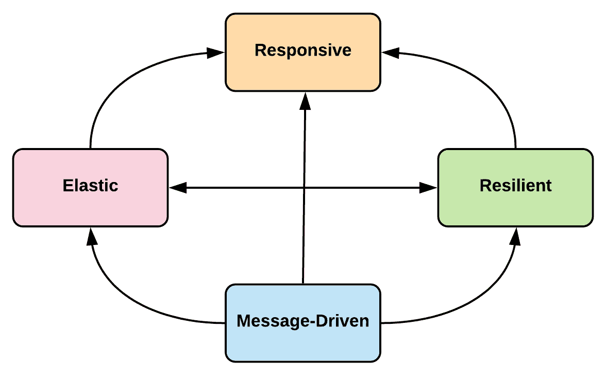

图 1：响应式宣言

由于响应式应用是响应式、弹性、可伸缩和消息驱动的，这些应用本质上是高度灵活、高度可扩展、松耦合和容错的。

Mateusz Gajewski 在`www.slideshare.net`上分享的一个演示中，以非常好的方式总结了响应式宣言：

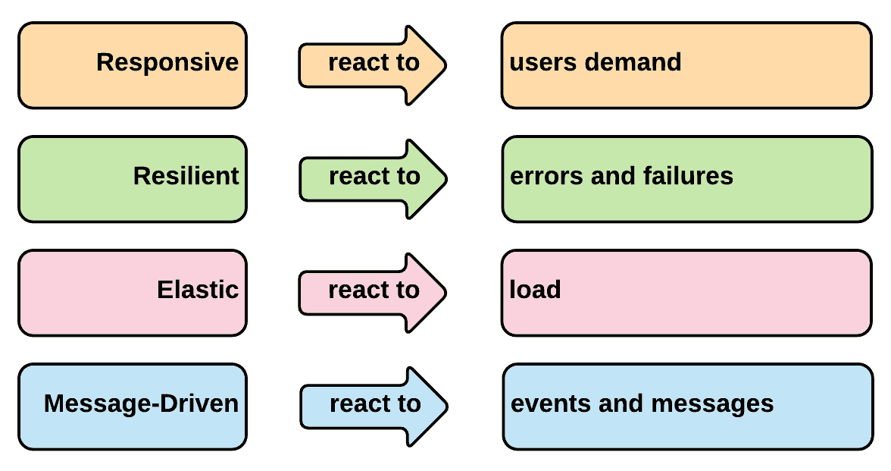

图 2：Mateusz Gajewski 构想的响应式宣言

# Spring 框架

**Spring 框架**是构建 Java 应用程序的事实标准。在过去的十年中，它随着每个主要版本的发布而不断成熟。 Spring 框架 5 于 2017 年 9 月作为 5.0.0 版正式发布；这是自 2013 年发布的上一个版本以来对框架的重要（主要）发布。

Spring 5 的一个重大新增功能是引入了一个基于核心响应式基础构建的功能性 Web 框架 Spring WebFlux。响应式编程正在悄悄地渗透到框架中，并且框架内的许多核心模块在很大程度上都在本质上支持响应式编程。由于框架已经开始原生支持响应式编程，因此这种编程的核心方面已经得到完全实现，并且许多模块都遵循了这种编程方式。此外，许多响应式概念已经成为框架内的通用语言。

需要注意的是，Spring 的响应式概念是直接从 Java 8 的**Reactor Core 库**中提取的，该库实现了响应式编程范式。 Reactor Core 是建立在*Reactive Streams 规范*之上的，这是在 Java 世界中构建响应式应用的行业标准。

另一个重要特性是包括了一种新的方式来测试这种应用程序。我们在（第五章，*与 Spring WebFlux 集成*）中有一个专门的章节介绍 Spring WebFlux，其中将更详细地介绍这些方面。

作为一个重大发布，它增加或增强了大量内容。但我们不打算列出其所有功能。完整列表可以在此链接找到：[`github.com/spring-projects/spring-framework/wiki/What%27s-New-in-Spring-Framework-5.x`](https://github.com/spring-projects/spring-framework/wiki/What%27s-New-in-Spring-Framework-5.x)*.*

# Java 中的响应式景观

当你从传统的编程模型转变过来时，很难理解响应式概念。随后的一些部分旨在向您介绍响应式概念以及它们如何演变为现在的状态。

# 响应式流和响应式流规范

Reactive Streams 的官方文档（[`www.reactive-streams.org/`](http://www.reactive-streams.org/)）表示：*Reactive Streams 是提供异步流处理和非阻塞背压的标准的一个倡议。这包括针对运行时环境（JVM 和 JavaScript）以及网络协议的努力。*

它始于 2013 年一群公司的倡议。2015 年 4 月，1.0 版规范发布，同时有多个实现（如 Akka Streams 和 Vert.x）可用。该规范的目标是将其纳入官方 Java 标准库，并在 2017 年，随着 JDK9 的发布，它正式进入其中。与任何规范一样，最终目标是有多个符合规范的实现，并随着时间的推移，规范会不断发展。规范包括一些核心接口，围绕这些接口的一些规则，以及一个**技术兼容性测试套件**（**TCK**）。

TCK 是一套测试，用于检查**Java 规范请求**（**JSR**）实现的正确性/符合性。在**Java 社区流程**（**JCP**）中，TCK 是批准 JSR 所需的三个组成部分之一。另外两个是 JSR 规范和 JSR 参考实现。Java 平台的 TCK 称为**Java 兼容性测试套件**（**JCK**）。

作为一项规范，它使得尊重规范的任何实现都能相互合作和互操作。例如，使用 Akka 编写的实现可以在不出现问题的情况下通过反应流协议与 Vert.x 实现进行通信。采用情况正在增加，目前，符合规范的更多实现正在以不同语言编写的形式发布：

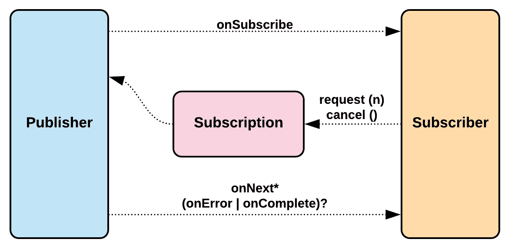

图 3：反应流规范/API

前述图清楚地显示了**反应流规范**。以下是一些重要的规范规则：

+   “发布者”到“订阅者”和“订阅者”到“发布者”的调用不应该是并发的。

+   “订阅者”可以同步或异步执行其工作，但始终必须是非阻塞的。

+   从“发布者”到“订阅者”应该定义一个上限。在定义的边界之后，缓冲区溢出会发生，并可能导致错误。

+   除了**NullPointerException**（**NPE**）之外，不会引发其他异常。在 NPE 的情况下，“发布者”调用`onError`方法，“订阅者”取消“订阅”。

在前述对反应流的定义中，有一些非常重要的术语，即**非阻塞**和**反压**，我们将更深入地探讨一下，以了解反应流的核心概念。

# 非阻塞

**非阻塞**意味着线程永远不会被阻塞。如果线程需要阻塞，代码会以一种使线程在正确时间得到通知并继续进行的方式编写。反应式编程让您实现非阻塞、声明式和事件驱动的架构。

写非阻塞应用程序的一种方法是使用消息作为发送数据的手段。一个线程发送请求，然后很快，该线程被用于其他事情。当响应准备好时，它会使用另一个线程传递回来，并通知请求方，以便进一步处理可以继续进行：

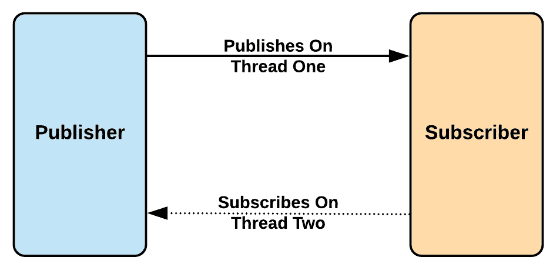

图 4：非阻塞

非阻塞概念已经被众所周知的框架实现，如 Node.js 和 Akka。Node.js 使用的方法是单个线程以多路复用的方式发送数据。

在电信和计算机网络中，多路复用（有时缩写为 muxing）是一种将多个模拟或数字信号合并成一个信号的方法，通过共享介质。其目的是共享昂贵的资源。有关多路复用的更多信息，您可以访问以下链接：[`www.icym.edu.my/v13/about-us/our-news/general/722-multiplexing.html`](http://www.icym.edu.my/v13/about-us/our-news/general/722-multiplexing.html)。

# 反压

在理想情况下，`生产者`产生的每条消息都会在产生时立即传递给`订阅者`，而不会有任何延迟。有可能`订阅者`无法以与产生速率相同的速度处理消息，这可能会使其资源受到压制。

**背压**是一种方法，通过该方法`订阅者`可以告诉`生产者`以较慢的速度发送消息，以便给`订阅者`时间来正确处理这些消息，而不会对其资源施加太大压力。

由于这是第一章，我们只是向您介绍了这些重要的响应式概念。代码示例将在后续章节中介绍。

现在我们对响应式流和响应式流规范有了一个简要的了解，我们将进入 Java 中的下一个重要的响应式概念，即响应式扩展。

# 响应式扩展

**响应式扩展**（**Rx 或 ReactiveX**）（[`msdn.microsoft.com`](https://msdn.microsoft.com)）是一个使用可观察序列和 LINQ 风格查询操作来组合异步和基于事件的程序的库。数据序列可以采用多种形式，例如来自文件或网络服务的数据流、网络服务请求、系统通知或一系列事件，例如用户输入。

如前述定义所述，这些是允许使用观察者模式进行流组合的 API。在继续之前，我有责任向您介绍观察者模式。以下是这种模式的定义，它非常直观：

观察者模式定义了一个提供者（也称为主题或可观察者）和零个、一个或多个观察者（订阅者）。观察者向提供者注册，每当预定义的条件、事件或状态发生变化时，提供者会自动通过调用观察者的方法来通知所有观察者。有关观察者模式的更多信息，您可以参考此链接：[`docs.microsoft.com/en-us/dotnet/standard/events/observer-design-pattern`](https://docs.microsoft.com/en-us/dotnet/standard/events/observer-design-pattern)。

数据可以以多种形式流动，例如流或事件。响应式扩展让您将这些数据流转换为可观察对象，并帮助您编写响应式代码。

Rx 在多种语言中实现，包括 Java（RxJava）。可以在[`reactivex.io/`](http://reactivex.io/)找到已实现的语言的完整列表和有关 Rx 的更多详细信息。

# RxJava

**RxJava**是 ReactiveX 的 Java VM 实现，它是通过使用可观察序列来组合异步和基于事件的程序的库。

RxJava 是由 Netflix 将.NET 移植到 Java 世界的。经过近两年的开发，API 的稳定版本于 2014 年发布。此稳定版本针对 Java（版本 6 及以上）、Scala、JRuby、Kotlin 和 Clojure。

RxJava 是一个单一的 JAR 轻量级库，专注于 Observable 抽象。它便于与各种外部库集成，使库与响应式原则保持一致。一些例子是`rxjava-jdbc`（使用 RxJava Observables 进行数据库调用）和 Camel RX（使用 RxJava 的 Reactive Extensions 支持 Camel）。

# 响应式流和 RxJava

RxJava 2.x 是从其前身 RxJava 1.x 进行了完全重写。

RxJava 1.x 是在 Reactive Streams 规范之前创建的，因此它没有实现它。另一方面，RxJava 2.x 是基于 Reactive Streams 规范编写的，并完全实现了它，还针对 Java 8+。RxJava 1.x 中的类型已经完全调整以符合规范，并在重写时经历了重大变化。值得注意的是，存在一个桥接库（[`github.com/ReactiveX/RxJavaReactiveStreams`](https://github.com/ReactiveX/RxJavaReactiveStreams)），它在 RxJava 1.x 类型和 Reactive Streams 之间建立桥梁，使 RxJava 1.x 能够通过 Reactive Streams TCK 兼容性测试。

在 RxJava 2.x 中，许多概念保持不变，但名称已更改以符合规范。

我们不会深入研究 RxJava，因为这是一个庞大的主题，有很多书籍可以深入了解 RxJava。

# JDK 9 的新增内容

作为 JDK 9 的并发更新的一部分（JEP 266），Reactive Streams 被添加到了 Java 标准库中。Reactive Streams 于 2013 年由一些知名组织发起，他们希望标准化异步数据在软件组件之间交换的方法。很快，这个概念被行业采纳，并出现了许多实现，它们都有类似的核心概念，但缺乏标准的命名和术语，特别是接口和包命名方面。为了避免多种命名方式，并实现不同实现之间的互操作性，JDK 9 包含了基本接口作为 Flow Concurrency 库的一部分。这使得应用程序想要实现 Reactive Streams 依赖于这个库，而不是将特定的实现包含到代码库中。因此，很容易在不产生任何麻烦的情况下在不同实现之间切换。

这些接口被编码为`java.util.concurrent.Flow`类中的静态接口。

# 重要接口

Java 9 中的 Reactive Streams 规范围仅涉及四个接口——`Publisher`、`Subscriber`、`Subscription`和`Processor`。该库还包括一个`Publisher`实现——`SubmissionPublisher`。所有这些都包含在 Java 标准库的`java.util.concurrent`包中。我们将在以下子章节中介绍这些接口。

# 发布者接口

这个接口的定义如下：

```java
public interface Publisher<T> {
  public void subscribe(Subscriber<? super T> s);
}
```

正如你所看到的，`Publisher`允许`Subscriber`接口订阅它，以便在`Publisher`产生消息时接收消息。

# 订阅者接口

这个接口的定义如下：

```java
public interface Subscriber<T> {
  public void onSubscribe(Subscription s);
  public void onNext(T t);
  public void onError(Throwable t);
  public void onComplete();
}
```

正如你所看到的，`Subscriber`接口的`onSubscribe`方法允许`Subscriber`在`Publisher`接受`Subscription`时得到通知。当新项目发布时，`onNext`方法被调用。正如其名称所示，当出现错误时，将调用`onError`方法，当`Publisher`完成其功能时，将调用`onComplete`方法。

# 订阅接口

这个接口的定义如下：

```java
public interface Subscription {
  public void request(long n);
  public void cancel();
}
```

请求方法用于接受项目的请求，取消方法用于取消`Subscription`。

# 处理器接口

这个接口的定义如下：

```java
public interface Processor<T, R> extends Subscriber<T>, Publisher<R> {
}
```

它继承自`Publisher`和`Subscriber`接口，因此继承了这些接口的所有方法。主要的方面是`Publisher`可以产生一个项目，但`Subscriber`可以消耗与`Publisher`产生的项目不同的项目。

# Spring 框架和响应式应用

Spring 框架在 2013 年采用了响应式（与响应式诞生并变得更加主流的同时），发布了 Reactor 1.0 版本。这是 Spring 框架 4.0 版本发布并与 Pivotal 合作的时候。2016 年，Spring 的 4.3 版本与 Reactor 的 3.0 版本一起发布。在这个时期，Spring 5.0 版本的开发也在积极进行中。

随着新一代应用程序的需求，许多传统的编码实践受到了挑战。其中一个主要方面是摆脱阻塞 IO，并找到替代传统命令式编程的方法。

由 Servlet 容器支持的 Web 应用程序在本质上是阻塞的，Spring 5 通过引入基于响应式编程的全新 Web 应用程序框架 Spring WebFlux，在 Web 应用程序开发方面做出了很大贡献。

Spring 也采用了 Rx，并在 Spring 5 中以多种方式使用了它。在 Spring 5 中，响应式特性在许多方面都已经内置，帮助开发人员以渐进的方式轻松采用响应式编程。

Pivotal 在 Reactor 上投入了大量资源，但也暴露了 API，允许开发人员在 Reactor 和 RxJava 之间选择他们喜欢的库。

以下图示了 Spring 5 对响应式编程的支持：

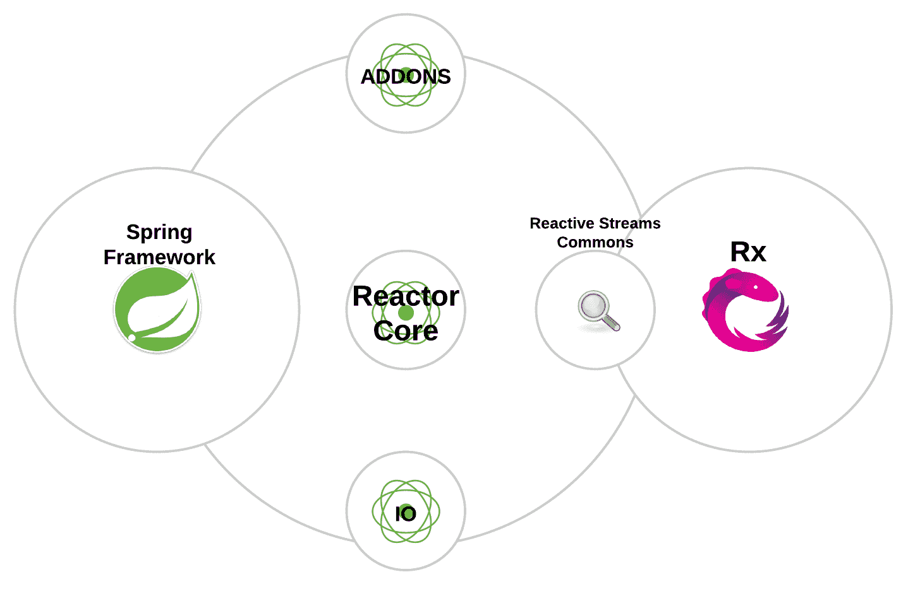

图 5：Spring Framework + Reactor + Rx

Reactor 是 Pivotal（**SpringSource**）对实现 Reactive Streams 规范的回应。如前所述，Spring 在 Reactor 上投入了大量资源，本节旨在深入了解 Reactor。

Reactor 是第四代基于 Reactive Streams 规范在 JVM 上构建非阻塞应用程序的响应式库。

**Project Reactor**历史概述可以用以下图示表示：

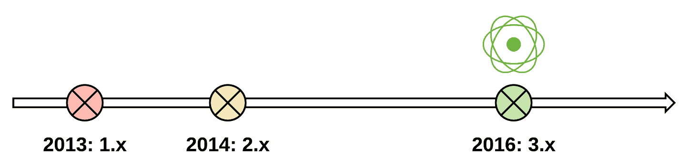

图 6：Project Reactor 历史

上图显示了 Project Reactor 的主要发布版本。该项目于 2013 年启动（1.x 版本），3.x 的主要发布版本于 2016 年发布。截至撰写本书时，该框架的核心模块版本为 3.1.8.RELEASE。

现在我们对 Spring Framework 及其与响应式编程的关系有了简要的了解，让我们深入了解一下 Project Reactor。

# Reactor 中的模块

随着 Reactor 3.0 的最新发布，该项目已经考虑到了模块化。Reactor 3.0 由四个主要组件组成，分别是 Core、IO、Addons 和 Reactive Streams Commons。

+   **Reactor Core** ([`github.com/reactor/reactor-core`](https://github.com/reactor/reactor-core))：Reactor 中的主要库。它提供了基础的、非阻塞的 JVM 兼容的 Reactive Streams 规范实现。它还包含了 Reactor 类型的代码，如`Flux`和`Mono`。

+   **Reactor IO** ([`github.com/reactor/reactor-ipc`](https://github.com/reactor/reactor-ipc))：它包含了支持背压的组件，可用于编码、解码、发送（单播、多播或请求/响应），然后服务连接。它还包含了对**Kafka** ([`kafka.apache.org/`](https://kafka.apache.org/))、**Netty** ([`netty.io/`](http://netty.io/))和**Aeron** ([`github.com/real-logic/aeron`](https://github.com/real-logic/aeron))的支持。

+   **Addons** ([`github.com/reactor/reactor-addons`](https://github.com/reactor/reactor-addons))：顾名思义，这些是由三个组件组成的附加组件：

+   `reactor-adapter`：包含了与 RxJava 1 或 2 类型的桥接，如 Observable、Completable、Single、Maybe 和 Mono/Flux 来回转换。

+   `reactor-logback`：支持异步 reactor-core 处理器上的 logback。

+   `reactor-extra`：包含了`Flux`的更多操作，包括求和和平均值等数学运算。

+   **Reactive Streams Commons** ([`github.com/reactor/reactive-streams-commons`](https://github.com/reactor/reactive-streams-commons))：Spring 的 Reactor 和 RxJava 之间的协作实验项目。它还包含了两个项目都实现的 Reactor-Streams 兼容操作符。在一个项目上修复的问题也会在另一个项目上修复。

# Reactor Core 中的响应式类型

Reactor 提供了两种响应式类型，`Flux`和`Mono`，它们广泛实现了 Rx。它们可以被表示为一个时间线，其中元素按照它们到达的顺序进行排序。重要的是要掌握这两种类型。让我们在以下小节中做到这一点。

# Flux 响应式类型

一个具有 Rx 操作符的 Reactive Streams 发布者，它会发出*0*到*N*个元素，然后完成（成功或出现错误）。更多信息，请查看以下链接：[`projectreactor.io`](https://projectreactor.io)

`Flux<T>`是一个带有基本流操作的`Publisher<T>`，支持*0.*.*n*个元素。

`Flux`的定义如下：

```java
public abstract class Flux<T>
 extends Object
 implements Publisher<T>
```

如`Flux`文档中所示的以下图示更详细地解释了`Flux`的工作原理：

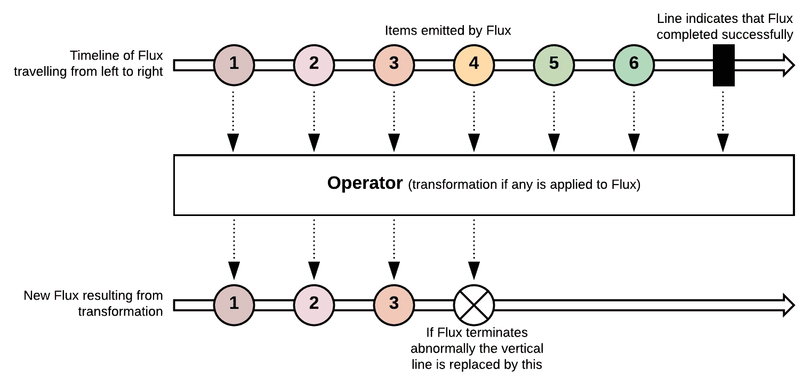

图 7：`Flux`的工作原理

Flux 支持在 Spring 5 和其他重要模块中，包括 Spring Security。对`Flux`进行操作将创建新的发布者。

有关更多信息，请参阅 Reactor Flux 文档：[`projectreactor.io/docs/core/release/api/reactor/core/publisher/Flux.html`](https://projectreactor.io/docs/core/release/api/reactor/core/publisher/Flux.html)。

现在，让我们看一些代码示例，展示了`Flux`的用法：

+   创建空的`Flux`：

```java
Flux<String> emptyFlux = Flux.empty();
```

+   创建带有项目的`Flux`：

```java
Flux<String> itemFlux = Flux.just("Spring”, "Security”, "Reactive”);
```

+   从现有列表创建`Flux`：

```java
List<String> existingList = Arrays.asList("Spring”, "Security”, "Reactive”);
Flux<String> listFlux = Flux.fromIterable(existingList);
```

+   创建以无限方式每隔`x`毫秒发出的`Flux`：

```java
Flux<Long> timer = Flux.interval(Duration.ofMillis(x));
```

+   创建发出异常的`Flux`：

```java
Flux.error(new CreatedException());
```

# `Mono`反应式类型

一个具有基本 Rx 运算符的 Reactive Streams Publisher，通过发出一个元素或出现错误来成功完成。

- Mono JavaDoc

`Mono<T>`是支持*0*..*1*个元素的`Publisher<T>`。

`Mono`的定义如下：

```java
public abstract class Mono<T>
    extends Object
    implements Publisher<T>
```

如文档中所述，以下图显示了`Mono`的工作原理：

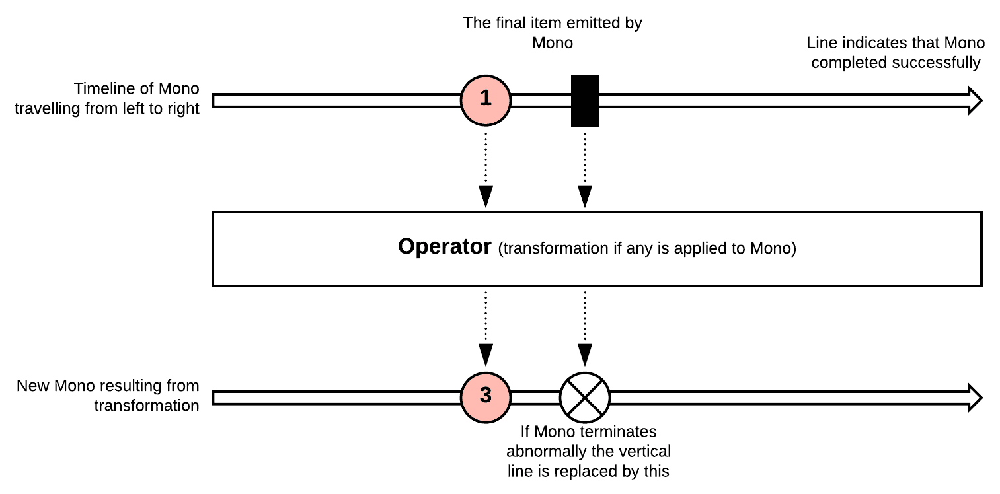

图 08：`Mono`的工作原理

`Mono<Void>`应该用于没有值完成的`Publisher`。文档使用了一个自解释的大理石图解释了每种方法及其工作原理。同样，这种类型也受到 Spring 5 和 Spring Security 的支持。

`Mono`的 JavaDoc 包含更多信息：[`projectreactor.io/docs/core/release/api/reactor/core/publisher/Mono.html`](https://projectreactor.io/docs/core/release/api/reactor/core/publisher/Mono.html)。

让我们看一些例子：

+   创建空的`Mono`：

```java
Mono<String> emptyMono = Mono.empty();
```

+   创建带有值的`Mono`：

```java
Mono<String> itemMono = Mono.just("Spring Security Reactive”);
```

+   创建发出异常的`Mono`：

```java
Mono.error(new CreatedException());
```

# 数据流类型

广义上，数据流可以分为两种类型：

+   **冷数据流**：这有许多名称，比如**冷源**，**冷可观察对象**和**冷发布者**。它们只在有人订阅时才发出数据，因此从开始产生的所有消息都会传递给订阅者。如果新的`Subscriber`连接到它，消息将按升序重放，对于任何新的`Subscriber`也是如此。`Subscriber`还可以规定`Publisher`应该发出消息的速率。这些数据流是应用反应式背压（`request(n)`）的良好候选者，例如数据库游标或文件流（读取文件）。

+   **热数据流**：这又有许多不同的名称，比如**热源**，**热可观察对象**和**热发布者**。它们发出数据，而不管是否连接了任何订阅者。当新的`Subscriber`连接时，它只会从那个时间点开始发出消息，并且不能重放从头开始的消息。它们不能暂停消息的发出，因此需要另一种机制来控制流量，比如缓冲区。这种流的例子包括鼠标事件和股票价格。

重要的是要注意，流上的运算符可以改变它们的属性，从冷到热，反之亦然。此外，有时会发生热和冷之间的合并，它们的属性也会改变。

# Reactor 和 RxJava

两者之间的主要区别之一是 RxJava 2.x 兼容 Java 6+，而 Reactor 兼容 Java 8+。如果您选择 Spring 5，我建议您使用 Reactor。如果您对 RxJava 2.x 感到满意，就没有必要迁移到 Reactor。Reactor 是 Reactive Streams 规范的实现，因此您可以保持对底层实现的不可知性。

# 反应式 Web 应用程序

Spring 5 将反应式概念引入了 Web 应用程序开发的世界，并包括了许多重要组件。让我们在这里介绍它们。

# Spring WebFlux

Spring 5 内置了一个响应式堆栈，使用它可以构建基于 Reactive Streams 的 Web 应用程序，可以在新的非阻塞服务器上运行，例如 Netty、Undertow 和 Servlet 容器，运行在大于 3.1 的 Servlet 规范上。

现有的 Web 应用程序框架，如 Spring MVC，从一开始就是为 Servlet 容器构建的，但是 Spring 5 带来了一个新的 Web 应用程序框架，Spring WebFlux，专为响应式而创建。本书中有一个专门的章节涵盖了 Spring WebFlux（第五章，*与 Spring WebFlux 集成*），所以我不会在这里深入讨论。值得知道的是，Spring 5 对响应式有着严肃的思考，并且这在所有这些新的添加中都得到了清晰的体现。

Spring WebFlux 需要将 Reactor 作为其核心依赖之一。但是，与往常一样，如果需要，它确实可以让您轻松切换实现。

# Reactive Spring Web

**Spring Web 模块**（[`github.com/spring-projects/spring-framework/tree/master/spring-web`](https://github.com/spring-projects/spring-framework/tree/master/spring-web)）有许多用于构建响应式 Web 应用程序的基础组件。它允许您执行与服务器和客户端相关的操作。

它在服务器端提供的功能分为两个方面：

+   **HTTP**：包含在`spring-web`的`org.springframework.http`包中，包含用于受支持服务器的 HTTP 请求处理的各种 API

+   **Web**：包含在`spring-web`的`org.springframework.web`包中，包含用于请求处理的各种 API

该模块还包含在客户端上工作的消息编解码器，用于对请求和响应进行编码和解码。这些编解码器也可以在服务器上使用。

# WebClient

`org.springframework.web.reactive.function.client.WebClient`接口是 Spring 5 中引入的一种响应式 Web 客户端，可用于执行 Web 请求。类似地，还有`org.springframework.test.web.reactive.server.WebTestClient`接口，它是一个特殊的`WebClient`，用于在应用程序中编写单元测试。`WebClient`是`RestTemplate`的响应式版本，它使用 HTTP/1.1 协议。它们作为`spring-webflux`模块的一部分打包。

# WebSockets

`spring-webflux`模块还具有响应式 WebSocket 实现。**WebSocket**允许我们在客户端和服务器之间建立双向连接，这种用法在新一代应用程序中变得越来越普遍。

# 应用程序安全

**应用程序安全**由各种流程组成，旨在发现、修复和防止应用程序中的安全漏洞。

我们生活在**开发+运维**（**DevOps**）的世界中，在这里我们将工程和运营人员聚集在一起。DevOps 倡导在各个层面进行自动化和监控。随着安全变得非常重要，一个新术语**DevSecOps**变得突出——这是我们将安全作为一等公民的地方。

对于一个应用程序，安全属于非功能性要求。由于它在应用程序中的重要性，大多数组织都有专门的团队来测试潜在的安全漏洞。这是一个非常重要的方面需要考虑，因为在这个现代世界中，安全漏洞可能严重破坏组织的品牌。

安全是一个非常广泛的术语，涵盖了许多方面。在本书中，我们将使用 Spring Framework 模块 Spring Security 来查看一些基本的安全问题。在涵盖了一些核心安全问题之后，我们还将看一些低级安全问题以及 Spring Security 如何帮助解决这些问题。

由于我们将专注于 Spring，我们将深入探讨与 Java Web 应用程序开发相关的安全问题。

# Spring Security

Spring Security 是一个功能强大且高度可定制的身份验证和访问控制框架。它是保护基于 Spring 的应用程序的事实标准。

– Spring by Pivotal

Spring Security 5 是该框架的新版本，也是本书的主要关注点。Spring Security 使您能够全面处理应用程序的身份验证和授权。它还有顶级项目，专门处理多种身份验证机制，如**LDAP**、**OAuth**和**SAML**。Spring Security 还提供了足够的机制来处理常见的安全攻击，如**会话固定**、**点击劫持**和**跨站点请求伪造**。此外，它与许多 Spring Framework 项目（如 Spring MVC、Spring WebFlux、Spring Data、Spring Integration 和 Spring Boot）有很好的集成。

# Spring Security 术语

了解一些最重要的 Spring Security 术语非常重要。让我们来看看其中一些：

+   **主体**：希望与您的应用程序交互的任何用户、设备或系统（应用程序）。

+   **身份验证**：确保主体是其所声称的过程

+   **凭据**：当主体尝试与您的应用程序交互时，身份验证过程开始并挑战主体传递一些值。一个例子是用户名/密码组合，这些值称为凭据。身份验证过程验证主体传递的凭据与数据存储中的凭据是否匹配，并回复适当的结果。

+   **授权**：成功认证后，将再次检查主体在应用程序上可以执行的操作。这个检查主体权限并授予必要权限的过程称为授权。

+   **受保护的项目/资源**：标记为受保护并要求主体（用户）成功完成身份验证和授权的项目或资源。

+   **GrantedAuthority**：Spring Security 对象（`org.springframework.security.core.GrantedAuthority`接口），包含/保存主体的权限/访问权限详细信息。

+   **SecurityContext**：Spring Security 对象，保存主体的身份验证详细信息。

# Spring Security 的核心功能

Spring Security 为您的应用程序提供了许多安全功能。Spring Security 以其对各种身份验证和授权方法的支持而闻名。在本节中，我们将更详细地深入探讨这些核心功能。

# 身份验证

Spring Security 提供了多种方法，您的应用程序可以进行身份验证。它还允许您编写自定义身份验证机制，如果这些提供的默认方法不符合您的要求。由于这种可扩展性，甚至可以使用旧应用程序进行身份验证。本书有专门的章节（第三章、*使用 SAML、LDAP 和 OAuth/OIDC 进行身份验证*和第四章、*使用 CAS 和 JAAS 进行身份验证*），我们将更详细地介绍各种身份验证机制，如 OAuth、LDAP 和 SAML。

# 授权

Spring Security 允许您作为应用程序开发人员选择多种方式来授权用户访问应用程序的各个部分。以下是一些方法：

+   **Web URL**：基于 URL 或 URL 模式，您可以控制访问

+   **方法调用**：如果需要，甚至可以对 Java Bean 中的方法进行访问控制

+   **领域实例**：通过在应用程序中控制对特定数据的访问，可以控制对某些需要的领域对象的访问控制。

+   **Web 服务**：允许您保护应用程序中暴露的 Web 服务

在下一章中，我们将更详细地讨论这些方面，并提供更多的代码片段。

# Spring Security 5 的新功能

Spring Security 5 提供了许多新功能，同时支持 Spring 5。作为此版本的一部分引入的一些重要新功能包括：

+   **支持 OAuth 2.0 和 OpenID Connect（OIDC）1.0**：允许用户使用其现有的 OAuth 提供程序（例如 GitHub）或 OIDC 提供程序（例如 Google）登录到您的应用程序。OAuth 是使用授权码流实现的。我们将在后续章节中深入探讨这个问题。

+   **响应式支持**：Spring 5 引入了一个新的响应式 Web 应用程序框架——Spring WebFlux。Spring Security 确保在所有方面（身份验证和授权）完全支持这个 Web 应用程序框架，使用响应式概念。

+   **改进的密码编码**：引入密码编码委托允许使用多种算法对各种密码进行编码。Spring 识别算法的方式是通过读取编码密码的前缀，其中包含用于编码密码的算法。格式为`{algorithm}encoded_password`。

# Spring Security 的工作

在本节中，我们将看看 Spring Security 的工作原理。我们将首先解释核心概念，然后看看请求经过的各种类来执行安全性。

# Servlet 过滤器

了解 Servlet 过滤器非常重要，这样您就可以了解 Spring Security 的内部工作。下图清楚地解释了 Servlet 过滤器的工作原理。它在请求到达实际资源之前以及在响应返回给消费者之前起作用。它是一个可插拔的组件，可以随时在 Web 配置文件（`web.xml`）中进行配置。

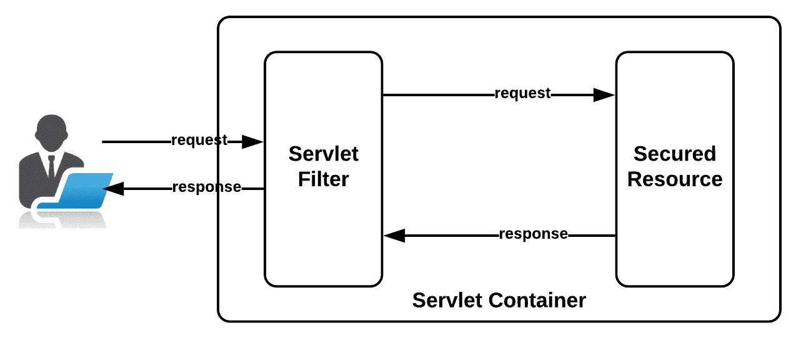

图 9：Servlet 过滤器的工作

# 过滤器链

您可以在到达实际资源之前嵌入任意数量的 Servlet 过滤器。根据它们在`web.xml`中声明的顺序触发过滤器。这种 Servlet 过滤器的链接称为**过滤器链**。Spring Security 依赖于一系列作为过滤器链排列的 Servlet 过滤器，每个过滤器执行单一的责任，然后将其交给下一个过滤器，依此类推。大多数内置过滤器对大多数应用程序来说已经足够好了。如果需要，您可以编写自己的过滤器，并将它们放在希望它们执行的位置。

# 安全拦截器（DelegatingFilterProxy）

当任何请求到达使用 Spring Security 进行保护的应用程序时，请求会经过一个门。这个拦截器完成所有的魔术，如果情况不妙，它会出错并返回给调用者，如下图所示：

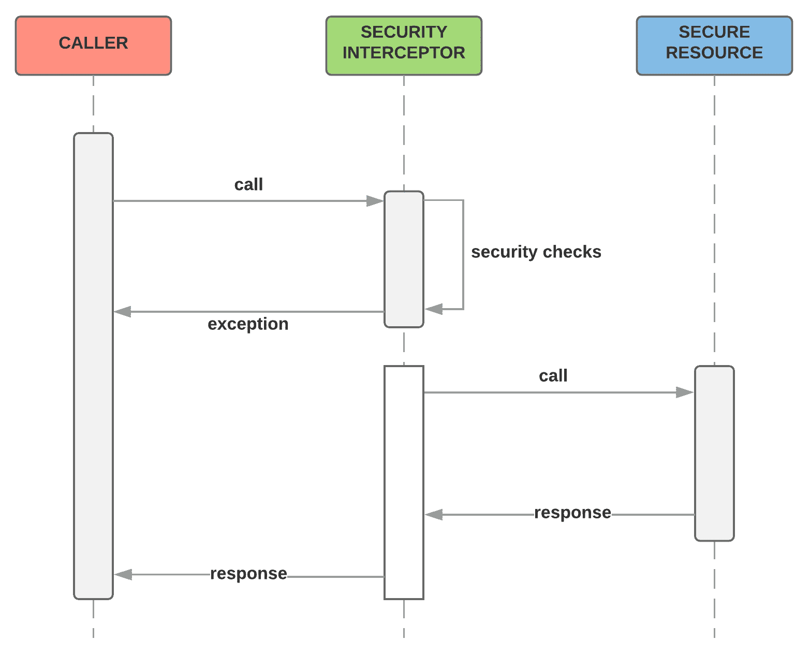

图 10：安全拦截器的工作

安全拦截器确保根据为应用程序设置的各种安全配置，将工作委托给适当的方，并确保在实际到达调用者请求的资源之前，每个人都满意。为了执行实际工作，安全拦截器使用了许多管理器，每个管理器都负责执行单一的工作。下图列出了安全拦截器与之合作执行功能的一些重要管理器：

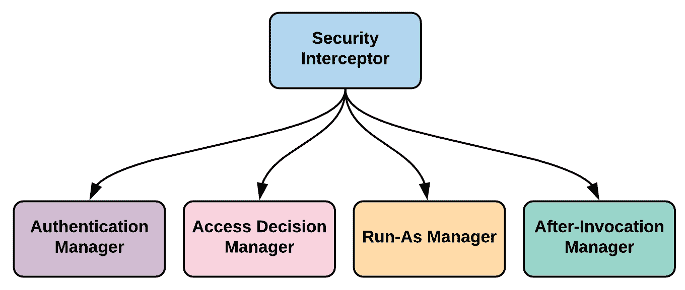

图 11：安全拦截器和相关管理器

在 Spring Security 中，安全拦截器由`DelegatingFilterProxy`完成。对于到达 Web 应用程序的任何请求，此代理确保将请求委托给 Spring Security，并且当事情顺利进行时，它确保将请求传递到 Web 应用程序中的正确资源。

`DelegatingFilterProxy`是一个 Servlet 过滤器，必须在您的`web.xml`文件中进行配置，然后委托给一个实现`ServletFilter`接口的 Spring 管理的 bean（`@Bean`）。

以下代码片段显示了如何在`web.xml`中配置`DelegatingProxyFilter`：

```java
<?xml version="1.0" encoding="UTF-8"?>
 <web-app>
    <filter>
        <filter-name>springSecurityFilterChain</filter-name>
        <filter-class>
            org.springframework.web.filter.DelegatingFilterProxy
        </filter-class>
    </filter>

    <filter-mapping>
        <filter-name>springSecurityFilterChain</filter-name>
        <url-pattern>/*</url-pattern>
    </filter-mapping>
 </web-app>
```

在上述代码中，所有对 Web 应用程序（`/* mapping`）的请求都将通过`DelegatingProxyFilter`过滤器进行。重要的是要注意，这个过滤器的名称应该是`springSecurityFilterChain`，因为 Spring Security 会寻找这个默认的过滤器名称来配置自己。代理过滤器只是将控制权传递/委托给一个名为`springSecuirtyFilterChain`的 bean。如果您正在使用默认的 Spring Security 设置，请求将被`FilterChainProxy`接收。`FilterChainProxy`负责将请求通过配置为 Spring Security 的一部分的各种 Servlet 过滤器传递。`springSecuirtyFilterChain` bean 不需要显式声明，而是由框架处理，对开发人员透明。

现在我们已经看过了 Spring Security 的所有核心概念，让我们回到以下图表中以图形方式表示的 Spring Security 的工作方式。它包含两个重要的安全方面-身份验证和授权：

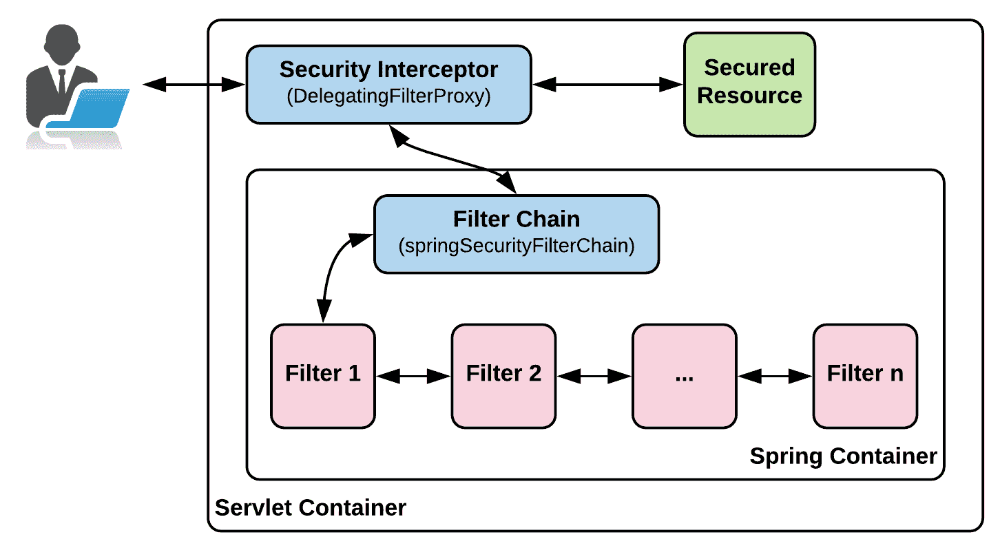

图 12：Spring Security 的工作方式

来自调用者的请求到达`DelegatingFilterProxy`，它委托给`FilterChainProxy`（Spring Bean），后者通过多个过滤器传递请求，并在成功执行后，授予调用者对所请求的受保护资源的访问权限。

有关 Servlet 过滤器及其功能的完整列表，请参阅 Spring Security 参考文档：[`docs.spring.io/spring-security/site/docs/current/reference/html/security-filter-chain.html`](https://docs.spring.io/spring-security/site/docs/current/reference/html/security-filter-chain.html)。

有了所有这些细节，下图总结了 Spring Security 如何为您的 Web 应用程序处理身份验证和授权：

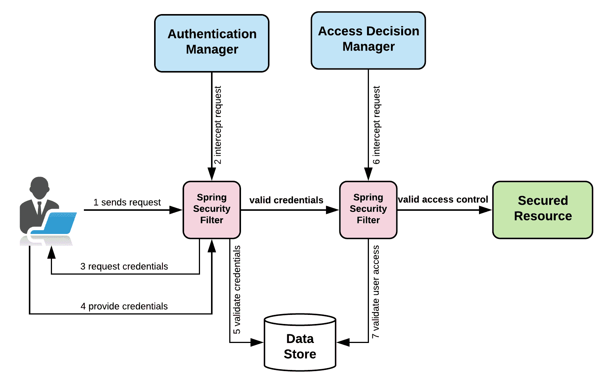

图 13：Spring Security 在使用数据库进行身份验证和授权

当调用者向受 Spring Security 保护的 Web 应用程序发送请求时，首先经过安全拦截器管理器，如**身份验证管理器**（负责身份验证）和**访问决策管理器**（负责授权），并在成功执行这些操作后，允许调用者访问受保护的资源。

对于响应式应用程序，这些概念都是有效的。有等效的响应式类，我们编码的方式是唯一改变的。这些都很容易理解和实现。

在第二章中，*深入了解 Spring Security*，我们将介绍身份验证，在第三章中，*使用 SAML、LDAP 和 OAuth/OIDC 进行身份验证*，我们将详细介绍授权，并深入了解其内部情况。

# 核心 Spring Security 模块

在 Spring Framework 中，Spring Security 是一个顶级项目。在 Spring Security 项目（[`github.com/spring-projects/spring-security`](https://github.com/spring-projects/spring-security)）中，有许多子模块：

+   **Core**（`spring-security-core`）：Spring 安全的核心类和接口在这里进行身份验证和访问控制。

+   **Remoting**（`spring-security-remoting`）：如果您需要 Spring Remoting，这是具有必要类的模块。

+   **Aspect**（`spring-security-aspects`）：Spring Security 内的**面向方面的编程**（**AOP**）支持。

+   **Config**（`spring-security-config`）：提供 XML 和 Java 配置支持。

+   密码学（`spring-security-crypto`）：包含密码学支持。

+   数据（`spring-security-data`）：与 Spring Data 集成。

+   消息传递（`spring-security-messaging`）

+   OAuth2：在 Spring Security 中支持 OAuth 2.x。

+   核心（`spring-security-oauth2-core`）

+   客户端（`spring-security-oauth2-client`）

+   JOSE（`spring-security-oauth2-jose`）

+   OpenID（`spring-security-openid`）：OpenID Web 身份验证支持。

+   CAS（`spring-security-cas`）：CAS（中央认证服务）客户端集成。

+   TagLib（`spring-security-taglibs`）：关于 Spring Security 的各种标签库。

+   测试（`spring-security-test`）：测试支持。

+   Web（`spring-security-web`）：包含 Web 安全基础设施代码，如各种过滤器和其他 Servlet API 依赖项。

这些是与 Spring Security 密切相关的 Spring Framework 中的顶级项目：

+   `spring-ldap`：简化 Java 中的轻量级目录访问协议（LDAP）编程。

+   `spring-security-oauth`：使用 OAuth 1.x 和 OAuth 2.x 协议进行轻松编程。

+   `spring-security-saml`：为 Spring 应用程序提供 SAML 2.0 服务提供者功能。

+   `spring-security-kerberos`：将 Spring 应用程序与 Kerberos 协议轻松集成。

安全断言标记语言（SAML）是一种基于 XML 的框架，用于确保传输通信的安全性。SAML 定义了交换身份验证、授权和不可否认信息的机制，允许 Web 服务具有单一登录功能。

轻量级目录访问协议（LDAP）是在 TCP/IP 协议栈的一层上运行的目录服务协议。它基于客户端-服务器模型，并提供了用于连接、搜索和修改 Internet 目录的机制。

Kerberos 是一种网络身份验证协议。它旨在通过使用秘密密钥加密为客户端/服务器应用程序提供强身份验证。麻省理工学院提供了该协议的免费实现，并且它也可以在许多商业产品中使用。

有关 SAML、LDAP 和 Kerberos 的更多信息，您可以查看以下链接：

+   [`www.webopedia.com/TERM/S/SAML.html`](https://www.webopedia.com/TERM/S/SAML.html)

+   [`msdn.microsoft.com/en-us/library/aa367008(v=vs.85).aspx`](https://msdn.microsoft.com/en-us/library/aa367008(v=vs.85).aspx)

+   [`web.mit.edu/kerberos/`](https://web.mit.edu/kerberos/)

# 摘要

在本章中，我们向您介绍了新的应用程序要求，然后转向了一些核心的响应式概念。我们看了看响应式宣言和响应式编程。然后，我们将注意力转向了 Spring 5 和 Spring Security 5，并触及了其中的一些新功能，特别是关于响应式编程的。然后，我们简要地介绍了 Spring 的响应式编程工作，通过向您介绍 Project Reactor。之后，我们更详细地探讨了 Spring Security，以便您能够重新思考这个主题。最后，我们通过向您介绍本书中示例的结构以及我们将使用的编码实践，来结束了本章。

现在，您应该对响应式编程以及 Spring Security 及其工作原理有了很好的了解。您还应该清楚地了解如何浏览其余章节，特别是示例代码。
