# 第二章：深入了解 Spring Security

这是一本实用的书，但我们的第一章是理论性的（应该是这样），因为它是一个介绍性的章节。

在本章中，我们将深入探讨 Spring Security 的技术能力，特别是认证和授权，使用代码。然而，在进入编码之前，我们将简要解释理论。我们这样做是因为在深入编码之前理解概念是很重要的。

安全的两个最重要方面如下：

+   查找用户的身份

+   查找该用户可以访问的资源

认证是找出用户是谁的机制，授权是允许应用程序找出用户对应用程序可以做什么的机制：

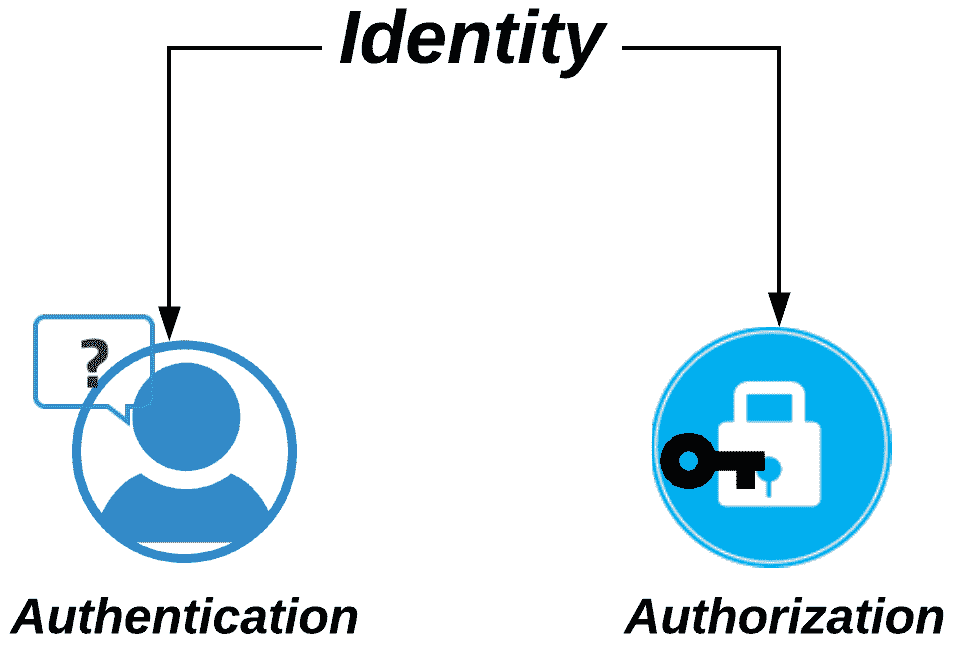

图 01：安全的基本方面——认证和授权

在本章中，我们将涵盖以下内容：

+   认证

+   认证机制

+   授权

# 认证

保护资源的一个基本方法是确保调用者是其所声称的身份。检查凭据并确保它们是真实的过程称为**认证**。

以下图表显示了 Spring Security 用于解决这一核心安全需求的基本过程。该图是通用的，可用于解释框架支持的各种认证方法：

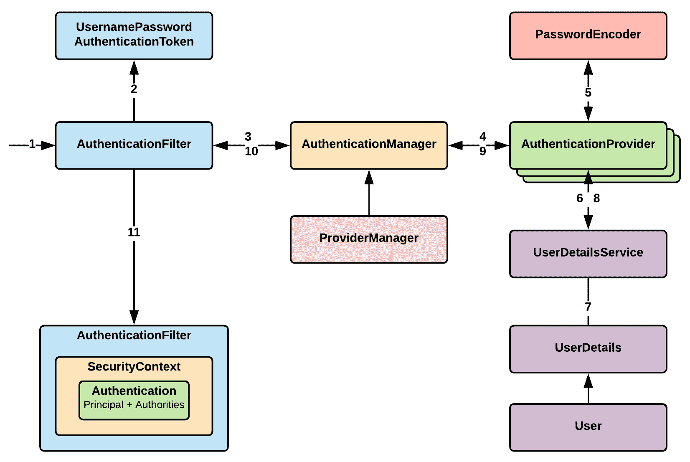

图 02：认证架构

如第一章中所述，*Spring 5 和 Spring Security 5 概述*（在*Spring Security 的工作方式*部分），Spring Security 具有一系列 Servlet 过滤器（过滤器链）。当请求到达服务器时，它会被这一系列过滤器拦截（在前面的图中的*Step 1*）。

在响应式世界中（使用新的 Spring WebFlux web 应用程序框架），过滤器的编写方式与传统过滤器（例如 Spring MVC web 应用程序框架中使用的过滤器）有很大不同。尽管如此，对于两者来说，基本机制仍然保持不变。我们有一个专门的章节来解释如何将 Spring Security 应用程序转换为 Spring MVC 和 Spring WebFlux，在那里我们将更详细地涵盖这些方面。

在过滤器链中，Servlet 过滤器代码执行会一直跳过，直到达到正确的过滤器。一旦到达基于使用的认证机制的正确认证过滤器，它会从调用者中提取提供的凭据（通常是用户名和密码）。使用提供的值（在这里，我们有用户名和密码），过滤器（`UsernamePasswordAuthenticationFilter`）创建一个`Authentication`对象（在前面的图中，使用*Step 2*中提供的用户名和密码创建了`UsernamePasswordAuthenticationToken`）。然后，*Step 2*中创建的`Authentication`对象用于调用`AuthenticationManager`接口中的`authenticate`方法：

```java
public interface AuthenticationManager {
    Authentication authenticate(Authentication authentication) 
        throws AuthenticationException;
}
```

实际的实现由*ProviderManager*提供，它具有配置的`AuthenticationProvider`列表。

```java
public interface AuthenticationProvider {
    Authentication authenticate(Authentication authentication)
        throws AuthenticationException;
    boolean supports(Class<?> authentication);
}
```

请求通过各种提供者，并最终尝试对请求进行认证。作为 Spring Security 的一部分，有许多`AuthenticationProvider`。

在本章开头的图表中，`AuthenticationProvider`需要用户详细信息（一些提供者需要这个，但有些不需要），这些信息在`UserDetailsService`中提供：

```java
public interface UserDetailsService {
    UserDetails loadUserByUsername(String username) throws           
        UsernameNotFoundException;
}
```

`UserDetailsService` 使用提供的用户名检索 `UserDetails`（并实现`User`接口）。

如果一切顺利，Spring Security 将创建一个完全填充的`Authentication`对象（authenticate: true，授予的权限列表和用户名），其中将包含各种必要的详细信息。过滤器将`Authentication`对象存储在`SecurityContext`对象中以供将来使用。

`AuthenticationManager` 中的 `authenticate` 方法可以返回以下内容：

+   `Authentication` 对象，如果 Spring Security 能够验证提供的用户凭据，则 `authenticated=true`

+   `AuthenticationException`，如果 Spring Security 发现提供的用户凭据无效

+   `null`，如果 Spring Security 无法确定它是真还是假（混乱状态）

# 设置 AuthenticationManager

Spring Security 中有许多内置的 `AuthenticationManager` 可以在您的应用程序中轻松使用。Spring Security 还有许多辅助类，使用这些类可以设置 `AuthenticationManager`。其中一个辅助类是 `AuthenticationManagerBuilder`。使用这个类，可以很容易地设置 `UserDetailsService` 对数据库、内存、LDAP 等进行身份验证。如果需要，您还可以拥有自己的自定义 `UserDetailsService`（也许您的组织中已经有自定义的单点登录解决方案）。

您可以使 `AuthenticationManager` 全局化，这样它将可以被整个应用程序访问。它将可用于方法安全性和其他 `WebSecurityConfigurerAdapter` 实例。`WebSecurityConfigurerAdapter` 是您的 Spring 配置文件扩展的类，使得将 Spring Security 引入 Spring 应用程序变得非常容易。这是如何使用 `@Autowired` 注解设置全局 `AuthenticationManager`：

```java
@Configuration
@EnableWebSecurity
public class SpringSecurityConfig extends WebSecurityConfigurerAdapter {

    @Autowired
    public void confGlobalAuthManager(AuthenticationManagerBuilder auth) throws 
            Exception {
        auth
            .inMemoryAuthentication()
                .withUser("admin").password("admin@password").roles("ROLE_ADMIN");
    }
}
```

您还可以通过覆盖 `configure` 方法，在特定的 `WebSecurityConfigurerAdapter` 中创建本地 `AuthenticationManager`，如下面的代码所示：

```java
@Configuration
@EnableWebSecurity
public class SpringSecurityConfig extends WebSecurityConfigurerAdapter {

    @Override
    protected void configure(AuthenticationManagerBuilder auth) throws Exception {
        auth
            .inMemoryAuthentication()
                .withUser("admin").password("admin@password").roles("ROLE_ADMIN");
    }
}
```

另一个选项是通过覆盖 `authenticationManagerBean` 方法来公开 `AuthenticationManager` bean，如下所示：

```java
@Override
    public AuthenticationManager authenticationManagerBean() throws Exception {
        return super.authenticationManagerBean();
}
```

您还可以将各种 `AuthenticationManager`、`AuthenticationProvider` 或 `UserDetailsService` 公开为 bean，这将覆盖默认的 bean。

在前面的代码示例中，我们使用 `AuthenticationManagerBuilder` 来配置内存中的身份验证。`AuthenticationManagerBuilder` 类的更多机制将在本章的后续示例中使用。

# AuthenticationProvider

`AuthenticationProvider` 提供了一种获取用户详细信息的机制，可以进行身份验证。Spring Security 提供了许多 `AuthenticationProvider` 实现，如下图所示：

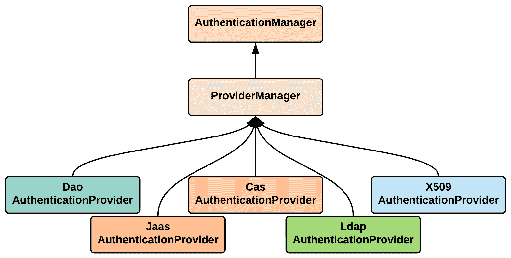

图 03：Spring Security 内置的 AuthenticationProvider

在接下来的章节中，我们将详细介绍每个部分，并提供更多的代码示例。

# 自定义 AuthenticationProvider

如果需要，我们可以通过实现 `AuthenticationProvider` 接口来编写自定义 `AuthenticationProvider`。我们将需要实现两个方法，即 `authenticate（Authentication）` 和 `supports（Class<?> aClass）`：

```java
@Component
public class CustomAuthenticationProvider implements AuthenticationProvider {
    @Override
    public Authentication authenticate(Authentication authentication) throws     
            AuthenticationException {
      String username = authentication.getName();
      String password = authentication.getCredentials().toString();
      if ("user".equals(username) && "password".equals(password)) {
        return new UsernamePasswordAuthenticationToken
          (username, password, Collections.emptyList());
      } else {
        throw new BadCredentialsException("Authentication failed");
      }
    }
    @Override
    public boolean supports(Class<?> aClass) {
      return aClass.equals(UsernamePasswordAuthenticationToken.class);
    }
}
```

我们的 `authenticate` 方法非常简单。我们只需将用户名和密码与静态值进行比较。我们可以在这里编写任何逻辑并对用户进行身份验证。如果出现错误，它会抛出一个 `AuthenticationException` 异常。

在书的 GitHub 页面上，导航到 `jetty-in-memory-basic-custom-authentication` 项目，查看这个类的完整源代码。

# 多个 AuthenticationProvider

Spring Security 允许您在应用程序中声明多个 `AuthenticationProvider`。它们根据在配置中声明它们的顺序执行。

`jetty-in-memory-basic-custom-authentication` 项目进一步修改，我们使用新创建的 `CustomAuthenticationProvider` 作为 `AuthenticationProvider`（`Order 1`），并将现有的 `inMemoryAuthentication` 作为第二个 `AuthenticationProvider`（`Order 2`）：

```java
@EnableWebSecurity
@ComponentScan(basePackageClasses = CustomAuthenticationProvider.class)
public class SpringSecurityConfig extends WebSecurityConfigurerAdapter {

    @Autowired
    CustomAuthenticationProvider customAuthenticationProvider;

    @Override
    protected void configure(HttpSecurity http) throws Exception {
        http.httpBasic()
                .and()
                .authorizeRequests()
                .antMatchers("/**")
                .authenticated(); // Use Basic authentication
    }
    @Override
    protected void configure(AuthenticationManagerBuilder auth) throws Exception {
        // Custom authentication provider - Order 1
        auth.authenticationProvider(customAuthenticationProvider);
        // Built-in authentication provider - Order 2
        auth.inMemoryAuthentication()
                .withUser("admin")
                .password("{noop}admin@password")
                //{noop} makes sure that the password encoder doesn't do anything
                .roles("ADMIN") // Role of the user
                .and()
                .withUser("user")
                .password("{noop}user@password")
                .credentialsExpired(true)
                .accountExpired(true)
                .accountLocked(true)
                .roles("USER");
    }
}
```

每当 `authenticate` 方法执行时没有错误，控制权就会返回，此后配置的 `AuthenticationProvider` 将不会被执行。

# 示例应用程序

让我们开始编写一些代码。我们将从最常见的身份验证机制开始，然后进入可以与 Spring Security 一起使用的其他身份验证机制。

# 基本项目设置

除了实际的身份验证机制外，应用程序的许多方面都是相似的。在本节中，我们将设置示例，然后详细介绍特定的身份验证机制。

我们将使用默认的 Spring Security DB 模式来验证用户。我们将创建一个完整的 Spring MVC Web 应用程序，每个组件都是从头开始创建的。使用 Spring Boot 创建一个示例 Spring Security 应用程序非常容易。该应用程序将通过许多隐藏在开发人员背后的东西来运行。但在这种情况下，我们将逐个创建这个应用程序组件，以便您可以看到构建在 Spring MVC 上的 Web 应用程序的实际代码。

Spring Security 使用的默认 DB 模式如下图所示。但是，您可以根据自己的应用程序对其进行自定义。我们将在这里使用**Users**和**Authorities**表进行设置：

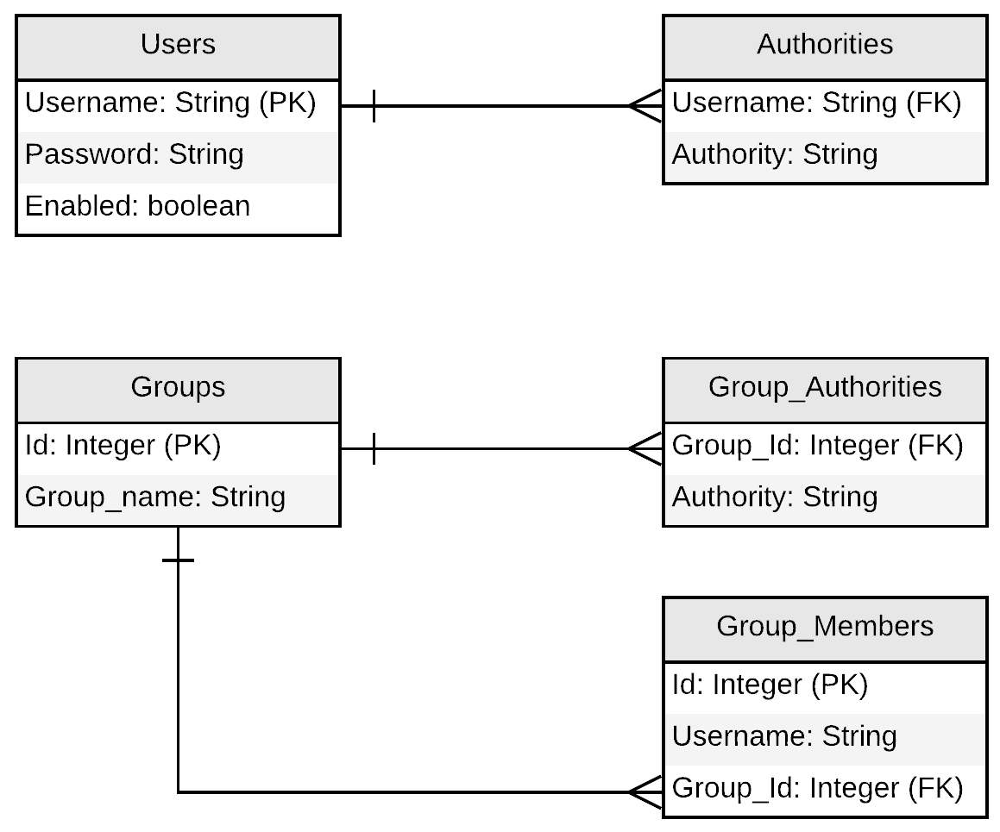

图 04：Spring Security 默认数据库模式

现在让我们开始开发我们的示例应用程序。

# 步骤 1—在 IntelliJ IDEA 中创建一个 Maven 项目

在 IntelliJ 中，选择文件 | 新建 | 项目。这将打开新项目向导，如下截图所示。现在选择 Maven 并单击下一步按钮：

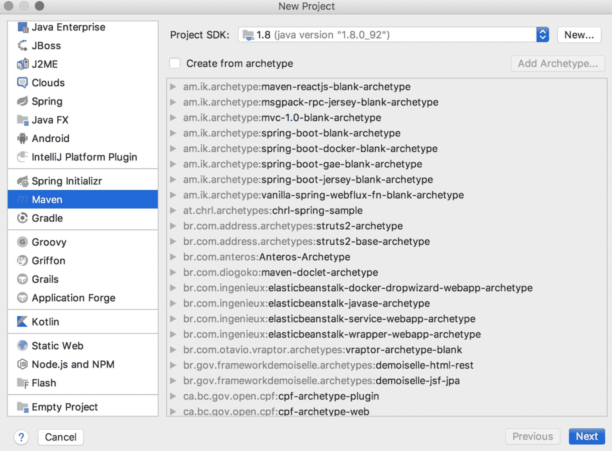

图 05：IntelliJ 中的新 Maven 项目

在新项目向导的下一个屏幕（*步骤 2*）中，输入 GroupId、ArtifactId 和 Version，如下截图所示：

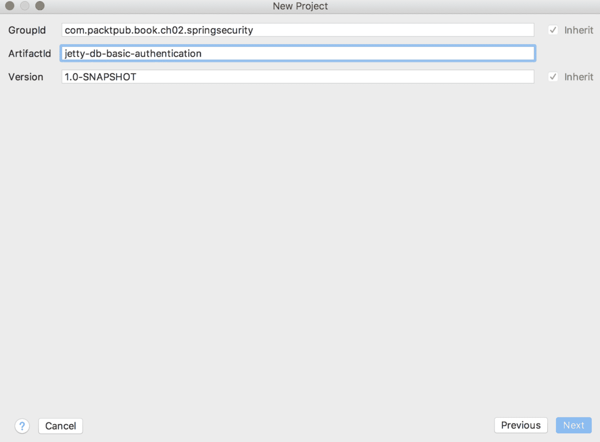

图 06：IntelliJ 中的 Maven 项目设置—输入 GroupId、ArtifactId 和 Version

在新项目向导的下一个屏幕（*步骤 3*）中，输入项目名称和项目位置，如下截图所示：

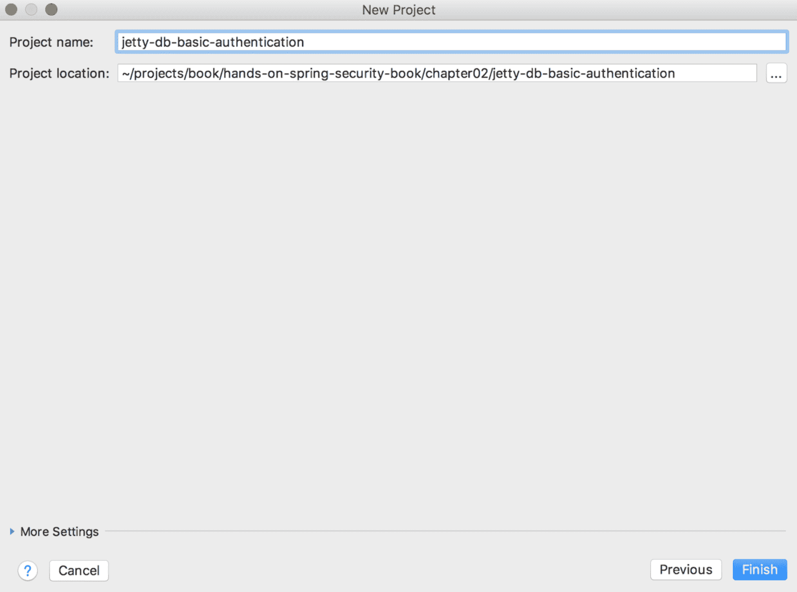

图 07：Maven 项目设置—设置项目名称和项目位置

IntelliJ 将提示您进行操作，如下截图所示。要在`pom.xml`中进行任何更改时自动导入项目，请单击启用自动导入链接：


图 08：在 IntelliJ 中启用自动导入

# 步骤 2—pom.xml 更改

打开`pom.xml`文件，并在项目标签（`<project></project>`）中添加以下代码：

```java
<!-- Spring dependencies -->
<dependency>
   <groupId>org.springframework.security</groupId>
   <artifactId>spring-security-web</artifactId>
   <version>5.0.4.RELEASE</version>
</dependency>
<dependency>
   <groupId>org.springframework.security</groupId>
   <artifactId>spring-security-config</artifactId>
   <version>5.0.4.RELEASE</version>
</dependency>
<dependency>
   <groupId>org.springframework.security</groupId>
   <artifactId>spring-security-crypto</artifactId>
   <version>5.0.4.RELEASE</version>
</dependency>
<dependency>
   <groupId>org.springframework</groupId>
   <artifactId>spring-webmvc</artifactId>
   <version>5.0.5.RELEASE</version>
</dependency>
<dependency>
   <groupId>org.springframework</groupId>
   <artifactId>spring-jdbc</artifactId>
   <version>5.0.4.RELEASE</version>
</dependency>
<!-- Servlet and JSP related dependencies -->
<dependency>
   <groupId>javax.servlet</groupId>
   <artifactId>javax.servlet-api</artifactId>
   <version>3.1.0</version>
   <scope>provided</scope>
</dependency>
<dependency>
   <groupId>javax.servlet.jsp</groupId>
   <artifactId>javax.servlet.jsp-api</artifactId>
   <version>2.3.1</version>
   <scope>provided</scope>
</dependency>
<dependency>
   <groupId>javax.servlet.jsp.jstl</groupId>
   <artifactId>javax.servlet.jsp.jstl-api</artifactId>
   <version>1.2.1</version>
</dependency>
<dependency>
   <groupId>taglibs</groupId>
   <artifactId>standard</artifactId>
   <version>1.1.2</version>
</dependency>
<!-- For datasource configuration -->
<dependency>
   <groupId>org.apache.commons</groupId>
   <artifactId>commons-dbcp2</artifactId>
   <version>2.1.1</version>
</dependency>
<!-- We will be using MySQL as our database server -->
<dependency>
   <groupId>mysql</groupId>
   <artifactId>mysql-connector-java</artifactId>
   <version>6.0.6</version>
</dependency>
```

在`pom.xml`中构建一个设置，我们将使用 jetty 来运行创建的应用程序。

```java
<build>
   <plugins>
       <!-- We will be using jetty plugin to test the war file -->
       <plugin>
           <groupId>org.eclipse.jetty</groupId>
           <artifactId>jetty-maven-plugin</artifactId>
           <version>9.4.8.v20171121</version>
       </plugin>
   </plugins>
</build>
```

# 步骤 3—MySQL 数据库模式设置

使用以下脚本创建默认数据库模式，并插入一些用户：

```java
create table users(
    username varchar(75) not null primary key,
    password varchar(150) not null,
    enabled boolean not null
);
create table authorities (
    username varchar(75) not null,
    authority varchar(50) not null,
    constraint fk_authorities_users foreign key(username) references users(username)
);
```

使用以下脚本将数据插入上述表中：

```java
insert into users(username, password, enabled)
    values('admin', '$2a$04$lcVPCpEk5DOCCAxOMleFcOJvIiYURH01P9rx1Y/pl.wJpkNTfWO6u', true);
insert into authorities(username, authority) 
    values('admin','ROLE_ADMIN');
insert into users(username, password, enabled)
    values('user', '$2a$04$nbz5hF5uzq3qsjzY8ZLpnueDAvwj4x0U9SVtLPDROk4vpmuHdvG3a', true);
insert into authorities(username,authority) 
    values('user','ROLE_USER');
```

`password`是使用在线工具[`www.devglan.com/online-tools/bcrypt-hash-generator`](http://www.devglan.com/online-tools/bcrypt-hash-generator)进行单向哈希处理的。为了比较`password`，我们将使用`PasswordEncoder`（`Bcrypt`）。

凭据如下：

+   用户 = `admin` 和密码 = `admin@password`

+   用户 = `user` 和密码 = `user@password`

重要的是要注意，即使角色被命名为`ROLE_ADMIN`，实际名称是`ADMIN`，这是我们的代码在传递时将使用的名称。

# 步骤 4—在项目中设置 MySQL 数据库属性

在`src/main/resources`文件夹中创建一个名为`mysqldb.properties`的文件，内容如下：

```java
mysql.driver=com.mysql.cj.jdbc.Driver
mysql.jdbcUrl=jdbc:mysql://localhost:3306/spring_security_schema?useSSL=false
mysql.username=root
mysql.password=<your-db-password>
```

# 步骤 5—Spring 应用程序配置

在`com.packtpub.book.ch02.springsecurity.config`包中创建一个名为`ApplicationConfig`的 Java 类，其中包含以下代码：

```java
@Configuration
@PropertySource("classpath:mysqldb.properties")
public class ApplicationConfig {

   @Autowired
   private Environment env;

   @Bean
   public DataSource getDataSource() {
       BasicDataSource dataSource = new BasicDataSource();
       dataSource.setDriverClassName(env.getProperty("mysql.driver"));
       dataSource.setUrl(env.getProperty("mysql.jdbcUrl"));
       dataSource.setUsername(env.getProperty("mysql.username"));
       dataSource.setPassword(env.getProperty("mysql.password"));
       return dataSource;
   }
}
```

# 步骤 6—Web 应用程序配置

在这个例子中，我们将使用 Spring MVC 作为我们的 Web 应用程序框架。让我们创建 Web 应用程序配置文件：

```java
@Configuration
@EnableWebMvc
@ComponentScan(basePackages= {"com.packtpub.book.ch02.springsecurity.controller"})
public class WebApplicationConfig implements WebMvcConfigurer {
   @Override
   public void configureViewResolvers(ViewResolverRegistry registry) {
       registry.jsp().prefix("/WEB-INF/views/").suffix(".jsp");
   }
}
```

`@EnableWebMvc`注解确保您的应用程序基于 Spring MVC。

# 第 7 步-设置 Spring MVC

在 Spring MVC 中，请求会落在`DispatcherServlet`上。`DispatcherServlet`可以在`web.xml`中声明，或者如果您的 Servlet 容器是 3.0+，则可以作为 Java 配置。请创建一个虚拟的`SpringSecurityConfig.java`文件。当我们解释第一个身份验证机制，即基本身份验证时，我们将构建这个类。

```java
public class SpringMvcWebApplicationInitializer
       extends AbstractAnnotationConfigDispatcherServletInitializer {

   @Override
   protected Class<?>[] getRootConfigClasses() {
       return new Class[] { ApplicationConfig.class, SpringSecurityConfig.class };
   }

   @Override
   protected Class<?>[] getServletConfigClasses() {
       return new Class[] { WebApplicationConfig.class };
   }

   @Override
   protected String[] getServletMappings() {
       return new String[] { "/" };
   }

}
```

# 第 8 步-控制器设置

让我们为受保护的 JSP 页面（`home.jsp`）创建一个基本控制器（`HomeController`）。请注意，映射方法的返回值应该是一个字符串，并且应该映射到 JSP 文件的实际名称。在我们的情况下，它是`home.jsp`，这是一个在用户登录时调用者导航到的受保护资源：

```java
@Controller
public class HomeController {

   @GetMapping("/")
   public String home(Model model, Principal principal) {
       if(principal != null)
           model.addAttribute("msg", "Welcome " + principal.getName());
       return "home";
   }
}
```

# 第 9 步-JSP 创建

我们的主页是一个非常简单的 JSP 文件，如下面的代码片段所示。这个 JSP 只是显示我们在`HomeController`类中构造的消息：

```java
<%@ page language="java" contentType="text/html; charset=ISO-8859-1"
        pageEncoding="ISO-8859-1"%>
<!DOCTYPE html>
<html>
<head>
   <meta http-equiv="Content-Type" content="text/html; charset=ISO-8859-1">
   <title>Spring Security</title>
</head>
<body>
<h1>Spring Security Sample</h1>
<h2>${msg}</h2>
</body>
</html>
```

这是现在的基本 Spring MVC 应用程序，我们将尝试设置各种身份验证机制。

# Spring 安全设置

为了解释 Spring 安全，我们将在之前创建的 Spring MVC 项目上实现基本身份验证。在第三章中，我们将使用 Spring 安全来实现其他身份验证机制，如 SAML、LDAP 和 OAuth/OIDC。为了在您的应用程序中执行基本身份验证，让我们执行本节中概述的附加步骤。

# 第 1 步-设置 Spring 安全配置

我们现在将创建非常重要的 Spring 安全配置类，并确保为 Spring 安全设置默认的过滤器链以保护所有资源：

```java
@EnableWebSecurity
public class SpringSecurityConfig extends WebSecurityConfigurerAdapter {
   @Autowired
   private DataSource dataSource;
   @Override
   protected void configure(AuthenticationManagerBuilder auth) throws Exception {
       auth.jdbcAuthentication().dataSource(dataSource)
               .usersByUsernameQuery("select username, password, enabled"
                       + " from users where username = ?")
               .authoritiesByUsernameQuery("select username, authority "
                       + "from authorities where username = ?")
               .passwordEncoder(new BCryptPasswordEncoder());
   }
   @Override
   protected void configure(HttpSecurity http) throws Exception {
       http.authorizeRequests().anyRequest().hasAnyRole("ADMIN", "USER")
               .and()
               .httpBasic(); // Use Basic authentication
   }
}
```

在 Spring 安全配置中，我们首先告诉 Spring 安全，您将使用定义的用户查询对用户进行身份验证，并使用定义的权限查询检查用户的权限。

然后我们设置身份验证机制以检索用户的凭据。在这里，我们使用基本身份验证作为捕获用户凭据的机制。请注意，用于检查的角色名称没有前缀`ROLE_`。

# 第 2 步-为 Web 应用程序设置 Spring 安全

我们知道我们必须指示应用程序开始使用 Spring 安全。一个简单的方法是在`web.xml`中声明 Spring 安全过滤器。如果您想避免使用 XML 并使用 Java 执行操作，那么创建一个类，它继承`AbstractSecurityWebApplicationInitializer`；这将初始化过滤器并为您的应用程序设置 Spring 安全：

```java
public class SecurityWebApplicationInitializer
       extends AbstractSecurityWebApplicationInitializer {

}
```

通过这样，我们已经完成了查看基本身份验证所需的所有设置。

# 运行应用程序

通过执行`mvn jetty:run`命令运行项目。一旦您看到以下截图中显示的日志，打开浏览器并转到`http://localhost:8080`：

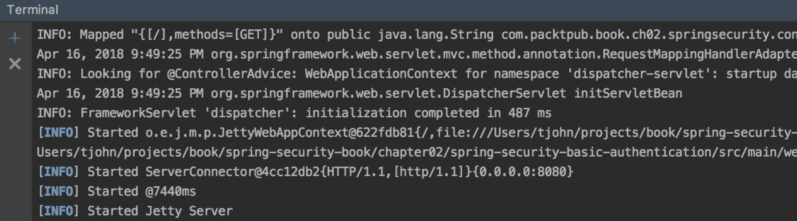

图 09：Jetty 服务器运行-控制台日志

一旦访问 URL，浏览器会提示默认的基本身份验证对话框，如下截图所示。输入用户名和密码为`admin`/`admin@password`，然后点击登录：

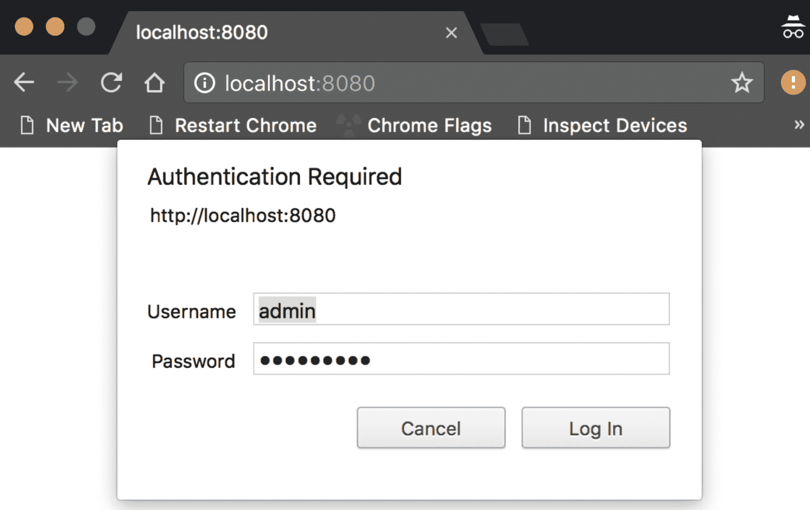

图 10：浏览器中的基本身份验证对话框

如果您的凭据正确，并且用户具有`ADMIN`或`USER`角色之一，您应该看到如下的主页：

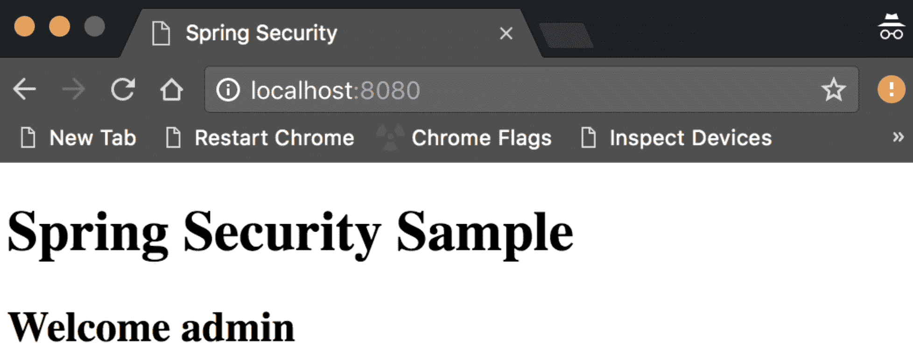

图 11：成功登录后的主页

完整的项目代码可以在该书的 GitHub 页面上找到（[`github.com/PacktPublishing/Hands-On-Spring-Security-5-for-Reactive-Applications`](https://github.com/PacktPublishing/Hands-On-Spring-Security-5-for-Reactive-Applications)），在`jetty-db-basic-authentication`项目中。

# 内存用户存储

如前所述，出于各种测试目的，最好将用户凭据存储在内存中，然后进行身份验证，而不是使用诸如 MySQL 之类的真正数据库。为此，只需通过添加以下方法来更改 Spring Security 配置文件（`SpringSecurityConfig.java`）：

```java
@Override
protected void configure(AuthenticationManagerBuilder auth) throws Exception {
   auth
.inMemoryAuthentication()
           .withUser("admin")
           .password("{noop}admin@password") 
//{noop} makes sure that the password encoder doesn't do anything
           .roles("ADMIN") // Role of the user
           .and()
           .withUser("user")
           .password("{noop}user@password")
           .credentialsExpired(true)
           .accountExpired(true)
           .accountLocked(true)
           .roles("USER");
}
```

重要的是要注意，密码有一个前缀`{noop}`，附加在其前面。这确保在验证密码时不进行编码。这是避免在运行项目时出现密码编码错误的一种方法。

完整的源代码作为一个完整的项目，可以在本书的 GitHub 页面中的`jetty-in-memory-basic-authentication`项目中找到。

# 作为 Spring Boot 运行

前面的示例可以通过遵循以下额外步骤轻松转换为 Spring Boot 应用程序。这个过程不会涵盖我们之前做过的许多琐碎步骤。您需要有另一个配置文件`SpringSecurityConfig.java`，其详细信息如下。

您可以创建一个新文件，通常命名为`Run.java`，其中包含以下代码：

```java
@SpringBootApplication
public class Run {
   public static void main(String[] args) {
       SpringApplication.run(Run.class, args);
   }
}
```

这是一个非常简单的文件，其中有一个重要的注解`@SpringBootApplication`。我们去掉了 Spring MVC 配置类，并将以下属性放入`application.properties`文件中。这只是避免创建新的 Spring MVC 配置文件的另一种方法，而是使用属性文件：

```java
spring.mvc.view.prefix: /WEB-INF/views/
spring.mvc.view.suffix: .jsp
```

与之前一样，其他一切保持不变。有关完整项目，请参考书籍的 GitHub 页面中的`spring-boot-in-memory-basic-authentication`项目。

打开命令提示符并输入以下命令：

```java
mvn spring-boot:run
```

打开浏览器，导航到`http://localhost:8080`，然后应该提供基本身份验证对话框。成功登录后，应该被带到用户主页，如前所示。

# 授权

一旦用户在其声称的身份方面得到验证，下一个方面就是确定用户有权访问什么。确保用户在应用程序中被允许做什么的过程称为授权。

与身份验证架构一致，如前所述，授权也有一个管理器`AccessDecisionManager`。Spring Security 为此提供了三种内置实现：`AffirmativeBased`、`ConsensusBased`和`UnanimousBased`。`AccessDecisionManager`通过委托给一系列`AccessDecisionVoter`来工作。授权相关的 Spring Security 类/接口如下图所示：

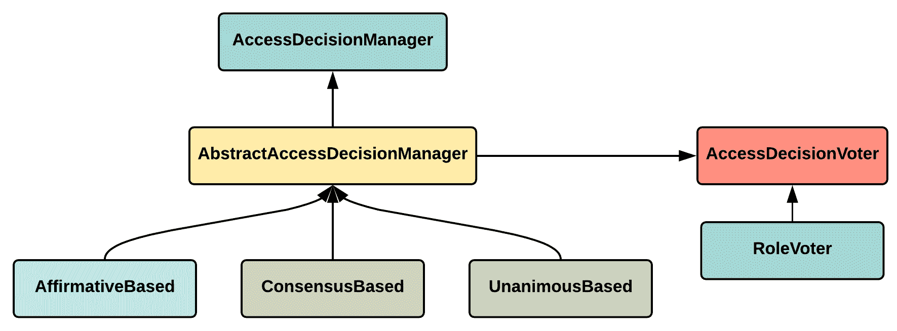

图 12：Spring Security 授权类/接口

在 Spring Security 中，对受保护资源的授权是通过调用选民然后统计收到的选票来授予的。三种内置实现以不同的方式统计收到的选票：

+   **AffirmativeBased**：如果至少有一个选民投票，用户将被授予对受保护资源的访问权限

+   **ConsensusBased**：如果选民和他们的选票之间达成明确的共识，那么用户将被授予对受保护资源的访问权限

+   **UnanimousBased**：如果所有选民投票，那么用户将被授予对受保护资源的访问权限

Spring Security 提供了两种授权方法：

+   **Web URL**：基于传入 URL（特定 URL 或正则表达式）的授权

+   **Method**：基于方法签名来控制访问的方法

如果您的服务层仅公开 RESTful 端点，并且应用程序中的数据被正确分类为资源（符合 REST 原则），则可以考虑使用 Web URL 方法。如果您的应用程序只是公开端点（基于 REST 的，我会称之为），并不真正符合 REST 原则，您可以考虑使用基于方法的授权。

# Web URL

Spring Security 可以用于设置基于 URL 的授权。可以使用配置的 HTTP Security 与 Spring Security 配置来实现所需的授权。在我们迄今为止已经介绍的许多示例中，我们已经看到了模式匹配授权。以下是一个这样的例子：

+   `AntPathRequestMatcher`：使用 Ant 风格的模式进行 URL 匹配：

```java
http
    .antMatcher("/rest/**")
    .httpBasic()
        .disable()
    .authorizeRequests()
        .antMatchers("/rest/movie/**", "/rest/ticket/**", "/index")
            .hasRole("ROLE_USER");
```

在上面的代码片段中，`/rest` URL 的基本身份验证被禁用，对于其他 URL（`/rest/movie`、`/rest/ticket`和`/index`），具有`USER`角色的用户可以访问。该片段还展示了单个匹配（使用`antMatcher`）和多个匹配（使用`antMatchers`）。

+   `MvcRequestMatcher`：这使用 Spring MVC 来匹配路径，然后提取变量。匹配是相对于 servlet 路径的。

+   `RegexRequestMatcher`：这使用正则表达式来匹配 URL。如果需要的话，它也可以用来匹配 HTTP 方法。匹配是区分大小写的，采用（`servletPath` + `pathInfo` + `queryString`）的形式：

```java
http
    .authorizeRequests()
    .regexMatchers("^((?!(/rest|/advSearch)).)*$").hasRole("ADMIN")
    .regexMatchers("^((?!(/rest|/basicSearch)).)*$").access("hasRole(USER)")
        .anyRequest()
    .authenticated()
    .and()
    .httpBasic();
```

# 方法调用

Spring Security 允许用户使用**面向方面的编程**（**AOP**）在后台访问控制方法执行。这可以使用 XML 配置或使用 Java 配置来完成。由于我们在本书中一直在使用 Java 配置，因此我们将在这里介绍 Java 配置和注解来解释方法安全性。最佳实践是选择一种特定的方法调用授权方法，并在整个应用程序中保持一致。选择适合您的应用程序的方法，因为没有关于何时选择何种方法的特定文档。

如果您想在应用程序中启用方法安全性，首先要用`@EnableMethodSecurity`对类进行注解。有三种类型的注解可以用于注解方法并对其进行授权。这些类型如下：

+   **基于投票的注解**：Spring Security 中最常用的注解。Spring Security 的`@Secured`注解属于这个类别。要使用这些注解，首先必须启用它们，如下面的代码片段所示：

```java
@Configuration
@EnableGlobalMethodSecurity(securedEnabled = true)
public class SecurityConfig extends WebSecurityConfigurerAdapter {
    // ...
}
```

一旦启用了注解的使用，就可以使用`@Secured`注解，如下面的代码片段所示：

```java
@RestController
@RequestMapping("/movie")
public class MovieController {

    @GetMapping("public")
    @Secured("ROLE_PUBLIC")
    public String publiclyAvailable() {
        return "Hello All!";
    }

    @GetMapping("admin")
    @Secured("ROLE_ADMIN")
    public String adminAccessible() {
        return "Hello Admin!";
    }
}
```

+   **JSR-250 安全注解**：这也被称为**企业 JavaBeans 3.0**（**EJB 3**）安全注解。同样，在使用这些注解之前，必须使用`@EnableGlobalMethodSecurity(jsr250Enabled = true)`来启用它们。以下片段展示了 JSR-250 安全注解的使用：

```java
@RestController
@RequestMapping("/movie")
public class MovieController {

    @GetMapping("public")
    @PermitAll
    public String publiclyAvailable() {
        return "Hello All!";
    }

    @GetMapping("admin")
    @RolesAllowed({"ROLE_ADMIN"})
    public String adminAccessible() {
        return "Hello Admin!";
    }
}
```

+   **基于表达式的注解**：基于`@Pre`和`@Post`的注解属于这个类别。它们可以通过`@EnableGlobalMethodSecurity(prePostEnabled = true)`来启用：

```java
@RestController
@RequestMapping("/movie")
public class MovieController {
    @GetMapping("public")
    @PreAuthorize("permitAll()")
    public String publiclyAvailable() {
        return "Hello All!";
    }
    @GetMapping("admin")
    @PreAuthorize("hasAnyAuthority('ROLE_ADMIN')")
    public String adminAccessible() {
        return "Hello Admin!";
    }
}
```

在上面的例子中，`hasAnyAuthority`被称为**Spring 表达式语言**（**SpEL**）。与所示的示例类似，还有许多预定义的表达式可用于安全性。

# 域实例

Spring Security 提供了访问控制各种附加到任何对象的权限的方法。Spring Security **访问控制列表**（**ACL**）存储与域对象关联的权限列表。它还将这些权限授予需要对域对象执行不同操作的各种实体。为了使 Spring Security 工作，您需要设置四个数据库表，如下图所示：

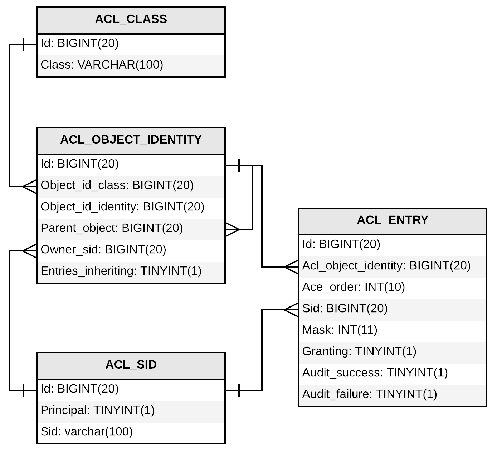

图 13：Spring Security ACL 数据库架构

以下是上图中表格的简要解释：

+   `ACL_CLASS`表：顾名思义，它存储域对象的类名。

+   `ACL_SID`表：**安全身份**（**SID**）存储用户名（`testuser`）或角色名（`ROLE_ADMIN`）。`PRINCIPAL`列存储 0 或 1，如果 SID 是用户名，则为 0，如果是角色名，则为 1。

+   `ACL_OBJECT_IDENTITY`表：它负责存储与对象相关的信息并链接其他表。

+   `ACL_ENTRY` 表：它存储了每个 `OBJECT_IDENTITY` 的每个 SID 被授予的权限。

为了使 Spring Security ACL 工作，它还需要一个缓存。其中一个最容易与 Spring 集成的是 EhCache。

Spring Security ACL 支持以下权限：

+   `READ`

+   `WRITE`

+   `CREATE`

+   `DELETE`

+   `ADMINISTRATION`

为了使其工作，我们必须使用 `@EnableGlobalMethodSecurity(prePostEnabled = true, securedEnabled = true)` 来启用它。现在我们已经准备好放置注解来开始访问控制域对象。使用 Spring ACL 的代码片段如下：

```java
@PostFilter("hasPermission(filterObject, 'READ')")
List<Record> findRecords();
```

在查询记录（后过滤）之后，结果（列表）会被审查，并进行过滤，只返回用户具有 `READ` 权限的对象。我们也可以使用 `@PostAuthorize` 如下：

```java
@PostAuthorize("hasPermission(returnObject, 'READ')")
```

在方法执行之后（`@Post`），如果用户对对象具有 `READ` 访问权限，它会返回。否则，它会抛出 `AccessDeniedException` 异常：

```java
@PreAuthorize("hasPermission(#movie, 'WRITE')")
Movie save(@Param("movie")Movie movie);
```

在方法被触发之前（`@Pre`），它会检查用户是否对对象具有 `WRITE` 权限。在这里，我们使用传递给方法的参数来检查用户权限。如果用户有 `WRITE` 权限，它执行该方法。否则，它会抛出异常。

我们可以有一个完整的示例，但这本书可以涵盖的主题已经很多了。所以我就在这里留下它，我相信你现在已经有足够的信息来进行完整的实现了。

一些关于安全的常见内置 Spring 表达式如下：

| **表达式** | **描述** |
| --- | --- |
| `hasRole([role_name])` | 如果当前用户具有 `role_name`，它返回 `true` |
| `hasAnyRole([role_name1, role_name2])` | 如果当前用户具有列表中的任何角色名称，它返回 `true` |
| `hasAuthority([authority])` | 如果当前用户具有指定权限，它返回 `true` |
| `hasAnyAuthority([authority1, authority2])` | 如果当前用户具有指定列表中的任何权限，它返回 `true` |
| `permitAll` | 总是等同于 `true` |
| `denyAll` | 总是等同于 `false` |
| `isAnonymous()` | 如果当前用户是匿名的，它返回 `true` |
| `isRememberMe()` | 如果当前用户已设置记住我，它返回 `true` |
| `isAuthenticated()` | 如果当前用户不是匿名用户，它返回 `true` |
| `isFullyAuthenticated()` | 如果当前用户不是匿名用户或记住我用户，它返回 `true` |
| `hasPermission(Object target, Object permission)` | 如果当前用户对目标对象有权限，它返回 `true` |
| `hasPermission(Object targetId, Object targetType, Object permission)` | 如果当前用户对目标对象有权限，它返回 `true` |

# 其他 Spring Security 功能

Spring Security 除了核心安全功能、认证和授权之外还具有许多功能。以下是一些最重要的功能。在第七章 *Spring Security Add-Ons* 中，我们将通过实际编码更详细地介绍这些功能。我们将在本章创建的示例基础上构建，并解释这些非常重要的 Spring Security 功能：

+   **记住我认证**：这也被称为持久登录，它允许网站在多个会话之间记住用户的身份。Spring Security 提供了一些实现（基于哈希令牌和持久令牌），使这变得容易。

+   **跨站请求伪造**（**CSRF**）：这是黑客常用的一种安全漏洞，用于执行不道德的操作，未经授权地代表用户发送命令。Spring Security 允许我们通过配置轻松修复这个漏洞。

+   **跨域资源共享**（**CORS**）：这是一种机制，通过添加额外的 HTTP 头，使运行在特定域上的 Web 应用程序可以访问在另一个域中公开的资源。这是确保只有合法代码可以访问域公开资源的安全机制之一。

+   **会话管理**：适当的用户会话管理对于任何应用程序的安全性至关重要。以下是 Spring Security 轻松处理的一些重要的与会话相关的功能：

+   **会话超时**：这确保用户会话在配置的值处于超时状态，且无法被黑客攻击。

+   **并发会话**：这可以防止用户在服务器上有多个（配置值）会话处于活动状态。

+   **会话固定**：这是一种安全攻击，允许攻击者劫持有效用户的会话，然后开始将其用于不道德的操作。

这些是 Spring Security 带来的一些重要功能。在涵盖与 Spring Security 相关的其他主题后，我们将对它们进行彻底探讨。

# 总结

本章旨在介绍两个重要的安全概念，即身份验证和授权，以及它们如何由 Spring Security 支持。

我们首先详细解释了这些概念，然后通过一个示例应用程序深入探讨了它们。我们使用 Spring MVC 应用程序作为基础，帮助您理解 Spring Security 概念。第四章，*使用 CAS 和 JAAS 进行身份验证*，旨在解释响应式 Web 应用程序框架 Spring WebFlux。

在下一章中，我们将通过扩展本章中构建的示例，了解 Spring Security 支持的其他身份验证机制。
