# 第三章：使用 SAML、LDAP 和 OAuth/OIDC 进行身份验证

在本章中，我们将研究 Spring Security 支持的认证机制，即 SAML、LDAP 和 OAuth/OIDC。 这将是一个完全动手编码的章节。 我们将构建小型应用程序，其中大多数应用程序都是从我们在第二章中构建的基本应用程序开始的，*深入 Spring Security*。

本章的主要目标是使您能够实现组织中最常用的认证机制，并展示 Spring Security 模块的功能。

每个认证机制都有一个项目，您可以在书的 GitHub 页面上看到。 但是，在书中，我们只会涵盖示例代码的重要方面，以减少章节内的混乱。

在本章中，我们将涵盖以下主题：

+   安全断言标记语言

+   轻量级目录访问协议

+   OAuth2 和 OpenID Connect

# 安全断言标记语言

**安全断言标记语言**（**SAML**），由 OASIS 的*安全服务技术委员会*开发，是用于通信用户身份验证、权限和属性信息的基于 XML 的框架。 SAML 允许业务实体对主体（通常是人类用户）的身份、属性和权限向其他实体（例如合作伙伴公司或其他企业）做出断言。

模块`application.SAML`也是：

+   一组基于 XML 的协议消息

+   一组协议消息绑定

+   一组配置文件（利用上述所有内容）

**身份提供者**（**IdP**）是创建、维护和管理主体（用户、服务或系统）身份信息，并为联合或分布式网络中的其他服务提供商（应用程序）提供主体认证的系统。

**服务提供者**（**SP**）是提供服务的任何系统，通常是用户寻求认证的服务，包括 Web 或企业应用程序。 一种特殊类型的服务提供者，即身份提供者，管理身份信息。

有关 SAML、IdP 和 SP 的更多信息，您还可以参考以下链接：

[`xml.coverpages.org/saml.html`](http://xml.coverpages.org/saml.html)

[`kb.mit.edu/confluence/display/glossary/IdP+(Identity+Provider)`](http://kb.mit.edu/confluence/display/glossary/IdP+(Identity+Provider))

[`searchsecurity.techtarget.com/definition/SAML`](https://searchsecurity.techtarget.com/definition/SAML)

Spring Security 有一个名为 Spring Security SAML 的顶级项目。 它被认为是一个扩展，为 Spring 应用程序提供了与支持 SAML 2.0 的各种认证和联合机制集成。 该扩展还支持多个 SAML 2.0 配置文件以及 IdP 和 SP 启动的 SSO。

有许多符合 SAML 2.0 标准的产品（IdP 模式），例如**Okta**、**Ping Federate**和**ADFS**，可以使用 Spring Security 扩展轻松集成到您的应用程序中。

深入讨论 SAML 的细节超出了本书的范围。但是，我们将尝试集成我们之前在第二章中构建的 Spring Boot 应用程序，*深入了解 Spring Security*，对其进行调整并转换为使用 SAML 2.0 产品 Okta 进行身份验证。在 SSO 的世界中，Okta 是一个知名的产品，允许应用程序轻松实现 SSO。在以下示例中，我们还将使用`spring-security-saml-dsl`项目，这是一个包含 Okta DSL 的 Spring Security 扩展项目。使用此项目可以显著简化 Spring Security 和 Okta 的集成。我们还将为您介绍在 Okta 平台上必须使用的配置，以确保示例是自包含和完整的。这并不意味着您必须将 Okta 作为应用程序的 SSO 平台；相反，它展示了 Spring Security SAML 模块，以 Okta 作为示例。

如前所述，我们将复制我们在第二章中创建的 Spring Boot 项目，作为此示例的起点。现在，让我们先来看看如何设置 SSO 提供程序（Okta）；在随后的部分中，我们将看看如何调整我们复制的 Spring Boot 应用程序以实现 SAML 2.0 身份验证。

# 设置 SSO 提供程序

如详细说明，我们将使用 Okta 作为 SSO 提供程序来构建我们的示例应用程序，该应用程序使用 SAML 2.0 作为身份验证机制的 Spring Security。

要设置 Okta 用户，请执行以下步骤：

1.  转到[`developer.okta.com`](https://developer.okta.com)，然后点击注册。

1.  输入相关细节，然后点击开始。

1.  Okta 将向您发送包含组织子域和临时密码的电子邮件。

1.  点击邮件中的登录按钮，输入您的用户名（电子邮件）和临时密码，然后登录。

1.  您将看到一些与帐户相关的信息。填写详细信息并完成帐户设置。

1.  您现在已经设置了一个 Okta 帐户，其中有一个用户（您），并且没有配置 SSO 的应用程序。

要设置 Okta 应用程序，请执行以下步骤：

1.  登录到您的帐户，然后点击管理按钮。

1.  在屏幕上，点击添加应用程序的快捷链接。

1.  点击创建新应用程序按钮。选择 Web 作为平台，选择 SAML 2.0 单选按钮，然后点击创建按钮。

1.  在应用程序名称字段中，输入您的应用程序名称，保持其余字段不变，然后点击下一步按钮。

1.  在单点登录 URL 字段中，输入 URL 为`https://localhost:8443/saml/SSO`。在受众 URI 字段中，输入 URI 为`https://localhost:8443/saml/metadata`。保持其余字段不变，然后点击下一步按钮。

1.  点击标有“我是 Okta 客户，正在添加内部应用程序”的单选按钮。

1.  选择复选框，上面写着“这是我们创建的内部应用程序”，然后点击完成按钮。

要将 Okta 应用程序分配给用户，您需要按照以下步骤进行操作：

1.  导航到仪表板，然后点击分配应用程序的快捷链接。

1.  点击左侧的创建的应用程序（在应用程序部分），然后点击右侧的用户名（在人员部分），最后点击下一步按钮。

1.  在下一页上，点击确认分配按钮，然后您就完成了将应用程序分配给用户。

您现在已经创建了 Okta 应用程序，并且您的用户分配已完成。现在，让我们尝试修改之前创建的应用程序，以便使用 SAML 2.0 对用户进行身份验证，针对我们创建的 Okta 应用程序。

# 设置项目

我们将更改两个文件：即`SpringSecuirtyConfig`（Spring 安全配置文件）和 Spring 应用程序属性文件（`application.yml`）。在之前的应用程序中，我们使用了属性文件（`application.properties`）而不是 YML（YAML）文件。在这个例子中，我们将放弃`application.properties`文件，并将使用`application.yml`文件进行所有设置。现在开始吧。

# pom.xml 文件设置

复制您以前的项目。打开`pom.xml`文件并添加以下依赖项：

```java
<!-- SAML2 -->
<dependency>
   <groupId>org.springframework.security.extensions</groupId>
   <artifactId>spring-security-saml2-core</artifactId>
   <version>1.0.3.RELEASE</version>
</dependency>
<dependency>
   <groupId>org.springframework.security.extensions</groupId>
   <artifactId>spring-security-saml-dsl-core</artifactId>
   <version>1.0.5.RELEASE</version>
</dependency>
```

# application.yml 文件设置

在`src/main/resources`文件夹中创建一个新的`application.yml`文件，内容如下：

```java
server:
 port: 8443
 ssl:
   enabled: true
   key-alias: spring
   key-store: src/main/resources/saml/keystore.jks
   key-store-password: secret

security:
 saml2:
   metadata-url: https://dev-858930.oktapreview.com/app/exkequgfgcSQUrK1N0h7/sso/saml/metadata

spring:
 mvc:
   view:
     prefix: /WEB-INF/views/
     suffix: .jsp
```

在第 13-17 行（在`spring`部分），我们将之前在`application.properties`文件中的配置数据迁移到了 YML 格式。除了`metadata-url`文件的配置之外，您可以保持所有之前的配置相同。对于这一点，您需要返回到您创建的 Okta 应用程序，并导航到“登录”选项卡。现在，点击“身份提供商元数据”链接并复制链接。它看起来类似于之前显示的链接，URL 末尾带有`metadata`。

# Spring 安全配置文件

现在，我们将改变（或者说配置）我们的 Spring Security 配置文件，如下所示：

```java
@EnableWebSecurity
@Configuration
@EnableGlobalMethodSecurity(securedEnabled = true)
public class SpringSecurityConfig extends WebSecurityConfigurerAdapter {

   @Value("${security.saml2.metadata-url}")
   String metadataUrl;

   @Override
   protected void configure(HttpSecurity http) throws Exception {
      http
               .authorizeRequests()
               .antMatchers("/saml/**").permitAll()
               .anyRequest().authenticated()
               .and()
               .apply(saml())
               .serviceProvider()
               .keyStore()
               .storeFilePath("saml/keystore.jks")
               .password("secret")
               .keyname("spring")
               .keyPassword("secret")
               .and()
               .protocol("https")
               .hostname("localhost:8443")
               .basePath("/")
               .and()
               .identityProvider()
               .metadataFilePath(metadataUrl)
               .and();
   }
}
```

该文件无需进行任何修改。通过重要的`configure`方法，一切都进行得很顺利。在`spring-security-saml-dsl-core`中，引入`saml()`方法使编码变得非常简洁和容易。有了这个，您几乎完成了，最后一步是创建密钥库。

# 资源文件夹设置

导航到您的项目（在`src/main/resources`文件夹中）。创建一个名为`saml`的文件夹，并在该位置打开命令提示符。执行以下命令：

```java
keytool -genkey -v -keystore keystore.jks -alias spring -keyalg RSA -keysize 2048 -validity 10000
```

在提示时，提供所需的详细信息，并在`src/main/resources/saml`文件夹中创建`keystore.jks`文件。

# 运行和测试应用程序

导航到您的项目文件夹并执行`spring-boot`命令，如下所示：

```java
mvn spring-boot:run
```

打开浏览器，导航到`https://localhost:8443`。请注意`https`和端口`8443`（因为我们启用了 SSL）。如果在 URL 中不输入`https`，您将收到以下响应：

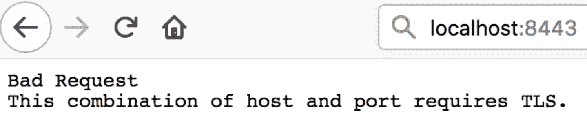

图 1：使用 HTTP 时浏览器的响应

浏览器将显示一个页面，指出您的连接不安全。消息可能会有所不同，这取决于您选择打开此 URL 的浏览器。只需确保您接受风险并继续前进。

您将被导航到 Okta URL，要求您使用用户名/密码登录，如下截图所示：

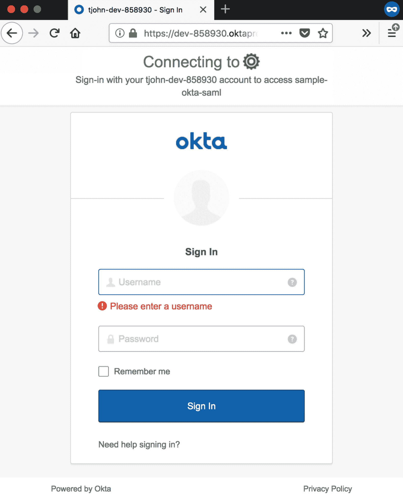

图 2：Okta 登录页面显示给用户

完成后，您将被导航回主页，显示您在`home.jsp`文件中放置的内容。下次打开 URL 时，您将直接进入主页，并且 Okta 将自动登录您。

使用 Spring Security 完成了 SAML 身份验证。您可以通过访问 GitHub 页面并导航到`spring-boot-in-memory-saml2-authentication`项目来查看完整的项目。

# 轻量级目录访问协议

**轻量级目录访问协议**（**LDAP**）是一种目录服务协议，允许连接、搜索和修改 Internet 目录。不幸的是，LDAP 不支持反应式绑定；这意味着它不支持反应式编程（类似于 JDBC）。LDAP 身份验证的功能如下图所示：

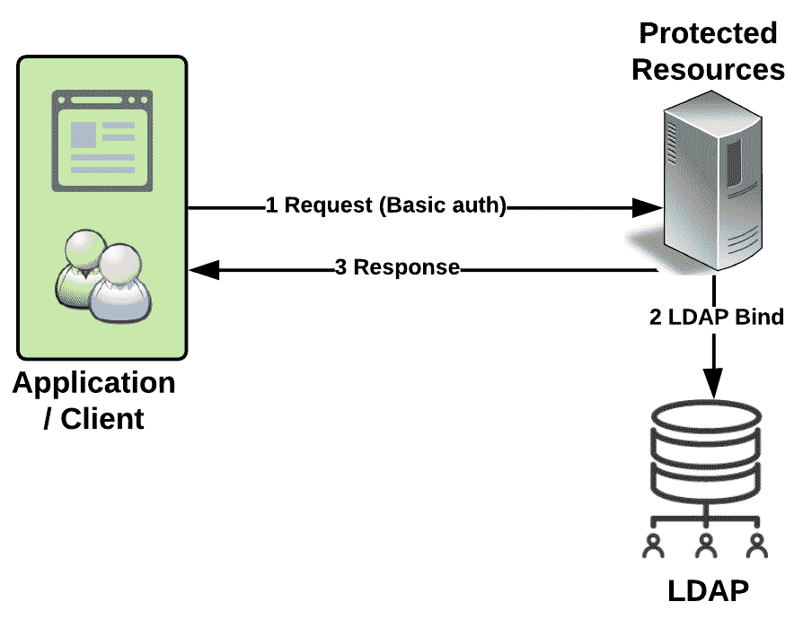

图 3：LDAP 身份验证

与之前的示例类似，我们将克隆/复制之前的项目（任何 Spring Boot 项目都可以；我正在克隆`spring-boot-in-memory-saml2-authentication`项目）。与之前的项目类似，我们将修改一些文件并向项目中添加一些文件。我们将使用内置的基于 Java 的 LDAP 服务器来验证用户凭据。

# 在 pom.xml 文件中设置依赖项

打开`pom.xml`并添加以下依赖项：

```java
<!-- LDAP -->
<dependency>
   <groupId>org.springframework</groupId>
   <artifactId>spring-tx</artifactId>
</dependency>
<dependency>
   <groupId>org.springframework.ldap</groupId>
   <artifactId>spring-ldap-core</artifactId>
</dependency>
<dependency>
   <groupId>org.springframework.security</groupId>
   <artifactId>spring-security-ldap</artifactId>
</dependency>
<dependency>
   <groupId>com.unboundid</groupId>
   <artifactId>unboundid-ldapsdk</artifactId>
</dependency>
```

# Spring 安全配置

修改`SpringSecurityConfiguration.java`文件，如下所示：

```java
@EnableWebSecurity
@Configuration
@EnableGlobalMethodSecurity(securedEnabled = true)
public class SpringSecurityConfig extends WebSecurityConfigurerAdapter {
   private static final Logger LOG = 
                LoggerFactory.getLogger(SpringSecurityConfig.class);
   @Override
   protected void configure(HttpSecurity http) throws Exception {
       http.authorizeRequests()    .antMatchers("/admins").hasRole("ADMINS")
               .antMatchers("/users").hasRole("USERS")
               .anyRequest().fullyAuthenticated()
               .and()
               .httpBasic(); // Use Basic authentication
   }
   @Override
   public void configure(AuthenticationManagerBuilder auth) throws Exception {
       auth
               .ldapAuthentication()
               .userDnPatterns("uid={0},ou=people")
               .userSearchBase("ou=people")
               .userSearchFilter("uid={0}")
               .groupSearchBase("ou=groups")
               .groupSearchFilter("uniqueMember={0}")
               .contextSource(contextSource())
               .passwordCompare()
               .passwordAttribute("userPassword");
   }
   @Bean
   public DefaultSpringSecurityContextSource contextSource() {
       LOG.info("Inside configuring embedded LDAP server");
       DefaultSpringSecurityContextSource contextSource = new 
               DefaultSpringSecurityContextSource(
               Arrays.asList("ldap://localhost:8389/"), "dc=packtpub,dc=com");
       contextSource.afterPropertiesSet();
       return contextSource;
   }
}
```

第一个`configure`方法与我们在之前的 SAML 示例中看到的非常相似。我们只是添加了某些匹配并分离了角色。通过这些更改，它仍将执行基本身份验证。

第二个`configure`方法是我们使用 LDAP 服务器设置身份验证的地方。LDAP 服务器以类似目录的格式存储用户信息。此方法详细说明了如何通过浏览目录结构来查找用户。

# LDAP 服务器设置

我们将使用 Spring 的默认 LDAP 服务器来存储我们的用户，然后将其用作我们的应用程序中可以对用户进行身份验证的用户存储。LDAP 配置在我们的`application.yml`文件中完成，如下所示：

```java
spring:
 ldap:
   # Embedded Spring LDAP
   embedded:
     base-dn: dc=packtpub,dc=com
     credential:
       username: uid=admin
       password: secret
     ldif: classpath:ldap/ldapschema.ldif
     port: 8389
     validation:
       enabled: false
 mvc:
   view:
     prefix: /WEB-INF/views/
     suffix: .jsp
```

`ldap`部分是不言自明的——我们正在使用各种参数设置嵌入式 LDAP 服务器。

# 在 LDAP 服务器中设置用户

我们将使用**LDAP 数据交换格式**（**LDIF**）在我们的 LDAP 服务器上设置用户。LDIF 是 LDAP 数据的标准基于文本的表示形式，以及对该数据的更改（[`ldap.com/ldif-the-ldap-data-interchange-format/`](https://ldap.com/ldif-the-ldap-data-interchange-format/)）。

在我们的`application.yml`文件中，我们已经告诉 Spring 在哪里查找我们的 LDIF 文件。LDIF 文件如下：

```java
dn: dc=packtpub,dc=com
objectclass: top
objectclass: domain
objectclass: extensibleObject
dc: packtpub

dn: ou=groups,dc=packtpub,dc=com
objectclass: top
objectclass: organizationalUnit
ou: groups

dn: ou=people,dc=packtpub,dc=com
objectclass: top
objectclass: organizationalUnit
ou: people

dn: uid=john,ou=people,dc=packtpub,dc=com
objectclass: top
objectclass: person
objectclass: organizationalPerson
objectclass: inetOrgPerson
cn: Tomcy John
uid: tjohn
userPassword: tjohn@password

dn: cn=admins,ou=groups,dc=packtpub,dc=com
objectclass: top
objectclass: groupOfUniqueNames
cn: admins
ou: admin
uniqueMember: uid=tjohn,ou=people,dc=packtpub,dc=com

dn: cn=users,ou=groups,dc=packtpub,dc=com
objectclass: top
objectclass: groupOfUniqueNames
cn: users
ou: user
uniqueMember: uid=tjohn,ou=people,dc=packtpub,dc=com
```

# 运行应用程序

在项目中的任何其他文件中都没有太多更改。就像运行任何其他`spring-boot`项目一样，转到项目文件夹并执行以下命令：

```java
mvn spring-boot:run
```

# 在浏览器上查看应用程序的运行情况

打开浏览器，输入`http://localhost:8080`。输入用户名/密码为`tjohn/tjohn@password`（在 LDIF 文件中查找用户设置）。您将被带到`home.jsp`，在那里您将看到友好的欢迎消息，如下截图所示：

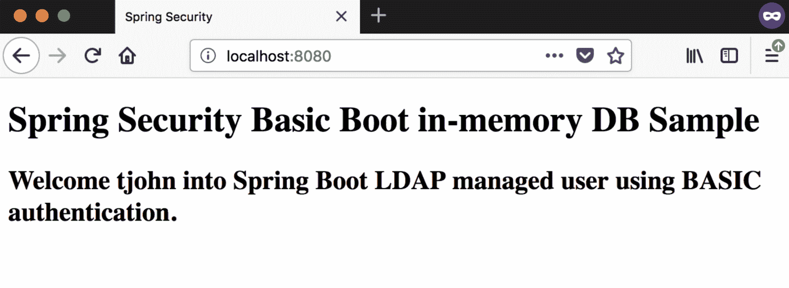

图 4：使用 LDAP 成功登录后在 home.jsp 页面显示的消息

# OAuth2 和 OpenID Connect

**OAuth**是实现授权的开放标准/规范。它通过 HTTPS 工作，任何人都可以实现该规范。该规范通过验证访问令牌，然后授权设备、API、服务器等等。

存在两个版本，即 OAuth 1.0（[`tools.ietf.org/html/rfc5849`](https://tools.ietf.org/html/rfc5849)）和 OAuth 2.0（[`tools.ietf.org/html/rfc6749`](https://tools.ietf.org/html/rfc6749)）。这些版本彼此不兼容，不能一起工作。我们将使用版本 2.0，并且在本书中将其称为 OAuth 2.0。

SAML，于 2005 年发布，非常适合 Web 浏览器（至今仍然适用）。但是对于现代 Web 和原生应用程序（移动设备），SAML 需要进行严格的改进，这就是**OAuth**出现的原因。**单页应用程序**（**SPAs**）和原生应用程序与传统的服务器端 Web 应用程序不同。SPAs 通过浏览器对服务器上暴露的 API 进行 AJAX/XHR 调用，并在客户端（浏览器）上执行许多其他操作。API 开发也发生了变化，从使用 XML 的重型 SOAP Web 服务到使用 JSON 的轻量级 REST over HTTP。

OAuth 还使您作为开发人员能够在不必透露用户密码的情况下访问最少的用户数据。它主要用于访问应用程序暴露的 API（REST），并通过委托授权功能来完成。

OAuth 支持各种应用程序类型，并将身份验证与授权解耦。

简而言之，这就是 OAuth 的工作原理：

1.  希望访问资源的应用程序请求用户授予授权。

1.  如果用户授权，应用程序将获得此协议的证明。

1.  使用这个证明，应用程序去实际的服务器获取一个令牌。

1.  使用此令牌，应用程序现在可以请求用户已授权的资源（API），同时提供证明。

上述步骤如下图所示：

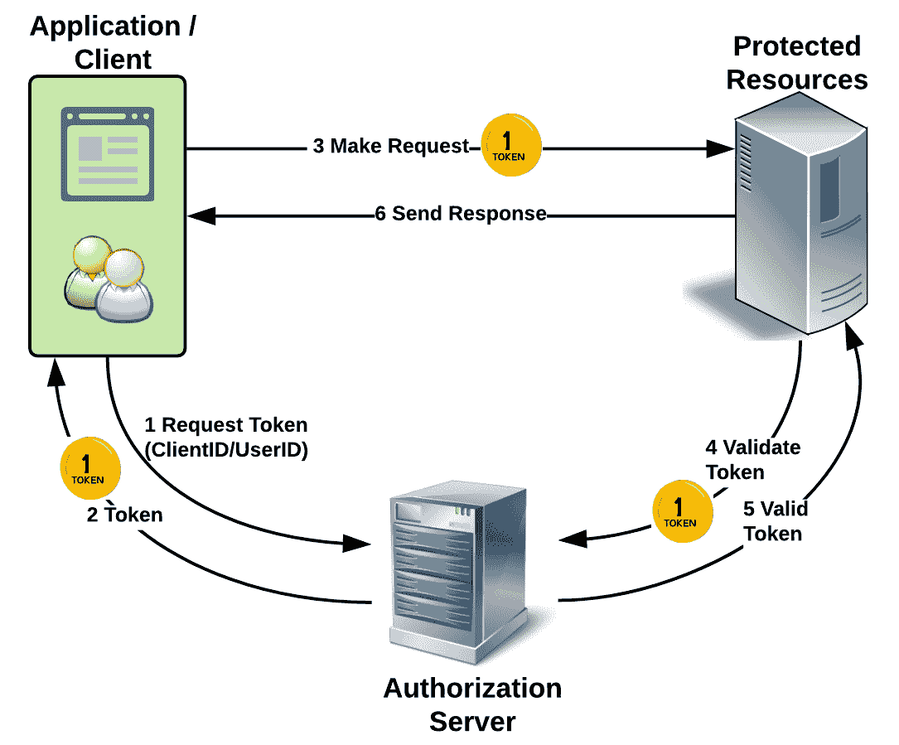

图 5：OAuth 的功能

OAuth 通过使用访问令牌进行了微调，应用程序可以以 API 的形式获取用户信息。Facebook Connect（一个 SSO 应用程序，允许用户使用 Facebook 凭据与其他 Web 应用程序进行交互）使用这作为一种机制来公开一个端点（`http(s)://<domain>/me`），该端点将返回最少的用户信息。这在 OAuth 规范中从未清楚地存在过，这引发了**Open ID Connect**（**OIDC**），它结合了 OAuth2、Facebook Connect 和 SAML 2.0 的最佳部分。OIDC 引入了一个新的 ID 令牌（`id_token`），还有一个`UserInfo`端点，将提供最少的用户属性。OIDC 解决了 SAML 存在的许多复杂性，以及 OAuth2 的许多缺点。

深入研究 OAuth 和 OIDC 不在本书的范围之内。我相信我已经提供了足够的信息，您可以通过本节的其余部分进行导航。

# 设置项目

我们将在这里创建的示例代码与我们之前的示例有所不同。在这里，我们将使用*Spring Initializr*（[`start.spring.io/`](http://start.spring.io/)）创建基本项目，然后我们将注入适当的更改，使其能够使用提供程序（即 Google）进行登录。

# 使用 Spring Initializr 引导 Spring 项目

访问[`start.spring.io/`](http://start.spring.io/)并输入以下详细信息。确保选择正确的依赖项：

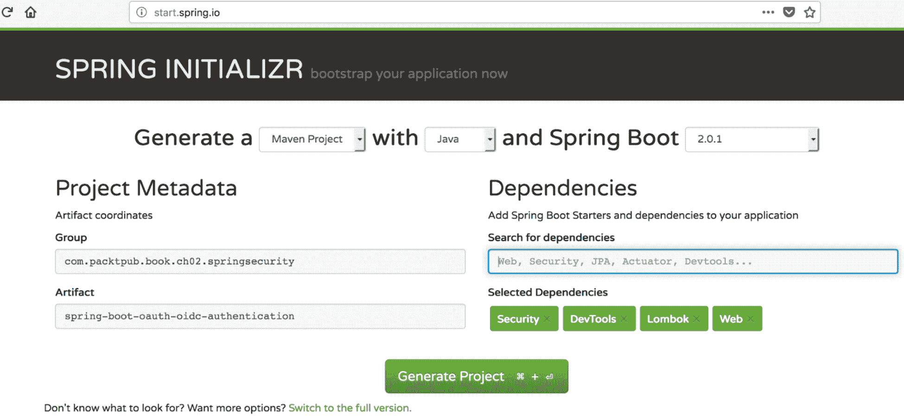

图 6：Spring Initializr 设置

单击“生成项目”按钮，将 ZIP 文件下载到您选择的文件夹中。执行以下`unzip`命令。我使用 Macintosh 运行所有示例应用程序，因此我将使用适用于此平台的命令（如果有的话）：

```java
unzip -a spring-boot-oauth-oidc-authentication.zip
```

# 在 pom.xml 中包含 OAuth 库

修改项目的`pom.xml`文件，添加以下依赖项：

```java
<!-- Provided -->
<dependency>
  <groupId>org.springframework.boot</groupId>
  <artifactId>spring-boot-starter-tomcat</artifactId>
  <scope>provided</scope>
</dependency>
<dependency>
  <groupId>org.apache.tomcat.embed</groupId>
  <artifactId>tomcat-embed-jasper</artifactId>
  <scope>provided</scope>
</dependency>
<!-- OAuth -->
<dependency>
  <groupId>org.springframework.boot</groupId>
  <artifactId>spring-boot-starter-security</artifactId>
</dependency>
<dependency>
  <groupId>org.springframework.security</groupId>
  <artifactId>spring-security-oauth2-client</artifactId>
</dependency>
<dependency>
  <groupId>org.springframework.security</groupId>
  <artifactId>spring-security-oauth2-jose</artifactId>
</dependency>
```

# 在 application.properties 中设置提供程序详细信息

如果您运行应用程序（`./mvnw spring-boot:run`），然后在浏览器中导航到`http://localhost:8080`，您将看到一个默认的登录页面，如下所示。这个页面背后的所有魔术都是由 Spring Boot 和 Spring Security 为您完成的：

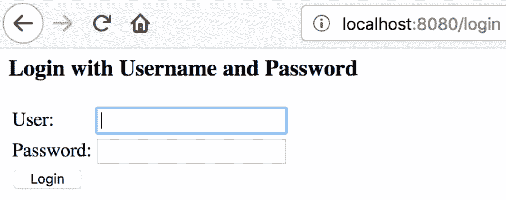

图 7：使用 Spring Initializr 创建的默认 Spring Boot + Spring Security 项目

打开`application.properties`文件（`src/main/resources`）并添加以下属性：

```java
#Google app details
spring.security.oauth2.client.registration.google.client-id=1085570125650-l8j2r88b5i5gbe3vkhtlf8j7u3hvdu78.apps.googleusercontent.com
spring.security.oauth2.client.registration.google.client-secret=MdtcKp-ArG51FeqfAUw4K8Mp
#Facebook app details
spring.security.oauth2.client.registration.facebook.client-id=229630157771581
spring.security.oauth2.client.registration.facebook.client-secret=e37501e8adfc160d6c6c9e3c8cc5fc0b
#Github app details
spring.security.oauth2.client.registration.github.client-id=<your client id>
spring.security.oauth2.client.registration.github.client-secret=<your client secret>
#Spring MVC details
spring.mvc.view.prefix: /WEB-INF/views/
spring.mvc.view.suffix: .jsp
```

在这里，我们为每个提供程序声明了两个属性。我们将实现 Google 提供程序，但您可以添加任意数量的提供程序。只需添加这些属性，就会产生更多的魔法，您的登录页面将突然变成以下内容：

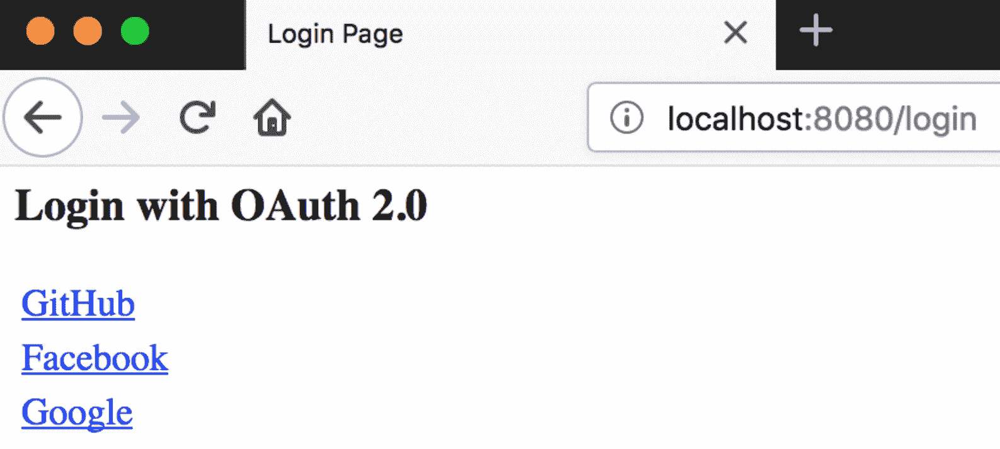

图 8：当修改 application.properties 文件时的 OAuth 默认登录页面

前面截图中显示的提供程序（链接）是根据`application.properties`文件中的配置而定的。它只查找两个属性，如下所示：

```java
spring.security.oauth2.client.registration.<provider_name>.client-id=<client id>
spring.security.oauth2.client.registration.<provider_name>.client-secret=<client secret>
```

# 提供程序设置

在本示例中，我们将使用 Google 作为我们的提供程序。转到[`console.developers.google.com/`](https://console.developers.google.com/)并执行以下步骤：

1.  创建项目。选择现有项目或创建新项目，如下图所示：

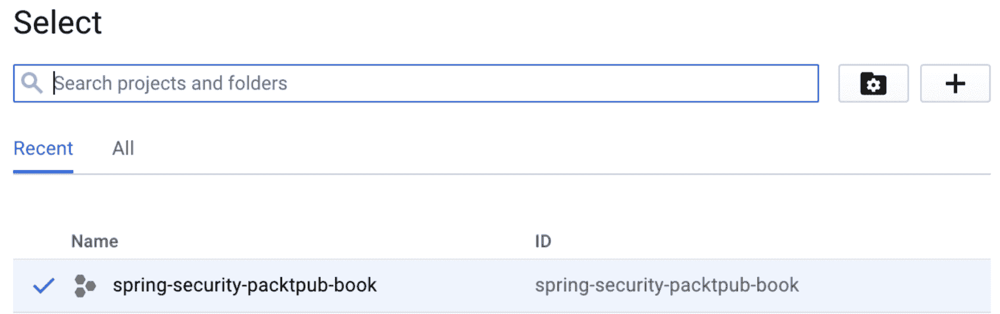

图 9：项目创建

1.  创建凭据。选择新创建的项目（在下面的屏幕截图中，它显示在 Google APIs 徽标旁边），然后单击侧边菜单中的凭据链接，如下面的屏幕截图所示：

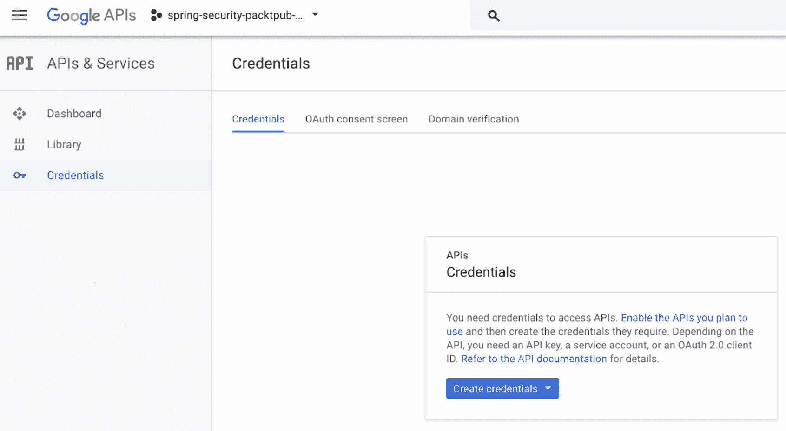

图 10：凭据创建 - 步骤 1

1.  现在，单击“创建凭据”下拉菜单，如下面的屏幕截图所示：

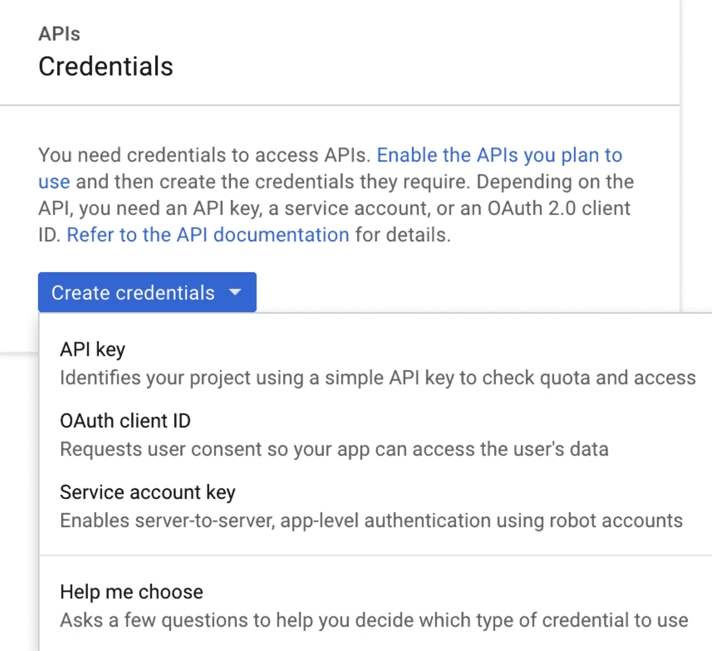

图 11：凭据创建 - 步骤 2

1.  从下拉菜单中，单击 OAuth 客户端 ID。这将导航您到下面屏幕截图中显示的页面。请注意，此时“应用程序类型”单选组将被禁用：

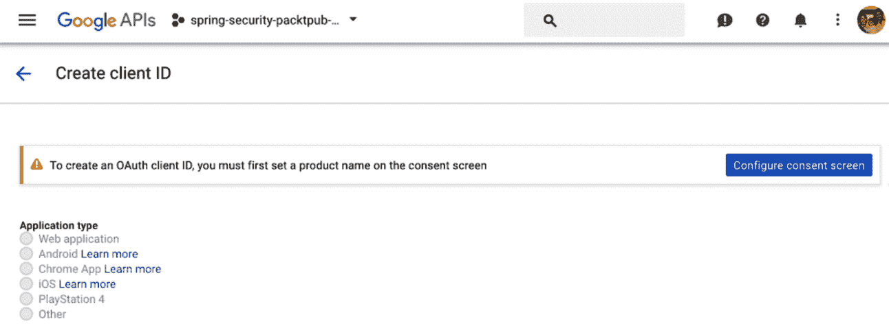

图 12：凭据创建 - 步骤 3

1.  单击“配置同意屏幕”。您将被导航到以下页面：

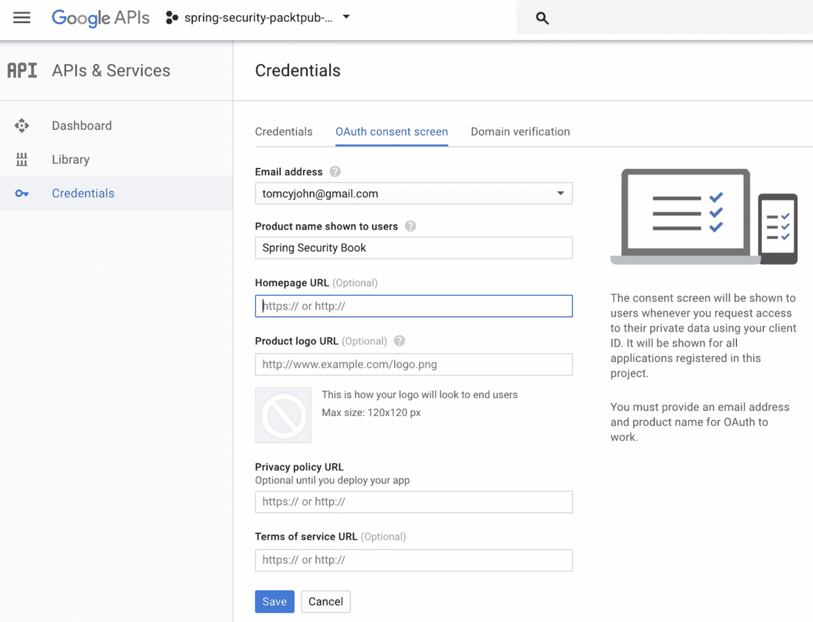

图 13：凭据创建 - 步骤 4

1.  输入相关详细信息（在填写表单时留出可选字段），如前图所示，然后单击“保存”按钮。您将被导航回到下图所示的页面。

这次，“应用程序类型”单选组将被启用：

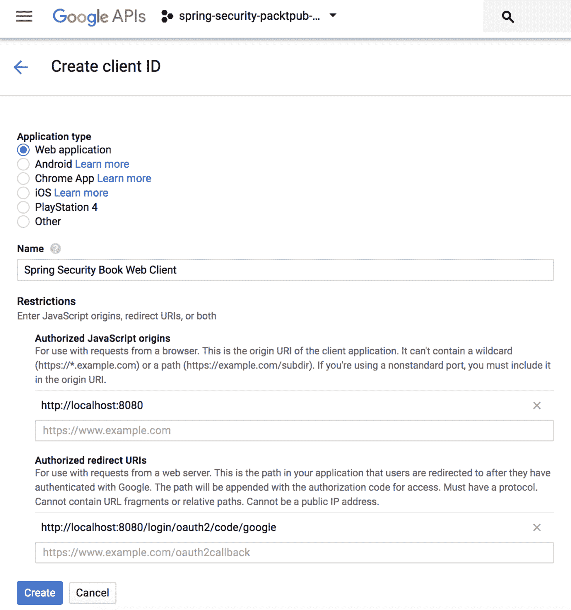

图 14：凭据创建 - 步骤 5

1.  将应用程序类型选择为 Web 应用程序，并输入相关详细信息，如前图所示。单击“创建”按钮，将显示以下弹出窗口：

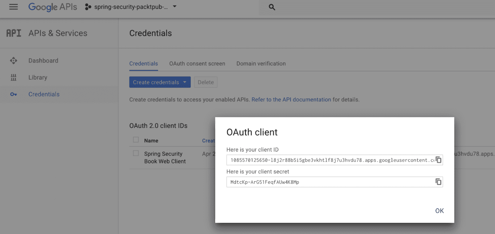

图 15：凭据创建 - 步骤 6

现在您已经从 Google 那里获得了客户端 ID 和客户端密钥。将这些值复制并粘贴到`application.properties`文件的正确位置。

# 默认应用程序更改

为了与上一个示例保持一致，我们将对生成的默认应用程序进行更改，引入与上一个应用程序中看到的相同组件。这将帮助您详细了解应用程序。

# HomeController 类

复制我们在上一个示例中创建的`HomeController.java`文件到一个新的包中。将欢迎消息更改为您想要的内容。

# home.jsp 文件

将整个`webapp`文件夹从上一个示例中原样复制到此项目中。将页面标题更改为不同的内容，以便在运行应用程序时清楚地表明这确实是示例应用程序。

# Spring Boot 主应用程序类更改

使您的应用程序类扩展`SpringBootServletInitializer`类。添加一个新的注释，如下所示，让您的 Spring Boot 应用程序知道一个新的控制器`HomeController`是一个必须扫描的组件：

```java
@ComponentScan(basePackageClasses=HomeController.class)
```

# 运行应用程序

通过执行以下默认命令来运行您的应用程序：

```java
./mvnw spring-boot:run
```

如果一切顺利，您应该能够单击 Google 链接，它应该将您导航到 Google 的登录页面。成功登录后，您将被重定向到`home.jsp`文件，如下面的屏幕截图所示：

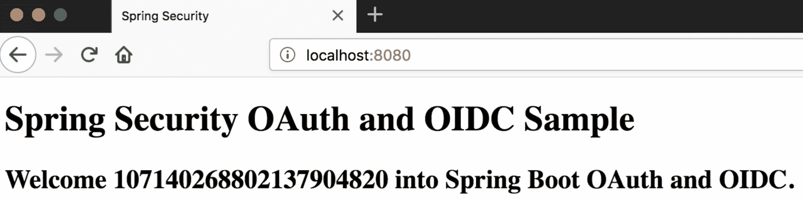

图 16：使用 Google 作为 OAuth 提供程序登录

对 OAuth 的支持并不止于此，但我们必须停止，因为本书无法深入探讨框架提供的许多方面。

# 摘要

在本章中，我们看到了企业中常用的身份验证机制，即 SAML、LDAP 和 Spring Security 支持的 OAuth/OIDC，通过实际编码示例进行了支持。我们使用作为第二章的一部分构建的示例应用程序作为解释其他身份验证机制的功能和实现的基础。

然而，在我们的编码示例中，我们有意没有使用响应式编程。本章旨在通过使用熟悉的 Spring Web MVC 应用程序框架，让您了解每种身份验证机制的核心概念。我们将在《第五章》*与 Spring WebFlux 集成*中更详细地介绍响应式编程。
