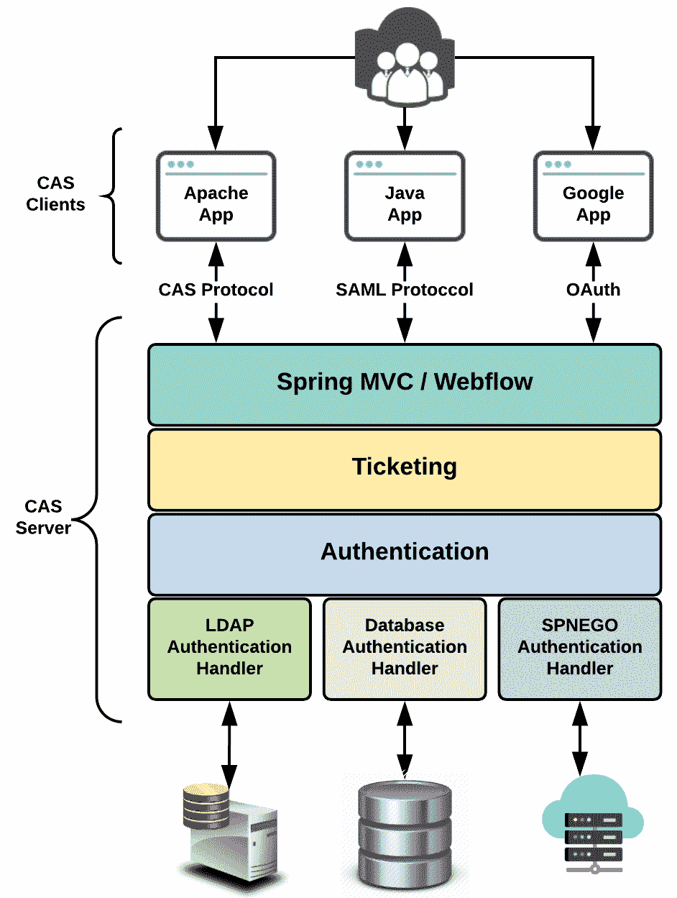
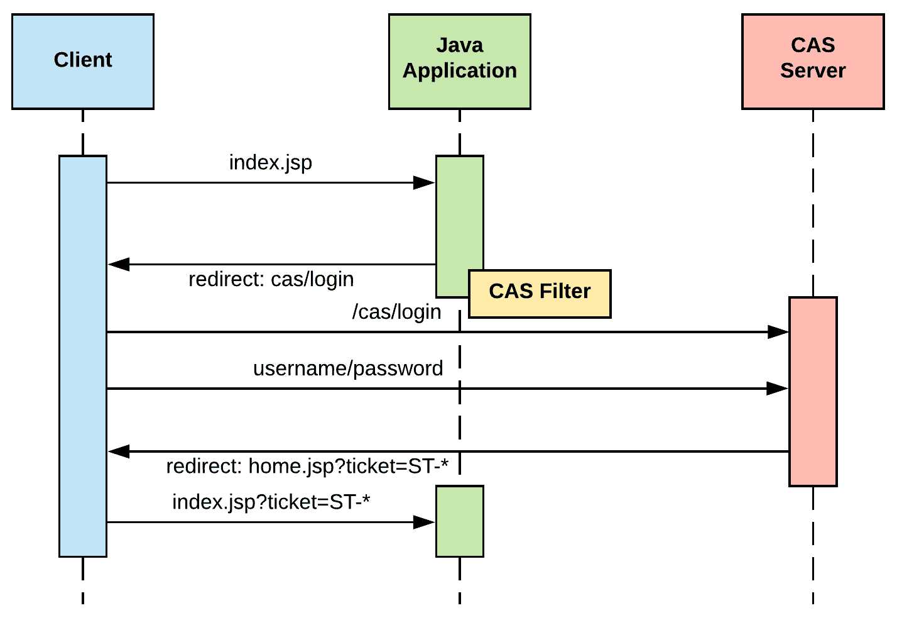
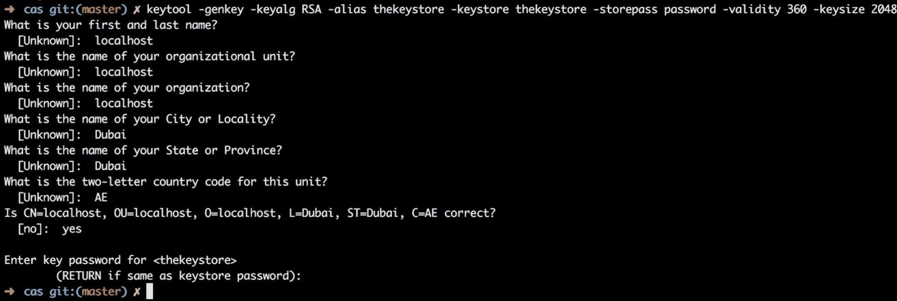
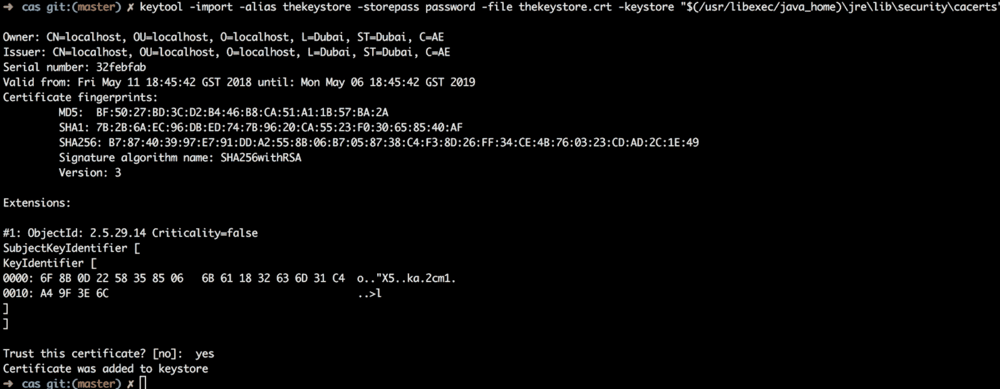
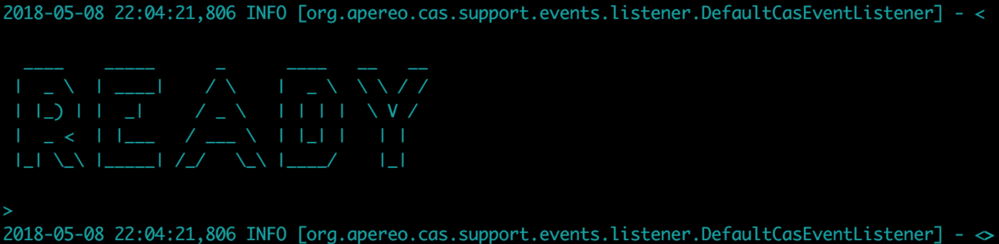
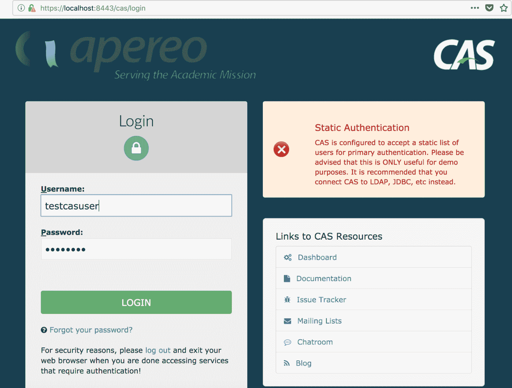
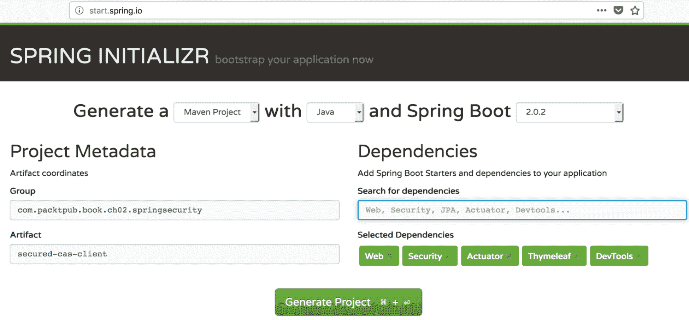
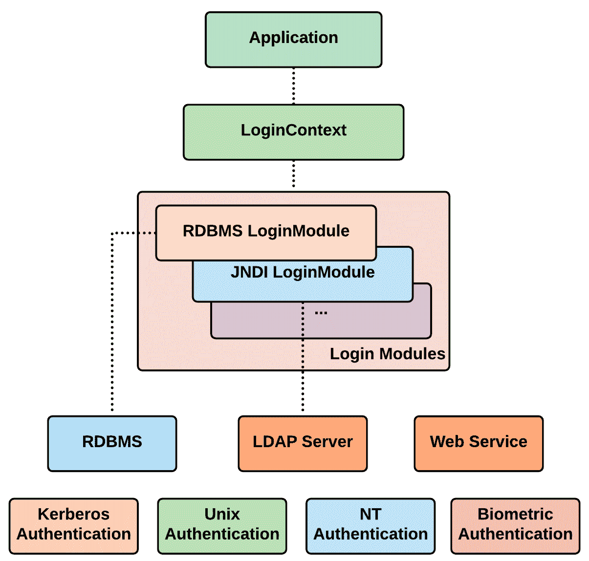

# 第四章：使用 CAS 和 JAAS 进行身份验证

本章将从上一章结束的地方继续，探讨 Spring Security 支持的其他身份验证机制，即 CAS 和 JAAS。同样，这也是一个完全动手编码的章节，我们将构建小型应用程序，其中大部分是从我们在第二章中构建的基础应用程序开始的，*深入 Spring Security*。这些身份验证机制在行业中广为人知，许多企业都将它们作为已建立的机制，用于对用户进行身份验证并允许访问他们的员工和消费者面向的许多应用程序。

每种身份验证机制都有一个项目，您可以在本书的 GitHub 页面上看到。但是，在本书中，我们只会涵盖样本代码的重要方面，以减少章节内的混乱。

在本章中，我们将涵盖以下主题：

+   CAS

+   Java 身份验证和授权服务

+   凯尔伯斯

+   自定义 AuthenticationEntryPoint

+   密码编码器

+   自定义过滤器

# CAS

<q>中央认证服务（CAS）是 Web 的单点登录/单点注销协议。它允许用户访问多个应用程序，同时只需向中央 CAS 服务器应用程序提供其凭据（如用户 ID 和密码）一次。</q>

<q>– CAS 协议规范</q>

CAS 是一个开源的、平台无关的、支持各种知名协议的中央**单点登录**（**SSO**）服务。Spring Security 对 CAS 有一流的支持，对于拥有中央 CAS 服务器的企业来说，实现非常简单。CAS 基于 Spring Framework，其架构非常简单，如下图所示：



图 1：CAS 架构（图表改编自 https://apereo.github.io）

**CAS 服务器**是一个基于 Java Servlet 的应用程序，构建在 Spring Framework（Spring MVC 和 Spring Web Flow）上。它对 CAS 启用的服务进行身份验证并授予访问权限。

用户成功登录后，将创建一个 SSO 会话，并且服务器将发出**票证授予票证**（**TGT**），并且该令牌将针对来自客户端的后续调用进行验证。

**CAS 客户端**是一个使用支持的协议（CAS、SAML、OAuth 等）与 CAS 通信的 CAS 启用应用程序。已经有许多语言支持 CAS，并且许多应用程序已经实现了这种方法。一些知名的应用程序是 Atlassian 产品（JIRA 和 Confluence）、Drupal 等。

以下图表显示了涉及 CAS 服务器和客户端的身份验证流程（序列图）：



图 2：CAS 身份验证流程

现在让我们看一个实际的动手示例。我们将创建一个 CAS 服务器，然后创建一个客户端，该客户端使用 CAS 服务器进行连接并进行身份验证。

# CAS 服务器设置

CAS 项目源代码可以在 GitHub 上找到，网址为[`github.com/apereo/cas`](https://github.com/apereo/cas)。实际上并不需要检出源代码，构建 CAS 服务器，然后部署它。WAR 覆盖是一种方法，我们不是下载源代码并构建，而是获取一个预构建的 CAS Web 应用程序，然后根据需要自定义某些行为以实现我们的用例。我们将使用这种方法来设置我们的 CAS 服务器。此外，我们将使用基于 Maven 的 WAR 覆盖，可以在 GitHub 上找到，网址为[`github.com/apereo/cas-overlay-template`](https://github.com/apereo/cas-overlay-template)。

# Git 克隆

启动您喜欢的命令提示符，并将 CAS 覆盖项目克隆到您想要的项目中。我将创建一个名为`cas-sample`的文件夹，在其中我将通过从`cas-sample`文件夹执行以下命令来在`server`文件夹中克隆服务器：

```java
git clone https://github.com/apereo/cas-overlay-template.git server
```

# 添加额外的依赖项

CAS 服务器不允许任何客户端连接。每个客户端都必须在所需的 CAS 服务器上注册。我们可以使用多种机制将客户端注册到服务器。我们将使用 JSON/YML 配置将客户端注册到服务器。继续并将以下依赖项添加到您刚刚克隆的服务器项目的`pom.xml`文件中：

```java
<dependency>
   <groupId>org.apereo.cas</groupId>
   <artifactId>cas-server-support-json-service-registry</artifactId>
   <version>${cas.version}</version>
</dependency>
<dependency>
   <groupId>org.apereo.cas</groupId>
   <artifactId>cas-server-support-yaml-service-registry</artifactId>
   <version>${cas.version}</version>
</dependency>
```

`pom.xml`文件中的大多数版本由父 POM 管理。

# 在项目中设置资源文件夹

在`server`项目中，创建一个名为`src/main/resources`的文件夹。将`server`文件夹中的`etc`文件夹复制到`src/main/resources`中：

```java
mkdir -p src/main/resources
cp -R etc src/main/resources
```

# 创建 application.properties 文件

创建一个名为`application.properties`的文件：

```java
touch src/main/resources/application.properties
```

现在在`application.properties`文件中填写以下细节：

```java
server.context-path=/cas
server.port=6443

server.ssl.key-store=classpath:/etc/cas/thekeystore
server.ssl.key-store-password=changeit
server.ssl.key-password=changeit

cas.server.name: https://localhost:6443
cas.server.prefix: https://localhost:6443/cas

cas.adminPagesSecurity.ip=127\.0\.0\.1

cas.authn.accept.users=casuser::password
```

上述文件设置了端口和 SSL 密钥库的值（在设置 CAS 服务器时非常重要），还设置了 CAS 服务器的`config`文件夹。显然，我们需要按照此文件中指示的方式创建一个密钥库。

请注意，覆盖项目中有一个文件，即`build.sh`文件，其中包含大部分这些细节。我们手动执行这些操作是为了更清楚地理解。

`application.properties`中的最后一行设置了一个测试用户，凭据为`casuser`/`password`，可用于登录 CAS 服务器进行各种演示目的。这种方法不建议在生产环境中使用。

# 创建本地 SSL 密钥库

在 shell 中导航到`cas-sample/server/src/main/resources/etc/cas`文件夹，并执行以下命令：

```java
keytool -genkey -keyalg RSA -alias thekeystore -keystore thekeystore -storepass password -validity 360 -keysize 2048
```

以下图显示了在命令提示符窗口中成功执行上述命令：



图 3：SSL 密钥库的创建

重要的是要注意，为了使 SSL 握手正常工作，生成密钥库时大多数值都设置为 localhost。这是一个重要的步骤，需要严格遵循。

# 创建供客户端使用的.crt 文件

为了使客户端连接到 CAS 服务器，我们需要从生成的密钥库中创建一个`.crt`文件。在相同的文件夹（`cas-sample/server/src/main/resources/etc/cas`）中，运行以下命令：

```java
keytool -export -alias thekeystore -file thekeystore.crt -keystore thekeystore
```

当要求输入密码时，请提供相同的密码（我们已将密码设置为`password`）。执行上述命令将创建`thekeystore.crt`文件。

# 将.crt 文件导出到 Java 和 JRE cacert 密钥库

执行以下命令以查找您的 Java 安装目录：

```java
/usr/libexec/java_home
```

或者，直接执行以下命令将`.crt`文件添加到 Java cacerts：

```java
keytool -import -alias thekeystore -storepass password -file thekeystore.crt -keystore "$(/usr/libexec/java_home)\jre\lib\security\cacerts"
```

以下图显示了在命令提示符窗口中成功执行上述命令：



图 4：将.crt 文件导出到 Java 密钥库

在设置客户端时，请确保使用的 JDK 与我们已添加`.crt`文件的 JDK 相同。为了将证书添加到 Java 上，建议重新启动机器。

# 构建 CAS 服务器项目并运行它

在`cas-sample/cas-server`文件夹中，执行以下两个命令：

```java
./build.sh package
./build.sh run
```

如果一切顺利，如下图所示，您应该看到一条日志消息，其中显示 READY：



图 5：CAS 服务器准备就绪日志

现在打开浏览器，导航到 URL `https://localhost:6443/cas`。这将导航您到 CAS 服务器的默认登录表单。输入默认凭据（`casuser`/`Mellon`）即可登录。大多数浏览器会显示连接不安全。将域名添加为异常情况，之后应用程序将正常工作：



图 6：默认 CAS 服务器登录表单

使用演示测试用户（`testcasuser`/`password`）登录，您应该已登录并导航到用户主页。

# 将客户端注册到 CAS 服务器

如前所述，每个客户端都必须在 CAS 服务器上注册，以允许参与 SSO。本节显示了如何将客户端注册到 CAS 服务器。

# JSON 服务配置

客户/服务可以通过多种方式注册到 CAS 服务器。我们将在这里使用 JSON 配置，并已在之前的步骤中将依赖项包含到我们的`pom.xml`文件中。除了 JSON 之外，还存在其他格式，如 YAML、Mongo、LDAP 等。

在`src/main/resources`文件夹中创建一个名为`clients`的新文件夹。在新创建的文件夹中创建一个新文件，内容如下：

```java
--- !<org.apereo.cas.services.RegexRegisteredService>
serviceId: "^(http?|https?)://.*"
name: "YAML"
id: 5000
description: "description"
attributeReleasePolicy: !<org.apereo.cas.services.ReturnAllAttributeReleasePolicy> {}
accessStrategy: !<org.apereo.cas.services.DefaultRegisteredServiceAccessStrategy>
 enabled: true
 ssoEnabled: true
```

将文件保存为`newYmlFile-5000.yml`。让我们详细了解一些重要属性：

+   `serviceId`：客户端想要连接到 CAS 服务器的 URL，以正则表达式模式表示。在我们的示例中，我们指的是运行在端口`9090`上的客户端 Spring Boot 应用程序，它连接到 CAS 服务器。

+   `id`：此配置的唯一标识符。

其他可配置属性在官方网站[`goo.gl/CGsDp1`](https://goo.gl/CGsDp1)上有文档记录。

# 附加的 application.properties 文件更改

在此步骤中，我们让 CAS 服务器了解 YML 配置的使用以及在服务器中查找这些 YML 的位置。将以下属性添加到`application.properties`文件中：

```java
cas.serviceRegistry.yaml.location=classpath:/clients
```

将 CAS 相关的配置属性分离到不同的属性文件中是一个好习惯。因此，继续创建一个`cas.properties`文件，并在其中包含 CAS 相关属性。

# CAS 客户端设置

我们将使用 Spring Initializr 来创建 CAS 客户端项目设置。我们之前使用了类似的方法。让我们再次看一下。

# 使用 Spring Initializr 引导 Spring 项目

访问[`start.spring.io/`](http://start.spring.io/)，并输入如下图所示的详细信息。确保选择正确的依赖项：



图 7：用于创建 secured-cas-client 项目的 Spring Initializr

单击“生成项目”按钮，将 ZIP 文件下载到您选择的文件夹中（我将把它保存在`cas-sample`文件夹中）。执行以下`unzip`命令。我在 macOS 上运行所有示例应用程序，因此我将使用适用于此平台的命令（如果有的话）：

```java
unzip -a spring-boot-cas-client.zip
```

# 在 pom.xml 中包含 CAS 库

通过添加以下依赖项修改项目的`pom.xml`：

```java
<dependency>
    <groupId>org.springframework.security</groupId>
    <artifactId>spring-security-cas</artifactId>
</dependency>
```

# 更改 application.properties 文件

为了确保我们不使用任何其他常用端口，我们将设置客户端监听端口`9090`。在 CAS 服务器中，我们还配置了客户端将监听端口`9090`。将以下属性添加到`application.properties`文件中：

```java
server.port=9090
```

# 附加的 bean 配置

我们现在将设置各种 bean，CAS Spring Security 模块需要。

# ServiceProperties bean

通过设置此 bean 来告诉 CAS 这是您的 CAS 客户端/服务。打开`SpringBootCasClientApplication.java`并添加以下 bean 定义：

```java
@Bean
public ServiceProperties serviceProperties() {
ServiceProperties serviceProperties = new ServiceProperties();
    serviceProperties.setService("http://localhost:9090/login/cas");
    serviceProperties.setSendRenew(false);
    return serviceProperties;
}
```

配置的 URL`http://localhost:9090/login/cas`将在内部映射到`CasAuthenticationFilter`。参数`sendRenew`设置为`false`。设置为`false`时，这告诉登录服务每次都需要用户名/密码才能访问服务。它还允许用户在不必再次输入用户名/密码的情况下访问所有服务/客户端。注销时，用户将自动注销所有服务。

# AuthenticationEntryPoint bean

看一下以下代码。相当简单直接，不是吗？这是我们告诉的 CAS 服务器运行的位置。当用户尝试登录时，应用程序将被重定向到此 URL：

```java
@Bean
public AuthenticationEntryPoint authenticationEntryPoint() {
    CasAuthenticationEntryPoint casAuthEntryPoint = new CasAuthenticationEntryPoint();
    casAuthEntryPoint.setLoginUrl("https://localhost:6443/cas/login");
    casAuthEntryPoint.setServiceProperties(serviceProperties());
    return casAuthEntryPoint;
}
```

# TicketValidator bean

当客户端应用程序获得已经分配给特定用户的票证时，将使用此 bean 来验证其真实性：

```java
@Bean
public TicketValidator ticketValidator() {
    return new Cas30ServiceTicketValidator("https://localhost:6443/cas");
}
```

# CasAuthenticationProvider bean

将之前声明的所有 bean 绑定到认证提供者 bean。我们将从`UserDetailsService`中提供的静态列表中加载用户。在生产环境中，这将指向数据库：

```java
@Bean
public CasAuthenticationProvider casAuthenticationProvider() {
  CasAuthenticationProvider provider = new CasAuthenticationProvider();
  provider.setServiceProperties(serviceProperties());
  provider.setTicketValidator(ticketValidator());
  provider.setUserDetailsService((s) -> new User("casuser", "password",
        true, true, true, true,
        AuthorityUtils.createAuthorityList("ROLE_ADMIN")));
  provider.setKey("CAS_PROVIDER_PORT_9090");
  return provider;
}
```

现在我们准备设置非常重要的 Spring Security 配置。

# 设置 Spring Security

让我们将在上一步中完成的 bean 引用带入 Spring Security 配置文件中。创建一个名为`SpringSecurityConfig`的新的 Java 文件并添加成员变量。之后，创建一个带有`@Autowired`注解的构造函数如下：

```java
private AuthenticationProvider authenticationProvider;
private AuthenticationEntryPoint authenticationEntryPoint;

@Autowired
public SpringSecurityConfig(CasAuthenticationProvider casAuthenticationProvider,
                     AuthenticationEntryPoint authenticationEntryPoint) {
   this.authenticationProvider = casAuthenticationProvider;
   this.authenticationEntryPoint = authenticationEntryPoint;
}
```

当用户访问由 CAS 服务器保护的客户端应用程序时，配置的 bean`AuthenticationEntryPoint`将被触发，并且用户将被带到在此 bean 中配置的 CAS 服务器 URL。一旦用户输入凭证并提交页面，CAS 服务器将对用户进行身份验证并创建服务票证。现在，该票证被附加到 URL，并且用户将被带到请求的客户端应用程序。客户端应用程序使用`TicketValidator` bean 来验证 CAS 服务器的票证，并且如果有效，则允许用户访问请求的页面。

在配置 HTTP 安全性之前，我们需要重写一些重要的方法。第一个方法使用`AuthenticationManagerBuilder`，我们告诉它使用我们的`AuthenticationProvider`。请按照以下方式创建该方法：

```java
@Override
protected void configure(AuthenticationManagerBuilder auth) throws Exception {
    auth.authenticationProvider(authenticationProvider);
}
```

我们现在重写另一个方法，指示`AuthenticationManager`将我们创建的`AuthenticationProvider`放入其中：

```java
@Override
protected AuthenticationManager authenticationManager() throws Exception {
    return new ProviderManager(Arrays.asList(authenticationProvider));
}
```

我们现在准备创建一个名为`CasAuthenticationFilter`的过滤器（作为一个 bean），它实际上拦截请求并进行 CAS 票证验证。

# 创建 CasAuthenticationFilter bean

创建`CasAuthenticationFilter` bean 非常简单，因为我们只需将我们创建的`serviceProperties`分配给`CasAuthenticationFilter`：

```java
@Bean
public CasAuthenticationFilter casAuthenticationFilter(ServiceProperties serviceProperties) throws Exception {
    CasAuthenticationFilter filter = new CasAuthenticationFilter();
    filter.setServiceProperties(serviceProperties);
    filter.setAuthenticationManager(authenticationManager());
    return filter;
}
```

# 设置控制器

这是我们 CAS 客户端项目设置的最终设置。我们将有一个包含指向受保护页面链接的未受保护页面。当访问受保护页面时，CAS SSO 启动，用户被导航到 CAS 认证页面。一旦使用凭证（`casuser`/`password`）登录，用户将被带到受保护页面，我们将显示经过身份验证的用户名。

我们将创建一个`ndexController`，它具有根文件夹路由（`/`）。这将把用户导航到`index.html`页面。

在一个新的包中创建`IndexController.java`（最好在 controllers 包中）：

```java
@Controller
public class IndexController {
    @GetMapping("/")
    public String index() {
        return "index";
    }
}
```

在`src/resources/templates`文件夹中创建`index.html`文件，内容如下：

```java
<!DOCTYPE html>
<html >
<head>
   <meta charset="UTF-8" />
   <title>Spring Security CAS Sample - Unsecured page</title>
</head>
<body>
<h1>Spring Security CAS Sample - Unsecured page</h1>
<br>
<a href="/secured">Go to Secured Page</a>
</body>
</html>
```

现在在相同的 controllers 包中创建一个名为`CasController.java`的新控制器。我们将映射所有受保护的页面，并在此控制器中设置各种请求映射。在控制器类中，复制以下代码片段：

```java
@Controller
@RequestMapping(value = "/secured")
public class CasController {

   @GetMapping
   public String secured(ModelMap modelMap) {
     Authentication auth = SecurityContextHolder.getContext().getAuthentication();
     if( auth != null && auth.getPrincipal() != null
         && auth.getPrincipal() instanceof UserDetails) {
       modelMap.put("authusername", ((UserDetails) auth.getPrincipal()).getUsername());
     }
     return "secured";
   }
}
```

创建一个名为`secured.html`的新 HTML 文件，内容如下。这是我们的受保护页面，将显示经过身份验证的用户名：

```java
<!DOCTYPE html>
<html >
<head>
   <meta charset="UTF-8" />
   <title>Spring Security CAS Sample - Secured page</title>
</head>
<body>
<h1>Spring Security CAS Sample - Secured page</h1>
<br>
<h3 th:text="${authusername} ? 'Hello authenticated user, ' + ${authusername} + '!' : 'Hello non-logged in user!'">Hello non-logged in user!</h3>
</body>
</html>
```

# 运行应用程序

启动 CAS 服务器（在`cas-server`中运行`./build.sh run`）。之后，通过执行`./mvnw spring-boot:run`启动 spring boot 项目（`secured-cas-client`）。将浏览器导航到`http://localhost:9090`。这将带用户到`index.html`，当他们点击链接（导航到`secured.html`页面）时，用户将被带到 CAS 认证页面。要进行认证，请输入 CAS 凭证，然后将票证设置为查询字符串，然后您将被带到受保护的页面。受保护的页面将使用 CAS 服务器验证票证，然后显示用户名。

通过这样，我们完成了使用 Spring Security 的 CAS 示例。在下一节中，类似于 CAS，我们将详细介绍如何使用 JAAS 认证来使用 Spring Security。

# Java 身份验证和授权服务

**Java 身份验证和授权服务**（**JAAS**）（[`docs.oracle.com/javase/6/docs/technotes/guides/security/jaas/JAASRefGuide.html`](https://docs.oracle.com/javase/6/docs/technotes/guides/security/jaas/JAASRefGuide.html)）实现了标准**可插拔身份验证模块**（**PAM**）框架的 Java 版本。它作为 J2SDK（1.3）的可选包（扩展）引入，然后集成到 J2SDK 1.4 中。

JAAS 是一个标准库，为您的应用程序提供以下功能：

+   通过提供凭证（用户名/密码-主体）来表示身份（主体）。

+   一个登录服务，将回调您的应用程序以从用户那里收集凭证，然后在成功身份验证后返回一个主体。

+   在成功身份验证后，向用户授予必要的授权的机制：



图 8：JAAS 的工作原理

如前图所示，JAAS 具有大多数内置登录机制的预定义登录模块。可以根据应用程序要求导入或构建自定义登录模块。JAAS 允许应用程序独立于实际的身份验证机制。它是真正可插拔的，因为可以集成新的登录模块而无需更改应用程序代码。

JAAS 很简单，流程如下：

+   该应用程序实例化一个`LoginContext`对象，并调用适当的（由配置控制的）`LoginModule`，执行身份验证。

+   一旦身份验证成功，*主体*（运行代码的人）将通过`LoginModule`更新为*主体*和*凭证*。

+   在那之后，JAAS 启动授权过程（使用标准 Java SE 访问控制模型）。访问是基于以下内容授予的：

+   **代码源**：代码的来源地和签署代码的人

+   **用户**：运行代码的人（也称为**主体**）

现在我们对 JAAS 及其工作原理有了大致的了解，接下来我们将通过以下部分中的示例来查看使用 Spring Security 的 JAAS 的工作原理。

# 设置项目

我们要构建的示例应用程序与第三章开始时创建的应用程序非常相似，即使用 SAML、LDAP 和 OAuth/OIDC 进行身份验证。许多方面都是相似的，但在细微的方式上有所不同。每个步骤都将得到解释；但是，有时我们不会详细介绍，因为我们已经在之前的示例中看到了一些方面。

# 设置 Maven 项目

我们将使用 IntelliJ IDE 创建一个 Maven 项目。在您的`pom.xml`文件中添加以下依赖项和构建设置：

```java
<groupId>com.packtpub.book.ch04.springsecurity</groupId>
<artifactId>jetty-jaas-authentication</artifactId>
<version>1.0-SNAPSHOT</version>
<packaging>war</packaging>
<properties>
   <maven.compiler.source>1.8</maven.compiler.source>
   <maven.compiler.target>1.8</maven.compiler.target>
   <failOnMissingWebXml>false</failOnMissingWebXml>
</properties>
<dependencies>
   <!--Spring Security Dependencies-->
   <dependency>
       <groupId>org.springframework.security</groupId>
       <artifactId>spring-security-web</artifactId>
       <version>5.0.4.RELEASE</version>
   </dependency>
   <dependency>
       <groupId>org.springframework.security</groupId>
       <artifactId>spring-security-config</artifactId>
       <version>5.0.4.RELEASE</version>
   </dependency>
   <!--Spring Framework Dependencies-->
   <dependency>
       <groupId>org.springframework</groupId>
       <artifactId>spring-context</artifactId>
       <version>5.0.4.RELEASE</version>
   </dependency>
   <dependency>
       <groupId>org.springframework</groupId>
       <artifactId>spring-webmvc</artifactId>
       <version>5.0.4.RELEASE</version>
   </dependency>
   <!-- JSP, JSTL and Tag Libraries-->
   <dependency>
       <groupId>javax.servlet</groupId>
       <artifactId>javax.servlet-api</artifactId>
       <version>3.1.0</version>
       <scope>provided</scope>
   </dependency>
   <dependency>
       <groupId>javax.servlet</groupId>
       <artifactId>jstl</artifactId>
       <version>1.2</version>
       <scope>provided</scope>
   </dependency>
   <dependency>
       <groupId>javax.servlet.jsp</groupId>
       <artifactId>javax.servlet.jsp-api</artifactId>
       <version>2.3.1</version>
       <scope>provided</scope>
   </dependency>
   <dependency>
       <groupId>javax.servlet.jsp.jstl</groupId>
       <artifactId>javax.servlet.jsp.jstl-api</artifactId>
       <version>1.2.1</version>
   </dependency>
   <dependency>
       <groupId>taglibs</groupId>
       <artifactId>standard</artifactId>
       <version>1.1.2</version>
   </dependency>
   <!--SLF4J and logback-->
   <dependency>
       <groupId>org.slf4j</groupId>
       <artifactId>slf4j-api</artifactId>
       <version>1.7.25</version>
   </dependency>
   <dependency>
       <groupId>org.slf4j</groupId>
       <artifactId>jcl-over-slf4j</artifactId>
       <version>1.7.25</version>
   </dependency>
   <dependency>
       <groupId>ch.qos.logback</groupId>
       <artifactId>logback-core</artifactId>
       <version>1.2.3</version>
   </dependency>
   <dependency>
       <groupId>ch.qos.logback</groupId>
       <artifactId>logback-classic</artifactId>
       <version>1.2.3</version>
   </dependency>
</dependencies>

<build>
   <plugins>
       <plugin>
           <groupId>org.eclipse.jetty</groupId>
           <artifactId>jetty-maven-plugin</artifactId>
           <version>9.4.10.v20180503</version>
       </plugin>
   </plugins>
</build>
```

我们添加 Spring 框架、Spring 安全、JSP/JSTL 和日志框架（SLF4J 和 Logback）的依赖项。我们将使用嵌入式 jetty 服务器（查看构建部分）来运行我们的应用程序。

# 设置 LoginModule

`LoginModule`负责对用户进行身份验证。我们将创建自己的名为`JaasLoginModule`的`LoginModule`，然后实现`login`方法。作为示例应用程序，我们的登录逻辑非常简单。必须实现`LoginModule`接口，才能编写自定义的登录模块。

创建一个类`JaasLoginModule.java`（实现`LoginModule`），并实现所有方法。在这个类中，我们将专注于两个重要的方法。在`initialize`方法中，我们获取所有必要的信息，如用户名/密码/主体，这些信息存储为字段变量，以便在我们的主要`login`方法中使用：

```java
// Gather information and then use this in the login method
@Override
public void initialize(Subject subject, CallbackHandler callbackHandler, Map<String, 
            ?> sharedState, Map<String, ?> options) {
    this.subject = subject;

    NameCallback nameCallback = new NameCallback("Username:");
    PasswordCallback passwordCallback = new PasswordCallback("Password:", false);
    try {
        callbackHandler.handle(new Callback[] { nameCallback, passwordCallback });
    } catch (IOException e) {
        e.printStackTrace();
    } catch (UnsupportedCallbackException e) {
        e.printStackTrace();
    }
    username = nameCallback.getName();
    password = new String(passwordCallback.getPassword());
}
```

在`login`方法中，我们将使用`initialize`方法中存储的值进行登录。在我们的情况下，如果硬编码的用户名/密码有效，则在主体中设置主体：

```java
// Code where actual login happens. Implement any logic as required by your application
// In our sample we are just doing a hard-coded comparison of username and password
@Override
public boolean login() throws LoginException {
    if (username == null || (username.equalsIgnoreCase("")) ||
        password == null || (password.equalsIgnoreCase(""))) {
        throw new LoginException("Username and password is mandatory.");
    } else if (username.equalsIgnoreCase("admin") &&        
        password.equalsIgnoreCase("password")) {
        subject.getPrincipals().add(new JaasPrincipal(username));
        return true;
    } else if (username.equalsIgnoreCase("user") && 
        password.equalsIgnoreCase("password")) {
        subject.getPrincipals().add(new JaasPrincipal(username));
        return true;
    }
    return false;
}
```

# 设置自定义主体

我们通过实现`java.security.Principal`接口创建了我们自己的自定义主体类。这是一个非常简单的类，我们通过构造函数接收用户名，然后在`getName`方法中使用它返回：

```java
public class JaasPrincipal implements Principal, Serializable {
    private String username;
    public JaasPrincipal(String username) {
        this.username = username;
    }
    @Override
    public String getName() {
        return "Authenticated_"+this.username;
    }
}
```

# 设置自定义 AuthorityGranter

`AuthorityGranter`被委托为经过身份验证的用户提供相关角色。我们将通过实现`org.springframework.security.authentication.jaas.AuthorityGranter`来创建我们自己的自定义类：

```java
public class JaasAuthorityGranter implements AuthorityGranter {
    @Override
    public Set<String> grant(Principal principal) {
        if (principal.getName().equalsIgnoreCase("Authenticated_admin")) {
            return Collections.singleton("ROLE_ADMIN");
        } else if (principal.getName().equalsIgnoreCase("Authenticated_user")) {
            return Collections.singleton("ROLE_USER");
        }
        return Collections.singleton("ROLE_USER");
    }
}
```

作为一个示例实现，在这个类中，我们查看已登录用户的用户名并为其授予硬编码角色。在实际应用程序中，我们将在这里做一些更严肃的事情，实际上查询数据库，然后为已登录用户授予适当的角色。

# 配置文件

我们需要在示例中有许多配置文件（Java 配置），其中大部分已经在前面涵盖过。对于剩下的文件（尚未涵盖），我们要么快速浏览它们，要么在涵盖它们时进行详细讨论。

# 应用程序配置

我们在这里没有任何特定于应用程序的配置，但在您的应用程序中拥有这样的文件总是很好的。我们有`ApplicationConfig.java`作为我们的应用程序级 Java 配置（它里面没有任何内容）。

# Spring MVC 配置

如下所示，我们将创建 Spring MVC 特定的 Java 配置（`SpringMVCConfig.java`）：

```java
@Configuration
@EnableWebMvc
@ComponentScan( basePackages = "com.packtpub")
public class SpringMVCConfig implements WebMvcConfigurer {
    @Override
    public void configureViewResolvers(ViewResolverRegistry registry) {
        registry.jsp().prefix("/WEB-INF/views/").suffix(".jsp");
    }
    @Override
    public void addViewControllers(ViewControllerRegistry registry) {
        registry.addViewController("/login");
    }
}
```

在这个配置中，设置视图的*前缀*和*后缀*。确保您的登录视图控制器被显式添加，因为我们的控制器中没有定义路由（我们稍后会看到控制器）。

# Spring Security 配置

这是一个非常重要的配置示例。

我们将创建一个`AuthenticationProvider`bean。我们将使用我们自定义的`LoginModule`，然后使用`org.springframework.security.authentication.jaas.DefaultJaasAuthenticationProvider`来设置一些内容。然后将此身份验证提供程序设置为全局提供程序。任何请求都将通过此提供程序（`SpringSecurityConfig.java`）：

```java
@Bean
DefaultJaasAuthenticationProvider jaasAuthenticationProvider() {
   AppConfigurationEntry appConfig = new AppConfigurationEntry("com.packtpub.book.ch04.springsecurity.loginmodule.JaasLoginModule",
           AppConfigurationEntry.LoginModuleControlFlag.REQUIRED, new HashMap());

   InMemoryConfiguration memoryConfig = new InMemoryConfiguration(new AppConfigurationEntry[] { appConfig });

   DefaultJaasAuthenticationProvider def = new DefaultJaasAuthenticationProvider();
   def.setConfiguration(memoryConfig);
   def.setAuthorityGranters(new AuthorityGranter[] {jaasAuthorityGranter});
   return def;
}

//We are configuring jaasAuthenticationProvider as our global AuthenticationProvider
@Autowired
public void configureGlobal(AuthenticationManagerBuilder auth) throws Exception {
   auth.authenticationProvider(jaasAuthenticationProvider());
}
```

下一个最重要的方法是`configure`方法，在其中我们将确保设置需要受保护的正确路径，并且我们还将设置一些重要的配置：

```java
// Setting up our HTTP security
@Override
protected void configure(HttpSecurity http) throws Exception {

   // Setting up security
   http.authorizeRequests()
           .regexMatchers("/admin/.*").hasRole("ADMIN")
           .anyRequest().authenticated().and().httpBasic();

   // Setting our login page and to make it public
   http.formLogin().loginPage("/login").permitAll();
   // Logout configuration
   http.logout().logoutSuccessUrl("/");
   // Exception handling, for access denied
   http.exceptionHandling().accessDeniedPage("/noaccess");
}
```

# 控制器

我们只有一个控制器，我们将在其中配置所有路由（`JaasController.java`）：

```java
@Controller
public class JaasController {
    @RequestMapping(value="/", method = RequestMethod.GET)
    public ModelAndView userPage() {
        ModelAndView modelAndView = new ModelAndView("user");
        return modelAndView;
    }
    @RequestMapping(value = "/admin/moresecured", method = RequestMethod.GET)
    public ModelAndView adminPage(HttpServletRequest request) {
        ModelAndView modelAndView = new ModelAndView();
        modelAndView.setViewName("moresecured");
        return modelAndView;
    }
    @RequestMapping(value="/noaccess", method = RequestMethod.GET)
    public ModelAndView accessDenied() {
        ModelAndView modelAndView = new ModelAndView("noaccess");
        return modelAndView;
    }
}
```

# 设置页面

我们有一些琐碎的页面。我不想在这里粘贴代码，因为它相当容易理解：

+   `login.jsp`：我们自定义的登录页面，用于从最终用户那里收集用户名和密码。

+   `user.jsp`：在示例中设置为根的页面。登录后，用户将被导航到此页面。我们只是打印会话 ID 和用户名，以展示登录。

+   `moresecured.jsp`：这只是为了展示用户角色的重要性。只有具有`ADMIN`角色的用户才能访问此页面。

+   `noaccess.jsp`：当用户无法访问任何页面时，这个虚拟页面就会出现。

可以在书的 GitHub 页面的*jetty-jaas-authentication*项目中找到完整的示例项目。

# 运行应用程序

从项目的根目录执行以下命令：

```java
mvn jetty:run
```

打开浏览器，导航到`http://localhost:8080`。您将看到一个看起来很简陋的登录页面。输入用户名/密码（admin/password 或 user/password），然后您将被导航到根页面（`user.jsp`）。

这完成了我们使用 Spring Security 的 JAAS 示例。如上图所示，JAAS 可以用于使用其他协议进行身份验证。其中一个众所周知的机制是使用 Kerberos 协议进行身份验证。下一节简要介绍了 JAAS 如何用于实现基于 Kerberos 的身份验证的大致想法。

# Kerberos

JAAS 提供了许多内置类型的`LoginModule`，其中之一是`rb5LoginModule`，用于使用 Kerberos 协议对用户进行身份验证。因此，确实可以使用 JAAS 方法来轻松实现基于 Spring 的应用程序中的 Kerberos 身份验证。

让我们深入了解一些关于身份验证的重要细节。

# 自定义身份验证入口点

在将响应发送回客户端之前，可以使用自定义`AuthenticationEntryPoint`来设置必要的响应头、内容类型等。

`org.springframework.security.web.authentication.www.BasicAuthenticationEntryPoint`类是一个内置的`AuthenticationEntryPoint`实现，用于启动基本身份验证。可以通过实现`org.springframework.security.web.AuthenticationEntryPoint`接口来创建自定义入口点。以下是一个示例实现：

```java
@Component
public final class CustomAuthenticationEntryPoint implements 
        AuthenticationEntryPoint {
    @Override
    public void commence(final HttpServletRequest request, final 
            HttpServletResponse response, final AuthenticationException 
        authException) throws IOException {
        response.sendError(HttpServletResponse.SC_UNAUTHORIZED, "Unauthorized");
    }
}
```

当客户端在没有身份验证的情况下访问资源时，此入口点会启动并抛出 401 状态码（`未经授权`）。

在 Spring Security Java 配置文件中，确保`configure`方法定义了这个自定义`AuthenticationEntryPoint`，如下面的代码片段所示：

```java
@Override
protected void configure(HttpSecurity http) throws Exception {
    http
        .authorizeRequests()
        .antMatchers("/public").permitAll()
        .anyRequest().authenticated()
        .and()
        .httpBasic()
        .authenticationEntryPoint(customAuthenticationEntryPoint);
}
```

# 多个 AuthenticationEntryPoint

Spring Security 确实允许您为应用程序配置多个`AuthenticationEntryPoint`，如果需要的话。

自 Spring Security 3.0.2 以来，`org.springframework.security.web.authentication.DelegatingAuthenticationEntryPoint`查看配置中声明的所有`AuthenticationEntryPoint`并执行它们。

自 Spring Security 5.x 以来，我们有`org.springframework.security.web.server.DelegatingServerAuthenticationEntryPoint`，它使用反应性数据类型，并为其执行带来了异步性质。

Spring Security 配置中的`defaultAuthenticationEntryPointFor()`方法也可以用于设置查看不同 URL 匹配的多个入口点（请参见以下代码片段）：

```java
@Override
protected void configure(HttpSecurity http) throws Exception {
    http
    .authorizeRequests()
        .antMatchers("/public").permitAll()
        .anyRequest().authenticated()
        .and()
        .httpBasic()
    .defaultAuthenticationEntryPointFor(
        loginUrlAuthenticationEntryPointUser(),
        new AntPathRequestMatcher("/secured/user/**"))
    .defaultAuthenticationEntryPointFor(
        loginUrlAuthenticationEntryPointAdmin(),
        new AntPathRequestMatcher("/secured/admin/**"));
}
@Bean
public AuthenticationEntryPoint loginUrlAuthenticationEntryPointUser(){
    return new LoginUrlAuthenticationEntryPoint("/userAuth");
}      
@Bean
public AuthenticationEntryPoint loginUrlAuthenticationEntryPointAdmin(){
    return new LoginUrlAuthenticationEntryPoint("/adminAuth");
}
```

# PasswordEncoder

在 Spring Security 5 之前，该框架只允许应用程序中有一个`PasswordEncoder`，并且还有弱密码编码器，如 MD5 和 SHA。这些编码器也没有动态盐，而是更多的静态盐需要提供。通过 Spring Security 5，在这个领域发生了巨大的变化，新版本中的密码编码概念采用了委托，并允许在同一应用程序中进行多次密码编码。已编码的密码有一个前缀标识符，指示使用了什么算法（请参见以下示例）：

```java
{bcrypt}$2y$10$zsUaFDpkjg01.JVipZhtFeOHpC2/LCH3yx6aNJpTNDOA8zDqhzgR6
```

此方法允许根据需要在应用程序中使用多种编码。如果没有提到标识符，这意味着它使用默认编码器，即`StandardPasswordEncoder`。

一旦您决定密码编码，这可以在`AuthenticationManager`中使用。一个示例是以下代码片段：

```java
@Autowired
public void configureGlobal(AuthenticationManagerBuilder auth) throws Exception {
    auth
        .inMemoryAuthentication()
        .passwordEncoder(new StandardPasswordEncoder())    
        .withUser("user")
        .password("025baf3868bc8f785267d4aec1f02fa50809b7f715576198eda6466")
        .roles("USER");
}
```

如前所述，Spring Security 5 通过引入`DelegationPasswordEncoder`引入了委托方法。`DelegatingPasswordEncoder`已取代`PasswordEncoder`，并可以通过以下两种方法创建：

+   方法 1：

```java
PasswordEncoder passwordEncoder = 
    PasswordEncoderFactories.createDelegatingPasswordEncoder();
passwordEncoder.setDefaultPasswordEncoderForMatches(new BCryptPasswordEncoder());
```

+   方法 2：

```java
String defaultEncode = "bcrypt";
Map encoders = new HashMap<>();
encoders.put(defaultEncode, new BCryptPasswordEncoder());
encoders.put("scrypt", new SCryptPasswordEncoder());
encoders.put("sha256", new StandardPasswordEncoder());

PasswordEncoder passwordEncoder =
    new DelegatingPasswordEncoder(defaultEncode, encoders);
```

`DelegatingPasswordEncoder`允许针对旧的编码方法验证密码，并在一段时间内升级密码，而无需任何麻烦。这种方法可以用于在用户进行身份验证时自动升级密码（从旧编码到新编码）。

# 盐

为了使暴力攻击更加困难，我们在编码时还可以提供一个随机字符串。这个随机字符串称为**盐**。盐文本包含在`PasswordEncoder`中，如下面的代码片段所示：

```java
auth
    .inMemoryAuthentication()
    .passwordEncoder(new StandardPasswordEncoder(“random-text-salt”));
```

# 自定义过滤器

正如前面所解释的，Spring Security 是基于 servlet 过滤器工作的。有许多内置的 servlet 过滤器几乎可以完成所有必要的功能。如果需要，Spring Security 确实提供了一种机制来编写自定义过滤器，并可以在过滤器链执行的正确位置插入。通过扩展`org.springframework.web.filter.GenericFilterBean`来创建自己的过滤器，如下面的代码片段所示：

```java
public class NewLogicFilter extends GenericFilterBean {
    @Override
    public void doFilter(ServletRequest request, ServletResponse response,
            FilterChain chain) throws IOException, ServletException {
        // Custom logic
        chain.doFilter(request, response);
    }
}
```

一旦您创建了自己的过滤器，请将其插入到 Spring Security 配置文件中的过滤器链中，如下所示：

```java
@Configuration
public class SpringSecurityConfiguration extends WebSecurityConfigurerAdapter {
    @Override
    protected void configure(HttpSecurity http) throws Exception {
        http
            .addFilterBefore(new NewLogicFilter(), 
                BasicAuthenticationFilter.class);
    }
}
```

您可以将新的过滤器放置在过滤器链中的任何位置，之前、之后或特定位置。如果您想要扩展现有的过滤器，也可以这样做。

# 摘要

在本章中，我们通过实际编码示例介绍了 Spring Security 支持的 CAS 和 JAAS 两种认证机制。同样，我们使用了作为第二章的一部分构建的示例应用程序作为基础，以解释其他认证机制的工作和实现。然后，我们介绍了 Spring Security 中的一些重要概念和可定制性。

在本章中，我们故意没有在编码示例中使用响应式编程。本章的目的是让您通过使用熟悉的 Spring Web MVC 应用程序框架来理解每个 CAS 和 JAAS 认证机制的核心概念。我们将在第五章中更详细地介绍响应式编程，即*与 Spring WebFlux 集成*。我们将在下一章中介绍 Spring WebFlux，并在适当的时候实现 Spring Security。在阅读[第五章](https://cdp.packtpub.com/hands_on_spring_security_5_for_reactive_applications/wp-admin/post.php?post=168&action=edit#post_29)的主要内容时，您将清楚地了解，使本章中的代码示例符合响应式是非常容易的。
