# 第五章：与 Spring WebFlux 集成

Spring Framework 5 引入的新功能之一是引入了一个新的响应式 Web 应用程序框架，Spring WebFlux。WebFlux 与成熟的 Web 应用程序框架 Spring MVC 并存。该书旨在介绍 Spring Security 的响应式部分，其中 Spring WebFlux 是核心组件之一。

使您的应用程序具有响应式特性会为您的应用程序带来异步性。传统的 Java 应用程序使用线程来实现应用程序的并行和异步特性，但是对于 Web 应用程序来说，使用线程是不可伸缩和高效的。

本章首先介绍了 Spring MVC 和 Spring WebFlux 之间的核心区别，然后深入探讨了 Spring Security 模块以及如何将响应式方面引入其中。

在本章中，我们将涵盖以下主题：

+   Spring MVC 与 WebFlux

+   Spring 5 中的响应式支持

+   Spring WebFlux

+   Spring WebFlux 身份验证架构

+   Spring WebFlux 授权

+   示例项目

+   自定义

# Spring MVC 与 WebFlux

Spring WebFlux 作为 Spring 5 的一部分引入，为现有的 Spring MVC 带来了一个新的替代方案。Spring WebFlux 引入了非阻塞的事件循环式编程，以提供异步性。

事件循环是由 Node.js 引入并因此而出名。Node.js 能够使用单线程的 JavaScript 执行非阻塞操作，通过在可能的情况下将操作卸载到系统内核。内核是多线程的，能够执行这些卸载的操作，并在成功执行后通过回调通知 Node.js。有一个不断运行的进程来检查调用堆栈（其中堆叠了需要执行的操作），并以**先进先出**（**FIFO**）的方式继续执行进程。如果调用堆栈为空，它会查看*事件队列*中的操作。它会将它们拾起，然后将它们移动到调用堆栈中以供进一步执行。

以下图显示了两个 Web 应用程序框架中的内容：

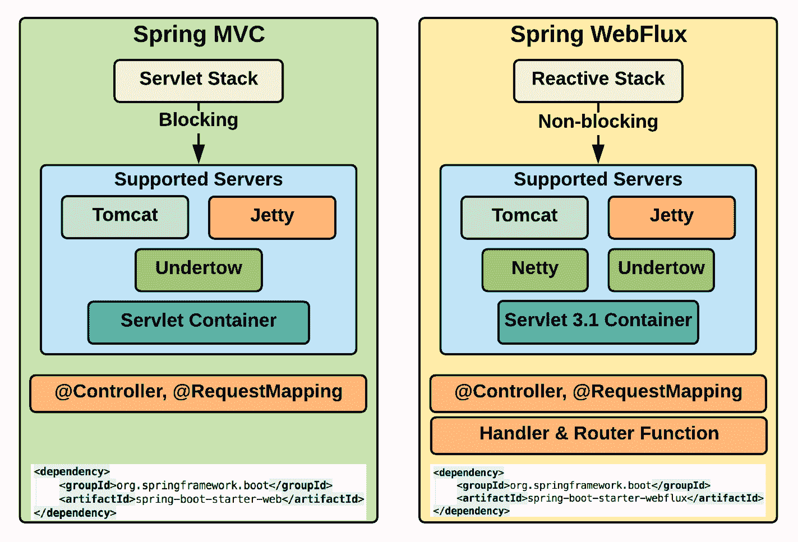

图 1：Spring MVC 和 Spring WebFlux

如前图所示，Spring MVC 基于 Servlet API（在线程池上工作），而 Spring WebFlux 基于响应式流（它基于事件循环机制）。然而，这两个框架都支持常用的注解，如`@Controller`，并且也支持一些知名的服务器。

让我们在下图中并排看一下 Spring MVC 和 Spring WebFlux 的工作方式：

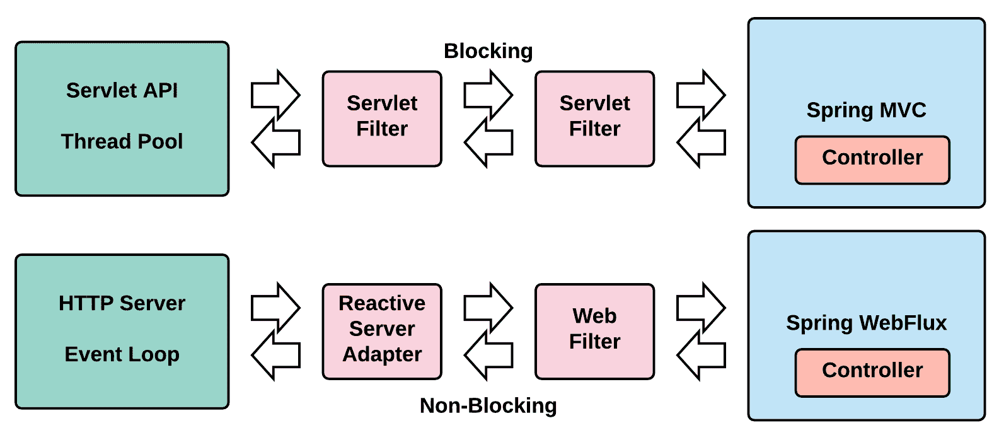

图 2：Spring MVC 和 Spring WebFlux 的工作方式

正如您所看到的，这两个框架的工作方式的根本区别在于 Spring MVC 是阻塞的，而 Spring WebFlux 是非阻塞的。

在 Spring WebFlux 中，Servlet API 充当适配器层，使其能够支持诸如**Tomcat**和**Jetty**等 Servlet 容器以及**Undertow**和**Netty**等非 Servlet 运行时。

Spring MVC 包括同步 API（过滤器、Servlet 等）和阻塞 I/O（`InputStream`、`OutputStream`等），而 Spring WebFlux 包括异步 API（`WebFilter`、`WebHandler`等）和非阻塞 I/O（Reactor Mono 用于*0..1*元素和 Reactor Flux 用于*0..N*元素）。

Spring WebFlux 支持各种异步和响应式 API，即 Java 9 Flow API、RxJava、Reactor 和 Akka Streams。默认情况下，它使用 Spring 自己的响应式框架 Reactor，并且它的工作相当出色：

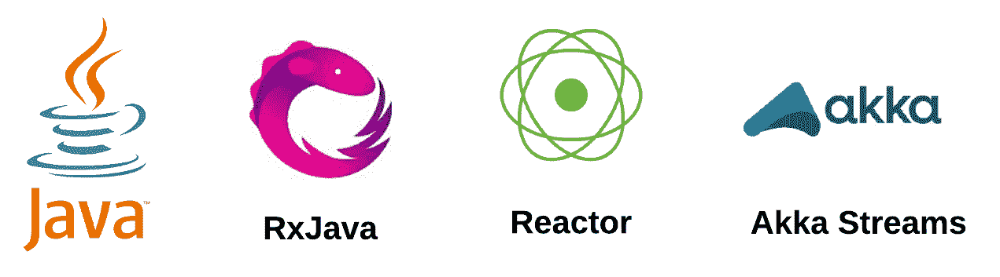

图 3：Spring WebFlux 响应式 API 支持

如前所述，Spring WebFlux 是作为 Spring MVC 的一种替代方案引入的。这并不意味着 Spring MVC 已经被弃用。在 Spring MVC 中编写的应用程序可以继续在相同的堆栈上运行，无需迁移到 Spring WebFlux。如果需要，我们可以通过运行一个响应式客户端来调用远程服务，将响应式编码实践引入现有的 Spring MVC 应用程序中。

现在我们已经了解了 Spring 中两种 Web 应用程序框架的特点，下一节将介绍在构建应用程序时何时选择哪种框架。

# 何时选择何种方式？

响应式编程非常好，但这并不意味着我们必须为每个应用程序都采用响应式。同样，不是所有应用程序都适合 Spring WebFlux。通过查看需求以及这些框架如何解决需求来选择框架。如果应用程序在 Spring MVC 框架下运行良好，那么没有必要将其迁移到 Spring WebFlux。事实上，如前所述，如果需要，可以将响应式的优点带入 Spring MVC 中，而不会有太多麻烦。

此外，如果应用程序已经具有阻塞依赖项（JDBC、LDAP 等），那么最好坚持使用 Spring MVC，因为引入响应式概念会带来复杂性。即使引入了响应式概念，应用程序的许多部分仍处于阻塞模式，这将阻止充分利用这种编程范式。

如果应用程序涉及数据流（输入和输出），则采用 Spring WebFlux。如果可伸缩性和性能至关重要，也可以考虑这作为 Web 应用程序选择。由于其异步和非阻塞的本质，这些应用程序在性能上会比同步和阻塞的应用程序更高。由于是异步的，它们可以处理延迟，并且更具可伸缩性。

# Spring 5 中的响应式支持

Spring Framework 5 对响应式编程范式有着广泛的支持。许多模块都全力拥抱这一概念，并将其视为一流公民。以下图表总结了 Spring 5 对响应式的支持：

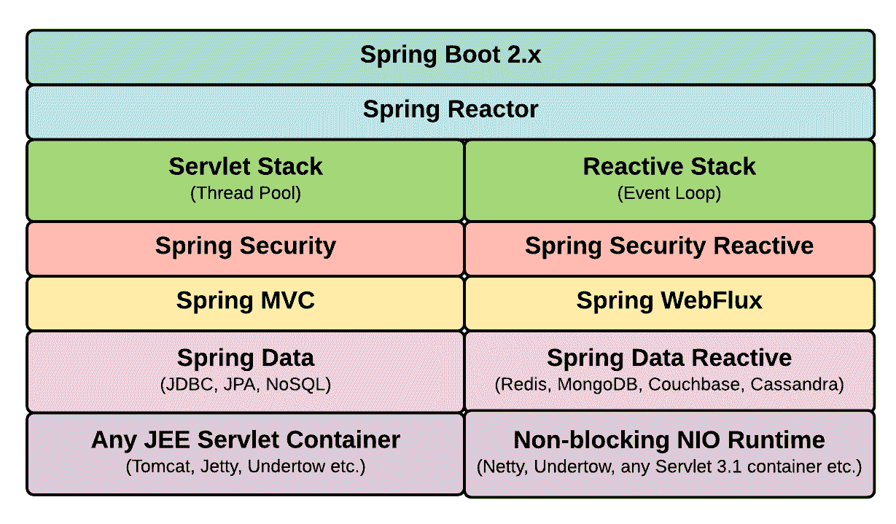

图 4：Spring 5 和响应式支持

Spring WebFlux 模块是建立在响应式编程范式之上的一个完整的 Web 应用程序框架（它使用 Reactor 和 RxJava）。在 Spring/Java 生态系统中，响应式编程的早期采用者包括 Spring Data、Spring Security 和 Thymeleaf。Spring Security 具有支持响应式编程的许多功能。

Spring Data 对 Redis、MongoDB、Couchbase 和 Cassandra 提供了响应式支持。它还支持从数据库中以`@Tailable`的形式发出的无限流（以流的形式逐个发出的记录）。JDBC 本质上是阻塞的，因此 Spring Data JPA 是阻塞的，无法变为响应式。

# Spring MVC 中的响应式

尽管 Spring MVC 在本质上是阻塞的，但是通过使用 Spring 5 提供的响应式编程能力，一些方面可以变得响应式。

在 Spring MVC 控制器中，可以使用响应式类型`Flux`和`Mono`，如下图所示。唯一的规则是只能将这些响应式类型用作控制器的返回值：

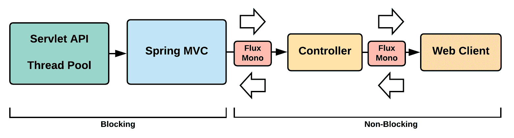

图 5：Spring MVC 使用响应式类型变为非阻塞

Spring MVC 的注解，如`@Controller`，`@RequestMapping`等，在 Spring WebFlux 中也得到支持。因此，可以在一段时间内以缓慢的方式将 Spring MVC Web 应用程序转换为 Spring WebFlux。

# Spring WebFlux

在本节中，我们将更详细地介绍 Spring WebFlux。Spring WebFlux 有两种（编程模型）使用方式。它们如下：

+   **使用注解**：通过使用注解，如在 Spring MVC 中所做的那样

+   **使用函数式风格**：使用 Java Lambdas 进行路由和处理

以下代码展示了使用 Spring WebFlux 的基于注解的风格。我们将在本章的后续部分中逐步介绍整个代码示例。然而，本节旨在在深入探讨之前进行介绍：

```java
@RestController
@RequestMapping(value=”/api/movie”)
public class MovieAPI {
    @GetMapping(“/”)
    public Flux(Movie) getMovies() {
        //Logic of getting all movies
    }
    @GetMapping(“/{id}”)
    public Mono<Movie> getMovie(@PathVariable Long id) {
        //Logic for getting a specific movie
    }
    @PostMapping(“/post”)
    public Mono<ResponseEntity<String>> createMovie(@RequestBody Movie movie) {
        // Logic for creating movie
    }
}
```

Spring WebFlux 的函数式编程模型使用了两个基本组件：

+   `HandlerFunction`：负责处理 HTTP 请求。相当于我们在之前的代码片段中看到的`@Controller`处理方法。

+   `RouterFunction`：负责路由 HTTP 请求。相当于基于注解的`@RequestMapping`。

# HandlerFunction

`HandlerFunction`接受一个`ServerRequest`对象，并返回`Mono<ServerResponse>`。`ServerRequest`和`ServerResponse`对象都是不可变的，并且完全是响应式的，建立在 Reactor 之上。

`ServerRequest`将 body 公开为`Mono`或`Flux`。传统上，使用`BodyExtractor`来实现这一点。但是，它还具有实用方法，可以将这些对象公开为下面代码中所示的对象。`ServerRequest`还可以访问所有 HTTP 请求元素，如方法、URI 和查询字符串参数：

```java
Mono<String> helloWorld = request.body(BodyExtractors.toMono(String.class);
Mono<String> helloWorldUtil = request.bodyToMono(String.class);

Flux<Person> movie = request.body(BodyExtractors.toFlux(Movie.class);
Flux<Person> movieUtil = request.bodyToFlux(Movie.class);
```

`ServerResponse`对象让您访问各种 HTTP 响应。`ServerResponse`对象可以通过使用构建器创建，允许设置响应状态和响应头。它还允许您设置响应体：

```java
Mono<Movie> movie = ...
ServerResponse.ok().contentType(MediaType.APPLICATION_JSON).body(movie);
```

`HandlerFunction`可以使用 Lambda 函数创建，如下面的代码，并返回状态为 200 OK 的`ServerResponse`，并且基于`String`的 body。

```java
HandlerFunction<ServerResponse> handlerFunction =
  request -> ServerResponse.ok().body(fromObject("Sample HandlerFunction"));
```

建议将所有的`HandlerFunction`对象分组到一个单独的类中，每个方法处理一个特定的功能，如下面的代码片段所示：

```java
public class MovieHandler {
    public Mono<ServerResponse> listMovies(ServerRequest request) {
        // Logic that returns all Movies objects
    }
    public Mono<ServerResponse> createMovie(ServerRequest request) {
        // Logic that returns creates Movie object in the request object
    }
    public Mono<ServerResponse> getMovie(ServerRequest request) {
        // Logic that returns one Movie object
    }
    //.. More methods as needed
}
```

# RouterFunction

传入的请求被`RouterFunction`拦截，并根据配置的路由导航到正确的`HandlerFunction`。如果匹配路由，则`RouterFunction`接受`ServerRequest`并返回`Mono<HandlerFunction>`。如果不匹配，则返回空的`Mono`。

`RouterFunction`如下面的代码片段所示创建：

```java
RouterFunctions.route(RequestPredicate, HandlerFunction)
```

`RequestPredicate`是一个实用类，具有大多数常见用例的预定义匹配模式，例如基于路径、内容类型、HTTP 方法等的匹配。`RouterFunction`的示例代码片段如下：

```java
RouterFunction<ServerResponse> routeFunctionSample =
    RouterFunctions.route(RequestPredicates.path("/sample-route"),
    request -> Response.ok().body(fromObject("Sample Route")));
```

可以通过调用以下方法组合多个`RouterFunction`对象：

```java
RouterFunction.and(RouterFunction)
```

还有一个方便的方法，如下所示，它是`RouterFunction.and()`和`RouterFunctions.route()`方法的组合：

```java
RouterFunction.andRoute(RequestPredicate, HandlerFunction)
```

前面`HandlerFunction`的`RouterFunction`如下：

```java
RouterFunction<ServerResponse> movieRoutes =
    route(GET("/movie/{id}").and(accept(APPLICATION_JSON)), handler::getMovie)
    .andRoute(GET("/movie").and(accept(APPLICATION_JSON)), handler::listMovies)
    .andRoute(POST("/movie").and(contentType(APPLICATION_JSON)), handler::createMovie);
```

# Spring WebFlux 服务器支持

Spring Webflux 支持多个服务器，如下所示：

+   Netty

+   Jetty

+   Tomcat

+   Undertow

+   Servlet 3.1+容器

Spring Boot 2+在选择 Spring WebFlux 作为 Web 应用程序框架时，默认使用 Netty。

创建的`RouterFunction`可以在之前列出的任何服务器上运行。为了做到这一点，需要将`RouterFunction`转换为`HttpHandler`，使用以下方法：

```java
RouterFunctions.toHttpHandler(RouterFunction)
```

如果要在 Netty 中运行先前创建的`RouterFunction`，可以使用以下代码片段：

```java
HttpHandler httpHandler = RouterFunctions.toHttpHandler(movieRoutes);
ReactorHttpHandlerAdapter reactorAdapter = new ReactorHttpHandlerAdapter(httpHandler);
HttpServer server = HttpServer.create(HOST, PORT);
server.newHandler(reactorAdapter).block();
```

当我们在本章的后续部分查看示例应用程序时，我们将查看其他 Spring WebFlux 支持的服务器的代码。

# 响应式 WebClient

Spring WebFlux 包括一个名为`WebClient`的响应式客户端，使我们能够以非阻塞的方式执行 HTTP 请求并使用响应式流。`WebClient`可以作为传统上更常用的`RestTemplate`的替代品。`WebClient`公开了响应式`ClientHttpRequest`和`ClientHttpResponse`对象。这些对象的 body 由响应式`Flux<DataBuffer>`组成，而不是传统的阻塞流实现（`InputStream`和`OutputStream`）。

创建`WebClient`的实例，执行请求，然后处理响应。以下是显示`WebClient`用法的代码片段：

```java
WebClient client = WebClient.create("http://any-domain.com");
Mono<Movie> movie = client.get()
        .url("/movie/{id}", 1L)
        .accept(APPLICATION_JSON)
        .exchange(request)
        .then(response -> response.bodyToMono(Movie.class));
```

`WebClient`可以在 Spring MVC 和 Spring WebFlux Web 应用程序中使用。`RestTemplate`的使用可以很容易地替换为`WebClient`，利用其提供的响应式优势。

在我们的示例项目中，我们将使用一个示例来介绍`WebClient`的概念和功能。

# 响应式 WebTestClient

与`WebClient`类似，Spring WebFlux 为您提供了一个非阻塞的响应式客户端`WebTestClient`，用于测试服务器上的响应式 API。它具有使在测试环境设置中轻松测试这些 API 的实用程序。`WebTestClient`可以连接到任何服务器，如前面详细介绍的那样，通过 HTTP 连接执行必要的测试。但是，该客户端具有在运行服务器时运行测试和在没有运行服务器时运行测试的能力。

`WebTestClient`还有许多实用工具，可以验证执行这些服务器端 API 产生的响应。它可以很容易地绑定到 WebFlux Web 应用程序，并模拟必要的请求和响应对象，以确定 API 的功能方面。`WebTestClient`可以根据需要修改标头，以模拟所需的测试环境。您可以通过使用`WebTestClient.bindToApplicationContext`方法获取整个应用程序的`WebTestClient`实例，或者可以将其限制为特定的控制器（使用`WebTextClient.bindToController`方法），`RouterFunction`（使用`WebTestClient.bindToRouterFunction`方法）等等。

我们将在随后的实践部分（*示例项目*部分，*测试（WebTestClient）*子部分下）看到`WebTestClient`的工作示例。

# 响应式 WebSocket

Spring WebFlux 包括基于 Java WebSocket API 的响应式`WebSocket`客户端和服务器支持。

在服务器上，创建`WebSocketHandlerAdapter`，然后将每个处理程序映射到 URL。由于我们的示例应用程序中不涉及`WebSocket`，让我们更详细地了解一下：

```java
public class MovieWebSocketHandler implements WebSocketHandler {
    @Override
    public Mono<Void> handle(WebSocketSession session) {
        // ...
    }
}
```

`handle()`方法接受`WebSocketSession`对象，并在会话处理完成时返回`Mono<Void>`。`WebSocketSession`使用`Flux<WebSocketMessage> receive()`和`Mono<Void> send(Publisher<WebSocketMessage>)`方法处理入站和出站消息。

在 Web 应用程序 Java 配置中，声明`WebSocketHandlerAdpater`的 bean，并创建另一个 bean 将 URL 映射到适当的`WebSocketHandler`，如下面的代码片段所示：

```java
@Configuration
static class WebApplicationConfig {
    @Bean
    public HandlerMapping webSockerHandlerMapping() {
        Map<String, WebSocketHandler> map = new HashMap<>();
        map.put("/movie", new MovieWebSocketHandler());

        SimpleUrlHandlerMapping mapping = new SimpleUrlHandlerMapping();
        mapping.setUrlMap(map);
        return mapping;
    }
    @Bean
    public WebSocketHandlerAdapter handlerAdapter() {
        return new WebSocketHandlerAdapter();
    }
}
```

Spring WebFlux 还提供了`WebSocketClient`，并为之前讨论的所有 Web 服务器提供了抽象，如 Netty、Jetty 等。使用适当的服务器抽象并创建客户端，如下面的代码片段所示：

```java
WebSocketClient client = new ReactorNettyWebSocketClient();
URI url = new URI("ws://localhost:8080/movie");
client.execute(url, session ->
        session.receive()
            .doOnNext(System.out::println)
            .then());
```

在客户端代码中，我们现在可以订阅`WebSocket`端点并监听消息并执行必要的操作（基本的`WebSocket`实现）。前端的这样一个客户端的代码片段如下：

```java
<script>
   var clientWebSocket = new WebSocket("ws://localhost:8080/movie");
   clientWebSocket.onopen = function() {
       // Logic as needed
   }
   clientWebSocket.onclose = function(error) {
       // Logic as needed
   }
   clientWebSocket.onerror = function(error) {
       // Logic as needed
   }
   clientWebSocket.onmessage = function(error) {
       // Logic as needed
   }
</script>
```

为了使本章专注而简洁，我们将不讨论 Spring Security 提供的`WebSocket`安全性。在本书的最后一章中，我们将快速介绍`WebSocket`安全性，使用一个示例。

# Spring WebFlux 身份验证架构

在涵盖了核心 Spring WebFlux 概念之后，我们现在将进入本章的重点；为您介绍 Spring WebFlux 基于响应式 Web 应用程序的 Spring Security。

如前所述，Spring MVC Web 应用程序中的 Spring Security 基于 ServletFilter，而 Spring WebFlux 中的 Spring Security 基于 WebFilter：

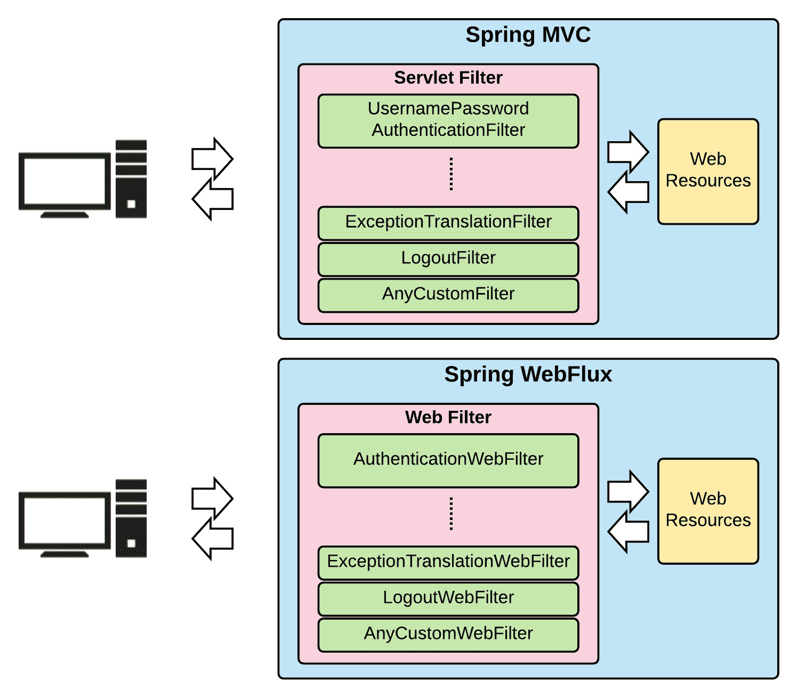

图 6：Spring MVC 和 Spring WebFlux 身份验证方法

我们在之前的章节中详细了解了 Spring MVC web 应用中的 Spring Security。现在我们将看一下基于 Spring WebFlux 的 Web 应用的 Spring Security 认证的内部细节。下图显示了在 WebFlux 应用程序的认证过程中各种类的交互：

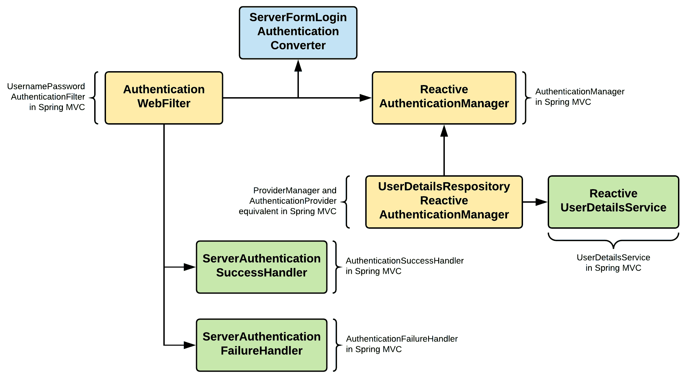

图 7：Spring WebFlux 认证架构

上述图表相当不言自明，并且与您之前在 Spring MVC 中看到的非常相似。核心区别在于`ServletFilter`现在被`WebFilter`取代，并且我们在 Spring MVC 中有基于阻塞类的反应式类。然而，Spring Security 的核心概念仍然保持完整，`WebFilter`处理初始认证过程中的许多方面；核心认证由`ReactiveAuthenticationManager`和相关类处理。

# Spring WebFlux 授权

与认证类似，就授权而言，核心概念与我们之前在 Spring MVC 中看到的相似。但是，执行操作的类已经改变，并且是响应式和非阻塞的。下图显示了 Spring WebFlux 应用程序中与授权相关的主要类及其交互：

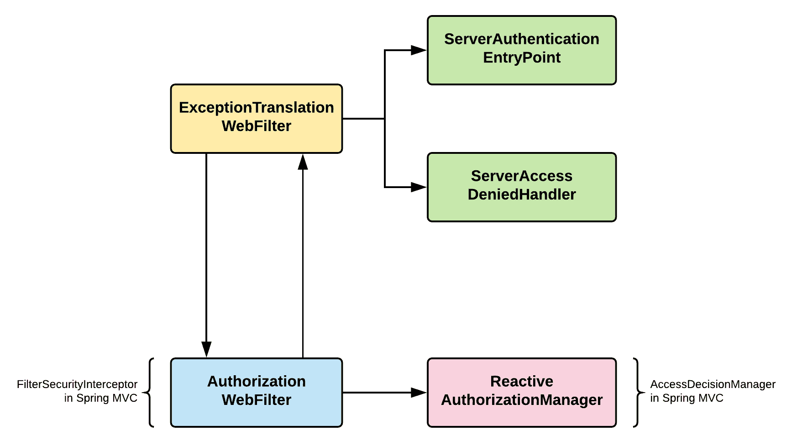

图 8：Spring WebFlux 应用程序中与授权相关的类

正如我们现在都知道的那样，Spring WebFlux 安全性基于`WebFilter`工作，`AuthorizationWebFilter`拦截请求并使用`ReactiveAuthorizationManager`检查`Authentication`对象是否有权访问受保护的资源。`ReactiveAuthorizationManager`有两种方法，即`check`（检查`Authentication`对象是否被授予访问权限）和`verify`（检查`Authentication`对象是否被授予访问权限）。在任何异常情况下，`ExceptionTranslationWebFilter`负责通过遵循适当的路径来处理异常。

# 示例项目

足够的解释；现在是时候动手写实际的代码了。在本节中，我们将创建一个集成了 Spring Security 的电影目录网站。我们将贯穿始终地使用响应式概念，并使用基于表单的登录。我们将从硬编码的用户开始，然后看看如何查看持久用户存储来对用户进行认证。然后我们将更详细地进行测试，最后看看我们可以为 Spring Security 页面带来的一些自定义。最后，我们将涉及授权方面，并关闭示例应用程序。

# WebFlux 项目设置

我们将首先创建一个基本的基于 WebFlux 的 Web 应用程序，然后慢慢添加其他功能，包括安全性。整个代码都可以在我们书的 GitHub 页面上找到，在章节的文件夹下，即`spring-boot-webflux`。

我正在使用 IntelliJ 作为我的 IDE，由于我们使用了*Lombok 库*（注解`preprocessor`），请确保启用 Lombok 插件，以便为您的模型生成适当的样板代码。我们的项目非常简单，只执行电影管理的功能（电影 CRUD 操作）。

# Maven 设置

使用 Spring Initializr 生成 Spring WebFlux 项目非常容易。但是为了让我们掌握 WebFlux 应用程序的各个方面，我们将逐步构建。但是，我们将使用 Spring Boot 来运行我们的应用程序。

我们将创建一个 maven 项目，然后将添加以下主要依赖项（为了使代码更简洁，以下代码只显示了重要的依赖项）到我们的`pom.xml`中：

```java
<!--Spring Framework and Spring Boot-->
<dependency>
  <groupId>org.springframework.boot</groupId>
  <artifactId>spring-boot-starter-webflux</artifactId>
</dependency>
<!--JSON-->
<dependency>
…
</dependency>
<!--Logging-->
<dependency>
…
</dependency>
<!--Testing-->
<dependency>
…
</dependency>
```

我们将为库和插件依赖项包括快照存储库。最后，我们将为我们的 Spring Boot 添加非常重要的 maven 插件，如下所示：

```java
<build>
  <plugins>
      <plugin>
          <groupId>org.springframework.boot</groupId>
          <artifactId>spring-boot-maven-plugin</artifactId>
      </plugin>
  </plugins>
</build>
```

# 配置类

尽管我们将尽可能使用默认配置，但我们仍将为各种组件编写单独的配置类。在我们的项目中，我们正在构建一个基本的 WebFlux 应用程序，因此我们只有一个配置类。

# SpringWebFluxConfig 类

Spring WebFlux Web 应用程序的主要配置类是通过这个类实现的：

```java
@Configuration
@EnableWebFlux
@ComponentScan
public class SpringWebFluxConfig {
  // ...
}
```

我们有一个空的类，只有一些非常重要的注释，如前面的代码所示。`@EnableWebFlux`使应用程序具有反应性，并使其成为 WebFlux。

# 存储库

我们将使用硬编码的电影作为我们的样本数据结构，并以一种反应性的方式编写方法，以公开我们存储库类中的方法。这些方法可以用于操作电影的数据结构。我们的存储库类是一个传统的类，但正确的数据结构，以`Mono`和`Flux`的形式，有助于为应用程序带来反应性的特性：

```java
@Repository
public class MovieRepositoryImpl implements MovieRepository {
    private Map<Long, Movie> movies = new HashMap<Long, Movie>();

    @PostConstruct
    public void initIt() throws Exception {
      movies.put(Long.valueOf(1), new Movie(Long.valueOf(1), "Moonlight",     
        "Drama"));
      movies.put(Long.valueOf(2), new Movie(Long.valueOf(2), "Dunkirk", 
        "Drama/Thriller"));
      movies.put(Long.valueOf(3), new Movie(Long.valueOf(3), "Get Out", 
        "Mystery/Thriller"));
      movies.put(Long.valueOf(4), new Movie(Long.valueOf(4), "The Shape of 
        Water", "Drama/Thriller"));
    }
    @Override
    public Mono<Movie> getMovieById(Long id) {
        return Mono.just(movies.get(id));
    }
    //...Other methods
}
```

该类只是从类中提取的片段，仅显示一个方法（`getMovieById`）。与往常一样，我们的类实现了一个接口（`MovieRepository`），并且这个引用将在应用程序的其他部分中使用（使用 Spring 的依赖注入功能）。

# 处理程序和路由器

如前所述，我们有两种方法，即**基于功能的**和**基于注释的**，用于实现 WebFlux 应用程序。基于注释的方法类似于 Spring MVC，因此我们将在我们的样本应用程序中使用基于功能的方法：

```java
@Component
public class MovieHandler {
    private final MovieRepository movieRepository;

    public MovieHandler(MovieRepository movieRepository) {
        this.movieRepository = movieRepository;
    }
    public Mono<ServerResponse> listMovies(ServerRequest request) {
        // fetch all Movies from repository
        Flux<Movie> movies = movieRepository.listMovies();
        // build response
        return 
            ServerResponse.ok().contentType(MediaType.APPLICATION_JSON)
            .body(movies, Movie.class);
    }
    //...Other methods
}
```

该类非常简单直接，使用存储库类进行数据结构查询和操作。每个方法都完成了功能，并最终返回`Mono<ServerResponse>`。基于功能的编程中 WebFlux 的另一个重要方面是路由配置类，如下所示：

```java
@Configuration
public class RouterConfig {

    @Bean
    public RouterFunction<ServerResponse> routerFunction1(MovieHandler 
        movieHandler) {
      return 
        route(GET("/").and(accept(MediaType.APPLICATION_JSON)), 
            movieHandler::listMovies)
        .andRoute(GET("/api/movie").and(accept(MediaType.APPLICATION_JSON)), 
            movieHandler::listMovies)
        .andRoute(GET("/api/movie/{id}").and(accept(MediaType.APPLICATION_JSON)), 
            movieHandler::getMovieById)
        .andRoute(POST("/api/movie").and(accept(MediaType.APPLICATION_JSON)), 
            movieHandler::saveMovie)
        .andRoute(PUT("/api/movie/{id}").and(accept(MediaType.APPLICATION_JSON)), 
            movieHandler::putMovie)
        .andRoute(DELETE("/api/movie/{id}")
            .and(accept(MediaType.APPLICATION_JSON)), movieHandler::deleteMovie);
    }
}
```

这是一个查看请求并将其路由到适当处理程序方法的类。在您的应用程序中，您可以拥有任意数量的路由器配置文件。

# 引导应用程序

我们的样本应用程序使用 Spring Boot。Spring WebFlux 默认在 Spring Boot 中运行 Reactor Netty 服务器。我们的 Spring Boot 类非常基本，如下所示：

```java
@SpringBootApplication
public class Run {
  public static void main(String[] args) {
      SpringApplication.run(Run.class, args);
  }
}
```

您可以在除 Spring Boot 之外的任何其他服务器上运行应用程序，这是非常容易实现的。我们有一个名为`spring-boot-tomcat-webflux`的单独项目，它在 Spring Boot 上运行，但不是在 Reactor Netty 上运行，而是在 Tomcat 服务器上运行。

除了`pom.xml`之外，代码的任何部分都不需要更改：

```java
<!--Spring Framework and Spring Boot-->
<dependency>
  <groupId>org.springframework.boot</groupId>
  <artifactId>spring-boot-starter-webflux</artifactId>
  <exclusions>
      <exclusion>
          <groupId>org.springframework.boot</groupId>
          <artifactId>spring-boot-starter-reactor-netty</artifactId>
      </exclusion>
  </exclusions>
</dependency>
<!--Explicit Tomcat dependency-->
<dependency>
  <groupId>org.springframework.boot</groupId>
  <artifactId>spring-boot-starter-tomcat</artifactId>
</dependency>
```

从`spring-boot-starter-webflux`工件中排除 Reactor Netty。然后，显式添加 Tomcat 依赖项，`spring-boot-starter-tomcat`。其余的`pom.xml`保持不变。对于其他服务器运行时，如 Undertow、Jetty 等，方法与此处详细介绍的方法类似。

# 运行应用程序

现在，对于我们构建的最重要的部分：运行应用程序。由于它是一个 Spring Boot 应用程序，执行默认命令如下：

```java
mvn spring-boot:run
```

一旦服务器启动（默认为 Rector Netty 或 Tomcat），打开浏览器并导航到`localhost:8080/movies`。我们已经创建了默认路由指向“列出所有电影”终点，如果一切顺利，您应该看到显示我们存储库类中所有硬编码电影的 JSON。

在本节中，我们创建了一个样本 Spring WebFlux 电影应用程序。在下一节中，我们将为这个应用程序添加所有重要的安全性。

# 添加安全性

与我们迄今为止所取得的成就分开，我们将有一个单独的项目，`spring-boot-security-webflux`（与`spring-boot-webflux`相同）。在其中，我们将构建所有安全方面。

# 配置类

我们将为 Spring Security 创建一个新的配置类：`SpringSecurityWebFluxConfig`。首先，我们将使用最重要的注解对类进行注释：`@EnableWebFluxSecurity`。这指示它为 WebFlux Web 应用程序启用 Spring Security。在配置类中，我们将查看两个重要的 bean，如下所示。

# UserDetailsService bean

我们将使用硬编码的用户详细信息进行身份验证。这不是生产就绪应用程序的操作方式，但为了简单起见并解释概念，让我们采取这种捷径：

```java
@Bean
public MapReactiveUserDetailsService userDetailsRepository() {
    UserDetails user = User.withUsername("user")
        .password("{noop}password").roles("USER").build();
    UserDetails admin = User.withUsername("admin")
        .password("{noop}password").roles("USER","ADMIN").build();
    return new MapReactiveUserDetailsService(user, admin);
}
```

该 bean 返回了包含两个用户的硬编码凭据的响应式用户详细信息服务；一个是普通用户，另一个是管理员。

# SpringSecurityFilterChain bean

这是我们实际指定 Spring Security 配置的 bean：

```java
@Bean
SecurityWebFilterChain springWebFilterChain(ServerHttpSecurity http) 
    throws Exception {
    return http
      .authorizeExchange()
      .pathMatchers(HttpMethod.GET, "/api/movie/**").hasRole("USER")
      .pathMatchers(HttpMethod.POST, "/api/movie/**").hasRole("ADMIN")
      .anyExchange().authenticated()
      .and().formLogin()
      .and().build();
}
```

与我们之前在 Spring MVC 应用程序中看到的类似，我们匹配 URL 模式并指定访问所需的角色。我们正在将登录方法配置为一个表单，用户将通过 Spring Security 显示默认登录表单。

# 运行应用程序

执行以下命令：

```java
mvn spring-boot:run
```

服务器启动时，您有两种方式可以测试应用程序，如下所示。

# CURL

打开您喜欢的命令提示符并执行以下命令：

```java
curl http://localhost:8080/ -v
```

您将被重定向到`http://localhost:8080/login`页面。您的整个应用程序都是安全的，如果不登录，您将无法访问任何内容。使用表单登录作为方法，您将无法使用`curl`进行测试。让我们将登录方法从表单（`formLogin`）更改为基本（`httpBasic`）在 Spring Security 配置（`springWebFilterChain` bean）中。现在，执行以下命令：

```java
curl http://localhost:8080/api/movie -v -u admin:password
```

现在，您应该看到显示所有硬编码电影的原始 JSON。使用其他常见的 CURL 命令，如下所示，测试其他端点：

```java
curl http://localhost:8080/api/movie/1 -v -u admin:password
```

# 浏览器

让我们将登录方法改回表单，然后打开浏览器并导航到`http://localhost:8080`。您将被导航到默认的 Spring Security 登录页面。输入用户名为`admin`，密码为`password`，然后单击登录：

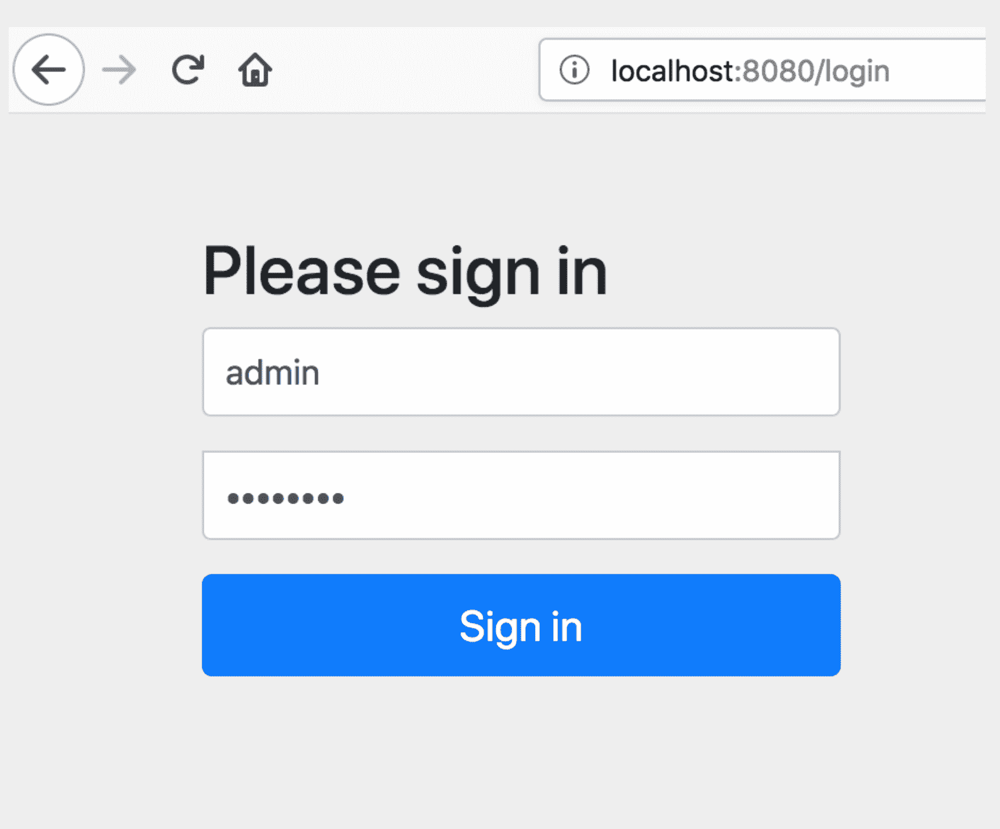

图 9：默认的 Spring Security 登录表单

成功登录后，您将被导航到列出所有电影的端点，如下所示：

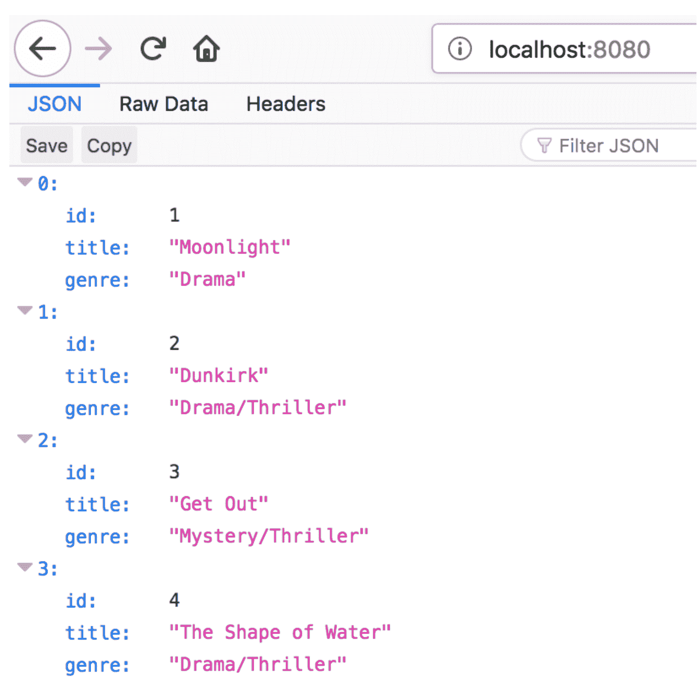

图 10：登录后默认主页上列出所有电影

# WebClient

在该书的 GitHub 页面上，我们有一个单独的项目（`spring-boot-security-webclient-webflux`），您可以在其中看到本节中将详细介绍的整个代码。

# Maven 设置

创建一个基本的 maven 项目，并将以下主要依赖项添加到您的`pom.xml`文件中：

```java
<!--Spring Framework and Spring Boot-->
<dependency>
  <groupId>org.springframework.boot</groupId>
  <artifactId>spring-boot-starter-webflux</artifactId>
</dependency>
```

现在，添加其他依赖项，以及默认的 Spring Boot 构建部分。

# 创建一个 WebClient 实例

`WebClient`实例可以通过使用`create()`方法或使用`builder()`方法来创建。在我们的示例中，我们使用了`builder()`方法，如下所示：

```java
@Service
public class WebClientTestImpl implements WebClientTestInterface {
    private final WebClient webClient;
    public WebClientTestImpl(WebClient.Builder webClientBuilder) {
        this.webClient = webClientBuilder.defaultHeader(HttpHeaders.ACCEPT,     
        MediaType.APPLICATION_JSON_VALUE)
              .baseUrl("http://localhost:8080/api/movie").build();
    }
    //...Other methods
}
```

我们将使用我们在基本 Spring WebFlux 项目中创建的所有端点，并将使用`WebClient`访问它们。

使用`create()`方法创建`WebClient`的实例，如下所示：

```java
WebClient webClient = WebClient.create();
```

如果您有基本 URL，则可以创建`WebClient`如下：

```java
WebClient webClient = WebClient.create("http://localhost:8080/api/movie");
```

`builder()`方法提供了一堆实用方法，如过滤器、设置标头、设置 cookie 等。在我们的示例中，我们设置了一些默认标头，并设置了基本 URL。

# 处理错误

`WebClient`实例允许您处理错误（`WebClientTestImpl`类）在`listMovies()`方法中，如下所示：

```java
@Override
public Flux<Movie> listMovies() {
    return webClient.get().uri("/")
        .retrieve()
        .onStatus(HttpStatus::is4xxClientError, clientResponse ->
            Mono.error(new SampleException())
        )
        .onStatus(HttpStatus::is5xxServerError, clientResponse ->
            Mono.error(new SampleException())
        )
        .bodyToFlux(Movie.class);
}
```

`SampleException`是我们通过扩展`Exception`类创建的自定义异常类。我们正在处理 4xx 和 5xx 错误，并且在遇到时，它会将自定义异常作为响应发送。

# 发送请求和检索响应

`retrieve()`方法是一个简单的方法，可以用来检索响应主体。如果您想对返回的响应有更多控制，可以使用`exchange()`方法来检索响应。我们在示例应用程序中使用了这两种方法；`WebClientTestImpl`类中这两种方法的代码片段如下：

```java
@Override
public Mono<Movie> getMovieById(Long id) 
  return this.webClient.get().uri("/{id}", id)
          .retrieve().bodyToMono(Movie.class);
}
@Override
public Mono<Movie> saveMovie(Movie movie) {
  return webClient.post().uri("/")
          .body(BodyInserters.fromObject(movie))
          .exchange().flatMap( clientResponse ->     
            clientResponse.bodyToMono(Movie.class) );
}
```

在第一种方法中，我们在 URI `http://localhost:8080/api/movie/{id}` 上执行 GET 方法，使用`retrieve()`方法，然后转换为`Mono`。

在第二种方法中，我们在 URL `http://localhost:8080/api/movie` 上执行 POST 方法，使用`exchange()`方法，并使用`flatMap()`方法创建响应。

# 运行和测试应用程序

在这个示例项目中，我们将使用相同的电影模型。由于这是我们从之前的示例应用程序中需要的唯一类，我们将在这里复制该类。在理想情况下，我们将有一个包含所有公共类的 JAR 文件，并且可以将其包含在我们的`pom.xml`文件中。

创建`Run`类（如前所示）并调用`WebClient`方法。其中一个方法的代码片段如下：

```java
@SpringBootApplication
public class Run implements CommandLineRunner {
  @Autowired
  WebClientTestInterface webClient;
  public static void main(String[] args) {
      SpringApplication.run(Run.class, args);
  }
  @Override
  public void run(String... args) throws Exception {
      // get all movies
      System.out.println("Get All Movies");
      webClient.listMovies().subscribe(System.out::println);
      Thread.sleep(3000);
      … Other methods
  }
  //… Other WebClient methods getting called
}
```

在执行每个`WebClient`调用后，我们将休眠三秒。由于`WebClient`方法发出反应类型（`Mono`或`Flux`），您必须订阅，如前面的代码所示。

启动`spring-boot-webflux`项目，暴露端点，我们将使用此项目中的`WebClient`进行测试。

确保在您的`application.properties`文件中更改应用程序的默认端口，包括以下条目：

```java
server.port=8081
```

通过执行 Spring Boot 命令启动应用程序，如下所示：

```java
mvn spring-boot:run
```

如果一切顺利，您应该在服务器控制台中看到输出，如下所示：

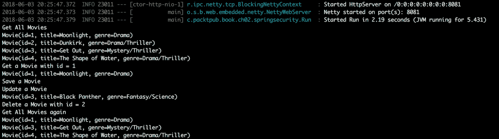

图 11：WebClient 测试执行

# 单元测试（WebTestClient）

在我们的基本`spring-boot-webflux`项目中，我们使用`WebTestClient`编写了测试用例。我们有两个测试用例：一个是获取所有电影，另一个是保存电影。

# Maven 依赖

确保在您的`pom.xml`文件中有以下依赖项：

```java
<!--Testing-->
<dependency>
  <groupId>junit</groupId>
  <artifactId>junit</artifactId>
  <scope>test</scope>
</dependency>
<dependency>
  <groupId>org.springframework</groupId>
  <artifactId>spring-test</artifactId>
  <scope>test</scope>
</dependency>
<dependency>
  <groupId>org.skyscreamer</groupId>
  <artifactId>jsonassert</artifactId>
  <scope>test</scope>
</dependency>
<dependency>
  <groupId>io.projectreactor</groupId>
  <artifactId>reactor-test</artifactId>
  <scope>test</scope>
</dependency>
<dependency>
  <groupId>org.springframework.boot</groupId>
  <artifactId>spring-boot-starter-test</artifactId>
  <scope>test</scope>
</dependency>
```

如您所见，在前面的代码中，所有依赖项都可以用于测试目的。

# 测试类

创建一个普通的测试类，如下所示。在测试类中使用`@Autowired`注解来注入`WebTestClient`实例：

```java
@RunWith(SpringRunner.class)
@SpringBootTest(webEnvironment = SpringBootTest.WebEnvironment.RANDOM_PORT)
@FixMethodOrder(MethodSorters.NAME_ASCENDING)
public class WebclientDemoApplicationTests {
  @Autowired
  private WebTestClient webTestClient;
  @Test
  public void getAllMovies() {
      System.out.println("Test 1 executing getAllMovies");
      webTestClient.get().uri("/api/movie")
              .accept(MediaType.APPLICATION_JSON)
              .exchange()
              .expectStatus().isOk()
              .expectHeader().contentType(MediaType.APPLICATION_JSON)
              .expectBodyList(Movie.class);
  }
  @Test
  public void saveMovie() {
      System.out.println("Test 2 executing saveMovie");
      Movie movie = new Movie(Long.valueOf(10), "Test Title", "Test Genre");
      webTestClient.post().uri("/api/movie")
              .body(Mono.just(movie), Movie.class)
              .exchange()
              .expectStatus().isOk()
              .expectBody();
  }
}
```

`WebTestClient`对象的功能与之前看到的`WebClient`类似。我们可以检查响应中的各种属性，以确定我们要测试的内容。在前面的示例中，对于第一个测试，我们正在发送 GET 请求并检查 OK 状态，应用程序/JSON 内容类型标头，最后，一个包含`Movie`对象列表的主体。在第二个测试中，我们正在发送一个带有`Movie`对象的 POST 请求作为主体，并期望一个 OK 状态和一个空主体。

# Spring Data

尽管本书侧重于响应式概念上的 Spring Security，但我真的希望您也对其他领域的响应式概念有一些了解。因此，有一个单独的项目`spring-boot-security-mongo-webflux`，它通过将之前的项目与响应式 MongoDB 集成，使用 Spring Data 来实现响应式概念。我们不会涵盖与此相关的每个方面。但是，基于之前的项目，我们将在本节中涵盖一些重要方面。

# Maven 依赖

在您的应用程序`pom.xml`中，添加以下依赖项，都涉及将 MongoDB 包含到项目中：

```java
<!--Mongo-->
<dependency>
  <groupId>org.springframework.boot</groupId>
  <artifactId>spring-boot-starter-data-mongodb-reactive</artifactId>
</dependency>
<dependency>
  <groupId>de.flapdoodle.embed</groupId>
  <artifactId>de.flapdoodle.embed.mongo</artifactId>
  <scope>test</scope>
</dependency>
```

我已在我的机器上安装了 MongoDB。我已在默认端口（`27017`）上本地启动数据库。

# MongoDB 配置

将以下内容添加到您的 application.properties 文件中：

```java
spring.data.mongodb.uri=mongodb://localhost:27017/movie
```

我们将把我们的数据库指向本地运行的默认端口上的数据库，利用电影数据库。

# 设置模型

在我们已经存在的`Movie`模型中，我们只添加了一个注解：`@Document(collection = "movies")`。此注解将告知 MongoDB 该模型将存储在 DB 中的集合的名称。

# 实现存储库

我们将创建一个新的存储库`ReactiveMovieRepository`，其中包含我们的两个精心策划的方法和我们扩展类提供的所有默认方法：

```java
@Repository
public interface ReactiveMovieRepository extends 
    ReactiveMongoRepository<Movie, Long> {
      @Query("{ 'title': ?0, 'genre': ?1}")
      Flux<Movie> findByTitleAndGenre(String title, String genre);
      @Query("{ 'genre': ?0}")
      Flux<Movie> findByGenre(String genre);
}
```

我们将从`ReactiveMongoRepository`扩展我们的存储库。`ReactiveMongoRepository`有很多通用方法，可以立即使用，毫不费力。我们实现的方法使用普通查询来对 MongoDB 进行操作并返回列表。

# 实现控制器

为了使其与我们现有的基于功能的编程分离，我们创建了一个新的控制器，它将以 RESTful 方式暴露一些方法，使用新创建的`ReactiveMovieRepository`：

```java
@RestController
public class MovieController {
  @Autowired
  private ReactiveMovieRepository reactiveMovieRepository;
  @GetMapping("/movies")
  public Flux<Movie> getAllMovies() {
      return reactiveMovieRepository.findAll();
  }
  @GetMapping("/movies/{genre}")
  public Flux<Movie> getAllMoviesByGenre(@PathVariable String genre) {
      return reactiveMovieRepository.findByGenre(genre);
  }
  @GetMapping("/movies/{title}/{genre}")
  public Flux<Movie> getAllMoviesByTitleAndGenre
    (@PathVariable String title, @PathVariable String genre) {
      return reactiveMovieRepository.findByTitleAndGenre(title, genre);
  }
  @PostMapping("/movies")
  public Mono<Movie> createMovies(@Valid @RequestBody Movie movie) {
      return reactiveMovieRepository.save(movie);
  }
}
```

这个类非常简单；每个方法都有适当的映射，并使用相应的存储库类来实际完成工作。

# 运行应用程序

使用`mongod`命令，我们将启动本地安装的 MongoDB，然后使用以下命令，我们将启动刚刚创建的项目：

```java
mvn spring-boot:run
```

转到 postman 并调用 URL `http://localhost:8080/movies`（GET）。您将看到其中有零个元素的数组。现在，调用 URL `http://localhost:8080/movies`（POST），在请求体中使用以下 JSON：

```java
{
   "id": 1,
   "title": "testtitle",
   "genre": "thriller"
}
```

您将获得一个 200 OK 状态，并应该看到新创建的 JSON 作为响应。现在，如果您在电影端点上运行 GET 请求，您应该会看到新创建的`Movie`作为响应。

在这里，我们通过使用 MongoDB 作为响应式编程范式中的持久存储库，实现了对我们的`Movie`模型的 CRUD。

# 授权

过去，我们已经看到使用`@EnableWebFluxSecurity`注解，我们可以获得 URL 安全性。Spring Security 还允许您以一种响应式的方式保护方法执行，通过使用另一个注解`@EnableReactiveMethodSecurity`。这个概念与我们之前基于 Spring MVC 的示例中看到的是相同的。我们将在本节中只涵盖方法安全性；其他方面完全相同，我们将避免在此重复。

# 方法安全性

要启用方法安全性，首先要用`@EnableReactiveMethodSecurity`注解 Spring Security 配置类：

```java
@EnableReactiveMethodSecurity
public class SpringSecurityWebFluxConfig {
    …
}
```

之后，对于任何您希望具有一些安全功能的方法，使用前几章讨论的各种安全相关注解：

```java
@GetMapping("/movies")
@PreAuthorize("hasRole('ADMIN')")
public Flux<Movie> getAllMovies() {
  return reactiveMovieRepository.findAll();
}
```

在上述方法中，我们指示 Spring Security，如果用户经过身份验证并被授予`ADMIN`角色，则应允许`getAllMovies()`的方法执行。

# 定制

Spring Security 允许进行许多定制。Spring Security 生成的默认页面，如登录表单、注销表单等，可以在所有方面完全定制，以适应您应用程序的品牌。如果您想要调整 Spring Security 的默认执行，实现自己的过滤器是合适的。由于 Spring Security 在很大程度上依赖过滤器来实现其功能，让我们看看在这方面的定制机会。

此外，几乎可以通过使用自己的类来定制 Spring Security 的几乎所有部分，并将其插入 Spring Security 默认流程中以管理自己的定制。

# 编写自定义过滤器

正如我们之前看到的，在 WebFlux Web 应用程序中，Spring Security 基于`WebFilter`（类似于 Spring MVC 中的 Servlet Filter）工作。如果您想要定制 Spring Security 中的某些方面，特别是在请求和响应操作中，实现自定义`WebFilter`是可以考虑的方法之一。

Spring WebFlux 提供了两种实现过滤器的方法：

+   **使用** `WebFilter`：适用于基于注解和基于功能的（`routerhandler`）

+   **使用** `HandlerFilterFunction`：仅适用于基于功能的

# 使用 WebFilter

我们将在我们的项目`spring-boot-webflux`的基础上进行构建。为了使其与其他项目隔离，我们将创建一个新项目`spring-boot-webflux-custom`。如前所述，使用`WebFilter`适用于基于注解和基于功能的 WebFlux 方法。在我们的示例中，我们将有两个路径：`filtertest1`和`filtertest2`。我们将使用`WebFluxTestClient`编写测试用例，并断言某些条件。作为与其他部分分离，我们将创建一个新的路由配置、一个处理程序和一个全新的 REST 控制器。我们不会详细介绍一些已经涵盖的方面。在本节中，我们只会介绍`WebFilter`代码，以及测试用例的一些重要方面：

```java
@Component
public class SampleWebFilter implements WebFilter {
    @Override
    public Mono<Void> filter(ServerWebExchange serverWebExchange, 
            WebFilterChain webFilterChain) {
        serverWebExchange.getResponse().getHeaders().add("filter-added-header", 
            "filter-added-header-value");
        return webFilterChain.filter(serverWebExchange);
    }
}
```

`SampleWebFilter`类实现了`WebFilter`，并实现了`filter`方法。在这个类中，我们将添加一个新的响应头，`filter-added-header`：

```java
@Test
public void filtertest1_with_pathVariable_equalTo_value1_apply_WebFilter() {
    EntityExchangeResult<String> result = 
        webTestClient.get().uri("/filtertest1/value1")
        .exchange()
        .expectStatus().isOk()
        .expectBody(String.class)
        .returnResult();
    Assert.assertEquals(result.getResponseBody(), "value1");
    Assert.assertEquals(result.getResponseHeaders()
        .getFirst("filter-added-header"), "filter-added-header-value");
}
@Test
public void filtertest2_with_pathVariable_equalTo_value1_apply_WebFilter() {
    EntityExchangeResult<String> result = 
        webTestClient.get().uri("/filtertest2/value1")
        .exchange()
        .expectStatus().isOk()
        .expectBody(String.class)
        .returnResult();
    Assert.assertEquals(result.getResponseBody(), "value1");
    Assert.assertEquals(result.getResponseHeaders()
        .getFirst("filter-added-header"), "filter-added-header-value");
}
```

在两个测试用例中，我们将检查新添加的头。当您运行测试用例（使用`mvn test`）时，它将确认这一发现。

# 使用 HandlerFilterFunction

我们将实现一个新的`HandlerFilterFunction`，`SampleHandlerFilterFunction`，在其中我们将查看一个路径变量（`pathVariable`）并检查其值。如果该值等于`value2`，我们将标记状态为`BAD_REQUEST`。需要注意的是，由于`HandlerFilterFunction`仅适用于基于功能的，即使路径变量值等于`value2`，状态也不会被标记为`BAD_REQUEST`，而接收到的响应是 OK：

```java
public class SampleHandlerFilterFunction implements 
        HandlerFilterFunction<ServerResponse, ServerResponse> {
    @Override
    public Mono<ServerResponse> filter(ServerRequest serverRequest, 
        HandlerFunction<ServerResponse> handlerFunction) {
        if (serverRequest.pathVariable("pathVariable")
                .equalsIgnoreCase("value2")) {
            return ServerResponse.status(BAD_REQUEST).build();
        }
        return handlerFunction.handle(serverRequest);
    }
}
```

`SampleHandlerFilterFunction`实现了`HandlerFilterFunction`类，并实现了`filter`方法。在这个类中，如果满足条件，我们将明确将响应状态设置为`bad request`：

```java
@Test
public void filtertest1_with_pathVariable_equalTo_value2_apply_HandlerFilterFunction() {
    webTestClient.get().uri("/filtertest1/value2")
        .exchange()
        .expectStatus().isOk();
}
@Test
public void filtertest2_with_pathVariable_equalTo_value2_apply_HandlerFilterFunction() {
    webTestClient.get().uri("/filtertest2/value2")
        .exchange()
        .expectStatus().isBadRequest();
}
```

在前面的测试用例中，测试的路径是不同的，由于`HandlerFilterFunction`仅适用于基于功能的，因此当路径为`filtertest1`时，响应为 OK，当路径为`filtertest2`时，响应为`BAD_REQUEST`。

# 总结

在本章中，我们首次详细介绍了响应式编程，使用了 Spring WebFlux 框架。我们首先从高层次上对框架本身进行了充分的介绍。我们介绍了一个非常基本的例子，然后介绍了 Spring Security 及其在 Spring WebFlux 中的功能。

最后，我们进行了一个实际的编码会话，使用了一个示例应用程序。在这个例子中，我们涵盖了其他响应式方面，比如 Spring Data Mongo，以便让您更深入地了解响应式世界。

我们以 Spring WebFlux 与 Spring Security 中可能的一些自定义结束了本章。

阅读完本章后，您应该清楚了解了 Spring MVC 和 Spring WebFlux 框架之间的区别。您还应该对使用 Spring Security 模块的 Spring WebFlux 安全性有很好的理解。这些示例旨在简单易懂，因为在本书中我们正在介绍 Spring Security，所以在解释中给予了更多的价值。
