# 第七章：Spring 安全附加组件

在之前的章节中，我们介绍了核心安全方面（如身份验证和授权）使用 Spring 安全的多种方式的实现细节。在这样做时，我们只是浅尝辄止了 Spring 安全可以实现的能力的一层薄薄的表面。在本章中，我们将简要介绍 Spring 安全提供的一些其他能力。

此外，本章介绍了许多产品（开源和付费版本），可以考虑与 Spring 安全一起使用。我不支持这些产品中的任何一个，但我确实认为它们是实现您所寻找的技术能力的强有力竞争者。我们将通过简要介绍产品的技术能力的要点来介绍一个产品，然后简要介绍给您。

在本章中，我们将涵盖以下主题：

+   记住我认证

+   会话管理

+   CSRF

+   CSP

+   通道安全

+   CORS 支持

+   加密模块

+   秘密管理

+   HTTP 数据完整性验证器

+   自定义 DSL

# 记住我认证

我们将重用并增强我们在第二章中构建的示例，*深入 Spring 安全*（`jetty-db-basic-authentication`），以解释 Spring 安全如何用于实现记住我或持久登录功能。在我们要重用的示例中，我们使用了基本身份验证，其中用户凭据存储在 MySQL 数据库中。

在 Spring 安全中，通过在用户选择在客户端记住他/她的凭据时向浏览器发送 cookie 来实现记住我功能。可以配置 cookie 在浏览器中存储一段时间。如果 cookie 存在且有效，用户下次访问应用程序时，将直接进入用户的主页，避免使用用户名/密码组合进行显式认证。

可以使用两种方法实现记住我功能：

+   **基于哈希的令牌**：用户名、过期时间、密码和私钥被哈希并作为令牌发送到客户端

+   **持久令牌**：使用持久存储机制在服务器上存储令牌

现在，我们将通过一个简单的持久令牌方法来详细解释这个概念。

# 在 MySQL 数据库中创建一个新表

我们将使用与我们在第二章中使用的 MySQL 数据库相同的模式。保持一切不变，然后在 MySQL 工作台中执行以下 DDL 语句来创建一个新表，用于存储持久令牌：

```java
create table persistent_logins(
     series varchar(64) not null primary key,   
     username varchar(75) not null,
     token varchar(100) not null,
     last_used timestamp not null
);
```

# Spring 安全配置

在第二章中，*深入 Spring 安全*（在`Sample`应用程序部分的 Spring 安全设置子部分），我们看到了基本身份验证，我们在 Spring 安全配置类的 configure 方法中进行了配置。在这个例子中，我们将创建一个自定义登录页面，并将登录机制更改为基于表单的。打开`SpringSecurityConfig`类，并按照下面的代码片段更改 configure 方法。然后，添加我们将使用的`tokenRepository` bean 来实现记住我功能：

```java
@Override
protected void configure(HttpSecurity http) throws Exception {
  http.csrf().disable();
  http.authorizeRequests().anyRequest().hasAnyRole("ADMIN", "USER")
      .and()
      .authorizeRequests().antMatchers("/login**").permitAll()
      .and()
      .formLogin()
      .loginPage("/login").loginProcessingUrl("/loginProc").permitAll()
      .and()
      .logout().logoutSuccessUrl("/login").permitAll()
      .and()
      .rememberMe()
      .rememberMeParameter("rememberme").tokenRepository(tokenRepository());
}
@Bean
public PersistentTokenRepository tokenRepository() {
  JdbcTokenRepositoryImpl jdbcTokenRepositoryImpl=new JdbcTokenRepositoryImpl();
  jdbcTokenRepositoryImpl.setDataSource(dataSource);
  return jdbcTokenRepositoryImpl;
}
```

# 自定义登录页面

在`src/main/webapp/WEB-INF/view`文件夹中创建一个新页面，名为`login.jsp`。页面的主要部分包含`username`、`password`和`rememberme`字段，如下面的代码片段所示：

```java
<form action='<spring:url value="/loginProc"/>' method="post">
  <table>
      <tr>
          <td>Username</td>
          <td><input type="text" name="username"></td>
      </tr>
      <tr>
          <td>Password</td>
          <td><input type="password" name="password"></td>
      </tr>
      <tr>
          <td><input type="checkbox" name="rememberme"></td>
          <td>Remember me</td>
      </tr>
      <tr>
          <td><button type="submit">Login</button></td>
      </tr>
  </table>
</form>
```

确保您将记住我复选框的名称与您在 Spring 安全配置中指定的名称相同。

# 运行应用程序并进行测试

通过执行以下命令来运行项目：

```java
mvn jetty:run
```

等待控制台打印[INFO] Started Jetty Server。

打开浏览器（我在测试时使用 Firefox 的隐私模式）并导航到`http://localhost:8080`，你将看到你创建的自定义登录页面，如下截图所示：

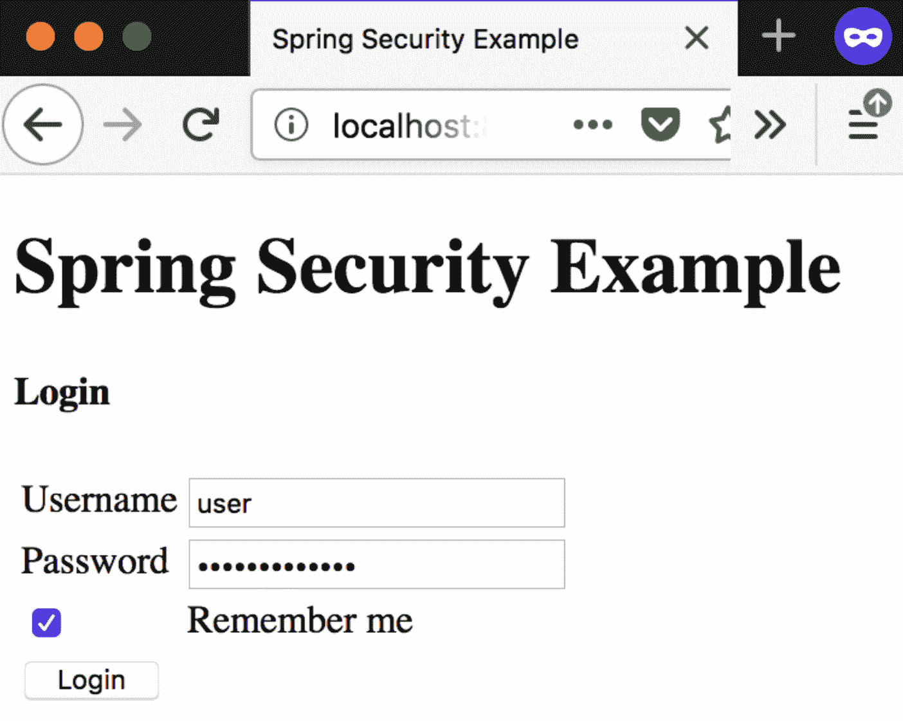

图 1: 自定义登录页面

输入`user`/`user@password`作为用户名和密码。点击`Remember me`并点击`Login`按钮，你将被导航到用户主页，如下所示：

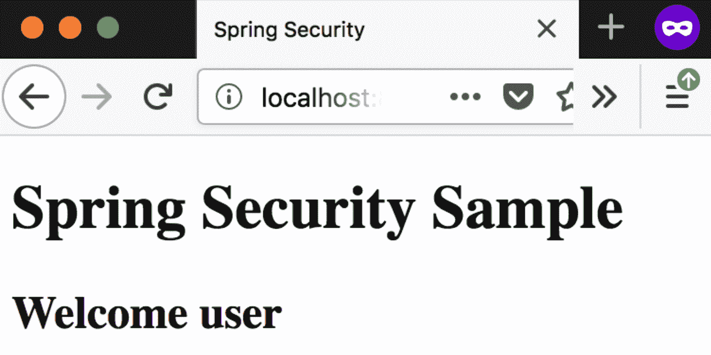

图 2: 用户主页

查询你的 MySQL 数据库的`persistent_logins`表，你将看到一个新记录，如下截图所示：

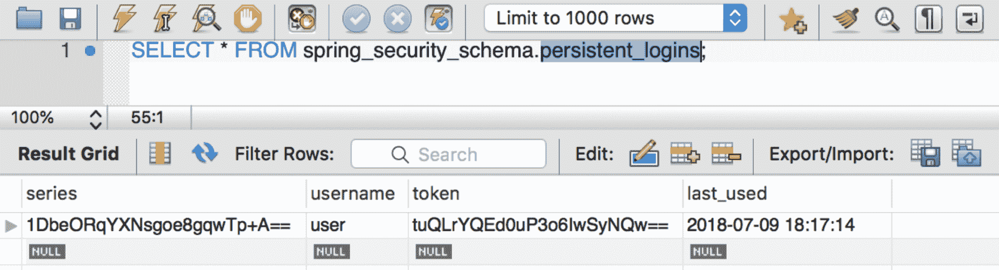

图 3: MySQLWorkbench 查询新的 persistent_logins 表

现在，打开浏览器中的开发者工具并检查 cookies。根据你使用的浏览器，你应该看到类似于这样的东西：

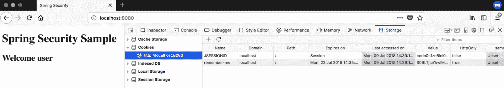

图 4: 浏览器 cookie 设置以实现记住我功能

这个示例的整个项目可以在书的 GitHub 页面的`jetty-db-basic-authentication-remember-me`项目中找到。

# 会话管理

Spring Security 允许你只需一些配置就可以管理服务器上的会话。以下是一些最重要的会话管理活动：

+   **会话创建**: 这决定了何时需要创建会话以及您可以与之交互的方式。在 Spring Security 配置中，输入以下代码：

```java
http.sessionManagement().sessionCreationPolicy(SessionCreationPolicy.ALWAYS);
```

有四种会话创建策略可供选择。它们如下：

+   +   `ALWAYS`: 如果不存在会话，总是创建一个会话。

+   `IF_REQUIRED`: 如果需要，会创建一个会话。

+   `NEVER`: 永远不会创建会话；相反，它将使用已存在的会话。

+   `无状态`: 不会创建或使用会话。

+   `invalidSession`: 这控制着服务器检测到无效会话时如何通知用户：

```java
http.sessionManagement().invalidSessionUrl("/invalidSession");
```

+   **会话超时**: 这控制着用户在会话过期时如何被通知。

+   **并发会话**: 这允许控制用户在应用程序中可以启动多少个会话。如果最大会话数设置为`1`，当用户第二次登录时，先前的会话将被失效，用户将被注销。如果指定的值大于`1`，则允许用户同时拥有这么多会话：

```java
http.sessionManagement().maximumSessions(1);
```

下面的截图显示了默认的错误屏幕，当同一用户创建了超过所配置的期望数量的会话时弹出：

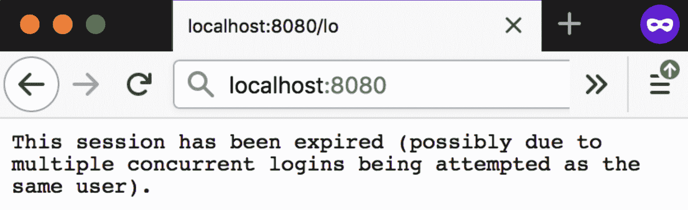

图 5: 用户访问多个会话时抛出的错误

+   **会话固定**: 这与并发会话控制非常相似。此设置允许我们控制用户启动新会话时会发生什么。我们可以指定以下三个值：

+   `migrateSession`: 在成功认证后创建新会话时，旧会话将被失效，并且所有属性将被复制到新会话：

```java
http.sessionManagement().sessionFixation().migrateSession();
```

+   `newSession`: 创建一个新会话，而不复制先前有效会话的任何属性：

```java
http.sessionManagement().sessionFixation().newSession();
```

+   `无`: 旧会话被重用并且不会失效：

```java
http.sessionManagement().sessionFixation().none();
```

# CSRF

**跨站请求伪造**（**CSRF**）([`www.owasp.org/index.php/Cross-Site_Request_Forgery_(CSRF)`](https://www.owasp.org/index.php/Cross-Site_Request_Forgery_(CSRF)))是一种攻击，它迫使最终用户在当前已认证的 Web 应用程序上执行不需要的操作。CSRF 攻击专门针对改变状态的请求，而不是数据的窃取，因为攻击者无法看到伪造请求的响应。

**开放 Web 应用安全项目**（**OWASP**）认为 CSRF 是 Web 应用程序中最常见的安全风险之一。OWASP 每年发布一个名为 OWASP 十大的列表，突出显示困扰 Web 应用程序的前 10 个安全风险，它认为 CSRF 位列第五位。

在 Spring Security 中，默认情况下启用 CSRF。如果需要（我们已在许多示例中禁用了这一点，以便能够集中精力关注示例应传达的主要概念），我们可以通过在 Spring Security 配置中添加以下代码片段来显式禁用它：

```java
http
  .csrf().disable();
```

即使 CSRF 默认启用，但为了使其正常工作，每个请求都需要提供 CSRF 令牌。如果未将 CSRF 令牌发送到服务器，服务器将拒绝请求并抛出错误。如果您将**Java 服务器页面**（**JSP**）作为视图，只需包含隐藏输入，如下面的代码片段所示，许多事情都会自动发生：

```java
<input type="hidden" name="${_csrf.parameterName}" value="${_csrf.token}" />
```

如果您使用 AJAX 请求调用服务器，可以以 HTTP 标头的形式提供 CSRF 令牌，而不是隐藏输入。您可以将与 CSRF 相关的标头声明为元标记，如下面的代码片段所示：

```java
<head>
     <meta name="_csrf" content="${_csrf.token}"/>
     <meta name="_csrf_header" content="${_csrf.headerName}"/>
     <!-- ... -->
 </head>
```

之后，在调用服务器时，将这些（`_csrf`和`_csrf_header`）作为标头包含进去，您将被允许调用所需的端点。

如果您想要持久保存 CSRF 令牌，Spring Security 允许您通过调整配置来实现，如下面的代码片段所示：

```java
http
  .csrf()
  .csrfTokenRepository(new CookieCsrfTokenRepository());
```

在执行此操作时，CSRF 令牌将作为 cookie 持久保存，服务器可以读取并验证（所有这些都是自动完成的）。

# CSP

**内容安全策略**（**CSP**）（[`developer.mozilla.org/en-US/docs/Web/HTTP/CSP`](https://developer.mozilla.org/en-US/docs/Web/HTTP/CSP)）是一种增加的安全层，有助于检测和缓解某些类型的攻击，包括**跨站脚本**（**XSS**）和数据注入攻击。这些攻击用于从数据窃取到网站损坏或恶意软件分发等各种用途。

在应用程序中进行适当的 CSP 设置可以处理内容注入漏洞，并是减少 XSS 的好方法。XSS 在 OWASP 十大中排名第二。

CSP 并非处理所有注入漏洞的解决方案，但可以用作减少注入攻击的工具之一。

CSP 是一种声明性策略，使用 HTTP 标头实现。它可以在应用程序中以两种模式运行：

+   生产模式（声明为 CSP）

+   仅报告模式（用于测试并声明为*Content-Security-Policy-Report-Only*）

CSP 包含一组安全策略指令，负责对 Web 资源施加适当的限制，然后在违规时相应地通知客户端（用户代理）。例如，以下安全策略片段从定义的受信任域加载脚本：

```java
Content-Security-Policy: script-src https://trusted-domain.com
```

如果发生违规行为，用户代理将阻止它，如果策略指定了`report-uri`参数，如下例所示，它将以 JSON 的形式向该 URI 报告违规行为：

```java
Content-Security-Policy: script-src https://trusted-domain.com; report-uri /csp-report-api/
```

前面的示例展示了 CSP 在生产模式下的工作。如果您想首先测试安全策略，然后在一段时间后将这些策略转为生产模式，CSP 提供了一种机制，如下面的代码片段所示：

```java
Content-Security-Policy-Report-Only: script-src https://trusted-domain.com; report-uri /csp-report-api/
```

在仅报告模式下，当检测到违规行为时，报告将以 JSON 格式发布到`report-uri`，如下例所示：

```java
{"csp-report":
    {"document-uri":"...",
    "violated-directive":"script-src https://trusted-domain.com",
    "original-policy":"...",
    "blocked-uri":"https://untrusted-domain.com"}
}
```

除了前面示例中详细介绍的安全指令之外，还有一些安全指令可在设置 CSP 时使用。有关完整的指令列表，请参阅[`content-security-policy.com/`](https://content-security-policy.com/)。

与 CSRF 令牌类似，CSP 也可以用于确保在访问服务器时特定资源包含一个令牌。以下示例显示了使用这种 nonce 方法：

```java
Content-Security-Policy: script-src 'self' 'nonce-<cryptographically generated random string>'
```

与 CSRF 令牌类似，这个 nonce 必须在服务器中的任何资源访问中包含，并且在加载页面时必须新生成。

CSP 还允许您仅在资源与服务器期望的哈希匹配时加载资源。以下策略用于实现这一点：

```java
Content-Security-Policy: script-src 'self' 'sha256-<base64 encoded hash>'
```

CSP 受到几乎所有现代浏览器的支持。即使某些浏览器不支持某些安全指令，其他支持的指令也可以正常工作。处理这个问题的最佳方式是通过解密用户代理，只发送浏览器肯定支持的安全指令，而不是在客户端上抛出错误。

# 使用 Spring Security 的 CSP

使用 Spring Security 配置 CSP 非常简单。默认情况下，CSP 是未启用的。您可以在 Spring Security 配置中启用它，如下所示：

```java
http
     .headers()
         .contentSecurityPolicy("script-src 'self' https://trusted-domain.com; report-uri /csp-report-api/");
```

Spring Security 配置中的报告仅 CSP 如下：

```java
http
     .headers()
         .contentSecurityPolicy("script-src 'self' https://trusted-domain.com; report-uri /csp-report-api/")
        .reportOnly();
```

# 通道安全

除了身份验证和授权之外，Spring Security 还可以用于检查每个到达服务器的请求是否具有任何额外的属性。它可以检查协议（传输类型、HTTP 或 HTTPS）、某些 HTTP 头的存在等。SSL 现在是任何 Web 应用程序（或网站）遵守的事实标准，并且许多搜索引擎（例如 Google）甚至会对您的网站不使用 HTTPS 进行惩罚。SSL 用于保护从客户端到服务器以及反之的数据流通道。

Spring Security 可以配置为显式检查 URL 模式，并在使用 HTTP 协议访问时显式将用户重定向到 HTTPS。

这可以通过在 Spring Security 配置中配置适当的 URL 模式来轻松实现，如下所示：

```java
http.authorizeRequests()
      .requiresChannel().antMatchers("/httpsRequired/**").requiresSecure();
```

当用户访问`/httpsRequired/**`URL 模式并且协议是 HTTP 时，Spring Security 将用户重定向到相同的 URL，使用 HTTPS 协议。以下配置用于保护所有请求：

```java
http.authorizeRequests()
      .requiresChannel().anyRequest().requiresSecure();
```

要明确指定某些 URL 为不安全的，请使用以下代码：

```java
.requiresChannel().antMatchers("/httpRequired/**").requiresInsecure();
```

以下代码片段显示了如何指定任何请求为 HTTP（不安全）：

```java
.requiresChannel().anyRequest().requiresInsecure();
```

# CORS 支持

跨域资源共享（CORS）（[`developer.mozilla.org/en-US/docs/Web/HTTP/CORS`](https://developer.mozilla.org/en-US/docs/Web/HTTP/CORS)）是一种机制，它使用额外的 HTTP 头来告诉浏览器，让一个在一个源（域）上运行的 Web 应用程序有权限访问来自不同源服务器的选定资源。当 Web 应用程序请求具有不同源（域、协议和端口）的资源时，它会发出跨源 HTTP 请求。

在本节中，我们不会创建完整的项目来解释 CORS 的工作原理。我们将使用代码片段，并解释每一部分代码，以便本节简洁明了。

根据以下代码片段更改 Spring Security 配置：

```java
@EnableWebSecurity
@Configuration
public class SpringSecurityConfig extends WebSecurityConfigurerAdapter {

 @Override
 protected void configure(HttpSecurity http) throws Exception {
    http.cors();
 }
 @Bean
 CorsConfigurationSource corsConfigurationSource() {
    UrlBasedCorsConfigurationSource urlCorsConfigSrc = new
          UrlBasedCorsConfigurationSource();
    urlCorsConfigSrc.registerCorsConfiguration("/**", 
        new CorsConfiguration().applyPermitDefaultValues());
    return urlCorsConfigSrc;
 }
}
```

在上述代码中，我们在 Spring Security 的`configure`方法中配置了 CORS。然后我们创建了一个新的 bean，`corsConfigurationSource`，在其中启用了`*/***`路径以供其他域访问。在许多情况下，这并不是真正理想的，下面的代码片段显示了更加强化的`CorsConfiguration`类：

```java
CorsConfiguration configuration = new CorsConfiguration();
configuration.setAllowedOrigins(new ArrayList<String>(Arrays.asList("*")));
configuration.setAllowedHeaders(new ArrayList<String>        
    (Arrays.asList("Authorization", "Cache-Control", "Content-Type")));
configuration.setAllowedMethods(new ArrayList<String>(Arrays.asList("HEAD", 
    "GET", "POST", "PUT", "DELETE", "PATCH")));
configuration.setAllowCredentials(true);
```

如果是 Spring MVC 应用程序，可以通过创建一个 bean 来指定 CORS 映射，如下所示：

```java
@Configuration
public class SpringMVCConfig {
  @Bean
  public WebMvcConfigurer corsConfigurer() {
    return new WebMvcConfigurer() {
      @Override
      public void addCorsMappings(CorsRegistry registry) {
        registry.addMapping("/**")
          .allowedMethods("HEAD", "GET", "PUT", "POST", "DELETE",
            "PATCH","OPTIONS");
      }
    };
  }
}
```

我从第二章中复制了一个先前的示例，*深入 Spring 安全*，并在本章中创建了一个新项目，其中包含`spring-boot-in-memory-basic-authentication-with-cors`的完整源代码。我们在这里所做的是通过声明`CorsConfigurationSource` bean 来设置 CORS 全局配置。

# 加密模块

Spring Security Crypto 模块允许您进行密码编码、对称加密和密钥生成。该模块作为核心 Spring Security 提供的一部分捆绑在一起，不依赖于其他 Spring Security 代码。

# 密码编码

现代化的密码编码是 Spring Security 5 的新功能之一。Spring Security 的`PasswordEncoder`接口是其核心，它使用各种算法对密码进行单向哈希处理，然后可以安全地存储。Spring Security 支持多种密码编码算法：

+   `BcryptPasswordEncoder`：这使用 Bcrypt 强哈希函数。您可以选择性地提供强度参数（默认值为 10）；值越高，哈希密码所需的工作量就越大。

+   `Pbkdf2PasswordEncoder`：这使用**基于密码的密钥派生函数 2**（**PKDF2**），具有可配置的迭代次数和 8 字节的随机盐值。

+   `ScryptPasswordEncoder`：这使用 Scrypt 哈希函数。在哈希过程中，客户端可以提供 CPU 成本参数、内存成本参数和并行化参数。当前实现使用 Bouncy Castle 库。

# 加密

Spring Security 的`org.springframework.security.crypto.encrypt.Encryptors`类有工厂方法，可以用来创建对称加密器。该类支持两种加密器：

+   `BytesEncryptor`：用于对原始字节数组形式的数据进行对称数据加密的服务接口。

+   `TextEncryptor`：用于对文本字符串进行对称数据加密的服务接口：

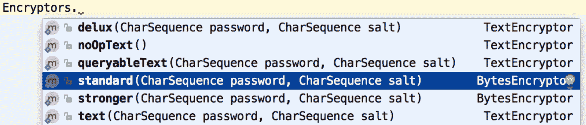

# 密钥生成

如前面加密部分所示，Spring Security 有一个类，即`org.springframework.security.crypto.keygen.KeyGenerators`，它有许多工厂方法，可以用来构造应用程序所需的许多密钥。

以下是支持的两种密钥生成器类型：

+   `BytesKeyGenerator`：用于生成唯一基于字节数组的密钥的生成器。

+   `StringKeyGenerator`：用于生成唯一字符串密钥的生成器：

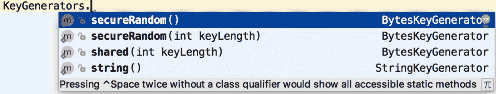

图 7：BytesKeyGenerator 和 StringKeyGenerator 工厂方法

# 秘密管理

在应用程序中，我们需要处理各种形式的 API 密钥、其他应用程序密码等秘密/安全数据。通常情况下，对于部署和运行在生产环境中的应用程序，将这些数据以明文形式存储可能导致安全漏洞。如今，自动化技术变得非常便宜，对于现代应用程序来说，安全地存储这些数据并进行访问控制是必不可少的。

加密是被广泛接受的，但是对于解密，需要传播一个密钥，而这个密钥的传播通常是一个大问题。如果一个人决定将密钥带出组织，就会出现严重问题。

HashiCorp 的 Vault 是解决此问题的一个非常有力的竞争者，并且可以帮助轻松管理这些秘密，并具有非常严格的控制。它提供了基于设置策略的访问 API。它还具有提供访问控制的功能，并且还具有开箱即用的加密功能。此外，它具有各种持久后端支持，例如 Consul（来自 HashiCorp）等，使企业可以轻松采用它。Vault 是用 Go 编写的，并且可以在许多平台上下载到二进制文件，并且可以从其网站下载。在本节中，我们将快速介绍 Vault 产品本身，然后通过一个示例，我们将创建一个 Spring Boot 项目，并安全地访问 Vault 中存储的一些秘密。言归正传，让我们开始实际的代码。

# 从解封 Vault 开始

从 Vault 项目的网站（[`www.vaultproject.io/downloads.html`](https://www.vaultproject.io/downloads.html)）下载最新的二进制文件，根据您的操作系统进行安装。要启动 Vault，您需要一个文件`vault.conf`，其中我们将指定 Vault 启动所需的一些选项。以下是一个示例`vault.conf`文件，您可以使用：

```java
backend "inmem" {
} 
listener "tcp" {
  address = "0.0.0.0:8200"
  tls_disable = 1
}
disable_mlock = true
```

在`vault.conf`文件中，我们明确设置它将监听的地址，并且还禁用了 TLS/SSL（以便以纯文本模式运行）。

通过以下命令指定`vault.conf`文件的位置启动 Vault：

```java
./vault server -config vault.conf
```

如下面的屏幕截图所示，Vault 以纯文本模式运行（已禁用 TLS/SSL）：

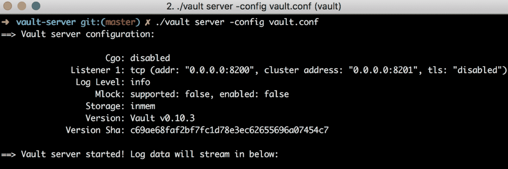

图 8：启动和配置 Vault

打开一个新的命令提示符，我们现在将开始管理 Vault。通过执行以下命令设置一个环境变量，让客户端知道他们必须使用纯文本连接到 Vault（因为我们已禁用了 TLS/SSL）：

```java
export VAULT_ADDR=http://127.0.0.1:8200
```

之后，通过执行以下命令初始化 Vault 密钥生成：

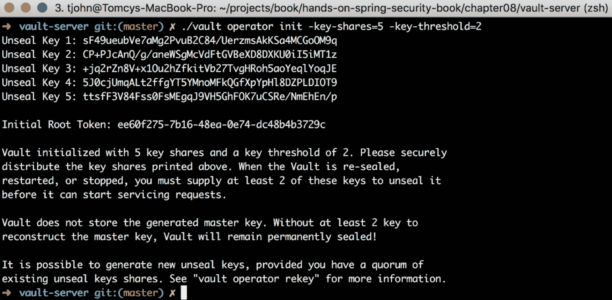

图 9：初始化 Vault

我们使用的命令给了我们五个密钥份额和两个密钥阈值。重要的是要注意，一旦 Vault 被初始化，就无法更改这些值（输出仅显示一次）。务必收集必要的信息；否则，您将无法检索存储在 Vault 中的任何数据。如前面的屏幕截图所示，Vault 的`init`命令为我们提供了解封 Vault 所需的密钥和令牌。在我们可以使用 Vault 之前，必须对其进行解封。

**解封** ([`www.vaultproject.io/docs/concepts/seal.html`](https://www.vaultproject.io/docs/concepts/seal.html)) 是构建读取解密密钥以解密数据所必需的主密钥的过程，从而允许访问 Vault。在解封之前，几乎无法对 Vault 进行任何操作。

您可以通过执行以下命令并提供在 Vault 初始化过程中生成的任何密钥来解封 Vault：

```java
./vault unseal <any key generated using initialization>
```

以下屏幕截图显示了上述命令的成功执行：

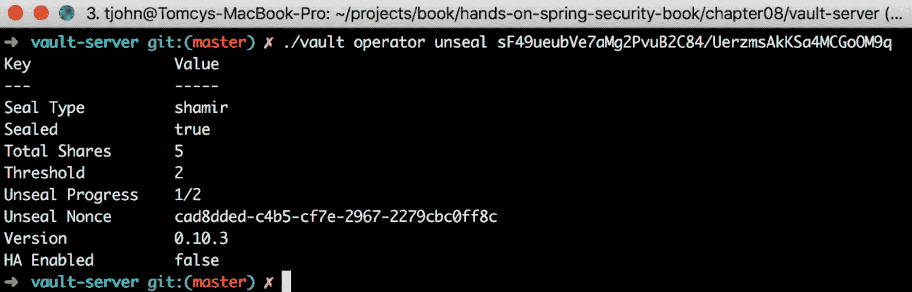

图 10：解封 Vault

一旦解封，您的 Vault 现在已准备好存储您可能想在应用程序中使用的秘密数据。

成功解封 Vault 后，要存储任何数据，您首先需要进行身份验证。当我们初始化 Vault 时，会显示一个令牌（在屏幕上），此令牌用于进行身份验证。使用此令牌进行身份验证的最简单方法之一是设置一个新的环境变量（`VAULT_TOKEN`）。执行以下命令，当 Vault 启动时，它将使用此环境变量并进行身份验证：

```java
export VAULT_TOKEN=ee60f275-7b16-48ea-0e74-dc48b4b3729c
```

执行上述命令后，现在可以通过执行以下命令编写您的秘密：

```java
./vault write secret/movie-application password=randomstring
```

输入命令后，您应该收到以下输出：

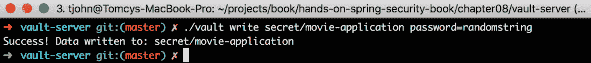

图 11：将秘密写入 Vault

令牌是 Vault 中进行身份验证的主要方式。除此之外，还有其他机制，如 LDAP 和用户名/密码，可以进行身份验证。

# Spring Boot 项目

Spring 有一个专门的模块，称为 Spring Cloud Vault，可以轻松地在应用程序中使用 Vault。Spring Cloud Vault 非常易于使用，我们将在本节中介绍如何使用它。

**Spring Cloud Vault Config**（[`cloud.spring.io/spring-cloud-vault/`](http://cloud.spring.io/spring-cloud-vault/)）为分布式系统中的外部化配置提供了客户端支持。使用 HashiCorp 的 Vault，您可以管理应用程序在所有环境中的外部秘密属性的中心位置。Vault 可以管理静态和动态秘密，如远程应用程序/资源的用户名/密码，并为 MySQL、PostgreSQL、Apache Cassandra、MongoDB、Consul、AWS 等外部服务提供凭据。

我们将使用 Spring Boot 项目（使用 Spring Initializr 生成，[`start.spring.io`](https://start.spring.io)）。在应用程序启动时，Vault 会启动并获取所有的秘密：

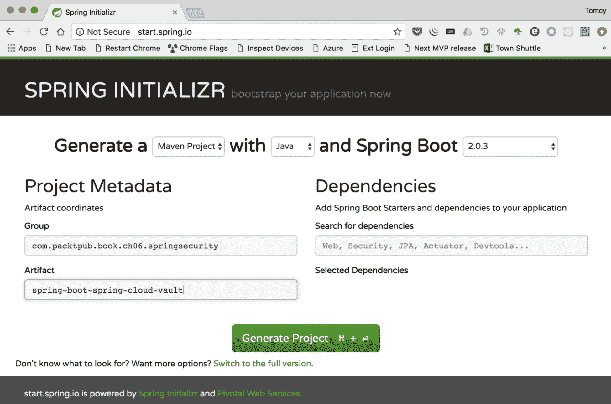

图 12：创建一个空的 Spring Initializr 项目

通过执行以下命令解压下载的 Spring Initializr 项目：

```java
unzip -a spring-boot-spring-cloud-vault.zip
```

在您喜欢的 IDE 中导入项目（我在使用 IntelliJ）。

# Maven 依赖项

确保您的项目的`pom.xml`中添加了以下 Maven 依赖项：

```java
<dependency>
 <groupId>org.springframework.cloud</groupId>
 <artifactId>spring-cloud-starter-vault-config</artifactId>
 <version>2.0.0.RELEASE</version>
</dependency>
```

当 Spring Boot 项目启动时，如果 Vault 服务器运行在端口`8200`上，它将选择默认的 Vault 配置。如果您想自定义这些属性，可以指定`bootstrap.yml`或`bootstrap.properties`。在我们的示例中，我们将明确设置`bootstrap.yml`文件，内容如下：

```java
spring:
  application:
      name: movie-application
spring.cloud.vault:
  host: localhost # hostname of vault server
  port: 8200  # vault server port
  scheme: http # connection scheme http or https
  uri: http://localhost:8200 # vault endpoint
  connection-timeout: 10000 # connection timeout in milliseconds
  read-timeout: 5000  # read timeout in milliseconds
  config:
      order: -10  # order for property source
  token: ee60f275-7b16-48ea-0e74-dc48b4b3729c
health.vault.enabled: true  # health endpoint enabled using spring actuator
```

我们将使用 HTTP 方案，因为我们以纯文本模式启动了 Vault。如果您想使用 HTTPS，这也很容易做到，因为大多数操作都是通过提供的脚本完成的。这是 Vault 运行的默认方案，在生产设置中必须是这样。在实现实际用例时，让我们先了解这个概念，然后再深入一点。

如果您想在 HTTPS 方案中运行 Vault，Spring Cloud Vault 在其源代码的`src/test/bash`目录下提供了许多脚本（[`github.com/spring-cloud/spring-cloud-vault/tree/master/src/test/bash`](https://github.com/spring-cloud/spring-cloud-vault/tree/master/src/test/bash)），可以用于创建必要的证书，然后在此方案下运行 Vault。为了简洁起见，我们不会在这里详细介绍这个方面。

在`.yml`文件中，我们使用了作为 Vault 初始化的一部分创建的根令牌。如果需要，可以通过执行以下命令获取新令牌：

```java
./vault token create
```

以下截图显示了`token create`命令的成功执行：

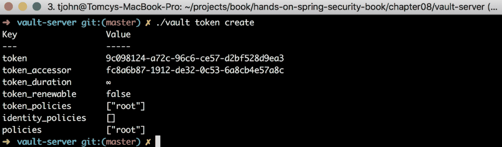

图 13：创建新的 Vault 令牌

在您的 Spring Boot 项目中，在应用程序运行类`SpringBootSpringCloudVaultApplication`中添加以下代码片段：

```java
@Value("${password}")
String password;

@PostConstruct
private void postConstruct() {
 System.out.println("Secret in Movie application password is: " + password);
}
```

在此代码中，`password`字段将由 Spring Cloud Vault 填充，如果您运行应用程序（使用命令`mvn spring-boot:run`），您应该看到 Spring Cloud Vault 连接到运行的 Vault（使用`bootstrap.yml`文件中的配置）并检索我们为`movie-application`写入 Vault 的值。

这结束了我们对使用 Spring Boot 和 Spring Cloud Vault 的基本应用程序的介绍。您可以在本书的 GitHub 页面中的本章项目中查看完整的源代码，名称为`spring-boot-spring-cloud-vault`。

# HTTP 数据完整性验证器

Spring Security 帮助我们通过简单的方式和最少的代码来丰富我们的应用程序的常见安全功能。然而，Spring Security 正在逐渐赶上现代应用程序中需要的许多额外安全功能。这些应用程序大多部署在云上，并且每天都有大量的变更推送到生产环境。**HTTP 数据完整性验证器**（**HDIV**）是一个可以用来进一步丰富您的应用程序安全性的产品。

# 什么是 HDIV？

HDIV 最初是作为一个开源项目诞生的，当时由 Roberto Velasco、Gotzon Illarramendi 和 Gorka Vicente 开发，以应对在生产环境中检测到的安全问题。第一个稳定版本 1.0 于 2008 年发布，以安全库的形式集成到 Web 应用程序中。2011 年，HDIV 正式与 Spring MVC 集成，这是最常用的 Java 解决方案，用于 Web 应用程序开发。2012 年，HDIV 与 Grails 集成。2015 年，HDIV 被包含在 Spring Framework 官方文档中，作为与 Web 安全相关的解决方案。基于全球的兴趣和对高市场需求的回应，创始人成立了**HDIV Security**([`hdivsecurity.com/`](https://hdivsecurity.com/))公司，并于 2016 年推出了 HDIV 的商业版本。HDIV 解决方案在开发过程中构建到应用程序中，以提供最强大的**运行时应用程序自我保护**（**RASP**）来抵御 OWASP 十大威胁。

HDIV 诞生的目的是保护应用程序免受参数篡改攻击。它的第一个目的（从首字母缩写来看）是保证服务器生成的所有数据的完整性（不进行数据修改）。HDIV 通过添加安全功能来扩展 Web 应用程序的行为，同时保持 API 和框架规范。HDIV 逐渐增加了 CSRF、**SQL 注入**（**SQLi**）和 XSS 保护等功能，从而提供了更高的安全性，不仅仅是一个 HTTP 数据完整性验证器。

攻击成本越来越低，自动化程度越来越高。手动安全测试变得成本高昂。Spring Security 通过轻松实现最重要的安全方面（如身份验证和授权）来保护应用程序，但不能保护应用程序代码中常见的安全漏洞和设计缺陷。这就是集成已经使用 Spring Security 进行保护的 Spring 应用程序可以引入 HDIV 的地方。我们将通过一个非常简单的示例来展示 HDIV 的一些亮点。以下是他们网站上详细介绍的一些优势：

+   HDIV 在利用源代码之前检测安全漏洞，使用运行时数据流技术报告漏洞的文件和行号。开发人员在开发过程中可以立即在 Web 浏览器或集中式 Web 控制台中进行报告。

+   它可以保护免受业务逻辑缺陷的影响，无需学习应用程序，并提供检测和保护免受安全漏洞的影响，而无需更改源代码。

+   HDIV 使得渗透测试工具（Burp Suite）与应用程序之间的集成成为可能，向渗透测试人员传递有价值的信息。它避免了许多手工编码的步骤，将渗透测试人员的注意力和努力集中在最脆弱的入口点上。

有关更多信息，您可以查看以下链接：[`hdivsecurity.com/`](https://hdivsecurity.com/)。

让我们开始构建一个简单的示例，展示 HDIV 在保护应用程序中链接和表单数据方面的保护。

# Bootstrap 项目

我们将使用通过 Spring Initializr 创建的基础项目来创建我们的 HDIV 示例，如下所示：

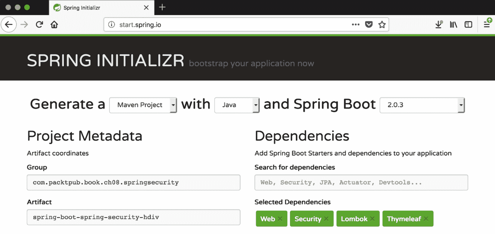

图 14：基本的 Spring Initializr 项目设置

# Maven 依赖项

在以下代码中，我们正在调用我们需要作为项目一部分的显式依赖项，即 HDIV：

```java
<!--HDIV dependency-->
<dependency>
   <groupId>org.hdiv</groupId>
   <artifactId>spring-boot-starter-hdiv-thymeleaf</artifactId>
   <version>1.3.1</version>
   <type>pom</type>
</dependency>
```

HDIV 支持多种 Web 应用程序框架。在我们的示例中，我们将使用 Spring MVC 以及 Thymeleaf 和上述依赖项来处理这个问题。

# Spring Security 配置

到目前为止，您已经知道 Spring Security 配置文件中包含什么。我们将进行内存身份验证，并配置两个用户（与本书中一直在做的类似）。我们将进行基于表单的登录，并将创建自己的登录页面。

# Spring MVC 配置

到目前为止，我们一直在看的 Spring MVC 配置非常基本。这里没有什么值得特别提及的。我们只需要确保附加到登录页面的控制器被明确定义。

# HDIV 配置

这个神奇的类将在不太麻烦的情况下为您的应用程序带来 HDIV 功能。完整的类如下所示：

```java
@Configuration
@EnableHdivWebSecurity
public class HdivSecurityConfig extends HdivWebSecurityConfigurerAdapter {
    @Override
    public void addExclusions(final ExclusionRegistry registry) {
        registry.addUrlExclusions("/login");
    }
}
```

这个类的重要工作是由我们正在扩展的类`HdivWebSecurityConfigurerAdapter`完成。此外，`@EnableHdivWebSecurity`注解确保大部分设置会自动处理。我们只需要确保我们的登录页面 URL 的配置通过覆盖`addExclusions`方法来排除 HDIV 安全。

# 模型类

我们将使用本书中一直在使用的相同模型类`Movie`。为了简化编码，我们将使用 Lombok 库，该库通过查看类中配置的各种注释来完成所有魔术。

# 控制器类

我们只会有一个控制器类，我们将在这个示例中映射所有要创建的页面。为展示 HDIV 的功能，我们将看到 HDIV 在两种情况下的运行：

+   一个电影创建页面（电影 bean），显示在包含表单的页面中 HDIV 的工作

+   一个显示 HDIV 拦截并在有人操纵实际链接时抛出错误的链接页面

该类非常简单，这里不需要详细说明。

# 页面

如前所述，我们将在我们的示例中创建以下页面：

+   `login.html`：我们将用于用户登录应用程序的自定义登录页面

+   `main.html`：成功登录后用户导航到的页面，包含指向电影创建和链接页面的链接

+   `links.html`：用户单击链接 URL 时导航到的页面

+   `movie.html`：电影创建页面，包含两个字段——标题和类型

# 运行应用程序

通过执行以下命令运行应用程序，就像运行任何其他 Spring Boot 项目一样：

```java
mvn spring-boot:run
```

转到浏览器并导航到`http://localhost:8080`，您将看到一个登录页面，如下所示：

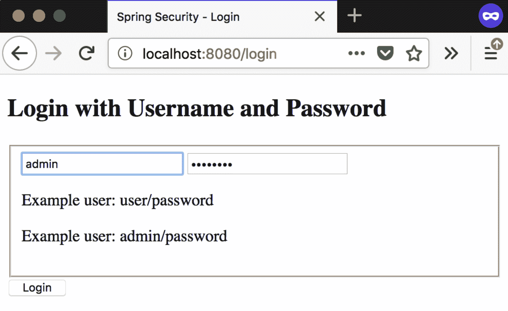

图 15：登录页面

如前面的截图所示，输入`用户名`/`密码`并单击“登录”按钮，您将被导航到主页：

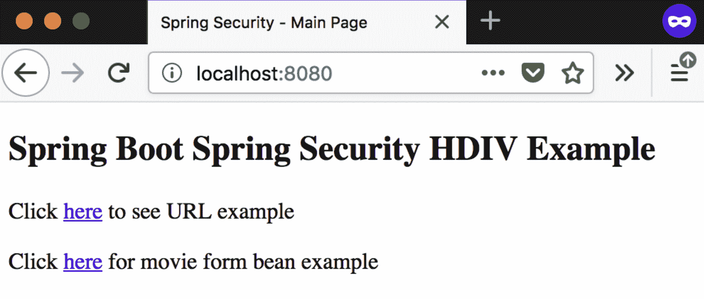

图 16：成功登录后呈现给用户的主页

单击链接导航到创建新电影的页面。您将被导航到以下截图中显示的页面。仔细观察 URL，您将看到已添加新的查询参数`_HDIV_STATE_`。服务器通过查看该值来验证并确保提交的表单是真实的：

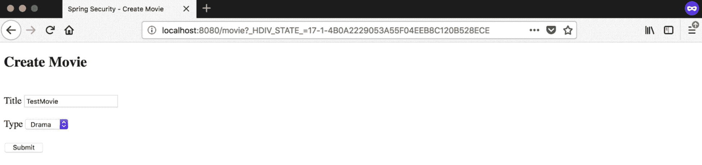

图 17：创建电影屏幕，展示 _HDIV_STATE_ 查询字符串

现在返回主页并单击链接页面。您将被导航到以下页面：

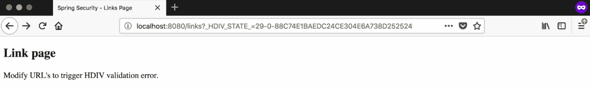

图 18：链接页面，显示 _HDIV_STATE_ 查询字符串

如页面所述，尝试操纵链接（更改`_HDIV_STATE_`值），您将被带到 HDIV 错误页面：

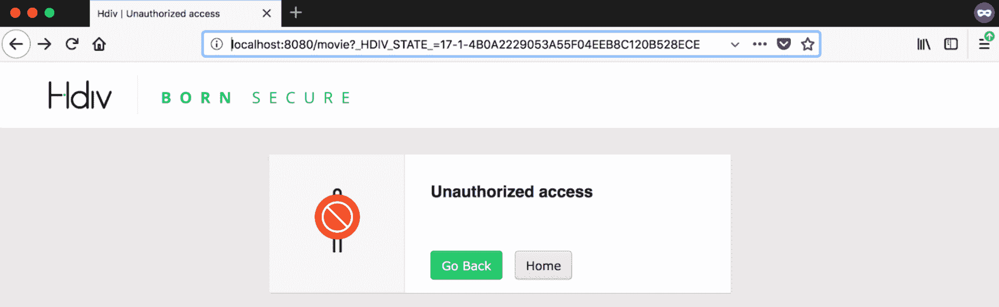

图 19：HDIV 错误页面，在错误条件下显示

此示例展示了 HDIV 在与 Spring Security 一起工作时显示其价值的两种情况。有关更多详细信息，请查看 HDIV 网站和文档，网址如下：

+   [`hdivsecurity.com/docs/`](https://hdivsecurity.com/docs/)

+   [`hdivsecurity.com/docs/installation/library-setup/`](https://hdivsecurity.com/docs/installation/library-setup/)

+   [`github.com/hdiv/hdiv`](https://github.com/hdiv/hdiv)

# 自定义 DSL

Spring Security 允许您编写自己的**领域特定语言**（**DSL**），该语言可用于配置应用程序中的安全性。当我们使用 OKTA 实现 SAML 身份验证时，我们已经看到了自定义 DSL 的实际应用。我们使用了由 OKTA 提供的自定义 DSL 来配置 Spring Security。

要编写自己的自定义 DSL，您可以扩展`AbstractHttpConfigurer` *类*并覆盖其中的一些方法，如下所示：

```java
public class CustomDSL extends AbstractHttpConfigurer<CustomDSL, HttpSecurity> {
    @Override
    public void init(HttpSecurity builder) throws Exception {
       // Any configurations that you would like to do (say as default) can be  
       configured here
    }

    @Override
    public void configure(HttpSecurity builder) throws Exception {
       // Can add anything specific to your application and this will be honored
    }
}
```

在您的 Spring Security 配置类（configure 方法）中，您可以使用自定义 DSL，如下所示：

```java
@Override
 protected void configure(HttpSecurity http) throws Exception {
     http
         .apply(<invoke custom DSL>)
         ...;
 }
```

当 Spring Security 看到自定义 DSL 设置时，代码的执行顺序如下：

1.  调用 Spring Security 配置类的`configure`方法

1.  调用自定义 DSL 的`init`方法

1.  调用自定义 DSL 的`configure`方法

Spring Security 使用这种方法来实现`authorizeRequests()`。

# 摘要

本章向您介绍了 Spring Security 的一些其他功能，这些功能可以在您的应用程序中使用。通过示例，我们介绍了如何在应用程序中实现记住我功能。我们还简要涉及了 CSRF、CORS、CSP、通道安全和会话管理等概念。我们还简要介绍了 Spring Security 中的加密模块。

我们通过介绍了两种可以与 Spring Security 一起使用的产品来结束了本章——HashiCorp Vault（用于秘密管理）和 HDIV（用于附加安全功能）。

阅读完本章后，您应该清楚地了解了一些可以使用 Spring Security 实现的附加功能。您还应该对可以与 Spring Security 一起使用以实现现代应用程序所需的一些最重要的技术功能有很好的理解。

现在，如果您正在阅读本章，那么请为自己鼓掌，因为通过本章，我们完成了本书。我希望您已经享受了本书的每一部分，并且希望您已经学到了一些可以用于创建精彩和创新的新应用程序的新知识。

谢谢阅读！
