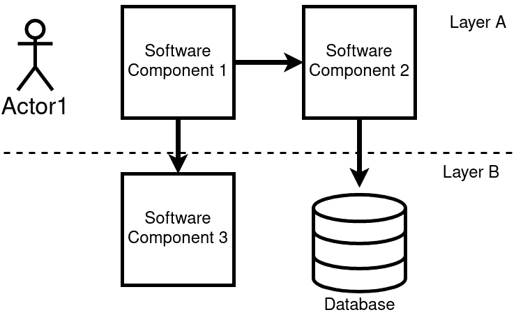
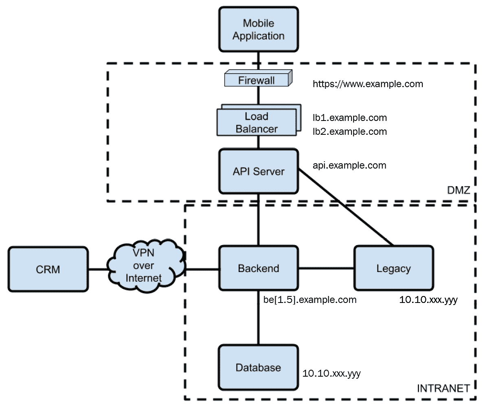
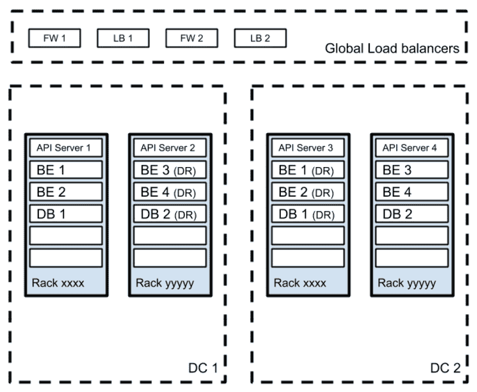
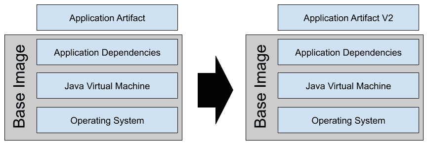
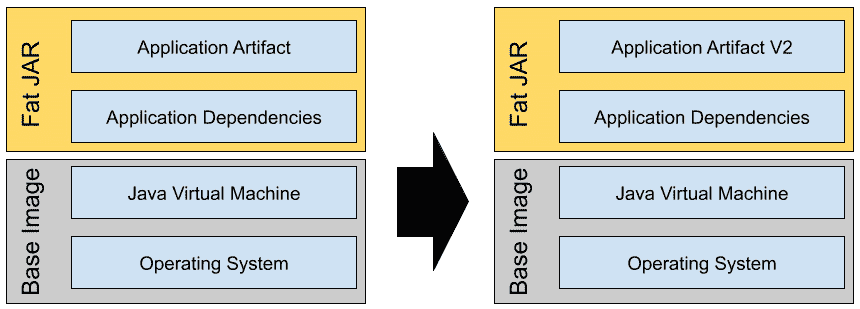
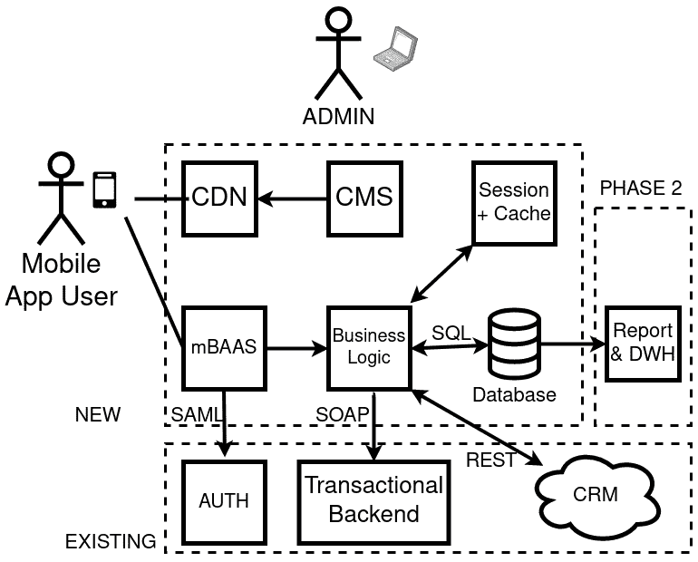

# 第一章：使用 Java 设计软件架构 – 方法与风格

在本章中，我们将关注一些核心概念，这些概念可以作为我们在后续章节中构建的基础。我们将探讨表示软件架构的不同方法，关注目标受众及其特定的观点。此外，我们将详细阐述适当架构设计的重要性及其在软件开发生命周期中的作用。随后，我们将转向本书的核心主题 Java 生态系统，以了解为什么它是实现完整企业应用的好选择。

尤其是以下内容：

+   软件架构的重要性

+   不同类型的架构设计 – 从纸上涂鸦到更精确的建模

+   其他类型的架构图

+   Java 在云原生应用中的角色变化

+   案例研究和示例

+   软件组件图

到本章结束时，你应该对为什么设计是软件开发过程中的关键部分以及主要类型的架构模式有一个清晰的了解。此外，你将熟悉 Java 技术在现代应用开发中的作用。

这些技能对于实现功能强大且优雅的软件解决方案至关重要。这也会为个人发展和职业提升提供一个良好的基础。

# 软件架构的重要性

通常，软件开发完全是关于成本和时间。没有人确切知道为什么，但软件行业几乎总是与紧张的截止日期、资源不足和长时间工作联系在一起。在这种压力下，质疑一切非严格意义上的*编码*的重要性是很常见的。测试是这种质疑的常见受害者，包括文档和当然还有设计。但当然，这些阶段对于项目的成功是至关重要的。虽然我们将快速触及这些方面的多数内容，但架构设计是本书的核心，我相信通过理解实践和目标，其必要性将变得对每个人都很清楚。

在本节中，我们将探讨一个设计合理的架构的基本对象是什么。突出这些简单但至关重要的观点对于提高人们对这一阶段重要性的认识是有用的。如果你开始在团队中倡导这些良好的实践，你交付的软件质量将会提高。

## 软件生命周期中架构设计的目标

本书最终目标不是定义架构本身；关于这一点，有大量的论文和有趣的内容可供参考，包括马丁·福勒的杰出工作。尽管如此，还有一些考虑因素我们需要牢记。

架构应支持我们软件项目中的关键决策。然而，架构本身实际上是一个较为宽泛的概念，通常包括不同的计划（如物理、逻辑、网络等）和观点（如用户、业务逻辑、机器间交互等）。

让我们以最常用的比喻为例：软件项目就像一座建筑。同样地，就像建设项目一样，我们需要许多不同的观点，不同层次的细节，从一般概述到详细的计算和材料清单。一般概述有助于我们了解自己的位置和想要去的地方。此外，它还是确保我们走在正确道路上的一个基本工具。然而，系统概述并不能为网络、安全、系统操作等需要更实质性和定量观点以指导日常决策的团队提供足够的信息。

设计合适的软件架构的主要目标包括以下内容：

+   为项目发起人和投资者提供一个**宏观视角**。虽然过早地将业务讨论（例如，电梯演讲）引导到技术元素上并不是一个好的做法，但管理层、风险投资家等高级管理人员对技术细节的兴趣日益浓厚，因此，对应用程序组件的高级概述对于赢得这类讨论至关重要。

+   为我们解决方案的组件定义一个**共同术语**，这对于跨团队协作至关重要。

+   提供对**技术选择**的**指导**，因为将我们的设计决策记录在纸上将阐明我们应用程序的重要特性。*数据是否为核心？* *我们需要关注多个地理区域吗？* *用户交互是否是最常见的用例？* 其中一些推理可能会随时间而变化。然而，正确设计我们的应用程序将推动一些关键的技术选择，包括选择依赖的组件和堆栈。

+   **划分****角色和责任**。虽然一个适当的项目计划、工作说明书或**负责的**、**可问责的**、**咨询的**、**通知的**（**RACI**）（这是一种分类谁做什么的经典方法）表格将被用于实际的项目管理，但将软件骨干写在纸上是我们第一次了解为了正确执行项目我们需要涉及的人员。

事实上，架构是提前规划的一个很好的例子。然而，一个合适的软件架构应该远不止是一份技术数据表。

就像建筑一样，架构更多地关乎整个项目要遵循的风格和指南。软件架构的最终目标是找到在项目计划期间出现的各种问题的优雅解决方案。最终，它将在整个项目生命周期中起到指导作用。

## 软件架构师 – 角色和技能

作为一种角色，软件架构师通常被认定为 IT 团队中更高级的技术资源。实际上，架构师的职位几乎总是被视为开发者的职业发展路径，尤其是在企业环境中。虽然这不是必需的，但擅长编码对于全面理解系统的整体运作至关重要。

要成为一名成功的架构师，还需要具备其他几种不同的技能，包括创造力、综合能力和远见。然而，最重要的是经验，这是成为架构师的必要条件。

这包括在许多不同项目中的第一手经验，解决现实世界的问题：合适的软件设计是什么样的，设计是如何演变的。这种技能集对于架构师来说是非常有用的背景知识。

此外，拥有一个庞大的解决方案库以供选择，以避免重复造轮子，这一点至关重要。虽然我们喜欢认为我们的问题是独一无二的，但实际上这种情况非常不可能发生。

这导致我们采用本书中的方法：我们不会只关注一个方面或技术进行深入探讨，而是采取一种**横向**的方法，讨论多个不同的话题，并提供如何应对潜在问题的想法。我们希望成为一本手册，在你做出现实世界选择时提供支持。

## 架构设计在现代开发中是否仍然相关？

将有几章专门讨论**微服务**、**DevOps**和云原生浪潮，但可以安全地假设，以某种形式，你将有很多机会听到关于它们的内容。

如你所见，这些概念并不是真正的新。**敏捷宣言**，这是一部详述现代开发技术中常用实践的经典作品，于 2001 年发布，但其中包含的大多数常识性原则都被误解了。当我 2008 年在 IT 咨询公司工作时，开发团队中有一个常见的笑话是：“是的，我们做敏捷。我们跳过文档和测试。”

当然，这只是一个基于个人经验的观点。有很多团队并不低估适当规划和文档的重要性，并且在敏捷开发中表现得很出色。然而，在某些情况下，不太结构化的开发方法被当作跳过开发生命周期中一些关键步骤的借口。

正如我们将详细阐述的，在第五章《探索最常见的发展模型》中，敏捷不仅仅是简化项目中的无聊阶段。事实上，测试和文档仍然非常相关，敏捷不是跳过这些内容的借口。

在如何适应 DevOps、敏捷和更多设计技术方面有很多反思，我们将在本书的后面讨论这个话题。然而，有一点是肯定的：*架构很重要*。*设计非常相关*。我们必须花费正确的时间来规划我们的选择，在需要时重新审视它们，并且通常，坚持一些定义良好的指导原则。否则，结果可能是质量低劣的交付品，或者根本没有交付品。

现在，让我们看看软件设计的第一阶段通常是什么样的。

# 不同的架构设计类型——从纸上涂鸦到更精确的建模

当我们开始构建新应用程序的架构时，结果通常是熟悉的。

我可以说，在不同的地理、行业和应用类型中，一些元素是共同的。建筑草图通常由盒子、线条、标签、箭头和类似的人工制品组成。这是一种直观的方法，将我们的想法在纸上形成。

然而，在下一节中，我们将介绍*不同*的表达这些概念的方法。这将使我们意识到可用的风格和技术，并使我们的图表更清晰，最终更容易分享和理解。

但首先，让我们了解建筑草图的实际特点。

## 绘制主要架构组件

正如我们之前讨论的，在高级架构草图中有许多不同的组件是反复出现的。让我们逐一检查它们：

+   **盒子**：这些代表软件组件。它们可以指一个完整的应用程序或特定的子组件（例如包、模块或类似的东西）。

+   **线条**：这些描述盒子之间的关系。这些链接暗示某种形式的通信，通常是 API 的形式。线条也可以表示继承或某种分组。还可以指定一个方向（即*箭头*）。

+   **层**：这些是点划线或虚线，将组件及其关系分组。它们用于识别架构的逻辑切片（例如前端、后端等）、子组件的分组（例如验证和业务逻辑）、网络段（例如内网和 DMZ）、物理数据中心等。

+   **演员**：模拟系统内用户之间的交互，演员通常以木偶的形式表示，坐在某些组件的顶部（通常是某些前端或某种用户界面）。观察不同渠道以笔记本电脑或手机的形式表示，这取决于行业和应用类型（例如，自动柜员机、分支机构以及物理工业设施）并不罕见。

现在，让我们看一下一个示例草图：

图 1.1 – 第一张架构草图上的常见组件

如我们之前提到的，图中展示的快速且粗略的表示法是有用的，因为它是一种简单的方式来思考我们的应用程序应该如何呈现。然而，仔细观察后，我们发现其中存在一些常见的错误：

+   软件组件（即我们的框）可能以不同的缩放级别表示：有时表示应用程序，有时表示功能，有时表示软件模块。这种不一致性可能会导致混淆。

+   一些组件是专业的（例如，数据库），而另一些则不是。正如前一点所述，这会导致不均匀的视角。

+   在某些部分，我们表示用例或信息流（例如，通过参与者），而在其他地方，我们绘制组件的静态图。

+   由于我们可能表示网络防火墙而不引用任何其他网络设置，因此某些视角可能无法很好地与其他视角配合。

现在我们已经了解了天真表示法的外观及其局限性，让我们来看看其他类型的图以及它们如何表示不同的视角。

# 其他类型的架构图

如我们在上一节中发现的，一个架构的初步草图通常最终会变成一个直观且天真的视角，缺乏必要的细节。在本节中，我们将概述不同类型的架构图。这将帮助我们选择合适的图来应对不同的情况，定义我们架构的更清晰视图。因此，让我们深入了解一些细节。

## 常见的架构图类型

为了更清晰地定义我们的软件将如何呈现，开始挑选层次和视角来表示是至关重要的。这自然会引导我们关注更定制化的设计。虽然不是详尽的，但可能包含以下类型的架构图：

+   **软件组件**：这种类型的图包括不同的软件模块（如应用程序或其他组件）以及它们之间的交互（例如，读取、写入、监听等）。这种图的特定实例可能包括这些组件之间通信的协议和格式，接近完整的 API 文档：

图 1.2 – 软件组件图

+   **网络架构**：这是一种相当常见的设计类型，通常被认为是更“科学”和详细的。它包括网络段（如**DMZ**和**INTRANET**）、**防火墙**、IP 地址等信息：

图 1.3 – 网络架构图

+   **物理架构**：这是将软件模块映射到服务器部署的过程。通常，它包括有关服务器硬件和型号的信息。在多个数据中心设置的情况下（这在企业环境中相当常见），它还可以包含有关机架和房间的详细信息。存储是另一个相对常见的组件。根据实现方式，这种架构可能包括有关虚拟化技术（例如，VMS 映射到托管它的物理服务器）的信息。此外，如果相关，它还可以包括对云或容器部署的引用：

图 1.4 – 物理架构图

这些是架构图中的基本观点，也是详细设计应用程序时的一个重要起点。在进一步深入到应用程序规范的生命周期时，根据您的具体需求，可能会详细阐述其他类型的图表，通常是那些图表的衍生（例如，云部署图、软件模块等）。在下一节中，我们将关注 Java 技术，这是本书的另一个基本主题，对于完成我们对现代应用程序的架构视图至关重要。

# Java 在云原生应用中的变化角色

现在我们已经简要地提到了应用程序的各种设计和图表，让我们专注于本书的另一个基本主题：Java 语言。

听到 Java 已经死亡的说法并不罕见。然而，如果你正在阅读这本书，你可能会同意这远非事实。

当然，企业应用软件开发语言的景象现在比 Java 的黄金时代更广泛、更复杂；尽管如此，这门语言仍然充满活力且广泛使用，尤其是在某些领域。

在本节中，我们将探讨 Java 技术在企业软件领域的应用。然后，我们将快速浏览一下**Java 企业版**（**JEE**）的历史。这将为我们理解现有的企业架构以及基于该技术构建现代、云原生应用奠定良好的基础。

现在，让我们来探讨为什么 Java 技术至今仍然繁荣。

## 为什么 Java 技术至今仍具有相关性

Java 受欢迎的最重要原因可能是技能的可用性。正如许多调查和研究表明的那样（例如，PYPL 和 Tiobe），有大量的专家精通这门语言。另一个关键点是生态系统的相关性，从数量和质量上讲，Java 平台可用的库、资源和工具都很多。

将复杂的应用程序（包括其依赖项）从 Java 重写到另一种语言可能需要数年，简而言之，可能没有必要这么做。Java 运行良好，并且是一个极其高效的平台。在某些场景下，Java 可能运行缓慢且资源密集，但这一点通过其稳定性得到了平衡。这种语言已经过实战检验，功能丰富，并且基本上涵盖了企业中所需的所有用例，例如事务性、与旧环境的集成以及可管理性。

现在，让我们看看 Java 技术在企业环境中的使用情况和方式。这有助于理解现有场景，并将新应用程序融入现有应用景观中。

## 企业环境中的 Java 使用

为了使我们的 Java 应用程序适应整体架构，从软件架构的角度来看，了解大型企业的典型环境是很重要的。

当然，企业架构在很大程度上取决于行业领域（例如，银行、电信、媒体等）、地理位置以及组织的任期，因此我的观点可能略微偏向于我工作时间最长的领域（EMEA 地区的的大型企业）。尽管如此，我认为我们可以总结如下：

+   **旧系统**：大型应用程序，通常运行企业核心功能多年（至少超过 10 年，通常超过 20 年）。不用说，这里的科技不是最新的（**Cobol**在这个领域很常见，但也可以看到其他东西，如**PL SQL**、巨大的批处理脚本，甚至**C**/**C++**代码）。然而，语言在这里很少成为问题。当然，如今，这些技能在就业市场上非常罕见，但通常软件“只是运行”。这里的重点是，大多数时候，没有人确切知道软件做什么，因为它的文档和测试都很差。此外，你通常没有自动发布程序，所以每次进行错误修复时，你都必须交叉手指。不用说，适当的测试环境从未被利用，所以大多数东西都必须在生产中进行测试。

+   **Web（和移动）**：这是企业架构的另一大块。通常，它比旧系统更容易管理，但仍非常关键。事实上，按照设计，这些应用程序面向客户非常严重，因此你无法承受停机时间或关键错误。在技术方面，这里的状况更加碎片化。较新的部署几乎全部由基于 JavaScript 的**单页应用程序（SPA**）（使用 Angular、Vue 和 React 等框架实现）组成。后端是使用 JavaScript（**Node.js**）或 Java 实现的 REST 服务。

+   **商业应用**：通常，Web 应用和商业应用之间的差距非常小。在这里，经验法则是商业应用不太以 Web 为中心（即使它们通常有一个 Web 图形用户界面），而且通常它们不直接面向客户。最常见的商业应用是内部后台流程的管理。在商业应用中很难找到一个反复出现的模式，因为这个领域包含了很多不同的事物（如 CRM、HR 应用、分支机构管理等等）。

+   **大数据**：在各种各样的名称和细微差别（如数据仓库、数据湖和 AI）下，大数据通常在所需资源方面是一个非常大的工作负载。在这里，技术通常是打包的软件，而定制开发则使用各种语言进行，具体取决于所选的核心引擎。这个领域最常用的语言是 Java（Scala）、**R**（其受欢迎程度正在下降）和**Python**（其受欢迎程度正在上升）。在某些实现中，大量 SQL 被用来拼接计算。

+   **中间件和基础设施**：这里包括了所有粘合其他应用的东西。这里最常见的模式是集成（同步或异步）。关键词是 ESB、SOA 和消息传递。其他如**单点登录**和身份提供者也可以包括在内。

正如我提到的，这仅仅是一个粗粒度的分类，作为参考点，了解我们的应用程序将适合哪里，以及我们的应用程序将与其他哪些参与者进行交互。

注意，提到这些技术大多是**传统**的。随着现代范例（如云、微服务和无服务器）的出现，新的语言和堆栈正在迅速占据其位置。值得注意的例子是在微服务开发领域的 Go 和用于系统编程的 Rust。

然而，这些技术和方法通常只是同一类别中的演变（或全新的应用）。在这里，最有趣的例外是在中间件领域，其中一些方法（例如 SOA）在更轻量级的替代品面前正在减少其受欢迎程度。我们将在*第七章*中讨论这一点，*探索中间件和框架*。

现在我们已经探讨了 Java 在企业环境中的广泛应用，让我们来看看它的近期历史。

## JEE 的演变和批评

JEE，正如我们所学的，在常见的企业应用中仍然处于核心地位。这种语言的遗产非常伟大。在标准化一组用于常见功能（如事务性、Web 服务和持久性）的 API 方面所付出的努力令人惊叹，而且不同供应商之间的合作，为了提供互操作性和参考实现，已经是非常成功的一次。

然而，在过去的几年里，出现了一组不同的需求。JEE 的问题在于，为了保持长期稳定性和跨供应商兼容性，技术的演进并不非常迅速。随着云和更模块化应用的兴起，可观察性、模块化打包以及访问 No SQL 数据库等特性已成为现代应用的必要条件。当然，标准和委员会也曾经有过它们的时代，开发者开始从纯实现转向使用第三方库和非标准方法。

重要提示：

这本书的目标不是回顾 JEE 平台的过去历史和争议。然而，组织问题（最终以项目捐赠给 Eclipse 基金会为标志）以及发布频率较低，导致了该平台受欢迎程度的下降。

**平台即服务（PaaS**）范式的兴起是另一个重要的变化事件，它正在改变着这一领域的格局。现代编排平台（以 Kubernetes 为最著名的例子），无论是在云端还是本地，都在朝着不同的方法发展。我们将在稍后更详细地探讨这一点，但核心概念是，为了可扩展性和控制，一些典型的应用服务器特性（例如，集群和服务注册）被委托给了平台本身。这与微服务方法和它们带来的好处有严格的联系。在 JEE 世界中，这意味着这些特性变得重复。

另一点是关于容器化。容器技术的一个焦点是不变性及其在稳定性和应用质量方面的影响。你将一个应用打包到一个容器中，并轻松地在不同环境中移动它。当然，这与设计用来托管多个应用、管理热部署和配置实时更改的 JEE 服务器不是同一个方向。

关于应用服务器的一个进一步考虑是，它们在设计上是为了优化事务吞吐量（通常以启动时间为代价），并且它们的运行时是通用性的（包括覆盖许多不同用例的库）。相反，云原生方法通常旨在更快的启动时间和尽可能小的运行时，只提供特定应用需要的特性。这将是我们下一节的重点。

## 介绍云原生 Java

自从微服务概念诞生以来，在 Java 开发社区中，范式已经越来越多地转向**胖 jar 方法**。这个概念并不新鲜，因为*uber jars*（胖 jar 的同义词）的早期例子可以追溯到 2000 年代初，主要在桌面开发领域。围绕它们的想法相当简单：与其在运行时动态加载库，不如将它们全部打包到一个可执行 jar 中，以简化我们应用程序的分布。这实际上是应用程序服务器模型的相反，应用程序服务器旨在创建尽可能可配置的环境，支持诸如热部署和库的热插拔等功能，优先考虑可用性而不是不可变性（和可预测性）。

在基于容器和云原生应用程序中，胖 jar 方法已经开始被视为实现云原生、面向微服务的应用程序的完美候选者。这有多个不同的原因：

+   **可测试性**：你可以在本地环境中轻松运行和测试应用程序（只需要一个兼容的**Java 虚拟机**或**JVM**）。此外，如果接口得到适当的定义和文档化，模拟其他组件和进行集成测试就很容易了。

+   `.jar` 文件和配置（通常，在文本文件或环境变量中）。

+   **环境稳定性**：由于所有内容都是自包含的，因此很容易避免“在我的机器上工作”的效果。开发执行环境（通常，开发者的机器）设计得与生产环境非常相似（除了配置，通常与代码很好地分离，当然，还有外部系统，如数据库）。这种行为反映了容器提供的内容，这可能是采用这种微服务开发方法最重要的原因之一。

最后，还有一个重要的考虑因素需要注意：有趣的是，与我所说的相反，一站式胖 jar 方法在理论上与容器化的优化相冲突。

事实上，每种容器技术都提供了一种好处，那就是**分层**。简单来说，每个容器都是从**基础镜像**开始，只添加所需的内容。在 Java 世界中，一个相当常见的场景是将应用程序创建为一个由操作系统、JVM、依赖项以及应用程序工件组成的塔楼。让我们看一下以下图中它看起来是什么样子。在灰色部分，你会看到基础镜像，它不会随着应用程序的新版本发布而改变。确实，对应用程序工件所做的更改意味着只需重新部署在底层**基础镜像**之上的最后一层：

图 1.5 – 容器镜像分层

如您在前面的图中所见，在这种场景下的发布就像简单地替换 **应用程序工件** 层（即顶层）一样轻。

通过使用胖 JAR 方法，您无法实现这种行为。如果您在应用程序中更改了某些内容，但在依赖项中没有更改，您必须重新构建整个 **胖 JAR** 并将其放在 JVM 层之上。您可以在以下图中观察到这看起来是什么样子：

图 1.6 – 层叠容器镜像和胖 JAR

在这种情况下，发布包括所有应用程序依赖项，除了应用程序本身之外。

虽然这看起来可能是一个微不足道的问题，但它可能意味着数百兆字节的数据在您的环境中来回复制，影响开发和发布时间，因为容器运行时无法缓存组成容器的多数内容。

一些生态系统在 *空壳 JAR* 领域进行了一些实验，以本质上复制类似于应用服务器的做法。在这里，组合的（胖）JAR 被分割在应用层和依赖层之间，以便避免每次都需要重新打包/移动所有内容。然而，这种方法远未得到广泛应用。

## Java 微服务生态系统

最后一个考虑因素是 Java 微服务世界的生态系统。正如我们之前开始提到的，这里的做法是将更多事情委托给 *平台*。服务本身变得简单，只包含所需的依赖（以减少大小和资源占用），并专注于业务逻辑。

然而，一些委托给应用服务器的功能仍然是必需的。服务注册、集群和配置是首先想到的简单例子。

此外，其他，更新的需求开始出现：

+   **健康检查**是第一个需求。由于没有应用服务器来确保您的应用程序正在运行，并且应用程序被实现为多个运行的工件，您最终将不得不监控每个微服务，并在它变得不健康时可能重新启动它（或执行其他操作）。

+   **可见性**是另一个需求。我可能想要可视化连接和依赖的网络，组件之间的流量，以及更多。

+   最后但同样重要的是：**弹性**。这通常被翻译为断路器，即使它不是帮助实现这一点的唯一模式。如果调用链中的某个部分失败，您不希望失败级联。

因此，正如我们将在接下来的章节中发现的，需要一个新生态系统才能在 JEE 世界之外生存。

微服务在软件架构的世界中是一次颠覆性的创新，它开启了一个全新的趋势，即所谓的云原生架构（本书的主要话题）。考虑到这一点，我无法避免提及另一个非常有前景的范式：**无服务器**。

无服务器借鉴了微服务的一些概念，如标准化和水平扩展，并将其推向极致，通过减轻开发者在代码本身之外的责任，并将打包和部署等任务委托给底层平台。作为一种趋势，无服务器已成为云平台上的专有技术，但在混合云场景中越来越受欢迎。

Java 在无服务器世界中并不出名。编译的需要以及 JVM 带来的重量级问题，传统上被视为无服务器世界的一个障碍。然而，正如我们将在*第九章*中进一步探讨的，*设计云原生架构*，Java 技术现在也在该领域获得了一些动力。

现在，为了更好地阐明不同的架构设计，我们将基于一个参考案例研究来检查一些示例。

# 案例研究和示例

沿着手册方法，每次我们面对一个复杂的概念，我都会尝试通过提供案例研究来澄清它。当然，虽然案例不是真实的（原因你可以想象），但挑战与我在职业生涯中经历的一些亲身经历非常相似。

在本节中，我们将从头开始设计一个软件架构。然后，我们将添加细节以描绘一个更精确的视图。这将帮助你更好地理解复杂架构设计的第一步。

## 案例研究 – 移动支付

在本案例研究中，我们将模拟一个移动支付解决方案的架构设计。作为背景，让我们假设一家大型银行，为了增加面向客户的服务并提供，并遵循一些市场研究，希望实施一个移动支付应用程序。根据定义，移动支付是一个相当宽泛的概念，它包括许多不同的用例，涉及使用智能手机完成的金融交易。

在这个特定的实现中，我们将考虑通过手机账单收费使用智能手机支付的场景。

从本质上讲，这意味着实现一个客户端-服务器架构（客户端以移动应用程序的形式实现），与现有的企业应用程序和电信运营商公开的外部系统进行交互。现在，让我们尝试分析一些与这一场景相关的用例，并使用我们迄今为止讨论的不同模式对其进行建模。

## 绘制整体架构图

从空白处开始，让我们开始绘制整体架构。正如我们所学的，第一步通常是高层次的绘制相关模块及其之间的关系。不必过于详细，也不必使用特定的风格。我们只是在纸上头脑风暴第一个形状：

图 1.7 – 架构草图

在这里，我们草拟了用例的鸟瞰图。我们现在知道交易从哪里开始，数据在哪里保存，以及用户如何与系统交互。

此外，我们还确定了应用程序的主要组件：

+   移动应用程序（与用户一起表示）

+   （**CDN**）为应用提供静态资源

+   配置要发送到应用的（**CMS**）

+   后端（**移动后端即服务**或**mBaaS**）用于代理请求和响应

+   应用程序的业务逻辑

+   **会话**和**缓存**，用于存储用户的非持久数据

+   **数据库**，用于存储持久数据

+   应用程序的其他部分：报告和数据仓库、身份验证、**事务后端**和**客户关系管理**（**CRM**）

如预期的那样，这种设计有一些固有的问题：

+   你可以观察到混合用例（既包括移动用户也包括 CMS 管理员），这可以通过不同组件之间的箭头预见，但设计得并不完善。

+   在项目时间线中有一个关于组件实现（报告和数据仓库似乎在项目的第一阶段是可选的）的视图。

交互中的一些协议被命名（例如，SOAP 和 REST），但这既不是 API 规范，也不是网络架构。无论如何，即使它不是非常详细，这个架构也是一个好的起点。它帮助我们定义主要的应用边界，提供了一个高级的集成点概述，总的来说，这是一个启动更详细分析的好方法。我们将在下一节中对其进行改进。

# 软件组件图

为了解决前一部分中提出的一些问题，我通过关注软件组件来模拟了相同的系统。即使它与**C4**方法（其中**C4**代表**上下文、容器、组件和代码**）相当相似，但这并不遵循任何特定的标准（我们将在后面的章节中进一步讨论）：

![Figure 1.8 – 软件组件图

![img/Figure_1.8_B16354.jpg]

图 1.8 – 软件组件图

如您所见，这个架构比第一个草图更加统一和有组织。乍一看，您可以查看提供给用户的功能。此外，它还突出了系统如何以结构化的方式相互交互（例如，使用 API 调用、读取和写入等）。

与第一个草图相比，我们可以观察到一些考虑因素：

+   组件几乎与其他架构相同。

+   该图不太关注用例，尽管用户仍然被表示（以及他们可用的功能的高级概述）。

+   没有对项目阶段进行概述。这有助于你只关注一个视角（架构组件），使架构图更不令人困惑。

+   没有命名协议，只有高级交互（如读取、写入和 API 调用）。

+   一些技术组件被保留（例如数据库），而其他组件则被跳过，因为它们对功能视图的影响较小（例如，CDN，这可能更适用于网络架构）。

在本节中，我们学习了如何处理我们移动支付应用程序的第一个设计；首先，以一种更天真的方式，然后尝试以更结构化的方式详细说明视图。在接下来的章节中，我们将讨论如何进一步澄清和丰富这些视图。

# 摘要

在本章中，我们只是触及了本书两个最基本主题的表面：不同的架构设计类型以及 Java 技术在企业世界中的相关性。

我们已经发现了我们的软件架构初稿的样子以及为什么它们是相关的，即使它们并不非常详细。然后，我们转向不同的架构（如软件组件、基础设施和网络）以一瞥其他架构风格，这对于解决特定兴趣领域是有用的。在 Java 方面，我们对 Java 在企业景观中的作用以及该语言如何演变以应对现代云环境挑战进行了一些思考。

这些概念将是本书两个核心概念的有用起点。在架构方面，我们已经掌握了如何观察、分析和设计适当的架构的复杂性和重要性。从技术角度来看，我们已经了解到 Java，本书余下部分我们将关注的语言，在企业环境中非常普遍，并且它对于构建现代、云原生应用仍然相关。

在下一章中，我们将开始处理需求。需求收集和规范对于重新设计我们的架构设计至关重要，以便添加更多细节并确保最终产品能够满足客户期望。

# 进一步阅读

+   *谁需要架构师？*，作者 Martin Fowler ([`files.catwell.info/misc/mirror/2003-martin-fowler-who-needs-an-architect.pdf`](http://files.catwell.info/misc/mirror/2003-martin-fowler-who-needs-an-architect.pdf))

+   *不要在 Docker 镜像中放入胖 JAR*，作者 Philipp Hauer ([`phauer.com/2019/no-fat-jar-in-docker-image`](https://phauer.com/2019/no-fat-jar-in-docker-image))
