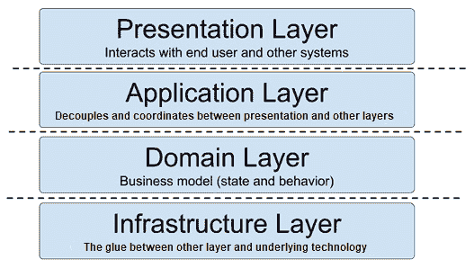
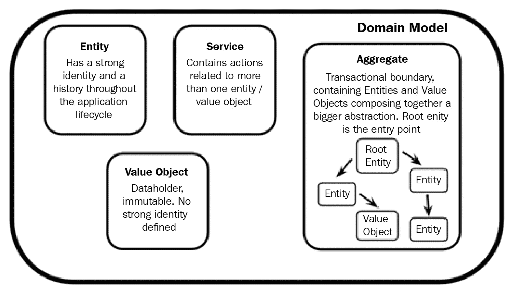
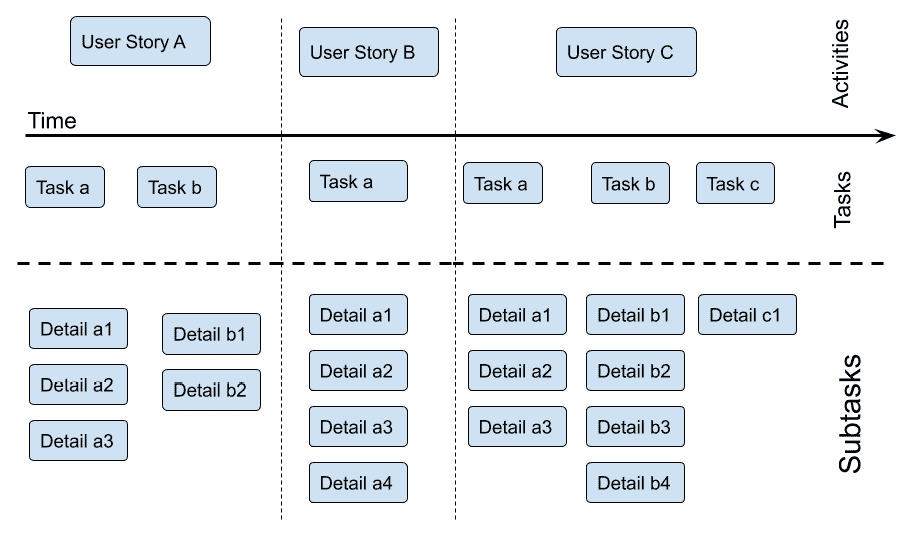
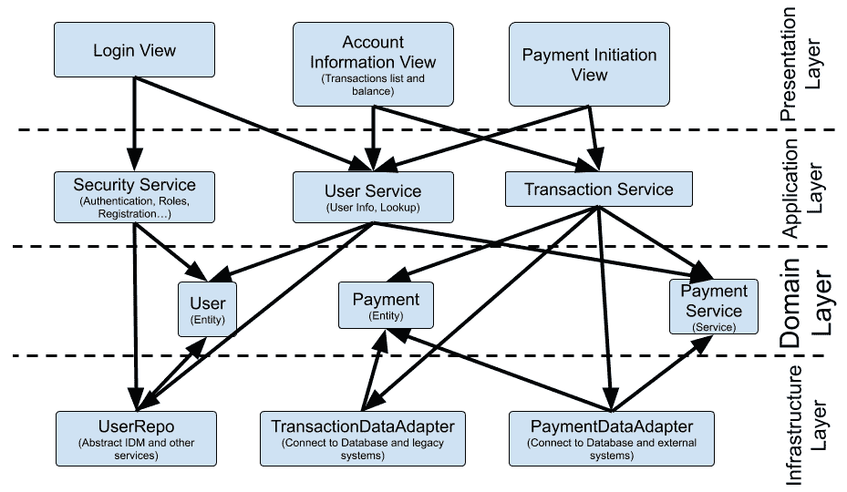
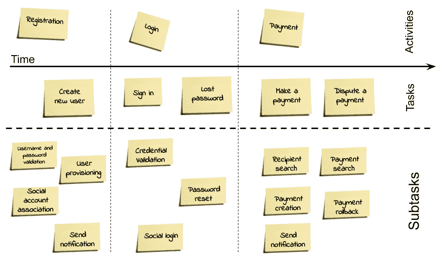
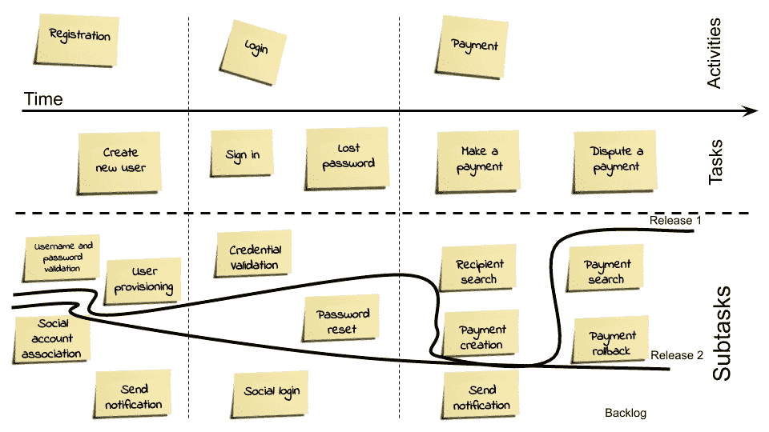

# 第四章：设计和开发的最佳实践

阅读本书的开发者可能将前几章视为开胃菜。如果是这样，随着本章，我们将进入主菜。虽然收集需求和设计架构是关键步骤（我无法强调这一点的重要性），但任何有开发背景的人肯定都希望亲自动手编写代码。

在本章中，我们将专注于如何将我们迄今为止理论化的概念实现到源代码中。当然，在现实世界中，边缘并不那么平滑，架构设计（包括**UML**或**C4**图）和需求管理将在实施阶段继续进行。然而，在本章中，我们将专注于将那些设计思想转化为工作软件的一些知名技术。

在本章中，您将学习以下主题：

+   理解**领域驱动设计**（**DDD**）

+   介绍**测试驱动开发**（**TDD**）

+   探索**行为驱动开发**（**BDD**）

+   用户故事映射和值切片

+   案例研究和示例

阅读本章后，您将能够将复杂的使用案例建模成优雅的软件概念，并定义领域、对象和模式。您将学习如何使用 TDD 和 BDD 进行开发活动，并在每次发布中实现有意义的用例。您将理解**最小可行产品**（**MVPs**）和值切片技术。

但首先，我们将从 DDD 开始，这将为构建坚实的基础。

# 理解领域驱动设计

DDD 的名字来源于埃里克·埃文斯（2003 年）的同名书籍。副标题完美地阐明了目标——**解决软件核心的复杂性**。

在本节中，我们将学习关于领域模型、通用语言、分层架构、DDD 模式和边界上下文的内容。

DDD 是一种广泛采用的建模技术，用于构建丰富和表达性的领域。它被认为是现代方法，如微服务开发背后的技术。

DDD 背后的理念是发现如何以反映我们在现实世界中遇到的问题的方式来对我们的软件进行建模。预期如果建模得当，我们的软件将是可读的，将遵循需求，并且能够正常工作。

当然，没有魔法配方：DDD 提供了一套模式、最佳实践和想法的工具包，以实现这种建模。这种方法特别适用于复杂领域，但对于较小和较简单的项目可能有些过度。此外，确实 DDD 提供了许多好想法，如果您觉得适合您的需求，您可能考虑部分采用它。但首先，让我们从关于领域模型完整性的考虑开始。

## 虚弱领域模型

在他关于这种领域模型的经典论文中，Martin Fowler 将**贫血领域模型**定义为一种反模式，它违背了面向对象编程的基本目的。当然，我完全同意这一点。然而，这种建模方式过于普遍，因为它是一种快速且简单的设计应用的方法。

在贫血领域模型中，每个对象都与其实际世界的对应物相对应，包括字段和关系。这些在某种程度上是数据对象。贫血领域模型的对象中缺失的是行为，即与该特定概念在现实世界中逻辑相关的特定动作。通常，贫血领域模型中的对象有获取器和设置器方法，没有更多。所有行为都被编码为特定服务对象的一部分，通过特定方法在所有其他数据对象上操作。

这里的问题在于领域模型正逐渐从面向对象编程滑向一个过度设计的程序模型。在简单场景下，这或许足够好，实际上，在基于关系数据库的**创建、读取、更新和删除**（**CRUD**）应用中，这种情况很常见，你几乎是将表格直接暴露为应用，并且在上层只有非常有限的业务逻辑。

如果模型更大，并且包含了更完整的业务逻辑，这种建模方式开始显示出一些局限性。数据对象变得相似，难以将它们分组并定义关系。服务对象的方法越来越多，复杂性也在增长。你开始感受到程序和面向对象方法的缺点。毕竟，你几乎没有（如果有的话）面向对象建模的优点。DDD 的目标正好相反——构建丰富且具有表现力的面向对象设计。让我们来看看如何根据 DDD 原则开始建模应用。

## 理解通用语言

事实上，领域驱动设计（DDD）的第一个概念就是良好的协作原则。为了定义一个好的领域模型，你必须使用技术语言和业务语言。

这意味着团队由领域专家和软件开发者组成。*但是当这些人使用不同的语言时，他们将如何合作呢？* 你将需要一个通用语来确保他们能够共同工作。

通用语言的概念简单而巧妙，即定义一个业务（例如，分析师、领域专家或你希望包括的任何人）和开发者之间共享的字典，以便他们可以更少地产生误解地进行交流。然而，这是一个抽象的概念，没有神奇的配方可以实现它。你可以将其视为团队中内置的共享文化。不幸的是，没有人定义一个模板文档或某种图表，可以解决每个人的通用语言挑战。

事实上，DDD 基本文献中建议使用 UML 图（特别是类图）和书面文档（不需要特定的格式）。然而，关键是如何达到对通用语言的共同理解，可能只有一种方法——通过共同工作。

通用语言的核心是如何恰当地命名模型中的概念。通过概念，我们不一定是指**Java**类（因为它们是实现细节），也不是指业务流程（因为，也许，它们在我们的应用程序中不是一对一映射的）。我们指的是中间的东西，即一个对业务有可理解性和意义，并且可以通过开发者以有意义的方式翻译成软件工件的模型。

当然，模型将理解对象、它们背后的关系以及它们执行的操作。对于团队来说，共享每个操作的含义也是至关重要的。仅仅定义每个交互的名称可能无法解决任何歧义。一旦达成共同理解（可能是一个反复进行、包含多个循环的努力），就必须严格遵守。

这包括在代码和所有其他产生的工件（如分析文档、测试计划等）中一致地使用命名，以及在会议中用正确的名称指代事物，并以某种方式记录这种共同理解（正如我所说的，格式由你决定）。正如我们之前讨论的，通用语言的核心是创建一个跨不同专业的工作团队中的共享文化。

这个概念可能看起来很抽象；然而，它是基本的，即使你不完全采用 DDD，它也可以是一个有用的工具。然而，DDD 还定义了更具体的概念，如**分层架构**，我们将在下一节中探讨。

## 熟悉分层架构

当我们开始定义围绕我们应用程序的概念模型时，自然会想知道这个模型在实际实施中如何定位，以及如何保持其纯粹性，无论我们使用什么技术。考虑持久性（数据库）、**用户界面**（UI）等。这些技术可能具有与我们模型不同的结构。它们甚至可能根本不是面向对象的。当然，我们不希望技术原因（如查询优化或 UI 的变化）导致我们的领域模型受到影响。领域驱动设计（DDD）通过建议分层架构方法直接处理这个概念。

在这里，想法是将应用程序代码划分为不同的层，它们之间松散耦合。然后，你将领域模型实现到这些层中的一层，将技术细节封装在其他层中，每一层都有明确的职责。

一个简单且常见的例子是将四个层次划分为以下部分：

图 4.1 – 分层架构

正如你所见，分层架构被划分为以下几部分：

+   **表示层**：这一层包括所有用于向用户展示和收集数据的代码。此外，这还可能包括机器到机器的交互（例如，在 API 调用中）。

+   **应用层**：这一层类似于在**前后端分离模式**（我们将在*第六章*，*探索核心 Java 架构模式*中介绍）中实现的内容。本质上，这一层是一个代理，无状态且没有业务逻辑，它仅仅协调表示层与其他应用部分之间的交互。

应用层可以存储会话数据并执行基本编排（例如，对底层层的调用进行聚合或排序）。在我看来，在某些类型的应用中，这一层可以被认为是可选的。风险是，如果你避免使用它，它将紧密地将表示层与其他架构部分耦合在一起。另一方面，如果你决定采用它，你应该注意过多引入业务逻辑的风险。

+   **领域层**：当然，这一层是正确实现领域驱动设计（DDD）的核心。整个商业模式，包括我们所代表的对象、其状态和其行为，都位于这一层。领域层暴露了更高层的功能，并使用底层来处理技术问题。

+   **基础设施层**：这一层是一个支持层，处理所有其他层。它可以被定义为层与层之间的粘合剂，以及提供功能的科技层。在这里，一个经典的功能是持久性——领域层中的对象使用基础设施层暴露的功能，该层使用其本地的协议和库来处理数据库（或其他持久化技术）。

这种组织结构可能对你来说很熟悉，因为它在软件领域以各种形式和变体被描述（你可能会在*第六章*，*探索核心 Java 架构模式*中找到一些相似之处）。然而，请注意，这主要是一种将责任很好地分组的方法。这并不一定意味着每个层都应该单独部署，作为一个独立的过程或工件。

在讨论了分层架构之后，让我们集中讨论 DDD 的核心：**领域模型**及其部分。

## 了解领域模型

**领域模型**是一种优雅地表示现实并在面向对象方式中实现它的方法。

实际上，你可以将领域模型视为我们之前所讨论的贫血模型的反面。在贫血模型中，对象仅仅包含数据，并且行为非常有限（甚至没有）。DDD 的领域模型强调对象的表达性和它们的行为。

简而言之，领域模型就是理解应用程序的数据和行为的概念。DDD 通过定义以下章节中详细说明的元素来实现这一想法，如图所示：

图 4.2 – 领域模型

我们将在下一节讨论每个部分。

### 实体

**实体**是领域模型的一个核心概念。本质上，它与建模在整个用例生命周期中具有身份和历史的对象相关。定义实体的关键字是**身份**。

如果我们用例中的对象具有强烈的身份概念，它很可能与实体相对应。一个经典的例子是个人：在许多用例中（包括我们在整本书中贯穿的移动支付示例），一个人的身份被强烈定义，无论其代表对象中包含的值如何。换句话说，如果我有一个由经典的名字、姓氏和其他细节组成的人对象，有两个具有相同名字和姓氏的对象并不一定意味着我指的是同一个人。

事实上，我经常求助于特定的标识字段（例如税号或与我应用领域相关的东西——可能是一个账户号码）来区分一个人对象与另一个对象。此外，即使对象被持久化（和检索），身份概念仍然有效。换句话说，如果我在某个地方（例如数据库）持久化（或钝化）一个实体对象，那么当它再次被加载时，应该清楚它将指向同一个真实生活中的个人。

很明显，定义一个实体是业务和开发者之间的一个横切关注点。它远不止是简单地识别一个区分对象的唯一字段。考虑银行账户：它们通常由一个在国际上得到认可的标准化代码来识别，至少在欧洲是这样（IBAN 代码）。然而，你可能会发现银行账户会更改相关的 IBAN 代码（例如，当不同银行之间的合并发生时）。在这种情况下，*两个 IBAN 代码是否指向同一个账户？* *旧账户会消失并被新账户取代吗？* *我应该使用第三个标识符（例如 UUID）来在两个实体之间建立桥梁并绕过这个问题吗？*

通常，答案是这取决于情况。在这种情况下，这取决于你的用例所基于的领域。在同一个应用中（以扩展的方式），身份概念也可能不同。最终，实体对象与你的视角有很大关系。然而，可以肯定的是，它需要是一个具有非常明确身份的对象，无论其属性值如何，这使我们联系到不同类型的对象——**值对象**。

### 值对象

从概念上讲，值对象补充了实体对象。简单来说，在值对象中，对象字段中的数据比对象的身份更重要。值对象只是传输信息，它们可以轻松地共享、复制和重用。值对象的典型例子是地址（如城市、街道名称或邮政编码）。每个对象的身份无关紧要；重要的是里面的数据。

值对象应该是不可变的。因为它们是不可变的，所以使用起来更简单。一个常见的例子是多线程：多个线程可以同时访问同一个对象实例，无需加锁，也不会有值不一致的风险（因为值不能被更改）。将对象实例传递给方法也是一样：你可以确信无论发生什么，对象的值都不会改变。本质上，使用不可变对象，生命周期更容易管理。

值对象通常比实体对象更轻量级且更易于管理。此外，它们可以是实体的一部分，也就是说，我们的个人实体可能有一个链接到地址值对象的链接。然而，你应该平衡实体和值对象的使用。如果你只依赖值对象，你可能会陷入贫血领域。关于对象内容，还有一件重要的事情要讨论，那就是*我们可以将不属于实体或值对象的行为放在哪里？* 答案是**服务**。

### 服务

如前所述，实体和值对象在身份方面是不同的。相反，它们在逻辑区域周围的分组上共享，包括数据和行为。换句话说，实体和值对象都包含数据（类属性）、操作它的方法（获取器和设置器）以及更复杂的行为（业务逻辑）。

这个模型缺少的是横切行为。确实，有些动作放在特定对象中感觉不合适。这是因为这些动作涉及到的不仅仅是对象类型，或者它们本身就是模糊的。重要的是不要将这些动作强加给无关的对象，因为这会影响模型的表达能力。让我们再次思考我们的移动支付示例。*我们应该将点对点支付功能放在发送者账户还是接收者账户中？*

对于所有这些场景，你可以定义一个**服务**。服务明确地将与整个领域直接相关的动作映射出来，而不是映射到特定的对象类型。这样，你可以很好地将类似动作分组在一起，而不会污染实体或值对象，使其包含不属于那里的行为。这完全是关于保持领域模型合理组织，这也是下一个概念——**聚合**的目标。

### 聚合

我们在*第二章*“软件需求 - 收集、记录、管理”中提到了**聚合**的概念，当时在讨论事件风暴。值得一提的是，事件风暴的整个想法与领域驱动设计（DDD）密切相关，并且是实施 DDD 的一种方式。

让我们回到聚合的概念；这可能是 DDD 最广为人知的思想之一，并且它也在 DDD 之外得到广泛应用。简单来说，聚合可以被视为事务边界。基本思想是按数据变化将一组对象（即实体和/或值对象）分组。在聚合中，当涉及到它们内部状态的变化时，这些对象被视为一个整体。

聚合有一个入口对象，称为**根实体**。对聚合中任何对象的任何更改都必须通过根实体进行，然后根实体将对相关实体执行更改。这更多是从技术角度而不是领域模型角度来说的。你所做的是在根实体中调用操作（或者更好的是，在现实世界和领域模型中都具有意义的动作）。

这也将意味着在底层更改相关对象。然而，这是一个实现细节。从逻辑角度来看，与聚合中对象的全部交互都由根实体介导。因此，聚合是 DDD 中的一个核心概念。它严格映射模型的完整性，可以轻松地转换为技术概念，如数据库事务。然后，聚合可以被视为由不同对象协调的**超级对象**。因此，聚合的构建可能会变得复杂。因此，DDD 引入了**工厂模式**。

## 快速浏览 DDD 模式

DDD 包含一些模式，为领域模型提供支持功能，例如构建和管理对象（如实体和值对象）。工厂模式是我们将要探讨的第一个模式。

### 工厂

**工厂**模式不是一个新概念。你可以参考四人帮的《设计模式》一书，其中对此有广泛的解释。简单来说，如果你想以编程方式控制对象的创建（或一组对象，如聚合），而不依赖于构造函数的逻辑，你可以使用工厂模式。

工厂模式特别适用于实例化聚合。通过在根元素上调用工厂模式，你可以协调根本身的创建以及所有与根相关联的其他对象（实体和值对象）。此外，你还可以在对象的创建上强制执行事务性。

如果创建一个对象失败，那么你可能想要取消整个聚合的创建。工厂模式也可以用来从数据库中重新创建对象。在这种情况下，它不是从头开始实例化，而是检索现有的根实体（以及相关的子对象）。这对于处理已知对象的检索（给定其标识）是可行的，*但是如何提供不同类型的查找呢？* 领域驱动设计（DDD）建议使用**仓库模式**。

### 仓库

在领域驱动设计（DDD）的世界里，**仓库**是一个注册表，用于保存已实例化（或已持久化到数据库中）的对象引用。简单来说，仓库可以用来添加、删除和查找对象。当用于查找对象时，通常，仓库充当领域层和基础设施层之间的桥梁。

它有助于解耦功能并隐藏持久化层的实现细节。你可以在基础设施层使用复杂或供应商特定的查询来检索对象，这由仓库中的操作封装。甚至可能基础设施层以不同的方式检索对象，例如调用外部 Web 服务而不是数据库。从仓库的角度来看，这一切都不会改变。仓库公开的服务必须具有明确的领域意义，而内部实现可能看起来更接近基础设施逻辑。

到目前为止，在我们所考察的所有概念中，我们都隐含地假设一切都在一个单一的领域模型之下。现在，我们将学习如何通过使用**有限上下文**的概念，使不同的领域相互交互。

## 有限上下文

通常，人们会使用一个应用程序来识别领域模型。这是一个界定模型边界的方法。然而，情况并不总是如此。当处理大型应用程序时，可能不同的模型需要共存。这是因为统一模型不切实际（即太大或太复杂），或者因为模型存在冲突（即一个对象根据观点和使用案例的不同而具有不同的含义）。

在这些场景中，你可能需要为每个领域模型定义一个边界。因此，有限上下文是普遍语言有效的区域。如果将有限上下文视为一个有明确边界的国家，那么普遍语言就是该国的官方（也是唯一）语言。

通常，一个有界上下文属于一个团队，并且它有一些定义良好的坐标，例如代码库的一部分和其他相关技术的子集（例如数据库中定义的表集）。两个不同的有界上下文不能共享对象，也不能调用彼此的任意方法。通信必须遵循定义良好的接口。为了支持两个不同有界上下文之间的合作，可以使用上下文映射。

上下文映射是一种在可能的情况下将一个有界上下文的概念翻译到另一个有界上下文的方法。DDD 提出了一些模式来实现上下文映射。以下是一些模式：

+   **共享内核**：这是两个有界上下文共享领域模型的一个子集的情况。虽然这个技术简单直观，但维护起来可能很困难，因为管理不同有界上下文的两个团队必须就任何变更达成一致，并且在任何情况下，破坏其他上下文功能的风险始终存在，因此每个变更都必须彻底测试（自动测试更好）。

+   **客户供应商**：在某种程度上，这与共享内核方法相似，但这里的关系是不对称的。两个有界上下文之一（供应商）将拥有接口，开发和维护功能，而客户只需请求所需的内容。这简化了两个团队之间的同步。然而，当优先级和里程碑开始冲突时，仍然可能产生问题。

+   **一致性**：这共享了客户-供应商类型的关系。这里的区别在于，客户领域模型完全采用并导入供应商领域模型的一个子集，就像在共享内核方法中做的那样。然而，与共享内核不同，这种关系保持不对称。这意味着客户不能更改（或请求更改）共享模型。

+   **反腐败层**：这是一种不同的方法。在这种情况下，两个领域对象之间存在一个翻译层。这个层充当非军事区，防止对象和行为从一个有界上下文偷偷地渗透到另一个有界上下文。这种方法在处理遗留应用程序时更为常见，而不是当两个有界上下文属于同一应用程序时。

值得注意的是，一个适当的 DDD 实现并不容易遵循。在 DDD 架构设计中可能会出现一些常见的错误。首先是前面提到的贫血领域模型，这是你想要采用 DDD 的最重要的原因。然而，技术考虑因素也可能不小心渗透到领域模型中。

这尤其适用于**持久层**。设计领域时模仿数据库表和关系是一种常见做法（在这种情况下，我们使用关系型数据库作为持久后端）。最后但同样重要的是，一个常见的错误是在没有与领域专家交流的情况下设计领域模型。

我们可能会倾向于为 IT 部门设计一切，认为我们对想要表示的世界有适当的理解。即使这部分是正确的，与业务专家进行交流仍然值得，以便更好地讨论业务术语（请参阅*理解通用语言*部分）并依靠他们在特定领域模型方面的经验。

本节总结了我们对 DDD 的简要概述。正如我们所学的，DDD 提供了一种优雅的方式来实现我们在前几节中收集的想法（包括需求和架构设计），并将它们转化为代码。

这始于通用语言的概念，我们在本节开头讨论过，是 DDD 的一个主要思想，它允许所有参与应用程序开发的利益相关者之间达成共识。

在此之后，我们转向 DDD 的核心概念，例如应用程序的*形状*（分层架构）、对象和方法定义（领域模型和包含的对象），以及关于如何解决常见问题的推荐实践（模式）。需要特别提及的是边界上下文的概念，这是一种将大型应用程序结构化为多个*自包含*模型的方法。

正如我们将在*第九章*中学习到的，《设计云原生架构》，领域驱动设计（DDD）与微服务架构有一些共同的理念。

在下一节中，我们将探讨另一种常见的实践来推动我们设计想法的实现——TDD。

# 介绍测试驱动开发

TDD 是一种基于简单想法的开发技术，即没有测试覆盖的代码不应存在。

为了追求这个目标，TDD 颠倒了我们的观点。不是先开发代码，然后编写单元测试来覆盖测试，你应该先编写测试用例。当然，最初，测试用例会故意失败，调用空或不完整的函数。然而，你将有一个明确的目标，即当所有测试都通过时，你的代码块是完整的。

从最后开始，你清楚地定义了软件的边界和其功能的范围。然后，你运行测试，所有的测试都会失败。你继续开发特性，一块接一块，直到所有测试都通过。最后，你转向下一块代码（或类或包）——就这么简单。

记住，这种方法并不一定保证你的代码具有特定的质量或优雅性。测试通过并不意味着你正在使用良好的模式或高效的解决方案。理论上，你甚至可以直接硬编码预期的结果以获得绿色信号。

然而，这项技术将产生一个非常有用的副产品，那就是你不会忘记（或故意避免）使用测试用例来证明/测试你的代码。

无论如何，有几个因素需要考虑。首先，一些特性可能需要外部系统才能工作。你可以测试这些系统的交互，通过模拟它们来模拟，但当然，这意味着需要编写更多的代码，更多的组件（模拟本身），以及更高的近似度（这意味着你的测试将不太能代表现实）。接下来，你可能需要测试一些不太容易自动化的东西，比如 UI 和与设备的交互（例如，移动设备）。是的，有几种解决方案（例如自动化浏览器导航），但这将使事情复杂化。

让我强调一下，即使这需要大量的努力，测试也不能被丢弃。可测试性是一个关键要求，它也可能成为重构代码库的驱动力，增加模块化并简化它，以提高可测试性。

此外，你可能会在特性之间存在依赖关系。这意味着需要协调测试，或者更糟糕的是，测试结果依赖于它们运行的顺序。当然，这不容易维护，通常也不是一个好主意。

在这个特定情况下，你可能想要合理地构建你的测试，以便提供适当的设置和拆卸阶段，使一切更加简单和可重复，并极大地提高测试质量。然后，你必须考虑测试的粒度。可能会诱使你创建一个通用的测试，并尽可能多地包含隐藏的特性。另一方面，如果你的测试仅仅是单元测试，覆盖每个子功能，你需要以有意义的方式聚合它们，以便追踪实现特性的进展。换句话说，改变你的视角，从测试特定的代码部分转向测试应用程序的行为。

这就是 BDD 的理念。

# 探索行为驱动开发

BDD 是一种扩展了 TDD 方法同时使用一些 DDD 概念的技术。特别是，工作流程与 TDD 相同，即编写一个测试，运行它（最初，它将失败），然后实现特性直到测试通过。

变化的是测试的编写方式。而不是专注于单个函数（或者，更好的是，依赖开发者选择正确的粒度），BDD 定义了每个测试的范围，使其更加明确。特别是，正如方法论名称所强调的，BDD 测试专注于预期的行为，即每个用例实现的功能。

在这种意义上，这是一个明确建议保持高级功能，而不是逐个方法的单元测试。BDD 也与 DDD 概念相关。特别是，建议使用通用语言作为指定每个行为的方式。这样，你就有了一个业务用例（用通用语言表达）与自动测试用例之间的明确映射。

BDD 描述了一种定义行为的方式。在实践中，每个行为都被定义为一个用户故事，其结构如下所示：

+   **As a**：这是一个人或一个角色。

+   **I want**：这是一个特定的功能。

+   **So that**：这是我们可以从使用该功能中获得一些好处的时候。

假设有多个场景与用户故事相关联，每个场景本质上都是一个验收标准，它可以很容易地转换为自动化用例：

+   **Given**：这用于一个或多个初始条件。

+   **When**：这用于某事发生时。

+   **Then**：这用于预期一个或多个结果时。

这种结构非常直观。通过使用类似的模板，并坚持使用通用语言，你将有一个直接的方式来定义用例。这是一种对非技术人员有意义的、可以轻易被技术人员转换为自动化用例的方法。

向后走，你实现代码，将逐步覆盖测试用例，映射到一个行为规范，这将直接向业务反馈哪些用例已完成。

这种方法提供了一种结构化的方式来理解我们正在实施的内容，并可能选择和优先考虑作为开发团队要处理的故事。这也是我们将在下一节中探讨的实践的重点。

## 比较 DDD、TDD 和 BDD

到目前为止，我们已迅速讨论了三种不同的“由...驱动开发”技术。必须清楚，这些实践不一定被视为替代品，但它们可能有一些互补性。

特别地，领域驱动设计（DDD）更多地与应用程序域的建模相关。从这个意义上讲，它可以从更架构的角度来观察，定义我们的应用程序如何模块化，不同的层，甚至我们更广泛的应用程序（或者，如果你愿意，不同的团队）应该如何合作。

一旦我们设计了这样的层和组件，TDD 和 BDD 都可以作为推动我们日常开发的方式，确保我们在代码中拥有所需的正确可测试性和功能覆盖率。

另一方面，领域驱动设计（DDD）并不是 TDD 或 BDD 的必要条件，它可以被看作是一种简单的技术，也适用于较小的应用程序，或者使用不同于 DDD 的方法定义的软件架构。正如你在这本书中经常会发现的，这些概念可以被视为工具，简要介绍以给你一个它们潜在性的概念。然后取决于你根据自己的具体项目需要什么，并以有用的方式将其结合起来。

# 了解用户故事映射

**用户故事映射**是一种将用户故事置于上下文中的方法，确定实现它们所需的内容，并据此进行规划。

在本节中，我们将学习用户故事是什么，以及它如何被用作规划方法，以便选择在每次发布中包含哪些功能，并按照有意义的节奏进行。

用户故事与我们在 BDD 中看到的概念相同。因此，它从特定角色（**作为**...）的角度描述了一个功能，所需的功能（**我想**...），以及预期的结果（**以便**...）。

正如你可能观察到的，这些看似无关的实践中的所有部分最终开始匹配。用户故事映射经常被描述为**产品待办事项**的强化版。

我们将在下一章讨论产品待办事项。然而，现在请将它们视为要实现的功能列表。只要进行分析（或出现新的需求），就会添加功能。然后，这些功能会被优先考虑并由开发团队选择实现。

用户故事映射通过为产品待办事项提供更多维度，丰富与每个功能相关的信息，并将其与产品的更广泛愿景联系起来，扩展了这种方法。用户故事位于映射的顶部。它们描述了一个系统应该提供的高级功能。用户故事按水平线组织，并按重要性和它们发生的时序顺序排列，所有这些都是从用户的角度来看。

对于每个用户故事，都提供了一个任务列表。本质上，这些是每个用户故事所包含的子功能（也称为**活动**）。因此，我们正在详细说明每个功能，但还没有达到可以直接映射到软件（至少，不容易）的详细程度。每个任务都附有一个子任务列表（或任务详情），这些更容易映射到软件功能。这就是用户故事映射的样子：

图 4.3 – 用户故事映射

这个模型有趣的地方在于你不需要优先考虑任务。你只需要包括那里的一切（迟早）；然而，你可以优先考虑子任务，逐步提高每个任务的完整性，并在每次发布后进行改进。

这个模型有一系列积极的结果。首先，与 BDD（行为驱动开发）一样，你有一个直接映射，即开发团队正在工作的子任务与用户故事（或活动）之间的映射。本质上，它为业务提供了我们划桨的终点的可见性。此外，一个有趣的实践可以应用于这个任务和子任务的矩阵，即**价值切割**。这意味着为每个发布选择要实现的内容。

由于你将拥有有限数量的资源（如程序员、时间和实现每个子任务所需的其他一切），你当然不能在一次发布中交付所有内容。好吧，你可以，但这很冒险，因为你必须等待很长时间才能收到反馈并能够测试软件。我们将在下一章中更详细地阐述**尽早发布、经常发布**的方法（这是在**敏捷**和**DevOps**中广泛使用的知名增量产品发布技术）。

现在，重要的是要逐步释放价值，通过选择至少部分实现一个或多个任务及其相关用户故事的子任务。以下是与*图 4.3*相比的示例：

![Figure 4.4 – Value slicing

![Figure 4.04_B16354.jpg]

图 4.4 – 价值切割

正如你所见，这里的方法是面向 MVP 的。

## MVP

MVP（最小可行产品）的概念需要一些额外的解释。这个术语是在用户故事映射技术之前被创造的，是一个独立的概念。它也适用于与软件代码不同的产品。MVP 的目标是在最小化构建产品的风险和努力的同时，最大化产品的价值（从投资回报的角度来看，或者简单地说，你的产品将有多有用、多受欢迎以及多有益）。完美的 MVP 在构建时需要非常低的努力和风险水平，但在使用（以及可选的出售）时可以变得非常受欢迎和受到赞赏。

MVP 的目的是从潜在最终用户那里开始获取对产品的反馈（通常，是早期采用者的一部分）。因此，MVP 应该包含一个有意义的特征子集：不是太多，以避免在产品不受客户欢迎的情况下浪费努力，但足以代表完整产品的样子。在敏捷开发方法的精神下，如果需要对产品方向进行一些引导，强调某一方面的更多内容，早期的反馈也可能是有益的。

在本节中，我们学习了用户故事映射，这是我们将在本章中探索的最后一项技术。在下一节中，我们将检查一些将这些方法应用于我们的移动支付用例的示例。

# 案例研究和示例

如同想象的那样，一个完整且广泛的领域驱动设计（DDD）、测试驱动开发（TDD）、行为驱动开发（BDD）和用户故事映射的示例，应用到我们的移动支付案例研究中，可能需要超过一本书的内容。因此，正如我们在*第三章*，*常见架构设计技术*中提到的，不幸的是，我们只能看看我们示例中使用的那些技术的亮点。然而，在本节中，我认为看看这些内容是非常有用的，即使只是为了实际地可视化一些到目前为止可能看起来比较抽象的概念。

## 移动支付领域模型

在*第三章*，*常见架构设计技术*中，我们探讨了基于 UML 符号的移动支付对象的基本建模。为了更详细地阐述这一点，在领域驱动设计（DDD）中，你将主要遇到以下概念：

+   用户也是一个实体。这个概念相当直接，即身份定义得非常明确，每个用户都有一个定义良好的生命周期（从注册到删除）。

+   支付也是一个实体。每个用户都希望跟踪每一笔交易的具体情况，包括时间、金额、接收者等。很可能还会有法规要求你唯一标识每一笔支付交易。

+   正如我们已经提到的，点对点支付作为方法，在发送者和接收者实体中都是不合适的。因此，可能值得建模一个支付服务，它也可以作为基础设施层中经典 CRUD 操作的中介。

+   假设我们的应用程序在全球范围内运行，你需要管理不同货币的交易。`ExchangeRate`是一个典型的值对象。它是不可变的，由货币符号和表示汇率的数字组成。它是一个可丢弃的对象，可以轻松地在不同的支付之间共享，因为不考虑身份（或状态）。

一旦我们定义了（一个非常小的子集）移动支付的领域模型，我们就会查看这个应用的分层架构。

## 移动支付的分层架构

如果你还记得在*第一章*，*Java 软件架构设计 – 方法与风格*中设计的图表，以及在第三章*常见架构设计技术*中草拟的 C4 模型，你已经熟悉了一些实现我们的移动支付架构的技术组件。

在那里，组件之间的映射相当粗粒度。这是因为你会将移动应用程序与**表示层**关联，将业务逻辑与**领域层**关联，等等。然而，随着领域驱动设计（DDD）的应用，我们在分析我们的应用程序方面又前进了一步。我们正在向类似于**C4 容器**图（请参阅*第三章*，*常见架构设计技术*）的方向前进，但视角不同。我对我们应用程序分层架构的想法看起来类似于以下图示：

图 4.5 – DDD 层次架构

从前面的图中，你可能观察到以下内容：

+   **表示层**中的所有视图都是移动应用程序功能的子集。在现实世界中，你可能会拥有更多功能。然而，观察一些**领域层**的概念（因此，是通用语言）在这里得到反映是很有趣的。然而，这是一个相当技术性的层，因此它并不严格遵循通用语言。

+   **应用层**是一个支持区域，将前端的需求与**领域层**中提供的领域模型服务解耦。在这种情况下，与**表示层**的关系不是一对一，这取决于你根据你的上下文来决定。此外，这一层依赖于**领域层**。

+   在`ExchangeRate`中未表示）。

+   **基础设施层**是技术粘合剂，为其他层提供服务，并抽象化特定技术的细节。因此，在这种情况下，你可以看到**UserRepo**将充当对 IDM 和其他系统（例如数据库或 CRM）的调用中介，而**TransactionDataAdapter**则抽象化对数据库和旧系统的调用。考虑到在这个场景中，**表示层**和**基础设施层**之间没有直接链接，因为所有内容都通过**应用层**进行代理。然而，这并不是一个严格的要求。

在下一节中，我将分享我对如何将行为驱动开发（BDD）应用于移动支付的看法。

## 移动支付的 BDD

正如在 *探索行为驱动开发* 部分中详细阐述的，BDD 从用户故事开始。一个基本的移动支付用户故事可能如下所示：

**用户故事**：进行支付：

+   **作为**一个注册用户。

+   **我想要**向另一个用户进行支付。

+   **以便**我可以转账（并从中获得服务或商品作为交换）。

如你所见，这个用户故事暗示了其他用户故事（例如**用户注册**和**登录**）。

下一个逻辑步骤是列举与该故事相关的一些场景（或验收标准）：

+   **给定**我已经注册。

+   **并且**我已经登录。

+   **当**我选择支付功能时。

+   **然后**我被重定向到支付视图。

+   **给定**我在支付视图中。

+   **并且**我已经登录。

+   **并且**我输入了一个有效的收款人。

+   **并且**我输入了一个有效的金额。

+   **当**我点击支付按钮时。

+   **然后**创建了一个支付交易。

+   **并且**发送了一条通知。

如前述示例所示，每个用户故事通常对应多个验收标准，这些标准随后被编码为一组（可能是自动化的）测试用例。在此之后，您可以开始迭代地实现功能，直到每个验收标准都得到满足，最终完全覆盖相关的用户故事。现在，让我们通过用户故事映射来扩展这个用户故事。

## 移动支付的用户故事映射

在*了解用户故事映射*部分，我们发现顶级元素是用户故事。因此，我们将从上一节中观察到的故事开始。

请注意，虽然它可以被认为是附加到每个用户故事的每个任务的，但验收标准通常被认为是一个正交的概念，用于验证每个故事的实现。通常，附加的任务只是故事本身的更详细的功能。让我们看一个例子：

图 4.6 – 用户故事映射示例

如您在前面的（简化）示例中所见，对于每个活动（根据*移动支付的 BDD*部分映射到用户故事）都有一个或多个相关任务。活动和任务是按照时间（和优先级）方向排序的。然后，每个任务都附有一系列子任务。

将一组子任务规划为发布版本，逐步向最终客户提供价值（想想 MVPs），这是一个逻辑上的下一步。我们将这种方法描述为价值切片，如下所示：

图 4.7 – 价值切片示例

如您在前面的图中所见，我们将特征的一个简单切片表示为两个发布版本。在第一个发布版本（**发布 1**）中，您将提供最基本的功能。将能够创建用户，**登录**（但不能使用社交账户），以及**进行支付**（但不能接收通知）。

将不会有关于丢失密码和支付争议的功能。在第二个发布版本（**发布 2**）中，将不会向注册活动添加新功能，**丢失密码**任务将被完成（仅由一个子任务组成），并且整个**争议支付**任务将被完成（包括其两个子任务）。

所有其他子任务都是待办事项的一部分，这意味着它们尚未被规划（然后可以添加更多子任务）。当然，每一条代表一个发布的线都是由业务/产品所有者绘制的，这将定义优先级并有助于以有意义的方式聚合子任务。通过价值切片，我们已经完成了本章的目标。让我们快速回顾一下我们遇到的所有概念。

# 摘要

在本章中，我们探讨了一系列技术，以开始将架构原则转化为可工作的软件组件。领域驱动设计（DDD）是一个相当完整的框架，用于定义对象以及它们相互交互的方式。它将许多巧妙的思想记录在纸上，例如分层架构、模式和边界上下文。

在此之后，我们转向了测试驱动设计和 BDD。你现在理解了结构化新代码和将其映射到业务特性的具体方法。最后，我们探讨了用户故事映射作为一种选择要实现的功能并将其与任务和活动链接起来的方法。

所有这些技术将在下一章中更好地阐述，我们将讨论**敏捷**方法，其中包括我们刚刚讨论的一些实践。

# 进一步阅读

+   Martin Fowler 的《*贫血领域模型*》([`martinfowler.com/bliki/AnemicDomainModel.html`](https://martinfowler.com/bliki/AnemicDomainModel.html))

+   Eric Evans 的《*领域驱动设计：解决软件核心的复杂性*》([`www.domainlanguage.com/`](https://www.domainlanguage.com/))

+   Abel Avram 和 Floyd Marinescu 著，由 C4Media 出版的《*领域驱动设计快速入门*》（2007 年）

+   Jan Stenberg 的《*避免十大常见 DDD 错误*》([`www.infoq.com/news/2015/07/ddd-mistakes/`](https://www.infoq.com/news/2015/07/ddd-mistakes/))

+   Dan North 的《*引入 BDD*》([`dannorth.net/introducing-bdd/`](https://dannorth.net/introducing-bdd/))

+   John Ferguson Smart 著，由 Manning Publications 出版的《*BDD 实战：全软件生命周期的行为驱动开发*》（2004 年）

+   Matt Takane 和 Ryan DeBeasi 的《*用户故事映射与价值切片*》([`openpracticelibrary.com/practice/user-story-mapping/`](https://openpracticelibrary.com/practice/user-story-mapping/))

+   Ilya Matanov 的《*构建 MVP 时面临的五大挑战以及如何避免它们*》([`expertise.jetruby.com/top-5-biggest-challenges-when-building-an-mvp-and-how-to-avoid-them-2969703e5757`](https://expertise.jetruby.com/top-5-biggest-challenges-when-building-an-mvp-and-how-to-avoid-them-2969703e5757))

+   Jeff Patton 的《*新的用户故事待办事项是一张地图*》([`www.jpattonassociates.com/the-new-backlog/`](https://www.jpattonassociates.com/the-new-backlog/))
