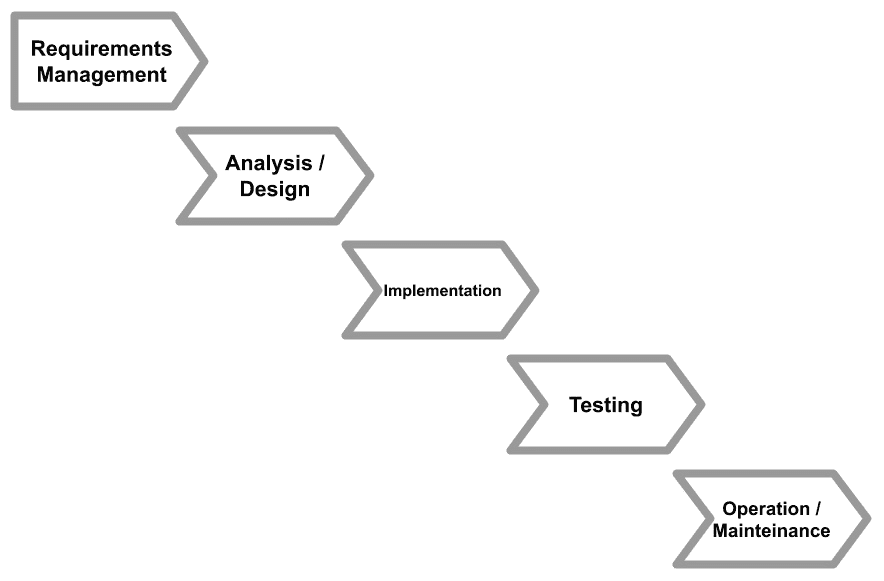

# 第五章：探索最常见的开发模型

在本章中，我们将把我们之前讨论的一些概念定位在一个更完整的画面中。我们将详细阐述最常见的开发模型。我们已经看到了设计适当架构的重要性，如何收集需求，以及如何将架构思想转化为满足这些需求的代码解决方案。

本章中我们将看到的软件开发模型围绕所有这些方面（以及更多），以适当和经过测试的方式安排它们，以实现不同的结果或强调某些领域。

在本章中，我们将涵盖以下主题：

+   学习代码和修复

+   简要了解瀑布模型

+   理解敏捷方法论

+   介绍精益软件开发

+   探索 Scrum

+   学习其他敏捷实践

+   理解 DevOps 及其相关技术

当今天讨论开发模型时，每个人都会全力以赴地采用**DevOps**和**敏捷**技术。虽然我确实支持对这些方法的热情，但我的个人经验告诉我，在所有不同的环境中正确应用它们并不那么容易。因此，了解许多不同的方法并尝试从每个方法中获取关键教训是很重要的。即使你没有与 DevOps 一起工作的理想条件，这并不意味着你不能使用与之相关的某些好想法。

在本章结束时，你将了解最广泛使用的开发模型及其优缺点概述。这将帮助你根据项目需求选择正确的模型。

但首先，让我们从天真的发展模型（或者如果你愿意，一个**非模型**）开始，即**代码和修复**。

# 学习代码和修复

让我尽快切入正题——代码和修复不是一个模型。它更像是无政府状态。这里的整个概念是没有任何计划地直接进入编码。因此，它被称为代码和修复。在这个过程中，你完全跳过了迄今为止强调的所有关键阶段（需求收集、架构设计、建模等）并开始编码。

然后，如果事情出错，比如有错误或软件表现不符合预期，你开始修复。没有专门的时间来编写文档，也没有时间用于**自动化**和**单元测试**。代码的版本控制是天真简单的，模块之间的依赖关系也是如此（或者可能一切都只是在一个巨大的模块中）。

如您所想，采用这种非模型几乎没有任何优势。让我们从（显然的）缺点开始：

+   你基本上是在与任何将维护代码的人（可能是你未来的自己）作对。你将快速修复和应急措施粘入代码，当你再次需要修改它时，这些措施会反过来咬你。这种现象通常被称为**技术债务**。

+   由于你没有正确分析需求，你可能会浪费精力在开发对客户和最终用户没有任何价值的特性上。

+   由于没有明确的职责划分（因此，代码和修复也被称为**牛仔式编码**），团队内部开发者之间以及与外部团队之间的协作很困难。

+   预估完成一个发布所需的时间很困难。

因此，可以说采用代码和修复根本不可取。但令人惊讶的是，它仍然非常普遍。以下是其广泛应用的主要原因：

+   没有指定角色（或只有一名开发者）的小团队

+   技能和经验不足

+   时间不足（这根本不是借口，因为一点结构可能无论如何都会节省时间）

然而，当处理不需要任何维护或演化的非常小的项目时，如原型或寿命有限的明确、短期项目时，代码和修复可以部分合理化。

在深入研究更复杂和完整的技术之前，也值得注意，采用这样的方法并不能保证项目的成功，实施 Scrum、DevOps 或任何你喜欢的方法也不一定是避免技术债务的完美方式。事实上，软件开发方法只是对如何在项目上给出节奏以及角色和责任的合理划分的建议，正如在其他项目中看到的那样。但最终，项目团队（以及作为架构师的你）的责任是确保（如果有的话）方法正确使用，并且没有遗漏任何部分，无论是技术债务、代码质量还是项目进度。

话虽如此，代码和修复之后的自然步骤是提供一些结构化的顺序，这被称为**瀑布**模型。

# 简要看看瀑布模型

正如所说，瀑布模型是一种基于不同阶段序列的结构化开发模型。这意味着每个阶段都是在前一个阶段结束后开始的。

瀑布模型可能源于来自其他类型项目（如建筑或制造物体）的项目管理实践的运用。确实，虽然我不是这方面的专家，但很容易理解，为了建造房屋，你必须精确地遵循一系列步骤，例如计算材料和重量、建造地基和建造墙壁。

瀑布模型起源于多篇文章和讲座（其中最重要的是来自温斯顿·罗伊斯的文章）并且已经被**美国国防部**的官方文件所认可。

瀑布模型中的阶段如下：

+   **需求管理**：根据*第二章*，“软件需求 – 收集、记录、管理”，你可能对这一阶段的内容有很好的理解。在瀑布模型中，需求规范必须完成并正式接受后，才能进入下一阶段，而我们讨论了通常情况下，迭代方法更为自然。

+   **分析/设计**：有时被定义为两个不同的阶段，目标是始于系统需求，然后定义满足这些需求的解决方案架构。与前几个阶段一样，负责下一阶段的人必须正式接受来自这一阶段的可交付成果（如系统蓝图、图表和伪代码），以便流程继续。这基本上意味着开发者必须清楚地了解他们应该实施的内容。

+   **实施**：在这个阶段，开发团队从需求和前一阶段产生的可交付成果开始，必须编写代码以实现适当的软件解决方案。这个阶段当然是至关重要的，而这个阶段的正确完成基本上意味着整个项目的成功。

+   **测试**：如前所述，来自前一阶段的可交付成果的接受是每个阶段的一部分。测试的批准非常重要（并且非常复杂），以至于它与整个阶段重叠。瀑布模型没有明确区分不同类型的测试，但这个阶段通常被理解为**用户验收测试**。

+   **运维/维护**：这是最后一步，通过技术活动确保在生产环境中正确设置解决方案，以及所有计划内和计划外的活动，以保持其正常运行。

下面的图表展示了瀑布模型的阶段：

图 5.1 – 瀑布阶段

如你所见，瀑布模型从代码和修复开始时是一个大的跳跃，因为我们开始看到每个阶段应该做什么的更清晰的区分。

## 瀑布模型的优缺点

瀑布软件开发模型仍然被广泛使用。该模型的一些优点如下：

+   阶段有明确的定义，因此规划相对容易。尽管阶段不应该重叠，但它是按顺序进行的。

+   这种机制鼓励团队之间进行适当的移交，包括一个阶段与下一个阶段之间的正式接受，从而在规划和项目质量上提供更大的控制。

然而，正如你可能已经知道的，这种方法有一些缺点：

+   第一个也是最明显的缺点是缺乏灵活性。如果你完全实施瀑布模型，你应该在收集到所有需求并完成设计之前不要开始实施。在现实世界中，这种情况不太可能发生；正如我们所见，需求收集持续进行，架构设计在我们面对（并解决）实施问题时不断演变。

+   此外，我们构建的软件在实施完成后才会被查看和测试。这意味着你将在项目后期（可能太晚）才会收到关于你代码的反馈。

因此，瀑布模型已经经历了多次转变，通常是通过缩短反馈循环，或者在不同阶段（如实施时添加更多需求或在测试阶段管理发现的缺陷）之间循环和跳跃。但尽管这个模型仍在使用，现在更灵活的方法已经广泛流行，因为它们提供了一种更安全的发展方法，而这一切都始于敏捷方法论。

# 理解敏捷方法论

**敏捷**方法论是一个最佳实践和技术的大成。许多至今仍在广泛使用的敏捷方法（如**Scrum**和**Kanban**）都受到了敏捷的启发，但运动的官方起源来自 2001 年发布的*敏捷宣言*。*敏捷宣言*的四个非常流行的关键概念（价值观）如下：

+   *个人和团队互动* 胜过流程和工具

+   *工作软件* 胜过全面文档

+   *客户协作* 胜过合同谈判

+   *对变化的响应* 胜过遵循计划

虽然前面的一些观点可能会被误解并导致不良行为，例如放弃文档和计划，但思考这样简单而有力的建议是有启发性的。同时，请注意，宣言本身反对完全的无政府状态，如下面的注释所示：

*"虽然右边的项目有价值，但我们更重视左边的项目。"*

重要提示：

这里左边的价值观是每个价值观开头提到的，指的是*自由*（如工作软件），而右边的价值观是结尾提到的，指的是*纪律*（如全面文档）。

这一部分通常是敏捷方法论研究团队用来跳过开发过程中枯燥部分的一个借口。敏捷过程重视自由，但并不排除一定程度的秩序。

在介绍敏捷主题时，还有一个非常重要的观察需要提出。敏捷方法论，以及本章中描述的所有实现，都认为让客户（或者说，支付项目费用的业务所有者，换句话说，即客户）了解该方法并愿意成为其中一员至关重要。确实，在接下来的*敏捷原则*部分，我们可以看到涉及客户的建议和原则，因为他们是软件开发项目中的积极参与者，在过程的许多步骤中提供输入和反馈。因此，如果客户不同意（无论是隐含的还是明确的）采用敏捷实践，那么敏捷实践的采用将是不可能的。

*敏捷宣言*通过提供一系列原则进一步详细阐述了敏捷的基本价值观。

## 敏捷原则

与瀑布模型相反，敏捷将一切押在协作上（不仅在团队内部，还包括与客户）并经常发布小块可工作的软件，目的是尽早获得反馈并在必要时调整计划。敏捷团队不是试图预见一切并相应地制定计划，而是专注于快速适应变化条件并随后采取行动。这一点在敏捷原则中得到了很好的阐述：

+   我们最高的优先级是通过早期和持续交付有价值的软件来满足客户。

+   欢迎在开发后期甚至更晚的时候改变需求。敏捷流程利用变化为客户的竞争优势服务。

+   频繁交付可工作的软件，从几周到几个月不等，更倾向于较短的时间尺度。

+   商业人员和开发人员必须在整个项目期间每天一起工作。

+   围绕有动力的个人构建项目。为他们提供所需的环境和支持，并信任他们完成任务。

+   在开发团队内部以及团队之间传达信息的最高效和最有效的方法是面对面的交流。

+   工作软件是衡量进展的主要标准。

+   敏捷流程促进可持续开发。

+   赞助商、开发人员和用户应该能够无限期地保持恒定的速度。

+   不断关注技术卓越和良好的设计可以增强敏捷性。

+   简单性——最大化未完成工作量的艺术——是至关重要的。

+   最好的架构、需求和设计来自自我组织的团队。

+   团队会定期反思如何变得更加高效，然后根据反思结果调整和调整其行为。

正如你所看到的，这些原则强调了其他最佳实践，例如关注良好的架构、优先考虑简单解决方案和构建有动力的团队。当然，这些都是一般想法。在宣言发布前后，围绕类似主题建立了一系列实践。在下一节中，我们将讨论精益软件开发，这是一种经常与敏捷开发相关联的实践，其根源在制造业。

# 介绍精益软件开发

**精益软件开发**是在同名的制造方法之后发展起来的一个框架，而这个制造方法反过来又是从**丰田生产系统**中衍生出来的。关于这个话题的一个有趣的概念，确实是如何将工业生产中的最佳实践转化为软件生产中的最佳实践。这也归功于一位作者（玛丽·波彭迪克）在这个领域的经验。她在制造业工作，并有机会直接在工厂环境中了解生产流程。

在接下来的几节中，我们将快速介绍精益软件开发的原则。

## 消除浪费

浪费是一个直接从丰田生产系统中演变而来的概念。基本上，浪费是指那些没有为最终产品提供任何价值的资源消耗。

将其推向极致，在软件开发中，与分析和编码无关的一切都可能是一种浪费。这可以被视为敏捷原则中**简单性**的另一个观点。

为了在软件开发中识别浪费，精益软件开发建议关注其七个主要领域：

+   **部分完成的工作**：这个领域与未完成或未发布的特性相关。这意味着积累代码，这些代码需要维护，但不会为最终客户提供任何效用。此外，由于未完成的工作从未在生产中得到验证，你永远无法 100%确信一切按预期工作。你还应考虑这样一个事实，即我们正在生产中构建的软件的发布是我们理解此类代码是否有价值的唯一途径。

罗恩·科哈维（Ron Kohavi）的一篇著名论文指出，仅有一分之一的三分之一的实现功能提供了积极影响，而其余的则是中性的，甚至可能是负面的。唯一找出答案的方法是将代码发布到生产环境中，并观察实际使用该代码的客户的反馈。

+   **额外流程**：这指的是官僚主义。这意味着文书工作、审批流程以及类似的问题。我们都知道有些事情是跳不过去的，比如安全清单和生产发布的交接文件。然而，通常这些流程过于复杂和过度工程化。这个领域应该考虑简化或甚至自动化。例如，与其手动回答与安全相关的问题，不如运行自动化测试。

+   **额外功能**：这是一个非常常见的陷阱。也许在需求分析中，我们只是不断地推陈出新，而没有具体考虑这些功能是否有用。或者，在实现新功能时，添加一个类似的功能可能非常容易，尽管没有人要求，但“迟早可能有用”。这是错误的。即使代码添加起来很容易，也必须维护，否则可能会引入潜在的错误。

+   **任务切换**：现在，众所周知，上下文切换是耗时的。这在软件开发中尤其如此，因为你有很多事情要处理，从设置环境（尽管这可以，也应该自动化），到关注项目结构和代码标准，再到回忆团队动态和最新更新。这基本上就像看起来那么痛苦，但同时又非常诱人，一次处理多个项目。

+   **等待**：这是一个非常常见的事情，与之相关。我们最终会因各种原因而等待，例如环境创建和分析完成。虽然可以通过自动化减轻技术问题，但从项目管理角度来看，确保团队之间同步移交要困难得多。为了对抗等待，你可能（或被迫）帮助其他任务和项目，而这很容易转变为其他浪费（如前所述，任务切换并不是最好的主意）。

+   **运动**：如前所述，我们存在不同团队之间的移交。这就是“运动”的概念。耗时越长，浪费就越多。这包括大量的来回移动，或者简单地有太多的团队合作。移交不仅包括交换工件（如源代码），还包括一般性的知识（如文档或简单的答案）。

+   **缺陷**：每个人都知道什么是错误，以及找到原因和解决它需要多少时间。当然，不写任何错误的软件是不可能的。但你可以做一些事情来减少错误的影响，例如提高测试覆盖率（包括代码分析），这样就可以在问题变成滚雪球效应之前识别出问题，从而节省时间。此外，正如已经讨论过的，你越早进入生产阶段，就越早发现错误（并且有机会丰富你的测试套件）。

为了识别软件生产周期中的浪费，精益软件开发框架提供了一个非常有用的工具，称为**价值流图**。

价值流图用于从外部视角观察软件开发过程，映射出需求从构思到生产发布（通常称为上市时间）所需的所有步骤（以及它们之间的等待时间）。

你应该用纸和笔简单地追踪这一点。在追踪整个软件周期之后，你通常会发现自己大部分时间都浪费在等待或其他类型的浪费上，正如之前所列出的。现在你有一些定量数据，有了良好的执行支持，你可以通过改变流程来最大化交付价值的时间，并最小化浪费。这通常包括简化审批流程和自动化手动步骤。这里可以达到的效率是令人震惊的。

## 尽可能晚做决定

这一节主要关于对变化持开放态度。特别是在做出昂贵的决策时，尽可能推迟决策是明智的，因为可能会有更多信息出现来支持这个决策。此外，晚些时候做出决策将减少因决策错误而需要重新做部分工作的风险。

然而，这个原则还有更多微妙的影响。我想起的是唐纳德·克努特的一个神话般的引言：

“过早优化是万恶之源。”

这意味着如果你过早地做出选择（尤其是难以撤销的选择），你可能会因为信息不足而做出错误的选择，或者简单地浪费时间在一个最终可能不那么相关的主题上。因此，精益软件开发框架的一个强烈建议是，除非你真的需要，否则不要对一切做出承诺，保持开放和灵活，并在没有其他选择之前推迟做出复杂的决策。

在软件世界中，实现这一目标有几种不同的方法，例如使用存根而不是真实系统（在决定使用哪个系统之前），定义模块化选项（以方便不同实现的切换），以及使用功能标志（在生产环境中直接引发特定行为）。只需确保你找到正确的权衡，避免浪费的堆积。因为你不知道最终的决定会是什么，所以实施数十种不同的行为当然不是一种选择，但也有一些折衷方案。

一个经验法则是通常避免提前数年或数月进行规划。最好是最终对即将到来的几周有非常详细的规划，随着时间的推移，这些规划将变得越来越不详细。

## 尽可能快地交付

这是一个我强调了很多的概念，所以我会尽量让它尽可能简洁。将交付工作组织成小块是关键。这就是“快”所指的。你必须计划经常发布。这将有助于尽早获得反馈，并在过程中完善你的策略。

这里有一些建议，比如保持定期发布（无论是从时间窗口还是从功能数量来看）以及从推式方法转向拉式方法（当我们讨论*看板板*部分时，会有更多关于这个的内容）。我个人认为最重要的事情是避免让团队过度负荷。保留一些额外的容量将允许团队更有效地工作。

## 优化整个产品

如前所述，优化可能很有吸引力，但并不一定是答案。这里的思考是将过程（和系统）作为一个整体来考虑。仅仅优化一个子部分（或子过程）确实可能会对最终结果产生不利影响。让我用两个实际例子（在过程和系统领域）来解释这一点：

+   可能会诱使人们为了缩短上市时间而减少测试阶段。然而，如果你有一个整体的方法，修复错误所花费的时间可能会比节省的时间更多。而且，我们还没有考虑到错误的影响，比如停机时间、声誉受损和客户流失。

+   你可能会考虑以多种方式优化应用程序的磁盘使用，比如压缩文件或使用特殊格式（如二进制）。但这当然可能会以读取速度变慢为代价，所以总的来说，可能不是一个好主意。

## 精益开发的优缺点

正如我们所看到的，精益是敏捷概念的第一个实际应用。因此，与更结构化的方法论（如我们已经看到的瀑布模型）相比，其优势是明显的：

+   更大的灵活性，意味着对计划和需求的变化有更好的容忍度

+   为团队提供更大的自由度，他们可以选择适合他们的本地方法，即从技术和组织观点来看

+   更短的反馈周期，这意味着更快的上市时间和更早地了解你的软件性能（如在第*第四章*中讨论的，*设计和开发最佳实践*，当谈到最小可行产品时）

精益开发的缺点肯定会因团队构成和项目复杂度而异。以下是一些常见的例子：

+   精益更多是一套原则（敏捷原则更广泛集合的一部分），而不是一个结构化的方法论。这意味着结果可能不太可预测。

+   作为进一步的后果，它通常不适用于技能较低的团队，因为它需要高度的成熟度，并将决策权极大地委托给每个团队成员。

+   在大型项目的案例中，由许多小型精益团队协作的模块化已经完成，而方法论可以很好地扩展。同时，也很难跟踪整体情况，并在每个团队和子项目之间进行同步。

+   尽可能晚做决定意味着一些架构决策被推迟得太久。结果，时不时地，可能需要进行一些返工（因为选择错误或简单地缺乏选择）。

在本节中，我们了解了精益软件开发，这是一个充满好想法、实践和工具的框架。

我们已经看到了许多有价值的想法的概述，例如减少浪费、对变化的开放性、整体优化和快速反馈循环。

请记住，敏捷谱系中不同的哲学之间有一些重叠和相互影响。现在让我们转向另一个广为人知的——Scrum。

# 探索 Scrum

**Scrum** 方法论由 Ken Schwaber 和 Jeff Sutherland 在 1995 年发表的一篇论文中推出。作者们后来也参与创建了 *敏捷宣言*，因此其中一些想法是直接相关的。

Scrum 与精益软件开发略有不同，因为它不仅仅关注原则和高级建议，而是直接聚焦于角色、项目节奏（通过所谓的 *事件*）和规则。作者强调，虽然你可以稍微定制这项技术，但 Scrum 的意图是 *全有或全无*，这意味着在开始 Scrum 项目之前，你应该接受并实践所有关键组件。

Scrum 指的是橄榄球的一个阶段，并被视为一个团结的、跨职能的团队，共同推动以追求共同目标。

在本节中，我们将看到 Scrum 的基本要素：团队构成（角色和职责）、事件（Scrum 项目的会议和其他关键预约），以及工件（支持 Scrum 方法的工具）。

让我们从团队设置开始。

## 理解 Scrum 团队

Scrum 团队是一种自给自足的生态系统。这意味着拥有交付任务所需的所有技能（或者说，成为一个跨职能团队），并且能够自我组织（只要团队能满足期望，它就可以遵循自己的规则）。Scrum 方法确定了三个主要角色：**Scrum 大师**、**产品负责人**和开发团队成员。

### 开发团队

开发团队，正如你可以想象的那样，是那个将任务 *亲手完成* 的团队，以实现和可测试的功能的形式。按照设计，这是一个扁平化的团队（不允许有等级或子团队），并拥有完成任务所需的所有技能（这意味着你可以假设它不仅包括开发者，还包括安全专家、数据库管理员以及所有其他可能需要的人）。

如前所述，开发团队在技术选择方面是自治的，但（作为一个整体）对选择的结果负有责任。当 Scrum 应用于大型企业环境时，主要讨论之一是开发团队。确实，企业通常有一系列必须遵守的指南和政策，从这一意义上讲，它们限制了开发团队的自由。此外，对不同类型技能的需求可能导致团队组成的变化（人员临时在不同项目之间移动），这是一个有时需要促进和监控的机制，因为可能会发生时间冲突。

### 产品负责人

**产品负责人**基本上负责开发节奏。产品负责人是那些从一系列待办事项（也称为产品待办事项，如我们在*第四章*，*设计和开发最佳实践*中简要提到的，当讨论用户故事映射时）中选择工作项的人，并了解哪些项必须实施以及何时实施。

我们将在“理解 Scrum 工件”部分中很快更多地讨论产品待办事项，但就目前而言，你可以想象这项任务在客户期望方面是多么关键，以及选择具有正确理由的任务以最大化整体吞吐量是多么重要。

### Scrum Master

**Scrum Master**基本上是 Scrum 方法论的赞助者和倡导者，无论是在团队内部还是在组织外部。他们的角色是指导团队成员中的初级成员，以及通常不是该方法专家的任何人。

如果组织正在大规模采用 Scrum，所有 Scrum Master 都将创建社区交流如何更好地实现结果的最佳实践。Scrum Master 负责通过绕过阻碍团队充分发挥潜力的障碍来促进团队成员的工作。Scrum Master 和产品负责人是两个不同的角色，应由不同的人担任。

在下一节中，我们将探讨 Scrum 事件。

## 了解 Scrum 事件

**Scrum 事件**是制度化的项目重复预约，设定了整体实施的节奏。

Scrum 事件通过提供规划、执行和审查需要完成的工作的机会，对于项目的成功至关重要。

在 Scrum 中，衡量这种节奏的基本单位是冲刺。

### 冲刺

Scrum 中的**冲刺**是一个重复的迭代，将一组开发活动的时间框定。冲刺通常被视为一个迷你项目，时间框架为 2-4 周。在冲刺期间，有一组固定的目标，不能更改，并且它们是从开发团队中选择出来的，方式是他们想要的。

Sprint 本质上用于通过频繁地以小批量发布可工作的软件来实施敏捷的最佳实践，以迭代方式工作。这当然非常有用，可以降低风险。如果优先级发生变化，或者发生其他问题，从资源角度来看，你最大的风险是失去一个 Sprint 的工作量。

### Sprint 规划

**Sprint 规划**当然是一个会议，整个 Scrum 团队聚集在一起，选择在特定 Sprint 期间要完成的工作。产品负责人通过查看产品待办事项来明确优先级和要实现的功能。然后，根据开发团队（并由 Scrum Master 协助），定义**Sprint 目标**。

Sprint 目标通常是一个或多个一致的功能，代表着 Sprint 的目标。Sprint 目标随后被定义为一系列可工作的项目，这些项目是从产品待办事项中挑选出来的。这些项目以及实现它们的方式（这是开发团队负责定义的），构成了 Sprint 待办事项。

### 每日 Scrum

**每日 Scrum**是开发团队在 Sprint 的每一天举行的简短会议。它通常在一天的工作开始时进行，持续时间为 15 分钟（这只是一个经验法则的时间段；它可能更多或更少地取决于团队规模和项目复杂性）。Scrum Master 和产品负责人可以加入，但会议由开发团队领导。

目标是坚持 Sprint 规划。虽然没有固定的议程，但它通常旨在回顾前一天的活动，规划当天的活动，并解决可能危及 Sprint 目标的任何问题。理想情况下，每日 Scrum 应该是当天唯一的同步会议，从而提高开发团队的效率。然而，在现实世界中，开发团队为了解决特别复杂的问题而进行后续会议并不罕见。

每日 Scrum 也被称为*站立会议*，这个名称也用于其他敏捷项目管理方法。其背后的原因是（理论上）它应该站立进行，这进一步激励参与者使其更快（在无聊的会议中站立一小时会感到不舒服）并保持活跃，在会议中参与。

### Sprint 回顾

**Sprint 回顾**是在每个 Sprint 结束时举行的定期会议。整个 Scrum 团队都参与其中，相关业务利益相关者由产品负责人邀请。如果可能的话，开发团队会对 Sprint 期间实施的内容进行演示。然后，有一个问答环节来解决疑问并讨论任何出现的问题。

这也是一个根据当前情况讨论产品待办事项的机会。这也可能包括改变优先级。还可能发生其他*全员*讨论，例如预算、规划、资源和类似话题。所有这些互动通常为下一个 Sprint 规划提供了宝贵的输入。

### Sprint 回顾

**Sprint 回顾**是一个持续几小时的会议，在 Sprint 评审之后和 Sprint 规划之前举行。会议涉及整个 Scrum 团队。目标是关注通过查看上一个 Sprint 来关注做得好的地方和需要改进的地方。这次会议通常更关注流程、工具和团队互动。这也常被用作团队建设活动。

值得注意的是，审查和回顾之间存在差异。Sprint 审查关注的是已经实施的内容（产品）；它包括一个演示，业务利益相关者出席并积极参与其中。焦点是*我们做了什么*。在回顾中，业务利益相关者可能被邀请也可能不被邀请，焦点是*我们是如何做到的*。换句话说，焦点在 Scrum 团队、互动和流程上。我们可能会讨论采用的工具、框架的选择、架构，或者简单地讨论我们对我们上一个 Sprint 中工作方式的喜好和不喜欢。

Sprint 回顾符合大多数敏捷方法的一个共同目标，即持续改进。我们将在讨论 Kaizen 时回到这个概念。

### 待办事项细化

**待办事项细化**通常是一个持续的过程，而不仅仅是固定的会议。细化的目标是审查产品待办事项（项目的待办清单；在*理解 Scrum 工件*部分将有更多介绍）。这是由产品负责人和开发团队（或开发团队的一部分）完成的。他们合作细化事项（基本上，分析技术方面和重新审视需求）并细化估算（这是开发团队的责任）。

可能会发生优先级转移。通常，优先级最高的项目（可能在下一个或两个 Sprint 中发生）应该是更清晰的，而低优先级的项目则预期会再次审查。在实践中，这些活动通常由团队在每个 Sprint 的一个或两个固定会议中完成。Scrum 建议在这个意义上使用团队不到 10%的产能。

在下一节中，我们将学习关于 Scrum 工件的内容。

## 理解 Scrum 工件

**Scrum 工件**是支持 Scrum 活动的工具。这种方法论将此类工具作为实现透明度的一种方式。在这种情况下，这些工件应该对所有团队和相关的利益相关者都可用。

虽然数字支持被广泛使用，但使用物理物品（如白板和便利贴）来鼓励头脑风暴和面对面协作的做法也很普遍。使用物理工具完成的工作应该随后数字化以进行跟踪和共享。现在让我们看看这些工具是什么，从产品待办事项开始，然后是 **冲刺待办事项**。

### 产品待办事项

我们已经多次提到 **产品待办事项**，所以现在你可能已经对它有一个大致的了解，或多或少。简单来说，产品待办事项是产品中每个应该发生的事情的唯一真相来源，意味着新功能、错误修复和其他开发（改进、重构等）。

这些项目被分类，包括描述、唯一 ID、优先级和所需的工作量。工作量由开发团队不断评估和细化。产品待办事项中的项目可以附加到测试用例和其他细节，如原型和更多。最终，产品负责人对产品待办事项负责。

由于产品待办事项是吸收开发团队要实现请求的漏斗，它可以被视为一个 *无限滚动条*，这意味着新项目将不断添加到其中。正如在 *第四章* 中讨论的，*设计和开发最佳实践*，**用户故事映射**技术可以被视为产品待办事项的一种变体或演变，为它增加了更多的信息和维度。

### 冲刺待办事项

**冲刺待办事项**是每个冲刺期间要完成的工作部分。它包括以下内容：

+   **冲刺目标**，即我们希望通过冲刺添加到产品中的功能（子功能或功能集）

+   从产品待办事项中选出的需要实现以达成冲刺目标的一系列项目

+   在冲刺期间实施这些项目的计划

这就是在 Scrum 中保持工作以一致速度结构化的方式。

## Scrum 的优缺点

到目前为止，应该很明显，Scrum 是一个非常结构化的方法论（同时仍然保持灵活性和遵循敏捷原则）。因此，它非常普遍，以至于有专业的认证和大量的 Scrum 专业人士职位。

采用 Scrum 的主要优点可以概括如下：

+   角色和职责定义得非常明确，减少了冲突和误解的可能性。

+   我们已经多次提到 **产品待办事项**，所以现在你可能已经对它有一个大致的了解，或多或少。简单来说，产品待办事项是产品中每个应该发生的事情的唯一真相来源，意味着新功能、错误修复和其他开发（改进、重构等）。

+   制定计划（即使有一些预期的灵活性和不准确性）并持续了解已完成的工作和剩余的工作几乎成为常态（这也得益于回溯和 Scrum 工件的概念）要容易得多。

Scrum 的缺点与其他敏捷和精益方法中的缺点相似。以下是一些想法：

+   结构化的流程和事件可能会被视为无聊且耗时，尤其是在与经验丰富的团队或长期项目合作时。

+   协调多个在不同项目上工作的 Scrum 团队可能会很复杂。

+   大型团队（人数超过九人）通常在 Scrum 设置中工作效果不佳（因此，它们应该被模块化成更小的团队，并且协调将是一个缺点，正如前一点所述）。

正如你在本节中学到的，Scrum 是一种简单但纪律严明的软件开发过程结构化方法。由于其简单性和有效性，它已经得到了广泛应用。因此，我希望本节中分享的信息能够激励你进一步学习并将 Scrum 原则应用于你的项目。

在下一节中，我们将看到一些更多与 Scrum 或任何其他特定框架没有直接联系但经常互补使用的敏捷实践。

# 了解其他敏捷实践

到目前为止，我们已经看到了敏捷方法，并对精益软件开发原则和 Scrum 框架进行了快速概述。所有这些想法通常都辅以许多有助于完成特定阶段的做法和工具。

在本节中，我们将了解一些这些工具，即：改善、规划扑克、看板和燃尽图。

让我们从改善开始。

## 改善

**改善**是一个直接从丰田生产系统借用的原则，正如我们所看到的，它是精益软件开发的核心灵感来源。*改善*这个词来自日语，意为*持续改进*。

这个简单概念是改善的精髓，它通过一个全面而优雅的哲学来阐述它，体现了工作场所人性化、持续变化（与大规模变革相反）的概念。它还负责识别和消除浪费（正如我们在*介绍精益软件开发*部分所讨论的），鼓励有价值的反馈（内部和外部），让组织中的所有个人（从高层管理者到基层）都参与进来，等等。

改善的另一个核心概念（再次，与迄今为止看到的某些敏捷原则非常接近）是在测试过程中（从广义上讲，即在检查产品质量时）从生产结束时转移到持续的过程，再次尽早获取反馈以最小化偏差并促进持续优化。

改善通常被编排为五个重复阶段的一个循环：

1.  **观察**：这个阶段用于了解应该解决哪些问题（或哪些方面可以改进）。

1.  **计划**：这个阶段用于设定可衡量的目标。

1.  **执行**：这个阶段用于实施行动以满足那些可衡量的目标。

1.  **检查**：这个阶段用于比较实际结果与预期目标。

1.  **行动**：这个阶段用于调整（或补充）计划以增强结果并再次开始循环。

下面的图表说明了这些阶段：

![Figure 5.2 – The OPDCA loop]

![img/Figure_5.02_B16354.jpg]

图 5.2 – OPDCA 循环

虽然如“持续改进”概念所总结的那样，改善（Kaizen）包含了许多睿智的建议和想法，非常接近精益和敏捷的整体理念。

## 计划扑克

**计划扑克**是一种估算技术，通常作为 Scrum 框架的一部分（但不是框架本身的强制性部分）。当在 Scrum 中使用时，计划扑克作为冲刺计划的一部分进行，以估算（或细化对待办事项中项目的估算）。

计划扑克是一种获取给定项目工作量估算的方法，它通过激励参与者提供一个不受其他团队成员影响的规模来实现。

扑克是由估算团队（通常是开发团队，他们将实现功能）主持人以及一个负责的项目参与者（如果使用 Scrum 方法，通常是产品所有者，否则是了解整个项目和路线图的人，如项目经理或其他高级人员）一起玩的。

每个估算团队成员都有一副卡片（或通常是一个移动应用程序），用于表示难度等级。这里没有标准；通常使用斐波那契数列，但效果可能因人而异。斐波那契数列有其背后的原因：数字越大，它们之间的距离就越远，因此你的选择必须更加谨慎。另一个常用的单位是 T 恤尺码（*S*，*M*，*L*，*XL*等等）。

此外，所表达的价值（无论是卡片、数字还是 T 恤尺码）可以直接映射到时间（例如实现所需的天数）或不能。

当会议开始时，主持人充当记录员和司仪。他们阅读每个要估算的功能，并开始讨论，通过包括估算者和产品所有者来阐明意义。然后，估算者同时选择一个单位（通过抽卡片、选择数字或大小），以表明估算的难度。如果没有达成共识，最高和最低估算的所有者必须解释他们的观点。然后，每个人都再次抽卡片，直到达成共识。共识规则可以自定义，例如，有一个定义的最大差距从完美的平均值或有一个将拥有该开发的团队成员同意什么是一个可接受的停止点。

## �看板板

在软件开发世界中，**看板板**是一种表示项目从摄入到开发团队到实施流程的视觉方式。它是**价值流图**（如*介绍精益软件开发*部分所示）的一个子集。看板确实受到了丰田生产系统的启发，并进行了调整。

在其简单实现中，看板板是一个白板（物理或数字），由三个垂直泳道将其分为**待办**、**进行中**和**完成**。每个项目都表示为在那些泳道之间移动的便签。然而，通常通过添加不同的列（例如将**进行中**分为**设计**、**编码**和**测试**）或水平泳道（通过为紧急事项如生产问题设置一种快速通道来表示优先级等概念）来定制它。以下图展示了这一点：

![Figure 5.3 – A Kanban Board]

![Figure 5.03_B16354.jpg]

图 5.3 – 看板板

看板板只是更大哲学（看板）的一部分，该哲学应用于软件开发和工业生产（如精益）。

虽然描述整个哲学超出了本书的范围，但至少有两个概念值得提及。第一个是**工作在进度中**（**WIP**）。这是团队正在工作的开放项目数量。WIP 很容易在板上跟踪和可视化。根据精益方法，看板建议避免使用上下文切换；因此，WIP 的约束应始终存在。

另一个重要的概念是**拉动**。基本上，看板方法将工作项置于开发团队的处置之下（在**待办**列中）。与推动范式相反，团队根据自己的节奏选择（拉动）要做什么。这避免了团队资源过度占用并最大化了吞吐量。

## 燃尽图

**燃尽图**是一种常见的工件（物理或数字），可以清楚地显示项目的进度。无论使用哪种敏捷方法，它都非常有用，因为它提供了对计划的实时洞察。正如之前提到的，敏捷反对详细的、高级的计划，因此拥有项目进度的当前快照（以及可能的一些预测）对管理来说非常宝贵。

燃尽图将任务（通常作为所需努力的总和）作为垂直轴，将时间线作为水平轴。从左上角（项目开始）到右下角（项目完成）画一条线，提供理想的线性进度。在固定的时间（如每天或每个 Scrum 冲刺结束时），画一个点，该点穿过已实施的任务和当前的时间点。以下图是燃尽图的示例：

![Figure 5.4 – A Burndown chart]

![Figure 5.04_B16354.jpg]

图 5.4 – 燃尽图

如您所见，通过在这些点上画线，您可以比较理想的项目进度与实际项目进度的对比。粗略地说，如果实际项目进度高于理想进度，您可能已经落后了；而如果低于理想进度，您则领先。与理想进度保持最小偏差意味着保持进度，这通常是项目健康状况的良好指标。此外，它还提供了关于项目（至少是代表的任务列表）何时完成的良好提示。

在本节中，我们看到了一些优秀的工具列表，这些工具可以在敏捷软件开发中为您提供支持。无论您使用的是哪种方法，如果有的话，这些工具在解决常见用例（如优化流程和估算开发工作量）时都很有用。

在下一节中，我们将讨论一个非常热门且备受争议的话题，这个话题似乎最近受到了所有关注——DevOps。

# 理解 DevOps 及其相关概念

在撰写本文时，**DevOps**是一个被过度炒作的术语。它被视为解决所有开发问题的银弹，以及被认为是酷的必要前提。我不会减少对 DevOps 的炒作，因为我真正相信它是一种宝贵的技巧，有助于确保功能强大且高效的团队。然而，必须说，DevOps 更是一套最佳实践，而不是一套规范化的、神奇的秘方。而且，在这些情况下，一种方法并不适合所有人。

DevOps 可以被视为敏捷方法的本质延伸。确实，采用敏捷实践（不是特定的一个）可以被视为 DevOps 的先决条件。反过来，DevOps 被认为是采用尖端方法（如**微服务**，更多内容见*第九章*，*设计云原生架构*）的必要条件。

DevOps 的基本特征是不同角色之间的合作。在实践中，这通常意味着一个小型团队，包括构建和维护生产中软件产品所需的所有不同技能。

在本节中，我们将探讨 DevOps 运动的一些核心方面，例如团队构成、角色和职责以及 DevOps 的变体，这些变体涉及在协作方法中包含更多功能。但让我们从一个在 DevOps 中常见的关于团队规模的考虑开始。

## DevOps 团队规模

当谈到团队规模时，敏捷指南指出，团队应该足够小以保持精简，但又足够大，以便在每次冲刺中开发合理数量的功能。一个常见的经验法则是拥有大约 10 人或更少的团队。

这个经验法则被普遍接受，在其他故事中也有回响，比如著名的“两个披萨团队”，它指出应该能够用两个大披萨来喂养团队（所以，再次强调，大约少于 10 人）。

这取决于链接的逻辑。在一个功能团队中，每个团队成员都应该与其他成员有联系。这意味着在一个 10 人的团队中，你将有 90 个链接。这就是为什么团队不应该增长得太大，否则你将不得不管理太多的内部互动，这很快就会影响生产力。

*但内部团队的责任怎么办呢？*

## DevOps 团队中的角色和责任

正如其名称所示，DevOps 旨在模糊开发者和运维之间的责任界限。这并不意味着每个人都应该能够做任何事情；这更多的是关于有一个共同的目标。

IT 团队中最令人讨厌的动态之一是问题发生时的缺乏责任。

最常涉及的团队是运维，他们是负责基础设施（以及生产系统的正常运行时间）的运维和系统工程师，以及开发者，当然是开发者。

当生产中出现问题时，运维总是会责怪开发者的有缺陷的代码，而开发者则会将代码扔给运维，以“在我的机器上工作”的口号为借口，对发布结果漠不关心。

虽然这些动态被故意夸大了，但你可以同意，开发者和运维之间的关系并不总是最好的。DevOps 从这里开始。每个人都对生产负责 – *你建它，你运行它*。

这意味着团队（以及个人）必须从技能角度（我是一个只对我的有限部分负责的专家）转变为产品角度（我的首要责任是确保产品在生产中完全可用，我将为此目标使用我的技能）。这样做的目的是在更短的时间内（你消除了不同部门之间的交接）构建高质量的产品（每个人都致力于一个完全功能的生产服务）。

拆解 DevOps 背后的哲学和动机，有一些直接的技术影响，这些影响既可以看作是采用 DevOps 的先决条件，也可以看作是其基本好处：

+   **普遍自动化**，也称为**基础设施即代码**：一切，包括环境定义，都应该是声明性的、版本化的（通常在代码版本控制系统如**Git**中），并且可重复的。这避免了漂移（环境严格遵循预期的配置）并减少了从故障中恢复的时间（轻松启动新环境副本）。这是通常由具有普遍运维技能的团队成员推动的。在这方面，看到向**站点可靠性工程**实践的转变是很常见的，这意味着运维将越来越多地使用他们的时间来开发自动化和其他生产支持工具，而不是只做与生产相关的任务（甚至手动）。

+   **将质量融入软件开发**：这意味着将来自生产暴露的所有反馈嵌入到软件开发中。这通常意味着增加可观察性（以支持生产中的故障排除和性能调整），改进代码测试（以减少生产中发现的缺陷），以及为更安全、高质量的生产发布所需的一切（例如，在失败情况下自动回滚，支持自动扩展，以及模块化发布）。

现在尝试将这种哲学扩展到 Devs 和 Ops 之外是安全的。

## Devs，Ops，以及更多

尝试将这种良好的实践，如无边界协作（打破隔阂）和工具支持（自动化一切）扩展到开发和运营之外是很自然的。

**DevSecOps**是这一点的明显例子。这完全是关于将安全关注点转移到产品开发的各个阶段。这意味着当然，将安全专家整合到 DevOps 团队中。非常常见的是，在产品即将发布或发布后不久，对最终产品进行特定的测试。结果是，通常为时已晚，可能没有时间（或者成本高昂）来修复安全发现。

在相反的一端，DevSecOps 以多种方式影响生产过程。首先是在代码开发中嵌入最佳实践，然后是自动化测试以符合安全原则和规则，最后，在生产操作实践中持续检查对这些原则的遵守。这种扩展在高度监管的环境（如银行、政府机构和医疗保健）中特别受欢迎，并且在上市时间和整体安全性方面产生了积极影响。

**BizDevOps**是另一种变体，打破另一堵墙，使业务所有者（分析师、预算所有者甚至营销人员）成为团队的一部分。这里使用的协作模式比 Devs 和 Ops（以及如果你愿意，安全）的结构化程度低，因为一些活动在技术人员和商业人士之间并不完全重叠，也不容易理解。

然而，如果你仔细想想，敏捷方法（以及通过扩展的 DevOps）本质上通过强调短而频繁的反馈循环和对产品生命周期变化的开放性，鼓励与业务的合作。BizDevOps 可能的一个独特特征是对 KPIs 的交叉可见性。

这包括技术团队能够了解业务 KPI（如预算、用户数量、销售趋势等），以便试图弄清楚技术选择（新版本发布、基础设施变更和资源效率）对其有何影响。同样，反过来也是真的；也就是说，业务团队可以查看技术团队的*调整轮*（团队规模、资源和变更数量）以及它们如何影响端到端过程，从开发速度、成本等方面来看。

最后，**NoOps**是一个热门话题，由于与 DevOps 的谐音而获得关注。正如你可以想象的，这里的想法是完全取消运维团队。虽然从理论上讲是可能的，因为使用了高度自动化的环境，如**平台即服务**和**云**（更多内容请参阅*第九章*，*设计云原生架构*），让开发者能够完成基本的运维任务，例如提供新的环境和部署，但我坚信 NoOps 是一条死胡同（至少在可预见的未来是这样）。它可以应用于减少小规模运维资源的情况下（例如无服务器应用程序；这一主题将在*第九章*，*设计云原生架构*）中，但这更像是一种外包。你基本上不需要关心基础设施，因为有人会为你处理（一个云服务提供商，或者可能是另一个部门）。

个人而言，我觉得这种做法与 DevOps 完全相反。你最终会在平台用户（开发者）和运行基础设施的团队（运维，实际上甚至不是项目的一部分）之间产生巨大的差距。

## DevOps 和更大的组织

常常被视为 DevOps 大规模实施的模型是**Spotify**开发模式，它因其是由同名公司创建并用于构建音乐流媒体应用而闻名。

尽管在他们开创性的作品中，在公开可获得的论文《Spotify 的敏捷扩展》（*Scaling Agile @ Spotify*）中并未提及“DevOps”一词，但你仍能识别出一些共同的原则。

你可以在*进一步阅读*部分找到完整论文的链接。现在，只需考虑 DevOps 必须解决拥有一个多学科团队专注于交付（和生产质量）以及知识和最佳实践共享的冲突需求。在 Spotify 模式中，这是通过矩阵组织来解决的，其中个人属于一个具有产品交付目的的团队（所谓的*squad*和*tribe*），但与具有相同技能的人（如数据库管理员或前端开发者）分享兴趣，用于知识共享和个人成长目的（在所谓的*chapters*和*guilds*）。

Spotify 模型建议了一些其他机制来提高协作。这是一个有趣的观点，并提供了一些实用的建议。然而，考虑到每个组织都是不同的，并且有不同的挑战和优势，所以第一条建议是灵活性。没有模型可以简单地直接使用；你必须看看公司的目标和人脉，并不断适应变化条件。

## DevOps 的优缺点

我们在前几节中预测了 DevOps 的一些影响，无论是正面还是负面的影响。然而，为了总结，以下是采用 DevOps 模型的一些优点：

+   它是一种高性能的方法，这意味着当它正常工作时，它使我们能够频繁地交付高质量的软件。因此，它能够快速响应变化条件，如新需求或生产问题。

+   它很好地应对了（并且经常被视为一项要求）现代架构，如基于云和微服务应用程序。

+   它对团队成员来说具有挑战性和回报性，这意味着有大量的学习空间，因为每个团队成员都可以轻松地丰富他的/她的技能和责任。

不利之处可以总结如下：

+   它是一个巨大的范式转变，对于更传统的组织来说可能难以接受，因为它要求许多人走出他们的舒适区，并以不同的方式思考他们的角色（扩大每个人的责任）。

+   从组织角度来看，可能很难进行映射，因为它将需要打破传统的壁垒，并建立跨部门、以产品为导向的团队。

+   它需要高度熟练和有动力的团队成员。从长远来看，这可能会很紧张。

通过本节，我们完成了对 DevOps 的概述。

我们已经看到了这种方法的创始原则是什么，以及为什么它声称可以提高效率，以及一些变体，如 DevSecOps。

在下一节中，我们将探讨一些示例和案例研究。

# 案例研究和示例

在本节中，我们将以 Scrum 的方式模拟一个理想的产品待办事项，应用于我们的移动支付示例。

官方的 Scrum 指南没有提供任何关于产品待办事项的示例，也没有关于应包含的字段的标准。根据我的个人经验，产品待办事项应该看起来像这样：

![Figure 5.5 – 移动支付产品待办事项

![Figure_5.05_B16354.jpg]

图 5.5 – 移动支付产品待办事项

这当然只是一个小的子集，但可以做出几个考虑：

+   **项目通过 ID 和描述来识别**：很可能是**ID**会链接到一个详细的需求文档，或者至少是一个更详细的描述。此外，每个项目很可能被归类为更大用户**故事**的一部分。如前所述，用户故事映射是可视化这种关系的一种不同方式。

+   **项目分类**：通常，至少将特性和修复分类，而更多类型，如增强和技术术语（如重构和其他内部任务），也可能被使用。

+   **依赖关系**：这是一种通过链接到其他项目来选择项目的方式。

+   **工作量**：这是在将项目添加到待办事项列表时可以大致评估的东西。然而，当更多细节被了解时，这很可能会随时间而改变。

你可以在*第二章*中看到的“软件需求 – 收集、记录、管理”模板中看到一些相似之处，目标确实相似。然而，两个工件在项目周期中的目标不同，因此细节水平也不同。

通过这个简单的例子，我们已经涵盖了与本章相关的一切主题。

# 摘要

在本章中，我们看到了开发模型的全面概述。从更传统的做法，如代码和修复以及瀑布模型开始，然后转向本章的核心，专注于敏捷。

正如我们所见，敏捷是一个广泛的术语，包括更结构化的框架（如 Scrum）和其他工具和最佳实践（如精益和一些其他技术，如看板），这些可以混合搭配以更好地满足其他项目的需求。作为一个最后的重大话题，我们讨论了 DevOps（及其一些扩展）。虽然这不是一个规范化的实践，但这种方法的巨大潜力是显而易见的，现在它正在许多创新项目中得到广泛应用。实际上，DevOps 是我们在接下来的章节中将要看到的某些高级架构的先决条件，例如微服务。

在下一章中，我们将关注 Java 架构模式。我们将涵盖一些基本主题，包括多层架构、封装以及关于性能和可扩展性的实用技巧。

# 进一步阅读

+   *瀑布软件开发的优势和劣势* ([`www.dcsl.com/pros-cons-waterfall-software-development/`](https://www.dcsl.com/pros-cons-waterfall-software-development/))，DCSL GuideSmiths

+   *瀑布模型：优点、缺点以及何时使用它* ([`developer.ibm.com/articles/waterfall-model-advantages-disadvantages/`](https://developer.ibm.com/articles/waterfall-model-advantages-disadvantages/))，作者：Aiden Gallagher, Jack Dunleavy, 和 Peter Reeves

+   *瀑布模型：优点和缺点* ([`www.blocshop.io/blog/waterfall-advantages-disadvantages/`](https://www.blocshop.io/blog/waterfall-advantages-disadvantages/)), Blocshop

+   敏捷宣言 ([`agilemanifesto.org`](https://agilemanifesto.org))，作者：Kent Beck, Mike Beedle, Arie van Bennekum, Alistair Cockburn, Ward Cunningham, Martin Fowler, James Grenning, Jim Highsmith, Andrew Hunt, Ron Jeffries, Jon Kern, Brian Marick, Robert C. Martin, Steve Mellor, Ken Schwaber, Jeff Sutherland, 和 Dave Thomas

+   *精益软件开发：敏捷工具包*，作者：Mary Poppendieck 和 Tom Poppendieck，出版社：Pearson Education (2003)

+   *实施精益软件开发：从概念到现金*，作者：Mary 和 Tom Poppendieck，出版社：Pearson Education (2006)

+   *精益软件开发实践*，作者：Andrea Janes 和 Giancarlo Succi，出版社：Springer Berlin Heidelberg (2014)

+   *敏捷度量实践：如何衡量和提升团队绩效*，作者：Christopher Davis，出版社：Manning Publications (2015)

+   *在线实验的惊人力量* ([`hbr.org/2017/09/the-surprising-power-of-online-experiments`](https://hbr.org/2017/09/the-surprising-power-of-online-experiments))，作者：Ron Kohavi 和 Stefan Thomke

+   *精益软件开发的艺术*，作者：Curt Hibbs, Steve Jewett 和 Mike Sullivan，出版社：O'Reilly Media (2009).

+   敏捷指南 ([`www.scrumguides.org`](https://www.scrumguides.org))，作者：Jeff Sutherland 和 Ken Schwaber

+   *Scrum：在半数时间内完成双倍工作量的艺术*，作者：Jeff Sutherland，出版社：Random House (2014)

+   *9 种不会让团队感到厌烦的回顾技术* ([`www.atlassian.com/blog/teamwork/revitalize-retrospectives-fresh-techniques`](https://www.atlassian.com/blog/teamwork/revitalize-retrospectives-fresh-techniques))，作者：Sarah Goff-Dupont

+   *6 种有效的冲刺回顾技术* ([`www.parabol.co/resources/agile-sprint-retrospective-ideas`](https://www.parabol.co/resources/agile-sprint-retrospective-ideas))，作者：Parabol

+   *DevOps 文化* ([`martinfowler.com/bliki/DevOpsCulture.html`](https://martinfowler.com/bliki/DevOpsCulture.html))，作者：Rouan Wilsenach

+   *Spotify 的敏捷扩展：部落、小队、章节与公会* ([`blog.crisp.se/wp-content/uploads/2012/11/SpotifyScaling.pdf`](https://blog.crisp.se/wp-content/uploads/2012/11/SpotifyScaling.pdf))，作者：Henrik Kniberg 和 Anders Ivarsson

+   *创建你成功的敏捷项目：协作、度量、估算、交付*，作者：Johanna Rothman，出版社：Pragmatic Bookshelf (2017)

+   *操作反模式，DevOps 解决方案*，作者：Jeffery D. Smith，出版社：Manning Publications (2020)
