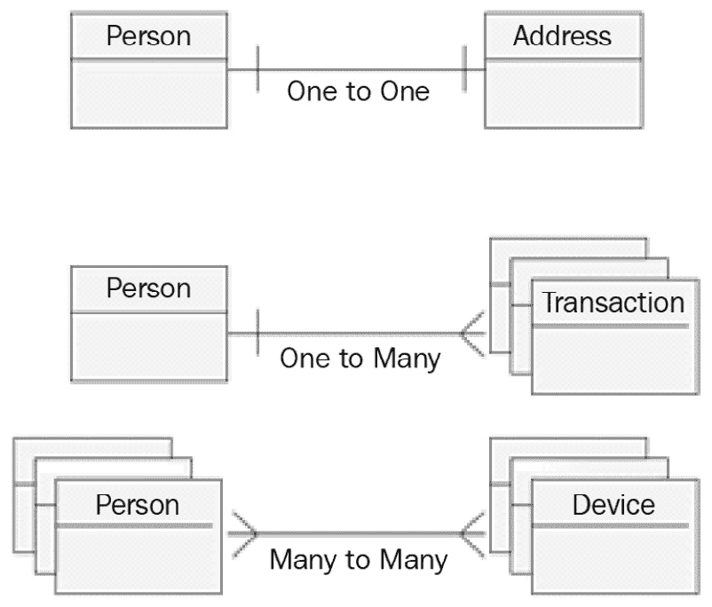

# 第十一章：处理数据

你应该知道，无论你的应用程序做什么，你最终都会迟早处理持久性问题。无论是支付、社交媒体上的帖子还是其他任何事情，如果信息没有被存储、检索、聚合、修改等，那么信息就没有价值。

因此，在设计应用程序时，数据是一个非常值得关注的点。错误的建模（正如我们在*第四章*，*设计和开发最佳实践*，在讨论**领域驱动开发**时所见）可能导致一个弱化的应用程序，这将很难开发和维护。

在本章中，我们将进一步探讨数据建模，讨论你的对象和值可以存储的方式（也称为*静态数据*，与*动态数据*相对，其中对象仍然被你的应用程序代码积极操作）。

在本章中，我们将涵盖以下主题：

+   探索关系数据库

+   介绍键/值存储

+   探索 NoSQL 存储库

+   查看文件系统存储

+   现代方法 - 多层存储策略

正如我们在本书迄今为止的许多主题中看到的那样，数据持久性也发生了很大的变化。类似于软件开发模型和**Java 企业版**（**JEE**）框架所发生的情况，当我们处理数据时，我们也有许多不同的选项来实现多个用例。

然而，正如我们在其他地方看到的那样（即在 JEE 应用程序与云原生替代方案之间），旧的方法并没有被放弃（因为它们在某些情况下仍然相关）；相反，它们正被更适合其他用例的更现代的方法所补充。这正是我们将要讨论的第一项技术——关系数据库。

# 探索关系数据库

**关系数据库**几乎不是一个新概念。这个想法最初由 Edgar F. Codd 在 1970 年提出。为了简洁起见，省略了其背后的数学概念，它说关系数据库中的数据，正如众所周知，是按*表格*（我们在*第七章*，*探索中间件和框架*，*持久性*部分中快速浏览过）排列的。

大概来说，每个表格都可以看作是我们业务模型中的一个对象，列映射到对象字段，行（也称为*记录*）代表不同的对象实例。

在接下来的章节中，我们将回顾关系数据库的基本知识，从键和关系、事务性概念和存储过程开始。

## 键和关系

根据数据库技术，有一个识别每行的方法是常见的想法。这通常是通过识别一个（或一组）对每个记录都是唯一的字段来完成的。这就是**主键**的概念。主键可以被视为一种约束，意味着它们代表了一些规则，数据插入到表中必须遵守这些规则。这些规则需要得到维护，以便表（及其记录）保持有效状态（在这种情况下，通过每个记录关联一个唯一的 ID）。然而，通常在关系型数据库中还会实现其他约束。根据数据库系统的具体技术，这些约束可能非常复杂。

数据库世界的另一个核心概念是**关系**的概念。正如您可以想象的，这是一种建模不同对象之间链接的方式（类似于在**面向对象编程**（OOP）的世界中发生的情况，其中对象可以包含对其他对象的引用）。关系可以落入以下三种基数之一：

+   **一对一**关系表示每个记录映射到另一个表中的一个且仅有一个记录。这通常指的是一种关系，其中每一行指向包含更多信息的另一行，例如用户记录指向另一个表中代表用户居住地址的行。

+   **一对多**关系是我们对一个关系进行建模，其中每个记录映射到另一个表中的一组记录。在这种情况下，两个表之间的关系是不平衡的。一个表中的一条记录指向另一个表中的一组相关记录，而反过来则不成立（每个记录映射到源表中的一个且仅有一个记录）。一个实际的例子是用户与支付的关系。每个用户关联一个或多个支付，而每个支付只关联一个用户。

+   **多对多**关系是最后一个选项。基本上，在这种情况下，一个表中的多行可以与相关表中的多行相关联，反之亦然。这种关系的一个例子是电影和演员。电影表中的一条记录将链接到演员表中的多行（实现演员在电影中的关系）。反之亦然——演员表中的一行将链接到电影表中的多条记录，因为每个演员很可能参与多部电影。

下面是三种关系基数类型的图示：

图 11.1 – 表关系

正如您在前面的图中可以看到的，有三个关系示例的图形表示：

+   **一对一**，例如一个人与地址的关系——每个人只能有一个主要家庭地址。

+   **一对多**，例如一个人与交易的关系——每个人可以与多个支付交易相关联。

+   **多对多**，例如人与设备的关系——每个人可以有多个设备，一个设备也可以被多个人使用。

这些关系并不新鲜；对于 Java 对象来说也是如此，你可以用它们来模拟相同类型的关系：

+   一个类可以通过包含它的字段，与另一个类一对一地链接。

+   一个类可以通过包含一个包含目标类类型对象列表（或集合）的字段，在一对一场景中与其他类链接。

+   一个类可以通过扩展之前的场景，并让目标类类型包含一个包含源类类型对象列表（或集合）的字段来实现多对多场景（因此可以双向链接）。

所有这些模型都可以传播到 SQL 数据库中，这确实是通过 JPA 实现的，我们在*第七章*，“探索中间件和框架”中介绍了 JPA。

以前（在某些情况下仍然如此）通常从设计将存储数据的数据库开始，定义应用程序的领域模型。这是一个相当简单的方法，因为它不能轻松地模拟面向对象应用程序的每个方面（如继承、接口和许多其他结构），但对于一些简单场景来说它是有效的。

## 事务性

关系型数据库的一个更有趣（并且广泛使用）的功能与**事务性**相关。事务性指的是关系型数据库的某些特性，这些特性是维护数据完整性的基础（尤其是在出现故障的情况下）。这些特性在**ACID**缩写词下统一起来（代表**原子性**、**一致性**、**隔离性**和**持久性**）：

+   **原子性**：每个事务（通常是一组不同的操作，如在一个或多个表中创建、修改或删除记录）被视为一个单一单元；它要么整体成功，要么完全失败（使所有表保持事务开始之前的状态）。

+   **一致性**：每个事务只能通过维护所有现有约束（如主键）来将数据库更改为有效状态。

+   **隔离性**：并发事务必须在没有其他事务干扰的情况下正确执行。这基本上意味着并行执行的一系列事务的最终效果应该与这些事务顺序执行的效果相同。

+   **持久性**：这简单指的是在数据库系统失败后，持久化的事务将被保持（并且可以检索）。换句话说，数据库应该将数据持久化到非易失性存储（磁盘或类似技术）。

    提示

    考虑到事务性的概念通常不适合高度分布的环境，如微服务和云原生架构。我们将在*第九章*，*设计云原生架构*中进一步讨论这个问题。

最后但同样重要的是，许多不同的技术允许我们在数据库上直接执行自定义代码。

## 存储过程

许多广泛使用的数据库可以运行复杂的程序。这类功能没有标准，即使常用的语言类似于 SQL 的扩展，包括条件、循环和类似语句。偶尔，一些通用语言（如**Java**和**.NET**）在某些数据库系统中可用。

将代码存储在数据库中的原因主要是数据局部性。通过在数据库中执行代码，系统对执行和事务行为（如锁定机制）有完全的控制；因此，你可能会获得非常好的性能。这在进行大量数据的批量操作和计算时可能特别有用。但如果你问我，优势就到这里为止，而且并不非常值得。

当在数据库系统上使用存储过程时，你会观察到轻微的性能提升，但从架构角度来看，整体解决方案将显得很糟糕，并且难以维护。从设计角度来看，将业务逻辑放在数据层从来都不是一个好主意，而使用特殊的过程性语言（如这些平台通常可用的语言）只会使问题变得更糟。此外，这类语言几乎总是无法从一个数据库系统移植到另一个数据库系统，因此会强烈地将应用程序与特定技术耦合在一起，使得在需要时更改技术变得困难。

小贴士

如果不是真的需要，我强烈建议不惜一切代价避免使用存储过程。

现在我们已经看到了基本功能的概述，让我们看看关系型数据库的常用实现。

## 常用的关系型数据库实现

让我们快速讨论一些提供我们之前看到的关系型数据库功能的常用产品：

+   我们在谈论关系型数据库时，不能不提**Oracle** ([`www.oracle.com/database/`](https://www.oracle.com/database/))。这个供应商的名字已经成为数据库的同义词。他们提供了许多变体，包括具有集群和嵌入式缓存的版本。这个数据库在许多企业中被视为事实上的标准，并且大多数商业软件包都与 Oracle 数据库兼容。Oracle 数据库支持 Java 和 PL/SQL（一种专有语言）作为定义存储过程的方式。

+   **Microsoft SQL Server** ([`www.microsoft.com/sql-server/`](https://www.microsoft.com/sql-server/)) 是另一种广泛使用的数据库服务器。由于其完整的功能和与微软生态系统的紧密联系，以及许多广泛使用的微软应用程序都使用它，因此它变得非常流行。它还提供了扩展功能，可以在存储过程中运行 .NET 语言。值得注意的是，在过去的几年里，SQL Server 也开始支持 Linux 服务器，这扩大了 SQL Server 的使用场景，尤其是在云环境中。

+   **MySQL** ([`www.mysql.com/`](https://www.mysql.com/)) 是另一种广泛使用的数据库技术。它是开源数据库的早期例子之一，并提供了与商业数据库相媲美的先进功能。在 MySQL 项目被甲骨文公司收购后，为了保持项目独立，已经创建了几个分支。目前可用的最重要的分支被称为 **MariaDB**。

+   **PostgreSQL** ([`www.postgresql.org/`](https://www.postgresql.org/)) 是另一种开源的关系型数据库，并且已经存在很长时间（它在 MySQL 首次发布后不久就发布了）。然而，与 MySQL 相比，它仍然是独立的，这意味着它没有被主要软件供应商收购。因此，由于它的功能完整，它仍然是许多设置中广泛使用的选项。此外，值得注意的是，许多不同的第三方供应商提供商业支持和扩展，以覆盖一些特定的用例（如集群和监控）。

+   `.jar` 文件，在 Java 应用程序的开发过程中，作为内存设置的一部分使用它非常容易。

这包括将数据库嵌入到开发管道或 Maven 任务中作为一部分的场景，当它可以在需要时程序化地销毁、创建和启动。这使得它在测试场景中特别有用。尽管有更复杂的设置（如客户端服务器），H2 通常被认为不适合生产使用。除了测试和开发之外，最常见的用途是将它嵌入到应用程序中，以便在应用程序首次启动时提供演示模式，建议在进入生产之前设置并使用不同的数据库。

+   **SQLite** ([`www.sqlite.org/`](https://www.sqlite.org/)) 是另一种可嵌入的数据库。与 H2 相比，它是用 **C** 语言编写的，并且除了嵌入之外不提供任何设置。此外，SQLite 缺少一些功能（例如，它不支持一些 SQL 的高级功能）。然而，由于其稳健性和卓越的性能，SQLite 在生产环境中得到了广泛的应用。最普遍的使用案例是将它嵌入到客户端应用程序中。许多网络浏览器（如 Firefox 和 Chrome）和桌面应用程序（如 Adobe Photoshop）都已知使用 SQLite 存储信息。它也在 Android 应用程序中得到广泛应用。

现在我们已经看到了一些常用数据库的简要介绍，让我们来看看使用关系型数据库有益的用例，以及何时其他选项会更好。

## 关系型数据库的优点和缺点

**事务性** 是关系型数据库的关键特性，也是使用该技术的优势之一。虽然其他存储技术可以配置以提供类似 ACID 事务的功能，但如果你需要可靠地持续存储结构化数据，那么从性能和功能的角度来看，关系型数据库可能是你的最佳选择。此外，通过 SQL 语言，数据库提供了一种表达性强的方式来检索、组合和操作数据，这对于许多用例至关重要。

当然，也存在一些缺点。数据库需要事先定义一个刚性的结构来定义表、关系和约束（这在很大程度上是技术和固有的）。后续的更改当然可能发生，但它们可能产生很多副作用（通常在性能和潜在的约束违规方面），因此它们具有影响力和成本。另一方面，我们将看到，替代技术（如 NoSQL 存储）可以更容易地实现数据结构的更改。

因此，在不知道将要存储的数据对象形状的情况下，关系型数据库可能并不适合。另一个潜在问题是，鉴于技术的复杂性和刚性，你可能会遇到性能和功能问题，这些问题并不总是容易排查。

一个典型的例子与复杂查询相关。关系型数据库通常使用索引来实现更好的性能（每个特定的实现可能使用不同的技术，但核心概念通常相同）。索引需要随着时间的推移进行维护，包括碎片整理和其他类似操作（取决于每个特定的数据库实现）。如果我们未能正确执行此类维护，这可能会对性能产生严重影响。即使我们的索引工作正常，复杂查询仍然可能表现不佳。

这是因为，在大多数实际应用中，你需要从许多不同的表中组合和筛选数据（这种操作通常被称为连接）。数据库可能会以许多不同的方式解释这些操作，试图优化查询时间，但并不能保证在所有情况下都能得到良好的结果（尤其是当涉及许多表和行时）。

此外，在进行复杂查询时，你可能会错误地使用索引，而一个正在运行的查询中的微小变化也可能使你陷入同样的困境。因此，我的建议是在复杂的应用环境中，务必提前与数据库管理员进行双重检查，他们可能拥有工具和经验来识别潜在问题，防止这些问题在生产环境中出现。

正如我们在本节中看到的，虽然关系型数据库不是最现代的选项，但它们仍然是存储数据的一个非常广泛和有用的技术，尤其是在你需要数据完整性和结构要求的情况下。然而，这需要你提前定义数据结构，并在数据库的维护和使用上保持一定的纪律。

你还应该考虑，有时，关系型数据库对于简单的用例来说可能过于强大，而你只需要简单的查询，甚至不需要持久化存储。我们将在下一节讨论这种情况。

# 引入键/值存储

有一些场景，你可能只需要临时存储，并以简单的方式访问它，例如通过一个已知的**唯一键**，这将与你的对象相关联。这种场景最适合键/值存储。在这个概念中，你可以找到许多不同的实现，它们通常有一些共同的特征。最基本的是**访问模型**——几乎每个键/值存储都提供了通过键检索数据的 API。这基本上与 Java 中的**哈希表**机制相同，它保证了最佳性能。以这种方式检索到的数据可以以许多不同的方式序列化。对于简单值，最基本的方式是字符串，但**Protobuf**也是一个常见的选择（参见*第八章*，*设计应用程序集成和业务自动化*，我们在这里讨论了这一点和其他序列化技术）。

键/值存储可能不提供持久化存储选项，因为这并不是典型的用例。数据只是保存在内存中以优化性能。然而，现代实现通过在磁盘或外部存储（如关系型数据库）上序列化数据来妥协。这通常以异步方式进行，以减少对访问和保存时间的影响。

无论你使用的科技是否提供持久存储，都有其他功能可以增强系统的可靠性。最常见的一个是基于数据复制。基本上，你将拥有多个系统（也称为*节点*）以集群方式运行（这意味着它们在相互通信）。这些节点可能运行在同一台机器上，或者更好的是，在不同的位置（以进一步提高可靠性）。

然后，运行你的键/值存储的技术可能被配置为将每个更改（添加、删除或修改数据）传播到多个不同的节点（可选，所有节点）。这样，在节点失败的情况下，你的数据仍然存在于一个或多个其他节点中。这种复制可以是同步的（减少数据丢失的可能性但增加每次写操作的延迟）或异步的（反之亦然）。

在接下来的章节中，我们将看到一些与缓存数据和键/值存储中记录的生命周期相关的一些常见场景。让我们先看看实现数据缓存的一些技术。

## 数据缓存技术

键/值存储的典型用例是**缓存**。你可以使用缓存作为一个集中位置来存储可丢弃的数据，这些数据可以从你的应用程序中快速访问。这种数据通常被认为是可丢弃的，因为如果键/值存储不可用或没有数据，可以通过其他方式（如从关系数据库）检索。

因此，在平均情况下（有时被称为*缓存命中*），你将获得更好的性能，并避免进入其他存储（如关系数据库），这些存储可能较慢、过载或访问成本较高。在最坏的情况下（有时被称为*缓存未命中*），你仍然有其他方式访问你的数据。

一些常见的场景如下：

+   **缓存分离**：键/值存储被认为是应用程序的一部分，它将决定程序化地哪些数据应该存储在其上，哪些数据将进入持久存储（如数据库），以及如何保持两者同步。当然，这是提供最大灵活性的场景，但可能难以管理。

+   **读透**和**写透**：键/值存储与持久存储之间的同步是由键/值存储本身完成的。这可以仅用于读操作（读透），仅用于写操作（写透），或两者都用于。从实际角度来看，应用程序仅与键/值存储交互。存储中的每次更改随后都会传播到持久存储。

+   **读取后跟**和**写入后跟**：基本上，这与读取穿透和写入穿透相同，但与持久存储的同步不是立即完成的（它是异步的）。当然，可能会发生一些不一致，特别是如果您有其他应用程序直接访问持久存储，它们可能会看到不正确或旧的数据。

+   **绕过写入**：在这种情况下，您的应用程序从键/值存储中读取（通过使用读取穿透或读取后跟方法）并直接写入持久存储，或者可能是其他应用程序在持久存储上执行写入。当然，这种场景可能很危险，因为您的应用程序最终可能在键/值存储上读取到不正确的内容。

这种场景可以通过通知键/值存储关于持久存储中发生的任何变化来管理。这可以通过应用程序写入数据来完成，或者如果该技术提供了这种功能，也可以直接通过持久存储来完成。然后键/值存储可能会决定更新更改的数据，或者简单地从缓存视图中删除它（当您的应用程序再次查找相同的键时，将强制从持久存储中检索）。

当谈论键/值存储时，另一个常见的话题是数据的生命周期。

## 数据生命周期

由于它们大量使用内存，对于大数据集，您可能想避免将所有内容都放在内存中，尤其是如果访问模式是可识别的（例如，您可以用合理的准确性预测您的应用程序将访问哪些数据）。决定在内存中保留什么和删除什么的一些常见模式如下：

+   **最近最少使用**：系统跟踪每个记录的最后访问时间，并丢弃在设定时间内未访问的记录。

+   **任期**：这是之前场景的一种变体，它简单地使用创建时间而不是最后访问时间。

+   **最少频繁使用**：系统记录记录被访问的次数，然后在需要释放一些内存时，它将删除最不常访问的记录。

+   **最近最少使用**：与最近最少使用相反，它删除最近访问的记录。这在某些场景中可能特别有用，例如，当在短时间内不太可能两次访问相同的键时。

键/值存储缺乏标准语言，如 SQL。这也是为什么键/值存储是一个大家庭，包括许多不同的产品库，通常提供比仅仅键/值管理更多的功能。在下一节中，我们将看到一些最著名的键/值存储实现。

## 常用的键/值存储实现

如前所述，构建键值存储技术实现列表并不容易。正如我们将在接下来的几节中看到的那样，这种数据库操作方式被视为一个更大的存储系统家族的子类别，即 NoSQL 数据库，它提供了比键值存储更多的选项和替代方案。然而，为了本节的目的，让我们看看在键值存储方面通常使用的一些列表：

+   **Redis** 可能是目前最著名的键值存储。它是开源的，其成功的一个原因在于，尽管它提供了许多高级功能和调优，但在默认设置下它仍然工作得很好，这使得采用它变得非常容易。它为几乎所有语言提供了客户端库，包括 Java。它提供了许多高级功能，如集群、事务和嵌入式脚本（使用 **Lua 语言**）。它可以在内存中操作，也可以使用可配置的方法将数据持久化到文件系统，以平衡性能影响和可靠性。

+   **Oracle Coherence** 是一个广泛使用的商业键值存储。它特别用于与其他 Oracle 产品结合使用，尤其是与数据库结合使用。它提供了一系列功能，包括一套完整的 API 和自定义查询语言。自 2020 年以来，Coherence 的社区版作为开源软件提供。

+   **Memcached** 是一个简单、轻量级且易于操作的键值存储。然而，它缺少一些功能，例如持久性。此外，它仅提供缓存旁路用例，因此其他场景必须手动实现。

+   **Infinispan** 是一个开源的键值存储，它提供了持久性、事件、查询和缓存等功能。值得注意的是，Infinispan 可以在嵌入式和客户端/服务器设置中使用。在嵌入式设置中，Infinispan 是 **WildFly JEE 应用服务器** 的一部分，为 Java 企业应用程序提供缓存服务。

现在我们已经看到了一些广泛使用的键值存储，让我们看看它们何时适用，何时不适用。

## 键值存储的优缺点

键值存储最重要的优势是性能。访问时间可以非常快，尤其是在不使用任何持久存储（仅内存）的情况下。这使得它们特别适合低延迟应用程序。另一个优势是简单性，无论是从架构还是使用角度来看。

从架构的角度来看，如果你的用例不需要集群和其他复杂设置，键值存储可以简单到只是一个应用程序，它通过 API 公开来检索和存储记录。从使用角度来看，大多数用例都可以使用像`get`、`put`和`delete`这样简单的原语来实现。然而，其中一些点可能成为键值存储的限制，尤其是在你有不同要求的情况下。如果你的应用程序需要可靠性（即在出现故障时尽可能少地丢失数据），你可能会陷入复杂的多个节点设置和持久化技术。这反过来可能意味着在某些情况下，你可能会在数据上出现不一致性，这可能需要从应用程序的角度进行管理。

另一个常见问题是，通常数据在键值存储中不是结构化的。这意味着只能通过键（或者至少，这是最合适的场景）来检索数据。虽然一些实现允许这样做，但使用复杂查询检索数据可能很困难、性能密集，或者在某些情况下不可能，这与你在关系型数据库中使用 SQL 所能做到的相比。

在本节中，我们介绍了数据缓存和键值存储的基础知识。这些技术在企业环境中越来越受欢迎，因为它们对性能的积极影响和可扩展性，非常适合云原生架构。在采用键值存储时，数据缓存技术和对象的生命周期是常见的考虑因素。

键值存储被认为是更广泛存储技术家族的一部分，这些技术是关系型数据库的替代品，被称为 NoSQL。在下一节中，我们将更详细地介绍这项技术。

# 探索 NoSQL 存储库

NoSQL 是一个包含许多非常不同的数据存储技术的总称。这个术语主要是为了营销目的而创造的，目的是将它们与关系型数据库区分开来。一些 NoSQL 数据库甚至支持类似 SQL 的查询语言。NoSQL 数据库声称在性能方面优于关系型数据库。然而，这种保证仅存在于一些妥协的基础上，即缺乏一些功能，通常是在事务性和可靠性方面。但为了讨论这些限制，了解 CAP 定理的概述是值得的。

## CAP 定理

**CAP 定理**由埃里克·布卢尔（Eric Brewer）于 1998 年提出，并由塞思·吉尔伯特（Seth Gilbert）和南希·林奇（Nancy Lynch）于 2002 年正式证明有效。它指的是分布式数据存储，无论底层技术如何，因此当在多服务器设置中实现时（即在两个或更多不同的进程中运行，通过网络进行通信，用于集群和高可用性目的）也适用于关系数据库。该定理关注的是*网络分裂*的概念，当系统因连接丢失而分为两个（或更多）无法相互通信的子集时。

CAP 定理描述了分布式数据存储的三个核心特性：

+   **一致性**指的是保持存储数据的完整性、更新性和形式正确性。

+   **可用性**指的是提供对数据存储所有功能的访问，特别是对数据本身的读写操作。

+   **分区容错性**指的是即使在服务器之间发生网络故障的情况下，系统也能正常工作。

CAP 定理指出，当发生分区时，你只能保持一致性或可用性。虽然有一个数学解释（且超出了本书的范围），但基本思想可以很容易地理解：

+   如果一个系统保持可用性，可能会出现两个冲突的操作（例如，两个具有不同值的写操作）到达系统的两个不同的分区（例如，两个服务器，无法相互通信）。考虑到可用性，两个服务器都将接受操作，最终结果将是数据不一致。

+   如果一个系统保持一致性，在网络分裂的情况下，它不能接受会改变数据状态的操作（以避免冲突风险损害数据一致性）；因此，它将牺牲可用性。

然而，值得注意的是，这个定理，虽然它是理解分布式数据存储限制的基础，但必须在每个特定场景中考虑和具体化。在许多企业环境中，有可能使网络分裂事件极为不可能（例如，通过在每台服务器之间提供多个网络连接）。

此外，当网络分裂时，通常会有机制来选举一个主分区。这基本上意味着如果你能够定义集群的哪个部分是主分区（通常，拥有更多生存节点的那个，这也是为什么通常建议节点数为奇数的原因），这个分区可以像往常一样继续工作，而剩余的分区可以关闭或切换到降级模式（如只读）。因此，理解 CAP 定理的基本原理至关重要，但同样重要的是要了解有几种方法可以绕过其后果。

这正是 NoSQL 数据库背后的推理。这些数据库改变了它们的视角，*拉伸*了 CAP 能力。这意味着，虽然传统的关系数据库侧重于一致性和可用性，但它们在高度分布式的方式下操作时往往不可靠。相反，NoSQL 数据库可以在水平分布式架构中运行得更好，以可扩展性、吞吐量和性能为代价，牺牲可用性（正如我们所见，在出现网络分区时变为只读）或一致性（不提供 ACID 事务能力）。

这也让我们来到了 NoSQL 存储的另一个常见点——**最终一致性**。

事实上，大多数 NoSQL 存储，虽然不提供完整的事务性（与关系数据库相比），但仍然可以通过使用最终一致性模式提供一些数据完整性。深入探讨这个模式的细节和影响需要很多时间。为了本节的目的，我们只需考虑一个实现最终一致性的系统可能有一些时间数据是不一致的（特别是，在两个不同的节点上查询相同的数据可能导致两个不同的结果）。

话虽如此，通常可以调整 NoSQL 存储以保持一致性并提供与传统关系数据库相同的完整事务性。但根据我的个人经验，在性能和可用性方面的影响并不是值得妥协的。换句话说，如果你在寻找事务性和数据一致性，通常最好依赖于关系数据库。

话虽如此，让我们概述一下不同的 NoSQL 数据库分类。

## NoSQL 数据库分类

正如我们在前面的章节中讨论的那样，NoSQL 是一个总称。存在许多不同的 NoSQL 存储分类：

+   **键/值存储**：这是最容易的一种，因为我们已经讨论了这种技术的特点。现在应该很清楚，键/值存储与 NoSQL 数据库共享一些核心特性——它们通常被设计为水平可扩展的，侧重于性能而非事务性，并且缺乏完整的 SQL 兼容性。

+   **文档存储**：这是 NoSQL 数据库中最广泛的分类之一。文档存储的核心概念是，它存储的不是行，而是文档，这些文档被序列化为各种格式（通常是 JSON 和 XML）。这通常提供了存储具有不同字段集的文档的灵活性，换句话说，它避免了预先为将要存储的数据定义严格的模式。文档可以通过其内容进行搜索。一些著名的文档存储示例包括 MongoDB、Couchbase 和 Elasticsearch。

+   **图数据库**：这类存储是基于图的概念构建的。它提供了针对图概念（如节点和顶点）优化的存储和查询功能。通过这种方式，可以轻松高效地建模、存储和检索诸如道路、链接和社会关系等概念。图数据库的一个著名实现是**Neo4j**。

+   **宽列数据库**：这些存储类似于关系数据库，只是在表中，每一行可以根据数量、名称和类型的不同而拥有不同的字段集。两个已知的宽列数据库实现是 Apache Cassandra 和 Apache Accumulo。

当然，正如你可以想象的那样，关于 NoSQL 数据库还有很多可以说的。我希望我在本节中给出的提示能帮助你快速了解 NoSQL 数据库的主要功能，并且希望我提供的其中一个示例对你的软件架构有所帮助。在下一节中，我们将探讨文件系统存储。

# 查看文件系统存储

**文件系统**在数据存储系统中是一个有点模糊的概念。为了明确，文件系统存储是一个几乎无结构的系统，提供 API、模式和像我们之前看到的其他存储系统一样的高级功能。然而，它仍然是许多应用中的一个非常相关的层，并且有一些新的存储基础设施提供了高级功能，因此我认为快速概述一些核心概念是值得的。

文件系统存储对于大多数人来说不应该是一个陌生的概念。它是一个由特定硬件（旋转或固态磁盘）支持的持久存储系统。存在许多不同的文件系统，可以被认为是用于从和这些特定硬件抽象读取和写入操作的协议。除了创建、更新和删除文件，以及将这些文件组织到文件夹中之外，文件系统还可以提供其他高级功能，例如日志记录（以减少数据损坏的风险）和锁定（为了提供对文件的独占访问）。

一些常见的文件系统包括**新技术文件系统**（**NTFS**）（用于 Windows 环境）和**扩展文件系统**（**ext**）（用于 Linux 环境）。然而，这些文件系统是为在单台机器上工作而设计的。一个更重要的概念是与不同系统之间交互的文件系统。其中一个广泛实现的例子是网络文件系统，这是一组文件系统协议，提供通过网络访问文件和目录。这里最显著的例子是 NFS，这是一个提供对共享文件系统多服务器访问的协议。**文件传输协议**（**FTP**）和**SSH 文件传输协议**（**SFTP**）也是其他著名的例子，即使它们已经过时，但仍然被广泛使用。

网络存储系统家族的最新成员是**Amazon S3**。虽然它技术上是一个对象文件系统，但它是一种使用 API 与亚马逊设施交互以存储和检索文件的方式。它最初是为在互联网上提供 AWS 基础设施上的文件系统服务而提供的专有实现；从那时起，S3 已经成为一个标准，并且有许多其他实现，包括开源和商业的，旨在在本地和云中提供符合 S3 规范的存储。

## 文件系统的优缺点

讨论文件系统的缺点有些困难，因为它们是每个应用程序的基本需求，并且这种情况在很长时间内都不会改变。然而，重要的是要具体化并逻辑地思考文件系统的优缺点，以便更好地理解在哪里使用它们。

在共享文件系统上进行的应用程序交互在交换大量数据时尤其方便。在银行系统（尤其是遗留系统）中，通常会将大量操作（如支付）批量交换，以巨大的`.csv`文件形式执行。其优势在于文件可以安全地分块、签名，并通过网络高效传输。

另一方面，文件系统通常不提供原生索引和全文搜索功能，因此这些功能必须在之上实现。此外，文件系统（尤其是网络文件系统）可能表现不佳，尤其是在并发访问和文件锁定方面。

通过本节，我们完成了对存储系统的概述。

在下一节中，我们将看到在现代架构中，使用多个存储解决方案以最合适的技术应对不同的用例是常见的。

# 现代方法——多级存储策略

在本章的最后部分，我们将探讨一个可能看似明显但仍有必要提及的概念。**现代架构**倾向于使用多种数据存储解决方案，我认为这可能会是一个特别有趣的解决方案。

在过去，通常首先定义持久化策略（通常是关系数据库或另一个遗留持久化系统），然后围绕它构建应用程序功能。这种情况已经不再存在。通过微服务，云原生技术发展了这样一个理念：每个微服务应该拥有自己的数据，并且我们可以将这个概念扩展到每个微服务可以选择自己的持久化存储技术。这更适合特定业务领域和相关用例的特点。一些服务可能需要关注性能，而其他服务则可能对事务性和数据一致性有强烈的需求。

然而，即使你处理的是不太创新的架构，评估数据持久性解决方案的不同想法仍然是有价值的。以下是一些关于它的讨论点：

+   当数据在开始时是结构化的，并且这种结构不经常改变时，关系型数据库是你的最佳选择。此外，如果你需要 ACID 兼容的事务，关系型数据库通常是性能最好的解决方案。

+   键值存储，尤其是在它们的内存设置中，在许多用例中都很有用。更常见的场景包括用户会话的存储，这将需要高性能（因为它与 Web 和移动用例相关，在这些用例中，用户交互频繁，对可用性和一致性的期望很高），并且一致性和可靠性不是问题（在最坏的情况下，用户将被注销并需要重新登录）。另一个广泛使用的场景是数据库卸载——实现一些描述的场景（如读取通过、写入通过等），其中缓存的条目将提高整体性能并减少对数据库的负载。

+   NoSQL 数据库可以用于特别适合所选特定技术的场景。特别是，如果我们的架构中某些实体具有可变或不规则的表现形式，它们可能适合用于文档存储库。图数据库在其他需要图算法的场景中可能很有用（例如最短路径计算）。

+   如前所述，文件系统几乎是基本的基础设施。它们可能被某些中间件（如消息代理）需要用于写入日志，并且应用程序可以明确地将其用作大量信息的数据交换区域（尤其是在处理遗留系统时）。

因此，再次强调，选择正确的数据存储技术对于拥有性能良好和编写良好的应用程序至关重要，并且依赖于一种以上的技术来满足我们应用程序不同部分的不同需求是一种常见的做法。

# 摘要

在本章中，我们看到了数据层不同可能性的概述，从传统的 SQL 数据库到更现代的替代品。

尽管我们大多数人已经熟悉关系型数据库，但我们已经对使用这种技术的优缺点进行了有益的审视。然后，我们通过替代的、广泛使用的存储技术拓宽了我们的视野，例如键值存储、NoSQL，甚至文件系统。

最终，我们探讨了选择特定数据存储方式可能如何影响应用程序设计和我们系统的性能。确实，在现代架构中，我们可能需要根据每个用例选择合适的存储解决方案，并在需要时选择不同的解决方案。

在下一章中，我们将讨论一些架构性的跨领域问题。诸如安全性、弹性、可用性和可观察性等主题对于成功应用架构至关重要，并将被分析以了解它们的影响和最佳实践。

# 进一步阅读

+   *数据库系统：概念、语言与架构*，由 Paolo Atzeni、Stefano Ceri、Stefano Paraboschi 和 Riccardo Torlone 合著

+   *关系型数据库 101：全面观察*，由 Scott W. Ambler 著 ([`www.agiledata.org/essays/relationalDatabases.html`](http://www.agiledata.org/essays/relationalDatabases.html))

+   NoSQL 数据库列表 – Edlich ([`hostingdata.co.uk/nosql-database/`](https://hostingdata.co.uk/nosql-database/))

+   *理解 NoSQL：管理者和我们的指南*，由 Dan McCreary 和 Ann Kelly 合著
