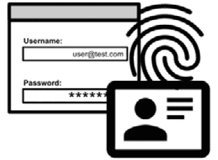

# 第十二章：横切关注点

在前面的章节中，我们已经探讨了 Java 应用开发的许多不同方面。从开发生命周期的开始（包括需求收集和架构设计），我们关注了许多不同的技术方面，包括框架和中间件。

在这一点上，需要检查几个横切关注点，无论我们正在构建什么类型的应用以及我们选择什么类型的架构风格。在本章中，我们将探讨这些方面的几个方面，如下所示：

+   身份管理

+   安全性

+   弹性

本章中讨论的横切关注点提供了一些关于对项目成功至关重要的主题的非常有用的信息。确实，以正确的方式实现身份管理、安全和弹性对我们的应用的成功有益，无论是从架构的角度（通过提供优雅、可扩展和可重用的解决方案）还是从功能的角度（通过避免重复造轮子和以标准化的方式处理这些问题）。

话虽如此，让我们从应用开发中的一个经典问题开始：身份管理。

# 身份管理

**身份管理**是一个广泛的概念，涉及许多不同的方面，并涉及与许多不同系统的交互。

这个概念确实与识别用户（即，谁在请求特定的资源或功能）以及检查相关的权限（他们是否被允许这样做，或者不被允许）有关。因此，很容易看出这是一个核心概念，在许多应用和许多应用组件中都很常见。如果我们有不同的组件提供不同的功能（如微服务应用），那么显然每个组件都需要执行相同类型的检查，以确保用户的身份并相应地行动。

然而，为每个应用都有一个定制的身份管理基础设施可以被认为是一种*反模式*，尤其是在复杂的企业环境中，因为每个应用（或组件）都有相同的目标：识别用户及其权限。

因此，一个常见的做法是定义一个公司范围内的身份管理策略，并在所有应用中采用，包括离场和微服务架构。

现在，回到基本概念，身份管理基本上涉及两个主要概念：

+   **认证**：这是一种确保以最大可能程度的确定性，请求访问资源（或执行操作）的人就是他们所声称的人的方法。以下是一个用户名和密码认证方法的图示：

图 12.1 – 认证

+   **授权**：这是一种声明谁可以访问每个资源并执行特定操作的方式，如下面的图所示。这可能涉及已验证和未验证的实体（有时称为匿名访问）。

图 12.2 – 授权

身份验证和授权包括两个主要场景：

+   **机器到机器**：这种情况是指请求访问的实体是一个应用程序，例如在批量计算或其他不直接涉及人类用户交互的过程中。这也被称为**服务器到服务器**。

+   **交互式**或**使用**：这是另一种场景，其中人类操作员直接与资源交互，因此请求身份验证和授权。

现在我们已经掌握了某些基本概念，让我们进一步了解身份验证和授权。

## 身份验证

正如所述，**身份验证**是验证执行请求的实体（无论是人类还是机器）是否是他们所声称的那样。有许多不同的验证方式。主要区别在于用户呈现的内容（以及需要检查的内容）。它属于以下三个类别之一：

+   **用户知道的东西**：这指的是秘密，例如密码、PIN 码或类似的东西，比如解锁手机的序列。

+   **用户拥有的东西**：这指的是物理设备（如徽章或硬件令牌）或软件工件（如证书和软件令牌）。

+   **用户是的东西**：在这种情况下，身份验证与生物识别因素（如指纹或面部识别）或类似的东西（如签名）相关联。

在这里有几个需要考虑的事项，如下所述：

+   第一种情况是，一些公开信息，如用户名，可能与身份验证因素相关联。在这种情况下，多个用户可以共享相同的因素（如密码或徽章），我们可以通过使用用户名来区分他们。这种模式的无意发生（如两个用户意外选择相同的密码）可能无害，而有意实施（多个用户使用相同的徽章）可能是一个安全问题。

+   您还必须考虑，超过一个身份验证因素的组合被认为是最佳实践，并且鼓励用于更强的安全实现。这被称为**多因素身份验证**（**MFA**）。此外，在某些特定环境（如银行）中，这可能是由特定法规规定的。强身份验证通常是这些具体要求之一，它指的是利用至少两个不同因素的身份验证过程，这些因素属于不同的组（例如，*用户知道的东西*，加上*用户拥有的东西*）。

+   一些认证因素可能受到策略的限制。最常见的例子是密码规则（长度、复杂性）或过期策略（在可能的情况下，强制用户在一段时间后更改因素）。

当然，一个立即浮现的问题是如何以及在哪里存储与实现认证相关的信息——换句话说，在哪里保存我们的用户名和密码（以及/或用于认证的其他类型的秘密）。

用于此目的最常见的技术是**LDAP**，即**轻量级目录访问协议**。LDAP 是存储用户信息的协议。LDAP 服务器可以被视为存储用户信息（包括用户名、电子邮件、电话号码等）的标准方式。作为一个相当古老的标准，自 1990 年代以来一直存在，它被广泛采用并且与许多其他技术兼容。

不深入细节，我们可以将其视为只是一个数据存储库，我们可以通过连接 URL 来连接它。然后，我们可以通过传递特定的属性来查询数据存储库，以搜索特定的条目。

对 LDAP 服务器的认证操作称为**绑定**。LDAP 通常可以以各种方式加密密码。一个非常著名的 LDAP 服务器实现（技术上，是其扩展，提供比标准更多的服务）是**微软活动目录**。

LDAP 不是存储用户信息（包括密码）的唯一方式，但可能是唯一广泛采用的标准。实际上，用户信息通常存储在关系数据库中，但这几乎完全是自定义的，这意味着没有标准命名也没有表格和列的格式，用于存储用户名、密码等。

存储用户信息的另一种方式是使用文件，但这不是一个可扩展或高效的方法。它主要用于一小组用户或测试目的。用于存储用户信息的常见文件格式是`.htpasswd`，它只是一个简单的平面文件，存储用户名和密码，最初由 Apache httpd 服务器用于认证目的。

在可能的情况下，以加密形式存储密码是一种普遍接受的最佳实践。这是一个关键点。无论用户存储技术（如 LDAP 或数据库）如何，密码都不应以明文形式存储。原因简单且明显：如果我们的服务器以某种方式被入侵，攻击者不应能够访问存储的密码。

我使用了“加密”这个词来泛指。一个解决方案确实可以是使用对称算法，如 AES 来加密密码。对称加密意味着通过使用一个特定的密钥，我可以使密码不可用。然后，我可以用同样的密钥再次解密密码。

这种方法很有用，但我们仍然需要安全地存储密钥，因为攻击者如果拥有加密的密码和密钥，就可以以明文形式访问原始密码。因此，更安全的方法是存储散列密码。

通过散列密码，你将其转换为一个加密字符串。与之前的方法相比，好处在于我们正在实施非对称加密。如果我们使用的是合适的算法，那么在合理的时间内将加密字符串反转回原始字符串是不可能的。这样，我们可以在不要求任何密钥的情况下存储加密密码。为了验证客户端提供的密码，我们只需应用最初保存时使用的相同散列算法，并比较结果。即使攻击者获得了我们的用户信息存储库的访问权限，窃取的加密密码也将基本上无用。

重要提示

当然，加密密码比以明文形式存储密码要好；即使是加密的密码也不是 100%安全的。实际上，即使理论上从散列值中重建原始密码是不可能的，一些技术也试图这样做。特别是，可以尝试进行暴力攻击，这基本上是尝试大量的密码（来自字典或简单的随机字符串），对它们进行散列，并将输出与已知的实际散列值进行比较。一个更有效的方法是使用**彩虹表**，这基本上是密码及其预先计算的散列值的表。然而，通过使用更长和更复杂的密码以及使用盐值（一种向散列密码添加更多随机性的方法），可以对这些技术进行防御。

## 授权

用户**授权**是身份验证的补充。一旦我们确信用户是他们所声称的人（使用身份验证），我们就必须了解他们被允许做什么。这意味着他们被允许使用哪些资源和哪些操作。

最基本的授权形式是没有授权。在简单的系统中，你可以允许经过身份验证的用户做任何事情。

在实际应用中，一个更好的方法是授予粒度化的权限，针对不同类型的用户进行区分。这基本上是角色的概念。

**角色**可以被视为一组用户和一组权限之间的链接。它通常映射到一个工作职能或一个部门，并且通过可以访问的资源列表和可以使用的功能来定义。每个用户都可以与一个角色相关联，并且因此继承该角色相关的权限。

这种授权方法被称为**基于角色的访问控制**（**RBAC**）。基于 RBAC 实现，每个用户可以分配给多个角色，具有不同的组合。通常，策略是累加的，这意味着属于多个角色的用户从这两个角色中获得所有权限。然而，这可能会略有变化，特别是如果权限冲突，甚至可能存在拒绝每个用户关联多个角色的实现。

RBAC 实现的一个方面是角色继承。一些 RBAC 实现采用角色层次结构的概念，这意味着一个角色可以继承与其父角色关联的权限集。这允许构建模块化系统。在 Java 企业领域，**JAAS**（即**Java Authentication and Authorization Service**）是身份验证和授权的实现标准。它可以被视为基于 RBAC 的安全系统的参考实现。

RBAC（基于角色的访问控制）的替代方案是`if then`语句，其中可以结合多个属性使用`AND`、`OR`和其他逻辑运算符。这些属性可以简单地与用户相关（例如检查用户是否属于特定组），或者与其他条件相关（例如一天中的时间、源 IP 地址和地理位置）。

`SELinux`是一种安全模块，它是某些**Linux**操作系统变体（包括**Android**）的底层安全模块，是 PBAC（基于属性的访问控制）的常见实现。

## 身份和访问管理

**身份和访问管理**（**IAM**）是一个通常与提供身份验证、授权和其他身份安全服务的系统相关的术语。IAM 系统的功能是以统一的方式实现这些功能，以便每个应用程序可以直接使用它并从中受益于适当的安全级别。除了我们在身份验证和授权方面看到的内容之外，IAM 系统还提供以下功能：

+   **解耦用户存储**：这意味着用户名、密码和其他信息可以存储在所选技术中（如 LDAP 或数据库），客户端应用程序不需要知道实现细节。IAM 通常还可以在统一视图中统一多个存储系统。当然，如果用户存储系统需要更改（例如从 LDAP 迁移到数据库），或者我们必须添加一个新的系统，我们不需要对客户端应用程序进行任何更改。

+   **联邦其他认证系统（如更多的 IAM 系统）**：这在需要从多个组织访问共享系统的场景中尤其有用。我们大多数人都有过通过第三方登录（如使用**Google**或**Facebook**）访问服务的类似经历。

+   **单点登录**（**SSO**）：这意味着我们只需要登录（和注销）一次，然后就可以直接访问 IAM 中配置的应用程序集。

实现此类功能（和标准）的方式（和标准）有很多，这取决于所使用的每个特定 IAM 产品。这些标准通常归结为一些关键概念：

+   **为 IAM 管理的每个应用程序提供和连接**：这通常意味着配置每个应用程序以指向 IAM。在 Java 世界中，实现这一点的常见方法是为所有请求配置一个 servlet 过滤器。其他替代方案是代理软件或反向代理，它们实现了拦截所有进入我们应用程序的请求的相同功能。

+   **检查每个应用程序收到的每个请求**：如果请求需要认证（因为它试图访问受保护的资源或执行有限的操作），则需要检查客户端是否已经认证。如果没有，则重定向到认证系统（例如登录表单）。

+   **识别用户**：一旦客户端提供了有效的认证凭证（如用户名和密码），它必须提供一个唯一的标识符，这被视为用户的*身份证*，用于在不同请求中识别它（以及在单点登录场景中登录到其他应用程序）。为此，客户端通常会提供一个会话令牌，然后客户端应用程序（如 cookie）可能会存储该令牌，并且通常具有有限的生命周期。

实现此类场景的标准方式是**OAuth 协议**。

然而，IAM 并不是我们需要在云原生架构中关注的唯一安全方面。实际上，应用程序（尤其是在云原生应用程序中）的安全问题包括许多更多的考虑因素。我们将在下一节中讨论其中的一些。

# 安全

**安全**是一个非常复杂且基础且关键的一个方面。除非安全是你的主要关注点（如果你负责定义云原生应用程序的整体架构，这种情况不太可能），否则你很可能会与一些专家合作。尽管如此，从软件实施的开始（包括需求收集、设计和开发）就关注一些简单的安全影响是很重要的，以避免在完成架构和开发后进行安全检查，结果发现你需要进行大量的更改来实现安全（从而产生成本和延误）。

这种方法通常被称为**左移安全**，并且在**DevOps**团队中是一种常见的做法。

## 内在软件安全

首先要关注的是**内在软件安全**。确实，软件代码可能会受到安全漏洞的影响，这通常是由于错误或软件测试不佳造成的。

主要场景是软件由于格式错误或恶意构造的输入而表现出意外行为。这类常见的安全问题如下：

+   **SQL 注入**：一个恶意参数被传递给应用程序，并附加到一个 SQL 字符串上。然后应用程序执行一个特殊的 SQL 操作，这与预期的操作不同，可能允许攻击者访问未经授权的数据（甚至可能损坏现有数据）。

+   **不安全的内存处理**：将一个故意错误的参数传递给应用程序，并将其复制到内存的特殊部分，服务器将其解释为可执行代码。因此，可以执行未经授权的指令。这种类型错误的常见实例是*缓冲区溢出*。

+   **跨站脚本**：这是网络应用中的一种特定安全漏洞，攻击者可以注入客户端-服务器代码（如 JavaScript），然后执行这些代码，攻击者可以利用它窃取数据或执行未经授权的操作。

避免或减轻这些问题的技术有几种：

+   **输入清理**：每个输入都应该检查特殊字符和任何不必要的部分。检查格式和长度也很重要。

+   **以具有有限权限的用户身份在本地机器上运行（权限越少越好）**：如果出现意外的安全异常，影响可能会有限。

+   **沙箱**：在这种情况下，应用程序将在一个有限和受约束的环境中运行。这可以看作是之前方法的扩展。根据具体的应用技术，有各种实现沙箱的技术。JVM 本身也是一种沙箱。容器是另一种实现沙箱的方式。

上述主题是关于软件开发中常见问题（以及缓解这些问题的建议）的快速列表。然而，尽管这些方法至关重要，但并不全面，因此重要的是要考虑我们应用程序和系统的整体安全性，这将涉及一些其他考虑因素。

## 总体应用程序安全

良好的整体安全性始于我们编写应用程序的方式，但并不止于此。还有其他几种安全技术可能涉及不同的 IT 部门，例如网络管理员。以下是一些例子：

+   **网络防火墙**：它们是企业安全策略的一个基本组成部分，并且通常对开发人员和架构师来说非常透明（至少直到你发现你想要建立的某些连接由于缺少网络规则而失败）。防火墙的主要职责是阻止所有网络连接，除非它们被明确允许。这包括端口、协议、IP 地址等方面的规则。

然而，如今，防火墙比过去要复杂得多。它们现在能够检查应用层协议，并且通常不仅部署在基础设施的前端，还部署在每个组件之间，以监控和限制未经授权的访问。

由于同样的原因，一些编排工具（如 **Kubernetes**，以及公共云提供商）提供了实现所谓的 *网络策略* 的可能性，这些策略本质上是在充当网络防火墙的**访问控制列表**（**ACLs**），因此不允许（或丢弃）不受欢迎的网络连接。防火墙可以是硬件设备（包括 **Cisco** 和 **Check Point** 等主要供应商），甚至是软件发行版（如 **PFSense** 和 **Zeroshell**）。

+   **入侵保护系统**（**IPSes**）（类似于**入侵检测系统**，但在实现上略有不同）：这些是防火墙的扩展。IPS，就像防火墙一样，能够检查网络连接。但除了仅识别授权和不授权的路径外，IPS 还能够检查数据包以识别已知攻击（如 SQL 注入或类似行为）的签名（重复模式）。

此外，IPS 还可以检查应用程序的其他方面，而不仅仅是其网络连接。通常，IPS 可以访问应用程序日志或甚至在运行时检查应用程序的行为，以达到识别和阻止恶意行为的目标。在这种情况下，IPS 与在工作站上运行的防病毒软件类似。两种常见的 IPS 实现是 **Snort** 和 **Suricata**。

+   **源代码检查**：这是专注于分析代码中的已知错误。虽然这是一种通用技术，但它可以专注于安全问题。在大多数情况下，这种分析作为每个发布的标准步骤集成到软件交付周期中。这种测试也被称为**静态软件分析**，因为它指的是在软件未执行时检查软件（因此，查看源代码）。

与前一点类似的技术是检查应用程序中依赖项的版本。这可能指的是库，例如 Maven 依赖项。这些模块会与数据库中的已知漏洞进行比对，这些漏洞与特定版本相关联。这是遵循保持软件持续打补丁和升级的一般建议的一部分。

到目前为止看到的所有方面都是相关的最佳实践，可以在项目中部分或全部采用。然而，在某些情况下，必须以标准化和明确的方式应用安全检查和考虑因素，我们将在下一部分看到。

## 安全标准和法规

**安全性**是应用程序的核心概念，尤其是在某些特定行业，如金融服务、国防、医疗保健和公共部门。但它实际上是一个跨概念，在任何情况下都不能忽视。因此，存在一些法规，有时由法律或行业标准（例如，银行协会）强制执行，这些法规和标准强制并标准化了一些安全实践。以下是一些包括的内容：

+   **支付卡行业数据安全标准**（**PCI DSS**）：这是一个广泛实施的 IT 系统标准，用于提供信用卡支付服务。目标是减少欺诈并建立对信用卡用户的最大信任和安全水平。PCI DSS 不仅对系统本身（如访问控制和网络安全）规定了规则，还规定了 IT 人员处理此类系统的方式（通过定义角色和责任）。

+   **通用标准**（**CC**）：这是一个国际标准（在 ISO/IEC 15408 的名称下），用于认证一组检查 IT 系统安全性的测试。这种认证由授权实体进行，认证的系统将登记在官方名单上。

+   **开放式网络应用安全项目**（**OWASP**）：这种方法与我们迄今为止所看到的不同。它不是一个提供认证的集中式测试机构，而是一个开放和分布式的倡议，提供了一套用于应用程序安全（特别是关注 Web 应用程序安全）的工具、测试和最佳实践。OWASP 还共享和维护了一个知名安全问题的列表。该协会分发**依赖性检查**工具（[`owasp.org/www-project-dependency-check`](https://owasp.org/www-project-dependency-check)），该工具有助于识别有漏洞的软件依赖项，而**依赖性跟踪**工具则监控和检查依赖项的使用。

正如我们解释的那样，安全性是一个至关重要的主题，必须在所有项目阶段（从设计到实施到测试）以及所有不同的团队（从开发者到测试者到系统管理员）中给予重视。这就是我们决定将其视为一个跨领域关注点（以及为什么我们在本章中讨论它）的原因。为了在我们的应用程序中建立和维护安全性，必须在开发项目的每个步骤中都考虑最佳实践，包括编码。但为了保持系统的安全，我们还应考虑其他潜在的干扰和数据丢失来源，以及避免或减轻这些干扰的方法，我们将在下一节中探讨。

# 弹性

安全性关乎防止欺诈活动、数据盗窃以及其他可能导致服务中断的不当行为。然而，我们的应用程序可能因多种原因而崩溃或提供降级服务。这可能是由于流量激增导致过载、软件错误或硬件故障。

系统弹性的核心概念（有时被低估）是**服务等级协议**（**SLA**）。

服务等级协议（SLA）是尝试量化（通常通过合同强制执行）我们服务应遵守的一些核心指标。

## 运行时间

最常用的 SLA 是**运行时间**，衡量系统的可用性。这是一个基本指标，对于提供基本组件（如连接性或存储访问）的服务来说，通常非常有意义。然而，如果我们考虑更复杂的系统（例如整个应用程序，或一组不同的应用程序，如微服务架构），定义就变得更加复杂。确实，我们的应用程序可能仍然可用，但会返回错误的内容，或者简单地显示静态页面（如所谓的*礼貌页面*，解释系统当前不可用）。

因此，在复杂系统中，应该仔细定义运行时间，通过限制到特定的功能并定义它们的预期行为（例如，这些功能应该提供的数据）。

运行时间通常按一定时期内的百分比来衡量，例如每年 99.9%。

当考虑系统运行时间时，定义两种可能的故障类型是有用的：

+   **计划外停机时间**：这指的是由于维护或其他可预测操作（如部署）导致的服务中断。为了减少计划外停机时间，一种技术是减少发布次数。然而，这种技术在现代系统中可能不切实际，因为它会降低敏捷性并增加上市时间。因此，一种替代方法是实施滚动发布或其他类似技术，在执行发布或其他维护活动的同时继续提供服务（最终以降级模式提供服务）。

+   **计划外停机时间**：这当然与不可预测的事件有关，如系统崩溃或硬件故障。正如我们将在本节中看到的，有几种技术可以提高运行时间，尤其是在云原生架构中。

关于计划外停机时间，还有几个进一步的指标（我可以说*子指标*），它们衡量某些特定方面，这些方面对于进一步监控系统服务级别是有用的：

+   **平均故障间隔时间**：这衡量了两次服务中断之间的平均时间（如前所述，中断可以定义为多种方式，从完全关闭到服务回答错误）。即使系统仍然遵守整体运行时间服务等级协议（SLA），平均故障间隔时间短的系统应被视为不稳定，可能需要修复或加强。

+   **平均恢复时间**：这衡量的是在一段停机时间后恢复系统操作的平均时间。这包括任何类型的临时解决方案或手动修复来解决问题。这些修复被认为是临时的。具有高平均恢复时间的系统可能需要一些支持工具或更好的团队培训。

+   **平均修复时间**：这与之前的指标类似，但衡量的是问题的完全解决。这个指标与之前的区别是微妙且主观的。高的平均修复时间可能表明系统设计不佳或缺乏良好的故障排除工具。

在监控系统以考虑弹性时，正常运行时间并不是唯一需要考虑的服务级别协议。可以测量其他几个指标，例如 API 的响应时间（可以使用类似*90%的调用应在 1 毫秒内响应*的东西来衡量），每日成功调用的错误率（百分比），或其他相关指标。

但正如我们所说的，有几种技术可以实现这些服务级别协议并提高系统可靠性。

## 提高系统弹性

最常用的（有时过度使用）提高系统弹性的技术是**集群**。**集群**是一组以镜像方式并发工作的组件。在集群中，有一种方法可以在两个或多个实例之间持续共享系统状态。这样，我们可以在集群所属的某个系统发生停机（计划内或计划外）时保持服务运行。

此外，一个集群可能包含每个子系统（包括网络、存储等）的冗余实现，以进一步提高在支持基础设施故障情况下的弹性。

集群通常设置复杂，并且为了提高可靠性，通常需要付出性能影响的代价，这通常是由于状态的复制所导致的。此外，根据具体的应用，实现集群有一些限制，例如网络延迟和服务器（节点）的数量。

我们在*第十一章**,* *处理数据*中讨论了相关主题，当时我们谈论了**NoSQL**存储库和**CAP**定理。由于集群内部的数据可以被认为是分布式存储，它必须遵守 CAP 定理。

集群通常依赖于一个网络设备，例如网络负载均衡器，该设备指向集群中的每个节点，并在发生故障时通过将所有请求重定向到仍然存活的一个节点来重新建立整个系统的操作性。

为了相互通信，集群节点使用特定的协议，通常称为**心跳**协议，这通常涉及在网络或文件系统中交换特殊消息。在 Java 中实现心跳和领导者选举的一个广泛使用的库是**JGroups**。

集群的一个常见问题是**脑裂**问题。在脑裂情况下，集群被分成两个或更多个子集，这些子集无法通过心跳相互通信。这通常是由于两个系统子集之间的网络中断造成的，可能是由于物理断开、配置错误或其他原因。在这种情况下，集群的一部分可能不知道另一部分是否仍在运行（但无法通过心跳看到）或已关闭。为了在脑裂的情况下保持数据一致性（如 CAP 定理中在*第十一章*，*处理数据*)，集群可能决定停止运行（或者至少停止写操作）以避免在两个不相互通信的集群部分中处理冲突操作。

为了解决这些场景，集群可能会调用法定人数的概念。**法定人数**是集群正常运行所需的节点数量。法定人数通常固定为*集群节点数的一半加一*。

虽然具体细节可能因特定集群实现类型的不同而有所差异，但通常需要一个法定人数来选举集群领导者。领导者可能是集群中唯一正在运行的成员，或者更常见的是，承担与集群协调相关的其他职责（例如宣布集群完全功能或非功能）。为了正确处理脑裂情况，集群通常由奇数个节点组成，因此如果两个子集之间发生分裂，其中之一将处于多数，继续运行，而另一个将处于少数并关闭（或者至少拒绝写操作）。

法定人数使用的替代方法是**见证者**技术。集群可以由偶数个节点实现，然后有一个特殊的节点（通常位于云中或远程位置）作为见证者。

如果发生集群分裂，见证节点可以到达集群的每一个子集并决定哪一个应该继续运行。

正如我们所说，集群可能成本高昂且有很多要求。此外，在现代架构（如**微服务**）中，在分布式设置中发生故障的情况下，有其他替代方法进行操作。一个常见的考虑因素是关于最终一致性，在上一章的*探索 NoSQL 存储库*部分进行了讨论。

由于所有这些原因，存在其他提高系统可用性的方法，这些方法可以作为集群的替代方案或补充。

## 进一步提高可靠性的技术

用于提高可靠性的集群的替代方法是**高可用性**（**HA**）。HA 系统类似于集群系统。主要区别在于，在正常条件下，并非所有节点都在处理请求。相反，在这种配置中，通常有一个（或有限数量的）主节点运行并处理请求，以及一个或多个备用节点，它们在主节点失败的情况下准备接管。

恢复系统的时间可能因系统和要恢复的数据量而异。接管系统的系统可能已经启动并运行（并且与主节点或多或少对齐）。在这种情况下，它被称为**热备站**。另一种情况是，故障转移服务器通常关闭且缺乏数据。在这种情况下，该系统被称为**冷备站**，可能需要一些时间才能完全运行。

冷备站的极端情况是**灾难恢复**（**DR**）。这种系统通常由法律强制规定，位于远程地理位置，并定期对齐。它应该有多远以及多久对齐一次，这些参数将根据系统的关键性和可用的预算而有所不同。正如其名称所暗示的，DR 系统在从数据中心完全中断中恢复（例如火灾、地震或洪水）时非常有用。这些事件，即使不太可能发生，也是至关重要的，因为未做好准备意味着会损失大量资金或无法重新建立系统。

DR（灾难恢复）也与**备份和恢复**的概念相关。在灾难或意外数据丢失（例如人为错误或错误）的情况下，定期备份数据（和配置）对于重新建立系统操作至关重要。备份的数据还应定期进行恢复测试，以检查数据的完整性，尤其是如果（如建议的那样）数据已加密。

无论您计划使用集群、高可用性（HA）还是 DR，通常使用两个特殊指标来衡量这种配置的有效性和目标：

+   **恢复时间目标**（**RTO**）：这是主节点失败后备用节点接管所需的时间。在集群的情况下，这个时间可以是 0（或非常有限），因为每个节点都已经启动并运行，或者在高可用性（DR）的情况下可以非常高（这可能是可以接受的，因为灾难的发生通常非常不可能）。

+   **恢复点目标**（**RPO**）：这是可以接受的丢失数据的量。这可以按时间（例如自上次同步以来的分钟数、小时数或天数）、记录数或类似的方式进行衡量。在集群系统中，RPO 可以是 0（或非常有限），而在 DR 的情况下，它可以相对较高（例如 24 小时）。

最后一个重要的话题是应用程序的**物理位置**。确实，我们迄今为止看到的所有方法（集群、高可用性和灾难恢复，以及所有相关的指标和测量，如 RPO 和 RTO）都可以在各种物理设置中实施，这极大地影响了最终效果（和实施成本）。

一个核心概念是**数据中心**。确实，集群（或高可用性或灾难恢复设置）的每个节点（或部分）都可以在特定地理位置的物理不同的数据中心运行。

在不同的数据中心运行服务器通常提供最大程度的弹性，尤其是如果数据中心彼此相距很远。另一方面，运行在不同数据中心的应用程序之间的连接可能很昂贵，并且具有高延迟。云服务提供商通常将不同的数据中心称为**可用区**，并根据地理位置进一步分组，以提供它们之间的距离和用户的信息。

然而，即使应用程序仅在一个数据中心运行，也有技术可以提高对故障和灾难的弹性。一个好的选择是在数据中心的不同房间中运行应用程序副本。数据中心的不同房间，即使属于同一建筑，也可能彼此非常独立。这些数据中心可能应用特定的技术来强制这种独立性（例如专用电源线、不同的网络设备以及特定的空调系统）。然而，很容易理解，地震、洪水和火灾等重大灾难将以相同的方式影响同一建筑中的所有房间。然而，在单独的房间中托管通常比在单独的数据中心中更便宜，而且房间之间有相当好的连通性。

通过在不同的机架上运行我们应用程序的不同副本（集群的不同节点），可以获得较低的隔离度。**机架**是一组服务器的集合，通常所有服务器都在同一个房间（或者至少彼此很近）运行。从这个意义上说，运行在不同机架上的两个应用程序可能不会受到仅影响一个机架的轻微问题的干扰，例如本地网络硬件故障或电源适配器中断，因为这些物理设备通常特定于每个机架。

当然，停电或空调系统故障几乎肯定会影响我们集群的所有实例，即使它们运行在不同的机架上。出于所有这些原因，不同的机架比迄今为止看到的其他实现更便宜，但在提供对主要灾难的弹性方面可能相当差，并且完全不适用于实施适当的灾难恢复。

与不同机架相比的更接近的替代方案是在同一机架的不同机器上运行我们的应用程序。在这里，唯一可用的冗余是针对本地硬件故障，例如磁盘、内存或 CPU 故障。其他所有物理问题，包括较小的（如电源适配器故障），几乎肯定会影响集群的可用性。

最后但同样重要的是，由于容器或服务器虚拟化，集群的实例可以在同一台物理机上运行。

不言而喻，这种技术虽然实施起来非常简单且成本低廉，但不会提供任何针对硬件故障的保护。唯一可用的可靠性改进是针对软件崩溃，因为不同的节点将在一定程度上被隔离。

我们迄今为止看到的所有方法都提供了提高整体应用程序可用性的方法，并且这些方法在云原生应用程序出现之前就已经可用。然而，这些技术的某些现代演变（如第九章中提到的**saga 模式**，*设计云原生架构*）恰好更适合现代应用程序（如基于微服务的应用程序）。

值得强调的一个主题是**可靠性**。在过去，可靠性仅从基础设施层面进行管理，使用高度可用的硬件和冗余的网络连接。然而，如今，设计了解它们运行位置或同时运行多少实例的应用程序架构更为常见。换句话说，考虑可靠性和高可用性的应用程序已经变得很普遍。这样，当检测到集群中其他节点的故障时，可以实现混合方法，提供降级功能。因此，我们的应用程序仍然部分可用（例如，只读模式），从而减少总的停机时间。

另一种技术是将**分层**应用于功能（例如，不同的微服务）。为此，可以根据严重性和所需的 SLA 对每个特定功能进行标记。因此，一些功能可以部署在高度弹性的、昂贵的、地理上分布的系统上，而其他功能则可以被视为可丢弃的（或不太重要）的，然后部署在更便宜的基础设施上，考虑到它们在某些情况下可能会受到故障的影响（但这是可以接受的，因为提供的功能不被视为核心）。

所有这些最后的考虑都是为了说明，即使你作为软件架构师的角色中永远不会负责完全设计完整数据中心（或多个数据中心）的可用性选项，你仍然会从了解应用程序可用性的基础知识中受益，这样你就可以正确地设计应用程序（特别是云原生、基于微服务的那些），从而大大提高系统的整体可用性。

通过本节，我们完成了对软件架构中横切关注点的概述。

# 摘要

在本章中，我们看到了影响软件架构的不同横切关注点的概述。这还包括了一些解决方案和支持系统以及工具。

我们学习了管理我们应用程序内身份的不同方式（尤其是在涉及多个不同组件的情况下，如微服务架构）。

我们概述了在设计实施应用程序时需要考虑的安全因素（例如内在软件安全和整体软件安全），这在左移方法中至关重要，这是 DevOps 场景中管理安全的方式。

最后但同样重要的是，我们对应用程序的弹性有了全面的了解，讨论了什么是集群，使用集群的含义，以及可以实施的其他替代方案（如高可用性和灾难恢复）。

在下一章中，我们将探讨支持软件生命周期的工具，特别关注持续集成和持续交付。

# 进一步阅读

+   尼尔·达斯瓦尼，克里斯托夫·科尔，以及阿尼塔·凯萨万：*安全基础：每个程序员都需要知道的内容*

+   Keycloak 社区：*Keycloak 开源身份管理系统* ([`www.keycloak.org`](https://www.keycloak.org))

+   埃文·马库斯和哈尔·斯特恩：*高可用性蓝图：及时、实用、可靠*
