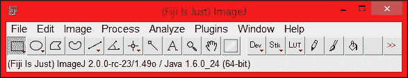
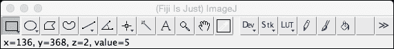
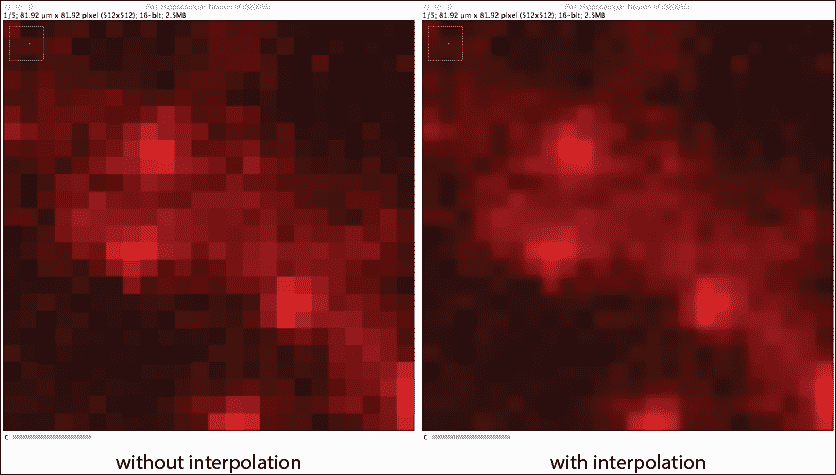

# 第一章. ImageJ 入门

欢迎来到 *ImageJ 图像处理* 第二版。ImageJ 是一个多功能的开源软件包，专为科学图像处理和分析设计。它用 Java 编程语言编写，允许实现统一的跨平台体验。它基于 1987 年在 Macintosh 平台上开发的 NIH Image 软件包，由 Wayne Rasband 开发。Rasband 仍然是 ImageJ 的活跃贡献者，他在 1997 年发布了第一个 ImageJ 分发版。它作为一个项目开发，旨在解决一个问题。2012 年，ImageJ 在《自然方法》杂志上庆祝了它的 25 周年。

# ImageJ 分发版

目前，有基于或扩展原始 ImageJ 的不同分发版。基本的 ImageJ 软件包可在国家卫生研究院的 ImageJ 网站上找到（[`imagej.nih.gov/ij/download.html`](http://imagej.nih.gov/ij/download.html)）。当前软件包的版本是 **版本 1.50b**，网站每月更新。这是 ImageJ 的核心分发版，包含主界面以及所有基本工具，用于加载、查看、处理和导出图像和数据。其他分发版包含这个核心包及其大多数功能，但您需要添加额外的功能和插件来为特定领域创建优化的界面。其中一些其他分发版仍然容易识别为 ImageJ，而其他则提供了完全不同的界面。

根据不同的科学领域，基于 ImageJ 的核心开发了不同的分发版。生命科学领域的主要分发版之一被称为 **Fiji**（Fiji Is Just ImageJ），可以在 Fiji 网站上找到（[`fiji.sc/Fiji`](http://fiji.sc/Fiji)）。Fiji 的基础是 ImageJ，但它附带了一大批预安装的功能（宏和插件），这些功能在生命科学领域的图像处理中常用。它专注于荧光显微镜，内置了分割、可视化和共定位的工具。它还包含图像配准、粒子追踪和超分辨率处理与重建的插件。它还拥有一个广泛的图像格式库，可以打开。这个库包括通过 **Bio-Formats** 插件提供的所有主要获取软件包的专有图像格式，如即将到来的章节所述。这个分发版的优点是它附带的大量插件以及非常用户友好的脚本编辑器。它还为 ImageJ 以及一些插件提供了广泛的更新机制。

对于天文学领域，开发了 ImageJ 的一个不同版本，命名为**AstroImageJ**([`www.astro.louisville.edu/software/astroimagej/`](http://www.astro.louisville.edu/software/astroimagej/))。这个版本采用了 ImageJ 的核心实现，并补充了专门为天文学分析开发的特定插件和宏。它与 ImageJ 不直接兼容。为了这个版本，ImageJ 的核心进行了轻微修改。

从 ImageJ 衍生出来但具有不同用户界面的一个示例是**Icy**([`icy.bioimageanalysis.org/`](http://icy.bioimageanalysis.org/))。Icy 分发版集成了 ImageJ，并且许多插件都是兼容的。然而，并非为 ImageJ 开发的每个插件都能在 Icy 中工作，反之亦然。在 Icy 分发版中，对细胞和点检测与跟踪有很强的重视。对插件开发也有很强的重视。为 Icy 平台开发的插件将按照设计实现文档和自动更新。用户还可以直接从界面中向开发者提供反馈，这是其他基于 ImageJ 的分发版所不具备的功能。一个可能的缺点是它需要安装几个外部库，最重要的是 VTK，这可能会在 Linux 系统上引起问题。

另一个不仅使用 ImageJ 处理数据，还帮助获取数据的分发版本被称为**μManager**，可以在[`www.micro-manager.org/`](https://www.micro-manager.org/)找到。它作为插件从 ImageJ 内部加载，但提供了一个针对图像获取和硬件控制的独特界面。相机和显微镜驱动程序允许控制用于图像获取的支持硬件，然后可以直接输入到 ImageJ 中进行处理和分析。μManager 的一个使用示例是在 Open SPIM 项目中，它被用来控制一个 DIY 光片显微镜，获取图像并处理它们。

# ImageJ 的用途

ImageJ 是一个处理图像和执行分析的优秀工具。它在许多科学同行评审出版物中使用，涵盖生命科学、天文学和物理学等多个领域的 1000 多篇论文。在生命科学中，它用于量化医学图像，以帮助检测病理标志物。它还用于处理和量化来自单细胞或单分子实验的数据，这些实验使用超分辨率技术，如**STORM**和**PALM**。在物理学和工程学中，它用于量化并可视化来自原子力显微镜的数据。在天文学中，ImageJ 用于分析来自望远镜和卫星的图像，并可视化来自观测站的数据。NASA 喷气推进实验室托管了一个中心节点，拥有丰富的数据集，可在[`pds.jpl.nasa.gov/`](http://pds.jpl.nasa.gov/)下载。它包含有关行星任务以及其他研究领域（如大气或小行星）的信息。

由于它支持大量不同的图像格式，它是一个出色的图像查看器，并允许执行大量基于像素的操作。它还支持每个通道大于 8 位或 16 位的位深度图像。然而，它并不适用于除基于像素的操作之外的其他任何用途。如果您想使用基于矢量的操作，那么 ImageJ 不是您需要的工具（除非您想开发这项功能）。

除了常见的图像处理工具，如裁剪、旋转和缩放之外，它还支持多维度图像。可以处理和保存多达五维的图像。这些维度可以包括通道（多种颜色）、帧（时间点）和切片（*Z*平面），以及这些维度的任何组合。目前，不支持多点采集（在更大的*XY*空间中的不同位置）。还可以通过调整亮度、对比度或像素的颜色编码（**查找表**）来改变显示像素的强度。还有更高级的技术来纠正图像采集的伪影，如背景和漂白。

ImageJ 的默认图像格式是**标记图像文件格式**（**TIFF**）。这种格式允许存储多维数据，并支持许多用于校准、数据采集信息和描述的元信息字段。它还可以存储有关叠加等元素的信息。图形注释放置在图像的单独图层上。测量将受益于图像中包含的校准，从而允许以适当的单位快速反馈尺寸。然而，它不太适合不同类型的混合数据，如视频文件。使用**FFMPEG**插件可以打开和保存视频的图像数据，但不能打开音频轨道。编辑仅限于一小套转场和分层技术。对于需要图像和声音的视频编辑，可以使用非线性编辑器。它们允许有更大的控制。

它也可以用作图像转换工具。ImageJ 可以原生地读取许多图像格式，并且借助插件，许多专有格式也可以打开。一旦图像被打开，就可以将其保存为 ImageJ 支持的任何导出格式，包括但不限于 TIF、JPG 和 PNG 等图像格式，以及 AVI 和 MOV 等**时间序列**和**Z 堆栈**格式。它还可以用来改变其他软件导出图像的顺序和/或颜色。然而，它并不是作为一个通用的照片编辑器或非线性视频编辑器，因为它缺乏这些工作流程所需的某些专业工具。

# ImageJ 的当前状态

自 2015 年初以来，ImageJ 已被超过 200 篇出版物引用，涉及从物理学和工程到医学和生物学的各个领域。许多出版物是关于为解决科学某个子领域中的问题而专门开发的插件。在 ImageJ 网站上，列出插件的页面有超过 1000 个插件可供选择。一些研究机构甚至有多个插件的集合，这些插件是在那里作为研究项目开发的。大多数，如果不是全部，都是开源插件，源代码完全可用。你可以调整和定制代码以满足你的需求。

## ImageJ2

ImageJ 仍在积极开发中，并且定期向核心发行版添加新功能和错误修复。目前，正在开发一个改进的 ImageJ 系统。它被称为**ImageJ2**。ImageJ2 的目标是更好地支持多维数据，并创建一个更可扩展的平台，可以作为库而不是独立应用程序使用。它还将创建一个更一致的开发和扩展环境。正在开发的功能之一是 ImageJ 的更新机制。目前，可以使用中央存储库自动更新 ImageJ，ImageJ2 的一个目标是将此选项扩展到插件和其他功能，并允许跟踪错误和功能。然而，新 ImageJ2 系统的一个核心要求是向后兼容性。这个目标意味着现在开发的插件将在 ImageJ 的未来版本中保持功能。当前状态被标记为**beta**，这意味着插件是功能性的，但可能仍然包含错误，并且尚未针对性能进行优化。

## SciFIO 和 OME-XML

与图像相关的其他发展是那些与图像格式和标准相关的。目前，所有主要商业采集平台都使用独特的专有文件格式存储图像数据。SCIFIO 项目旨在创建一个可扩展和集成的接口来处理不同格式的图像。它将支持更多图像格式，并允许在导入数据时设置附加选项，例如自动缩放、加载元数据和以不同的 ImageJ 图像类型加载数据。然而，它仍在积极开发中，并且一些功能在生产环境中（尚未）完全工作。

**OME-XML**（**开放显微镜环境-XML**）项目旨在创建一个包含所有图像和元数据的标准化格式的文件格式。这将促进显微镜图像数据的交换，无论使用何种设备进行采集。它主要关注生命科学领域的显微镜数据交换。它包含所有实验和设置数据以及像素数据，所有这些都在单个文件规范中。

## 生物格式

除了专注于跨多个采集平台集成采集和处理的 OME-XML 格式外，还在积极开发用于导入目前存在的许多图像格式的插件。这个插件被称为 Bio-Formats，主要关注生命科学领域的图像格式。然而，它也支持**FITS**数据，这在天文学和太空探索领域使用。目前，它支持（程度不同）140 种不同的图像格式，并将它们转换为 OME-XML 格式以在 ImageJ 中使用。

# 集成采集和处理环境

由于 ImageJ 是一个如此可扩展的应用程序，用于获取、处理和分析，因此不可能处理所有选项和扩展。在本版中，我将专注于图像处理和分析。我推荐 Fiji 发行版给 ImageJ 的初学者，因为它包含大量有用的功能，可以帮助您快速入门。另一个优点是 Fiji 附带了一个脚本编辑器，它具有许多功能，这些功能也是一些较大的 Java 开发套件所提供的。这些功能主要包括语法高亮和智能缩进。编辑器还包括一系列宏和插件模板，允许您从一个基本框架开始。

# 获取和安装 ImageJ

当前版本的 ImageJ 可以在支持 Java 的任何平台上运行。当您希望使用 ImageJ 或其他发行版时，可以下载适用于您特定操作系统的版本。ImageJ 的发行版可以与预包装的**Java 运行时环境**（**JRE**）一起下载。以下章节将解释如何在三个主要操作系统上获取和安装 ImageJ：Windows、OS X 和 Linux。

## ImageJ 的安装

当您下载 ImageJ 的副本时，可以提供 JRE。如果您已经安装了 JRE 的副本，则可以下载不包含 JRE 的 ImageJ 以实现更快的下载。运行 ImageJ 的最小要求是 JRE 版本 1.6 或更高。对于某些发行版，特别是 Fiji，JRE 必须是 1.6 版本。这种限制是由于 Fiji 附带的上位器当前实现的问题，它无法更新 JRE。这个问题可能在将来得到解决。

由于 ImageJ 自带了其自己的 JRE，因此它可以提取到 USB 驱动器上，并从那里运行而无需安装。系统上的唯一限制取决于图像的大小。ImageJ 直接将图像加载到内存中，因此可用的系统内存需要足够大，以便存储您希望处理的图像。当内存需求超过 3 GB 时，需要 64 位操作系统和 64 位 JRE。

由于 ImageJ 是平台无关的，您可以在所有三个平台上使用相同的版本：Windows、OS X 和 Linux。唯一与平台相关的部分是 JRE；对于每个平台，都有一个特定的 JRE 安装。以下章节将解释如何在每个操作系统中安装 ImageJ。

## 在 Windows 上安装

为了在 Windows 上安装 ImageJ，您可以从 ImageJ 网站下载最新版本，网站地址为**NIH** ([`imagej.nih.gov/ij/download.html`](http://imagej.nih.gov/ij/download.html))，或者从 Fiji 网站下载 ([`Fiji.sc/Downloads`](http://Fiji.sc/Downloads))。当从 NIH 网站下载时，有两个选择：适用于 32 位或 64 位系统的安装程序，以及当您希望在无安装权限的平台运行 ImageJ 时，可以选择 ZIP 存档。

当使用安装程序版本时，通常不建议您将 ImageJ 安装到程序文件文件夹中。当使用程序时，ImageJ 文件夹中的某些文件需要修改，因此当以普通用户身份运行时，可能会出现访问问题。此外，当安装或创建插件时，编译文件需要放置在 ImageJ 文件夹内的插件文件夹中。对于普通（非管理员）用户，此文件夹可能没有写入权限。或者，您可以专门更改 ImageJ 文件夹的访问权限。然而，从安全角度考虑，这并不推荐。

双击提取文件夹中的`ImageJ.exe`文件将启动 ImageJ。此文件是一个包装可执行文件，它调用`ij.jar`文件并使用提供的 JRE 来运行它。Fiji 发行版以 ZIP 存档的形式提供，可以在磁盘上提取并立即运行：



## 在 Mac OS X 上安装

ImageJ 以 ZIP 存档的形式提供，可以提取到应用程序文件夹内的一个文件夹中。Fiji 发行版可以下载为 DMG 文件，可以将其拖放到应用程序文件夹中。这将安装 ImageJ 文件夹，使其对所有注册用户可用。它还会在应用抽屉中创建一个 Fiji 图标。如果您想在 OS X 10.10（Yosemite）下导入或导出 QuickTime 电影，您需要从[`imagej.nih.gov/ij/download/qt/`](http://imagej.nih.gov/ij/download/qt/)下载`QTJava.zip`和`libQTJNative.jnilib`文件到您家目录中的`Library/Java/Extensions`文件夹。

注意，在 OS X 10.7 及更高版本中，您第一次尝试运行 ImageJ 时可能会收到一个警告。这个警告会显示**ImageJ 无法打开，因为它来自未知的开发者**。这可以通过进入系统设置并在安全和隐私面板中点击允许按钮来解决。这应该可以防止将来再次出现此警告。或者，您可以从“允许从以下位置下载应用程序”部分选择“任何位置”选项。从安全角度考虑，不建议选择此选项，因为它也可能允许恶意软件执行。

注意，当 ImageJ（或 Fiji）在 OS X 上运行时，菜单栏不是主窗口的一部分，就像在 Windows 中那样：



## 在 Linux 上安装

ImageJ 可以通过从 NIH 网站解包分发到 Linux 平台。NIH 网站上的分发是 ZIP 文件格式，而 Fiji 分发是 `tar.gz` 文件格式。对于大多数 Linux 发行版，建议你将存档提取到你的家目录内的位置。这可以防止 ImageJ 文件夹上的写权限问题。文件夹中包含一个运行 ImageJ 的 shell 脚本。这个 shell 脚本被命名为 ImageJ。对于不同的桌面环境，存在创建到这个脚本的 shell 快捷方式的方法，以便可以从快捷方式运行它。

# ImageJ 文件夹结构

安装 ImageJ 后，文件夹结构会放置在安装过程中指定的位置。这个文件夹的结构包含几个对 ImageJ 正常运行至关重要的关键文件夹。如果你在一个你没有**写**权限的文件夹中安装了 ImageJ，有两个重要的文件夹需要读写权限才能使 ImageJ 正常工作：`plugins` 和 `macros` 文件夹。此外，Windows 平台上的配置文件（`pref.cfg`）需要用户有写权限。如果没有写权限，设置将无法更改。下一节简要解释了 `plugins` 和 `macros` 文件夹的属性，以及 ImageJ 如何使用它们。

## 插件文件夹

最重要的两个文件夹是 `macros` 和 `plugins` 文件夹。当 ImageJ 加载时，会搜索这两个文件夹以查找可用的宏和插件。当你下载一个插件并将其放置在 `plugins` 文件夹中时，插件将在下一次 ImageJ 启动时被发现。下载插件时，有三种不同的文件选项可供下载：Java 源文件（`.java`）、编译文件（`.class`）或 Java 归档（`.jar`）。为了使插件在插件菜单中显示，`.java` 和 `.class` 文件名中需要至少包含一个下划线字符。对于 `.jar` 文件，归档需要包含一个 `plugins.config` 文件，该文件定义了菜单系统中的位置。这还有一个额外的好处，即 `.jar` 归档中的插件也可以在插件 `menu` 外部安装。下划线在插件菜单中会被替换为空格，或者如果最后一个字符是下划线，则完全删除。如果你将插件放在 `plugins` 文件夹内的一个文件夹中，这个文件夹名称也会出现在 **插件** 菜单中，但只有当它包含至少一个有效的插件时。如果你下载了一个插件的源文件，你可以通过从 **插件** 菜单中选择 **编译和运行** 并选择 Java 文件来创建一个可执行的插件。下一次 ImageJ 运行时，新的插件将被自动检测。

JAR 文件略有特殊。它们可以放置在`plugins`文件夹中，但不必出现在**插件**菜单中。JAR 文件包含一个清单，指定了其中插件的位置。此规范允许开发者将插件放置在**插件**菜单的特定子菜单中，而不管 JAR 文件放置在哪个文件夹。如果您创建了一组希望分组在**插件**菜单中的链接或相关插件，这将特别有用。

## 宏文件夹

宏文件夹包含 ImageJ 附带的一组宏，也是存储用户定义宏的默认位置。ImageJ 宏是具有`.ijm`扩展名的平面文本文件，尽管这个扩展名不是必需的。任何具有有效宏代码的平面文本文件都可以在 ImageJ 中运行。ImageJ 中的宏有自己的语言，类似于 Java，但有一些细微的差异。第五章，“使用 ImageJ 的基本测量”将探讨如何创建宏，并解释 ImageJ 宏中的语言结构。

# 配置新的 ImageJ 安装

安装 ImageJ 后，可以首次启动。在使用 ImageJ 时，需要做一些设置以允许成功处理。最重要的设置之一是 ImageJ 可用的线程数和内存。默认情况下，ImageJ 有 512 MB 的内存可用。这允许打开高达 512 MB 的图像，这对于大量用例来说是可以的。然而，随着当前图像获取的趋势，文件现在往往在 1 GB 或更多。因此，首先要做的是将 ImageJ 的内存设置为至少您认为需要处理的最大的图像大小。另一方面，Fiji 在安装时会自动分配可用系统内存的 50%，如果需要可以更改。

要设置分配给 ImageJ 的内存，您可以在**编辑** | **选项** | **内存和线程…**下找到内存设置。您可以设置最大内存为小于系统内存的任何值。请注意，在 32 位系统上，无法分配超过 3 GB 的内存。如果您希望分配超过 3 GB 的内存，则需要在一个 64 位操作系统上安装 64 位 ImageJ。

还可以使用命令行参数在启动 ImageJ 时传递内存大小。为此，使用以下命令从命令行运行 ImageJ：

```java
javaw –Xmx1024m -cp ij.jar ij.ImageJ

```

这告诉计算机以 1024 MB (`1024m`) 的内存运行 ImageJ。如果您需要更多，则可以将`1024m`的值更改为任何合适的值。但是，请确保您不会使用超过系统可用的内存。

另一个需要验证的重要设置是在**外观**对话框中。对于图像处理，**缩放图像时插值**选项应该取消选中。当处理图像时，此选项可能会干扰或给出误导性的结果：



如果你打算处理包含大量白色像素的图像，建议你将选择颜色更改为默认黄色以外的其他值。这可以通过在首选项中的**颜色**设置中完成。在许多情况下，橙色或绿色是良好的默认值。

# 摘要

在本章中，我们探讨了 ImageJ 的起源和使用，讨论了如何在不同的平台上下载和安装它。我们查看了 ImageJ 安装的基本文件夹结构，并为其配置了使用。现在一切应该设置妥当，可以开始图像处理的初步步骤。
